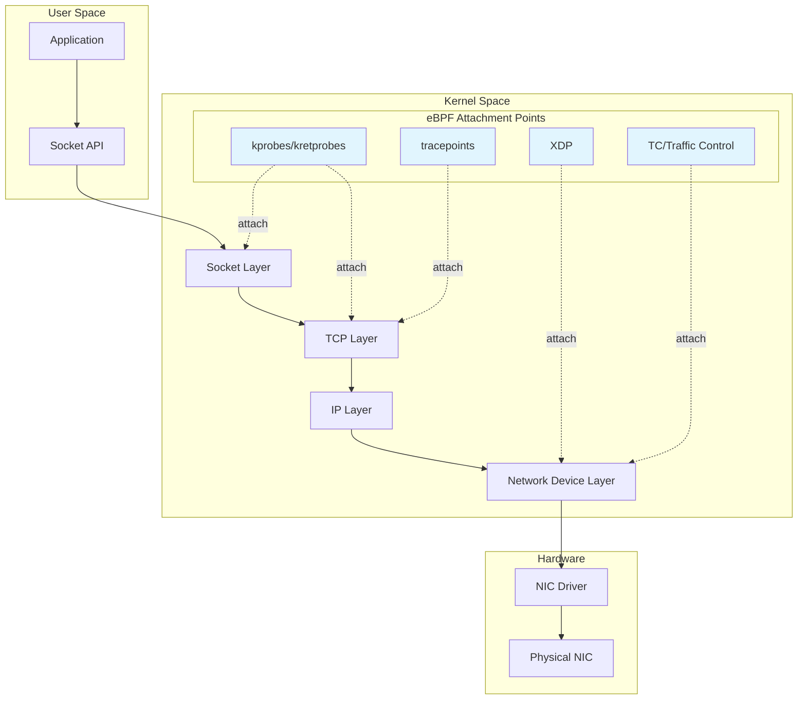
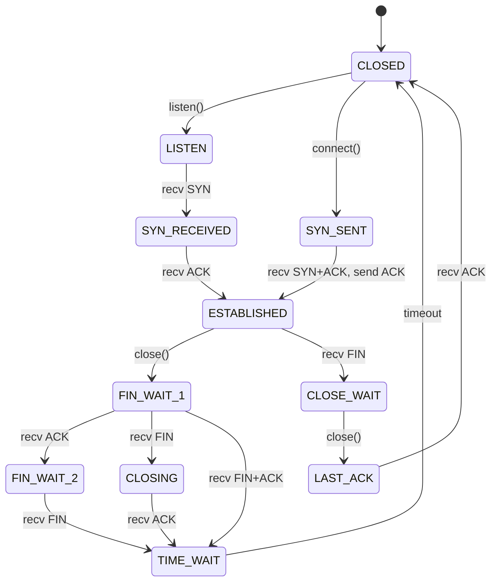
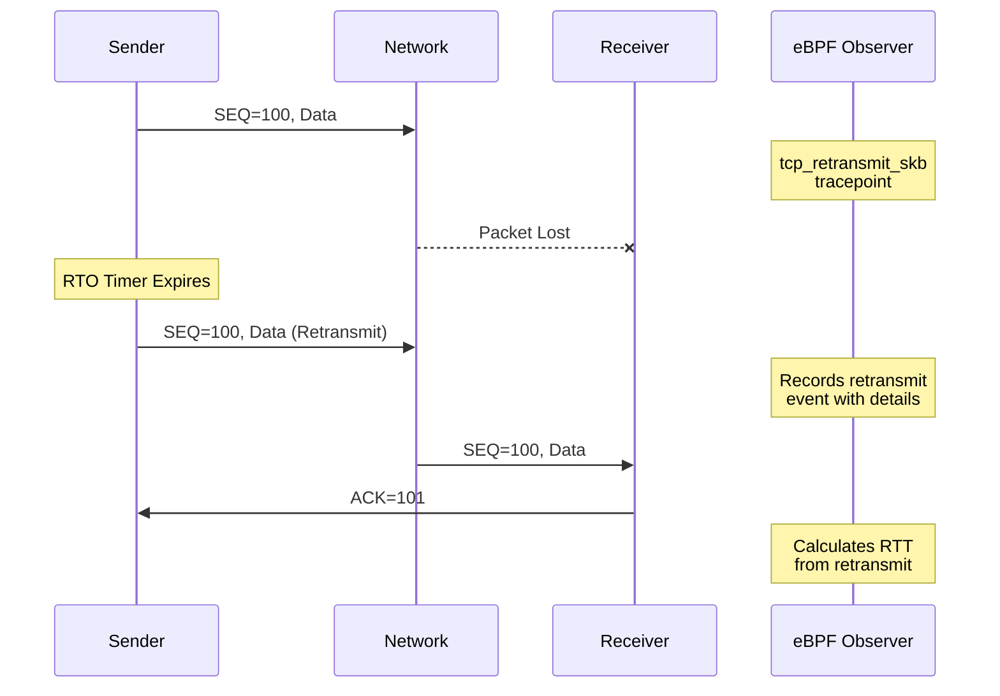
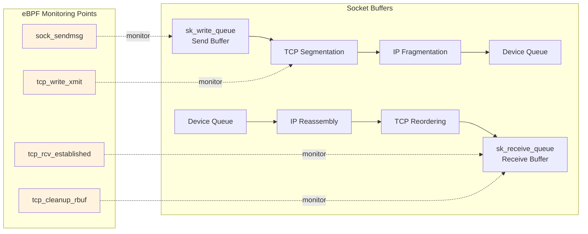
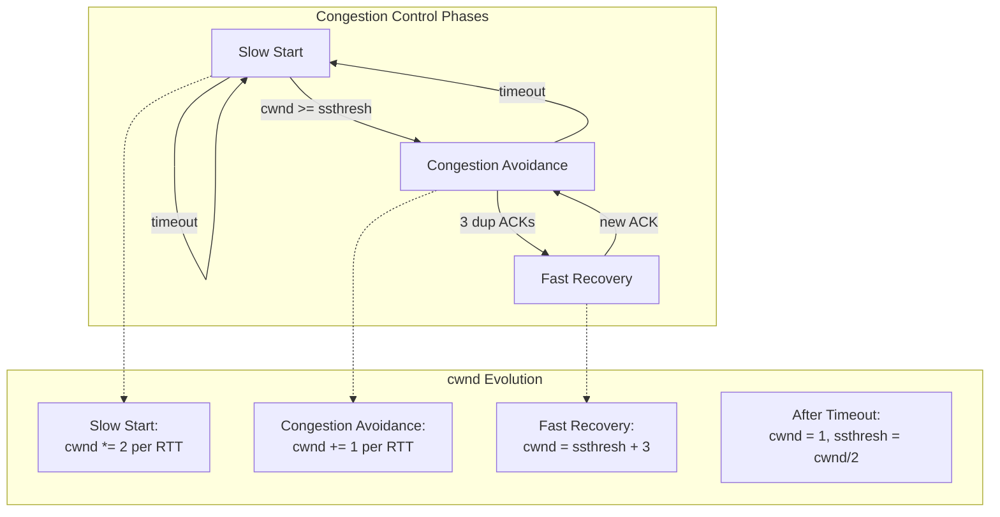

# How to Analyze TCP/IP Stack Performance with eBPF

Author: [nawazdhandala](https://github.com/nawazdhandala)

Tags: eBPF, TCP/IP, Networking, Performance, Linux, Debugging

Description: A guide to using eBPF for deep TCP/IP stack analysis and network performance debugging.

---

## Introduction

Understanding TCP/IP stack performance is crucial for diagnosing network issues, optimizing application throughput, and ensuring reliable communication in distributed systems. Traditional tools like `tcpdump`, `netstat`, and `ss` provide valuable insights, but they often lack the depth needed to understand kernel-level network behavior.

eBPF (extended Berkeley Packet Filter) revolutionizes network analysis by allowing you to safely run custom programs within the Linux kernel. This gives you unprecedented visibility into the TCP/IP stack without modifying kernel source code or loading kernel modules.

In this comprehensive guide, we will explore how to use eBPF to:

- Trace TCP connection lifecycle events
- Analyze retransmissions and packet loss
- Measure network latency at various stack layers
- Monitor socket buffer utilization
- Track TCP congestion window dynamics

## Understanding the TCP/IP Stack Architecture

Before diving into eBPF instrumentation, let's understand the Linux TCP/IP stack architecture and the key observation points.

The following diagram illustrates the Linux TCP/IP stack layers and where eBPF can attach for monitoring:



## Prerequisites

Before starting, ensure you have the following installed on your Linux system:

The following commands will install the necessary tools for eBPF development including BCC (BPF Compiler Collection), bpftrace, and Linux headers for your kernel version:

```bash
# Install BCC tools (Ubuntu/Debian)
sudo apt-get update
sudo apt-get install -y bpfcc-tools linux-headers-$(uname -r)

# Install bpftrace
sudo apt-get install -y bpftrace

# Install libbpf development files
sudo apt-get install -y libbpf-dev

# Verify eBPF support
sudo bpftool feature probe kernel
```

For other distributions, consult your package manager or build from source.

## TCP Connection Tracing

### Understanding TCP Connection States

TCP connections go through various states during their lifecycle. eBPF allows us to observe these transitions in real-time.

The following diagram shows the TCP state machine with all possible state transitions that we can monitor with eBPF:



### Tracing New TCP Connections

This eBPF program uses kprobes to trace new TCP connections by attaching to the `tcp_v4_connect` and `tcp_v6_connect` kernel functions. It captures source/destination addresses, ports, and the process initiating the connection:

```c
// tcp_connect_trace.bpf.c
// This program traces TCP connection attempts using kprobes
// It attaches to tcp_v4_connect and tcp_v6_connect kernel functions

#include <linux/bpf.h>
#include <linux/ptrace.h>
#include <linux/socket.h>
#include <linux/tcp.h>
#include <bpf/bpf_helpers.h>
#include <bpf/bpf_tracing.h>
#include <bpf/bpf_core_read.h>

// Structure to hold connection event data
// This will be sent to userspace via a perf buffer
struct connect_event {
    __u32 pid;           // Process ID initiating the connection
    __u32 uid;           // User ID of the process
    __u32 saddr;         // Source IPv4 address
    __u32 daddr;         // Destination IPv4 address
    __u16 sport;         // Source port (ephemeral)
    __u16 dport;         // Destination port
    char comm[16];       // Process command name
};

// Perf event array map for sending events to userspace
// This allows efficient data transfer without polling
struct {
    __uint(type, BPF_MAP_TYPE_PERF_EVENT_ARRAY);
    __uint(key_size, sizeof(__u32));
    __uint(value_size, sizeof(__u32));
} events SEC(".maps");

// Hash map to temporarily store socket pointers between entry and return
// Key: thread ID, Value: socket pointer
// This is needed because we get different information at entry vs return
struct {
    __uint(type, BPF_MAP_TYPE_HASH);
    __uint(max_entries, 4096);
    __type(key, __u64);
    __type(value, struct sock *);
} sock_store SEC(".maps");

// Kprobe attached to tcp_v4_connect entry
// At this point, we save the socket pointer for later use
SEC("kprobe/tcp_v4_connect")
int BPF_KPROBE(tcp_v4_connect_entry, struct sock *sk)
{
    // Get the thread group ID (PID in userspace terms)
    __u64 pid_tgid = bpf_get_current_pid_tgid();

    // Store the socket pointer, indexed by thread ID
    // We'll retrieve this in the return probe
    bpf_map_update_elem(&sock_store, &pid_tgid, &sk, BPF_ANY);

    return 0;
}

// Kretprobe attached to tcp_v4_connect return
// Here we have access to connection details and can emit the event
SEC("kretprobe/tcp_v4_connect")
int BPF_KRETPROBE(tcp_v4_connect_return, int ret)
{
    __u64 pid_tgid = bpf_get_current_pid_tgid();
    struct sock **skpp;
    struct sock *sk;
    struct connect_event event = {};

    // Retrieve the socket pointer we stored earlier
    skpp = bpf_map_lookup_elem(&sock_store, &pid_tgid);
    if (!skpp) {
        return 0;  // Socket not found, possibly a race condition
    }
    sk = *skpp;

    // Clean up the stored socket pointer
    bpf_map_delete_elem(&sock_store, &pid_tgid);

    // Only trace successful connection attempts
    // ret != 0 means the connect call failed immediately
    if (ret != 0) {
        return 0;
    }

    // Fill in the event structure with connection details
    event.pid = pid_tgid >> 32;  // Upper 32 bits contain PID
    event.uid = bpf_get_current_uid_gid() & 0xFFFFFFFF;

    // Read socket addresses using BPF CO-RE (Compile Once, Run Everywhere)
    // This handles kernel structure differences across versions
    BPF_CORE_READ_INTO(&event.saddr, sk, __sk_common.skc_rcv_saddr);
    BPF_CORE_READ_INTO(&event.daddr, sk, __sk_common.skc_daddr);
    BPF_CORE_READ_INTO(&event.dport, sk, __sk_common.skc_dport);

    // Source port needs byte order conversion
    __u16 sport;
    BPF_CORE_READ_INTO(&sport, sk, __sk_common.skc_num);
    event.sport = sport;
    event.dport = __bpf_ntohs(event.dport);

    // Get the process name for easier identification
    bpf_get_current_comm(&event.comm, sizeof(event.comm));

    // Send the event to userspace via the perf buffer
    bpf_perf_event_output(ctx, &events, BPF_F_CURRENT_CPU,
                          &event, sizeof(event));

    return 0;
}

// License declaration required for eBPF programs
char LICENSE[] SEC("license") = "GPL";
```

### Using bpftrace for Quick TCP Tracing

For rapid prototyping and one-liner analysis, bpftrace provides a simpler approach. The following script traces all new TCP connections, showing the process name, PID, and connection details:

```bash
#!/usr/bin/env bpftrace

// tcp_connect.bt
// Quick one-liner to trace TCP connection attempts
// Shows process name, PID, and connection 4-tuple

// Attach to the tcp_connect tracepoint which fires on connection attempts
// This is more stable than kprobes as tracepoints are part of the kernel ABI
tracepoint:tcp:tcp_connect
{
    // Format: process_name (PID) -> destination_ip:port
    // args->saddr and args->daddr contain the IP addresses
    // args->sport and args->dport contain the ports
    printf("%-16s %-6d %s:%d -> %s:%d\n",
        comm,                              // Process command name
        pid,                               // Process ID
        ntop(args->saddr),                // Source IP (network to presentation)
        args->sport,                       // Source port
        ntop(args->daddr),                // Destination IP
        args->dport);                      // Destination port
}
```

Run this script with:

```bash
sudo bpftrace tcp_connect.bt
```

### Tracking TCP State Changes

This bpftrace script monitors TCP state transitions using the `sock:inet_sock_set_state` tracepoint, which is invaluable for debugging connection issues:

```bash
#!/usr/bin/env bpftrace

// tcp_states.bt
// Traces TCP state machine transitions
// Useful for debugging connection establishment and teardown issues

// Map numeric states to human-readable names
// These correspond to the TCP_* constants in the kernel
BEGIN
{
    // Initialize state name mapping
    @states[1] = "ESTABLISHED";
    @states[2] = "SYN_SENT";
    @states[3] = "SYN_RECV";
    @states[4] = "FIN_WAIT1";
    @states[5] = "FIN_WAIT2";
    @states[6] = "TIME_WAIT";
    @states[7] = "CLOSE";
    @states[8] = "CLOSE_WAIT";
    @states[9] = "LAST_ACK";
    @states[10] = "LISTEN";
    @states[11] = "CLOSING";
    @states[12] = "NEW_SYN_RECV";

    printf("Tracing TCP state changes... Ctrl-C to exit\n");
    printf("%-8s %-16s %-20s %-20s %s\n",
           "TIME", "COMM", "LADDR:PORT", "RADDR:PORT", "STATE_CHANGE");
}

// Trace socket state changes for TCP (protocol family AF_INET = 2)
// This tracepoint fires whenever a TCP socket changes state
tracepoint:sock:inet_sock_set_state
/args->protocol == IPPROTO_TCP/
{
    // Extract source and destination from the tracepoint arguments
    $laddr = ntop(args->saddr);
    $raddr = ntop(args->daddr);

    // Calculate elapsed time since script start
    $now = nsecs / 1000000;  // Convert to milliseconds

    // Print the state transition with connection details
    printf("%-8llu %-16s %s:%-5d -> %s:%-5d %s -> %s\n",
        $now,
        comm,
        $laddr, args->sport,
        $raddr, args->dport,
        @states[args->oldstate],
        @states[args->newstate]);

    // Count transitions for summary statistics
    @transition_count[@states[args->oldstate], @states[args->newstate]] =
        count();
}

// Print summary on exit
END
{
    clear(@states);
    printf("\n\nState Transition Summary:\n");
}
```

## Retransmit and Latency Analysis

### Understanding TCP Retransmissions

TCP retransmissions occur when packets are lost or acknowledgments don't arrive in time. High retransmission rates indicate network congestion, packet loss, or connectivity issues.

The following diagram illustrates the TCP retransmission flow and the eBPF observation points:



### Tracing TCP Retransmissions

This eBPF program traces TCP retransmissions using the kernel tracepoint, providing detailed information about which connections are experiencing packet loss:

```c
// tcp_retransmit.bpf.c
// Traces TCP retransmission events to identify packet loss
// Uses the tcp:tcp_retransmit_skb tracepoint for stability

#include <linux/bpf.h>
#include <linux/tcp.h>
#include <bpf/bpf_helpers.h>
#include <bpf/bpf_tracing.h>
#include <bpf/bpf_core_read.h>

// Retransmission event structure
// Contains all relevant information for analysis
struct retransmit_event {
    __u64 timestamp_ns;   // Kernel timestamp for correlation
    __u32 pid;            // Process ID (may be 0 for kernel-initiated)
    __u32 saddr;          // Source IP address
    __u32 daddr;          // Destination IP address
    __u16 sport;          // Source port
    __u16 dport;          // Destination port
    __u32 seq;            // Sequence number being retransmitted
    __u32 state;          // TCP state at time of retransmit
    __u8 retrans_count;   // Number of retransmissions for this segment
    char comm[16];        // Process name
};

// Ring buffer for high-performance event delivery
// More efficient than perf buffers for high-volume events
struct {
    __uint(type, BPF_MAP_TYPE_RINGBUF);
    __uint(max_entries, 256 * 1024);  // 256KB buffer
} rb SEC(".maps");

// Per-connection retransmit counter
// Key: connection 4-tuple hash, Value: retransmit count
struct {
    __uint(type, BPF_MAP_TYPE_HASH);
    __uint(max_entries, 10240);
    __type(key, __u64);
    __type(value, __u64);
} retrans_count SEC(".maps");

// Helper to create a simple hash from connection tuple
static __always_inline __u64
conn_hash(__u32 saddr, __u32 daddr, __u16 sport, __u16 dport)
{
    // Simple hash combining all four elements
    return ((__u64)saddr << 32 | daddr) ^ ((__u64)sport << 16 | dport);
}

// Tracepoint for TCP retransmissions
// Fires every time the kernel retransmits a segment
SEC("tp/tcp/tcp_retransmit_skb")
int handle_retransmit(struct trace_event_raw_tcp_event_sk_skb *ctx)
{
    struct retransmit_event *event;
    struct sock *sk;
    struct tcp_sock *tp;

    // Reserve space in the ring buffer
    event = bpf_ringbuf_reserve(&rb, sizeof(*event), 0);
    if (!event) {
        return 0;  // Buffer full, drop event
    }

    // Get current timestamp for timing analysis
    event->timestamp_ns = bpf_ktime_get_ns();
    event->pid = bpf_get_current_pid_tgid() >> 32;
    bpf_get_current_comm(&event->comm, sizeof(event->comm));

    // Read connection details from the socket
    // The socket pointer is available in the tracepoint context
    sk = (struct sock *)ctx->skaddr;

    BPF_CORE_READ_INTO(&event->saddr, sk, __sk_common.skc_rcv_saddr);
    BPF_CORE_READ_INTO(&event->daddr, sk, __sk_common.skc_daddr);
    BPF_CORE_READ_INTO(&event->sport, sk, __sk_common.skc_num);
    BPF_CORE_READ_INTO(&event->dport, sk, __sk_common.skc_dport);
    event->dport = __bpf_ntohs(event->dport);

    // Get TCP-specific information
    tp = (struct tcp_sock *)sk;
    BPF_CORE_READ_INTO(&event->state, sk, __sk_common.skc_state);

    // Read retransmit count from TCP socket
    __u8 retrans;
    BPF_CORE_READ_INTO(&retrans, tp, retrans_out);
    event->retrans_count = retrans;

    // Update per-connection counter
    __u64 key = conn_hash(event->saddr, event->daddr,
                          event->sport, event->dport);
    __u64 *count = bpf_map_lookup_elem(&retrans_count, &key);
    if (count) {
        __sync_fetch_and_add(count, 1);
    } else {
        __u64 init = 1;
        bpf_map_update_elem(&retrans_count, &key, &init, BPF_ANY);
    }

    // Submit the event to userspace
    bpf_ringbuf_submit(event, 0);

    return 0;
}

char LICENSE[] SEC("license") = "GPL";
```

### Measuring TCP Round-Trip Time (RTT)

RTT is crucial for understanding network latency. This bpftrace script extracts RTT information from the kernel's TCP metrics:

```bash
#!/usr/bin/env bpftrace

// tcp_rtt.bt
// Measures and reports TCP Round-Trip Time (RTT) statistics
// Uses the tcp_rcv_established function to capture RTT updates

#include <net/sock.h>
#include <linux/tcp.h>

// Print header on start
BEGIN
{
    printf("Tracing TCP RTT... Ctrl-C to exit\n");
    printf("%-8s %-20s %-20s %10s %10s %10s\n",
           "TIME(s)", "LADDR:LPORT", "RADDR:RPORT",
           "RTT(us)", "RTTVar", "MinRTT");
}

// Attach to tcp_rcv_established which processes incoming packets
// on established connections - RTT is updated here
kprobe:tcp_rcv_established
{
    // Get the socket from the first argument
    $sk = (struct sock *)arg0;
    $tp = (struct tcp_sock *)$sk;

    // Only process if we have valid RTT data
    // srtt_us is the smoothed RTT in microseconds (<<3 for precision)
    $srtt = $tp->srtt_us >> 3;

    if ($srtt > 0) {
        // Extract connection information
        $laddr = ntop($sk->__sk_common.skc_rcv_saddr);
        $raddr = ntop($sk->__sk_common.skc_daddr);
        $lport = $sk->__sk_common.skc_num;
        $rport = $sk->__sk_common.skc_dport;

        // mdev_us is RTT variance, also scaled
        $rttvar = $tp->mdev_us >> 2;

        // min_rtt is the minimum observed RTT
        $minrtt = $tp->rtt_min.s[0].v;

        // Print RTT statistics for this connection
        printf("%-8llu %s:%-5d      %s:%-5d      %10llu %10llu %10llu\n",
               elapsed / 1000000000,
               $laddr, $lport,
               $raddr, ntohs($rport),
               $srtt,
               $rttvar,
               $minrtt);

        // Store in histogram for aggregate analysis
        @rtt_hist = hist($srtt);

        // Track per-destination RTT
        @rtt_by_dest[$raddr] = avg($srtt);
    }
}

// Print summary statistics on exit
END
{
    printf("\n\nRTT Distribution (microseconds):\n");
    print(@rtt_hist);

    printf("\nAverage RTT by Destination:\n");
    print(@rtt_by_dest);

    clear(@rtt_hist);
    clear(@rtt_by_dest);
}
```

### Latency Breakdown by Stack Layer

For comprehensive latency analysis, we can measure time spent at each layer. This script shows where packets spend time in the stack:

```bash
#!/usr/bin/env bpftrace

// tcp_latency_breakdown.bt
// Measures latency at different layers of the TCP/IP stack
// Helps identify which layer is causing delays

#include <linux/skbuff.h>

// Track packet entry times at each layer
// Using skb pointer as the key

// When packet enters IP layer from device
kprobe:ip_rcv
{
    $skb = (struct sk_buff *)arg0;
    @ip_entry[$skb] = nsecs;
}

// When packet moves from IP to TCP layer
kprobe:tcp_v4_rcv
{
    $skb = (struct sk_buff *)arg0;
    $now = nsecs;

    // Calculate time spent in IP layer
    $ip_start = @ip_entry[$skb];
    if ($ip_start > 0) {
        $ip_time = ($now - $ip_start) / 1000;  // Convert to microseconds
        @ip_latency = hist($ip_time);
        delete(@ip_entry[$skb]);
    }

    // Mark TCP entry time
    @tcp_entry[$skb] = $now;
}

// When packet processing reaches socket layer
kprobe:tcp_rcv_established
{
    $sk = (struct sock *)arg0;
    $skb = (struct sk_buff *)arg1;
    $now = nsecs;

    // Calculate time spent in TCP layer
    $tcp_start = @tcp_entry[$skb];
    if ($tcp_start > 0) {
        $tcp_time = ($now - $tcp_start) / 1000;
        @tcp_latency = hist($tcp_time);
        delete(@tcp_entry[$skb]);
    }
}

// Clean up and show results
END
{
    printf("\n=== IP Layer Latency (microseconds) ===\n");
    print(@ip_latency);

    printf("\n=== TCP Layer Latency (microseconds) ===\n");
    print(@tcp_latency);

    // Clean up maps
    clear(@ip_entry);
    clear(@tcp_entry);
    clear(@ip_latency);
    clear(@tcp_latency);
}
```

## Socket Buffer Monitoring

### Understanding Socket Buffers

Socket buffers (sk_buffs) are fundamental to Linux networking. Monitoring their usage helps identify memory pressure and buffer-related performance issues.

The following diagram shows the socket buffer architecture and data flow:



### Monitoring Send Buffer Usage

This eBPF program monitors TCP send buffer utilization to detect applications that are write-blocked due to full buffers:

```c
// tcp_sendbuf_monitor.bpf.c
// Monitors TCP send buffer usage and detects buffer pressure
// Helps identify applications experiencing send-side backpressure

#include <linux/bpf.h>
#include <linux/tcp.h>
#include <bpf/bpf_helpers.h>
#include <bpf/bpf_tracing.h>
#include <bpf/bpf_core_read.h>

// Buffer status event sent to userspace
struct buffer_event {
    __u64 timestamp_ns;
    __u32 pid;
    __u32 saddr;
    __u32 daddr;
    __u16 sport;
    __u16 dport;
    __u32 wmem_queued;     // Bytes in send queue
    __u32 sndbuf;          // Total send buffer size
    __u32 sk_wmem_alloc;   // Write memory allocated
    __u8 buffer_full;      // Flag: is buffer full?
    char comm[16];
};

// Histogram buckets for buffer utilization
// Key: utilization percentage (0-100), Value: count
struct {
    __uint(type, BPF_MAP_TYPE_ARRAY);
    __uint(max_entries, 101);  // 0-100%
    __type(key, __u32);
    __type(value, __u64);
} utilization_hist SEC(".maps");

// Ring buffer for events
struct {
    __uint(type, BPF_MAP_TYPE_RINGBUF);
    __uint(max_entries, 256 * 1024);
} rb SEC(".maps");

// Threshold for alerting (percentage)
#define ALERT_THRESHOLD 80

// Trace tcp_sendmsg to monitor send operations
// This is called when application writes to socket
SEC("kprobe/tcp_sendmsg")
int BPF_KPROBE(tcp_sendmsg_entry, struct sock *sk,
               struct msghdr *msg, size_t size)
{
    struct tcp_sock *tp = (struct tcp_sock *)sk;
    struct buffer_event *event;

    // Read current buffer state
    __u32 wmem_queued, sndbuf, wmem_alloc;
    BPF_CORE_READ_INTO(&wmem_queued, sk, sk_wmem_queued);
    BPF_CORE_READ_INTO(&sndbuf, sk, sk_sndbuf);
    BPF_CORE_READ_INTO(&wmem_alloc, sk, sk_wmem_alloc.refs.counter);

    // Calculate utilization percentage
    __u32 utilization = 0;
    if (sndbuf > 0) {
        utilization = (wmem_queued * 100) / sndbuf;
        if (utilization > 100) utilization = 100;
    }

    // Update histogram
    __u64 *count = bpf_map_lookup_elem(&utilization_hist, &utilization);
    if (count) {
        __sync_fetch_and_add(count, 1);
    }

    // Only emit detailed event if above threshold
    if (utilization >= ALERT_THRESHOLD) {
        event = bpf_ringbuf_reserve(&rb, sizeof(*event), 0);
        if (!event) {
            return 0;
        }

        event->timestamp_ns = bpf_ktime_get_ns();
        event->pid = bpf_get_current_pid_tgid() >> 32;
        bpf_get_current_comm(&event->comm, sizeof(event->comm));

        BPF_CORE_READ_INTO(&event->saddr, sk, __sk_common.skc_rcv_saddr);
        BPF_CORE_READ_INTO(&event->daddr, sk, __sk_common.skc_daddr);
        BPF_CORE_READ_INTO(&event->sport, sk, __sk_common.skc_num);
        BPF_CORE_READ_INTO(&event->dport, sk, __sk_common.skc_dport);
        event->dport = __bpf_ntohs(event->dport);

        event->wmem_queued = wmem_queued;
        event->sndbuf = sndbuf;
        event->sk_wmem_alloc = wmem_alloc;
        event->buffer_full = (utilization >= 95) ? 1 : 0;

        bpf_ringbuf_submit(event, 0);
    }

    return 0;
}

char LICENSE[] SEC("license") = "GPL";
```

### Monitoring Receive Buffer Usage

This bpftrace script monitors receive buffer status to detect applications that are slow to read data:

```bash
#!/usr/bin/env bpftrace

// tcp_recvbuf_monitor.bt
// Monitors TCP receive buffer usage
// Identifies slow consumers and potential receive buffer pressure

#include <net/sock.h>
#include <linux/tcp.h>

BEGIN
{
    printf("Monitoring TCP receive buffer usage...\n");
    printf("%-8s %-16s %-22s %10s %10s %6s\n",
           "TIME", "COMM", "CONNECTION", "RCV_QUEUED", "RCVBUF", "UTIL%");
}

// Monitor tcp_recvmsg which is called when app reads from socket
kprobe:tcp_recvmsg
{
    $sk = (struct sock *)arg0;
    $tp = (struct tcp_sock *)$sk;

    // Get receive queue length
    // rmem_alloc contains total memory in receive queue
    $rmem_alloc = $sk->sk_backlog.rmem_alloc.counter;
    $rcvbuf = $sk->sk_rcvbuf;

    // Calculate utilization
    $util = ($rmem_alloc * 100) / $rcvbuf;

    // Only report if significant data is queued
    if ($rmem_alloc > 1000) {
        $laddr = ntop($sk->__sk_common.skc_rcv_saddr);
        $lport = $sk->__sk_common.skc_num;
        $raddr = ntop($sk->__sk_common.skc_daddr);
        $rport = ntohs($sk->__sk_common.skc_dport);

        printf("%-8llu %-16s %s:%d->%s:%d %10d %10d %5d%%\n",
               elapsed / 1000000000,
               comm,
               $laddr, $lport, $raddr, $rport,
               $rmem_alloc,
               $rcvbuf,
               $util);

        // Track high utilization events
        if ($util > 80) {
            @high_util[comm] = count();
        }
    }

    // Aggregate statistics
    @rcv_util = hist($util);
}

END
{
    printf("\n\nReceive Buffer Utilization Distribution:\n");
    print(@rcv_util);

    printf("\nProcesses with high buffer utilization (>80%%):\n");
    print(@high_util);

    clear(@rcv_util);
    clear(@high_util);
}
```

### Detecting Buffer Drops

When buffers are full, packets get dropped. This script detects such drops:

```bash
#!/usr/bin/env bpftrace

// tcp_buffer_drops.bt
// Detects and reports TCP buffer drops
// These occur when send or receive buffers are exhausted

BEGIN
{
    printf("Tracing TCP buffer drops... Ctrl-C to exit\n");
}

// Trace sock_rfree which is called when receive buffer is freed
// If called with drop flag, indicates receive buffer overflow
tracepoint:sock:sock_rcvqueue_full
{
    printf("RECV DROP: pid=%d comm=%s sk=%p\n",
           pid, comm, args->sk);
    @rcv_drops[comm] = count();
}

// Trace tcp_drop which is a general TCP drop tracepoint
// Available in newer kernels
tracepoint:tcp:tcp_drop
{
    $sk = (struct sock *)args->skaddr;

    printf("TCP DROP: reason=%d sk=%p family=%d\n",
           args->reason, args->skaddr, args->family);

    // Categorize drops by reason
    @drop_reasons[args->reason] = count();
}

// Monitor skb_drop_reason tracepoint (kernel 5.17+)
// Provides detailed drop reason
tracepoint:skb:kfree_skb
/args->reason != 1/  // 1 = SKB_CONSUMED (normal)
{
    printf("SKB DROP: reason=%d protocol=%d\n",
           args->reason, args->protocol);
    @skb_drop_reasons[args->reason] = count();
}

END
{
    printf("\n\n=== Receive Queue Full Events by Process ===\n");
    print(@rcv_drops);

    printf("\n=== TCP Drop Reasons ===\n");
    print(@drop_reasons);

    printf("\n=== SKB Drop Reasons ===\n");
    print(@skb_drop_reasons);

    clear(@rcv_drops);
    clear(@drop_reasons);
    clear(@skb_drop_reasons);
}
```

## Congestion Window Tracking

### Understanding TCP Congestion Control

The congestion window (cwnd) controls how much data TCP can send before waiting for acknowledgments. Monitoring cwnd behavior helps understand throughput limitations.

The following diagram illustrates TCP congestion window behavior during different phases:



### Tracing Congestion Window Changes

This eBPF program tracks congestion window changes to understand throughput dynamics:

```c
// tcp_cwnd_trace.bpf.c
// Traces TCP congestion window changes
// Essential for understanding throughput behavior

#include <linux/bpf.h>
#include <linux/tcp.h>
#include <bpf/bpf_helpers.h>
#include <bpf/bpf_tracing.h>
#include <bpf/bpf_core_read.h>

// Congestion window event
struct cwnd_event {
    __u64 timestamp_ns;
    __u32 saddr;
    __u32 daddr;
    __u16 sport;
    __u16 dport;
    __u32 snd_cwnd;        // Current congestion window (segments)
    __u32 snd_ssthresh;    // Slow start threshold
    __u32 snd_wnd;         // Send window (receiver advertised)
    __u32 srtt_us;         // Smoothed RTT
    __u32 packets_out;     // Packets in flight
    __u8 ca_state;         // Congestion avoidance state
};

// Ring buffer for events
struct {
    __uint(type, BPF_MAP_TYPE_RINGBUF);
    __uint(max_entries, 256 * 1024);
} rb SEC(".maps");

// Map to track previous cwnd for change detection
// Key: connection hash, Value: previous cwnd
struct {
    __uint(type, BPF_MAP_TYPE_HASH);
    __uint(max_entries, 10240);
    __type(key, __u64);
    __type(value, __u32);
} prev_cwnd SEC(".maps");

// Helper for connection hash
static __always_inline __u64
conn_hash(__u32 saddr, __u32 daddr, __u16 sport, __u16 dport)
{
    return ((__u64)saddr << 32 | daddr) ^ ((__u64)sport << 16 | dport);
}

// Trace tcp_cong_control which is called to adjust cwnd
// This is the main congestion control entry point
SEC("kprobe/tcp_cong_control")
int BPF_KPROBE(tcp_cong_control_entry, struct sock *sk,
               __u32 ack, __u32 acked_sacked,
               int flag, const struct rate_sample *rs)
{
    struct tcp_sock *tp = (struct tcp_sock *)sk;
    struct cwnd_event *event;

    // Read current cwnd
    __u32 snd_cwnd;
    BPF_CORE_READ_INTO(&snd_cwnd, tp, snd_cwnd);

    // Get connection identifiers
    __u32 saddr, daddr;
    __u16 sport, dport;
    BPF_CORE_READ_INTO(&saddr, sk, __sk_common.skc_rcv_saddr);
    BPF_CORE_READ_INTO(&daddr, sk, __sk_common.skc_daddr);
    BPF_CORE_READ_INTO(&sport, sk, __sk_common.skc_num);
    BPF_CORE_READ_INTO(&dport, sk, __sk_common.skc_dport);
    dport = __bpf_ntohs(dport);

    // Check if cwnd changed from last observation
    __u64 key = conn_hash(saddr, daddr, sport, dport);
    __u32 *prev = bpf_map_lookup_elem(&prev_cwnd, &key);

    if (prev && *prev == snd_cwnd) {
        // No change, skip event
        return 0;
    }

    // Update previous value
    bpf_map_update_elem(&prev_cwnd, &key, &snd_cwnd, BPF_ANY);

    // Emit event
    event = bpf_ringbuf_reserve(&rb, sizeof(*event), 0);
    if (!event) {
        return 0;
    }

    event->timestamp_ns = bpf_ktime_get_ns();
    event->saddr = saddr;
    event->daddr = daddr;
    event->sport = sport;
    event->dport = dport;
    event->snd_cwnd = snd_cwnd;

    // Read additional congestion control state
    BPF_CORE_READ_INTO(&event->snd_ssthresh, tp, snd_ssthresh);
    BPF_CORE_READ_INTO(&event->snd_wnd, tp, snd_wnd);
    BPF_CORE_READ_INTO(&event->srtt_us, tp, srtt_us);
    event->srtt_us = event->srtt_us >> 3;  // Unscale
    BPF_CORE_READ_INTO(&event->packets_out, tp, packets_out);

    // Read congestion avoidance state
    // 0=Open, 1=Disorder, 2=CWR, 3=Recovery, 4=Loss
    __u8 ca_state;
    BPF_CORE_READ_INTO(&ca_state, tp, inet_conn.icsk_ca_state);
    event->ca_state = ca_state;

    bpf_ringbuf_submit(event, 0);

    return 0;
}

char LICENSE[] SEC("license") = "GPL";
```

### Real-Time Congestion Window Visualization

This bpftrace script provides real-time visibility into congestion window behavior:

```bash
#!/usr/bin/env bpftrace

// tcp_cwnd_live.bt
// Real-time congestion window monitoring
// Shows cwnd evolution for active connections

#include <linux/tcp.h>
#include <net/sock.h>

BEGIN
{
    printf("Tracing TCP congestion window changes...\n");
    printf("%-10s %-22s %-8s %-8s %-8s %-8s %s\n",
           "TIME(ms)", "CONNECTION", "CWND", "SSTHRESH", "PKTS_OUT",
           "RTT(us)", "STATE");

    // CA state names
    @states[0] = "OPEN";
    @states[1] = "DISORDER";
    @states[2] = "CWR";
    @states[3] = "RECOVERY";
    @states[4] = "LOSS";
}

// Trace when cwnd is increased (ACK received in slow start or CA)
kprobe:tcp_cong_avoid_ai
{
    $sk = (struct sock *)arg0;
    $tp = (struct tcp_sock *)$sk;

    $cwnd = $tp->snd_cwnd;
    $ssthresh = $tp->snd_ssthresh;
    $pkts_out = $tp->packets_out;
    $srtt = $tp->srtt_us >> 3;
    $ca_state = $tp->inet_conn.icsk_ca_state;

    $raddr = ntop($sk->__sk_common.skc_daddr);
    $rport = ntohs($sk->__sk_common.skc_dport);

    printf("%-10llu %s:%-5d        %-8d %-8d %-8d %-8d %s\n",
           elapsed / 1000000,
           $raddr, $rport,
           $cwnd, $ssthresh, $pkts_out, $srtt,
           @states[$ca_state]);

    // Track cwnd distribution
    @cwnd_dist = hist($cwnd);

    // Track by destination
    @cwnd_by_dest[$raddr] = avg($cwnd);
}

// Trace when congestion is detected (cwnd reduced)
kprobe:tcp_enter_cwr
{
    $sk = (struct sock *)arg0;
    $tp = (struct tcp_sock *)$sk;

    $cwnd = $tp->snd_cwnd;
    $raddr = ntop($sk->__sk_common.skc_daddr);

    printf("CONGESTION: %s cwnd reduced to %d\n", $raddr, $cwnd);
    @cwr_events[$raddr] = count();
}

// Trace loss events
kprobe:tcp_enter_loss
{
    $sk = (struct sock *)arg0;
    $tp = (struct tcp_sock *)$sk;

    $cwnd = $tp->snd_cwnd;
    $raddr = ntop($sk->__sk_common.skc_daddr);

    printf("LOSS: %s entering loss state, cwnd=%d\n", $raddr, $cwnd);
    @loss_events[$raddr] = count();
}

END
{
    clear(@states);

    printf("\n\n=== Congestion Window Distribution ===\n");
    print(@cwnd_dist);

    printf("\n=== Average CWND by Destination ===\n");
    print(@cwnd_by_dest);

    printf("\n=== CWR Events by Destination ===\n");
    print(@cwr_events);

    printf("\n=== Loss Events by Destination ===\n");
    print(@loss_events);

    clear(@cwnd_dist);
    clear(@cwnd_by_dest);
    clear(@cwr_events);
    clear(@loss_events);
}
```

### Comparing Congestion Control Algorithms

Different congestion control algorithms behave differently. This script helps compare them:

```bash
#!/usr/bin/env bpftrace

// tcp_cc_compare.bt
// Compares behavior of different congestion control algorithms
// Useful when evaluating BBR vs Cubic vs Reno

#include <linux/tcp.h>

BEGIN
{
    printf("Comparing TCP congestion control algorithms...\n");
}

// Trace congestion control algorithm selection
kprobe:tcp_set_congestion_control
{
    $name = str(arg1);
    printf("CC Algorithm set: %s for pid=%d comm=%s\n",
           $name, pid, comm);
    @cc_usage[$name] = count();
}

// Track cwnd by algorithm
// We need to read the algorithm name from the socket
kprobe:tcp_cong_avoid_ai
{
    $sk = (struct sock *)arg0;
    $tp = (struct tcp_sock *)$sk;

    // Read congestion control ops name
    $icsk = (struct inet_connection_sock *)$sk;
    $ca_ops = $icsk->icsk_ca_ops;

    // Get the name (first field in tcp_congestion_ops)
    $name = str($ca_ops->name);
    $cwnd = $tp->snd_cwnd;

    // Aggregate by algorithm
    @cwnd_by_cc[$name] = hist($cwnd);
    @avg_cwnd[$name] = avg($cwnd);
}

// Track throughput by algorithm
// Approximated by cwnd * mss / srtt
kprobe:tcp_ack
{
    $sk = (struct sock *)arg0;
    $tp = (struct tcp_sock *)$sk;
    $icsk = (struct inet_connection_sock *)$sk;

    $ca_ops = $icsk->icsk_ca_ops;
    $name = str($ca_ops->name);

    $cwnd = $tp->snd_cwnd;
    $mss = $tp->mss_cache;
    $srtt = $tp->srtt_us >> 3;

    if ($srtt > 0) {
        // Approximate bandwidth in KB/s
        $bw = ($cwnd * $mss * 1000000) / ($srtt * 1024);
        @throughput[$name] = avg($bw);
    }
}

END
{
    printf("\n=== Congestion Control Usage ===\n");
    print(@cc_usage);

    printf("\n=== CWND Distribution by Algorithm ===\n");
    print(@cwnd_by_cc);

    printf("\n=== Average CWND by Algorithm ===\n");
    print(@avg_cwnd);

    printf("\n=== Estimated Throughput (KB/s) by Algorithm ===\n");
    print(@throughput);

    clear(@cc_usage);
    clear(@cwnd_by_cc);
    clear(@avg_cwnd);
    clear(@throughput);
}
```

## Complete TCP/IP Analysis Tool

Here's a comprehensive tool that combines all the above techniques into a single monitoring solution:

```c
// tcp_analyzer.bpf.c
// Comprehensive TCP/IP stack analyzer
// Combines connection tracking, retransmits, latency, buffers, and cwnd

#include <linux/bpf.h>
#include <linux/tcp.h>
#include <linux/socket.h>
#include <bpf/bpf_helpers.h>
#include <bpf/bpf_tracing.h>
#include <bpf/bpf_core_read.h>

// Event types for unified event stream
enum event_type {
    EVENT_CONNECT = 1,
    EVENT_ACCEPT = 2,
    EVENT_CLOSE = 3,
    EVENT_RETRANSMIT = 4,
    EVENT_RTT_UPDATE = 5,
    EVENT_CWND_CHANGE = 6,
    EVENT_BUFFER_FULL = 7,
};

// Unified event structure
struct tcp_event {
    __u64 timestamp_ns;
    __u32 pid;
    __u32 saddr;
    __u32 daddr;
    __u16 sport;
    __u16 dport;
    __u8 event_type;
    __u8 state;
    __u16 pad;

    // Metrics (interpretation depends on event_type)
    __u32 metric1;  // cwnd, rtt, buffer_used, etc.
    __u32 metric2;  // ssthresh, rttvar, buffer_size, etc.
    __u32 metric3;  // packets_out, min_rtt, etc.

    char comm[16];
};

// Global statistics map
struct stats {
    __u64 connections;
    __u64 closes;
    __u64 retransmits;
    __u64 rtt_samples;
    __u64 buffer_pressure_events;
};

struct {
    __uint(type, BPF_MAP_TYPE_ARRAY);
    __uint(max_entries, 1);
    __type(key, __u32);
    __type(value, struct stats);
} global_stats SEC(".maps");

// Ring buffer for events
struct {
    __uint(type, BPF_MAP_TYPE_RINGBUF);
    __uint(max_entries, 1024 * 1024);  // 1MB buffer
} events SEC(".maps");

// Per-connection state for aggregation
struct conn_info {
    __u64 start_time;
    __u64 bytes_sent;
    __u64 bytes_recv;
    __u32 retransmits;
    __u32 rtt_samples;
    __u64 rtt_sum;
};

struct {
    __uint(type, BPF_MAP_TYPE_HASH);
    __uint(max_entries, 65536);
    __type(key, __u64);  // connection hash
    __type(value, struct conn_info);
} conn_map SEC(".maps");

// Helper functions
static __always_inline __u64
make_conn_key(__u32 saddr, __u32 daddr, __u16 sport, __u16 dport)
{
    return ((__u64)saddr << 32 | daddr) ^ ((__u64)sport << 16 | dport);
}

static __always_inline void
fill_event_base(struct tcp_event *event, struct sock *sk, __u8 type)
{
    event->timestamp_ns = bpf_ktime_get_ns();
    event->pid = bpf_get_current_pid_tgid() >> 32;
    event->event_type = type;
    bpf_get_current_comm(&event->comm, sizeof(event->comm));

    BPF_CORE_READ_INTO(&event->saddr, sk, __sk_common.skc_rcv_saddr);
    BPF_CORE_READ_INTO(&event->daddr, sk, __sk_common.skc_daddr);
    BPF_CORE_READ_INTO(&event->sport, sk, __sk_common.skc_num);
    BPF_CORE_READ_INTO(&event->dport, sk, __sk_common.skc_dport);
    event->dport = __bpf_ntohs(event->dport);
    BPF_CORE_READ_INTO(&event->state, sk, __sk_common.skc_state);
}

static __always_inline void update_stat(__u64 *field)
{
    __u32 key = 0;
    struct stats *stats = bpf_map_lookup_elem(&global_stats, &key);
    if (stats) {
        __sync_fetch_and_add(field, 1);
    }
}

// TCP connect tracing
SEC("kprobe/tcp_v4_connect")
int BPF_KPROBE(trace_connect, struct sock *sk)
{
    struct tcp_event *event = bpf_ringbuf_reserve(&events, sizeof(*event), 0);
    if (!event) return 0;

    fill_event_base(event, sk, EVENT_CONNECT);

    // Initialize connection tracking
    __u64 key = make_conn_key(event->saddr, event->daddr,
                               event->sport, event->dport);
    struct conn_info info = {
        .start_time = event->timestamp_ns,
    };
    bpf_map_update_elem(&conn_map, &key, &info, BPF_ANY);

    __u32 stats_key = 0;
    struct stats *stats = bpf_map_lookup_elem(&global_stats, &stats_key);
    if (stats) {
        __sync_fetch_and_add(&stats->connections, 1);
    }

    bpf_ringbuf_submit(event, 0);
    return 0;
}

// Retransmit tracing
SEC("tp/tcp/tcp_retransmit_skb")
int handle_retransmit(struct trace_event_raw_tcp_event_sk_skb *ctx)
{
    struct tcp_event *event = bpf_ringbuf_reserve(&events, sizeof(*event), 0);
    if (!event) return 0;

    struct sock *sk = (struct sock *)ctx->skaddr;
    fill_event_base(event, sk, EVENT_RETRANSMIT);

    // Get retransmit count
    struct tcp_sock *tp = (struct tcp_sock *)sk;
    __u8 retrans;
    BPF_CORE_READ_INTO(&retrans, tp, retrans_out);
    event->metric1 = retrans;

    // Update connection stats
    __u64 key = make_conn_key(event->saddr, event->daddr,
                               event->sport, event->dport);
    struct conn_info *info = bpf_map_lookup_elem(&conn_map, &key);
    if (info) {
        __sync_fetch_and_add(&info->retransmits, 1);
    }

    __u32 stats_key = 0;
    struct stats *stats = bpf_map_lookup_elem(&global_stats, &stats_key);
    if (stats) {
        __sync_fetch_and_add(&stats->retransmits, 1);
    }

    bpf_ringbuf_submit(event, 0);
    return 0;
}

// CWND change tracing
SEC("kprobe/tcp_cong_control")
int BPF_KPROBE(trace_cwnd, struct sock *sk)
{
    struct tcp_sock *tp = (struct tcp_sock *)sk;

    __u32 cwnd;
    BPF_CORE_READ_INTO(&cwnd, tp, snd_cwnd);

    struct tcp_event *event = bpf_ringbuf_reserve(&events, sizeof(*event), 0);
    if (!event) return 0;

    fill_event_base(event, sk, EVENT_CWND_CHANGE);

    event->metric1 = cwnd;
    BPF_CORE_READ_INTO(&event->metric2, tp, snd_ssthresh);
    BPF_CORE_READ_INTO(&event->metric3, tp, packets_out);

    bpf_ringbuf_submit(event, 0);
    return 0;
}

// Buffer pressure monitoring
SEC("kprobe/tcp_sendmsg")
int BPF_KPROBE(trace_buffer, struct sock *sk)
{
    __u32 wmem_queued, sndbuf;
    BPF_CORE_READ_INTO(&wmem_queued, sk, sk_wmem_queued);
    BPF_CORE_READ_INTO(&sndbuf, sk, sk_sndbuf);

    // Only report when buffer is >80% full
    if (sndbuf > 0 && (wmem_queued * 100 / sndbuf) > 80) {
        struct tcp_event *event = bpf_ringbuf_reserve(&events, sizeof(*event), 0);
        if (!event) return 0;

        fill_event_base(event, sk, EVENT_BUFFER_FULL);
        event->metric1 = wmem_queued;
        event->metric2 = sndbuf;

        __u32 stats_key = 0;
        struct stats *stats = bpf_map_lookup_elem(&global_stats, &stats_key);
        if (stats) {
            __sync_fetch_and_add(&stats->buffer_pressure_events, 1);
        }

        bpf_ringbuf_submit(event, 0);
    }

    return 0;
}

char LICENSE[] SEC("license") = "GPL";
```

## Userspace Analysis Tool

The userspace component processes events from the eBPF program. Here's a Python script using the BCC library:

```python
#!/usr/bin/env python3
"""
tcp_analyzer.py
Userspace component for the TCP/IP stack analyzer
Processes eBPF events and generates reports
"""

from bcc import BPF
import socket
import struct
import time
from collections import defaultdict
import argparse

# Event type constants matching the eBPF program
EVENT_CONNECT = 1
EVENT_ACCEPT = 2
EVENT_CLOSE = 3
EVENT_RETRANSMIT = 4
EVENT_RTT_UPDATE = 5
EVENT_CWND_CHANGE = 6
EVENT_BUFFER_FULL = 7

# TCP state names for display
TCP_STATES = {
    1: "ESTABLISHED",
    2: "SYN_SENT",
    3: "SYN_RECV",
    4: "FIN_WAIT1",
    5: "FIN_WAIT2",
    6: "TIME_WAIT",
    7: "CLOSE",
    8: "CLOSE_WAIT",
    9: "LAST_ACK",
    10: "LISTEN",
    11: "CLOSING",
}

# Event type names for display
EVENT_NAMES = {
    EVENT_CONNECT: "CONNECT",
    EVENT_ACCEPT: "ACCEPT",
    EVENT_CLOSE: "CLOSE",
    EVENT_RETRANSMIT: "RETX",
    EVENT_RTT_UPDATE: "RTT",
    EVENT_CWND_CHANGE: "CWND",
    EVENT_BUFFER_FULL: "BUFFER",
}


def ip_to_str(addr):
    """Convert integer IP address to dotted decimal string"""
    return socket.inet_ntoa(struct.pack("I", addr))


class TCPAnalyzer:
    """
    Main analyzer class that loads the eBPF program
    and processes events from the kernel
    """

    def __init__(self, verbose=False):
        self.verbose = verbose
        # Statistics tracking
        self.stats = defaultdict(int)
        self.conn_stats = defaultdict(lambda: {
            'retransmits': 0,
            'rtt_samples': [],
            'cwnd_samples': [],
            'buffer_pressure': 0,
        })

        # Load eBPF program
        print("Loading eBPF program...")
        self.bpf = BPF(src_file="tcp_analyzer.bpf.c")

        # Open ring buffer
        self.bpf["events"].open_ring_buffer(self.handle_event)

    def handle_event(self, ctx, data, size):
        """
        Callback function for processing events from eBPF
        Called for each event received from the ring buffer
        """
        event = self.bpf["events"].event(data)

        event_type = event.event_type
        self.stats[event_type] += 1

        # Create connection key for aggregation
        conn_key = (
            ip_to_str(event.saddr),
            event.sport,
            ip_to_str(event.daddr),
            event.dport
        )

        # Process based on event type
        if event_type == EVENT_CONNECT:
            self.handle_connect(event, conn_key)
        elif event_type == EVENT_RETRANSMIT:
            self.handle_retransmit(event, conn_key)
        elif event_type == EVENT_CWND_CHANGE:
            self.handle_cwnd(event, conn_key)
        elif event_type == EVENT_BUFFER_FULL:
            self.handle_buffer(event, conn_key)

    def handle_connect(self, event, conn_key):
        """Process new connection events"""
        if self.verbose:
            print(f"[CONNECT] {event.comm.decode()} ({event.pid}) "
                  f"{conn_key[0]}:{conn_key[1]} -> "
                  f"{conn_key[2]}:{conn_key[3]}")

    def handle_retransmit(self, event, conn_key):
        """Process retransmit events"""
        self.conn_stats[conn_key]['retransmits'] += 1

        if self.verbose:
            print(f"[RETX] {conn_key[0]}:{conn_key[1]} -> "
                  f"{conn_key[2]}:{conn_key[3]} "
                  f"(count: {event.metric1})")

    def handle_cwnd(self, event, conn_key):
        """Process congestion window changes"""
        cwnd = event.metric1
        ssthresh = event.metric2
        pkts_out = event.metric3

        self.conn_stats[conn_key]['cwnd_samples'].append(cwnd)

        if self.verbose:
            print(f"[CWND] {conn_key[0]}:{conn_key[1]} -> "
                  f"{conn_key[2]}:{conn_key[3]} "
                  f"cwnd={cwnd} ssthresh={ssthresh} pkts_out={pkts_out}")

    def handle_buffer(self, event, conn_key):
        """Process buffer pressure events"""
        self.conn_stats[conn_key]['buffer_pressure'] += 1

        used = event.metric1
        total = event.metric2
        util = (used * 100) // total if total > 0 else 0

        if self.verbose:
            print(f"[BUFFER] {conn_key[0]}:{conn_key[1]} -> "
                  f"{conn_key[2]}:{conn_key[3]} "
                  f"used={used}/{total} ({util}%)")

    def print_summary(self):
        """Print summary statistics"""
        print("\n" + "="*60)
        print("TCP/IP Stack Analysis Summary")
        print("="*60)

        # Event counts
        print("\nEvent Counts:")
        for event_type, name in EVENT_NAMES.items():
            count = self.stats.get(event_type, 0)
            print(f"  {name}: {count}")

        # Connection statistics
        if self.conn_stats:
            print("\nTop Connections by Retransmits:")
            sorted_conns = sorted(
                self.conn_stats.items(),
                key=lambda x: x[1]['retransmits'],
                reverse=True
            )[:10]

            for conn, stats in sorted_conns:
                if stats['retransmits'] > 0:
                    avg_cwnd = (sum(stats['cwnd_samples']) /
                               len(stats['cwnd_samples'])
                               if stats['cwnd_samples'] else 0)
                    print(f"  {conn[0]}:{conn[1]} -> {conn[2]}:{conn[3]}")
                    print(f"    Retransmits: {stats['retransmits']}, "
                          f"Avg CWND: {avg_cwnd:.1f}, "
                          f"Buffer Pressure: {stats['buffer_pressure']}")

    def run(self, duration=0):
        """
        Main event loop
        Polls for events and processes them
        """
        print(f"Tracing TCP/IP stack... {'Ctrl-C to exit' if duration == 0 else f'for {duration}s'}")

        start_time = time.time()
        try:
            while True:
                # Poll ring buffer with 100ms timeout
                self.bpf.ring_buffer_poll(100)

                if duration > 0 and (time.time() - start_time) >= duration:
                    break

        except KeyboardInterrupt:
            pass

        self.print_summary()


def main():
    parser = argparse.ArgumentParser(
        description='Analyze TCP/IP stack performance with eBPF'
    )
    parser.add_argument('-v', '--verbose', action='store_true',
                        help='Print individual events')
    parser.add_argument('-d', '--duration', type=int, default=0,
                        help='Duration in seconds (0 = until Ctrl-C)')

    args = parser.parse_args()

    analyzer = TCPAnalyzer(verbose=args.verbose)
    analyzer.run(duration=args.duration)


if __name__ == '__main__':
    main()
```

## Performance Considerations

When using eBPF for TCP/IP analysis, keep these considerations in mind:

### Overhead Minimization

eBPF programs run in kernel context, so minimizing overhead is crucial. The following practices help reduce performance impact:

1. **Use Maps Efficiently**: Hash maps have O(1) lookup but use more memory. Arrays are faster but require contiguous keys.

2. **Limit Event Volume**: Filter events in kernel space to reduce userspace processing:

```c
// Only trace specific ports to reduce volume
// This filtering happens in kernel space, avoiding overhead
if (dport != 80 && dport != 443 && dport != 8080) {
    return 0;  // Skip non-HTTP traffic
}
```

3. **Use Ring Buffers**: Ring buffers are more efficient than perf buffers for high-volume events.

4. **Batch Processing**: Process events in batches in userspace to reduce context switches.

### Memory Limits

eBPF has strict memory limits. For production use, consider the following techniques for handling memory constraints and ensuring your programs stay within limits:

```bash
# Check current BPF memory limits
# This shows how much memory is available for BPF maps and programs
cat /proc/sys/kernel/bpf_jit_limit

# Increase if needed (requires root)
# Higher limits allow larger maps but consume more locked memory
echo 536870912 > /proc/sys/kernel/bpf_jit_limit
```

## Troubleshooting

### Common Issues

1. **"Permission denied" errors**: Ensure you're running as root or have CAP_BPF capability.

2. **"Failed to load program"**: Check kernel version compatibility and BTF availability:

```bash
# Check BTF support which enables CO-RE (Compile Once, Run Everywhere)
# This allows eBPF programs to work across different kernel versions
ls /sys/kernel/btf/vmlinux

# Check kernel version (eBPF features vary by version)
uname -r
```

3. **Missing tracepoints**: Some tracepoints are not available in older kernels. Use kprobes as fallback:

```bash
# List available TCP tracepoints
# Tracepoints are more stable than kprobes across kernel versions
cat /sys/kernel/debug/tracing/available_events | grep tcp
```

4. **Map lookup failures**: Increase map size if hitting limits.

## Conclusion

eBPF provides unprecedented visibility into the Linux TCP/IP stack. By combining the techniques in this guide, you can:

- Trace connection lifecycle events in real-time
- Identify and diagnose retransmission issues
- Measure latency at each stack layer
- Monitor buffer utilization and detect pressure
- Understand congestion control behavior

These capabilities are essential for:

- Network performance optimization
- Troubleshooting connectivity issues
- Capacity planning
- Application debugging
- Security monitoring

The key advantage of eBPF over traditional tools is the ability to run custom analysis logic in the kernel with minimal overhead, giving you insights that were previously impossible to obtain without kernel modifications.

## Further Reading

- [Linux Kernel Networking Documentation](https://www.kernel.org/doc/html/latest/networking/)
- [BPF and XDP Reference Guide](https://docs.cilium.io/en/latest/bpf/)
- [bpftrace Reference Guide](https://github.com/bpftrace/bpftrace/blob/master/docs/reference_guide.md)
- [TCP/IP Illustrated by W. Richard Stevens](https://www.amazon.com/TCP-Illustrated-Vol-Addison-Wesley-Professional/dp/0201633469)
- [BPF Performance Tools by Brendan Gregg](https://www.brendangregg.com/bpf-performance-tools-book.html)
