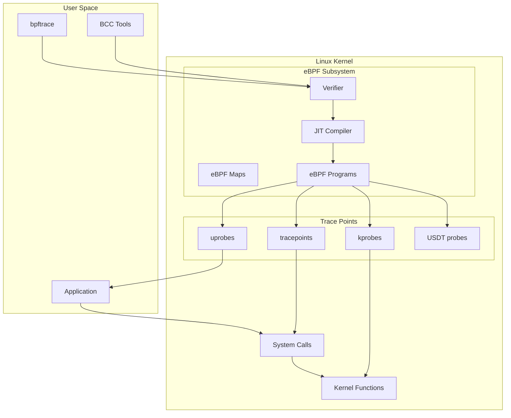
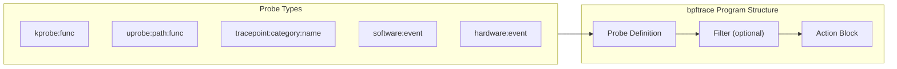
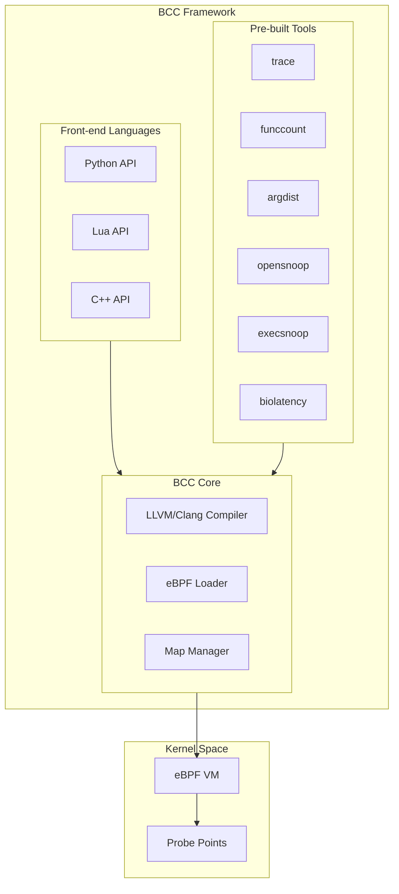
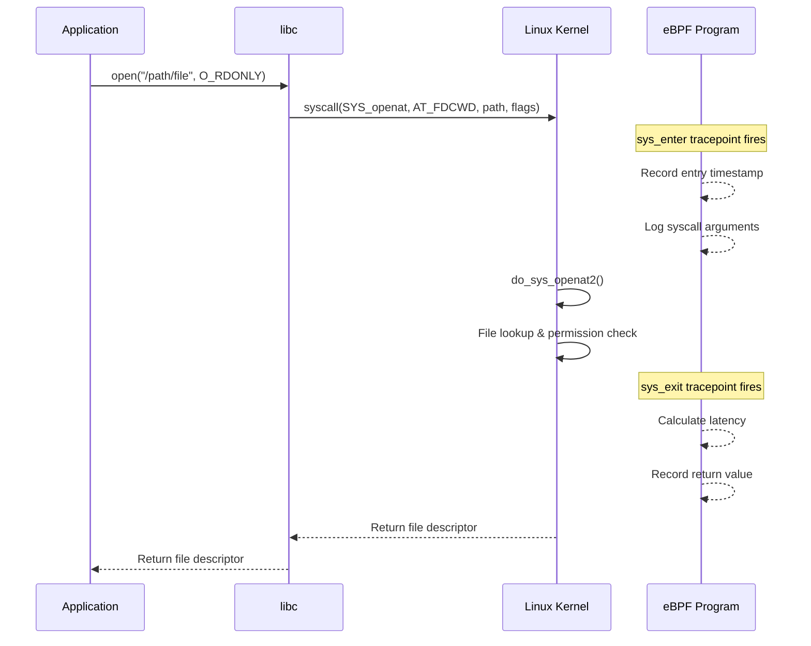
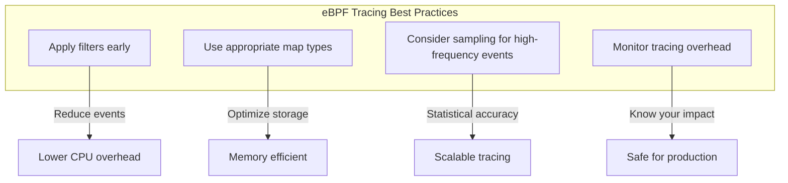

# How to Trace System Calls and Functions with eBPF (bpftrace, bcc)

Author: [nawazdhandala](https://github.com/nawazdhandala)

Tags: eBPF, bpftrace, BCC, Tracing, Linux, Debugging

Description: Learn how to use bpftrace and BCC tools for system tracing and debugging with eBPF.

---

## Introduction

eBPF (extended Berkeley Packet Filter) has revolutionized Linux observability by enabling safe, efficient, and programmable tracing of kernel and user-space activities without modifying kernel source code or loading kernel modules. Two of the most powerful tools built on eBPF are **bpftrace** and **BCC (BPF Compiler Collection)**, which provide high-level interfaces for creating sophisticated tracing programs.

This comprehensive guide covers how to leverage these tools to trace system calls, kernel functions, user-space functions, and more. Whether you're debugging performance issues, investigating security incidents, or understanding system behavior, mastering these tools is essential for modern Linux systems administration and development.

## Understanding eBPF Tracing Architecture

Before diving into the tools, it's essential to understand how eBPF tracing works at a high level.



### Key Tracing Points

eBPF can attach to various points in the system:

| Probe Type | Description | Use Case |
|------------|-------------|----------|
| kprobes | Dynamic kernel function tracing | Trace any kernel function |
| kretprobes | Kernel function return tracing | Capture return values |
| uprobes | User-space function tracing | Trace application functions |
| uretprobes | User-space return tracing | Capture function return values |
| tracepoints | Static kernel trace points | Stable kernel event tracing |
| USDT | User-space static tracing | Application-defined probes |

## Prerequisites and Installation

### Installing bpftrace

The following commands install bpftrace on common Linux distributions. bpftrace requires kernel headers and a kernel with eBPF support (4.9+, recommended 5.0+).

```bash
# Ubuntu/Debian - Install bpftrace from official repositories
# bpftrace is available in Ubuntu 19.04+ and Debian 10+
sudo apt-get update
sudo apt-get install -y bpftrace

# For older Ubuntu versions, use the IOVisor PPA for latest features
sudo apt-get install -y software-properties-common
sudo add-apt-repository ppa:iovisor/bcc
sudo apt-get update
sudo apt-get install -y bpftrace

# Fedora/RHEL/CentOS - Install from official repos
# Fedora has excellent eBPF support out of the box
sudo dnf install -y bpftrace

# Arch Linux - Available in community repository
sudo pacman -S bpftrace
```

### Installing BCC Tools

BCC provides a comprehensive collection of pre-built tracing tools along with Python and Lua bindings for creating custom tools.

```bash
# Ubuntu/Debian - Install BCC tools and Python bindings
# This installs both the tools and development libraries
sudo apt-get install -y bpfcc-tools linux-headers-$(uname -r)

# For Python development with BCC
sudo apt-get install -y python3-bpfcc

# Fedora/RHEL - Install complete BCC toolkit
# Includes all pre-built tools and development packages
sudo dnf install -y bcc bcc-tools python3-bcc

# Arch Linux
sudo pacman -S bcc bcc-tools python-bcc
```

### Verifying Installation

Run these commands to ensure everything is working correctly:

```bash
# Verify bpftrace installation and capabilities
# The -V flag shows version and supported probe types
sudo bpftrace -V

# List all available tracepoints in the kernel
# Tracepoints are stable interfaces for kernel events
sudo bpftrace -l 'tracepoint:*' | head -20

# Verify BCC tools are accessible
# These are typically installed in /usr/share/bcc/tools/
ls /usr/share/bcc/tools/ | head -10
```

## Part 1: Mastering bpftrace

bpftrace is a high-level tracing language that provides an awk-like syntax for writing powerful one-liners and scripts. It compiles directly to eBPF bytecode.

### Basic Syntax and Structure



The basic syntax follows this pattern:

```
probe_type:probe_name /filter/ { action }
```

### Essential One-Liners

#### Tracing System Calls

This one-liner traces all system calls made by a specific process. The `@` symbol defines a map (associative array) that aggregates data.

```bash
# Count system calls by process name
# @[comm] creates a histogram keyed by process name (comm = command name)
# count() increments the counter for each syscall
sudo bpftrace -e 'tracepoint:raw_syscalls:sys_enter { @[comm] = count(); }'
```

This traces new process executions system-wide. The execve syscall is used to start new processes.

```bash
# Trace new process execution with command and arguments
# str(args->filename) converts the filename pointer to a string
# The filter /comm == "bash"/ can be added to limit to specific shells
sudo bpftrace -e 'tracepoint:syscalls:sys_enter_execve {
    printf("%-16s %-6d %s\n", comm, pid, str(args->filename));
}'
```

#### Tracing File Operations

Trace all file opens across the system. This is useful for understanding I/O patterns and debugging file access issues.

```bash
# Trace file opens with process info and filename
# args->filename contains the path being opened
# The output shows which processes are opening which files
sudo bpftrace -e 'tracepoint:syscalls:sys_enter_openat {
    printf("%-16s %-6d %s\n", comm, pid, str(args->filename));
}'
```

Monitor read and write operations with size tracking. This helps identify I/O-intensive processes.

```bash
# Aggregate read sizes by process
# @read_bytes[comm] sums up all bytes read per process name
# args->count contains the number of bytes requested
sudo bpftrace -e 'tracepoint:syscalls:sys_enter_read {
    @read_bytes[comm] = sum(args->count);
}'
```

### Comprehensive bpftrace Scripts

For more complex tracing needs, bpftrace supports multi-probe scripts with global variables, maps, and sophisticated output formatting.

Save the following as `syscall_latency.bt`. This script measures the latency of system calls:

```c
#!/usr/bin/env bpftrace

/*
 * syscall_latency.bt - Measure system call latency by syscall ID
 *
 * This script tracks the time taken by each system call and creates
 * a histogram of latencies grouped by syscall number.
 *
 * The BEGIN block runs once at startup to print a header.
 * sys_enter captures the entry timestamp.
 * sys_exit calculates the delta and stores it in a histogram.
 */

// Print a header when the script starts
BEGIN
{
    printf("Tracing syscall latency... Hit Ctrl-C to end.\n");
}

// Capture the entry time for each syscall
// @start[tid] uses thread ID as key since multiple threads may be in syscalls
tracepoint:raw_syscalls:sys_enter
{
    @start[tid] = nsecs;
}

// Calculate latency when the syscall returns
// Only process if we have a matching start time
tracepoint:raw_syscalls:sys_exit
/@start[tid]/
{
    // Calculate elapsed time in nanoseconds
    $latency = nsecs - @start[tid];

    // Store in histogram keyed by syscall ID
    // args->id contains the syscall number
    @latency_ns[args->id] = hist($latency);

    // Clean up the start timestamp
    delete(@start[tid]);
}

// Clean up and print summary on exit
END
{
    // Clear the temporary start times map
    clear(@start);
}
```

Execute the script with proper permissions:

```bash
# Make the script executable and run it
# bpftrace scripts require root privileges for kernel tracing
chmod +x syscall_latency.bt
sudo ./syscall_latency.bt
```

### Advanced bpftrace: Function Argument Inspection

The following script demonstrates how to inspect function arguments in detail. This traces the `tcp_connect` kernel function:

```c
#!/usr/bin/env bpftrace

/*
 * tcp_connect.bt - Trace TCP connection attempts
 *
 * This script attaches to the tcp_connect kernel function and extracts
 * details about the connection including destination IP and port.
 *
 * kprobe attaches at function entry, giving access to arguments.
 * The struct sock pointer contains connection details.
 */

#include <net/sock.h>

// Header printed at script startup
BEGIN
{
    printf("%-16s %-6s %-16s %-6s\n", "COMM", "PID", "DEST_IP", "PORT");
}

// Probe tcp_connect function entry
// arg0 is the first argument: struct sock *sk
kprobe:tcp_connect
{
    // Cast arg0 to struct sock pointer
    $sk = (struct sock *)arg0;

    // Extract destination IPv4 address from socket structure
    // __sk_common.skc_daddr contains the destination IP in network byte order
    $daddr = $sk->__sk_common.skc_daddr;

    // Extract destination port (stored in network byte order, need to convert)
    $dport = $sk->__sk_common.skc_dport;

    // Print connection details
    // ntop() converts network address to string format
    printf("%-16s %-6d %-16s %-6d\n",
           comm,
           pid,
           ntop(AF_INET, $daddr),
           ($dport >> 8) | (($dport << 8) & 0xff00));
}
```

### Tracing User-Space Functions

bpftrace can trace user-space applications using uprobes. This is invaluable for debugging application behavior.

Trace malloc calls to understand memory allocation patterns:

```bash
# Trace malloc calls in libc
# uprobe attaches to user-space function entry
# arg0 contains the size requested for allocation
# The retval in uretprobe contains the returned pointer
sudo bpftrace -e '
    uprobe:/lib/x86_64-linux-gnu/libc.so.6:malloc {
        @size[comm] = hist(arg0);
    }'
```

A more comprehensive script for tracing a specific application's functions:

```c
#!/usr/bin/env bpftrace

/*
 * app_trace.bt - Trace application function calls
 *
 * Replace /path/to/your/application with the actual binary path.
 * Replace function_name with the function you want to trace.
 * Use 'nm' or 'objdump' to find available function symbols.
 */

// Trace entry to a specific function in your application
uprobe:/path/to/your/application:function_name
{
    printf("ENTER: %s called by %s (pid=%d)\n",
           probe, comm, pid);

    // Print function arguments if you know their types
    // arg0, arg1, etc. contain the function arguments
    printf("  arg0 = %ld, arg1 = %ld\n", arg0, arg1);

    // Record entry time for latency calculation
    @entry[tid] = nsecs;
}

// Trace return from the function
uretprobe:/path/to/your/application:function_name
/@entry[tid]/
{
    $duration_us = (nsecs - @entry[tid]) / 1000;

    printf("EXIT: %s returned %ld (took %ld us)\n",
           probe, retval, $duration_us);

    delete(@entry[tid]);
}
```

## Part 2: BCC Tools and Programming

BCC provides both ready-to-use tools and a framework for building custom eBPF programs in Python or C.

### BCC Tools Architecture



### Essential BCC Tools

#### execsnoop - Trace New Processes

This tool traces new process executions system-wide. Essential for security monitoring and debugging process behavior.

```bash
# Basic usage - trace all new processes
# Shows timestamp, UID, PID, PPID, return code, and command line
sudo execsnoop-bpfcc

# Trace only failed executions (useful for debugging)
# -x flag filters to show only exec failures
sudo execsnoop-bpfcc -x

# Include timestamps and limit to specific UID
# -T adds timestamps, -u filters by user ID
sudo execsnoop-bpfcc -T -u 1000

# Show full argument lists (can be verbose)
# Useful when debugging command-line issues
sudo execsnoop-bpfcc -q
```

#### opensnoop - Trace File Opens

Monitor file access patterns across the system. Invaluable for debugging file permission issues and understanding I/O behavior.

```bash
# Basic usage - show all file opens
# Displays PID, process name, file descriptor, error, and path
sudo opensnoop-bpfcc

# Filter by specific PID
# -p flag limits tracing to a single process
sudo opensnoop-bpfcc -p 1234

# Show only failed opens (errors)
# Useful for debugging "file not found" issues
sudo opensnoop-bpfcc -x

# Filter by filename pattern
# -n flag matches against the filename
sudo opensnoop-bpfcc -n "config"

# Show extended file flags
# -e flag includes the open flags in output
sudo opensnoop-bpfcc -e
```

#### biolatency - Block I/O Latency

Analyze disk I/O latency distribution. Critical for storage performance analysis.

```bash
# Show block I/O latency histogram
# Groups latencies into buckets and shows distribution
sudo biolatency-bpfcc

# Show latency by disk device
# -D flag separates statistics per block device
sudo biolatency-bpfcc -D

# Use millisecond resolution instead of microseconds
# -m flag changes the time unit
sudo biolatency-bpfcc -m

# Include queue time in addition to device time
# -Q flag measures from request queue to completion
sudo biolatency-bpfcc -Q

# Run for 10 seconds with 1-second intervals
# Useful for time-series analysis
sudo biolatency-bpfcc 1 10
```

#### trace - Flexible Function Tracing

The `trace` tool provides flexible tracing similar to bpftrace but with Python-style format strings.

```bash
# Trace a kernel function with return value
# 'r' prefix indicates return probe
# %K format prints kernel stack
sudo trace-bpfcc 'r::do_sys_openat2 "ret=%d", retval'

# Trace user-space function with argument
# Format: 'p:library:function "format", args'
sudo trace-bpfcc 'p:c:malloc "size=%zu", arg1'

# Trace with filtering condition
# The filter expression is evaluated before printing
sudo trace-bpfcc 'p:c:write (arg2 > 1024) "fd=%d, size=%zu", arg1, arg2'

# Trace kernel function with time
# -T adds timestamp to each line
sudo trace-bpfcc -T 'p::tcp_v4_connect "dport=%d", arg2'
```

#### funccount - Count Function Calls

Count function call frequency for performance analysis.

```bash
# Count kernel functions matching a pattern
# Uses regex-style matching for function names
sudo funccount-bpfcc 'tcp_*'

# Count user-space library calls
# Useful for understanding library usage patterns
sudo funccount-bpfcc 'c:malloc'

# Run for 5 seconds and show interval statistics
# -i specifies interval, positional arg is total duration
sudo funccount-bpfcc -i 1 5 'vfs_*'

# Count functions per process
# -P flag separates counts by process ID
sudo funccount-bpfcc -P 'vfs_read'
```

### Writing Custom BCC Programs

For complex tracing requirements, you can write custom BCC programs in Python. This example creates a tool to trace system call latency:

```python
#!/usr/bin/env python3
"""
syscall_latency.py - Measure and report system call latency

This script demonstrates how to build a custom BCC tool that:
1. Attaches to syscall entry and exit tracepoints
2. Measures time spent in each syscall
3. Aggregates data in eBPF maps
4. Periodically reports statistics from user space

Usage: sudo python3 syscall_latency.py
"""

from bcc import BPF
from time import sleep, strftime
import ctypes as ct

# Define the eBPF program in C
# This code runs in the kernel, compiled by LLVM
bpf_program = """
#include <uapi/linux/ptrace.h>

// Structure to hold syscall timing data
// BPF maps use this as the value type
struct syscall_data_t {
    u64 count;        // Number of times this syscall was called
    u64 total_ns;     // Total nanoseconds spent in this syscall
    u64 max_ns;       // Maximum latency observed
};

// Map to store the entry timestamp for each thread
// Key: thread ID (u32), Value: timestamp (u64)
BPF_HASH(start_times, u32, u64);

// Map to aggregate syscall statistics
// Key: syscall ID (u32), Value: syscall_data_t struct
BPF_HASH(syscall_stats, u32, struct syscall_data_t);

// Temporary map to store syscall ID between entry and exit
// Key: thread ID, Value: syscall ID
BPF_HASH(syscall_ids, u32, u32);

// Tracepoint at syscall entry
// Called before the syscall is executed
TRACEPOINT_PROBE(raw_syscalls, sys_enter) {
    u32 tid = bpf_get_current_pid_tgid();  // Get thread ID (lower 32 bits)
    u64 ts = bpf_ktime_get_ns();           // Get current timestamp

    // Store the entry timestamp and syscall ID
    start_times.update(&tid, &ts);

    // args->id contains the syscall number
    u32 syscall_id = args->id;
    syscall_ids.update(&tid, &syscall_id);

    return 0;
}

// Tracepoint at syscall exit
// Called after the syscall returns
TRACEPOINT_PROBE(raw_syscalls, sys_exit) {
    u32 tid = bpf_get_current_pid_tgid();

    // Look up the entry timestamp
    u64 *start_ts = start_times.lookup(&tid);
    if (!start_ts) {
        return 0;  // No matching entry, skip
    }

    // Look up the syscall ID
    u32 *syscall_id = syscall_ids.lookup(&tid);
    if (!syscall_id) {
        start_times.delete(&tid);
        return 0;
    }

    // Calculate the elapsed time
    u64 delta = bpf_ktime_get_ns() - *start_ts;

    // Initialize or update the statistics
    struct syscall_data_t *data, zero = {};
    data = syscall_stats.lookup_or_try_init(syscall_id, &zero);
    if (data) {
        // Update count and total time atomically
        __sync_fetch_and_add(&data->count, 1);
        __sync_fetch_and_add(&data->total_ns, delta);

        // Update max if this call was slower
        if (delta > data->max_ns) {
            data->max_ns = delta;
        }
    }

    // Clean up temporary storage
    start_times.delete(&tid);
    syscall_ids.delete(&tid);

    return 0;
}
"""

# Syscall name lookup table (partial, add more as needed)
# Maps syscall numbers to human-readable names
SYSCALL_NAMES = {
    0: "read", 1: "write", 2: "open", 3: "close",
    4: "stat", 5: "fstat", 6: "lstat", 7: "poll",
    8: "lseek", 9: "mmap", 10: "mprotect", 11: "munmap",
    257: "openat", 262: "newfstatat", 280: "ppoll",
    # Add more syscall mappings as needed
}

def get_syscall_name(syscall_id):
    """Get human-readable syscall name or return the number."""
    return SYSCALL_NAMES.get(syscall_id, f"syscall_{syscall_id}")


def main():
    print("Loading eBPF program...")

    # Compile and load the eBPF program
    # BPF() compiles the C code using LLVM and loads it into the kernel
    b = BPF(text=bpf_program)

    print("Tracing syscall latency... Ctrl-C to exit.")
    print()

    try:
        while True:
            # Sleep for the reporting interval
            sleep(5)

            # Print header
            print(f"\n{strftime('%H:%M:%S')} Syscall Latency Report")
            print("-" * 70)
            print(f"{'SYSCALL':<20} {'COUNT':>12} {'AVG(us)':>12} {'MAX(us)':>12}")
            print("-" * 70)

            # Read the syscall_stats map from the kernel
            syscall_stats = b.get_table("syscall_stats")

            # Iterate over all entries in the map
            for key, value in sorted(syscall_stats.items(),
                                     key=lambda x: x[1].total_ns,
                                     reverse=True):
                syscall_name = get_syscall_name(key.value)
                count = value.count
                avg_us = value.total_ns / count / 1000 if count > 0 else 0
                max_us = value.max_ns / 1000

                print(f"{syscall_name:<20} {count:>12} {avg_us:>12.2f} {max_us:>12.2f}")

            # Clear the map for the next interval
            syscall_stats.clear()

    except KeyboardInterrupt:
        print("\nExiting...")


if __name__ == "__main__":
    main()
```

### Advanced BCC: Stack Traces and USDT Probes

This example demonstrates capturing stack traces when specific events occur:

```python
#!/usr/bin/env python3
"""
malloc_stacks.py - Trace large memory allocations with stack traces

This tool traces malloc() calls larger than a threshold and captures
the user-space stack trace to identify where allocations occur.

Usage: sudo python3 malloc_stacks.py [threshold_bytes]
"""

from bcc import BPF
import sys

# Configuration: minimum allocation size to trace
MIN_ALLOC_SIZE = int(sys.argv[1]) if len(sys.argv) > 1 else 65536

bpf_program = """
#include <uapi/linux/ptrace.h>

// Structure to hold allocation event data
struct alloc_event_t {
    u32 pid;
    u32 tid;
    u64 size;
    char comm[16];
    int stack_id;  // Reference to stack trace
};

// Ring buffer for sending events to user space
// More efficient than perf buffers for high-frequency events
BPF_PERF_OUTPUT(alloc_events);

// Stack trace storage
// Stores unique stack traces with integer IDs
BPF_STACK_TRACE(stack_traces, 10240);

// Temporary storage for allocation size (between entry and return)
BPF_HASH(alloc_sizes, u64, u64);

// Called when malloc() is entered
int trace_malloc_entry(struct pt_regs *ctx, size_t size) {
    // Filter small allocations
    if (size < THRESHOLD) {
        return 0;
    }

    // Store the requested size, keyed by thread ID
    u64 pid_tgid = bpf_get_current_pid_tgid();
    alloc_sizes.update(&pid_tgid, &size);

    return 0;
}

// Called when malloc() returns
int trace_malloc_return(struct pt_regs *ctx) {
    u64 pid_tgid = bpf_get_current_pid_tgid();

    // Look up the stored allocation size
    u64 *size = alloc_sizes.lookup(&pid_tgid);
    if (!size) {
        return 0;  // No matching entry
    }

    // Get the return value (allocated pointer)
    void *addr = (void *)PT_REGS_RC(ctx);
    if (!addr) {
        // malloc failed, clean up and exit
        alloc_sizes.delete(&pid_tgid);
        return 0;
    }

    // Build the event structure
    struct alloc_event_t event = {};
    event.pid = pid_tgid >> 32;
    event.tid = pid_tgid;
    event.size = *size;
    bpf_get_current_comm(&event.comm, sizeof(event.comm));

    // Capture the user-space stack trace
    // Returns an ID that can be used to look up the trace
    event.stack_id = stack_traces.get_stackid(ctx, BPF_F_USER_STACK);

    // Send event to user space
    alloc_events.perf_submit(ctx, &event, sizeof(event));

    // Clean up
    alloc_sizes.delete(&pid_tgid);

    return 0;
}
"""

def main():
    # Replace THRESHOLD placeholder with actual value
    program = bpf_program.replace("THRESHOLD", str(MIN_ALLOC_SIZE))

    print(f"Tracing malloc() calls >= {MIN_ALLOC_SIZE} bytes...")

    # Load BPF program
    b = BPF(text=program)

    # Attach to malloc in libc
    # attach_uprobe attaches to function entry
    b.attach_uprobe(name="c", sym="malloc", fn_name="trace_malloc_entry")
    # attach_uretprobe attaches to function return
    b.attach_uretprobe(name="c", sym="malloc", fn_name="trace_malloc_return")

    # Get reference to the stack trace table
    stack_traces = b.get_table("stack_traces")

    # Event handler called for each allocation
    def handle_event(cpu, data, size):
        event = b["alloc_events"].event(data)
        print(f"\n{event.comm.decode()} (pid={event.pid}, tid={event.tid})")
        print(f"  Allocated {event.size} bytes")

        # Print stack trace if available
        if event.stack_id >= 0:
            print("  Stack trace:")
            for addr in stack_traces.walk(event.stack_id):
                sym = b.sym(addr, event.pid, show_module=True, show_offset=True)
                print(f"    {sym.decode()}")

    # Set up the event handler
    b["alloc_events"].open_perf_buffer(handle_event)

    print("Press Ctrl-C to exit\n")

    try:
        while True:
            # Poll for events
            b.perf_buffer_poll()
    except KeyboardInterrupt:
        print("\nExiting...")


if __name__ == "__main__":
    main()
```

## Part 3: System Call Tracing Deep Dive

### Understanding the System Call Interface



### Comprehensive Syscall Tracing Script

This bpftrace script provides detailed system call analysis with filtering and aggregation:

```c
#!/usr/bin/env bpftrace

/*
 * syscall_analyzer.bt - Comprehensive system call analysis tool
 *
 * This script traces all system calls and provides:
 * - Per-syscall latency histograms
 * - Error rate tracking
 * - Top syscalls by frequency and time
 * - Per-process breakdown
 *
 * Usage: sudo bpftrace syscall_analyzer.bt
 */

BEGIN
{
    printf("Starting comprehensive syscall analysis...\n");
    printf("Press Ctrl-C to see results.\n\n");
}

// Record entry timestamp and syscall ID for each thread
tracepoint:raw_syscalls:sys_enter
{
    @start[tid] = nsecs;
    @syscall[tid] = args->id;
}

// Process syscall exit
tracepoint:raw_syscalls:sys_exit
/@start[tid]/
{
    // Calculate latency
    $latency_ns = nsecs - @start[tid];
    $syscall_id = @syscall[tid];

    // Count total syscalls per type
    @syscall_count[$syscall_id] = count();

    // Count syscalls per process
    @process_syscalls[comm] = count();

    // Track total time spent in each syscall type
    @syscall_time_ns[$syscall_id] = sum($latency_ns);

    // Build latency histogram per syscall
    @latency_hist[$syscall_id] = hist($latency_ns);

    // Track errors (negative return values typically indicate errors)
    // args->ret contains the return value
    if (args->ret < 0) {
        @errors[$syscall_id, args->ret] = count();
    }

    // Track slowest syscalls (over 1ms)
    if ($latency_ns > 1000000) {
        @slow_syscalls[$syscall_id, comm] = count();
    }

    // Clean up temporary storage
    delete(@start[tid]);
    delete(@syscall[tid]);
}

// Cleanup and format output on exit
END
{
    // Clear temporary maps
    clear(@start);
    clear(@syscall);

    printf("\n=== Syscall Analysis Results ===\n\n");

    printf("--- Top 20 Syscalls by Count ---\n");
    print(@syscall_count, 20);

    printf("\n--- Top 20 Syscalls by Total Time ---\n");
    print(@syscall_time_ns, 20);

    printf("\n--- Top 20 Processes by Syscall Count ---\n");
    print(@process_syscalls, 20);

    printf("\n--- Syscall Errors ---\n");
    print(@errors);

    printf("\n--- Slow Syscalls (>1ms) ---\n");
    print(@slow_syscalls);

    // Note: Latency histograms are printed automatically
}
```

### Tracing Specific System Calls in Detail

This script focuses on file I/O syscalls with detailed argument inspection:

```c
#!/usr/bin/env bpftrace

/*
 * file_io_trace.bt - Detailed file I/O tracing
 *
 * Traces read, write, open, and close operations with full details
 * including file descriptors, paths, sizes, and latency.
 */

BEGIN
{
    printf("Tracing file I/O operations...\n");
    printf("%-20s %-6s %-10s %-8s %-12s %s\n",
           "TIMESTAMP", "PID", "SYSCALL", "FD/RET", "SIZE/FLAGS", "PATH/INFO");
    printf("%s\n", "=".repeat(80));
}

// Trace openat syscall - most common way to open files
tracepoint:syscalls:sys_enter_openat
{
    @open_path[tid] = args->filename;
    @open_flags[tid] = args->flags;
    @open_start[tid] = nsecs;
}

tracepoint:syscalls:sys_exit_openat
/@open_start[tid]/
{
    $latency_us = (nsecs - @open_start[tid]) / 1000;
    $fd = args->ret;

    // Print open result
    printf("%-20lu %-6d %-10s %-8d 0x%-10x %s\n",
           elapsed / 1000000,
           pid,
           "openat",
           $fd,
           @open_flags[tid],
           str(@open_path[tid]));

    // Track file descriptor to path mapping for later use
    if ($fd >= 0) {
        @fd_path[pid, $fd] = str(@open_path[tid]);
    }

    // Cleanup
    delete(@open_path[tid]);
    delete(@open_flags[tid]);
    delete(@open_start[tid]);
}

// Trace read syscall
tracepoint:syscalls:sys_enter_read
{
    @read_fd[tid] = args->fd;
    @read_size[tid] = args->count;
    @read_start[tid] = nsecs;
}

tracepoint:syscalls:sys_exit_read
/@read_start[tid]/
{
    $latency_us = (nsecs - @read_start[tid]) / 1000;
    $bytes_read = args->ret;
    $fd = @read_fd[tid];

    printf("%-20lu %-6d %-10s %-8d %-12ld %s\n",
           elapsed / 1000000,
           pid,
           "read",
           $fd,
           $bytes_read,
           @fd_path[pid, $fd] != "" ? @fd_path[pid, $fd] : "<unknown>");

    // Track read statistics
    @read_bytes[comm] = sum($bytes_read > 0 ? $bytes_read : 0);

    delete(@read_fd[tid]);
    delete(@read_size[tid]);
    delete(@read_start[tid]);
}

// Trace write syscall
tracepoint:syscalls:sys_enter_write
{
    @write_fd[tid] = args->fd;
    @write_size[tid] = args->count;
    @write_start[tid] = nsecs;
}

tracepoint:syscalls:sys_exit_write
/@write_start[tid]/
{
    $latency_us = (nsecs - @write_start[tid]) / 1000;
    $bytes_written = args->ret;
    $fd = @write_fd[tid];

    printf("%-20lu %-6d %-10s %-8d %-12ld %s\n",
           elapsed / 1000000,
           pid,
           "write",
           $fd,
           $bytes_written,
           @fd_path[pid, $fd] != "" ? @fd_path[pid, $fd] : "<unknown>");

    // Track write statistics
    @write_bytes[comm] = sum($bytes_written > 0 ? $bytes_written : 0);

    delete(@write_fd[tid]);
    delete(@write_size[tid]);
    delete(@write_start[tid]);
}

// Trace close syscall to clean up fd mapping
tracepoint:syscalls:sys_enter_close
{
    $fd = args->fd;
    printf("%-20lu %-6d %-10s %-8d %-12s %s\n",
           elapsed / 1000000,
           pid,
           "close",
           $fd,
           "-",
           @fd_path[pid, $fd] != "" ? @fd_path[pid, $fd] : "<unknown>");

    delete(@fd_path[pid, $fd]);
}

END
{
    printf("\n=== I/O Summary ===\n");
    printf("\nBytes read by process:\n");
    print(@read_bytes);
    printf("\nBytes written by process:\n");
    print(@write_bytes);

    // Cleanup all maps
    clear(@open_path);
    clear(@open_flags);
    clear(@open_start);
    clear(@read_fd);
    clear(@read_size);
    clear(@read_start);
    clear(@write_fd);
    clear(@write_size);
    clear(@write_start);
    clear(@fd_path);
}
```

## Part 4: Function Parameter Inspection

### Kernel Function Tracing with Arguments

This script demonstrates how to inspect kernel function parameters in detail:

```c
#!/usr/bin/env bpftrace

/*
 * net_trace.bt - Network function tracing with parameter inspection
 *
 * Traces key network functions and extracts connection details
 * from socket structures and function arguments.
 */

#include <linux/socket.h>
#include <net/sock.h>

BEGIN
{
    printf("Tracing network functions...\n");
    printf("%-12s %-16s %-6s %-16s %-6s %-16s %-6s\n",
           "FUNC", "COMM", "PID", "SADDR", "SPORT", "DADDR", "DPORT");
}

// Trace TCP connect - outgoing connections
kprobe:tcp_v4_connect
{
    // arg0 is struct sock *sk
    $sk = (struct sock *)arg0;

    // Extract local address (may not be bound yet)
    $saddr = $sk->__sk_common.skc_rcv_saddr;
    $sport = $sk->__sk_common.skc_num;

    // Extract destination address from arg1 (struct sockaddr_in *)
    // Note: For connect, destination is in the sockaddr argument
    $daddr = $sk->__sk_common.skc_daddr;
    $dport = $sk->__sk_common.skc_dport;

    // Convert port from network byte order
    $dport_host = ($dport >> 8) | (($dport & 0xff) << 8);

    printf("%-12s %-16s %-6d %-16s %-6d %-16s %-6d\n",
           "connect",
           comm,
           pid,
           ntop(AF_INET, $saddr),
           $sport,
           ntop(AF_INET, $daddr),
           $dport_host);
}

// Trace TCP accept - incoming connections
kretprobe:inet_csk_accept
/retval != 0/
{
    // Return value is the new connected socket
    $sk = (struct sock *)retval;

    $saddr = $sk->__sk_common.skc_rcv_saddr;
    $sport = $sk->__sk_common.skc_num;
    $daddr = $sk->__sk_common.skc_daddr;
    $dport = $sk->__sk_common.skc_dport;

    $dport_host = ($dport >> 8) | (($dport & 0xff) << 8);

    printf("%-12s %-16s %-6d %-16s %-6d %-16s %-6d\n",
           "accept",
           comm,
           pid,
           ntop(AF_INET, $saddr),
           $sport,
           ntop(AF_INET, $daddr),
           $dport_host);
}

// Trace TCP send
kprobe:tcp_sendmsg
{
    $sk = (struct sock *)arg0;
    $size = arg2;  // Message size

    $daddr = $sk->__sk_common.skc_daddr;
    $dport = $sk->__sk_common.skc_dport;
    $dport_host = ($dport >> 8) | (($dport & 0xff) << 8);

    @tcp_send[comm, ntop(AF_INET, $daddr), $dport_host] = sum($size);
}

// Trace TCP receive
kprobe:tcp_recvmsg
{
    $sk = (struct sock *)arg0;

    $daddr = $sk->__sk_common.skc_daddr;
    $dport = $sk->__sk_common.skc_dport;
    $dport_host = ($dport >> 8) | (($dport & 0xff) << 8);

    @tcp_recv_count[comm, ntop(AF_INET, $daddr), $dport_host] = count();
}

END
{
    printf("\n=== TCP Send Summary (bytes) ===\n");
    print(@tcp_send);

    printf("\n=== TCP Receive Count ===\n");
    print(@tcp_recv_count);
}
```

### User-Space Function Argument Inspection

This example shows how to trace application functions and inspect their arguments:

```c
#!/usr/bin/env bpftrace

/*
 * http_trace.bt - Trace HTTP library functions
 *
 * This script traces curl library functions to monitor HTTP requests.
 * Requires libcurl to be installed and the application using it.
 *
 * Usage: sudo bpftrace http_trace.bt
 */

// Trace curl_easy_setopt to capture URL settings
// CURLOPT_URL = 10002
uprobe:/usr/lib/x86_64-linux-gnu/libcurl.so.4:curl_easy_setopt
/arg1 == 10002/
{
    // arg0 = CURL handle
    // arg1 = option (CURLOPT_URL = 10002)
    // arg2 = URL string pointer

    printf("%-12s %-16s %-6d URL: %s\n",
           "setopt",
           comm,
           pid,
           str(arg2));

    // Store URL for correlation with perform
    @url[arg0] = str(arg2);
}

// Trace curl_easy_perform - the actual HTTP request
uprobe:/usr/lib/x86_64-linux-gnu/libcurl.so.4:curl_easy_perform
{
    @perform_start[tid] = nsecs;
    @perform_handle[tid] = arg0;

    printf("%-12s %-16s %-6d Starting request to: %s\n",
           "perform",
           comm,
           pid,
           @url[arg0]);
}

uretprobe:/usr/lib/x86_64-linux-gnu/libcurl.so.4:curl_easy_perform
/@perform_start[tid]/
{
    $latency_ms = (nsecs - @perform_start[tid]) / 1000000;
    $handle = @perform_handle[tid];

    printf("%-12s %-16s %-6d Completed: %s (result=%d, took %d ms)\n",
           "complete",
           comm,
           pid,
           @url[$handle],
           retval,
           $latency_ms);

    // Track request latency histogram
    @request_latency_ms = hist($latency_ms);

    delete(@perform_start[tid]);
    delete(@perform_handle[tid]);
}

END
{
    printf("\n=== HTTP Request Latency Distribution (ms) ===\n");
    print(@request_latency_ms);

    clear(@url);
}
```

## Part 5: Practical Examples and Recipes

### Recipe 1: Debugging Slow DNS Lookups

```c
#!/usr/bin/env bpftrace

/*
 * dns_latency.bt - Track DNS resolution latency
 *
 * Traces getaddrinfo() calls to identify slow DNS lookups.
 * Useful for debugging application startup delays or network issues.
 */

uprobe:/lib/x86_64-linux-gnu/libc.so.6:getaddrinfo
{
    @dns_start[tid] = nsecs;
    @dns_host[tid] = str(arg0);  // First argument is the hostname

    printf("DNS lookup started: %s (pid=%d, comm=%s)\n",
           str(arg0), pid, comm);
}

uretprobe:/lib/x86_64-linux-gnu/libc.so.6:getaddrinfo
/@dns_start[tid]/
{
    $latency_ms = (nsecs - @dns_start[tid]) / 1000000;

    printf("DNS lookup completed: %s -> result=%d (took %d ms)\n",
           @dns_host[tid], retval, $latency_ms);

    // Flag slow lookups (>100ms)
    if ($latency_ms > 100) {
        printf("  *** SLOW DNS LOOKUP DETECTED ***\n");
        @slow_dns[@dns_host[tid]] = count();
    }

    @dns_latency_ms = hist($latency_ms);

    delete(@dns_start[tid]);
    delete(@dns_host[tid]);
}

END
{
    printf("\n=== DNS Latency Histogram (ms) ===\n");
    print(@dns_latency_ms);

    printf("\n=== Slow DNS Lookups (>100ms) ===\n");
    print(@slow_dns);
}
```

### Recipe 2: Memory Allocation Profiler

```c
#!/usr/bin/env bpftrace

/*
 * malloc_profile.bt - Memory allocation profiling
 *
 * Tracks malloc/free patterns to identify memory issues:
 * - Large allocations
 * - Frequent small allocations
 * - Potential memory leaks
 */

uprobe:/lib/x86_64-linux-gnu/libc.so.6:malloc
{
    @malloc_size[tid] = arg0;
    @malloc_start[tid] = nsecs;
}

uretprobe:/lib/x86_64-linux-gnu/libc.so.6:malloc
/@malloc_size[tid]/
{
    $size = @malloc_size[tid];
    $ptr = retval;
    $latency_ns = nsecs - @malloc_start[tid];

    // Track allocation by size bucket
    @alloc_sizes = hist($size);

    // Track allocations by process
    @alloc_by_proc[comm] = sum($size);
    @alloc_count_by_proc[comm] = count();

    // Track outstanding allocations for leak detection
    // (simplified - real leak detection needs more sophisticated tracking)
    if ($ptr != 0) {
        @outstanding[$ptr] = $size;
        @outstanding_by_comm[comm] = sum($size);
    }

    // Alert on large allocations (>1MB)
    if ($size > 1048576) {
        printf("Large malloc: %s allocated %ld bytes at %p\n",
               comm, $size, $ptr);
    }

    delete(@malloc_size[tid]);
    delete(@malloc_start[tid]);
}

uprobe:/lib/x86_64-linux-gnu/libc.so.6:free
/arg0 != 0/
{
    $ptr = arg0;
    $size = @outstanding[$ptr];

    if ($size > 0) {
        @outstanding_by_comm[comm] = sum(-$size);
        delete(@outstanding[$ptr]);
    }
}

interval:s:10
{
    printf("\n--- 10 second allocation summary ---\n");
    printf("Outstanding memory by process:\n");
    print(@outstanding_by_comm);
}

END
{
    printf("\n=== Allocation Size Distribution ===\n");
    print(@alloc_sizes);

    printf("\n=== Total Bytes Allocated by Process ===\n");
    print(@alloc_by_proc);

    printf("\n=== Allocation Count by Process ===\n");
    print(@alloc_count_by_proc);
}
```

### Recipe 3: Container Process Tracing

```c
#!/usr/bin/env bpftrace

/*
 * container_trace.bt - Trace processes in containers
 *
 * Uses cgroup ID to identify and trace container processes.
 * Works with Docker, Kubernetes, and other container runtimes.
 */

#include <linux/sched.h>

BEGIN
{
    printf("Tracing container process activity...\n");
    printf("%-12s %-20s %-6s %-6s %s\n",
           "CGROUP_ID", "CONTAINER", "PID", "SYSCALLS", "COMMAND");
}

// Get cgroup ID for the current task
// This identifies which container (if any) the process belongs to
tracepoint:raw_syscalls:sys_enter
{
    $cgroup = cgroup;

    // Count syscalls per cgroup
    @syscalls_by_cgroup[$cgroup] = count();

    // Track unique processes per cgroup
    @procs_by_cgroup[$cgroup, comm, pid] = count();
}

// Trace container process creation
tracepoint:sched:sched_process_fork
{
    $parent_cgroup = cgroup;

    printf("FORK: parent_pid=%d parent_comm=%s child_pid=%d cgroup=%ld\n",
           args->parent_pid,
           comm,
           args->child_pid,
           $parent_cgroup);
}

// Trace container process exit
tracepoint:sched:sched_process_exit
{
    printf("EXIT: pid=%d comm=%s cgroup=%ld\n",
           pid, comm, cgroup);
}

interval:s:30
{
    printf("\n--- Container Syscall Summary (last 30s) ---\n");
    print(@syscalls_by_cgroup);
    clear(@syscalls_by_cgroup);
}

END
{
    printf("\n=== Processes by Container ===\n");
    print(@procs_by_cgroup);
}
```

### Recipe 4: Database Query Tracing (PostgreSQL)

```python
#!/usr/bin/env python3
"""
postgres_trace.py - Trace PostgreSQL queries using USDT probes

PostgreSQL includes USDT (User Statically Defined Tracing) probes
that provide stable tracing points for query execution.

Requirements:
- PostgreSQL compiled with --enable-dtrace
- BCC with USDT support

Usage: sudo python3 postgres_trace.py
"""

from bcc import BPF, USDT
import sys

# Path to PostgreSQL binary (adjust for your installation)
POSTGRES_PATH = "/usr/lib/postgresql/14/bin/postgres"

# Create USDT context for PostgreSQL
usdt = USDT(path=POSTGRES_PATH)

# Enable the query-start and query-done probes
usdt.enable_probe(probe="query__start", fn_name="trace_query_start")
usdt.enable_probe(probe="query__done", fn_name="trace_query_done")

bpf_program = """
#include <uapi/linux/ptrace.h>

// Structure to hold query data
struct query_event_t {
    u32 pid;
    u64 start_ns;
    u64 duration_ns;
    char query[256];
};

// Map to track query start times
BPF_HASH(query_start, u32, u64);
BPF_HASH(query_text, u32, struct query_event_t);

// Perf buffer for sending events to user space
BPF_PERF_OUTPUT(query_events);

// Called when a query starts
int trace_query_start(struct pt_regs *ctx) {
    u32 pid = bpf_get_current_pid_tgid() >> 32;
    u64 ts = bpf_ktime_get_ns();

    // Store the start timestamp
    query_start.update(&pid, &ts);

    // Read the query string from the USDT argument
    struct query_event_t event = {};
    event.pid = pid;
    event.start_ns = ts;

    // USDT arg1 is the query string pointer
    bpf_usdt_readarg(1, ctx, &event.query);

    query_text.update(&pid, &event);

    return 0;
}

// Called when a query completes
int trace_query_done(struct pt_regs *ctx) {
    u32 pid = bpf_get_current_pid_tgid() >> 32;

    // Look up the start time
    u64 *start_ts = query_start.lookup(&pid);
    if (!start_ts) {
        return 0;
    }

    // Look up the query text
    struct query_event_t *event = query_text.lookup(&pid);
    if (!event) {
        query_start.delete(&pid);
        return 0;
    }

    // Calculate duration
    event->duration_ns = bpf_ktime_get_ns() - *start_ts;

    // Send to user space
    query_events.perf_submit(ctx, event, sizeof(*event));

    // Cleanup
    query_start.delete(&pid);
    query_text.delete(&pid);

    return 0;
}
"""

def main():
    # Load BPF program with USDT context
    b = BPF(text=bpf_program, usdt_contexts=[usdt])

    print("Tracing PostgreSQL queries... Ctrl-C to exit")
    print(f"{'PID':<8} {'DURATION(ms)':<15} {'QUERY'}")
    print("-" * 80)

    def handle_event(cpu, data, size):
        event = b["query_events"].event(data)
        duration_ms = event.duration_ns / 1000000.0
        query = event.query.decode('utf-8', errors='replace')[:60]

        print(f"{event.pid:<8} {duration_ms:<15.3f} {query}")

    b["query_events"].open_perf_buffer(handle_event)

    try:
        while True:
            b.perf_buffer_poll()
    except KeyboardInterrupt:
        print("\nExiting...")


if __name__ == "__main__":
    main()
```

## Best Practices and Tips

### Performance Considerations



### Key Best Practices

1. **Filter Early**: Apply filters in the eBPF program rather than in user space

   ```c
   // Good: Filter in eBPF
   tracepoint:syscalls:sys_enter_read
   /pid == $target_pid/
   {
       @reads = count();
   }

   // Bad: Filter in user space (higher overhead)
   ```

2. **Use Appropriate Map Types**: Choose the right data structure

   ```c
   // Use histograms for latency distributions
   @latency = hist($delta);

   // Use lhist for linear histograms with known ranges
   @size = lhist($bytes, 0, 1000, 100);

   // Use count() for simple counters
   @calls[comm] = count();
   ```

3. **Limit String Operations**: String handling in eBPF is expensive

   ```c
   // Avoid in hot paths
   // printf() with strings should be limited
   ```

4. **Set Reasonable Limits**: Prevent runaway memory usage

   ```bash
   # Limit map entries
   sudo bpftrace --unsafe -e 'BEGIN { @map = hist(0); }'
   ```

### Debugging Your eBPF Programs

When things go wrong, use these techniques:

```bash
# Verbose mode shows BPF instructions
sudo bpftrace -v script.bt

# Debug mode shows more details
sudo bpftrace -d script.bt

# List available probes for a function
sudo bpftrace -l 'kprobe:*tcp*'

# Check kernel version and features
sudo bpftrace --info
```

## Common Tracing Patterns Reference

| Pattern | bpftrace | Use Case |
|---------|----------|----------|
| Count events | `@c = count()` | Frequency analysis |
| Sum values | `@s = sum(arg0)` | Throughput measurement |
| Histogram | `@h = hist(x)` | Latency distribution |
| Store value | `@m[key] = val` | State tracking |
| Stack trace | `@s = kstack()` | Call path analysis |
| Timing | `nsecs`, `elapsed` | Duration measurement |

## Conclusion

eBPF tracing with bpftrace and BCC provides unparalleled visibility into Linux systems. Key takeaways:

1. **bpftrace** excels at quick, interactive investigations with its concise syntax
2. **BCC tools** provide production-ready solutions for common tracing needs
3. **Custom BCC programs** enable sophisticated analysis for complex requirements
4. **Performance impact** is minimal when following best practices
5. **Safety** is guaranteed by the eBPF verifier, making it production-safe

Whether you're debugging a performance issue, investigating a security incident, or simply trying to understand how your system works, these tools belong in every Linux administrator's and developer's toolkit.

## Further Reading

- [bpftrace Reference Guide](https://github.com/iovisor/bpftrace/blob/master/docs/reference_guide.md)
- [BCC Python Developer Tutorial](https://github.com/iovisor/bcc/blob/master/docs/tutorial_bcc_python_developer.md)
- [Linux Kernel Tracepoints](https://www.kernel.org/doc/html/latest/trace/tracepoints.html)
- [BPF Performance Tools by Brendan Gregg](http://www.brendangregg.com/bpf-performance-tools-book.html)
