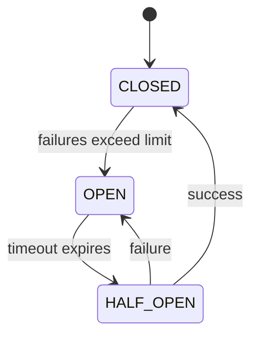

# How to Implement Circuit Breakers in Go with sony/gobreaker

Author: [nawazdhandala](https://github.com/nawazdhandala)

Tags: Go, Circuit Breaker, Resilience, Fault Tolerance, Microservices

Description: Implement circuit breakers in Go using sony/gobreaker for fault-tolerant communication with external dependencies and graceful degradation.

---

Modern distributed systems depend on numerous external services, databases, and APIs. When one of these dependencies fails or becomes unresponsive, it can cascade through your entire system, causing widespread outages. The circuit breaker pattern provides a robust solution to this problem by preventing cascading failures and enabling graceful degradation.

In this comprehensive guide, you will learn how to implement circuit breakers in Go using the popular `sony/gobreaker` library. We will cover the pattern fundamentals, configuration options, custom failure detection, fallback strategies, and real-world integration patterns.

## What is the Circuit Breaker Pattern?

The circuit breaker pattern is inspired by electrical circuit breakers that protect your home from electrical overloads. In software, a circuit breaker wraps calls to external services and monitors for failures. When failures reach a threshold, the circuit "opens" and immediately rejects subsequent calls without attempting the actual operation.

This pattern provides several benefits:

- **Fail fast**: Instead of waiting for timeouts on a failing service, requests fail immediately
- **Reduced load**: The failing service gets breathing room to recover
- **Graceful degradation**: Your application can serve fallback responses instead of errors
- **Automatic recovery**: The circuit periodically tests if the service has recovered

## Circuit Breaker States Explained

A circuit breaker operates in three distinct states:

### Closed State

The normal operating state. All requests pass through to the external service. The circuit breaker monitors the success and failure rates. When failures exceed the configured threshold, the circuit transitions to the open state.

### Open State

The circuit breaker has detected too many failures. All requests are immediately rejected without calling the external service. After a configured timeout period, the circuit transitions to the half-open state to test if the service has recovered.

### Half-Open State

A testing state where the circuit breaker allows a limited number of requests through to probe the external service. If these requests succeed, the circuit closes and normal operation resumes. If they fail, the circuit opens again.

Here is a visual representation of the state transitions:



## Getting Started with sony/gobreaker

The `sony/gobreaker` library is a mature, well-tested implementation of the circuit breaker pattern for Go. Let us start by installing it.

Install the gobreaker package using go get:

```bash
go get github.com/sony/gobreaker
```

## Basic Circuit Breaker Implementation

The following example demonstrates the simplest way to create and use a circuit breaker:

```go
package main

import (
    "errors"
    "fmt"
    "time"

    "github.com/sony/gobreaker"
)

func main() {
    // Create a circuit breaker with default settings and a descriptive name
    cb := gobreaker.NewCircuitBreaker(gobreaker.Settings{
        Name: "external-api",
    })

    // Wrap your external call with the circuit breaker's Execute method
    result, err := cb.Execute(func() (interface{}, error) {
        // This is where you call your external service
        return callExternalAPI()
    })

    if err != nil {
        // Handle errors - could be from the API or from the circuit breaker itself
        if errors.Is(err, gobreaker.ErrOpenState) {
            fmt.Println("Circuit breaker is open, service unavailable")
        } else if errors.Is(err, gobreaker.ErrTooManyRequests) {
            fmt.Println("Circuit breaker is half-open, too many requests")
        } else {
            fmt.Printf("API call failed: %v\n", err)
        }
        return
    }

    fmt.Printf("Success: %v\n", result)
}

// Simulated external API call
func callExternalAPI() (string, error) {
    // Your actual HTTP call or database query goes here
    return "response data", nil
}
```

## Comprehensive Configuration Options

The `gobreaker.Settings` struct provides numerous configuration options to fine-tune circuit breaker behavior. Let us explore each option in detail.

This example shows all available configuration options with recommended values:

```go
package main

import (
    "log"
    "time"

    "github.com/sony/gobreaker"
)

func createConfiguredCircuitBreaker() *gobreaker.CircuitBreaker {
    settings := gobreaker.Settings{
        // Name identifies this circuit breaker in logs and metrics
        Name: "payment-service",

        // MaxRequests is the maximum number of requests allowed in half-open state
        // When half-open, only this many requests will be allowed through to test
        // if the service has recovered
        MaxRequests: 3,

        // Interval is the cyclic period of the closed state for clearing counts
        // If 0, the counts are never cleared during closed state
        // Setting this helps prevent old failures from keeping the circuit open
        Interval: 30 * time.Second,

        // Timeout is the duration of the open state before transitioning to half-open
        // After this duration, the circuit breaker will allow test requests through
        Timeout: 60 * time.Second,

        // ReadyToTrip is called when a request fails in the closed state
        // If it returns true, the circuit breaker trips to the open state
        ReadyToTrip: func(counts gobreaker.Counts) bool {
            // Trip if failure ratio exceeds 50% with at least 5 requests
            failureRatio := float64(counts.TotalFailures) / float64(counts.Requests)
            return counts.Requests >= 5 && failureRatio >= 0.5
        },

        // OnStateChange is called whenever the state changes
        // Use this for logging, metrics, or alerting
        OnStateChange: func(name string, from gobreaker.State, to gobreaker.State) {
            log.Printf("Circuit breaker %s: state changed from %s to %s",
                name, from.String(), to.String())
        },

        // IsSuccessful determines if an error should be counted as a failure
        // Return true for errors that should NOT count as failures
        IsSuccessful: func(err error) bool {
            // By default, nil error means success
            // You can customize this to ignore certain error types
            return err == nil
        },
    }

    return gobreaker.NewCircuitBreaker(settings)
}
```

## Understanding the Counts Structure

The `gobreaker.Counts` structure tracks request statistics. Understanding it is essential for writing effective `ReadyToTrip` functions.

This example demonstrates how to access and use the Counts structure:

```go
package main

import (
    "fmt"

    "github.com/sony/gobreaker"
)

// ReadyToTrip function with detailed count analysis
func advancedReadyToTrip(counts gobreaker.Counts) bool {
    // Requests: Total number of requests made
    fmt.Printf("Total requests: %d\n", counts.Requests)

    // TotalSuccesses: Number of successful requests
    fmt.Printf("Total successes: %d\n", counts.TotalSuccesses)

    // TotalFailures: Number of failed requests
    fmt.Printf("Total failures: %d\n", counts.TotalFailures)

    // ConsecutiveSuccesses: Number of consecutive successes
    fmt.Printf("Consecutive successes: %d\n", counts.ConsecutiveSuccesses)

    // ConsecutiveFailures: Number of consecutive failures
    fmt.Printf("Consecutive failures: %d\n", counts.ConsecutiveFailures)

    // Trip based on consecutive failures rather than ratio
    // This is useful for detecting sudden service outages
    return counts.ConsecutiveFailures >= 3
}

func main() {
    cb := gobreaker.NewCircuitBreaker(gobreaker.Settings{
        Name:        "analytics-service",
        ReadyToTrip: advancedReadyToTrip,
    })

    // Use the circuit breaker
    _, _ = cb.Execute(func() (interface{}, error) {
        return nil, nil
    })
}
```

## Custom Failure Detection Strategies

Not all errors should trip the circuit breaker. For example, a 404 Not Found response is a valid response, not a service failure. Let us implement custom failure detection.

This example shows how to distinguish between different types of errors:

```go
package main

import (
    "errors"
    "net/http"

    "github.com/sony/gobreaker"
)

// Custom error types for different failure scenarios
var (
    ErrNotFound        = errors.New("resource not found")
    ErrBadRequest      = errors.New("bad request")
    ErrServiceDown     = errors.New("service unavailable")
    ErrTimeout         = errors.New("request timeout")
    ErrRateLimited     = errors.New("rate limited")
)

// HTTPError wraps HTTP errors with status code information
type HTTPError struct {
    StatusCode int
    Message    string
}

func (e *HTTPError) Error() string {
    return e.Message
}

// isRecoverableError determines if an error indicates a service problem
// versus a client-side issue that should not affect circuit state
func isRecoverableError(err error) bool {
    if err == nil {
        return true // Success, not a failure
    }

    // Check for specific error types that should not trip the circuit
    var httpErr *HTTPError
    if errors.As(err, &httpErr) {
        switch httpErr.StatusCode {
        case http.StatusBadRequest,      // 400: Client error
            http.StatusUnauthorized,      // 401: Auth error
            http.StatusForbidden,         // 403: Permission error
            http.StatusNotFound,          // 404: Resource not found
            http.StatusConflict,          // 409: Conflict
            http.StatusUnprocessableEntity: // 422: Validation error
            // These are client errors, not service failures
            return true
        }
    }

    // Check for specific error types
    if errors.Is(err, ErrNotFound) || errors.Is(err, ErrBadRequest) {
        return true // Client errors, not service failures
    }

    // All other errors count as failures
    return false
}

func createCircuitBreakerWithCustomFailureDetection() *gobreaker.CircuitBreaker {
    return gobreaker.NewCircuitBreaker(gobreaker.Settings{
        Name:         "user-service",
        MaxRequests:  3,
        Interval:     30 * time.Second,
        Timeout:      60 * time.Second,
        IsSuccessful: isRecoverableError,
        ReadyToTrip: func(counts gobreaker.Counts) bool {
            // Only trip on actual service failures
            return counts.ConsecutiveFailures >= 5
        },
    })
}
```

## Implementing Fallback Strategies

When the circuit is open, you need fallback strategies to maintain service availability. Here are several approaches.

### Strategy 1: Static Fallback Response

Use cached or default data when the service is unavailable:

```go
package main

import (
    "errors"
    "time"

    "github.com/sony/gobreaker"
)

// CachedProduct represents a cached product entry
type CachedProduct struct {
    ID        string
    Name      string
    Price     float64
    CachedAt  time.Time
}

// ProductService handles product data with circuit breaker protection
type ProductService struct {
    circuitBreaker *gobreaker.CircuitBreaker
    cache          map[string]CachedProduct
}

// NewProductService creates a new product service with circuit breaker
func NewProductService() *ProductService {
    return &ProductService{
        circuitBreaker: gobreaker.NewCircuitBreaker(gobreaker.Settings{
            Name:        "product-service",
            MaxRequests: 3,
            Timeout:     30 * time.Second,
        }),
        cache: make(map[string]CachedProduct),
    }
}

// GetProduct retrieves a product with fallback to cache
func (ps *ProductService) GetProduct(id string) (*CachedProduct, error) {
    result, err := ps.circuitBreaker.Execute(func() (interface{}, error) {
        // Try to fetch from the external service
        return ps.fetchProductFromAPI(id)
    })

    if err != nil {
        // Check if we have a cached version
        if cached, ok := ps.cache[id]; ok {
            // Return cached data with a warning
            return &cached, nil
        }
        // No cache available, return error
        return nil, err
    }

    // Success - update cache and return
    product := result.(*CachedProduct)
    ps.cache[id] = *product
    return product, nil
}

func (ps *ProductService) fetchProductFromAPI(id string) (*CachedProduct, error) {
    // Simulated API call
    return &CachedProduct{
        ID:       id,
        Name:     "Sample Product",
        Price:    29.99,
        CachedAt: time.Now(),
    }, nil
}
```

### Strategy 2: Graceful Degradation with Feature Flags

Disable non-critical features when dependencies fail:

```go
package main

import (
    "log"
    "sync"
    "time"

    "github.com/sony/gobreaker"
)

// FeatureFlags manages degraded mode features
type FeatureFlags struct {
    mu                     sync.RWMutex
    recommendationsEnabled bool
    analyticsEnabled       bool
    realTimePricingEnabled bool
}

// DegradedModeService manages features that can be disabled
type DegradedModeService struct {
    recommendationsCB *gobreaker.CircuitBreaker
    analyticsCB       *gobreaker.CircuitBreaker
    pricingCB         *gobreaker.CircuitBreaker
    features          *FeatureFlags
}

func NewDegradedModeService() *DegradedModeService {
    service := &DegradedModeService{
        features: &FeatureFlags{
            recommendationsEnabled: true,
            analyticsEnabled:       true,
            realTimePricingEnabled: true,
        },
    }

    // Create circuit breakers with state change handlers
    service.recommendationsCB = gobreaker.NewCircuitBreaker(gobreaker.Settings{
        Name:    "recommendations",
        Timeout: 60 * time.Second,
        OnStateChange: func(name string, from, to gobreaker.State) {
            service.features.mu.Lock()
            defer service.features.mu.Unlock()
            service.features.recommendationsEnabled = (to == gobreaker.StateClosed)
            log.Printf("Recommendations feature: %v", service.features.recommendationsEnabled)
        },
    })

    service.analyticsCB = gobreaker.NewCircuitBreaker(gobreaker.Settings{
        Name:    "analytics",
        Timeout: 60 * time.Second,
        OnStateChange: func(name string, from, to gobreaker.State) {
            service.features.mu.Lock()
            defer service.features.mu.Unlock()
            service.features.analyticsEnabled = (to == gobreaker.StateClosed)
            log.Printf("Analytics feature: %v", service.features.analyticsEnabled)
        },
    })

    return service
}

// GetProductPage returns product data with graceful degradation
func (s *DegradedModeService) GetProductPage(productID string) map[string]interface{} {
    response := map[string]interface{}{
        "product": s.getBasicProductInfo(productID),
    }

    // Only fetch recommendations if the feature is enabled
    s.features.mu.RLock()
    recommendationsEnabled := s.features.recommendationsEnabled
    s.features.mu.RUnlock()

    if recommendationsEnabled {
        if recs, err := s.getRecommendations(productID); err == nil {
            response["recommendations"] = recs
        }
    }

    return response
}

func (s *DegradedModeService) getBasicProductInfo(id string) map[string]string {
    return map[string]string{"id": id, "name": "Product"}
}

func (s *DegradedModeService) getRecommendations(id string) ([]string, error) {
    result, err := s.recommendationsCB.Execute(func() (interface{}, error) {
        // Call recommendations service
        return []string{"rec1", "rec2"}, nil
    })
    if err != nil {
        return nil, err
    }
    return result.([]string), nil
}
```

### Strategy 3: Queue for Retry

Queue failed requests for later processing:

```go
package main

import (
    "log"
    "sync"
    "time"

    "github.com/sony/gobreaker"
)

// QueuedRequest represents a request to be retried
type QueuedRequest struct {
    ID        string
    Payload   interface{}
    Attempts  int
    CreatedAt time.Time
}

// RetryQueueService queues failed requests for later retry
type RetryQueueService struct {
    circuitBreaker *gobreaker.CircuitBreaker
    queue          []QueuedRequest
    mu             sync.Mutex
    maxRetries     int
}

func NewRetryQueueService() *RetryQueueService {
    service := &RetryQueueService{
        queue:      make([]QueuedRequest, 0),
        maxRetries: 3,
    }

    service.circuitBreaker = gobreaker.NewCircuitBreaker(gobreaker.Settings{
        Name:    "notification-service",
        Timeout: 30 * time.Second,
        OnStateChange: func(name string, from, to gobreaker.State) {
            if to == gobreaker.StateClosed {
                // Circuit closed, process queued requests
                go service.processQueue()
            }
        },
    })

    return service
}

// SendNotification sends a notification with queue fallback
func (s *RetryQueueService) SendNotification(userID string, message string) error {
    _, err := s.circuitBreaker.Execute(func() (interface{}, error) {
        return nil, s.sendToNotificationService(userID, message)
    })

    if err != nil {
        // Queue the request for later retry
        s.mu.Lock()
        s.queue = append(s.queue, QueuedRequest{
            ID:        userID,
            Payload:   message,
            Attempts:  0,
            CreatedAt: time.Now(),
        })
        s.mu.Unlock()
        log.Printf("Notification queued for user %s", userID)
        return nil // Return nil to indicate queued, not failed
    }

    return nil
}

func (s *RetryQueueService) processQueue() {
    s.mu.Lock()
    defer s.mu.Unlock()

    remaining := make([]QueuedRequest, 0)
    for _, req := range s.queue {
        if req.Attempts >= s.maxRetries {
            log.Printf("Max retries exceeded for request %s", req.ID)
            continue
        }

        req.Attempts++
        if err := s.sendToNotificationService(req.ID, req.Payload.(string)); err != nil {
            remaining = append(remaining, req)
        }
    }
    s.queue = remaining
}

func (s *RetryQueueService) sendToNotificationService(userID, message string) error {
    // Actual notification service call
    return nil
}
```

## Monitoring Circuit Breaker State

Monitoring is crucial for understanding circuit breaker behavior in production. Here is how to implement comprehensive monitoring.

This example demonstrates integration with metrics and logging systems:

```go
package main

import (
    "encoding/json"
    "log"
    "net/http"
    "sync"
    "time"

    "github.com/sony/gobreaker"
)

// CircuitBreakerMetrics tracks circuit breaker statistics
type CircuitBreakerMetrics struct {
    Name               string    `json:"name"`
    State              string    `json:"state"`
    Requests           uint32    `json:"requests"`
    TotalSuccesses     uint32    `json:"total_successes"`
    TotalFailures      uint32    `json:"total_failures"`
    ConsecutiveSuccess uint32    `json:"consecutive_successes"`
    ConsecutiveFailure uint32    `json:"consecutive_failures"`
    LastStateChange    time.Time `json:"last_state_change"`
}

// MonitoredCircuitBreaker wraps a circuit breaker with monitoring
type MonitoredCircuitBreaker struct {
    cb              *gobreaker.CircuitBreaker
    metrics         *CircuitBreakerMetrics
    mu              sync.RWMutex
    stateChangeChan chan StateChangeEvent
}

// StateChangeEvent represents a state transition
type StateChangeEvent struct {
    Name      string
    From      string
    To        string
    Timestamp time.Time
}

// NewMonitoredCircuitBreaker creates a circuit breaker with monitoring
func NewMonitoredCircuitBreaker(name string) *MonitoredCircuitBreaker {
    mcb := &MonitoredCircuitBreaker{
        metrics: &CircuitBreakerMetrics{
            Name:  name,
            State: "closed",
        },
        stateChangeChan: make(chan StateChangeEvent, 100),
    }

    mcb.cb = gobreaker.NewCircuitBreaker(gobreaker.Settings{
        Name:        name,
        MaxRequests: 3,
        Interval:    30 * time.Second,
        Timeout:     60 * time.Second,
        ReadyToTrip: func(counts gobreaker.Counts) bool {
            // Update metrics
            mcb.mu.Lock()
            mcb.metrics.Requests = counts.Requests
            mcb.metrics.TotalSuccesses = counts.TotalSuccesses
            mcb.metrics.TotalFailures = counts.TotalFailures
            mcb.metrics.ConsecutiveSuccess = counts.ConsecutiveSuccesses
            mcb.metrics.ConsecutiveFailure = counts.ConsecutiveFailures
            mcb.mu.Unlock()

            // Trip on 50% failure rate with minimum requests
            failureRatio := float64(counts.TotalFailures) / float64(counts.Requests)
            return counts.Requests >= 10 && failureRatio >= 0.5
        },
        OnStateChange: func(name string, from, to gobreaker.State) {
            mcb.mu.Lock()
            mcb.metrics.State = to.String()
            mcb.metrics.LastStateChange = time.Now()
            mcb.mu.Unlock()

            // Send event to channel for external processing
            select {
            case mcb.stateChangeChan <- StateChangeEvent{
                Name:      name,
                From:      from.String(),
                To:        to.String(),
                Timestamp: time.Now(),
            }:
            default:
                log.Println("State change channel full, event dropped")
            }

            // Log the state change
            log.Printf("[CIRCUIT BREAKER] %s: %s -> %s", name, from, to)
        },
    })

    return mcb
}

// Execute wraps the circuit breaker Execute with metrics
func (mcb *MonitoredCircuitBreaker) Execute(req func() (interface{}, error)) (interface{}, error) {
    return mcb.cb.Execute(req)
}

// GetMetrics returns current circuit breaker metrics
func (mcb *MonitoredCircuitBreaker) GetMetrics() CircuitBreakerMetrics {
    mcb.mu.RLock()
    defer mcb.mu.RUnlock()
    return *mcb.metrics
}

// StateChanges returns a channel for monitoring state changes
func (mcb *MonitoredCircuitBreaker) StateChanges() <-chan StateChangeEvent {
    return mcb.stateChangeChan
}

// MetricsHandler returns an HTTP handler for exposing metrics
func (mcb *MonitoredCircuitBreaker) MetricsHandler() http.HandlerFunc {
    return func(w http.ResponseWriter, r *http.Request) {
        metrics := mcb.GetMetrics()
        w.Header().Set("Content-Type", "application/json")
        json.NewEncoder(w).Encode(metrics)
    }
}
```

## Integration with HTTP Clients

Circuit breakers are most commonly used with HTTP clients. Here is a production-ready implementation.

This example shows a complete HTTP client wrapper with circuit breaker protection:

```go
package main

import (
    "context"
    "encoding/json"
    "fmt"
    "io"
    "net/http"
    "time"

    "github.com/sony/gobreaker"
)

// CircuitBreakerHTTPClient wraps http.Client with circuit breaker
type CircuitBreakerHTTPClient struct {
    client         *http.Client
    circuitBreaker *gobreaker.CircuitBreaker
    baseURL        string
}

// HTTPClientConfig configures the HTTP client
type HTTPClientConfig struct {
    BaseURL        string
    Timeout        time.Duration
    CBName         string
    CBMaxRequests  uint32
    CBInterval     time.Duration
    CBTimeout      time.Duration
    FailureRatio   float64
    MinRequests    uint32
}

// NewCircuitBreakerHTTPClient creates a new HTTP client with circuit breaker
func NewCircuitBreakerHTTPClient(config HTTPClientConfig) *CircuitBreakerHTTPClient {
    // Create HTTP client with timeout
    httpClient := &http.Client{
        Timeout: config.Timeout,
        Transport: &http.Transport{
            MaxIdleConns:        100,
            MaxIdleConnsPerHost: 10,
            IdleConnTimeout:     90 * time.Second,
        },
    }

    // Create circuit breaker with configuration
    cb := gobreaker.NewCircuitBreaker(gobreaker.Settings{
        Name:        config.CBName,
        MaxRequests: config.CBMaxRequests,
        Interval:    config.CBInterval,
        Timeout:     config.CBTimeout,
        ReadyToTrip: func(counts gobreaker.Counts) bool {
            if counts.Requests < config.MinRequests {
                return false
            }
            failureRatio := float64(counts.TotalFailures) / float64(counts.Requests)
            return failureRatio >= config.FailureRatio
        },
        IsSuccessful: func(err error) bool {
            return err == nil
        },
    })

    return &CircuitBreakerHTTPClient{
        client:         httpClient,
        circuitBreaker: cb,
        baseURL:        config.BaseURL,
    }
}

// Get performs a GET request with circuit breaker protection
func (c *CircuitBreakerHTTPClient) Get(ctx context.Context, path string, result interface{}) error {
    _, err := c.circuitBreaker.Execute(func() (interface{}, error) {
        req, err := http.NewRequestWithContext(ctx, http.MethodGet, c.baseURL+path, nil)
        if err != nil {
            return nil, fmt.Errorf("creating request: %w", err)
        }

        resp, err := c.client.Do(req)
        if err != nil {
            return nil, fmt.Errorf("executing request: %w", err)
        }
        defer resp.Body.Close()

        // Check for server errors (5xx) that indicate service issues
        if resp.StatusCode >= 500 {
            return nil, fmt.Errorf("server error: %d", resp.StatusCode)
        }

        // Read and decode response
        body, err := io.ReadAll(resp.Body)
        if err != nil {
            return nil, fmt.Errorf("reading response: %w", err)
        }

        if err := json.Unmarshal(body, result); err != nil {
            return nil, fmt.Errorf("decoding response: %w", err)
        }

        return nil, nil
    })

    return err
}

// Post performs a POST request with circuit breaker protection
func (c *CircuitBreakerHTTPClient) Post(ctx context.Context, path string, body io.Reader, result interface{}) error {
    _, err := c.circuitBreaker.Execute(func() (interface{}, error) {
        req, err := http.NewRequestWithContext(ctx, http.MethodPost, c.baseURL+path, body)
        if err != nil {
            return nil, fmt.Errorf("creating request: %w", err)
        }
        req.Header.Set("Content-Type", "application/json")

        resp, err := c.client.Do(req)
        if err != nil {
            return nil, fmt.Errorf("executing request: %w", err)
        }
        defer resp.Body.Close()

        if resp.StatusCode >= 500 {
            return nil, fmt.Errorf("server error: %d", resp.StatusCode)
        }

        if result != nil {
            respBody, err := io.ReadAll(resp.Body)
            if err != nil {
                return nil, fmt.Errorf("reading response: %w", err)
            }
            if err := json.Unmarshal(respBody, result); err != nil {
                return nil, fmt.Errorf("decoding response: %w", err)
            }
        }

        return nil, nil
    })

    return err
}

// State returns the current state of the circuit breaker
func (c *CircuitBreakerHTTPClient) State() gobreaker.State {
    return c.circuitBreaker.State()
}
```

## Managing Multiple Circuit Breakers

In microservices architectures, you often need to manage circuit breakers for multiple services. Here is a registry pattern.

This example demonstrates a centralized circuit breaker registry:

```go
package main

import (
    "encoding/json"
    "net/http"
    "sync"
    "time"

    "github.com/sony/gobreaker"
)

// CircuitBreakerRegistry manages multiple circuit breakers
type CircuitBreakerRegistry struct {
    breakers map[string]*gobreaker.CircuitBreaker
    mu       sync.RWMutex
    defaults gobreaker.Settings
}

// NewCircuitBreakerRegistry creates a new registry with default settings
func NewCircuitBreakerRegistry() *CircuitBreakerRegistry {
    return &CircuitBreakerRegistry{
        breakers: make(map[string]*gobreaker.CircuitBreaker),
        defaults: gobreaker.Settings{
            MaxRequests: 5,
            Interval:    30 * time.Second,
            Timeout:     60 * time.Second,
            ReadyToTrip: func(counts gobreaker.Counts) bool {
                return counts.ConsecutiveFailures >= 5
            },
        },
    }
}

// Get retrieves or creates a circuit breaker for a service
func (r *CircuitBreakerRegistry) Get(serviceName string) *gobreaker.CircuitBreaker {
    r.mu.RLock()
    if cb, exists := r.breakers[serviceName]; exists {
        r.mu.RUnlock()
        return cb
    }
    r.mu.RUnlock()

    // Create new circuit breaker
    r.mu.Lock()
    defer r.mu.Unlock()

    // Double-check after acquiring write lock
    if cb, exists := r.breakers[serviceName]; exists {
        return cb
    }

    settings := r.defaults
    settings.Name = serviceName
    cb := gobreaker.NewCircuitBreaker(settings)
    r.breakers[serviceName] = cb
    return cb
}

// GetWithSettings retrieves or creates a circuit breaker with custom settings
func (r *CircuitBreakerRegistry) GetWithSettings(serviceName string, settings gobreaker.Settings) *gobreaker.CircuitBreaker {
    r.mu.Lock()
    defer r.mu.Unlock()

    if cb, exists := r.breakers[serviceName]; exists {
        return cb
    }

    settings.Name = serviceName
    cb := gobreaker.NewCircuitBreaker(settings)
    r.breakers[serviceName] = cb
    return cb
}

// Status returns the status of all circuit breakers
func (r *CircuitBreakerRegistry) Status() map[string]string {
    r.mu.RLock()
    defer r.mu.RUnlock()

    status := make(map[string]string)
    for name, cb := range r.breakers {
        status[name] = cb.State().String()
    }
    return status
}

// StatusHandler returns an HTTP handler for circuit breaker status
func (r *CircuitBreakerRegistry) StatusHandler() http.HandlerFunc {
    return func(w http.ResponseWriter, req *http.Request) {
        status := r.Status()
        w.Header().Set("Content-Type", "application/json")
        json.NewEncoder(w).Encode(status)
    }
}

// Example usage with multiple services
func main() {
    registry := NewCircuitBreakerRegistry()

    // Get circuit breakers for different services
    userServiceCB := registry.Get("user-service")
    orderServiceCB := registry.Get("order-service")
    paymentServiceCB := registry.GetWithSettings("payment-service", gobreaker.Settings{
        MaxRequests: 3,
        Timeout:     120 * time.Second, // Longer timeout for payment service
        ReadyToTrip: func(counts gobreaker.Counts) bool {
            // More sensitive for payment service
            return counts.ConsecutiveFailures >= 2
        },
    })

    // Use the circuit breakers
    _, _ = userServiceCB.Execute(func() (interface{}, error) {
        return nil, nil
    })
    _, _ = orderServiceCB.Execute(func() (interface{}, error) {
        return nil, nil
    })
    _, _ = paymentServiceCB.Execute(func() (interface{}, error) {
        return nil, nil
    })

    // Expose status endpoint
    http.HandleFunc("/circuit-breakers/status", registry.StatusHandler())
    http.ListenAndServe(":8080", nil)
}
```

## Two-Stage Circuit Breaker for Database Operations

Database operations require special handling because you want to distinguish between connection failures and query errors.

This example implements a two-stage circuit breaker for database operations:

```go
package main

import (
    "context"
    "database/sql"
    "errors"
    "time"

    "github.com/sony/gobreaker"
)

var (
    ErrConnectionFailed = errors.New("database connection failed")
    ErrQueryFailed      = errors.New("query execution failed")
)

// DatabaseClient wraps database operations with circuit breaker
type DatabaseClient struct {
    db               *sql.DB
    connectionCB     *gobreaker.CircuitBreaker
    queryCB          *gobreaker.CircuitBreaker
}

// NewDatabaseClient creates a new database client with circuit breakers
func NewDatabaseClient(db *sql.DB) *DatabaseClient {
    return &DatabaseClient{
        db: db,
        // Connection circuit breaker - trips on connection failures
        connectionCB: gobreaker.NewCircuitBreaker(gobreaker.Settings{
            Name:        "db-connection",
            MaxRequests: 2,
            Timeout:     30 * time.Second,
            ReadyToTrip: func(counts gobreaker.Counts) bool {
                // Trip quickly on connection failures
                return counts.ConsecutiveFailures >= 2
            },
        }),
        // Query circuit breaker - trips on query failures
        queryCB: gobreaker.NewCircuitBreaker(gobreaker.Settings{
            Name:        "db-query",
            MaxRequests: 5,
            Timeout:     60 * time.Second,
            ReadyToTrip: func(counts gobreaker.Counts) bool {
                // More tolerant of individual query failures
                if counts.Requests < 10 {
                    return false
                }
                failureRatio := float64(counts.TotalFailures) / float64(counts.Requests)
                return failureRatio >= 0.5
            },
        }),
    }
}

// Query executes a query with two-stage circuit breaker protection
func (c *DatabaseClient) Query(ctx context.Context, query string, args ...interface{}) (*sql.Rows, error) {
    // First stage: Check connection
    _, err := c.connectionCB.Execute(func() (interface{}, error) {
        return nil, c.db.PingContext(ctx)
    })
    if err != nil {
        return nil, ErrConnectionFailed
    }

    // Second stage: Execute query
    result, err := c.queryCB.Execute(func() (interface{}, error) {
        return c.db.QueryContext(ctx, query, args...)
    })
    if err != nil {
        return nil, ErrQueryFailed
    }

    return result.(*sql.Rows), nil
}

// Exec executes a statement with circuit breaker protection
func (c *DatabaseClient) Exec(ctx context.Context, query string, args ...interface{}) (sql.Result, error) {
    // Check connection first
    _, err := c.connectionCB.Execute(func() (interface{}, error) {
        return nil, c.db.PingContext(ctx)
    })
    if err != nil {
        return nil, ErrConnectionFailed
    }

    // Execute the statement
    result, err := c.queryCB.Execute(func() (interface{}, error) {
        return c.db.ExecContext(ctx, query, args...)
    })
    if err != nil {
        return nil, ErrQueryFailed
    }

    return result.(sql.Result), nil
}
```

## Best Practices and Recommendations

### Choosing the Right Timeout Values

The timeout value determines how long the circuit stays open before allowing test requests:

```go
// For critical, fast services (authentication, session validation)
fastServiceSettings := gobreaker.Settings{
    Name:    "auth-service",
    Timeout: 10 * time.Second, // Short timeout, recover quickly
}

// For less critical, slower services (analytics, recommendations)
slowServiceSettings := gobreaker.Settings{
    Name:    "analytics-service",
    Timeout: 120 * time.Second, // Longer timeout, give time to recover
}

// For external third-party APIs (payment processors, email services)
externalAPISettings := gobreaker.Settings{
    Name:    "payment-gateway",
    Timeout: 60 * time.Second, // Moderate timeout
}
```

### Setting Appropriate Thresholds

Configure thresholds based on your traffic patterns and SLAs:

```go
// High-traffic service: Use ratio-based tripping
highTrafficSettings := gobreaker.Settings{
    Name:     "high-traffic-api",
    Interval: 60 * time.Second,
    ReadyToTrip: func(counts gobreaker.Counts) bool {
        // Need at least 100 requests to make a decision
        if counts.Requests < 100 {
            return false
        }
        failureRatio := float64(counts.TotalFailures) / float64(counts.Requests)
        return failureRatio >= 0.1 // Trip at 10% failure rate
    },
}

// Low-traffic service: Use consecutive failures
lowTrafficSettings := gobreaker.Settings{
    Name: "low-traffic-api",
    ReadyToTrip: func(counts gobreaker.Counts) bool {
        // Trip after 3 consecutive failures
        return counts.ConsecutiveFailures >= 3
    },
}
```

### Testing Circuit Breakers

Always test your circuit breaker configuration before deploying to production:

```go
package main

import (
    "errors"
    "testing"
    "time"

    "github.com/sony/gobreaker"
)

func TestCircuitBreakerTripsOnFailures(t *testing.T) {
    cb := gobreaker.NewCircuitBreaker(gobreaker.Settings{
        Name: "test-breaker",
        ReadyToTrip: func(counts gobreaker.Counts) bool {
            return counts.ConsecutiveFailures >= 3
        },
    })

    // Generate failures
    for i := 0; i < 3; i++ {
        _, _ = cb.Execute(func() (interface{}, error) {
            return nil, errors.New("simulated failure")
        })
    }

    // Verify circuit is open
    if cb.State() != gobreaker.StateOpen {
        t.Errorf("Expected circuit to be open, got %s", cb.State())
    }
}

func TestCircuitBreakerRecovery(t *testing.T) {
    cb := gobreaker.NewCircuitBreaker(gobreaker.Settings{
        Name:        "test-breaker",
        MaxRequests: 1,
        Timeout:     100 * time.Millisecond,
        ReadyToTrip: func(counts gobreaker.Counts) bool {
            return counts.ConsecutiveFailures >= 1
        },
    })

    // Trip the circuit
    _, _ = cb.Execute(func() (interface{}, error) {
        return nil, errors.New("simulated failure")
    })

    // Wait for timeout
    time.Sleep(150 * time.Millisecond)

    // Verify circuit is half-open
    if cb.State() != gobreaker.StateHalfOpen {
        t.Errorf("Expected circuit to be half-open, got %s", cb.State())
    }

    // Successful request should close the circuit
    _, _ = cb.Execute(func() (interface{}, error) {
        return "success", nil
    })

    if cb.State() != gobreaker.StateClosed {
        t.Errorf("Expected circuit to be closed, got %s", cb.State())
    }
}
```

## Conclusion

Circuit breakers are essential for building resilient microservices. The `sony/gobreaker` library provides a robust, well-tested implementation that handles the complexities of state management, failure detection, and recovery.

Key takeaways from this guide:

1. **Understand the three states**: Closed, Open, and Half-Open each serve a specific purpose in protecting your system
2. **Configure thoughtfully**: Timeout, interval, and threshold values should match your service characteristics
3. **Implement custom failure detection**: Not all errors indicate service failure
4. **Plan for fallbacks**: Have strategies ready for when the circuit opens
5. **Monitor actively**: Track circuit breaker state to understand your system's health
6. **Test thoroughly**: Verify circuit breaker behavior before production deployment

By implementing circuit breakers properly, you can build systems that degrade gracefully, recover automatically, and provide better user experiences even when dependencies fail.

## Further Reading

- [sony/gobreaker GitHub Repository](https://github.com/sony/gobreaker)
- [Martin Fowler's Circuit Breaker Pattern](https://martinfowler.com/bliki/CircuitBreaker.html)
- [Microsoft's Circuit Breaker Pattern Documentation](https://docs.microsoft.com/en-us/azure/architecture/patterns/circuit-breaker)
- [Release It! by Michael Nygard](https://pragprog.com/titles/mnee2/release-it-second-edition/) - The book that popularized stability patterns
