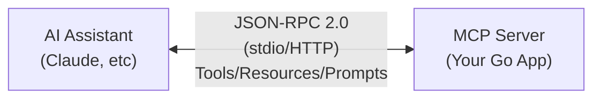

# How to Build an MCP Server in Go

Author: [nawazdhandala](https://github.com/nawazdhandala)

Tags: Go, MCP, Model Context Protocol, AI, LLM, Tools

Description: Build an MCP (Model Context Protocol) server in Go to create custom tools that AI assistants can use for automation and integrations.

---

The Model Context Protocol (MCP) is an open standard that enables AI assistants like Claude to interact with external tools, data sources, and services. By building an MCP server, you can extend AI capabilities with custom functionality - from database queries to API integrations, file operations, and beyond.

In this comprehensive guide, we will build a production-ready MCP server in Go from scratch, covering protocol concepts, tool definitions, request handling, and integration with AI assistants.

## What is the Model Context Protocol?

MCP is a JSON-RPC 2.0 based protocol that standardizes how AI models communicate with external tools and resources. It defines three main primitives:

1. **Tools**: Functions that AI can invoke with specific parameters
2. **Resources**: Data sources that AI can read (like files or database records)
3. **Prompts**: Pre-defined prompt templates that help guide AI interactions

The protocol enables bidirectional communication between AI assistants (clients) and your custom servers, allowing seamless integration of external capabilities.

## MCP Architecture Overview

Before diving into code, let us understand the MCP architecture:



The AI assistant acts as the MCP client, sending requests to your server which processes them and returns results.

## Project Setup

Let us start by setting up our Go project structure.

```bash
mkdir mcp-server-go
cd mcp-server-go
go mod init github.com/yourorg/mcp-server-go
```

Create the following directory structure:

```
mcp-server-go/
├── cmd/
│   └── server/
│       └── main.go
├── internal/
│   ├── mcp/
│   │   ├── protocol.go
│   │   ├── server.go
│   │   ├── tools.go
│   │   └── resources.go
│   └── handlers/
│       └── handlers.go
├── go.mod
└── go.sum
```

## Defining MCP Protocol Types

First, we need to define the JSON-RPC and MCP protocol types. These structures form the foundation of all MCP communication.

```go
// internal/mcp/protocol.go
package mcp

import (
	"encoding/json"
)

// JSONRPCRequest represents an incoming JSON-RPC 2.0 request
type JSONRPCRequest struct {
	JSONRPC string          `json:"jsonrpc"`
	ID      interface{}     `json:"id,omitempty"`
	Method  string          `json:"method"`
	Params  json.RawMessage `json:"params,omitempty"`
}

// JSONRPCResponse represents an outgoing JSON-RPC 2.0 response
type JSONRPCResponse struct {
	JSONRPC string          `json:"jsonrpc"`
	ID      interface{}     `json:"id,omitempty"`
	Result  interface{}     `json:"result,omitempty"`
	Error   *JSONRPCError   `json:"error,omitempty"`
}

// JSONRPCError represents a JSON-RPC 2.0 error object
type JSONRPCError struct {
	Code    int         `json:"code"`
	Message string      `json:"message"`
	Data    interface{} `json:"data,omitempty"`
}

// Standard JSON-RPC error codes
const (
	ParseError     = -32700
	InvalidRequest = -32600
	MethodNotFound = -32601
	InvalidParams  = -32602
	InternalError  = -32603
)

// ServerInfo contains metadata about your MCP server
type ServerInfo struct {
	Name    string `json:"name"`
	Version string `json:"version"`
}

// ServerCapabilities declares what features your server supports
type ServerCapabilities struct {
	Tools     *ToolsCapability     `json:"tools,omitempty"`
	Resources *ResourcesCapability `json:"resources,omitempty"`
	Prompts   *PromptsCapability   `json:"prompts,omitempty"`
}

// ToolsCapability indicates the server supports tools
type ToolsCapability struct {
	ListChanged bool `json:"listChanged,omitempty"`
}

// ResourcesCapability indicates the server supports resources
type ResourcesCapability struct {
	Subscribe   bool `json:"subscribe,omitempty"`
	ListChanged bool `json:"listChanged,omitempty"`
}

// PromptsCapability indicates the server supports prompts
type PromptsCapability struct {
	ListChanged bool `json:"listChanged,omitempty"`
}

// InitializeResult is returned when a client connects
type InitializeResult struct {
	ProtocolVersion string             `json:"protocolVersion"`
	Capabilities    ServerCapabilities `json:"capabilities"`
	ServerInfo      ServerInfo         `json:"serverInfo"`
}
```

## Defining Tools with JSON Schema

Tools are the primary way AI assistants interact with your MCP server. Each tool has a name, description, and an input schema defined using JSON Schema.

```go
// internal/mcp/tools.go
package mcp

// Tool represents an MCP tool that AI can invoke
type Tool struct {
	Name        string      `json:"name"`
	Description string      `json:"description,omitempty"`
	InputSchema InputSchema `json:"inputSchema"`
}

// InputSchema defines the parameters a tool accepts using JSON Schema
type InputSchema struct {
	Type       string              `json:"type"`
	Properties map[string]Property `json:"properties,omitempty"`
	Required   []string            `json:"required,omitempty"`
}

// Property defines a single parameter in the input schema
type Property struct {
	Type        string   `json:"type"`
	Description string   `json:"description,omitempty"`
	Enum        []string `json:"enum,omitempty"`
	Default     any      `json:"default,omitempty"`
}

// ToolsListResult contains the list of available tools
type ToolsListResult struct {
	Tools []Tool `json:"tools"`
}

// CallToolParams contains parameters for a tool invocation
type CallToolParams struct {
	Name      string                 `json:"name"`
	Arguments map[string]interface{} `json:"arguments,omitempty"`
}

// CallToolResult contains the result of a tool invocation
type CallToolResult struct {
	Content []ContentBlock `json:"content"`
	IsError bool           `json:"isError,omitempty"`
}

// ContentBlock represents a piece of content in tool results
type ContentBlock struct {
	Type string `json:"type"`
	Text string `json:"text,omitempty"`
}

// NewTextContent creates a text content block for tool responses
func NewTextContent(text string) ContentBlock {
	return ContentBlock{
		Type: "text",
		Text: text,
	}
}

// ToolRegistry manages available tools and their handlers
type ToolRegistry struct {
	tools    map[string]Tool
	handlers map[string]ToolHandler
}

// ToolHandler is a function that processes tool invocations
type ToolHandler func(args map[string]interface{}) (*CallToolResult, error)

// NewToolRegistry creates a new tool registry
func NewToolRegistry() *ToolRegistry {
	return &ToolRegistry{
		tools:    make(map[string]Tool),
		handlers: make(map[string]ToolHandler),
	}
}

// Register adds a tool with its handler to the registry
func (r *ToolRegistry) Register(tool Tool, handler ToolHandler) {
	r.tools[tool.Name] = tool
	r.handlers[tool.Name] = handler
}

// List returns all registered tools
func (r *ToolRegistry) List() []Tool {
	tools := make([]Tool, 0, len(r.tools))
	for _, tool := range r.tools {
		tools = append(tools, tool)
	}
	return tools
}

// Call invokes a tool by name with the given arguments
func (r *ToolRegistry) Call(name string, args map[string]interface{}) (*CallToolResult, error) {
	handler, exists := r.handlers[name]
	if !exists {
		return &CallToolResult{
			Content: []ContentBlock{NewTextContent("Tool not found: " + name)},
			IsError: true,
		}, nil
	}
	return handler(args)
}
```

## Defining Resources

Resources allow AI assistants to read data from your server. They can represent files, database records, API responses, or any other data source.

```go
// internal/mcp/resources.go
package mcp

// Resource represents a data source that AI can read
type Resource struct {
	URI         string `json:"uri"`
	Name        string `json:"name"`
	Description string `json:"description,omitempty"`
	MimeType    string `json:"mimeType,omitempty"`
}

// ResourcesListResult contains the list of available resources
type ResourcesListResult struct {
	Resources []Resource `json:"resources"`
}

// ReadResourceParams contains parameters for reading a resource
type ReadResourceParams struct {
	URI string `json:"uri"`
}

// ReadResourceResult contains the content of a resource
type ReadResourceResult struct {
	Contents []ResourceContent `json:"contents"`
}

// ResourceContent represents the content of a single resource
type ResourceContent struct {
	URI      string `json:"uri"`
	MimeType string `json:"mimeType,omitempty"`
	Text     string `json:"text,omitempty"`
	Blob     string `json:"blob,omitempty"` // Base64 encoded binary data
}

// ResourceRegistry manages available resources and their readers
type ResourceRegistry struct {
	resources map[string]Resource
	readers   map[string]ResourceReader
}

// ResourceReader is a function that reads resource content
type ResourceReader func(uri string) (*ReadResourceResult, error)

// NewResourceRegistry creates a new resource registry
func NewResourceRegistry() *ResourceRegistry {
	return &ResourceRegistry{
		resources: make(map[string]Resource),
		readers:   make(map[string]ResourceReader),
	}
}

// Register adds a resource with its reader to the registry
func (r *ResourceRegistry) Register(resource Resource, reader ResourceReader) {
	r.resources[resource.URI] = resource
	r.readers[resource.URI] = reader
}

// List returns all registered resources
func (r *ResourceRegistry) List() []Resource {
	resources := make([]Resource, 0, len(r.resources))
	for _, res := range r.resources {
		resources = append(resources, res)
	}
	return resources
}

// Read retrieves the content of a resource by URI
func (r *ResourceRegistry) Read(uri string) (*ReadResourceResult, error) {
	reader, exists := r.readers[uri]
	if !exists {
		return nil, &JSONRPCError{
			Code:    InvalidParams,
			Message: "Resource not found: " + uri,
		}
	}
	return reader(uri)
}
```

## Building the MCP Server

Now let us build the core MCP server that handles incoming requests and routes them to appropriate handlers.

```go
// internal/mcp/server.go
package mcp

import (
	"bufio"
	"context"
	"encoding/json"
	"fmt"
	"io"
	"log"
	"os"
	"sync"
)

// Server is the main MCP server that handles client connections
type Server struct {
	name      string
	version   string
	tools     *ToolRegistry
	resources *ResourceRegistry
	reader    *bufio.Reader
	writer    io.Writer
	mu        sync.Mutex
}

// NewServer creates a new MCP server instance
func NewServer(name, version string) *Server {
	return &Server{
		name:      name,
		version:   version,
		tools:     NewToolRegistry(),
		resources: NewResourceRegistry(),
		reader:    bufio.NewReader(os.Stdin),
		writer:    os.Stdout,
	}
}

// Tools returns the tool registry for registering tools
func (s *Server) Tools() *ToolRegistry {
	return s.tools
}

// Resources returns the resource registry for registering resources
func (s *Server) Resources() *ResourceRegistry {
	return s.resources
}

// Run starts the MCP server and processes incoming requests
func (s *Server) Run(ctx context.Context) error {
	log.Println("MCP server starting...")

	for {
		select {
		case <-ctx.Done():
			return ctx.Err()
		default:
			// Read a line from stdin (JSON-RPC request)
			line, err := s.reader.ReadBytes('\n')
			if err != nil {
				if err == io.EOF {
					return nil
				}
				return fmt.Errorf("failed to read request: %w", err)
			}

			// Process the request
			response := s.handleRequest(line)
			if response != nil {
				s.sendResponse(response)
			}
		}
	}
}

// handleRequest parses and routes an incoming JSON-RPC request
func (s *Server) handleRequest(data []byte) *JSONRPCResponse {
	var req JSONRPCRequest
	if err := json.Unmarshal(data, &req); err != nil {
		return &JSONRPCResponse{
			JSONRPC: "2.0",
			Error: &JSONRPCError{
				Code:    ParseError,
				Message: "Failed to parse request",
			},
		}
	}

	// Route the request to the appropriate handler
	result, err := s.routeRequest(&req)
	if err != nil {
		rpcErr, ok := err.(*JSONRPCError)
		if !ok {
			rpcErr = &JSONRPCError{
				Code:    InternalError,
				Message: err.Error(),
			}
		}
		return &JSONRPCResponse{
			JSONRPC: "2.0",
			ID:      req.ID,
			Error:   rpcErr,
		}
	}

	// Notifications (no ID) don't get responses
	if req.ID == nil {
		return nil
	}

	return &JSONRPCResponse{
		JSONRPC: "2.0",
		ID:      req.ID,
		Result:  result,
	}
}

// routeRequest dispatches requests to the appropriate method handler
func (s *Server) routeRequest(req *JSONRPCRequest) (interface{}, error) {
	switch req.Method {
	case "initialize":
		return s.handleInitialize(req)
	case "initialized":
		// Client notification - no response needed
		return nil, nil
	case "tools/list":
		return s.handleToolsList()
	case "tools/call":
		return s.handleToolsCall(req)
	case "resources/list":
		return s.handleResourcesList()
	case "resources/read":
		return s.handleResourcesRead(req)
	default:
		return nil, &JSONRPCError{
			Code:    MethodNotFound,
			Message: "Method not found: " + req.Method,
		}
	}
}

// handleInitialize processes the initialize request from clients
func (s *Server) handleInitialize(req *JSONRPCRequest) (*InitializeResult, error) {
	return &InitializeResult{
		ProtocolVersion: "2024-11-05",
		Capabilities: ServerCapabilities{
			Tools:     &ToolsCapability{},
			Resources: &ResourcesCapability{},
		},
		ServerInfo: ServerInfo{
			Name:    s.name,
			Version: s.version,
		},
	}, nil
}

// handleToolsList returns the list of available tools
func (s *Server) handleToolsList() (*ToolsListResult, error) {
	return &ToolsListResult{
		Tools: s.tools.List(),
	}, nil
}

// handleToolsCall invokes a tool and returns the result
func (s *Server) handleToolsCall(req *JSONRPCRequest) (*CallToolResult, error) {
	var params CallToolParams
	if err := json.Unmarshal(req.Params, &params); err != nil {
		return nil, &JSONRPCError{
			Code:    InvalidParams,
			Message: "Invalid tool call parameters",
		}
	}

	return s.tools.Call(params.Name, params.Arguments)
}

// handleResourcesList returns the list of available resources
func (s *Server) handleResourcesList() (*ResourcesListResult, error) {
	return &ResourcesListResult{
		Resources: s.resources.List(),
	}, nil
}

// handleResourcesRead reads and returns a resource's content
func (s *Server) handleResourcesRead(req *JSONRPCRequest) (*ReadResourceResult, error) {
	var params ReadResourceParams
	if err := json.Unmarshal(req.Params, &params); err != nil {
		return nil, &JSONRPCError{
			Code:    InvalidParams,
			Message: "Invalid resource read parameters",
		}
	}

	return s.resources.Read(params.URI)
}

// sendResponse writes a JSON-RPC response to stdout
func (s *Server) sendResponse(resp *JSONRPCResponse) {
	s.mu.Lock()
	defer s.mu.Unlock()

	data, err := json.Marshal(resp)
	if err != nil {
		log.Printf("Failed to marshal response: %v", err)
		return
	}

	fmt.Fprintf(s.writer, "%s\n", data)
}
```

## Creating Tool Handlers

Now let us create some practical tool handlers. We will build tools for common operations like executing shell commands, making HTTP requests, and working with files.

```go
// internal/handlers/handlers.go
package handlers

import (
	"bytes"
	"encoding/json"
	"fmt"
	"io"
	"net/http"
	"os"
	"os/exec"
	"strings"
	"time"

	"github.com/yourorg/mcp-server-go/internal/mcp"
)

// RegisterAllTools registers all available tools with the server
func RegisterAllTools(server *mcp.Server) {
	registerShellTool(server)
	registerHTTPTool(server)
	registerFileTool(server)
	registerSystemInfoTool(server)
}

// registerShellTool adds a tool for executing shell commands
func registerShellTool(server *mcp.Server) {
	tool := mcp.Tool{
		Name:        "execute_command",
		Description: "Execute a shell command and return the output",
		InputSchema: mcp.InputSchema{
			Type: "object",
			Properties: map[string]mcp.Property{
				"command": {
					Type:        "string",
					Description: "The shell command to execute",
				},
				"timeout": {
					Type:        "integer",
					Description: "Timeout in seconds (default: 30)",
					Default:     30,
				},
			},
			Required: []string{"command"},
		},
	}

	handler := func(args map[string]interface{}) (*mcp.CallToolResult, error) {
		command, _ := args["command"].(string)
		timeout := 30
		if t, ok := args["timeout"].(float64); ok {
			timeout = int(t)
		}

		// Create command with timeout context
		cmd := exec.Command("sh", "-c", command)
		var stdout, stderr bytes.Buffer
		cmd.Stdout = &stdout
		cmd.Stderr = &stderr

		// Run with timeout
		done := make(chan error)
		go func() {
			done <- cmd.Run()
		}()

		select {
		case err := <-done:
			output := stdout.String()
			if stderr.Len() > 0 {
				output += "\nSTDERR:\n" + stderr.String()
			}
			if err != nil {
				return &mcp.CallToolResult{
					Content: []mcp.ContentBlock{
						mcp.NewTextContent(fmt.Sprintf("Command failed: %v\n%s", err, output)),
					},
					IsError: true,
				}, nil
			}
			return &mcp.CallToolResult{
				Content: []mcp.ContentBlock{mcp.NewTextContent(output)},
			}, nil

		case <-time.After(time.Duration(timeout) * time.Second):
			cmd.Process.Kill()
			return &mcp.CallToolResult{
				Content: []mcp.ContentBlock{
					mcp.NewTextContent("Command timed out"),
				},
				IsError: true,
			}, nil
		}
	}

	server.Tools().Register(tool, handler)
}

// registerHTTPTool adds a tool for making HTTP requests
func registerHTTPTool(server *mcp.Server) {
	tool := mcp.Tool{
		Name:        "http_request",
		Description: "Make an HTTP request to a URL",
		InputSchema: mcp.InputSchema{
			Type: "object",
			Properties: map[string]mcp.Property{
				"url": {
					Type:        "string",
					Description: "The URL to request",
				},
				"method": {
					Type:        "string",
					Description: "HTTP method (GET, POST, PUT, DELETE)",
					Enum:        []string{"GET", "POST", "PUT", "DELETE"},
					Default:     "GET",
				},
				"body": {
					Type:        "string",
					Description: "Request body (for POST/PUT)",
				},
				"headers": {
					Type:        "object",
					Description: "HTTP headers as key-value pairs",
				},
			},
			Required: []string{"url"},
		},
	}

	handler := func(args map[string]interface{}) (*mcp.CallToolResult, error) {
		url, _ := args["url"].(string)
		method := "GET"
		if m, ok := args["method"].(string); ok {
			method = m
		}

		var bodyReader io.Reader
		if body, ok := args["body"].(string); ok && body != "" {
			bodyReader = strings.NewReader(body)
		}

		req, err := http.NewRequest(method, url, bodyReader)
		if err != nil {
			return &mcp.CallToolResult{
				Content: []mcp.ContentBlock{
					mcp.NewTextContent(fmt.Sprintf("Failed to create request: %v", err)),
				},
				IsError: true,
			}, nil
		}

		// Add custom headers
		if headers, ok := args["headers"].(map[string]interface{}); ok {
			for key, value := range headers {
				if v, ok := value.(string); ok {
					req.Header.Set(key, v)
				}
			}
		}

		client := &http.Client{Timeout: 30 * time.Second}
		resp, err := client.Do(req)
		if err != nil {
			return &mcp.CallToolResult{
				Content: []mcp.ContentBlock{
					mcp.NewTextContent(fmt.Sprintf("Request failed: %v", err)),
				},
				IsError: true,
			}, nil
		}
		defer resp.Body.Close()

		body, _ := io.ReadAll(resp.Body)
		result := fmt.Sprintf("Status: %s\n\n%s", resp.Status, string(body))

		return &mcp.CallToolResult{
			Content: []mcp.ContentBlock{mcp.NewTextContent(result)},
		}, nil
	}

	server.Tools().Register(tool, handler)
}

// registerFileTool adds tools for file operations
func registerFileTool(server *mcp.Server) {
	// Read file tool
	readTool := mcp.Tool{
		Name:        "read_file",
		Description: "Read the contents of a file",
		InputSchema: mcp.InputSchema{
			Type: "object",
			Properties: map[string]mcp.Property{
				"path": {
					Type:        "string",
					Description: "The file path to read",
				},
			},
			Required: []string{"path"},
		},
	}

	readHandler := func(args map[string]interface{}) (*mcp.CallToolResult, error) {
		path, _ := args["path"].(string)

		content, err := os.ReadFile(path)
		if err != nil {
			return &mcp.CallToolResult{
				Content: []mcp.ContentBlock{
					mcp.NewTextContent(fmt.Sprintf("Failed to read file: %v", err)),
				},
				IsError: true,
			}, nil
		}

		return &mcp.CallToolResult{
			Content: []mcp.ContentBlock{mcp.NewTextContent(string(content))},
		}, nil
	}

	server.Tools().Register(readTool, readHandler)

	// Write file tool
	writeTool := mcp.Tool{
		Name:        "write_file",
		Description: "Write content to a file",
		InputSchema: mcp.InputSchema{
			Type: "object",
			Properties: map[string]mcp.Property{
				"path": {
					Type:        "string",
					Description: "The file path to write",
				},
				"content": {
					Type:        "string",
					Description: "The content to write",
				},
			},
			Required: []string{"path", "content"},
		},
	}

	writeHandler := func(args map[string]interface{}) (*mcp.CallToolResult, error) {
		path, _ := args["path"].(string)
		content, _ := args["content"].(string)

		err := os.WriteFile(path, []byte(content), 0644)
		if err != nil {
			return &mcp.CallToolResult{
				Content: []mcp.ContentBlock{
					mcp.NewTextContent(fmt.Sprintf("Failed to write file: %v", err)),
				},
				IsError: true,
			}, nil
		}

		return &mcp.CallToolResult{
			Content: []mcp.ContentBlock{
				mcp.NewTextContent(fmt.Sprintf("Successfully wrote %d bytes to %s", len(content), path)),
			},
		}, nil
	}

	server.Tools().Register(writeTool, writeHandler)
}

// registerSystemInfoTool adds a tool to get system information
func registerSystemInfoTool(server *mcp.Server) {
	tool := mcp.Tool{
		Name:        "system_info",
		Description: "Get system information including hostname, OS, and environment",
		InputSchema: mcp.InputSchema{
			Type:       "object",
			Properties: map[string]mcp.Property{},
		},
	}

	handler := func(args map[string]interface{}) (*mcp.CallToolResult, error) {
		hostname, _ := os.Hostname()
		wd, _ := os.Getwd()

		info := map[string]interface{}{
			"hostname":    hostname,
			"working_dir": wd,
			"go_version":  "go1.21",
			"pid":         os.Getpid(),
			"uid":         os.Getuid(),
		}

		jsonData, _ := json.MarshalIndent(info, "", "  ")
		return &mcp.CallToolResult{
			Content: []mcp.ContentBlock{mcp.NewTextContent(string(jsonData))},
		}, nil
	}

	server.Tools().Register(tool, handler)
}
```

## Main Server Entry Point

Now let us create the main entry point that ties everything together.

```go
// cmd/server/main.go
package main

import (
	"context"
	"log"
	"os"
	"os/signal"
	"syscall"

	"github.com/yourorg/mcp-server-go/internal/handlers"
	"github.com/yourorg/mcp-server-go/internal/mcp"
)

func main() {
	// Create the MCP server
	server := mcp.NewServer("go-mcp-server", "1.0.0")

	// Register all tool handlers
	handlers.RegisterAllTools(server)

	// Register sample resources
	registerResources(server)

	// Create context with cancellation for graceful shutdown
	ctx, cancel := context.WithCancel(context.Background())
	defer cancel()

	// Handle shutdown signals
	sigChan := make(chan os.Signal, 1)
	signal.Notify(sigChan, syscall.SIGINT, syscall.SIGTERM)

	go func() {
		<-sigChan
		log.Println("Received shutdown signal")
		cancel()
	}()

	// Run the server
	if err := server.Run(ctx); err != nil {
		log.Fatalf("Server error: %v", err)
	}
}

// registerResources adds sample resources to the server
func registerResources(server *mcp.Server) {
	// Register a configuration resource
	configResource := mcp.Resource{
		URI:         "config://app/settings",
		Name:        "Application Settings",
		Description: "Current application configuration",
		MimeType:    "application/json",
	}

	configReader := func(uri string) (*mcp.ReadResourceResult, error) {
		config := map[string]interface{}{
			"debug":       true,
			"max_workers": 4,
			"timeout":     30,
			"features": map[string]bool{
				"caching":    true,
				"logging":    true,
				"monitoring": false,
			},
		}

		data, _ := json.MarshalIndent(config, "", "  ")
		return &mcp.ReadResourceResult{
			Contents: []mcp.ResourceContent{
				{
					URI:      uri,
					MimeType: "application/json",
					Text:     string(data),
				},
			},
		}, nil
	}

	server.Resources().Register(configResource, configReader)
}
```

## Error Handling Best Practices

Proper error handling is critical in MCP servers. Here are patterns to follow for robust error management.

```go
// internal/mcp/errors.go
package mcp

import "fmt"

// ToolError represents an error that occurred during tool execution
type ToolError struct {
	ToolName string
	Message  string
	Cause    error
}

func (e *ToolError) Error() string {
	if e.Cause != nil {
		return fmt.Sprintf("tool '%s' failed: %s (caused by: %v)", e.ToolName, e.Message, e.Cause)
	}
	return fmt.Sprintf("tool '%s' failed: %s", e.ToolName, e.Message)
}

// NewToolError creates a new tool error
func NewToolError(toolName, message string, cause error) *ToolError {
	return &ToolError{
		ToolName: toolName,
		Message:  message,
		Cause:    cause,
	}
}

// ValidationError represents an input validation error
type ValidationError struct {
	Field   string
	Message string
}

func (e *ValidationError) Error() string {
	return fmt.Sprintf("validation error for '%s': %s", e.Field, e.Message)
}

// ErrorResult creates a CallToolResult indicating an error
func ErrorResult(message string) *CallToolResult {
	return &CallToolResult{
		Content: []ContentBlock{NewTextContent(message)},
		IsError: true,
	}
}

// SuccessResult creates a CallToolResult with successful output
func SuccessResult(text string) *CallToolResult {
	return &CallToolResult{
		Content: []ContentBlock{NewTextContent(text)},
		IsError: false,
	}
}
```

## Testing MCP Servers

Testing is essential to ensure your MCP server works correctly. Here is a comprehensive test setup.

```go
// internal/mcp/server_test.go
package mcp

import (
	"bytes"
	"encoding/json"
	"testing"
)

// TestToolRegistration verifies tools can be registered and listed
func TestToolRegistration(t *testing.T) {
	registry := NewToolRegistry()

	tool := Tool{
		Name:        "test_tool",
		Description: "A test tool",
		InputSchema: InputSchema{
			Type: "object",
			Properties: map[string]Property{
				"input": {Type: "string"},
			},
		},
	}

	handler := func(args map[string]interface{}) (*CallToolResult, error) {
		return SuccessResult("test output"), nil
	}

	registry.Register(tool, handler)

	tools := registry.List()
	if len(tools) != 1 {
		t.Errorf("Expected 1 tool, got %d", len(tools))
	}

	if tools[0].Name != "test_tool" {
		t.Errorf("Expected tool name 'test_tool', got '%s'", tools[0].Name)
	}
}

// TestToolInvocation verifies tools can be invoked correctly
func TestToolInvocation(t *testing.T) {
	registry := NewToolRegistry()

	tool := Tool{
		Name: "echo",
		InputSchema: InputSchema{
			Type: "object",
			Properties: map[string]Property{
				"message": {Type: "string"},
			},
		},
	}

	handler := func(args map[string]interface{}) (*CallToolResult, error) {
		msg := args["message"].(string)
		return SuccessResult("Echo: " + msg), nil
	}

	registry.Register(tool, handler)

	result, err := registry.Call("echo", map[string]interface{}{
		"message": "Hello, MCP!",
	})

	if err != nil {
		t.Fatalf("Unexpected error: %v", err)
	}

	if result.IsError {
		t.Error("Expected success, got error")
	}

	if result.Content[0].Text != "Echo: Hello, MCP!" {
		t.Errorf("Unexpected result: %s", result.Content[0].Text)
	}
}

// TestUnknownTool verifies proper error handling for unknown tools
func TestUnknownTool(t *testing.T) {
	registry := NewToolRegistry()

	result, err := registry.Call("nonexistent", nil)

	if err != nil {
		t.Fatalf("Unexpected error: %v", err)
	}

	if !result.IsError {
		t.Error("Expected error result for unknown tool")
	}
}

// TestJSONRPCParsing verifies JSON-RPC request parsing
func TestJSONRPCParsing(t *testing.T) {
	request := JSONRPCRequest{
		JSONRPC: "2.0",
		ID:      1,
		Method:  "tools/list",
	}

	data, err := json.Marshal(request)
	if err != nil {
		t.Fatalf("Failed to marshal request: %v", err)
	}

	var parsed JSONRPCRequest
	if err := json.Unmarshal(data, &parsed); err != nil {
		t.Fatalf("Failed to unmarshal request: %v", err)
	}

	if parsed.Method != "tools/list" {
		t.Errorf("Expected method 'tools/list', got '%s'", parsed.Method)
	}
}

// TestResourceRegistry verifies resource registration and reading
func TestResourceRegistry(t *testing.T) {
	registry := NewResourceRegistry()

	resource := Resource{
		URI:      "test://resource",
		Name:     "Test Resource",
		MimeType: "text/plain",
	}

	reader := func(uri string) (*ReadResourceResult, error) {
		return &ReadResourceResult{
			Contents: []ResourceContent{
				{URI: uri, Text: "Test content"},
			},
		}, nil
	}

	registry.Register(resource, reader)

	result, err := registry.Read("test://resource")
	if err != nil {
		t.Fatalf("Unexpected error: %v", err)
	}

	if result.Contents[0].Text != "Test content" {
		t.Errorf("Unexpected content: %s", result.Contents[0].Text)
	}
}
```

## Integration with Claude and AI Assistants

To use your MCP server with Claude Desktop or other AI assistants, you need to configure the client. Here is the configuration for Claude Desktop.

Create or edit `~/Library/Application Support/Claude/claude_desktop_config.json` on macOS:

```json
{
  "mcpServers": {
    "go-mcp-server": {
      "command": "/path/to/your/mcp-server-go",
      "args": [],
      "env": {
        "CUSTOM_VAR": "value"
      }
    }
  }
}
```

For other platforms, the configuration file location differs:

- **Windows**: `%APPDATA%\Claude\claude_desktop_config.json`
- **Linux**: `~/.config/Claude/claude_desktop_config.json`

## Building and Running

Build your MCP server:

```bash
# Build the server binary
go build -o mcp-server ./cmd/server

# Run the server (for testing)
./mcp-server
```

For development and debugging, you can test the server manually:

```bash
# Send an initialize request
echo '{"jsonrpc":"2.0","id":1,"method":"initialize","params":{}}' | ./mcp-server

# List available tools
echo '{"jsonrpc":"2.0","id":2,"method":"tools/list"}' | ./mcp-server

# Call a tool
echo '{"jsonrpc":"2.0","id":3,"method":"tools/call","params":{"name":"system_info","arguments":{}}}' | ./mcp-server
```

## Advanced Features

### Adding Prompts

Prompts allow you to define reusable prompt templates that AI assistants can use:

```go
// Prompt represents a reusable prompt template
type Prompt struct {
	Name        string           `json:"name"`
	Description string           `json:"description,omitempty"`
	Arguments   []PromptArgument `json:"arguments,omitempty"`
}

// PromptArgument defines an argument for a prompt template
type PromptArgument struct {
	Name        string `json:"name"`
	Description string `json:"description,omitempty"`
	Required    bool   `json:"required,omitempty"`
}

// PromptsListResult contains available prompt templates
type PromptsListResult struct {
	Prompts []Prompt `json:"prompts"`
}
```

### Implementing Streaming Responses

For long-running operations, you may want to stream progress updates:

```go
// ProgressToken is used for streaming progress updates
type ProgressToken string

// ProgressNotification sends progress updates to the client
type ProgressNotification struct {
	ProgressToken ProgressToken `json:"progressToken"`
	Progress      float64       `json:"progress"`
	Total         float64       `json:"total,omitempty"`
}
```

## Security Considerations

When building MCP servers, keep these security practices in mind:

1. **Input Validation**: Always validate and sanitize tool inputs
2. **Command Injection**: Be extremely careful with shell command execution
3. **File Access**: Restrict file operations to safe directories
4. **Rate Limiting**: Implement rate limiting for resource-intensive operations
5. **Authentication**: Consider adding authentication for sensitive operations

```go
// Example: Validating file paths to prevent directory traversal
func validateFilePath(path string) error {
	// Ensure path is absolute and within allowed directories
	absPath, err := filepath.Abs(path)
	if err != nil {
		return err
	}

	allowedDirs := []string{"/home/user/data", "/tmp"}
	for _, dir := range allowedDirs {
		if strings.HasPrefix(absPath, dir) {
			return nil
		}
	}

	return fmt.Errorf("access denied: path outside allowed directories")
}
```

## Conclusion

Building an MCP server in Go enables you to create powerful, custom integrations for AI assistants like Claude. With the foundation covered in this guide, you can:

- Create tools that extend AI capabilities with custom functionality
- Expose resources for AI to read and analyze
- Handle errors gracefully and securely
- Test your server thoroughly
- Integrate with Claude Desktop and other MCP-compatible clients

The Model Context Protocol opens up endless possibilities for AI automation and integration. Whether you are building internal tools, connecting to APIs, or automating workflows, Go's performance and simplicity make it an excellent choice for MCP server development.

## Additional Resources

- [Model Context Protocol Specification](https://modelcontextprotocol.io/)
- [MCP Go SDK](https://github.com/modelcontextprotocol/go-sdk)
- [Claude Desktop MCP Documentation](https://docs.anthropic.com/claude/docs/mcp)
- [JSON-RPC 2.0 Specification](https://www.jsonrpc.org/specification)
