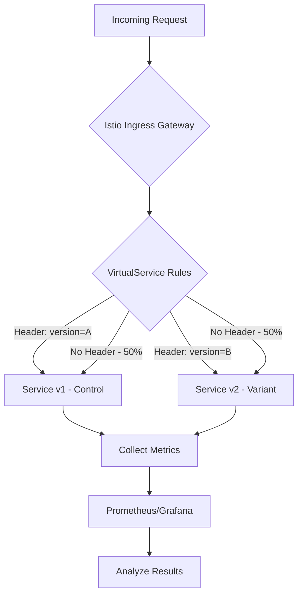
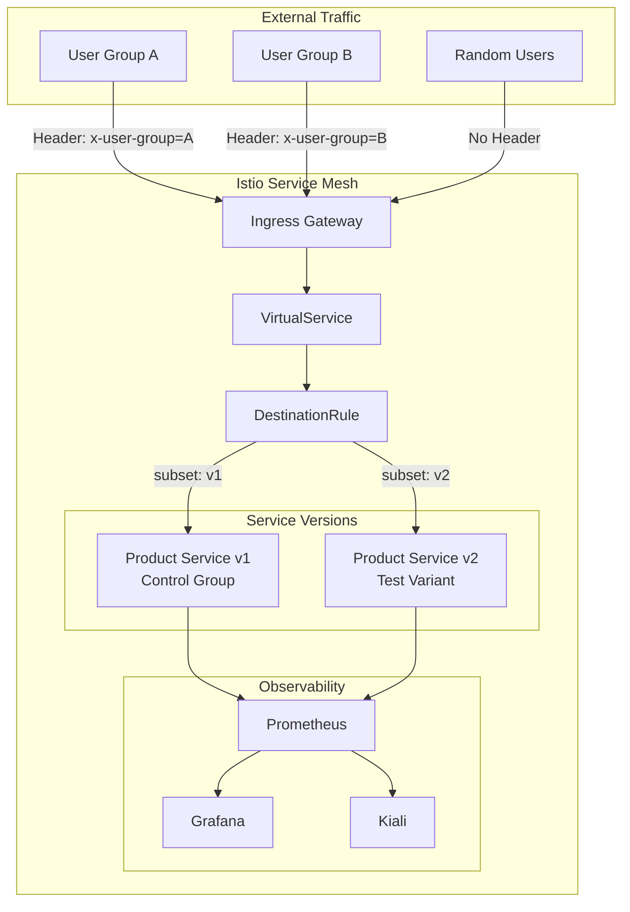
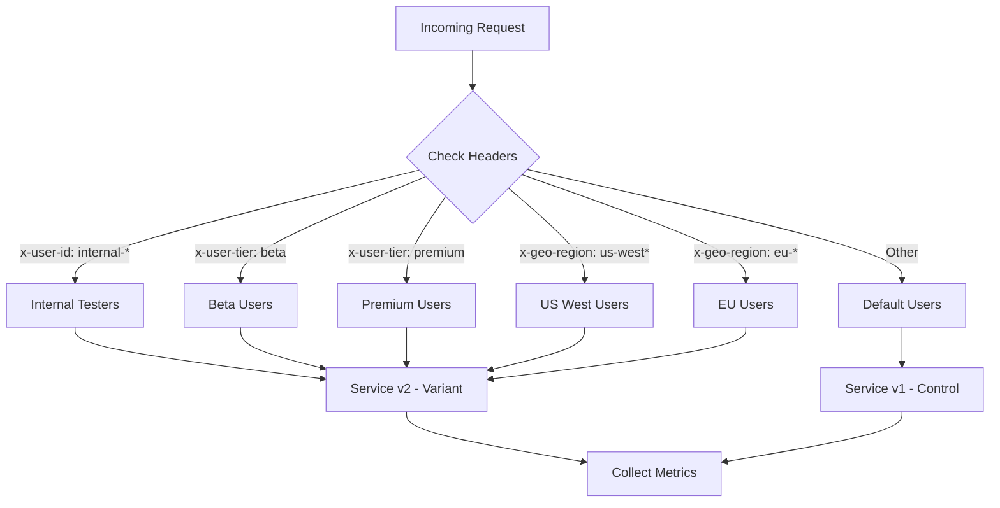
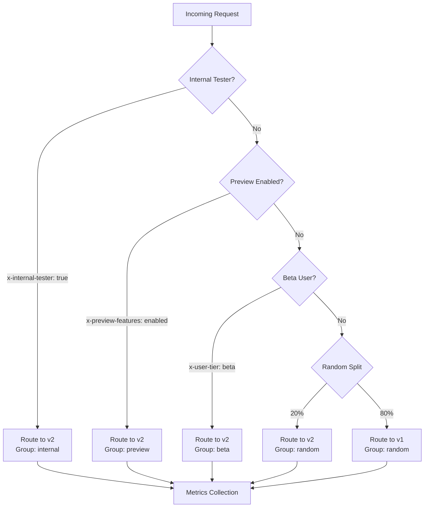

# How to Set Up A/B Testing with Istio

Author: [nawazdhandala](https://github.com/nawazdhandala)

Tags: Istio, A/B Testing, Service Mesh, Kubernetes, Traffic Management

Description: Learn how to implement A/B testing using Istio's traffic routing capabilities.

---

A/B testing is a fundamental practice for validating changes in production environments. With Istio's powerful traffic management capabilities, you can implement sophisticated A/B testing strategies without modifying your application code. This guide covers header-based routing, user segment targeting, percentage-based traffic splits, and metrics collection for comprehensive A/B testing analysis.

## Table of Contents

1. [Understanding A/B Testing with Istio](#understanding-ab-testing-with-istio)
2. [Prerequisites](#prerequisites)
3. [Architecture Overview](#architecture-overview)
4. [Setting Up the Sample Application](#setting-up-the-sample-application)
5. [Header-Based Routing for A/B Tests](#header-based-routing-for-ab-tests)
6. [User Segment Routing](#user-segment-routing)
7. [Percentage-Based Traffic Splits](#percentage-based-traffic-splits)
8. [Combining Multiple Routing Strategies](#combining-multiple-routing-strategies)
9. [Metrics Collection for A/B Analysis](#metrics-collection-for-ab-analysis)
10. [Best Practices](#best-practices)
11. [Troubleshooting](#troubleshooting)
12. [Conclusion](#conclusion)

## Understanding A/B Testing with Istio

A/B testing allows you to compare two or more versions of a service to determine which performs better. Istio's service mesh provides traffic routing at the network layer, enabling you to:

- Route traffic based on HTTP headers, cookies, or other request attributes
- Split traffic by percentage between different service versions
- Target specific user segments for testing
- Collect detailed metrics for each version

### How Istio Enables A/B Testing

Istio uses **VirtualServices** and **DestinationRules** to control traffic routing:



## Prerequisites

Before implementing A/B testing with Istio, ensure you have:

- A Kubernetes cluster (1.24+)
- Istio installed (1.18+ recommended)
- kubectl configured to access your cluster
- Basic understanding of Kubernetes and Istio concepts

The following command verifies your Istio installation is ready for A/B testing configurations:

```bash
# Verify Istio installation and check that all components are running
istioctl version

# Check that Istio pods are healthy in the istio-system namespace
kubectl get pods -n istio-system

# Verify the Istio ingress gateway is available for routing external traffic
kubectl get svc istio-ingressgateway -n istio-system
```

## Architecture Overview

The following diagram illustrates the complete A/B testing architecture with Istio:



## Setting Up the Sample Application

Let's create a sample application with two versions to demonstrate A/B testing capabilities.

This namespace configuration enables Istio sidecar injection, which is required for traffic management features:

```yaml
# namespace.yaml
# Create a dedicated namespace for our A/B testing demonstration
# The istio-injection label ensures all pods get the Envoy sidecar proxy
apiVersion: v1
kind: Namespace
metadata:
  name: ab-testing-demo
  labels:
    # This label enables automatic sidecar injection for all pods in this namespace
    istio-injection: enabled
```

This deployment creates Version 1 (Control) of our product service, which serves as the baseline:

```yaml
# product-service-v1.yaml
# Version 1 of the product service - serves as our control group in A/B tests
# This is the stable, production-proven version of the service
apiVersion: apps/v1
kind: Deployment
metadata:
  name: product-service-v1
  namespace: ab-testing-demo
  labels:
    app: product-service
    # The version label is crucial for Istio's DestinationRule to identify this subset
    version: v1
spec:
  replicas: 3
  selector:
    matchLabels:
      app: product-service
      version: v1
  template:
    metadata:
      labels:
        app: product-service
        version: v1
      annotations:
        # Enable Prometheus metrics scraping from this pod
        prometheus.io/scrape: "true"
        prometheus.io/port: "8080"
    spec:
      containers:
      - name: product-service
        image: product-service:1.0.0
        ports:
        - containerPort: 8080
        env:
        # Environment variable to identify this version in responses and logs
        - name: SERVICE_VERSION
          value: "v1"
        # Feature flag for the control group - uses original algorithm
        - name: FEATURE_NEW_RECOMMENDATION
          value: "false"
        resources:
          requests:
            memory: "128Mi"
            cpu: "100m"
          limits:
            memory: "256Mi"
            cpu: "200m"
        # Health checks ensure traffic is only routed to healthy pods
        readinessProbe:
          httpGet:
            path: /health
            port: 8080
          initialDelaySeconds: 5
          periodSeconds: 10
        livenessProbe:
          httpGet:
            path: /health
            port: 8080
          initialDelaySeconds: 15
          periodSeconds: 20
```

This deployment creates Version 2 (Variant) with the new feature being tested:

```yaml
# product-service-v2.yaml
# Version 2 of the product service - the test variant with new features
# This version contains the changes we want to validate through A/B testing
apiVersion: apps/v1
kind: Deployment
metadata:
  name: product-service-v2
  namespace: ab-testing-demo
  labels:
    app: product-service
    # Different version label allows Istio to route traffic to this specific deployment
    version: v2
spec:
  # Start with fewer replicas for the test variant
  replicas: 2
  selector:
    matchLabels:
      app: product-service
      version: v2
  template:
    metadata:
      labels:
        app: product-service
        version: v2
      annotations:
        prometheus.io/scrape: "true"
        prometheus.io/port: "8080"
    spec:
      containers:
      - name: product-service
        # New version of the container image with updated features
        image: product-service:2.0.0
        ports:
        - containerPort: 8080
        env:
        - name: SERVICE_VERSION
          value: "v2"
        # Feature flag enabled - this is the change we're testing
        - name: FEATURE_NEW_RECOMMENDATION
          value: "true"
        resources:
          requests:
            memory: "128Mi"
            cpu: "100m"
          limits:
            memory: "256Mi"
            cpu: "200m"
        readinessProbe:
          httpGet:
            path: /health
            port: 8080
          initialDelaySeconds: 5
          periodSeconds: 10
        livenessProbe:
          httpGet:
            path: /health
            port: 8080
          initialDelaySeconds: 15
          periodSeconds: 20
```

This Service resource provides a single endpoint that Istio will use for routing to both versions:

```yaml
# product-service.yaml
# A single Kubernetes Service that fronts both v1 and v2 deployments
# Istio's VirtualService will handle routing to specific versions
apiVersion: v1
kind: Service
metadata:
  name: product-service
  namespace: ab-testing-demo
  labels:
    app: product-service
spec:
  ports:
  - port: 80
    targetPort: 8080
    name: http
  # Selector matches both v1 and v2 pods - Istio handles version routing
  selector:
    app: product-service
```

Apply all the resources to set up the sample application:

```bash
# Apply all the configurations to create our A/B testing environment
kubectl apply -f namespace.yaml
kubectl apply -f product-service-v1.yaml
kubectl apply -f product-service-v2.yaml
kubectl apply -f product-service.yaml

# Verify both versions are running and ready to receive traffic
kubectl get pods -n ab-testing-demo -l app=product-service
```

## Header-Based Routing for A/B Tests

Header-based routing is the most precise method for A/B testing, allowing you to explicitly control which users see which version.

### Basic Header Routing

This DestinationRule defines subsets for each version, which the VirtualService will reference:

```yaml
# destination-rule.yaml
# DestinationRule defines traffic policies and subsets for the product-service
# Subsets allow VirtualService to route to specific versions of the service
apiVersion: networking.istio.io/v1beta1
kind: DestinationRule
metadata:
  name: product-service-destination
  namespace: ab-testing-demo
spec:
  # The host must match the Kubernetes Service name
  host: product-service
  # Traffic policy applies to all subsets unless overridden
  trafficPolicy:
    # Connection pool settings prevent overwhelming the service
    connectionPool:
      tcp:
        maxConnections: 100
      http:
        h2UpgradePolicy: UPGRADE
        http1MaxPendingRequests: 100
        http2MaxRequests: 1000
  subsets:
  # Subset v1 routes to pods with version=v1 label
  - name: v1
    labels:
      version: v1
  # Subset v2 routes to pods with version=v2 label
  - name: v2
    labels:
      version: v2
```

This VirtualService implements header-based routing to direct users to specific versions:

```yaml
# virtual-service-header-routing.yaml
# VirtualService with header-based routing for controlled A/B testing
# Users with specific headers are routed to the appropriate version
apiVersion: networking.istio.io/v1beta1
kind: VirtualService
metadata:
  name: product-service-ab-test
  namespace: ab-testing-demo
spec:
  hosts:
  - product-service
  http:
  # Rule 1: Route requests with x-ab-test header set to "variant" to v2
  # This allows explicit testing of the new version
  - match:
    - headers:
        x-ab-test:
          # exact match ensures only "variant" value triggers this route
          exact: "variant"
    route:
    - destination:
        host: product-service
        subset: v2
    # Add response header to confirm which version handled the request
    headers:
      response:
        add:
          x-served-by: "product-service-v2"

  # Rule 2: Route requests with x-ab-test header set to "control" to v1
  # Explicit routing to the control group
  - match:
    - headers:
        x-ab-test:
          exact: "control"
    route:
    - destination:
        host: product-service
        subset: v1
    headers:
      response:
        add:
          x-served-by: "product-service-v1"

  # Rule 3: Default route - all other traffic goes to v1 (safe default)
  # This ensures unknown traffic doesn't accidentally hit the test variant
  - route:
    - destination:
        host: product-service
        subset: v1
    headers:
      response:
        add:
          x-served-by: "product-service-v1-default"
```

Test the header-based routing configuration:

```bash
# Test routing to the variant (v2) using the x-ab-test header
# The -H flag adds a custom header to the request
curl -H "x-ab-test: variant" http://product-service.ab-testing-demo/api/products

# Test routing to the control (v1) using the x-ab-test header
curl -H "x-ab-test: control" http://product-service.ab-testing-demo/api/products

# Test default routing when no header is present (should go to v1)
curl http://product-service.ab-testing-demo/api/products
```

### Cookie-Based Routing

For web applications, cookie-based routing provides a seamless user experience by maintaining consistent version assignment:

```yaml
# virtual-service-cookie-routing.yaml
# Cookie-based routing ensures users consistently see the same version
# This is essential for accurate A/B testing to avoid user confusion
apiVersion: networking.istio.io/v1beta1
kind: VirtualService
metadata:
  name: product-service-cookie-ab
  namespace: ab-testing-demo
spec:
  hosts:
  - product-service
  http:
  # Route users with ab_variant cookie to v2
  # The regex matches if the cookie value is exactly "v2"
  - match:
    - headers:
        cookie:
          # Regex pattern to find ab_variant=v2 in the cookie string
          regex: ".*ab_variant=v2.*"
    route:
    - destination:
        host: product-service
        subset: v2

  # Route users with ab_variant=v1 cookie to v1
  - match:
    - headers:
        cookie:
          regex: ".*ab_variant=v1.*"
    route:
    - destination:
        host: product-service
        subset: v1

  # Default route for users without cookies - randomly assign and set cookie
  - route:
    - destination:
        host: product-service
        subset: v1
      weight: 50
    - destination:
        host: product-service
        subset: v2
      weight: 50
```

## User Segment Routing

Target specific user segments based on user attributes like user ID, subscription tier, or geographic location.

### User ID Based Routing

This configuration routes specific users to the test variant while others see the control:

```yaml
# virtual-service-user-segment.yaml
# Route specific users or user segments to different versions
# Useful for internal testing, beta users, or premium customers
apiVersion: networking.istio.io/v1beta1
kind: VirtualService
metadata:
  name: product-service-user-segment
  namespace: ab-testing-demo
spec:
  hosts:
  - product-service
  http:
  # Route internal testers (employee user IDs) to v2
  # The regex matches user IDs starting with "internal-"
  - match:
    - headers:
        x-user-id:
          regex: "^internal-.*"
    route:
    - destination:
        host: product-service
        subset: v2
    # Set header for tracking and debugging
    headers:
      response:
        add:
          x-test-group: "internal-testers"

  # Route beta program users to v2
  # Beta users have opted in to test new features
  - match:
    - headers:
        x-user-tier:
          exact: "beta"
    route:
    - destination:
        host: product-service
        subset: v2
    headers:
      response:
        add:
          x-test-group: "beta-users"

  # Route premium users to v2 as they get early access to features
  - match:
    - headers:
        x-user-tier:
          exact: "premium"
    route:
    - destination:
        host: product-service
        subset: v2
    headers:
      response:
        add:
          x-test-group: "premium-users"

  # All other users go to v1 (control group)
  - route:
    - destination:
        host: product-service
        subset: v1
    headers:
      response:
        add:
          x-test-group: "control"
```

### Geographic Routing

This configuration enables A/B testing by geographic region:

```yaml
# virtual-service-geo-routing.yaml
# Route traffic based on geographic location for regional A/B testing
# Useful for testing features in specific markets before global rollout
apiVersion: networking.istio.io/v1beta1
kind: VirtualService
metadata:
  name: product-service-geo-ab
  namespace: ab-testing-demo
spec:
  hosts:
  - product-service
  http:
  # Route US West Coast users to v2 for initial testing
  # The x-geo-region header is typically set by your CDN or edge proxy
  - match:
    - headers:
        x-geo-region:
          regex: "^us-(west|california|oregon|washington)$"
    route:
    - destination:
        host: product-service
        subset: v2
    headers:
      response:
        add:
          x-ab-region: "us-west-test"

  # Route European users to v2 for GDPR-compliant feature testing
  - match:
    - headers:
        x-geo-region:
          regex: "^eu-.*"
    route:
    - destination:
        host: product-service
        subset: v2
    headers:
      response:
        add:
          x-ab-region: "eu-test"

  # All other regions get v1
  - route:
    - destination:
        host: product-service
        subset: v1
    headers:
      response:
        add:
          x-ab-region: "control"
```

The following diagram shows the user segment routing flow:



## Percentage-Based Traffic Splits

Percentage-based splits are ideal for gradual rollouts and statistical A/B testing.

### Simple 50/50 Split

This configuration evenly splits traffic between control and variant:

```yaml
# virtual-service-50-50-split.yaml
# Equal traffic split for unbiased A/B testing
# Ensures statistical significance with equal sample sizes
apiVersion: networking.istio.io/v1beta1
kind: VirtualService
metadata:
  name: product-service-50-50
  namespace: ab-testing-demo
spec:
  hosts:
  - product-service
  http:
  - route:
    # 50% of traffic goes to v1 (control group)
    - destination:
        host: product-service
        subset: v1
      weight: 50
    # 50% of traffic goes to v2 (test variant)
    - destination:
        host: product-service
        subset: v2
      weight: 50
    # Add headers to identify which version served the request
    headers:
      response:
        add:
          x-ab-test-active: "true"
```

### Gradual Rollout with Increasing Percentages

This configuration starts with a small percentage and can be gradually increased:

```yaml
# virtual-service-gradual-rollout.yaml
# Start with a small percentage to limit blast radius
# Increase percentage as confidence grows
apiVersion: networking.istio.io/v1beta1
kind: VirtualService
metadata:
  name: product-service-gradual
  namespace: ab-testing-demo
  annotations:
    # Document the rollout stage for operational clarity
    ab-testing/stage: "initial"
    ab-testing/v2-percentage: "10"
spec:
  hosts:
  - product-service
  http:
  - route:
    # 90% of traffic remains on stable v1
    - destination:
        host: product-service
        subset: v1
      weight: 90
    # Only 10% of traffic goes to v2 for initial validation
    - destination:
        host: product-service
        subset: v2
      weight: 10
```

Use the following script to gradually increase the variant percentage:

```bash
#!/bin/bash
# rollout-progression.sh
# Script to gradually increase traffic to v2 in stages
# Run each stage after validating metrics from the previous stage

# Stage 1: 10% to v2 (initial canary)
# Monitor error rates and latency before proceeding
kubectl patch virtualservice product-service-gradual -n ab-testing-demo \
  --type=json \
  -p='[{"op": "replace", "path": "/spec/http/0/route/0/weight", "value": 90},
       {"op": "replace", "path": "/spec/http/0/route/1/weight", "value": 10}]'
echo "Stage 1: 10% traffic to v2. Monitor for 1 hour before proceeding."

# Stage 2: 25% to v2
# kubectl patch virtualservice product-service-gradual -n ab-testing-demo \
#   --type=json \
#   -p='[{"op": "replace", "path": "/spec/http/0/route/0/weight", "value": 75},
#        {"op": "replace", "path": "/spec/http/0/route/1/weight", "value": 25}]'
# echo "Stage 2: 25% traffic to v2. Monitor for 2 hours before proceeding."

# Stage 3: 50% to v2
# kubectl patch virtualservice product-service-gradual -n ab-testing-demo \
#   --type=json \
#   -p='[{"op": "replace", "path": "/spec/http/0/route/0/weight", "value": 50},
#        {"op": "replace", "path": "/spec/http/0/route/1/weight", "value": 50}]'
# echo "Stage 3: 50% traffic to v2. A/B test in full swing."

# Stage 4: 100% to v2 (full rollout)
# kubectl patch virtualservice product-service-gradual -n ab-testing-demo \
#   --type=json \
#   -p='[{"op": "replace", "path": "/spec/http/0/route/0/weight", "value": 0},
#        {"op": "replace", "path": "/spec/http/0/route/1/weight", "value": 100}]'
# echo "Stage 4: 100% traffic to v2. Rollout complete."
```

### Multi-Variant Testing (A/B/n Testing)

This configuration supports testing multiple variants simultaneously:

```yaml
# virtual-service-multi-variant.yaml
# A/B/n testing with multiple variants
# Useful for testing several different approaches simultaneously
apiVersion: networking.istio.io/v1beta1
kind: VirtualService
metadata:
  name: product-service-abn-test
  namespace: ab-testing-demo
spec:
  hosts:
  - product-service
  http:
  - route:
    # Control group (v1) - 40% of traffic
    # This is our baseline for comparison
    - destination:
        host: product-service
        subset: v1
      weight: 40
      headers:
        response:
          add:
            x-variant: "control"
    # Variant A (v2) - 30% of traffic
    # First experimental approach
    - destination:
        host: product-service
        subset: v2
      weight: 30
      headers:
        response:
          add:
            x-variant: "variant-a"
    # Variant B (v3) - 30% of traffic
    # Second experimental approach
    - destination:
        host: product-service
        subset: v3
      weight: 30
      headers:
        response:
          add:
            x-variant: "variant-b"
```

Update the DestinationRule to include the third variant:

```yaml
# destination-rule-multi-variant.yaml
# Extended DestinationRule supporting three versions for A/B/n testing
apiVersion: networking.istio.io/v1beta1
kind: DestinationRule
metadata:
  name: product-service-destination
  namespace: ab-testing-demo
spec:
  host: product-service
  subsets:
  - name: v1
    labels:
      version: v1
  - name: v2
    labels:
      version: v2
  # Add third subset for variant B
  - name: v3
    labels:
      version: v3
```

## Combining Multiple Routing Strategies

For production A/B testing, you often need to combine multiple strategies:

```yaml
# virtual-service-combined.yaml
# Comprehensive A/B testing configuration combining multiple strategies
# Priority order: internal testers > beta users > percentage split
apiVersion: networking.istio.io/v1beta1
kind: VirtualService
metadata:
  name: product-service-combined-ab
  namespace: ab-testing-demo
spec:
  hosts:
  - product-service
  http:
  # Priority 1: Always route internal testers to v2 for early testing
  # This ensures employees can test before external users
  - match:
    - headers:
        x-internal-tester:
          exact: "true"
    route:
    - destination:
        host: product-service
        subset: v2
    headers:
      response:
        add:
          x-ab-group: "internal"
          x-ab-version: "v2"

  # Priority 2: Route users with explicit opt-in header
  # Allows users to explicitly request the new version
  - match:
    - headers:
        x-preview-features:
          exact: "enabled"
    route:
    - destination:
        host: product-service
        subset: v2
    headers:
      response:
        add:
          x-ab-group: "preview"
          x-ab-version: "v2"

  # Priority 3: Route beta tier users to v2
  - match:
    - headers:
        x-user-tier:
          exact: "beta"
    route:
    - destination:
        host: product-service
        subset: v2
    headers:
      response:
        add:
          x-ab-group: "beta"
          x-ab-version: "v2"

  # Priority 4: For remaining traffic, apply percentage-based split
  # This provides statistical sampling for general users
  - route:
    - destination:
        host: product-service
        subset: v1
      weight: 80
      headers:
        response:
          add:
            x-ab-group: "random"
            x-ab-version: "v1"
    - destination:
        host: product-service
        subset: v2
      weight: 20
      headers:
        response:
          add:
            x-ab-group: "random"
            x-ab-version: "v2"
```

The routing decision flow is illustrated below:



## Metrics Collection for A/B Analysis

Collecting and analyzing metrics is crucial for making data-driven decisions about your A/B tests.

### Enable Istio Metrics Collection

This configuration ensures Istio collects detailed metrics for A/B analysis:

```yaml
# telemetry.yaml
# Configure Istio telemetry for detailed A/B testing metrics
# Enables per-version metrics collection and analysis
apiVersion: telemetry.istio.io/v1alpha1
kind: Telemetry
metadata:
  name: product-service-telemetry
  namespace: ab-testing-demo
spec:
  # Apply to all workloads in the namespace
  selector:
    matchLabels:
      app: product-service
  # Configure metrics collection
  metrics:
  - providers:
    - name: prometheus
    overrides:
    # Enable detailed metrics for HTTP traffic
    - match:
        metric: REQUEST_COUNT
        mode: CLIENT_AND_SERVER
      tagOverrides:
        # Add custom tags for A/B analysis
        destination_version:
          operation: UPSERT
        source_version:
          operation: UPSERT
    - match:
        metric: REQUEST_DURATION
        mode: CLIENT_AND_SERVER
      tagOverrides:
        destination_version:
          operation: UPSERT
```

### Prometheus Recording Rules

These recording rules pre-aggregate metrics for efficient A/B analysis queries:

```yaml
# prometheus-rules.yaml
# Recording rules for efficient A/B testing metrics queries
# Pre-aggregates common metrics to improve dashboard performance
apiVersion: monitoring.coreos.com/v1
kind: PrometheusRule
metadata:
  name: ab-testing-rules
  namespace: ab-testing-demo
spec:
  groups:
  - name: ab-testing-metrics
    # Evaluate rules every 30 seconds for near-real-time analysis
    interval: 30s
    rules:
    # Request rate per version - fundamental metric for traffic distribution
    - record: ab_test:request_rate:by_version
      expr: |
        sum(rate(istio_requests_total{
          destination_service_name="product-service",
          reporter="destination"
        }[5m])) by (destination_version)
      labels:
        ab_test: "product-service"

    # Success rate per version - critical for detecting version issues
    - record: ab_test:success_rate:by_version
      expr: |
        sum(rate(istio_requests_total{
          destination_service_name="product-service",
          response_code=~"2..",
          reporter="destination"
        }[5m])) by (destination_version)
        /
        sum(rate(istio_requests_total{
          destination_service_name="product-service",
          reporter="destination"
        }[5m])) by (destination_version)
      labels:
        ab_test: "product-service"

    # P50 latency per version - median response time
    - record: ab_test:latency_p50:by_version
      expr: |
        histogram_quantile(0.50, sum(rate(istio_request_duration_milliseconds_bucket{
          destination_service_name="product-service",
          reporter="destination"
        }[5m])) by (le, destination_version))
      labels:
        ab_test: "product-service"

    # P95 latency per version - tail latency for user experience
    - record: ab_test:latency_p95:by_version
      expr: |
        histogram_quantile(0.95, sum(rate(istio_request_duration_milliseconds_bucket{
          destination_service_name="product-service",
          reporter="destination"
        }[5m])) by (le, destination_version))
      labels:
        ab_test: "product-service"

    # P99 latency per version - worst case performance
    - record: ab_test:latency_p99:by_version
      expr: |
        histogram_quantile(0.99, sum(rate(istio_request_duration_milliseconds_bucket{
          destination_service_name="product-service",
          reporter="destination"
        }[5m])) by (le, destination_version))
      labels:
        ab_test: "product-service"

    # Error rate per version - track failures by version
    - record: ab_test:error_rate:by_version
      expr: |
        sum(rate(istio_requests_total{
          destination_service_name="product-service",
          response_code=~"5..",
          reporter="destination"
        }[5m])) by (destination_version)
        /
        sum(rate(istio_requests_total{
          destination_service_name="product-service",
          reporter="destination"
        }[5m])) by (destination_version)
      labels:
        ab_test: "product-service"
```

### Grafana Dashboard Configuration

This Grafana dashboard provides comprehensive A/B testing visualization:

```json
{
  "dashboard": {
    "title": "A/B Testing Dashboard - Product Service",
    "description": "Comprehensive metrics for A/B testing analysis",
    "panels": [
      {
        "title": "Traffic Distribution by Version",
        "type": "piechart",
        "gridPos": {"h": 8, "w": 8, "x": 0, "y": 0},
        "targets": [
          {
            "expr": "sum(rate(istio_requests_total{destination_service_name=\"product-service\"}[5m])) by (destination_version)",
            "legendFormat": "Version {{destination_version}}"
          }
        ]
      },
      {
        "title": "Request Rate by Version",
        "type": "timeseries",
        "gridPos": {"h": 8, "w": 16, "x": 8, "y": 0},
        "targets": [
          {
            "expr": "sum(rate(istio_requests_total{destination_service_name=\"product-service\"}[5m])) by (destination_version)",
            "legendFormat": "{{destination_version}}"
          }
        ]
      },
      {
        "title": "Success Rate Comparison",
        "type": "timeseries",
        "gridPos": {"h": 8, "w": 12, "x": 0, "y": 8},
        "targets": [
          {
            "expr": "ab_test:success_rate:by_version",
            "legendFormat": "{{destination_version}}"
          }
        ],
        "fieldConfig": {
          "defaults": {
            "unit": "percentunit",
            "min": 0.9,
            "max": 1
          }
        }
      },
      {
        "title": "P95 Latency Comparison",
        "type": "timeseries",
        "gridPos": {"h": 8, "w": 12, "x": 12, "y": 8},
        "targets": [
          {
            "expr": "ab_test:latency_p95:by_version",
            "legendFormat": "{{destination_version}}"
          }
        ],
        "fieldConfig": {
          "defaults": {
            "unit": "ms"
          }
        }
      },
      {
        "title": "Error Rate by Version",
        "type": "timeseries",
        "gridPos": {"h": 8, "w": 12, "x": 0, "y": 16},
        "targets": [
          {
            "expr": "ab_test:error_rate:by_version",
            "legendFormat": "{{destination_version}}"
          }
        ],
        "fieldConfig": {
          "defaults": {
            "unit": "percentunit",
            "thresholds": {
              "steps": [
                {"color": "green", "value": 0},
                {"color": "yellow", "value": 0.01},
                {"color": "red", "value": 0.05}
              ]
            }
          }
        }
      },
      {
        "title": "Latency Histogram by Version",
        "type": "heatmap",
        "gridPos": {"h": 8, "w": 12, "x": 12, "y": 16},
        "targets": [
          {
            "expr": "sum(rate(istio_request_duration_milliseconds_bucket{destination_service_name=\"product-service\"}[5m])) by (le, destination_version)",
            "format": "heatmap"
          }
        ]
      }
    ]
  }
}
```

### Custom Metrics with EnvoyFilter

For application-specific A/B testing metrics, use EnvoyFilter to add custom dimensions:

```yaml
# envoy-filter-custom-metrics.yaml
# Add custom dimensions to Istio metrics for detailed A/B analysis
# Captures business-relevant attributes from request headers
apiVersion: networking.istio.io/v1alpha3
kind: EnvoyFilter
metadata:
  name: ab-testing-custom-metrics
  namespace: ab-testing-demo
spec:
  workloadSelector:
    labels:
      app: product-service
  configPatches:
  # Add custom attributes to metrics based on request headers
  - applyTo: HTTP_FILTER
    match:
      context: SIDECAR_INBOUND
      listener:
        filterChain:
          filter:
            name: envoy.filters.network.http_connection_manager
            subFilter:
              name: envoy.filters.http.router
    patch:
      operation: INSERT_BEFORE
      value:
        name: envoy.filters.http.lua
        typed_config:
          "@type": type.googleapis.com/envoy.extensions.filters.http.lua.v3.Lua
          inlineCode: |
            -- Lua script to extract A/B testing attributes from headers
            function envoy_on_request(request_handle)
              -- Extract A/B test group from header
              local ab_group = request_handle:headers():get("x-ab-group")
              if ab_group then
                request_handle:streamInfo():dynamicMetadata():set(
                  "ab_testing", "group", ab_group
                )
              end

              -- Extract user tier for segment analysis
              local user_tier = request_handle:headers():get("x-user-tier")
              if user_tier then
                request_handle:streamInfo():dynamicMetadata():set(
                  "ab_testing", "user_tier", user_tier
                )
              end
            end
```

### PromQL Queries for A/B Analysis

Use these queries to analyze your A/B test results:

```promql
# Query 1: Traffic split verification
# Confirms that traffic is being distributed according to the configured weights
sum(rate(istio_requests_total{
  destination_service_name="product-service"
}[1h])) by (destination_version)
/
sum(rate(istio_requests_total{
  destination_service_name="product-service"
}[1h]))

# Query 2: Success rate difference between versions
# A positive value means v2 has higher success rate than v1
ab_test:success_rate:by_version{destination_version="v2"}
-
ab_test:success_rate:by_version{destination_version="v1"}

# Query 3: Latency improvement percentage
# Negative value indicates v2 is faster than v1
(
  ab_test:latency_p95:by_version{destination_version="v2"}
  -
  ab_test:latency_p95:by_version{destination_version="v1"}
)
/
ab_test:latency_p95:by_version{destination_version="v1"}
* 100

# Query 4: Error rate comparison over time
# Track how error rates evolve during the test
sum(rate(istio_requests_total{
  destination_service_name="product-service",
  response_code=~"5..",
  destination_version="v2"
}[5m]))
/
sum(rate(istio_requests_total{
  destination_service_name="product-service",
  destination_version="v2"
}[5m]))

# Query 5: Request duration comparison (P50, P95, P99)
# Compare latency percentiles side-by-side
histogram_quantile(0.95, sum(rate(istio_request_duration_milliseconds_bucket{
  destination_service_name="product-service"
}[5m])) by (le, destination_version))
```

### Statistical Significance Script

This Python script helps determine if A/B test results are statistically significant:

```python
#!/usr/bin/env python3
"""
ab_significance.py
Calculate statistical significance of A/B test results from Prometheus metrics.
Uses chi-squared test for conversion rates and t-test for latency comparisons.
"""

import requests
import numpy as np
from scipy import stats
import json
from datetime import datetime

# Prometheus configuration
PROMETHEUS_URL = "http://prometheus.istio-system:9090"

def query_prometheus(query: str) -> dict:
    """Execute a PromQL query and return the result."""
    response = requests.get(
        f"{PROMETHEUS_URL}/api/v1/query",
        params={"query": query}
    )
    return response.json()

def get_version_metrics(version: str, duration: str = "1h") -> dict:
    """Fetch key metrics for a specific service version."""
    # Total requests for this version
    total_query = f'''
        sum(increase(istio_requests_total{{
            destination_service_name="product-service",
            destination_version="{version}"
        }}[{duration}]))
    '''

    # Successful requests (2xx responses)
    success_query = f'''
        sum(increase(istio_requests_total{{
            destination_service_name="product-service",
            destination_version="{version}",
            response_code=~"2.."
        }}[{duration}]))
    '''

    # P95 latency
    latency_query = f'''
        histogram_quantile(0.95, sum(rate(istio_request_duration_milliseconds_bucket{{
            destination_service_name="product-service",
            destination_version="{version}"
        }}[{duration}])) by (le))
    '''

    total = float(query_prometheus(total_query)["data"]["result"][0]["value"][1])
    success = float(query_prometheus(success_query)["data"]["result"][0]["value"][1])
    latency = float(query_prometheus(latency_query)["data"]["result"][0]["value"][1])

    return {
        "version": version,
        "total_requests": total,
        "successful_requests": success,
        "success_rate": success / total if total > 0 else 0,
        "p95_latency_ms": latency
    }

def calculate_significance(control: dict, variant: dict) -> dict:
    """
    Calculate statistical significance of the difference between control and variant.
    Uses chi-squared test for success rate and provides confidence intervals.
    """
    # Chi-squared test for success rate difference
    contingency_table = [
        [control["successful_requests"], control["total_requests"] - control["successful_requests"]],
        [variant["successful_requests"], variant["total_requests"] - variant["successful_requests"]]
    ]

    chi2, p_value, dof, expected = stats.chi2_contingency(contingency_table)

    # Calculate confidence interval for success rate difference
    control_rate = control["success_rate"]
    variant_rate = variant["success_rate"]
    rate_diff = variant_rate - control_rate

    # Standard error for difference in proportions
    se = np.sqrt(
        (control_rate * (1 - control_rate) / control["total_requests"]) +
        (variant_rate * (1 - variant_rate) / variant["total_requests"])
    )

    # 95% confidence interval
    ci_lower = rate_diff - 1.96 * se
    ci_upper = rate_diff + 1.96 * se

    return {
        "control_success_rate": control_rate,
        "variant_success_rate": variant_rate,
        "success_rate_difference": rate_diff,
        "success_rate_difference_percent": rate_diff * 100,
        "chi_squared": chi2,
        "p_value": p_value,
        "is_significant": p_value < 0.05,
        "confidence_interval_95": {
            "lower": ci_lower * 100,
            "upper": ci_upper * 100
        },
        "latency_difference_ms": variant["p95_latency_ms"] - control["p95_latency_ms"],
        "latency_change_percent": (
            (variant["p95_latency_ms"] - control["p95_latency_ms"])
            / control["p95_latency_ms"] * 100
        )
    }

def main():
    """Run A/B test significance analysis."""
    print("=" * 60)
    print("A/B Testing Statistical Significance Analysis")
    print(f"Timestamp: {datetime.now().isoformat()}")
    print("=" * 60)

    # Fetch metrics for both versions
    control = get_version_metrics("v1")
    variant = get_version_metrics("v2")

    print("\nControl (v1) Metrics:")
    print(f"  Total Requests: {control['total_requests']:,.0f}")
    print(f"  Success Rate: {control['success_rate']:.4%}")
    print(f"  P95 Latency: {control['p95_latency_ms']:.2f}ms")

    print("\nVariant (v2) Metrics:")
    print(f"  Total Requests: {variant['total_requests']:,.0f}")
    print(f"  Success Rate: {variant['success_rate']:.4%}")
    print(f"  P95 Latency: {variant['p95_latency_ms']:.2f}ms")

    # Calculate significance
    results = calculate_significance(control, variant)

    print("\n" + "-" * 60)
    print("Statistical Analysis:")
    print("-" * 60)
    print(f"  Success Rate Difference: {results['success_rate_difference_percent']:+.3f}%")
    print(f"  95% Confidence Interval: [{results['confidence_interval_95']['lower']:+.3f}%, {results['confidence_interval_95']['upper']:+.3f}%]")
    print(f"  Chi-Squared: {results['chi_squared']:.4f}")
    print(f"  P-Value: {results['p_value']:.6f}")
    print(f"  Statistically Significant: {'YES' if results['is_significant'] else 'NO'}")
    print(f"  Latency Change: {results['latency_change_percent']:+.2f}%")

    print("\n" + "=" * 60)
    if results['is_significant']:
        if results['success_rate_difference'] > 0:
            print("RECOMMENDATION: Variant (v2) shows statistically significant improvement.")
            print("Consider proceeding with full rollout.")
        else:
            print("RECOMMENDATION: Variant (v2) shows statistically significant DEGRADATION.")
            print("Consider rolling back to control (v1).")
    else:
        print("RECOMMENDATION: No statistically significant difference detected.")
        print("Continue running the test or increase sample size.")
    print("=" * 60)

if __name__ == "__main__":
    main()
```

## Best Practices

### 1. Start Small

Begin with a small percentage of traffic to the variant to limit potential impact:

```yaml
# Always start with minimal traffic to the new version
# This limits blast radius if issues are discovered
- route:
  - destination:
      host: product-service
      subset: v1
    weight: 95
  - destination:
      host: product-service
      subset: v2
    weight: 5
```

### 2. Use Consistent User Assignment

Ensure users consistently see the same version throughout their session:

```yaml
# Use consistent hashing based on user ID for sticky sessions
# Prevents users from seeing different versions mid-session
apiVersion: networking.istio.io/v1beta1
kind: DestinationRule
metadata:
  name: product-service-consistent
  namespace: ab-testing-demo
spec:
  host: product-service
  trafficPolicy:
    loadBalancer:
      consistentHash:
        # Hash based on user-id header for consistent routing
        httpHeaderName: x-user-id
  subsets:
  - name: v1
    labels:
      version: v1
  - name: v2
    labels:
      version: v2
```

### 3. Implement Circuit Breakers

Protect your A/B test from cascading failures:

```yaml
# Circuit breaker configuration to prevent cascade failures
# Automatically stops sending traffic to failing versions
apiVersion: networking.istio.io/v1beta1
kind: DestinationRule
metadata:
  name: product-service-circuit-breaker
  namespace: ab-testing-demo
spec:
  host: product-service
  trafficPolicy:
    outlierDetection:
      # Eject hosts with consecutive errors
      consecutive5xxErrors: 5
      # Check interval for ejection
      interval: 30s
      # Time a host is ejected
      baseEjectionTime: 60s
      # Maximum percentage of hosts that can be ejected
      maxEjectionPercent: 50
  subsets:
  - name: v1
    labels:
      version: v1
  - name: v2
    labels:
      version: v2
```

### 4. Set Up Alerts

Configure alerts for A/B test anomalies:

```yaml
# alerting-rules.yaml
# Alerts for A/B testing issues that require immediate attention
apiVersion: monitoring.coreos.com/v1
kind: PrometheusRule
metadata:
  name: ab-testing-alerts
  namespace: ab-testing-demo
spec:
  groups:
  - name: ab-testing-alerts
    rules:
    # Alert if v2 error rate exceeds v1 by significant margin
    - alert: ABTestVariantHighErrorRate
      expr: |
        (ab_test:error_rate:by_version{destination_version="v2"}
        - ab_test:error_rate:by_version{destination_version="v1"}) > 0.02
      for: 5m
      labels:
        severity: warning
        team: platform
      annotations:
        summary: "A/B Test variant showing elevated error rate"
        description: "Version v2 error rate is {{ $value | humanizePercentage }} higher than v1"
        runbook_url: "https://wiki.company.com/ab-testing/troubleshooting"

    # Alert if v2 latency is significantly worse
    - alert: ABTestVariantHighLatency
      expr: |
        (ab_test:latency_p95:by_version{destination_version="v2"}
        / ab_test:latency_p95:by_version{destination_version="v1"}) > 1.5
      for: 10m
      labels:
        severity: warning
        team: platform
      annotations:
        summary: "A/B Test variant showing increased latency"
        description: "Version v2 P95 latency is {{ $value | humanize }}x higher than v1"

    # Alert if traffic split is not matching configured weights
    - alert: ABTestTrafficSplitDrift
      expr: |
        abs(
          sum(rate(istio_requests_total{destination_service_name="product-service", destination_version="v2"}[30m]))
          / sum(rate(istio_requests_total{destination_service_name="product-service"}[30m]))
          - 0.20
        ) > 0.05
      for: 15m
      labels:
        severity: info
        team: platform
      annotations:
        summary: "A/B Test traffic split drifting from target"
        description: "v2 receiving {{ $value | humanizePercentage }} of traffic, expected ~20%"
```

### 5. Document Your Tests

Always document your A/B tests with annotations:

```yaml
# Well-documented A/B test configuration
apiVersion: networking.istio.io/v1beta1
kind: VirtualService
metadata:
  name: product-service-ab-documented
  namespace: ab-testing-demo
  annotations:
    # Test identification and ownership
    ab-testing.company.com/test-id: "PROD-2024-Q4-001"
    ab-testing.company.com/owner: "product-team@company.com"
    ab-testing.company.com/jira-ticket: "PROD-1234"

    # Test parameters
    ab-testing.company.com/hypothesis: "New recommendation algorithm increases conversion by 5%"
    ab-testing.company.com/start-date: "2024-01-15"
    ab-testing.company.com/planned-duration: "14d"
    ab-testing.company.com/target-sample-size: "100000"

    # Success criteria
    ab-testing.company.com/primary-metric: "conversion_rate"
    ab-testing.company.com/success-threshold: "0.05"
    ab-testing.company.com/guardrail-metrics: "error_rate,p95_latency"
spec:
  hosts:
  - product-service
  http:
  - route:
    - destination:
        host: product-service
        subset: v1
      weight: 80
    - destination:
        host: product-service
        subset: v2
      weight: 20
```

## Troubleshooting

### Common Issues and Solutions

**Issue 1: Traffic not being split as expected**

Verify the VirtualService and DestinationRule are correctly applied:

```bash
# Check that VirtualService is applied correctly
kubectl get virtualservice -n ab-testing-demo -o yaml

# Verify DestinationRule subsets match deployment labels
kubectl get destinationrule -n ab-testing-demo -o yaml

# Check that both versions have healthy pods
kubectl get pods -n ab-testing-demo -l app=product-service --show-labels

# Verify Istio proxy is synced with latest configuration
istioctl proxy-status
```

**Issue 2: Requests always going to one version**

Check for conflicting routing rules or missing labels:

```bash
# Analyze effective routing rules for the service
istioctl analyze -n ab-testing-demo

# Debug route configuration from a specific pod
istioctl proxy-config routes deployment/product-service-v1 -n ab-testing-demo

# Check cluster endpoints to verify both versions are registered
istioctl proxy-config endpoints deployment/product-service-v1 -n ab-testing-demo \
  --cluster "outbound|80|v1|product-service.ab-testing-demo.svc.cluster.local"
```

**Issue 3: Headers not being matched**

Ensure headers are being passed through the ingress gateway:

```yaml
# Verify gateway is configured to pass through custom headers
apiVersion: networking.istio.io/v1beta1
kind: Gateway
metadata:
  name: ab-testing-gateway
  namespace: ab-testing-demo
spec:
  selector:
    istio: ingressgateway
  servers:
  - port:
      number: 80
      name: http
      protocol: HTTP
    hosts:
    - "product-service.example.com"
```

**Issue 4: Metrics not showing version labels**

Verify Istio telemetry configuration:

```bash
# Check that metrics are being collected with version labels
kubectl exec -n ab-testing-demo deployment/product-service-v1 -c istio-proxy \
  -- curl -s localhost:15000/stats/prometheus | grep istio_requests_total

# Verify telemetry configuration is applied
kubectl get telemetry -n ab-testing-demo -o yaml
```

### Debugging Commands

These commands help diagnose A/B testing issues:

```bash
# View real-time access logs with version information
kubectl logs -n ab-testing-demo -l app=product-service -c istio-proxy -f | \
  grep -E "x-ab-version|destination_version"

# Check Envoy configuration for routing rules
istioctl proxy-config routes deployment/product-service-v1 -n ab-testing-demo -o json | \
  jq '.[] | select(.name=="80") | .virtualHosts[].routes'

# Test specific routing scenarios
kubectl exec -n ab-testing-demo deployment/sleep -c sleep -- \
  curl -s -H "x-ab-test: variant" http://product-service/api/products | jq .version

# Generate test traffic to verify distribution
for i in {1..100}; do
  kubectl exec -n ab-testing-demo deployment/sleep -c sleep -- \
    curl -s http://product-service/api/products | jq -r .version
done | sort | uniq -c
```

## Conclusion

A/B testing with Istio provides a powerful, application-agnostic approach to validating changes in production. By leveraging Istio's traffic management capabilities, you can:

- Implement sophisticated routing based on headers, cookies, user segments, and geographic location
- Gradually roll out changes with percentage-based traffic splits
- Collect detailed metrics for statistical analysis of test results
- Quickly rollback if issues are detected

Key takeaways:

1. **Start with header-based routing** for controlled internal testing before expanding to percentage-based splits
2. **Use consistent hashing** to ensure users see the same version throughout their session
3. **Collect comprehensive metrics** and set up alerts to monitor test health
4. **Document your tests** with proper annotations for traceability
5. **Implement circuit breakers** to protect against cascading failures

With these practices in place, you can confidently run A/B tests in production and make data-driven decisions about feature releases.

## Additional Resources

- [Istio Traffic Management Documentation](https://istio.io/latest/docs/concepts/traffic-management/)
- [Istio VirtualService Reference](https://istio.io/latest/docs/reference/config/networking/virtual-service/)
- [Istio DestinationRule Reference](https://istio.io/latest/docs/reference/config/networking/destination-rule/)
- [Prometheus Query Examples](https://prometheus.io/docs/prometheus/latest/querying/examples/)
- [Statistical Significance in A/B Testing](https://www.evanmiller.org/ab-testing/)
