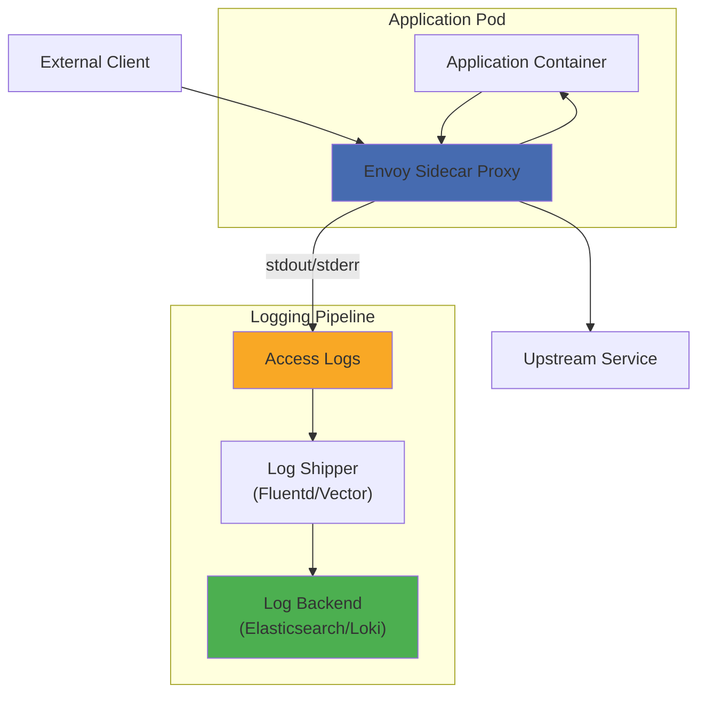
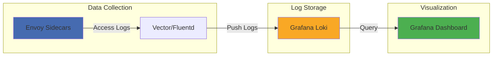

# How to Configure Access Logging in Istio

Author: [nawazdhandala](https://github.com/nawazdhandala)

Tags: Istio, Access Logging, Observability, Service Mesh, Kubernetes

Description: A guide to configuring and customizing access logs in Istio for traffic analysis.

---

Access logging is a critical observability feature in Istio that provides detailed records of all traffic flowing through your service mesh. These logs are invaluable for debugging, security auditing, compliance, and understanding traffic patterns. In this comprehensive guide, we will explore how to configure, customize, and integrate access logging in Istio.

## Understanding Istio Access Logging Architecture

Before diving into configuration, it is essential to understand how access logging works in Istio. The Envoy sidecar proxies that Istio injects into your pods are responsible for generating access logs for all inbound and outbound traffic.



## Prerequisites

Before configuring access logging, ensure you have the following:

- A Kubernetes cluster with Istio installed (version 1.18 or later recommended)
- kubectl configured to communicate with your cluster
- Basic understanding of Istio's architecture and Envoy proxy

## Enabling Access Logging Globally

Istio provides multiple ways to enable access logging. The simplest approach is to enable it globally through the Istio configuration.

### Method 1: Using MeshConfig

The following configuration enables access logging for all workloads in the mesh by modifying the Istio ConfigMap. This approach applies the settings globally and is ideal for consistent logging across all services.

```yaml
# istio-configmap.yaml
# This ConfigMap configures the Istio mesh with global access logging settings.
# The accessLogFile field specifies where Envoy should write access logs.
# Using /dev/stdout ensures logs are captured by the container runtime.
apiVersion: v1
kind: ConfigMap
metadata:
  name: istio
  namespace: istio-system
data:
  mesh: |
    accessLogFile: /dev/stdout
    accessLogEncoding: JSON
```

Apply the configuration using kubectl:

```bash
# Apply the ConfigMap to enable access logging globally
# This will trigger a rolling update of Envoy sidecars to pick up the new configuration
kubectl apply -f istio-configmap.yaml
```

### Method 2: Using IstioOperator

For installations managed by IstioOperator, you can configure access logging through the operator specification. This method provides more control and is the recommended approach for production deployments.

```yaml
# istio-operator-access-logging.yaml
# This IstioOperator configuration enables access logging globally.
# The meshConfig section contains settings that apply to all Envoy proxies in the mesh.
apiVersion: install.istio.io/v1alpha1
kind: IstioOperator
metadata:
  name: istio-control-plane
  namespace: istio-system
spec:
  meshConfig:
    # Enable access logging by specifying the output file
    # /dev/stdout sends logs to container stdout for collection by Kubernetes
    accessLogFile: /dev/stdout

    # Set the encoding format for access logs
    # Options: TEXT (default) or JSON
    # JSON is recommended for easier parsing and integration with log aggregation systems
    accessLogEncoding: JSON

    # Enable access logging for all workloads
    # When set to true, access logs are generated for every request
    enableAccessLog: true
```

## Configuring Log Formats

Istio supports two primary log formats: TEXT and JSON. Each has its advantages depending on your use case.

### Text Format

Text format is human-readable and useful for quick debugging. The following configuration uses the default Envoy text format with custom fields.

```yaml
# text-format-logging.yaml
# This Telemetry resource configures text-based access logging.
# Text format is easier to read manually but harder to parse programmatically.
apiVersion: telemetry.istio.io/v1alpha1
kind: Telemetry
metadata:
  name: text-access-logging
  namespace: istio-system
spec:
  # Apply to all workloads in the mesh by not specifying a selector
  accessLogging:
    - providers:
        - name: envoy
      # Disable for specific workloads if needed
      disabled: false
```

The default text format looks like this:

```
[2024-01-15T10:30:45.123Z] "GET /api/users HTTP/1.1" 200 - via_upstream - "-" 0 1234 45 43 "-" "curl/7.68.0" "abc123-def456" "users-service:8080" "10.244.1.5:8080" inbound|8080|| 10.244.2.3:54321 10.244.1.5:8080 10.244.2.3:0 - default
```

### JSON Format

JSON format is recommended for production environments as it enables easier parsing, querying, and integration with log aggregation systems like Elasticsearch, Loki, or Splunk.

```yaml
# json-format-logging.yaml
# This configuration enables JSON-formatted access logs globally.
# JSON format provides structured data that is easily parsed by log aggregation systems.
apiVersion: install.istio.io/v1alpha1
kind: IstioOperator
metadata:
  name: istio-control-plane
  namespace: istio-system
spec:
  meshConfig:
    accessLogFile: /dev/stdout
    accessLogEncoding: JSON
    # The default JSON format includes all standard Envoy access log fields
    # Each field is automatically converted to a JSON key-value pair
```

A sample JSON access log entry:

```json
{
  "authority": "users-service:8080",
  "bytes_received": 0,
  "bytes_sent": 1234,
  "connection_termination_details": null,
  "downstream_local_address": "10.244.1.5:8080",
  "downstream_remote_address": "10.244.2.3:54321",
  "duration": 45,
  "method": "GET",
  "path": "/api/users",
  "protocol": "HTTP/1.1",
  "request_id": "abc123-def456",
  "requested_server_name": null,
  "response_code": 200,
  "response_flags": "-",
  "route_name": "default",
  "start_time": "2024-01-15T10:30:45.123Z",
  "upstream_cluster": "inbound|8080||",
  "upstream_host": "10.244.1.5:8080",
  "upstream_local_address": "10.244.2.3:0",
  "upstream_service_time": 43,
  "upstream_transport_failure_reason": null,
  "user_agent": "curl/7.68.0",
  "x_forwarded_for": "-"
}
```

## Custom Log Fields with EnvoyFilter

For advanced customization, you can use EnvoyFilter to add custom fields to your access logs. This is useful for adding application-specific metadata, tracing information, or custom headers.

### Adding Custom Headers to Logs

The following EnvoyFilter adds custom fields to access logs, including trace headers and custom application metadata.

```yaml
# custom-access-log-fields.yaml
# This EnvoyFilter modifies the access log format to include custom fields.
# Custom fields help correlate logs with traces and add business context.
apiVersion: networking.istio.io/v1alpha3
kind: EnvoyFilter
metadata:
  name: custom-access-log-format
  namespace: istio-system
spec:
  configPatches:
    # This patch modifies the HTTP connection manager's access log configuration
    - applyTo: NETWORK_FILTER
      match:
        context: ANY
        listener:
          filterChain:
            filter:
              name: envoy.filters.network.http_connection_manager
      patch:
        operation: MERGE
        value:
          typed_config:
            "@type": type.googleapis.com/envoy.extensions.filters.network.http_connection_manager.v3.HttpConnectionManager
            access_log:
              - name: envoy.access_loggers.file
                typed_config:
                  "@type": type.googleapis.com/envoy.extensions.access_loggers.file.v3.FileAccessLog
                  path: /dev/stdout
                  log_format:
                    json_format:
                      # Standard fields - these are essential for debugging and monitoring
                      timestamp: "%START_TIME%"
                      method: "%REQ(:METHOD)%"
                      path: "%REQ(X-ENVOY-ORIGINAL-PATH?:PATH)%"
                      protocol: "%PROTOCOL%"
                      response_code: "%RESPONSE_CODE%"
                      response_flags: "%RESPONSE_FLAGS%"
                      duration_ms: "%DURATION%"

                      # Request/Response size metrics
                      bytes_received: "%BYTES_RECEIVED%"
                      bytes_sent: "%BYTES_SENT%"

                      # Upstream information - useful for understanding service-to-service communication
                      upstream_host: "%UPSTREAM_HOST%"
                      upstream_cluster: "%UPSTREAM_CLUSTER%"
                      upstream_service_time: "%RESP(X-ENVOY-UPSTREAM-SERVICE-TIME)%"

                      # Client information
                      client_ip: "%DOWNSTREAM_REMOTE_ADDRESS_WITHOUT_PORT%"
                      user_agent: "%REQ(USER-AGENT)%"

                      # Tracing headers - enable correlation with distributed tracing systems
                      trace_id: "%REQ(X-B3-TRACEID)%"
                      span_id: "%REQ(X-B3-SPANID)%"
                      parent_span_id: "%REQ(X-B3-PARENTSPANID)%"

                      # Custom application headers - add your own business context
                      request_id: "%REQ(X-REQUEST-ID)%"
                      tenant_id: "%REQ(X-TENANT-ID)%"
                      correlation_id: "%REQ(X-CORRELATION-ID)%"

                      # Service mesh metadata
                      source_workload: "%REQ(X-ENVOY-PEER-METADATA)%"
                      route_name: "%ROUTE_NAME%"
```

### Understanding Envoy Format Strings

Envoy uses special format strings to extract information from requests and responses. Here is a reference table of commonly used format strings:

| Format String | Description |
|--------------|-------------|
| `%START_TIME%` | Request start timestamp |
| `%REQ(:METHOD)%` | HTTP method (GET, POST, etc.) |
| `%REQ(X-HEADER-NAME)%` | Value of a specific request header |
| `%RESP(X-HEADER-NAME)%` | Value of a specific response header |
| `%RESPONSE_CODE%` | HTTP response status code |
| `%DURATION%` | Total request duration in milliseconds |
| `%BYTES_RECEIVED%` | Bytes received from downstream |
| `%BYTES_SENT%` | Bytes sent to downstream |
| `%UPSTREAM_HOST%` | Upstream host address |
| `%DOWNSTREAM_REMOTE_ADDRESS%` | Client IP and port |
| `%PROTOCOL%` | HTTP protocol version |

## Namespace-Level Access Logging

You can configure access logging at the namespace level to have different logging configurations for different environments or teams.

```yaml
# namespace-access-logging.yaml
# This Telemetry resource enables access logging only for the production namespace.
# Namespace-scoped configurations override mesh-wide settings for workloads in that namespace.
apiVersion: telemetry.istio.io/v1alpha1
kind: Telemetry
metadata:
  name: production-access-logging
  # Apply this configuration only to the production namespace
  namespace: production
spec:
  accessLogging:
    - providers:
        - name: envoy
```

## Workload-Specific Access Logging

For fine-grained control, you can configure access logging for specific workloads using label selectors.

```yaml
# workload-access-logging.yaml
# This Telemetry resource enables access logging only for workloads with specific labels.
# Use this approach when you need different logging configurations for different services.
apiVersion: telemetry.istio.io/v1alpha1
kind: Telemetry
metadata:
  name: payment-service-logging
  namespace: production
spec:
  # Target only workloads with the app=payment-service label
  selector:
    matchLabels:
      app: payment-service
  accessLogging:
    - providers:
        - name: envoy
      # Enable detailed logging for this critical service
      disabled: false
```

## Filtering Access Logs

To reduce log volume and storage costs, you can filter access logs based on specific criteria.

### Filter by Response Code

The following configuration logs only error responses (4xx and 5xx status codes):

```yaml
# error-only-logging.yaml
# This EnvoyFilter configures access logging to only capture error responses.
# Filtering logs reduces storage costs and makes it easier to identify issues.
apiVersion: networking.istio.io/v1alpha3
kind: EnvoyFilter
metadata:
  name: error-only-access-log
  namespace: istio-system
spec:
  configPatches:
    - applyTo: NETWORK_FILTER
      match:
        context: ANY
        listener:
          filterChain:
            filter:
              name: envoy.filters.network.http_connection_manager
      patch:
        operation: MERGE
        value:
          typed_config:
            "@type": type.googleapis.com/envoy.extensions.filters.network.http_connection_manager.v3.HttpConnectionManager
            access_log:
              - name: envoy.access_loggers.file
                typed_config:
                  "@type": type.googleapis.com/envoy.extensions.access_loggers.file.v3.FileAccessLog
                  path: /dev/stdout
                  log_format:
                    json_format:
                      timestamp: "%START_TIME%"
                      method: "%REQ(:METHOD)%"
                      path: "%REQ(X-ENVOY-ORIGINAL-PATH?:PATH)%"
                      response_code: "%RESPONSE_CODE%"
                      duration_ms: "%DURATION%"
                # Only log responses with status code >= 400
                filter:
                  status_code_filter:
                    comparison:
                      op: GE
                      value:
                        default_value: 400
                        runtime_key: access_log_min_status_code
```

### Filter by Request Path

You can exclude health check endpoints or other noisy paths from access logs:

```yaml
# path-filter-logging.yaml
# This EnvoyFilter excludes health check endpoints from access logs.
# Excluding noisy endpoints reduces log volume significantly.
apiVersion: networking.istio.io/v1alpha3
kind: EnvoyFilter
metadata:
  name: exclude-health-checks
  namespace: istio-system
spec:
  configPatches:
    - applyTo: NETWORK_FILTER
      match:
        context: ANY
        listener:
          filterChain:
            filter:
              name: envoy.filters.network.http_connection_manager
      patch:
        operation: MERGE
        value:
          typed_config:
            "@type": type.googleapis.com/envoy.extensions.filters.network.http_connection_manager.v3.HttpConnectionManager
            access_log:
              - name: envoy.access_loggers.file
                typed_config:
                  "@type": type.googleapis.com/envoy.extensions.access_loggers.file.v3.FileAccessLog
                  path: /dev/stdout
                  log_format:
                    json_format:
                      timestamp: "%START_TIME%"
                      method: "%REQ(:METHOD)%"
                      path: "%REQ(X-ENVOY-ORIGINAL-PATH?:PATH)%"
                      response_code: "%RESPONSE_CODE%"
                # Exclude requests to health check endpoints
                filter:
                  not_health_check_filter: {}
```

## Log Shipping Integration

Access logs need to be collected and shipped to a centralized logging backend for analysis. Here are configurations for popular log shipping solutions.

### Integration with Fluentd

The following Fluentd configuration collects Istio access logs and forwards them to Elasticsearch.

```yaml
# fluentd-configmap.yaml
# This ConfigMap contains the Fluentd configuration for collecting Istio access logs.
# Fluentd is deployed as a DaemonSet to collect logs from all nodes.
apiVersion: v1
kind: ConfigMap
metadata:
  name: fluentd-config
  namespace: logging
data:
  fluent.conf: |
    # Input: Read container logs from the node
    <source>
      @type tail
      # Path to container logs on the node
      path /var/log/containers/*istio-proxy*.log
      # Position file to track read progress
      pos_file /var/log/fluentd-containers.log.pos
      # Tag for identifying these logs in the pipeline
      tag istio.access
      # Parse the container log format (Docker or containerd)
      <parse>
        @type json
        # Handle the nested JSON in Istio access logs
        time_key time
        time_format %Y-%m-%dT%H:%M:%S.%NZ
      </parse>
    </source>

    # Filter: Parse the JSON access log content
    <filter istio.access>
      @type parser
      key_name log
      reserve_data true
      <parse>
        @type json
      </parse>
    </filter>

    # Filter: Add Kubernetes metadata
    <filter istio.access>
      @type kubernetes_metadata
      # Enrich logs with pod, namespace, and label information
    </filter>

    # Output: Send to Elasticsearch
    <match istio.access>
      @type elasticsearch
      host elasticsearch.logging.svc.cluster.local
      port 9200
      # Index naming pattern with date-based rotation
      logstash_format true
      logstash_prefix istio-access
      # Buffer configuration for reliability
      <buffer>
        @type file
        path /var/log/fluentd-buffers/istio
        flush_mode interval
        flush_interval 5s
        retry_type exponential_backoff
        retry_max_interval 30
        chunk_limit_size 2M
        queue_limit_length 8
        overflow_action block
      </buffer>
    </match>
```

### Integration with Vector

Vector is a modern, high-performance observability data pipeline. Here is a configuration for collecting Istio access logs:

```yaml
# vector-configmap.yaml
# This ConfigMap contains the Vector configuration for processing Istio access logs.
# Vector is efficient and provides built-in support for many data sources and sinks.
apiVersion: v1
kind: ConfigMap
metadata:
  name: vector-config
  namespace: logging
data:
  vector.toml: |
    # Source: Collect logs from Kubernetes
    [sources.kubernetes_logs]
    type = "kubernetes_logs"
    # Only collect logs from istio-proxy containers
    extra_label_selector = "app.kubernetes.io/name=istio-proxy"

    # Transform: Parse JSON access logs
    [transforms.parse_istio_logs]
    type = "remap"
    inputs = ["kubernetes_logs"]
    # VRL (Vector Remap Language) script to parse and enrich logs
    source = '''
    # Parse the JSON log message
    . = parse_json!(.message)

    # Add source metadata
    .source = "istio-access-log"
    .cluster = get_env_var("CLUSTER_NAME") ?? "unknown"

    # Convert duration to seconds for consistency
    .duration_seconds = .duration_ms / 1000.0

    # Categorize response codes
    .response_category = if .response_code >= 500 {
      "server_error"
    } else if .response_code >= 400 {
      "client_error"
    } else if .response_code >= 300 {
      "redirect"
    } else {
      "success"
    }
    '''

    # Sink: Send to Loki
    [sinks.loki]
    type = "loki"
    inputs = ["parse_istio_logs"]
    endpoint = "http://loki.logging.svc.cluster.local:3100"
    encoding.codec = "json"

    # Add labels for efficient querying in Loki
    labels.source = "istio"
    labels.namespace = "{{ kubernetes.pod_namespace }}"
    labels.service = "{{ kubernetes.pod_labels.app }}"
    labels.response_category = "{{ response_category }}"

    # Sink: Send to Elasticsearch (alternative)
    [sinks.elasticsearch]
    type = "elasticsearch"
    inputs = ["parse_istio_logs"]
    endpoints = ["http://elasticsearch.logging.svc.cluster.local:9200"]
    bulk.index = "istio-access-logs-%Y-%m-%d"
```

### Integration with Fluent Bit

Fluent Bit is a lightweight log processor suitable for resource-constrained environments:

```yaml
# fluent-bit-configmap.yaml
# This ConfigMap configures Fluent Bit for collecting Istio access logs.
# Fluent Bit has a smaller footprint than Fluentd, making it ideal for edge deployments.
apiVersion: v1
kind: ConfigMap
metadata:
  name: fluent-bit-config
  namespace: logging
data:
  fluent-bit.conf: |
    [SERVICE]
        # Flush interval in seconds
        Flush         5
        # Log level: error, warning, info, debug, trace
        Log_Level     info
        # Enable daemon mode
        Daemon        off
        # Path to parsers configuration
        Parsers_File  parsers.conf

    [INPUT]
        # Tail input plugin reads files
        Name              tail
        # Path pattern for Istio proxy container logs
        Path              /var/log/containers/*istio-proxy*.log
        # Parser for the container log format
        Parser            docker
        # Tag for routing
        Tag               istio.*
        # Memory buffer limit
        Mem_Buf_Limit     50MB
        # Skip long lines to prevent memory issues
        Skip_Long_Lines   On
        # Refresh interval for checking new files
        Refresh_Interval  10

    [FILTER]
        # Parse nested JSON in log field
        Name          parser
        Match         istio.*
        Key_Name      log
        Parser        json
        Reserve_Data  On

    [FILTER]
        # Add Kubernetes metadata
        Name                kubernetes
        Match               istio.*
        Kube_URL            https://kubernetes.default.svc:443
        Kube_CA_File        /var/run/secrets/kubernetes.io/serviceaccount/ca.crt
        Kube_Token_File     /var/run/secrets/kubernetes.io/serviceaccount/token
        Kube_Tag_Prefix     istio.var.log.containers.
        Merge_Log           On
        Keep_Log            Off
        K8S-Logging.Parser  On
        K8S-Logging.Exclude On

    [OUTPUT]
        # Send to Elasticsearch
        Name            es
        Match           istio.*
        Host            elasticsearch.logging.svc.cluster.local
        Port            9200
        Logstash_Format On
        Logstash_Prefix istio-access
        Retry_Limit     False
        # TLS configuration for secure connections
        tls             On
        tls.verify      Off

  parsers.conf: |
    [PARSER]
        Name        docker
        Format      json
        Time_Key    time
        Time_Format %Y-%m-%dT%H:%M:%S.%L
        Time_Keep   On

    [PARSER]
        Name        json
        Format      json
        Time_Key    timestamp
        Time_Format %Y-%m-%dT%H:%M:%S.%L%z
```

## Sending Logs to External Services

### OpenTelemetry Collector Integration

You can configure Istio to send access logs to an OpenTelemetry Collector for unified observability:

```yaml
# otel-access-logging.yaml
# This EnvoyFilter configures Envoy to send access logs to an OpenTelemetry Collector.
# Using OTLP enables correlation between logs, traces, and metrics.
apiVersion: networking.istio.io/v1alpha3
kind: EnvoyFilter
metadata:
  name: otel-access-logging
  namespace: istio-system
spec:
  configPatches:
    # Add OpenTelemetry access log provider
    - applyTo: BOOTSTRAP
      patch:
        operation: MERGE
        value:
          static_resources:
            clusters:
              - name: otel_collector
                type: STRICT_DNS
                lb_policy: ROUND_ROBIN
                load_assignment:
                  cluster_name: otel_collector
                  endpoints:
                    - lb_endpoints:
                        - endpoint:
                            address:
                              socket_address:
                                address: otel-collector.observability.svc.cluster.local
                                port_value: 4317
                http2_protocol_options: {}

    - applyTo: NETWORK_FILTER
      match:
        context: ANY
        listener:
          filterChain:
            filter:
              name: envoy.filters.network.http_connection_manager
      patch:
        operation: MERGE
        value:
          typed_config:
            "@type": type.googleapis.com/envoy.extensions.filters.network.http_connection_manager.v3.HttpConnectionManager
            access_log:
              - name: envoy.access_loggers.open_telemetry
                typed_config:
                  "@type": type.googleapis.com/envoy.extensions.access_loggers.open_telemetry.v3.OpenTelemetryAccessLogConfig
                  common_config:
                    log_name: istio_access_log
                    grpc_service:
                      envoy_grpc:
                        cluster_name: otel_collector
                  body:
                    string_value: "%REQ(:METHOD)% %REQ(X-ENVOY-ORIGINAL-PATH?:PATH)% %PROTOCOL% %RESPONSE_CODE%"
                  attributes:
                    values:
                      - key: method
                        value:
                          string_value: "%REQ(:METHOD)%"
                      - key: path
                        value:
                          string_value: "%REQ(X-ENVOY-ORIGINAL-PATH?:PATH)%"
                      - key: response_code
                        value:
                          string_value: "%RESPONSE_CODE%"
                      - key: duration_ms
                        value:
                          string_value: "%DURATION%"
                      - key: trace_id
                        value:
                          string_value: "%REQ(X-B3-TRACEID)%"
```

### gRPC Access Log Service (ALS)

For high-performance log streaming, you can use Envoy's gRPC Access Log Service:

```yaml
# grpc-als-logging.yaml
# This configuration sends access logs to an external gRPC service.
# gRPC ALS provides efficient, streaming delivery of access logs.
apiVersion: networking.istio.io/v1alpha3
kind: EnvoyFilter
metadata:
  name: grpc-access-log-service
  namespace: istio-system
spec:
  configPatches:
    # Add the gRPC ALS cluster
    - applyTo: BOOTSTRAP
      patch:
        operation: MERGE
        value:
          static_resources:
            clusters:
              - name: access_log_service
                type: STRICT_DNS
                lb_policy: ROUND_ROBIN
                http2_protocol_options: {}
                load_assignment:
                  cluster_name: access_log_service
                  endpoints:
                    - lb_endpoints:
                        - endpoint:
                            address:
                              socket_address:
                                address: als.logging.svc.cluster.local
                                port_value: 9001

    # Configure the access logger to use gRPC ALS
    - applyTo: NETWORK_FILTER
      match:
        context: ANY
        listener:
          filterChain:
            filter:
              name: envoy.filters.network.http_connection_manager
      patch:
        operation: MERGE
        value:
          typed_config:
            "@type": type.googleapis.com/envoy.extensions.filters.network.http_connection_manager.v3.HttpConnectionManager
            access_log:
              - name: envoy.access_loggers.http_grpc
                typed_config:
                  "@type": type.googleapis.com/envoy.extensions.access_loggers.grpc.v3.HttpGrpcAccessLogConfig
                  common_config:
                    log_name: istio_http_access
                    transport_api_version: V3
                    grpc_service:
                      envoy_grpc:
                        cluster_name: access_log_service
                  # Include additional request headers in logs
                  additional_request_headers_to_log:
                    - x-request-id
                    - x-b3-traceid
                    - x-b3-spanid
                  # Include additional response headers in logs
                  additional_response_headers_to_log:
                    - x-envoy-upstream-service-time
```

## Visualizing Access Logs

Once logs are collected, you can create dashboards for visualization and analysis.

### Grafana Dashboard for Access Logs in Loki



Here is an example LogQL query for Grafana to analyze access logs:

```
# Query to find all 5xx errors in the last hour
{source="istio", response_category="server_error"} |= "response_code"

# Query to calculate request rate by service
sum(rate({source="istio"} | json | unwrap duration_ms [5m])) by (service)

# Query to find slow requests (> 1 second)
{source="istio"} | json | duration_ms > 1000
```

## Best Practices

### 1. Use JSON Format in Production

JSON-formatted logs are easier to parse and query. They integrate seamlessly with log aggregation systems and enable structured querying.

### 2. Include Trace Context

Always include trace headers (X-B3-TraceId, X-B3-SpanId) in your access logs to enable correlation with distributed traces:

```yaml
# Including trace context enables end-to-end request tracking
trace_id: "%REQ(X-B3-TRACEID)%"
span_id: "%REQ(X-B3-SPANID)%"
```

### 3. Filter Noise

Exclude health check endpoints and other noisy paths to reduce log volume and storage costs.

### 4. Set Appropriate Retention Policies

Configure log retention based on your compliance and debugging needs:

```yaml
# Example Elasticsearch index lifecycle policy
# Retain hot data for 7 days, warm for 30 days, then delete
apiVersion: v1
kind: ConfigMap
metadata:
  name: elasticsearch-ilm-policy
data:
  policy.json: |
    {
      "policy": {
        "phases": {
          "hot": {
            "min_age": "0ms",
            "actions": {
              "rollover": {
                "max_size": "50GB",
                "max_age": "7d"
              }
            }
          },
          "warm": {
            "min_age": "7d",
            "actions": {
              "shrink": {
                "number_of_shards": 1
              }
            }
          },
          "delete": {
            "min_age": "30d",
            "actions": {
              "delete": {}
            }
          }
        }
      }
    }
```

### 5. Monitor Log Pipeline Health

Set up alerts for log pipeline failures to ensure you do not lose critical log data.

## Troubleshooting

### Verify Access Logging is Enabled

Check if access logging is configured correctly:

```bash
# Check the Istio mesh configuration
kubectl -n istio-system get configmap istio -o jsonpath='{.data.mesh}' | grep -A5 accessLog

# View access logs from a specific pod
kubectl logs <pod-name> -c istio-proxy | head -20
```

### Common Issues

1. **No logs appearing**: Ensure `accessLogFile` is set to `/dev/stdout` in the mesh configuration.

2. **Missing fields in logs**: Verify your EnvoyFilter is applied correctly:
   ```bash
   # Check if EnvoyFilter is applied
   kubectl get envoyfilter -A

   # Check Envoy configuration
   istioctl proxy-config listeners <pod-name> -o json | grep access_log
   ```

3. **High log volume**: Implement filtering to reduce noise from health checks and non-essential endpoints.

## Conclusion

Access logging in Istio provides powerful visibility into your service mesh traffic. By following this guide, you can configure comprehensive access logging that meets your observability, debugging, and compliance requirements.

Key takeaways:
- Use JSON format for production environments
- Include trace context for correlation with distributed tracing
- Filter noisy endpoints to reduce log volume
- Integrate with log shipping solutions for centralized analysis
- Set appropriate retention policies based on your needs

With properly configured access logging, you will have the visibility needed to understand traffic patterns, debug issues, and ensure the security and reliability of your service mesh.
