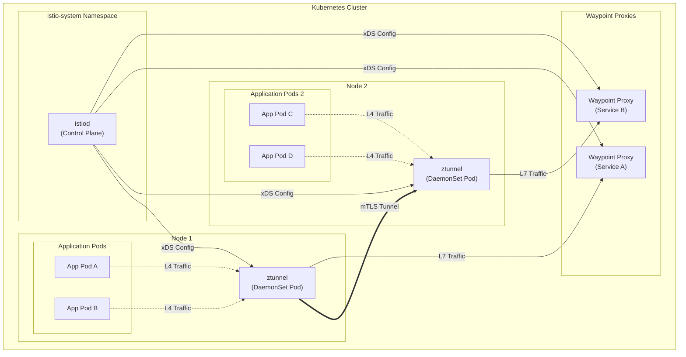
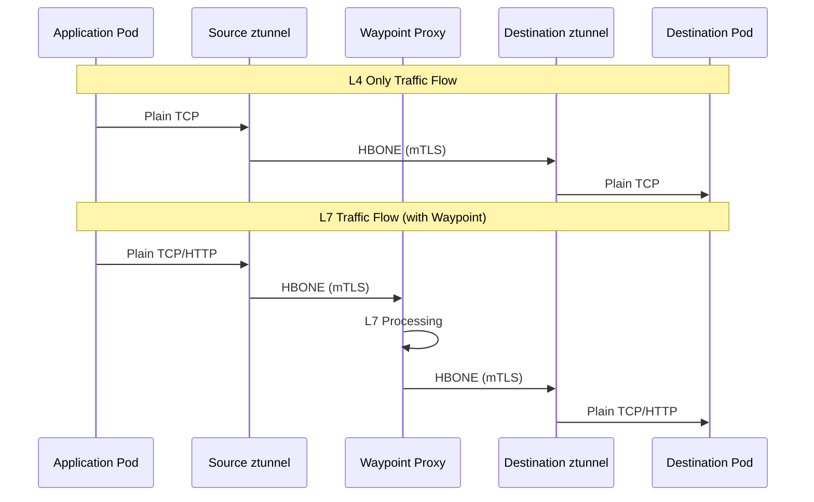
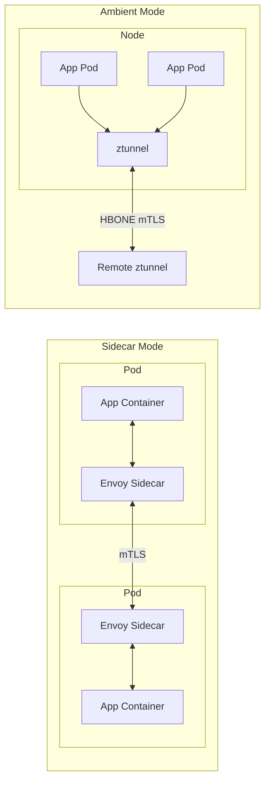
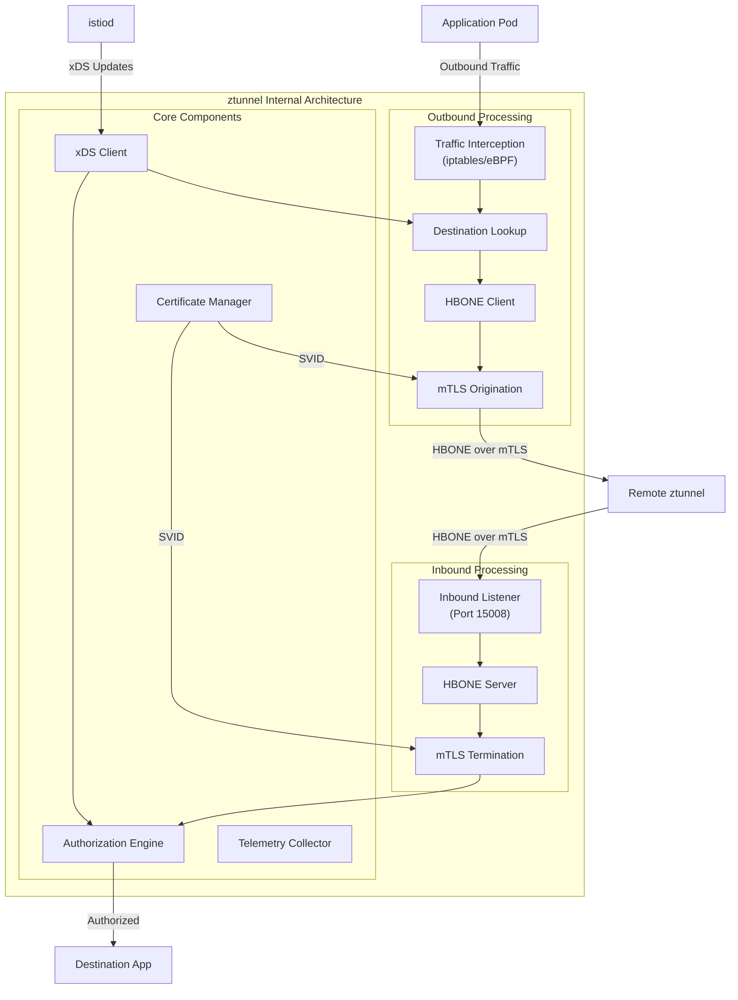
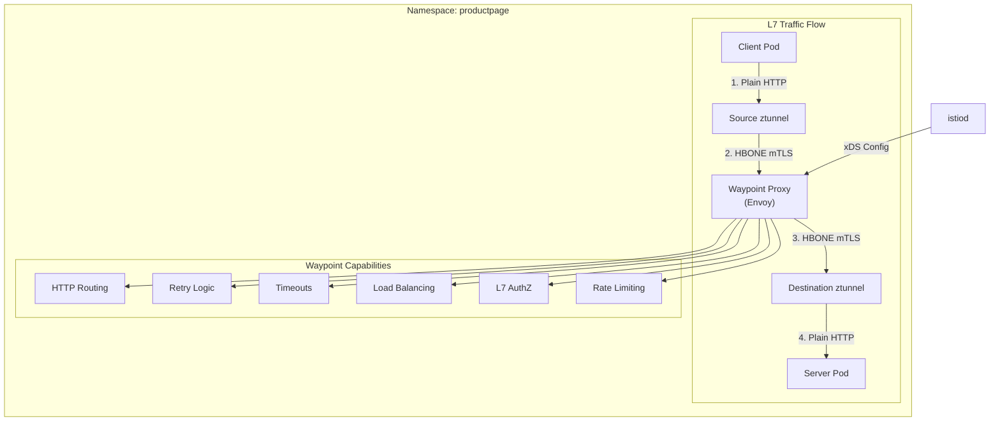
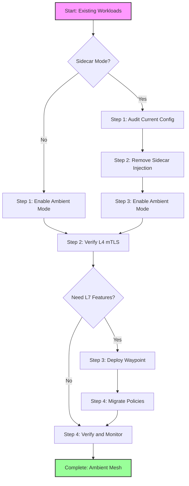
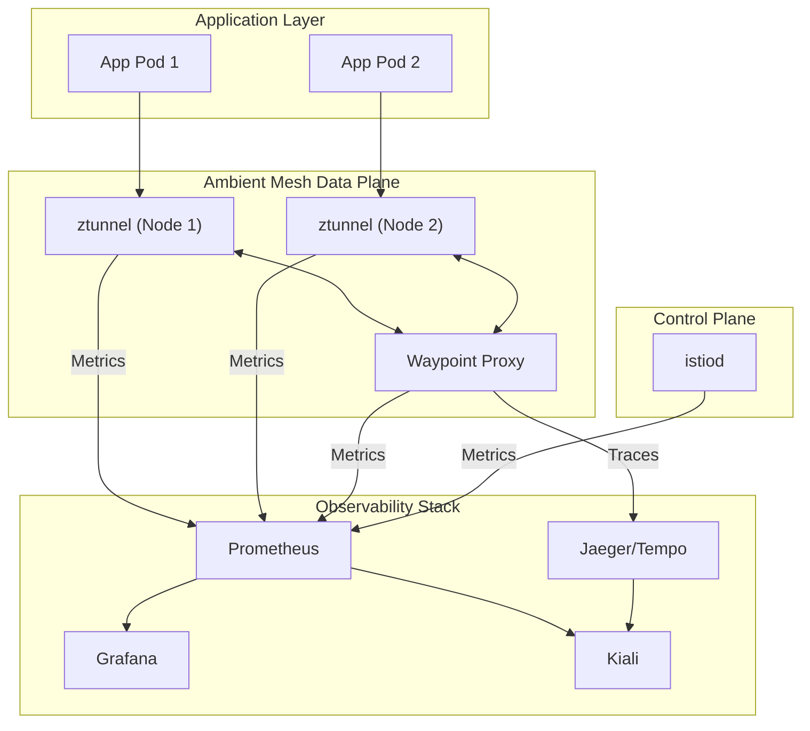

# How to Deploy Istio Ambient Mesh (Sidecar-less Mode)

Author: [nawazdhandala](https://github.com/nawazdhandala)

Tags: Istio, Ambient Mesh, Service Mesh, Kubernetes, ztunnel

Description: Learn how to deploy Istio ambient mesh for sidecar-free service mesh architecture.

---

Istio Ambient Mesh represents a revolutionary approach to service mesh architecture that eliminates the need for sidecar proxies. Introduced as a major evolution in Istio's design, ambient mesh provides the same security, observability, and traffic management capabilities while significantly reducing resource overhead and operational complexity. This comprehensive guide will walk you through deploying Istio in ambient mode, understanding its architecture, and migrating your workloads.

## Table of Contents

1. [What is Istio Ambient Mesh?](#what-is-istio-ambient-mesh)
2. [Ambient Mesh Architecture](#ambient-mesh-architecture)
3. [Comparing Sidecar vs Ambient Mode](#comparing-sidecar-vs-ambient-mode)
4. [Prerequisites](#prerequisites)
5. [Installing Istio Ambient Mesh](#installing-istio-ambient-mesh)
6. [Understanding ztunnel](#understanding-ztunnel)
7. [L4 Processing with ztunnel](#l4-processing-with-ztunnel)
8. [Deploying Waypoint Proxies for L7 Processing](#deploying-waypoint-proxies-for-l7-processing)
9. [Migrating Workloads to Ambient Mesh](#migrating-workloads-to-ambient-mesh)
10. [Security Configuration](#security-configuration)
11. [Traffic Management](#traffic-management)
12. [Observability](#observability)
13. [Best Practices](#best-practices)
14. [Troubleshooting](#troubleshooting)

## What is Istio Ambient Mesh?

Istio Ambient Mesh is a sidecar-less data plane mode that splits Istio's functionality into two distinct layers:

- **L4 Secure Overlay (ztunnel)**: Handles mTLS, telemetry, and simple authorization at the transport layer
- **L7 Processing (Waypoint Proxies)**: Optional per-service proxies that handle HTTP routing, load balancing, and advanced policies

This separation allows you to get immediate security benefits without the resource overhead of sidecars, while still enabling L7 features when needed.

## Ambient Mesh Architecture

The ambient mesh architecture fundamentally reimagines how service mesh functionality is delivered. Let's visualize the key components and their interactions.

### High-Level Architecture Diagram



### Traffic Flow Diagram



## Comparing Sidecar vs Ambient Mode

Understanding the differences between sidecar and ambient modes helps you make informed decisions about which approach suits your needs.

### Feature Comparison Table

| Feature | Sidecar Mode | Ambient Mode |
|---------|-------------|--------------|
| Resource Overhead | High (per-pod proxy) | Low (shared ztunnel) |
| Memory Usage | ~50-100MB per pod | ~20-40MB per node |
| CPU Usage | Per-pod overhead | Shared per-node |
| Deployment Complexity | Pod injection required | Namespace label only |
| L4 Security (mTLS) | Yes | Yes (ztunnel) |
| L7 Features | Always available | Opt-in (Waypoint) |
| Pod Startup Impact | Slower (sidecar init) | No impact |
| Upgrade Process | Rolling pod restarts | ztunnel DaemonSet update |
| Network Path | Through sidecar | Through node ztunnel |

### Architecture Comparison Diagram



## Prerequisites

Before installing Istio Ambient Mesh, ensure your environment meets the following requirements:

### System Requirements

- Kubernetes cluster version 1.26 or later
- kubectl configured with cluster access
- Helm 3.x (recommended for installation)
- Linux-based nodes (ambient mesh is not supported on Windows)
- Container runtime: containerd 1.6+ or CRI-O 1.24+

### Verify your Kubernetes version

```bash
# Check the Kubernetes server version to ensure compatibility
kubectl version --short
```

### Install istioctl

The istioctl command-line tool is essential for managing Istio installations and debugging.

```bash
# Download the latest Istio release (1.23 or later recommended for ambient)
curl -L https://istio.io/downloadIstio | ISTIO_VERSION=1.23.0 sh -

# Add istioctl to your PATH for easy access
cd istio-1.23.0
export PATH=$PWD/bin:$PATH

# Verify the installation by checking the version
istioctl version --remote=false
```

## Installing Istio Ambient Mesh

There are two primary methods to install Istio with ambient mode: using istioctl or Helm. We'll cover both approaches.

### Method 1: Using istioctl (Recommended for Getting Started)

This is the quickest way to get ambient mesh running in your cluster.

```bash
# Install Istio with the ambient profile
# The ambient profile includes ztunnel and configures the CNI for ambient mode
istioctl install --set profile=ambient --skip-confirmation

# Expected output:
# ✔ Istio core installed
# ✔ Istiod installed
# ✔ CNI installed
# ✔ Ztunnel installed
# ✔ Installation complete
```

### Method 2: Using Helm (Recommended for Production)

Helm provides more control over the installation and is better suited for GitOps workflows.

```bash
# Add the Istio Helm repository to access official charts
helm repo add istio https://istio-release.storage.googleapis.com/charts
helm repo update

# Create the istio-system namespace for core components
kubectl create namespace istio-system
```

```bash
# Install the Istio base chart containing CRDs and cluster-wide resources
# The base chart must be installed first as other components depend on it
helm install istio-base istio/base \
  --namespace istio-system \
  --set defaultRevision=default \
  --wait
```

```bash
# Install istiod (the control plane) with ambient mode enabled
# The pilot.env settings configure istiod to work with ambient mesh
helm install istiod istio/istiod \
  --namespace istio-system \
  --set pilot.env.PILOT_ENABLE_AMBIENT=true \
  --wait
```

```bash
# Install the Istio CNI plugin required for ambient mesh networking
# The CNI handles traffic redirection at the node level
helm install istio-cni istio/cni \
  --namespace istio-system \
  --set profile=ambient \
  --wait
```

```bash
# Install ztunnel as a DaemonSet on every node
# ztunnel provides the L4 secure overlay for all ambient mesh traffic
helm install ztunnel istio/ztunnel \
  --namespace istio-system \
  --wait
```

### Verify the Installation

After installation, verify all components are running correctly.

```bash
# Check that all Istio components are running in the istio-system namespace
kubectl get pods -n istio-system

# Expected output should show:
# - istiod-xxxxxxxxxx-xxxxx (Running)
# - istio-cni-node-xxxxx (Running on each node)
# - ztunnel-xxxxx (Running on each node)
```

```bash
# Verify the ztunnel DaemonSet is deployed to all nodes
kubectl get daemonset -n istio-system ztunnel

# The DESIRED and READY columns should match the number of nodes
```

```bash
# Check the istioctl status for ambient mesh components
istioctl verify-install

# This command validates that all expected resources are properly configured
```

## Understanding ztunnel

The ztunnel (zero-trust tunnel) is the cornerstone of ambient mesh architecture. It's a purpose-built, lightweight proxy designed specifically for L4 traffic handling.

### ztunnel Architecture Diagram



### ztunnel Key Features

The ztunnel provides several critical capabilities:

1. **HBONE Protocol**: HTTP-based overlay network encapsulation for tunneling TCP traffic
2. **Mutual TLS**: Automatic encryption and identity verification for all mesh traffic
3. **L4 Authorization**: Enforce authorization policies based on identity and network attributes
4. **Telemetry Collection**: Gather metrics and logs for L4 traffic without application changes

### Inspecting ztunnel Configuration

```bash
# View the ztunnel proxy configuration to understand its current state
# This shows workload information and certificates managed by ztunnel
istioctl ztunnel-config workloads

# Example output:
# NAMESPACE  POD NAME           IP            NODE          PROTOCOL  SERVICE ACCOUNT
# default    productpage-xxx    10.244.0.15   node-1        HBONE     productpage
# default    reviews-xxx        10.244.0.16   node-1        HBONE     reviews
```

```bash
# Check ztunnel certificates to verify mTLS is properly configured
# Each workload should have a valid SPIFFE identity
istioctl ztunnel-config certificates

# View the services known to ztunnel for traffic routing
istioctl ztunnel-config services
```

## L4 Processing with ztunnel

L4 processing is the default mode for ambient mesh workloads. It provides mTLS encryption and basic authorization without the overhead of L7 processing.

### Enabling Ambient Mode for a Namespace

To include workloads in the ambient mesh, simply label the namespace.

```bash
# Label a namespace to include all its pods in the ambient mesh
# The istio.io/dataplane-mode=ambient label enables ztunnel interception
kubectl label namespace default istio.io/dataplane-mode=ambient

# Verify the label was applied correctly
kubectl get namespace default --show-labels
```

### Deploy a Sample Application

Let's deploy a sample application to demonstrate L4 processing.

```yaml
# Save this as sample-app.yaml
# This deploys a simple client-server application to test ambient mesh
apiVersion: v1
kind: Namespace
metadata:
  name: ambient-demo
  labels:
    # Enable ambient mode for this namespace
    istio.io/dataplane-mode: ambient
---
# A simple HTTP server deployment
apiVersion: apps/v1
kind: Deployment
metadata:
  name: httpbin
  namespace: ambient-demo
spec:
  replicas: 2
  selector:
    matchLabels:
      app: httpbin
  template:
    metadata:
      labels:
        app: httpbin
    spec:
      # Use a dedicated service account for workload identity
      serviceAccountName: httpbin
      containers:
      - name: httpbin
        image: docker.io/kong/httpbin:0.1.0
        ports:
        - containerPort: 80
---
# Service account for httpbin identity
apiVersion: v1
kind: ServiceAccount
metadata:
  name: httpbin
  namespace: ambient-demo
---
# Service to expose httpbin within the cluster
apiVersion: v1
kind: Service
metadata:
  name: httpbin
  namespace: ambient-demo
spec:
  selector:
    app: httpbin
  ports:
  - port: 80
    targetPort: 80
---
# A client pod to test connectivity
apiVersion: apps/v1
kind: Deployment
metadata:
  name: curl-client
  namespace: ambient-demo
spec:
  replicas: 1
  selector:
    matchLabels:
      app: curl-client
  template:
    metadata:
      labels:
        app: curl-client
    spec:
      serviceAccountName: curl-client
      containers:
      - name: curl
        image: curlimages/curl:latest
        command: ["sleep", "infinity"]
---
apiVersion: v1
kind: ServiceAccount
metadata:
  name: curl-client
  namespace: ambient-demo
```

```bash
# Apply the sample application configuration
kubectl apply -f sample-app.yaml

# Wait for pods to be ready
kubectl wait --for=condition=Ready pods --all -n ambient-demo --timeout=120s
```

### Verify L4 mTLS is Active

```bash
# Test connectivity from the curl client to httpbin
# Traffic is automatically encrypted via mTLS through ztunnel
kubectl exec -n ambient-demo deploy/curl-client -- \
  curl -s http://httpbin.ambient-demo/headers

# The response should show the request was successful
# Behind the scenes, ztunnel encrypted this traffic with mTLS
```

```bash
# Check ztunnel logs to verify HBONE tunnel usage
# You should see log entries showing encrypted connections
kubectl logs -n istio-system -l app=ztunnel -c istio-proxy --tail=100 | \
  grep -i "hbone\|connection"
```

### L4 Authorization Policy

Even at L4, you can enforce authorization based on workload identity.

```yaml
# Save this as l4-authz-policy.yaml
# This policy restricts which workloads can access httpbin at L4
apiVersion: security.istio.io/v1
kind: AuthorizationPolicy
metadata:
  name: httpbin-l4-policy
  namespace: ambient-demo
spec:
  # Apply this policy to the httpbin service
  selector:
    matchLabels:
      app: httpbin
  # Default action is DENY unless a rule matches
  action: ALLOW
  rules:
  # Allow traffic from the curl-client service account
  - from:
    - source:
        # SPIFFE identity format for ambient mesh workloads
        principals: ["cluster.local/ns/ambient-demo/sa/curl-client"]
```

```bash
# Apply the L4 authorization policy
kubectl apply -f l4-authz-policy.yaml

# Test access from the authorized curl-client (should succeed)
kubectl exec -n ambient-demo deploy/curl-client -- \
  curl -s -o /dev/null -w "%{http_code}" http://httpbin.ambient-demo/get

# Expected output: 200
```

## Deploying Waypoint Proxies for L7 Processing

Waypoint proxies enable L7 features like HTTP routing, traffic splitting, and advanced authorization. They're deployed per-service or per-namespace as needed.

### Waypoint Architecture Diagram



### Creating a Waypoint Proxy

```bash
# Create a waypoint proxy for a specific service account
# This waypoint will handle L7 traffic destined for services using this account
istioctl waypoint apply --name httpbin-waypoint \
  --namespace ambient-demo \
  --for service \
  --wait

# The --for service flag indicates this waypoint handles service traffic
# Alternative: --for workload handles traffic at the workload level
```

```bash
# Alternatively, create a waypoint using a Gateway resource
# This approach is more declarative and suitable for GitOps
```

```yaml
# Save this as waypoint-gateway.yaml
# Waypoint proxies are defined using the Kubernetes Gateway API
apiVersion: gateway.networking.k8s.io/v1
kind: Gateway
metadata:
  name: httpbin-waypoint
  namespace: ambient-demo
  labels:
    # This label marks it as a waypoint proxy
    istio.io/waypoint-for: service
spec:
  # Use the Istio waypoint gateway class
  gatewayClassName: istio-waypoint
  listeners:
  # HBONE listener for receiving tunneled traffic from ztunnel
  - name: mesh
    port: 15008
    protocol: HBONE
    allowedRoutes:
      namespaces:
        from: Same
```

```bash
# Apply the waypoint gateway configuration
kubectl apply -f waypoint-gateway.yaml

# Verify the waypoint proxy pod is running
kubectl get pods -n ambient-demo -l istio.io/gateway-name=httpbin-waypoint

# Check the gateway status
kubectl get gateway -n ambient-demo httpbin-waypoint
```

### Associate a Service with the Waypoint

```bash
# Label the service to use the waypoint proxy for L7 processing
# All traffic to this service will now go through the waypoint
kubectl label service httpbin -n ambient-demo \
  istio.io/use-waypoint=httpbin-waypoint

# Verify the label was applied
kubectl get service httpbin -n ambient-demo --show-labels
```

### L7 Authorization with Waypoint

With a waypoint proxy, you can enforce sophisticated authorization rules based on HTTP attributes.

```yaml
# Save this as l7-authz-policy.yaml
# This L7 authorization policy requires a waypoint proxy
apiVersion: security.istio.io/v1
kind: AuthorizationPolicy
metadata:
  name: httpbin-l7-policy
  namespace: ambient-demo
spec:
  # Target the waypoint proxy gateway
  targetRefs:
  - kind: Gateway
    group: gateway.networking.k8s.io
    name: httpbin-waypoint
  action: ALLOW
  rules:
  # Allow GET requests to /get and /headers paths
  - from:
    - source:
        principals: ["cluster.local/ns/ambient-demo/sa/curl-client"]
    to:
    - operation:
        # HTTP method matching (L7 feature)
        methods: ["GET"]
        # Path matching (L7 feature)
        paths: ["/get", "/headers", "/ip"]
  # Allow POST requests to /post path
  - from:
    - source:
        principals: ["cluster.local/ns/ambient-demo/sa/curl-client"]
    to:
    - operation:
        methods: ["POST"]
        paths: ["/post"]
```

```bash
# Apply the L7 authorization policy
kubectl apply -f l7-authz-policy.yaml

# Test allowed GET request (should succeed with 200)
kubectl exec -n ambient-demo deploy/curl-client -- \
  curl -s -o /dev/null -w "%{http_code}" http://httpbin.ambient-demo/get

# Test blocked DELETE request (should fail with 403)
kubectl exec -n ambient-demo deploy/curl-client -- \
  curl -s -o /dev/null -w "%{http_code}" -X DELETE http://httpbin.ambient-demo/delete
```

## Migrating Workloads to Ambient Mesh

Migrating existing workloads to ambient mesh requires careful planning. Here's a step-by-step approach.

### Migration Strategy Diagram



### Step 1: Audit Current Configuration

Before migration, document your existing Istio configuration.

```bash
# List all Istio resources in your namespace
# This helps identify what needs to be migrated or updated
kubectl get virtualservices,destinationrules,authorizationpolicies,peerauthentications \
  -n your-namespace

# Export current configurations for backup
kubectl get virtualservices -n your-namespace -o yaml > vs-backup.yaml
kubectl get destinationrules -n your-namespace -o yaml > dr-backup.yaml
kubectl get authorizationpolicies -n your-namespace -o yaml > authz-backup.yaml
```

### Step 2: Prepare the Namespace

```bash
# If using sidecar mode, first disable sidecar injection
# This prevents new pods from getting sidecars during the transition
kubectl label namespace your-namespace istio-injection-

# Add the ambient mode label
# New pods will be enrolled in ambient mesh automatically
kubectl label namespace your-namespace istio.io/dataplane-mode=ambient
```

### Step 3: Rolling Restart of Deployments

```bash
# Restart deployments to remove sidecar containers
# The pods will restart without sidecars and be captured by ztunnel
kubectl rollout restart deployment -n your-namespace

# Monitor the rollout status
kubectl rollout status deployment -n your-namespace --watch
```

### Step 4: Verify Migration

```bash
# Confirm pods are running without sidecars
# Ambient mesh pods should show 1/1 READY (no sidecar container)
kubectl get pods -n your-namespace

# Verify the workloads are enrolled in ambient mesh
istioctl ztunnel-config workloads | grep your-namespace

# Test connectivity between services
kubectl exec -n your-namespace deploy/your-client -- \
  curl -s http://your-service.your-namespace/health
```

### Step 5: Deploy Waypoints for L7 Features

```bash
# If your application requires L7 features, deploy waypoint proxies
# Identify services that need L7 processing based on your VirtualService configs
istioctl waypoint apply --name your-service-waypoint \
  --namespace your-namespace \
  --for service

# Label services to use their waypoint
kubectl label service your-service -n your-namespace \
  istio.io/use-waypoint=your-service-waypoint
```

### Migration Checklist

```yaml
# Save this as migration-checklist.yaml for tracking
# Update status as you complete each step
apiVersion: v1
kind: ConfigMap
metadata:
  name: ambient-migration-checklist
  namespace: your-namespace
data:
  checklist: |
    Migration Checklist for Namespace: your-namespace

    Pre-Migration:
    [ ] Backup all Istio resources
    [ ] Document current traffic patterns
    [ ] Identify L7 feature requirements
    [ ] Plan maintenance window

    Migration Steps:
    [ ] Remove sidecar injection label
    [ ] Add ambient mode label
    [ ] Restart all deployments
    [ ] Verify ztunnel enrollment
    [ ] Test basic connectivity

    Post-Migration (if L7 needed):
    [ ] Deploy waypoint proxies
    [ ] Associate services with waypoints
    [ ] Migrate VirtualService rules
    [ ] Migrate AuthorizationPolicies
    [ ] Verify L7 routing

    Validation:
    [ ] Test all service-to-service calls
    [ ] Verify mTLS encryption
    [ ] Check telemetry collection
    [ ] Monitor error rates
    [ ] Performance baseline comparison
```

## Security Configuration

Ambient mesh provides robust security features at both L4 and L7 layers.

### Peer Authentication (mTLS)

```yaml
# Save this as peer-authentication.yaml
# Configure mTLS mode for the namespace
apiVersion: security.istio.io/v1
kind: PeerAuthentication
metadata:
  name: ambient-mtls
  namespace: ambient-demo
spec:
  # STRICT mode requires all traffic to use mTLS
  # This is enforced by ztunnel for ambient mesh workloads
  mtls:
    mode: STRICT
```

```bash
# Apply the peer authentication policy
kubectl apply -f peer-authentication.yaml

# Verify mTLS is enforced by checking ztunnel certificates
istioctl ztunnel-config certificates | grep ambient-demo
```

### Advanced Authorization Patterns

```yaml
# Save this as advanced-authz.yaml
# This demonstrates complex authorization scenarios
apiVersion: security.istio.io/v1
kind: AuthorizationPolicy
metadata:
  name: multi-condition-policy
  namespace: ambient-demo
spec:
  # Target the waypoint proxy for L7 authorization
  targetRefs:
  - kind: Gateway
    group: gateway.networking.k8s.io
    name: httpbin-waypoint
  action: ALLOW
  rules:
  # Rule 1: Allow internal services with specific headers
  - from:
    - source:
        namespaces: ["ambient-demo", "trusted-namespace"]
    to:
    - operation:
        methods: ["GET", "POST"]
    when:
    # Require a specific header for additional security
    - key: request.headers[x-internal-request]
      values: ["true"]

  # Rule 2: Allow health checks from any source
  - to:
    - operation:
        methods: ["GET"]
        paths: ["/health", "/ready", "/live"]

  # Rule 3: Allow admin operations with JWT validation
  - from:
    - source:
        # Require specific service account for admin access
        principals: ["cluster.local/ns/ambient-demo/sa/admin-service"]
    to:
    - operation:
        methods: ["DELETE", "PUT", "PATCH"]
        paths: ["/admin/*"]
```

## Traffic Management

Ambient mesh supports sophisticated traffic management through VirtualService and DestinationRule resources, but requires waypoint proxies for L7 features.

### Traffic Splitting with Waypoint

```yaml
# Save this as traffic-split.yaml
# Demonstrates canary deployment pattern with ambient mesh
apiVersion: networking.istio.io/v1
kind: VirtualService
metadata:
  name: httpbin-routing
  namespace: ambient-demo
spec:
  hosts:
  - httpbin.ambient-demo.svc.cluster.local
  http:
  # Route 90% of traffic to v1, 10% to v2 (canary)
  - match:
    - uri:
        prefix: /
    route:
    - destination:
        host: httpbin.ambient-demo.svc.cluster.local
        subset: v1
      weight: 90
    - destination:
        host: httpbin.ambient-demo.svc.cluster.local
        subset: v2
      weight: 10
    # Retry configuration for resilience
    retries:
      attempts: 3
      perTryTimeout: 2s
      retryOn: 5xx,reset,connect-failure
    # Request timeout
    timeout: 10s
---
apiVersion: networking.istio.io/v1
kind: DestinationRule
metadata:
  name: httpbin-subsets
  namespace: ambient-demo
spec:
  host: httpbin.ambient-demo.svc.cluster.local
  subsets:
  - name: v1
    labels:
      version: v1
  - name: v2
    labels:
      version: v2
  # Connection pool settings for load management
  trafficPolicy:
    connectionPool:
      tcp:
        maxConnections: 100
      http:
        h2UpgradePolicy: UPGRADE
        http1MaxPendingRequests: 100
        http2MaxRequests: 1000
```

### Header-Based Routing

```yaml
# Save this as header-routing.yaml
# Route traffic based on HTTP headers (requires waypoint)
apiVersion: networking.istio.io/v1
kind: VirtualService
metadata:
  name: httpbin-header-routing
  namespace: ambient-demo
spec:
  hosts:
  - httpbin.ambient-demo.svc.cluster.local
  http:
  # Route requests with debug header to debug version
  - match:
    - headers:
        x-debug:
          exact: "true"
    route:
    - destination:
        host: httpbin.ambient-demo.svc.cluster.local
        subset: debug
  # Route internal requests differently
  - match:
    - headers:
        x-internal:
          exact: "true"
    route:
    - destination:
        host: httpbin.ambient-demo.svc.cluster.local
        subset: internal
  # Default route for all other traffic
  - route:
    - destination:
        host: httpbin.ambient-demo.svc.cluster.local
        subset: v1
```

## Observability

Ambient mesh provides comprehensive observability through integration with Prometheus, Grafana, and distributed tracing systems.

### Observability Architecture



### Installing Observability Addons

```bash
# Install Prometheus for metrics collection
# Prometheus scrapes metrics from ztunnel and waypoint proxies
kubectl apply -f https://raw.githubusercontent.com/istio/istio/release-1.23/samples/addons/prometheus.yaml

# Install Grafana for metrics visualization
kubectl apply -f https://raw.githubusercontent.com/istio/istio/release-1.23/samples/addons/grafana.yaml

# Install Kiali for service mesh visualization
kubectl apply -f https://raw.githubusercontent.com/istio/istio/release-1.23/samples/addons/kiali.yaml

# Install Jaeger for distributed tracing
kubectl apply -f https://raw.githubusercontent.com/istio/istio/release-1.23/samples/addons/jaeger.yaml
```

### Key Metrics for Ambient Mesh

```yaml
# Save this as prometheus-rules.yaml
# Custom Prometheus recording rules for ambient mesh monitoring
apiVersion: monitoring.coreos.com/v1
kind: PrometheusRule
metadata:
  name: ambient-mesh-rules
  namespace: istio-system
spec:
  groups:
  - name: ambient-mesh
    rules:
    # ztunnel connection metrics
    - record: ztunnel:connections:rate5m
      expr: sum(rate(ztunnel_tcp_connections_total[5m])) by (source_workload, destination_workload)

    # ztunnel bytes transferred
    - record: ztunnel:bytes:rate5m
      expr: sum(rate(ztunnel_tcp_sent_bytes_total[5m])) by (source_workload, destination_workload)

    # Waypoint request rate
    - record: waypoint:requests:rate5m
      expr: sum(rate(istio_requests_total{reporter="waypoint"}[5m])) by (destination_service, response_code)

    # Waypoint error rate
    - record: waypoint:error_rate:5m
      expr: |
        sum(rate(istio_requests_total{reporter="waypoint", response_code=~"5.*"}[5m])) by (destination_service)
        /
        sum(rate(istio_requests_total{reporter="waypoint"}[5m])) by (destination_service)
```

### Accessing Dashboards

```bash
# Access Kiali dashboard for service mesh visualization
# Kiali provides a graphical view of your mesh topology
istioctl dashboard kiali

# Access Grafana for metrics dashboards
# Pre-built Istio dashboards are available for ambient mesh
istioctl dashboard grafana

# Access Jaeger for distributed tracing
# View traces flowing through waypoint proxies
istioctl dashboard jaeger

# Access Prometheus for raw metrics and queries
istioctl dashboard prometheus
```

## Best Practices

### Resource Planning

```yaml
# Save this as ztunnel-resources.yaml
# Example resource configuration for ztunnel in production
apiVersion: helm.toolkit.fluxcd.io/v2beta1
kind: HelmRelease
metadata:
  name: ztunnel
  namespace: istio-system
spec:
  values:
    resources:
      # ztunnel is lightweight but needs appropriate resources for scale
      requests:
        cpu: 100m
        memory: 128Mi
      limits:
        cpu: 1000m
        memory: 512Mi
    # Node affinity for ztunnel DaemonSet
    affinity:
      nodeAffinity:
        requiredDuringSchedulingIgnoredDuringExecution:
          nodeSelectorTerms:
          - matchExpressions:
            - key: kubernetes.io/os
              operator: In
              values:
              - linux
```

### Waypoint Scaling

```yaml
# Save this as waypoint-hpa.yaml
# Horizontal Pod Autoscaler for waypoint proxies
apiVersion: autoscaling/v2
kind: HorizontalPodAutoscaler
metadata:
  name: httpbin-waypoint-hpa
  namespace: ambient-demo
spec:
  scaleTargetRef:
    apiVersion: apps/v1
    kind: Deployment
    name: httpbin-waypoint-istio-waypoint
  minReplicas: 2
  maxReplicas: 10
  metrics:
  # Scale based on CPU utilization
  - type: Resource
    resource:
      name: cpu
      target:
        type: Utilization
        averageUtilization: 70
  # Scale based on request rate
  - type: Pods
    pods:
      metric:
        name: istio_requests_total
      target:
        type: AverageValue
        averageValue: "1000"
  behavior:
    # Gradual scale down to prevent disruption
    scaleDown:
      stabilizationWindowSeconds: 300
      policies:
      - type: Percent
        value: 10
        periodSeconds: 60
```

### Gradual Rollout Strategy

```bash
# Step 1: Start with a non-critical namespace
kubectl label namespace staging istio.io/dataplane-mode=ambient

# Step 2: Monitor for 24-48 hours
# Check error rates, latency, and connectivity

# Step 3: Roll out to more namespaces gradually
kubectl label namespace development istio.io/dataplane-mode=ambient

# Step 4: Finally, migrate production
kubectl label namespace production istio.io/dataplane-mode=ambient
```

## Troubleshooting

### Common Issues and Solutions

#### Issue 1: Pods Not Enrolled in Ambient Mesh

```bash
# Check if the namespace has the ambient mode label
kubectl get namespace your-namespace -o jsonpath='{.metadata.labels}'

# Verify the istio-cni is running on all nodes
kubectl get pods -n istio-system -l k8s-app=istio-cni-node

# Check ztunnel logs for enrollment errors
kubectl logs -n istio-system -l app=ztunnel --tail=100 | grep -i error
```

#### Issue 2: Traffic Not Flowing Through ztunnel

```bash
# Verify ztunnel sees the workload
istioctl ztunnel-config workloads | grep your-pod-name

# Check if HBONE connections are established
istioctl ztunnel-config connections

# Inspect iptables rules (for debugging traffic interception)
kubectl debug node/your-node -it --image=nicolaka/netshoot -- \
  iptables -t nat -L -n -v | grep -i ztunnel
```

#### Issue 3: Waypoint Not Processing Traffic

```bash
# Verify waypoint pod is running
kubectl get pods -n your-namespace -l istio.io/gateway-name=your-waypoint

# Check waypoint configuration
istioctl proxy-config listeners -n your-namespace deploy/your-waypoint-istio-waypoint

# Verify service is labeled to use the waypoint
kubectl get service your-service -n your-namespace -o jsonpath='{.metadata.labels.istio\.io/use-waypoint}'

# Check waypoint logs for errors
kubectl logs -n your-namespace -l istio.io/gateway-name=your-waypoint
```

#### Issue 4: mTLS Handshake Failures

```bash
# Check certificate status in ztunnel
istioctl ztunnel-config certificates

# Verify istiod is providing certificates
kubectl logs -n istio-system deploy/istiod | grep -i "certificate\|ca\|signing"

# Check for clock skew between nodes
kubectl get nodes -o wide
# Ensure NTP is synchronized across all nodes
```

### Debug Commands Reference

```bash
# Complete ztunnel diagnostic
istioctl ztunnel-config all

# Analyze mesh configuration for issues
istioctl analyze -n your-namespace

# Check proxy synchronization status
istioctl proxy-status

# Export ztunnel configuration for detailed analysis
istioctl ztunnel-config workloads -o json > ztunnel-config.json
```

## Conclusion

Istio Ambient Mesh represents a significant advancement in service mesh architecture, offering the security and observability benefits of a service mesh while dramatically reducing resource overhead and operational complexity. By separating L4 and L7 concerns, ambient mesh allows you to adopt service mesh capabilities incrementally.

Key takeaways from this guide:

1. **ztunnel provides essential L4 features**: mTLS, basic authorization, and telemetry without per-pod sidecars
2. **Waypoint proxies are optional**: Only deploy them when you need L7 features like HTTP routing or header-based authorization
3. **Migration is straightforward**: Label namespaces and restart pods to move from sidecar to ambient mode
4. **Resource savings are substantial**: Shared ztunnel DaemonSets use significantly less CPU and memory than per-pod sidecars
5. **Observability remains comprehensive**: Full metrics, logging, and tracing support through the ambient architecture

As you implement ambient mesh in your environment, start with non-critical workloads, validate connectivity and security, then gradually expand to production services. The flexibility of ambient mesh allows you to mix sidecar and ambient modes during migration, ensuring a smooth transition path.

## Additional Resources

- [Istio Ambient Mesh Official Documentation](https://istio.io/latest/docs/ambient/)
- [Istio GitHub Repository](https://github.com/istio/istio)
- [CNCF Service Mesh Interface](https://smi-spec.io/)
- [Kubernetes Gateway API](https://gateway-api.sigs.k8s.io/)
- [Envoy Proxy Documentation](https://www.envoyproxy.io/docs/)
