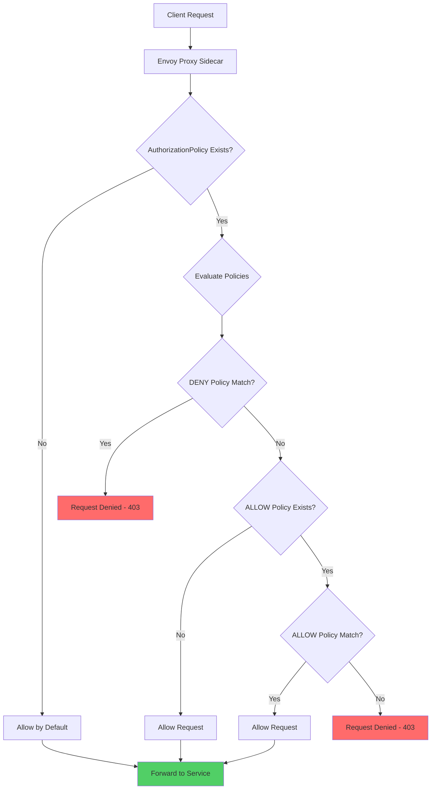
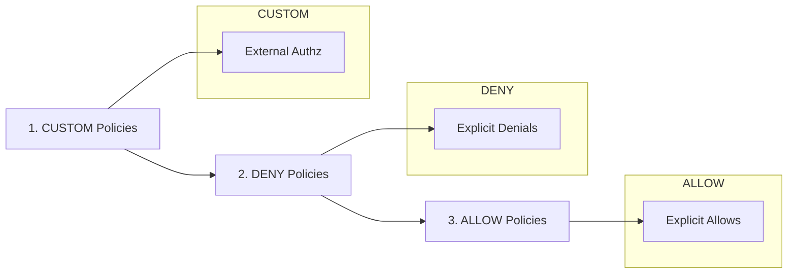
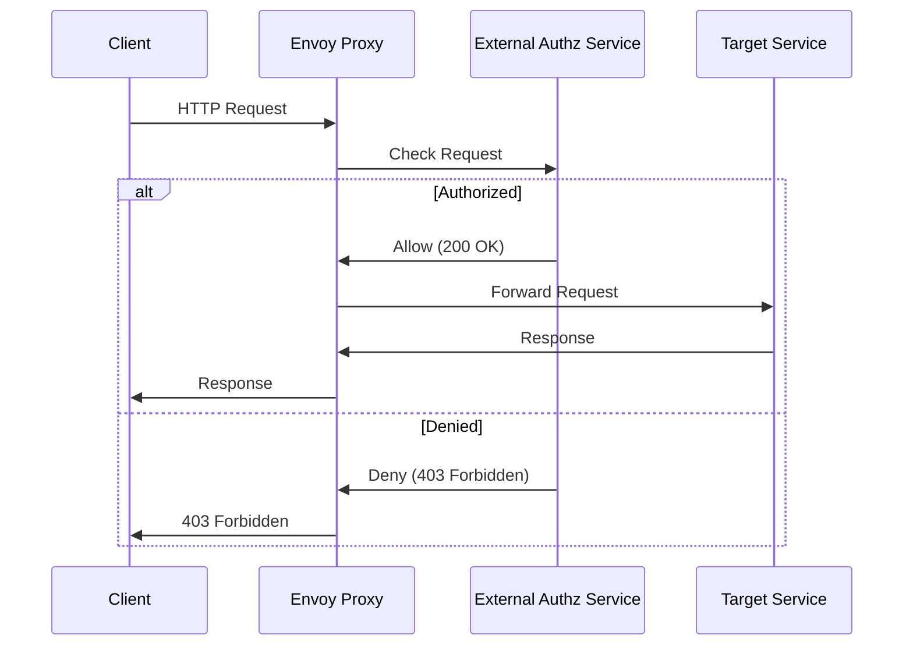
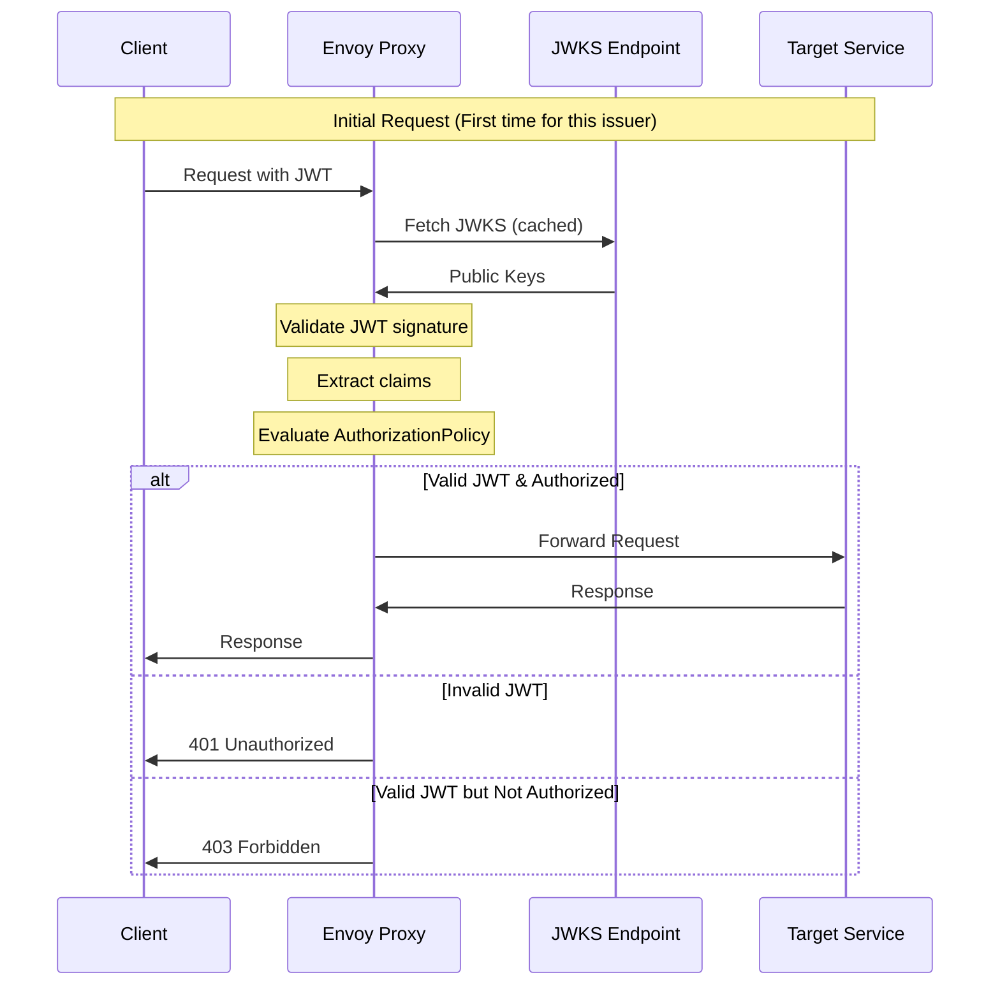
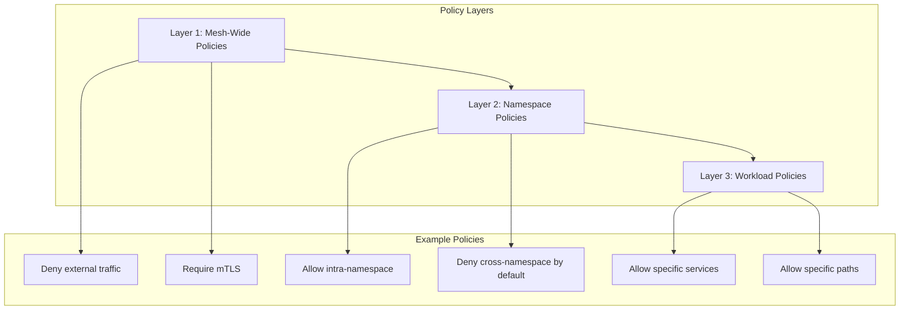

# How to Implement Authorization Policies in Istio

Author: [nawazdhandala](https://github.com/nawazdhandala)

Tags: Istio, Authorization, Security, RBAC, Service Mesh, Kubernetes

Description: Learn how to configure fine-grained authorization policies in Istio for service-to-service access control.

---

## Introduction

Authorization is a critical component of any secure microservices architecture. While authentication verifies who you are, authorization determines what you can do. Istio provides a powerful and flexible authorization framework through its `AuthorizationPolicy` resource, enabling fine-grained access control at the service mesh level.

In this comprehensive guide, we'll explore how to implement authorization policies in Istio, covering everything from basic ALLOW/DENY rules to advanced JWT-based authorization and custom external authorization.

## Understanding Istio Authorization

Before diving into implementation, let's understand how Istio's authorization system works at a high level.

### Authorization Flow

The following diagram illustrates how Istio processes authorization requests:



### Policy Evaluation Order

Istio evaluates authorization policies in a specific order:



## Prerequisites

Before implementing authorization policies, ensure you have:

- A Kubernetes cluster with Istio installed
- `kubectl` configured to communicate with your cluster
- `istioctl` installed for debugging and analysis
- Workloads deployed with Istio sidecar injection enabled

## Basic AuthorizationPolicy Structure

The AuthorizationPolicy resource is the foundation of Istio's authorization system. Here's the basic structure:

The following YAML shows the fundamental structure of an AuthorizationPolicy with all major sections annotated:

```yaml
# AuthorizationPolicy defines access control rules for workloads in the mesh
apiVersion: security.istio.io/v1
kind: AuthorizationPolicy
metadata:
  # Name uniquely identifies this policy within the namespace
  name: example-policy
  # Namespace where the policy applies (mesh-wide if istio-system)
  namespace: default
spec:
  # Selector specifies which workloads this policy applies to
  # Empty selector means all workloads in the namespace
  selector:
    matchLabels:
      app: my-service

  # Action determines what happens when rules match
  # Options: ALLOW, DENY, AUDIT, CUSTOM
  action: ALLOW

  # Rules define the conditions for the action
  # Multiple rules are OR'd together
  rules:
  - from:
    - source:
        # Source conditions (who is making the request)
        principals: ["cluster.local/ns/default/sa/client"]
    to:
    - operation:
        # Operation conditions (what is being requested)
        methods: ["GET"]
        paths: ["/api/*"]
    when:
    - key: request.headers[x-custom-header]
      values: ["allowed-value"]
```

## Implementing ALLOW Policies

ALLOW policies explicitly permit access when conditions are met. If any ALLOW policy exists for a workload, requests must match at least one ALLOW rule (unless explicitly denied).

### Basic ALLOW Policy

This policy allows GET requests to the product service from any authenticated source:

```yaml
# Allow read-only access to the product service
# This is useful for public-facing APIs that should be accessible
# to any authenticated user in the mesh
apiVersion: security.istio.io/v1
kind: AuthorizationPolicy
metadata:
  name: allow-product-read
  namespace: ecommerce
spec:
  # Target the product service pods
  selector:
    matchLabels:
      app: product-service

  # ALLOW action means matching requests are permitted
  action: ALLOW

  rules:
  # Rule 1: Allow GET requests to product endpoints
  - to:
    - operation:
        # Only allow HTTP GET method
        methods: ["GET"]
        # Allow access to product listing and individual products
        # The wildcard * matches any product ID
        paths: ["/products", "/products/*"]
```

### Allow by Service Account

This policy restricts access to specific service accounts, implementing service-to-service authorization:

```yaml
# Allow only the order service to modify inventory
# This ensures that inventory changes can only come from
# the trusted order processing workflow
apiVersion: security.istio.io/v1
kind: AuthorizationPolicy
metadata:
  name: allow-inventory-modification
  namespace: ecommerce
spec:
  selector:
    matchLabels:
      app: inventory-service

  action: ALLOW

  rules:
  # Rule: Allow order-service to update inventory
  - from:
    - source:
        # Principals specify the identity of allowed callers
        # Format: cluster.local/ns/<namespace>/sa/<service-account>
        principals:
          - "cluster.local/ns/ecommerce/sa/order-service"
    to:
    - operation:
        # Allow state-changing HTTP methods
        methods: ["POST", "PUT", "PATCH", "DELETE"]
        # Restrict to inventory management endpoints
        paths: ["/inventory/*"]
```

### Allow by Namespace

This policy allows access based on the source namespace, useful for multi-tenant environments:

```yaml
# Allow any service in the frontend namespace to access the API gateway
# This is useful when you have a dedicated namespace for frontend services
# that need to communicate with backend APIs
apiVersion: security.istio.io/v1
kind: AuthorizationPolicy
metadata:
  name: allow-frontend-namespace
  namespace: backend
spec:
  selector:
    matchLabels:
      app: api-gateway

  action: ALLOW

  rules:
  - from:
    - source:
        # Namespaces specify which Kubernetes namespaces can access this service
        # All services in the 'frontend' namespace are allowed
        namespaces: ["frontend"]
    to:
    - operation:
        # Allow all HTTP methods
        methods: ["GET", "POST", "PUT", "DELETE"]
```

## Implementing DENY Policies

DENY policies are evaluated before ALLOW policies and explicitly reject matching requests. They're useful for creating blocklists and security boundaries.

### Deny Specific Paths

This policy denies access to administrative endpoints except from specific sources:

```yaml
# Block access to admin endpoints from non-admin services
# DENY policies are evaluated first, making them ideal for
# creating security boundaries that can't be overridden
apiVersion: security.istio.io/v1
kind: AuthorizationPolicy
metadata:
  name: deny-admin-access
  namespace: ecommerce
spec:
  selector:
    matchLabels:
      app: product-service

  # DENY action blocks all matching requests
  action: DENY

  rules:
  - from:
    - source:
        # notPrincipals creates an exclusion list
        # This denies access to everyone EXCEPT the admin-service
        notPrincipals:
          - "cluster.local/ns/ecommerce/sa/admin-service"
    to:
    - operation:
        # Block access to all admin endpoints
        # The wildcard matches any path starting with /admin/
        paths: ["/admin/*"]
```

### Deny by IP Range

Block requests from specific IP ranges, useful for blocking known malicious sources:

```yaml
# Block requests from specific IP ranges
# This is useful for blocking traffic from known malicious sources
# or restricting access based on network topology
apiVersion: security.istio.io/v1
kind: AuthorizationPolicy
metadata:
  name: deny-blocked-ips
  namespace: default
spec:
  # Apply to all workloads in the namespace (no selector)
  action: DENY

  rules:
  - from:
    - source:
        # ipBlocks specify CIDR ranges to match
        # These could be known malicious IP ranges or
        # networks that shouldn't have access
        ipBlocks:
          - "10.0.0.0/8"      # Block internal range
          - "192.168.1.0/24"  # Block specific subnet
        # notIpBlocks can be used to create exceptions within blocked ranges
```

### Deny Specific Headers

Block requests with specific header values, useful for filtering unwanted traffic:

```yaml
# Deny requests with deprecated API versions
# This helps enforce API version migration by blocking
# requests that use outdated API versions
apiVersion: security.istio.io/v1
kind: AuthorizationPolicy
metadata:
  name: deny-deprecated-api
  namespace: api
spec:
  selector:
    matchLabels:
      app: api-service

  action: DENY

  rules:
  - to:
    - operation:
        # Match all API paths
        paths: ["/api/*"]
    # When conditions provide additional matching criteria
    when:
    - key: request.headers[api-version]
      # Deny requests using deprecated API versions
      values: ["v1", "v1.0", "2019-01-01"]
```

## Implementing CUSTOM Authorization

CUSTOM action delegates authorization decisions to an external authorization service. This is powerful for complex authorization logic that can't be expressed in Istio's policy language.

### External Authorization Flow



### Configure External Authorization Provider

First, configure the external authorization provider in the Istio mesh configuration:

```yaml
# Configure the external authorization provider in Istio
# This is added to the mesh configuration (istio configmap or IstioOperator)
apiVersion: install.istio.io/v1alpha1
kind: IstioOperator
spec:
  meshConfig:
    extensionProviders:
    # Define the external authorization service
    - name: "custom-authz"
      envoyExtAuthzHttp:
        # Service address for the authorization service
        # Format: <service>.<namespace>.svc.cluster.local
        service: "authz-service.security.svc.cluster.local"
        # Port where the authorization service listens
        port: 8080
        # Headers to include in the authorization check request
        includeRequestHeadersInCheck:
          - "authorization"
          - "x-custom-header"
          - "x-request-id"
        # Headers from authz response to add to the request
        headersToUpstreamOnAllow:
          - "x-user-id"
          - "x-user-roles"
        # Headers from authz response to add to the client response on deny
        headersToDownstreamOnDeny:
          - "x-auth-error"
        # Timeout for the authorization check
        timeout: 5s
        # Include body in check request (useful for POST validation)
        includeRequestBodyInCheck:
          maxRequestBytes: 1024
          allowPartialMessage: true
```

### Create CUSTOM AuthorizationPolicy

Apply the CUSTOM policy to use the external authorization provider:

```yaml
# Use external authorization for payment service
# Complex payment authorization logic is delegated to
# a dedicated authorization service
apiVersion: security.istio.io/v1
kind: AuthorizationPolicy
metadata:
  name: custom-payment-authz
  namespace: ecommerce
spec:
  selector:
    matchLabels:
      app: payment-service

  # CUSTOM action delegates to external authorization
  action: CUSTOM

  # Provider specifies which extensionProvider to use
  # Must match a provider defined in meshConfig
  provider:
    name: "custom-authz"

  rules:
  # Rules define WHEN to invoke the external authorizer
  # The external service makes the actual allow/deny decision
  - to:
    - operation:
        # Invoke custom auth for all payment operations
        paths: ["/payments/*", "/refunds/*"]
```

### Example External Authorization Service

Here's an example external authorization service implementation in Go:

```go
// main.go - External Authorization Service
// This service implements Envoy's ext_authz API to make
// authorization decisions based on custom business logic

package main

import (
    "encoding/json"
    "log"
    "net/http"
    "strings"
)

// AuthRequest represents the incoming authorization check request
type AuthRequest struct {
    // Headers from the original request
    Headers map[string]string `json:"headers"`
    // Path being accessed
    Path    string            `json:"path"`
    // HTTP method
    Method  string            `json:"method"`
}

// AuthResponse represents our authorization decision
type AuthResponse struct {
    // Allowed indicates if the request should be permitted
    Allowed bool              `json:"allowed"`
    // Headers to add to the request if allowed
    Headers map[string]string `json:"headers,omitempty"`
    // Message explaining denial reason
    Message string            `json:"message,omitempty"`
}

func main() {
    // Handler for authorization check requests from Envoy
    http.HandleFunc("/check", handleAuthCheck)

    log.Println("Starting external authorization service on :8080")
    log.Fatal(http.ListenAndServe(":8080", nil))
}

func handleAuthCheck(w http.ResponseWriter, r *http.Request) {
    // Parse the authorization request
    var authReq AuthRequest
    if err := json.NewDecoder(r.Body).Decode(&authReq); err != nil {
        // If we can't parse the request, deny by default
        http.Error(w, "Invalid request", http.StatusBadRequest)
        return
    }

    // Extract the authorization token
    authHeader := authReq.Headers["authorization"]

    // Implement your custom authorization logic here
    // This example validates a bearer token and checks permissions
    response := checkAuthorization(authHeader, authReq.Path, authReq.Method)

    // Return appropriate HTTP status
    if response.Allowed {
        // 200 OK tells Envoy to allow the request
        w.WriteHeader(http.StatusOK)
        // Include any headers to add to the upstream request
        for key, value := range response.Headers {
            w.Header().Set(key, value)
        }
    } else {
        // 403 Forbidden tells Envoy to deny the request
        w.WriteHeader(http.StatusForbidden)
        w.Header().Set("x-auth-error", response.Message)
    }

    json.NewEncoder(w).Encode(response)
}

func checkAuthorization(token, path, method string) AuthResponse {
    // Remove "Bearer " prefix from token
    token = strings.TrimPrefix(token, "Bearer ")

    // Example: Validate token and extract user info
    // In production, this would verify JWT signature, check expiry, etc.
    userID, roles, valid := validateToken(token)

    if !valid {
        return AuthResponse{
            Allowed: false,
            Message: "Invalid or expired token",
        }
    }

    // Example: Check if user has required role for the path
    if strings.HasPrefix(path, "/payments/") && !contains(roles, "payment-admin") {
        return AuthResponse{
            Allowed: false,
            Message: "Insufficient permissions for payment operations",
        }
    }

    // Authorization successful - add user context headers
    return AuthResponse{
        Allowed: true,
        Headers: map[string]string{
            "x-user-id":    userID,
            "x-user-roles": strings.Join(roles, ","),
        },
    }
}

// validateToken verifies the token and returns user info
// This is a simplified example - use proper JWT validation in production
func validateToken(token string) (userID string, roles []string, valid bool) {
    // Implement your token validation logic
    // This would typically involve JWT verification, database lookups, etc.
    return "user-123", []string{"user", "payment-admin"}, true
}

func contains(slice []string, item string) bool {
    for _, s := range slice {
        if s == item {
            return true
        }
    }
    return false
}
```

## JWT-Based Authorization

Istio provides native support for JWT (JSON Web Token) based authorization, allowing you to make access control decisions based on JWT claims.

### JWT Authorization Flow



### Configure RequestAuthentication

First, configure JWT validation with a RequestAuthentication resource:

```yaml
# Configure JWT validation for the API
# This tells Istio how to validate JWTs from specific issuers
apiVersion: security.istio.io/v1
kind: RequestAuthentication
metadata:
  name: jwt-auth
  namespace: api
spec:
  selector:
    matchLabels:
      app: api-gateway

  jwtRules:
  # Rule for tokens issued by our identity provider
  - issuer: "https://auth.example.com"
    # JWKS URI where public keys for signature verification are published
    # Istio will fetch and cache these keys automatically
    jwksUri: "https://auth.example.com/.well-known/jwks.json"
    # Where to look for the JWT in the request
    # Default is Authorization header with Bearer prefix
    fromHeaders:
    - name: Authorization
      prefix: "Bearer "
    # Alternative: extract from query parameter
    fromParams:
    - "access_token"
    # Forward the original JWT to upstream services
    forwardOriginalToken: true
    # Which claims to output as headers (optional)
    outputClaimToHeaders:
    - header: "x-jwt-sub"
      claim: "sub"
    - header: "x-jwt-email"
      claim: "email"

  # Support multiple identity providers
  - issuer: "https://accounts.google.com"
    jwksUri: "https://www.googleapis.com/oauth2/v3/certs"
    # Specify expected audience
    audiences:
    - "my-api.example.com"
```

### JWT-Based AuthorizationPolicy

Create authorization policies that use JWT claims:

```yaml
# Authorize based on JWT claims
# This policy allows access only to users with specific roles in their JWT
apiVersion: security.istio.io/v1
kind: AuthorizationPolicy
metadata:
  name: require-admin-role
  namespace: api
spec:
  selector:
    matchLabels:
      app: api-gateway

  action: ALLOW

  rules:
  - to:
    - operation:
        # Admin endpoints require special authorization
        paths: ["/admin/*"]
    when:
    # Check JWT claims using request.auth.claims
    # The JWT must contain a 'roles' claim with 'admin' value
    - key: request.auth.claims[roles]
      values: ["admin"]
    # Optionally require specific issuer
    - key: request.auth.claims[iss]
      values: ["https://auth.example.com"]
```

### Require Valid JWT

Require a valid JWT for all requests to specific endpoints:

```yaml
# Require authentication for all API endpoints
# Requests without a valid JWT will be rejected
apiVersion: security.istio.io/v1
kind: AuthorizationPolicy
metadata:
  name: require-jwt
  namespace: api
spec:
  selector:
    matchLabels:
      app: api-gateway

  action: ALLOW

  rules:
  - from:
    - source:
        # requestPrincipals is set when a valid JWT is present
        # Format: <iss>/<sub> from the JWT
        # Using * matches any valid JWT
        requestPrincipals: ["*"]
    to:
    - operation:
        paths: ["/api/*"]
```

### Role-Based Access Control with JWT

Implement RBAC using JWT roles:

```yaml
# Fine-grained RBAC based on JWT roles
# Different roles have access to different endpoints and methods
apiVersion: security.istio.io/v1
kind: AuthorizationPolicy
metadata:
  name: api-rbac
  namespace: api
spec:
  selector:
    matchLabels:
      app: api-gateway

  action: ALLOW

  rules:
  # Rule 1: Viewers can only read data
  - to:
    - operation:
        methods: ["GET"]
        paths: ["/api/resources/*"]
    when:
    - key: request.auth.claims[roles]
      # Any of these roles can view resources
      values: ["viewer", "editor", "admin"]

  # Rule 2: Editors can read and modify data
  - to:
    - operation:
        methods: ["GET", "POST", "PUT", "PATCH"]
        paths: ["/api/resources/*"]
    when:
    - key: request.auth.claims[roles]
      values: ["editor", "admin"]

  # Rule 3: Only admins can delete
  - to:
    - operation:
        methods: ["DELETE"]
        paths: ["/api/resources/*"]
    when:
    - key: request.auth.claims[roles]
      values: ["admin"]

  # Rule 4: Admin-only endpoints
  - to:
    - operation:
        paths: ["/api/admin/*"]
    when:
    - key: request.auth.claims[roles]
      values: ["admin"]
```

## Advanced Source and Operation Selectors

Istio provides rich selectors for matching requests. Let's explore advanced usage.

### Complex Source Matching

```yaml
# Complex source matching with multiple conditions
# This policy demonstrates various ways to identify request sources
apiVersion: security.istio.io/v1
kind: AuthorizationPolicy
metadata:
  name: complex-source-matching
  namespace: backend
spec:
  selector:
    matchLabels:
      app: data-service

  action: ALLOW

  rules:
  # Rule 1: Allow specific service accounts from specific namespaces
  - from:
    - source:
        # Combine principal and namespace checks
        principals:
          - "cluster.local/ns/frontend/sa/web-app"
          - "cluster.local/ns/frontend/sa/mobile-api"
        namespaces:
          - "frontend"

  # Rule 2: Allow any service from trusted namespaces
  - from:
    - source:
        namespaces:
          - "trusted-services"
          - "internal-tools"

  # Rule 3: Allow requests from specific IP ranges (external traffic)
  - from:
    - source:
        # Match requests from corporate network
        ipBlocks:
          - "203.0.113.0/24"
        # Exclude specific IPs within the range
        notIpBlocks:
          - "203.0.113.100/32"

  # Rule 4: Allow requests with valid JWT from specific audience
  - from:
    - source:
        # Match JWT principal pattern
        # * is a wildcard that matches any value
        requestPrincipals:
          - "https://auth.example.com/*"
```

### Complex Operation Matching

```yaml
# Complex operation matching with path patterns and headers
# This policy shows advanced ways to match request properties
apiVersion: security.istio.io/v1
kind: AuthorizationPolicy
metadata:
  name: complex-operation-matching
  namespace: api
spec:
  selector:
    matchLabels:
      app: api-service

  action: ALLOW

  rules:
  # Rule 1: Match specific paths with wildcards
  - to:
    - operation:
        # Various path matching patterns
        paths:
          - "/api/v1/*"           # Any path under /api/v1/
          - "/api/v2/users/*"     # Only user paths in v2
          - "/health"             # Exact match
          - "/ready"
        # Exclude certain paths within the allowed patterns
        notPaths:
          - "/api/v1/admin/*"     # But not admin paths
          - "/api/v1/internal/*"  # Or internal endpoints

  # Rule 2: Match by HTTP method and host
  - to:
    - operation:
        methods: ["GET", "HEAD", "OPTIONS"]
        # Match requests to specific hosts
        hosts:
          - "api.example.com"
          - "*.api.example.com"
        # Match specific ports
        ports:
          - "443"
          - "8443"

  # Rule 3: Match with header conditions
  - to:
    - operation:
        paths: ["/api/*"]
    when:
    # Require specific header value
    - key: request.headers[x-api-key]
      values: ["valid-key-1", "valid-key-2"]
    # Check request properties
    - key: request.headers[content-type]
      values: ["application/json"]
```

### Using notValues for Exclusions

```yaml
# Using notValues for exclusion patterns
# Useful when you want to allow everything except specific cases
apiVersion: security.istio.io/v1
kind: AuthorizationPolicy
metadata:
  name: exclusion-patterns
  namespace: api
spec:
  selector:
    matchLabels:
      app: api-service

  action: DENY

  rules:
  # Deny requests that DON'T have a valid API version header
  - to:
    - operation:
        paths: ["/api/*"]
    when:
    - key: request.headers[x-api-version]
      # notValues means deny if the header is NOT one of these values
      notValues: ["v2", "v3"]
```

## Namespace-Wide and Mesh-Wide Policies

### Namespace Default Deny

Implement a default-deny policy for a namespace:

```yaml
# Default deny all traffic in the namespace
# This creates a zero-trust baseline where all access must be explicitly allowed
apiVersion: security.istio.io/v1
kind: AuthorizationPolicy
metadata:
  name: default-deny
  namespace: production
spec:
  # Empty spec with no rules denies all traffic
  # Any workload without an explicit ALLOW policy will reject all requests
  {}
```

### Namespace Default Allow

Allow all traffic within a namespace (useful for development):

```yaml
# Allow all traffic within the development namespace
# Use this for development environments where security is less critical
apiVersion: security.istio.io/v1
kind: AuthorizationPolicy
metadata:
  name: allow-all
  namespace: development
spec:
  # Empty rules array allows all traffic
  rules:
  - {} # Allow all
```

### Mesh-Wide Policy

Apply a policy across the entire mesh:

```yaml
# Mesh-wide policy applied to all workloads
# Policies in istio-system namespace with no selector apply mesh-wide
apiVersion: security.istio.io/v1
kind: AuthorizationPolicy
metadata:
  name: mesh-wide-deny-external
  namespace: istio-system
spec:
  # No selector means this applies to all workloads in the mesh

  action: DENY

  rules:
  # Deny traffic from outside the cluster
  - from:
    - source:
        # notNamespaces matches traffic from outside any namespace
        # This effectively blocks external traffic mesh-wide
        notNamespaces: ["*"]
    to:
    - operation:
        # Except for explicitly exposed endpoints
        notPaths: ["/health", "/ready", "/metrics"]
```

## Combining Multiple Policies

When multiple policies apply to a workload, they're evaluated together. Here's how to design effective policy combinations:

### Layered Authorization Architecture



### Example: Complete Policy Set

Here's a complete example with multiple complementary policies:

```yaml
# Policy 1: Namespace default - deny all
# This establishes a zero-trust baseline for the namespace
apiVersion: security.istio.io/v1
kind: AuthorizationPolicy
metadata:
  name: default-deny
  namespace: ecommerce
spec: {}

---
# Policy 2: Allow health checks from anywhere
# Kubernetes liveness/readiness probes need to work
apiVersion: security.istio.io/v1
kind: AuthorizationPolicy
metadata:
  name: allow-health-checks
  namespace: ecommerce
spec:
  action: ALLOW
  rules:
  - to:
    - operation:
        methods: ["GET"]
        paths: ["/health", "/ready", "/live"]

---
# Policy 3: Allow ingress gateway to frontend
# External traffic comes through the ingress gateway
apiVersion: security.istio.io/v1
kind: AuthorizationPolicy
metadata:
  name: allow-ingress-to-frontend
  namespace: ecommerce
spec:
  selector:
    matchLabels:
      app: frontend

  action: ALLOW

  rules:
  - from:
    - source:
        principals:
          - "cluster.local/ns/istio-system/sa/istio-ingressgateway-service-account"

---
# Policy 4: Allow frontend to call backend services
# Frontend can call product and cart services
apiVersion: security.istio.io/v1
kind: AuthorizationPolicy
metadata:
  name: allow-frontend-to-backends
  namespace: ecommerce
spec:
  selector:
    matchLabels:
      tier: backend

  action: ALLOW

  rules:
  - from:
    - source:
        principals:
          - "cluster.local/ns/ecommerce/sa/frontend"
    to:
    - operation:
        methods: ["GET", "POST"]

---
# Policy 5: Deny admin endpoints except from admin service
# Extra protection for sensitive endpoints
apiVersion: security.istio.io/v1
kind: AuthorizationPolicy
metadata:
  name: protect-admin-endpoints
  namespace: ecommerce
spec:
  action: DENY

  rules:
  - from:
    - source:
        notPrincipals:
          - "cluster.local/ns/ecommerce/sa/admin-service"
    to:
    - operation:
        paths: ["/admin/*", "*/admin/*"]
```

## Debugging Authorization Policies

### Using istioctl analyze

Check for policy issues:

```bash
# Analyze authorization policies for issues
# This command checks for common misconfigurations
istioctl analyze -n your-namespace

# Analyze specific workload
istioctl analyze -n your-namespace --selector app=your-app
```

### Check Effective Policies

View which policies affect a specific workload:

```bash
# List all authorization policies affecting a pod
# This helps understand which policies are in scope
kubectl get authorizationpolicy -n your-namespace -o yaml

# Check the Envoy configuration for a pod
# This shows the actual rules loaded into the sidecar
istioctl proxy-config listener <pod-name> -n <namespace> -o json | grep -A 100 "rbac"
```

### Enable Debug Logging

Enable verbose logging to troubleshoot authorization:

```bash
# Enable debug logging for RBAC in a specific pod's sidecar
# This provides detailed logs about authorization decisions
istioctl proxy-config log <pod-name>.<namespace> --level rbac:debug

# View the logs
kubectl logs <pod-name> -c istio-proxy -n <namespace> | grep rbac
```

### Common Issues and Solutions

1. **Policy not taking effect**
   - Verify the selector matches your workload labels
   - Check that the namespace is correct
   - Ensure Istio sidecar is injected

2. **Unexpected denials**
   - Check for DENY policies that might be matching
   - Verify ALLOW policies cover your use case
   - Check if default-deny is in effect

3. **JWT authentication failures**
   - Verify the JWKS URI is accessible
   - Check token expiration
   - Verify issuer and audience claims match

## Best Practices

### 1. Start with Default Deny

Always implement default-deny at the namespace or mesh level:

```yaml
# Recommended: Start with default deny
# Then add explicit ALLOW policies for legitimate traffic
apiVersion: security.istio.io/v1
kind: AuthorizationPolicy
metadata:
  name: default-deny
  namespace: production
spec: {}
```

### 2. Use Least Privilege

Grant only the minimum necessary permissions:

```yaml
# Good: Specific, minimal permissions
rules:
- from:
  - source:
      principals: ["cluster.local/ns/frontend/sa/web-app"]
  to:
  - operation:
      methods: ["GET"]
      paths: ["/api/products/*"]

# Avoid: Overly broad permissions
# rules:
# - {} # Allows everything - too permissive
```

### 3. Layer Policies Appropriately

Use the right scope for each policy:

```yaml
# Mesh-wide: Security baselines
# Namespace in istio-system, no selector
metadata:
  name: mesh-baseline
  namespace: istio-system

# Namespace: Team/environment defaults
metadata:
  name: namespace-defaults
  namespace: team-namespace

# Workload: Service-specific rules
metadata:
  name: service-specific
  namespace: team-namespace
spec:
  selector:
    matchLabels:
      app: specific-service
```

### 4. Document Your Policies

Add clear annotations explaining the purpose:

```yaml
apiVersion: security.istio.io/v1
kind: AuthorizationPolicy
metadata:
  name: payment-service-authz
  namespace: ecommerce
  annotations:
    # Document the policy purpose
    description: "Restricts payment service access to order service only"
    owner: "security-team@example.com"
    last-reviewed: "2024-01-15"
spec:
  # ... policy spec
```

### 5. Test Policies Thoroughly

Always test in a staging environment first:

```bash
# Test that allowed requests succeed
curl -v -H "Authorization: Bearer $TOKEN" https://api.example.com/api/resource

# Test that denied requests fail
curl -v https://api.example.com/admin/users
# Should return 403 Forbidden
```

## Conclusion

Istio's authorization policies provide a powerful, flexible framework for implementing fine-grained access control in your service mesh. By leveraging AuthorizationPolicy resources with ALLOW, DENY, and CUSTOM actions, you can:

- Implement zero-trust security with default-deny policies
- Control service-to-service communication based on identity
- Enforce role-based access control using JWT claims
- Delegate complex authorization logic to external services
- Create layered security policies at mesh, namespace, and workload levels

Remember to always start with a default-deny posture, use least-privilege principles, and thoroughly test your policies before deploying to production. With proper authorization policies in place, you can significantly improve your microservices security while maintaining the flexibility to adapt to changing requirements.

## Additional Resources

- [Istio Authorization Documentation](https://istio.io/latest/docs/concepts/security/#authorization)
- [AuthorizationPolicy Reference](https://istio.io/latest/docs/reference/config/security/authorization-policy/)
- [RequestAuthentication Reference](https://istio.io/latest/docs/reference/config/security/request_authentication/)
- [Istio Security Best Practices](https://istio.io/latest/docs/ops/best-practices/security/)
