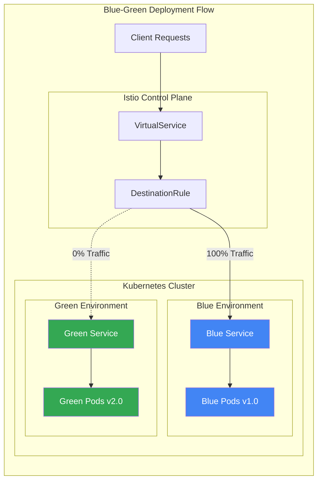
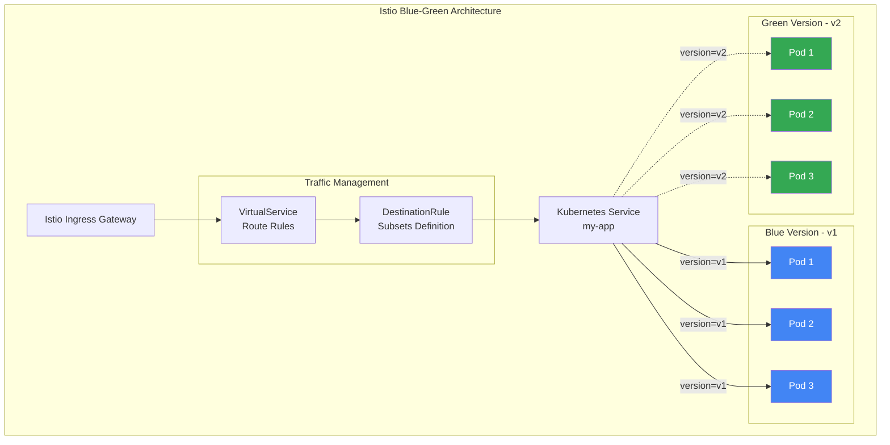
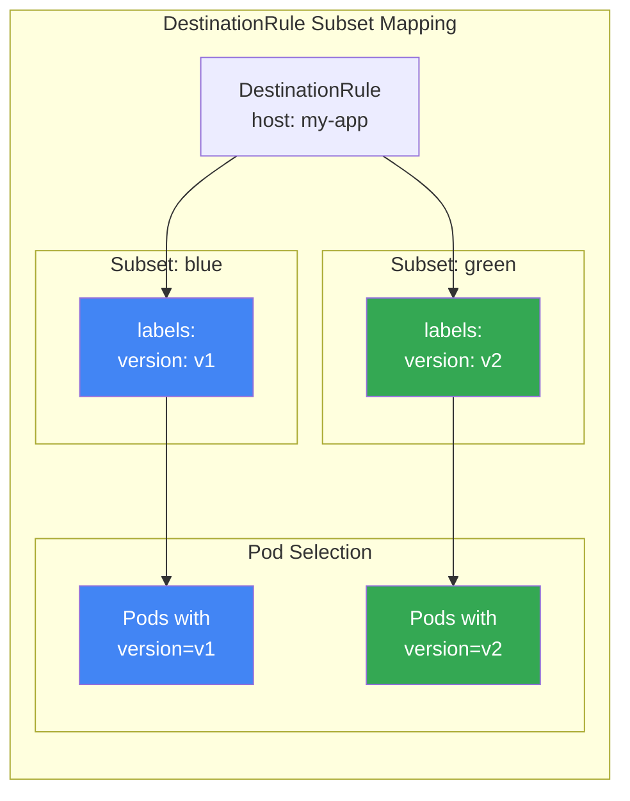
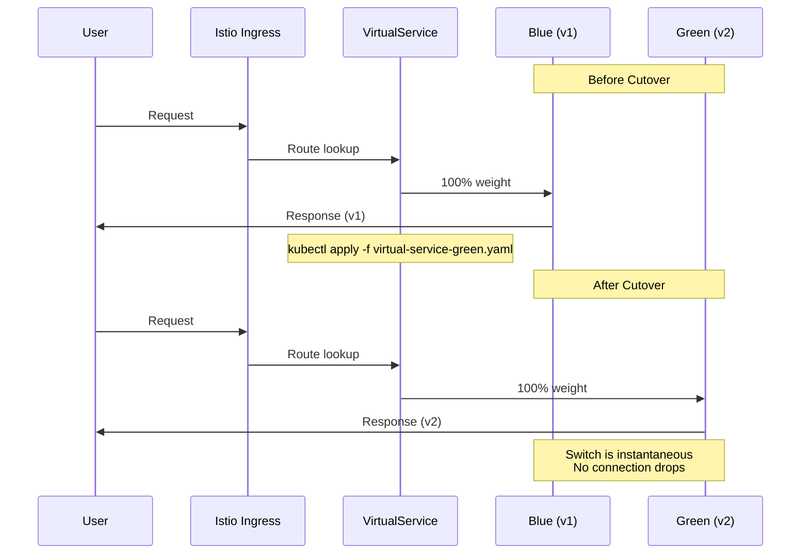
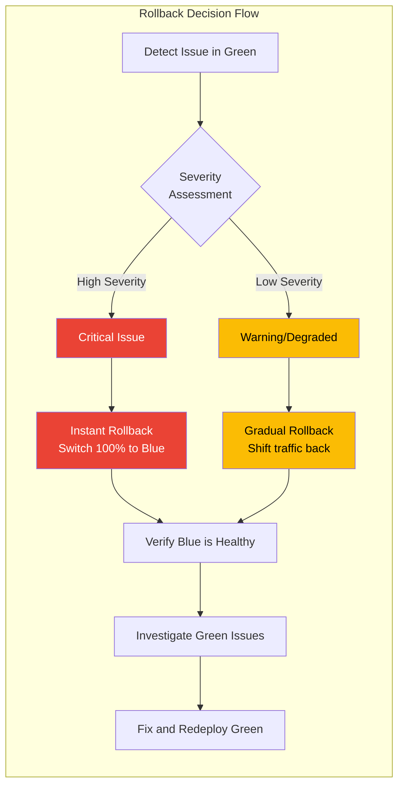
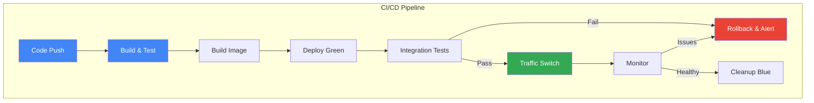

# How to Implement Blue-Green Deployments with Istio

Author: [nawazdhandala](https://github.com/nawazdhandala)

Tags: Istio, Blue-Green Deployment, DevOps, Service Mesh, Kubernetes

Description: Learn how to perform zero-downtime blue-green deployments using Istio traffic management.

---

Blue-green deployments are a powerful release strategy that minimizes downtime and risk by running two identical production environments. With Istio's sophisticated traffic management capabilities, you can implement seamless blue-green deployments that allow instant traffic switching and quick rollbacks. This comprehensive guide walks you through every aspect of implementing blue-green deployments using Istio.

## Table of Contents

1. [Understanding Blue-Green Deployments](#understanding-blue-green-deployments)
2. [Prerequisites](#prerequisites)
3. [Architecture Overview](#architecture-overview)
4. [Setting Up the Application](#setting-up-the-application)
5. [Configuring DestinationRule Subsets](#configuring-destinationrule-subsets)
6. [VirtualService Traffic Switching](#virtualservice-traffic-switching)
7. [Instant Cutover Techniques](#instant-cutover-techniques)
8. [Rollback Procedures](#rollback-procedures)
9. [Automation and CI/CD Integration](#automation-and-cicd-integration)
10. [Monitoring and Validation](#monitoring-and-validation)
11. [Best Practices](#best-practices)
12. [Troubleshooting](#troubleshooting)

## Understanding Blue-Green Deployments

Blue-green deployment is a technique that reduces downtime and risk by running two identical production environments called "Blue" and "Green." At any time, only one environment is live and serving production traffic, while the other remains idle or serves as a staging environment for the next release.

### How It Works

The following diagram illustrates the blue-green deployment flow with Istio:



### Benefits of Blue-Green with Istio

- **Zero Downtime**: Traffic switching is instantaneous at the network layer
- **Instant Rollback**: Revert to the previous version in seconds
- **Risk Reduction**: Test the new version in production-like conditions before switching
- **No Load Balancer Changes**: Istio handles all traffic routing internally

## Prerequisites

Before implementing blue-green deployments with Istio, ensure you have:

- Kubernetes cluster (1.23+) with kubectl configured
- Istio 1.18+ installed with the default profile
- Helm 3.x (optional, for easier management)
- Basic understanding of Kubernetes Deployments and Services

To verify your Istio installation, run the following command:

```bash
# Verify Istio installation and check that all components are running
istioctl version

# Expected output shows both client and control plane versions
# Example: client version: 1.20.0, control plane version: 1.20.0
```

Enable Istio sidecar injection for your namespace:

```bash
# Label the namespace to enable automatic sidecar injection
# This ensures all pods in this namespace get the Envoy proxy sidecar
kubectl label namespace default istio-injection=enabled
```

## Architecture Overview

The following diagram shows the complete architecture of a blue-green deployment with Istio:



## Setting Up the Application

Let's create a sample application with two versions to demonstrate blue-green deployments.

### Blue Deployment (v1)

First, we create the blue deployment representing our current production version. Notice the version label that Istio will use for traffic routing:

```yaml
# blue-deployment.yaml
# This deployment represents the current production version (v1)
# The 'version: v1' label is crucial for Istio's DestinationRule subset matching
apiVersion: apps/v1
kind: Deployment
metadata:
  name: my-app-v1
  labels:
    app: my-app
    version: v1
spec:
  # Running 3 replicas ensures high availability for production traffic
  replicas: 3
  selector:
    matchLabels:
      app: my-app
      version: v1
  template:
    metadata:
      labels:
        # These labels must match the selector and are used by Istio for routing
        app: my-app
        version: v1
    spec:
      containers:
      - name: my-app
        # Using a specific image tag for version control
        image: my-app:1.0.0
        ports:
        - containerPort: 8080
        # Resource limits prevent resource starvation in the cluster
        resources:
          requests:
            memory: "128Mi"
            cpu: "100m"
          limits:
            memory: "256Mi"
            cpu: "200m"
        # Readiness probe ensures traffic only goes to healthy pods
        readinessProbe:
          httpGet:
            path: /health
            port: 8080
          initialDelaySeconds: 5
          periodSeconds: 10
        # Liveness probe restarts unhealthy containers automatically
        livenessProbe:
          httpGet:
            path: /health
            port: 8080
          initialDelaySeconds: 15
          periodSeconds: 20
```

### Green Deployment (v2)

Next, create the green deployment for the new version. This runs alongside blue but receives no traffic initially:

```yaml
# green-deployment.yaml
# This deployment represents the new version (v2) to be released
# It runs in parallel with v1 but initially receives no traffic
apiVersion: apps/v1
kind: Deployment
metadata:
  name: my-app-v2
  labels:
    app: my-app
    version: v2
spec:
  # Same replica count as v1 to handle full production load after switch
  replicas: 3
  selector:
    matchLabels:
      app: my-app
      version: v2
  template:
    metadata:
      labels:
        # The 'version: v2' label distinguishes this from v1 pods
        app: my-app
        version: v2
    spec:
      containers:
      - name: my-app
        # New version with updated features or fixes
        image: my-app:2.0.0
        ports:
        - containerPort: 8080
        resources:
          requests:
            memory: "128Mi"
            cpu: "100m"
          limits:
            memory: "256Mi"
            cpu: "200m"
        # Same health checks ensure consistent behavior across versions
        readinessProbe:
          httpGet:
            path: /health
            port: 8080
          initialDelaySeconds: 5
          periodSeconds: 10
        livenessProbe:
          httpGet:
            path: /health
            port: 8080
          initialDelaySeconds: 15
          periodSeconds: 20
```

### Kubernetes Service

Create a single service that selects pods from both versions. Istio will handle the actual traffic splitting:

```yaml
# service.yaml
# A single Kubernetes Service selects pods from both versions
# Istio's VirtualService and DestinationRule control which version receives traffic
apiVersion: v1
kind: Service
metadata:
  name: my-app
  labels:
    app: my-app
spec:
  ports:
  - port: 80
    targetPort: 8080
    name: http
  # The selector matches both v1 and v2 pods via the 'app' label
  # Version-specific routing is handled by Istio, not the Service
  selector:
    app: my-app
```

Apply all the resources to create the initial setup:

```bash
# Deploy all resources to the cluster
# The order matters: service should exist before the Istio routing rules reference it
kubectl apply -f blue-deployment.yaml
kubectl apply -f green-deployment.yaml
kubectl apply -f service.yaml

# Verify all pods are running and ready
# Wait for all 6 pods (3 v1 + 3 v2) to show Running status
kubectl get pods -l app=my-app

# Check that both versions are represented
kubectl get pods -l app=my-app --show-labels
```

## Configuring DestinationRule Subsets

The DestinationRule defines subsets that group pods by version. These subsets are referenced by VirtualService for traffic routing.

### Understanding Subsets

The following diagram explains how DestinationRule subsets work:



### Basic DestinationRule

This DestinationRule creates two subsets that Istio uses to identify pods for each version:

```yaml
# destination-rule.yaml
# DestinationRule defines subsets for version-based traffic routing
# Each subset maps to pods with specific labels
apiVersion: networking.istio.io/v1beta1
kind: DestinationRule
metadata:
  name: my-app-destination
spec:
  # The host must match the Kubernetes Service name
  host: my-app
  # Traffic policy applies to all subsets unless overridden
  trafficPolicy:
    # Connection pool settings prevent overwhelming the backends
    connectionPool:
      tcp:
        maxConnections: 100
      http:
        h2UpgradePolicy: UPGRADE
        http1MaxPendingRequests: 100
        http2MaxRequests: 1000
  subsets:
  # Blue subset targets all pods labeled with version=v1
  - name: blue
    labels:
      version: v1
    # Optional: subset-specific traffic policy
    trafficPolicy:
      connectionPool:
        http:
          http2MaxRequests: 500
  # Green subset targets all pods labeled with version=v2
  - name: green
    labels:
      version: v2
    trafficPolicy:
      connectionPool:
        http:
          http2MaxRequests: 500
```

### Advanced DestinationRule with Load Balancing

For production environments, configure load balancing and outlier detection to improve reliability:

```yaml
# destination-rule-advanced.yaml
# Advanced DestinationRule with load balancing and circuit breaking
# This configuration improves reliability and performance
apiVersion: networking.istio.io/v1beta1
kind: DestinationRule
metadata:
  name: my-app-destination
spec:
  host: my-app
  trafficPolicy:
    # Load balancer settings distribute traffic across healthy pods
    loadBalancer:
      # ROUND_ROBIN provides even distribution
      # Other options: LEAST_CONN, RANDOM, PASSTHROUGH
      simple: ROUND_ROBIN
    # Connection pool prevents resource exhaustion
    connectionPool:
      tcp:
        maxConnections: 100
        connectTimeout: 30s
      http:
        http1MaxPendingRequests: 100
        http2MaxRequests: 1000
        maxRequestsPerConnection: 100
        maxRetries: 3
    # Outlier detection implements circuit breaking
    # Unhealthy pods are temporarily removed from the load balancing pool
    outlierDetection:
      # Check every 30 seconds for failures
      interval: 30s
      # Number of consecutive errors before ejection
      consecutive5xxErrors: 5
      # How long a pod is ejected from the pool
      baseEjectionTime: 30s
      # Maximum percentage of pods that can be ejected
      maxEjectionPercent: 50
  subsets:
  - name: blue
    labels:
      version: v1
    trafficPolicy:
      # Blue subset can have its own load balancer settings
      loadBalancer:
        simple: LEAST_CONN
  - name: green
    labels:
      version: v2
    trafficPolicy:
      loadBalancer:
        simple: LEAST_CONN
```

Apply the DestinationRule:

```bash
# Apply the DestinationRule to configure subsets
kubectl apply -f destination-rule.yaml

# Verify the DestinationRule was created correctly
kubectl get destinationrule my-app-destination -o yaml

# Check Istio configuration for any validation errors
istioctl analyze
```

## VirtualService Traffic Switching

The VirtualService controls traffic routing between blue and green subsets. This is the core mechanism for switching traffic between versions.

### Initial VirtualService (100% Blue)

Start by routing all traffic to the blue (v1) subset:

```yaml
# virtual-service-blue.yaml
# VirtualService routes 100% of traffic to the blue (v1) subset
# This is the initial state before switching to green
apiVersion: networking.istio.io/v1beta1
kind: VirtualService
metadata:
  name: my-app-routing
spec:
  # Hosts this VirtualService applies to
  # Use '*' for all hosts or specify exact hostnames
  hosts:
  - my-app
  - my-app.example.com
  # Gateways this VirtualService is attached to
  # 'mesh' applies to internal mesh traffic
  gateways:
  - my-app-gateway
  - mesh
  http:
  # Route definition for HTTP traffic
  - name: "blue-green-route"
    # Match conditions (optional - matches all if not specified)
    match:
    - uri:
        prefix: /
    # Route 100% of traffic to the blue subset
    route:
    - destination:
        host: my-app
        subset: blue
      # Weight of 100 means all traffic goes to blue
      weight: 100
    # Retry policy for failed requests
    retries:
      attempts: 3
      perTryTimeout: 2s
      retryOn: gateway-error,connect-failure,refused-stream
    # Request timeout for the entire request
    timeout: 30s
```

### Traffic Switch to Green

To switch traffic to the green (v2) subset, update the weights in the VirtualService:

```yaml
# virtual-service-green.yaml
# VirtualService updated to route 100% traffic to green (v2)
# Apply this to complete the blue-green switch
apiVersion: networking.istio.io/v1beta1
kind: VirtualService
metadata:
  name: my-app-routing
spec:
  hosts:
  - my-app
  - my-app.example.com
  gateways:
  - my-app-gateway
  - mesh
  http:
  - name: "blue-green-route"
    match:
    - uri:
        prefix: /
    route:
    # Route 100% of traffic to the green subset
    - destination:
        host: my-app
        subset: green
      # Weight of 100 means all traffic now goes to green
      weight: 100
    retries:
      attempts: 3
      perTryTimeout: 2s
      retryOn: gateway-error,connect-failure,refused-stream
    timeout: 30s
```

### Gradual Traffic Shift (Hybrid Approach)

For extra safety, you can temporarily split traffic between versions before full cutover:

```yaml
# virtual-service-split.yaml
# VirtualService with traffic split between blue and green
# Useful for initial validation before complete switch
apiVersion: networking.istio.io/v1beta1
kind: VirtualService
metadata:
  name: my-app-routing
spec:
  hosts:
  - my-app
  - my-app.example.com
  gateways:
  - my-app-gateway
  - mesh
  http:
  - name: "blue-green-route"
    match:
    - uri:
        prefix: /
    route:
    # Split traffic: 90% blue, 10% green for initial validation
    - destination:
        host: my-app
        subset: blue
      weight: 90
    - destination:
        host: my-app
        subset: green
      weight: 10
    retries:
      attempts: 3
      perTryTimeout: 2s
    timeout: 30s
```

Apply the VirtualService to switch traffic:

```bash
# Apply initial routing (100% to blue)
kubectl apply -f virtual-service-blue.yaml

# When ready to switch, apply green routing
kubectl apply -f virtual-service-green.yaml

# Or use gradual traffic shift for safety
kubectl apply -f virtual-service-split.yaml

# Verify the VirtualService configuration
kubectl get virtualservice my-app-routing -o yaml

# Check that routes are correctly configured
istioctl proxy-config routes deploy/my-app-v1 --name 80 -o json
```

## Instant Cutover Techniques

The following diagram shows the traffic flow during an instant cutover:



### One-Command Cutover Script

Create a script for instant traffic switching with pre-flight checks:

```bash
#!/bin/bash
# switch-traffic.sh
# Instant blue-green traffic switch script with safety checks
# Usage: ./switch-traffic.sh <blue|green>

set -e

# Define color codes for output
RED='\033[0;31m'
GREEN='\033[0;32m'
YELLOW='\033[1;33m'
NC='\033[0m' # No Color

# Target version to switch to (blue or green)
TARGET_VERSION=$1
NAMESPACE=${NAMESPACE:-default}
APP_NAME=${APP_NAME:-my-app}
VIRTUALSERVICE_NAME="${APP_NAME}-routing"

# Validate input parameter
if [[ "$TARGET_VERSION" != "blue" && "$TARGET_VERSION" != "green" ]]; then
    echo -e "${RED}Error: Please specify 'blue' or 'green' as the target version${NC}"
    echo "Usage: $0 <blue|green>"
    exit 1
fi

# Function to check if pods are ready
check_pods_ready() {
    local version=$1
    local label_version

    # Map blue/green to version labels
    if [[ "$version" == "blue" ]]; then
        label_version="v1"
    else
        label_version="v2"
    fi

    # Get ready pod count
    local ready_pods=$(kubectl get pods -n "$NAMESPACE" \
        -l "app=$APP_NAME,version=$label_version" \
        -o jsonpath='{.items[*].status.conditions[?(@.type=="Ready")].status}' | \
        grep -o "True" | wc -l)

    # Get total pod count
    local total_pods=$(kubectl get pods -n "$NAMESPACE" \
        -l "app=$APP_NAME,version=$label_version" \
        --no-headers | wc -l)

    echo "Ready pods for $version: $ready_pods/$total_pods"

    if [[ "$ready_pods" -eq 0 ]]; then
        return 1
    fi

    return 0
}

# Pre-flight checks
echo -e "${YELLOW}Running pre-flight checks...${NC}"

# Check if target pods are healthy
if ! check_pods_ready "$TARGET_VERSION"; then
    echo -e "${RED}Error: No ready pods found for $TARGET_VERSION version${NC}"
    echo "Please ensure the target deployment is healthy before switching"
    exit 1
fi

# Check current traffic distribution
echo -e "${YELLOW}Current VirtualService configuration:${NC}"
kubectl get virtualservice "$VIRTUALSERVICE_NAME" -n "$NAMESPACE" \
    -o jsonpath='{.spec.http[0].route}' | jq .

# Confirm switch
echo -e "${YELLOW}Switching all traffic to: $TARGET_VERSION${NC}"
read -p "Proceed? (y/n) " -n 1 -r
echo
if [[ ! $REPLY =~ ^[Yy]$ ]]; then
    echo "Switch cancelled"
    exit 0
fi

# Generate the VirtualService patch
# Using kubectl patch for atomic update
PATCH=$(cat <<EOF
{
  "spec": {
    "http": [{
      "name": "blue-green-route",
      "match": [{"uri": {"prefix": "/"}}],
      "route": [{
        "destination": {
          "host": "${APP_NAME}",
          "subset": "${TARGET_VERSION}"
        },
        "weight": 100
      }],
      "retries": {
        "attempts": 3,
        "perTryTimeout": "2s"
      },
      "timeout": "30s"
    }]
  }
}
EOF
)

# Apply the patch - this is the instant cutover
echo -e "${YELLOW}Applying traffic switch...${NC}"
kubectl patch virtualservice "$VIRTUALSERVICE_NAME" -n "$NAMESPACE" \
    --type=merge \
    --patch "$PATCH"

# Verify the switch
echo -e "${GREEN}Traffic switch complete!${NC}"
echo "Verifying new configuration:"
kubectl get virtualservice "$VIRTUALSERVICE_NAME" -n "$NAMESPACE" \
    -o jsonpath='{.spec.http[0].route}' | jq .

# Monitor traffic for a few seconds
echo -e "${YELLOW}Monitoring traffic distribution...${NC}"
for i in {1..5}; do
    sleep 2
    echo "Check $i/5..."
    # You can add custom monitoring commands here
done

echo -e "${GREEN}Switch to $TARGET_VERSION completed successfully!${NC}"
```

Make the script executable and use it:

```bash
# Make the script executable
chmod +x switch-traffic.sh

# Switch traffic to green (v2)
./switch-traffic.sh green

# Switch traffic back to blue (v1) if needed
./switch-traffic.sh blue
```

### Kubectl Patch for Quick Switching

For simpler scenarios, use kubectl patch directly:

```bash
# Switch to green using kubectl patch
# The --type=merge ensures atomic update of the VirtualService
kubectl patch virtualservice my-app-routing --type=merge -p '
{
  "spec": {
    "http": [{
      "name": "blue-green-route",
      "route": [{
        "destination": {
          "host": "my-app",
          "subset": "green"
        },
        "weight": 100
      }]
    }]
  }
}'

# Verify the change took effect immediately
kubectl get virtualservice my-app-routing -o jsonpath='{.spec.http[0].route[0].destination.subset}'
```

## Rollback Procedures

The following diagram illustrates the rollback process:



### Instant Rollback

When issues are detected, immediately switch back to the stable version:

```bash
#!/bin/bash
# rollback.sh
# Emergency rollback script - switches traffic back to blue immediately
# Usage: ./rollback.sh

set -e

NAMESPACE=${NAMESPACE:-default}
APP_NAME=${APP_NAME:-my-app}
VIRTUALSERVICE_NAME="${APP_NAME}-routing"

echo "EMERGENCY ROLLBACK: Switching all traffic to blue (v1)"

# Patch VirtualService to route 100% to blue
# This takes effect immediately without any downtime
kubectl patch virtualservice "$VIRTUALSERVICE_NAME" -n "$NAMESPACE" \
    --type=merge \
    -p '{
      "spec": {
        "http": [{
          "name": "blue-green-route",
          "route": [{
            "destination": {
              "host": "'"$APP_NAME"'",
              "subset": "blue"
            },
            "weight": 100
          }]
        }]
      }
    }'

# Verify rollback
echo "Rollback complete. Current routing:"
kubectl get virtualservice "$VIRTUALSERVICE_NAME" -n "$NAMESPACE" \
    -o jsonpath='{.spec.http[0].route}' | jq .

# Check blue pods are healthy
echo "Blue pod status:"
kubectl get pods -n "$NAMESPACE" -l "app=$APP_NAME,version=v1"
```

### VirtualService for Rollback

Keep a rollback VirtualService configuration ready:

```yaml
# virtual-service-rollback.yaml
# Pre-configured VirtualService for emergency rollback to blue
# Apply this file immediately when issues are detected
apiVersion: networking.istio.io/v1beta1
kind: VirtualService
metadata:
  name: my-app-routing
  annotations:
    # Document the rollback reason for audit purposes
    rollback.istio.io/reason: "Emergency rollback to stable version"
    rollback.istio.io/timestamp: "2024-01-15T10:30:00Z"
spec:
  hosts:
  - my-app
  - my-app.example.com
  gateways:
  - my-app-gateway
  - mesh
  http:
  - name: "blue-green-route"
    match:
    - uri:
        prefix: /
    route:
    # 100% traffic to blue (stable version)
    - destination:
        host: my-app
        subset: blue
      weight: 100
    # Aggressive retry settings for stability during rollback
    retries:
      attempts: 5
      perTryTimeout: 3s
      retryOn: gateway-error,connect-failure,refused-stream,5xx
    timeout: 45s
```

### Automated Rollback with Health Checks

Implement automated rollback based on health metrics:

```bash
#!/bin/bash
# auto-rollback.sh
# Automated rollback script that monitors health and rolls back if needed
# Usage: ./auto-rollback.sh

set -e

NAMESPACE=${NAMESPACE:-default}
APP_NAME=${APP_NAME:-my-app}
VIRTUALSERVICE_NAME="${APP_NAME}-routing"
ERROR_THRESHOLD=10  # Error rate percentage threshold
CHECK_INTERVAL=30   # Seconds between checks
MAX_CHECKS=10       # Number of checks before considering deployment stable

echo "Starting automated health monitoring for blue-green deployment"
echo "Error threshold: ${ERROR_THRESHOLD}%"
echo "Check interval: ${CHECK_INTERVAL}s"
echo "Max checks: ${MAX_CHECKS}"

# Function to get error rate from Prometheus/Istio metrics
get_error_rate() {
    # Query Istio metrics for 5xx error rate
    # This uses the Prometheus API - adjust endpoint as needed
    local error_rate=$(kubectl exec -n istio-system \
        $(kubectl get pod -n istio-system -l app=prometheus -o jsonpath='{.items[0].metadata.name}') \
        -- curl -s 'http://localhost:9090/api/v1/query' \
        --data-urlencode "query=sum(rate(istio_requests_total{destination_app=\"${APP_NAME}\",response_code=~\"5.*\"}[1m])) / sum(rate(istio_requests_total{destination_app=\"${APP_NAME}\"}[1m])) * 100" \
        | jq -r '.data.result[0].value[1] // "0"' 2>/dev/null)

    # Handle empty or invalid response
    if [[ -z "$error_rate" || "$error_rate" == "null" ]]; then
        echo "0"
    else
        printf "%.2f" "$error_rate"
    fi
}

# Function to perform rollback
perform_rollback() {
    echo "ERROR THRESHOLD EXCEEDED - Initiating automatic rollback!"

    kubectl patch virtualservice "$VIRTUALSERVICE_NAME" -n "$NAMESPACE" \
        --type=merge \
        -p '{
          "spec": {
            "http": [{
              "name": "blue-green-route",
              "route": [{
                "destination": {
                  "host": "'"$APP_NAME"'",
                  "subset": "blue"
                },
                "weight": 100
              }]
            }]
          }
        }'

    echo "Rollback completed at $(date)"

    # Send alert (customize this for your alerting system)
    # curl -X POST "https://alerts.example.com/webhook" \
    #     -d '{"message": "Automatic rollback triggered for '"$APP_NAME"'"}'

    exit 1
}

# Main monitoring loop
for ((i=1; i<=MAX_CHECKS; i++)); do
    echo "Health check $i/$MAX_CHECKS at $(date)"

    error_rate=$(get_error_rate)
    echo "Current error rate: ${error_rate}%"

    # Compare error rate with threshold
    if (( $(echo "$error_rate > $ERROR_THRESHOLD" | bc -l) )); then
        echo "Error rate ${error_rate}% exceeds threshold ${ERROR_THRESHOLD}%"
        perform_rollback
    fi

    if [[ $i -lt $MAX_CHECKS ]]; then
        echo "Waiting ${CHECK_INTERVAL}s before next check..."
        sleep $CHECK_INTERVAL
    fi
done

echo "All health checks passed! Deployment is stable."
```

## Automation and CI/CD Integration

### Complete CI/CD Pipeline

The following diagram shows the CI/CD pipeline for blue-green deployments:



### GitHub Actions Workflow

Create a complete GitHub Actions workflow for automated blue-green deployments:

```yaml
# .github/workflows/blue-green-deploy.yaml
# Complete GitHub Actions workflow for Istio blue-green deployments
# Includes build, deploy, test, switch, and rollback stages

name: Blue-Green Deployment

on:
  push:
    branches:
      - main
    paths:
      - 'src/**'
      - 'Dockerfile'
  workflow_dispatch:
    inputs:
      action:
        description: 'Action to perform'
        required: true
        default: 'deploy'
        type: choice
        options:
          - deploy
          - rollback
          - switch-blue
          - switch-green

env:
  REGISTRY: ghcr.io
  IMAGE_NAME: ${{ github.repository }}
  K8S_NAMESPACE: production
  APP_NAME: my-app

jobs:
  # Build and push Docker image
  build:
    runs-on: ubuntu-latest
    if: github.event.inputs.action != 'rollback' && github.event.inputs.action != 'switch-blue'
    outputs:
      image_tag: ${{ steps.meta.outputs.tags }}
      version: ${{ steps.version.outputs.version }}
    steps:
      - name: Checkout repository
        uses: actions/checkout@v4

      # Generate semantic version for the new image
      - name: Generate version
        id: version
        run: |
          VERSION=$(date +%Y%m%d)-${GITHUB_SHA::8}
          echo "version=$VERSION" >> $GITHUB_OUTPUT

      # Set up Docker Buildx for efficient multi-platform builds
      - name: Set up Docker Buildx
        uses: docker/setup-buildx-action@v3

      # Authenticate with container registry
      - name: Log in to Container Registry
        uses: docker/login-action@v3
        with:
          registry: ${{ env.REGISTRY }}
          username: ${{ github.actor }}
          password: ${{ secrets.GITHUB_TOKEN }}

      # Extract metadata for Docker image tagging
      - name: Extract metadata
        id: meta
        uses: docker/metadata-action@v5
        with:
          images: ${{ env.REGISTRY }}/${{ env.IMAGE_NAME }}
          tags: |
            type=raw,value=${{ steps.version.outputs.version }}
            type=raw,value=latest

      # Build and push the Docker image
      - name: Build and push Docker image
        uses: docker/build-push-action@v5
        with:
          context: .
          push: true
          tags: ${{ steps.meta.outputs.tags }}
          labels: ${{ steps.meta.outputs.labels }}
          cache-from: type=gha
          cache-to: type=gha,mode=max

  # Deploy to green environment
  deploy-green:
    runs-on: ubuntu-latest
    needs: build
    if: github.event.inputs.action == 'deploy' || github.event.inputs.action == ''
    steps:
      - name: Checkout repository
        uses: actions/checkout@v4

      # Configure kubectl to connect to the cluster
      - name: Configure Kubernetes
        uses: azure/k8s-set-context@v3
        with:
          kubeconfig: ${{ secrets.KUBECONFIG }}

      # Deploy the green version with the new image
      - name: Deploy Green Version
        run: |
          # Update the green deployment with new image
          kubectl set image deployment/my-app-v2 \
            my-app=${{ env.REGISTRY }}/${{ env.IMAGE_NAME }}:${{ needs.build.outputs.version }} \
            -n ${{ env.K8S_NAMESPACE }}

          # Wait for rollout to complete
          kubectl rollout status deployment/my-app-v2 \
            -n ${{ env.K8S_NAMESPACE }} \
            --timeout=5m

      # Verify green pods are healthy
      - name: Verify Green Deployment
        run: |
          # Wait for all pods to be ready
          kubectl wait --for=condition=ready pod \
            -l app=${{ env.APP_NAME }},version=v2 \
            -n ${{ env.K8S_NAMESPACE }} \
            --timeout=3m

          # Get pod status
          kubectl get pods -l app=${{ env.APP_NAME }},version=v2 \
            -n ${{ env.K8S_NAMESPACE }}

  # Run integration tests against green
  integration-tests:
    runs-on: ubuntu-latest
    needs: deploy-green
    steps:
      - name: Checkout repository
        uses: actions/checkout@v4

      - name: Configure Kubernetes
        uses: azure/k8s-set-context@v3
        with:
          kubeconfig: ${{ secrets.KUBECONFIG }}

      # Run tests against the green version directly
      - name: Run Integration Tests
        run: |
          # Get a green pod for testing
          GREEN_POD=$(kubectl get pod \
            -l app=${{ env.APP_NAME }},version=v2 \
            -n ${{ env.K8S_NAMESPACE }} \
            -o jsonpath='{.items[0].metadata.name}')

          # Port-forward to test the green version directly
          kubectl port-forward pod/$GREEN_POD 8080:8080 \
            -n ${{ env.K8S_NAMESPACE }} &
          sleep 5

          # Run health check
          curl -f http://localhost:8080/health || exit 1

          # Run additional integration tests
          # npm run test:integration || exit 1

          # Kill port-forward
          pkill -f "port-forward"

      # Run smoke tests
      - name: Run Smoke Tests
        run: |
          echo "Running smoke tests..."
          # Add your smoke test commands here
          # ./scripts/smoke-tests.sh

  # Switch traffic to green
  switch-traffic:
    runs-on: ubuntu-latest
    needs: integration-tests
    environment: production
    steps:
      - name: Checkout repository
        uses: actions/checkout@v4

      - name: Configure Kubernetes
        uses: azure/k8s-set-context@v3
        with:
          kubeconfig: ${{ secrets.KUBECONFIG }}

      # Switch 100% traffic to green
      - name: Switch Traffic to Green
        run: |
          # Apply VirtualService update to route all traffic to green
          kubectl patch virtualservice ${{ env.APP_NAME }}-routing \
            -n ${{ env.K8S_NAMESPACE }} \
            --type=merge \
            -p '{
              "spec": {
                "http": [{
                  "name": "blue-green-route",
                  "route": [{
                    "destination": {
                      "host": "${{ env.APP_NAME }}",
                      "subset": "green"
                    },
                    "weight": 100
                  }]
                }]
              }
            }'

          echo "Traffic switched to green version"

      # Verify traffic is flowing to green
      - name: Verify Traffic Switch
        run: |
          sleep 10

          # Check VirtualService configuration
          kubectl get virtualservice ${{ env.APP_NAME }}-routing \
            -n ${{ env.K8S_NAMESPACE }} \
            -o jsonpath='{.spec.http[0].route[0].destination.subset}'

  # Monitor and auto-rollback if needed
  monitor:
    runs-on: ubuntu-latest
    needs: switch-traffic
    steps:
      - name: Configure Kubernetes
        uses: azure/k8s-set-context@v3
        with:
          kubeconfig: ${{ secrets.KUBECONFIG }}

      # Monitor for 5 minutes
      - name: Monitor Deployment
        run: |
          echo "Monitoring deployment for 5 minutes..."

          for i in {1..10}; do
            echo "Check $i/10"

            # Check pod health
            READY=$(kubectl get pods \
              -l app=${{ env.APP_NAME }},version=v2 \
              -n ${{ env.K8S_NAMESPACE }} \
              -o jsonpath='{.items[*].status.conditions[?(@.type=="Ready")].status}' | \
              grep -o "True" | wc -l)

            TOTAL=$(kubectl get pods \
              -l app=${{ env.APP_NAME }},version=v2 \
              -n ${{ env.K8S_NAMESPACE }} \
              --no-headers | wc -l)

            echo "Healthy pods: $READY/$TOTAL"

            if [[ "$READY" -lt "$TOTAL" ]]; then
              echo "Some pods are unhealthy!"
              # Could trigger rollback here
            fi

            sleep 30
          done

          echo "Monitoring complete - deployment is stable"

  # Manual or automated rollback
  rollback:
    runs-on: ubuntu-latest
    if: github.event.inputs.action == 'rollback' || github.event.inputs.action == 'switch-blue'
    environment: production
    steps:
      - name: Configure Kubernetes
        uses: azure/k8s-set-context@v3
        with:
          kubeconfig: ${{ secrets.KUBECONFIG }}

      # Switch traffic back to blue
      - name: Rollback to Blue
        run: |
          kubectl patch virtualservice ${{ env.APP_NAME }}-routing \
            -n ${{ env.K8S_NAMESPACE }} \
            --type=merge \
            -p '{
              "spec": {
                "http": [{
                  "name": "blue-green-route",
                  "route": [{
                    "destination": {
                      "host": "${{ env.APP_NAME }}",
                      "subset": "blue"
                    },
                    "weight": 100
                  }]
                }]
              }
            }'

          echo "Rolled back to blue version"

      - name: Verify Rollback
        run: |
          kubectl get virtualservice ${{ env.APP_NAME }}-routing \
            -n ${{ env.K8S_NAMESPACE }} \
            -o jsonpath='{.spec.http[0].route[0].destination.subset}'
```

### ArgoCD Integration

For GitOps-based deployments with ArgoCD:

```yaml
# argocd-application.yaml
# ArgoCD Application for managing blue-green deployments
# Uses Istio resources stored in Git for declarative traffic management
apiVersion: argoproj.io/v1alpha1
kind: Application
metadata:
  name: my-app-blue-green
  namespace: argocd
spec:
  project: default
  source:
    # Git repository containing Kubernetes manifests
    repoURL: https://github.com/your-org/your-repo
    targetRevision: HEAD
    path: k8s/overlays/production
  destination:
    server: https://kubernetes.default.svc
    namespace: production
  syncPolicy:
    automated:
      # Automatically sync when changes are detected
      prune: true
      selfHeal: true
    syncOptions:
      - CreateNamespace=true
  # Health checks for Istio resources
  ignoreDifferences:
    - group: networking.istio.io
      kind: VirtualService
      jsonPointers:
        - /metadata/annotations
```

## Monitoring and Validation

### Prometheus Metrics Queries

Monitor your blue-green deployment with these Prometheus queries:

```yaml
# prometheus-rules.yaml
# Prometheus alerting rules for blue-green deployment monitoring
apiVersion: monitoring.coreos.com/v1
kind: PrometheusRule
metadata:
  name: blue-green-alerts
  namespace: monitoring
spec:
  groups:
  - name: blue-green-deployment
    rules:
    # Alert when error rate exceeds threshold after traffic switch
    - alert: BlueGreenHighErrorRate
      # Calculate 5xx error rate for the application
      expr: |
        sum(rate(istio_requests_total{
          destination_app="my-app",
          response_code=~"5.*"
        }[5m]))
        /
        sum(rate(istio_requests_total{
          destination_app="my-app"
        }[5m]))
        > 0.05
      for: 2m
      labels:
        severity: critical
      annotations:
        summary: "High error rate after blue-green switch"
        description: "Error rate is {{ $value | humanizePercentage }} for my-app"

    # Alert when latency increases significantly
    - alert: BlueGreenHighLatency
      # P99 latency exceeding 2 seconds
      expr: |
        histogram_quantile(0.99,
          sum(rate(istio_request_duration_milliseconds_bucket{
            destination_app="my-app"
          }[5m])) by (le)
        ) > 2000
      for: 3m
      labels:
        severity: warning
      annotations:
        summary: "High latency detected after deployment"
        description: "P99 latency is {{ $value }}ms for my-app"

    # Alert when one version has no traffic
    - alert: BlueGreenVersionNoTraffic
      # Detect when a version should have traffic but doesn't
      expr: |
        sum(rate(istio_requests_total{
          destination_app="my-app",
          destination_version="v2"
        }[5m])) == 0
      for: 5m
      labels:
        severity: info
      annotations:
        summary: "Version v2 receiving no traffic"
        description: "The green version is not receiving any traffic"
```

### Grafana Dashboard

Create a Grafana dashboard for visualizing blue-green deployment metrics:

```json
{
  "dashboard": {
    "title": "Blue-Green Deployment Dashboard",
    "panels": [
      {
        "title": "Traffic Distribution by Version",
        "type": "piechart",
        "targets": [
          {
            "expr": "sum(rate(istio_requests_total{destination_app=\"my-app\"}[5m])) by (destination_version)",
            "legendFormat": "{{destination_version}}"
          }
        ]
      },
      {
        "title": "Request Rate by Version",
        "type": "timeseries",
        "targets": [
          {
            "expr": "sum(rate(istio_requests_total{destination_app=\"my-app\",destination_version=\"v1\"}[1m]))",
            "legendFormat": "Blue (v1)"
          },
          {
            "expr": "sum(rate(istio_requests_total{destination_app=\"my-app\",destination_version=\"v2\"}[1m]))",
            "legendFormat": "Green (v2)"
          }
        ]
      },
      {
        "title": "Error Rate by Version",
        "type": "timeseries",
        "targets": [
          {
            "expr": "sum(rate(istio_requests_total{destination_app=\"my-app\",destination_version=\"v1\",response_code=~\"5.*\"}[5m])) / sum(rate(istio_requests_total{destination_app=\"my-app\",destination_version=\"v1\"}[5m]))",
            "legendFormat": "Blue (v1) Error Rate"
          },
          {
            "expr": "sum(rate(istio_requests_total{destination_app=\"my-app\",destination_version=\"v2\",response_code=~\"5.*\"}[5m])) / sum(rate(istio_requests_total{destination_app=\"my-app\",destination_version=\"v2\"}[5m]))",
            "legendFormat": "Green (v2) Error Rate"
          }
        ]
      },
      {
        "title": "P99 Latency by Version",
        "type": "timeseries",
        "targets": [
          {
            "expr": "histogram_quantile(0.99, sum(rate(istio_request_duration_milliseconds_bucket{destination_app=\"my-app\",destination_version=\"v1\"}[5m])) by (le))",
            "legendFormat": "Blue (v1) P99"
          },
          {
            "expr": "histogram_quantile(0.99, sum(rate(istio_request_duration_milliseconds_bucket{destination_app=\"my-app\",destination_version=\"v2\"}[5m])) by (le))",
            "legendFormat": "Green (v2) P99"
          }
        ]
      }
    ]
  }
}
```

### Validation Commands

Use these commands to validate your blue-green deployment:

```bash
# Verify current traffic distribution
# This command shows which subset is receiving traffic
istioctl proxy-config routes deploy/istio-ingressgateway -n istio-system \
    --name http.80 -o json | jq '.[] | select(.name=="http.80")'

# Check endpoint health for each version
# Healthy endpoints show HEALTHY status
istioctl proxy-config endpoints deploy/my-app-v1 \
    --cluster "outbound|80|blue|my-app.default.svc.cluster.local"

istioctl proxy-config endpoints deploy/my-app-v2 \
    --cluster "outbound|80|green|my-app.default.svc.cluster.local"

# Analyze Istio configuration for issues
# This will report any configuration problems
istioctl analyze -n default

# Test routing with specific version header
# Useful for testing before switch
curl -H "Host: my-app.example.com" \
    -H "x-version: v2" \
    http://${INGRESS_IP}/api/health

# View real-time traffic metrics
# Shows requests per second by version
kubectl exec -n istio-system \
    $(kubectl get pod -n istio-system -l app=prometheus -o jsonpath='{.items[0].metadata.name}') \
    -- curl -s 'http://localhost:9090/api/v1/query' \
    --data-urlencode 'query=sum(rate(istio_requests_total{destination_app="my-app"}[1m])) by (destination_version)'
```

## Best Practices

### 1. Pre-Deployment Checklist

Always verify these items before switching traffic:

```bash
#!/bin/bash
# pre-deployment-checklist.sh
# Run this script before switching traffic to validate readiness

echo "=== Blue-Green Pre-Deployment Checklist ==="

# 1. Verify green pods are running and healthy
echo "1. Checking green pod health..."
GREEN_READY=$(kubectl get pods -l app=my-app,version=v2 \
    -o jsonpath='{.items[*].status.conditions[?(@.type=="Ready")].status}' | \
    grep -c "True")
GREEN_TOTAL=$(kubectl get pods -l app=my-app,version=v2 --no-headers | wc -l)
echo "   Green pods ready: $GREEN_READY/$GREEN_TOTAL"

# 2. Verify DestinationRule is configured
echo "2. Checking DestinationRule..."
kubectl get destinationrule my-app-destination -o jsonpath='{.spec.subsets[*].name}'
echo ""

# 3. Verify VirtualService exists
echo "3. Checking VirtualService..."
kubectl get virtualservice my-app-routing -o jsonpath='{.spec.http[0].route[*].destination.subset}'
echo ""

# 4. Check Istio configuration for errors
echo "4. Running Istio analysis..."
istioctl analyze -n default 2>&1 | grep -E "(Error|Warning)" || echo "   No issues found"

# 5. Verify blue pods are still healthy (for rollback)
echo "5. Checking blue pod health (rollback safety)..."
BLUE_READY=$(kubectl get pods -l app=my-app,version=v1 \
    -o jsonpath='{.items[*].status.conditions[?(@.type=="Ready")].status}' | \
    grep -c "True")
BLUE_TOTAL=$(kubectl get pods -l app=my-app,version=v1 --no-headers | wc -l)
echo "   Blue pods ready: $BLUE_READY/$BLUE_TOTAL"

echo ""
echo "=== Checklist Complete ==="
```

### 2. Traffic Mirroring Before Switch

Test the green version with real traffic using mirroring:

```yaml
# virtual-service-mirror.yaml
# VirtualService that mirrors traffic to green for testing
# Real traffic goes to blue, a copy goes to green for validation
apiVersion: networking.istio.io/v1beta1
kind: VirtualService
metadata:
  name: my-app-routing
spec:
  hosts:
  - my-app
  http:
  - name: "blue-green-route"
    route:
    # All production traffic goes to blue
    - destination:
        host: my-app
        subset: blue
      weight: 100
    # Mirror 100% of traffic to green for testing
    # Responses from green are discarded
    mirror:
      host: my-app
      subset: green
    # Percentage of traffic to mirror (0-100)
    mirrorPercentage:
      value: 100.0
```

### 3. Header-Based Testing

Route specific requests to green for testing before full switch:

```yaml
# virtual-service-header-routing.yaml
# VirtualService with header-based routing for targeted testing
# Allows testing green version with specific header
apiVersion: networking.istio.io/v1beta1
kind: VirtualService
metadata:
  name: my-app-routing
spec:
  hosts:
  - my-app
  http:
  # First rule: Route requests with test header to green
  - name: "test-green"
    match:
    - headers:
        x-test-version:
          exact: "green"
    route:
    - destination:
        host: my-app
        subset: green
  # Second rule: All other traffic goes to blue
  - name: "production-blue"
    route:
    - destination:
        host: my-app
        subset: blue
```

Test the green version with:

```bash
# Send test request to green version
# Use the x-test-version header to route to green
curl -H "x-test-version: green" http://my-app.example.com/api/test

# Normal requests still go to blue
curl http://my-app.example.com/api/test
```

### 4. Cleanup Old Version

After successful switch and stabilization, clean up the old version:

```bash
#!/bin/bash
# cleanup-blue.sh
# Clean up the old blue version after successful green deployment
# Run this after green has been stable for the required period

echo "Cleaning up blue (v1) deployment..."

# Safety check: Ensure green is receiving traffic
CURRENT_SUBSET=$(kubectl get virtualservice my-app-routing \
    -o jsonpath='{.spec.http[0].route[0].destination.subset}')

if [[ "$CURRENT_SUBSET" != "green" ]]; then
    echo "ERROR: Traffic is not routed to green. Current subset: $CURRENT_SUBSET"
    echo "Aborting cleanup to prevent service disruption."
    exit 1
fi

# Scale down blue deployment (keep it for quick rollback)
echo "Scaling down blue deployment..."
kubectl scale deployment my-app-v1 --replicas=0

# Optionally, after extended period, delete the deployment
# echo "Deleting blue deployment..."
# kubectl delete deployment my-app-v1

# Rename green to blue for next deployment cycle
echo "Preparing for next deployment cycle..."
# This is typically done by updating the version labels in the next deployment

echo "Cleanup complete."
```

## Troubleshooting

### Common Issues and Solutions

#### 1. Traffic Not Switching

If traffic is not switching to the new version:

```bash
# Check if VirtualService is applied correctly
kubectl get virtualservice my-app-routing -o yaml

# Verify DestinationRule subsets match pod labels
kubectl get pods -l app=my-app --show-labels
kubectl get destinationrule my-app-destination -o yaml

# Check for configuration conflicts
istioctl analyze -n default

# Verify Envoy proxy is synced
istioctl proxy-status

# Force Envoy config refresh
kubectl rollout restart deployment/my-app-v1
kubectl rollout restart deployment/my-app-v2
```

#### 2. 503 Service Unavailable

If you see 503 errors after switching:

```bash
# Check if destination pods are healthy
kubectl get pods -l app=my-app,version=v2

# Verify endpoints are registered
kubectl get endpoints my-app

# Check Envoy upstream cluster health
istioctl proxy-config clusters deploy/istio-ingressgateway -n istio-system | grep my-app

# View Envoy access logs for error details
kubectl logs -l app=my-app,version=v2 -c istio-proxy --tail=100
```

#### 3. Slow Traffic Switch

If traffic switch takes longer than expected:

```bash
# Reduce the TCP connection draining time
# Add this to your DestinationRule
cat <<EOF | kubectl apply -f -
apiVersion: networking.istio.io/v1beta1
kind: DestinationRule
metadata:
  name: my-app-destination
spec:
  host: my-app
  trafficPolicy:
    connectionPool:
      tcp:
        # Reduce connection timeout for faster switching
        connectTimeout: 5s
      http:
        # Drain connections quickly
        idleTimeout: 30s
  subsets:
  - name: blue
    labels:
      version: v1
  - name: green
    labels:
      version: v2
EOF

# Also ensure no sticky sessions are configured
# that might keep connections to the old version
```

#### 4. Rollback Not Working

If rollback fails:

```bash
# Verify blue pods are still running
kubectl get pods -l app=my-app,version=v1

# If blue pods were scaled down, scale them back up
kubectl scale deployment my-app-v1 --replicas=3

# Wait for pods to be ready
kubectl wait --for=condition=ready pod -l app=my-app,version=v1 --timeout=3m

# Then apply the rollback VirtualService
kubectl apply -f virtual-service-rollback.yaml
```

### Debug with Istioctl

Use these istioctl commands for debugging:

```bash
# Describe the routing configuration
istioctl x describe pod $(kubectl get pod -l app=my-app,version=v2 -o jsonpath='{.items[0].metadata.name}')

# Check proxy configuration
istioctl proxy-config all deploy/my-app-v2 -o json

# View Envoy configuration dump
istioctl proxy-config dump deploy/my-app-v2

# Trace a specific request
istioctl experimental authz check deploy/my-app-v2
```

## Conclusion

Blue-green deployments with Istio provide a robust and flexible approach to zero-downtime releases. By leveraging Istio's traffic management capabilities through VirtualServices and DestinationRules, you can:

- **Instantly switch traffic** between versions without load balancer changes
- **Test new versions** in production using traffic mirroring and header-based routing
- **Roll back immediately** when issues are detected
- **Automate the entire process** through CI/CD pipelines

Key takeaways:

1. **Always maintain both environments**: Keep the previous version ready for immediate rollback
2. **Use health checks**: Ensure pods are healthy before switching traffic
3. **Monitor after switch**: Watch metrics closely for the first few minutes
4. **Automate rollback**: Implement automated rollback based on error thresholds
5. **Test thoroughly**: Use traffic mirroring and header-based routing before full cutover

With proper implementation and monitoring, blue-green deployments with Istio become a reliable and efficient deployment strategy for production workloads.

## Additional Resources

- [Istio Traffic Management Documentation](https://istio.io/latest/docs/concepts/traffic-management/)
- [Istio VirtualService Reference](https://istio.io/latest/docs/reference/config/networking/virtual-service/)
- [Istio DestinationRule Reference](https://istio.io/latest/docs/reference/config/networking/destination-rule/)
- [Kubernetes Deployment Strategies](https://kubernetes.io/docs/concepts/workloads/controllers/deployment/#strategy)
