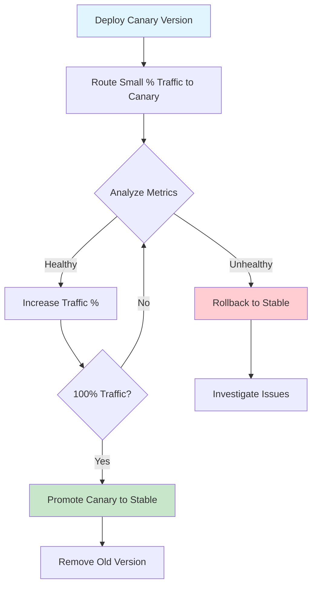
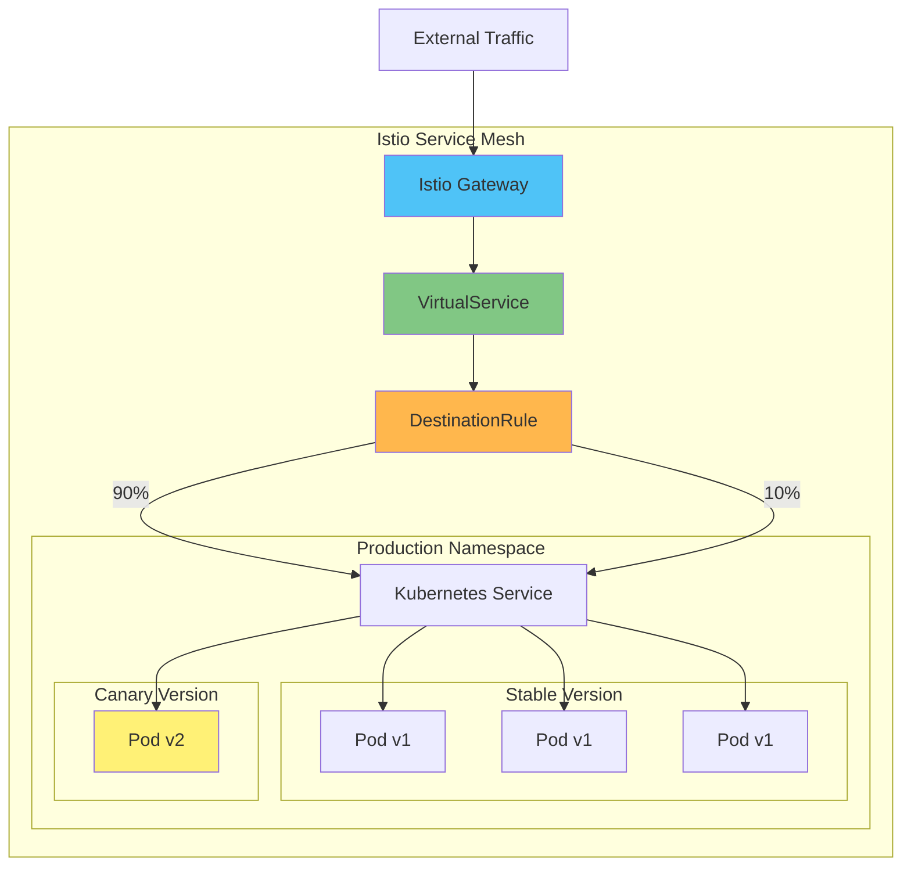
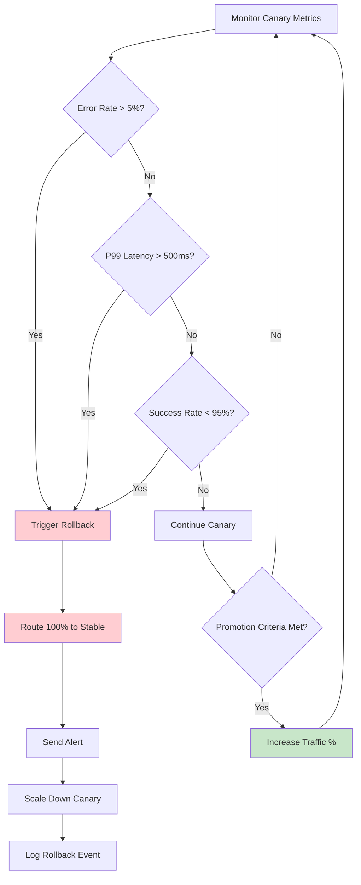
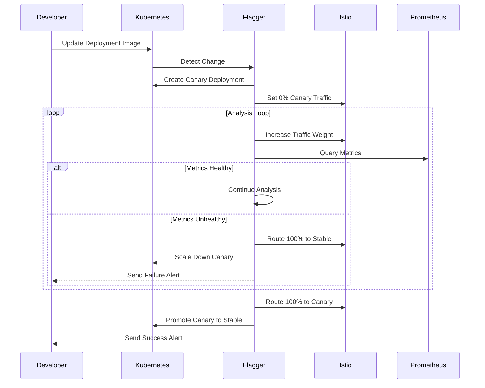

# How to Implement Canary Deployments with Istio

Author: [nawazdhandala](https://github.com/nawazdhandala)

Tags: Istio, Canary Deployment, Service Mesh, Kubernetes, DevOps

Description: A guide to implementing safe canary deployments using Istio traffic management.

---

Canary deployments are a powerful release strategy that allows you to roll out new versions of your application to a subset of users before making it available to the entire user base. By leveraging Istio's advanced traffic management capabilities, you can implement sophisticated canary deployments with fine-grained control over traffic splitting, automated analysis, and instant rollback capabilities.

In this comprehensive guide, you'll learn how to implement production-ready canary deployments using Istio, including gradual traffic shifting, metric-based promotion, rollback procedures, and automated canary analysis.

## Table of Contents

1. [Understanding Canary Deployments](#understanding-canary-deployments)
2. [Prerequisites](#prerequisites)
3. [Canary Deployment Architecture](#canary-deployment-architecture)
4. [Setting Up the Base Application](#setting-up-the-base-application)
5. [Implementing Gradual Traffic Shifting](#implementing-gradual-traffic-shifting)
6. [Metric-Based Canary Promotion](#metric-based-canary-promotion)
7. [Rollback Procedures](#rollback-procedures)
8. [Automated Canary Analysis with Flagger](#automated-canary-analysis-with-flagger)
9. [Advanced Traffic Routing Strategies](#advanced-traffic-routing-strategies)
10. [Monitoring and Observability](#monitoring-and-observability)
11. [Best Practices](#best-practices)
12. [Conclusion](#conclusion)

## Understanding Canary Deployments

A canary deployment is a technique to reduce the risk of introducing a new software version in production by gradually rolling out the change to a small subset of users before rolling it out to the entire infrastructure. The name comes from the historical practice of using canaries in coal mines to detect toxic gases.

### Benefits of Canary Deployments

- **Risk Reduction**: Limit the blast radius of potential issues to a small percentage of users
- **Real-World Testing**: Test new versions with actual production traffic
- **Quick Rollback**: Instantly route traffic back to the stable version if issues arise
- **Data-Driven Decisions**: Make promotion decisions based on real metrics

### Canary Deployment Flow

The following diagram illustrates the canary deployment workflow with Istio:



## Prerequisites

Before implementing canary deployments with Istio, ensure you have the following:

- Kubernetes cluster (v1.24+)
- Istio installed (v1.18+)
- kubectl configured
- Prometheus for metrics collection
- Basic understanding of Kubernetes deployments and services

To verify your Istio installation, run the following command:

```bash
# Verify Istio installation and check that all components are running
istioctl version

# Expected output shows client and control plane versions
# CLIENT VERSION: 1.20.0
# CONTROL PLANE VERSION: 1.20.0
```

## Canary Deployment Architecture

The following diagram shows the architecture of a canary deployment with Istio:



## Setting Up the Base Application

Let's start by deploying a sample application with both stable and canary versions.

First, create the namespace and enable Istio sidecar injection:

```yaml
# namespace.yaml
# This namespace will host our application with automatic Istio sidecar injection
# The istio-injection label ensures all pods get the Envoy proxy automatically
apiVersion: v1
kind: Namespace
metadata:
  name: canary-demo
  labels:
    # Enable automatic sidecar injection for all pods in this namespace
    istio-injection: enabled
```

Apply the namespace configuration:

```bash
# Apply the namespace with Istio injection enabled
kubectl apply -f namespace.yaml
```

Next, create the stable version of the application deployment:

```yaml
# deployment-stable.yaml
# This deployment represents the current stable production version (v1)
# It runs 3 replicas for high availability
apiVersion: apps/v1
kind: Deployment
metadata:
  name: myapp-stable
  namespace: canary-demo
  labels:
    app: myapp
    # Version label is crucial for Istio traffic routing
    version: v1
spec:
  # Running 3 replicas for production stability
  replicas: 3
  selector:
    matchLabels:
      app: myapp
      version: v1
  template:
    metadata:
      labels:
        app: myapp
        version: v1
      annotations:
        # Prometheus scraping configuration for metrics collection
        prometheus.io/scrape: "true"
        prometheus.io/port: "8080"
        prometheus.io/path: "/metrics"
    spec:
      containers:
      - name: myapp
        image: myapp:v1.0.0
        ports:
        - containerPort: 8080
          name: http
        # Resource limits ensure predictable performance
        resources:
          requests:
            cpu: 100m
            memory: 128Mi
          limits:
            cpu: 200m
            memory: 256Mi
        # Health checks ensure traffic only goes to healthy pods
        livenessProbe:
          httpGet:
            path: /health
            port: 8080
          initialDelaySeconds: 10
          periodSeconds: 5
        readinessProbe:
          httpGet:
            path: /ready
            port: 8080
          initialDelaySeconds: 5
          periodSeconds: 3
```

Now create the canary version deployment:

```yaml
# deployment-canary.yaml
# This deployment represents the new version (v2) being tested
# It starts with just 1 replica to minimize initial risk
apiVersion: apps/v1
kind: Deployment
metadata:
  name: myapp-canary
  namespace: canary-demo
  labels:
    app: myapp
    # Different version label for traffic routing distinction
    version: v2
spec:
  # Start with minimal replicas for canary testing
  replicas: 1
  selector:
    matchLabels:
      app: myapp
      version: v2
  template:
    metadata:
      labels:
        app: myapp
        version: v2
      annotations:
        prometheus.io/scrape: "true"
        prometheus.io/port: "8080"
        prometheus.io/path: "/metrics"
    spec:
      containers:
      - name: myapp
        # New version of the application image
        image: myapp:v2.0.0
        ports:
        - containerPort: 8080
          name: http
        resources:
          requests:
            cpu: 100m
            memory: 128Mi
          limits:
            cpu: 200m
            memory: 256Mi
        livenessProbe:
          httpGet:
            path: /health
            port: 8080
          initialDelaySeconds: 10
          periodSeconds: 5
        readinessProbe:
          httpGet:
            path: /ready
            port: 8080
          initialDelaySeconds: 5
          periodSeconds: 3
```

Create a Kubernetes Service that selects both versions:

```yaml
# service.yaml
# This service selects ALL pods with app=myapp label (both v1 and v2)
# Istio will handle the actual traffic splitting between versions
apiVersion: v1
kind: Service
metadata:
  name: myapp
  namespace: canary-demo
  labels:
    app: myapp
spec:
  ports:
  - port: 80
    targetPort: 8080
    name: http
  selector:
    # Note: No version selector - both v1 and v2 pods are selected
    app: myapp
```

## Implementing Gradual Traffic Shifting

Istio uses VirtualServices and DestinationRules to control traffic distribution. Let's implement gradual traffic shifting.

First, create a DestinationRule that defines the subsets for each version:

```yaml
# destination-rule.yaml
# DestinationRule defines subsets based on pod labels
# These subsets are referenced by VirtualService for traffic routing
apiVersion: networking.istio.io/v1beta1
kind: DestinationRule
metadata:
  name: myapp-destination
  namespace: canary-demo
spec:
  # Host matches the Kubernetes service name
  host: myapp
  # Traffic policy applies to all subsets
  trafficPolicy:
    connectionPool:
      tcp:
        maxConnections: 100
      http:
        h2UpgradePolicy: UPGRADE
        http1MaxPendingRequests: 100
        http2MaxRequests: 1000
    # Outlier detection for automatic failure handling
    outlierDetection:
      consecutive5xxErrors: 5
      interval: 30s
      baseEjectionTime: 30s
      maxEjectionPercent: 50
  # Define subsets based on version labels
  subsets:
  - name: stable
    labels:
      # Matches pods with version: v1 label
      version: v1
  - name: canary
    labels:
      # Matches pods with version: v2 label
      version: v2
```

Now create a VirtualService for initial traffic splitting (10% to canary):

```yaml
# virtual-service-10.yaml
# VirtualService controls how traffic is routed to different subsets
# This configuration sends 10% of traffic to the canary version
apiVersion: networking.istio.io/v1beta1
kind: VirtualService
metadata:
  name: myapp-routing
  namespace: canary-demo
spec:
  # Apply to traffic destined for the myapp service
  hosts:
  - myapp
  http:
  - name: canary-route
    # Traffic splitting configuration
    route:
    - destination:
        host: myapp
        # Route to stable subset (v1 pods)
        subset: stable
      # 90% of traffic goes to stable
      weight: 90
    - destination:
        host: myapp
        # Route to canary subset (v2 pods)
        subset: canary
      # 10% of traffic goes to canary
      weight: 10
    # Retry configuration for resilience
    retries:
      attempts: 3
      perTryTimeout: 2s
      retryOn: 5xx,reset,connect-failure
```

Create additional VirtualService configurations for progressive traffic shifting:

```yaml
# virtual-service-25.yaml
# Increase canary traffic to 25% after successful initial testing
apiVersion: networking.istio.io/v1beta1
kind: VirtualService
metadata:
  name: myapp-routing
  namespace: canary-demo
spec:
  hosts:
  - myapp
  http:
  - name: canary-route
    route:
    - destination:
        host: myapp
        subset: stable
      weight: 75
    - destination:
        host: myapp
        subset: canary
      weight: 25
    retries:
      attempts: 3
      perTryTimeout: 2s
      retryOn: 5xx,reset,connect-failure
```

```yaml
# virtual-service-50.yaml
# Equal traffic split - major milestone in canary progression
apiVersion: networking.istio.io/v1beta1
kind: VirtualService
metadata:
  name: myapp-routing
  namespace: canary-demo
spec:
  hosts:
  - myapp
  http:
  - name: canary-route
    route:
    - destination:
        host: myapp
        subset: stable
      weight: 50
    - destination:
        host: myapp
        subset: canary
      weight: 50
    retries:
      attempts: 3
      perTryTimeout: 2s
      retryOn: 5xx,reset,connect-failure
```

```yaml
# virtual-service-100.yaml
# Full promotion - all traffic to canary (new stable version)
apiVersion: networking.istio.io/v1beta1
kind: VirtualService
metadata:
  name: myapp-routing
  namespace: canary-demo
spec:
  hosts:
  - myapp
  http:
  - name: canary-route
    route:
    - destination:
        host: myapp
        subset: canary
      # 100% traffic to the new version
      weight: 100
    retries:
      attempts: 3
      perTryTimeout: 2s
      retryOn: 5xx,reset,connect-failure
```

Apply these configurations progressively:

```bash
# Step 1: Deploy initial 10% canary
kubectl apply -f virtual-service-10.yaml

# Wait and monitor metrics (e.g., 15-30 minutes)
# If metrics are healthy, proceed to next step

# Step 2: Increase to 25%
kubectl apply -f virtual-service-25.yaml

# Wait and monitor again

# Step 3: Increase to 50%
kubectl apply -f virtual-service-50.yaml

# Final step: Full promotion
kubectl apply -f virtual-service-100.yaml
```

### Traffic Shifting Progression

The following diagram shows the traffic shifting progression during a canary deployment:

```mermaid
gantt
    title Canary Deployment Traffic Progression
    dateFormat X
    axisFormat %s%%

    section Stable (v1)
    90% Traffic    :a1, 0, 10
    75% Traffic    :a2, 10, 20
    50% Traffic    :a3, 20, 30
    0% Traffic     :a4, 30, 40

    section Canary (v2)
    10% Traffic    :b1, 0, 10
    25% Traffic    :b2, 10, 20
    50% Traffic    :b3, 20, 30
    100% Traffic   :b4, 30, 40
```



## Metric-Based Canary Promotion

Automate promotion decisions based on real-time metrics. Here's a script that queries Prometheus and makes promotion decisions:

```bash
#!/bin/bash
# canary-promotion.sh
# This script automates canary promotion based on Prometheus metrics
# It compares error rates and latency between stable and canary versions

set -e

# Configuration variables
PROMETHEUS_URL="http://prometheus.monitoring.svc:9090"
NAMESPACE="canary-demo"
SERVICE="myapp"
# Maximum acceptable error rate (5%)
ERROR_THRESHOLD="0.05"
# Maximum acceptable p99 latency in seconds
LATENCY_THRESHOLD="0.5"
# Minimum number of requests needed for statistical significance
MIN_REQUESTS="100"

# Function to query Prometheus metrics
query_prometheus() {
    local query="$1"
    curl -s -G "${PROMETHEUS_URL}/api/v1/query" \
        --data-urlencode "query=${query}" | \
        jq -r '.data.result[0].value[1] // "0"'
}

# Calculate error rate for a specific version
# Uses the standard Istio metrics for request success/failure
get_error_rate() {
    local version="$1"
    local query="sum(rate(istio_requests_total{destination_service=\"${SERVICE}.${NAMESPACE}.svc.cluster.local\",destination_version=\"${version}\",response_code=~\"5.*\"}[5m])) / sum(rate(istio_requests_total{destination_service=\"${SERVICE}.${NAMESPACE}.svc.cluster.local\",destination_version=\"${version}\"}[5m]))"
    query_prometheus "$query"
}

# Get p99 latency for a specific version
# Uses histogram quantile calculation from Istio request duration metrics
get_p99_latency() {
    local version="$1"
    local query="histogram_quantile(0.99, sum(rate(istio_request_duration_milliseconds_bucket{destination_service=\"${SERVICE}.${NAMESPACE}.svc.cluster.local\",destination_version=\"${version}\"}[5m])) by (le)) / 1000"
    query_prometheus "$query"
}

# Get total request count to ensure statistical significance
get_request_count() {
    local version="$1"
    local query="sum(increase(istio_requests_total{destination_service=\"${SERVICE}.${NAMESPACE}.svc.cluster.local\",destination_version=\"${version}\"}[5m]))"
    query_prometheus "$query"
}

# Main analysis function
analyze_canary() {
    echo "=== Canary Analysis Report ==="
    echo "Timestamp: $(date -u +"%Y-%m-%dT%H:%M:%SZ")"
    echo ""

    # Get metrics for both versions
    STABLE_ERROR_RATE=$(get_error_rate "v1")
    CANARY_ERROR_RATE=$(get_error_rate "v2")
    STABLE_LATENCY=$(get_p99_latency "v1")
    CANARY_LATENCY=$(get_p99_latency "v2")
    CANARY_REQUESTS=$(get_request_count "v2")

    echo "Stable (v1) Metrics:"
    echo "  Error Rate: ${STABLE_ERROR_RATE}"
    echo "  P99 Latency: ${STABLE_LATENCY}s"
    echo ""
    echo "Canary (v2) Metrics:"
    echo "  Error Rate: ${CANARY_ERROR_RATE}"
    echo "  P99 Latency: ${CANARY_LATENCY}s"
    echo "  Request Count: ${CANARY_REQUESTS}"
    echo ""

    # Check if we have enough data for analysis
    if (( $(echo "$CANARY_REQUESTS < $MIN_REQUESTS" | bc -l) )); then
        echo "RESULT: WAITING - Insufficient data (need ${MIN_REQUESTS} requests)"
        return 2
    fi

    # Check error rate threshold
    if (( $(echo "$CANARY_ERROR_RATE > $ERROR_THRESHOLD" | bc -l) )); then
        echo "RESULT: FAILED - Error rate ${CANARY_ERROR_RATE} exceeds threshold ${ERROR_THRESHOLD}"
        return 1
    fi

    # Check latency threshold
    if (( $(echo "$CANARY_LATENCY > $LATENCY_THRESHOLD" | bc -l) )); then
        echo "RESULT: FAILED - P99 latency ${CANARY_LATENCY}s exceeds threshold ${LATENCY_THRESHOLD}s"
        return 1
    fi

    # Compare with stable version (canary should not be significantly worse)
    LATENCY_RATIO=$(echo "$CANARY_LATENCY / $STABLE_LATENCY" | bc -l)
    if (( $(echo "$LATENCY_RATIO > 1.2" | bc -l) )); then
        echo "RESULT: FAILED - Canary latency is ${LATENCY_RATIO}x worse than stable"
        return 1
    fi

    echo "RESULT: PASSED - Canary is healthy, ready for promotion"
    return 0
}

# Execute analysis
analyze_canary
```

Create a Kubernetes CronJob for automated metric checking:

```yaml
# canary-analyzer-cronjob.yaml
# This CronJob runs every 5 minutes to analyze canary health
# It automatically updates traffic weights based on analysis results
apiVersion: batch/v1
kind: CronJob
metadata:
  name: canary-analyzer
  namespace: canary-demo
spec:
  # Run every 5 minutes
  schedule: "*/5 * * * *"
  concurrencyPolicy: Forbid
  successfulJobsHistoryLimit: 3
  failedJobsHistoryLimit: 3
  jobTemplate:
    spec:
      template:
        spec:
          serviceAccountName: canary-analyzer
          containers:
          - name: analyzer
            image: bitnami/kubectl:latest
            command:
            - /bin/bash
            - -c
            - |
              # Canary analysis and promotion script

              # Get current traffic weight from VirtualService
              CURRENT_WEIGHT=$(kubectl get virtualservice myapp-routing -n canary-demo \
                -o jsonpath='{.spec.http[0].route[?(@.destination.subset=="canary")].weight}')

              echo "Current canary weight: ${CURRENT_WEIGHT}%"

              # Query Prometheus for canary health metrics
              CANARY_ERROR_RATE=$(curl -s "http://prometheus.monitoring:9090/api/v1/query" \
                --data-urlencode 'query=sum(rate(istio_requests_total{destination_version="v2",response_code=~"5.*"}[5m])) / sum(rate(istio_requests_total{destination_version="v2"}[5m]))' \
                | jq -r '.data.result[0].value[1] // "0"')

              echo "Canary error rate: ${CANARY_ERROR_RATE}"

              # Decision logic
              if (( $(echo "$CANARY_ERROR_RATE > 0.05" | bc -l) )); then
                echo "ERROR: Canary error rate too high, initiating rollback"
                # Apply rollback configuration
                kubectl patch virtualservice myapp-routing -n canary-demo --type merge -p '
                  {"spec":{"http":[{"route":[
                    {"destination":{"host":"myapp","subset":"stable"},"weight":100},
                    {"destination":{"host":"myapp","subset":"canary"},"weight":0}
                  ]}]}}'
                exit 1
              fi

              # Progressive weight increase if healthy
              case $CURRENT_WEIGHT in
                10)
                  NEW_WEIGHT=25
                  ;;
                25)
                  NEW_WEIGHT=50
                  ;;
                50)
                  NEW_WEIGHT=75
                  ;;
                75)
                  NEW_WEIGHT=100
                  ;;
                *)
                  echo "Canary deployment complete or not started"
                  exit 0
                  ;;
              esac

              echo "Promoting canary to ${NEW_WEIGHT}%"
              STABLE_WEIGHT=$((100 - NEW_WEIGHT))

              kubectl patch virtualservice myapp-routing -n canary-demo --type merge -p "
                {\"spec\":{\"http\":[{\"route\":[
                  {\"destination\":{\"host\":\"myapp\",\"subset\":\"stable\"},\"weight\":${STABLE_WEIGHT}},
                  {\"destination\":{\"host\":\"myapp\",\"subset\":\"canary\"},\"weight\":${NEW_WEIGHT}}
                ]}]}}"
          restartPolicy: OnFailure
```

Create the required RBAC for the analyzer:

```yaml
# canary-analyzer-rbac.yaml
# ServiceAccount and RBAC rules for the canary analyzer
# Allows reading VirtualServices and patching for traffic updates
apiVersion: v1
kind: ServiceAccount
metadata:
  name: canary-analyzer
  namespace: canary-demo
---
apiVersion: rbac.authorization.k8s.io/v1
kind: Role
metadata:
  name: canary-analyzer-role
  namespace: canary-demo
rules:
# Allow reading VirtualServices to check current state
- apiGroups: ["networking.istio.io"]
  resources: ["virtualservices"]
  verbs: ["get", "list", "patch", "update"]
# Allow reading deployments to check pod status
- apiGroups: ["apps"]
  resources: ["deployments"]
  verbs: ["get", "list"]
---
apiVersion: rbac.authorization.k8s.io/v1
kind: RoleBinding
metadata:
  name: canary-analyzer-binding
  namespace: canary-demo
subjects:
- kind: ServiceAccount
  name: canary-analyzer
  namespace: canary-demo
roleRef:
  kind: Role
  name: canary-analyzer-role
  apiGroup: rbac.authorization.k8s.io
```

## Rollback Procedures

Having quick and reliable rollback procedures is critical for canary deployments.

### Instant Rollback VirtualService

Create a rollback configuration that can be applied immediately:

```yaml
# virtual-service-rollback.yaml
# Emergency rollback configuration
# Routes 100% traffic back to stable version immediately
apiVersion: networking.istio.io/v1beta1
kind: VirtualService
metadata:
  name: myapp-routing
  namespace: canary-demo
  annotations:
    # Track rollback metadata for audit purposes
    rollback.canary/triggered-at: ""
    rollback.canary/reason: ""
spec:
  hosts:
  - myapp
  http:
  - name: rollback-route
    route:
    - destination:
        host: myapp
        # All traffic to stable version
        subset: stable
      weight: 100
    # Keep canary subset with 0 weight for quick re-enablement
    - destination:
        host: myapp
        subset: canary
      weight: 0
    # Aggressive retry policy during rollback
    retries:
      attempts: 5
      perTryTimeout: 1s
      retryOn: 5xx,reset,connect-failure,retriable-4xx
```

### Automated Rollback Script

Create a script for automated rollback with notifications:

```bash
#!/bin/bash
# rollback.sh
# Automated rollback script with Slack notifications and audit logging
# Usage: ./rollback.sh [reason]

set -e

NAMESPACE="canary-demo"
VIRTUALSERVICE="myapp-routing"
SLACK_WEBHOOK="${SLACK_WEBHOOK_URL}"
REASON="${1:-Manual rollback triggered}"

# Log function with timestamps
log() {
    echo "[$(date -u +"%Y-%m-%dT%H:%M:%SZ")] $1"
}

# Send Slack notification
notify_slack() {
    local message="$1"
    local color="$2"

    if [ -n "$SLACK_WEBHOOK" ]; then
        curl -s -X POST "$SLACK_WEBHOOK" \
            -H 'Content-Type: application/json' \
            -d "{
                \"attachments\": [{
                    \"color\": \"${color}\",
                    \"title\": \"Canary Rollback Alert\",
                    \"text\": \"${message}\",
                    \"fields\": [
                        {\"title\": \"Namespace\", \"value\": \"${NAMESPACE}\", \"short\": true},
                        {\"title\": \"Service\", \"value\": \"myapp\", \"short\": true},
                        {\"title\": \"Reason\", \"value\": \"${REASON}\", \"short\": false}
                    ],
                    \"footer\": \"Istio Canary Deployment\",
                    \"ts\": $(date +%s)
                }]
            }"
    fi
}

log "Starting rollback procedure..."
log "Reason: ${REASON}"

# Capture current state for audit
CURRENT_STATE=$(kubectl get virtualservice ${VIRTUALSERVICE} -n ${NAMESPACE} -o yaml)
log "Current VirtualService state captured"

# Get current canary weight for logging
CANARY_WEIGHT=$(kubectl get virtualservice ${VIRTUALSERVICE} -n ${NAMESPACE} \
    -o jsonpath='{.spec.http[0].route[?(@.destination.subset=="canary")].weight}')
log "Current canary traffic: ${CANARY_WEIGHT}%"

# Apply rollback configuration
log "Applying rollback configuration..."

kubectl patch virtualservice ${VIRTUALSERVICE} -n ${NAMESPACE} --type merge -p '
{
  "metadata": {
    "annotations": {
      "rollback.canary/triggered-at": "'$(date -u +"%Y-%m-%dT%H:%M:%SZ")'",
      "rollback.canary/reason": "'"${REASON}"'",
      "rollback.canary/previous-canary-weight": "'"${CANARY_WEIGHT}"'"
    }
  },
  "spec": {
    "http": [{
      "name": "rollback-route",
      "route": [
        {"destination": {"host": "myapp", "subset": "stable"}, "weight": 100},
        {"destination": {"host": "myapp", "subset": "canary"}, "weight": 0}
      ]
    }]
  }
}'

# Verify rollback was applied
NEW_CANARY_WEIGHT=$(kubectl get virtualservice ${VIRTUALSERVICE} -n ${NAMESPACE} \
    -o jsonpath='{.spec.http[0].route[?(@.destination.subset=="canary")].weight}')

if [ "$NEW_CANARY_WEIGHT" == "0" ]; then
    log "Rollback successful! All traffic routed to stable version."
    notify_slack "Rollback completed successfully. All traffic now routed to stable version." "warning"
else
    log "ERROR: Rollback verification failed. Canary weight is ${NEW_CANARY_WEIGHT}%"
    notify_slack "Rollback may have failed! Please verify manually." "danger"
    exit 1
fi

# Scale down canary deployment to free resources
log "Scaling down canary deployment..."
kubectl scale deployment myapp-canary -n ${NAMESPACE} --replicas=0

log "Rollback procedure completed."
```

### Rollback Decision Flow

The following diagram shows the rollback decision process:



## Automated Canary Analysis with Flagger

Flagger is a progressive delivery tool that automates canary deployments with Istio. It provides sophisticated analysis and automatic rollback.

### Install Flagger

```bash
# Add Flagger Helm repository
helm repo add flagger https://flagger.app

# Install Flagger with Istio support
# The meshProvider flag tells Flagger to use Istio for traffic management
helm upgrade -i flagger flagger/flagger \
    --namespace istio-system \
    --set meshProvider=istio \
    --set metricsServer=http://prometheus.monitoring:9090
```

### Configure Flagger Canary Resource

Create a Flagger Canary resource for automated canary management:

```yaml
# flagger-canary.yaml
# Flagger Canary resource automates the entire canary deployment process
# It handles traffic shifting, analysis, promotion, and rollback automatically
apiVersion: flagger.app/v1beta1
kind: Canary
metadata:
  name: myapp
  namespace: canary-demo
spec:
  # Reference to the deployment to be managed by Flagger
  targetRef:
    apiVersion: apps/v1
    kind: Deployment
    name: myapp
  # Reference to the service for traffic management
  service:
    port: 80
    targetPort: 8080
    # Istio gateway for external traffic
    gateways:
      - myapp-gateway
    # Virtual host for routing
    hosts:
      - myapp.example.com
    # Istio traffic policy
    trafficPolicy:
      tls:
        mode: ISTIO_MUTUAL
  # Analysis configuration - defines how Flagger evaluates canary health
  analysis:
    # How long to wait between traffic weight increases
    interval: 1m
    # Number of successful analysis cycles before promotion
    threshold: 10
    # Maximum traffic percentage for canary
    maxWeight: 50
    # Traffic increment per successful analysis
    stepWeight: 10
    # Prometheus metrics for analysis
    metrics:
    # Check that request success rate is above 99%
    - name: request-success-rate
      # Prometheus query template - Flagger replaces variables
      templateRef:
        name: request-success-rate
        namespace: istio-system
      # Minimum threshold - fail canary if below this
      thresholdRange:
        min: 99
      # Time window for metric calculation
      interval: 1m
    # Check that request duration is acceptable
    - name: request-duration
      templateRef:
        name: request-duration
        namespace: istio-system
      # Maximum threshold in milliseconds
      thresholdRange:
        max: 500
      interval: 1m
    # Webhooks for custom validation and notifications
    webhooks:
    # Pre-rollout hook for smoke tests
    - name: smoke-test
      type: pre-rollout
      url: http://flagger-loadtester.test/
      timeout: 15s
      metadata:
        type: bash
        cmd: "curl -s http://myapp-canary.canary-demo:80/health | grep -q 'ok'"
    # Load test during analysis
    - name: load-test
      type: rollout
      url: http://flagger-loadtester.test/
      timeout: 60s
      metadata:
        type: cmd
        cmd: "hey -z 1m -q 10 -c 2 http://myapp-canary.canary-demo:80/"
    # Post-rollout hook for promotion notification
    - name: promotion-notification
      type: post-rollout
      url: http://slack-notifier.monitoring/
      timeout: 5s
      metadata:
        message: "Canary promotion completed for myapp"
```

### Flagger Metric Templates

Create metric templates for Flagger analysis:

```yaml
# flagger-metrics.yaml
# MetricTemplate for request success rate calculation
# Flagger uses these templates to query Prometheus during analysis
apiVersion: flagger.app/v1beta1
kind: MetricTemplate
metadata:
  name: request-success-rate
  namespace: istio-system
spec:
  provider:
    type: prometheus
    address: http://prometheus.monitoring:9090
  query: |
    100 - sum(
        rate(
            istio_requests_total{
                reporter="destination",
                destination_workload_namespace="{{ namespace }}",
                destination_workload=~"{{ target }}-canary",
                response_code!~"5.*"
            }[{{ interval }}]
        )
    )
    /
    sum(
        rate(
            istio_requests_total{
                reporter="destination",
                destination_workload_namespace="{{ namespace }}",
                destination_workload=~"{{ target }}-canary"
            }[{{ interval }}]
        )
    )
    * 100
---
# MetricTemplate for request duration (p99 latency)
apiVersion: flagger.app/v1beta1
kind: MetricTemplate
metadata:
  name: request-duration
  namespace: istio-system
spec:
  provider:
    type: prometheus
    address: http://prometheus.monitoring:9090
  query: |
    histogram_quantile(
        0.99,
        sum(
            rate(
                istio_request_duration_milliseconds_bucket{
                    reporter="destination",
                    destination_workload_namespace="{{ namespace }}",
                    destination_workload=~"{{ target }}-canary"
                }[{{ interval }}]
            )
        ) by (le)
    )
```

### Flagger Deployment Flow

The following diagram shows how Flagger automates canary deployments:



## Advanced Traffic Routing Strategies

### Header-Based Canary Routing

Route specific users or test traffic to the canary version based on headers:

```yaml
# virtual-service-header-routing.yaml
# Advanced routing that combines header-based and weight-based rules
# Allows testing canary with specific users before general rollout
apiVersion: networking.istio.io/v1beta1
kind: VirtualService
metadata:
  name: myapp-routing
  namespace: canary-demo
spec:
  hosts:
  - myapp
  http:
  # Rule 1: Internal testers always get canary
  # Match requests with x-canary-test header
  - match:
    - headers:
        x-canary-test:
          exact: "true"
    route:
    - destination:
        host: myapp
        subset: canary
      weight: 100
    # Add header to identify canary responses
    headers:
      response:
        add:
          x-served-by: canary

  # Rule 2: Beta users get canary
  # Match requests with x-user-type: beta header
  - match:
    - headers:
        x-user-type:
          exact: "beta"
    route:
    - destination:
        host: myapp
        subset: canary
      weight: 100
    headers:
      response:
        add:
          x-served-by: canary

  # Rule 3: Default traffic splitting for general users
  - route:
    - destination:
        host: myapp
        subset: stable
      weight: 90
      headers:
        response:
          add:
            x-served-by: stable
    - destination:
        host: myapp
        subset: canary
      weight: 10
      headers:
        response:
          add:
            x-served-by: canary
```

### Cookie-Based Sticky Sessions

Maintain session affinity for users who have been routed to canary:

```yaml
# virtual-service-sticky-canary.yaml
# Uses cookies to ensure users stay on the same version
# Prevents inconsistent experience during canary deployment
apiVersion: networking.istio.io/v1beta1
kind: VirtualService
metadata:
  name: myapp-routing
  namespace: canary-demo
spec:
  hosts:
  - myapp
  http:
  # Users with canary cookie always get canary
  - match:
    - headers:
        cookie:
          regex: ".*canary=true.*"
    route:
    - destination:
        host: myapp
        subset: canary

  # Users with stable cookie always get stable
  - match:
    - headers:
        cookie:
          regex: ".*canary=false.*"
    route:
    - destination:
        host: myapp
        subset: stable

  # New users: split traffic and set cookie
  - route:
    - destination:
        host: myapp
        subset: stable
      weight: 90
      headers:
        response:
          add:
            # Set cookie to maintain session affinity
            Set-Cookie: "canary=false; Path=/; Max-Age=3600"
    - destination:
        host: myapp
        subset: canary
      weight: 10
      headers:
        response:
          add:
            Set-Cookie: "canary=true; Path=/; Max-Age=3600"
```

### Geographic-Based Canary Routing

Route traffic based on geographic location for region-specific testing:

```yaml
# virtual-service-geo-routing.yaml
# Routes traffic based on geographic location
# Useful for testing in specific regions before global rollout
apiVersion: networking.istio.io/v1beta1
kind: VirtualService
metadata:
  name: myapp-routing
  namespace: canary-demo
spec:
  hosts:
  - myapp
  http:
  # Route US-WEST users to canary for initial testing
  - match:
    - headers:
        x-region:
          exact: "us-west"
    route:
    - destination:
        host: myapp
        subset: canary
      weight: 50
    - destination:
        host: myapp
        subset: stable
      weight: 50

  # All other regions get stable version only
  - route:
    - destination:
        host: myapp
        subset: stable
      weight: 100
```

## Monitoring and Observability

### Prometheus Metrics for Canary Analysis

Create a ServiceMonitor to scrape Istio metrics:

```yaml
# service-monitor.yaml
# ServiceMonitor for Prometheus Operator to scrape Istio metrics
# These metrics are essential for canary analysis
apiVersion: monitoring.coreos.com/v1
kind: ServiceMonitor
metadata:
  name: istio-mesh-monitor
  namespace: monitoring
  labels:
    app: istio-mesh
spec:
  selector:
    matchLabels:
      app: istiod
  namespaceSelector:
    matchNames:
    - istio-system
  endpoints:
  - port: http-monitoring
    interval: 15s
    path: /metrics
```

### Grafana Dashboard for Canary Monitoring

Create a ConfigMap for a Grafana dashboard:

```yaml
# grafana-canary-dashboard.yaml
# Grafana dashboard configuration for canary deployment monitoring
apiVersion: v1
kind: ConfigMap
metadata:
  name: canary-dashboard
  namespace: monitoring
  labels:
    grafana_dashboard: "true"
data:
  canary-dashboard.json: |
    {
      "dashboard": {
        "title": "Canary Deployment Dashboard",
        "uid": "canary-deployment",
        "panels": [
          {
            "title": "Traffic Distribution",
            "type": "piechart",
            "gridPos": {"h": 8, "w": 8, "x": 0, "y": 0},
            "targets": [
              {
                "expr": "sum(rate(istio_requests_total{destination_version=\"v1\"}[5m]))",
                "legendFormat": "Stable (v1)"
              },
              {
                "expr": "sum(rate(istio_requests_total{destination_version=\"v2\"}[5m]))",
                "legendFormat": "Canary (v2)"
              }
            ]
          },
          {
            "title": "Error Rate Comparison",
            "type": "timeseries",
            "gridPos": {"h": 8, "w": 8, "x": 8, "y": 0},
            "targets": [
              {
                "expr": "sum(rate(istio_requests_total{destination_version=\"v1\",response_code=~\"5.*\"}[5m])) / sum(rate(istio_requests_total{destination_version=\"v1\"}[5m])) * 100",
                "legendFormat": "Stable Error Rate %"
              },
              {
                "expr": "sum(rate(istio_requests_total{destination_version=\"v2\",response_code=~\"5.*\"}[5m])) / sum(rate(istio_requests_total{destination_version=\"v2\"}[5m])) * 100",
                "legendFormat": "Canary Error Rate %"
              }
            ]
          },
          {
            "title": "P99 Latency Comparison",
            "type": "timeseries",
            "gridPos": {"h": 8, "w": 8, "x": 16, "y": 0},
            "targets": [
              {
                "expr": "histogram_quantile(0.99, sum(rate(istio_request_duration_milliseconds_bucket{destination_version=\"v1\"}[5m])) by (le))",
                "legendFormat": "Stable P99 Latency"
              },
              {
                "expr": "histogram_quantile(0.99, sum(rate(istio_request_duration_milliseconds_bucket{destination_version=\"v2\"}[5m])) by (le))",
                "legendFormat": "Canary P99 Latency"
              }
            ]
          },
          {
            "title": "Request Rate by Version",
            "type": "timeseries",
            "gridPos": {"h": 8, "w": 12, "x": 0, "y": 8},
            "targets": [
              {
                "expr": "sum(rate(istio_requests_total{destination_version=\"v1\"}[1m]))",
                "legendFormat": "Stable (v1) RPS"
              },
              {
                "expr": "sum(rate(istio_requests_total{destination_version=\"v2\"}[1m]))",
                "legendFormat": "Canary (v2) RPS"
              }
            ]
          },
          {
            "title": "Response Code Distribution",
            "type": "timeseries",
            "gridPos": {"h": 8, "w": 12, "x": 12, "y": 8},
            "targets": [
              {
                "expr": "sum by (response_code, destination_version) (rate(istio_requests_total[5m]))",
                "legendFormat": "{{destination_version}} - {{response_code}}"
              }
            ]
          }
        ]
      }
    }
```

### Alert Rules for Canary Deployment

Create PrometheusRule for alerting on canary issues:

```yaml
# prometheus-canary-alerts.yaml
# Alerting rules to detect canary deployment issues
apiVersion: monitoring.coreos.com/v1
kind: PrometheusRule
metadata:
  name: canary-alerts
  namespace: monitoring
spec:
  groups:
  - name: canary.rules
    rules:
    # Alert when canary error rate is significantly higher than stable
    - alert: CanaryHighErrorRate
      expr: |
        (
          sum(rate(istio_requests_total{destination_version="v2",response_code=~"5.*"}[5m]))
          /
          sum(rate(istio_requests_total{destination_version="v2"}[5m]))
        ) > 0.05
      for: 2m
      labels:
        severity: critical
      annotations:
        summary: "Canary version has high error rate"
        description: "Canary (v2) error rate is {{ $value | humanizePercentage }} which exceeds 5% threshold"

    # Alert when canary latency is higher than stable
    - alert: CanaryHighLatency
      expr: |
        histogram_quantile(0.99,
          sum(rate(istio_request_duration_milliseconds_bucket{destination_version="v2"}[5m])) by (le)
        ) >
        histogram_quantile(0.99,
          sum(rate(istio_request_duration_milliseconds_bucket{destination_version="v1"}[5m])) by (le)
        ) * 1.5
      for: 5m
      labels:
        severity: warning
      annotations:
        summary: "Canary version has high latency"
        description: "Canary P99 latency is 50% higher than stable version"

    # Alert when canary is not receiving expected traffic
    - alert: CanaryNoTraffic
      expr: |
        sum(rate(istio_requests_total{destination_version="v2"}[5m])) == 0
        and
        sum(rate(istio_requests_total{destination_version="v1"}[5m])) > 0
      for: 10m
      labels:
        severity: warning
      annotations:
        summary: "Canary version receiving no traffic"
        description: "Canary deployment is active but not receiving any traffic"
```

## Best Practices

### 1. Start Small and Scale Gradually

Begin with a small percentage of traffic (1-5%) and increase gradually:

```yaml
# Recommended progression timeline
# Stage 1: 5% for 30 minutes - initial validation
# Stage 2: 10% for 1 hour - broader validation
# Stage 3: 25% for 2 hours - significant traffic
# Stage 4: 50% for 4 hours - equal split
# Stage 5: 75% for 2 hours - near-complete rollout
# Stage 6: 100% - full promotion
```

### 2. Define Clear Success Criteria

Document and automate your success metrics:

```yaml
# success-criteria.yaml
# Document success criteria as a ConfigMap for reference
apiVersion: v1
kind: ConfigMap
metadata:
  name: canary-success-criteria
  namespace: canary-demo
data:
  criteria.yaml: |
    # Success criteria for canary promotion
    metrics:
      # Error rate must be below 1%
      error_rate:
        threshold: 0.01
        comparison: less_than

      # P99 latency must be below 500ms
      p99_latency_ms:
        threshold: 500
        comparison: less_than

      # P99 latency must not exceed stable by more than 10%
      latency_degradation:
        threshold: 0.10
        comparison: less_than

      # Minimum requests for statistical significance
      min_requests:
        threshold: 1000
        comparison: greater_than

    # Minimum observation time at each stage
    observation_period: 30m

    # Automatic rollback triggers
    rollback_triggers:
      - error_rate > 5%
      - p99_latency > 2000ms
      - success_rate < 90%
```

### 3. Implement Circuit Breakers

Protect your system from cascading failures:

```yaml
# destination-rule-circuit-breaker.yaml
# DestinationRule with circuit breaker configuration
apiVersion: networking.istio.io/v1beta1
kind: DestinationRule
metadata:
  name: myapp-circuit-breaker
  namespace: canary-demo
spec:
  host: myapp
  trafficPolicy:
    connectionPool:
      tcp:
        maxConnections: 100
      http:
        http1MaxPendingRequests: 100
        http2MaxRequests: 1000
        maxRequestsPerConnection: 100
    # Outlier detection acts as a circuit breaker
    outlierDetection:
      # Eject hosts with consecutive 5xx errors
      consecutive5xxErrors: 5
      # Check interval
      interval: 10s
      # How long to eject unhealthy hosts
      baseEjectionTime: 30s
      # Maximum percentage of hosts that can be ejected
      maxEjectionPercent: 50
      # Minimum number of hosts to keep in rotation
      minHealthPercent: 50
  subsets:
  - name: stable
    labels:
      version: v1
    trafficPolicy:
      connectionPool:
        http:
          http2MaxRequests: 500
  - name: canary
    labels:
      version: v2
    trafficPolicy:
      # More conservative limits for canary
      connectionPool:
        http:
          http2MaxRequests: 100
      outlierDetection:
        # More aggressive ejection for canary
        consecutive5xxErrors: 3
        interval: 5s
```

### 4. Use Feature Flags with Canary Deployments

Combine feature flags for fine-grained control:

```yaml
# feature-flag-config.yaml
# ConfigMap for feature flags in canary deployment
apiVersion: v1
kind: ConfigMap
metadata:
  name: feature-flags
  namespace: canary-demo
data:
  flags.json: |
    {
      "new_checkout_flow": {
        "enabled": true,
        "rollout_percentage": 50,
        "allowed_users": ["beta-testers", "internal"]
      },
      "enhanced_search": {
        "enabled": true,
        "rollout_percentage": 100
      },
      "experimental_api": {
        "enabled": false,
        "rollout_percentage": 0
      }
    }
```

### 5. Implement Proper Logging and Tracing

Ensure you can trace requests through both versions:

```yaml
# envoy-filter-logging.yaml
# EnvoyFilter to add version information to access logs
apiVersion: networking.istio.io/v1alpha3
kind: EnvoyFilter
metadata:
  name: canary-access-log
  namespace: canary-demo
spec:
  workloadSelector:
    labels:
      app: myapp
  configPatches:
  - applyTo: NETWORK_FILTER
    match:
      context: SIDECAR_INBOUND
      listener:
        filterChain:
          filter:
            name: "envoy.filters.network.http_connection_manager"
    patch:
      operation: MERGE
      value:
        typed_config:
          "@type": "type.googleapis.com/envoy.extensions.filters.network.http_connection_manager.v3.HttpConnectionManager"
          access_log:
          - name: envoy.access_loggers.file
            typed_config:
              "@type": "type.googleapis.com/envoy.extensions.access_loggers.file.v3.FileAccessLog"
              path: /dev/stdout
              log_format:
                json_format:
                  timestamp: "%START_TIME%"
                  method: "%REQ(:METHOD)%"
                  path: "%REQ(X-ENVOY-ORIGINAL-PATH?:PATH)%"
                  protocol: "%PROTOCOL%"
                  response_code: "%RESPONSE_CODE%"
                  duration_ms: "%DURATION%"
                  upstream_host: "%UPSTREAM_HOST%"
                  # Include version for canary tracking
                  app_version: "%REQ(X-APP-VERSION)%"
                  trace_id: "%REQ(X-REQUEST-ID)%"
```

## Complete Deployment Pipeline Example

Here's a complete CI/CD pipeline example using GitLab CI:

```yaml
# .gitlab-ci.yml
# Complete canary deployment pipeline with automated analysis
stages:
  - build
  - test
  - deploy-canary
  - analyze
  - promote
  - cleanup

variables:
  CANARY_NAMESPACE: canary-demo
  APP_NAME: myapp
  PROMETHEUS_URL: http://prometheus.monitoring:9090

# Build and push Docker image
build:
  stage: build
  script:
    - docker build -t ${CI_REGISTRY_IMAGE}:${CI_COMMIT_SHA} .
    - docker push ${CI_REGISTRY_IMAGE}:${CI_COMMIT_SHA}

# Run unit and integration tests
test:
  stage: test
  script:
    - npm run test
    - npm run integration-test

# Deploy canary version with 10% traffic
deploy-canary:
  stage: deploy-canary
  script:
    - |
      # Update canary deployment with new image
      kubectl set image deployment/${APP_NAME}-canary \
        ${APP_NAME}=${CI_REGISTRY_IMAGE}:${CI_COMMIT_SHA} \
        -n ${CANARY_NAMESPACE}

      # Wait for rollout to complete
      kubectl rollout status deployment/${APP_NAME}-canary \
        -n ${CANARY_NAMESPACE} --timeout=300s

      # Apply initial 10% traffic split
      kubectl apply -f k8s/virtual-service-10.yaml
  environment:
    name: canary
    on_stop: rollback

# Automated canary analysis
analyze:
  stage: analyze
  script:
    - |
      # Wait for metrics to accumulate
      sleep 300

      # Query error rate
      ERROR_RATE=$(curl -s "${PROMETHEUS_URL}/api/v1/query" \
        --data-urlencode 'query=sum(rate(istio_requests_total{destination_version="v2",response_code=~"5.*"}[5m])) / sum(rate(istio_requests_total{destination_version="v2"}[5m]))' \
        | jq -r '.data.result[0].value[1] // "0"')

      echo "Canary error rate: ${ERROR_RATE}"

      # Fail if error rate > 5%
      if (( $(echo "$ERROR_RATE > 0.05" | bc -l) )); then
        echo "Canary error rate too high, failing pipeline"
        exit 1
      fi

      # Query p99 latency
      LATENCY=$(curl -s "${PROMETHEUS_URL}/api/v1/query" \
        --data-urlencode 'query=histogram_quantile(0.99, sum(rate(istio_request_duration_milliseconds_bucket{destination_version="v2"}[5m])) by (le))' \
        | jq -r '.data.result[0].value[1] // "0"')

      echo "Canary P99 latency: ${LATENCY}ms"

      # Fail if latency > 500ms
      if (( $(echo "$LATENCY > 500" | bc -l) )); then
        echo "Canary latency too high, failing pipeline"
        exit 1
      fi

      echo "Canary analysis passed!"

# Promote canary to production
promote:
  stage: promote
  when: manual
  script:
    - |
      # Gradual promotion
      for weight in 25 50 75 100; do
        echo "Setting canary weight to ${weight}%"

        STABLE_WEIGHT=$((100 - weight))

        kubectl patch virtualservice ${APP_NAME}-routing \
          -n ${CANARY_NAMESPACE} --type merge -p "
          {\"spec\":{\"http\":[{\"route\":[
            {\"destination\":{\"host\":\"${APP_NAME}\",\"subset\":\"stable\"},\"weight\":${STABLE_WEIGHT}},
            {\"destination\":{\"host\":\"${APP_NAME}\",\"subset\":\"canary\"},\"weight\":${weight}}
          ]}]}}"

        # Wait between promotions
        sleep 300
      done

      # Update stable deployment
      kubectl set image deployment/${APP_NAME}-stable \
        ${APP_NAME}=${CI_REGISTRY_IMAGE}:${CI_COMMIT_SHA} \
        -n ${CANARY_NAMESPACE}

      kubectl rollout status deployment/${APP_NAME}-stable \
        -n ${CANARY_NAMESPACE} --timeout=300s

      echo "Promotion complete!"

# Rollback on failure
rollback:
  stage: cleanup
  when: manual
  environment:
    name: canary
    action: stop
  script:
    - |
      # Route all traffic to stable
      kubectl apply -f k8s/virtual-service-rollback.yaml

      # Scale down canary
      kubectl scale deployment/${APP_NAME}-canary \
        -n ${CANARY_NAMESPACE} --replicas=0

      echo "Rollback complete!"
```

## Conclusion

Implementing canary deployments with Istio provides a robust and flexible approach to releasing new versions of your applications with minimal risk. By leveraging Istio's traffic management capabilities, you can:

- **Gradually shift traffic** between versions with precise control
- **Make data-driven decisions** based on real-time metrics
- **Instantly rollback** if issues are detected
- **Automate the entire process** using tools like Flagger

Key takeaways:

1. **Start small**: Begin with 5-10% traffic and increase gradually
2. **Define clear metrics**: Establish success criteria before deployment
3. **Automate analysis**: Use Prometheus metrics for automatic decisions
4. **Prepare for rollback**: Have instant rollback procedures ready
5. **Monitor continuously**: Use dashboards and alerts for visibility

By following the practices and configurations outlined in this guide, you can implement production-ready canary deployments that reduce risk while enabling rapid iteration on your applications.

## Additional Resources

- [Istio Traffic Management Documentation](https://istio.io/latest/docs/concepts/traffic-management/)
- [Flagger Progressive Delivery](https://flagger.app/)
- [Prometheus Monitoring](https://prometheus.io/docs/introduction/overview/)
- [Kubernetes Deployment Strategies](https://kubernetes.io/docs/concepts/workloads/controllers/deployment/)
