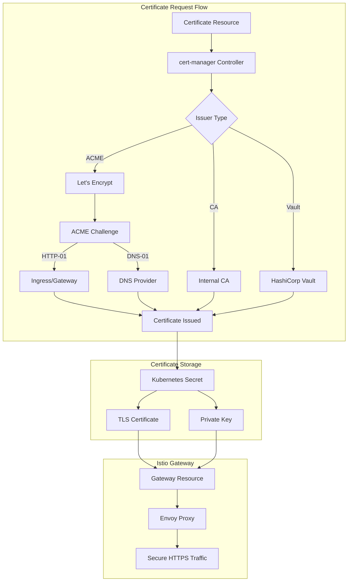
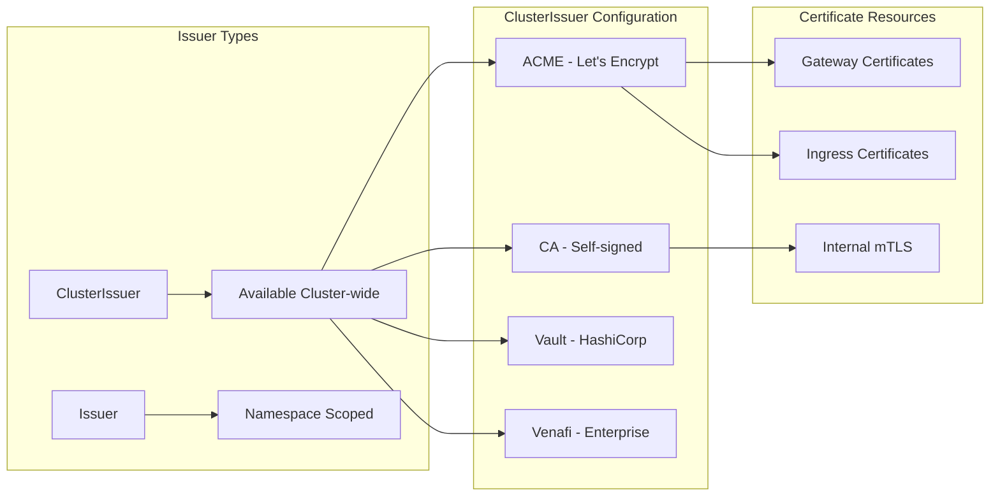
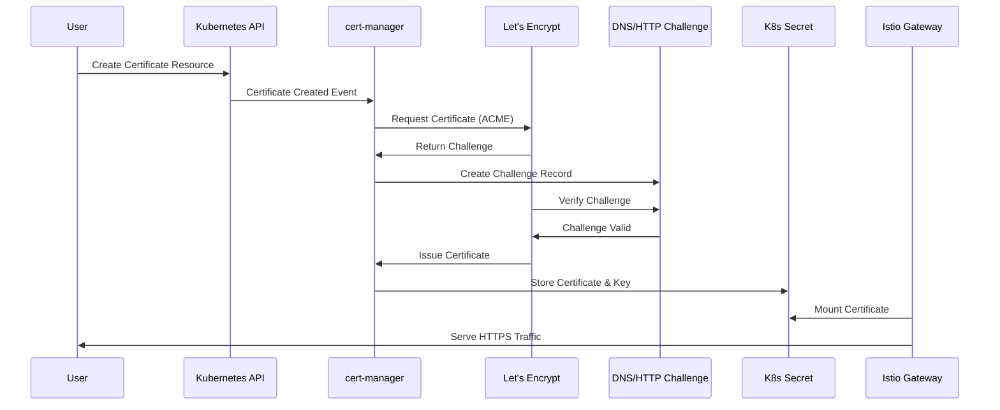
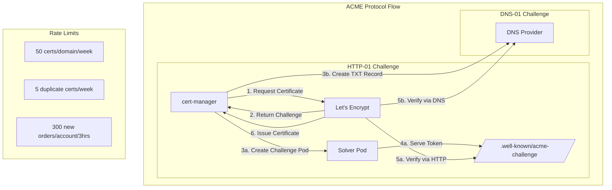
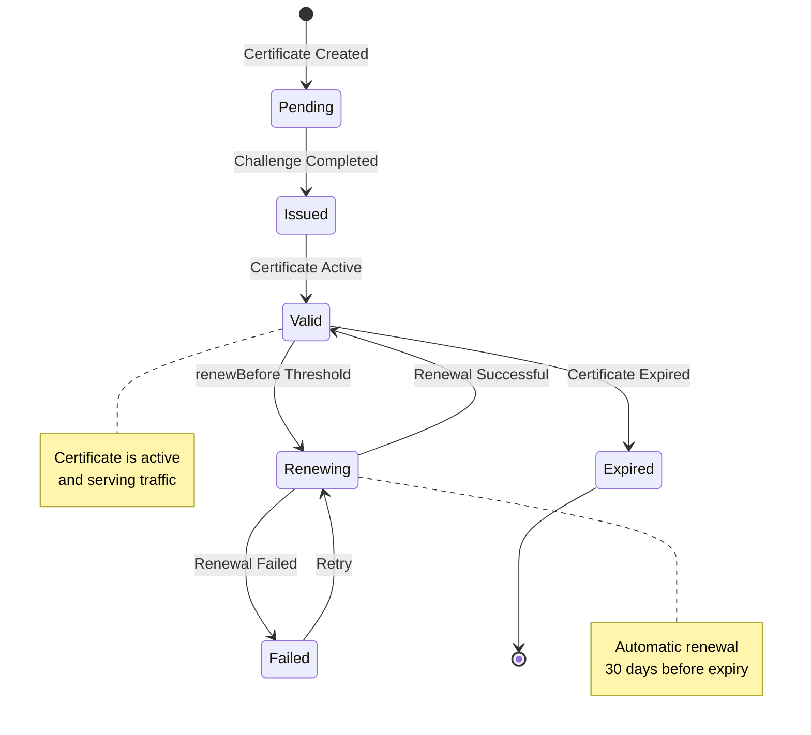
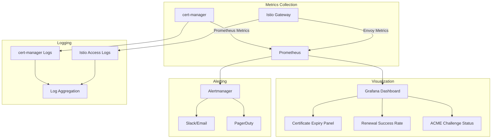

# How to Integrate Istio with cert-manager for TLS Certificates

Author: [nawazdhandala](https://github.com/nawazdhandala)

Tags: Istio, cert-manager, TLS, Certificates, Security, Kubernetes

Description: Learn how to use cert-manager with Istio for automated TLS certificate management.

---

Managing TLS certificates in a Kubernetes environment can be complex, especially when dealing with service mesh architectures like Istio. cert-manager automates the management and issuance of TLS certificates, making it an ideal companion for Istio. This comprehensive guide walks you through integrating cert-manager with Istio for seamless, automated TLS certificate management.

## Table of Contents

1. [Understanding the Architecture](#understanding-the-architecture)
2. [Prerequisites](#prerequisites)
3. [Installing cert-manager](#installing-cert-manager)
4. [Configuring ClusterIssuers](#configuring-clusterissuers)
5. [Creating Certificates for Istio Gateway](#creating-certificates-for-istio-gateway)
6. [Configuring Istio Gateway with TLS](#configuring-istio-gateway-with-tls)
7. [Let's Encrypt Integration](#lets-encrypt-integration)
8. [Certificate Rotation](#certificate-rotation)
9. [Monitoring and Troubleshooting](#monitoring-and-troubleshooting)
10. [Best Practices](#best-practices)

## Understanding the Architecture

Before diving into the implementation, let's understand how cert-manager and Istio work together to provide automated TLS certificate management.

The following diagram illustrates the certificate lifecycle flow:



The workflow operates as follows:

1. **Certificate Request**: You create a Certificate resource specifying the desired domain and issuer
2. **cert-manager Processing**: cert-manager controller processes the request and communicates with the configured issuer
3. **Challenge Completion**: For ACME issuers like Let's Encrypt, cert-manager completes the required challenges
4. **Secret Creation**: Upon successful issuance, cert-manager stores the certificate and private key in a Kubernetes Secret
5. **Istio Gateway Configuration**: The Istio Gateway references the Secret to terminate TLS connections

## Prerequisites

Before proceeding, ensure you have the following components installed and configured:

The following commands verify your environment is ready for the integration:

```bash
# Verify Kubernetes cluster is running and accessible
# This command should return cluster information including version
kubectl cluster-info

# Check that you have admin privileges to install cluster-wide resources
# This is required for both cert-manager and Istio CRDs
kubectl auth can-i create clusterroles --all-namespaces

# Verify Istio is installed and running
# The output should show istio components in Running state
kubectl get pods -n istio-system

# Check Istio version - this guide is tested with Istio 1.20+
istioctl version
```

Required components:
- Kubernetes cluster version 1.25 or later
- Istio 1.20 or later installed
- Helm 3.x for cert-manager installation
- kubectl configured with cluster admin access

## Installing cert-manager

cert-manager is the de-facto standard for certificate management in Kubernetes. Let's install it using Helm.

First, add the Jetstack Helm repository and update the cache:

```bash
# Add the official Jetstack Helm repository
# Jetstack is the company behind cert-manager
helm repo add jetstack https://charts.jetstack.io

# Update the local Helm cache to fetch the latest charts
helm repo update
```

Create a dedicated namespace for cert-manager and install it:

```bash
# Create namespace for cert-manager components
# Keeping cert-manager isolated makes management easier
kubectl create namespace cert-manager

# Install cert-manager with CRDs included
# The installCRDs flag ensures Custom Resource Definitions are created
# We enable the Prometheus metrics for observability
helm install cert-manager jetstack/cert-manager \
  --namespace cert-manager \
  --version v1.14.0 \
  --set installCRDs=true \
  --set prometheus.enabled=true \
  --set webhook.timeoutSeconds=30
```

Verify the installation by checking that all cert-manager pods are running:

```bash
# Wait for all cert-manager pods to be ready
# There should be 3 pods: controller, webhook, and cainjector
kubectl wait --for=condition=Ready pods --all -n cert-manager --timeout=120s

# Verify the installation status
kubectl get pods -n cert-manager
```

Expected output:

```
NAME                                       READY   STATUS    RESTARTS   AGE
cert-manager-5c6866597-xvpjt              1/1     Running   0          60s
cert-manager-cainjector-577f6d9fd7-lnkhm  1/1     Running   0          60s
cert-manager-webhook-787858fcdb-nlzsq     1/1     Running   0          60s
```

## Configuring ClusterIssuers

ClusterIssuers are cluster-wide resources that define how certificates should be obtained. We'll configure both a staging and production issuer for Let's Encrypt.

The following diagram shows the issuer hierarchy:



Create the staging ClusterIssuer for testing (this won't hit rate limits):

```yaml
# File: letsencrypt-staging-issuer.yaml
# This ClusterIssuer uses Let's Encrypt staging environment
# Use staging for testing to avoid hitting production rate limits
apiVersion: cert-manager.io/v1
kind: ClusterIssuer
metadata:
  # Name used to reference this issuer in Certificate resources
  name: letsencrypt-staging
spec:
  acme:
    # Let's Encrypt staging server URL
    # Staging certificates are not trusted by browsers but useful for testing
    server: https://acme-staging-v02.api.letsencrypt.org/directory

    # Email address for certificate expiration notifications
    # Replace with your actual email address
    email: your-email@example.com

    # Secret to store the ACME account private key
    # cert-manager creates this automatically
    privateKeySecretRef:
      name: letsencrypt-staging-account-key

    # Configure challenge solvers for domain validation
    solvers:
      # HTTP-01 challenge solver using Istio Gateway
      - http01:
          gatewayHTTPRoute:
            # Reference to your Istio Gateway for challenge routing
            parentRefs:
              - name: istio-gateway
                namespace: istio-system
                kind: Gateway
```

Apply the staging issuer:

```bash
# Apply the staging ClusterIssuer to the cluster
# This creates the issuer resource and registers with Let's Encrypt staging
kubectl apply -f letsencrypt-staging-issuer.yaml
```

Create the production ClusterIssuer for real certificates:

```yaml
# File: letsencrypt-production-issuer.yaml
# This ClusterIssuer uses Let's Encrypt production environment
# Production certificates are trusted by all browsers
apiVersion: cert-manager.io/v1
kind: ClusterIssuer
metadata:
  name: letsencrypt-production
spec:
  acme:
    # Let's Encrypt production server URL
    # Rate limits apply: 50 certificates per domain per week
    server: https://acme-v02.api.letsencrypt.org/directory

    # Email for important certificate notifications
    email: your-email@example.com

    # Secret for ACME account key storage
    privateKeySecretRef:
      name: letsencrypt-production-account-key

    solvers:
      # HTTP-01 solver configuration for Istio Gateway
      - http01:
          gatewayHTTPRoute:
            parentRefs:
              - name: istio-gateway
                namespace: istio-system
                kind: Gateway
```

For DNS-01 challenges (required for wildcard certificates), configure a DNS provider:

```yaml
# File: letsencrypt-dns-issuer.yaml
# DNS-01 challenge solver for wildcard certificates
# This example uses Cloudflare as the DNS provider
apiVersion: cert-manager.io/v1
kind: ClusterIssuer
metadata:
  name: letsencrypt-dns
spec:
  acme:
    server: https://acme-v02.api.letsencrypt.org/directory
    email: your-email@example.com
    privateKeySecretRef:
      name: letsencrypt-dns-account-key

    solvers:
      # DNS-01 challenge using Cloudflare
      - dns01:
          cloudflare:
            # Email associated with Cloudflare account
            email: your-cloudflare-email@example.com
            # Reference to secret containing Cloudflare API token
            apiTokenSecretRef:
              name: cloudflare-api-token
              key: api-token
        # Optional: restrict this solver to specific domains
        selector:
          dnsZones:
            - "example.com"
```

Create the Cloudflare API token secret:

```bash
# Create the secret containing Cloudflare API token
# Replace YOUR_CLOUDFLARE_API_TOKEN with your actual token
# The token needs Zone:DNS:Edit permissions
kubectl create secret generic cloudflare-api-token \
  --namespace cert-manager \
  --from-literal=api-token=YOUR_CLOUDFLARE_API_TOKEN
```

Verify the ClusterIssuers are ready:

```bash
# Check the status of all ClusterIssuers
# The READY column should show True
kubectl get clusterissuers

# Get detailed status including any error messages
kubectl describe clusterissuer letsencrypt-production
```

## Creating Certificates for Istio Gateway

Now we'll create Certificate resources that cert-manager will use to obtain and manage TLS certificates for your Istio Gateway.

The following diagram illustrates the certificate creation process:



Create a Certificate resource for your domain:

```yaml
# File: gateway-certificate.yaml
# This Certificate resource requests a TLS certificate from Let's Encrypt
# cert-manager will automatically manage renewal before expiration
apiVersion: cert-manager.io/v1
kind: Certificate
metadata:
  # Name of the certificate resource
  name: gateway-certificate
  # Namespace where the secret will be created
  # Must be accessible by Istio Gateway
  namespace: istio-system
spec:
  # Name of the secret that will contain the certificate
  # This secret is referenced by the Istio Gateway
  secretName: gateway-tls-secret

  # Duration of the certificate (default: 90 days for Let's Encrypt)
  duration: 2160h    # 90 days

  # When to start attempting renewal (default: 30 days before expiry)
  renewBefore: 720h  # 30 days before expiration

  # Subject configuration for the certificate
  subject:
    organizations:
      - "My Organization"

  # Private key configuration
  privateKey:
    algorithm: RSA
    size: 2048
    # Encoding format for the private key
    encoding: PKCS1
    # Whether to rotate the private key on renewal
    rotationPolicy: Always

  # Certificate usages - standard for TLS
  usages:
    - server auth
    - client auth

  # DNS names to include in the certificate
  # The first one becomes the Common Name
  dnsNames:
    - "app.example.com"
    - "api.example.com"
    - "www.example.com"

  # Reference to the ClusterIssuer to use
  # Start with staging for testing, switch to production when ready
  issuerRef:
    name: letsencrypt-staging
    kind: ClusterIssuer
    group: cert-manager.io
```

For wildcard certificates, use DNS-01 challenge:

```yaml
# File: wildcard-certificate.yaml
# Wildcard certificate for all subdomains
# Requires DNS-01 challenge solver
apiVersion: cert-manager.io/v1
kind: Certificate
metadata:
  name: wildcard-certificate
  namespace: istio-system
spec:
  secretName: wildcard-tls-secret

  duration: 2160h
  renewBefore: 720h

  privateKey:
    algorithm: ECDSA
    size: 256
    rotationPolicy: Always

  # Wildcard DNS name - covers all subdomains
  dnsNames:
    - "*.example.com"
    - "example.com"

  # Use the DNS-01 issuer for wildcard certificates
  issuerRef:
    name: letsencrypt-dns
    kind: ClusterIssuer
    group: cert-manager.io
```

Apply the certificate resources:

```bash
# Apply the certificate resource
# cert-manager will immediately begin the issuance process
kubectl apply -f gateway-certificate.yaml

# Watch the certificate status
# It will transition from False to True when ready
kubectl get certificate -n istio-system -w

# Check detailed progress and any issues
kubectl describe certificate gateway-certificate -n istio-system

# View the CertificateRequest for more details
kubectl get certificaterequest -n istio-system
```

Verify the certificate was issued and secret created:

```bash
# Check that the secret was created with the certificate
kubectl get secret gateway-tls-secret -n istio-system

# Examine the certificate details
kubectl get secret gateway-tls-secret -n istio-system -o jsonpath='{.data.tls\.crt}' | \
  base64 -d | openssl x509 -text -noout
```

## Configuring Istio Gateway with TLS

Now configure the Istio Gateway to use the certificate managed by cert-manager.

Create the Istio Gateway resource:

```yaml
# File: istio-gateway.yaml
# Istio Gateway configuration with TLS termination
# Uses the certificate secret created by cert-manager
apiVersion: networking.istio.io/v1beta1
kind: Gateway
metadata:
  name: istio-gateway
  namespace: istio-system
spec:
  # Selector to match the Istio ingress gateway deployment
  selector:
    istio: ingressgateway

  servers:
    # HTTPS server configuration
    - port:
        number: 443
        name: https
        protocol: HTTPS

      # TLS configuration referencing cert-manager secret
      tls:
        # SIMPLE mode terminates TLS at the gateway
        mode: SIMPLE
        # Reference to the secret created by cert-manager
        # Must be in the same namespace as the Gateway
        credentialName: gateway-tls-secret
        # Minimum TLS version for security
        minProtocolVersion: TLSV1_2
        # Optional: specify allowed cipher suites
        cipherSuites:
          - ECDHE-RSA-AES256-GCM-SHA384
          - ECDHE-RSA-AES128-GCM-SHA256

      # Hosts this server configuration applies to
      hosts:
        - "app.example.com"
        - "api.example.com"
        - "www.example.com"

    # HTTP server for redirect to HTTPS
    - port:
        number: 80
        name: http
        protocol: HTTP

      # Redirect all HTTP traffic to HTTPS
      tls:
        httpsRedirect: true

      hosts:
        - "app.example.com"
        - "api.example.com"
        - "www.example.com"
```

For more advanced TLS configurations with mutual TLS (mTLS):

```yaml
# File: istio-gateway-mtls.yaml
# Gateway with mutual TLS for client certificate verification
apiVersion: networking.istio.io/v1beta1
kind: Gateway
metadata:
  name: mtls-gateway
  namespace: istio-system
spec:
  selector:
    istio: ingressgateway

  servers:
    - port:
        number: 443
        name: https-mtls
        protocol: HTTPS

      tls:
        # MUTUAL mode requires client certificates
        mode: MUTUAL
        # Server certificate from cert-manager
        credentialName: gateway-tls-secret
        # CA certificate for validating client certificates
        # This secret must contain ca.crt key
        caCertificates: /etc/istio/client-ca/ca.crt
        minProtocolVersion: TLSV1_2

      hosts:
        - "secure-api.example.com"
```

Create a VirtualService to route traffic:

```yaml
# File: app-virtualservice.yaml
# VirtualService defines routing rules for the Gateway
apiVersion: networking.istio.io/v1beta1
kind: VirtualService
metadata:
  name: app-routes
  namespace: default
spec:
  # Hosts this VirtualService applies to
  hosts:
    - "app.example.com"

  # Reference to the Gateway
  gateways:
    - istio-system/istio-gateway

  http:
    # Route configuration
    - match:
        - uri:
            prefix: /api
      route:
        - destination:
            host: api-service
            port:
              number: 8080

    # Default route for all other traffic
    - route:
        - destination:
            host: frontend-service
            port:
              number: 80
```

Apply the Gateway and VirtualService:

```bash
# Apply the Gateway configuration
kubectl apply -f istio-gateway.yaml

# Apply the VirtualService for routing
kubectl apply -f app-virtualservice.yaml

# Verify the Gateway is configured correctly
kubectl get gateway -n istio-system

# Check the Istio ingress gateway for any configuration issues
istioctl analyze -n istio-system
```

## Let's Encrypt Integration

Let's dive deeper into Let's Encrypt integration, covering both HTTP-01 and DNS-01 challenges.

The following diagram shows the ACME challenge flow:



Complete HTTP-01 configuration with Istio Gateway:

```yaml
# File: http01-issuer-complete.yaml
# Complete HTTP-01 issuer configuration for Istio Gateway integration
apiVersion: cert-manager.io/v1
kind: ClusterIssuer
metadata:
  name: letsencrypt-http01
  annotations:
    # Annotation for documentation purposes
    description: "HTTP-01 challenge solver using Istio Gateway"
spec:
  acme:
    server: https://acme-v02.api.letsencrypt.org/directory
    email: your-email@example.com
    privateKeySecretRef:
      name: letsencrypt-http01-account

    solvers:
      # Primary solver using Istio Gateway API
      - http01:
          gatewayHTTPRoute:
            # Service type for the solver pod
            serviceType: ClusterIP
            # Labels added to solver pods for identification
            labels:
              acme-challenge: "true"
            # Parent references for Gateway API
            parentRefs:
              - name: istio-gateway
                namespace: istio-system
                kind: Gateway
        # Apply this solver only to specific domains
        selector:
          matchLabels:
            use-http01: "true"
```

For environments where you need to route ACME challenges through Istio, create a dedicated Gateway:

```yaml
# File: acme-challenge-gateway.yaml
# Dedicated Gateway for ACME HTTP-01 challenges
# This ensures challenge traffic is properly routed
apiVersion: networking.istio.io/v1beta1
kind: Gateway
metadata:
  name: acme-gateway
  namespace: istio-system
spec:
  selector:
    istio: ingressgateway

  servers:
    # HTTP server specifically for ACME challenges
    - port:
        number: 80
        name: http-acme
        protocol: HTTP
      hosts:
        # Match all hosts for ACME challenges
        - "*"
---
# VirtualService to route ACME challenge requests
apiVersion: networking.istio.io/v1beta1
kind: VirtualService
metadata:
  name: acme-challenge-route
  namespace: istio-system
spec:
  hosts:
    - "*"
  gateways:
    - acme-gateway
  http:
    # Route ACME challenge requests to solver pods
    - match:
        - uri:
            prefix: /.well-known/acme-challenge/
      route:
        - destination:
            # cert-manager creates this service for the challenge
            host: cm-acme-http-solver
            port:
              number: 8089
```

Complete DNS-01 configuration with multiple providers:

```yaml
# File: dns01-multi-provider-issuer.yaml
# DNS-01 issuer with multiple DNS provider configurations
apiVersion: cert-manager.io/v1
kind: ClusterIssuer
metadata:
  name: letsencrypt-dns01
spec:
  acme:
    server: https://acme-v02.api.letsencrypt.org/directory
    email: your-email@example.com
    privateKeySecretRef:
      name: letsencrypt-dns01-account

    solvers:
      # Cloudflare solver for primary domain
      - dns01:
          cloudflare:
            email: cloudflare@example.com
            apiTokenSecretRef:
              name: cloudflare-token
              key: token
        selector:
          dnsZones:
            - "example.com"

      # Route53 solver for AWS-hosted domains
      - dns01:
          route53:
            region: us-east-1
            # Use IRSA (IAM Roles for Service Accounts) for authentication
            # Alternatively, use accessKeyIDSecretRef and secretAccessKeySecretRef
            role: arn:aws:iam::123456789:role/cert-manager-route53
        selector:
          dnsZones:
            - "aws-example.com"

      # Google Cloud DNS solver
      - dns01:
          cloudDNS:
            project: my-gcp-project
            serviceAccountSecretRef:
              name: gcp-dns-credentials
              key: credentials.json
        selector:
          dnsZones:
            - "gcp-example.com"
```

Create the required secrets for DNS providers:

```bash
# Create Cloudflare API token secret
# Token needs Zone:DNS:Edit permissions for the domain
kubectl create secret generic cloudflare-token \
  --namespace cert-manager \
  --from-literal=token=YOUR_CLOUDFLARE_API_TOKEN

# Create AWS credentials secret (if not using IRSA)
kubectl create secret generic aws-route53-credentials \
  --namespace cert-manager \
  --from-literal=access-key-id=YOUR_ACCESS_KEY \
  --from-literal=secret-access-key=YOUR_SECRET_KEY

# Create GCP service account credentials
kubectl create secret generic gcp-dns-credentials \
  --namespace cert-manager \
  --from-file=credentials.json=/path/to/service-account.json
```

## Certificate Rotation

cert-manager automatically handles certificate rotation, but you can fine-tune the behavior. Let's explore the rotation mechanisms and best practices.

The following diagram illustrates the certificate lifecycle and rotation:



Configure certificate with optimal rotation settings:

```yaml
# File: certificate-rotation.yaml
# Certificate with comprehensive rotation configuration
apiVersion: cert-manager.io/v1
kind: Certificate
metadata:
  name: auto-rotating-cert
  namespace: istio-system
  annotations:
    # Custom annotations for tracking
    cert-manager.io/issue-temporary-certificate: "true"
spec:
  secretName: auto-rotating-tls

  # Certificate validity period
  # Let's Encrypt issues 90-day certificates
  duration: 2160h  # 90 days

  # Start renewal 30 days before expiration
  # This provides ample time for retry on failures
  renewBefore: 720h  # 30 days

  # Private key rotation policy
  privateKey:
    algorithm: ECDSA
    size: 256
    # Always: Generate new key on each renewal
    # Never: Reuse existing key
    rotationPolicy: Always

  # Subject Alternative Names
  dnsNames:
    - "app.example.com"

  issuerRef:
    name: letsencrypt-production
    kind: ClusterIssuer

  # Secret template for additional configuration
  secretTemplate:
    annotations:
      # Annotation to trigger Istio secret discovery
      networking.istio.io/certificate-secret: "true"
    labels:
      app: istio-gateway
```

Enable Istio to automatically detect certificate changes:

```yaml
# File: istio-config.yaml
# ConfigMap to configure Istio's SDS (Secret Discovery Service)
# This ensures Istio picks up certificate changes immediately
apiVersion: v1
kind: ConfigMap
metadata:
  name: istio
  namespace: istio-system
data:
  mesh: |
    # Enable SDS for dynamic certificate updates
    enableSdsTokenMount: true
    sdsUdsPath: unix:/var/run/sds/uds_path

    # Certificate refresh interval
    # How often Istio checks for certificate updates
    certificates:
      - secretName: gateway-tls-secret
        # Refresh every 15 minutes
        refreshInterval: 15m
```

Create a monitoring solution for certificate expiration:

```yaml
# File: cert-expiry-alert.yaml
# PrometheusRule for certificate expiration alerts
apiVersion: monitoring.coreos.com/v1
kind: PrometheusRule
metadata:
  name: cert-manager-alerts
  namespace: cert-manager
spec:
  groups:
    - name: cert-manager
      rules:
        # Alert when certificate expires in less than 14 days
        - alert: CertificateExpiringSoon
          expr: |
            certmanager_certificate_expiration_timestamp_seconds - time() < 1209600
          for: 1h
          labels:
            severity: warning
          annotations:
            summary: "Certificate {{ $labels.name }} expires soon"
            description: "Certificate {{ $labels.name }} in namespace {{ $labels.namespace }} expires in less than 14 days"

        # Critical alert for imminent expiration
        - alert: CertificateExpiryCritical
          expr: |
            certmanager_certificate_expiration_timestamp_seconds - time() < 259200
          for: 1h
          labels:
            severity: critical
          annotations:
            summary: "Certificate {{ $labels.name }} expires in less than 3 days"
            description: "URGENT: Certificate {{ $labels.name }} requires immediate attention"

        # Alert when cert-manager fails to renew
        - alert: CertificateRenewalFailed
          expr: |
            certmanager_certificate_ready_status{condition="False"} == 1
          for: 1h
          labels:
            severity: critical
          annotations:
            summary: "Certificate {{ $labels.name }} renewal failed"
            description: "cert-manager failed to renew certificate {{ $labels.name }}"
```

Script to check certificate status:

```bash
#!/bin/bash
# File: check-certificates.sh
# Script to check certificate status and expiration

# Color codes for output
RED='\033[0;31m'
GREEN='\033[0;32m'
YELLOW='\033[1;33m'
NC='\033[0m' # No Color

echo "=== Certificate Status Check ==="
echo ""

# Get all certificates across all namespaces
kubectl get certificates --all-namespaces -o custom-columns=\
'NAMESPACE:.metadata.namespace,'\
'NAME:.metadata.name,'\
'READY:.status.conditions[?(@.type=="Ready")].status,'\
'EXPIRY:.status.notAfter,'\
'RENEWAL:.status.renewalTime'

echo ""
echo "=== Certificates Expiring Within 30 Days ==="

# Check each certificate's expiration
for cert in $(kubectl get certificates --all-namespaces -o jsonpath='{range .items[*]}{.metadata.namespace}/{.metadata.name}{"\n"}{end}'); do
    namespace=$(echo $cert | cut -d'/' -f1)
    name=$(echo $cert | cut -d'/' -f2)

    # Get expiration timestamp
    expiry=$(kubectl get certificate $name -n $namespace -o jsonpath='{.status.notAfter}')

    if [ -n "$expiry" ]; then
        expiry_epoch=$(date -d "$expiry" +%s 2>/dev/null || date -j -f "%Y-%m-%dT%H:%M:%SZ" "$expiry" +%s)
        now_epoch=$(date +%s)
        days_until_expiry=$(( (expiry_epoch - now_epoch) / 86400 ))

        if [ $days_until_expiry -lt 7 ]; then
            echo -e "${RED}CRITICAL: $namespace/$name expires in $days_until_expiry days${NC}"
        elif [ $days_until_expiry -lt 14 ]; then
            echo -e "${YELLOW}WARNING: $namespace/$name expires in $days_until_expiry days${NC}"
        elif [ $days_until_expiry -lt 30 ]; then
            echo -e "${GREEN}INFO: $namespace/$name expires in $days_until_expiry days${NC}"
        fi
    fi
done
```

Force manual certificate renewal if needed:

```bash
# To manually trigger certificate renewal, delete the secret
# cert-manager will automatically re-issue the certificate
# WARNING: This causes brief TLS disruption
kubectl delete secret gateway-tls-secret -n istio-system

# Alternatively, use cmctl (cert-manager CLI) for safer renewal
# Install cmctl first: https://cert-manager.io/docs/reference/cmctl/
cmctl renew gateway-certificate -n istio-system

# Watch the renewal process
kubectl get certificaterequest -n istio-system -w
```

## Monitoring and Troubleshooting

Effective monitoring and troubleshooting are essential for maintaining a reliable certificate infrastructure.

The following diagram shows the monitoring architecture:



Common troubleshooting commands:

```bash
# Check certificate status and conditions
# Look for Ready=True condition
kubectl describe certificate gateway-certificate -n istio-system

# View certificate requests and their status
# CertificateRequest is created for each issuance attempt
kubectl get certificaterequest -n istio-system

# Check orders (ACME protocol specific)
# Order tracks the certificate order with Let's Encrypt
kubectl get orders -n istio-system

# Check challenges (ACME protocol specific)
# Challenge shows the status of domain validation
kubectl get challenges -n istio-system

# View cert-manager controller logs
# Look for errors related to your certificate
kubectl logs -n cert-manager deployment/cert-manager -f

# View cert-manager webhook logs
# Webhook handles admission control
kubectl logs -n cert-manager deployment/cert-manager-webhook -f

# Check Istio ingress gateway logs for TLS errors
kubectl logs -n istio-system deployment/istio-ingressgateway -f
```

Common issues and solutions:

```yaml
# Issue: Challenge failing due to firewall/ingress misconfiguration
# Solution: Ensure port 80 is accessible from the internet

# Check if the challenge pod is running
kubectl get pods -n cert-manager -l acme.cert-manager.io/http01-solver=true

# Check if the challenge endpoint is accessible
curl -v http://app.example.com/.well-known/acme-challenge/test

# Issue: DNS-01 challenge failing
# Solution: Verify DNS propagation

# Check if TXT record was created
dig -t TXT _acme-challenge.app.example.com

# Check DNS provider credentials
kubectl get secret cloudflare-token -n cert-manager -o yaml
```

Grafana dashboard JSON for certificate monitoring:

```json
{
  "dashboard": {
    "title": "cert-manager Certificates",
    "panels": [
      {
        "title": "Certificate Expiry",
        "type": "stat",
        "targets": [
          {
            "expr": "certmanager_certificate_expiration_timestamp_seconds - time()",
            "legendFormat": "{{ name }}"
          }
        ]
      },
      {
        "title": "Certificate Ready Status",
        "type": "table",
        "targets": [
          {
            "expr": "certmanager_certificate_ready_status",
            "legendFormat": "{{ namespace }}/{{ name }}"
          }
        ]
      },
      {
        "title": "ACME Client Requests",
        "type": "graph",
        "targets": [
          {
            "expr": "rate(certmanager_http_acme_client_request_count[5m])",
            "legendFormat": "{{ status }}"
          }
        ]
      }
    ]
  }
}
```

Debug certificate chain issues:

```bash
#!/bin/bash
# File: debug-tls.sh
# Script to debug TLS certificate issues

DOMAIN=$1

if [ -z "$DOMAIN" ]; then
    echo "Usage: $0 <domain>"
    exit 1
fi

echo "=== Checking TLS Certificate for $DOMAIN ==="

# Test TLS connection and show certificate
echo -e "\n--- Certificate Details ---"
echo | openssl s_client -connect $DOMAIN:443 -servername $DOMAIN 2>/dev/null | \
    openssl x509 -text -noout

# Check certificate chain
echo -e "\n--- Certificate Chain ---"
echo | openssl s_client -connect $DOMAIN:443 -servername $DOMAIN -showcerts 2>/dev/null | \
    grep -E "(subject|issuer)="

# Check expiration
echo -e "\n--- Expiration Date ---"
echo | openssl s_client -connect $DOMAIN:443 -servername $DOMAIN 2>/dev/null | \
    openssl x509 -noout -dates

# Verify certificate chain
echo -e "\n--- Chain Verification ---"
echo | openssl s_client -connect $DOMAIN:443 -servername $DOMAIN -verify_return_error 2>&1 | \
    grep -E "(verify|error)"
```

## Best Practices

Follow these best practices for a robust certificate management setup:

### 1. Use Separate Issuers for Different Environments

```yaml
# File: environment-issuers.yaml
# Separate issuers for staging and production environments
---
apiVersion: cert-manager.io/v1
kind: ClusterIssuer
metadata:
  name: staging-issuer
  labels:
    environment: staging
spec:
  acme:
    # Use staging Let's Encrypt for non-production
    server: https://acme-staging-v02.api.letsencrypt.org/directory
    email: staging@example.com
    privateKeySecretRef:
      name: staging-issuer-account
    solvers:
      - http01:
          gatewayHTTPRoute:
            parentRefs:
              - name: staging-gateway
                namespace: istio-system
---
apiVersion: cert-manager.io/v1
kind: ClusterIssuer
metadata:
  name: production-issuer
  labels:
    environment: production
spec:
  acme:
    server: https://acme-v02.api.letsencrypt.org/directory
    email: production@example.com
    privateKeySecretRef:
      name: production-issuer-account
    solvers:
      - http01:
          gatewayHTTPRoute:
            parentRefs:
              - name: production-gateway
                namespace: istio-system
```

### 2. Implement Proper Secret Management

```yaml
# File: sealed-secret-template.yaml
# Use SealedSecrets or external secret managers for sensitive data
apiVersion: cert-manager.io/v1
kind: Certificate
metadata:
  name: secure-certificate
  namespace: istio-system
spec:
  secretName: secure-tls-secret
  dnsNames:
    - "secure.example.com"
  issuerRef:
    name: letsencrypt-production
    kind: ClusterIssuer

  # Secret template with proper annotations
  secretTemplate:
    annotations:
      # Prevent secret from being cached in client
      kubectl.kubernetes.io/last-applied-configuration: ""
      # Enable secret encryption at rest (if using sealed-secrets)
      sealedsecrets.bitnami.com/managed: "true"
    labels:
      # Label for secret management policies
      sensitivity: high
      managed-by: cert-manager
```

### 3. Configure Resource Limits for cert-manager

```yaml
# File: cert-manager-resources.yaml
# Helm values for cert-manager resource configuration
# Apply with: helm upgrade cert-manager jetstack/cert-manager -f cert-manager-resources.yaml
replicaCount: 2

resources:
  requests:
    cpu: 50m
    memory: 64Mi
  limits:
    cpu: 200m
    memory: 256Mi

webhook:
  replicaCount: 2
  resources:
    requests:
      cpu: 25m
      memory: 32Mi
    limits:
      cpu: 100m
      memory: 128Mi

cainjector:
  replicaCount: 2
  resources:
    requests:
      cpu: 25m
      memory: 64Mi
    limits:
      cpu: 100m
      memory: 256Mi

# Pod disruption budgets for high availability
podDisruptionBudget:
  enabled: true
  minAvailable: 1
```

### 4. Implement Certificate Backup Strategy

```bash
#!/bin/bash
# File: backup-certificates.sh
# Script to backup certificate secrets

BACKUP_DIR="/backup/certificates/$(date +%Y%m%d)"
NAMESPACE="istio-system"

mkdir -p $BACKUP_DIR

# Get all certificate secrets
for secret in $(kubectl get secrets -n $NAMESPACE -l cert-manager.io/certificate-name -o jsonpath='{.items[*].metadata.name}'); do
    echo "Backing up secret: $secret"
    kubectl get secret $secret -n $NAMESPACE -o yaml > "$BACKUP_DIR/$secret.yaml"
done

# Compress the backup
tar -czf "$BACKUP_DIR.tar.gz" "$BACKUP_DIR"
echo "Backup completed: $BACKUP_DIR.tar.gz"
```

### 5. Use Network Policies for Security

```yaml
# File: cert-manager-network-policy.yaml
# Network policy to restrict cert-manager traffic
apiVersion: networking.k8s.io/v1
kind: NetworkPolicy
metadata:
  name: cert-manager-policy
  namespace: cert-manager
spec:
  podSelector:
    matchLabels:
      app: cert-manager
  policyTypes:
    - Ingress
    - Egress

  ingress:
    # Allow webhook traffic from API server
    - from:
        - namespaceSelector: {}
      ports:
        - protocol: TCP
          port: 10250

  egress:
    # Allow DNS resolution
    - to:
        - namespaceSelector: {}
      ports:
        - protocol: UDP
          port: 53

    # Allow HTTPS to Let's Encrypt
    - to:
        - ipBlock:
            cidr: 0.0.0.0/0
      ports:
        - protocol: TCP
          port: 443

    # Allow communication with Kubernetes API
    - to:
        - namespaceSelector: {}
      ports:
        - protocol: TCP
          port: 443
```

## Conclusion

Integrating cert-manager with Istio provides a powerful, automated solution for TLS certificate management. By following this guide, you have learned how to:

1. Install and configure cert-manager in your Kubernetes cluster
2. Set up ClusterIssuers for Let's Encrypt (both staging and production)
3. Create Certificate resources that automatically provision and renew TLS certificates
4. Configure Istio Gateway to use certificates managed by cert-manager
5. Handle both HTTP-01 and DNS-01 ACME challenges
6. Monitor certificate health and troubleshoot common issues
7. Implement best practices for secure and reliable certificate management

The combination of cert-manager and Istio eliminates the manual overhead of certificate management while ensuring your services always have valid TLS certificates. With automatic renewal and rotation, you can focus on building applications rather than managing certificates.

## Additional Resources

- [cert-manager Documentation](https://cert-manager.io/docs/)
- [Istio Security Documentation](https://istio.io/latest/docs/concepts/security/)
- [Let's Encrypt Documentation](https://letsencrypt.org/docs/)
- [ACME Protocol RFC 8555](https://datatracker.ietf.org/doc/html/rfc8555)
- [Kubernetes Gateway API](https://gateway-api.sigs.k8s.io/)
