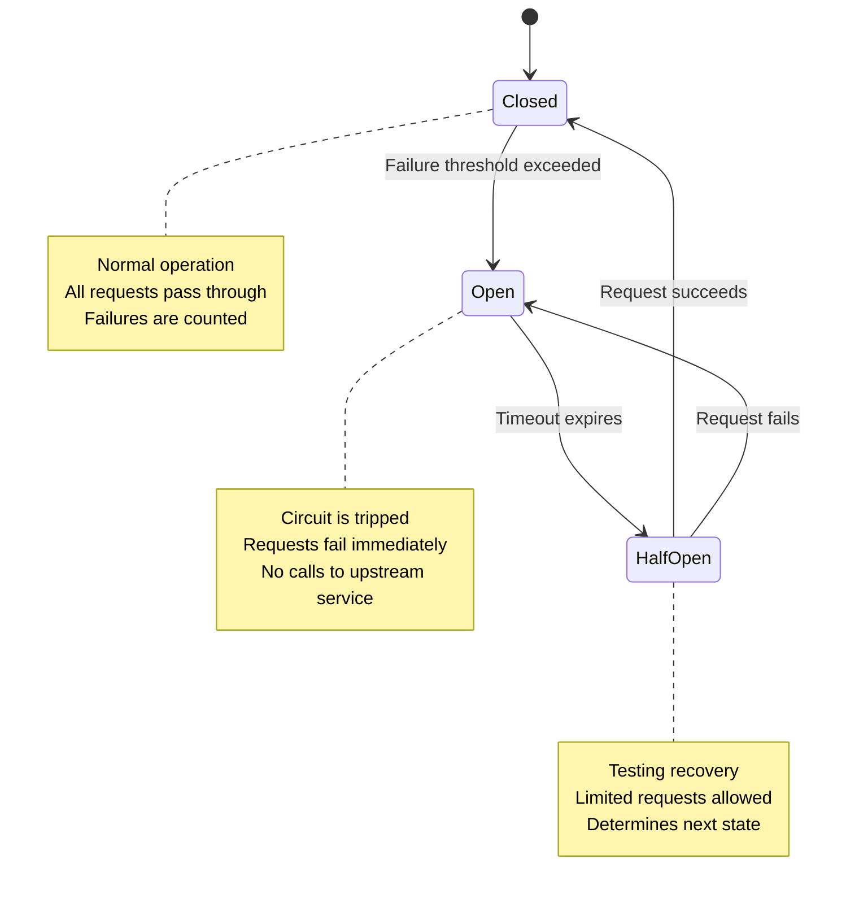
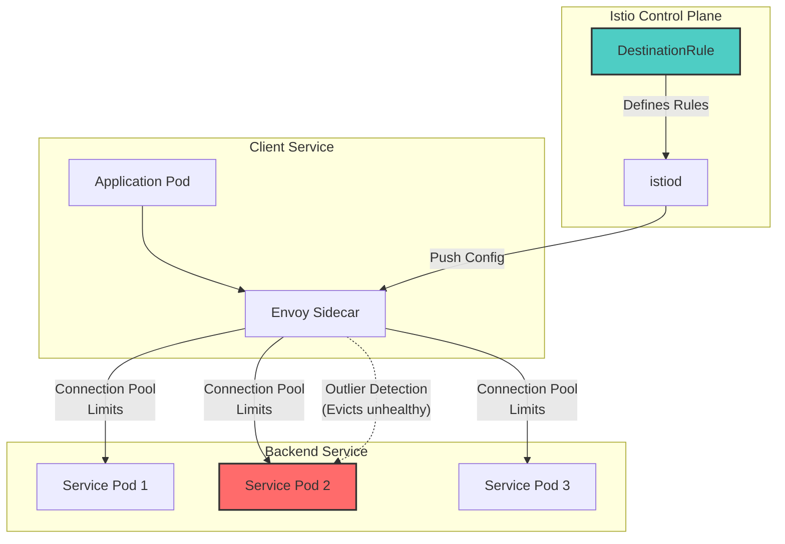
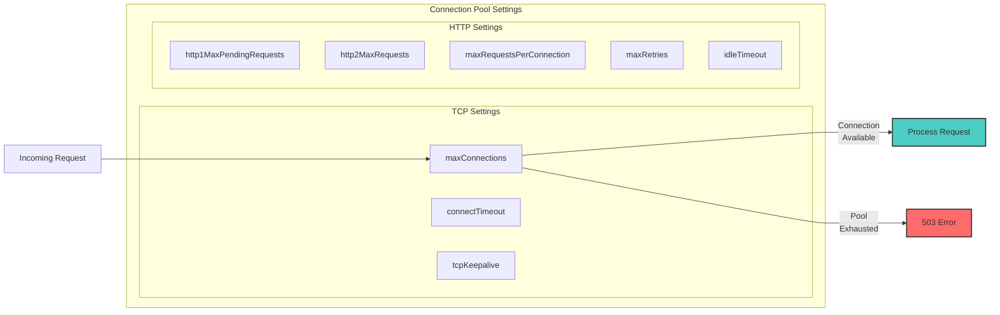
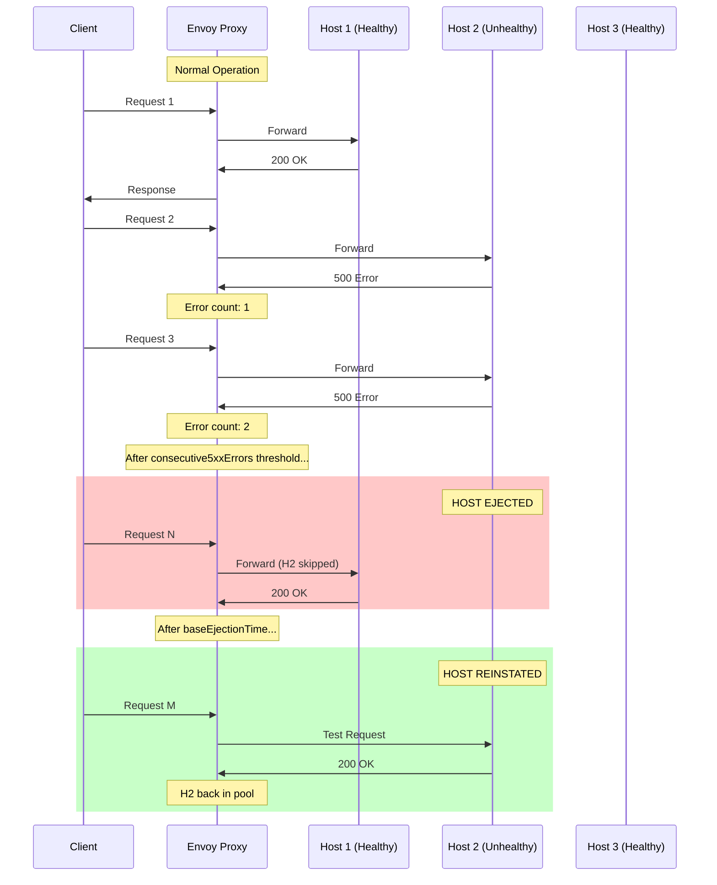
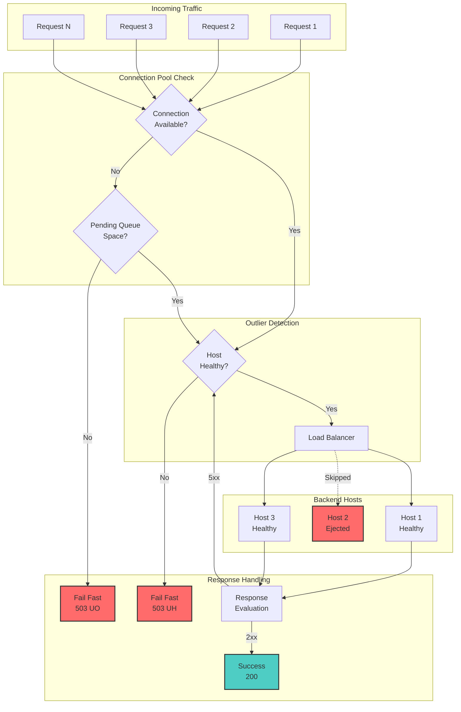

# How to Configure Circuit Breakers with Istio

Author: [nawazdhandala](https://github.com/nawazdhandala)

Tags: Istio, Circuit Breaker, Resilience, Service Mesh, Kubernetes

Description: A guide to implementing circuit breaker patterns with Istio for resilient microservices.

---

## Introduction

In distributed microservices architectures, failures are inevitable. A single failing service can trigger a cascade of failures across your entire system, leading to complete outages. Circuit breakers are a critical resilience pattern that prevents this cascading failure by "tripping" when a service becomes unhealthy, giving it time to recover.

Istio, the popular service mesh for Kubernetes, provides built-in circuit breaker functionality through its traffic management features. Unlike application-level circuit breakers (like Hystrix or Resilience4j), Istio implements circuit breaking at the infrastructure level, meaning you don't need to modify your application code.

In this comprehensive guide, we'll explore how to configure circuit breakers with Istio using DestinationRules, connection pool settings, and outlier detection.

## Understanding Circuit Breaker States

Before diving into configuration, let's understand how circuit breakers work. A circuit breaker operates in three states:



- **Closed**: Normal operation. Requests flow through, but failures are tracked.
- **Open**: The circuit has tripped. Requests fail immediately without calling the upstream service.
- **Half-Open**: A recovery test state. A limited number of requests are allowed through to test if the service has recovered.

## Prerequisites

Before configuring circuit breakers, ensure you have:

- A Kubernetes cluster (1.21+)
- Istio installed (1.15+)
- `kubectl` configured to access your cluster
- `istioctl` CLI installed

You can verify your Istio installation with the following command:

```bash
# Verify Istio installation and check the version
istioctl version
```

## Istio Circuit Breaker Architecture

Istio implements circuit breakers through two main mechanisms in the DestinationRule resource:



1. **Connection Pool Settings**: Limit the number of connections and requests to a service
2. **Outlier Detection**: Detect and evict unhealthy hosts from the load balancing pool

## Basic Circuit Breaker Configuration

Let's start with a basic circuit breaker configuration. First, we need a sample application to protect.

Create a sample deployment for a backend service that we'll apply circuit breaker rules to:

```yaml
# deployment.yaml
# This creates a simple httpbin deployment that we'll use to demonstrate circuit breakers
apiVersion: apps/v1
kind: Deployment
metadata:
  name: httpbin
  namespace: default
spec:
  replicas: 3
  selector:
    matchLabels:
      app: httpbin
  template:
    metadata:
      labels:
        app: httpbin
        # Enable Istio sidecar injection for this pod
        sidecar.istio.io/inject: "true"
    spec:
      containers:
      - name: httpbin
        image: docker.io/kennethreitz/httpbin
        ports:
        - containerPort: 80
        resources:
          limits:
            cpu: "500m"
            memory: "256Mi"
          requests:
            cpu: "100m"
            memory: "128Mi"
---
# Service to expose the httpbin deployment
apiVersion: v1
kind: Service
metadata:
  name: httpbin
  namespace: default
  labels:
    app: httpbin
spec:
  ports:
  - port: 8000
    targetPort: 80
    name: http
  selector:
    app: httpbin
```

Now, let's create a DestinationRule with circuit breaker settings:

```yaml
# circuit-breaker-basic.yaml
# This DestinationRule configures basic circuit breaker settings for the httpbin service
apiVersion: networking.istio.io/v1beta1
kind: DestinationRule
metadata:
  name: httpbin-circuit-breaker
  namespace: default
spec:
  # Target the httpbin service
  host: httpbin
  trafficPolicy:
    # Connection pool settings act as the first line of defense
    # They limit the number of connections and pending requests
    connectionPool:
      tcp:
        # Maximum number of TCP connections to the service
        # When exceeded, new connections are queued or rejected
        maxConnections: 100
      http:
        # Maximum number of HTTP/1.1 connections per host
        h2UpgradePolicy: UPGRADE
        # Maximum pending HTTP requests waiting for a connection
        # Requests beyond this limit receive 503 errors
        http1MaxPendingRequests: 100
        # Maximum concurrent HTTP/2 requests per connection
        http2MaxRequests: 1000
        # Maximum number of requests per connection before it's closed
        # Helps distribute load and prevent connection staleness
        maxRequestsPerConnection: 10
        # Maximum number of retries that can be outstanding
        maxRetries: 3
    # Outlier detection identifies and removes unhealthy hosts
    outlierDetection:
      # Number of consecutive 5xx errors before a host is ejected
      consecutive5xxErrors: 5
      # Time interval for counting errors
      interval: 10s
      # Duration a host stays ejected before being reconsidered
      baseEjectionTime: 30s
      # Maximum percentage of hosts that can be ejected
      # Prevents ejecting all hosts during widespread issues
      maxEjectionPercent: 50
```

Apply the configuration:

```bash
# Apply the circuit breaker DestinationRule to your cluster
kubectl apply -f circuit-breaker-basic.yaml

# Verify the DestinationRule was created successfully
kubectl get destinationrule httpbin-circuit-breaker -o yaml
```

## Connection Pool Settings Deep Dive

Connection pool settings control how many connections and requests can be made to a service. Let's explore each setting in detail:



Here's a comprehensive connection pool configuration with all available options:

```yaml
# connection-pool-advanced.yaml
# Advanced connection pool configuration with all settings explained
apiVersion: networking.istio.io/v1beta1
kind: DestinationRule
metadata:
  name: httpbin-connection-pool
  namespace: default
spec:
  host: httpbin
  trafficPolicy:
    connectionPool:
      # TCP-level connection settings
      tcp:
        # Maximum number of TCP connections to all destination hosts
        # This is your primary connection limit
        # Default: 2^32-1 (effectively unlimited)
        maxConnections: 100

        # TCP connection timeout
        # How long to wait when establishing a new connection
        # Default: 10s
        connectTimeout: 5s

        # TCP keepalive settings to detect dead connections
        tcpKeepalive:
          # Number of keepalive probes before declaring connection dead
          probes: 3
          # Time connection must be idle before sending keepalive probes
          time: 7200s
          # Interval between keepalive probes
          interval: 75s

      # HTTP-level request settings
      http:
        # Policy for upgrading HTTP/1.1 connections to HTTP/2
        # Options: DO_NOT_UPGRADE, UPGRADE (default)
        h2UpgradePolicy: UPGRADE

        # Maximum pending requests waiting for a ready connection
        # When this limit is reached, additional requests fail with 503
        # Default: 2^32-1
        http1MaxPendingRequests: 100

        # Maximum number of concurrent requests to all hosts
        # For HTTP/2, this limits requests per connection
        # Default: 2^32-1
        http2MaxRequests: 1000

        # Maximum requests per connection before recycling
        # Set to 1 for backends that don't support connection reuse
        # Helps prevent connection affinity issues
        maxRequestsPerConnection: 100

        # Maximum concurrent retries across all hosts
        # Prevents retry storms during outages
        # Default: 2^32-1
        maxRetries: 3

        # Idle timeout for connections
        # Connections idle longer than this are closed
        # Default: 1 hour
        idleTimeout: 300s

        # Use client protocol (preserve HTTP version from client)
        # Useful when you need to maintain specific HTTP semantics
        useClientProtocol: false
```

## Outlier Detection Configuration

Outlier detection is Istio's implementation of the circuit breaker pattern. It monitors backend hosts and automatically removes (ejects) unhealthy ones from the load balancing pool.



Here's a comprehensive outlier detection configuration:

```yaml
# outlier-detection-advanced.yaml
# Comprehensive outlier detection (circuit breaker) configuration
apiVersion: networking.istio.io/v1beta1
kind: DestinationRule
metadata:
  name: httpbin-outlier-detection
  namespace: default
spec:
  host: httpbin
  trafficPolicy:
    outlierDetection:
      # CONSECUTIVE ERROR DETECTION
      # Number of consecutive 5xx errors before ejection
      # This is the primary trigger for circuit breaking
      # Set lower for faster detection, higher to tolerate occasional errors
      consecutive5xxErrors: 5

      # Number of consecutive gateway errors (502, 503, 504) before ejection
      # Gateway errors often indicate infrastructure issues
      consecutiveGatewayErrors: 5

      # Number of consecutive locally originated errors before ejection
      # These are errors from the Envoy proxy itself (timeouts, connection errors)
      consecutiveLocalOriginFailures: 5

      # TIMING SETTINGS
      # Time interval between ejection analysis sweeps
      # Errors are counted within this window
      # Shorter intervals = faster detection but more resource usage
      interval: 10s

      # Base ejection time - how long a host stays ejected
      # Actual ejection time = baseEjectionTime * number of times ejected
      # This implements exponential backoff for repeatedly failing hosts
      baseEjectionTime: 30s

      # Minimum ejection time (overrides calculated time if lower)
      # Ensures hosts are ejected for at least this duration
      minEjectionTime: 30s

      # Maximum ejection time (caps the exponential backoff)
      # Prevents hosts from being ejected indefinitely
      maxEjectionTime: 300s

      # EJECTION LIMITS
      # Maximum percentage of hosts that can be ejected simultaneously
      # Prevents complete service unavailability
      # Set to 100 to allow ejecting all hosts if all are unhealthy
      maxEjectionPercent: 50

      # Minimum number of healthy hosts required
      # If healthy hosts drop below this, panic mode activates
      # In panic mode, all hosts are used regardless of health
      minHealthPercent: 30

      # DETECTION MODES
      # Whether to split external and local origin errors
      # When true, consecutive5xxErrors only counts external errors
      splitExternalLocalOriginErrors: true
```

## Consecutive Error Thresholds

Understanding how consecutive errors work is crucial for effective circuit breaking. Let's explore different threshold strategies:

```yaml
# error-thresholds.yaml
# Different circuit breaker configurations for various use cases
apiVersion: networking.istio.io/v1beta1
kind: DestinationRule
metadata:
  name: payment-service-strict
  namespace: payments
spec:
  host: payment-service
  trafficPolicy:
    outlierDetection:
      # STRICT CONFIGURATION for critical services
      # Eject hosts quickly to protect the system
      # Use for payment, authentication, and other critical paths

      # Very low threshold - eject after just 3 errors
      # Critical services can't afford many failures
      consecutive5xxErrors: 3

      # Short interval for quick detection
      interval: 5s

      # Short ejection time to recover quickly if the issue resolves
      baseEjectionTime: 15s

      # Allow ejecting most hosts for critical services
      # Better to have degraded service than incorrect results
      maxEjectionPercent: 80
---
apiVersion: networking.istio.io/v1beta1
kind: DestinationRule
metadata:
  name: catalog-service-tolerant
  namespace: catalog
spec:
  host: catalog-service
  trafficPolicy:
    outlierDetection:
      # TOLERANT CONFIGURATION for less critical services
      # Allow more errors before ejecting
      # Use for services where occasional errors are acceptable

      # Higher threshold - tolerate more errors
      consecutive5xxErrors: 10

      # Longer interval - less aggressive detection
      interval: 30s

      # Longer ejection time - give hosts more time to recover
      baseEjectionTime: 60s

      # Conservative ejection percentage
      maxEjectionPercent: 30
---
apiVersion: networking.istio.io/v1beta1
kind: DestinationRule
metadata:
  name: recommendation-service-balanced
  namespace: recommendations
spec:
  host: recommendation-service
  trafficPolicy:
    outlierDetection:
      # BALANCED CONFIGURATION for typical services
      # Good starting point for most services

      consecutive5xxErrors: 5
      consecutiveGatewayErrors: 5
      consecutiveLocalOriginFailures: 5
      interval: 10s
      baseEjectionTime: 30s
      maxEjectionTime: 180s
      maxEjectionPercent: 50
      minHealthPercent: 30
      splitExternalLocalOriginErrors: true
```

## Complete Production Configuration

Here's a complete production-ready configuration that combines all the concepts:

```yaml
# production-circuit-breaker.yaml
# Complete production circuit breaker configuration
# This example protects a critical API service with comprehensive settings
apiVersion: networking.istio.io/v1beta1
kind: DestinationRule
metadata:
  name: api-gateway-circuit-breaker
  namespace: production
  labels:
    app: api-gateway
    environment: production
spec:
  # Target the API gateway service
  host: api-gateway.production.svc.cluster.local

  # Define traffic policy with both connection limits and outlier detection
  trafficPolicy:
    # Load balancing configuration
    # Use LEAST_REQUEST for better distribution under load
    loadBalancer:
      simple: LEAST_REQUEST

    # Connection pool limits - first line of defense
    connectionPool:
      tcp:
        # Limit total TCP connections to prevent resource exhaustion
        maxConnections: 500
        # Quick timeout to fail fast on connection issues
        connectTimeout: 3s
        tcpKeepalive:
          probes: 3
          time: 300s
          interval: 30s
      http:
        # Limit pending requests to prevent request pile-up
        http1MaxPendingRequests: 200
        # Allow enough concurrent requests for HTTP/2
        http2MaxRequests: 2000
        # Recycle connections periodically for load distribution
        maxRequestsPerConnection: 50
        # Limit concurrent retries to prevent retry storms
        maxRetries: 5
        # Close idle connections after 5 minutes
        idleTimeout: 300s

    # Outlier detection - circuit breaker behavior
    outlierDetection:
      # Primary error detection
      consecutive5xxErrors: 5
      consecutiveGatewayErrors: 3
      consecutiveLocalOriginFailures: 3

      # Detection timing
      interval: 10s

      # Ejection timing with exponential backoff
      baseEjectionTime: 30s
      minEjectionTime: 30s
      maxEjectionTime: 300s

      # Ejection limits
      maxEjectionPercent: 50
      minHealthPercent: 30

      # Error splitting for granular control
      splitExternalLocalOriginErrors: true

  # Subset-specific overrides
  # Apply different settings for different service versions
  subsets:
  - name: stable
    labels:
      version: stable
    trafficPolicy:
      outlierDetection:
        # More tolerant for stable version
        consecutive5xxErrors: 7
        baseEjectionTime: 20s
  - name: canary
    labels:
      version: canary
    trafficPolicy:
      outlierDetection:
        # Stricter for canary - eject quickly on errors
        consecutive5xxErrors: 3
        baseEjectionTime: 60s
        maxEjectionPercent: 100
```

## Testing Circuit Breakers

Testing your circuit breaker configuration is essential. Let's create a comprehensive test setup:

First, deploy a load testing client (Fortio):

```yaml
# fortio-client.yaml
# Fortio is a load testing tool that integrates well with Istio
apiVersion: apps/v1
kind: Deployment
metadata:
  name: fortio-client
  namespace: default
spec:
  replicas: 1
  selector:
    matchLabels:
      app: fortio
  template:
    metadata:
      labels:
        app: fortio
        # Enable Istio sidecar injection
        sidecar.istio.io/inject: "true"
    spec:
      containers:
      - name: fortio
        image: fortio/fortio:latest
        ports:
        - containerPort: 8080
        args:
        - server
```

Apply the Fortio client:

```bash
# Deploy the Fortio load testing client
kubectl apply -f fortio-client.yaml

# Wait for the pod to be ready
kubectl wait --for=condition=ready pod -l app=fortio --timeout=60s
```

### Test 1: Connection Pool Limits

This test validates that requests are rejected when connection limits are exceeded:

```bash
# Get the Fortio pod name for executing commands
FORTIO_POD=$(kubectl get pods -l app=fortio -o jsonpath='{.items[0].metadata.name}')

# Test with a small number of connections (should succeed)
# -c 2: Use 2 concurrent connections
# -qps 0: No rate limiting (as fast as possible)
# -n 20: Send 20 requests
kubectl exec "$FORTIO_POD" -c fortio -- \
  fortio load -c 2 -qps 0 -n 20 http://httpbin:8000/get

# Test with connections exceeding the pool limit
# -c 150: Use 150 concurrent connections (exceeds maxConnections: 100)
# -qps 0: No rate limiting
# -n 500: Send 500 requests
# You should see some 503 (UO - Upstream Overflow) responses
kubectl exec "$FORTIO_POD" -c fortio -- \
  fortio load -c 150 -qps 0 -n 500 http://httpbin:8000/get
```

The output will show response code distribution. Look for:
- `Code 200`: Successful requests
- `Code 503`: Requests rejected due to connection pool overflow

### Test 2: Outlier Detection (Circuit Breaking)

Create a flaky service that fails intermittently:

```yaml
# flaky-service.yaml
# This service returns errors for some percentage of requests
# Perfect for testing circuit breaker behavior
apiVersion: apps/v1
kind: Deployment
metadata:
  name: flaky-service
  namespace: default
spec:
  replicas: 3
  selector:
    matchLabels:
      app: flaky-service
  template:
    metadata:
      labels:
        app: flaky-service
        sidecar.istio.io/inject: "true"
    spec:
      containers:
      - name: flaky
        image: kennethreitz/httpbin
        ports:
        - containerPort: 80
        # This service will be configured to fail via Istio fault injection
---
apiVersion: v1
kind: Service
metadata:
  name: flaky-service
  namespace: default
spec:
  ports:
  - port: 8000
    targetPort: 80
    name: http
  selector:
    app: flaky-service
---
# Inject faults into the flaky service
# This VirtualService makes 30% of requests return 500 errors
apiVersion: networking.istio.io/v1beta1
kind: VirtualService
metadata:
  name: flaky-service-faults
  namespace: default
spec:
  hosts:
  - flaky-service
  http:
  - fault:
      abort:
        # 30% of requests will receive a 500 error
        percentage:
          value: 30
        httpStatus: 500
    route:
    - destination:
        host: flaky-service
---
# Apply circuit breaker to the flaky service
apiVersion: networking.istio.io/v1beta1
kind: DestinationRule
metadata:
  name: flaky-service-cb
  namespace: default
spec:
  host: flaky-service
  trafficPolicy:
    outlierDetection:
      # Eject after 5 consecutive 5xx errors
      consecutive5xxErrors: 5
      interval: 10s
      baseEjectionTime: 30s
      maxEjectionPercent: 100
```

Test the circuit breaker:

```bash
# Apply the flaky service configuration
kubectl apply -f flaky-service.yaml

# Wait for pods to be ready
kubectl wait --for=condition=ready pod -l app=flaky-service --timeout=60s

# Run a load test against the flaky service
# This will trigger circuit breaking as errors accumulate
kubectl exec "$FORTIO_POD" -c fortio -- \
  fortio load -c 5 -qps 10 -t 60s http://flaky-service:8000/get

# Monitor the Envoy stats to see circuit breaker in action
# Look for 'ejections_active' which shows ejected hosts
kubectl exec "$FORTIO_POD" -c istio-proxy -- \
  pilot-agent request GET stats | grep -E "(outlier|ejection)"
```

### Test 3: Monitoring Circuit Breaker Metrics

Istio exposes detailed metrics about circuit breaker behavior:

```bash
# Get circuit breaker statistics from the Envoy sidecar
# These metrics show the current state of circuit breakers
kubectl exec "$FORTIO_POD" -c istio-proxy -- \
  pilot-agent request GET stats | grep -E "upstream_rq_pending_overflow|upstream_cx_overflow"

# Check outlier detection metrics
# These show host ejections and reinstatements
kubectl exec "$FORTIO_POD" -c istio-proxy -- \
  pilot-agent request GET stats | grep outlier

# Key metrics to watch:
# - upstream_rq_pending_overflow: Requests rejected due to pending request limit
# - upstream_cx_overflow: Requests rejected due to connection limit
# - outlier_detection.ejections_active: Currently ejected hosts
# - outlier_detection.ejections_total: Total ejections since start
# - outlier_detection.ejections_consecutive_5xx: Ejections due to 5xx errors
```

You can also use Prometheus queries if you have it installed:

```promql
# Query: Rate of circuit breaker trips (connection overflow)
sum(rate(istio_requests_total{response_flags="UO"}[5m])) by (destination_service_name)

# Query: Currently ejected endpoints
sum(envoy_cluster_outlier_detection_ejections_active) by (cluster_name)

# Query: Total ejections over time
sum(rate(envoy_cluster_outlier_detection_ejections_total[5m])) by (cluster_name)
```

## Circuit Breaker Visualization

Here's a comprehensive view of how circuit breakers protect your system:



## Best Practices

### 1. Start Conservative and Tune

Begin with conservative settings and adjust based on observed behavior:

```yaml
# Start with these conservative defaults
outlierDetection:
  consecutive5xxErrors: 10
  interval: 30s
  baseEjectionTime: 60s
  maxEjectionPercent: 30
```

### 2. Use Different Settings for Different Service Tiers

Critical services need stricter protection:

```yaml
# Critical path services (payments, auth)
outlierDetection:
  consecutive5xxErrors: 3
  interval: 5s
  baseEjectionTime: 15s

# Standard services
outlierDetection:
  consecutive5xxErrors: 5
  interval: 10s
  baseEjectionTime: 30s

# Background/async services
outlierDetection:
  consecutive5xxErrors: 10
  interval: 30s
  baseEjectionTime: 60s
```

### 3. Monitor and Alert on Circuit Breaker Events

Set up alerts for circuit breaker activity:

```yaml
# Prometheus alerting rule for circuit breaker trips
apiVersion: monitoring.coreos.com/v1
kind: PrometheusRule
metadata:
  name: circuit-breaker-alerts
spec:
  groups:
  - name: circuit-breaker
    rules:
    - alert: HighCircuitBreakerTrips
      expr: |
        sum(rate(istio_requests_total{response_flags="UO"}[5m])) by (destination_service_name) > 10
      for: 5m
      labels:
        severity: warning
      annotations:
        summary: "High circuit breaker activity for {{ $labels.destination_service_name }}"
        description: "Circuit breaker is tripping frequently, indicating backend issues"

    - alert: HostsEjected
      expr: |
        sum(envoy_cluster_outlier_detection_ejections_active) by (cluster_name) > 0
      for: 2m
      labels:
        severity: warning
      annotations:
        summary: "Hosts ejected in cluster {{ $labels.cluster_name }}"
        description: "One or more hosts have been ejected due to consecutive errors"
```

### 4. Combine with Retries and Timeouts

Circuit breakers work best with other resilience patterns:

```yaml
# Complete resilience configuration
apiVersion: networking.istio.io/v1beta1
kind: VirtualService
metadata:
  name: api-resilience
spec:
  hosts:
  - api-service
  http:
  - route:
    - destination:
        host: api-service
    # Retry configuration
    retries:
      attempts: 3
      perTryTimeout: 2s
      retryOn: "5xx,reset,connect-failure,retriable-4xx"
    # Request timeout
    timeout: 10s
---
apiVersion: networking.istio.io/v1beta1
kind: DestinationRule
metadata:
  name: api-circuit-breaker
spec:
  host: api-service
  trafficPolicy:
    connectionPool:
      http:
        # Limit retries to prevent amplification
        maxRetries: 3
    outlierDetection:
      consecutive5xxErrors: 5
      interval: 10s
      baseEjectionTime: 30s
```

## Troubleshooting

### Common Issues and Solutions

**1. Requests failing with 503 UO (Upstream Overflow)**

This means your connection pool limits are being hit:

```bash
# Check current connection pool statistics
kubectl exec <pod> -c istio-proxy -- \
  pilot-agent request GET stats | grep "upstream_rq_pending_overflow"

# Solution: Increase connection pool limits or investigate why connections are exhausted
```

**2. Hosts being ejected too quickly**

Adjust outlier detection thresholds:

```yaml
# More tolerant settings
outlierDetection:
  consecutive5xxErrors: 10  # Increase threshold
  interval: 30s             # Longer evaluation window
  baseEjectionTime: 15s     # Shorter ejection time
```

**3. Hosts not being ejected despite errors**

Ensure outlier detection is properly configured:

```bash
# Verify DestinationRule is applied
kubectl get destinationrule -A

# Check if the service matches the host in DestinationRule
kubectl describe destinationrule <name>

# Verify Envoy received the configuration
istioctl proxy-config cluster <pod> --fqdn <service-fqdn>
```

**4. Circuit breaker not recovering**

Check if the backend service is actually healthy:

```bash
# Check pod health
kubectl get pods -l app=<service>

# Check Envoy's view of the cluster
istioctl proxy-config endpoints <pod> --cluster "<cluster-name>"
```

## Conclusion

Circuit breakers are an essential pattern for building resilient microservices. Istio's implementation through DestinationRules provides powerful, infrastructure-level circuit breaking without requiring application code changes.

Key takeaways:

1. **Connection Pool Settings** act as the first line of defense, preventing resource exhaustion
2. **Outlier Detection** implements the circuit breaker pattern, ejecting unhealthy hosts
3. **Consecutive Error Thresholds** should be tuned based on service criticality
4. **Testing** is essential - use tools like Fortio to validate your configuration
5. **Monitoring** circuit breaker activity helps identify issues before they cascade

Start with conservative settings, monitor your services, and gradually tune the configuration based on observed behavior. Remember that the goal is to fail fast and recover quickly, protecting your system from cascading failures while maintaining the best possible user experience.

## Additional Resources

- [Istio DestinationRule Documentation](https://istio.io/latest/docs/reference/config/networking/destination-rule/)
- [Envoy Circuit Breaking](https://www.envoyproxy.io/docs/envoy/latest/intro/arch_overview/upstream/circuit_breaking)
- [Istio Traffic Management Best Practices](https://istio.io/latest/docs/ops/best-practices/traffic-management/)
- [Resilience Patterns in Microservices](https://docs.microsoft.com/en-us/azure/architecture/patterns/circuit-breaker)
