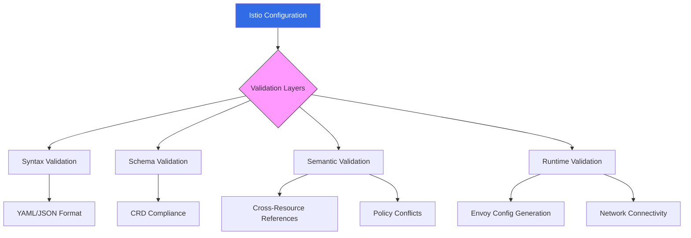
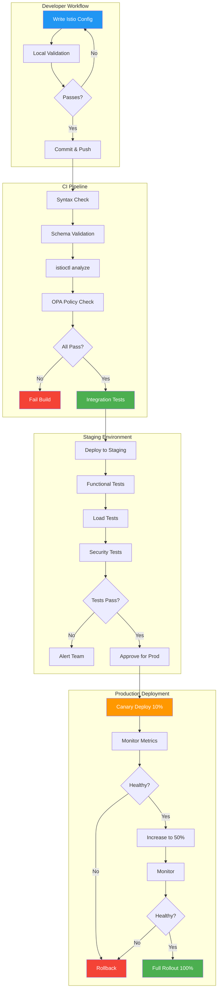

# How to Test and Validate Istio Configurations

Author: [nawazdhandala](https://github.com/nawazdhandala)

Tags: Istio, Testing, Validation, Service Mesh, DevOps

Description: Learn how to test and validate Istio configurations before production deployment.

---

Testing and validating Istio configurations is critical for maintaining a reliable service mesh. Misconfigurations can lead to service outages, security vulnerabilities, and degraded performance. This comprehensive guide covers everything from basic validation using `istioctl analyze` to advanced CI/CD pipeline integration strategies.

## Table of Contents

1. [Understanding Istio Configuration Validation](#understanding-istio-configuration-validation)
2. [Using istioctl analyze](#using-istioctl-analyze)
3. [Dry-Run Validation](#dry-run-validation)
4. [Schema Validation](#schema-validation)
5. [Integration Testing Strategies](#integration-testing-strategies)
6. [CI/CD Validation Pipelines](#cicd-validation-pipelines)
7. [Testing Workflow Overview](#testing-workflow-overview)
8. [Best Practices](#best-practices)

## Understanding Istio Configuration Validation

Before diving into the tools and techniques, let's understand what can go wrong with Istio configurations:



## Using istioctl analyze

The `istioctl analyze` command is the primary tool for validating Istio configurations. It performs comprehensive checks on your configuration and reports potential issues.

### Basic Analysis

The following command analyzes all Istio resources in the current namespace and reports any configuration issues or warnings:

```bash
# Analyze configurations in the current namespace
istioctl analyze

# Analyze configurations in a specific namespace
istioctl analyze -n my-namespace

# Analyze all namespaces in the cluster
istioctl analyze --all-namespaces
```

### Analyzing Local Files

Before applying configurations to your cluster, you can validate local YAML files. This is essential for catching errors early in the development cycle:

```bash
# Analyze a single configuration file before applying it to the cluster
istioctl analyze my-virtualservice.yaml

# Analyze multiple configuration files at once
istioctl analyze virtualservice.yaml destinationrule.yaml gateway.yaml

# Analyze an entire directory of configuration files recursively
istioctl analyze -R ./istio-configs/
```

### Combining Live Cluster and Local Analysis

This powerful feature allows you to validate new configurations against your existing cluster state, catching conflicts before they occur:

```bash
# Analyze local files against live cluster state
# This validates that new configs won't conflict with existing resources
istioctl analyze --use-kube my-new-config.yaml

# Analyze with a specific kubeconfig context
istioctl analyze --context=production-cluster my-config.yaml
```

### Suppressing Specific Messages

In some cases, you may want to ignore certain analysis messages that are expected or don't apply to your use case:

```bash
# Suppress specific message codes using the -S flag
# IST0102 is the code for "Referenced gateway not found" warnings
istioctl analyze -S "IST0102=*" my-config.yaml

# Suppress multiple message types
istioctl analyze -S "IST0102=*" -S "IST0101=*" my-config.yaml
```

### Example: VirtualService Analysis

Let's examine a VirtualService configuration that contains common issues and see how `istioctl analyze` catches them:

```yaml
# virtualservice-with-issues.yaml
# This VirtualService has intentional issues that istioctl analyze will detect
apiVersion: networking.istio.io/v1beta1
kind: VirtualService
metadata:
  name: reviews-route
  namespace: bookinfo
spec:
  # Issue 1: References a gateway that doesn't exist
  gateways:
    - non-existent-gateway
  hosts:
    - reviews
  http:
    - match:
        - headers:
            end-user:
              exact: jason
      route:
        # Issue 2: References a subset that isn't defined in DestinationRule
        - destination:
            host: reviews
            subset: v2-undefined
    - route:
        - destination:
            host: reviews
            subset: v1
```

Running analysis on the above configuration will produce helpful error messages:

```bash
# Run analysis on the problematic configuration
istioctl analyze virtualservice-with-issues.yaml

# Expected output showing the detected issues:
# Error [IST0101] (VirtualService bookinfo/reviews-route) Referenced gateway not found: "non-existent-gateway"
# Error [IST0102] (VirtualService bookinfo/reviews-route) Referenced subset not found: "v2-undefined"
```

## Dry-Run Validation

Kubernetes dry-run capabilities allow you to validate configurations without actually applying them. This is invaluable for testing in production-like environments.

### Server-Side Dry-Run

Server-side dry-run validates against the actual API server, including admission webhooks and validation controllers:

```bash
# Server-side dry-run validates the resource against the API server
# including all admission webhooks and validation controllers
kubectl apply --dry-run=server -f virtualservice.yaml

# Combine with output formatting to see what would be created
kubectl apply --dry-run=server -o yaml -f virtualservice.yaml

# Validate multiple resources at once
kubectl apply --dry-run=server -f ./istio-configs/ -R
```

### Client-Side Dry-Run

Client-side dry-run performs basic validation without contacting the server:

```bash
# Client-side dry-run performs basic schema validation locally
# Useful when you don't have cluster access
kubectl apply --dry-run=client -f virtualservice.yaml

# Output the validated configuration in JSON format
kubectl apply --dry-run=client -o json -f virtualservice.yaml
```

### Dry-Run with Diff

Before applying changes, it's helpful to see exactly what will change. The diff command shows the difference between your local configuration and the current cluster state:

```bash
# Show what would change without applying
# This is extremely useful for reviewing changes before deployment
kubectl diff -f virtualservice.yaml

# Diff an entire directory of configurations
kubectl diff -f ./istio-configs/ -R
```

### Comprehensive Dry-Run Script

This script combines multiple validation steps into a single comprehensive check:

```bash
#!/bin/bash
# validate-istio-config.sh
# Comprehensive validation script for Istio configurations
# Usage: ./validate-istio-config.sh <config-file-or-directory>

set -e

CONFIG_PATH="${1:-.}"

echo "=== Starting Istio Configuration Validation ==="
echo "Config path: $CONFIG_PATH"
echo ""

# Step 1: Validate YAML syntax using yq
# This catches basic YAML formatting errors before proceeding
echo "[1/4] Validating YAML syntax..."
find "$CONFIG_PATH" -name "*.yaml" -o -name "*.yml" | while read -r file; do
    if ! yq eval '.' "$file" > /dev/null 2>&1; then
        echo "ERROR: Invalid YAML syntax in $file"
        exit 1
    fi
done
echo "YAML syntax validation passed"
echo ""

# Step 2: Run istioctl analyze for Istio-specific validation
# This checks for Istio configuration best practices and common issues
echo "[2/4] Running istioctl analyze..."
if ! istioctl analyze "$CONFIG_PATH" -R 2>&1; then
    echo "WARNING: istioctl analyze found issues"
fi
echo ""

# Step 3: Perform Kubernetes dry-run validation
# This validates against the actual cluster's CRDs and admission webhooks
echo "[3/4] Running kubectl dry-run validation..."
find "$CONFIG_PATH" -name "*.yaml" -o -name "*.yml" | while read -r file; do
    if ! kubectl apply --dry-run=server -f "$file" > /dev/null 2>&1; then
        echo "ERROR: Dry-run failed for $file"
        kubectl apply --dry-run=server -f "$file"
        exit 1
    fi
done
echo "Kubernetes dry-run validation passed"
echo ""

# Step 4: Show diff of what would change
# Helps reviewers understand the impact of the changes
echo "[4/4] Showing configuration diff..."
kubectl diff -f "$CONFIG_PATH" -R 2>/dev/null || true

echo ""
echo "=== Validation Complete ==="
```

## Schema Validation

Schema validation ensures your configurations conform to Istio's Custom Resource Definitions (CRDs).

### Using kubeval for Schema Validation

kubeval validates Kubernetes resources against JSON schemas, including Istio CRDs:

```bash
# Install kubeval - a tool for validating Kubernetes YAML against schemas
# macOS installation using Homebrew
brew install kubeval

# Linux installation using curl
curl -L https://github.com/instrumenta/kubeval/releases/latest/download/kubeval-linux-amd64.tar.gz | tar xz
sudo mv kubeval /usr/local/bin/

# Validate Istio resources against their CRD schemas
# The --additional-schema-locations flag points to Istio's schema definitions
kubeval --additional-schema-locations https://raw.githubusercontent.com/istio/istio/master/manifests/charts/base/crds virtualservice.yaml
```

### Using kubeconform for Modern Validation

kubeconform is a faster, more modern alternative to kubeval with better Istio support:

```bash
# Install kubeconform - faster alternative to kubeval
# macOS installation
brew install kubeconform

# Linux installation
curl -L https://github.com/yannh/kubeconform/releases/latest/download/kubeconform-linux-amd64.tar.gz | tar xz
sudo mv kubeconform /usr/local/bin/

# Validate with Istio CRD schemas
# -strict flag ensures no unknown fields are present
# -summary flag provides a concise output of validation results
kubeconform -strict -summary \
  -schema-location default \
  -schema-location 'https://raw.githubusercontent.com/datreeio/CRDs-catalog/main/{{.Group}}/{{.ResourceKind}}_{{.ResourceAPIVersion}}.json' \
  virtualservice.yaml
```

### Custom Schema Validation with OPA

Open Policy Agent (OPA) allows you to define custom validation policies. This enables organization-specific rules and best practices:

```rego
# istio-policies.rego
# Custom OPA policies for validating Istio configurations
# These policies enforce organizational best practices

package istio.validation

# Rule: Deny VirtualServices without timeout configuration
# Timeouts are critical for preventing cascading failures
deny[msg] {
    input.kind == "VirtualService"
    route := input.spec.http[_].route[_]
    not input.spec.http[_].timeout
    msg := sprintf("VirtualService '%s' must specify a timeout for reliability", [input.metadata.name])
}

# Rule: Require retry configuration for production services
# Retries help handle transient failures gracefully
deny[msg] {
    input.kind == "VirtualService"
    input.metadata.namespace == "production"
    http_route := input.spec.http[_]
    not http_route.retries
    msg := sprintf("VirtualService '%s' in production must have retry configuration", [input.metadata.name])
}

# Rule: Enforce mTLS in production namespace
# Mutual TLS is required for secure service-to-service communication
deny[msg] {
    input.kind == "PeerAuthentication"
    input.metadata.namespace == "production"
    input.spec.mtls.mode != "STRICT"
    msg := sprintf("PeerAuthentication '%s' must use STRICT mTLS mode in production", [input.metadata.name])
}

# Rule: Require explicit hosts in VirtualService
# Prevents accidental catch-all routing
deny[msg] {
    input.kind == "VirtualService"
    count(input.spec.hosts) == 0
    msg := sprintf("VirtualService '%s' must specify at least one host", [input.metadata.name])
}

# Rule: Limit connection pool size to prevent resource exhaustion
warn[msg] {
    input.kind == "DestinationRule"
    pool := input.spec.trafficPolicy.connectionPool.tcp
    pool.maxConnections > 1000
    msg := sprintf("DestinationRule '%s' has high maxConnections (%d), consider limiting", [input.metadata.name, pool.maxConnections])
}
```

Running OPA validation against your configurations:

```bash
# Use conftest to run OPA policies against Istio configurations
# Install conftest first
brew install conftest  # macOS
# or
curl -L https://github.com/open-policy-agent/conftest/releases/download/v0.45.0/conftest_0.45.0_Linux_x86_64.tar.gz | tar xz

# Run validation with custom policies
# The --policy flag specifies the directory containing OPA policies
conftest test --policy ./policies virtualservice.yaml

# Run against all Istio configurations in a directory
conftest test --policy ./policies ./istio-configs/

# Output in JSON format for CI/CD integration
conftest test --policy ./policies --output json virtualservice.yaml
```

## Integration Testing Strategies

Integration tests verify that your Istio configurations work correctly in a running environment.

### Testing Workflow Overview

```mermaid
flowchart LR
    subgraph Development
        A[Write Config] --> B[Local Validation]
        B --> C[Unit Tests]
    end

    subgraph CI Pipeline
        C --> D[Schema Validation]
        D --> E[istioctl analyze]
        E --> F[Dry-run Apply]
    end

    subgraph Staging
        F --> G[Deploy to Staging]
        G --> H[Integration Tests]
        H --> I[Performance Tests]
    end

    subgraph Production
        I --> J[Canary Deploy]
        J --> K[Monitoring]
        K --> L[Full Rollout]
    end

    style A fill:#326ce5,color:#fff
    style G fill:#4caf50,color:#fff
    style J fill:#ff9800,color:#fff
    style L fill:#4caf50,color:#fff
```



### Traffic Routing Tests

These tests verify that traffic routing configurations work as expected. We use curl commands with specific headers to validate routing behavior:

```bash
#!/bin/bash
# test-traffic-routing.sh
# Integration tests for Istio VirtualService routing configurations
# These tests verify that traffic is routed correctly based on headers, weights, etc.

set -e

# Configuration - customize these for your environment
GATEWAY_URL="${GATEWAY_URL:-http://istio-ingressgateway.istio-system.svc.cluster.local}"
TEST_SERVICE="productpage"
TIMEOUT=10

# Color output for better readability in CI logs
RED='\033[0;31m'
GREEN='\033[0;32m'
NC='\033[0m' # No Color

# Helper function to test a route and verify the response
test_route() {
    local description="$1"
    local endpoint="$2"
    local expected_response="$3"
    local headers="$4"

    echo -n "Testing: $description... "

    # Make the request with optional headers
    if [ -n "$headers" ]; then
        response=$(curl -s --max-time $TIMEOUT -H "$headers" "${GATEWAY_URL}${endpoint}")
    else
        response=$(curl -s --max-time $TIMEOUT "${GATEWAY_URL}${endpoint}")
    fi

    # Check if the response contains the expected content
    if echo "$response" | grep -q "$expected_response"; then
        echo -e "${GREEN}PASSED${NC}"
        return 0
    else
        echo -e "${RED}FAILED${NC}"
        echo "Expected: $expected_response"
        echo "Got: $response"
        return 1
    fi
}

# Test 1: Basic connectivity test
# Verifies the service is reachable through the Istio gateway
echo "=== Traffic Routing Integration Tests ==="
echo ""

test_route \
    "Basic connectivity to $TEST_SERVICE" \
    "/productpage" \
    "Simple Bookstore App"

# Test 2: Header-based routing
# Tests that requests with specific headers are routed to the correct version
test_route \
    "Header-based routing to v2 (end-user: jason)" \
    "/productpage" \
    "reviews-v2" \
    "end-user: jason"

# Test 3: Default routing (without special headers)
# Verifies the default route when no matching headers are present
test_route \
    "Default routing to v1" \
    "/productpage" \
    "reviews-v1"

# Test 4: Canary routing percentage test
# Makes multiple requests and verifies approximate traffic distribution
echo -n "Testing: Canary traffic distribution (90/10 split)... "
v1_count=0
v2_count=0
total_requests=100

for i in $(seq 1 $total_requests); do
    response=$(curl -s --max-time $TIMEOUT "${GATEWAY_URL}/productpage")
    if echo "$response" | grep -q "reviews-v1"; then
        ((v1_count++))
    elif echo "$response" | grep -q "reviews-v2"; then
        ((v2_count++))
    fi
done

# Allow 15% tolerance for traffic distribution
# Expected: ~90 requests to v1, ~10 requests to v2
v2_percentage=$((v2_count * 100 / total_requests))
if [ $v2_percentage -ge 5 ] && [ $v2_percentage -le 25 ]; then
    echo -e "${GREEN}PASSED${NC} (v2: ${v2_percentage}%)"
else
    echo -e "${RED}FAILED${NC} (v2: ${v2_percentage}%, expected 5-25%)"
fi

echo ""
echo "=== Tests Complete ==="
```

### Testing with Fortio Load Generator

Fortio is the official Istio load testing tool. It provides detailed statistics about latency and throughput:

```bash
#!/bin/bash
# fortio-load-test.sh
# Load testing script using Fortio to validate Istio performance characteristics
# Useful for testing circuit breakers, rate limiting, and connection pools

# Configuration
FORTIO_URL="${FORTIO_URL:-http://fortio.default.svc.cluster.local:8080}"
TARGET_URL="http://productpage:9080/productpage"
DURATION="30s"
QPS=100  # Queries per second
CONNECTIONS=8

echo "=== Fortio Load Test ==="
echo "Target: $TARGET_URL"
echo "Duration: $DURATION"
echo "QPS: $QPS"
echo "Connections: $CONNECTIONS"
echo ""

# Run the load test and capture the output
# -json flag outputs detailed statistics in JSON format
fortio load \
    -c $CONNECTIONS \
    -qps $QPS \
    -t $DURATION \
    -json result.json \
    "$TARGET_URL"

# Parse and display key metrics from the results
echo ""
echo "=== Results Summary ==="

# Extract key metrics using jq
# P50, P90, P99 latencies are critical for SLO validation
p50=$(jq '.DurationHistogram.Percentiles[] | select(.Percentile == 50) | .Value' result.json)
p90=$(jq '.DurationHistogram.Percentiles[] | select(.Percentile == 90) | .Value' result.json)
p99=$(jq '.DurationHistogram.Percentiles[] | select(.Percentile == 99) | .Value' result.json)
success_rate=$(jq '.RetCodes["200"] / .DurationHistogram.Count * 100' result.json)

echo "P50 Latency: ${p50}s"
echo "P90 Latency: ${p90}s"
echo "P99 Latency: ${p99}s"
echo "Success Rate: ${success_rate}%"

# Validate against SLOs
# These thresholds should match your service level objectives
echo ""
echo "=== SLO Validation ==="

# Check P99 latency against SLO (example: 500ms)
if (( $(echo "$p99 < 0.5" | bc -l) )); then
    echo "P99 Latency SLO: PASSED (< 500ms)"
else
    echo "P99 Latency SLO: FAILED (>= 500ms)"
    exit 1
fi

# Check success rate against SLO (example: 99.9%)
if (( $(echo "$success_rate > 99.9" | bc -l) )); then
    echo "Success Rate SLO: PASSED (> 99.9%)"
else
    echo "Success Rate SLO: FAILED (<= 99.9%)"
    exit 1
fi
```

### Testing mTLS Configuration

Verifying mutual TLS is critical for security. These tests confirm that mTLS is properly enforced:

```bash
#!/bin/bash
# test-mtls.sh
# Tests to verify mTLS is properly configured between services
# These tests ensure secure service-to-service communication

set -e

NAMESPACE="${NAMESPACE:-default}"

echo "=== mTLS Configuration Tests ==="
echo ""

# Test 1: Verify PeerAuthentication is set to STRICT mode
# STRICT mode requires mTLS for all incoming connections
echo "[1/4] Checking PeerAuthentication mode..."
mtls_mode=$(kubectl get peerauthentication -n $NAMESPACE -o jsonpath='{.items[0].spec.mtls.mode}' 2>/dev/null || echo "NOT_SET")

if [ "$mtls_mode" == "STRICT" ]; then
    echo "PeerAuthentication mode: STRICT - PASSED"
else
    echo "PeerAuthentication mode: $mtls_mode - WARNING (expected STRICT)"
fi
echo ""

# Test 2: Verify mTLS is active between services using istioctl
# This command shows the actual TLS status for service communications
echo "[2/4] Checking mTLS status between services..."
istioctl x describe pod $(kubectl get pod -n $NAMESPACE -l app=productpage -o jsonpath='{.items[0].metadata.name}') -n $NAMESPACE | grep -A5 "mTLS"
echo ""

# Test 3: Attempt plain HTTP connection (should fail with STRICT mTLS)
# This test verifies that non-mTLS connections are rejected
echo "[3/4] Testing plain HTTP rejection..."

# Deploy a test pod without Istio sidecar to test from outside the mesh
kubectl run mtls-test --image=curlimages/curl --restart=Never --rm -i --timeout=30s -- \
    curl -s --max-time 5 http://productpage.$NAMESPACE.svc.cluster.local:9080/productpage 2>&1 || true

# If mTLS is STRICT, the connection should fail or be rejected
echo "Plain HTTP test completed (connection should have failed)"
echo ""

# Test 4: Verify certificate details
# Check that proper certificates are being used for mTLS
echo "[4/4] Checking proxy certificates..."
kubectl exec -n $NAMESPACE $(kubectl get pod -n $NAMESPACE -l app=productpage -o jsonpath='{.items[0].metadata.name}') -c istio-proxy -- \
    openssl s_client -connect ratings:9080 -cert /etc/certs/cert-chain.pem -key /etc/certs/key.pem -CAfile /etc/certs/root-cert.pem 2>&1 | head -20

echo ""
echo "=== mTLS Tests Complete ==="
```

### Testing Circuit Breaker Configuration

Circuit breakers prevent cascading failures. These tests verify they trigger correctly:

```bash
#!/bin/bash
# test-circuit-breaker.sh
# Tests to verify circuit breaker configurations are working correctly
# Circuit breakers protect services from cascading failures

set -e

SERVICE_URL="http://httpbin:8000"
CONCURRENT_CONNECTIONS=20
MAX_PENDING_REQUESTS=10

echo "=== Circuit Breaker Tests ==="
echo ""

# First, let's verify the DestinationRule is configured correctly
echo "[1/3] Verifying DestinationRule circuit breaker config..."
kubectl get destinationrule httpbin -o yaml | grep -A10 "connectionPool"
echo ""

# Test 2: Trigger circuit breaker by exceeding connection limits
# We'll use Fortio to generate enough concurrent connections to trip the breaker
echo "[2/3] Triggering circuit breaker with concurrent connections..."

# Run Fortio with more concurrent connections than the limit
fortio load \
    -c $CONCURRENT_CONNECTIONS \
    -qps 1000 \
    -t 10s \
    -json cb-test.json \
    $SERVICE_URL/get

# Check for 503 responses which indicate circuit breaker activation
# Circuit breaker returns 503 when the service is overloaded
overflow_count=$(jq '.RetCodes["503"] // 0' cb-test.json)
success_count=$(jq '.RetCodes["200"] // 0' cb-test.json)

echo "Successful requests (200): $success_count"
echo "Circuit breaker responses (503): $overflow_count"

if [ "$overflow_count" -gt 0 ]; then
    echo "Circuit breaker test: PASSED (503 responses indicate breaker triggered)"
else
    echo "Circuit breaker test: WARNING (no 503 responses, breaker may not have triggered)"
fi
echo ""

# Test 3: Verify circuit breaker statistics in Envoy
# Envoy exposes detailed circuit breaker stats through its admin interface
echo "[3/3] Checking Envoy circuit breaker statistics..."
kubectl exec -n default $(kubectl get pod -l app=sleep -o jsonpath='{.items[0].metadata.name}') -c istio-proxy -- \
    curl -s localhost:15000/stats | grep "circuit_breakers" | head -10

echo ""
echo "=== Circuit Breaker Tests Complete ==="
```

## CI/CD Validation Pipelines

Integrating Istio configuration validation into your CI/CD pipeline catches issues early and ensures consistent quality.

### GitHub Actions Pipeline

This comprehensive GitHub Actions workflow validates Istio configurations on every pull request:

```yaml
# .github/workflows/istio-validation.yaml
# GitHub Actions workflow for validating Istio configurations
# Runs on every pull request that modifies Istio config files

name: Istio Configuration Validation

on:
  pull_request:
    paths:
      # Only trigger when Istio configuration files are modified
      - 'istio/**'
      - 'kubernetes/istio/**'
      - '**/*-virtualservice.yaml'
      - '**/*-destinationrule.yaml'
      - '**/*-gateway.yaml'
  push:
    branches:
      - main
      - master

# Environment variables used across jobs
env:
  ISTIO_VERSION: "1.20.0"
  KUBERNETES_VERSION: "1.28.0"

jobs:
  # Job 1: Basic syntax and schema validation
  # Fast checks that don't require a cluster
  syntax-validation:
    name: Syntax & Schema Validation
    runs-on: ubuntu-latest
    steps:
      - name: Checkout code
        uses: actions/checkout@v4

      - name: Validate YAML syntax
        # yamllint checks for proper YAML formatting and common issues
        run: |
          pip install yamllint
          yamllint -c .yamllint.yaml istio/

      - name: Install kubeconform
        # kubeconform validates Kubernetes resources against their schemas
        run: |
          curl -L https://github.com/yannh/kubeconform/releases/download/v0.6.3/kubeconform-linux-amd64.tar.gz | tar xz
          sudo mv kubeconform /usr/local/bin/

      - name: Validate against CRD schemas
        # Validate all Istio resources against their Custom Resource Definitions
        run: |
          kubeconform -strict -summary \
            -schema-location default \
            -schema-location 'https://raw.githubusercontent.com/datreeio/CRDs-catalog/main/{{.Group}}/{{.ResourceKind}}_{{.ResourceAPIVersion}}.json' \
            istio/

  # Job 2: istioctl analysis
  # More advanced validation that understands Istio-specific semantics
  istio-analyze:
    name: Istio Configuration Analysis
    runs-on: ubuntu-latest
    needs: syntax-validation  # Only run after syntax validation passes
    steps:
      - name: Checkout code
        uses: actions/checkout@v4

      - name: Install istioctl
        # Download and install the Istio CLI tool
        run: |
          curl -L https://istio.io/downloadIstio | ISTIO_VERSION=${{ env.ISTIO_VERSION }} sh -
          sudo mv istio-${{ env.ISTIO_VERSION }}/bin/istioctl /usr/local/bin/

      - name: Run istioctl analyze
        # Analyze configurations for Istio-specific issues
        # --use-kube=false allows analysis without a live cluster
        run: |
          istioctl analyze --use-kube=false istio/ -R

      - name: Check for deprecated APIs
        # Warn about any deprecated Istio API versions
        run: |
          echo "Checking for deprecated Istio API versions..."
          if grep -r "networking.istio.io/v1alpha3" istio/; then
            echo "::warning::Found deprecated v1alpha3 APIs. Consider upgrading to v1beta1."
          fi

  # Job 3: Policy validation with OPA/Conftest
  # Enforces custom organizational policies
  policy-validation:
    name: Policy Validation
    runs-on: ubuntu-latest
    needs: syntax-validation
    steps:
      - name: Checkout code
        uses: actions/checkout@v4

      - name: Install conftest
        # Conftest runs OPA policies against configuration files
        run: |
          curl -L https://github.com/open-policy-agent/conftest/releases/download/v0.45.0/conftest_0.45.0_Linux_x86_64.tar.gz | tar xz
          sudo mv conftest /usr/local/bin/

      - name: Run policy checks
        # Execute custom OPA policies against Istio configurations
        run: |
          conftest test --policy policies/istio istio/

      - name: Upload policy results
        # Store policy check results as an artifact for review
        if: always()
        uses: actions/upload-artifact@v3
        with:
          name: policy-results
          path: conftest-results.json

  # Job 4: Integration tests on a Kind cluster
  # Deploys to a real Kubernetes cluster for end-to-end validation
  integration-tests:
    name: Integration Tests
    runs-on: ubuntu-latest
    needs: [istio-analyze, policy-validation]
    steps:
      - name: Checkout code
        uses: actions/checkout@v4

      - name: Create Kind cluster
        # Kind creates a local Kubernetes cluster for testing
        uses: helm/kind-action@v1
        with:
          cluster_name: istio-test
          node_image: kindest/node:v${{ env.KUBERNETES_VERSION }}

      - name: Install Istio
        # Install Istio in the test cluster with demo profile
        run: |
          curl -L https://istio.io/downloadIstio | ISTIO_VERSION=${{ env.ISTIO_VERSION }} sh -
          istio-${{ env.ISTIO_VERSION }}/bin/istioctl install --set profile=demo -y

      - name: Wait for Istio components
        # Ensure all Istio components are ready before proceeding
        run: |
          kubectl wait --for=condition=ready pod -l app=istiod -n istio-system --timeout=300s
          kubectl wait --for=condition=ready pod -l app=istio-ingressgateway -n istio-system --timeout=300s

      - name: Apply test configurations
        # Deploy the Istio configurations we're testing
        run: |
          kubectl apply -f istio/ -R

      - name: Run dry-run validation
        # Verify configurations are valid against the live cluster
        run: |
          kubectl apply --dry-run=server -f istio/ -R

      - name: Deploy test application
        # Deploy a sample application to test the configurations
        run: |
          kubectl label namespace default istio-injection=enabled
          kubectl apply -f https://raw.githubusercontent.com/istio/istio/release-1.20/samples/bookinfo/platform/kube/bookinfo.yaml
          kubectl wait --for=condition=ready pod -l app=productpage --timeout=300s

      - name: Run integration tests
        # Execute the integration test suite
        run: |
          chmod +x ./scripts/test-traffic-routing.sh
          ./scripts/test-traffic-routing.sh

      - name: Collect debug information
        # Gather logs and state for debugging if tests fail
        if: failure()
        run: |
          kubectl get pods -A
          kubectl describe pods -n istio-system
          istioctl analyze --all-namespaces

  # Job 5: Security scanning
  # Checks for security issues in configurations
  security-scan:
    name: Security Scan
    runs-on: ubuntu-latest
    needs: syntax-validation
    steps:
      - name: Checkout code
        uses: actions/checkout@v4

      - name: Run Trivy config scan
        # Trivy scans for misconfigurations and security issues
        uses: aquasecurity/trivy-action@master
        with:
          scan-type: 'config'
          scan-ref: 'istio/'
          format: 'table'
          exit-code: '1'
          severity: 'HIGH,CRITICAL'

      - name: Check for security anti-patterns
        # Custom checks for common Istio security issues
        run: |
          echo "Checking for permissive mTLS settings..."
          if grep -r "mode: PERMISSIVE" istio/; then
            echo "::warning::Found PERMISSIVE mTLS mode. Consider using STRICT for production."
          fi

          echo "Checking for overly broad ALLOW policies..."
          if grep -r "action: ALLOW" istio/ | grep -v "source:"; then
            echo "::warning::Found ALLOW policies without source restrictions."
          fi
```

### GitLab CI Pipeline

Alternative CI/CD configuration for GitLab users:

```yaml
# .gitlab-ci.yml
# GitLab CI pipeline for Istio configuration validation
# Provides equivalent functionality to the GitHub Actions workflow

stages:
  - validate
  - analyze
  - test
  - security

variables:
  ISTIO_VERSION: "1.20.0"

# Base template for jobs that need istioctl
.istioctl-template:
  before_script:
    - curl -L https://istio.io/downloadIstio | ISTIO_VERSION=$ISTIO_VERSION sh -
    - mv istio-$ISTIO_VERSION/bin/istioctl /usr/local/bin/

# Job: Validate YAML syntax and Kubernetes schemas
validate:syntax:
  stage: validate
  image: python:3.11-slim
  script:
    # Install validation tools
    - pip install yamllint
    - apt-get update && apt-get install -y curl
    - curl -L https://github.com/yannh/kubeconform/releases/download/v0.6.3/kubeconform-linux-amd64.tar.gz | tar xz
    - mv kubeconform /usr/local/bin/

    # Run syntax validation
    - echo "Validating YAML syntax..."
    - yamllint -c .yamllint.yaml istio/

    # Run schema validation against Istio CRDs
    - echo "Validating against CRD schemas..."
    - kubeconform -strict -summary
        -schema-location default
        -schema-location 'https://raw.githubusercontent.com/datreeio/CRDs-catalog/main/{{.Group}}/{{.ResourceKind}}_{{.ResourceAPIVersion}}.json'
        istio/
  rules:
    - changes:
        - istio/**/*

# Job: Run istioctl analyze
analyze:istio:
  stage: analyze
  image: ubuntu:22.04
  extends: .istioctl-template
  script:
    - istioctl analyze --use-kube=false istio/ -R
  rules:
    - changes:
        - istio/**/*

# Job: Run OPA policy validation
analyze:policies:
  stage: analyze
  image: openpolicyagent/conftest:latest
  script:
    - conftest test --policy policies/istio istio/
  rules:
    - changes:
        - istio/**/*
        - policies/istio/**/*

# Job: Integration tests on a real cluster
test:integration:
  stage: test
  image:
    name: bitnami/kubectl:latest
    entrypoint: ['']
  extends: .istioctl-template
  services:
    - name: docker:dind
      alias: docker
  variables:
    DOCKER_HOST: tcp://docker:2376
  script:
    # Install kind for local cluster creation
    - curl -Lo ./kind https://kind.sigs.k8s.io/dl/v0.20.0/kind-linux-amd64
    - chmod +x ./kind && mv ./kind /usr/local/bin/

    # Create test cluster
    - kind create cluster --name istio-test
    - export KUBECONFIG=$(kind get kubeconfig-path --name istio-test)

    # Install Istio
    - istioctl install --set profile=demo -y

    # Apply and test configurations
    - kubectl apply -f istio/ -R
    - kubectl apply --dry-run=server -f istio/ -R

    # Run integration tests
    - ./scripts/test-traffic-routing.sh
  after_script:
    - kind delete cluster --name istio-test
  rules:
    - changes:
        - istio/**/*
  when: manual  # Require manual trigger for expensive tests

# Job: Security scanning
security:trivy:
  stage: security
  image:
    name: aquasec/trivy:latest
    entrypoint: ['']
  script:
    - trivy config --severity HIGH,CRITICAL --exit-code 1 istio/
  rules:
    - changes:
        - istio/**/*
  allow_failure: true  # Don't block pipeline on security warnings
```

### Argo CD Pre-Sync Validation

For GitOps workflows using Argo CD, you can add pre-sync hooks for validation:

```yaml
# argo-pre-sync-validation.yaml
# Argo CD PreSync hook that validates Istio configurations before deployment
# This ensures only valid configurations are deployed to the cluster

apiVersion: batch/v1
kind: Job
metadata:
  name: istio-config-validation
  annotations:
    # PreSync hook runs before Argo CD applies any resources
    argocd.argoproj.io/hook: PreSync
    # Delete the job after completion to keep the cluster clean
    argocd.argoproj.io/hook-delete-policy: HookSucceeded
spec:
  template:
    spec:
      containers:
        - name: validator
          image: istio/istioctl:1.20.0
          command:
            - /bin/sh
            - -c
            - |
              echo "=== Istio Configuration Validation ==="

              # Clone the repository to access configurations
              # In Argo CD, configs are already available in the repo path
              cd /repo

              # Run istioctl analyze on all Istio resources
              echo "Running istioctl analyze..."
              istioctl analyze --use-kube=true istio/ -R

              # Check the exit code - non-zero means validation failed
              if [ $? -ne 0 ]; then
                echo "ERROR: Istio configuration validation failed!"
                echo "Please fix the issues before deploying."
                exit 1
              fi

              echo "Validation successful - proceeding with sync"
          volumeMounts:
            - name: repo
              mountPath: /repo
      volumes:
        - name: repo
          emptyDir: {}
      restartPolicy: Never
  backoffLimit: 0  # Don't retry - fail fast on validation errors
```

## Testing Workflow Overview

Here's a comprehensive view of the complete Istio configuration testing workflow:



## Best Practices

### 1. Validate Early and Often

Integrate validation into your development workflow from the start:

```bash
#!/bin/bash
# pre-commit-hook.sh
# Git pre-commit hook for Istio configuration validation
# Install: cp pre-commit-hook.sh .git/hooks/pre-commit && chmod +x .git/hooks/pre-commit

echo "Running Istio configuration validation..."

# Find all staged Istio configuration files
STAGED_FILES=$(git diff --cached --name-only --diff-filter=ACM | grep -E '\.(yaml|yml)$' | grep -i 'istio\|virtualservice\|destinationrule\|gateway\|authorizationpolicy')

if [ -z "$STAGED_FILES" ]; then
    echo "No Istio configuration files to validate"
    exit 0
fi

# Validate each file
for file in $STAGED_FILES; do
    echo "Validating: $file"

    # Check YAML syntax
    if ! yq eval '.' "$file" > /dev/null 2>&1; then
        echo "ERROR: Invalid YAML syntax in $file"
        exit 1
    fi

    # Run istioctl analyze
    if ! istioctl analyze --use-kube=false "$file" 2>&1; then
        echo "ERROR: istioctl analyze failed for $file"
        exit 1
    fi
done

echo "All Istio configurations validated successfully"
exit 0
```

### 2. Use Consistent Naming Conventions

Create a validation rule for naming conventions:

```rego
# naming-conventions.rego
# OPA policy to enforce consistent naming conventions for Istio resources
# Consistent naming makes resources easier to find and manage

package istio.naming

# Rule: VirtualService names must follow the pattern: <service>-vs
deny[msg] {
    input.kind == "VirtualService"
    not endswith(input.metadata.name, "-vs")
    msg := sprintf("VirtualService '%s' must end with '-vs' suffix", [input.metadata.name])
}

# Rule: DestinationRule names must follow the pattern: <service>-dr
deny[msg] {
    input.kind == "DestinationRule"
    not endswith(input.metadata.name, "-dr")
    msg := sprintf("DestinationRule '%s' must end with '-dr' suffix", [input.metadata.name])
}

# Rule: Gateway names must follow the pattern: <purpose>-gateway
deny[msg] {
    input.kind == "Gateway"
    not endswith(input.metadata.name, "-gateway")
    msg := sprintf("Gateway '%s' must end with '-gateway' suffix", [input.metadata.name])
}

# Rule: Resources must have required labels
deny[msg] {
    input.kind == "VirtualService"
    not input.metadata.labels.app
    msg := sprintf("VirtualService '%s' must have an 'app' label", [input.metadata.name])
}

# Rule: Resources must have owner annotations for traceability
deny[msg] {
    required_annotations := ["team", "contact"]
    annotation := required_annotations[_]
    not input.metadata.annotations[annotation]
    msg := sprintf("%s '%s' must have '%s' annotation", [input.kind, input.metadata.name, annotation])
}
```

### 3. Version Control Best Practices

Structure your Istio configurations for maintainability:

```
istio/
├── base/                           # Base configurations shared across environments
│   ├── gateway.yaml
│   └── peer-authentication.yaml
├── overlays/                       # Environment-specific overlays
│   ├── development/
│   │   ├── kustomization.yaml
│   │   └── traffic-policy.yaml
│   ├── staging/
│   │   ├── kustomization.yaml
│   │   └── traffic-policy.yaml
│   └── production/
│       ├── kustomization.yaml
│       └── traffic-policy.yaml
├── policies/                       # OPA policies for validation
│   ├── naming.rego
│   ├── security.rego
│   └── best-practices.rego
└── tests/                          # Test scripts and fixtures
    ├── integration/
    │   ├── test-routing.sh
    │   └── test-mtls.sh
    └── fixtures/
        ├── sample-virtualservice.yaml
        └── sample-destinationrule.yaml
```

### 4. Document Configuration Decisions

Add comments and documentation to your configurations:

```yaml
# reviews-virtualservice.yaml
# This VirtualService implements A/B testing for the reviews service
#
# Traffic splitting rationale:
# - 90% to v1 (stable): Current production version
# - 10% to v2 (canary): New version with star ratings feature
#
# Owner: platform-team@example.com
# Last reviewed: 2024-01-15
# Related ticket: PLAT-1234

apiVersion: networking.istio.io/v1beta1
kind: VirtualService
metadata:
  name: reviews-vs
  namespace: bookinfo
  labels:
    app: reviews
    version: v2-canary
  annotations:
    team: platform
    contact: platform-team@example.com
    description: "A/B testing for reviews service star ratings feature"
spec:
  hosts:
    - reviews
  http:
    # Route 1: Header-based routing for internal testing
    # Allows QA team to test v2 directly using a header
    - match:
        - headers:
            x-qa-test:
              exact: "true"
      route:
        - destination:
            host: reviews
            subset: v2
    # Route 2: Percentage-based canary deployment
    # Gradually routes traffic to v2 for real-user testing
    - route:
        - destination:
            host: reviews
            subset: v1
          weight: 90
        - destination:
            host: reviews
            subset: v2
          weight: 10
    # Timeout and retry configuration for reliability
    timeout: 10s
    retries:
      attempts: 3
      perTryTimeout: 3s
      retryOn: 5xx,reset,connect-failure
```

### 5. Monitor Configuration Changes

Set up alerts for configuration validation failures:

```yaml
# prometheus-rules.yaml
# Prometheus alerting rules for Istio configuration health
# These alerts notify the team of configuration issues

apiVersion: monitoring.coreos.com/v1
kind: PrometheusRule
metadata:
  name: istio-config-alerts
  namespace: monitoring
spec:
  groups:
    - name: istio-configuration
      rules:
        # Alert: Configuration sync failures in istiod
        # Triggers when istiod fails to push configurations to proxies
        - alert: IstioConfigSyncFailure
          expr: |
            rate(pilot_xds_push_errors_total[5m]) > 0
          for: 5m
          labels:
            severity: warning
          annotations:
            summary: "Istio configuration sync failures detected"
            description: "istiod is experiencing configuration push errors. Check istiod logs for details."

        # Alert: Invalid Istio configurations
        # Triggers when istioctl analyze reports errors
        - alert: IstioConfigValidationErrors
          expr: |
            istio_build_validation_errors_total > 0
          for: 1m
          labels:
            severity: critical
          annotations:
            summary: "Invalid Istio configurations detected"
            description: "There are {{ $value }} Istio configuration validation errors. Run 'istioctl analyze' for details."

        # Alert: High proxy configuration rejection rate
        # Indicates proxies are rejecting invalid configurations
        - alert: EnvoyConfigRejection
          expr: |
            rate(envoy_cluster_manager_cds_update_failure[5m]) > 0.1
          for: 5m
          labels:
            severity: warning
          annotations:
            summary: "Envoy proxies rejecting configurations"
            description: "Envoy proxies are rejecting configuration updates at {{ $value }} per second."
```

## Conclusion

Testing and validating Istio configurations is essential for maintaining a reliable and secure service mesh. By implementing a comprehensive validation strategy that includes:

1. **Static Analysis**: Using `istioctl analyze`, schema validation, and OPA policies
2. **Dry-Run Validation**: Testing configurations against your cluster without applying them
3. **Integration Testing**: Verifying routing, security, and resilience features in a real environment
4. **CI/CD Integration**: Automating validation in your deployment pipelines

You can catch configuration errors early, enforce organizational policies, and ensure consistent quality across environments. Remember that validation is not a one-time activity but an ongoing process that should evolve with your service mesh deployment.

Start with basic validation using `istioctl analyze` and gradually build up to comprehensive CI/CD pipelines as your Istio usage matures. The investment in proper testing infrastructure pays dividends in reduced outages and faster, safer deployments.

## Additional Resources

- [Istio Documentation - Configuration Analysis](https://istio.io/latest/docs/ops/diagnostic-tools/istioctl-analyze/)
- [Kubernetes Validation Webhooks](https://kubernetes.io/docs/reference/access-authn-authz/admission-controllers/)
- [Open Policy Agent - Conftest](https://www.conftest.dev/)
- [Fortio - Load Testing](https://fortio.org/)
- [Istio Best Practices](https://istio.io/latest/docs/ops/best-practices/)
