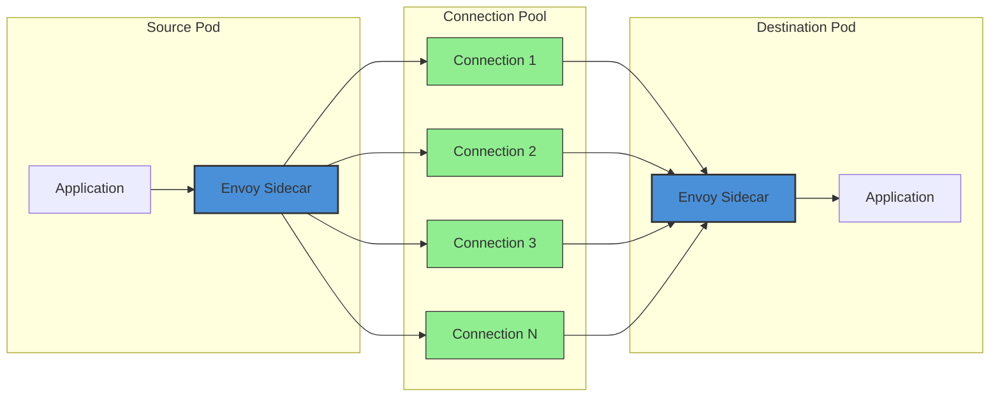
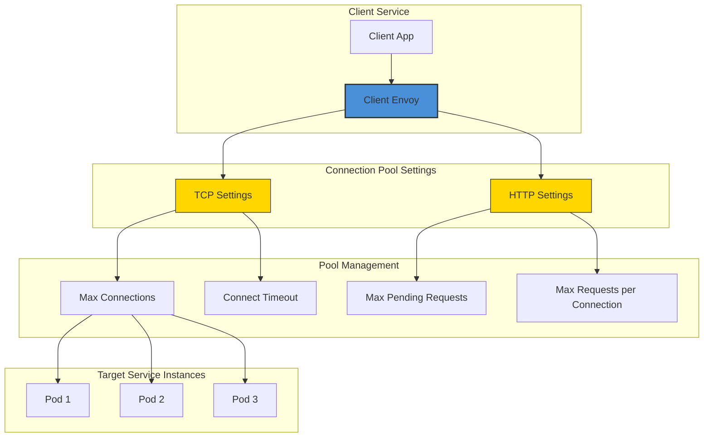
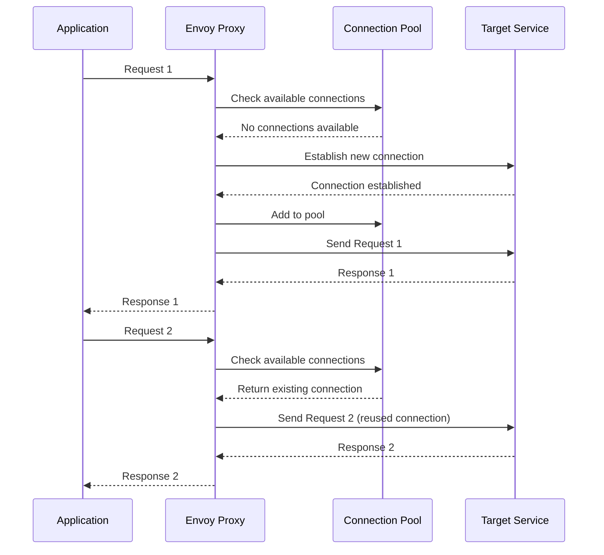
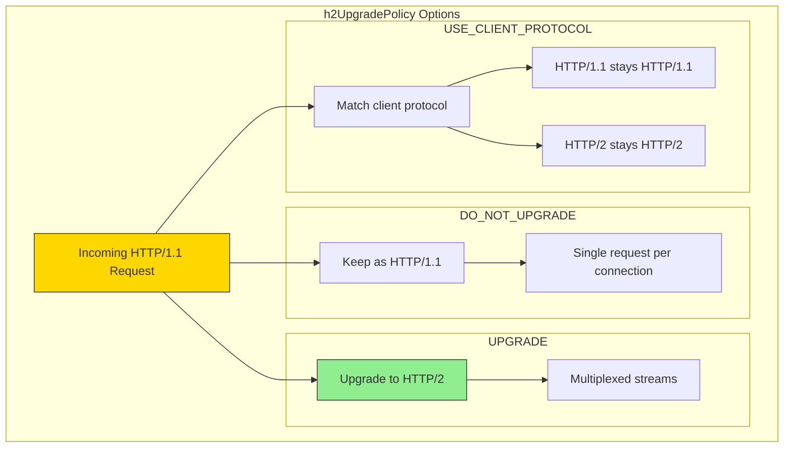
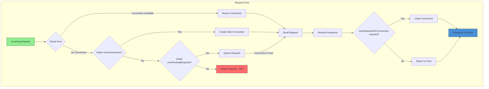

# How to Configure Connection Pooling in Istio

Author: [nawazdhandala](https://github.com/nawazdhandala)

Tags: Istio, Connection Pooling, Performance, Service Mesh, Kubernetes

Description: A guide to configuring HTTP and TCP connection pools in Istio for optimal performance.

---

Connection pooling is a critical performance optimization technique in microservices architectures. When services communicate frequently, creating new connections for each request introduces significant overhead. Istio's connection pooling capabilities allow you to manage and reuse connections efficiently, reducing latency and improving overall system performance.

In this comprehensive guide, we will explore how to configure connection pooling in Istio, covering both TCP and HTTP settings, advanced configurations, and best practices for production environments.

## Understanding Connection Pooling in Istio

Before diving into configuration, it is essential to understand how Istio manages connections through its sidecar proxies (Envoy).

### How Istio Manages Connections

The following diagram illustrates how Istio's Envoy sidecar manages connection pools between services:



When a service sends a request, Istio's Envoy proxy maintains a pool of connections to downstream services. These connections are reused across multiple requests, eliminating the overhead of establishing new connections for each call.

### Key Benefits of Connection Pooling

1. **Reduced Latency**: Eliminates TCP handshake overhead for subsequent requests
2. **Lower Resource Consumption**: Fewer socket file descriptors and memory usage
3. **Better Throughput**: More efficient use of network resources
4. **Circuit Breaking Integration**: Works seamlessly with Istio's circuit breaking features

## Connection Pool Architecture

The following diagram shows the complete architecture of connection pooling in Istio:



## Configuring TCP Connection Pooling

TCP connection pooling settings control the behavior of TCP connections at the transport layer. These settings apply to all protocols, including HTTP/1.1 and HTTP/2.

### Basic TCP Connection Pool Configuration

The following DestinationRule configures basic TCP connection pooling for a service. The maxConnections setting limits the total number of TCP connections to the destination, while connectTimeout specifies how long to wait for a connection to be established.

```yaml
# Basic TCP connection pool configuration
# This DestinationRule applies connection pooling settings to the payment service
apiVersion: networking.istio.io/v1beta1
kind: DestinationRule
metadata:
  name: payment-service-connection-pool
  namespace: default
spec:
  # Target the payment service for connection pooling
  host: payment-service.default.svc.cluster.local
  trafficPolicy:
    connectionPool:
      tcp:
        # Maximum number of TCP connections to the destination
        # This prevents overwhelming the destination with too many connections
        maxConnections: 100

        # Timeout for establishing a new TCP connection
        # Requests will fail fast if connection cannot be established in time
        connectTimeout: 30ms

        # TCP keepalive configuration to detect dead connections
        tcpKeepalive:
          # Time before sending first keepalive probe (in seconds)
          time: 7200s
          # Interval between keepalive probes
          interval: 75s
          # Number of unacknowledged probes before connection is dropped
          probes: 10
```

### Understanding TCP Settings

The following diagram illustrates the TCP connection lifecycle with pooling:



### TCP Connection Pool Parameters Explained

| Parameter | Description | Default | Recommended Range |
|-----------|-------------|---------|-------------------|
| `maxConnections` | Maximum TCP connections to destination | 2^32-1 | 50-1000 |
| `connectTimeout` | TCP connection timeout | 10s | 10ms-5s |
| `tcpKeepalive.time` | Idle time before first probe | OS default | 60s-7200s |
| `tcpKeepalive.interval` | Interval between probes | OS default | 10s-75s |
| `tcpKeepalive.probes` | Failed probes before disconnect | OS default | 3-10 |

## Configuring HTTP Connection Pooling

HTTP connection pooling settings provide fine-grained control over HTTP/1.1 and HTTP/2 connection behavior.

### Comprehensive HTTP Connection Pool Configuration

The following configuration demonstrates all available HTTP connection pooling options. Each setting is carefully chosen to balance performance and resource utilization.

```yaml
# Comprehensive HTTP connection pool configuration
# This configuration provides fine-grained control over HTTP connection behavior
apiVersion: networking.istio.io/v1beta1
kind: DestinationRule
metadata:
  name: api-gateway-http-pool
  namespace: default
spec:
  host: api-gateway.default.svc.cluster.local
  trafficPolicy:
    connectionPool:
      # TCP-level settings (these apply to HTTP as well)
      tcp:
        maxConnections: 200
        connectTimeout: 100ms

      # HTTP-specific connection pool settings
      http:
        # Maximum number of requests that can be pending while waiting
        # for a connection from the pool. If exceeded, requests are rejected.
        # This acts as a queue for incoming requests
        maxPendingRequests: 100

        # Maximum number of HTTP requests per connection before it's closed
        # Setting this helps distribute load and prevents connection affinity issues
        # For HTTP/1.1: requests are sequential on each connection
        # For HTTP/2: multiple streams share a single connection
        maxRequestsPerConnection: 10

        # Maximum number of active requests to the destination
        # This is the total across all connections (HTTP/2 specific)
        maxRetries: 3

        # Idle timeout for connections in the pool
        # Connections idle longer than this are closed
        idleTimeout: 60s

        # HTTP/2 upgrade policy configuration
        # Controls when HTTP/1.1 connections should upgrade to HTTP/2
        h2UpgradePolicy: UPGRADE

        # Use HTTP/1.1 for backend connections even if client uses HTTP/2
        # Useful when backend services don't support HTTP/2
        useClientProtocol: false
```

### h2UpgradePolicy Configuration

The h2UpgradePolicy setting controls whether connections should be upgraded from HTTP/1.1 to HTTP/2. This is particularly important for performance optimization.

The following diagram shows how h2UpgradePolicy affects connection handling:



### h2UpgradePolicy Options Explained

The following configuration shows all three h2UpgradePolicy options with detailed comments:

```yaml
# h2UpgradePolicy: DO_NOT_UPGRADE
# Use this when your backend service does not support HTTP/2
# or when you need strict HTTP/1.1 compatibility
apiVersion: networking.istio.io/v1beta1
kind: DestinationRule
metadata:
  name: legacy-service-no-upgrade
  namespace: default
spec:
  host: legacy-service.default.svc.cluster.local
  trafficPolicy:
    connectionPool:
      http:
        # Prevents HTTP/2 upgrade - all connections remain HTTP/1.1
        # Use for legacy services or when HTTP/2 causes issues
        h2UpgradePolicy: DO_NOT_UPGRADE
        maxPendingRequests: 50
        maxRequestsPerConnection: 1
---
# h2UpgradePolicy: UPGRADE
# Use this to enable HTTP/2 multiplexing for better performance
# Recommended for modern services that support HTTP/2
apiVersion: networking.istio.io/v1beta1
kind: DestinationRule
metadata:
  name: modern-service-upgrade
  namespace: default
spec:
  host: modern-service.default.svc.cluster.local
  trafficPolicy:
    connectionPool:
      http:
        # Upgrades HTTP/1.1 connections to HTTP/2 when possible
        # Enables multiplexing: multiple requests over single connection
        h2UpgradePolicy: UPGRADE
        maxPendingRequests: 200
        # With HTTP/2, this represents max streams per connection
        maxRequestsPerConnection: 100
---
# h2UpgradePolicy: USE_CLIENT_PROTOCOL (Default)
# Preserves the original client protocol
# Provides flexibility when mixed protocols are used
apiVersion: networking.istio.io/v1beta1
kind: DestinationRule
metadata:
  name: flexible-service
  namespace: default
spec:
  host: flexible-service.default.svc.cluster.local
  trafficPolicy:
    connectionPool:
      http:
        # Uses whatever protocol the client is using
        # If client sends HTTP/1.1, backend receives HTTP/1.1
        # If client sends HTTP/2, backend receives HTTP/2
        h2UpgradePolicy: USE_CLIENT_PROTOCOL
        maxPendingRequests: 100
```

## Combined TCP and HTTP Configuration

For production deployments, you typically configure both TCP and HTTP settings together. The following example shows a comprehensive configuration:

```yaml
# Production-ready connection pool configuration
# Combines TCP and HTTP settings for optimal performance
apiVersion: networking.istio.io/v1beta1
kind: DestinationRule
metadata:
  name: production-service-pool
  namespace: production
  labels:
    app: production-service
    version: v1
spec:
  host: production-service.production.svc.cluster.local

  trafficPolicy:
    connectionPool:
      # TCP Layer Configuration
      # These settings establish the foundation for all connections
      tcp:
        # Limit total connections to prevent resource exhaustion
        # Calculate based on: (expected RPS * avg latency) / requests per connection
        maxConnections: 500

        # Fast connection timeout for quick failure detection
        # Shorter timeout = faster failover to healthy instances
        connectTimeout: 50ms

        # Keepalive settings to detect and clean up dead connections
        tcpKeepalive:
          time: 300s      # Start probing after 5 minutes of idle
          interval: 30s    # Probe every 30 seconds
          probes: 5        # Close after 5 failed probes

      # HTTP Layer Configuration
      # Fine-tune HTTP request handling behavior
      http:
        # Queue size for pending requests when all connections are busy
        # Larger queue = more tolerance for bursts, but higher latency
        maxPendingRequests: 200

        # Limit requests per connection to distribute load
        # Lower values = better load distribution
        # Higher values = fewer connection establishments
        maxRequestsPerConnection: 50

        # Maximum retry attempts for failed requests
        maxRetries: 3

        # Close idle connections to free resources
        # Balance between connection reuse and resource consumption
        idleTimeout: 120s

        # Enable HTTP/2 upgrade for multiplexing benefits
        h2UpgradePolicy: UPGRADE

    # Combine with outlier detection for resilient connections
    outlierDetection:
      # Eject instances with too many errors
      consecutive5xxErrors: 5
      interval: 30s
      baseEjectionTime: 60s
      maxEjectionPercent: 50
```

## Per-Subset Connection Pooling

For services with multiple versions or subsets, you can configure different connection pool settings for each subset:

```yaml
# Per-subset connection pool configuration
# Different subsets can have different connection characteristics
apiVersion: networking.istio.io/v1beta1
kind: DestinationRule
metadata:
  name: versioned-service-pools
  namespace: default
spec:
  host: versioned-service.default.svc.cluster.local

  # Default traffic policy applies to all subsets unless overridden
  trafficPolicy:
    connectionPool:
      tcp:
        maxConnections: 100
      http:
        maxPendingRequests: 50
        h2UpgradePolicy: UPGRADE

  # Define subsets with specific connection pool configurations
  subsets:
    # Version 1: Legacy version with HTTP/1.1 only
    - name: v1
      labels:
        version: v1
      trafficPolicy:
        connectionPool:
          tcp:
            maxConnections: 50
            connectTimeout: 100ms
          http:
            # Legacy version doesn't support HTTP/2
            h2UpgradePolicy: DO_NOT_UPGRADE
            maxPendingRequests: 25
            # HTTP/1.1 typically uses 1 request per connection
            maxRequestsPerConnection: 1

    # Version 2: Modern version with HTTP/2 support
    - name: v2
      labels:
        version: v2
      trafficPolicy:
        connectionPool:
          tcp:
            maxConnections: 200
            connectTimeout: 30ms
          http:
            # Modern version fully supports HTTP/2
            h2UpgradePolicy: UPGRADE
            maxPendingRequests: 100
            # HTTP/2 can handle many concurrent streams
            maxRequestsPerConnection: 100

    # Canary version: Testing with conservative settings
    - name: canary
      labels:
        version: canary
      trafficPolicy:
        connectionPool:
          tcp:
            # Conservative connection limit for canary
            maxConnections: 20
          http:
            maxPendingRequests: 10
            h2UpgradePolicy: UPGRADE
```

## Connection Pool Flow Diagram

The following diagram illustrates the complete request flow through Istio's connection pool:



## Tuning Recommendations

### General Guidelines

The following table provides tuning recommendations based on service characteristics:

| Service Type | maxConnections | maxPendingRequests | maxRequestsPerConnection | h2UpgradePolicy |
|--------------|----------------|--------------------|--------------------------| ----------------|
| High-throughput API | 500-1000 | 200-500 | 50-100 | UPGRADE |
| Database Proxy | 100-200 | 50-100 | 10-20 | DO_NOT_UPGRADE |
| Legacy HTTP/1.1 | 50-100 | 25-50 | 1-5 | DO_NOT_UPGRADE |
| gRPC Service | 100-200 | 100-200 | 100-1000 | UPGRADE |
| WebSocket Service | 1000-5000 | 100 | 1 | DO_NOT_UPGRADE |

### Calculating Optimal Settings

The following example shows how to calculate optimal connection pool settings based on your service requirements:

```yaml
# Calculation-based connection pool configuration
#
# Assumptions for this example:
# - Expected RPS: 10,000 requests per second
# - Average latency: 50ms (0.05 seconds)
# - Number of backend pods: 10
# - Target connections per pod: 100
#
# Calculations:
# - Concurrent requests = RPS * avg_latency = 10,000 * 0.05 = 500
# - Connections needed = concurrent_requests / requests_per_connection
# - If requests_per_connection = 10, then connections = 500 / 10 = 50
# - Add 2x buffer for burst handling: 50 * 2 = 100 per pod
# - Total maxConnections = connections_per_pod * num_pods = 100 * 10 = 1000

apiVersion: networking.istio.io/v1beta1
kind: DestinationRule
metadata:
  name: calculated-pool-settings
  namespace: default
spec:
  host: high-traffic-service.default.svc.cluster.local
  trafficPolicy:
    connectionPool:
      tcp:
        # Total connections across all backend pods
        # This is distributed across all healthy endpoints
        maxConnections: 1000
        connectTimeout: 30ms
      http:
        # Queue size should handle burst traffic
        # Set to 20% of maxConnections for typical burst handling
        maxPendingRequests: 200

        # Balance between connection overhead and load distribution
        # Lower values help prevent hot spots
        maxRequestsPerConnection: 10

        # Use HTTP/2 for better multiplexing
        h2UpgradePolicy: UPGRADE

        # Clean up idle connections after 2 minutes
        idleTimeout: 120s
```

### Environment-Specific Configurations

The following configurations show how to tune connection pools for different environments:

```yaml
# Development environment: Conservative settings
# Focus on debugging and observability over performance
apiVersion: networking.istio.io/v1beta1
kind: DestinationRule
metadata:
  name: dev-connection-pool
  namespace: development
spec:
  host: "*.development.svc.cluster.local"
  trafficPolicy:
    connectionPool:
      tcp:
        # Low limits to catch issues early
        maxConnections: 10
        connectTimeout: 1s
      http:
        maxPendingRequests: 5
        maxRequestsPerConnection: 5
        h2UpgradePolicy: USE_CLIENT_PROTOCOL
        idleTimeout: 30s
---
# Staging environment: Moderate settings
# Balance between production-like behavior and resource efficiency
apiVersion: networking.istio.io/v1beta1
kind: DestinationRule
metadata:
  name: staging-connection-pool
  namespace: staging
spec:
  host: "*.staging.svc.cluster.local"
  trafficPolicy:
    connectionPool:
      tcp:
        maxConnections: 100
        connectTimeout: 100ms
      http:
        maxPendingRequests: 50
        maxRequestsPerConnection: 25
        h2UpgradePolicy: UPGRADE
        idleTimeout: 60s
---
# Production environment: Optimized for performance
# Maximum throughput with resource protection
apiVersion: networking.istio.io/v1beta1
kind: DestinationRule
metadata:
  name: production-connection-pool
  namespace: production
spec:
  host: "*.production.svc.cluster.local"
  trafficPolicy:
    connectionPool:
      tcp:
        maxConnections: 500
        connectTimeout: 30ms
        tcpKeepalive:
          time: 300s
          interval: 30s
          probes: 5
      http:
        maxPendingRequests: 200
        maxRequestsPerConnection: 50
        h2UpgradePolicy: UPGRADE
        idleTimeout: 120s
```

## Monitoring Connection Pools

Istio exposes metrics for monitoring connection pool behavior. The following Prometheus queries help monitor your connection pools:

```yaml
# ServiceMonitor for connection pool metrics
# Deploy this to enable Prometheus scraping of Envoy metrics
apiVersion: monitoring.coreos.com/v1
kind: ServiceMonitor
metadata:
  name: istio-connection-pool-metrics
  namespace: istio-system
spec:
  selector:
    matchLabels:
      app: istio-proxy
  endpoints:
    - port: http-envoy-prom
      path: /stats/prometheus
```

Key metrics to monitor:

| Metric | Description | Alert Threshold |
|--------|-------------|-----------------|
| `envoy_cluster_upstream_cx_active` | Active connections | > 80% of maxConnections |
| `envoy_cluster_upstream_cx_overflow` | Connections rejected due to limit | > 0 |
| `envoy_cluster_upstream_rq_pending_overflow` | Requests rejected due to queue limit | > 0 |
| `envoy_cluster_upstream_cx_connect_timeout` | Connection timeout count | > 1% of attempts |

## Troubleshooting Common Issues

### Issue 1: 503 Errors Due to Connection Limits

If you see 503 errors with "upstream connect error or disconnect/reset before headers", your connection pool may be exhausted:

```yaml
# Solution: Increase connection limits
# Apply when seeing frequent 503 errors during high traffic
apiVersion: networking.istio.io/v1beta1
kind: DestinationRule
metadata:
  name: increased-pool-limits
  namespace: default
spec:
  host: overloaded-service.default.svc.cluster.local
  trafficPolicy:
    connectionPool:
      tcp:
        # Increase maxConnections if you see cx_overflow metrics
        maxConnections: 1000
      http:
        # Increase queue size to handle burst traffic
        maxPendingRequests: 500
        # Increase to allow more requests per connection
        maxRequestsPerConnection: 100
```

### Issue 2: High Latency Due to Connection Establishment

If latency spikes are caused by new connection establishment:

```yaml
# Solution: Increase connection reuse and add preconnect
# This keeps more connections alive and ready
apiVersion: networking.istio.io/v1beta1
kind: DestinationRule
metadata:
  name: improved-connection-reuse
  namespace: default
spec:
  host: latency-sensitive-service.default.svc.cluster.local
  trafficPolicy:
    connectionPool:
      tcp:
        maxConnections: 200
        # Shorter timeout for faster failover
        connectTimeout: 20ms
      http:
        # Higher requests per connection = fewer new connections
        maxRequestsPerConnection: 200
        # Longer idle timeout keeps connections alive
        idleTimeout: 300s
        # Use HTTP/2 for connection multiplexing
        h2UpgradePolicy: UPGRADE
```

### Issue 3: Memory Pressure from Too Many Connections

If your pods are experiencing memory pressure from connection overhead:

```yaml
# Solution: Reduce connection limits and increase connection reuse
# Trade off some burst capacity for lower memory usage
apiVersion: networking.istio.io/v1beta1
kind: DestinationRule
metadata:
  name: memory-optimized-pool
  namespace: default
spec:
  host: memory-constrained-service.default.svc.cluster.local
  trafficPolicy:
    connectionPool:
      tcp:
        # Lower connection limit to reduce memory usage
        # Each connection uses ~10-50KB of memory
        maxConnections: 50
      http:
        # Smaller queue to limit memory for pending requests
        maxPendingRequests: 25
        # Higher reuse to maintain throughput with fewer connections
        maxRequestsPerConnection: 100
        # Shorter idle timeout to clean up unused connections
        idleTimeout: 30s
```

## Best Practices Summary

1. **Start Conservative**: Begin with lower limits and increase based on observed behavior
2. **Monitor Actively**: Set up alerts for connection pool overflow metrics
3. **Use HTTP/2**: Enable h2UpgradePolicy: UPGRADE for services that support it
4. **Consider Subsets**: Configure different pools for different service versions
5. **Test Under Load**: Validate settings with load testing before production
6. **Balance Resources**: Consider memory and CPU impact of connection pools
7. **Document Settings**: Include calculation rationale in configuration comments

## Conclusion

Connection pooling in Istio is a powerful feature that significantly improves service mesh performance. By properly configuring TCP and HTTP connection settings, you can reduce latency, optimize resource utilization, and build more resilient microservices architectures.

Key takeaways:
- Use `maxConnections` to limit TCP connections and prevent resource exhaustion
- Configure `maxPendingRequests` to handle traffic bursts gracefully
- Enable `h2UpgradePolicy: UPGRADE` for HTTP/2 multiplexing benefits
- Combine connection pooling with outlier detection for robust failover
- Monitor connection pool metrics to identify and resolve bottlenecks

Start with the recommended settings in this guide and adjust based on your specific workload characteristics and performance requirements.
