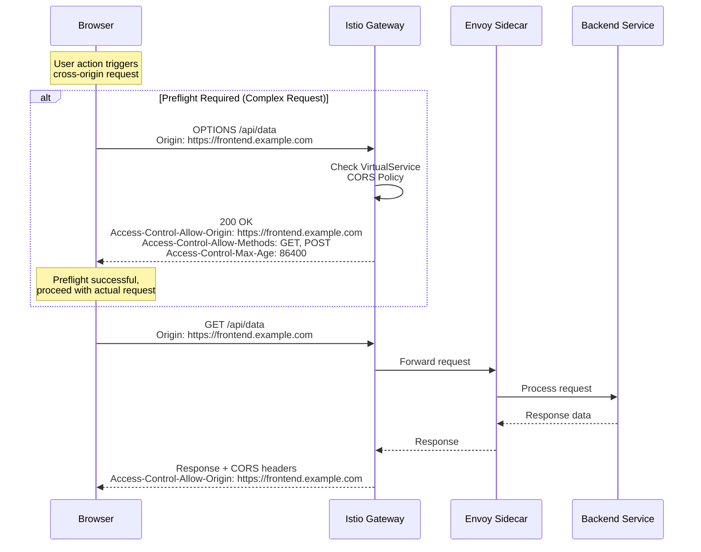
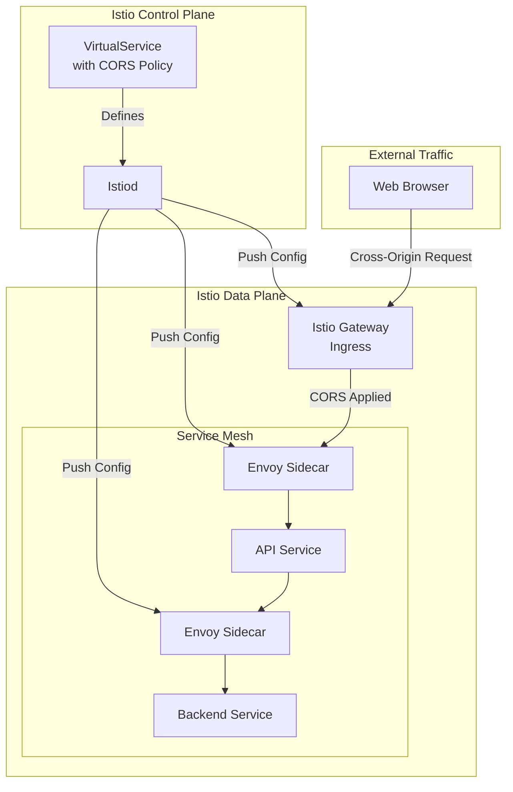
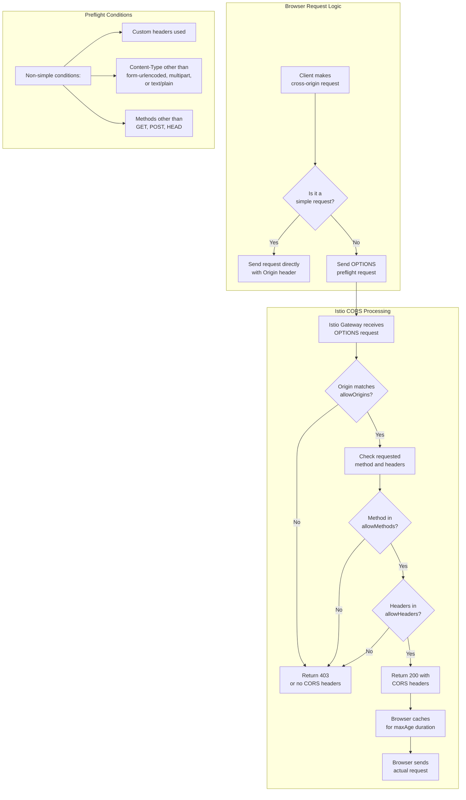
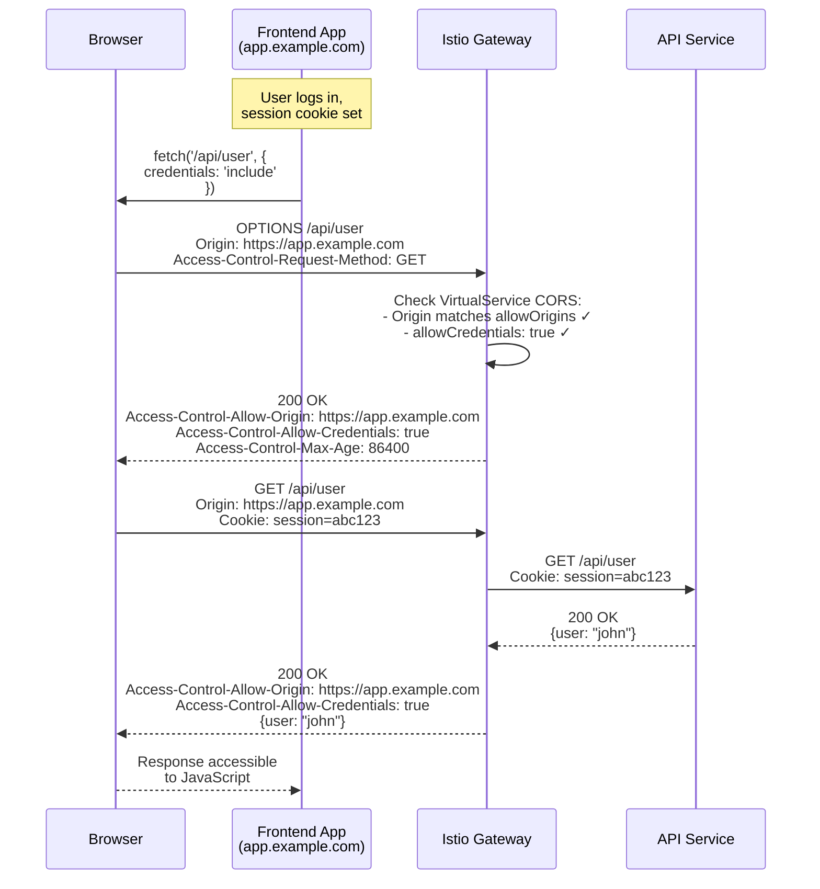
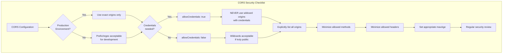

# How to Configure CORS Policies in Istio

Author: [nawazdhandala](https://github.com/nawazdhandala)

Tags: Istio, CORS, Security, HTTP, Service Mesh, Web Development

Description: A guide to configuring Cross-Origin Resource Sharing (CORS) policies with Istio.

---

## Introduction

Cross-Origin Resource Sharing (CORS) is a critical security mechanism that controls how web browsers handle requests made from one origin (domain) to another. In a microservices architecture running on Istio, managing CORS policies centrally through the service mesh provides significant advantages over implementing CORS in each individual service.

This comprehensive guide will walk you through configuring CORS policies in Istio, from basic concepts to advanced configurations, including preflight handling, security best practices, and troubleshooting common issues.

## Understanding CORS in a Service Mesh Context

Before diving into Istio-specific configurations, let's understand how CORS works and why managing it at the mesh level makes sense.

### What is CORS?

CORS is a browser security feature that restricts web pages from making requests to a different domain than the one that served the original page. When a browser detects a cross-origin request, it sends specific headers to determine if the request should be allowed.

### CORS Request Flow

The following diagram illustrates how CORS requests flow through an Istio service mesh:



### Why Configure CORS in Istio?

Managing CORS at the Istio level offers several benefits:

1. **Centralized Configuration**: Define CORS policies once instead of in every service
2. **Consistency**: Ensure uniform CORS behavior across all services
3. **Separation of Concerns**: Keep security policies separate from business logic
4. **Dynamic Updates**: Change CORS policies without redeploying applications
5. **Observability**: Monitor and trace CORS-related issues through Istio's telemetry

## CORS Policy Architecture in Istio

The following diagram shows how CORS policies fit into Istio's architecture:



## Prerequisites

Before configuring CORS policies, ensure you have:

- A running Kubernetes cluster with Istio installed (version 1.18+)
- `kubectl` configured to access your cluster
- `istioctl` installed for debugging
- Basic understanding of Istio VirtualService and Gateway resources

## Basic CORS Configuration in VirtualService

Istio handles CORS through the VirtualService resource. The `corsPolicy` field allows you to define comprehensive CORS rules.

### Simple CORS Policy

This basic configuration allows requests from a specific origin with common HTTP methods:

```yaml
# Basic VirtualService with CORS policy
# This configuration enables cross-origin requests from a specific frontend domain
# to access the API service through the Istio gateway
apiVersion: networking.istio.io/v1beta1
kind: VirtualService
metadata:
  name: api-virtualservice
  namespace: production
spec:
  # Specify the hosts this VirtualService applies to
  # This should match your service's external hostname
  hosts:
    - "api.example.com"

  # Associate this VirtualService with an Istio Gateway
  # The gateway handles incoming traffic from outside the mesh
  gateways:
    - api-gateway

  http:
    - match:
        # Match all requests to the /api path prefix
        - uri:
            prefix: /api

      # CORS policy configuration
      # These settings determine how cross-origin requests are handled
      corsPolicy:
        # allowOrigins: List of origins permitted to make cross-origin requests
        # Using 'exact' means only this specific origin is allowed
        allowOrigins:
          - exact: "https://frontend.example.com"

        # allowMethods: HTTP methods that can be used in cross-origin requests
        # Only allow methods your API actually needs
        allowMethods:
          - GET
          - POST
          - PUT
          - DELETE

        # allowHeaders: Request headers that can be used in cross-origin requests
        # These are headers the client is allowed to send
        allowHeaders:
          - content-type
          - authorization
          - x-request-id

        # maxAge: How long (in seconds) browsers should cache preflight responses
        # Setting this reduces the number of preflight requests
        maxAge: "24h"

      # Route configuration for the actual request
      route:
        - destination:
            host: api-service
            port:
              number: 8080
```

### Understanding CORS Policy Fields

Let's examine each field in detail:

| Field | Description | Example Values |
|-------|-------------|----------------|
| `allowOrigins` | Origins allowed to make requests | `exact: "https://app.com"`, `prefix: "https://"`, `regex: ".*\\.example\\.com"` |
| `allowMethods` | Permitted HTTP methods | `GET`, `POST`, `PUT`, `DELETE`, `PATCH`, `OPTIONS` |
| `allowHeaders` | Headers clients can send | `content-type`, `authorization`, `x-custom-header` |
| `exposeHeaders` | Headers clients can read from response | `x-request-id`, `x-correlation-id` |
| `maxAge` | Preflight cache duration | `"24h"`, `"3600s"`, `"1h30m"` |
| `allowCredentials` | Allow cookies/auth headers | `true`, `false` |

## Configuring Allowed Origins

The `allowOrigins` field supports three matching strategies, giving you flexibility in how you specify allowed origins.

### Exact Origin Matching

Use exact matching when you know the specific origins that should be allowed:

```yaml
# Exact origin matching configuration
# Best for production environments where you know all allowed origins
# Provides the most secure configuration by allowing only specific domains
apiVersion: networking.istio.io/v1beta1
kind: VirtualService
metadata:
  name: api-cors-exact
  namespace: production
spec:
  hosts:
    - "api.example.com"
  gateways:
    - api-gateway
  http:
    - corsPolicy:
        # allowOrigins with exact matching
        # Each origin must be specified precisely, including protocol and port
        allowOrigins:
          # Production frontend - the main application domain
          - exact: "https://app.example.com"
          # Admin dashboard - internal administration interface
          - exact: "https://admin.example.com"
          # Mobile web app - separate subdomain for mobile users
          - exact: "https://mobile.example.com"
        allowMethods:
          - GET
          - POST
        allowHeaders:
          - content-type
        maxAge: "24h"
      route:
        - destination:
            host: api-service
            port:
              number: 8080
```

### Prefix-Based Origin Matching

Prefix matching allows any origin starting with a specific string:

```yaml
# Prefix-based origin matching configuration
# Useful when you have multiple subdomains that need access
# Less restrictive than exact matching, use with caution
apiVersion: networking.istio.io/v1beta1
kind: VirtualService
metadata:
  name: api-cors-prefix
  namespace: staging
spec:
  hosts:
    - "api.staging.example.com"
  gateways:
    - staging-gateway
  http:
    - corsPolicy:
        # allowOrigins with prefix matching
        # Any origin starting with this prefix will be allowed
        allowOrigins:
          # Allow all HTTPS subdomains of example.com
          # This matches: https://app.example.com, https://test.example.com, etc.
          - prefix: "https://"
        allowMethods:
          - GET
          - POST
          - PUT
        allowHeaders:
          - content-type
          - authorization
        maxAge: "1h"
      route:
        - destination:
            host: api-service
            port:
              number: 8080
```

### Regex-Based Origin Matching

For complex matching patterns, use regular expressions:

```yaml
# Regex-based origin matching configuration
# Provides flexible pattern matching for complex origin requirements
# Use when you need to match dynamic subdomains or multiple patterns
apiVersion: networking.istio.io/v1beta1
kind: VirtualService
metadata:
  name: api-cors-regex
  namespace: production
spec:
  hosts:
    - "api.example.com"
  gateways:
    - api-gateway
  http:
    - corsPolicy:
        # allowOrigins with regex matching
        # Regular expressions provide the most flexibility
        allowOrigins:
          # Match any subdomain of example.com over HTTPS
          # Pattern breakdown:
          # - https:// - must use HTTPS protocol
          # - [a-zA-Z0-9-]+ - one or more alphanumeric characters or hyphens
          # - \.example\.com - literal ".example.com" (dots escaped)
          - regex: "https://[a-zA-Z0-9-]+\\.example\\.com"

          # Match tenant-specific subdomains
          # This allows URLs like: https://tenant1.app.example.com
          - regex: "https://[a-zA-Z0-9]+\\.app\\.example\\.com"
        allowMethods:
          - GET
          - POST
          - PUT
          - DELETE
        allowHeaders:
          - content-type
          - authorization
          - x-tenant-id
        maxAge: "12h"
      route:
        - destination:
            host: api-service
            port:
              number: 8080
```

## Configuring Allowed Methods and Headers

### Comprehensive Method Configuration

Configure allowed methods based on your API's requirements:

```yaml
# Complete HTTP methods configuration
# Configure methods based on the operations your API supports
# Avoid allowing methods your API doesn't actually use
apiVersion: networking.istio.io/v1beta1
kind: VirtualService
metadata:
  name: api-cors-methods
  namespace: production
spec:
  hosts:
    - "api.example.com"
  gateways:
    - api-gateway
  http:
    # Route for read-only endpoints
    # Only allow GET method for public data endpoints
    - match:
        - uri:
            prefix: /api/public
      corsPolicy:
        allowOrigins:
          - exact: "https://app.example.com"
        # For read-only endpoints, only allow GET
        # This follows the principle of least privilege
        allowMethods:
          - GET
        allowHeaders:
          - content-type
        maxAge: "24h"
      route:
        - destination:
            host: public-api-service
            port:
              number: 8080

    # Route for full CRUD endpoints
    # Allow all standard REST methods for authenticated API access
    - match:
        - uri:
            prefix: /api/resources
      corsPolicy:
        allowOrigins:
          - exact: "https://app.example.com"
        # Full REST API method support
        # GET - Read resources
        # POST - Create new resources
        # PUT - Full update of resources
        # PATCH - Partial update of resources
        # DELETE - Remove resources
        # OPTIONS - Handled automatically for preflight
        allowMethods:
          - GET
          - POST
          - PUT
          - PATCH
          - DELETE
        allowHeaders:
          - content-type
          - authorization
        maxAge: "24h"
      route:
        - destination:
            host: crud-api-service
            port:
              number: 8080
```

### Configuring Custom Headers

Allow and expose custom headers for your application's needs:

```yaml
# Custom headers configuration
# Configure both request headers (allowHeaders) and response headers (exposeHeaders)
# This is essential for APIs that use custom headers for authentication or tracking
apiVersion: networking.istio.io/v1beta1
kind: VirtualService
metadata:
  name: api-cors-headers
  namespace: production
spec:
  hosts:
    - "api.example.com"
  gateways:
    - api-gateway
  http:
    - corsPolicy:
        allowOrigins:
          - exact: "https://app.example.com"
        allowMethods:
          - GET
          - POST
          - PUT
          - DELETE

        # allowHeaders: Headers that clients are allowed to send
        # These are checked during preflight requests
        allowHeaders:
          # Standard content type header for JSON/XML payloads
          - content-type
          # Accept header for content negotiation
          - accept
          # Authorization header for Bearer tokens, API keys, etc.
          - authorization
          # Distributed tracing headers for request correlation
          - x-request-id
          - x-correlation-id
          - x-trace-id
          # Custom application headers
          - x-api-version
          - x-client-version
          - x-tenant-id
          # OpenTelemetry propagation headers
          - traceparent
          - tracestate

        # exposeHeaders: Response headers that browsers can access
        # By default, browsers only expose simple headers (Cache-Control, etc.)
        # Custom headers must be explicitly listed here
        exposeHeaders:
          # Request tracking headers for debugging
          - x-request-id
          - x-correlation-id
          # Pagination headers for list endpoints
          - x-total-count
          - x-page-count
          # Rate limiting information
          - x-ratelimit-limit
          - x-ratelimit-remaining
          - x-ratelimit-reset
          # Custom response metadata
          - x-response-time
          - x-server-region

        maxAge: "24h"
      route:
        - destination:
            host: api-service
            port:
              number: 8080
```

## Preflight Request Handling

Preflight requests are OPTIONS requests sent by browsers before actual cross-origin requests for "non-simple" requests. Istio handles these automatically when CORS is configured.

### Understanding Preflight Requests

The following diagram illustrates the preflight request flow:



### Optimizing Preflight Caching

Configure `maxAge` to reduce preflight request overhead:

```yaml
# Preflight caching optimization
# Properly configured maxAge reduces the number of OPTIONS requests
# This improves application performance and reduces server load
apiVersion: networking.istio.io/v1beta1
kind: VirtualService
metadata:
  name: api-cors-preflight
  namespace: production
spec:
  hosts:
    - "api.example.com"
  gateways:
    - api-gateway
  http:
    - corsPolicy:
        allowOrigins:
          - exact: "https://app.example.com"
        allowMethods:
          - GET
          - POST
          - PUT
          - DELETE
        allowHeaders:
          - content-type
          - authorization

        # maxAge: Duration browsers should cache preflight responses
        #
        # Considerations for setting maxAge:
        # - Longer values (24h) reduce preflight requests but delay policy updates
        # - Shorter values (1h) allow faster policy propagation but increase load
        # - Most browsers cap maxAge at 24 hours regardless of value set
        #
        # Recommended values:
        # - Production (stable policies): "24h" or "86400s"
        # - Staging (frequent changes): "1h" or "3600s"
        # - Development (testing): "60s" or "1m"
        maxAge: "86400s"  # 24 hours - maximum effective cache time

        # Note: Setting maxAge to "0" disables caching, causing a preflight
        # for every non-simple request. Only use for debugging.
      route:
        - destination:
            host: api-service
            port:
              number: 8080
```

## Handling Credentials (Cookies and Authorization)

When your API needs to accept credentials (cookies, authorization headers, or TLS client certificates), you must configure `allowCredentials`:

```yaml
# Credentials support configuration
# Enable this when your frontend needs to send cookies or auth tokens
# IMPORTANT: allowCredentials has specific security implications
apiVersion: networking.istio.io/v1beta1
kind: VirtualService
metadata:
  name: api-cors-credentials
  namespace: production
spec:
  hosts:
    - "api.example.com"
  gateways:
    - api-gateway
  http:
    - corsPolicy:
        # CRITICAL: When allowCredentials is true, you CANNOT use wildcards
        # You must specify exact origins - this is a browser security requirement
        allowOrigins:
          - exact: "https://app.example.com"
          - exact: "https://admin.example.com"

        allowMethods:
          - GET
          - POST
          - PUT
          - DELETE

        allowHeaders:
          - content-type
          - authorization
          - x-csrf-token

        # exposeHeaders allows the browser to read these response headers
        # when credentials mode is enabled
        exposeHeaders:
          - x-request-id
          - set-cookie

        # allowCredentials: Enable sending cookies and auth headers
        #
        # When true:
        # 1. Browser includes credentials in cross-origin requests
        # 2. Response must include: Access-Control-Allow-Credentials: true
        # 3. Access-Control-Allow-Origin CANNOT be "*" (must be specific)
        # 4. JavaScript can access response (if other checks pass)
        #
        # Security considerations:
        # - Only enable if your API genuinely needs credentials
        # - Ensure your origins list is strictly controlled
        # - Consider using token-based auth instead of cookies for APIs
        allowCredentials: true

        maxAge: "24h"
      route:
        - destination:
            host: api-service
            port:
              number: 8080
```

### Credentials Flow



## Environment-Specific Configurations

### Development Environment

Relaxed CORS for local development:

```yaml
# Development environment CORS configuration
# More permissive settings for local development and testing
# WARNING: Never use these settings in production
apiVersion: networking.istio.io/v1beta1
kind: VirtualService
metadata:
  name: api-cors-development
  namespace: development
  labels:
    environment: development
spec:
  hosts:
    - "api.dev.example.com"
  gateways:
    - development-gateway
  http:
    - corsPolicy:
        # Development origins - include localhost variations
        # Cover common development server ports
        allowOrigins:
          # Webpack dev server default port
          - exact: "http://localhost:3000"
          # Vite default port
          - exact: "http://localhost:5173"
          # Create React App alternative port
          - exact: "http://localhost:3001"
          # Generic localhost for flexibility
          - prefix: "http://localhost:"
          # Some developers use 127.0.0.1 instead of localhost
          - prefix: "http://127.0.0.1:"
          # Development subdomain for deployed dev environments
          - regex: "https://[a-zA-Z0-9-]+\\.dev\\.example\\.com"

        # Allow all methods for development flexibility
        allowMethods:
          - GET
          - POST
          - PUT
          - PATCH
          - DELETE
          - OPTIONS

        # Allow common development headers
        allowHeaders:
          - "*"  # Wildcard allowed in development

        exposeHeaders:
          - "*"

        # Short cache time for rapid iteration
        # Changes to CORS policy are reflected quickly
        maxAge: "60s"

        # Allow credentials for testing auth flows
        allowCredentials: true
      route:
        - destination:
            host: api-service
            port:
              number: 8080
```

### Production Environment

Strict CORS for production:

```yaml
# Production environment CORS configuration
# Strict settings following security best practices
# All origins must be explicitly whitelisted
apiVersion: networking.istio.io/v1beta1
kind: VirtualService
metadata:
  name: api-cors-production
  namespace: production
  labels:
    environment: production
spec:
  hosts:
    - "api.example.com"
  gateways:
    - production-gateway
  http:
    - corsPolicy:
        # Production origins - explicitly listed, no wildcards
        # Each origin should be verified and documented
        allowOrigins:
          # Main web application
          - exact: "https://app.example.com"
          # Admin dashboard (restricted access)
          - exact: "https://admin.example.com"
          # Mobile web application
          - exact: "https://m.example.com"
          # Partner integration (if applicable)
          # - exact: "https://partner.trusted-domain.com"

        # Only allow methods the API actually uses
        # Principle of least privilege
        allowMethods:
          - GET
          - POST
          - PUT
          - DELETE

        # Explicitly list allowed headers
        # Never use wildcards in production
        allowHeaders:
          - content-type
          - authorization
          - x-request-id
          - x-csrf-token

        # Only expose headers the frontend needs
        exposeHeaders:
          - x-request-id
          - x-ratelimit-remaining

        # Long cache time for performance
        # Policy changes take up to 24h to propagate
        maxAge: "86400s"

        # Enable credentials only if needed
        allowCredentials: true
      route:
        - destination:
            host: api-service
            port:
              number: 8080
```

## Multiple CORS Policies for Different Paths

You can configure different CORS policies for different API paths:

```yaml
# Path-based CORS configuration
# Different endpoints may have different security requirements
# This configuration applies appropriate policies to each path
apiVersion: networking.istio.io/v1beta1
kind: VirtualService
metadata:
  name: api-cors-multi-path
  namespace: production
spec:
  hosts:
    - "api.example.com"
  gateways:
    - api-gateway
  http:
    # Public API - accessible from any origin (read-only)
    # Use case: Public data endpoints, documentation, health checks
    - match:
        - uri:
            prefix: /api/public
      corsPolicy:
        # Allow any HTTPS origin for public endpoints
        allowOrigins:
          - regex: "https://.*"
        # Read-only access
        allowMethods:
          - GET
          - HEAD
        allowHeaders:
          - content-type
          - accept
        maxAge: "24h"
        # No credentials for public endpoints
        allowCredentials: false
      route:
        - destination:
            host: public-api
            port:
              number: 8080

    # Authenticated API - restricted origins with credentials
    # Use case: User-specific data, authenticated operations
    - match:
        - uri:
            prefix: /api/v1
      corsPolicy:
        # Only first-party applications
        allowOrigins:
          - exact: "https://app.example.com"
          - exact: "https://admin.example.com"
        allowMethods:
          - GET
          - POST
          - PUT
          - DELETE
        allowHeaders:
          - content-type
          - authorization
          - x-csrf-token
        exposeHeaders:
          - x-request-id
          - x-ratelimit-remaining
        maxAge: "24h"
        allowCredentials: true
      route:
        - destination:
            host: authenticated-api
            port:
              number: 8080

    # Partner API - specific partner origins
    # Use case: Third-party integrations with trusted partners
    - match:
        - uri:
            prefix: /api/partner
      corsPolicy:
        # Only verified partner domains
        allowOrigins:
          - exact: "https://integration.partner1.com"
          - exact: "https://app.partner2.com"
        allowMethods:
          - GET
          - POST
        allowHeaders:
          - content-type
          - authorization
          - x-partner-key
        exposeHeaders:
          - x-request-id
        maxAge: "12h"
        allowCredentials: false  # Partners use API keys, not cookies
      route:
        - destination:
            host: partner-api
            port:
              number: 8080

    # Webhook endpoints - very restrictive
    # Use case: Incoming webhooks from external services
    - match:
        - uri:
            prefix: /api/webhooks
      corsPolicy:
        # Webhooks typically don't need CORS (server-to-server)
        # But we configure it restrictively just in case
        allowOrigins:
          - exact: "https://webhook.stripe.com"
          - exact: "https://api.github.com"
        allowMethods:
          - POST
        allowHeaders:
          - content-type
          - x-webhook-signature
        maxAge: "1h"
      route:
        - destination:
            host: webhook-handler
            port:
              number: 8080
```

## Security Considerations

### CORS Security Best Practices

Follow these security guidelines when configuring CORS:



### Security Anti-Patterns to Avoid

```yaml
# ANTI-PATTERNS - DO NOT USE IN PRODUCTION
# This file shows common mistakes for educational purposes
# These configurations create security vulnerabilities

# Anti-pattern 1: Wildcard origin with credentials
# This is BLOCKED by browsers but indicates misconfiguration
# corsPolicy:
#   allowOrigins:
#     - exact: "*"  # NEVER do this with credentials
#   allowCredentials: true  # This combination is forbidden

# Anti-pattern 2: Overly permissive regex
# corsPolicy:
#   allowOrigins:
#     - regex: ".*"  # Matches ANY origin - extremely dangerous

# Anti-pattern 3: Reflecting the Origin header
# Some implementations echo back the Origin header
# This defeats the purpose of CORS entirely
# Istio doesn't do this, but custom code might

# Anti-pattern 4: Allowing all headers
# corsPolicy:
#   allowHeaders:
#     - "*"  # Avoid in production - be explicit

# Anti-pattern 5: Exposing sensitive headers
# corsPolicy:
#   exposeHeaders:
#     - set-cookie      # Sensitive
#     - authorization   # Sensitive
#     - x-api-secret    # Sensitive
---
# CORRECT APPROACH - Production-safe configuration
apiVersion: networking.istio.io/v1beta1
kind: VirtualService
metadata:
  name: api-cors-secure
  namespace: production
spec:
  hosts:
    - "api.example.com"
  gateways:
    - api-gateway
  http:
    - corsPolicy:
        # Explicit origins only
        allowOrigins:
          - exact: "https://app.example.com"
        # Minimum required methods
        allowMethods:
          - GET
          - POST
        # Explicit headers only
        allowHeaders:
          - content-type
          - authorization
        # Only expose safe headers
        exposeHeaders:
          - x-request-id
        maxAge: "24h"
        allowCredentials: true
      route:
        - destination:
            host: api-service
            port:
              number: 8080
```

### Header Security Validation

Combine CORS with other security headers using Istio's header manipulation:

```yaml
# Comprehensive security headers configuration
# Combines CORS with other essential security headers
# Defense in depth approach
apiVersion: networking.istio.io/v1beta1
kind: VirtualService
metadata:
  name: api-cors-security-headers
  namespace: production
spec:
  hosts:
    - "api.example.com"
  gateways:
    - api-gateway
  http:
    - corsPolicy:
        allowOrigins:
          - exact: "https://app.example.com"
        allowMethods:
          - GET
          - POST
          - PUT
          - DELETE
        allowHeaders:
          - content-type
          - authorization
        exposeHeaders:
          - x-request-id
        maxAge: "24h"
        allowCredentials: true

      # Additional security headers added to all responses
      headers:
        response:
          set:
            # Prevent MIME type sniffing
            x-content-type-options: "nosniff"

            # Control iframe embedding
            x-frame-options: "DENY"

            # Enable XSS filter (legacy browsers)
            x-xss-protection: "1; mode=block"

            # Control referrer information
            referrer-policy: "strict-origin-when-cross-origin"

            # Content Security Policy for API responses
            content-security-policy: "default-src 'none'; frame-ancestors 'none'"

            # Strict Transport Security
            # Forces HTTPS for specified duration
            strict-transport-security: "max-age=31536000; includeSubDomains"

      route:
        - destination:
            host: api-service
            port:
              number: 8080
```

## Complete Example: Full Stack CORS Configuration

Here's a complete example showing Gateway, VirtualService, and DestinationRule working together:

```yaml
# Complete Istio CORS configuration example
# This shows all components working together for a production API

---
# Gateway configuration
# Handles incoming traffic from outside the mesh
apiVersion: networking.istio.io/v1beta1
kind: Gateway
metadata:
  name: api-gateway
  namespace: production
spec:
  selector:
    # This selector matches the Istio ingress gateway pods
    istio: ingressgateway
  servers:
    - port:
        number: 443
        name: https
        protocol: HTTPS
      tls:
        # Use TLS certificates from Kubernetes secret
        mode: SIMPLE
        credentialName: api-tls-secret
      hosts:
        - "api.example.com"

---
# VirtualService with comprehensive CORS configuration
apiVersion: networking.istio.io/v1beta1
kind: VirtualService
metadata:
  name: api-virtualservice
  namespace: production
  labels:
    app: api
    version: v1
spec:
  hosts:
    - "api.example.com"
  gateways:
    - api-gateway
  http:
    # Health check endpoint - no CORS needed (internal use)
    - match:
        - uri:
            exact: /health
        - uri:
            exact: /ready
      route:
        - destination:
            host: api-service
            port:
              number: 8080

    # API endpoints with full CORS support
    - match:
        - uri:
            prefix: /api

      corsPolicy:
        # Production origins - strictly controlled
        allowOrigins:
          - exact: "https://app.example.com"
          - exact: "https://admin.example.com"

        # Standard REST methods
        allowMethods:
          - GET
          - POST
          - PUT
          - PATCH
          - DELETE

        # Required request headers
        allowHeaders:
          - content-type
          - accept
          - authorization
          - x-request-id
          - x-csrf-token

        # Response headers frontend can access
        exposeHeaders:
          - x-request-id
          - x-ratelimit-limit
          - x-ratelimit-remaining
          - x-total-count

        # 24-hour preflight cache
        maxAge: "86400s"

        # Enable credentials for auth
        allowCredentials: true

      # Security headers
      headers:
        response:
          set:
            x-content-type-options: "nosniff"
            x-frame-options: "DENY"
            strict-transport-security: "max-age=31536000"

      # Retry policy for resilience
      retries:
        attempts: 3
        perTryTimeout: 5s
        retryOn: "5xx,reset,connect-failure"

      # Timeout configuration
      timeout: 30s

      route:
        - destination:
            host: api-service
            port:
              number: 8080

---
# DestinationRule for connection pooling and load balancing
apiVersion: networking.istio.io/v1beta1
kind: DestinationRule
metadata:
  name: api-destination
  namespace: production
spec:
  host: api-service
  trafficPolicy:
    connectionPool:
      tcp:
        maxConnections: 100
      http:
        h2UpgradePolicy: UPGRADE
        http1MaxPendingRequests: 100
        http2MaxRequests: 1000
    loadBalancer:
      simple: LEAST_REQUEST
    outlierDetection:
      consecutive5xxErrors: 5
      interval: 30s
      baseEjectionTime: 30s
```

## Debugging CORS Issues

### Common CORS Errors and Solutions

When CORS isn't working as expected, use these debugging techniques:

```bash
# Test CORS preflight request using curl
# This simulates what the browser does before actual requests

# Basic preflight test
curl -X OPTIONS \
  -H "Origin: https://app.example.com" \
  -H "Access-Control-Request-Method: POST" \
  -H "Access-Control-Request-Headers: content-type,authorization" \
  -v \
  https://api.example.com/api/users

# Expected response headers for successful CORS:
# Access-Control-Allow-Origin: https://app.example.com
# Access-Control-Allow-Methods: GET, POST, PUT, DELETE
# Access-Control-Allow-Headers: content-type, authorization
# Access-Control-Max-Age: 86400
# Access-Control-Allow-Credentials: true (if configured)
```

```bash
# Check Istio configuration for CORS
# Use istioctl to analyze the configuration

# Analyze VirtualService configuration
istioctl analyze -n production

# Check if CORS headers are being applied
istioctl proxy-config listeners deploy/istio-ingressgateway -n istio-system

# Get detailed route configuration
istioctl proxy-config routes deploy/istio-ingressgateway -n istio-system -o json | \
  jq '.[] | select(.name == "https.443.https") | .virtualHosts[].cors'
```

### Debugging Checklist

```yaml
# Debugging VirtualService - add verbose logging
# Use this configuration to troubleshoot CORS issues
apiVersion: networking.istio.io/v1beta1
kind: VirtualService
metadata:
  name: api-cors-debug
  namespace: production
  annotations:
    # Add annotation for debugging (custom, not built-in)
    debug.istio.io/cors: "enabled"
spec:
  hosts:
    - "api.example.com"
  gateways:
    - api-gateway
  http:
    - corsPolicy:
        allowOrigins:
          - exact: "https://app.example.com"
        allowMethods:
          - GET
          - POST
          - PUT
          - DELETE
        allowHeaders:
          - content-type
          - authorization
        maxAge: "60s"  # Short cache for debugging

      # Add request/response headers for debugging
      headers:
        request:
          set:
            # Add debug header to track CORS processing
            x-debug-cors: "true"
        response:
          set:
            # Expose debug information (remove in production)
            x-debug-origin-received: "%REQ(origin)%"

      route:
        - destination:
            host: api-service
            port:
              number: 8080
```

### Enabling Access Logs

```yaml
# Enable access logging to see CORS requests
# Apply this EnvoyFilter to get detailed logs
apiVersion: networking.istio.io/v1alpha3
kind: EnvoyFilter
metadata:
  name: cors-access-logging
  namespace: istio-system
spec:
  workloadSelector:
    labels:
      istio: ingressgateway
  configPatches:
    - applyTo: NETWORK_FILTER
      match:
        context: GATEWAY
        listener:
          filterChain:
            filter:
              name: envoy.filters.network.http_connection_manager
      patch:
        operation: MERGE
        value:
          typed_config:
            "@type": type.googleapis.com/envoy.extensions.filters.network.http_connection_manager.v3.HttpConnectionManager
            access_log:
              - name: envoy.access_loggers.file
                typed_config:
                  "@type": type.googleapis.com/envoy.extensions.access_loggers.file.v3.FileAccessLog
                  path: /dev/stdout
                  # Log format includes CORS-relevant fields
                  log_format:
                    json_format:
                      timestamp: "%START_TIME%"
                      method: "%REQ(:METHOD)%"
                      path: "%REQ(:PATH)%"
                      origin: "%REQ(ORIGIN)%"
                      response_code: "%RESPONSE_CODE%"
                      cors_allow_origin: "%RESP(ACCESS-CONTROL-ALLOW-ORIGIN)%"
                      cors_allow_methods: "%RESP(ACCESS-CONTROL-ALLOW-METHODS)%"
```

## Monitoring CORS with Prometheus Metrics

Track CORS-related metrics for observability:

```yaml
# ServiceMonitor for CORS metrics
# Scrape Istio metrics to track CORS behavior
apiVersion: monitoring.coreos.com/v1
kind: ServiceMonitor
metadata:
  name: istio-cors-metrics
  namespace: monitoring
spec:
  selector:
    matchLabels:
      app: istio-ingressgateway
  endpoints:
    - port: http-monitoring
      interval: 30s
      path: /stats/prometheus
```

Example Prometheus queries for CORS monitoring:

```promql
# Count of OPTIONS (preflight) requests by origin
sum(rate(istio_requests_total{
  request_method="OPTIONS",
  destination_service="api-service.production.svc.cluster.local"
}[5m])) by (source_workload)

# CORS rejection rate (4xx responses to OPTIONS)
sum(rate(istio_requests_total{
  request_method="OPTIONS",
  response_code=~"4..",
  destination_service="api-service.production.svc.cluster.local"
}[5m]))
/
sum(rate(istio_requests_total{
  request_method="OPTIONS",
  destination_service="api-service.production.svc.cluster.local"
}[5m]))

# Latency of preflight requests
histogram_quantile(0.95, sum(rate(istio_request_duration_milliseconds_bucket{
  request_method="OPTIONS",
  destination_service="api-service.production.svc.cluster.local"
}[5m])) by (le))
```

## Summary

Configuring CORS policies in Istio provides a powerful, centralized approach to managing cross-origin requests in your service mesh. Key takeaways:

1. **Use VirtualService corsPolicy**: Configure CORS at the mesh level for consistency
2. **Be specific with origins**: Use exact matching in production, regex only when necessary
3. **Minimize permissions**: Only allow methods and headers your API actually needs
4. **Handle credentials carefully**: Never use wildcards with `allowCredentials: true`
5. **Optimize preflight caching**: Set appropriate `maxAge` values to reduce OPTIONS requests
6. **Layer security**: Combine CORS with other security headers and policies
7. **Monitor and debug**: Use Istio tools and metrics to troubleshoot issues

By following these practices, you can implement secure, performant CORS configurations that protect your APIs while enabling legitimate cross-origin access.

## Additional Resources

- [Istio VirtualService Reference](https://istio.io/latest/docs/reference/config/networking/virtual-service/)
- [MDN CORS Documentation](https://developer.mozilla.org/en-US/docs/Web/HTTP/CORS)
- [CORS Security Best Practices](https://owasp.org/www-project-web-security-testing-guide/latest/4-Web_Application_Security_Testing/11-Client-side_Testing/07-Testing_Cross_Origin_Resource_Sharing)
- [Istio Traffic Management](https://istio.io/latest/docs/concepts/traffic-management/)
