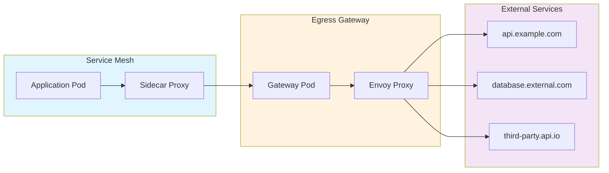
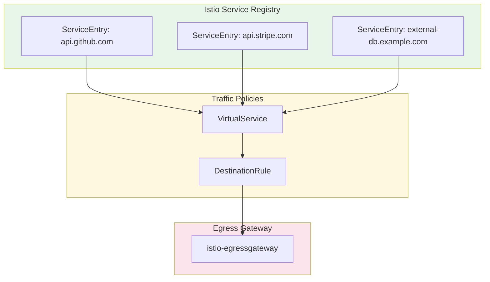
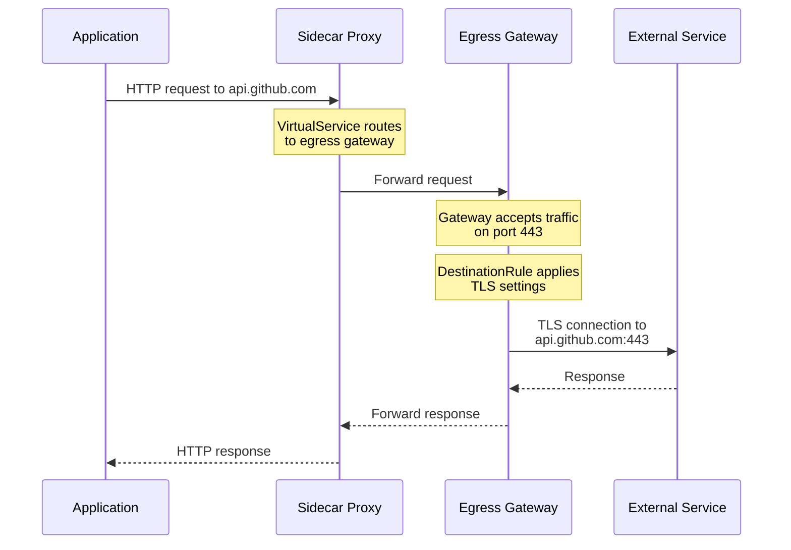
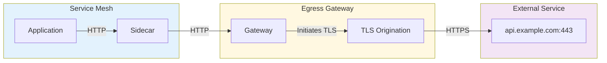
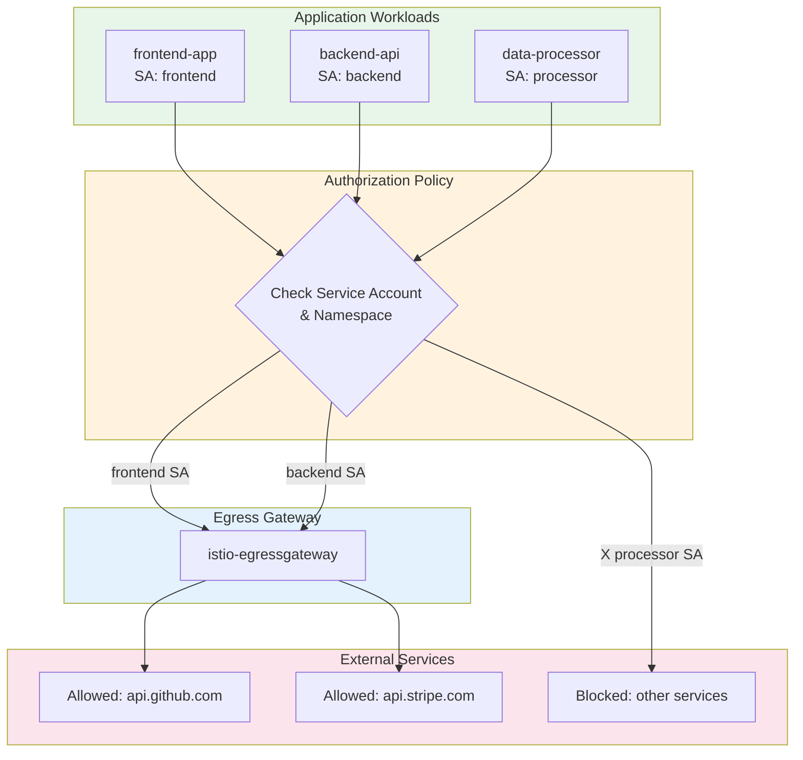

# How to Control Outbound Traffic with Istio Egress Gateway

Author: [nawazdhandala](https://github.com/nawazdhandala)

Tags: Istio, Egress Gateway, Security, Traffic Management, Kubernetes

Description: A guide to controlling and securing outbound traffic using Istio Egress Gateway.

---

## Introduction

In a microservices architecture, controlling outbound (egress) traffic is just as critical as managing inbound traffic. By default, Istio allows all outbound traffic from the mesh, which can pose security risks, make auditing difficult, and prevent proper traffic management. The Istio Egress Gateway provides a centralized point for managing, monitoring, and securing all traffic leaving your service mesh.

This comprehensive guide covers everything you need to know about implementing egress control with Istio, from basic ServiceEntry configurations to advanced TLS origination and security policies.

## Why Control Egress Traffic?

Before diving into implementation, let's understand why egress control matters:

1. **Security**: Prevent unauthorized access to external services and potential data exfiltration
2. **Compliance**: Meet regulatory requirements for traffic auditing and logging
3. **Observability**: Gain visibility into which services communicate with external endpoints
4. **Traffic Management**: Apply consistent policies, rate limiting, and retries for external calls
5. **Cost Control**: Monitor and limit access to paid external APIs

## Architecture Overview

The following diagram illustrates how traffic flows through the Istio Egress Gateway:



## Prerequisites

Before starting, ensure you have:

- A Kubernetes cluster (1.23+)
- Istio installed with egress gateway enabled
- `kubectl` and `istioctl` CLI tools
- Basic understanding of Istio concepts

## Step 1: Verify Egress Gateway Installation

First, confirm that the egress gateway is deployed in your cluster.

The following command checks if the egress gateway pod is running in the istio-system namespace:

```bash
# Check if the egress gateway deployment exists and is running
kubectl get pods -n istio-system -l istio=egressgateway

# Expected output shows the egress gateway pod in Running state
# NAME                                    READY   STATUS    RESTARTS   AGE
# istio-egressgateway-6f7c8d8b7f-xxxxx   1/1     Running   0          1d
```

If the egress gateway is not installed, you can enable it using the IstioOperator.

This IstioOperator configuration enables the egress gateway component during Istio installation:

```yaml
# istio-operator-egress.yaml
# This configuration enables the egress gateway during Istio installation
apiVersion: install.istio.io/v1alpha1
kind: IstioOperator
metadata:
  name: istio-with-egress
  namespace: istio-system
spec:
  # Use the default profile as a base
  profile: default
  components:
    # Enable the egress gateway component
    egressGateways:
      - name: istio-egressgateway
        enabled: true
        # Configure the egress gateway Kubernetes settings
        k8s:
          # Resource requests and limits for the gateway pod
          resources:
            requests:
              cpu: 100m
              memory: 128Mi
            limits:
              cpu: 500m
              memory: 256Mi
          # Run multiple replicas for high availability
          replicas: 2
          # Pod anti-affinity to spread across nodes
          affinity:
            podAntiAffinity:
              preferredDuringSchedulingIgnoredDuringExecution:
                - weight: 100
                  podAffinityTerm:
                    labelSelector:
                      matchLabels:
                        istio: egressgateway
                    topologyKey: kubernetes.io/hostname
```

Apply the configuration to install or update Istio with egress gateway support:

```bash
# Apply the IstioOperator configuration to enable egress gateway
istioctl install -f istio-operator-egress.yaml -y

# Verify the installation was successful
kubectl get pods -n istio-system -l istio=egressgateway
```

## Step 2: Configure Outbound Traffic Policy

Istio supports two outbound traffic policies: `ALLOW_ANY` (default) and `REGISTRY_ONLY`. For strict egress control, configure the mesh to only allow traffic to registered services.

This mesh configuration restricts outbound traffic to only services defined in the service registry (ServiceEntry resources):

```yaml
# mesh-config.yaml
# Configure the mesh to only allow outbound traffic to registered services
apiVersion: install.istio.io/v1alpha1
kind: IstioOperator
metadata:
  name: istio-mesh-config
  namespace: istio-system
spec:
  meshConfig:
    # REGISTRY_ONLY blocks all traffic to services not in the registry
    # ALLOW_ANY (default) allows traffic to any external service
    outboundTrafficPolicy:
      mode: REGISTRY_ONLY
    # Enable access logging for egress traffic monitoring
    accessLogFile: /dev/stdout
    # Configure access log format for better observability
    accessLogFormat: |
      [%START_TIME%] "%REQ(:METHOD)% %REQ(X-ENVOY-ORIGINAL-PATH?:PATH)% %PROTOCOL%"
      %RESPONSE_CODE% %RESPONSE_FLAGS% %BYTES_RECEIVED% %BYTES_SENT%
      %DURATION% %RESP(X-ENVOY-UPSTREAM-SERVICE-TIME)%
      "%REQ(X-FORWARDED-FOR)%" "%REQ(USER-AGENT)%"
      "%REQ(X-REQUEST-ID)%" "%REQ(:AUTHORITY)%" "%UPSTREAM_HOST%"
```

Apply the mesh configuration to enforce strict egress control:

```bash
# Apply the mesh configuration
istioctl install -f mesh-config.yaml -y

# Restart the istiod to pick up the new configuration
kubectl rollout restart deployment/istiod -n istio-system
```

## Step 3: Create ServiceEntry for External Services

A ServiceEntry allows you to add external services to Istio's internal service registry, making them accessible from within the mesh.

The following diagram shows how ServiceEntry integrates external services into the mesh:



This ServiceEntry configuration registers an external HTTPS API (GitHub API) in the mesh:

```yaml
# serviceentry-github.yaml
# Register the GitHub API as an external service in the mesh
apiVersion: networking.istio.io/v1beta1
kind: ServiceEntry
metadata:
  name: github-api
  namespace: default
spec:
  # The DNS name of the external service
  hosts:
    - api.github.com
  # Ports the service listens on
  ports:
    # HTTPS port for secure communication
    - number: 443
      name: https
      # Use TLS protocol for encrypted connections
      protocol: TLS
  # MESH_EXTERNAL indicates the service is outside the mesh
  # MESH_INTERNAL would be for services inside the mesh
  location: MESH_EXTERNAL
  # DNS resolution strategy
  # DNS: Resolve the hostname using DNS
  # STATIC: Use the provided addresses/endpoints
  # NONE: Assume the hostname is already an IP
  resolution: DNS
```

For services requiring specific endpoints or IP addresses, use static resolution:

```yaml
# serviceentry-database.yaml
# Register an external database with static IP addresses
apiVersion: networking.istio.io/v1beta1
kind: ServiceEntry
metadata:
  name: external-database
  namespace: default
spec:
  hosts:
    # Use a meaningful hostname for the external database
    - external-db.example.com
  ports:
    # PostgreSQL default port
    - number: 5432
      name: tcp-postgres
      protocol: TCP
  location: MESH_EXTERNAL
  # STATIC resolution uses the endpoints defined below
  resolution: STATIC
  # Define the actual IP endpoints for the service
  endpoints:
    # Primary database server
    - address: 192.168.1.100
      ports:
        tcp-postgres: 5432
      # Labels can be used for traffic splitting
      labels:
        role: primary
    # Secondary/replica database server
    - address: 192.168.1.101
      ports:
        tcp-postgres: 5432
      labels:
        role: replica
```

Apply the ServiceEntry resources to register external services:

```bash
# Apply the ServiceEntry configurations
kubectl apply -f serviceentry-github.yaml
kubectl apply -f serviceentry-database.yaml

# Verify the ServiceEntries are created
kubectl get serviceentries -A
```

## Step 4: Configure Egress Gateway Routing

Now we'll configure the egress gateway to handle traffic to external services. This involves creating a Gateway, VirtualService, and DestinationRule.

The following diagram shows the complete routing flow through the egress gateway:



This Gateway configuration defines what traffic the egress gateway accepts:

```yaml
# egress-gateway.yaml
# Define the egress gateway to accept traffic for external services
apiVersion: networking.istio.io/v1beta1
kind: Gateway
metadata:
  name: egress-gateway
  namespace: default
spec:
  # Select the egress gateway pods to apply this configuration
  selector:
    istio: egressgateway
  servers:
    # Configure server for GitHub API traffic
    - port:
        number: 443
        name: tls-github
        # TLS protocol for encrypted passthrough
        protocol: TLS
      # Accept traffic destined for api.github.com
      hosts:
        - api.github.com
      tls:
        # PASSTHROUGH mode forwards encrypted traffic as-is
        # SIMPLE or MUTUAL would terminate TLS at the gateway
        mode: PASSTHROUGH
    # Configure server for Stripe API traffic
    - port:
        number: 443
        name: tls-stripe
        protocol: TLS
      hosts:
        - api.stripe.com
      tls:
        mode: PASSTHROUGH
```

This VirtualService routes traffic from sidecars to the egress gateway:

```yaml
# virtualservice-github.yaml
# Route traffic to api.github.com through the egress gateway
apiVersion: networking.istio.io/v1beta1
kind: VirtualService
metadata:
  name: github-api-routing
  namespace: default
spec:
  # Match traffic destined for api.github.com
  hosts:
    - api.github.com
  # Apply to both mesh sidecars and the egress gateway
  gateways:
    # mesh gateway handles traffic from sidecar proxies
    - mesh
    # egress-gateway handles traffic at the egress gateway
    - egress-gateway
  # TLS routing rules for encrypted traffic
  tls:
    # Rule for traffic from mesh sidecars
    - match:
        - gateways:
            - mesh
          port: 443
          # SNI (Server Name Indication) matching
          sniHosts:
            - api.github.com
      route:
        # Route to the egress gateway service
        - destination:
            host: istio-egressgateway.istio-system.svc.cluster.local
            port:
              number: 443
    # Rule for traffic at the egress gateway
    - match:
        - gateways:
            - egress-gateway
          port: 443
          sniHosts:
            - api.github.com
      route:
        # Route to the actual external service
        - destination:
            host: api.github.com
            port:
              number: 443
```

This DestinationRule configures connection settings for the egress gateway and external service:

```yaml
# destinationrule-github.yaml
# Configure TLS settings for connecting to external services
apiVersion: networking.istio.io/v1beta1
kind: DestinationRule
metadata:
  name: egress-gateway-tls
  namespace: default
spec:
  # Apply to the egress gateway service
  host: istio-egressgateway.istio-system.svc.cluster.local
  trafficPolicy:
    # Configure connection pool settings
    connectionPool:
      tcp:
        # Maximum number of connections
        maxConnections: 100
        # Connection timeout
        connectTimeout: 10s
      http:
        # Maximum pending requests
        h2UpgradePolicy: UPGRADE
        http1MaxPendingRequests: 100
        http2MaxRequests: 1000
    # Port-level TLS settings
    portLevelSettings:
      - port:
          number: 443
        tls:
          # ISTIO_MUTUAL uses Istio's mutual TLS
          mode: ISTIO_MUTUAL
---
# DestinationRule for the external service
apiVersion: networking.istio.io/v1beta1
kind: DestinationRule
metadata:
  name: github-api-tls
  namespace: default
spec:
  # Apply to the external GitHub API
  host: api.github.com
  trafficPolicy:
    tls:
      # SIMPLE mode initiates TLS connection
      mode: SIMPLE
      # SNI for the TLS handshake
      sni: api.github.com
```

Apply all the routing configurations:

```bash
# Apply the egress gateway routing configuration
kubectl apply -f egress-gateway.yaml
kubectl apply -f virtualservice-github.yaml
kubectl apply -f destinationrule-github.yaml

# Verify the configurations
kubectl get gateways,virtualservices,destinationrules -A
```

## Step 5: Implement TLS Origination

TLS origination allows the egress gateway to initiate TLS connections on behalf of applications. This is useful when applications send plain HTTP requests but external services require HTTPS.

The following diagram shows the TLS origination flow:



This ServiceEntry configuration enables TLS origination for an external API:

```yaml
# serviceentry-tls-origination.yaml
# Define external service with both HTTP and HTTPS ports
# HTTP for internal mesh traffic, HTTPS for external connection
apiVersion: networking.istio.io/v1beta1
kind: ServiceEntry
metadata:
  name: external-api-tls-origination
  namespace: default
spec:
  hosts:
    - api.external-service.com
  ports:
    # HTTP port for traffic from applications within the mesh
    - number: 80
      name: http-port
      protocol: HTTP
    # HTTPS port for TLS connection to external service
    - number: 443
      name: https-port
      protocol: HTTPS
  location: MESH_EXTERNAL
  resolution: DNS
```

This Gateway accepts HTTP traffic and prepares it for TLS origination:

```yaml
# gateway-tls-origination.yaml
# Egress gateway configuration for TLS origination
apiVersion: networking.istio.io/v1beta1
kind: Gateway
metadata:
  name: egress-gateway-tls-origination
  namespace: default
spec:
  selector:
    istio: egressgateway
  servers:
    # Accept HTTP traffic from the mesh
    - port:
        number: 80
        name: http
        protocol: HTTP
      hosts:
        - api.external-service.com
```

This VirtualService routes HTTP traffic through the egress gateway for TLS origination:

```yaml
# virtualservice-tls-origination.yaml
# Route HTTP traffic to egress gateway and upgrade to HTTPS
apiVersion: networking.istio.io/v1beta1
kind: VirtualService
metadata:
  name: external-api-tls-origination
  namespace: default
spec:
  hosts:
    - api.external-service.com
  gateways:
    - mesh
    - egress-gateway-tls-origination
  http:
    # Route from mesh sidecars to egress gateway
    - match:
        - gateways:
            - mesh
          port: 80
      route:
        - destination:
            # Route to egress gateway
            host: istio-egressgateway.istio-system.svc.cluster.local
            port:
              number: 80
          # Percentage of traffic (100% in this case)
          weight: 100
    # Route from egress gateway to external service with port change
    - match:
        - gateways:
            - egress-gateway-tls-origination
          port: 80
      route:
        - destination:
            # Route to external service on HTTPS port
            host: api.external-service.com
            port:
              # Traffic will be upgraded to HTTPS
              number: 443
          weight: 100
```

This DestinationRule configures TLS origination at the egress gateway:

```yaml
# destinationrule-tls-origination.yaml
# Configure TLS origination for the external service
apiVersion: networking.istio.io/v1beta1
kind: DestinationRule
metadata:
  name: external-api-tls-origination
  namespace: default
spec:
  host: api.external-service.com
  trafficPolicy:
    # Load balancing configuration
    loadBalancer:
      simple: ROUND_ROBIN
    # Port-specific TLS settings
    portLevelSettings:
      - port:
          number: 443
        tls:
          # SIMPLE mode for one-way TLS
          mode: SIMPLE
          # Specify the SNI for the TLS handshake
          sni: api.external-service.com
---
# Mutual TLS between sidecar and egress gateway
apiVersion: networking.istio.io/v1beta1
kind: DestinationRule
metadata:
  name: egress-gateway-mtls
  namespace: default
spec:
  host: istio-egressgateway.istio-system.svc.cluster.local
  trafficPolicy:
    tls:
      # Use Istio's mutual TLS for in-mesh communication
      mode: ISTIO_MUTUAL
```

Apply the TLS origination configuration:

```bash
# Apply TLS origination resources
kubectl apply -f serviceentry-tls-origination.yaml
kubectl apply -f gateway-tls-origination.yaml
kubectl apply -f virtualservice-tls-origination.yaml
kubectl apply -f destinationrule-tls-origination.yaml

# Verify the configuration
istioctl analyze -n default
```

## Step 6: Configure Mutual TLS (mTLS) for External Services

For enhanced security, you can configure mutual TLS when connecting to external services that require client certificates.

This DestinationRule configures mTLS with client certificates for an external service:

```yaml
# destinationrule-mtls-external.yaml
# Configure mutual TLS for external services requiring client certificates
apiVersion: networking.istio.io/v1beta1
kind: DestinationRule
metadata:
  name: external-api-mtls
  namespace: default
spec:
  host: secure-api.partner.com
  trafficPolicy:
    tls:
      # MUTUAL mode for two-way TLS authentication
      mode: MUTUAL
      # Client certificate for authentication
      clientCertificate: /etc/istio/external-certs/client.crt
      # Private key for the client certificate
      privateKey: /etc/istio/external-certs/client.key
      # CA certificate to verify the server
      caCertificates: /etc/istio/external-certs/ca.crt
      # SNI for the TLS handshake
      sni: secure-api.partner.com
```

Create a Secret to store the client certificates:

```bash
# Create a secret containing the client certificates
# These certificates are mounted into the egress gateway pod
kubectl create secret generic external-api-certs \
  --from-file=client.crt=./certs/client.crt \
  --from-file=client.key=./certs/client.key \
  --from-file=ca.crt=./certs/ca.crt \
  -n istio-system
```

Update the egress gateway deployment to mount the certificates:

```yaml
# egress-gateway-certs.yaml
# Patch to mount certificates into the egress gateway
apiVersion: install.istio.io/v1alpha1
kind: IstioOperator
metadata:
  name: istio-egress-certs
  namespace: istio-system
spec:
  components:
    egressGateways:
      - name: istio-egressgateway
        enabled: true
        k8s:
          # Add volume mounts for external certificates
          overlays:
            - kind: Deployment
              name: istio-egressgateway
              patches:
                # Add volume mount to the container
                - path: spec.template.spec.containers[0].volumeMounts[-1]
                  value:
                    name: external-certs
                    mountPath: /etc/istio/external-certs
                    readOnly: true
                # Add the secret volume
                - path: spec.template.spec.volumes[-1]
                  value:
                    name: external-certs
                    secret:
                      secretName: external-api-certs
```

## Step 7: Implement Security Policies for Egress

Authorization policies allow you to control which workloads can access external services through the egress gateway.

The following diagram illustrates the authorization flow:



This AuthorizationPolicy restricts which service accounts can access external services:

```yaml
# authz-egress-policy.yaml
# Authorization policy to control egress gateway access
apiVersion: security.istio.io/v1beta1
kind: AuthorizationPolicy
metadata:
  name: egress-gateway-authz
  # Apply to the istio-system namespace where egress gateway runs
  namespace: istio-system
spec:
  # Select the egress gateway pods
  selector:
    matchLabels:
      istio: egressgateway
  # ALLOW action permits matching requests
  action: ALLOW
  rules:
    # Rule 1: Allow frontend service account to access GitHub API
    - from:
        - source:
            # Only allow requests from frontend service account
            principals:
              - cluster.local/ns/default/sa/frontend
      to:
        - operation:
            # Allow access to GitHub API host
            hosts:
              - api.github.com
            # Allow all HTTPS ports
            ports:
              - "443"
    # Rule 2: Allow backend service account to access Stripe API
    - from:
        - source:
            principals:
              - cluster.local/ns/default/sa/backend
              - cluster.local/ns/payments/sa/payment-processor
      to:
        - operation:
            hosts:
              - api.stripe.com
            ports:
              - "443"
    # Rule 3: Allow specific namespaces to access external database
    - from:
        - source:
            # Allow any service account from the data namespace
            namespaces:
              - data
              - analytics
      to:
        - operation:
            hosts:
              - external-db.example.com
            ports:
              - "5432"
```

Create a deny-all policy as a safety net to block unauthorized egress:

```yaml
# authz-deny-all-egress.yaml
# Deny all egress traffic by default (applied after ALLOW policies)
apiVersion: security.istio.io/v1beta1
kind: AuthorizationPolicy
metadata:
  name: egress-deny-all
  namespace: istio-system
spec:
  selector:
    matchLabels:
      istio: egressgateway
  # Empty rules with no action means deny all by default
  # This policy has lower priority than explicit ALLOW policies
  {}
```

Apply the authorization policies:

```bash
# Apply the authorization policies
kubectl apply -f authz-egress-policy.yaml
kubectl apply -f authz-deny-all-egress.yaml

# Verify the policies are applied
kubectl get authorizationpolicies -n istio-system

# Test the policy by attempting to access an external service
# From an allowed service account (should succeed)
kubectl exec -it deploy/frontend -c frontend -- curl -I https://api.github.com

# From a disallowed service account (should fail)
kubectl exec -it deploy/unauthorized-app -- curl -I https://api.github.com
```

## Step 8: Enable Egress Traffic Monitoring

Monitoring egress traffic is essential for security and troubleshooting. Configure Istio to export metrics and logs for egress traffic.

This Telemetry resource configures detailed access logging for egress traffic:

```yaml
# telemetry-egress.yaml
# Configure telemetry for egress traffic monitoring
apiVersion: telemetry.istio.io/v1alpha1
kind: Telemetry
metadata:
  name: egress-telemetry
  namespace: istio-system
spec:
  # Apply to egress gateway
  selector:
    matchLabels:
      istio: egressgateway
  # Configure access logging
  accessLogging:
    - providers:
        - name: envoy
      # Log all egress traffic (not just errors)
      filter:
        expression: "true"
  # Configure metrics
  metrics:
    - providers:
        - name: prometheus
      # Override default metric tags for egress
      overrides:
        - match:
            metric: REQUEST_COUNT
          tagOverrides:
            destination_service:
              # Use the actual external host as destination
              value: request.host
        - match:
            metric: REQUEST_DURATION
          tagOverrides:
            destination_service:
              value: request.host
```

Create a ServiceMonitor for Prometheus to scrape egress gateway metrics:

```yaml
# servicemonitor-egress.yaml
# Prometheus ServiceMonitor for egress gateway metrics
apiVersion: monitoring.coreos.com/v1
kind: ServiceMonitor
metadata:
  name: egress-gateway-monitor
  namespace: istio-system
  labels:
    release: prometheus
spec:
  selector:
    matchLabels:
      istio: egressgateway
  endpoints:
    - port: http-envoy-prom
      interval: 15s
      path: /stats/prometheus
```

Configure a Grafana dashboard query for egress traffic visualization:

```yaml
# Example PromQL queries for egress traffic monitoring

# Total egress requests per external service
# sum(rate(istio_requests_total{source_workload="istio-egressgateway"}[5m])) by (destination_service)

# Egress request latency (p99) per external service
# histogram_quantile(0.99, sum(rate(istio_request_duration_milliseconds_bucket{source_workload="istio-egressgateway"}[5m])) by (le, destination_service))

# Egress error rate per external service
# sum(rate(istio_requests_total{source_workload="istio-egressgateway", response_code!~"2.."}[5m])) by (destination_service) / sum(rate(istio_requests_total{source_workload="istio-egressgateway"}[5m])) by (destination_service)
```

## Step 9: Implement Rate Limiting for Egress

Protect external services from being overwhelmed and control API costs with rate limiting.

This EnvoyFilter configures rate limiting for egress traffic:

```yaml
# envoyfilter-egress-ratelimit.yaml
# Configure rate limiting for egress traffic
apiVersion: networking.istio.io/v1alpha3
kind: EnvoyFilter
metadata:
  name: egress-ratelimit
  namespace: istio-system
spec:
  # Apply to egress gateway
  workloadSelector:
    labels:
      istio: egressgateway
  configPatches:
    # Add rate limit filter to the HTTP connection manager
    - applyTo: HTTP_FILTER
      match:
        context: GATEWAY
        listener:
          filterChain:
            filter:
              name: envoy.filters.network.http_connection_manager
              subFilter:
                name: envoy.filters.http.router
      patch:
        operation: INSERT_BEFORE
        value:
          name: envoy.filters.http.local_ratelimit
          typed_config:
            "@type": type.googleapis.com/udpa.type.v1.TypedStruct
            type_url: type.googleapis.com/envoy.extensions.filters.http.local_ratelimit.v3.LocalRateLimit
            value:
              stat_prefix: http_local_rate_limiter
              # Token bucket configuration
              token_bucket:
                # Maximum tokens in the bucket
                max_tokens: 100
                # Tokens added per fill interval
                tokens_per_fill: 10
                # Fill interval duration
                fill_interval: 1s
              # Percentage of requests to rate limit (100 = all)
              filter_enabled:
                runtime_key: local_rate_limit_enabled
                default_value:
                  numerator: 100
                  denominator: HUNDRED
              filter_enforced:
                runtime_key: local_rate_limit_enforced
                default_value:
                  numerator: 100
                  denominator: HUNDRED
              # Response headers when rate limited
              response_headers_to_add:
                - append: false
                  header:
                    key: x-rate-limited
                    value: "true"
```

Apply the rate limiting configuration:

```bash
# Apply the rate limiting EnvoyFilter
kubectl apply -f envoyfilter-egress-ratelimit.yaml

# Verify the filter is applied
istioctl proxy-config listeners deploy/istio-egressgateway -n istio-system

# Test rate limiting
for i in {1..150}; do
  curl -s -o /dev/null -w "%{http_code}\n" https://api.example.com/test
done | sort | uniq -c
# Expected: Some 200s and some 429s (rate limited)
```

## Step 10: Complete Example - Production Egress Setup

Here's a complete production-ready configuration combining all the concepts:

```yaml
# production-egress-setup.yaml
# Complete production egress gateway configuration

---
# ServiceEntry for external payment API
apiVersion: networking.istio.io/v1beta1
kind: ServiceEntry
metadata:
  name: payment-api
  namespace: production
  labels:
    app: payment-integration
    environment: production
spec:
  hosts:
    - api.payment-provider.com
  ports:
    - number: 443
      name: https
      protocol: TLS
  location: MESH_EXTERNAL
  resolution: DNS
  # Export to all namespaces that need access
  exportTo:
    - "."
    - "istio-system"

---
# Gateway configuration
apiVersion: networking.istio.io/v1beta1
kind: Gateway
metadata:
  name: payment-egress-gateway
  namespace: production
spec:
  selector:
    istio: egressgateway
  servers:
    - port:
        number: 443
        name: tls-payment
        protocol: TLS
      hosts:
        - api.payment-provider.com
      tls:
        mode: PASSTHROUGH

---
# VirtualService for routing
apiVersion: networking.istio.io/v1beta1
kind: VirtualService
metadata:
  name: payment-api-routing
  namespace: production
spec:
  hosts:
    - api.payment-provider.com
  gateways:
    - mesh
    - payment-egress-gateway
  tls:
    # From mesh to egress gateway
    - match:
        - gateways:
            - mesh
          port: 443
          sniHosts:
            - api.payment-provider.com
      route:
        - destination:
            host: istio-egressgateway.istio-system.svc.cluster.local
            port:
              number: 443
    # From egress gateway to external service
    - match:
        - gateways:
            - payment-egress-gateway
          port: 443
          sniHosts:
            - api.payment-provider.com
      route:
        - destination:
            host: api.payment-provider.com
            port:
              number: 443

---
# DestinationRule for egress gateway mTLS
apiVersion: networking.istio.io/v1beta1
kind: DestinationRule
metadata:
  name: egress-gateway-mtls
  namespace: production
spec:
  host: istio-egressgateway.istio-system.svc.cluster.local
  trafficPolicy:
    portLevelSettings:
      - port:
          number: 443
        tls:
          mode: ISTIO_MUTUAL

---
# DestinationRule for external service TLS
apiVersion: networking.istio.io/v1beta1
kind: DestinationRule
metadata:
  name: payment-api-tls
  namespace: production
spec:
  host: api.payment-provider.com
  trafficPolicy:
    tls:
      mode: SIMPLE
      sni: api.payment-provider.com
    # Circuit breaker for resilience
    connectionPool:
      tcp:
        maxConnections: 50
        connectTimeout: 5s
      http:
        http1MaxPendingRequests: 50
        http2MaxRequests: 100
        maxRequestsPerConnection: 10
    # Outlier detection for external service
    outlierDetection:
      consecutive5xxErrors: 5
      interval: 30s
      baseEjectionTime: 60s
      maxEjectionPercent: 100

---
# Authorization policy for payment service access
apiVersion: security.istio.io/v1beta1
kind: AuthorizationPolicy
metadata:
  name: payment-api-authz
  namespace: istio-system
spec:
  selector:
    matchLabels:
      istio: egressgateway
  action: ALLOW
  rules:
    - from:
        - source:
            principals:
              - cluster.local/ns/production/sa/payment-service
              - cluster.local/ns/production/sa/checkout-service
      to:
        - operation:
            hosts:
              - api.payment-provider.com
            ports:
              - "443"
```

Apply the complete production configuration:

```bash
# Apply all production egress configurations
kubectl apply -f production-egress-setup.yaml

# Verify the setup
echo "=== ServiceEntries ===" && kubectl get serviceentries -n production
echo "=== Gateways ===" && kubectl get gateways -n production
echo "=== VirtualServices ===" && kubectl get virtualservices -n production
echo "=== DestinationRules ===" && kubectl get destinationrules -n production
echo "=== AuthorizationPolicies ===" && kubectl get authorizationpolicies -n istio-system

# Run analysis to check for configuration issues
istioctl analyze -n production
```

## Troubleshooting

### Common Issues and Solutions

If egress traffic is not flowing through the gateway, verify the configuration:

```bash
# Check if the egress gateway is receiving traffic
kubectl logs -n istio-system deploy/istio-egressgateway -f

# Verify the listener configuration
istioctl proxy-config listeners deploy/istio-egressgateway -n istio-system

# Check route configuration
istioctl proxy-config routes deploy/istio-egressgateway -n istio-system

# Verify cluster configuration for external services
istioctl proxy-config clusters deploy/istio-egressgateway -n istio-system | grep -i external

# Check for configuration sync issues
istioctl proxy-status

# Debug specific application's egress routing
istioctl proxy-config routes deploy/my-app -n default | grep -A 5 "api.external-service.com"
```

### Debug Egress Traffic Flow

Use the following commands to trace egress traffic:

```bash
# Enable debug logging on the egress gateway
istioctl proxy-config log deploy/istio-egressgateway -n istio-system --level debug

# Check access logs for the egress gateway
kubectl logs -n istio-system deploy/istio-egressgateway | grep "api.external-service.com"

# Verify DNS resolution from within the mesh
kubectl exec -it deploy/my-app -c istio-proxy -- nslookup api.external-service.com

# Test connectivity through the egress gateway
kubectl exec -it deploy/my-app -c istio-proxy -- curl -v https://api.external-service.com
```

## Best Practices

1. **Always use REGISTRY_ONLY mode**: Set `outboundTrafficPolicy.mode` to `REGISTRY_ONLY` in production to ensure all external access is explicitly defined.

2. **Implement least privilege**: Use AuthorizationPolicies to restrict which workloads can access specific external services.

3. **Enable TLS origination**: When possible, let the egress gateway handle TLS to simplify application configuration and centralize certificate management.

4. **Monitor egress traffic**: Set up comprehensive logging and metrics to track all outbound traffic for security auditing.

5. **Use circuit breakers**: Configure outlier detection and connection pools to handle external service failures gracefully.

6. **Regularly audit ServiceEntries**: Review and clean up unused ServiceEntry configurations to minimize attack surface.

7. **Test authorization policies**: Verify that unauthorized workloads cannot access external services through the egress gateway.

8. **Document all external dependencies**: Maintain clear documentation of all ServiceEntry resources and their purposes.

## Conclusion

Controlling outbound traffic with Istio Egress Gateway provides significant security, observability, and management benefits for your service mesh. By implementing ServiceEntry resources, egress gateway routing, TLS origination, and authorization policies, you can:

- Ensure all external traffic flows through a centralized, monitored gateway
- Apply consistent security policies across all outbound connections
- Gain visibility into which services communicate with external endpoints
- Meet compliance requirements for traffic auditing and control

The configurations presented in this guide provide a solid foundation for production-grade egress control. Remember to adapt these examples to your specific requirements and regularly review your egress policies as your application's external dependencies evolve.

## Additional Resources

- [Istio Egress Gateway Documentation](https://istio.io/latest/docs/tasks/traffic-management/egress/egress-gateway/)
- [Istio ServiceEntry Reference](https://istio.io/latest/docs/reference/config/networking/service-entry/)
- [Istio Authorization Policy Reference](https://istio.io/latest/docs/reference/config/security/authorization-policy/)
- [Envoy Proxy Documentation](https://www.envoyproxy.io/docs/envoy/latest/)
