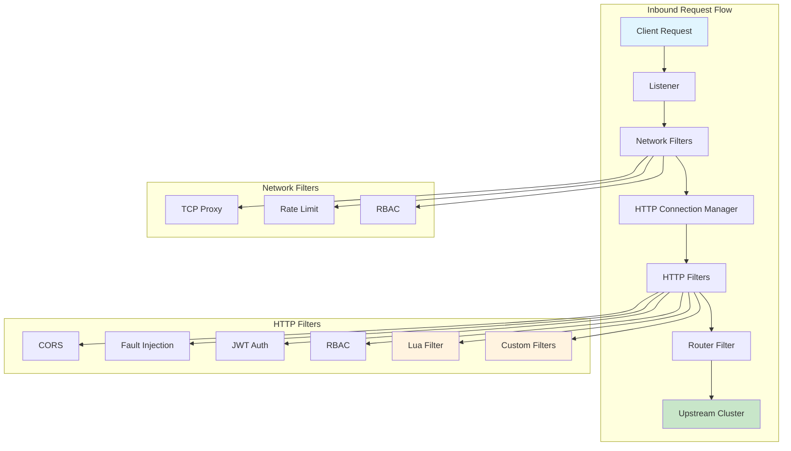
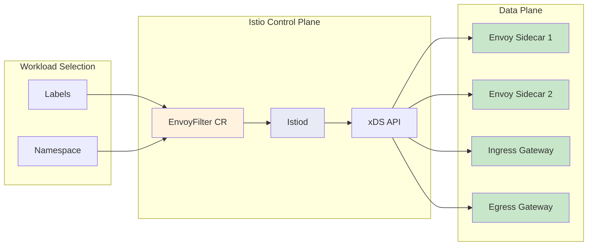
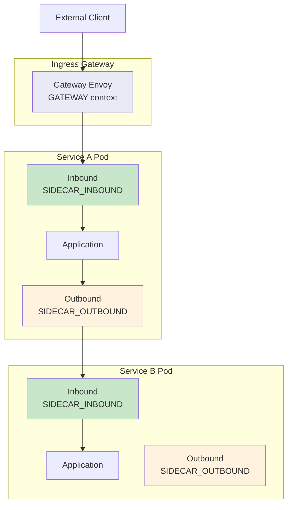
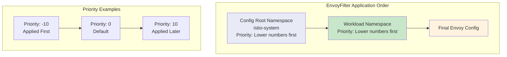

# How to Customize Envoy Proxies with Istio EnvoyFilter

Author: [nawazdhandala](https://github.com/nawazdhandala)

Tags: Istio, EnvoyFilter, Envoy, Proxy, Service Mesh, Customization

Description: Learn how to use EnvoyFilter for advanced Envoy proxy customization in Istio.

---

## Introduction

Istio provides powerful traffic management capabilities out of the box through VirtualServices, DestinationRules, and Gateways. However, there are scenarios where you need fine-grained control over the underlying Envoy proxy configuration that goes beyond what these high-level resources offer. This is where **EnvoyFilter** comes in.

EnvoyFilter is a powerful Istio resource that allows you to directly modify the Envoy proxy configuration. It enables you to add custom filters, modify existing filters, add clusters, and perform advanced customizations that are not possible through standard Istio APIs.

In this comprehensive guide, you will learn:

- The structure and components of EnvoyFilter resources
- How patch operations work and when to use each type
- Different contexts for applying filters
- How to implement Lua filters for custom logic
- Common use cases and practical examples
- Best practices and troubleshooting tips

## Understanding EnvoyFilter Architecture

Before diving into the configuration, let's understand how EnvoyFilter fits into the Istio architecture and how Envoy processes requests through its filter chain.

### Envoy Filter Chain Overview

The following diagram illustrates how requests flow through Envoy's filter chain:



### EnvoyFilter in the Istio Control Plane



## EnvoyFilter Resource Structure

The EnvoyFilter resource consists of several key components that work together to define how and where modifications should be applied to the Envoy configuration.

### Basic Structure

The following YAML shows the complete structure of an EnvoyFilter resource with all available fields:

```yaml
# EnvoyFilter API version - networking.istio.io/v1alpha3 is the current version
apiVersion: networking.istio.io/v1alpha3
kind: EnvoyFilter
metadata:
  # Name of the EnvoyFilter resource
  name: my-custom-filter
  # Namespace where the filter is applied
  # If no workloadSelector is specified, applies to all workloads in this namespace
  namespace: istio-system
spec:
  # workloadSelector determines which workloads this filter applies to
  # If omitted, applies to all workloads in the namespace
  workloadSelector:
    labels:
      # Match workloads with these labels
      app: my-application
      version: v1

  # configPatches is a list of patches to apply to the Envoy configuration
  configPatches:
    # Each patch defines a single modification
    - applyTo: HTTP_FILTER
      # match specifies where to apply the patch
      match:
        context: SIDECAR_INBOUND
        listener:
          filterChain:
            filter:
              name: "envoy.filters.network.http_connection_manager"
              subFilter:
                name: "envoy.filters.http.router"
      # patch defines what modification to make
      patch:
        operation: INSERT_BEFORE
        value:
          name: my-custom-filter
          typed_config:
            "@type": type.googleapis.com/envoy.extensions.filters.http.lua.v3.Lua
            inlineCode: |
              function envoy_on_request(request_handle)
                -- Custom request handling logic
              end

  # priority determines the order of EnvoyFilter application
  # Lower numbers are applied first (default is 0)
  priority: 10
```

### Key Components Explained

#### 1. Workload Selector

The workloadSelector determines which Envoy proxies receive the configuration. Here are different selector patterns:

```yaml
# Select specific pods by labels
# This targets only pods with both labels matching
spec:
  workloadSelector:
    labels:
      app: payment-service
      version: v2
```

```yaml
# Select all workloads in a namespace
# Omitting workloadSelector applies to all workloads
spec:
  # No workloadSelector means all workloads in the namespace
  configPatches:
    - applyTo: HTTP_FILTER
      # ... rest of configuration
```

```yaml
# Select gateway workloads
# Apply to the Istio ingress gateway
spec:
  workloadSelector:
    labels:
      istio: ingressgateway
```

#### 2. ApplyTo Field

The `applyTo` field specifies which part of the Envoy configuration to modify:

| ApplyTo Value | Description | Use Case |
|---------------|-------------|----------|
| `LISTENER` | Listener configuration | Add/modify listener-level settings |
| `FILTER_CHAIN` | Filter chain within a listener | Add custom filter chains |
| `NETWORK_FILTER` | Network-level filters | TCP-level processing |
| `HTTP_FILTER` | HTTP-level filters | Request/response manipulation |
| `ROUTE_CONFIGURATION` | Route configuration | Modify routing behavior |
| `VIRTUAL_HOST` | Virtual host within routes | Host-level settings |
| `HTTP_ROUTE` | Individual HTTP routes | Route-specific modifications |
| `CLUSTER` | Upstream cluster configuration | Backend connection settings |
| `EXTENSION_CONFIG` | Extension configurations | ECDS-based dynamic configs |

## Patch Operations

EnvoyFilter supports several patch operations that determine how modifications are applied to the existing configuration.

### Operation Types

The following diagram shows how different patch operations modify the filter chain:


### MERGE Operation

The MERGE operation combines new configuration with existing configuration. This is useful for adding or modifying specific fields without replacing the entire configuration:

```yaml
# MERGE adds or updates fields in an existing configuration
# Here we're adding a custom header to the route configuration
apiVersion: networking.istio.io/v1alpha3
kind: EnvoyFilter
metadata:
  name: add-response-header
  namespace: default
spec:
  workloadSelector:
    labels:
      app: my-app
  configPatches:
    # Merge custom configuration into the route
    - applyTo: ROUTE_CONFIGURATION
      match:
        context: SIDECAR_INBOUND
      patch:
        # MERGE combines this config with existing route configuration
        operation: MERGE
        value:
          # Add custom response headers to all routes
          response_headers_to_add:
            - header:
                key: "x-custom-header"
                value: "custom-value"
              append: true
```

### ADD Operation

The ADD operation appends a new element to the end of a list or adds a new configuration section:

```yaml
# ADD appends a new cluster to the Envoy configuration
# Use this when you need to define a new upstream for external services
apiVersion: networking.istio.io/v1alpha3
kind: EnvoyFilter
metadata:
  name: add-external-cluster
  namespace: istio-system
spec:
  configPatches:
    # Add a new cluster for external API communication
    - applyTo: CLUSTER
      match:
        context: SIDECAR_OUTBOUND
      patch:
        # ADD creates a new cluster entry
        operation: ADD
        value:
          name: external-api-cluster
          type: STRICT_DNS
          # Connect timeout for establishing connection
          connect_timeout: 5s
          # Load balancing policy
          lb_policy: ROUND_ROBIN
          load_assignment:
            cluster_name: external-api-cluster
            endpoints:
              - lb_endpoints:
                  - endpoint:
                      address:
                        socket_address:
                          address: api.external-service.com
                          port_value: 443
          # TLS configuration for HTTPS connections
          transport_socket:
            name: envoy.transport_sockets.tls
            typed_config:
              "@type": type.googleapis.com/envoy.extensions.transport_sockets.tls.v3.UpstreamTlsContext
              sni: api.external-service.com
```

### INSERT_BEFORE Operation

INSERT_BEFORE inserts a new element before a matched element in the filter chain. This is commonly used when you need your filter to process requests before another filter:

```yaml
# INSERT_BEFORE places the new filter before the router
# This ensures our custom logic runs before routing decisions
apiVersion: networking.istio.io/v1alpha3
kind: EnvoyFilter
metadata:
  name: insert-auth-filter
  namespace: default
spec:
  workloadSelector:
    labels:
      app: api-gateway
  configPatches:
    - applyTo: HTTP_FILTER
      match:
        context: SIDECAR_INBOUND
        listener:
          filterChain:
            filter:
              name: "envoy.filters.network.http_connection_manager"
              subFilter:
                # Insert our filter before the router
                name: "envoy.filters.http.router"
      patch:
        # INSERT_BEFORE ensures this filter runs before routing
        operation: INSERT_BEFORE
        value:
          name: envoy.filters.http.lua
          typed_config:
            "@type": type.googleapis.com/envoy.extensions.filters.http.lua.v3.Lua
            inlineCode: |
              -- This Lua filter executes before the router filter
              function envoy_on_request(request_handle)
                -- Log that request passed through custom filter
                request_handle:logInfo("Request processed by custom auth filter")
              end
```

### INSERT_FIRST Operation

INSERT_FIRST inserts a new element at the beginning of a list, ensuring it runs before all other filters:

```yaml
# INSERT_FIRST places the filter at the very beginning of the chain
# Use this when your filter must be the first to process requests
apiVersion: networking.istio.io/v1alpha3
kind: EnvoyFilter
metadata:
  name: first-filter-logging
  namespace: default
spec:
  configPatches:
    - applyTo: HTTP_FILTER
      match:
        context: SIDECAR_INBOUND
        listener:
          filterChain:
            filter:
              name: "envoy.filters.network.http_connection_manager"
      patch:
        # INSERT_FIRST ensures this is the first HTTP filter in the chain
        operation: INSERT_FIRST
        value:
          name: envoy.filters.http.lua
          typed_config:
            "@type": type.googleapis.com/envoy.extensions.filters.http.lua.v3.Lua
            inlineCode: |
              -- First filter in chain - captures raw request data
              function envoy_on_request(request_handle)
                local start_time = os.clock()
                -- Store start time for latency calculation
                request_handle:streamInfo():dynamicMetadata():set(
                  "timing", "start_time", tostring(start_time)
                )
              end
```

### REMOVE Operation

REMOVE deletes an existing element from the configuration:

```yaml
# REMOVE deletes an existing filter from the chain
# Use carefully as it can break expected functionality
apiVersion: networking.istio.io/v1alpha3
kind: EnvoyFilter
metadata:
  name: remove-cors-filter
  namespace: default
spec:
  workloadSelector:
    labels:
      app: internal-service
  configPatches:
    - applyTo: HTTP_FILTER
      match:
        context: SIDECAR_INBOUND
        listener:
          filterChain:
            filter:
              name: "envoy.filters.network.http_connection_manager"
              subFilter:
                # Match the CORS filter to remove it
                name: "envoy.filters.http.cors"
      patch:
        # REMOVE deletes the matched filter
        # Note: value is not needed for REMOVE operation
        operation: REMOVE
```

### REPLACE Operation

REPLACE completely replaces an existing element with a new one:

```yaml
# REPLACE substitutes an existing filter with a new configuration
# The matched filter is completely replaced
apiVersion: networking.istio.io/v1alpha3
kind: EnvoyFilter
metadata:
  name: replace-fault-injection
  namespace: default
spec:
  workloadSelector:
    labels:
      app: test-service
  configPatches:
    - applyTo: HTTP_FILTER
      match:
        context: SIDECAR_INBOUND
        listener:
          filterChain:
            filter:
              name: "envoy.filters.network.http_connection_manager"
              subFilter:
                name: "envoy.filters.http.fault"
      patch:
        # REPLACE completely replaces the fault injection filter
        operation: REPLACE
        value:
          name: envoy.filters.http.fault
          typed_config:
            "@type": type.googleapis.com/envoy.extensions.filters.http.fault.v3.HTTPFault
            # Custom fault injection configuration
            delay:
              fixed_delay: 2s
              percentage:
                numerator: 10
                denominator: HUNDRED
```

## Match Contexts

The `context` field in the match section determines which traffic direction the EnvoyFilter applies to.

### Context Types Explained



### SIDECAR_INBOUND

Apply to traffic entering the sidecar from outside the pod:

```yaml
# SIDECAR_INBOUND processes requests coming INTO the service
# Use for authentication, rate limiting, request validation
apiVersion: networking.istio.io/v1alpha3
kind: EnvoyFilter
metadata:
  name: inbound-rate-limit
  namespace: default
spec:
  workloadSelector:
    labels:
      app: api-service
  configPatches:
    - applyTo: HTTP_FILTER
      match:
        # Apply only to inbound traffic to this service
        context: SIDECAR_INBOUND
        listener:
          # Match the inbound listener port
          portNumber: 8080
          filterChain:
            filter:
              name: "envoy.filters.network.http_connection_manager"
              subFilter:
                name: "envoy.filters.http.router"
      patch:
        operation: INSERT_BEFORE
        value:
          name: envoy.filters.http.local_ratelimit
          typed_config:
            "@type": type.googleapis.com/envoy.extensions.filters.http.local_ratelimit.v3.LocalRateLimit
            stat_prefix: http_local_rate_limiter
            # Allow 100 requests per second
            token_bucket:
              max_tokens: 100
              tokens_per_fill: 100
              fill_interval: 1s
            filter_enabled:
              runtime_key: local_rate_limit_enabled
              default_value:
                numerator: 100
                denominator: HUNDRED
            filter_enforced:
              runtime_key: local_rate_limit_enforced
              default_value:
                numerator: 100
                denominator: HUNDRED
```

### SIDECAR_OUTBOUND

Apply to traffic leaving the sidecar to external services:

```yaml
# SIDECAR_OUTBOUND processes requests going OUT of the service
# Use for adding headers, modifying requests to upstream services
apiVersion: networking.istio.io/v1alpha3
kind: EnvoyFilter
metadata:
  name: outbound-header-injection
  namespace: default
spec:
  workloadSelector:
    labels:
      app: frontend
  configPatches:
    - applyTo: HTTP_FILTER
      match:
        # Apply to outbound traffic from this service
        context: SIDECAR_OUTBOUND
        listener:
          filterChain:
            filter:
              name: "envoy.filters.network.http_connection_manager"
              subFilter:
                name: "envoy.filters.http.router"
      patch:
        operation: INSERT_BEFORE
        value:
          name: envoy.filters.http.lua
          typed_config:
            "@type": type.googleapis.com/envoy.extensions.filters.http.lua.v3.Lua
            inlineCode: |
              -- Add tracing headers to all outbound requests
              function envoy_on_request(request_handle)
                -- Get or generate correlation ID
                local correlation_id = request_handle:headers():get("x-correlation-id")
                if correlation_id == nil then
                  correlation_id = request_handle:headers():get("x-request-id")
                end

                -- Add upstream service identification header
                request_handle:headers():add("x-calling-service", "frontend")
                request_handle:headers():add("x-correlation-id", correlation_id)
              end
```

### GATEWAY

Apply to traffic passing through Istio ingress or egress gateways:

```yaml
# GATEWAY context applies to ingress/egress gateway proxies
# Use for edge processing, external authentication, rate limiting
apiVersion: networking.istio.io/v1alpha3
kind: EnvoyFilter
metadata:
  name: gateway-security-headers
  # Gateway EnvoyFilters typically go in istio-system namespace
  namespace: istio-system
spec:
  workloadSelector:
    labels:
      # Target the ingress gateway
      istio: ingressgateway
  configPatches:
    - applyTo: HTTP_FILTER
      match:
        # Apply to gateway traffic
        context: GATEWAY
        listener:
          filterChain:
            filter:
              name: "envoy.filters.network.http_connection_manager"
              subFilter:
                name: "envoy.filters.http.router"
      patch:
        operation: INSERT_BEFORE
        value:
          name: envoy.filters.http.lua
          typed_config:
            "@type": type.googleapis.com/envoy.extensions.filters.http.lua.v3.Lua
            inlineCode: |
              -- Add security headers at the edge
              function envoy_on_response(response_handle)
                -- Add standard security headers
                response_handle:headers():add(
                  "Strict-Transport-Security",
                  "max-age=31536000; includeSubDomains"
                )
                response_handle:headers():add(
                  "X-Content-Type-Options",
                  "nosniff"
                )
                response_handle:headers():add(
                  "X-Frame-Options",
                  "DENY"
                )
                response_handle:headers():add(
                  "X-XSS-Protection",
                  "1; mode=block"
                )
                -- Remove server identification header
                response_handle:headers():remove("server")
              end
```

### ANY Context

Apply to all traffic regardless of direction:

```yaml
# ANY context applies to all traffic types
# Use sparingly as it affects all proxies
apiVersion: networking.istio.io/v1alpha3
kind: EnvoyFilter
metadata:
  name: global-access-logging
  namespace: istio-system
spec:
  configPatches:
    - applyTo: NETWORK_FILTER
      match:
        # Apply to all contexts
        context: ANY
        listener:
          filterChain:
            filter:
              name: "envoy.filters.network.http_connection_manager"
      patch:
        operation: MERGE
        value:
          typed_config:
            "@type": type.googleapis.com/envoy.extensions.filters.network.http_connection_manager.v3.HttpConnectionManager
            # Enable access logging for all traffic
            access_log:
              - name: envoy.access_loggers.file
                typed_config:
                  "@type": type.googleapis.com/envoy.extensions.access_loggers.file.v3.FileAccessLog
                  path: /dev/stdout
                  log_format:
                    json_format:
                      timestamp: "%START_TIME%"
                      method: "%REQ(:METHOD)%"
                      path: "%REQ(X-ENVOY-ORIGINAL-PATH?:PATH)%"
                      protocol: "%PROTOCOL%"
                      response_code: "%RESPONSE_CODE%"
                      duration: "%DURATION%"
                      upstream_host: "%UPSTREAM_HOST%"
```

## Lua Filter Examples

Lua filters provide a powerful way to implement custom request/response processing logic directly in Envoy. They are particularly useful for tasks that require dynamic behavior that cannot be achieved through static configuration.

### Basic Lua Filter Structure

```yaml
# Basic structure of a Lua filter in EnvoyFilter
# Lua filters have access to request/response headers, body, and metadata
apiVersion: networking.istio.io/v1alpha3
kind: EnvoyFilter
metadata:
  name: lua-filter-example
  namespace: default
spec:
  workloadSelector:
    labels:
      app: my-service
  configPatches:
    - applyTo: HTTP_FILTER
      match:
        context: SIDECAR_INBOUND
        listener:
          filterChain:
            filter:
              name: "envoy.filters.network.http_connection_manager"
              subFilter:
                name: "envoy.filters.http.router"
      patch:
        operation: INSERT_BEFORE
        value:
          name: envoy.filters.http.lua
          typed_config:
            "@type": type.googleapis.com/envoy.extensions.filters.http.lua.v3.Lua
            inlineCode: |
              -- envoy_on_request is called for each incoming request
              -- request_handle provides access to request data
              function envoy_on_request(request_handle)
                -- Access request headers
                local headers = request_handle:headers()
                local path = headers:get(":path")
                local method = headers:get(":method")

                -- Log request information
                request_handle:logInfo("Processing request: " .. method .. " " .. path)

                -- Add custom header
                headers:add("x-processed-by", "lua-filter")

                -- Access stream info for metadata
                local stream_info = request_handle:streamInfo()

                -- Store data in dynamic metadata for later use
                stream_info:dynamicMetadata():set("my_filter", "request_path", path)
              end

              -- envoy_on_response is called for each outgoing response
              -- response_handle provides access to response data
              function envoy_on_response(response_handle)
                -- Access response headers
                local headers = response_handle:headers()
                local status = headers:get(":status")

                -- Log response information
                response_handle:logInfo("Response status: " .. status)

                -- Add timing header
                headers:add("x-response-time", os.date("%Y-%m-%dT%H:%M:%S"))
              end
```

### Request Validation and Blocking

```yaml
# Lua filter for request validation
# Validates API key presence and blocks unauthorized requests
apiVersion: networking.istio.io/v1alpha3
kind: EnvoyFilter
metadata:
  name: api-key-validation
  namespace: default
spec:
  workloadSelector:
    labels:
      app: protected-api
  configPatches:
    - applyTo: HTTP_FILTER
      match:
        context: SIDECAR_INBOUND
        listener:
          filterChain:
            filter:
              name: "envoy.filters.network.http_connection_manager"
              subFilter:
                name: "envoy.filters.http.router"
      patch:
        operation: INSERT_BEFORE
        value:
          name: envoy.filters.http.lua
          typed_config:
            "@type": type.googleapis.com/envoy.extensions.filters.http.lua.v3.Lua
            inlineCode: |
              -- List of valid API keys (in production, use external validation)
              local valid_api_keys = {
                ["key-12345"] = true,
                ["key-67890"] = true,
                ["key-abcde"] = true
              }

              -- Paths that don't require authentication
              local public_paths = {
                ["/health"] = true,
                ["/ready"] = true,
                ["/metrics"] = true
              }

              function envoy_on_request(request_handle)
                local headers = request_handle:headers()
                local path = headers:get(":path")

                -- Allow public endpoints without API key
                if public_paths[path] then
                  request_handle:logInfo("Public endpoint accessed: " .. path)
                  return
                end

                -- Get API key from header
                local api_key = headers:get("x-api-key")

                -- Check if API key is missing
                if api_key == nil or api_key == "" then
                  request_handle:logWarn("Request blocked: Missing API key")
                  -- Respond with 401 Unauthorized
                  request_handle:respond(
                    {[":status"] = "401"},
                    '{"error": "API key required", "code": "MISSING_API_KEY"}'
                  )
                  return
                end

                -- Validate API key
                if not valid_api_keys[api_key] then
                  request_handle:logWarn("Request blocked: Invalid API key")
                  -- Respond with 403 Forbidden
                  request_handle:respond(
                    {[":status"] = "403"},
                    '{"error": "Invalid API key", "code": "INVALID_API_KEY"}'
                  )
                  return
                end

                -- API key is valid, add user context header
                headers:add("x-authenticated", "true")
                request_handle:logInfo("Request authenticated successfully")
              end
```

### Request/Response Header Manipulation

```yaml
# Comprehensive header manipulation example
# Demonstrates adding, removing, and modifying headers
apiVersion: networking.istio.io/v1alpha3
kind: EnvoyFilter
metadata:
  name: header-manipulation
  namespace: default
spec:
  workloadSelector:
    labels:
      app: api-gateway
  configPatches:
    - applyTo: HTTP_FILTER
      match:
        context: SIDECAR_INBOUND
        listener:
          filterChain:
            filter:
              name: "envoy.filters.network.http_connection_manager"
              subFilter:
                name: "envoy.filters.http.router"
      patch:
        operation: INSERT_BEFORE
        value:
          name: envoy.filters.http.lua
          typed_config:
            "@type": type.googleapis.com/envoy.extensions.filters.http.lua.v3.Lua
            inlineCode: |
              -- Generate unique request ID if not present
              function generate_request_id()
                local template = 'xxxxxxxx-xxxx-4xxx-yxxx-xxxxxxxxxxxx'
                return string.gsub(template, '[xy]', function(c)
                  local v = (c == 'x') and math.random(0, 0xf) or math.random(8, 0xb)
                  return string.format('%x', v)
                end)
              end

              function envoy_on_request(request_handle)
                local headers = request_handle:headers()

                -- Ensure request ID exists for tracing
                local request_id = headers:get("x-request-id")
                if request_id == nil then
                  request_id = generate_request_id()
                  headers:add("x-request-id", request_id)
                end

                -- Add timestamp header
                headers:add("x-request-timestamp", os.time())

                -- Normalize user-agent for analytics
                local user_agent = headers:get("user-agent")
                if user_agent then
                  -- Extract browser family
                  local browser = "unknown"
                  if string.find(user_agent, "Chrome") then
                    browser = "chrome"
                  elseif string.find(user_agent, "Firefox") then
                    browser = "firefox"
                  elseif string.find(user_agent, "Safari") then
                    browser = "safari"
                  end
                  headers:add("x-browser-family", browser)
                end

                -- Remove potentially sensitive headers
                headers:remove("x-powered-by")
                headers:remove("x-aspnet-version")

                -- Store request ID in metadata for response processing
                request_handle:streamInfo():dynamicMetadata():set(
                  "request_tracking", "request_id", request_id
                )
              end

              function envoy_on_response(response_handle)
                local headers = response_handle:headers()

                -- Get request ID from metadata
                local metadata = response_handle:streamInfo():dynamicMetadata():get("request_tracking")
                if metadata and metadata["request_id"] then
                  headers:add("x-request-id", metadata["request_id"])
                end

                -- Add CORS headers if not present
                if headers:get("access-control-allow-origin") == nil then
                  headers:add("access-control-allow-origin", "*")
                end

                -- Add cache control for API responses
                local status = headers:get(":status")
                if status == "200" then
                  local cache_control = headers:get("cache-control")
                  if cache_control == nil then
                    headers:add("cache-control", "no-cache, no-store, must-revalidate")
                  end
                end

                -- Remove server identification headers
                headers:remove("server")
                headers:remove("x-powered-by")

                -- Add custom server header
                headers:add("server", "api-gateway")
              end
```

### Request Body Inspection

```yaml
# Lua filter that inspects request body
# Useful for content validation or transformation
apiVersion: networking.istio.io/v1alpha3
kind: EnvoyFilter
metadata:
  name: body-inspection-filter
  namespace: default
spec:
  workloadSelector:
    labels:
      app: content-service
  configPatches:
    - applyTo: HTTP_FILTER
      match:
        context: SIDECAR_INBOUND
        listener:
          filterChain:
            filter:
              name: "envoy.filters.network.http_connection_manager"
              subFilter:
                name: "envoy.filters.http.router"
      patch:
        operation: INSERT_BEFORE
        value:
          name: envoy.filters.http.lua
          typed_config:
            "@type": type.googleapis.com/envoy.extensions.filters.http.lua.v3.Lua
            inlineCode: |
              -- Maximum allowed request body size (1MB)
              local MAX_BODY_SIZE = 1048576

              -- Blocked content patterns (simplified example)
              local blocked_patterns = {
                "<script>",
                "javascript:",
                "onclick=",
                "onerror="
              }

              function envoy_on_request(request_handle)
                local headers = request_handle:headers()
                local content_length = headers:get("content-length")
                local content_type = headers:get("content-type")

                -- Check content length
                if content_length then
                  local size = tonumber(content_length)
                  if size and size > MAX_BODY_SIZE then
                    request_handle:logWarn("Request body too large: " .. size)
                    request_handle:respond(
                      {[":status"] = "413"},
                      '{"error": "Request body too large", "max_size": ' .. MAX_BODY_SIZE .. '}'
                    )
                    return
                  end
                end

                -- Only inspect JSON or form data bodies
                if content_type and
                   (string.find(content_type, "application/json") or
                    string.find(content_type, "application/x-www-form-urlencoded")) then

                  -- Get the request body
                  local body = request_handle:body()
                  if body then
                    local body_content = body:getBytes(0, body:length())

                    -- Check for blocked patterns
                    for _, pattern in ipairs(blocked_patterns) do
                      if string.find(body_content:lower(), pattern:lower()) then
                        request_handle:logWarn("Blocked content detected: " .. pattern)
                        request_handle:respond(
                          {[":status"] = "400"},
                          '{"error": "Request contains blocked content"}'
                        )
                        return
                      end
                    end

                    -- Add content hash header for debugging
                    local hash = 0
                    for i = 1, #body_content do
                      hash = (hash * 31 + string.byte(body_content, i)) % 2147483647
                    end
                    headers:add("x-content-hash", tostring(hash))
                  end
                end
              end
```

### Conditional Routing with Lua

```yaml
# Lua filter for conditional routing based on headers
# Routes traffic to different upstreams based on request attributes
apiVersion: networking.istio.io/v1alpha3
kind: EnvoyFilter
metadata:
  name: conditional-routing
  namespace: default
spec:
  workloadSelector:
    labels:
      app: routing-service
  configPatches:
    - applyTo: HTTP_FILTER
      match:
        context: SIDECAR_INBOUND
        listener:
          filterChain:
            filter:
              name: "envoy.filters.network.http_connection_manager"
              subFilter:
                name: "envoy.filters.http.router"
      patch:
        operation: INSERT_BEFORE
        value:
          name: envoy.filters.http.lua
          typed_config:
            "@type": type.googleapis.com/envoy.extensions.filters.http.lua.v3.Lua
            inlineCode: |
              -- Feature flag configuration
              local feature_flags = {
                ["new-checkout"] = {
                  enabled = true,
                  percentage = 20  -- 20% of traffic
                },
                ["beta-search"] = {
                  enabled = true,
                  percentage = 10  -- 10% of traffic
                }
              }

              -- Simple hash function for consistent routing
              function hash_string(str)
                local hash = 0
                for i = 1, #str do
                  hash = (hash * 31 + string.byte(str, i)) % 100
                end
                return hash
              end

              function envoy_on_request(request_handle)
                local headers = request_handle:headers()
                local path = headers:get(":path")
                local user_id = headers:get("x-user-id") or "anonymous"

                -- Check for feature flag override header
                local force_feature = headers:get("x-force-feature")
                if force_feature then
                  headers:add("x-feature-version", force_feature)
                  request_handle:logInfo("Feature override: " .. force_feature)
                  return
                end

                -- Determine which feature flag applies based on path
                local applicable_feature = nil
                if string.find(path, "/checkout") then
                  applicable_feature = "new-checkout"
                elseif string.find(path, "/search") then
                  applicable_feature = "beta-search"
                end

                -- Apply feature flag logic
                if applicable_feature and feature_flags[applicable_feature] then
                  local flag = feature_flags[applicable_feature]
                  if flag.enabled then
                    -- Use consistent hashing based on user ID
                    local user_hash = hash_string(user_id)
                    if user_hash < flag.percentage then
                      headers:add("x-feature-version", applicable_feature .. "-v2")
                      headers:add("x-route-to", "canary")
                      request_handle:logInfo(
                        "User " .. user_id .. " routed to " .. applicable_feature .. " (hash: " .. user_hash .. ")"
                      )
                    else
                      headers:add("x-feature-version", applicable_feature .. "-v1")
                      headers:add("x-route-to", "stable")
                    end
                  end
                end
              end
```

### Rate Limiting with Lua

```yaml
# Custom rate limiting implementation with Lua
# Provides per-user and per-endpoint rate limiting
apiVersion: networking.istio.io/v1alpha3
kind: EnvoyFilter
metadata:
  name: lua-rate-limiter
  namespace: default
spec:
  workloadSelector:
    labels:
      app: api-service
  configPatches:
    - applyTo: HTTP_FILTER
      match:
        context: SIDECAR_INBOUND
        listener:
          filterChain:
            filter:
              name: "envoy.filters.network.http_connection_manager"
              subFilter:
                name: "envoy.filters.http.router"
      patch:
        operation: INSERT_BEFORE
        value:
          name: envoy.filters.http.lua
          typed_config:
            "@type": type.googleapis.com/envoy.extensions.filters.http.lua.v3.Lua
            inlineCode: |
              -- Rate limit configuration per endpoint
              -- In production, this would come from external config
              local rate_limits = {
                ["/api/v1/users"] = {
                  requests_per_minute = 100,
                  burst = 10
                },
                ["/api/v1/orders"] = {
                  requests_per_minute = 50,
                  burst = 5
                },
                ["default"] = {
                  requests_per_minute = 200,
                  burst = 20
                }
              }

              -- Simple in-memory rate limit tracking
              -- Note: This is per-Envoy instance, not distributed
              local request_counts = {}
              local last_reset = os.time()

              function get_rate_limit_config(path)
                -- Find matching rate limit or use default
                for pattern, config in pairs(rate_limits) do
                  if pattern ~= "default" and string.find(path, pattern) then
                    return config
                  end
                end
                return rate_limits["default"]
              end

              function check_rate_limit(key, config)
                local current_time = os.time()

                -- Reset counters every minute
                if current_time - last_reset >= 60 then
                  request_counts = {}
                  last_reset = current_time
                end

                -- Initialize counter if not exists
                if request_counts[key] == nil then
                  request_counts[key] = {
                    count = 0,
                    burst_remaining = config.burst
                  }
                end

                local counter = request_counts[key]

                -- Check if within rate limit
                if counter.count < config.requests_per_minute then
                  counter.count = counter.count + 1
                  return true, config.requests_per_minute - counter.count
                end

                -- Check burst allowance
                if counter.burst_remaining > 0 then
                  counter.burst_remaining = counter.burst_remaining - 1
                  return true, 0
                end

                return false, 0
              end

              function envoy_on_request(request_handle)
                local headers = request_handle:headers()
                local path = headers:get(":path")
                local client_ip = headers:get("x-forwarded-for") or
                                  headers:get("x-real-ip") or
                                  "unknown"

                -- Create rate limit key combining client and path
                local rate_limit_key = client_ip .. ":" .. path
                local config = get_rate_limit_config(path)

                local allowed, remaining = check_rate_limit(rate_limit_key, config)

                -- Add rate limit headers
                headers:add("x-ratelimit-limit", tostring(config.requests_per_minute))
                headers:add("x-ratelimit-remaining", tostring(remaining))

                if not allowed then
                  request_handle:logWarn("Rate limit exceeded for: " .. rate_limit_key)
                  request_handle:respond(
                    {
                      [":status"] = "429",
                      ["retry-after"] = "60",
                      ["x-ratelimit-limit"] = tostring(config.requests_per_minute),
                      ["x-ratelimit-remaining"] = "0"
                    },
                    '{"error": "Rate limit exceeded", "retry_after": 60}'
                  )
                  return
                end
              end

              function envoy_on_response(response_handle)
                -- Add rate limit headers to response as well
                local headers = response_handle:headers()
                local request_headers = response_handle:streamInfo():dynamicMetadata()

                -- Copy rate limit headers to response
                -- (These were added to request headers in envoy_on_request)
              end
```

## Common Use Cases

### 1. Custom Authentication

```yaml
# JWT validation with custom claims extraction
# Validates JWT and extracts user information for downstream services
apiVersion: networking.istio.io/v1alpha3
kind: EnvoyFilter
metadata:
  name: jwt-claims-extraction
  namespace: default
spec:
  workloadSelector:
    labels:
      app: api-gateway
  configPatches:
    - applyTo: HTTP_FILTER
      match:
        context: SIDECAR_INBOUND
        listener:
          filterChain:
            filter:
              name: "envoy.filters.network.http_connection_manager"
              subFilter:
                name: "envoy.filters.http.router"
      patch:
        operation: INSERT_BEFORE
        value:
          name: envoy.filters.http.lua
          typed_config:
            "@type": type.googleapis.com/envoy.extensions.filters.http.lua.v3.Lua
            inlineCode: |
              -- Base64 decode function (simplified)
              function base64_decode(data)
                local b = 'ABCDEFGHIJKLMNOPQRSTUVWXYZabcdefghijklmnopqrstuvwxyz0123456789+/'
                data = string.gsub(data, '[^'..b..'=]', '')
                return (data:gsub('.', function(x)
                  if x == '=' then return '' end
                  local r, f = '', (b:find(x) - 1)
                  for i = 6, 1, -1 do
                    r = r .. (f % 2^i - f % 2^(i-1) > 0 and '1' or '0')
                  end
                  return r
                end):gsub('%d%d%d?%d?%d?%d?%d?%d?', function(x)
                  if #x ~= 8 then return '' end
                  local c = 0
                  for i = 1, 8 do
                    c = c + (x:sub(i, i) == '1' and 2^(8 - i) or 0)
                  end
                  return string.char(c)
                end))
              end

              -- Simple JSON value extractor
              function extract_json_value(json, key)
                local pattern = '"' .. key .. '"%s*:%s*"([^"]*)"'
                local value = string.match(json, pattern)
                if not value then
                  -- Try for non-string values
                  pattern = '"' .. key .. '"%s*:%s*([^,}]+)'
                  value = string.match(json, pattern)
                end
                return value
              end

              function envoy_on_request(request_handle)
                local headers = request_handle:headers()
                local auth_header = headers:get("authorization")

                if auth_header == nil then
                  request_handle:logWarn("No authorization header present")
                  return
                end

                -- Extract Bearer token
                local token = string.match(auth_header, "Bearer%s+(.+)")
                if token == nil then
                  request_handle:logWarn("Invalid authorization header format")
                  return
                end

                -- Split JWT into parts (header.payload.signature)
                local parts = {}
                for part in string.gmatch(token, "[^.]+") do
                  table.insert(parts, part)
                end

                if #parts ~= 3 then
                  request_handle:logWarn("Invalid JWT format")
                  return
                end

                -- Decode payload (second part)
                -- Add padding if necessary for base64
                local payload = parts[2]
                local padding = 4 - (#payload % 4)
                if padding ~= 4 then
                  payload = payload .. string.rep("=", padding)
                end

                local decoded_payload = base64_decode(payload)

                -- Extract claims
                local user_id = extract_json_value(decoded_payload, "sub")
                local email = extract_json_value(decoded_payload, "email")
                local roles = extract_json_value(decoded_payload, "roles")
                local exp = extract_json_value(decoded_payload, "exp")

                -- Check token expiration
                if exp then
                  local exp_time = tonumber(exp)
                  if exp_time and exp_time < os.time() then
                    request_handle:logWarn("Token expired")
                    request_handle:respond(
                      {[":status"] = "401"},
                      '{"error": "Token expired"}'
                    )
                    return
                  end
                end

                -- Add extracted claims as headers for downstream services
                if user_id then
                  headers:add("x-user-id", user_id)
                end
                if email then
                  headers:add("x-user-email", email)
                end
                if roles then
                  headers:add("x-user-roles", roles)
                end

                request_handle:logInfo("JWT validated for user: " .. (user_id or "unknown"))
              end
```

### 2. Request/Response Transformation

```yaml
# Transform request and response formats
# Useful for API versioning and format conversion
apiVersion: networking.istio.io/v1alpha3
kind: EnvoyFilter
metadata:
  name: api-transformation
  namespace: default
spec:
  workloadSelector:
    labels:
      app: api-adapter
  configPatches:
    - applyTo: HTTP_FILTER
      match:
        context: SIDECAR_INBOUND
        listener:
          filterChain:
            filter:
              name: "envoy.filters.network.http_connection_manager"
              subFilter:
                name: "envoy.filters.http.router"
      patch:
        operation: INSERT_BEFORE
        value:
          name: envoy.filters.http.lua
          typed_config:
            "@type": type.googleapis.com/envoy.extensions.filters.http.lua.v3.Lua
            inlineCode: |
              -- API version mapping
              local version_transforms = {
                ["v1"] = {
                  path_prefix = "/api/v1",
                  response_wrapper = true
                },
                ["v2"] = {
                  path_prefix = "/api/v2",
                  response_wrapper = false
                }
              }

              function envoy_on_request(request_handle)
                local headers = request_handle:headers()
                local path = headers:get(":path")
                local api_version = headers:get("x-api-version") or "v2"

                -- Store original path for logging
                local original_path = path

                -- Transform path based on API version
                local transform = version_transforms[api_version]
                if transform then
                  -- Rewrite path to internal format if needed
                  if string.sub(path, 1, #transform.path_prefix) ~= transform.path_prefix then
                    local new_path = transform.path_prefix .. path
                    headers:replace(":path", new_path)
                    request_handle:logInfo(
                      "Path transformed: " .. original_path .. " -> " .. new_path
                    )
                  end

                  -- Store version info for response transformation
                  request_handle:streamInfo():dynamicMetadata():set(
                    "api_transform",
                    "version",
                    api_version
                  )
                  request_handle:streamInfo():dynamicMetadata():set(
                    "api_transform",
                    "wrap_response",
                    transform.response_wrapper
                  )
                end

                -- Normalize content type
                local content_type = headers:get("content-type")
                if content_type and string.find(content_type, "text/json") then
                  headers:replace("content-type", "application/json")
                end
              end

              function envoy_on_response(response_handle)
                local headers = response_handle:headers()
                local status = headers:get(":status")

                -- Get transformation settings from request
                local metadata = response_handle:streamInfo():dynamicMetadata():get("api_transform")

                if metadata then
                  -- Add API version to response headers
                  headers:add("x-api-version", metadata["version"] or "unknown")

                  -- Add deprecation warning for v1
                  if metadata["version"] == "v1" then
                    headers:add(
                      "x-deprecation-warning",
                      "API v1 is deprecated. Please migrate to v2."
                    )
                    headers:add("sunset", "2025-12-31")
                  end
                end

                -- Ensure consistent content type
                local content_type = headers:get("content-type")
                if content_type == nil and status == "200" then
                  headers:add("content-type", "application/json; charset=utf-8")
                end
              end
```

### 3. Custom Access Logging

```yaml
# Custom structured access logging
# Captures detailed request/response information in JSON format
apiVersion: networking.istio.io/v1alpha3
kind: EnvoyFilter
metadata:
  name: custom-access-logging
  namespace: istio-system
spec:
  configPatches:
    - applyTo: NETWORK_FILTER
      match:
        context: ANY
        listener:
          filterChain:
            filter:
              name: "envoy.filters.network.http_connection_manager"
      patch:
        operation: MERGE
        value:
          typed_config:
            "@type": type.googleapis.com/envoy.extensions.filters.network.http_connection_manager.v3.HttpConnectionManager
            access_log:
              # File-based access log with JSON format
              - name: envoy.access_loggers.file
                typed_config:
                  "@type": type.googleapis.com/envoy.extensions.access_loggers.file.v3.FileAccessLog
                  path: /dev/stdout
                  log_format:
                    json_format:
                      # Timestamp in ISO format
                      "@timestamp": "%START_TIME(%Y-%m-%dT%H:%M:%S.%3fZ)%"
                      # Request information
                      request:
                        method: "%REQ(:METHOD)%"
                        path: "%REQ(X-ENVOY-ORIGINAL-PATH?:PATH)%"
                        protocol: "%PROTOCOL%"
                        host: "%REQ(:AUTHORITY)%"
                        user_agent: "%REQ(USER-AGENT)%"
                        request_id: "%REQ(X-REQUEST-ID)%"
                        content_length: "%REQ(CONTENT-LENGTH)%"
                      # Response information
                      response:
                        status_code: "%RESPONSE_CODE%"
                        flags: "%RESPONSE_FLAGS%"
                        body_bytes: "%BYTES_SENT%"
                      # Timing information
                      timing:
                        duration_ms: "%DURATION%"
                        request_duration_ms: "%REQUEST_DURATION%"
                        response_duration_ms: "%RESPONSE_DURATION%"
                        upstream_service_time_ms: "%RESP(X-ENVOY-UPSTREAM-SERVICE-TIME)%"
                      # Upstream information
                      upstream:
                        host: "%UPSTREAM_HOST%"
                        cluster: "%UPSTREAM_CLUSTER%"
                        local_address: "%UPSTREAM_LOCAL_ADDRESS%"
                        transport_failure: "%UPSTREAM_TRANSPORT_FAILURE_REASON%"
                      # Client information
                      client:
                        address: "%DOWNSTREAM_REMOTE_ADDRESS%"
                        local_address: "%DOWNSTREAM_LOCAL_ADDRESS%"
                        tls_version: "%DOWNSTREAM_TLS_VERSION%"
                        tls_cipher: "%DOWNSTREAM_TLS_CIPHER%"
                      # Tracing information
                      tracing:
                        trace_id: "%REQ(X-B3-TRACEID)%"
                        span_id: "%REQ(X-B3-SPANID)%"
                        parent_span_id: "%REQ(X-B3-PARENTSPANID)%"
                        sampled: "%REQ(X-B3-SAMPLED)%"
                      # Service mesh metadata
                      mesh:
                        workload: "%ENVIRONMENT(POD_NAME)%"
                        namespace: "%ENVIRONMENT(POD_NAMESPACE)%"
                        service_account: "%ENVIRONMENT(SERVICE_ACCOUNT)%"
```

### 4. Circuit Breaker Enhancement

```yaml
# Enhanced circuit breaker with custom thresholds
# Configures outlier detection and connection pool settings
apiVersion: networking.istio.io/v1alpha3
kind: EnvoyFilter
metadata:
  name: enhanced-circuit-breaker
  namespace: default
spec:
  workloadSelector:
    labels:
      app: critical-service
  configPatches:
    # Modify cluster configuration for circuit breaking
    - applyTo: CLUSTER
      match:
        context: SIDECAR_OUTBOUND
        cluster:
          # Match specific service cluster
          service: backend-service.default.svc.cluster.local
      patch:
        operation: MERGE
        value:
          # Circuit breaker thresholds
          circuit_breakers:
            thresholds:
              # Default priority settings
              - priority: DEFAULT
                # Maximum concurrent connections
                max_connections: 100
                # Maximum pending requests in queue
                max_pending_requests: 100
                # Maximum concurrent requests
                max_requests: 1000
                # Maximum concurrent retries
                max_retries: 3
              # High priority settings (for important traffic)
              - priority: HIGH
                max_connections: 200
                max_pending_requests: 200
                max_requests: 2000
                max_retries: 5
          # Outlier detection for automatic ejection
          outlier_detection:
            # Check interval for detecting outliers
            interval: 10s
            # Time an outlier is ejected
            base_ejection_time: 30s
            # Maximum ejection percentage
            max_ejection_percent: 50
            # Consecutive 5xx errors to trigger ejection
            consecutive_5xx: 5
            # Consecutive gateway errors to trigger ejection
            consecutive_gateway_failure: 5
            # Enforce consecutive gateway failure ejection
            enforcing_consecutive_5xx: 100
            enforcing_consecutive_gateway_failure: 100
            # Success rate based ejection
            success_rate_minimum_hosts: 3
            success_rate_request_volume: 100
            success_rate_stdev_factor: 1900
          # Connection pool settings
          upstream_connection_options:
            tcp_keepalive:
              keepalive_probes: 3
              keepalive_time: 300
              keepalive_interval: 30
```

### 5. Mutual TLS Configuration

```yaml
# Custom mTLS settings for specific services
# Configures TLS context with custom certificates
apiVersion: networking.istio.io/v1alpha3
kind: EnvoyFilter
metadata:
  name: custom-mtls-config
  namespace: default
spec:
  workloadSelector:
    labels:
      app: secure-service
  configPatches:
    # Configure upstream TLS settings
    - applyTo: CLUSTER
      match:
        context: SIDECAR_OUTBOUND
        cluster:
          service: external-secure-api.example.com
      patch:
        operation: MERGE
        value:
          transport_socket:
            name: envoy.transport_sockets.tls
            typed_config:
              "@type": type.googleapis.com/envoy.extensions.transport_sockets.tls.v3.UpstreamTlsContext
              # Server name for TLS SNI
              sni: external-secure-api.example.com
              common_tls_context:
                # TLS protocol versions
                tls_params:
                  tls_minimum_protocol_version: TLSv1_2
                  tls_maximum_protocol_version: TLSv1_3
                  # Preferred cipher suites
                  cipher_suites:
                    - ECDHE-ECDSA-AES256-GCM-SHA384
                    - ECDHE-RSA-AES256-GCM-SHA384
                    - ECDHE-ECDSA-AES128-GCM-SHA256
                # Client certificate for mTLS
                tls_certificates:
                  - certificate_chain:
                      filename: /etc/certs/client-cert.pem
                    private_key:
                      filename: /etc/certs/client-key.pem
                # Validation context for server certificate
                validation_context:
                  trusted_ca:
                    filename: /etc/certs/ca-cert.pem
                  # Verify server certificate SAN
                  match_subject_alt_names:
                    - exact: "external-secure-api.example.com"
```

### 6. Compression Configuration

```yaml
# Enable response compression for bandwidth optimization
# Configures gzip compression for text-based responses
apiVersion: networking.istio.io/v1alpha3
kind: EnvoyFilter
metadata:
  name: response-compression
  namespace: default
spec:
  workloadSelector:
    labels:
      app: api-service
  configPatches:
    - applyTo: HTTP_FILTER
      match:
        context: SIDECAR_INBOUND
        listener:
          filterChain:
            filter:
              name: "envoy.filters.network.http_connection_manager"
              subFilter:
                name: "envoy.filters.http.router"
      patch:
        operation: INSERT_BEFORE
        value:
          name: envoy.filters.http.compressor
          typed_config:
            "@type": type.googleapis.com/envoy.extensions.filters.http.compressor.v3.Compressor
            # Response direction compression
            response_direction_config:
              common_config:
                # Minimum content length to trigger compression
                min_content_length: 1024
                # Content types to compress
                content_type:
                  - "application/json"
                  - "application/javascript"
                  - "application/xml"
                  - "text/html"
                  - "text/css"
                  - "text/plain"
                  - "text/xml"
              # Disable compression for specific paths
              disable_on_etag_header: true
            # Gzip compressor configuration
            compressor_library:
              name: gzip
              typed_config:
                "@type": type.googleapis.com/envoy.extensions.compression.gzip.compressor.v3.Gzip
                # Memory level (1-9)
                memory_level: 5
                # Compression level (1-9, higher = more compression)
                compression_level: BEST_COMPRESSION
                # Compression strategy
                compression_strategy: DEFAULT_STRATEGY
                # Window bits for compression
                window_bits: 15
```

## Advanced Matching

### Matching by Port Number

```yaml
# Apply filter only to specific port
# Useful when a service exposes multiple ports
apiVersion: networking.istio.io/v1alpha3
kind: EnvoyFilter
metadata:
  name: port-specific-filter
  namespace: default
spec:
  workloadSelector:
    labels:
      app: multi-port-service
  configPatches:
    - applyTo: HTTP_FILTER
      match:
        context: SIDECAR_INBOUND
        listener:
          # Only match the admin port
          portNumber: 9090
          filterChain:
            filter:
              name: "envoy.filters.network.http_connection_manager"
              subFilter:
                name: "envoy.filters.http.router"
      patch:
        operation: INSERT_BEFORE
        value:
          name: envoy.filters.http.lua
          typed_config:
            "@type": type.googleapis.com/envoy.extensions.filters.http.lua.v3.Lua
            inlineCode: |
              -- Additional security for admin port
              function envoy_on_request(request_handle)
                local headers = request_handle:headers()
                local admin_token = headers:get("x-admin-token")

                if admin_token ~= "super-secret-admin-token" then
                  request_handle:respond(
                    {[":status"] = "403"},
                    "Admin access denied"
                  )
                end
              end
```

### Matching by Route Name

```yaml
# Apply filter to specific virtual service routes
# Enables granular control over individual routes
apiVersion: networking.istio.io/v1alpha3
kind: EnvoyFilter
metadata:
  name: route-specific-filter
  namespace: default
spec:
  workloadSelector:
    labels:
      app: api-gateway
  configPatches:
    - applyTo: HTTP_ROUTE
      match:
        context: SIDECAR_INBOUND
        routeConfiguration:
          vhost:
            name: "api.example.com:80"
            route:
              # Match specific route by name
              name: "premium-api-route"
      patch:
        operation: MERGE
        value:
          # Add rate limit for premium API
          typed_per_filter_config:
            envoy.filters.http.local_ratelimit:
              "@type": type.googleapis.com/envoy.extensions.filters.http.local_ratelimit.v3.LocalRateLimit
              stat_prefix: premium_rate_limit
              token_bucket:
                max_tokens: 1000
                tokens_per_fill: 1000
                fill_interval: 1s
```

### Matching with Proxy Version

```yaml
# Apply different configurations based on Envoy proxy version
# Useful during proxy upgrades
apiVersion: networking.istio.io/v1alpha3
kind: EnvoyFilter
metadata:
  name: version-specific-config
  namespace: istio-system
spec:
  configPatches:
    - applyTo: HTTP_FILTER
      match:
        context: ANY
        # Match specific proxy version
        proxy:
          proxyVersion: '^1\.20.*'
        listener:
          filterChain:
            filter:
              name: "envoy.filters.network.http_connection_manager"
              subFilter:
                name: "envoy.filters.http.router"
      patch:
        operation: INSERT_BEFORE
        value:
          name: envoy.filters.http.lua
          typed_config:
            "@type": type.googleapis.com/envoy.extensions.filters.http.lua.v3.Lua
            inlineCode: |
              function envoy_on_response(response_handle)
                response_handle:headers():add("x-envoy-version", "1.20.x")
              end
```

## Priority and Order of Application

EnvoyFilters are applied in a specific order based on priority and other factors:



### Setting Priority

```yaml
# Low priority filter - applied first
# Use negative numbers for filters that must run early
apiVersion: networking.istio.io/v1alpha3
kind: EnvoyFilter
metadata:
  name: early-filter
  namespace: istio-system
spec:
  # Negative priority = applied earlier
  priority: -10
  configPatches:
    - applyTo: HTTP_FILTER
      match:
        context: ANY
        listener:
          filterChain:
            filter:
              name: "envoy.filters.network.http_connection_manager"
              subFilter:
                name: "envoy.filters.http.router"
      patch:
        operation: INSERT_BEFORE
        value:
          name: envoy.filters.http.lua
          typed_config:
            "@type": type.googleapis.com/envoy.extensions.filters.http.lua.v3.Lua
            inlineCode: |
              function envoy_on_request(request_handle)
                request_handle:logInfo("Early filter executed")
              end
```

```yaml
# High priority filter - applied later, can override earlier filters
# Use positive numbers for filters that need to run last
apiVersion: networking.istio.io/v1alpha3
kind: EnvoyFilter
metadata:
  name: late-filter
  namespace: default
spec:
  # Positive priority = applied later
  priority: 10
  configPatches:
    - applyTo: HTTP_FILTER
      match:
        context: SIDECAR_INBOUND
        listener:
          filterChain:
            filter:
              name: "envoy.filters.network.http_connection_manager"
              subFilter:
                name: "envoy.filters.http.router"
      patch:
        operation: INSERT_BEFORE
        value:
          name: envoy.filters.http.lua
          typed_config:
            "@type": type.googleapis.com/envoy.extensions.filters.http.lua.v3.Lua
            inlineCode: |
              function envoy_on_request(request_handle)
                request_handle:logInfo("Late filter executed - can see effects of earlier filters")
              end
```

## Debugging EnvoyFilters

### Viewing Applied Configuration

Use these commands to debug and verify your EnvoyFilter configurations:

```bash
# Check if EnvoyFilter is applied correctly
# This shows the EnvoyFilter resource as stored in Kubernetes
kubectl get envoyfilter -n default -o yaml

# View the actual Envoy configuration for a pod
# Replace <pod-name> with your actual pod name
# The config_dump endpoint shows the complete Envoy configuration
kubectl exec -it <pod-name> -c istio-proxy -- \
  pilot-agent request GET config_dump

# Filter the config dump to see specific sections
# This command extracts just the listener configuration
kubectl exec -it <pod-name> -c istio-proxy -- \
  pilot-agent request GET config_dump | \
  python3 -c "import sys,json; print(json.dumps([x for x in json.load(sys.stdin)['configs'] if x['@type'].endswith('ListenersConfigDump')], indent=2))"

# Check for configuration errors in istiod
# Look for warnings or errors related to EnvoyFilter
kubectl logs -n istio-system deployment/istiod | grep -i envoyfilter

# Verify the filter chain includes your custom filter
# This shows the HTTP filters in the chain
kubectl exec -it <pod-name> -c istio-proxy -- \
  pilot-agent request GET config_dump?resource=dynamic_listeners | \
  grep -A 50 "http_filters"
```

### Common Debugging Scenarios

```yaml
# Debug filter that logs all request details
# Deploy temporarily to troubleshoot issues
apiVersion: networking.istio.io/v1alpha3
kind: EnvoyFilter
metadata:
  name: debug-logging-filter
  namespace: default
spec:
  workloadSelector:
    labels:
      app: problematic-service
  configPatches:
    - applyTo: HTTP_FILTER
      match:
        context: SIDECAR_INBOUND
        listener:
          filterChain:
            filter:
              name: "envoy.filters.network.http_connection_manager"
              subFilter:
                name: "envoy.filters.http.router"
      patch:
        operation: INSERT_BEFORE
        value:
          name: envoy.filters.http.lua
          typed_config:
            "@type": type.googleapis.com/envoy.extensions.filters.http.lua.v3.Lua
            inlineCode: |
              function envoy_on_request(request_handle)
                -- Log all request headers for debugging
                local headers = request_handle:headers()
                request_handle:logInfo("=== DEBUG: Request Headers ===")

                for key, value in pairs(headers) do
                  request_handle:logInfo("Header: " .. key .. " = " .. value)
                end

                request_handle:logInfo("Method: " .. headers:get(":method"))
                request_handle:logInfo("Path: " .. headers:get(":path"))
                request_handle:logInfo("Authority: " .. (headers:get(":authority") or "nil"))
                request_handle:logInfo("=== END DEBUG ===")
              end

              function envoy_on_response(response_handle)
                -- Log response details
                local headers = response_handle:headers()
                response_handle:logInfo("=== DEBUG: Response ===")
                response_handle:logInfo("Status: " .. headers:get(":status"))
                response_handle:logInfo("=== END DEBUG ===")
              end
```

## Best Practices

### 1. Use Specific Workload Selectors

```yaml
# Good: Specific selector targeting only intended workloads
apiVersion: networking.istio.io/v1alpha3
kind: EnvoyFilter
metadata:
  name: specific-filter
  namespace: production
spec:
  workloadSelector:
    labels:
      app: payment-service
      version: v2
      environment: production
  # ... rest of config
```

### 2. Always Test in Non-Production First

```yaml
# Create a test namespace with the EnvoyFilter
# Test with a canary deployment before rolling out widely
apiVersion: networking.istio.io/v1alpha3
kind: EnvoyFilter
metadata:
  name: experimental-filter
  # Apply to test namespace first
  namespace: staging
  labels:
    environment: staging
    tested: "false"
spec:
  workloadSelector:
    labels:
      app: test-service
      canary: "true"
  # ... configuration to test
```

### 3. Include Cleanup Logic

```yaml
# Document rollback procedures in annotations
apiVersion: networking.istio.io/v1alpha3
kind: EnvoyFilter
metadata:
  name: reversible-filter
  namespace: default
  annotations:
    # Document how to rollback this change
    rollback-procedure: "kubectl delete envoyfilter reversible-filter -n default"
    # Document the purpose and owner
    purpose: "Add custom rate limiting for API endpoints"
    owner: "platform-team@company.com"
    created: "2024-01-15"
spec:
  # ... configuration
```

### 4. Use Version Control

Store your EnvoyFilter configurations in version control with proper documentation:

```yaml
# envoyfilters/production/rate-limiting.yaml
# Description: Rate limiting configuration for production API gateway
# Author: Platform Team
# Last Updated: 2024-01-15
# Ticket: INFRA-1234
#
# Dependencies:
#   - Requires Istio 1.18+
#   - Must be applied after base gateway configuration
#
# Rollback:
#   kubectl delete -f envoyfilters/production/rate-limiting.yaml
#
apiVersion: networking.istio.io/v1alpha3
kind: EnvoyFilter
metadata:
  name: production-rate-limiting
  namespace: istio-system
  labels:
    managed-by: platform-team
    config-version: "1.2.0"
spec:
  # ... configuration
```

### 5. Monitor Impact

```yaml
# Add stats prefix for monitoring filter performance
apiVersion: networking.istio.io/v1alpha3
kind: EnvoyFilter
metadata:
  name: monitored-filter
  namespace: default
spec:
  workloadSelector:
    labels:
      app: monitored-service
  configPatches:
    - applyTo: HTTP_FILTER
      match:
        context: SIDECAR_INBOUND
        listener:
          filterChain:
            filter:
              name: "envoy.filters.network.http_connection_manager"
              subFilter:
                name: "envoy.filters.http.router"
      patch:
        operation: INSERT_BEFORE
        value:
          name: envoy.filters.http.lua
          typed_config:
            "@type": type.googleapis.com/envoy.extensions.filters.http.lua.v3.Lua
            # Enable stats for this filter
            stat_prefix: custom_lua_filter
            inlineCode: |
              function envoy_on_request(request_handle)
                -- Record custom metrics
                request_handle:streamInfo():dynamicMetadata():set(
                  "custom_filter", "processed", "true"
                )
              end
```

## Troubleshooting Common Issues

### Issue: EnvoyFilter Not Applied

If your EnvoyFilter is not being applied, check these common causes:

```bash
# 1. Verify the EnvoyFilter exists
kubectl get envoyfilter -n <namespace>

# 2. Check for configuration errors in istiod
kubectl logs -n istio-system deployment/istiod | grep -i "error\|warn" | grep -i envoy

# 3. Verify workload labels match the selector
kubectl get pods -n <namespace> --show-labels

# 4. Check if the proxy has received the configuration
kubectl exec -it <pod> -c istio-proxy -- pilot-agent request GET config_dump | grep <filter-name>
```

### Issue: Lua Script Errors

```yaml
# Common Lua errors and fixes
apiVersion: networking.istio.io/v1alpha3
kind: EnvoyFilter
metadata:
  name: lua-error-handling
  namespace: default
spec:
  workloadSelector:
    labels:
      app: my-service
  configPatches:
    - applyTo: HTTP_FILTER
      match:
        context: SIDECAR_INBOUND
        listener:
          filterChain:
            filter:
              name: "envoy.filters.network.http_connection_manager"
              subFilter:
                name: "envoy.filters.http.router"
      patch:
        operation: INSERT_BEFORE
        value:
          name: envoy.filters.http.lua
          typed_config:
            "@type": type.googleapis.com/envoy.extensions.filters.http.lua.v3.Lua
            inlineCode: |
              -- Always wrap code in pcall for error handling
              function envoy_on_request(request_handle)
                local success, err = pcall(function()
                  -- Your logic here
                  local headers = request_handle:headers()
                  local path = headers:get(":path")

                  -- Nil check to avoid errors
                  if path == nil then
                    request_handle:logWarn("Path is nil")
                    return
                  end

                  -- Safe string operations
                  if type(path) == "string" and #path > 0 then
                    request_handle:logInfo("Processing: " .. path)
                  end
                end)

                if not success then
                  request_handle:logErr("Lua error: " .. tostring(err))
                end
              end
```

### Issue: Filter Chain Conflicts

```yaml
# Ensure proper ordering with explicit priority
apiVersion: networking.istio.io/v1alpha3
kind: EnvoyFilter
metadata:
  name: ordered-filter-1
  namespace: default
spec:
  # Lower priority runs first
  priority: -5
  workloadSelector:
    labels:
      app: my-service
  configPatches:
    - applyTo: HTTP_FILTER
      match:
        context: SIDECAR_INBOUND
        listener:
          filterChain:
            filter:
              name: "envoy.filters.network.http_connection_manager"
              subFilter:
                name: "envoy.filters.http.router"
      patch:
        # Use INSERT_FIRST for the first filter in chain
        operation: INSERT_FIRST
        value:
          name: first-filter
          typed_config:
            "@type": type.googleapis.com/envoy.extensions.filters.http.lua.v3.Lua
            inlineCode: |
              function envoy_on_request(request_handle)
                request_handle:logInfo("First filter in chain")
              end
```

## Conclusion

EnvoyFilter is a powerful tool for customizing Envoy proxy behavior in Istio. It provides low-level access to the Envoy configuration, enabling advanced use cases that are not possible through higher-level Istio APIs.

Key takeaways from this guide:

1. **Understand the Architecture**: Know how EnvoyFilter fits into the Istio control plane and how Envoy processes requests through filter chains.

2. **Choose the Right Context**: Use the appropriate context (SIDECAR_INBOUND, SIDECAR_OUTBOUND, GATEWAY) based on where you need to apply modifications.

3. **Select the Correct Operation**: Use MERGE for modifying existing configuration, INSERT_BEFORE/INSERT_FIRST for adding filters, and REMOVE/REPLACE for removing or replacing filters.

4. **Leverage Lua Filters**: Lua filters provide flexibility for custom logic, but ensure proper error handling and performance optimization.

5. **Follow Best Practices**: Use specific workload selectors, test in non-production environments, maintain version control, and monitor the impact of your changes.

6. **Debug Effectively**: Use config_dump and istiod logs to troubleshoot issues with EnvoyFilter application.

Remember that EnvoyFilter configurations are tightly coupled to the Envoy proxy version and may require updates when upgrading Istio. Always test your EnvoyFilters thoroughly after Istio upgrades to ensure compatibility.

## Additional Resources

- [Istio EnvoyFilter Reference](https://istio.io/latest/docs/reference/config/networking/envoy-filter/)
- [Envoy Proxy Documentation](https://www.envoyproxy.io/docs/envoy/latest/)
- [Envoy Lua Filter](https://www.envoyproxy.io/docs/envoy/latest/configuration/http/http_filters/lua_filter)
- [Envoy Filter Chain](https://www.envoyproxy.io/docs/envoy/latest/intro/arch_overview/listeners/listener_filters)
- [Istio Debugging Guide](https://istio.io/latest/docs/ops/diagnostic-tools/)
