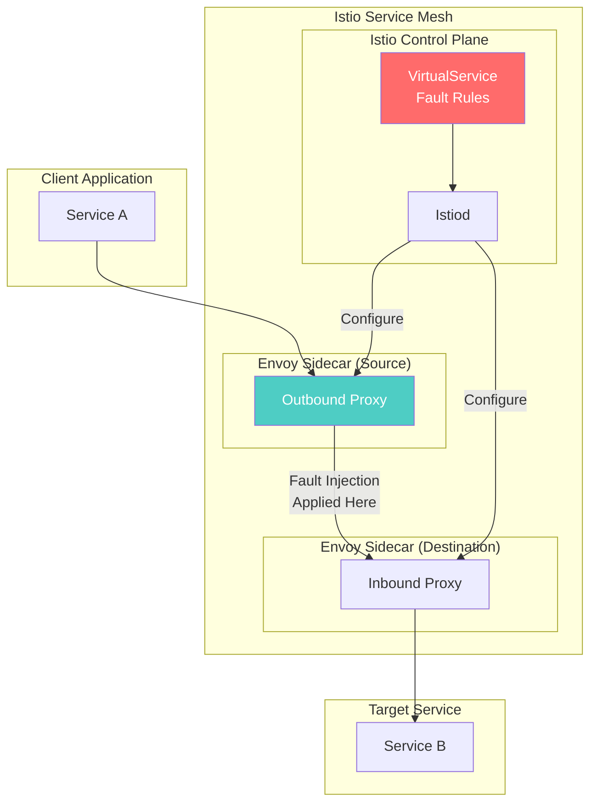
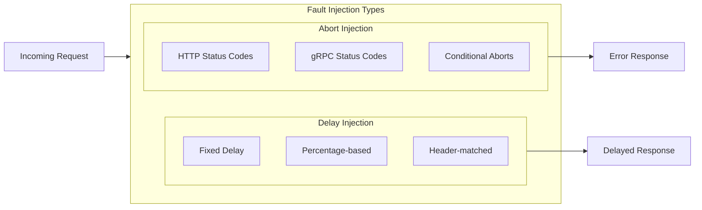
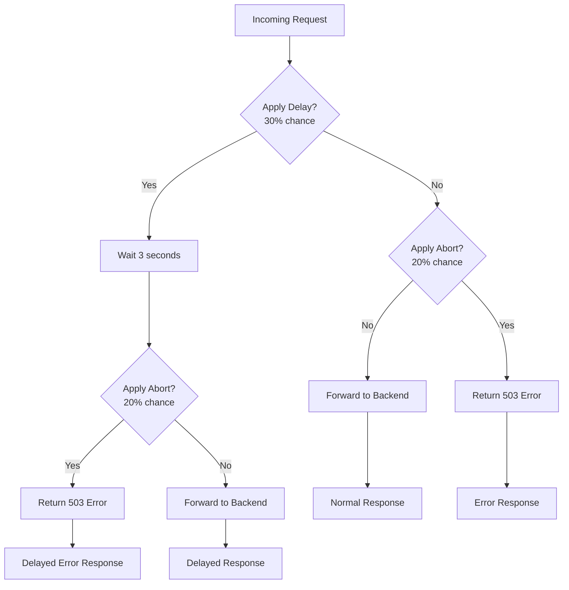
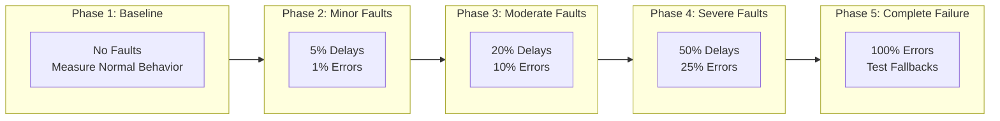

# How to Test Resilience with Istio Fault Injection

Author: [nawazdhandala](https://github.com/nawazdhandala)

Tags: Istio, Fault Injection, Chaos Engineering, Service Mesh, Testing

Description: A guide to using Istio fault injection for chaos engineering and resilience testing.

---

## Introduction

In modern microservices architectures, failures are inevitable. Networks become congested, services become overloaded, and dependencies fail unexpectedly. The key to building resilient systems is not preventing all failures but ensuring your application can gracefully handle them when they occur.

Istio's fault injection capabilities allow you to proactively test how your services respond to failures without modifying application code. By injecting faults at the service mesh layer, you can simulate real-world failure scenarios and validate that your error handling, timeouts, retries, and circuit breakers work as expected.

This guide covers everything you need to know about using Istio fault injection for chaos engineering and resilience testing.

## What is Fault Injection?

Fault injection is a testing technique that deliberately introduces errors into a system to verify its behavior under adverse conditions. In the context of Istio, fault injection allows you to:

- **Simulate network delays** to test timeout configurations
- **Inject HTTP errors** to verify error handling logic
- **Test circuit breaker behavior** under failure conditions
- **Validate retry mechanisms** when services are temporarily unavailable
- **Assess user experience** during partial outages

## Fault Injection Architecture in Istio

The following diagram illustrates how Istio fault injection works within the service mesh:



Fault injection in Istio occurs at the Envoy proxy level, which means:
- No code changes are required in your applications
- Faults are injected transparently at the network layer
- You can target specific routes, headers, or traffic percentages
- Faults can be enabled or disabled dynamically

## Types of Fault Injection

Istio supports two primary types of fault injection:



### 1. Delay Injection

Delay injection introduces latency before forwarding requests to the destination service. This helps test:
- Timeout configurations
- Request queuing behavior
- User experience during slow responses
- Cascading failure scenarios

### 2. Abort Injection

Abort injection returns an error response without forwarding the request to the destination. This helps test:
- Error handling logic
- Retry mechanisms
- Circuit breaker activation
- Fallback behavior

## Prerequisites

Before implementing fault injection, ensure you have:

The following command checks if Istio is installed and shows the version:

```bash
# Verify Istio installation
istioctl version

# Expected output should show both client and control plane versions
# Example:
# client version: 1.20.0
# control plane version: 1.20.0
```

Check that your namespace has automatic sidecar injection enabled:

```bash
# Check if your namespace has istio-injection enabled
kubectl get namespace -L istio-injection

# Enable sidecar injection for your namespace if not already enabled
kubectl label namespace default istio-injection=enabled
```

## Sample Application Setup

For this tutorial, we will use a simple microservices application with three services. First, let us deploy the sample application:

This Kubernetes manifest defines our sample application with a frontend, backend, and database service. The frontend calls the backend, which in turn calls the database:

```yaml
# sample-application.yaml
# This manifest deploys a three-tier application for testing fault injection
# Frontend -> Backend -> Database
---
apiVersion: v1
kind: Namespace
metadata:
  name: fault-injection-demo
  labels:
    # Enable Istio sidecar injection for all pods in this namespace
    istio-injection: enabled
---
# Frontend Deployment - The entry point for our application
apiVersion: apps/v1
kind: Deployment
metadata:
  name: frontend
  namespace: fault-injection-demo
spec:
  replicas: 2
  selector:
    matchLabels:
      app: frontend
  template:
    metadata:
      labels:
        app: frontend
        # Version label is important for traffic management and fault injection
        version: v1
    spec:
      containers:
      - name: frontend
        image: nginx:alpine
        ports:
        - containerPort: 80
        # Resource limits ensure predictable behavior during testing
        resources:
          requests:
            cpu: 100m
            memory: 128Mi
          limits:
            cpu: 200m
            memory: 256Mi
---
# Frontend Service - Exposes the frontend deployment
apiVersion: v1
kind: Service
metadata:
  name: frontend
  namespace: fault-injection-demo
spec:
  ports:
  - port: 80
    targetPort: 80
    name: http
  selector:
    app: frontend
---
# Backend Deployment - Handles business logic
apiVersion: apps/v1
kind: Deployment
metadata:
  name: backend
  namespace: fault-injection-demo
spec:
  replicas: 2
  selector:
    matchLabels:
      app: backend
  template:
    metadata:
      labels:
        app: backend
        version: v1
    spec:
      containers:
      - name: backend
        image: python:3.9-slim
        ports:
        - containerPort: 8080
        # Simple HTTP server for testing
        command: ["python", "-m", "http.server", "8080"]
        resources:
          requests:
            cpu: 100m
            memory: 128Mi
          limits:
            cpu: 200m
            memory: 256Mi
---
# Backend Service
apiVersion: v1
kind: Service
metadata:
  name: backend
  namespace: fault-injection-demo
spec:
  ports:
  - port: 8080
    targetPort: 8080
    # Named port is required for Istio protocol detection
    name: http
  selector:
    app: backend
---
# Database Deployment - Simulates a database service
apiVersion: apps/v1
kind: Deployment
metadata:
  name: database
  namespace: fault-injection-demo
spec:
  replicas: 1
  selector:
    matchLabels:
      app: database
  template:
    metadata:
      labels:
        app: database
        version: v1
    spec:
      containers:
      - name: database
        image: redis:alpine
        ports:
        - containerPort: 6379
        resources:
          requests:
            cpu: 100m
            memory: 128Mi
          limits:
            cpu: 200m
            memory: 256Mi
---
# Database Service
apiVersion: v1
kind: Service
metadata:
  name: database
  namespace: fault-injection-demo
spec:
  ports:
  - port: 6379
    targetPort: 6379
    name: tcp-redis
  selector:
    app: database
```

Apply the sample application:

```bash
# Deploy the sample application to your cluster
kubectl apply -f sample-application.yaml

# Wait for all pods to be ready before proceeding with fault injection tests
kubectl wait --for=condition=Ready pods --all -n fault-injection-demo --timeout=120s

# Verify all pods are running with Istio sidecars (2/2 containers)
kubectl get pods -n fault-injection-demo
```

## Delay Injection

### Basic Delay Injection

Delay injection adds latency to requests, simulating slow network conditions or overloaded services. This VirtualService configuration introduces a 5-second delay to all requests to the backend service:

```yaml
# delay-injection-basic.yaml
# This VirtualService introduces a fixed delay for all traffic to the backend
# Use this to test timeout configurations and user experience during slowdowns
apiVersion: networking.istio.io/v1beta1
kind: VirtualService
metadata:
  name: backend-delay
  namespace: fault-injection-demo
spec:
  # Target the backend service for fault injection
  hosts:
  - backend
  http:
  - fault:
      delay:
        # Percentage of requests to delay (100% means all requests)
        percentage:
          value: 100
        # Fixed delay duration - requests will be held for this duration
        # before being forwarded to the backend service
        fixedDelay: 5s
    route:
    - destination:
        host: backend
        port:
          number: 8080
```

Apply the delay injection:

```bash
# Apply the delay injection configuration
kubectl apply -f delay-injection-basic.yaml

# Test the delay by making a request and measuring response time
# The time command will show the actual delay introduced
kubectl exec -n fault-injection-demo deploy/frontend -- \
  sh -c "time wget -qO- http://backend:8080 2>&1"
```

### Percentage-Based Delay Injection

In production chaos testing, you typically do not want to affect all traffic. This configuration delays only 50% of requests, allowing you to observe how your application handles inconsistent latency:

```yaml
# delay-injection-percentage.yaml
# Delays only a percentage of requests to simulate intermittent network issues
# This is more realistic for production chaos testing scenarios
apiVersion: networking.istio.io/v1beta1
kind: VirtualService
metadata:
  name: backend-partial-delay
  namespace: fault-injection-demo
spec:
  hosts:
  - backend
  http:
  - fault:
      delay:
        # Only 50% of requests will experience the delay
        # The other 50% will proceed normally
        percentage:
          value: 50
        # 3-second delay for affected requests
        fixedDelay: 3s
    route:
    - destination:
        host: backend
        port:
          number: 8080
```

### Header-Based Delay Injection

For targeted testing without affecting all users, you can inject faults only for requests with specific headers. This is useful for testing in production with test accounts:

```yaml
# delay-injection-header.yaml
# Injects delay only for requests with a specific header
# Perfect for testing in production without affecting real users
apiVersion: networking.istio.io/v1beta1
kind: VirtualService
metadata:
  name: backend-header-delay
  namespace: fault-injection-demo
spec:
  hosts:
  - backend
  http:
  # First rule: Apply delay only to requests with the test header
  - match:
    - headers:
        # Only requests with this header will be affected
        x-fault-injection-test:
          exact: "true"
    fault:
      delay:
        percentage:
          value: 100
        fixedDelay: 5s
    route:
    - destination:
        host: backend
        port:
          number: 8080
  # Second rule: Default route for all other requests (no fault injection)
  - route:
    - destination:
        host: backend
        port:
          number: 8080
```

Test the header-based delay:

```bash
# Request WITHOUT the test header - should respond quickly
kubectl exec -n fault-injection-demo deploy/frontend -- \
  wget -qO- http://backend:8080

# Request WITH the test header - should experience 5-second delay
kubectl exec -n fault-injection-demo deploy/frontend -- \
  wget -qO- --header="x-fault-injection-test: true" http://backend:8080
```

## Abort/Error Injection

### Basic HTTP Error Injection

Abort injection returns error responses without forwarding requests to the destination. This VirtualService returns HTTP 503 (Service Unavailable) for all requests:

```yaml
# abort-injection-basic.yaml
# Returns HTTP 503 errors for all requests to the backend
# Use this to test error handling and fallback mechanisms
apiVersion: networking.istio.io/v1beta1
kind: VirtualService
metadata:
  name: backend-abort
  namespace: fault-injection-demo
spec:
  hosts:
  - backend
  http:
  - fault:
      abort:
        # Return this HTTP status code instead of forwarding the request
        httpStatus: 503
        # Percentage of requests to abort
        percentage:
          value: 100
    route:
    - destination:
        host: backend
        port:
          number: 8080
```

### Multiple HTTP Error Codes

You can test different error scenarios by using different HTTP status codes. Here are common codes to test:

```yaml
# abort-injection-404.yaml
# Returns HTTP 404 (Not Found) to test missing resource handling
apiVersion: networking.istio.io/v1beta1
kind: VirtualService
metadata:
  name: backend-abort-404
  namespace: fault-injection-demo
spec:
  hosts:
  - backend
  http:
  - fault:
      abort:
        # 404 Not Found - tests handling of missing resources
        httpStatus: 404
        percentage:
          value: 100
    route:
    - destination:
        host: backend
        port:
          number: 8080
---
# abort-injection-500.yaml
# Returns HTTP 500 (Internal Server Error) to test server error handling
apiVersion: networking.istio.io/v1beta1
kind: VirtualService
metadata:
  name: backend-abort-500
  namespace: fault-injection-demo
spec:
  hosts:
  - backend
  http:
  - fault:
      abort:
        # 500 Internal Server Error - tests handling of server failures
        httpStatus: 500
        percentage:
          value: 100
    route:
    - destination:
        host: backend
        port:
          number: 8080
---
# abort-injection-429.yaml
# Returns HTTP 429 (Too Many Requests) to test rate limiting handling
apiVersion: networking.istio.io/v1beta1
kind: VirtualService
metadata:
  name: backend-abort-429
  namespace: fault-injection-demo
spec:
  hosts:
  - backend
  http:
  - fault:
      abort:
        # 429 Too Many Requests - tests rate limiting and backoff logic
        httpStatus: 429
        percentage:
          value: 100
    route:
    - destination:
        host: backend
        port:
          number: 8080
```

### gRPC Error Injection

For gRPC services, you can inject gRPC-specific status codes. This is essential for testing gRPC error handling:

```yaml
# abort-injection-grpc.yaml
# Injects gRPC status codes for gRPC services
# gRPC uses different status codes than HTTP
apiVersion: networking.istio.io/v1beta1
kind: VirtualService
metadata:
  name: grpc-service-abort
  namespace: fault-injection-demo
spec:
  hosts:
  - grpc-backend
  http:
  - fault:
      abort:
        # gRPC status code 14 = UNAVAILABLE
        # Common gRPC codes:
        # 0 = OK
        # 1 = CANCELLED
        # 2 = UNKNOWN
        # 3 = INVALID_ARGUMENT
        # 4 = DEADLINE_EXCEEDED
        # 5 = NOT_FOUND
        # 13 = INTERNAL
        # 14 = UNAVAILABLE
        grpcStatus: "UNAVAILABLE"
        percentage:
          value: 50
    route:
    - destination:
        host: grpc-backend
        port:
          number: 9090
```

### Percentage-Based Error Injection

For realistic chaos testing, inject errors for only a portion of requests:

```yaml
# abort-injection-percentage.yaml
# Injects errors for 25% of requests, simulating intermittent failures
# This tests how well your application handles partial outages
apiVersion: networking.istio.io/v1beta1
kind: VirtualService
metadata:
  name: backend-partial-abort
  namespace: fault-injection-demo
spec:
  hosts:
  - backend
  http:
  - fault:
      abort:
        httpStatus: 503
        # Only 25% of requests will fail
        # 75% will succeed normally
        percentage:
          value: 25
    route:
    - destination:
        host: backend
        port:
          number: 8080
```

## Combined Fault Injection

### Delay and Abort Together

You can combine delay and abort injection to create more complex failure scenarios. This configuration adds a delay AND returns errors for different percentages of traffic:

```yaml
# combined-fault-injection.yaml
# Combines both delay and abort injection for comprehensive testing
# Some requests are delayed, some fail, and some succeed normally
apiVersion: networking.istio.io/v1beta1
kind: VirtualService
metadata:
  name: backend-combined-faults
  namespace: fault-injection-demo
spec:
  hosts:
  - backend
  http:
  - fault:
      delay:
        # 30% of requests will be delayed by 3 seconds
        percentage:
          value: 30
        fixedDelay: 3s
      abort:
        # 20% of requests will return 503 error
        # Note: These percentages are independent
        # A request could be both delayed AND aborted
        httpStatus: 503
        percentage:
          value: 20
    route:
    - destination:
        host: backend
        port:
          number: 8080
```

The combined fault injection flow:



## Route-Specific Fault Injection

### Path-Based Fault Injection

Inject faults only for specific API endpoints. This is useful for testing critical paths without affecting the entire service:

```yaml
# route-specific-faults.yaml
# Injects faults only for specific paths
# Useful for testing critical endpoints in isolation
apiVersion: networking.istio.io/v1beta1
kind: VirtualService
metadata:
  name: backend-route-faults
  namespace: fault-injection-demo
spec:
  hosts:
  - backend
  http:
  # Rule 1: Inject delay for payment-related endpoints
  # Payment endpoints are critical and should be tested for timeout handling
  - match:
    - uri:
        prefix: /api/payments
    fault:
      delay:
        percentage:
          value: 100
        # Longer delay for payment endpoints to test timeout handling
        fixedDelay: 10s
    route:
    - destination:
        host: backend
        port:
          number: 8080

  # Rule 2: Inject 503 errors for inventory check endpoints
  # Tests how the checkout process handles inventory service failures
  - match:
    - uri:
        prefix: /api/inventory
    fault:
      abort:
        httpStatus: 503
        percentage:
          value: 50
    route:
    - destination:
        host: backend
        port:
          number: 8080

  # Rule 3: Default route - no fault injection
  # All other paths work normally
  - route:
    - destination:
        host: backend
        port:
          number: 8080
```

### User-Based Fault Injection

Target specific users for testing using headers or cookies:

```yaml
# user-based-faults.yaml
# Injects faults only for specific test users
# Perfect for testing in production without affecting real customers
apiVersion: networking.istio.io/v1beta1
kind: VirtualService
metadata:
  name: backend-user-faults
  namespace: fault-injection-demo
spec:
  hosts:
  - backend
  http:
  # Rule for test users - inject faults
  - match:
    - headers:
        # Target requests from test users
        x-user-type:
          exact: "test-user"
    fault:
      delay:
        percentage:
          value: 100
        fixedDelay: 5s
      abort:
        httpStatus: 500
        # 10% of test user requests will fail
        percentage:
          value: 10
    route:
    - destination:
        host: backend
        port:
          number: 8080

  # Rule for canary testing - inject minor delays
  - match:
    - headers:
        x-canary:
          exact: "true"
    fault:
      delay:
        percentage:
          value: 20
        fixedDelay: 2s
    route:
    - destination:
        host: backend
        port:
          number: 8080

  # Default route for production users - no faults
  - route:
    - destination:
        host: backend
        port:
          number: 8080
```

## Chaos Testing Strategies

### Progressive Chaos Testing

Start with minimal impact and gradually increase fault severity:



Here are VirtualService configurations for each phase:

```yaml
# chaos-phase-1-baseline.yaml
# Phase 1: No faults - establish baseline metrics
apiVersion: networking.istio.io/v1beta1
kind: VirtualService
metadata:
  name: backend-chaos-test
  namespace: fault-injection-demo
spec:
  hosts:
  - backend
  http:
  # No fault injection - measure normal behavior
  - route:
    - destination:
        host: backend
        port:
          number: 8080
---
# chaos-phase-2-minor.yaml
# Phase 2: Minor faults - 5% delay, 1% errors
apiVersion: networking.istio.io/v1beta1
kind: VirtualService
metadata:
  name: backend-chaos-test
  namespace: fault-injection-demo
spec:
  hosts:
  - backend
  http:
  - fault:
      delay:
        percentage:
          value: 5
        fixedDelay: 2s
      abort:
        httpStatus: 503
        percentage:
          value: 1
    route:
    - destination:
        host: backend
        port:
          number: 8080
---
# chaos-phase-3-moderate.yaml
# Phase 3: Moderate faults - 20% delay, 10% errors
apiVersion: networking.istio.io/v1beta1
kind: VirtualService
metadata:
  name: backend-chaos-test
  namespace: fault-injection-demo
spec:
  hosts:
  - backend
  http:
  - fault:
      delay:
        percentage:
          value: 20
        fixedDelay: 3s
      abort:
        httpStatus: 503
        percentage:
          value: 10
    route:
    - destination:
        host: backend
        port:
          number: 8080
---
# chaos-phase-4-severe.yaml
# Phase 4: Severe faults - 50% delay, 25% errors
apiVersion: networking.istio.io/v1beta1
kind: VirtualService
metadata:
  name: backend-chaos-test
  namespace: fault-injection-demo
spec:
  hosts:
  - backend
  http:
  - fault:
      delay:
        percentage:
          value: 50
        fixedDelay: 5s
      abort:
        httpStatus: 503
        percentage:
          value: 25
    route:
    - destination:
        host: backend
        port:
          number: 8080
---
# chaos-phase-5-complete.yaml
# Phase 5: Complete failure - 100% errors to test fallbacks
apiVersion: networking.istio.io/v1beta1
kind: VirtualService
metadata:
  name: backend-chaos-test
  namespace: fault-injection-demo
spec:
  hosts:
  - backend
  http:
  - fault:
      abort:
        httpStatus: 503
        percentage:
          value: 100
    route:
    - destination:
        host: backend
        port:
          number: 8080
```

### Automated Chaos Testing Script

Use this script to run progressive chaos tests:

```bash
#!/bin/bash
# chaos-test.sh
# Automated progressive chaos testing script
# This script applies increasingly severe faults and measures system behavior

NAMESPACE="fault-injection-demo"
TEST_DURATION=60  # seconds per phase

# Function to apply a chaos phase
apply_chaos_phase() {
    local phase=$1
    local config_file=$2

    echo "=========================================="
    echo "Starting Phase $phase"
    echo "=========================================="

    # Apply the fault injection configuration
    kubectl apply -f $config_file

    # Wait for configuration to propagate
    sleep 5

    # Run load test and collect metrics
    echo "Running load test for $TEST_DURATION seconds..."

    # Use hey or any load testing tool
    # This generates traffic while faults are active
    kubectl exec -n $NAMESPACE deploy/frontend -- \
        sh -c "for i in \$(seq 1 100); do wget -qO- http://backend:8080 2>&1; done" &

    # Collect metrics during the test
    sleep $TEST_DURATION

    echo "Phase $phase complete"
    echo ""
}

# Baseline phase - no faults
apply_chaos_phase "1 (Baseline)" "chaos-phase-1-baseline.yaml"

# Minor faults
apply_chaos_phase "2 (Minor Faults)" "chaos-phase-2-minor.yaml"

# Moderate faults
apply_chaos_phase "3 (Moderate Faults)" "chaos-phase-3-moderate.yaml"

# Severe faults
apply_chaos_phase "4 (Severe Faults)" "chaos-phase-4-severe.yaml"

# Complete failure
apply_chaos_phase "5 (Complete Failure)" "chaos-phase-5-complete.yaml"

# Cleanup - remove fault injection
echo "Cleaning up fault injection..."
kubectl delete virtualservice backend-chaos-test -n $NAMESPACE

echo "Chaos testing complete!"
```

### Service Dependency Testing

Test resilience across service dependencies:

```yaml
# dependency-chain-faults.yaml
# Tests the entire dependency chain: Frontend -> Backend -> Database
# This helps identify weak points in your service mesh
apiVersion: networking.istio.io/v1beta1
kind: VirtualService
metadata:
  name: database-faults
  namespace: fault-injection-demo
spec:
  hosts:
  - database
  http:
  - fault:
      delay:
        # Database delays often cascade through the entire system
        # This tests how upstream services handle slow database responses
        percentage:
          value: 30
        fixedDelay: 2s
      abort:
        # Database unavailability is a critical failure scenario
        httpStatus: 503
        percentage:
          value: 10
    route:
    - destination:
        host: database
        port:
          number: 6379
---
# Separate fault injection for the backend
apiVersion: networking.istio.io/v1beta1
kind: VirtualService
metadata:
  name: backend-faults
  namespace: fault-injection-demo
spec:
  hosts:
  - backend
  http:
  - fault:
      delay:
        percentage:
          value: 20
        fixedDelay: 1s
    route:
    - destination:
        host: backend
        port:
          number: 8080
```

## Monitoring Fault Injection

### Prometheus Metrics

Istio exposes metrics that help you monitor fault injection impact. Use these PromQL queries:

```promql
# Request latency histogram - shows the impact of delay injection
# Higher latency values indicate successful delay injection
histogram_quantile(0.99,
  sum(rate(istio_request_duration_milliseconds_bucket{
    destination_service="backend.fault-injection-demo.svc.cluster.local"
  }[5m])) by (le)
)

# Error rate - shows the impact of abort injection
# Higher error rates indicate successful error injection
sum(rate(istio_requests_total{
  destination_service="backend.fault-injection-demo.svc.cluster.local",
  response_code=~"5.*"
}[5m])) /
sum(rate(istio_requests_total{
  destination_service="backend.fault-injection-demo.svc.cluster.local"
}[5m]))

# Request success rate during chaos testing
# This is the inverse of error rate and shows overall system health
1 - (
  sum(rate(istio_requests_total{
    destination_service="backend.fault-injection-demo.svc.cluster.local",
    response_code=~"5.*"
  }[5m])) /
  sum(rate(istio_requests_total{
    destination_service="backend.fault-injection-demo.svc.cluster.local"
  }[5m]))
)
```

### Kiali Dashboard

View fault injection impact in Kiali:

```bash
# Port-forward to Kiali dashboard
kubectl port-forward svc/kiali -n istio-system 20001:20001

# Open http://localhost:20001 in your browser
# Navigate to Graph view to see traffic flow with error rates
```

### Jaeger Tracing

Distributed traces show the exact impact of fault injection:

```bash
# Port-forward to Jaeger dashboard
kubectl port-forward svc/tracing -n istio-system 16686:16686

# Open http://localhost:16686 in your browser
# Look for traces with increased duration (delay injection)
# or traces that end with error status (abort injection)
```

## Integration with CI/CD

### Automated Resilience Testing

Integrate fault injection tests into your CI/CD pipeline:

```yaml
# .github/workflows/resilience-tests.yaml
# GitHub Actions workflow for automated resilience testing
name: Resilience Tests

on:
  push:
    branches: [main]
  pull_request:
    branches: [main]
  # Allow manual triggering for ad-hoc testing
  workflow_dispatch:

jobs:
  resilience-test:
    runs-on: ubuntu-latest
    steps:
    - uses: actions/checkout@v3

    # Set up a local Kubernetes cluster for testing
    - name: Create k8s cluster
      uses: helm/kind-action@v1
      with:
        cluster_name: resilience-test

    # Install Istio for fault injection capabilities
    - name: Install Istio
      run: |
        # Download and install Istio CLI
        curl -L https://istio.io/downloadIstio | ISTIO_VERSION=1.20.0 sh -
        cd istio-1.20.0
        export PATH=$PWD/bin:$PATH

        # Install Istio with demo profile for testing
        istioctl install --set profile=demo -y

        # Enable sidecar injection for default namespace
        kubectl label namespace default istio-injection=enabled

    # Deploy the application under test
    - name: Deploy Application
      run: |
        kubectl apply -f k8s/
        kubectl wait --for=condition=Ready pods --all --timeout=120s

    # Run baseline tests without fault injection
    - name: Run Baseline Tests
      run: |
        # Measure baseline performance
        ./scripts/load-test.sh --duration 60 --output baseline-results.json

    # Apply fault injection and run tests
    - name: Run Fault Injection Tests
      run: |
        # Apply delay injection
        kubectl apply -f istio/fault-injection/delay-test.yaml
        sleep 10
        ./scripts/load-test.sh --duration 60 --output delay-results.json

        # Apply error injection
        kubectl apply -f istio/fault-injection/abort-test.yaml
        sleep 10
        ./scripts/load-test.sh --duration 60 --output abort-results.json

    # Validate that the application handled faults gracefully
    - name: Validate Resilience
      run: |
        # Check that error rates stayed within acceptable bounds
        # Check that response times degraded gracefully
        # Check that no cascading failures occurred
        ./scripts/validate-resilience.sh \
          --baseline baseline-results.json \
          --delay delay-results.json \
          --abort abort-results.json \
          --max-error-rate 0.05 \
          --max-latency-increase 2.0

    # Upload test results as artifacts
    - name: Upload Results
      uses: actions/upload-artifact@v3
      with:
        name: resilience-test-results
        path: |
          *-results.json
```

### Resilience Validation Script

```bash
#!/bin/bash
# validate-resilience.sh
# Validates that the application meets resilience requirements

set -e

# Parse command line arguments
while [[ $# -gt 0 ]]; do
    case $1 in
        --baseline) BASELINE_FILE="$2"; shift 2 ;;
        --delay) DELAY_FILE="$2"; shift 2 ;;
        --abort) ABORT_FILE="$2"; shift 2 ;;
        --max-error-rate) MAX_ERROR_RATE="$2"; shift 2 ;;
        --max-latency-increase) MAX_LATENCY_INCREASE="$2"; shift 2 ;;
        *) echo "Unknown option: $1"; exit 1 ;;
    esac
done

echo "Validating resilience test results..."

# Extract metrics from test results
BASELINE_ERROR_RATE=$(jq '.error_rate' $BASELINE_FILE)
DELAY_ERROR_RATE=$(jq '.error_rate' $DELAY_FILE)
ABORT_ERROR_RATE=$(jq '.error_rate' $ABORT_FILE)

BASELINE_P99=$(jq '.latency_p99' $BASELINE_FILE)
DELAY_P99=$(jq '.latency_p99' $DELAY_FILE)

echo "Baseline error rate: $BASELINE_ERROR_RATE"
echo "Delay test error rate: $DELAY_ERROR_RATE"
echo "Abort test error rate: $ABORT_ERROR_RATE"

# Validate error rates
# During fault injection, error rate should stay below threshold
if (( $(echo "$ABORT_ERROR_RATE > $MAX_ERROR_RATE" | bc -l) )); then
    echo "FAIL: Error rate during abort injection ($ABORT_ERROR_RATE) exceeds maximum ($MAX_ERROR_RATE)"
    exit 1
fi

# Validate latency increase
# Latency should not increase more than the expected amount
LATENCY_RATIO=$(echo "$DELAY_P99 / $BASELINE_P99" | bc -l)
if (( $(echo "$LATENCY_RATIO > $MAX_LATENCY_INCREASE" | bc -l) )); then
    echo "FAIL: Latency increase ratio ($LATENCY_RATIO) exceeds maximum ($MAX_LATENCY_INCREASE)"
    exit 1
fi

echo "SUCCESS: All resilience checks passed!"
exit 0
```

## Best Practices

### 1. Start Small and Iterate

Begin with minimal fault percentages and gradually increase:

```yaml
# Good: Start with low percentages
fault:
  abort:
    httpStatus: 503
    percentage:
      value: 5  # Start at 5%

# Then gradually increase based on results
# 5% -> 10% -> 25% -> 50%
```

### 2. Use Header-Based Targeting in Production

Never inject faults for all traffic in production. Use headers to target specific test traffic:

```yaml
# Safe for production: Target only test traffic
http:
- match:
  - headers:
      x-chaos-test:
        exact: "enabled"
  fault:
    abort:
      httpStatus: 503
      percentage:
        value: 100
  route:
  - destination:
      host: backend
# Default route without faults for production traffic
- route:
  - destination:
      host: backend
```

### 3. Monitor Key Metrics

Always monitor these metrics during fault injection:

- **Error rate**: Should stay within acceptable bounds
- **Latency percentiles**: P50, P95, P99 response times
- **Request throughput**: Should not drop significantly
- **Circuit breaker state**: Should activate when expected
- **Retry counts**: Should increase during failures

### 4. Document Expected Behavior

Create a resilience requirements document:

```yaml
# resilience-requirements.yaml
# Document expected behavior during various failure scenarios
requirements:
  backend-service:
    max_error_rate: 0.05  # 5% maximum error rate
    max_latency_p99: 2s   # 99th percentile latency
    circuit_breaker:
      threshold: 50%      # Open at 50% error rate
      recovery_time: 30s  # Time before half-open state

  database-service:
    max_error_rate: 0.01  # 1% maximum error rate
    retry_attempts: 3     # Number of retries before failing
    timeout: 5s           # Request timeout

  frontend-service:
    graceful_degradation: true  # Should show cached/default content
    fallback_enabled: true      # Should use fallback service
```

### 5. Clean Up After Testing

Always remove fault injection configurations after testing:

```bash
# Remove all fault injection VirtualServices from the namespace
kubectl delete virtualservice -n fault-injection-demo --all

# Or remove specific VirtualServices
kubectl delete virtualservice backend-delay -n fault-injection-demo
kubectl delete virtualservice backend-abort -n fault-injection-demo

# Verify cleanup
kubectl get virtualservice -n fault-injection-demo
```

## Troubleshooting

### Common Issues and Solutions

**Issue: Fault injection not working**

Check that:
1. The VirtualService host matches the service name exactly
2. The namespace has Istio sidecar injection enabled
3. The destination port name follows Istio naming conventions

```bash
# Verify sidecar injection
kubectl get pods -n fault-injection-demo -o jsonpath='{range .items[*]}{.metadata.name}{"\t"}{.spec.containers[*].name}{"\n"}{end}'

# Check VirtualService configuration
istioctl analyze -n fault-injection-demo

# View Envoy configuration for fault injection
istioctl proxy-config route deploy/frontend -n fault-injection-demo -o json | grep -A 20 "fault"
```

**Issue: Faults applied to wrong traffic**

Verify your match conditions:

```bash
# List all VirtualServices and their matching rules
kubectl get virtualservice -n fault-injection-demo -o yaml

# Check the order of rules (first match wins)
istioctl analyze -n fault-injection-demo
```

**Issue: Unexpected latency**

Check if multiple fault injections are being applied:

```bash
# List all VirtualServices that might affect a service
kubectl get virtualservice -n fault-injection-demo -o jsonpath='{range .items[*]}{.metadata.name}: {.spec.hosts[*]}{"\n"}{end}'
```

## Conclusion

Istio fault injection is a powerful tool for building resilient microservices. By systematically testing your application's behavior under various failure conditions, you can:

- Identify weaknesses before they cause production incidents
- Validate that timeout, retry, and circuit breaker configurations work correctly
- Ensure graceful degradation when dependencies fail
- Build confidence in your system's reliability

Key takeaways:

1. **Start with delay injection** to test timeout handling
2. **Use abort injection** to test error handling and fallbacks
3. **Combine both** for realistic failure scenarios
4. **Use percentage-based faults** for gradual chaos testing
5. **Target specific traffic** using headers in production
6. **Monitor metrics** to validate expected behavior
7. **Automate tests** in your CI/CD pipeline

Remember that fault injection is just one aspect of chaos engineering. Combine it with other techniques like pod termination, network partitioning, and resource exhaustion for comprehensive resilience testing.

## Additional Resources

- [Istio Fault Injection Documentation](https://istio.io/latest/docs/tasks/traffic-management/fault-injection/)
- [Istio VirtualService Reference](https://istio.io/latest/docs/reference/config/networking/virtual-service/)
- [Chaos Engineering Principles](https://principlesofchaos.org/)
- [Envoy Fault Injection Filter](https://www.envoyproxy.io/docs/envoy/latest/configuration/http/http_filters/fault_filter)
