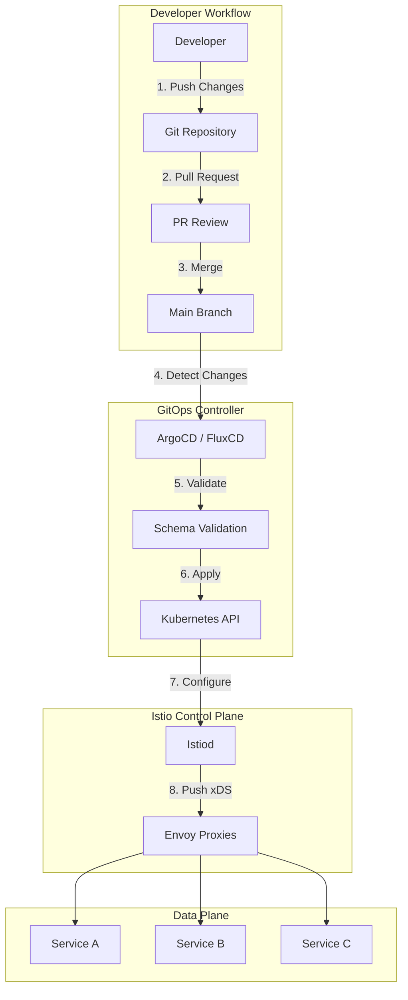
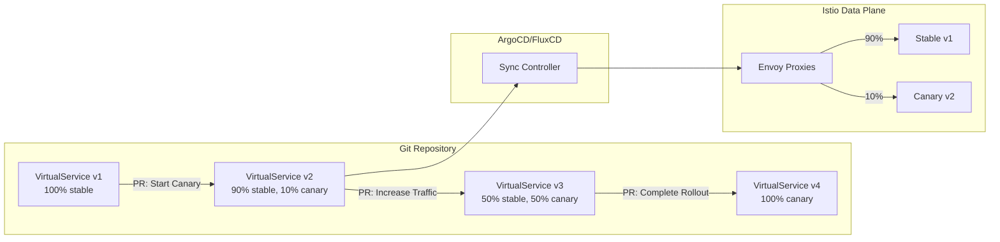
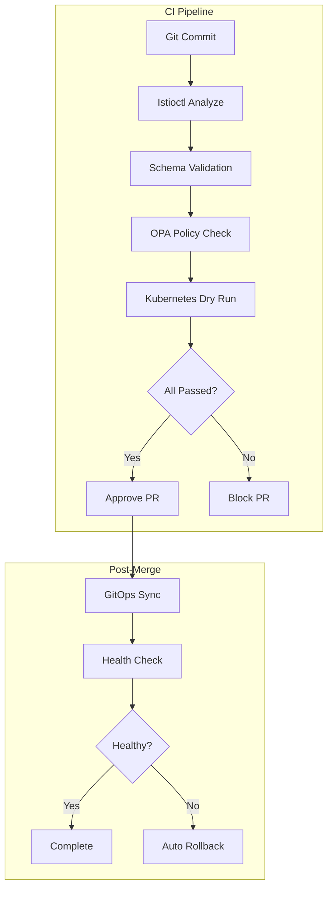

# How to Manage Istio Configurations with GitOps

Author: [nawazdhandala](https://github.com/nawazdhandala)

Tags: Istio, GitOps, ArgoCD, FluxCD, Service Mesh, DevOps

Description: Learn how to implement GitOps workflows for Istio configuration management.

---

Managing Istio configurations in production environments can quickly become complex as your service mesh grows. GitOps provides a declarative, version-controlled approach to managing these configurations, ensuring consistency, auditability, and reliable deployments. In this comprehensive guide, we will explore how to implement GitOps workflows for Istio using popular tools like ArgoCD and FluxCD.

## Table of Contents

1. [Understanding GitOps for Service Mesh](#understanding-gitops-for-service-mesh)
2. [GitOps Architecture with Istio](#gitops-architecture-with-istio)
3. [Repository Structure for Istio Configurations](#repository-structure-for-istio-configurations)
4. [ArgoCD Integration with Istio](#argocd-integration-with-istio)
5. [FluxCD Integration with Istio](#fluxcd-integration-with-istio)
6. [Progressive Delivery Patterns](#progressive-delivery-patterns)
7. [Validation Workflows](#validation-workflows)
8. [Best Practices and Production Considerations](#best-practices-and-production-considerations)

## Understanding GitOps for Service Mesh

GitOps is a paradigm that uses Git repositories as the single source of truth for declarative infrastructure and applications. When applied to Istio, GitOps provides several key benefits:

- **Version Control**: Every configuration change is tracked in Git history
- **Audit Trail**: Complete visibility into who changed what and when
- **Rollback Capability**: Easy recovery from misconfigurations
- **Consistency**: Identical configurations across environments
- **Collaboration**: Pull request workflows for configuration reviews

## GitOps Architecture with Istio

The following diagram illustrates the typical GitOps workflow for managing Istio configurations:



This architecture ensures that all Istio configuration changes flow through a controlled pipeline, from code review to production deployment.

## Repository Structure for Istio Configurations

A well-organized repository structure is crucial for managing Istio configurations at scale. Here is a recommended structure that separates concerns and supports multiple environments:

```
# Directory structure for Istio GitOps repository
# Organized by environment and resource type for clarity

istio-config/
├── base/                           # Base configurations shared across environments
│   ├── kustomization.yaml
│   ├── istio-system/              # Istio control plane configurations
│   │   ├── mesh-config.yaml
│   │   └── peer-authentication.yaml
│   ├── gateways/                  # Gateway definitions
│   │   ├── ingress-gateway.yaml
│   │   └── egress-gateway.yaml
│   ├── authorization/             # AuthorizationPolicy resources
│   │   └── default-deny.yaml
│   └── telemetry/                 # Telemetry configurations
│       └── access-logging.yaml
├── overlays/                      # Environment-specific overlays
│   ├── development/
│   │   ├── kustomization.yaml
│   │   └── patches/
│   ├── staging/
│   │   ├── kustomization.yaml
│   │   └── patches/
│   └── production/
│       ├── kustomization.yaml
│       └── patches/
├── applications/                  # Application-specific Istio resources
│   ├── frontend/
│   │   ├── virtual-service.yaml
│   │   ├── destination-rule.yaml
│   │   └── service-entry.yaml
│   └── backend/
│       ├── virtual-service.yaml
│       └── destination-rule.yaml
└── policies/                      # Security and rate limiting policies
    ├── rate-limits/
    └── wasm-plugins/
```

The base Kustomization file ties together all shared Istio resources. This file defines which resources are included in the base layer and can be extended by environment overlays:

```yaml
# base/kustomization.yaml
# This Kustomization file aggregates all base Istio resources
# that are shared across all environments

apiVersion: kustomize.config.k8s.io/v1beta1
kind: Kustomization

# Metadata labels applied to all resources for identification
commonLabels:
  app.kubernetes.io/managed-by: gitops
  istio.io/config-source: git

# All base resources to be included
resources:
  - istio-system/mesh-config.yaml
  - istio-system/peer-authentication.yaml
  - gateways/ingress-gateway.yaml
  - gateways/egress-gateway.yaml
  - authorization/default-deny.yaml
  - telemetry/access-logging.yaml
```

Environment-specific overlays customize the base configurations. This example shows how to override settings for the production environment:

```yaml
# overlays/production/kustomization.yaml
# Production overlay that inherits from base and applies
# production-specific patches and configurations

apiVersion: kustomize.config.k8s.io/v1beta1
kind: Kustomization

# Reference to the base configurations
resources:
  - ../../base

# Namespace for production Istio resources
namespace: istio-system

# Production-specific patches
patches:
  # Increase resource limits for production workloads
  - path: patches/gateway-resources.yaml
  # Enable stricter mTLS settings
  - path: patches/strict-mtls.yaml
  # Production-specific rate limiting
  - path: patches/rate-limits.yaml

# Production-specific labels
commonLabels:
  environment: production
```

## ArgoCD Integration with Istio

ArgoCD is a declarative, GitOps continuous delivery tool for Kubernetes. It excels at managing Istio configurations due to its support for health checks, sync waves, and custom resource definitions.

### Installing ArgoCD with Istio Support

First, install ArgoCD in your cluster with the necessary configurations to work with Istio CRDs:

```yaml
# argocd/installation/namespace.yaml
# Create a dedicated namespace for ArgoCD
# This namespace should be excluded from Istio sidecar injection
# to avoid circular dependencies during bootstrap

apiVersion: v1
kind: Namespace
metadata:
  name: argocd
  labels:
    # Disable Istio sidecar injection for ArgoCD components
    # ArgoCD needs to operate independently of the service mesh
    istio-injection: disabled
```

Configure ArgoCD to properly recognize and track Istio custom resources by adding health checks:

```yaml
# argocd/config/argocd-cm.yaml
# ArgoCD ConfigMap with Istio-specific configurations
# This enables proper health checking and resource tracking

apiVersion: v1
kind: ConfigMap
metadata:
  name: argocd-cm
  namespace: argocd
data:
  # Custom health checks for Istio resources
  # These Lua scripts determine the health status of Istio CRDs
  resource.customizations.health.networking.istio.io_VirtualService: |
    -- Health check for VirtualService resources
    -- Returns healthy if the resource has been accepted by Istiod
    hs = {}
    if obj.status ~= nil then
      if obj.status.validationMessages ~= nil then
        hs.status = "Degraded"
        hs.message = table.concat(obj.status.validationMessages, ", ")
        return hs
      end
    end
    hs.status = "Healthy"
    return hs

  resource.customizations.health.networking.istio.io_DestinationRule: |
    -- Health check for DestinationRule resources
    -- Validates that the destination rule is properly configured
    hs = {}
    if obj.status ~= nil and obj.status.validationMessages ~= nil then
      hs.status = "Degraded"
      hs.message = table.concat(obj.status.validationMessages, ", ")
      return hs
    end
    hs.status = "Healthy"
    return hs

  resource.customizations.health.security.istio.io_AuthorizationPolicy: |
    -- Health check for AuthorizationPolicy resources
    hs = {}
    hs.status = "Healthy"
    return hs

  resource.customizations.health.security.istio.io_PeerAuthentication: |
    -- Health check for PeerAuthentication resources
    hs = {}
    hs.status = "Healthy"
    return hs
```

### ArgoCD Application for Istio Configurations

Create an ArgoCD Application that manages your Istio configurations with proper sync policies:

```yaml
# argocd/applications/istio-config.yaml
# ArgoCD Application definition for Istio configurations
# This application syncs Istio resources from the Git repository

apiVersion: argoproj.io/v1alpha1
kind: Application
metadata:
  name: istio-config
  namespace: argocd
  # Finalizer ensures proper cleanup when the application is deleted
  finalizers:
    - resources-finalizer.argocd.argoproj.io
spec:
  # Project defines the RBAC boundaries for this application
  project: default

  # Source repository containing Istio configurations
  source:
    repoURL: https://github.com/your-org/istio-config.git
    targetRevision: main
    path: overlays/production

    # Kustomize-specific configurations
    kustomize:
      # Add common labels to all synced resources
      commonLabels:
        argocd.argoproj.io/managed: "true"

  # Destination cluster and namespace
  destination:
    server: https://kubernetes.default.svc
    namespace: istio-system

  # Sync policy defines how ArgoCD manages the resources
  syncPolicy:
    # Automated sync keeps the cluster in sync with Git
    automated:
      # Prune removes resources that are no longer in Git
      prune: true
      # Self-heal reverts manual changes to match Git
      selfHeal: true
      # Allow empty prevents errors when no resources exist
      allowEmpty: false

    # Sync options for fine-grained control
    syncOptions:
      # Create namespace if it doesn't exist
      - CreateNamespace=true
      # Validate resources against schema before applying
      - Validate=true
      # Use server-side apply for better conflict resolution
      - ServerSideApply=true
      # Respect ignore differences annotations
      - RespectIgnoreDifferences=true

    # Retry policy for failed syncs
    retry:
      limit: 5
      backoff:
        duration: 5s
        factor: 2
        maxDuration: 3m

  # Ignore differences that are expected to change at runtime
  ignoreDifferences:
    # Ignore status fields that Istio updates
    - group: networking.istio.io
      kind: VirtualService
      jsonPointers:
        - /status
    - group: networking.istio.io
      kind: DestinationRule
      jsonPointers:
        - /status
```

### ArgoCD ApplicationSet for Multi-Cluster Deployments

For organizations managing multiple clusters, ArgoCD ApplicationSet provides a powerful way to deploy Istio configurations across all clusters:

```yaml
# argocd/applicationsets/istio-multi-cluster.yaml
# ApplicationSet for deploying Istio configs across multiple clusters
# This uses a list generator to target specific clusters

apiVersion: argoproj.io/v1alpha1
kind: ApplicationSet
metadata:
  name: istio-config-multi-cluster
  namespace: argocd
spec:
  generators:
    # List generator defines target clusters and their configurations
    - list:
        elements:
          # Production cluster in US East region
          - cluster: prod-us-east
            url: https://prod-us-east.k8s.example.com
            environment: production
            region: us-east-1
          # Production cluster in EU West region
          - cluster: prod-eu-west
            url: https://prod-eu-west.k8s.example.com
            environment: production
            region: eu-west-1
          # Staging cluster for testing
          - cluster: staging
            url: https://staging.k8s.example.com
            environment: staging
            region: us-west-2

  # Template for generating Applications for each cluster
  template:
    metadata:
      # Dynamic name based on cluster
      name: 'istio-config-{{cluster}}'
      namespace: argocd
    spec:
      project: default
      source:
        repoURL: https://github.com/your-org/istio-config.git
        targetRevision: main
        # Path varies based on environment
        path: 'overlays/{{environment}}'
        kustomize:
          # Add cluster-specific labels
          commonLabels:
            cluster: '{{cluster}}'
            region: '{{region}}'
      destination:
        # Target the specific cluster
        server: '{{url}}'
        namespace: istio-system
      syncPolicy:
        automated:
          prune: true
          selfHeal: true
```

### Sync Waves for Ordered Deployments

Istio resources often have dependencies that require ordered deployment. Use ArgoCD sync waves to ensure proper ordering:

```yaml
# applications/frontend/virtual-service.yaml
# VirtualService with sync wave annotation
# Sync wave 2 ensures this is applied after DestinationRules (wave 1)

apiVersion: networking.istio.io/v1beta1
kind: VirtualService
metadata:
  name: frontend
  namespace: default
  annotations:
    # Sync wave controls the order of resource application
    # Lower numbers are applied first
    # Wave 2: VirtualServices depend on DestinationRules
    argocd.argoproj.io/sync-wave: "2"
spec:
  hosts:
    - frontend.example.com
  gateways:
    - istio-system/main-gateway
  http:
    - match:
        - uri:
            prefix: /
      route:
        - destination:
            host: frontend
            port:
              number: 80
---
# applications/frontend/destination-rule.yaml
# DestinationRule with sync wave annotation
# Sync wave 1 ensures this is applied before VirtualServices

apiVersion: networking.istio.io/v1beta1
kind: DestinationRule
metadata:
  name: frontend
  namespace: default
  annotations:
    # Wave 1: DestinationRules should be created first
    # This ensures traffic policies exist before routing rules
    argocd.argoproj.io/sync-wave: "1"
spec:
  host: frontend
  trafficPolicy:
    connectionPool:
      tcp:
        maxConnections: 100
      http:
        h2UpgradePolicy: UPGRADE
    loadBalancer:
      simple: LEAST_CONN
```

## FluxCD Integration with Istio

FluxCD is another popular GitOps tool that provides excellent support for managing Istio configurations. It uses a controller-based architecture that integrates well with the Kubernetes ecosystem.

### Installing FluxCD for Istio Management

Bootstrap FluxCD with the necessary components for Istio configuration management:

```yaml
# flux-system/gotk-components.yaml
# FluxCD toolkit components configuration
# This defines which FluxCD controllers to install

apiVersion: kustomize.toolkit.fluxcd.io/v1
kind: Kustomization
metadata:
  name: flux-system
  namespace: flux-system
spec:
  interval: 10m0s
  path: ./clusters/production
  prune: true
  sourceRef:
    kind: GitRepository
    name: flux-system
```

Define the Git repository source for Istio configurations:

```yaml
# flux-system/sources/istio-config-repo.yaml
# GitRepository source defining where Istio configs are stored
# FluxCD will monitor this repository for changes

apiVersion: source.toolkit.fluxcd.io/v1
kind: GitRepository
metadata:
  name: istio-config
  namespace: flux-system
spec:
  # Polling interval for checking repository changes
  interval: 1m

  # Repository URL - can be HTTPS or SSH
  url: https://github.com/your-org/istio-config.git

  # Branch or tag to track
  ref:
    branch: main

  # Secret containing authentication credentials (if private repo)
  secretRef:
    name: github-credentials

  # Ignore specific paths to reduce unnecessary reconciliations
  ignore: |
    # Exclude documentation and CI files
    /**/README.md
    .github/
    docs/
```

### FluxCD Kustomization for Istio Resources

Create a Kustomization resource that tells FluxCD how to apply Istio configurations:

```yaml
# flux-system/kustomizations/istio-config.yaml
# Kustomization resource for applying Istio configurations
# This defines the reconciliation behavior for Istio resources

apiVersion: kustomize.toolkit.fluxcd.io/v1
kind: Kustomization
metadata:
  name: istio-config
  namespace: flux-system
spec:
  # Reconciliation interval - how often to check for drift
  interval: 5m

  # Path within the repository containing configurations
  path: ./overlays/production

  # Prune resources that are removed from Git
  prune: true

  # Reference to the GitRepository source
  sourceRef:
    kind: GitRepository
    name: istio-config

  # Health checks to verify successful deployment
  healthChecks:
    # Wait for VirtualServices to be healthy
    - apiVersion: networking.istio.io/v1beta1
      kind: VirtualService
      name: frontend
      namespace: default
    # Wait for DestinationRules to be healthy
    - apiVersion: networking.istio.io/v1beta1
      kind: DestinationRule
      name: frontend
      namespace: default

  # Timeout for health checks
  timeout: 3m

  # Force apply to handle immutable field changes
  force: false

  # Validation mode for dry-run before apply
  validation: client

  # Post-build variable substitution
  postBuild:
    substitute:
      CLUSTER_NAME: production
      ENVIRONMENT: prod
    substituteFrom:
      - kind: ConfigMap
        name: cluster-config
```

### FluxCD Image Automation for Istio

FluxCD can automatically update container images in your Istio configurations when new versions are available:

```yaml
# flux-system/image-automation/image-policy.yaml
# ImagePolicy defines which image tags to track
# This enables automatic updates when new images are pushed

apiVersion: image.toolkit.fluxcd.io/v1beta1
kind: ImagePolicy
metadata:
  name: istio-proxy
  namespace: flux-system
spec:
  imageRepositoryRef:
    name: istio-proxy
  policy:
    # Use semver to select the latest stable version
    semver:
      range: ">=1.20.0 <2.0.0"
---
# flux-system/image-automation/image-repository.yaml
# ImageRepository monitors a container registry for new tags

apiVersion: image.toolkit.fluxcd.io/v1beta1
kind: ImageRepository
metadata:
  name: istio-proxy
  namespace: flux-system
spec:
  image: docker.io/istio/proxyv2
  interval: 1m
---
# flux-system/image-automation/image-update.yaml
# ImageUpdateAutomation commits image updates back to Git

apiVersion: image.toolkit.fluxcd.io/v1beta1
kind: ImageUpdateAutomation
metadata:
  name: istio-config
  namespace: flux-system
spec:
  interval: 5m
  sourceRef:
    kind: GitRepository
    name: istio-config
  git:
    checkout:
      ref:
        branch: main
    commit:
      author:
        name: fluxcdbot
        email: fluxcd@example.com
      messageTemplate: |
        Automated image update

        Updates:
        {{range .Updated.Images}}
        - {{.}}
        {{end}}
    push:
      branch: main
  update:
    path: ./overlays
    strategy: Setters
```

### FluxCD Notification for Istio Changes

Set up notifications to alert your team when Istio configurations change:

```yaml
# flux-system/notifications/slack-provider.yaml
# Provider configuration for sending notifications to Slack
# This enables visibility into GitOps operations

apiVersion: notification.toolkit.fluxcd.io/v1beta1
kind: Provider
metadata:
  name: slack
  namespace: flux-system
spec:
  type: slack
  channel: istio-alerts
  secretRef:
    name: slack-webhook
---
# flux-system/notifications/istio-alerts.yaml
# Alert configuration for Istio-related events
# Sends notifications on sync failures and successful updates

apiVersion: notification.toolkit.fluxcd.io/v1beta1
kind: Alert
metadata:
  name: istio-config-alerts
  namespace: flux-system
spec:
  providerRef:
    name: slack
  eventSeverity: info
  eventSources:
    # Monitor the Istio configuration Kustomization
    - kind: Kustomization
      name: istio-config
    # Monitor the Git repository for changes
    - kind: GitRepository
      name: istio-config
  # Summary template for notifications
  summary: "Istio configuration update: {{ .Message }}"
```

## Progressive Delivery Patterns

GitOps enables powerful progressive delivery patterns for Istio configurations, allowing safe rollouts of traffic management changes.

### Canary Deployments with GitOps

The following diagram shows how canary deployments work with GitOps:



Implement a canary deployment using GitOps-managed VirtualService and DestinationRule:

```yaml
# applications/api-service/destination-rule.yaml
# DestinationRule defining stable and canary subsets
# Subsets enable routing to different versions of the same service

apiVersion: networking.istio.io/v1beta1
kind: DestinationRule
metadata:
  name: api-service
  namespace: default
  annotations:
    # Link to the GitOps PR that introduced this change
    gitops.example.com/pr: "https://github.com/your-org/istio-config/pull/123"
spec:
  host: api-service
  trafficPolicy:
    # Connection pool settings for all subsets
    connectionPool:
      tcp:
        maxConnections: 100
      http:
        http1MaxPendingRequests: 100
        http2MaxRequests: 1000
  subsets:
    # Stable subset - current production version
    - name: stable
      labels:
        version: v1
      trafficPolicy:
        loadBalancer:
          simple: ROUND_ROBIN
    # Canary subset - new version being tested
    - name: canary
      labels:
        version: v2
      trafficPolicy:
        loadBalancer:
          simple: ROUND_ROBIN
---
# applications/api-service/virtual-service.yaml
# VirtualService implementing canary traffic split
# This configuration routes 90% to stable, 10% to canary

apiVersion: networking.istio.io/v1beta1
kind: VirtualService
metadata:
  name: api-service
  namespace: default
  annotations:
    # Document the canary configuration for visibility
    gitops.example.com/canary-percentage: "10"
    gitops.example.com/canary-version: "v2"
spec:
  hosts:
    - api-service
  http:
    - match:
        - headers:
            # Allow forcing canary for testing via header
            x-canary:
              exact: "true"
      route:
        - destination:
            host: api-service
            subset: canary
    - route:
        # 90% of traffic to stable version
        - destination:
            host: api-service
            subset: stable
          weight: 90
        # 10% of traffic to canary version
        - destination:
            host: api-service
            subset: canary
          weight: 10
```

### Flagger Integration for Automated Canary Analysis

Flagger automates progressive delivery by analyzing metrics and automatically adjusting traffic:

```yaml
# applications/api-service/canary.yaml
# Flagger Canary resource for automated progressive delivery
# This automates the canary analysis and traffic shifting

apiVersion: flagger.app/v1beta1
kind: Canary
metadata:
  name: api-service
  namespace: default
spec:
  # Target deployment to canary
  targetRef:
    apiVersion: apps/v1
    kind: Deployment
    name: api-service

  # Istio-specific configuration
  service:
    # Service port configuration
    port: 80
    targetPort: 8080
    # Gateways to update with canary routing
    gateways:
      - istio-system/main-gateway
    # Hosts for the VirtualService
    hosts:
      - api-service.example.com
    # Traffic policy for the generated DestinationRule
    trafficPolicy:
      tls:
        mode: ISTIO_MUTUAL

  # Analysis configuration for canary validation
  analysis:
    # Interval between analysis iterations
    interval: 1m
    # Number of successful iterations before promotion
    threshold: 10
    # Maximum traffic percentage for canary
    maxWeight: 50
    # Traffic increment per iteration
    stepWeight: 5

    # Metrics for canary validation
    metrics:
      # Request success rate must be above 99%
      - name: request-success-rate
        thresholdRange:
          min: 99
        interval: 1m
      # Request duration P99 must be below 500ms
      - name: request-duration
        thresholdRange:
          max: 500
        interval: 1m

    # Webhooks for notifications and approvals
    webhooks:
      # Notify on canary events
      - name: notify-slack
        type: event
        url: http://slack-notifier.flux-system/
      # Load testing during canary
      - name: load-test
        type: rollout
        url: http://load-tester.flux-system/
        metadata:
          cmd: "hey -z 1m -q 10 -c 2 http://api-service-canary:8080/"
```

### Blue-Green Deployments

Implement blue-green deployments using Istio's traffic shifting capabilities:

```yaml
# applications/web-app/blue-green-virtual-service.yaml
# VirtualService for blue-green deployment pattern
# Traffic is switched atomically between blue and green versions

apiVersion: networking.istio.io/v1beta1
kind: VirtualService
metadata:
  name: web-app
  namespace: default
  annotations:
    # Current active version for visibility
    gitops.example.com/active-version: "blue"
    gitops.example.com/deployment-strategy: "blue-green"
spec:
  hosts:
    - web-app.example.com
  gateways:
    - istio-system/main-gateway
  http:
    # Preview route for testing green before switch
    - match:
        - headers:
            x-preview:
              exact: "true"
      route:
        - destination:
            host: web-app
            subset: green
    # Main route - all traffic to active version (blue)
    - route:
        - destination:
            host: web-app
            subset: blue
          weight: 100
---
# applications/web-app/blue-green-destination-rule.yaml
# DestinationRule defining blue and green subsets

apiVersion: networking.istio.io/v1beta1
kind: DestinationRule
metadata:
  name: web-app
  namespace: default
spec:
  host: web-app
  subsets:
    # Blue subset - currently active
    - name: blue
      labels:
        deployment: blue
    # Green subset - standby/preview
    - name: green
      labels:
        deployment: green
```

## Validation Workflows

Validating Istio configurations before deployment is critical for preventing service disruptions. GitOps enables robust validation workflows.

### Pre-commit Validation

The following diagram shows the validation workflow:



Create a GitHub Actions workflow for validating Istio configurations:

```yaml
# .github/workflows/istio-validation.yaml
# CI workflow for validating Istio configurations
# Runs on every pull request affecting Istio resources

name: Istio Configuration Validation

on:
  pull_request:
    paths:
      - 'base/**'
      - 'overlays/**'
      - 'applications/**'
      - 'policies/**'

jobs:
  validate:
    name: Validate Istio Configurations
    runs-on: ubuntu-latest

    steps:
      # Check out the repository
      - name: Checkout
        uses: actions/checkout@v4

      # Install istioctl for analysis
      - name: Install Istioctl
        run: |
          # Download the latest stable istioctl
          curl -L https://istio.io/downloadIstio | sh -
          # Add to PATH
          echo "$PWD/istio-*/bin" >> $GITHUB_PATH

      # Install kustomize for building configurations
      - name: Install Kustomize
        run: |
          curl -s "https://raw.githubusercontent.com/kubernetes-sigs/kustomize/master/hack/install_kustomize.sh" | bash
          sudo mv kustomize /usr/local/bin/

      # Validate YAML syntax
      - name: YAML Lint
        run: |
          # Install yamllint
          pip install yamllint
          # Run linting on all YAML files
          yamllint -c .yamllint.yaml .

      # Build Kustomize overlays and validate
      - name: Build and Validate Overlays
        run: |
          # Iterate through all overlays
          for overlay in overlays/*/; do
            echo "Building $overlay..."
            # Build the overlay
            kustomize build "$overlay" > /tmp/manifests.yaml

            # Run istioctl analyze on the built manifests
            echo "Analyzing $overlay..."
            istioctl analyze /tmp/manifests.yaml --use-kube=false
          done

      # Run OPA policy checks
      - name: OPA Policy Validation
        uses: open-policy-agent/opa-github-action@v1
        with:
          policy: policies/rego/
          input: overlays/production/

      # Kubernetes dry-run validation
      - name: Kubernetes Dry Run
        run: |
          # Set up kind cluster for validation
          kind create cluster --name validation

          # Install Istio CRDs only (no control plane needed)
          kubectl apply -f https://raw.githubusercontent.com/istio/istio/master/manifests/charts/base/crds/crd-all.gen.yaml

          # Dry-run apply all configurations
          for overlay in overlays/*/; do
            echo "Dry-run for $overlay..."
            kustomize build "$overlay" | kubectl apply --dry-run=server -f -
          done

          # Clean up
          kind delete cluster --name validation
```

### OPA Policies for Istio Validation

Define OPA (Open Policy Agent) policies to enforce security and best practices:

```rego
# policies/rego/istio-policies.rego
# OPA policies for validating Istio configurations
# These policies enforce security and operational best practices

package istio.policies

# Deny VirtualServices without timeout configuration
# Timeouts prevent cascading failures in the mesh
deny[msg] {
    input.kind == "VirtualService"
    route := input.spec.http[_].route[_]
    not input.spec.http[_].timeout
    msg := sprintf("VirtualService '%s' must have timeout configured", [input.metadata.name])
}

# Deny VirtualServices without retry configuration
# Retries improve resilience for transient failures
deny[msg] {
    input.kind == "VirtualService"
    route := input.spec.http[_].route[_]
    not input.spec.http[_].retries
    msg := sprintf("VirtualService '%s' should have retry policy configured", [input.metadata.name])
}

# Deny DestinationRules without TLS configuration in production
# All production traffic must use mTLS
deny[msg] {
    input.kind == "DestinationRule"
    input.metadata.labels.environment == "production"
    not input.spec.trafficPolicy.tls
    msg := sprintf("DestinationRule '%s' in production must have TLS configured", [input.metadata.name])
}

# Deny AuthorizationPolicies with allow-all rules
# Prevent overly permissive authorization
deny[msg] {
    input.kind == "AuthorizationPolicy"
    rule := input.spec.rules[_]
    not rule.from
    not rule.to
    not rule.when
    msg := sprintf("AuthorizationPolicy '%s' has an allow-all rule which is not permitted", [input.metadata.name])
}

# Require circuit breaker configuration for external services
# External services should have circuit breakers to prevent cascading failures
deny[msg] {
    input.kind == "DestinationRule"
    contains(input.spec.host, ".external.")
    not input.spec.trafficPolicy.outlierDetection
    msg := sprintf("DestinationRule '%s' for external service must have outlier detection configured", [input.metadata.name])
}

# Enforce rate limiting on public-facing VirtualServices
# All ingress traffic should have rate limits
warn[msg] {
    input.kind == "VirtualService"
    input.spec.gateways[_] != "mesh"
    route := input.spec.http[_]
    not route.headers.request.add["x-envoy-ratelimited"]
    msg := sprintf("VirtualService '%s' exposed via gateway should consider rate limiting", [input.metadata.name])
}
```

### Automated Rollback Configuration

Configure ArgoCD to automatically rollback failed Istio configuration changes:

```yaml
# argocd/applications/istio-config-with-rollback.yaml
# ArgoCD Application with automated rollback capabilities
# Automatically reverts to the previous state on sync failures

apiVersion: argoproj.io/v1alpha1
kind: Application
metadata:
  name: istio-config
  namespace: argocd
  annotations:
    # Notification annotations for alerting on rollback
    notifications.argoproj.io/subscribe.on-sync-failed.slack: istio-alerts
    notifications.argoproj.io/subscribe.on-health-degraded.slack: istio-alerts
spec:
  project: default
  source:
    repoURL: https://github.com/your-org/istio-config.git
    targetRevision: main
    path: overlays/production
  destination:
    server: https://kubernetes.default.svc
    namespace: istio-system
  syncPolicy:
    automated:
      prune: true
      selfHeal: true
    syncOptions:
      - Validate=true
      - ServerSideApply=true
    retry:
      limit: 3
      backoff:
        duration: 5s
        factor: 2
        maxDuration: 1m
  # Rollback window configuration
  revisionHistoryLimit: 10
---
# argocd/rollback/analysis-template.yaml
# Argo Rollouts AnalysisTemplate for validation
# Used to verify Istio configuration health post-sync

apiVersion: argoproj.io/v1alpha1
kind: AnalysisTemplate
metadata:
  name: istio-config-health
  namespace: argocd
spec:
  metrics:
    # Check Envoy proxy sync status
    - name: envoy-sync-status
      interval: 30s
      count: 5
      successCondition: result == "SYNCED"
      provider:
        prometheus:
          address: http://prometheus.istio-system:9090
          query: |
            sum(
              pilot_proxy_convergence_time_bucket{le="10"}
            ) / sum(
              pilot_proxy_convergence_time_count
            ) > 0.99
    # Check for Istio configuration errors
    - name: config-validation-errors
      interval: 30s
      count: 5
      successCondition: result < 1
      provider:
        prometheus:
          address: http://prometheus.istio-system:9090
          query: |
            sum(pilot_total_xds_internal_errors)
```

## Best Practices and Production Considerations

### Secret Management

Never store sensitive Istio configurations in plain text. Use sealed secrets or external secret management:

```yaml
# secrets/sealed-secret.yaml
# SealedSecret for storing sensitive Istio configurations
# The encrypted secret can be safely stored in Git

apiVersion: bitnami.com/v1alpha1
kind: SealedSecret
metadata:
  name: istio-gateway-tls
  namespace: istio-system
  annotations:
    # Indicate this is managed by GitOps
    gitops.example.com/managed: "true"
spec:
  encryptedData:
    # Encrypted TLS certificate and key
    # These values are encrypted using the cluster's sealed-secrets controller
    tls.crt: AgA...encrypted...data...
    tls.key: AgB...encrypted...data...
  template:
    metadata:
      name: istio-gateway-tls
      namespace: istio-system
    type: kubernetes.io/tls
---
# Alternative: ExternalSecret for fetching from vault
# external-secrets/istio-gateway-tls.yaml

apiVersion: external-secrets.io/v1beta1
kind: ExternalSecret
metadata:
  name: istio-gateway-tls
  namespace: istio-system
spec:
  refreshInterval: 1h
  secretStoreRef:
    name: vault-backend
    kind: ClusterSecretStore
  target:
    name: istio-gateway-tls
    creationPolicy: Owner
    template:
      type: kubernetes.io/tls
  data:
    - secretKey: tls.crt
      remoteRef:
        key: secret/data/istio/gateway-tls
        property: certificate
    - secretKey: tls.key
      remoteRef:
        key: secret/data/istio/gateway-tls
        property: private_key
```

### Multi-Environment Promotion

Implement a promotion workflow that moves configurations through environments:

```yaml
# .github/workflows/promotion.yaml
# Workflow for promoting Istio configurations through environments
# Configurations are tested in staging before production deployment

name: Configuration Promotion

on:
  workflow_dispatch:
    inputs:
      source_env:
        description: 'Source environment'
        required: true
        default: 'staging'
        type: choice
        options:
          - development
          - staging
      target_env:
        description: 'Target environment'
        required: true
        default: 'production'
        type: choice
        options:
          - staging
          - production

jobs:
  promote:
    name: Promote Configuration
    runs-on: ubuntu-latest

    steps:
      - name: Checkout
        uses: actions/checkout@v4
        with:
          token: ${{ secrets.GH_PAT }}

      # Compare configurations between environments
      - name: Generate Diff
        id: diff
        run: |
          # Build both environments
          kustomize build "overlays/${{ inputs.source_env }}" > /tmp/source.yaml
          kustomize build "overlays/${{ inputs.target_env }}" > /tmp/target.yaml

          # Generate diff
          diff -u /tmp/target.yaml /tmp/source.yaml > /tmp/changes.diff || true

          # Store diff for PR body
          echo "diff<<EOF" >> $GITHUB_OUTPUT
          cat /tmp/changes.diff >> $GITHUB_OUTPUT
          echo "EOF" >> $GITHUB_OUTPUT

      # Copy configurations to target environment
      - name: Copy Configurations
        run: |
          # Copy patches from source to target
          cp -r "overlays/${{ inputs.source_env }}/patches/"* \
                "overlays/${{ inputs.target_env }}/patches/"

      # Create pull request for promotion
      - name: Create Promotion PR
        uses: peter-evans/create-pull-request@v5
        with:
          token: ${{ secrets.GH_PAT }}
          commit-message: "Promote config from ${{ inputs.source_env }} to ${{ inputs.target_env }}"
          branch: "promote/${{ inputs.source_env }}-to-${{ inputs.target_env }}"
          title: "Promote Istio config: ${{ inputs.source_env }} -> ${{ inputs.target_env }}"
          body: |
            ## Configuration Promotion

            This PR promotes Istio configurations from `${{ inputs.source_env }}` to `${{ inputs.target_env }}`.

            ### Changes
            ```diff
            ${{ steps.diff.outputs.diff }}
            ```

            ### Checklist
            - [ ] Reviewed configuration changes
            - [ ] Verified staging deployment was successful
            - [ ] Confirmed monitoring dashboards are healthy
            - [ ] Approved by service owner
          labels: |
            promotion
            istio
            ${{ inputs.target_env }}
```

### Monitoring GitOps Operations

Create a comprehensive monitoring setup for GitOps operations:

```yaml
# monitoring/gitops-dashboard.yaml
# Grafana dashboard for monitoring GitOps Istio deployments
# Provides visibility into sync status and configuration drift

apiVersion: v1
kind: ConfigMap
metadata:
  name: gitops-istio-dashboard
  namespace: monitoring
  labels:
    grafana_dashboard: "true"
data:
  gitops-istio.json: |
    {
      "title": "GitOps Istio Configuration",
      "panels": [
        {
          "title": "ArgoCD Sync Status",
          "type": "stat",
          "targets": [
            {
              "expr": "sum(argocd_app_info{name=~\"istio.*\", sync_status=\"Synced\"})",
              "legendFormat": "Synced"
            },
            {
              "expr": "sum(argocd_app_info{name=~\"istio.*\", sync_status=\"OutOfSync\"})",
              "legendFormat": "Out of Sync"
            }
          ]
        },
        {
          "title": "Configuration Drift Detection",
          "type": "timeseries",
          "targets": [
            {
              "expr": "argocd_app_reconcile_count{name=~\"istio.*\", dest_server=~\".*\"}",
              "legendFormat": "{{ name }}"
            }
          ]
        },
        {
          "title": "Istio Config Push Latency",
          "type": "timeseries",
          "targets": [
            {
              "expr": "histogram_quantile(0.99, sum(rate(pilot_xds_push_time_bucket[5m])) by (le))",
              "legendFormat": "P99 Push Time"
            }
          ]
        },
        {
          "title": "Configuration Validation Errors",
          "type": "timeseries",
          "targets": [
            {
              "expr": "sum(rate(pilot_total_xds_internal_errors[5m]))",
              "legendFormat": "XDS Errors"
            },
            {
              "expr": "sum(rate(galley_validation_failed[5m]))",
              "legendFormat": "Validation Failures"
            }
          ]
        }
      ]
    }
```

### Disaster Recovery

Implement backup and restore procedures for Istio configurations:

```yaml
# backup/velero-backup.yaml
# Velero backup schedule for Istio configurations
# Regular backups ensure quick recovery from disasters

apiVersion: velero.io/v1
kind: Schedule
metadata:
  name: istio-config-backup
  namespace: velero
spec:
  # Run backup every 6 hours
  schedule: "0 */6 * * *"
  template:
    # Include Istio namespaces
    includedNamespaces:
      - istio-system
      - default
    # Include Istio resource types
    includedResources:
      - virtualservices.networking.istio.io
      - destinationrules.networking.istio.io
      - gateways.networking.istio.io
      - serviceentries.networking.istio.io
      - authorizationpolicies.security.istio.io
      - peerauthentications.security.istio.io
      - requestauthentications.security.istio.io
      - envoyfilters.networking.istio.io
      - sidecars.networking.istio.io
      - telemetries.telemetry.istio.io
    # Label selector for GitOps-managed resources
    labelSelector:
      matchLabels:
        app.kubernetes.io/managed-by: gitops
    # Retention policy
    ttl: 720h  # 30 days
    # Storage location
    storageLocation: default
    # Volume snapshot location
    volumeSnapshotLocations:
      - default
```

## Conclusion

Managing Istio configurations with GitOps provides a robust, auditable, and scalable approach to service mesh operations. By leveraging tools like ArgoCD or FluxCD, teams can:

1. **Ensure Consistency**: Configurations are version-controlled and applied uniformly across environments
2. **Enable Collaboration**: Pull request workflows facilitate code review for infrastructure changes
3. **Automate Safely**: Progressive delivery patterns reduce the risk of configuration errors
4. **Maintain Compliance**: Complete audit trails and policy enforcement meet regulatory requirements
5. **Recover Quickly**: Version history and automated rollbacks minimize downtime

The key to success is starting with a well-organized repository structure, implementing comprehensive validation workflows, and gradually adopting progressive delivery patterns as your team gains confidence with the GitOps workflow.

Remember to:
- Always validate configurations before merging
- Use sync waves to manage resource dependencies
- Implement proper secret management from day one
- Monitor GitOps operations alongside application metrics
- Practice disaster recovery procedures regularly

By following the patterns and practices outlined in this guide, you can build a reliable, scalable GitOps workflow for managing Istio configurations in production environments.
