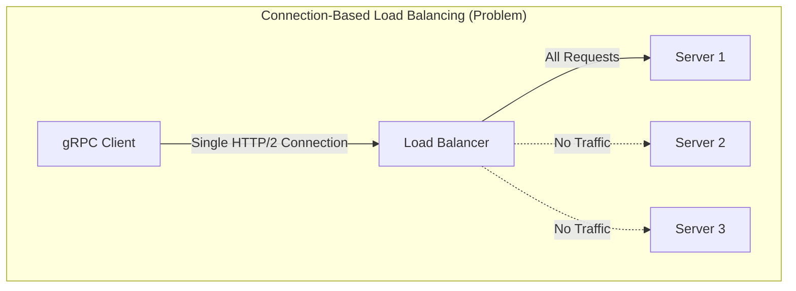
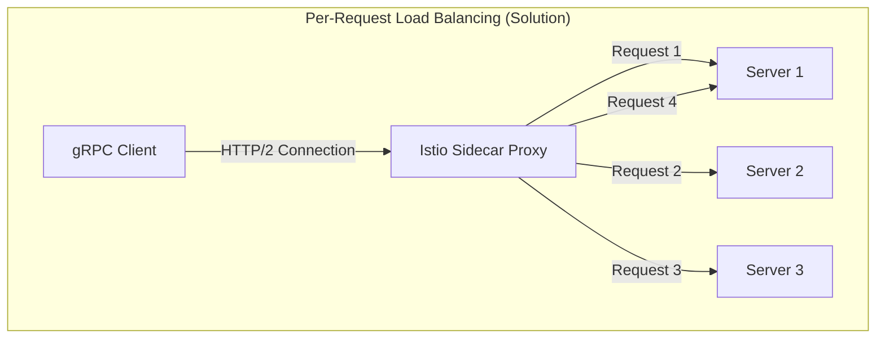
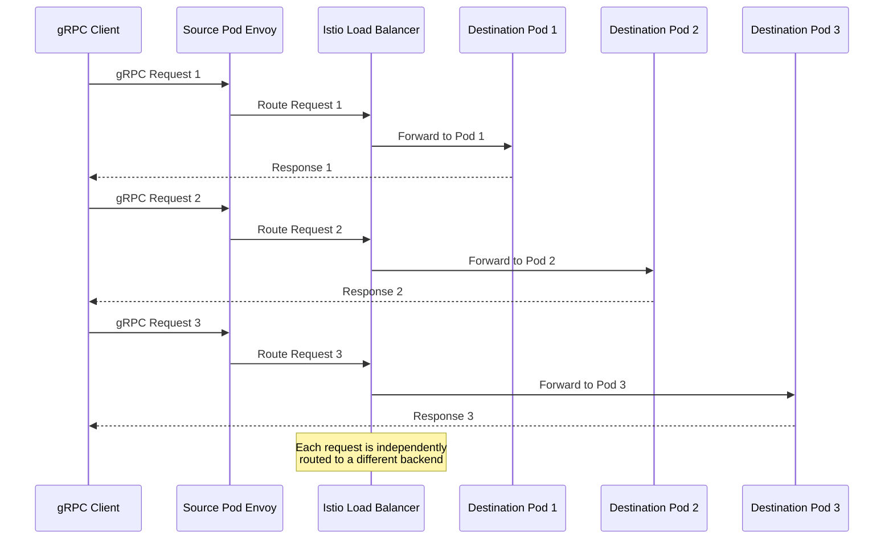
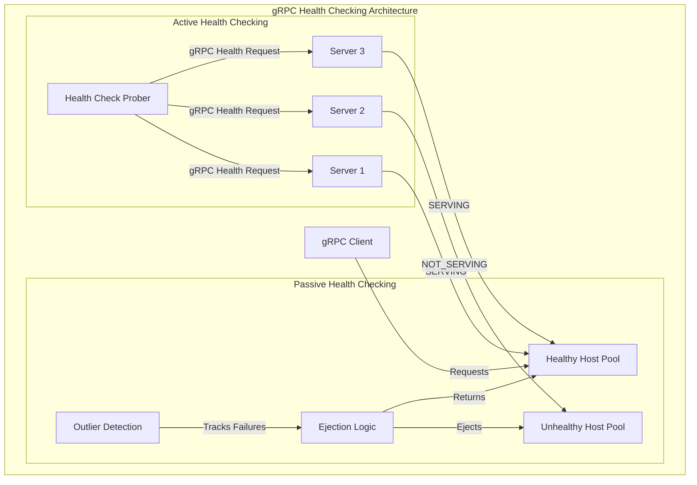
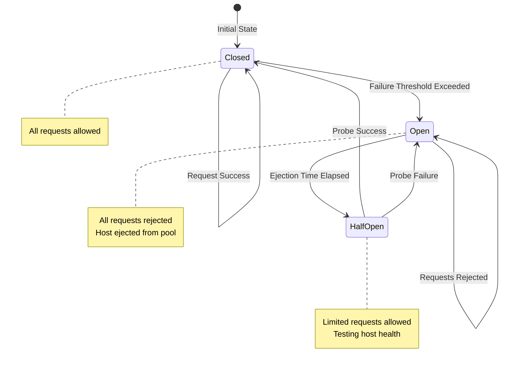

# How to Configure gRPC Load Balancing in Istio

Author: [nawazdhandala](https://github.com/nawazdhandala)

Tags: Istio, gRPC, Load Balancing, Service Mesh, Microservices

Description: A guide to optimizing gRPC load balancing with Istio for microservices.

---

gRPC has become the de facto standard for inter-service communication in modern microservices architectures. Its efficient binary protocol, built-in streaming support, and strong typing make it an excellent choice for high-performance systems. However, load balancing gRPC traffic presents unique challenges that traditional HTTP/1.1 load balancers cannot address effectively. This comprehensive guide explores how to configure Istio to handle gRPC load balancing optimally, ensuring your microservices communicate efficiently and reliably.

## Understanding gRPC Load Balancing Challenges

Before diving into Istio configuration, it is essential to understand why gRPC requires special consideration for load balancing.

### The HTTP/2 Connection Persistence Problem

gRPC uses HTTP/2 as its transport protocol. Unlike HTTP/1.1, HTTP/2 multiplexes multiple requests over a single long-lived TCP connection. While this improves efficiency by reducing connection overhead, it creates a significant load balancing challenge.

The following diagram illustrates the problem with traditional connection-based load balancing for gRPC:



When a traditional Layer 4 (TCP) load balancer distributes connections, a gRPC client establishes one persistent connection to a backend server. All subsequent requests from that client flow through the same connection to the same server, completely bypassing other available instances.

### Per-Request vs Per-Connection Load Balancing

The solution to this challenge is per-request (Layer 7) load balancing, where the load balancer inspects each individual gRPC request and routes it to the most appropriate backend.



Istio's Envoy sidecar proxy operates at Layer 7, understanding the HTTP/2 protocol and enabling true per-request load balancing for gRPC traffic.

## Prerequisites

Before configuring gRPC load balancing in Istio, ensure you have:

- A Kubernetes cluster (version 1.25 or later recommended)
- Istio installed (version 1.20 or later)
- kubectl configured to communicate with your cluster
- Basic familiarity with Kubernetes and Istio concepts

## Deploying a Sample gRPC Application

Let us start by deploying a sample gRPC application to demonstrate the load balancing configurations.

The following Kubernetes Deployment creates a gRPC server with three replicas, which will help us observe load balancing behavior:

```yaml
# grpc-server-deployment.yaml
# This deployment creates a gRPC server with multiple replicas
# The server responds with its pod name, allowing us to verify load distribution
apiVersion: apps/v1
kind: Deployment
metadata:
  name: grpc-server
  namespace: default
  labels:
    app: grpc-server
    # Version label is used by Istio for traffic management
    version: v1
spec:
  # Three replicas ensure we have multiple targets for load balancing
  replicas: 3
  selector:
    matchLabels:
      app: grpc-server
  template:
    metadata:
      labels:
        app: grpc-server
        version: v1
      annotations:
        # Enable Istio sidecar injection for this pod
        sidecar.istio.io/inject: "true"
    spec:
      containers:
      - name: grpc-server
        image: grpc/grpc-test-server:latest
        ports:
        # gRPC typically uses port 50051 by convention
        - containerPort: 50051
          name: grpc
          protocol: TCP
        resources:
          requests:
            cpu: 100m
            memory: 128Mi
          limits:
            cpu: 500m
            memory: 256Mi
        # Health check configuration - critical for gRPC services
        # Uses gRPC health checking protocol (grpc.health.v1.Health)
        readinessProbe:
          grpc:
            port: 50051
          initialDelaySeconds: 5
          periodSeconds: 10
        livenessProbe:
          grpc:
            port: 50051
          initialDelaySeconds: 10
          periodSeconds: 20
```

Next, create a Kubernetes Service to expose the gRPC server:

```yaml
# grpc-server-service.yaml
# This Service exposes the gRPC server pods
# Istio will use this Service for service discovery
apiVersion: v1
kind: Service
metadata:
  name: grpc-server
  namespace: default
  labels:
    app: grpc-server
spec:
  # ClusterIP is sufficient for internal service mesh communication
  type: ClusterIP
  ports:
  - port: 50051
    targetPort: 50051
    # IMPORTANT: The name must start with 'grpc' or use appProtocol
    # This tells Istio to treat this as gRPC traffic
    name: grpc
    # Alternatively, use appProtocol for explicit protocol declaration
    appProtocol: grpc
  selector:
    app: grpc-server
```

Apply these resources to your cluster:

```bash
# Apply the gRPC server deployment and service
# The -n flag specifies the namespace; adjust as needed
kubectl apply -f grpc-server-deployment.yaml -n default
kubectl apply -f grpc-server-service.yaml -n default

# Verify the pods are running with Istio sidecars
# Look for 2/2 in the READY column (app container + sidecar)
kubectl get pods -l app=grpc-server -n default
```

## Configuring DestinationRule for gRPC Load Balancing

The DestinationRule is the primary Istio resource for configuring load balancing behavior. For gRPC, we need specific settings to ensure optimal performance.

### Basic Round-Robin Load Balancing

The simplest configuration uses round-robin load balancing, distributing requests evenly across all available backends:

```yaml
# grpc-destination-rule-basic.yaml
# Basic DestinationRule with round-robin load balancing for gRPC
apiVersion: networking.istio.io/v1beta1
kind: DestinationRule
metadata:
  name: grpc-server-lb
  namespace: default
spec:
  # The host must match the Kubernetes Service name
  host: grpc-server.default.svc.cluster.local
  trafficPolicy:
    # Connection pool settings optimized for gRPC
    connectionPool:
      tcp:
        # Maximum number of TCP connections to the upstream cluster
        # For gRPC, fewer connections are needed due to HTTP/2 multiplexing
        maxConnections: 100
        # TCP connection timeout
        connectTimeout: 10s
      http:
        # Maximum number of HTTP/2 streams per connection
        # This directly impacts gRPC concurrency per connection
        h2UpgradePolicy: UPGRADE
        # Maximum requests that can be pending (waiting for connection)
        http2MaxRequests: 1000
        # Maximum requests per connection before it's closed and replaced
        maxRequestsPerConnection: 0
    # Load balancer configuration
    loadBalancer:
      # ROUND_ROBIN distributes requests evenly across all healthy hosts
      simple: ROUND_ROBIN
```

### Least Connection Load Balancing

For services with varying request processing times, least-connection load balancing can provide better distribution by sending requests to the server with the fewest active connections:

```yaml
# grpc-destination-rule-least-conn.yaml
# DestinationRule using least-connection load balancing
# Best for gRPC services with variable response times
apiVersion: networking.istio.io/v1beta1
kind: DestinationRule
metadata:
  name: grpc-server-least-conn
  namespace: default
spec:
  host: grpc-server.default.svc.cluster.local
  trafficPolicy:
    connectionPool:
      tcp:
        maxConnections: 100
        connectTimeout: 10s
      http:
        h2UpgradePolicy: UPGRADE
        http2MaxRequests: 1000
    loadBalancer:
      # LEAST_CONN routes to the host with fewest active requests
      # Particularly effective for gRPC streaming where some requests
      # may be long-lived while others complete quickly
      simple: LEAST_CONN
```

### Consistent Hash Load Balancing

When you need session affinity or want to route related requests to the same backend (useful for caching scenarios), consistent hashing provides deterministic routing:

```yaml
# grpc-destination-rule-consistent-hash.yaml
# DestinationRule with consistent hash load balancing
# Useful when you need sticky sessions or cache locality
apiVersion: networking.istio.io/v1beta1
kind: DestinationRule
metadata:
  name: grpc-server-consistent-hash
  namespace: default
spec:
  host: grpc-server.default.svc.cluster.local
  trafficPolicy:
    connectionPool:
      tcp:
        maxConnections: 100
        connectTimeout: 10s
      http:
        h2UpgradePolicy: UPGRADE
        http2MaxRequests: 1000
    loadBalancer:
      consistentHash:
        # Hash based on a specific gRPC metadata header
        # All requests with the same header value go to the same backend
        httpHeaderName: "x-user-id"
        # Alternatively, hash based on source IP
        # useSourceIp: true
        # Or use a specific cookie (less common for gRPC)
        # httpCookie:
        #   name: "session-id"
        #   ttl: 3600s
```

## Implementing Per-Request Load Balancing

Per-request load balancing is crucial for gRPC. By default, Istio's Envoy proxy handles this correctly, but we can fine-tune the behavior.

### Understanding HTTP/2 Settings

The following DestinationRule demonstrates advanced HTTP/2 configuration for optimal per-request load balancing:

```yaml
# grpc-destination-rule-per-request.yaml
# Advanced DestinationRule optimized for per-request gRPC load balancing
apiVersion: networking.istio.io/v1beta1
kind: DestinationRule
metadata:
  name: grpc-server-per-request
  namespace: default
spec:
  host: grpc-server.default.svc.cluster.local
  trafficPolicy:
    connectionPool:
      tcp:
        # Limit connections to ensure requests are distributed
        # With HTTP/2, each connection can handle many concurrent streams
        maxConnections: 10
        connectTimeout: 10s
        # TCP keepalive settings to maintain connection health
        tcpKeepalive:
          time: 300s
          interval: 75s
          probes: 9
      http:
        # Force HTTP/2 upgrade for better gRPC handling
        h2UpgradePolicy: UPGRADE
        # Maximum concurrent requests across all connections
        http2MaxRequests: 10000
        # Setting this to 1 forces a new connection per request
        # Use with caution - trades connection efficiency for perfect distribution
        # maxRequestsPerConnection: 1
        # Maximum retries for failed requests
        maxRetries: 3
        # Idle timeout for connections
        idleTimeout: 3600s
    loadBalancer:
      simple: ROUND_ROBIN
      # Locality-aware load balancing for multi-zone deployments
      localityLbSetting:
        enabled: true
        # Distribute 80% locally, 20% to other zones
        distribute:
        - from: "region1/zone1/*"
          to:
            "region1/zone1/*": 80
            "region1/zone2/*": 20
```

### Visualizing Per-Request Load Balancing Flow

The following diagram shows how Istio processes gRPC requests with per-request load balancing:



## Configuring gRPC Health Checking

Health checking is critical for gRPC services. Istio supports the gRPC Health Checking Protocol (grpc.health.v1.Health) for accurate service health monitoring.

### Enabling gRPC Health Checks in DestinationRule

The outlier detection configuration enables automatic ejection of unhealthy hosts:

```yaml
# grpc-destination-rule-health.yaml
# DestinationRule with comprehensive health checking and outlier detection
apiVersion: networking.istio.io/v1beta1
kind: DestinationRule
metadata:
  name: grpc-server-health
  namespace: default
spec:
  host: grpc-server.default.svc.cluster.local
  trafficPolicy:
    connectionPool:
      tcp:
        maxConnections: 100
        connectTimeout: 10s
      http:
        h2UpgradePolicy: UPGRADE
        http2MaxRequests: 1000
    loadBalancer:
      simple: ROUND_ROBIN
    # Outlier detection provides passive health checking
    # Unhealthy hosts are temporarily ejected from the load balancing pool
    outlierDetection:
      # Number of consecutive errors before ejection
      # For gRPC, this counts failed requests (non-OK status codes)
      consecutive5xxErrors: 5
      # Also consider gateway errors (connection failures)
      consecutiveGatewayErrors: 5
      # Time window for counting errors
      interval: 10s
      # Duration a host is ejected before being reconsidered
      baseEjectionTime: 30s
      # Maximum percentage of hosts that can be ejected
      # Prevents cascading failures by always keeping some hosts available
      maxEjectionPercent: 50
      # Minimum number of hosts before ejection percentage applies
      minHealthPercent: 30
```

### Active Health Checking with EnvoyFilter

For active health probing of gRPC services, you can use an EnvoyFilter to configure gRPC health checks:

```yaml
# grpc-health-check-envoyfilter.yaml
# EnvoyFilter to configure active gRPC health checking
# This provides more proactive health detection than outlier detection alone
apiVersion: networking.istio.io/v1alpha3
kind: EnvoyFilter
metadata:
  name: grpc-health-check
  namespace: default
spec:
  workloadSelector:
    labels:
      app: grpc-client
  configPatches:
  - applyTo: CLUSTER
    match:
      context: SIDECAR_OUTBOUND
      cluster:
        # Match the gRPC server cluster
        service: grpc-server.default.svc.cluster.local
    patch:
      operation: MERGE
      value:
        # Configure active health checking
        health_checks:
        - timeout: 5s
          interval: 10s
          # Number of healthy checks before marking host as healthy
          healthy_threshold: 2
          # Number of unhealthy checks before marking host as unhealthy
          unhealthy_threshold: 3
          # gRPC health check configuration
          grpc_health_check:
            # Service name for gRPC health check
            # Empty string means check the overall server health
            service_name: ""
            # Authority header for the health check request
            authority: "grpc-server.default.svc.cluster.local"
```

### Health Check Architecture

The following diagram illustrates how health checking works with gRPC in Istio:



## Advanced Load Balancing Patterns

### Weighted Load Balancing with Subsets

When running multiple versions of a gRPC service, you can use subsets with weighted routing:

```yaml
# grpc-destination-rule-subsets.yaml
# DestinationRule with subsets for canary deployments
apiVersion: networking.istio.io/v1beta1
kind: DestinationRule
metadata:
  name: grpc-server-subsets
  namespace: default
spec:
  host: grpc-server.default.svc.cluster.local
  trafficPolicy:
    connectionPool:
      tcp:
        maxConnections: 100
      http:
        h2UpgradePolicy: UPGRADE
        http2MaxRequests: 1000
    loadBalancer:
      simple: ROUND_ROBIN
    outlierDetection:
      consecutive5xxErrors: 5
      interval: 10s
      baseEjectionTime: 30s
  # Define subsets based on version labels
  subsets:
  - name: v1
    labels:
      version: v1
    # Subset-specific traffic policy (overrides default)
    trafficPolicy:
      loadBalancer:
        simple: ROUND_ROBIN
  - name: v2
    labels:
      version: v2
    trafficPolicy:
      loadBalancer:
        simple: LEAST_CONN
```

Combine this with a VirtualService for weighted traffic distribution:

```yaml
# grpc-virtual-service-weighted.yaml
# VirtualService for weighted traffic distribution between versions
apiVersion: networking.istio.io/v1beta1
kind: VirtualService
metadata:
  name: grpc-server-weighted
  namespace: default
spec:
  hosts:
  - grpc-server.default.svc.cluster.local
  http:
  - match:
    # Match all gRPC traffic
    # gRPC uses HTTP/2 POST requests
    - headers:
        content-type:
          prefix: "application/grpc"
    route:
    # Send 90% of traffic to v1
    - destination:
        host: grpc-server.default.svc.cluster.local
        subset: v1
        port:
          number: 50051
      weight: 90
    # Send 10% of traffic to v2 (canary)
    - destination:
        host: grpc-server.default.svc.cluster.local
        subset: v2
        port:
          number: 50051
      weight: 10
    # Retry configuration for gRPC
    retries:
      attempts: 3
      perTryTimeout: 5s
      # Retry on specific gRPC status codes
      retryOn: "cancelled,deadline-exceeded,resource-exhausted,unavailable"
```

### Locality-Aware Load Balancing

For multi-region or multi-zone deployments, configure locality-aware load balancing to minimize latency:

```yaml
# grpc-destination-rule-locality.yaml
# DestinationRule with locality-aware load balancing
# Prefers local pods but fails over to remote zones when needed
apiVersion: networking.istio.io/v1beta1
kind: DestinationRule
metadata:
  name: grpc-server-locality
  namespace: default
spec:
  host: grpc-server.default.svc.cluster.local
  trafficPolicy:
    connectionPool:
      tcp:
        maxConnections: 100
      http:
        h2UpgradePolicy: UPGRADE
        http2MaxRequests: 1000
    loadBalancer:
      simple: ROUND_ROBIN
      # Enable locality-aware load balancing
      localityLbSetting:
        enabled: true
        # Failover priority when local pods are unavailable
        failover:
        - from: us-west1
          to: us-central1
        - from: us-central1
          to: us-east1
        # Weight distribution across localities
        distribute:
        - from: us-west1/us-west1-a/*
          to:
            "us-west1/us-west1-a/*": 80
            "us-west1/us-west1-b/*": 15
            "us-central1/us-central1-a/*": 5
    outlierDetection:
      consecutive5xxErrors: 5
      interval: 10s
      baseEjectionTime: 30s
      # Minimum healthy hosts before failover triggers
      minHealthPercent: 50
```

### Circuit Breaking for gRPC

Implement circuit breaking to prevent cascade failures in your gRPC services:

```yaml
# grpc-destination-rule-circuit-breaker.yaml
# DestinationRule with circuit breaking configuration
apiVersion: networking.istio.io/v1beta1
kind: DestinationRule
metadata:
  name: grpc-server-circuit-breaker
  namespace: default
spec:
  host: grpc-server.default.svc.cluster.local
  trafficPolicy:
    connectionPool:
      tcp:
        # Maximum TCP connections (triggers circuit breaker when exceeded)
        maxConnections: 100
        connectTimeout: 10s
      http:
        h2UpgradePolicy: UPGRADE
        # Maximum pending requests (circuit breaker threshold)
        http1MaxPendingRequests: 100
        # Maximum requests per connection
        http2MaxRequests: 1000
        # Maximum retries for idempotent operations
        maxRetries: 3
    loadBalancer:
      simple: ROUND_ROBIN
    # Outlier detection acts as the circuit breaker
    outlierDetection:
      # Eject after 5 consecutive 5xx errors
      consecutive5xxErrors: 5
      # Check health every 10 seconds
      interval: 10s
      # Keep ejected for at least 30 seconds
      baseEjectionTime: 30s
      # Never eject more than 50% of hosts
      maxEjectionPercent: 50
      # Only apply ejection if at least 30% of hosts are healthy
      minHealthPercent: 30
      # Also track local-origin errors (connection failures)
      consecutiveLocalOriginFailures: 5
      # Split external and local errors
      splitExternalLocalOriginErrors: true
```

The circuit breaker flow can be visualized as:



## Handling gRPC Streaming

gRPC supports four types of communication: unary, server streaming, client streaming, and bidirectional streaming. Each requires special consideration for load balancing.

### Stream-Aware Load Balancing Configuration

The following configuration optimizes for streaming gRPC workloads:

```yaml
# grpc-destination-rule-streaming.yaml
# DestinationRule optimized for gRPC streaming workloads
apiVersion: networking.istio.io/v1beta1
kind: DestinationRule
metadata:
  name: grpc-server-streaming
  namespace: default
spec:
  host: grpc-server.default.svc.cluster.local
  trafficPolicy:
    connectionPool:
      tcp:
        # Allow more connections for streaming workloads
        maxConnections: 200
        connectTimeout: 10s
        # Extended keepalive for long-running streams
        tcpKeepalive:
          time: 7200s
          interval: 75s
          probes: 9
      http:
        h2UpgradePolicy: UPGRADE
        # Higher limits for concurrent streams
        http2MaxRequests: 5000
        # Important: Set to 0 for streaming
        # This allows streams to live for the full duration
        maxRequestsPerConnection: 0
        # Extended idle timeout for streaming
        idleTimeout: 7200s
    loadBalancer:
      # LEAST_CONN works well with streaming
      # Routes new streams to less busy servers
      simple: LEAST_CONN
    outlierDetection:
      consecutive5xxErrors: 5
      interval: 30s
      baseEjectionTime: 60s
      maxEjectionPercent: 30
```

### VirtualService for Streaming Timeout Configuration

Configure appropriate timeouts for streaming operations:

```yaml
# grpc-virtual-service-streaming.yaml
# VirtualService with streaming-appropriate timeouts
apiVersion: networking.istio.io/v1beta1
kind: VirtualService
metadata:
  name: grpc-server-streaming
  namespace: default
spec:
  hosts:
  - grpc-server.default.svc.cluster.local
  http:
  - match:
    # Match streaming endpoints (adjust path to your service)
    - uri:
        prefix: "/mypackage.MyService/StreamingMethod"
    route:
    - destination:
        host: grpc-server.default.svc.cluster.local
        port:
          number: 50051
    timeout: 0s  # Disable timeout for streaming (use deadline instead)
  - match:
    # Unary calls with normal timeout
    - uri:
        prefix: "/mypackage.MyService/"
    route:
    - destination:
        host: grpc-server.default.svc.cluster.local
        port:
          number: 50051
    timeout: 30s
    retries:
      attempts: 3
      perTryTimeout: 10s
      retryOn: "cancelled,deadline-exceeded,unavailable"
```

## Monitoring and Troubleshooting

### Verifying Load Balancing Distribution

Use Istio's metrics to verify that load balancing is working correctly:

```bash
# Check the distribution of requests across pods
# This query shows request count per destination workload
kubectl exec -it deploy/prometheus -n istio-system -- \
  promql 'sum(rate(istio_requests_total{destination_service="grpc-server.default.svc.cluster.local"}[5m])) by (destination_workload_namespace, destination_workload)'

# Alternative: Use istioctl to analyze proxy configuration
# This shows the current load balancing configuration
istioctl proxy-config cluster deploy/grpc-client -n default \
  --fqdn grpc-server.default.svc.cluster.local -o json | \
  jq '.[] | {name: .name, lb_policy: .lb_policy}'
```

### Debugging Load Balancing Issues

When load balancing is not working as expected, use these debugging techniques:

```bash
# Check if Istio recognizes the service as gRPC
# Look for 'protocol: GRPC' in the output
istioctl proxy-config listener deploy/grpc-client -n default -o json | \
  jq '.[] | select(.name | contains("50051"))'

# Verify the DestinationRule is applied correctly
istioctl analyze -n default

# Check endpoint health status
istioctl proxy-config endpoint deploy/grpc-client -n default | \
  grep grpc-server

# View detailed cluster configuration
istioctl proxy-config cluster deploy/grpc-client -n default \
  --fqdn grpc-server.default.svc.cluster.local -o yaml
```

### Common Issues and Solutions

The following table summarizes common gRPC load balancing issues:

| Issue | Symptom | Solution |
|-------|---------|----------|
| All traffic to one pod | Uneven distribution | Verify HTTP/2 is enabled; check h2UpgradePolicy |
| Connection failures | Timeout errors | Check maxConnections limit; verify network policies |
| Sporadic errors | Intermittent 503s | Configure outlier detection; increase retry attempts |
| Streaming disconnects | Stream termination | Increase idleTimeout; configure TCP keepalive |
| Version mismatch | Protocol errors | Ensure service port name starts with "grpc" |

## Best Practices Summary

Based on the configurations covered in this guide, here are the key best practices for gRPC load balancing in Istio:

1. **Always use Layer 7 load balancing**: Ensure Istio correctly identifies gRPC traffic by using port names starting with "grpc" or setting appProtocol.

2. **Configure connection pools appropriately**: Set reasonable limits for maxConnections and http2MaxRequests based on your workload characteristics.

3. **Enable outlier detection**: Configure aggressive outlier detection to quickly remove unhealthy hosts from the load balancing pool.

4. **Use LEAST_CONN for variable workloads**: When request processing times vary significantly, LEAST_CONN provides better distribution than ROUND_ROBIN.

5. **Consider locality-aware routing**: For multi-zone deployments, enable locality-aware load balancing to minimize latency while maintaining resilience.

6. **Handle streaming appropriately**: Configure extended timeouts and disable maxRequestsPerConnection for streaming workloads.

7. **Monitor and verify**: Regularly check metrics to ensure load is distributed as expected and adjust configuration as needed.

## Conclusion

Configuring gRPC load balancing in Istio requires understanding the unique challenges posed by HTTP/2's persistent connections and gRPC's streaming capabilities. By leveraging Istio's DestinationRule and VirtualService resources, you can achieve optimal per-request load balancing, implement robust health checking, and configure advanced patterns like circuit breaking and locality-aware routing.

The configurations provided in this guide serve as a foundation that you can adapt to your specific use cases. Remember to monitor your services continuously and adjust the configuration parameters based on observed behavior and changing requirements.

With proper configuration, Istio provides a powerful and flexible platform for managing gRPC traffic at scale, ensuring your microservices communicate efficiently and reliably.
