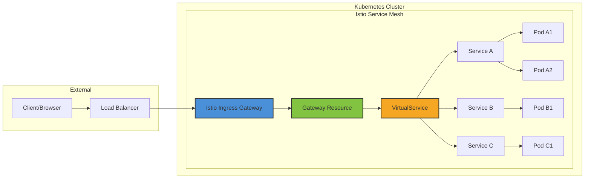
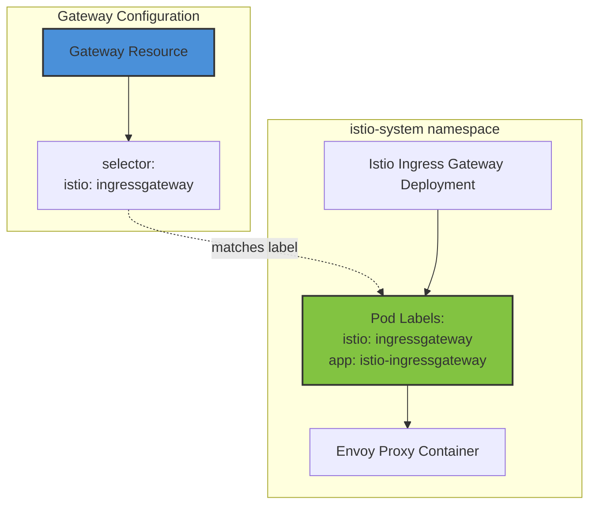
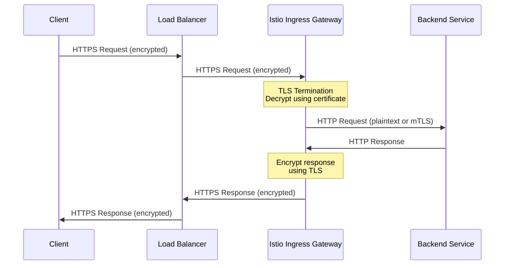
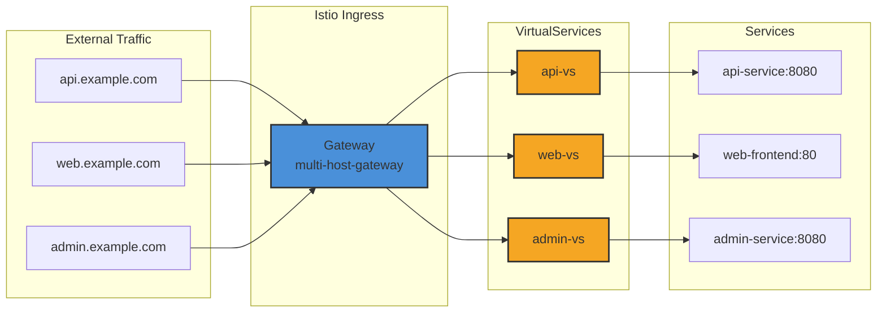
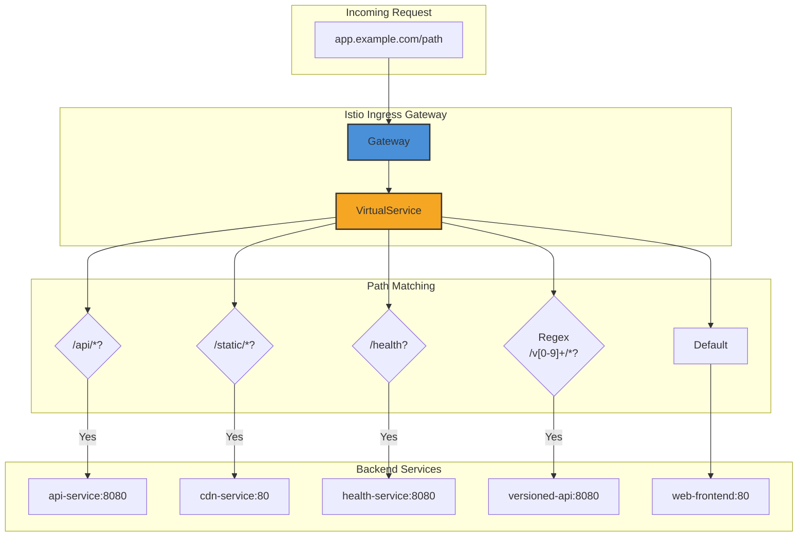

# How to Configure Istio Ingress Gateway for External Traffic

Author: [nawazdhandala](https://github.com/nawazdhandala)

Tags: Istio, Ingress Gateway, Kubernetes, Traffic Management, Cloud Native

Description: Learn how to expose services externally using Istio Ingress Gateway.

---

## Introduction

Istio Ingress Gateway is a powerful component that acts as the entry point for external traffic into your service mesh. Unlike traditional Kubernetes Ingress controllers, Istio Ingress Gateway provides advanced traffic management capabilities, including TLS termination, host-based routing, path-based routing, and fine-grained traffic control.

In this comprehensive guide, we will explore how to configure Istio Ingress Gateway to expose your services to external traffic securely and efficiently.

## Prerequisites

Before we begin, ensure you have the following:

- A Kubernetes cluster (version 1.22 or later)
- Istio installed with the default profile (version 1.17 or later)
- `kubectl` configured to communicate with your cluster
- `istioctl` CLI tool installed
- Basic understanding of Kubernetes Services and Deployments

## Understanding Istio Ingress Gateway Architecture

The following diagram illustrates how external traffic flows through the Istio Ingress Gateway to reach your services:



## Key Components

Understanding the key components is essential before diving into configuration:

1. **Gateway**: Defines the ports, protocols, and hosts that the ingress gateway should listen on
2. **VirtualService**: Defines routing rules for traffic entering through the Gateway
3. **DestinationRule**: Defines policies for traffic after routing decisions are made
4. **Istio Ingress Gateway Pod**: The actual Envoy proxy that handles incoming traffic

## Deploying Sample Applications

Before configuring the Gateway, let's deploy sample applications that we will expose externally.

The following deployment creates a simple httpbin service that we will use throughout this guide:

```yaml
# httpbin-deployment.yaml
# This deployment creates the httpbin application which is useful for testing HTTP scenarios
apiVersion: apps/v1
kind: Deployment
metadata:
  name: httpbin
  namespace: default
  labels:
    app: httpbin
spec:
  replicas: 2
  selector:
    matchLabels:
      app: httpbin
  template:
    metadata:
      labels:
        app: httpbin
        # Enable Istio sidecar injection
        sidecar.istio.io/inject: "true"
    spec:
      containers:
      - name: httpbin
        image: docker.io/kennethreitz/httpbin:latest
        ports:
        - containerPort: 80
        resources:
          requests:
            memory: "64Mi"
            cpu: "100m"
          limits:
            memory: "128Mi"
            cpu: "200m"
---
# Service to expose the httpbin deployment within the cluster
apiVersion: v1
kind: Service
metadata:
  name: httpbin
  namespace: default
  labels:
    app: httpbin
spec:
  ports:
  - port: 80
    targetPort: 80
    name: http
  selector:
    app: httpbin
```

Apply the deployment with the following command:

```bash
# Apply the httpbin deployment and service
kubectl apply -f httpbin-deployment.yaml

# Verify the deployment is running
kubectl get pods -l app=httpbin

# Verify the service is created
kubectl get svc httpbin
```

## Configuring the Gateway Resource

The Gateway resource is the first step in exposing services externally. It configures the Istio Ingress Gateway to listen on specific ports and hosts.

### Basic HTTP Gateway Configuration

The following Gateway configuration sets up basic HTTP access on port 80:

```yaml
# gateway-http.yaml
# This Gateway resource configures the Istio Ingress Gateway to accept HTTP traffic
# on port 80 for the specified hosts
apiVersion: networking.istio.io/v1beta1
kind: Gateway
metadata:
  name: httpbin-gateway
  namespace: default
spec:
  # Selector determines which gateway workload this configuration applies to
  # The label 'istio: ingressgateway' matches the default Istio ingress gateway
  selector:
    istio: ingressgateway
  servers:
  # Define a server block for HTTP traffic
  - port:
      # Port number the gateway listens on
      number: 80
      # Name must be unique within the gateway and follow Istio naming conventions
      name: http
      # Protocol type - HTTP, HTTPS, GRPC, HTTP2, MONGO, TCP, TLS
      protocol: HTTP
    # Hosts this gateway serves - can use wildcards
    hosts:
    - "httpbin.example.com"
    - "api.example.com"
```

Apply the Gateway configuration:

```bash
# Apply the Gateway resource
kubectl apply -f gateway-http.yaml

# Verify the Gateway is created
kubectl get gateway httpbin-gateway

# Check the Istio Ingress Gateway service for the external IP
kubectl get svc istio-ingressgateway -n istio-system
```

### Understanding Gateway Selector

The following diagram shows how the Gateway selector matches the Ingress Gateway pods:



## Configuring VirtualService for Routing

The VirtualService resource defines how traffic is routed to your services. It must reference the Gateway to handle external traffic.

### Basic VirtualService Configuration

The following VirtualService routes all traffic from the Gateway to the httpbin service:

```yaml
# virtualservice-basic.yaml
# This VirtualService defines routing rules for traffic coming through the Gateway
apiVersion: networking.istio.io/v1beta1
kind: VirtualService
metadata:
  name: httpbin-vs
  namespace: default
spec:
  # Hosts that this VirtualService applies to
  # Must match the hosts defined in the Gateway
  hosts:
  - "httpbin.example.com"
  # Reference to the Gateway(s) this VirtualService is bound to
  # Format: namespace/gateway-name or just gateway-name if in same namespace
  gateways:
  - httpbin-gateway
  http:
  # Route all traffic to the httpbin service
  - route:
    - destination:
        # The Kubernetes service name
        host: httpbin
        port:
          # The service port number
          number: 80
```

Apply the VirtualService:

```bash
# Apply the VirtualService
kubectl apply -f virtualservice-basic.yaml

# Verify the VirtualService is created
kubectl get virtualservice httpbin-vs

# Test the configuration (replace INGRESS_IP with your actual IP)
export INGRESS_IP=$(kubectl get svc istio-ingressgateway -n istio-system -o jsonpath='{.status.loadBalancer.ingress[0].ip}')
curl -H "Host: httpbin.example.com" http://$INGRESS_IP/get
```

## TLS Termination Configuration

Securing your ingress traffic with TLS is essential for production deployments. Istio supports multiple TLS modes including simple TLS, mutual TLS (mTLS), and TLS passthrough.

### Creating TLS Certificates

First, create a TLS certificate and key. For production, use certificates from a trusted CA:

```bash
# Generate a self-signed certificate for testing purposes
# In production, use certificates from a trusted Certificate Authority

# Create a private key
openssl genrsa -out httpbin.example.com.key 2048

# Create a certificate signing request (CSR)
openssl req -new -key httpbin.example.com.key \
  -out httpbin.example.com.csr \
  -subj "/CN=httpbin.example.com/O=Example Organization"

# Self-sign the certificate (valid for 365 days)
openssl x509 -req -days 365 \
  -in httpbin.example.com.csr \
  -signkey httpbin.example.com.key \
  -out httpbin.example.com.crt

# Create a Kubernetes secret to store the TLS credentials
# The secret must be in the same namespace as the Istio Ingress Gateway (istio-system)
kubectl create -n istio-system secret tls httpbin-credential \
  --key=httpbin.example.com.key \
  --cert=httpbin.example.com.crt

# Verify the secret was created
kubectl get secret httpbin-credential -n istio-system
```

### Gateway with TLS Configuration

The following Gateway configuration enables HTTPS with TLS termination:

```yaml
# gateway-tls.yaml
# This Gateway configures HTTPS with TLS termination at the ingress gateway
apiVersion: networking.istio.io/v1beta1
kind: Gateway
metadata:
  name: httpbin-gateway-secure
  namespace: default
spec:
  selector:
    istio: ingressgateway
  servers:
  # HTTPS server configuration
  - port:
      number: 443
      name: https
      protocol: HTTPS
    hosts:
    - "httpbin.example.com"
    tls:
      # TLS mode: SIMPLE performs standard TLS termination
      # Other options: MUTUAL (mTLS), PASSTHROUGH, AUTO_PASSTHROUGH
      mode: SIMPLE
      # Reference to the Kubernetes secret containing TLS credentials
      # Format: kubernetes-secret-name (in the gateway's namespace)
      credentialName: httpbin-credential
  # Optional: Redirect HTTP to HTTPS
  - port:
      number: 80
      name: http
      protocol: HTTP
    hosts:
    - "httpbin.example.com"
    tls:
      # Redirect all HTTP traffic to HTTPS
      httpsRedirect: true
```

The following diagram illustrates the TLS termination flow:



Apply and test the TLS configuration:

```bash
# Apply the secure Gateway
kubectl apply -f gateway-tls.yaml

# Test HTTPS access (use -k for self-signed certificates)
curl -k -H "Host: httpbin.example.com" https://$INGRESS_IP/get

# Test HTTP to HTTPS redirect
curl -I -H "Host: httpbin.example.com" http://$INGRESS_IP/get
# Should return 301 redirect to HTTPS
```

### Mutual TLS (mTLS) Configuration

For enhanced security, configure mutual TLS where both client and server authenticate:

```yaml
# gateway-mtls.yaml
# This Gateway requires client certificates for mutual TLS authentication
apiVersion: networking.istio.io/v1beta1
kind: Gateway
metadata:
  name: httpbin-gateway-mtls
  namespace: default
spec:
  selector:
    istio: ingressgateway
  servers:
  - port:
      number: 443
      name: https-mtls
      protocol: HTTPS
    hosts:
    - "secure.httpbin.example.com"
    tls:
      # MUTUAL mode requires client certificates
      mode: MUTUAL
      # Server certificate and key
      credentialName: httpbin-credential
      # Secret containing the CA certificate to validate client certificates
      # Create this secret with: kubectl create secret generic httpbin-client-ca \
      #   --from-file=ca.crt=client-ca.crt -n istio-system
      # Note: For Istio 1.12+, use caCertificates field with a separate secret
```

Create the client CA secret:

```bash
# Create a CA for client certificates
openssl genrsa -out client-ca.key 2048
openssl req -x509 -new -nodes -key client-ca.key \
  -sha256 -days 365 -out client-ca.crt \
  -subj "/CN=Client CA/O=Example Organization"

# Create a client certificate signed by the CA
openssl genrsa -out client.key 2048
openssl req -new -key client.key -out client.csr \
  -subj "/CN=client/O=Example Organization"
openssl x509 -req -in client.csr -CA client-ca.crt -CAkey client-ca.key \
  -CAcreateserial -out client.crt -days 365 -sha256

# Create the CA secret for the gateway
kubectl create secret generic httpbin-client-ca \
  --from-file=ca.crt=client-ca.crt -n istio-system

# Test with client certificate
curl -k --cert client.crt --key client.key \
  -H "Host: secure.httpbin.example.com" \
  https://$INGRESS_IP/get
```

## Host-Based Routing

Host-based routing allows you to route traffic to different services based on the requested hostname.

### Multiple Hosts Configuration

The following configuration demonstrates routing different hosts to different services:

```yaml
# gateway-multi-host.yaml
# Gateway configuration for multiple hosts
apiVersion: networking.istio.io/v1beta1
kind: Gateway
metadata:
  name: multi-host-gateway
  namespace: default
spec:
  selector:
    istio: ingressgateway
  servers:
  - port:
      number: 80
      name: http
      protocol: HTTP
    # List all hosts that this gateway serves
    hosts:
    - "api.example.com"
    - "web.example.com"
    - "admin.example.com"
---
# virtualservice-api.yaml
# VirtualService for API traffic
apiVersion: networking.istio.io/v1beta1
kind: VirtualService
metadata:
  name: api-vs
  namespace: default
spec:
  hosts:
  # Only match requests to api.example.com
  - "api.example.com"
  gateways:
  - multi-host-gateway
  http:
  - route:
    - destination:
        # Route to the API service
        host: api-service
        port:
          number: 8080
---
# virtualservice-web.yaml
# VirtualService for web frontend traffic
apiVersion: networking.istio.io/v1beta1
kind: VirtualService
metadata:
  name: web-vs
  namespace: default
spec:
  hosts:
  - "web.example.com"
  gateways:
  - multi-host-gateway
  http:
  - route:
    - destination:
        # Route to the web frontend service
        host: web-frontend
        port:
          number: 80
---
# virtualservice-admin.yaml
# VirtualService for admin panel traffic
apiVersion: networking.istio.io/v1beta1
kind: VirtualService
metadata:
  name: admin-vs
  namespace: default
spec:
  hosts:
  - "admin.example.com"
  gateways:
  - multi-host-gateway
  http:
  - route:
    - destination:
        # Route to the admin service
        host: admin-service
        port:
          number: 8080
```

The following diagram illustrates host-based routing:



### Wildcard Host Configuration

For serving multiple subdomains, use wildcard hosts:

```yaml
# gateway-wildcard.yaml
# Gateway with wildcard host matching for all subdomains
apiVersion: networking.istio.io/v1beta1
kind: Gateway
metadata:
  name: wildcard-gateway
  namespace: default
spec:
  selector:
    istio: ingressgateway
  servers:
  - port:
      number: 80
      name: http
      protocol: HTTP
    hosts:
    # Wildcard matches any subdomain of example.com
    - "*.example.com"
---
# virtualservice-wildcard.yaml
# VirtualService with header-based routing for wildcard hosts
apiVersion: networking.istio.io/v1beta1
kind: VirtualService
metadata:
  name: wildcard-routing
  namespace: default
spec:
  hosts:
  - "*.example.com"
  gateways:
  - wildcard-gateway
  http:
  # Route based on the subdomain using header matching
  - match:
    - headers:
        # The :authority header contains the host
        ":authority":
          prefix: "api."
    route:
    - destination:
        host: api-service
        port:
          number: 8080
  - match:
    - headers:
        ":authority":
          prefix: "web."
    route:
    - destination:
        host: web-frontend
        port:
          number: 80
  # Default route for unmatched subdomains
  - route:
    - destination:
        host: default-service
        port:
          number: 80
```

## Path-Based Routing

Path-based routing directs traffic to different services based on the URL path.

### Basic Path Matching

The following configuration routes requests based on URL paths:

```yaml
# virtualservice-path-routing.yaml
# VirtualService with path-based routing rules
apiVersion: networking.istio.io/v1beta1
kind: VirtualService
metadata:
  name: path-based-routing
  namespace: default
spec:
  hosts:
  - "app.example.com"
  gateways:
  - httpbin-gateway
  http:
  # Route /api/* requests to the API service
  - match:
    - uri:
        # Prefix match: /api, /api/, /api/v1, /api/users all match
        prefix: "/api"
    route:
    - destination:
        host: api-service
        port:
          number: 8080
    # Optional: rewrite the URI before forwarding
    rewrite:
      # Remove /api prefix: /api/users becomes /users
      uri: "/"

  # Route /static/* requests to the CDN service
  - match:
    - uri:
        prefix: "/static"
    route:
    - destination:
        host: cdn-service
        port:
          number: 80

  # Route exact path /health to the health check service
  - match:
    - uri:
        # Exact match: only /health matches, not /health/ or /health/check
        exact: "/health"
    route:
    - destination:
        host: health-service
        port:
          number: 8080

  # Route requests matching a regex pattern
  - match:
    - uri:
        # Regex match for versioned API endpoints
        regex: "/v[0-9]+/.*"
    route:
    - destination:
        host: versioned-api
        port:
          number: 8080

  # Default route for all other paths
  - route:
    - destination:
        host: web-frontend
        port:
          number: 80
```

### Advanced Path Routing with Headers and Query Parameters

Combine path routing with header and query parameter matching for complex routing scenarios:

```yaml
# virtualservice-advanced-routing.yaml
# Advanced routing with multiple match conditions
apiVersion: networking.istio.io/v1beta1
kind: VirtualService
metadata:
  name: advanced-routing
  namespace: default
spec:
  hosts:
  - "app.example.com"
  gateways:
  - httpbin-gateway
  http:
  # Route mobile API requests (detected via User-Agent header)
  - match:
    - uri:
        prefix: "/api"
      headers:
        user-agent:
          # Match mobile user agents
          regex: ".*Mobile.*"
    route:
    - destination:
        host: mobile-api-service
        port:
          number: 8080

  # Route API requests with specific API version header
  - match:
    - uri:
        prefix: "/api"
      headers:
        x-api-version:
          exact: "v2"
    route:
    - destination:
        host: api-v2-service
        port:
          number: 8080

  # Route based on query parameters
  - match:
    - uri:
        prefix: "/api"
      queryParams:
        # Match requests with ?debug=true
        debug:
          exact: "true"
    route:
    - destination:
        host: debug-api-service
        port:
          number: 8080

  # Route authenticated requests to premium service
  - match:
    - uri:
        prefix: "/premium"
      headers:
        # Check for presence of authorization header
        authorization:
          regex: "Bearer .*"
    route:
    - destination:
        host: premium-service
        port:
          number: 8080

  # Default API route
  - match:
    - uri:
        prefix: "/api"
    route:
    - destination:
        host: api-service
        port:
          number: 8080

  # Default route
  - route:
    - destination:
        host: web-frontend
        port:
          number: 80
```

The following diagram shows the path-based routing flow:



## Traffic Splitting and Canary Deployments

Use weighted routing for gradual rollouts and canary deployments:

```yaml
# virtualservice-canary.yaml
# Traffic splitting for canary deployment
apiVersion: networking.istio.io/v1beta1
kind: VirtualService
metadata:
  name: canary-deployment
  namespace: default
spec:
  hosts:
  - "app.example.com"
  gateways:
  - httpbin-gateway
  http:
  - route:
    # Send 90% of traffic to the stable version
    - destination:
        host: app-service
        subset: stable
        port:
          number: 80
      weight: 90
    # Send 10% of traffic to the canary version
    - destination:
        host: app-service
        subset: canary
        port:
          number: 80
      weight: 10
---
# destinationrule-canary.yaml
# DestinationRule defines the subsets for the canary deployment
apiVersion: networking.istio.io/v1beta1
kind: DestinationRule
metadata:
  name: app-service-dr
  namespace: default
spec:
  host: app-service
  subsets:
  # Stable subset targets pods with version=stable label
  - name: stable
    labels:
      version: stable
  # Canary subset targets pods with version=canary label
  - name: canary
    labels:
      version: canary
```

## Timeout and Retry Configuration

Configure timeouts and retries for resilient ingress traffic handling:

```yaml
# virtualservice-resilience.yaml
# VirtualService with timeout and retry configuration
apiVersion: networking.istio.io/v1beta1
kind: VirtualService
metadata:
  name: resilient-routing
  namespace: default
spec:
  hosts:
  - "api.example.com"
  gateways:
  - httpbin-gateway
  http:
  - match:
    - uri:
        prefix: "/api"
    route:
    - destination:
        host: api-service
        port:
          number: 8080
    # Set request timeout
    timeout: 30s
    # Configure retry policy
    retries:
      # Number of retry attempts
      attempts: 3
      # Time to wait between retries
      perTryTimeout: 10s
      # Retry on these conditions
      retryOn: connect-failure,refused-stream,unavailable,cancelled,retriable-status-codes
      # HTTP status codes that trigger a retry
      retriableStatusCodes:
      - 503
      - 504
```

## Rate Limiting and Traffic Policies

Apply rate limiting to protect your services from excessive traffic:

```yaml
# envoyfilter-ratelimit.yaml
# EnvoyFilter for rate limiting at the ingress gateway
apiVersion: networking.istio.io/v1alpha3
kind: EnvoyFilter
metadata:
  name: ingress-ratelimit
  namespace: istio-system
spec:
  workloadSelector:
    labels:
      istio: ingressgateway
  configPatches:
  # Add rate limit filter to the HTTP filter chain
  - applyTo: HTTP_FILTER
    match:
      context: GATEWAY
      listener:
        filterChain:
          filter:
            name: "envoy.filters.network.http_connection_manager"
            subFilter:
              name: "envoy.filters.http.router"
    patch:
      operation: INSERT_BEFORE
      value:
        name: envoy.filters.http.local_ratelimit
        typed_config:
          "@type": type.googleapis.com/udpa.type.v1.TypedStruct
          type_url: type.googleapis.com/envoy.extensions.filters.http.local_ratelimit.v3.LocalRateLimit
          value:
            stat_prefix: http_local_rate_limiter
            token_bucket:
              # Maximum number of tokens
              max_tokens: 100
              # Tokens added per fill interval
              tokens_per_fill: 10
              # Fill interval
              fill_interval: 1s
            filter_enabled:
              runtime_key: local_rate_limit_enabled
              default_value:
                numerator: 100
                denominator: HUNDRED
            filter_enforced:
              runtime_key: local_rate_limit_enforced
              default_value:
                numerator: 100
                denominator: HUNDRED
            response_headers_to_add:
            - append: false
              header:
                key: x-rate-limit
                value: "100"
```

## Monitoring and Troubleshooting

### Viewing Gateway Configuration

Use these commands to inspect and troubleshoot your Gateway configuration:

```bash
# View all Gateways
kubectl get gateways -A

# Describe a specific Gateway
kubectl describe gateway httpbin-gateway

# View VirtualServices
kubectl get virtualservices -A

# Check the Istio Ingress Gateway logs
kubectl logs -l app=istio-ingressgateway -n istio-system -f

# View the Envoy configuration for the ingress gateway
istioctl proxy-config listeners deploy/istio-ingressgateway -n istio-system

# View routes configured in the ingress gateway
istioctl proxy-config routes deploy/istio-ingressgateway -n istio-system

# Analyze Istio configuration for errors
istioctl analyze

# Check the configuration sync status
istioctl proxy-status
```

### Common Issues and Solutions

The following table summarizes common issues and their solutions:

| Issue | Possible Cause | Solution |
|-------|---------------|----------|
| 404 Not Found | VirtualService host mismatch | Ensure VirtualService hosts match Gateway hosts |
| 503 Service Unavailable | Backend pods not ready | Check pod status and readiness probes |
| Connection refused | Gateway selector mismatch | Verify Gateway selector matches ingress gateway labels |
| TLS handshake failure | Certificate issues | Verify certificate secret exists and is valid |
| Timeout errors | Backend latency | Adjust timeout settings in VirtualService |

### Debug with Istio Proxy Commands

```bash
# Check if the gateway is receiving traffic
kubectl exec -it deploy/istio-ingressgateway -n istio-system -- curl localhost:15000/stats | grep downstream

# View active connections
kubectl exec -it deploy/istio-ingressgateway -n istio-system -- curl localhost:15000/clusters

# Check listener configuration
kubectl exec -it deploy/istio-ingressgateway -n istio-system -- curl localhost:15000/config_dump | jq '.configs[2].dynamic_listeners'
```

## Best Practices

When configuring Istio Ingress Gateway, follow these best practices:

1. **Always use TLS for production traffic**: Configure HTTPS for all external-facing services to ensure data encryption in transit.

2. **Use specific host matching**: Avoid wildcard hosts when possible for better security and clearer routing rules.

3. **Implement rate limiting**: Protect your services from DDoS attacks and excessive traffic with appropriate rate limits.

4. **Configure health checks**: Set up proper health check endpoints for load balancer integration.

5. **Use DestinationRules for traffic policies**: Define connection pool settings, load balancing, and outlier detection.

6. **Monitor and alert**: Set up monitoring for gateway metrics and create alerts for error rates and latency spikes.

7. **Use namespaced Gateways**: In multi-tenant environments, use namespace-specific gateways for better isolation.

8. **Version your configurations**: Store Gateway and VirtualService configurations in version control for auditability.

## Complete Production Example

Here is a complete production-ready configuration that incorporates all the concepts covered:

```yaml
# production-ingress.yaml
# Complete production configuration for Istio Ingress Gateway
---
# Gateway with HTTPS and HTTP redirect
apiVersion: networking.istio.io/v1beta1
kind: Gateway
metadata:
  name: production-gateway
  namespace: default
  labels:
    app: production-gateway
spec:
  selector:
    istio: ingressgateway
  servers:
  # HTTPS server with TLS
  - port:
      number: 443
      name: https
      protocol: HTTPS
    hosts:
    - "api.mycompany.com"
    - "www.mycompany.com"
    tls:
      mode: SIMPLE
      credentialName: mycompany-tls-credential
  # HTTP server with redirect to HTTPS
  - port:
      number: 80
      name: http
      protocol: HTTP
    hosts:
    - "api.mycompany.com"
    - "www.mycompany.com"
    tls:
      httpsRedirect: true
---
# VirtualService for API
apiVersion: networking.istio.io/v1beta1
kind: VirtualService
metadata:
  name: api-virtualservice
  namespace: default
spec:
  hosts:
  - "api.mycompany.com"
  gateways:
  - production-gateway
  http:
  # Health check endpoint - no auth required
  - match:
    - uri:
        exact: "/health"
    route:
    - destination:
        host: api-service
        port:
          number: 8080

  # API v2 endpoints
  - match:
    - uri:
        prefix: "/v2"
    route:
    - destination:
        host: api-service
        subset: v2
        port:
          number: 8080
    timeout: 30s
    retries:
      attempts: 3
      perTryTimeout: 10s
      retryOn: connect-failure,refused-stream,unavailable

  # API v1 endpoints (default)
  - match:
    - uri:
        prefix: "/v1"
    route:
    - destination:
        host: api-service
        subset: v1
        port:
          number: 8080
    timeout: 30s

  # Default route to latest API version
  - route:
    - destination:
        host: api-service
        subset: v2
        port:
          number: 8080
---
# VirtualService for Web Frontend
apiVersion: networking.istio.io/v1beta1
kind: VirtualService
metadata:
  name: web-virtualservice
  namespace: default
spec:
  hosts:
  - "www.mycompany.com"
  gateways:
  - production-gateway
  http:
  # Static assets with caching headers
  - match:
    - uri:
        prefix: "/static"
    route:
    - destination:
        host: web-frontend
        port:
          number: 80
    headers:
      response:
        add:
          cache-control: "public, max-age=31536000"

  # All other requests to web frontend
  - route:
    - destination:
        host: web-frontend
        port:
          number: 80
---
# DestinationRule for API service
apiVersion: networking.istio.io/v1beta1
kind: DestinationRule
metadata:
  name: api-service-destinationrule
  namespace: default
spec:
  host: api-service
  trafficPolicy:
    connectionPool:
      tcp:
        maxConnections: 100
      http:
        h2UpgradePolicy: UPGRADE
        http1MaxPendingRequests: 100
        http2MaxRequests: 1000
    loadBalancer:
      simple: LEAST_REQUEST
    outlierDetection:
      consecutive5xxErrors: 5
      interval: 30s
      baseEjectionTime: 30s
      maxEjectionPercent: 50
  subsets:
  - name: v1
    labels:
      version: v1
  - name: v2
    labels:
      version: v2
```

## Conclusion

Istio Ingress Gateway provides a powerful and flexible way to manage external traffic entering your service mesh. By properly configuring Gateway and VirtualService resources, you can implement sophisticated routing rules, secure your traffic with TLS, and build resilient ingress infrastructure.

Key takeaways from this guide:

- **Gateway resources** define the entry points for external traffic
- **VirtualService resources** define how traffic is routed to services
- **TLS termination** secures traffic at the ingress point
- **Host-based routing** enables multi-tenant architectures
- **Path-based routing** allows fine-grained traffic control
- **Traffic policies** provide resilience and protection

Continue exploring Istio's traffic management capabilities to build robust, scalable, and secure applications.

## Additional Resources

- [Istio Gateway Documentation](https://istio.io/latest/docs/reference/config/networking/gateway/)
- [Istio VirtualService Documentation](https://istio.io/latest/docs/reference/config/networking/virtual-service/)
- [Istio Traffic Management Concepts](https://istio.io/latest/docs/concepts/traffic-management/)
- [Istio Security Best Practices](https://istio.io/latest/docs/ops/best-practices/security/)
