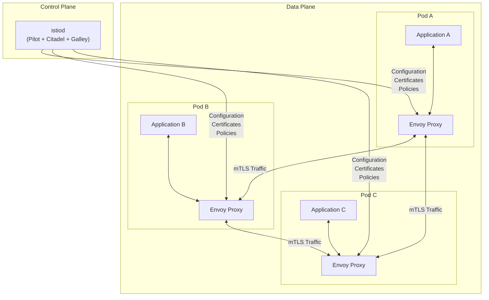
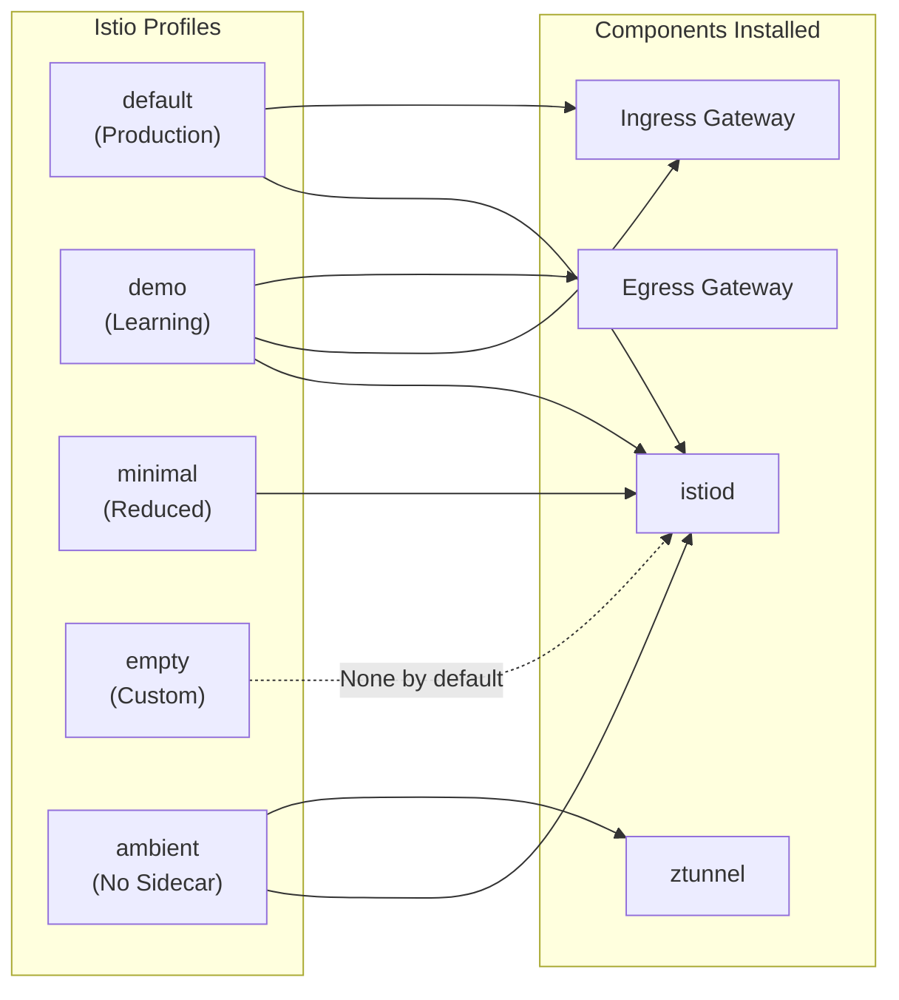
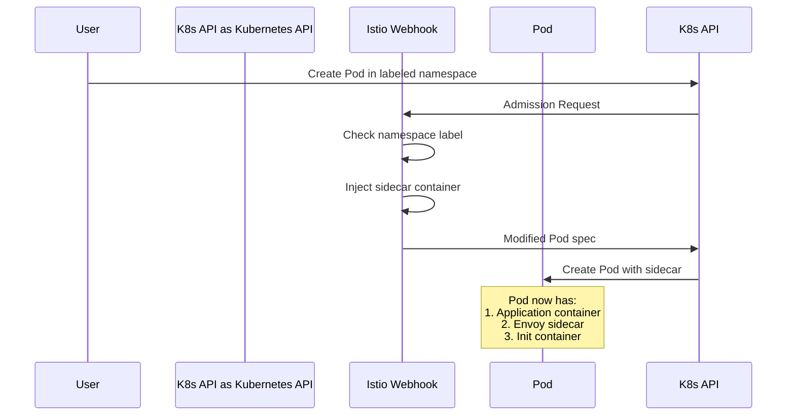
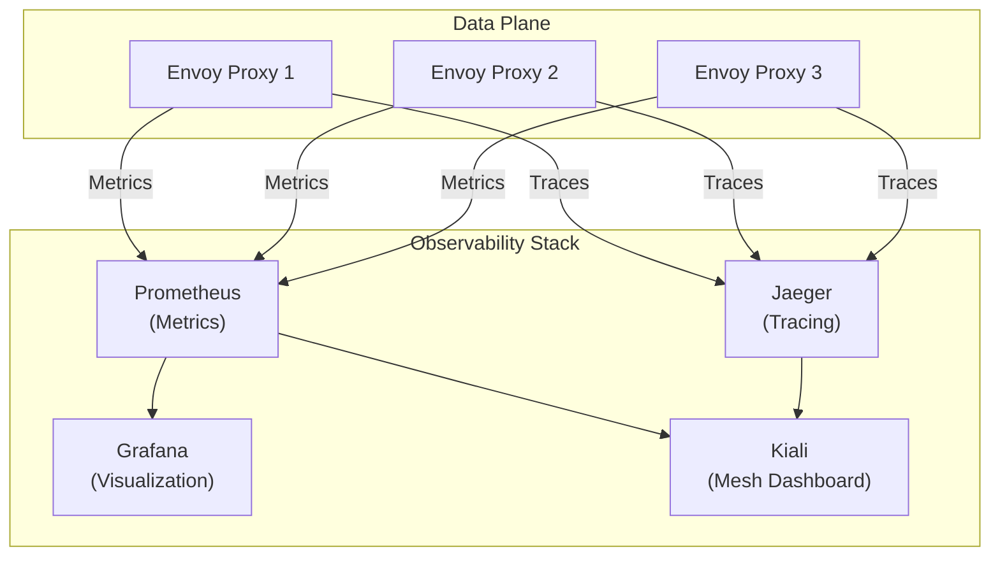

# How to Install Istio Service Mesh on Kubernetes

Author: [nawazdhandala](https://github.com/nawazdhandala)

Tags: Istio, Service Mesh, Kubernetes, Installation, Cloud Native

Description: A complete guide to installing and configuring Istio service mesh on Kubernetes clusters.

---

Istio is a powerful open-source service mesh that provides a uniform way to secure, connect, and observe microservices. In this comprehensive guide, we will walk through the complete process of installing Istio on a Kubernetes cluster, from downloading the CLI tools to verifying the installation and setting up automatic sidecar injection.

## What is Istio?

Istio is a service mesh that layers transparently onto existing distributed applications. It provides powerful features for traffic management, security, and observability without requiring changes to your application code. Istio works by deploying a sidecar proxy (Envoy) alongside each service, which intercepts all network communication between microservices.

## Istio Architecture Overview

Before we dive into the installation, let us understand how Istio components work together:



The architecture consists of two main components:

- **Control Plane (istiod)**: The unified daemon that provides service discovery, configuration management, and certificate management.
- **Data Plane**: Consists of Envoy proxies deployed as sidecars that intercept and control all network traffic between services.

## Prerequisites

Before installing Istio, ensure you have the following prerequisites in place:

- A running Kubernetes cluster (version 1.25 or later recommended)
- kubectl configured to communicate with your cluster
- Cluster admin permissions
- At least 4 CPU cores and 8GB of memory available in your cluster

Verify your Kubernetes cluster is accessible and running:

```bash
# Check that kubectl can connect to your cluster
# This command should return the cluster information including
# the Kubernetes version and API server address
kubectl cluster-info
```

Verify you have the required Kubernetes version:

```bash
# Istio requires Kubernetes 1.25 or later
# This command displays the client and server versions
kubectl version --short
```

## Installing istioctl

The istioctl command-line tool is the primary way to install and manage Istio. There are several methods to install it:

### Method 1: Download and Install Automatically (Recommended)

This is the simplest method that downloads the latest stable version:

```bash
# Download the latest Istio release
# This script automatically detects your OS and architecture
# and downloads the appropriate binary
curl -L https://istio.io/downloadIstio | sh -
```

After downloading, add istioctl to your PATH:

```bash
# Move into the downloaded Istio directory
# The directory name includes the version number
cd istio-1.24.0

# Add istioctl to your PATH for the current session
# This allows you to run istioctl from any directory
export PATH=$PWD/bin:$PATH
```

To make this permanent, add the export line to your shell configuration:

```bash
# For bash users, add to ~/.bashrc
# For zsh users, add to ~/.zshrc
echo 'export PATH="$HOME/istio-1.24.0/bin:$PATH"' >> ~/.bashrc
source ~/.bashrc
```

### Method 2: Download a Specific Version

If you need a specific version of Istio:

```bash
# Set the desired Istio version
# Check https://github.com/istio/istio/releases for available versions
ISTIO_VERSION=1.24.0

# Download the specific version
# The ISTIO_VERSION environment variable tells the script
# which version to download instead of the latest
curl -L https://istio.io/downloadIstio | ISTIO_VERSION=$ISTIO_VERSION sh -
```

### Method 3: Install via Homebrew (macOS)

For macOS users, Homebrew provides a convenient installation method:

```bash
# Install istioctl using Homebrew
# This installs only the CLI tool, not Istio itself
brew install istioctl
```

### Method 4: Install via Package Managers (Linux)

For Linux distributions, you can use the appropriate package manager:

```bash
# For Debian/Ubuntu systems using apt
# First, add the Istio repository
curl -sL https://istio.io/downloadIstioctl | sh -

# For systems with snap support
sudo snap install istioctl --classic
```

### Verify istioctl Installation

After installation, verify that istioctl is working correctly:

```bash
# Check the istioctl version
# This should display the version without any errors
istioctl version --remote=false
```

## Understanding Istio Installation Profiles

Istio provides several built-in configuration profiles that customize the installation for different use cases. Understanding these profiles helps you choose the right configuration for your needs.



### Available Profiles

| Profile | Description | Use Case |
|---------|-------------|----------|
| **default** | Standard production installation with istiod and ingress gateway | Production environments |
| **demo** | Full installation with all components for evaluation | Learning, demonstrations, testing |
| **minimal** | Only istiod, no gateways | When using custom gateways or for control plane only |
| **empty** | Nothing installed by default | Fully custom installations |
| **ambient** | Ambient mesh mode without sidecars | New mesh architecture (experimental) |

View available profiles and their differences:

```bash
# List all available installation profiles
# Each profile has different components enabled by default
istioctl profile list
```

Compare profiles to understand the differences:

```bash
# Show the configuration for the default profile
# This displays all settings and enabled components
istioctl profile dump default

# Compare two profiles to see the differences
# Useful for understanding what additional components demo adds
istioctl profile diff default demo
```

## Installing Istio on Your Cluster

Now let us proceed with the actual installation. We will cover multiple installation methods for different use cases.

### Method 1: Install Using the Default Profile (Recommended for Production)

The default profile is suitable for production environments:

```bash
# Install Istio with the default profile
# This installs istiod (control plane) and the ingress gateway
# The -y flag skips the confirmation prompt
istioctl install --set profile=default -y
```

### Method 2: Install Using the Demo Profile (Recommended for Learning)

The demo profile includes additional features useful for learning:

```bash
# Install Istio with the demo profile
# This includes istiod, ingress gateway, and egress gateway
# Also enables additional logging and tracing for debugging
istioctl install --set profile=demo -y
```

### Method 3: Install Using the Minimal Profile

For minimal footprint installations:

```bash
# Install Istio with the minimal profile
# Only installs the control plane (istiod)
# You will need to configure gateways separately if needed
istioctl install --set profile=minimal -y
```

### Method 4: Custom Installation with Specific Settings

For customized installations, you can override specific settings:

```bash
# Install with custom configuration
# This example enables access logging and sets resource limits
istioctl install --set profile=default \
  --set meshConfig.accessLogFile=/dev/stdout \
  --set meshConfig.enableTracing=true \
  --set values.pilot.resources.requests.memory=256Mi \
  --set values.pilot.resources.requests.cpu=100m \
  -y
```

### Method 5: Install Using an IstioOperator Manifest

For reproducible installations, create an IstioOperator manifest file:

```yaml
# Save this as istio-config.yaml
# This manifest provides fine-grained control over the installation
apiVersion: install.istio.io/v1alpha1
kind: IstioOperator
metadata:
  name: istio-control-plane
  namespace: istio-system
spec:
  # Use the default profile as the base configuration
  profile: default

  # Customize mesh-wide settings
  meshConfig:
    # Enable access logging to stdout for debugging
    accessLogFile: /dev/stdout

    # Enable distributed tracing
    enableTracing: true

    # Set the default tracing sampling rate (0.0 to 100.0)
    defaultConfig:
      tracing:
        sampling: 100.0

    # Configure outbound traffic policy
    # ALLOW_ANY permits traffic to external services
    # REGISTRY_ONLY restricts to known services
    outboundTrafficPolicy:
      mode: ALLOW_ANY

  # Component-specific configurations
  components:
    # Control plane settings
    pilot:
      k8s:
        # Set resource requests and limits for istiod
        resources:
          requests:
            cpu: 100m
            memory: 256Mi
          limits:
            cpu: 500m
            memory: 1Gi

        # Configure horizontal pod autoscaler
        hpaSpec:
          minReplicas: 1
          maxReplicas: 3
          metrics:
            - type: Resource
              resource:
                name: cpu
                targetAverageUtilization: 80

    # Ingress gateway settings
    ingressGateways:
      - name: istio-ingressgateway
        enabled: true
        k8s:
          # Set resource limits for the ingress gateway
          resources:
            requests:
              cpu: 100m
              memory: 128Mi
            limits:
              cpu: 500m
              memory: 512Mi

          # Configure the service type
          # Use LoadBalancer for cloud environments
          # Use NodePort for bare-metal clusters
          service:
            type: LoadBalancer
            ports:
              - port: 15021
                targetPort: 15021
                name: status-port
              - port: 80
                targetPort: 8080
                name: http2
              - port: 443
                targetPort: 8443
                name: https

    # Egress gateway settings (optional)
    egressGateways:
      - name: istio-egressgateway
        enabled: false
```

Apply the manifest to install Istio:

```bash
# Install Istio using the IstioOperator manifest
# This provides reproducible, version-controlled installations
istioctl install -f istio-config.yaml -y
```

## Verifying the Installation

After installation, it is crucial to verify that all components are running correctly.

### Check Istio Components Status

Verify that all Istio pods are running:

```bash
# List all pods in the istio-system namespace
# All pods should show Running status and be Ready (all containers started)
kubectl get pods -n istio-system
```

Expected output for the default profile:

```
NAME                                    READY   STATUS    RESTARTS   AGE
istio-ingressgateway-5d869f5bbf-7pmkt   1/1     Running   0          2m
istiod-7f6d7c759c-vd9rp                 1/1     Running   0          2m
```

### Verify Istio Services

Check that the Istio services are created:

```bash
# List all services in the istio-system namespace
# You should see istiod and istio-ingressgateway services
kubectl get svc -n istio-system
```

### Use istioctl to Verify Installation

The istioctl tool provides a comprehensive verification command:

```bash
# Run a comprehensive verification of the Istio installation
# This checks all components and their configurations
istioctl verify-install
```

This command validates:
- Control plane components are running
- Webhooks are properly configured
- CRDs are installed correctly
- Configuration is valid

### Check Istio Version in Cluster

Verify the installed version matches your expectations:

```bash
# Display version information for both client and control plane
# The client version is your istioctl version
# The control plane version is what is running in the cluster
istioctl version
```

### Analyze the Mesh for Issues

Run the analyze command to detect potential problems:

```bash
# Analyze the entire mesh for configuration issues
# This command identifies misconfigurations and best practice violations
istioctl analyze --all-namespaces
```

## Setting Up Automatic Sidecar Injection

Istio works by injecting Envoy sidecar proxies into your application pods. This can be done automatically using namespace labels.

### Understanding Sidecar Injection



### Enable Automatic Injection for a Namespace

Label your namespace to enable automatic sidecar injection:

```bash
# Enable automatic sidecar injection for the default namespace
# The istio-injection=enabled label triggers the webhook
kubectl label namespace default istio-injection=enabled

# Verify the label was applied
kubectl get namespace default --show-labels
```

### Enable Injection for Multiple Namespaces

For microservices spanning multiple namespaces:

```bash
# Create namespaces for your application
kubectl create namespace frontend
kubectl create namespace backend
kubectl create namespace data

# Enable sidecar injection for all application namespaces
# Each namespace needs the istio-injection label
kubectl label namespace frontend istio-injection=enabled
kubectl label namespace backend istio-injection=enabled
kubectl label namespace data istio-injection=enabled
```

### Verify Injection is Enabled

Check which namespaces have injection enabled:

```bash
# List all namespaces with their labels
# Look for istio-injection=enabled in the LABELS column
kubectl get namespaces -L istio-injection
```

### Disable Injection for a Namespace

If you need to disable injection:

```bash
# Remove the injection label from a namespace
# New pods will no longer get sidecars (existing pods are unaffected)
kubectl label namespace default istio-injection-

# Alternatively, explicitly disable injection
# This prevents injection even if the parent namespace has it enabled
kubectl label namespace default istio-injection=disabled --overwrite
```

### Pod-Level Injection Control

You can control injection at the pod level using annotations:

```yaml
# Example pod manifest with injection enabled
apiVersion: v1
kind: Pod
metadata:
  name: my-app
  annotations:
    # Explicitly enable sidecar injection for this pod
    # Overrides namespace-level settings
    sidecar.istio.io/inject: "true"
spec:
  containers:
    - name: my-app
      image: my-app:latest
```

To exclude a specific pod from injection:

```yaml
# Example pod manifest with injection disabled
apiVersion: v1
kind: Pod
metadata:
  name: my-app-no-sidecar
  annotations:
    # Disable sidecar injection for this specific pod
    # Useful for pods that should not be in the mesh
    sidecar.istio.io/inject: "false"
spec:
  containers:
    - name: my-app
      image: my-app:latest
```

## Deploying a Sample Application

Let us deploy a sample application to verify the mesh is working:

```bash
# Deploy the Bookinfo sample application
# This is a multi-service application included with Istio
kubectl apply -f https://raw.githubusercontent.com/istio/istio/release-1.24/samples/bookinfo/platform/kube/bookinfo.yaml
```

Wait for the pods to be ready:

```bash
# Check that all Bookinfo pods are running with sidecars
# Each pod should show 2/2 containers (app + sidecar)
kubectl get pods -l app=productpage
kubectl get pods -l app=reviews
kubectl get pods -l app=ratings
kubectl get pods -l app=details
```

Verify the application is working:

```bash
# Test the application from within the cluster
# This command runs curl inside a temporary pod
kubectl exec "$(kubectl get pod -l app=ratings -o jsonpath='{.items[0].metadata.name}')" \
  -c ratings -- curl -sS productpage:9080/productpage | head -20
```

## Exposing the Application via Istio Ingress Gateway

To access your application from outside the cluster, configure an Istio Gateway:

```yaml
# Save this as bookinfo-gateway.yaml
# This configures the ingress gateway to accept traffic for your application
apiVersion: networking.istio.io/v1beta1
kind: Gateway
metadata:
  name: bookinfo-gateway
  namespace: default
spec:
  # Use the default Istio ingress gateway
  selector:
    istio: ingressgateway
  servers:
    - port:
        number: 80
        name: http
        protocol: HTTP
      # Accept traffic for any host
      # In production, specify your actual hostname
      hosts:
        - "*"
---
# VirtualService defines routing rules for the traffic
apiVersion: networking.istio.io/v1beta1
kind: VirtualService
metadata:
  name: bookinfo
  namespace: default
spec:
  # Apply to traffic coming through the gateway
  hosts:
    - "*"
  gateways:
    - bookinfo-gateway
  http:
    # Route /productpage requests to the productpage service
    - match:
        - uri:
            exact: /productpage
        - uri:
            prefix: /static
        - uri:
            exact: /login
        - uri:
            exact: /logout
        - uri:
            prefix: /api/v1/products
      route:
        - destination:
            host: productpage
            port:
              number: 9080
```

Apply the gateway configuration:

```bash
# Apply the gateway and virtual service
kubectl apply -f bookinfo-gateway.yaml
```

Get the ingress gateway address:

```bash
# For cloud environments with LoadBalancer support
# Get the external IP of the ingress gateway
export INGRESS_HOST=$(kubectl -n istio-system get service istio-ingressgateway \
  -o jsonpath='{.status.loadBalancer.ingress[0].ip}')
export INGRESS_PORT=$(kubectl -n istio-system get service istio-ingressgateway \
  -o jsonpath='{.spec.ports[?(@.name=="http2")].port}')

# Print the URL to access the application
echo "Access the application at: http://$INGRESS_HOST:$INGRESS_PORT/productpage"
```

For environments without LoadBalancer (NodePort):

```bash
# Get the NodePort for the ingress gateway
export INGRESS_PORT=$(kubectl -n istio-system get service istio-ingressgateway \
  -o jsonpath='{.spec.ports[?(@.name=="http2")].nodePort}')

# Get any node IP
export INGRESS_HOST=$(kubectl get nodes -o jsonpath='{.items[0].status.addresses[?(@.type=="ExternalIP")].address}')

# If no external IP, use internal IP
if [ -z "$INGRESS_HOST" ]; then
  export INGRESS_HOST=$(kubectl get nodes -o jsonpath='{.items[0].status.addresses[?(@.type=="InternalIP")].address}')
fi

echo "Access the application at: http://$INGRESS_HOST:$INGRESS_PORT/productpage"
```

## Installing Istio Add-ons for Observability

Istio integrates with several observability tools. Let us install the common add-ons:

```bash
# Install Prometheus for metrics collection
kubectl apply -f https://raw.githubusercontent.com/istio/istio/release-1.24/samples/addons/prometheus.yaml

# Install Grafana for metrics visualization
kubectl apply -f https://raw.githubusercontent.com/istio/istio/release-1.24/samples/addons/grafana.yaml

# Install Jaeger for distributed tracing
kubectl apply -f https://raw.githubusercontent.com/istio/istio/release-1.24/samples/addons/jaeger.yaml

# Install Kiali for service mesh visualization
kubectl apply -f https://raw.githubusercontent.com/istio/istio/release-1.24/samples/addons/kiali.yaml
```

Wait for the add-ons to be ready:

```bash
# Verify all add-on pods are running
kubectl get pods -n istio-system -l app.kubernetes.io/part-of=kiali
kubectl get pods -n istio-system -l app=prometheus
kubectl get pods -n istio-system -l app=grafana
kubectl get pods -n istio-system -l app=jaeger
```

Access the dashboards using istioctl:

```bash
# Open Kiali dashboard in your browser
# Kiali provides a visual overview of your service mesh
istioctl dashboard kiali

# Open Grafana dashboard
# Pre-configured dashboards for Istio metrics
istioctl dashboard grafana

# Open Jaeger dashboard
# View distributed traces across services
istioctl dashboard jaeger

# Open Prometheus dashboard
# Query raw metrics data
istioctl dashboard prometheus
```

## Istio Add-ons Architecture



## Troubleshooting Common Issues

### Issue 1: Pods Not Getting Sidecars

If pods are not getting sidecar containers:

```bash
# Check if the namespace has injection enabled
kubectl get namespace default --show-labels | grep istio-injection

# Check if the webhook is working
kubectl get mutatingwebhookconfigurations istio-sidecar-injector -o yaml

# Check istiod logs for injection errors
kubectl logs -n istio-system -l app=istiod -c discovery | grep -i inject
```

### Issue 2: Services Cannot Communicate

If services within the mesh cannot communicate:

```bash
# Check if envoy proxy is running in the pod
kubectl describe pod <pod-name> | grep -A5 "istio-proxy"

# Check the proxy configuration
istioctl proxy-config clusters <pod-name>

# Check for network policies that might block traffic
kubectl get networkpolicies -A
```

### Issue 3: Ingress Gateway Not Working

If external traffic is not reaching your services:

```bash
# Check ingress gateway logs
kubectl logs -n istio-system -l app=istio-ingressgateway

# Verify the gateway configuration
istioctl analyze -n istio-system

# Check if the gateway service has an external IP
kubectl get svc istio-ingressgateway -n istio-system
```

### Issue 4: High Memory Usage

If Istio components are using too much memory:

```bash
# Check resource usage
kubectl top pods -n istio-system

# Review and adjust resource limits in the IstioOperator
istioctl manifest generate --set profile=default | grep -A10 resources
```

## Uninstalling Istio

If you need to remove Istio from your cluster:

```bash
# Uninstall Istio and all its components
# This removes the control plane and data plane components
istioctl uninstall --purge -y

# Remove the istio-system namespace
kubectl delete namespace istio-system

# Remove Istio CRDs if needed
kubectl get crd | grep istio | awk '{print $1}' | xargs kubectl delete crd
```

## Best Practices for Production

1. **Use Resource Limits**: Always configure resource requests and limits for Istio components.

2. **Enable High Availability**: Run multiple replicas of istiod for production:

```yaml
# Configure multiple replicas for istiod
spec:
  components:
    pilot:
      k8s:
        replicaCount: 3
```

3. **Implement Gradual Rollouts**: Use canary deployments when updating Istio.

4. **Monitor the Mesh**: Set up alerting based on Istio metrics in Prometheus.

5. **Secure Access**: Use RBAC and network policies to restrict access to Istio components.

6. **Regular Updates**: Keep Istio updated to get security patches and new features.

## Conclusion

You have successfully installed Istio service mesh on your Kubernetes cluster. You now have:

- A fully functional Istio control plane
- Automatic sidecar injection configured
- Observability tools installed (Prometheus, Grafana, Jaeger, Kiali)
- A sample application running in the mesh

With Istio installed, you can now explore advanced features like traffic management, security policies, and observability. The service mesh provides a powerful platform for managing microservices communication, implementing security policies, and gaining visibility into your application's behavior.

## Next Steps

- Configure traffic management with VirtualServices and DestinationRules
- Enable mutual TLS (mTLS) for service-to-service communication
- Set up authorization policies for fine-grained access control
- Implement circuit breakers and retry policies
- Explore Istio's fault injection capabilities for chaos testing

## Additional Resources

- [Istio Official Documentation](https://istio.io/latest/docs/)
- [Istio GitHub Repository](https://github.com/istio/istio)
- [Istio Community](https://istio.io/latest/about/community/)
- [Envoy Proxy Documentation](https://www.envoyproxy.io/docs/envoy/latest/)
