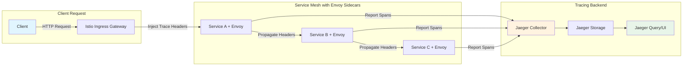
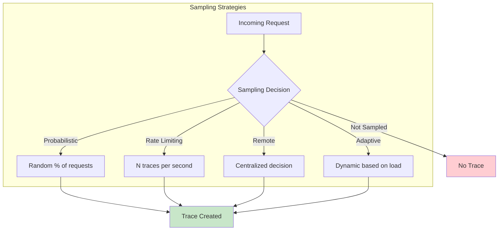
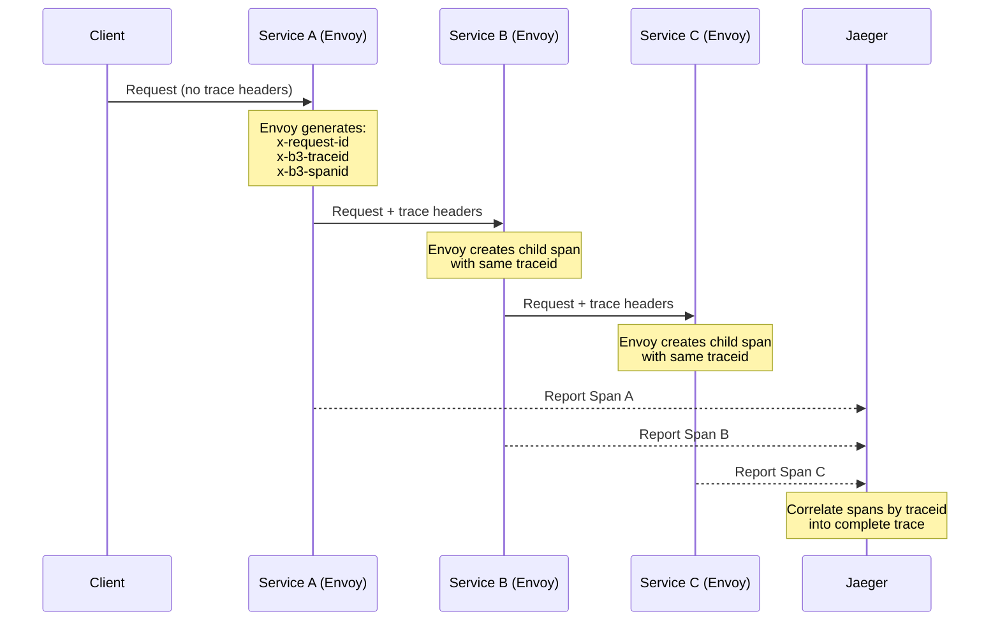
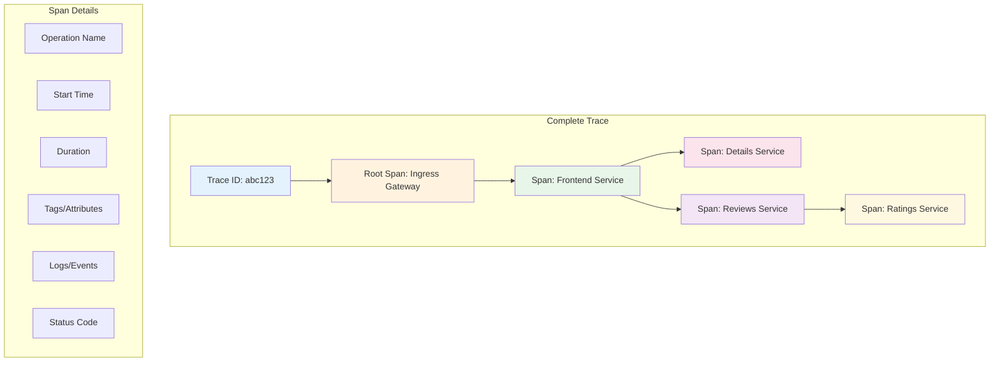

# How to Set Up Distributed Tracing with Istio and Jaeger

Author: [nawazdhandala](https://github.com/nawazdhandala)

Tags: Istio, Jaeger, Distributed Tracing, Observability, Service Mesh

Description: Learn how to implement distributed tracing in Istio using Jaeger for request tracking.

---

Distributed tracing is essential for understanding request flows across microservices in modern cloud-native applications. When you combine Istio's service mesh capabilities with Jaeger's powerful tracing backend, you get comprehensive visibility into your application's behavior, performance bottlenecks, and failure points. This guide walks you through setting up distributed tracing with Istio and Jaeger from scratch.

## Understanding Distributed Tracing in a Service Mesh

Before diving into the implementation, let's understand how distributed tracing works in the context of Istio and Jaeger.



In this architecture:
- **Envoy sidecars** automatically inject and propagate trace headers
- **Each service** reports its spans to the Jaeger collector
- **Jaeger** aggregates spans into complete traces for visualization

## Prerequisites

Before you begin, ensure you have the following:

- A Kubernetes cluster (1.24+) running
- `kubectl` configured to access your cluster
- `istioctl` CLI installed (1.20+)
- Helm 3.x installed
- Basic understanding of Kubernetes and service mesh concepts

## Step 1: Installing Istio with Tracing Enabled

First, let's install Istio with the tracing configuration enabled. We'll use a custom IstioOperator configuration to ensure proper integration with Jaeger.

The following configuration enables Istio's tracing extension provider and configures the mesh to use Jaeger as the tracing backend:

```yaml
# istio-operator-config.yaml
# This configuration installs Istio with tracing enabled
# and configures the mesh to send traces to Jaeger
apiVersion: install.istio.io/v1alpha1
kind: IstioOperator
metadata:
  name: istio-with-tracing
  namespace: istio-system
spec:
  # Use the demo profile as a starting point (includes most components)
  profile: demo

  # Mesh-wide configuration settings
  meshConfig:
    # Enable access logging for debugging (optional but helpful)
    accessLogFile: /dev/stdout

    # Configure the default tracing provider
    defaultProviders:
      tracing:
        - jaeger

    # Enable distributed tracing with 100% sampling for testing
    # In production, reduce this value significantly (e.g., 1.0 for 1%)
    enableTracing: true

    # Define extension providers for observability
    extensionProviders:
      - name: jaeger
        opentelemetry:
          # Service address for the Jaeger collector
          # This assumes Jaeger is installed in the istio-system namespace
          service: jaeger-collector.istio-system.svc.cluster.local
          port: 4317

  # Component-specific configurations
  components:
    # Enable the Istio Ingress Gateway
    ingressGateways:
      - name: istio-ingressgateway
        enabled: true

    # Enable the Istio Egress Gateway (optional)
    egressGateways:
      - name: istio-egressgateway
        enabled: true
```

Apply the Istio configuration using istioctl:

```bash
# Install Istio with the custom tracing configuration
# The --wait flag ensures all components are ready before proceeding
istioctl install -f istio-operator-config.yaml --wait

# Verify Istio installation
# All pods should be in Running state
kubectl get pods -n istio-system

# Check if the mesh configuration includes tracing settings
kubectl get configmap istio -n istio-system -o yaml | grep -A 20 "defaultProviders"
```

## Step 2: Deploying Jaeger

Now let's deploy Jaeger to the cluster. We'll use the Jaeger Operator for a production-ready setup that includes all necessary components.

### Option A: Quick Installation with Jaeger All-in-One (Development)

For development and testing, use the all-in-one deployment which includes the collector, query service, and in-memory storage:

```yaml
# jaeger-all-in-one.yaml
# This deploys Jaeger in all-in-one mode for development
# All components run in a single pod with in-memory storage
apiVersion: apps/v1
kind: Deployment
metadata:
  name: jaeger
  namespace: istio-system
  labels:
    app: jaeger
spec:
  replicas: 1
  selector:
    matchLabels:
      app: jaeger
  template:
    metadata:
      labels:
        app: jaeger
      # Prevent Istio from injecting sidecar into Jaeger pod
      # This avoids circular dependencies in tracing
      annotations:
        sidecar.istio.io/inject: "false"
    spec:
      containers:
        - name: jaeger
          image: jaegertracing/all-in-one:1.53
          # Environment variables for Jaeger configuration
          env:
            # Set the collector's sampling strategy
            - name: COLLECTOR_OTLP_ENABLED
              value: "true"
            # Memory storage configuration (for development only)
            - name: MEMORY_MAX_TRACES
              value: "50000"
            # Enable metrics endpoint
            - name: METRICS_STORAGE_TYPE
              value: prometheus
          ports:
            # Jaeger UI port
            - containerPort: 16686
              name: query-http
            # OTLP gRPC receiver (used by Istio)
            - containerPort: 4317
              name: otlp-grpc
            # OTLP HTTP receiver
            - containerPort: 4318
              name: otlp-http
            # Jaeger thrift compact (legacy)
            - containerPort: 6831
              name: thrift-compact
              protocol: UDP
            # Jaeger thrift binary (legacy)
            - containerPort: 6832
              name: thrift-binary
              protocol: UDP
            # Admin and health check port
            - containerPort: 14269
              name: admin-http
          # Resource limits for the container
          resources:
            requests:
              memory: "256Mi"
              cpu: "100m"
            limits:
              memory: "1Gi"
              cpu: "500m"
          # Health check configuration
          readinessProbe:
            httpGet:
              path: /
              port: 14269
            initialDelaySeconds: 5
          livenessProbe:
            httpGet:
              path: /
              port: 14269
            initialDelaySeconds: 10
---
# Service for Jaeger Collector
# This is what Istio sidecars will send traces to
apiVersion: v1
kind: Service
metadata:
  name: jaeger-collector
  namespace: istio-system
  labels:
    app: jaeger
spec:
  ports:
    # OTLP gRPC - primary port for Istio integration
    - name: otlp-grpc
      port: 4317
      targetPort: 4317
      protocol: TCP
    # OTLP HTTP - alternative protocol
    - name: otlp-http
      port: 4318
      targetPort: 4318
      protocol: TCP
    # Legacy Jaeger thrift ports
    - name: thrift-compact
      port: 6831
      targetPort: 6831
      protocol: UDP
    - name: thrift-binary
      port: 6832
      targetPort: 6832
      protocol: UDP
  selector:
    app: jaeger
---
# Service for Jaeger Query (UI)
# Exposes the Jaeger web interface
apiVersion: v1
kind: Service
metadata:
  name: jaeger-query
  namespace: istio-system
  labels:
    app: jaeger
spec:
  ports:
    - name: query-http
      port: 16686
      targetPort: 16686
      protocol: TCP
  selector:
    app: jaeger
```

Apply the Jaeger deployment:

```bash
# Deploy Jaeger to the istio-system namespace
kubectl apply -f jaeger-all-in-one.yaml

# Wait for Jaeger to be ready
kubectl wait --for=condition=ready pod -l app=jaeger -n istio-system --timeout=120s

# Verify Jaeger is running
kubectl get pods -n istio-system -l app=jaeger
```

### Option B: Production Installation with Jaeger Operator

For production environments, use the Jaeger Operator with persistent storage:

```yaml
# jaeger-operator-install.yaml
# First, install the Jaeger Operator using OLM or direct manifests
---
# Create namespace for Jaeger Operator
apiVersion: v1
kind: Namespace
metadata:
  name: observability
---
# Jaeger custom resource for production deployment
# This creates a distributed Jaeger setup with Elasticsearch backend
apiVersion: jaegertracing.io/v1
kind: Jaeger
metadata:
  name: jaeger-production
  namespace: istio-system
spec:
  # Production strategy deploys separate collector, query, and agent components
  strategy: production

  # Collector configuration
  collector:
    # Number of collector replicas for high availability
    replicas: 2
    # Resource allocation for collectors
    resources:
      requests:
        memory: "512Mi"
        cpu: "250m"
      limits:
        memory: "1Gi"
        cpu: "1000m"
    # Options for the collector
    options:
      # Enable OTLP receiver for Istio integration
      collector:
        otlp:
          enabled: true
          grpc:
            host-port: ":4317"

  # Query service configuration
  query:
    replicas: 2
    resources:
      requests:
        memory: "256Mi"
        cpu: "100m"
      limits:
        memory: "512Mi"
        cpu: "500m"

  # Storage configuration using Elasticsearch
  storage:
    type: elasticsearch
    options:
      es:
        # Elasticsearch server URL
        server-urls: https://elasticsearch:9200
        # Index prefix for Jaeger data
        index-prefix: jaeger
        # Use TLS for Elasticsearch connection
        tls:
          enabled: true
    # Secret containing Elasticsearch credentials
    secretName: jaeger-es-secret

  # Ingester configuration for Kafka-based deployment (optional)
  # Uncomment if using Kafka for buffering
  # ingester:
  #   replicas: 2
  #   options:
  #     kafka:
  #       consumer:
  #         brokers: kafka:9092
  #         topic: jaeger-spans
```

Install the Jaeger Operator first, then apply the custom resource:

```bash
# Install Jaeger Operator using Helm
helm repo add jaegertracing https://jaegertracing.github.io/helm-charts
helm repo update

# Install the operator in the observability namespace
helm install jaeger-operator jaegertracing/jaeger-operator \
  --namespace observability \
  --create-namespace \
  --set rbac.clusterRole=true

# Wait for the operator to be ready
kubectl wait --for=condition=ready pod -l name=jaeger-operator \
  -n observability --timeout=120s

# Create Elasticsearch secret (if using ES backend)
kubectl create secret generic jaeger-es-secret \
  --from-literal=ES_USERNAME=elastic \
  --from-literal=ES_PASSWORD=your-secure-password \
  -n istio-system

# Apply the production Jaeger configuration
kubectl apply -f jaeger-operator-install.yaml
```

## Step 3: Configuring Trace Sampling

Sampling determines what percentage of requests are traced. In production, you typically don't want to trace every request due to overhead. Let's configure sampling properly.

### Understanding Sampling Strategies



The following Telemetry resource configures mesh-wide sampling at 10%:

```yaml
# telemetry-sampling.yaml
# This configures distributed tracing sampling for the entire mesh
# Adjust the randomSamplingPercentage based on your traffic volume
apiVersion: telemetry.istio.io/v1alpha1
kind: Telemetry
metadata:
  name: mesh-default-tracing
  # When applied to istio-system, this becomes the mesh-wide default
  namespace: istio-system
spec:
  # Tracing configuration
  tracing:
    - providers:
        # Reference the Jaeger provider defined in the mesh config
        - name: jaeger
      # Random sampling configuration
      randomSamplingPercentage: 10.0
      # Custom tags to add to all spans
      customTags:
        # Add environment information to traces
        environment:
          literal:
            value: "production"
        # Add cluster name for multi-cluster setups
        cluster:
          literal:
            value: "primary"
```

For namespace-specific sampling, you can override the mesh default:

```yaml
# namespace-sampling.yaml
# Override sampling for a specific namespace
# Useful for debugging specific services
apiVersion: telemetry.istio.io/v1alpha1
kind: Telemetry
metadata:
  name: high-sampling
  # Apply to a specific namespace
  namespace: debug-namespace
spec:
  tracing:
    - providers:
        - name: jaeger
      # 100% sampling for debugging
      # WARNING: Only use this for debugging, not production traffic
      randomSamplingPercentage: 100.0
      # Disable tracing for specific paths (e.g., health checks)
      disableSpanReporting: false
```

For workload-specific sampling using selectors:

```yaml
# workload-sampling.yaml
# Configure sampling for specific workloads
apiVersion: telemetry.istio.io/v1alpha1
kind: Telemetry
metadata:
  name: critical-service-tracing
  namespace: production
spec:
  # Target specific workloads
  selector:
    matchLabels:
      app: payment-service
      version: v2
  tracing:
    - providers:
        - name: jaeger
      # Higher sampling for critical services
      randomSamplingPercentage: 50.0
      # Add service-specific tags
      customTags:
        service-tier:
          literal:
            value: "critical"
        team:
          literal:
            value: "payments"
```

Apply the sampling configurations:

```bash
# Apply mesh-wide sampling configuration
kubectl apply -f telemetry-sampling.yaml

# Verify the telemetry configuration is applied
kubectl get telemetry -A

# Check if the configuration is active
istioctl analyze -n istio-system
```

## Step 4: Trace Header Propagation

For distributed tracing to work correctly, trace context must be propagated between services. Istio's Envoy sidecars handle this automatically for most cases, but your applications must forward certain headers.

### Headers That Must Be Propagated



The following headers must be forwarded by your application code:

```yaml
# Required trace headers for B3 propagation (Zipkin format)
# These headers MUST be passed from incoming to outgoing requests

# B3 Multi-header format (traditional)
x-b3-traceid      # 128-bit trace identifier
x-b3-spanid       # 64-bit span identifier
x-b3-parentspanid # 64-bit parent span identifier
x-b3-sampled      # Sampling decision (0 or 1)
x-b3-flags        # Debug flag

# B3 Single-header format (compact)
b3                # {TraceId}-{SpanId}-{SamplingState}-{ParentSpanId}

# W3C Trace Context format (recommended for new applications)
traceparent       # Version-TraceId-ParentId-TraceFlags
tracestate        # Vendor-specific trace information

# Istio-specific headers
x-request-id      # Request identifier for correlation
x-envoy-attempt-count  # Retry attempt counter
```

### Example: Header Propagation in Different Languages

Here's how to propagate headers in various programming languages:

Python (Flask) example for propagating trace headers:

```python
# trace_propagation.py
# This module demonstrates trace header propagation in a Flask application
# Headers received on incoming requests must be forwarded to outgoing requests

from flask import Flask, request
import requests

app = Flask(__name__)

# List of trace headers that must be propagated
# These headers maintain the distributed trace context
TRACE_HEADERS = [
    # B3 format headers (used by Zipkin and Jaeger)
    'x-b3-traceid',
    'x-b3-spanid',
    'x-b3-parentspanid',
    'x-b3-sampled',
    'x-b3-flags',
    # B3 single-header format
    'b3',
    # W3C Trace Context headers
    'traceparent',
    'tracestate',
    # Istio/Envoy specific headers
    'x-request-id',
    'x-ot-span-context',
]

def extract_trace_headers():
    """
    Extract trace headers from the incoming request.
    Returns a dictionary of headers that should be propagated
    to any outgoing HTTP calls.
    """
    headers = {}
    for header in TRACE_HEADERS:
        # Check if the header exists in the incoming request
        value = request.headers.get(header)
        if value:
            headers[header] = value
    return headers

@app.route('/api/orders')
def get_orders():
    """
    Example endpoint that calls a downstream service.
    Demonstrates proper trace header propagation.
    """
    # Extract trace headers from the incoming request
    trace_headers = extract_trace_headers()

    # Log for debugging (remove in production)
    app.logger.info(f"Propagating trace headers: {trace_headers}")

    # Make a request to downstream service with trace headers
    # The headers parameter includes all trace context
    response = requests.get(
        'http://inventory-service:8080/api/inventory',
        headers=trace_headers,  # Forward trace headers
        timeout=5
    )

    return {
        'orders': [...],
        'inventory': response.json()
    }

@app.route('/api/checkout', methods=['POST'])
def checkout():
    """
    Example of multiple downstream calls with header propagation.
    Each call receives the same trace context for correlation.
    """
    trace_headers = extract_trace_headers()

    # Call multiple downstream services with the same trace headers
    # All these calls will be part of the same distributed trace

    # Check inventory availability
    inventory_response = requests.get(
        'http://inventory-service:8080/api/check',
        headers=trace_headers,
        timeout=5
    )

    # Process payment
    payment_response = requests.post(
        'http://payment-service:8080/api/charge',
        headers=trace_headers,  # Same trace headers
        json=request.json,
        timeout=10
    )

    # Send confirmation notification
    requests.post(
        'http://notification-service:8080/api/send',
        headers=trace_headers,  # Same trace headers
        json={'type': 'order_confirmation'},
        timeout=5
    )

    return {'status': 'success', 'orderId': '12345'}

if __name__ == '__main__':
    app.run(host='0.0.0.0', port=8080)
```

Node.js (Express) example for propagating trace headers:

```javascript
// traceMiddleware.js
// Express middleware for trace header propagation
// Automatically extracts and makes trace headers available for outgoing requests

const axios = require('axios');

// Headers that must be propagated for distributed tracing
// These headers maintain trace context across service boundaries
const TRACE_HEADERS = [
  // B3 format (Zipkin/Jaeger)
  'x-b3-traceid',
  'x-b3-spanid',
  'x-b3-parentspanid',
  'x-b3-sampled',
  'x-b3-flags',
  // B3 single header
  'b3',
  // W3C Trace Context
  'traceparent',
  'tracestate',
  // Istio/Envoy headers
  'x-request-id',
  'x-ot-span-context',
];

/**
 * Middleware that extracts trace headers from incoming requests
 * and attaches them to the request object for easy access.
 */
function traceMiddleware(req, res, next) {
  // Create an object to store trace headers
  req.traceHeaders = {};

  // Extract each trace header if present
  TRACE_HEADERS.forEach(header => {
    const value = req.get(header);
    if (value) {
      req.traceHeaders[header] = value;
    }
  });

  // Log trace context for debugging
  if (process.env.DEBUG_TRACING === 'true') {
    console.log('Trace context:', {
      traceId: req.traceHeaders['x-b3-traceid'],
      spanId: req.traceHeaders['x-b3-spanid'],
      requestId: req.traceHeaders['x-request-id'],
    });
  }

  next();
}

/**
 * Creates an axios instance that automatically includes trace headers
 * Use this for all outgoing HTTP requests to maintain trace context
 *
 * @param {Object} traceHeaders - Headers from req.traceHeaders
 * @returns {AxiosInstance} Configured axios instance
 */
function createTracedHttpClient(traceHeaders) {
  return axios.create({
    // Include trace headers in all requests made with this client
    headers: traceHeaders,
    // Reasonable timeout to prevent hanging requests
    timeout: 10000,
  });
}

// Example Express application using the middleware
const express = require('express');
const app = express();

// Apply trace middleware to all routes
app.use(traceMiddleware);
app.use(express.json());

// Example route demonstrating header propagation
app.get('/api/products/:id', async (req, res) => {
  try {
    // Create HTTP client with trace headers
    // All requests made with this client will propagate trace context
    const httpClient = createTracedHttpClient(req.traceHeaders);

    // Fetch product details from catalog service
    const productResponse = await httpClient.get(
      `http://catalog-service:8080/api/products/${req.params.id}`
    );

    // Fetch inventory from inventory service
    // Uses the same trace context as the catalog request
    const inventoryResponse = await httpClient.get(
      `http://inventory-service:8080/api/stock/${req.params.id}`
    );

    // Combine responses
    res.json({
      product: productResponse.data,
      inventory: inventoryResponse.data,
    });
  } catch (error) {
    console.error('Error fetching product:', error.message);
    res.status(500).json({ error: 'Internal server error' });
  }
});

module.exports = { traceMiddleware, createTracedHttpClient };
```

Go example for propagating trace headers:

```go
// trace_propagation.go
// Demonstrates trace header propagation in a Go HTTP service
// Uses middleware pattern for automatic header extraction and propagation

package main

import (
	"context"
	"log"
	"net/http"
	"time"
)

// traceHeadersKey is the context key for storing trace headers
type traceHeadersKey struct{}

// TraceHeaders defines the headers that must be propagated
// for distributed tracing to work correctly with Istio/Jaeger
var TraceHeaders = []string{
	// B3 format headers (Zipkin/Jaeger compatible)
	"x-b3-traceid",
	"x-b3-spanid",
	"x-b3-parentspanid",
	"x-b3-sampled",
	"x-b3-flags",
	// B3 single-header format
	"b3",
	// W3C Trace Context headers
	"traceparent",
	"tracestate",
	// Istio/Envoy specific headers
	"x-request-id",
	"x-ot-span-context",
}

// TracingMiddleware extracts trace headers from incoming requests
// and stores them in the request context for later use
func TracingMiddleware(next http.Handler) http.Handler {
	return http.HandlerFunc(func(w http.ResponseWriter, r *http.Request) {
		// Create a map to store extracted trace headers
		headers := make(map[string]string)

		// Extract each trace header if present in the request
		for _, header := range TraceHeaders {
			if value := r.Header.Get(header); value != "" {
				headers[header] = value
			}
		}

		// Store headers in context for downstream handlers
		ctx := context.WithValue(r.Context(), traceHeadersKey{}, headers)

		// Log trace context for debugging
		if traceID, ok := headers["x-b3-traceid"]; ok {
			log.Printf("Processing request with trace ID: %s", traceID)
		}

		// Call the next handler with the updated context
		next.ServeHTTP(w, r.WithContext(ctx))
	})
}

// GetTraceHeaders retrieves trace headers from the context
// Returns an empty map if no headers are found
func GetTraceHeaders(ctx context.Context) map[string]string {
	headers, ok := ctx.Value(traceHeadersKey{}).(map[string]string)
	if !ok {
		return make(map[string]string)
	}
	return headers
}

// PropagateHeaders adds trace headers to an outgoing HTTP request
// This ensures the trace context is maintained across service calls
func PropagateHeaders(req *http.Request, headers map[string]string) {
	for key, value := range headers {
		req.Header.Set(key, value)
	}
}

// TracedHTTPClient is a wrapper around http.Client that automatically
// propagates trace headers on all requests
type TracedHTTPClient struct {
	client *http.Client
	headers map[string]string
}

// NewTracedHTTPClient creates a new HTTP client that propagates trace headers
func NewTracedHTTPClient(ctx context.Context) *TracedHTTPClient {
	return &TracedHTTPClient{
		client: &http.Client{
			Timeout: 10 * time.Second,
		},
		headers: GetTraceHeaders(ctx),
	}
}

// Get performs an HTTP GET request with trace headers propagated
func (c *TracedHTTPClient) Get(url string) (*http.Response, error) {
	req, err := http.NewRequest("GET", url, nil)
	if err != nil {
		return nil, err
	}

	// Add trace headers to the outgoing request
	PropagateHeaders(req, c.headers)

	return c.client.Do(req)
}

// Example handler demonstrating trace header propagation
func orderHandler(w http.ResponseWriter, r *http.Request) {
	// Create a traced HTTP client using the request context
	// This client will automatically propagate trace headers
	client := NewTracedHTTPClient(r.Context())

	// Call downstream services - trace context is automatically propagated
	inventoryResp, err := client.Get("http://inventory-service:8080/api/check")
	if err != nil {
		http.Error(w, "Failed to check inventory", http.StatusInternalServerError)
		return
	}
	defer inventoryResp.Body.Close()

	// Process the response...
	w.WriteHeader(http.StatusOK)
	w.Write([]byte(`{"status": "success"}`))
}

func main() {
	// Create a new mux and apply tracing middleware
	mux := http.NewServeMux()
	mux.HandleFunc("/api/orders", orderHandler)

	// Wrap with tracing middleware
	handler := TracingMiddleware(mux)

	log.Println("Starting server on :8080")
	log.Fatal(http.ListenAndServe(":8080", handler))
}
```

## Step 5: Deploying a Sample Application

Let's deploy a sample microservices application to test our distributed tracing setup.

```yaml
# sample-app.yaml
# A sample three-tier application to demonstrate distributed tracing
# Consists of frontend, backend, and database services
---
# Namespace for the sample application
apiVersion: v1
kind: Namespace
metadata:
  name: bookinfo
  labels:
    # Enable Istio sidecar injection for this namespace
    istio-injection: enabled
---
# Frontend Service - Entry point for user requests
apiVersion: apps/v1
kind: Deployment
metadata:
  name: frontend
  namespace: bookinfo
  labels:
    app: frontend
    version: v1
spec:
  replicas: 2
  selector:
    matchLabels:
      app: frontend
  template:
    metadata:
      labels:
        app: frontend
        version: v1
    spec:
      containers:
        - name: frontend
          image: docker.io/istio/examples-bookinfo-productpage-v1:1.18.0
          ports:
            - containerPort: 9080
          env:
            # Configure the backend service URL
            - name: DETAILS_SERVICE_URL
              value: "http://details:9080"
            - name: REVIEWS_SERVICE_URL
              value: "http://reviews:9080"
          resources:
            requests:
              memory: "64Mi"
              cpu: "50m"
            limits:
              memory: "128Mi"
              cpu: "100m"
---
apiVersion: v1
kind: Service
metadata:
  name: frontend
  namespace: bookinfo
  labels:
    app: frontend
spec:
  ports:
    - port: 9080
      name: http
  selector:
    app: frontend
---
# Details Service - Provides book details
apiVersion: apps/v1
kind: Deployment
metadata:
  name: details
  namespace: bookinfo
  labels:
    app: details
    version: v1
spec:
  replicas: 1
  selector:
    matchLabels:
      app: details
  template:
    metadata:
      labels:
        app: details
        version: v1
    spec:
      containers:
        - name: details
          image: docker.io/istio/examples-bookinfo-details-v1:1.18.0
          ports:
            - containerPort: 9080
          resources:
            requests:
              memory: "64Mi"
              cpu: "50m"
---
apiVersion: v1
kind: Service
metadata:
  name: details
  namespace: bookinfo
  labels:
    app: details
spec:
  ports:
    - port: 9080
      name: http
  selector:
    app: details
---
# Reviews Service - Provides book reviews (calls ratings service)
apiVersion: apps/v1
kind: Deployment
metadata:
  name: reviews
  namespace: bookinfo
  labels:
    app: reviews
    version: v1
spec:
  replicas: 1
  selector:
    matchLabels:
      app: reviews
  template:
    metadata:
      labels:
        app: reviews
        version: v1
    spec:
      containers:
        - name: reviews
          image: docker.io/istio/examples-bookinfo-reviews-v1:1.18.0
          ports:
            - containerPort: 9080
          env:
            - name: RATINGS_SERVICE_URL
              value: "http://ratings:9080"
          resources:
            requests:
              memory: "64Mi"
              cpu: "50m"
---
apiVersion: v1
kind: Service
metadata:
  name: reviews
  namespace: bookinfo
  labels:
    app: reviews
spec:
  ports:
    - port: 9080
      name: http
  selector:
    app: reviews
---
# Ratings Service - Provides book ratings
apiVersion: apps/v1
kind: Deployment
metadata:
  name: ratings
  namespace: bookinfo
  labels:
    app: ratings
    version: v1
spec:
  replicas: 1
  selector:
    matchLabels:
      app: ratings
  template:
    metadata:
      labels:
        app: ratings
        version: v1
    spec:
      containers:
        - name: ratings
          image: docker.io/istio/examples-bookinfo-ratings-v1:1.18.0
          ports:
            - containerPort: 9080
          resources:
            requests:
              memory: "64Mi"
              cpu: "50m"
---
apiVersion: v1
kind: Service
metadata:
  name: ratings
  namespace: bookinfo
  labels:
    app: ratings
spec:
  ports:
    - port: 9080
      name: http
  selector:
    app: ratings
---
# Gateway configuration for external access
apiVersion: networking.istio.io/v1beta1
kind: Gateway
metadata:
  name: bookinfo-gateway
  namespace: bookinfo
spec:
  selector:
    istio: ingressgateway
  servers:
    - port:
        number: 80
        name: http
        protocol: HTTP
      hosts:
        - "*"
---
# VirtualService for routing traffic to the frontend
apiVersion: networking.istio.io/v1beta1
kind: VirtualService
metadata:
  name: bookinfo
  namespace: bookinfo
spec:
  hosts:
    - "*"
  gateways:
    - bookinfo-gateway
  http:
    - match:
        - uri:
            prefix: /productpage
        - uri:
            prefix: /static
        - uri:
            exact: /login
        - uri:
            exact: /logout
        - uri:
            prefix: /api/v1/products
      route:
        - destination:
            host: frontend
            port:
              number: 9080
```

Deploy the sample application:

```bash
# Deploy the sample application
kubectl apply -f sample-app.yaml

# Wait for all pods to be ready
kubectl wait --for=condition=ready pod --all -n bookinfo --timeout=120s

# Verify sidecar injection (each pod should have 2 containers)
kubectl get pods -n bookinfo -o wide

# Get the ingress gateway URL
export INGRESS_HOST=$(kubectl -n istio-system get service istio-ingressgateway \
  -o jsonpath='{.status.loadBalancer.ingress[0].ip}')
export INGRESS_PORT=$(kubectl -n istio-system get service istio-ingressgateway \
  -o jsonpath='{.spec.ports[?(@.name=="http2")].port}')
export GATEWAY_URL=$INGRESS_HOST:$INGRESS_PORT

echo "Application URL: http://$GATEWAY_URL/productpage"
```

## Step 6: Generating and Viewing Traces

Now let's generate some traffic and view the traces in Jaeger.

Generate test traffic to create traces:

```bash
# Generate traffic to the application
# Each request will create a distributed trace
for i in {1..100}; do
  curl -s -o /dev/null "http://$GATEWAY_URL/productpage"
  echo "Request $i completed"
  sleep 0.5
done

# Access Jaeger UI via port-forward
# This allows you to view traces in your browser
kubectl port-forward -n istio-system svc/jaeger-query 16686:16686 &

echo "Jaeger UI available at: http://localhost:16686"
```

## Step 7: Trace Analysis Techniques

Understanding how to analyze traces is crucial for debugging and optimization. Here are key techniques and what to look for.

### Trace Anatomy



### Using Jaeger Query API for Trace Analysis

Here's a Python script for automated trace analysis:

```python
# trace_analyzer.py
# Script to analyze traces from Jaeger using the Query API
# Helps identify performance issues and error patterns

import requests
import json
from datetime import datetime, timedelta
from collections import defaultdict

class JaegerTraceAnalyzer:
    """
    Analyze traces from Jaeger to identify performance issues,
    error patterns, and service dependencies.
    """

    def __init__(self, jaeger_url="http://localhost:16686"):
        """
        Initialize the analyzer with Jaeger Query API URL.

        Args:
            jaeger_url: Base URL for Jaeger Query service
        """
        self.base_url = f"{jaeger_url}/api"
        self.session = requests.Session()

    def get_services(self):
        """
        Get list of all services that have reported traces.
        Returns a list of service names.
        """
        response = self.session.get(f"{self.base_url}/services")
        response.raise_for_status()
        return response.json().get("data", [])

    def search_traces(self, service, operation=None,
                      min_duration=None, max_duration=None,
                      limit=20, lookback="1h"):
        """
        Search for traces matching the specified criteria.

        Args:
            service: Service name to search for
            operation: Optional operation name filter
            min_duration: Minimum trace duration (e.g., "100ms")
            max_duration: Maximum trace duration
            limit: Maximum number of traces to return
            lookback: Time window to search (e.g., "1h", "30m")

        Returns:
            List of trace objects
        """
        params = {
            "service": service,
            "limit": limit,
            "lookback": lookback,
        }

        if operation:
            params["operation"] = operation
        if min_duration:
            params["minDuration"] = min_duration
        if max_duration:
            params["maxDuration"] = max_duration

        response = self.session.get(f"{self.base_url}/traces", params=params)
        response.raise_for_status()
        return response.json().get("data", [])

    def get_trace(self, trace_id):
        """
        Get a specific trace by ID.

        Args:
            trace_id: The trace ID to retrieve

        Returns:
            Trace object with all spans
        """
        response = self.session.get(f"{self.base_url}/traces/{trace_id}")
        response.raise_for_status()
        data = response.json().get("data", [])
        return data[0] if data else None

    def analyze_latency(self, traces):
        """
        Analyze latency distribution across traces.
        Identifies slow services and operations.

        Args:
            traces: List of trace objects

        Returns:
            Dictionary with latency statistics
        """
        service_latencies = defaultdict(list)
        operation_latencies = defaultdict(list)

        for trace in traces:
            for span in trace.get("spans", []):
                # Extract service name from process
                process_id = span.get("processID")
                process = trace.get("processes", {}).get(process_id, {})
                service_name = process.get("serviceName", "unknown")

                # Get operation name and duration
                operation = span.get("operationName", "unknown")
                duration_us = span.get("duration", 0)  # Duration in microseconds
                duration_ms = duration_us / 1000  # Convert to milliseconds

                service_latencies[service_name].append(duration_ms)
                operation_latencies[f"{service_name}:{operation}"].append(duration_ms)

        # Calculate statistics
        results = {
            "services": {},
            "operations": {},
        }

        for service, latencies in service_latencies.items():
            results["services"][service] = {
                "count": len(latencies),
                "avg_ms": sum(latencies) / len(latencies),
                "min_ms": min(latencies),
                "max_ms": max(latencies),
                "p50_ms": sorted(latencies)[len(latencies) // 2],
                "p95_ms": sorted(latencies)[int(len(latencies) * 0.95)],
            }

        for operation, latencies in operation_latencies.items():
            if len(latencies) >= 5:  # Only include operations with enough samples
                results["operations"][operation] = {
                    "count": len(latencies),
                    "avg_ms": sum(latencies) / len(latencies),
                    "p95_ms": sorted(latencies)[int(len(latencies) * 0.95)],
                }

        return results

    def find_errors(self, traces):
        """
        Find spans with errors in the traces.

        Args:
            traces: List of trace objects

        Returns:
            List of error details
        """
        errors = []

        for trace in traces:
            trace_id = trace.get("traceID")

            for span in trace.get("spans", []):
                # Check for error tag
                tags = {tag["key"]: tag["value"] for tag in span.get("tags", [])}

                if tags.get("error") == True or tags.get("otel.status_code") == "ERROR":
                    process_id = span.get("processID")
                    process = trace.get("processes", {}).get(process_id, {})

                    errors.append({
                        "trace_id": trace_id,
                        "span_id": span.get("spanID"),
                        "service": process.get("serviceName"),
                        "operation": span.get("operationName"),
                        "error_message": tags.get("error.message", "Unknown error"),
                        "http_status": tags.get("http.status_code"),
                        "timestamp": datetime.fromtimestamp(
                            span.get("startTime") / 1000000
                        ).isoformat(),
                    })

        return errors

    def build_dependency_graph(self, traces):
        """
        Build a service dependency graph from traces.

        Args:
            traces: List of trace objects

        Returns:
            Dictionary representing service dependencies
        """
        dependencies = defaultdict(set)

        for trace in traces:
            # Build span lookup
            span_lookup = {
                span["spanID"]: span for span in trace.get("spans", [])
            }

            processes = trace.get("processes", {})

            for span in trace.get("spans", []):
                # Find parent span
                references = span.get("references", [])
                for ref in references:
                    if ref.get("refType") == "CHILD_OF":
                        parent_span_id = ref.get("spanID")
                        parent_span = span_lookup.get(parent_span_id)

                        if parent_span:
                            # Get service names
                            child_process = processes.get(span.get("processID"), {})
                            parent_process = processes.get(
                                parent_span.get("processID"), {}
                            )

                            child_service = child_process.get("serviceName")
                            parent_service = parent_process.get("serviceName")

                            if parent_service and child_service:
                                dependencies[parent_service].add(child_service)

        # Convert sets to lists for JSON serialization
        return {k: list(v) for k, v in dependencies.items()}

    def generate_report(self, service, lookback="1h"):
        """
        Generate a comprehensive trace analysis report.

        Args:
            service: Service name to analyze
            lookback: Time window for analysis

        Returns:
            Dictionary containing the full analysis report
        """
        print(f"Analyzing traces for service: {service}")

        # Fetch traces
        traces = self.search_traces(service, limit=100, lookback=lookback)
        print(f"Found {len(traces)} traces")

        if not traces:
            return {"error": "No traces found"}

        # Perform analysis
        latency_analysis = self.analyze_latency(traces)
        errors = self.find_errors(traces)
        dependencies = self.build_dependency_graph(traces)

        report = {
            "service": service,
            "analysis_period": lookback,
            "trace_count": len(traces),
            "latency": latency_analysis,
            "errors": {
                "count": len(errors),
                "details": errors[:10],  # Limit to first 10 errors
            },
            "dependencies": dependencies,
            "generated_at": datetime.now().isoformat(),
        }

        return report


# Example usage
if __name__ == "__main__":
    # Initialize analyzer
    analyzer = JaegerTraceAnalyzer("http://localhost:16686")

    # Get available services
    services = analyzer.get_services()
    print(f"Available services: {services}")

    # Analyze a specific service
    if services:
        report = analyzer.generate_report(services[0])
        print(json.dumps(report, indent=2))
```

### Analyzing Trace Patterns

Here are common patterns to look for when analyzing traces:


## Step 8: Advanced Configuration

### Custom Span Attributes

Add custom attributes to spans for better filtering and analysis:

```yaml
# custom-span-attributes.yaml
# Configure custom attributes to be added to all spans
# These attributes help with filtering and correlation in Jaeger
apiVersion: telemetry.istio.io/v1alpha1
kind: Telemetry
metadata:
  name: custom-span-attributes
  namespace: bookinfo
spec:
  tracing:
    - providers:
        - name: jaeger
      randomSamplingPercentage: 100
      # Add custom tags to all spans
      customTags:
        # Static literal values
        environment:
          literal:
            value: "production"
        region:
          literal:
            value: "us-west-2"
        # Extract value from request header
        user-id:
          header:
            name: x-user-id
            defaultValue: "anonymous"
        # Extract value from environment variable in the sidecar
        pod-name:
          environment:
            name: POD_NAME
            defaultValue: "unknown"
        # Extract from request metadata
        request-path:
          header:
            name: ":path"
```

### Trace Context Propagation Configuration

Configure which propagation formats Istio should use:

```yaml
# mesh-config-propagation.yaml
# This configures trace context propagation formats
# Applied via IstioOperator or mesh ConfigMap
apiVersion: install.istio.io/v1alpha1
kind: IstioOperator
spec:
  meshConfig:
    # Enable multiple propagation formats for compatibility
    # with different tracing systems and applications
    defaultConfig:
      tracing:
        # Maximum path tag length (for URL paths in spans)
        max_path_tag_length: 256
        # Sampling rate (alternative to Telemetry API)
        sampling: 10.0

    # Configure propagation formats
    # Envoy will extract and inject headers in these formats
    extensionProviders:
      - name: jaeger
        opentelemetry:
          service: jaeger-collector.istio-system.svc.cluster.local
          port: 4317
          # Configure resource detectors
          resource_detectors:
            environment: {}
```

### Conditional Tracing Based on Headers

Create traces only for specific requests:

```yaml
# conditional-tracing.yaml
# Configure tracing based on request attributes
# Useful for always tracing certain types of requests
apiVersion: networking.istio.io/v1alpha3
kind: EnvoyFilter
metadata:
  name: conditional-tracing
  namespace: istio-system
spec:
  workloadSelector:
    labels:
      app: istio-ingressgateway
  configPatches:
    - applyTo: HTTP_FILTER
      match:
        context: GATEWAY
        listener:
          filterChain:
            filter:
              name: "envoy.filters.network.http_connection_manager"
              subFilter:
                name: "envoy.filters.http.router"
      patch:
        operation: INSERT_BEFORE
        value:
          name: envoy.filters.http.lua
          typed_config:
            "@type": "type.googleapis.com/envoy.extensions.filters.http.lua.v3.Lua"
            inlineCode: |
              -- Lua filter to force tracing for specific requests
              -- Requests with x-force-trace header will always be traced
              function envoy_on_request(request_handle)
                -- Check for force-trace header
                local force_trace = request_handle:headers():get("x-force-trace")

                if force_trace == "true" then
                  -- Set sampling decision to always trace
                  request_handle:headers():replace("x-b3-sampled", "1")
                  request_handle:streamInfo():dynamicMetadata():set(
                    "envoy.filters.http.router",
                    "force_trace",
                    true
                  )
                end

                -- Check for debug user header
                local debug_user = request_handle:headers():get("x-debug-user")
                if debug_user then
                  -- Always trace requests from debug users
                  request_handle:headers():replace("x-b3-sampled", "1")
                end
              end
```

## Step 9: Integration with Alerting

Set up alerts based on trace data using Jaeger's metrics:

```yaml
# jaeger-alerts.yaml
# Prometheus alerting rules for Jaeger metrics
# These alerts trigger when trace-based SLOs are violated
apiVersion: monitoring.coreos.com/v1
kind: PrometheusRule
metadata:
  name: jaeger-tracing-alerts
  namespace: monitoring
  labels:
    prometheus: k8s
    role: alert-rules
spec:
  groups:
    - name: jaeger-tracing
      rules:
        # Alert when error rate exceeds threshold
        - alert: HighErrorRate
          # This expression calculates error rate from Jaeger spans
          expr: |
            sum(rate(jaeger_spans_total{status="error"}[5m])) by (service)
            /
            sum(rate(jaeger_spans_total[5m])) by (service)
            > 0.05
          for: 5m
          labels:
            severity: warning
          annotations:
            summary: "High error rate detected in {{ $labels.service }}"
            description: |
              Service {{ $labels.service }} has an error rate of
              {{ $value | humanizePercentage }} over the last 5 minutes.
              Check Jaeger for error traces.

        # Alert when latency exceeds P95 SLO
        - alert: HighLatency
          expr: |
            histogram_quantile(0.95,
              sum(rate(jaeger_span_duration_seconds_bucket[5m])) by (service, le)
            ) > 2.0
          for: 10m
          labels:
            severity: warning
          annotations:
            summary: "High latency detected in {{ $labels.service }}"
            description: |
              P95 latency for {{ $labels.service }} is {{ $value }}s,
              exceeding the 2 second SLO.

        # Alert when Jaeger collector is dropping spans
        - alert: JaegerSpansDropped
          expr: |
            rate(jaeger_collector_spans_dropped_total[5m]) > 0
          for: 5m
          labels:
            severity: critical
          annotations:
            summary: "Jaeger is dropping spans"
            description: |
              Jaeger collector is dropping spans at a rate of
              {{ $value }} per second. Check collector resources
              and storage capacity.

        # Alert when trace sampling is too low
        - alert: LowTraceSampling
          expr: |
            sum(rate(jaeger_spans_total[1h]))
            /
            sum(rate(istio_requests_total[1h]))
            < 0.001
          for: 30m
          labels:
            severity: info
          annotations:
            summary: "Trace sampling rate is very low"
            description: |
              Less than 0.1% of requests are being traced.
              Consider increasing sampling rate for better observability.
```

## Step 10: Troubleshooting Common Issues

### Issue 1: No Traces Appearing in Jaeger

If traces are not appearing, check these common causes:

```bash
# Verify Jaeger collector is receiving data
# Check collector logs for connection issues
kubectl logs -n istio-system -l app=jaeger -c jaeger --tail=100

# Verify Istio is configured to send traces
# Look for tracing configuration in the mesh config
kubectl get configmap istio -n istio-system -o yaml | grep -A 30 "extensionProviders"

# Check if sidecars are injected
# Each application pod should have 2 containers (app + envoy)
kubectl get pods -n bookinfo -o jsonpath='{range .items[*]}{.metadata.name}{"\t"}{.spec.containers[*].name}{"\n"}{end}'

# Verify connectivity from sidecar to Jaeger
# Exec into a sidecar and test connection
kubectl exec -n bookinfo deploy/frontend -c istio-proxy -- \
  curl -v jaeger-collector.istio-system:4317

# Check Telemetry resource is applied correctly
kubectl get telemetry -A -o yaml
```

### Issue 2: Traces Are Incomplete (Missing Spans)

When traces are missing spans, the issue is usually header propagation:

```bash
# Test header propagation with verbose output
# This shows what headers are being sent and received
curl -v -H "x-request-id: test-$(date +%s)" \
  -H "x-b3-traceid: $(openssl rand -hex 16)" \
  -H "x-b3-spanid: $(openssl rand -hex 8)" \
  -H "x-b3-sampled: 1" \
  "http://$GATEWAY_URL/productpage"

# Check if application is forwarding headers
# Look for trace headers in application logs
kubectl logs -n bookinfo deploy/frontend --tail=50 | grep -i "x-b3\|traceparent"

# Verify EnvoyFilter isn't interfering with headers
kubectl get envoyfilter -A -o yaml | grep -A 20 "header"
```

### Issue 3: High Latency in Tracing

If tracing is adding significant latency:

```yaml
# optimized-tracing.yaml
# Optimized tracing configuration to reduce overhead
apiVersion: telemetry.istio.io/v1alpha1
kind: Telemetry
metadata:
  name: optimized-tracing
  namespace: istio-system
spec:
  tracing:
    - providers:
        - name: jaeger
      # Reduce sampling rate to lower overhead
      randomSamplingPercentage: 1.0
      # Disable span reporting for health checks
      # This reduces unnecessary trace data
      customTags:
        # Only include essential tags
        http.method:
          header:
            name: ":method"
        http.url:
          header:
            name: ":path"
```

## Step 11: Production Best Practices

### Sampling Strategy for Production

In production, implement adaptive sampling to balance visibility and overhead:

```yaml
# production-sampling.yaml
# Production-ready sampling configuration
# Uses lower default rates with higher rates for critical paths
apiVersion: telemetry.istio.io/v1alpha1
kind: Telemetry
metadata:
  name: production-sampling
  namespace: istio-system
spec:
  tracing:
    - providers:
        - name: jaeger
      # Low default sampling rate for normal traffic
      # 0.1% sampling means 1 in 1000 requests
      randomSamplingPercentage: 0.1
---
# Higher sampling for payment service (critical path)
apiVersion: telemetry.istio.io/v1alpha1
kind: Telemetry
metadata:
  name: payment-service-sampling
  namespace: production
spec:
  selector:
    matchLabels:
      app: payment-service
  tracing:
    - providers:
        - name: jaeger
      # 5% sampling for payment service
      randomSamplingPercentage: 5.0
---
# 100% sampling for error responses
# This ensures all errors are traced for debugging
apiVersion: telemetry.istio.io/v1alpha1
kind: Telemetry
metadata:
  name: error-sampling
  namespace: production
spec:
  tracing:
    - providers:
        - name: jaeger
      # Custom sampling decision based on response code
      # Note: This requires additional EnvoyFilter configuration
      randomSamplingPercentage: 100.0
```

### Resource Allocation for Jaeger

```yaml
# jaeger-production-resources.yaml
# Production resource allocation for Jaeger components
apiVersion: jaegertracing.io/v1
kind: Jaeger
metadata:
  name: jaeger-production
  namespace: istio-system
spec:
  strategy: production

  collector:
    replicas: 3
    # Autoscaling configuration
    autoscale: true
    minReplicas: 2
    maxReplicas: 10
    resources:
      requests:
        memory: "1Gi"
        cpu: "500m"
      limits:
        memory: "2Gi"
        cpu: "2000m"
    # Queue configuration for handling traffic spikes
    options:
      collector:
        # Size of the queue for spans
        queue-size: 2000
        # Number of workers processing the queue
        num-workers: 100

  query:
    replicas: 2
    resources:
      requests:
        memory: "512Mi"
        cpu: "250m"
      limits:
        memory: "1Gi"
        cpu: "1000m"

  storage:
    type: elasticsearch
    options:
      es:
        server-urls: https://elasticsearch:9200
        # Index rollover settings
        index-prefix: jaeger
        # Number of shards per index
        num-shards: 5
        # Number of replicas for HA
        num-replicas: 1
    # Span storage settings
    esIndexCleaner:
      enabled: true
      # Retain traces for 7 days
      numberOfDays: 7
      schedule: "55 23 * * *"
```

## Conclusion

You have now set up a complete distributed tracing solution with Istio and Jaeger. This setup provides:

1. **Automatic trace generation** through Istio's Envoy sidecars
2. **Flexible sampling configuration** to balance visibility and overhead
3. **Header propagation** patterns for maintaining trace context
4. **Trace analysis capabilities** for debugging and optimization
5. **Production-ready configuration** with proper resource allocation

Key takeaways:
- Always propagate trace headers in your application code
- Use appropriate sampling rates for your traffic volume
- Monitor Jaeger's health and resource usage
- Leverage trace data for SLO monitoring and alerting
- Regularly analyze traces to identify performance bottlenecks

For further learning, explore:
- [Istio Distributed Tracing Documentation](https://istio.io/latest/docs/tasks/observability/distributed-tracing/)
- [Jaeger Documentation](https://www.jaegertracing.io/docs/)
- [OpenTelemetry with Istio](https://istio.io/latest/docs/tasks/observability/distributed-tracing/opentelemetry/)
