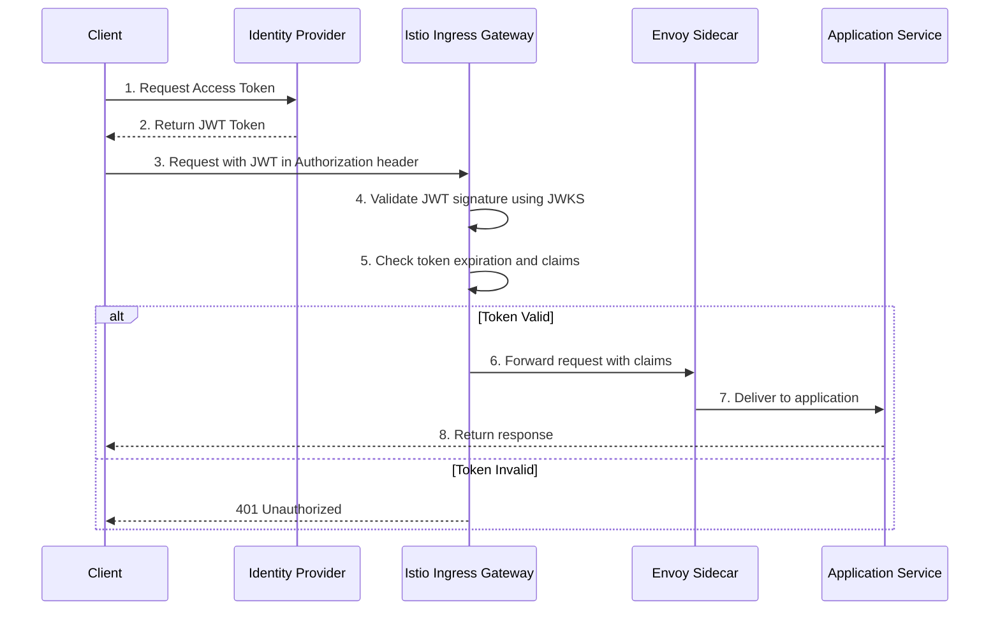
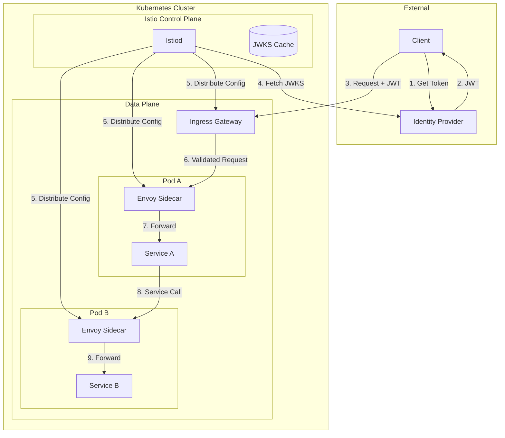

# How to Configure JWT Authentication in Istio

Author: [nawazdhandala](https://github.com/nawazdhandala)

Tags: Istio, JWT, Authentication, Security, Service Mesh, Kubernetes

Description: A guide to implementing JWT-based authentication for services using Istio RequestAuthentication.

---

## Introduction

JSON Web Token (JWT) authentication is a critical security mechanism for modern microservices architectures. Istio, as a service mesh, provides powerful capabilities to implement JWT authentication at the infrastructure level, removing the burden from individual application services. This guide will walk you through configuring JWT authentication in Istio using `RequestAuthentication` and `AuthorizationPolicy` resources.

By implementing JWT authentication at the Istio layer, you gain several benefits:

- **Centralized security**: Authentication logic is handled uniformly across all services
- **Separation of concerns**: Application code focuses on business logic, not security
- **Consistent enforcement**: All traffic is validated before reaching your services
- **Easy integration**: Works with any identity provider that issues JWTs

## Prerequisites

Before proceeding, ensure you have:

- A Kubernetes cluster (version 1.22 or later)
- Istio installed (version 1.17 or later recommended)
- kubectl configured to access your cluster
- An identity provider (IdP) that issues JWTs (Auth0, Keycloak, Okta, etc.)
- Basic understanding of JWT structure and claims

## Understanding JWT Authentication Flow in Istio

Before diving into configuration, let's understand how JWT authentication flows through Istio:



The diagram above illustrates the complete flow:

1. The client authenticates with an Identity Provider (IdP)
2. The IdP returns a signed JWT token
3. The client includes the JWT in requests to your services
4. Istio validates the token signature using JWKS (JSON Web Key Set)
5. Istio checks token expiration and required claims
6. If valid, the request proceeds with extracted claims
7. Your application receives the authenticated request

## Istio JWT Authentication Architecture

Understanding where JWT validation occurs in Istio's architecture is essential:



## Setting Up RequestAuthentication

The `RequestAuthentication` resource defines how Istio should validate JWTs. It specifies the JWT issuer, audiences, and where to find the public keys for signature verification.

### Basic RequestAuthentication Configuration

This configuration sets up JWT validation for your namespace. The `jwtRules` section defines which tokens are accepted and how to validate them.

```yaml
# RequestAuthentication resource for validating JWTs
# This resource tells Istio how to verify incoming JWT tokens
apiVersion: security.istio.io/v1
kind: RequestAuthentication
metadata:
  # Name of the authentication policy
  name: jwt-auth-policy
  # Namespace where this policy applies
  namespace: default
spec:
  # Selector determines which workloads this policy applies to
  # Empty selector means it applies to all workloads in the namespace
  selector:
    matchLabels:
      # Apply to workloads with this label
      app: my-service
  # Define JWT validation rules
  jwtRules:
    # The issuer claim (iss) that must be present in the token
    # This should match your identity provider's issuer URL
    - issuer: "https://auth.example.com/"
      # Expected audience claim (aud) in the token
      # Tokens without this audience will be rejected
      audiences:
        - "my-api"
        - "my-service"
      # URL to fetch the JSON Web Key Set (JWKS) for signature verification
      # Istio will periodically refresh keys from this endpoint
      jwksUri: "https://auth.example.com/.well-known/jwks.json"
      # Where to look for the JWT token in incoming requests
      # Default is the Authorization header with Bearer prefix
      fromHeaders:
        - name: Authorization
          prefix: "Bearer "
      # Alternative: Extract token from query parameter
      fromParams:
        - access_token
      # Forward the original JWT to the upstream service
      # Useful when your application needs the raw token
      forwardOriginalToken: true
```

### RequestAuthentication for Multiple Issuers

In enterprise environments, you might need to accept tokens from multiple identity providers. This configuration supports multiple issuers with different validation rules.

```yaml
# Multi-issuer RequestAuthentication
# Accepts tokens from multiple identity providers
apiVersion: security.istio.io/v1
kind: RequestAuthentication
metadata:
  name: multi-issuer-jwt-auth
  namespace: production
spec:
  # Apply to all workloads in the namespace
  selector:
    matchLabels: {}
  jwtRules:
    # First issuer: Internal corporate IdP (Keycloak)
    - issuer: "https://keycloak.internal.company.com/realms/main"
      audiences:
        - "internal-services"
      jwksUri: "https://keycloak.internal.company.com/realms/main/protocol/openid-connect/certs"
      # Custom header for internal services
      fromHeaders:
        - name: X-Internal-Token
          prefix: ""
      forwardOriginalToken: true
      # Cache JWKS for performance (default is 5 minutes)
      # Adjust based on your key rotation frequency

    # Second issuer: External customer IdP (Auth0)
    - issuer: "https://company.auth0.com/"
      audiences:
        - "customer-api"
        - "https://api.company.com"
      jwksUri: "https://company.auth0.com/.well-known/jwks.json"
      fromHeaders:
        - name: Authorization
          prefix: "Bearer "
      forwardOriginalToken: true

    # Third issuer: Partner integration (Okta)
    - issuer: "https://partner.okta.com/oauth2/default"
      audiences:
        - "partner-integration"
      jwksUri: "https://partner.okta.com/oauth2/default/v1/keys"
      fromHeaders:
        - name: Authorization
          prefix: "Bearer "
```

## Configuring JWKS (JSON Web Key Set)

The JWKS (JSON Web Key Set) contains the public keys used to verify JWT signatures. Istio can fetch JWKS from a URL or you can provide the keys inline.

### Understanding JWKS Structure

A typical JWKS response from an identity provider looks like this:

```json
{
  "keys": [
    {
      "kty": "RSA",
      "use": "sig",
      "kid": "key-id-1",
      "n": "base64-encoded-modulus",
      "e": "AQAB",
      "alg": "RS256"
    },
    {
      "kty": "RSA",
      "use": "sig",
      "kid": "key-id-2",
      "n": "base64-encoded-modulus-2",
      "e": "AQAB",
      "alg": "RS256"
    }
  ]
}
```

### Inline JWKS Configuration

When your JWKS endpoint is not accessible from the cluster, or for testing purposes, you can provide the keys inline. This is also useful for air-gapped environments.

```yaml
# RequestAuthentication with inline JWKS
# Use this when the JWKS URL is not accessible from the cluster
apiVersion: security.istio.io/v1
kind: RequestAuthentication
metadata:
  name: jwt-auth-inline-jwks
  namespace: default
spec:
  selector:
    matchLabels:
      app: secure-service
  jwtRules:
    - issuer: "https://auth.example.com/"
      audiences:
        - "my-api"
      # Inline JWKS instead of jwksUri
      # The keys are embedded directly in the configuration
      jwks: |
        {
          "keys": [
            {
              "kty": "RSA",
              "kid": "DHFbpoIUqrY8t2zpA2qXfCmr5VO5ZEr4RzHU_-envvQ",
              "use": "sig",
              "alg": "RS256",
              "n": "xAE7eB6qugXyCAG3yhh7pkDkT65pHymX-P7KfIupjf59vsdo91bSP9C8H07pSAGQO1MV_xFj9VswgsCg4R6otmg5PV2He95lZdHtOcU5DXIg_pbhLdKXbi66GlVeK6ABZOUW3WYtnNHD-91gVuoeJT_DwtGGcp4ignkgXfkiEm4sw-4sfb4qdt5oLbyVpmW6x9cfa7vs91Ov__i__KxpPGPkO9vOVKI-VQ-CJFZfDmRXhXOWXxhWqSQzIQbk4LHoNPXH_wL6K6Hlw0j7nZNr2bE-RaJDX8-x1K2LAN0LNqVgQEyYjt6Q_bS0WqJfNr8iB3bQ3TwXEG_Sp4xvzWZoQ",
              "e": "AQAB"
            }
          ]
        }
      fromHeaders:
        - name: Authorization
          prefix: "Bearer "
```

### JWKS with ServiceEntry for External Access

If your JWKS endpoint is external and requires explicit configuration, create a ServiceEntry:

```yaml
# ServiceEntry to allow Istio to reach external JWKS endpoint
# Required when using strict egress policies
apiVersion: networking.istio.io/v1
kind: ServiceEntry
metadata:
  name: auth-provider-jwks
  namespace: istio-system
spec:
  # The hostname of your identity provider
  hosts:
    - auth.example.com
  # Port configuration for HTTPS
  ports:
    - number: 443
      name: https
      protocol: HTTPS
  # External service outside the mesh
  location: MESH_EXTERNAL
  # DNS resolution for the external host
  resolution: DNS
---
# DestinationRule for TLS origination to the JWKS endpoint
apiVersion: networking.istio.io/v1
kind: DestinationRule
metadata:
  name: auth-provider-tls
  namespace: istio-system
spec:
  host: auth.example.com
  trafficPolicy:
    tls:
      # Use SIMPLE TLS mode for standard HTTPS
      mode: SIMPLE
      # Optionally specify SNI for TLS
      sni: auth.example.com
```

## Enforcing Authentication with AuthorizationPolicy

`RequestAuthentication` only validates tokens when present - it doesn't require them. To enforce that all requests must have valid JWTs, you need an `AuthorizationPolicy`.

### Basic Authorization Policy

This policy requires all requests to have a valid JWT from a specific issuer:

```yaml
# AuthorizationPolicy to enforce JWT authentication
# This policy REQUIRES valid JWTs - requests without tokens are rejected
apiVersion: security.istio.io/v1
kind: AuthorizationPolicy
metadata:
  name: require-jwt
  namespace: default
spec:
  # Apply to specific workloads
  selector:
    matchLabels:
      app: my-service
  # ALLOW action permits matching requests
  action: ALLOW
  rules:
    # Rule that requires valid JWT from specific issuer
    - from:
        - source:
            # Require requests to have a JWT from this issuer
            # The format is issuer/subject, use * for any subject
            requestPrincipals:
              - "https://auth.example.com/*"
```

### Combining Authentication with Path-Based Rules

Real applications often need different authentication requirements for different endpoints:

```yaml
# AuthorizationPolicy with path-based rules
# Different endpoints have different authentication requirements
apiVersion: security.istio.io/v1
kind: AuthorizationPolicy
metadata:
  name: api-auth-policy
  namespace: default
spec:
  selector:
    matchLabels:
      app: api-gateway
  action: ALLOW
  rules:
    # Rule 1: Public endpoints - no authentication required
    # Health checks and public documentation are accessible to all
    - to:
        - operation:
            paths:
              - "/health"
              - "/healthz"
              - "/ready"
              - "/api/v1/public/*"
            methods:
              - "GET"

    # Rule 2: Authenticated endpoints - require valid JWT
    # All other API paths require authentication
    - from:
        - source:
            requestPrincipals:
              - "https://auth.example.com/*"
      to:
        - operation:
            paths:
              - "/api/*"
            methods:
              - "GET"
              - "POST"
              - "PUT"
              - "DELETE"
```

### Role-Based Access Control with JWT Claims

You can implement fine-grained access control based on JWT claims:

```yaml
# AuthorizationPolicy with JWT claims-based access control
# Different roles have access to different resources
apiVersion: security.istio.io/v1
kind: AuthorizationPolicy
metadata:
  name: rbac-policy
  namespace: default
spec:
  selector:
    matchLabels:
      app: admin-service
  action: ALLOW
  rules:
    # Rule 1: Admin users can access all endpoints
    - from:
        - source:
            requestPrincipals:
              - "https://auth.example.com/*"
      to:
        - operation:
            paths:
              - "/admin/*"
      when:
        # Check for admin role in JWT claims
        # The claim path uses request.auth.claims prefix
        - key: request.auth.claims[role]
          values:
            - "admin"
            - "super-admin"

    # Rule 2: Managers can access reports
    - from:
        - source:
            requestPrincipals:
              - "https://auth.example.com/*"
      to:
        - operation:
            paths:
              - "/reports/*"
            methods:
              - "GET"
      when:
        - key: request.auth.claims[role]
          values:
            - "admin"
            - "manager"

    # Rule 3: All authenticated users can access their own profile
    - from:
        - source:
            requestPrincipals:
              - "https://auth.example.com/*"
      to:
        - operation:
            paths:
              - "/profile"
            methods:
              - "GET"
              - "PUT"
```

## Extracting and Forwarding JWT Claims

Istio can extract claims from JWTs and forward them to your applications as HTTP headers. This allows your services to access user information without parsing the JWT themselves.

### Configuring Claim-to-Header Mapping

Use an EnvoyFilter to extract claims and forward them as headers:

```yaml
# EnvoyFilter to extract JWT claims and forward as headers
# This allows applications to access user info without parsing JWTs
apiVersion: networking.istio.io/v1alpha3
kind: EnvoyFilter
metadata:
  name: jwt-claims-to-headers
  namespace: istio-system
spec:
  # Apply to all workloads in the mesh
  workloadSelector:
    labels:
      # Apply to ingress gateway
      istio: ingressgateway
  configPatches:
    # Patch the HTTP connection manager
    - applyTo: HTTP_FILTER
      match:
        context: GATEWAY
        listener:
          filterChain:
            filter:
              name: "envoy.filters.network.http_connection_manager"
              subFilter:
                name: "envoy.filters.http.router"
      patch:
        operation: INSERT_BEFORE
        value:
          name: envoy.filters.http.lua
          typed_config:
            "@type": "type.googleapis.com/envoy.extensions.filters.http.lua.v3.Lua"
            inlineCode: |
              -- Lua script to extract JWT claims and set as headers
              function envoy_on_request(request_handle)
                -- Get the JWT payload from Istio's filter metadata
                local meta = request_handle:streamInfo():dynamicMetadata()
                local jwt_payload = meta:get("envoy.filters.http.jwt_authn")

                if jwt_payload then
                  -- Extract specific claims and set as headers
                  -- These headers will be forwarded to upstream services

                  -- User ID claim
                  if jwt_payload["sub"] then
                    request_handle:headers():add("X-User-Id", jwt_payload["sub"])
                  end

                  -- Email claim
                  if jwt_payload["email"] then
                    request_handle:headers():add("X-User-Email", jwt_payload["email"])
                  end

                  -- Roles claim (handle array)
                  if jwt_payload["roles"] then
                    local roles = table.concat(jwt_payload["roles"], ",")
                    request_handle:headers():add("X-User-Roles", roles)
                  end

                  -- Organization/Tenant claim
                  if jwt_payload["org_id"] then
                    request_handle:headers():add("X-Org-Id", jwt_payload["org_id"])
                  end
                end
              end
```

### Using Output Claim to Header (Istio 1.18+)

Starting from Istio 1.18, you can use the built-in `outputClaimToHeaders` feature:

```yaml
# RequestAuthentication with claim-to-header mapping
# Available in Istio 1.18 and later
apiVersion: security.istio.io/v1
kind: RequestAuthentication
metadata:
  name: jwt-auth-with-claims
  namespace: default
spec:
  selector:
    matchLabels:
      app: my-service
  jwtRules:
    - issuer: "https://auth.example.com/"
      audiences:
        - "my-api"
      jwksUri: "https://auth.example.com/.well-known/jwks.json"
      fromHeaders:
        - name: Authorization
          prefix: "Bearer "
      # Forward the original token to upstream
      forwardOriginalToken: true
      # Map JWT claims to HTTP headers
      # These headers will be sent to your application
      outputClaimToHeaders:
        # Map the 'sub' claim to X-User-Id header
        - header: "x-user-id"
          claim: "sub"
        # Map the 'email' claim to X-User-Email header
        - header: "x-user-email"
          claim: "email"
        # Map nested claims using dot notation
        - header: "x-tenant-id"
          claim: "custom_claims.tenant_id"
        # Map the 'name' claim
        - header: "x-user-name"
          claim: "name"
```

## Integration with Identity Providers

### Auth0 Integration

Auth0 is a popular identity platform. Here's a complete configuration for Auth0:

```yaml
# Complete Auth0 integration configuration
# Replace YOUR_DOMAIN with your Auth0 domain
---
# RequestAuthentication for Auth0
apiVersion: security.istio.io/v1
kind: RequestAuthentication
metadata:
  name: auth0-jwt-auth
  namespace: default
spec:
  selector:
    matchLabels:
      app: my-service
  jwtRules:
    # Auth0 issuer format: https://YOUR_DOMAIN/
    - issuer: "https://your-tenant.auth0.com/"
      # Your Auth0 API identifier (audience)
      audiences:
        - "https://api.your-app.com"
      # Auth0 JWKS endpoint
      jwksUri: "https://your-tenant.auth0.com/.well-known/jwks.json"
      fromHeaders:
        - name: Authorization
          prefix: "Bearer "
      forwardOriginalToken: true
      # Map Auth0 custom claims
      outputClaimToHeaders:
        - header: "x-user-id"
          claim: "sub"
        - header: "x-user-email"
          claim: "email"
        # Auth0 custom namespace claims
        - header: "x-user-roles"
          claim: "https://your-app.com/roles"
---
# AuthorizationPolicy to enforce Auth0 authentication
apiVersion: security.istio.io/v1
kind: AuthorizationPolicy
metadata:
  name: auth0-require-auth
  namespace: default
spec:
  selector:
    matchLabels:
      app: my-service
  action: ALLOW
  rules:
    - from:
        - source:
            requestPrincipals:
              - "https://your-tenant.auth0.com/*"
```

### Keycloak Integration

Keycloak is an open-source identity and access management solution:

```yaml
# Complete Keycloak integration configuration
# Replace placeholders with your Keycloak server details
---
# RequestAuthentication for Keycloak
apiVersion: security.istio.io/v1
kind: RequestAuthentication
metadata:
  name: keycloak-jwt-auth
  namespace: default
spec:
  selector:
    matchLabels:
      app: my-service
  jwtRules:
    # Keycloak issuer format: https://KEYCLOAK_HOST/realms/REALM_NAME
    - issuer: "https://keycloak.example.com/realms/myrealm"
      # Keycloak client ID as audience
      audiences:
        - "my-client-id"
        - "account"
      # Keycloak JWKS endpoint
      jwksUri: "https://keycloak.example.com/realms/myrealm/protocol/openid-connect/certs"
      fromHeaders:
        - name: Authorization
          prefix: "Bearer "
      forwardOriginalToken: true
      # Map Keycloak claims to headers
      outputClaimToHeaders:
        - header: "x-user-id"
          claim: "sub"
        - header: "x-preferred-username"
          claim: "preferred_username"
        - header: "x-user-email"
          claim: "email"
        # Keycloak realm roles
        - header: "x-realm-roles"
          claim: "realm_access.roles"
---
# AuthorizationPolicy for Keycloak with role-based access
apiVersion: security.istio.io/v1
kind: AuthorizationPolicy
metadata:
  name: keycloak-rbac
  namespace: default
spec:
  selector:
    matchLabels:
      app: my-service
  action: ALLOW
  rules:
    # Allow users with specific Keycloak realm role
    - from:
        - source:
            requestPrincipals:
              - "https://keycloak.example.com/realms/myrealm/*"
      when:
        # Check for role in realm_access.roles array
        - key: request.auth.claims[realm_access][roles]
          values:
            - "app-user"
            - "app-admin"
```

### Okta Integration

Okta is an enterprise identity provider:

```yaml
# Complete Okta integration configuration
# Replace placeholders with your Okta organization details
---
# RequestAuthentication for Okta
apiVersion: security.istio.io/v1
kind: RequestAuthentication
metadata:
  name: okta-jwt-auth
  namespace: default
spec:
  selector:
    matchLabels:
      app: my-service
  jwtRules:
    # Okta issuer format: https://YOUR_ORG.okta.com/oauth2/AUTHORIZATION_SERVER_ID
    # Use 'default' for the default authorization server
    - issuer: "https://your-org.okta.com/oauth2/default"
      # Your Okta API audience
      audiences:
        - "api://default"
        - "your-client-id"
      # Okta JWKS endpoint
      jwksUri: "https://your-org.okta.com/oauth2/default/v1/keys"
      fromHeaders:
        - name: Authorization
          prefix: "Bearer "
      forwardOriginalToken: true
      # Map Okta claims
      outputClaimToHeaders:
        - header: "x-user-id"
          claim: "sub"
        - header: "x-user-email"
          claim: "email"
        # Okta groups claim (configure in authorization server)
        - header: "x-user-groups"
          claim: "groups"
---
# AuthorizationPolicy for Okta with group-based access
apiVersion: security.istio.io/v1
kind: AuthorizationPolicy
metadata:
  name: okta-group-policy
  namespace: default
spec:
  selector:
    matchLabels:
      app: admin-service
  action: ALLOW
  rules:
    # Only allow users in the Administrators group
    - from:
        - source:
            requestPrincipals:
              - "https://your-org.okta.com/oauth2/default/*"
      when:
        - key: request.auth.claims[groups]
          values:
            - "Administrators"
            - "DevOps"
```

### Google Cloud Identity Integration

For Google Cloud Identity or Firebase Authentication:

```yaml
# Google Cloud Identity / Firebase Auth integration
---
apiVersion: security.istio.io/v1
kind: RequestAuthentication
metadata:
  name: google-jwt-auth
  namespace: default
spec:
  selector:
    matchLabels:
      app: my-service
  jwtRules:
    # Google/Firebase issuer
    - issuer: "https://securetoken.google.com/YOUR_PROJECT_ID"
      audiences:
        - "YOUR_PROJECT_ID"
      # Google's public JWKS endpoint
      jwksUri: "https://www.googleapis.com/service_accounts/v1/jwk/securetoken@system.gserviceaccount.com"
      fromHeaders:
        - name: Authorization
          prefix: "Bearer "
      forwardOriginalToken: true
      outputClaimToHeaders:
        - header: "x-user-id"
          claim: "user_id"
        - header: "x-user-email"
          claim: "email"
        - header: "x-email-verified"
          claim: "email_verified"
```

## Complete End-to-End Example

Here's a complete example that ties everything together:

```yaml
# Complete JWT Authentication Setup for a Production Application
# This example demonstrates a full configuration with multiple services
---
# Namespace for our application
apiVersion: v1
kind: Namespace
metadata:
  name: secure-app
  labels:
    istio-injection: enabled
---
# RequestAuthentication - Applied at namespace level
# Validates JWTs for all services in the namespace
apiVersion: security.istio.io/v1
kind: RequestAuthentication
metadata:
  name: namespace-jwt-auth
  namespace: secure-app
spec:
  # Empty selector applies to all workloads
  selector:
    matchLabels: {}
  jwtRules:
    - issuer: "https://auth.example.com/"
      audiences:
        - "secure-app-api"
      jwksUri: "https://auth.example.com/.well-known/jwks.json"
      fromHeaders:
        - name: Authorization
          prefix: "Bearer "
      forwardOriginalToken: true
      outputClaimToHeaders:
        - header: "x-user-id"
          claim: "sub"
        - header: "x-user-email"
          claim: "email"
        - header: "x-user-roles"
          claim: "roles"
        - header: "x-tenant-id"
          claim: "tenant_id"
---
# Default deny policy - Reject all traffic without valid JWT
# This ensures no unauthenticated traffic reaches services
apiVersion: security.istio.io/v1
kind: AuthorizationPolicy
metadata:
  name: default-deny
  namespace: secure-app
spec:
  # Apply to all workloads
  selector:
    matchLabels: {}
  # Empty rules with no action means deny all
  # This creates a default-deny posture
  {}
---
# Allow policy for public endpoints
apiVersion: security.istio.io/v1
kind: AuthorizationPolicy
metadata:
  name: allow-public-endpoints
  namespace: secure-app
spec:
  selector:
    matchLabels:
      app: api-gateway
  action: ALLOW
  rules:
    # Health check endpoints - no auth required
    - to:
        - operation:
            paths:
              - "/health"
              - "/ready"
              - "/metrics"
            methods:
              - "GET"
    # Public API documentation
    - to:
        - operation:
            paths:
              - "/docs/*"
              - "/swagger/*"
              - "/openapi.json"
            methods:
              - "GET"
---
# Allow policy for authenticated users
apiVersion: security.istio.io/v1
kind: AuthorizationPolicy
metadata:
  name: allow-authenticated
  namespace: secure-app
spec:
  selector:
    matchLabels:
      app: api-gateway
  action: ALLOW
  rules:
    # All authenticated users can access general API
    - from:
        - source:
            requestPrincipals:
              - "https://auth.example.com/*"
      to:
        - operation:
            paths:
              - "/api/v1/*"
            methods:
              - "GET"
              - "POST"
              - "PUT"
              - "DELETE"
---
# Admin-only policy for administrative endpoints
apiVersion: security.istio.io/v1
kind: AuthorizationPolicy
metadata:
  name: admin-only
  namespace: secure-app
spec:
  selector:
    matchLabels:
      app: admin-service
  action: ALLOW
  rules:
    - from:
        - source:
            requestPrincipals:
              - "https://auth.example.com/*"
      to:
        - operation:
            paths:
              - "/admin/*"
      when:
        # Require admin role in JWT
        - key: request.auth.claims[roles]
          values:
            - "admin"
            - "super-admin"
---
# Service-to-service authentication within the mesh
# Uses mTLS for internal communication
apiVersion: security.istio.io/v1
kind: AuthorizationPolicy
metadata:
  name: internal-service-auth
  namespace: secure-app
spec:
  selector:
    matchLabels:
      app: backend-service
  action: ALLOW
  rules:
    # Allow traffic from api-gateway service account
    - from:
        - source:
            principals:
              - "cluster.local/ns/secure-app/sa/api-gateway"
    # Allow traffic from other backend services
    - from:
        - source:
            principals:
              - "cluster.local/ns/secure-app/sa/backend-service"
```

## Testing Your JWT Configuration

### Verify RequestAuthentication

Test that tokens are being validated correctly:

```bash
# Test with a valid JWT token
# Replace TOKEN with an actual JWT from your identity provider
TOKEN="eyJhbGciOiJSUzI1NiIsInR5cCI6IkpXVCIsImtpZCI6IkRIRmJwb0lVcXJZOHQyenBBMnFYZkNtcjVWTzVaRXI0UnpIVV8tZW52dlEifQ..."

# Make a request with the token
# The request should succeed with a valid token
curl -v \
  -H "Authorization: Bearer $TOKEN" \
  https://your-service.example.com/api/v1/resource

# Expected output: 200 OK with response body
```

```bash
# Test without a token
# This should return 401 Unauthorized if AuthorizationPolicy requires JWT
curl -v https://your-service.example.com/api/v1/resource

# Expected output: 401 Unauthorized
# Response body: RBAC: access denied
```

```bash
# Test with an invalid/expired token
# This should return 401 Unauthorized
INVALID_TOKEN="invalid.token.here"
curl -v \
  -H "Authorization: Bearer $INVALID_TOKEN" \
  https://your-service.example.com/api/v1/resource

# Expected output: 401 Unauthorized
# Response body: Jwt verification fails
```

### Debugging JWT Issues

Use these commands to troubleshoot JWT authentication problems:

```bash
# Check Istio proxy logs for JWT validation errors
# This shows detailed information about token validation
kubectl logs -n default deployment/my-service -c istio-proxy | grep -i jwt

# Check if RequestAuthentication is applied correctly
# Verify the configuration is recognized by Istio
kubectl get requestauthentication -n default -o yaml

# Verify AuthorizationPolicy configuration
# Ensure policies are properly configured
kubectl get authorizationpolicy -n default -o yaml

# Test JWKS endpoint accessibility from within the cluster
# Ensure Istio can fetch the public keys
kubectl run curl-test --rm -it --image=curlimages/curl -- \
  curl -v https://auth.example.com/.well-known/jwks.json

# Analyze proxy configuration for JWT filters
# This shows the Envoy configuration applied by Istio
istioctl proxy-config listener deployment/my-service -o json | \
  jq '.[] | select(.name == "virtualInbound") | .filterChains[].filters[] | select(.name == "envoy.filters.network.http_connection_manager")'
```

### Decode and Inspect JWT Tokens

Inspect JWT tokens to verify their structure and claims:

```bash
# Decode a JWT token (without validation)
# Useful for debugging claim issues
echo "$TOKEN" | cut -d'.' -f2 | base64 -d 2>/dev/null | jq .

# Example output:
# {
#   "iss": "https://auth.example.com/",
#   "sub": "user123",
#   "aud": "my-api",
#   "exp": 1735689600,
#   "iat": 1735686000,
#   "email": "user@example.com",
#   "roles": ["user", "admin"]
# }
```

## Security Best Practices

### Token Validation Recommendations

1. **Always Verify Audience**: Ensure your RequestAuthentication specifies the expected audience to prevent token confusion attacks.

2. **Use Short Token Lifetimes**: Configure your IdP to issue tokens with short expiration times (15-60 minutes) and use refresh tokens for longer sessions.

3. **Implement Token Revocation**: Consider using a token revocation check for sensitive operations.

4. **Secure JWKS Endpoints**: Use HTTPS for JWKS endpoints and consider pinning certificates for additional security.

### Defense in Depth Configuration

```yaml
# Defense-in-depth JWT configuration
# Implements multiple layers of security
---
# PeerAuthentication - Enforce mTLS
apiVersion: security.istio.io/v1
kind: PeerAuthentication
metadata:
  name: strict-mtls
  namespace: secure-app
spec:
  # Require mTLS for all traffic
  mtls:
    mode: STRICT
---
# RequestAuthentication with strict validation
apiVersion: security.istio.io/v1
kind: RequestAuthentication
metadata:
  name: strict-jwt-auth
  namespace: secure-app
spec:
  selector:
    matchLabels: {}
  jwtRules:
    - issuer: "https://auth.example.com/"
      # Explicitly list all valid audiences
      audiences:
        - "secure-app-api"
      jwksUri: "https://auth.example.com/.well-known/jwks.json"
      fromHeaders:
        - name: Authorization
          prefix: "Bearer "
      # Do NOT forward token if not needed by application
      # Reduces exposure of sensitive tokens
      forwardOriginalToken: false
---
# AuthorizationPolicy with comprehensive rules
apiVersion: security.istio.io/v1
kind: AuthorizationPolicy
metadata:
  name: comprehensive-auth-policy
  namespace: secure-app
spec:
  selector:
    matchLabels:
      app: api-service
  action: ALLOW
  rules:
    - from:
        - source:
            # Require valid JWT from specific issuer
            requestPrincipals:
              - "https://auth.example.com/*"
            # Also require mTLS from within the mesh
            namespaces:
              - "secure-app"
      to:
        - operation:
            # Explicitly list allowed paths
            paths:
              - "/api/v1/*"
            # Explicitly list allowed methods
            methods:
              - "GET"
              - "POST"
      when:
        # Additional claim validations
        - key: request.auth.claims[email_verified]
          values:
            - "true"
```

## Troubleshooting Common Issues

### Issue: 401 Unauthorized with Valid Token

Check these common causes:

```yaml
# Common fixes for 401 errors with valid tokens
---
# 1. Check issuer URL matches exactly (including trailing slash)
# Wrong:
# issuer: "https://auth.example.com"
# Correct:
# issuer: "https://auth.example.com/"

# 2. Verify audience claim matches
# Check your token's 'aud' claim matches the configured audience

# 3. Ensure JWKS endpoint is accessible
# Test from within the cluster:
# kubectl run test --rm -it --image=curlimages/curl -- curl https://auth.example.com/.well-known/jwks.json

# 4. Check token expiration
# Decode and verify 'exp' claim is in the future
```

### Issue: Claims Not Being Forwarded

```yaml
# Verify claim forwarding configuration
# Ensure outputClaimToHeaders is properly configured
apiVersion: security.istio.io/v1
kind: RequestAuthentication
metadata:
  name: check-claim-forwarding
  namespace: default
spec:
  selector:
    matchLabels:
      app: my-service
  jwtRules:
    - issuer: "https://auth.example.com/"
      jwksUri: "https://auth.example.com/.well-known/jwks.json"
      fromHeaders:
        - name: Authorization
          prefix: "Bearer "
      # Ensure this is set correctly
      outputClaimToHeaders:
        # Use lowercase header names
        - header: "x-user-id"
          claim: "sub"
        # For nested claims, use dot notation
        - header: "x-tenant"
          claim: "custom_claims.tenant_id"
```

### Issue: JWKS Fetch Failures

```yaml
# ServiceEntry for external JWKS endpoint
# Required when egress is restricted
apiVersion: networking.istio.io/v1
kind: ServiceEntry
metadata:
  name: jwks-external
  namespace: istio-system
spec:
  hosts:
    - auth.example.com
  ports:
    - number: 443
      name: https
      protocol: HTTPS
  location: MESH_EXTERNAL
  resolution: DNS
---
# Ensure proper TLS configuration
apiVersion: networking.istio.io/v1
kind: DestinationRule
metadata:
  name: jwks-tls
  namespace: istio-system
spec:
  host: auth.example.com
  trafficPolicy:
    tls:
      mode: SIMPLE
```

## Conclusion

JWT authentication in Istio provides a robust, centralized approach to securing your microservices. By leveraging `RequestAuthentication` and `AuthorizationPolicy` resources, you can:

- Validate JWT tokens at the mesh layer
- Extract and forward claims to your applications
- Implement fine-grained access control based on token claims
- Integrate with any OIDC-compliant identity provider

Key takeaways:

1. **RequestAuthentication** defines how to validate tokens but doesn't require them
2. **AuthorizationPolicy** enforces authentication and authorization rules
3. Use **outputClaimToHeaders** to forward claims to applications
4. Implement **defense in depth** by combining JWT auth with mTLS
5. Always test your configuration thoroughly before production deployment

By following the patterns and examples in this guide, you can implement secure, scalable JWT authentication across your entire Istio service mesh.

## Additional Resources

- [Istio Security Documentation](https://istio.io/latest/docs/concepts/security/)
- [Istio RequestAuthentication Reference](https://istio.io/latest/docs/reference/config/security/request_authentication/)
- [Istio AuthorizationPolicy Reference](https://istio.io/latest/docs/reference/config/security/authorization-policy/)
- [JWT.io - JWT Debugger and Information](https://jwt.io/)
- [OpenID Connect Specification](https://openid.net/connect/)
