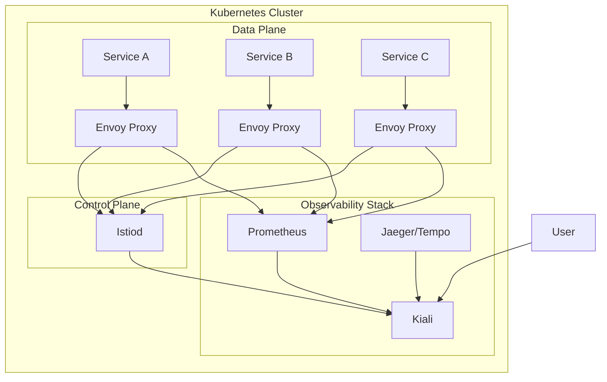
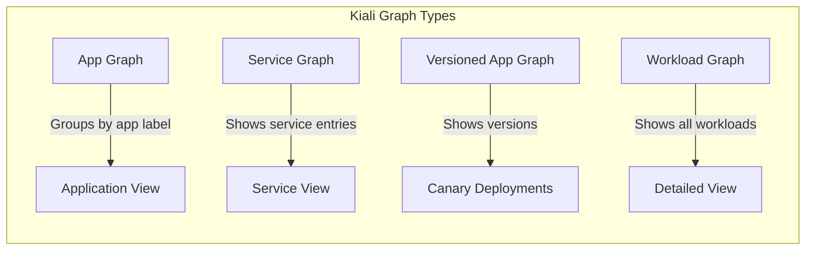
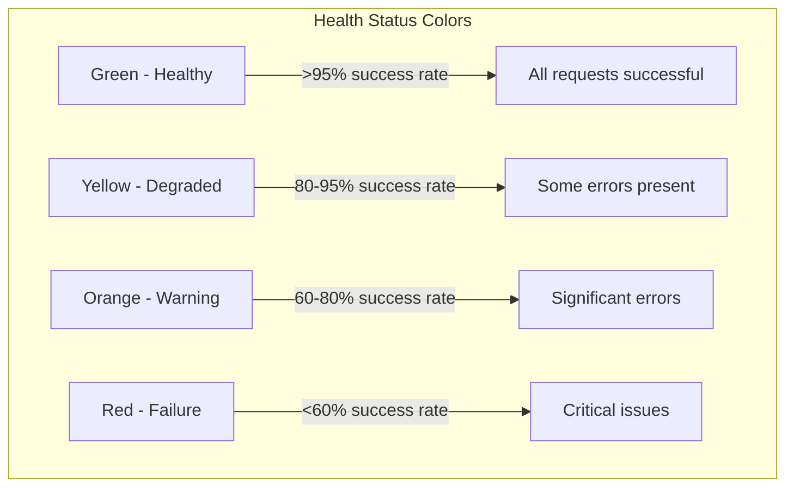

# How to Visualize Service Mesh with Kiali and Istio

Author: [nawazdhandala](https://github.com/nawazdhandala)

Tags: Istio, Kiali, Observability, Service Mesh, Kubernetes, Visualization

Description: A guide to using Kiali for visualizing and managing your Istio service mesh.

---

## Introduction

Managing a service mesh in production can be challenging. With dozens or even hundreds of microservices communicating with each other, understanding the topology, health, and traffic flow becomes increasingly complex. This is where Kiali comes in - a powerful observability console designed specifically for Istio service mesh.

Kiali provides answers to questions like:
- What microservices are part of my service mesh?
- How are they connected?
- How are they performing?
- Are there any misconfigurations in my Istio resources?

In this comprehensive guide, we will explore how to install Kiali, visualize your service mesh topology, analyze traffic patterns, validate configurations, and troubleshoot issues effectively.

## Architecture Overview

Before diving into the installation, let's understand how Kiali fits into the Istio ecosystem:



Kiali aggregates data from multiple sources:
- **Prometheus**: For metrics about traffic volume, error rates, and latencies
- **Istio**: For configuration and mesh topology
- **Jaeger/Tempo**: For distributed tracing data

## Prerequisites

Before installing Kiali, ensure you have the following components ready:

The following command verifies that you have a running Kubernetes cluster with Istio installed:

```bash
# Verify Kubernetes cluster is running
kubectl cluster-info

# Check Istio installation status
# This should show istiod and other Istio components running
istioctl version

# Verify Istio is properly installed in the istio-system namespace
kubectl get pods -n istio-system
```

## Installing Kiali

There are multiple ways to install Kiali. We will cover the most common approaches.

### Method 1: Install Kiali with Istio Addons

This is the simplest approach if you are setting up a new Istio installation. The Istio addons include Kiali along with Prometheus, Grafana, and Jaeger:

```bash
# Navigate to your Istio installation directory
# The samples/addons directory contains pre-configured manifests for common observability tools
cd istio-1.20.0

# Apply all addons including Kiali, Prometheus, Grafana, and Jaeger
# This single command sets up the entire observability stack
kubectl apply -f samples/addons

# Wait for all addon pods to be ready
# The -w flag watches for changes until all pods are running
kubectl wait --for=condition=Ready pods --all -n istio-system --timeout=300s
```

### Method 2: Install Kiali Using Helm

For production environments, Helm provides more flexibility and customization options:

```bash
# Add the Kiali Helm repository
# This repository contains official Kiali charts maintained by the Kiali team
helm repo add kiali https://kiali.org/helm-charts
helm repo update

# Create a values file for custom configuration
# This allows you to specify authentication, external services, and other settings
cat << 'EOF' > kiali-values.yaml
# Kiali deployment configuration
deployment:
  # Enable access logging for debugging
  accessible_namespaces:
    - "**"
  # Resource limits for production stability
  resources:
    requests:
      cpu: "100m"
      memory: "256Mi"
    limits:
      cpu: "500m"
      memory: "512Mi"

# Authentication strategy - use token for production
auth:
  strategy: "token"

# External services configuration
# Kiali needs to know where to find Prometheus, Grafana, and tracing backends
external_services:
  prometheus:
    url: "http://prometheus.istio-system:9090"
  grafana:
    enabled: true
    in_cluster_url: "http://grafana.istio-system:3000"
  tracing:
    enabled: true
    in_cluster_url: "http://jaeger-query.istio-system:16686"
    use_grpc: false

# Server configuration
server:
  web_root: "/kiali"
EOF

# Install Kiali using the custom values
# The -n flag specifies the namespace, --create-namespace creates it if needed
helm install kiali-server kiali/kiali-server \
  -n istio-system \
  --values kiali-values.yaml
```

### Method 3: Install Kiali Using the Kiali Operator

The Kiali Operator provides lifecycle management and is recommended for enterprise deployments:

```bash
# Install the Kiali Operator using Helm
# The operator will manage Kiali instances based on custom resources
helm install \
  --namespace kiali-operator \
  --create-namespace \
  kiali-operator \
  kiali/kiali-operator

# Create a Kiali custom resource to deploy the Kiali server
# The operator watches for this resource and creates the corresponding deployment
cat << 'EOF' | kubectl apply -f -
apiVersion: kiali.io/v1alpha1
kind: Kiali
metadata:
  name: kiali
  namespace: istio-system
spec:
  # Installation namespace for Kiali components
  installation_tag: "Kiali Dashboard"

  # Istio configuration
  istio_namespace: istio-system

  # Authentication configuration
  auth:
    strategy: token

  # Deployment settings
  deployment:
    accessible_namespaces:
      - "**"
    view_only_mode: false

  # External services integration
  external_services:
    prometheus:
      url: "http://prometheus.istio-system:9090"
    tracing:
      enabled: true
      in_cluster_url: "http://jaeger-query.istio-system:16686"
    grafana:
      enabled: true
      in_cluster_url: "http://grafana.istio-system:3000"

  # Server settings
  server:
    web_root: "/kiali"
EOF
```

### Accessing the Kiali Dashboard

After installation, you can access Kiali using port-forwarding:

```bash
# Forward local port 20001 to the Kiali service
# This creates a secure tunnel to access the dashboard from your browser
kubectl port-forward svc/kiali -n istio-system 20001:20001

# Open your browser and navigate to:
# http://localhost:20001/kiali
```

For production environments, you should expose Kiali through an Ingress or Istio Gateway:

```yaml
# Create an Istio Gateway and VirtualService to expose Kiali externally
# This configuration enables HTTPS access through your Istio ingress gateway
apiVersion: networking.istio.io/v1beta1
kind: Gateway
metadata:
  name: kiali-gateway
  namespace: istio-system
spec:
  selector:
    istio: ingressgateway
  servers:
    - port:
        number: 443
        name: https
        protocol: HTTPS
      tls:
        mode: SIMPLE
        credentialName: kiali-tls-secret
      hosts:
        - "kiali.example.com"
---
apiVersion: networking.istio.io/v1beta1
kind: VirtualService
metadata:
  name: kiali-vs
  namespace: istio-system
spec:
  hosts:
    - "kiali.example.com"
  gateways:
    - kiali-gateway
  http:
    - route:
        - destination:
            host: kiali
            port:
              number: 20001
```

## Service Graph Visualization

The service graph is Kiali's flagship feature. It provides a real-time visual representation of your service mesh topology.

### Understanding the Graph View

Kiali's graph view displays:
- **Nodes**: Represent workloads, services, or applications
- **Edges**: Represent traffic flow between nodes
- **Edge labels**: Show request rates, response times, and error percentages



### Configuring Graph Display Options

You can customize the graph view using URL parameters or through the UI. Here is an example of accessing specific graph configurations:

```bash
# Access the graph with specific parameters via the Kiali API
# This example shows how to programmatically retrieve graph data
curl -X GET \
  "http://localhost:20001/kiali/api/namespaces/bookinfo/graph?duration=60s&graphType=versionedApp&injectServiceNodes=true" \
  -H "Authorization: Bearer $KIALI_TOKEN" \
  -H "Accept: application/json"
```

### Deploying a Sample Application for Visualization

Let's deploy the Bookinfo sample application to see Kiali's visualization capabilities:

```bash
# Enable automatic sidecar injection for the default namespace
# The istio-injection label tells Istio to automatically inject Envoy sidecars
kubectl label namespace default istio-injection=enabled

# Deploy the Bookinfo sample application
# This application consists of multiple microservices that we can visualize
kubectl apply -f https://raw.githubusercontent.com/istio/istio/release-1.20/samples/bookinfo/platform/kube/bookinfo.yaml

# Wait for all pods to be ready
kubectl wait --for=condition=Ready pods --all -n default --timeout=120s

# Deploy the Bookinfo gateway to expose the application
kubectl apply -f https://raw.githubusercontent.com/istio/istio/release-1.20/samples/bookinfo/networking/bookinfo-gateway.yaml

# Generate some traffic to populate the graph
# The loop continuously sends requests to create traffic patterns for visualization
export GATEWAY_URL=$(kubectl -n istio-system get service istio-ingressgateway -o jsonpath='{.status.loadBalancer.ingress[0].ip}')
for i in $(seq 1 100); do
  curl -s -o /dev/null "http://$GATEWAY_URL/productpage"
  sleep 0.5
done
```

## Health Monitoring and Status Indicators

Kiali provides comprehensive health monitoring for your service mesh components.

### Understanding Health Indicators

Kiali uses a color-coded health system:



### Configuring Health Thresholds

You can customize health thresholds to match your SLOs:

```yaml
# Kiali ConfigMap with custom health rate configuration
# These thresholds determine when services are marked as degraded or unhealthy
apiVersion: v1
kind: ConfigMap
metadata:
  name: kiali
  namespace: istio-system
data:
  config.yaml: |
    # Health rate configuration for different traffic types
    health_config:
      # Rate thresholds for request-based health
      rate:
        - namespace: ".*"
          kind: ".*"
          name: ".*"
          tolerance:
            # Threshold for degraded status (yellow)
            - code: "^5\\d\\d$"
              direction: ".*"
              protocol: "http"
              degraded: 5
              failure: 10
            # Threshold for gRPC errors
            - code: "^[1-9]$|^1[0-6]$"
              direction: ".*"
              protocol: "grpc"
              degraded: 5
              failure: 10
```

### Viewing Service Health Details

The Kiali API provides detailed health information programmatically:

```bash
# Retrieve health status for all services in a namespace
# This is useful for building custom dashboards or alerting systems
curl -X GET \
  "http://localhost:20001/kiali/api/namespaces/default/health?type=service" \
  -H "Authorization: Bearer $KIALI_TOKEN" \
  -H "Accept: application/json" | jq '.'

# Example response structure shows health status for each service:
# {
#   "productpage": {
#     "requests": {
#       "inbound": { "healthy": 98, "total": 100 },
#       "outbound": { "healthy": 100, "total": 100 }
#     }
#   }
# }
```

## Configuration Validation

One of Kiali's most powerful features is its ability to validate Istio configurations and detect potential issues.

### Types of Validations

Kiali performs various validation checks:

```mermaid
graph TB
    subgraph "Kiali Validation Categories"
        A[VirtualService Validations]
        B[DestinationRule Validations]
        C[Gateway Validations]
        D[ServiceEntry Validations]
        E[Sidecar Validations]
    end

    A --> A1[Route destination exists]
    A --> A2[Weight percentages sum to 100]
    A --> A3[No conflicting routes]

    B --> B1[Host references valid service]
    B --> B2[Subsets have matching labels]
    B --> B3[TLS settings are consistent]

    C --> C1[Gateway selectors match pods]
    C --> C2[No port conflicts]

    D --> D1[Valid protocol specifications]
    D --> D2[Resolution settings correct]

    E --> E1[Egress hosts are valid]
    E --> E2[Workload selector matches pods]
```



### Common Validation Errors and Fixes

Here are examples of configurations that Kiali would flag:

```yaml
# INCORRECT: This VirtualService references a non-existent destination
# Kiali will show an error: "DestinationRule not found for host"
apiVersion: networking.istio.io/v1beta1
kind: VirtualService
metadata:
  name: reviews-route
  namespace: default
spec:
  hosts:
    - reviews
  http:
    - route:
        - destination:
            host: reviews
            subset: v1  # ERROR: No DestinationRule defines this subset
          weight: 100
---
# CORRECT: Create a matching DestinationRule with the subset definition
# This resolves the validation error by defining the referenced subset
apiVersion: networking.istio.io/v1beta1
kind: DestinationRule
metadata:
  name: reviews-destination
  namespace: default
spec:
  host: reviews
  subsets:
    - name: v1
      labels:
        version: v1
    - name: v2
      labels:
        version: v2
    - name: v3
      labels:
        version: v3
```

Another common validation issue involves weight percentages:

```yaml
# INCORRECT: Weights do not sum to 100
# Kiali will show an error: "Route weights do not add up to 100"
apiVersion: networking.istio.io/v1beta1
kind: VirtualService
metadata:
  name: reviews-split
spec:
  hosts:
    - reviews
  http:
    - route:
        - destination:
            host: reviews
            subset: v1
          weight: 50  # Only 50% accounted for
---
# CORRECT: Weights must sum to exactly 100
# This is a valid traffic splitting configuration
apiVersion: networking.istio.io/v1beta1
kind: VirtualService
metadata:
  name: reviews-split
spec:
  hosts:
    - reviews
  http:
    - route:
        - destination:
            host: reviews
            subset: v1
          weight: 50
        - destination:
            host: reviews
            subset: v2
          weight: 30
        - destination:
            host: reviews
            subset: v3
          weight: 20  # Total: 50 + 30 + 20 = 100
```

### Viewing Validations via API

```bash
# Retrieve all Istio configurations with validation status
# The validations field shows any errors or warnings for each configuration
curl -X GET \
  "http://localhost:20001/kiali/api/namespaces/default/istio?validate=true" \
  -H "Authorization: Bearer $KIALI_TOKEN" | jq '.virtualServices[] | {name: .metadata.name, validations: .validations}'
```

## Traffic Analysis Features

Kiali provides powerful traffic analysis capabilities that help you understand how traffic flows through your mesh.

### Traffic Metrics and Analysis

The traffic analysis view shows:
- Request volume (requests per second)
- Success rate percentages
- Response time distributions
- Protocol-specific metrics (HTTP, gRPC, TCP)

```bash
# Query traffic metrics for a specific service
# This provides detailed statistics about request patterns and performance
curl -X GET \
  "http://localhost:20001/kiali/api/namespaces/default/services/productpage/metrics?duration=1800s&step=15s&filters[]=request_count&filters[]=request_error_count&filters[]=request_duration" \
  -H "Authorization: Bearer $KIALI_TOKEN" | jq '.'
```

### Distributed Tracing Integration

Kiali integrates with Jaeger to provide distributed tracing:

```yaml
# Configure Kiali to connect to your tracing backend
# This enables the traces tab in Kiali's UI
apiVersion: v1
kind: ConfigMap
metadata:
  name: kiali
  namespace: istio-system
data:
  config.yaml: |
    external_services:
      tracing:
        # Enable tracing integration
        enabled: true
        # Internal URL for Jaeger Query service
        in_cluster_url: "http://jaeger-query.istio-system:16686"
        # External URL if Jaeger is exposed outside the cluster
        url: "https://jaeger.example.com"
        # Use gRPC for better performance with large trace data
        use_grpc: true
        # Whitelist of namespaces for which tracing is available
        whitelist_istio_system: ["jaeger-query", "istio-ingressgateway"]
```

### Traffic Policies and Routing Visualization

Kiali visualizes traffic policies directly on the graph:

```yaml
# Example: Canary deployment with traffic splitting
# Kiali will visualize this as weighted edges between service versions
apiVersion: networking.istio.io/v1beta1
kind: VirtualService
metadata:
  name: reviews-canary
  namespace: default
spec:
  hosts:
    - reviews
  http:
    # Route 90% of traffic to v1 (stable version)
    # Route 10% of traffic to v2 (canary version)
    - route:
        - destination:
            host: reviews
            subset: v1
          weight: 90
        - destination:
            host: reviews
            subset: v2
          weight: 10
---
# Corresponding DestinationRule defining the version subsets
# Labels must match the pod labels for proper routing
apiVersion: networking.istio.io/v1beta1
kind: DestinationRule
metadata:
  name: reviews
  namespace: default
spec:
  host: reviews
  trafficPolicy:
    connectionPool:
      tcp:
        maxConnections: 100
      http:
        h2UpgradePolicy: UPGRADE
  subsets:
    - name: v1
      labels:
        version: v1
    - name: v2
      labels:
        version: v2
```

### Analyzing Request Flows

Kiali's request flow analysis helps identify bottlenecks:

```mermaid
sequenceDiagram
    participant User
    participant ProductPage
    participant Reviews
    participant Ratings
    participant Details

    User->>ProductPage: GET /productpage
    ProductPage->>Details: GET /details
    Details-->>ProductPage: 200 OK (50ms)
    ProductPage->>Reviews: GET /reviews
    Reviews->>Ratings: GET /ratings
    Ratings-->>Reviews: 200 OK (30ms)
    Reviews-->>ProductPage: 200 OK (100ms)
    ProductPage-->>User: 200 OK (200ms)
```

## Advanced Features

### Workload Injection and Replay

Kiali allows you to understand traffic patterns by examining workload details:

```bash
# Get detailed workload information including pod status and Envoy configuration
curl -X GET \
  "http://localhost:20001/kiali/api/namespaces/default/workloads/productpage-v1" \
  -H "Authorization: Bearer $KIALI_TOKEN" | jq '.'

# View Envoy proxy configuration for debugging
# This shows the actual routing rules applied to the sidecar
curl -X GET \
  "http://localhost:20001/kiali/api/namespaces/default/workloads/productpage-v1/config" \
  -H "Authorization: Bearer $KIALI_TOKEN" | jq '.'
```

### Security Visualization

Kiali visualizes mTLS status and security policies:

```yaml
# PeerAuthentication policy for namespace-wide strict mTLS
# Kiali will show a lock icon on edges where mTLS is enabled
apiVersion: security.istio.io/v1beta1
kind: PeerAuthentication
metadata:
  name: default
  namespace: default
spec:
  mtls:
    mode: STRICT
---
# AuthorizationPolicy to restrict access between services
# Kiali will visualize these policies in the security view
apiVersion: security.istio.io/v1beta1
kind: AuthorizationPolicy
metadata:
  name: reviews-viewer
  namespace: default
spec:
  selector:
    matchLabels:
      app: reviews
  action: ALLOW
  rules:
    - from:
        - source:
            principals: ["cluster.local/ns/default/sa/productpage"]
      to:
        - operation:
            methods: ["GET"]
```

### Custom Dashboards and Metrics

Kiali integrates with Grafana for custom dashboards:

```yaml
# Configure Kiali to link to Grafana dashboards
# This enables direct navigation from Kiali to relevant Grafana dashboards
apiVersion: v1
kind: ConfigMap
metadata:
  name: kiali
  namespace: istio-system
data:
  config.yaml: |
    external_services:
      grafana:
        enabled: true
        # URL for internal Grafana access
        in_cluster_url: "http://grafana.istio-system:3000"
        # External URL for browser access
        url: "https://grafana.example.com"
        # Dashboard configurations for different resource types
        dashboards:
          - name: "Istio Service Dashboard"
            variables:
              namespace: "var-namespace"
              service: "var-service"
          - name: "Istio Workload Dashboard"
            variables:
              namespace: "var-namespace"
              workload: "var-workload"
```

## Troubleshooting Common Issues

### Kiali Shows Empty Graph

If your Kiali graph is empty, check these common issues:

```bash
# Verify Prometheus is collecting Istio metrics
# This query should return data if metrics are flowing correctly
kubectl exec -n istio-system deploy/prometheus -- \
  wget -qO- 'http://localhost:9090/api/v1/query?query=istio_requests_total'

# Check if sidecars are injected into your pods
# The READY column should show 2/2 (app container + sidecar)
kubectl get pods -n default -o wide

# Verify Istio proxy is sending metrics
# Look for successful metric exports in the proxy logs
kubectl logs deploy/productpage-v1 -c istio-proxy | grep -i prometheus

# Check Kiali server logs for connection issues
kubectl logs deploy/kiali -n istio-system | grep -i error
```

### Configuration Validation Not Working

```bash
# Ensure Kiali has proper RBAC permissions to read Istio configs
# Kiali needs access to VirtualServices, DestinationRules, and other Istio CRDs
kubectl auth can-i get virtualservices --as=system:serviceaccount:istio-system:kiali -n default

# If permissions are missing, apply the correct ClusterRole
cat << 'EOF' | kubectl apply -f -
apiVersion: rbac.authorization.k8s.io/v1
kind: ClusterRole
metadata:
  name: kiali-viewer
rules:
  - apiGroups: ["networking.istio.io"]
    resources: ["*"]
    verbs: ["get", "list", "watch"]
  - apiGroups: ["security.istio.io"]
    resources: ["*"]
    verbs: ["get", "list", "watch"]
  - apiGroups: [""]
    resources: ["namespaces", "pods", "services", "endpoints", "configmaps"]
    verbs: ["get", "list", "watch"]
EOF
```

### Tracing Data Not Appearing

```bash
# Verify Jaeger is running and accessible
kubectl get pods -n istio-system -l app=jaeger

# Check the trace sampling rate
# Default is 1% (0.01), increase for development environments
kubectl get configmap istio -n istio-system -o yaml | grep -A5 tracing

# Update sampling rate to 100% for testing
# WARNING: Do not use this in production as it generates high overhead
istioctl install --set meshConfig.defaultConfig.tracing.sampling=100
```

## Best Practices

### Production Deployment Recommendations

```yaml
# Production-ready Kiali configuration
apiVersion: kiali.io/v1alpha1
kind: Kiali
metadata:
  name: kiali
  namespace: istio-system
spec:
  auth:
    # Use OpenID Connect for production authentication
    strategy: openid
    openid:
      client_id: "kiali"
      issuer_uri: "https://auth.example.com/realms/istio"

  deployment:
    # Run multiple replicas for high availability
    replicas: 2
    # Set appropriate resource limits
    resources:
      requests:
        cpu: "500m"
        memory: "512Mi"
      limits:
        cpu: "1000m"
        memory: "1Gi"
    # Use pod anti-affinity for resilience
    affinity:
      pod_anti_affinity:
        preferredDuringSchedulingIgnoredDuringExecution:
          - weight: 100
            podAffinityTerm:
              labelSelector:
                matchLabels:
                  app: kiali
              topologyKey: kubernetes.io/hostname

  server:
    # Enable read-only mode for security if write operations are not needed
    web_fqdn: "kiali.example.com"
    web_port: 443
    web_schema: https
```

### Namespace Isolation

For multi-tenant environments, configure namespace access controls:

```yaml
# Restrict Kiali access to specific namespaces
# This is important for security in multi-tenant clusters
apiVersion: kiali.io/v1alpha1
kind: Kiali
metadata:
  name: kiali
  namespace: istio-system
spec:
  deployment:
    # Explicitly list allowed namespaces instead of using "**"
    accessible_namespaces:
      - "production"
      - "staging"
      - "istio-system"
    # Enable view-only mode to prevent configuration changes
    view_only_mode: true
```

## Conclusion

Kiali is an essential tool for managing and understanding Istio service mesh deployments. Its powerful visualization capabilities, combined with configuration validation and traffic analysis features, make it invaluable for both day-to-day operations and troubleshooting.

Key takeaways:
- Use Kiali's service graph to understand your mesh topology at a glance
- Leverage configuration validation to catch Istio misconfigurations early
- Integrate with Prometheus and Jaeger for comprehensive observability
- Follow security best practices for production deployments

As your service mesh grows, Kiali will become an increasingly important tool in your observability toolkit. The combination of real-time visualization, health monitoring, and configuration validation provides the insights needed to operate complex microservice architectures with confidence.

## Additional Resources

- [Kiali Official Documentation](https://kiali.io/docs/)
- [Istio Service Mesh Documentation](https://istio.io/latest/docs/)
- [Kiali GitHub Repository](https://github.com/kiali/kiali)
- [Istio By Example - Kiali](https://istiobyexample.dev/kiali/)
