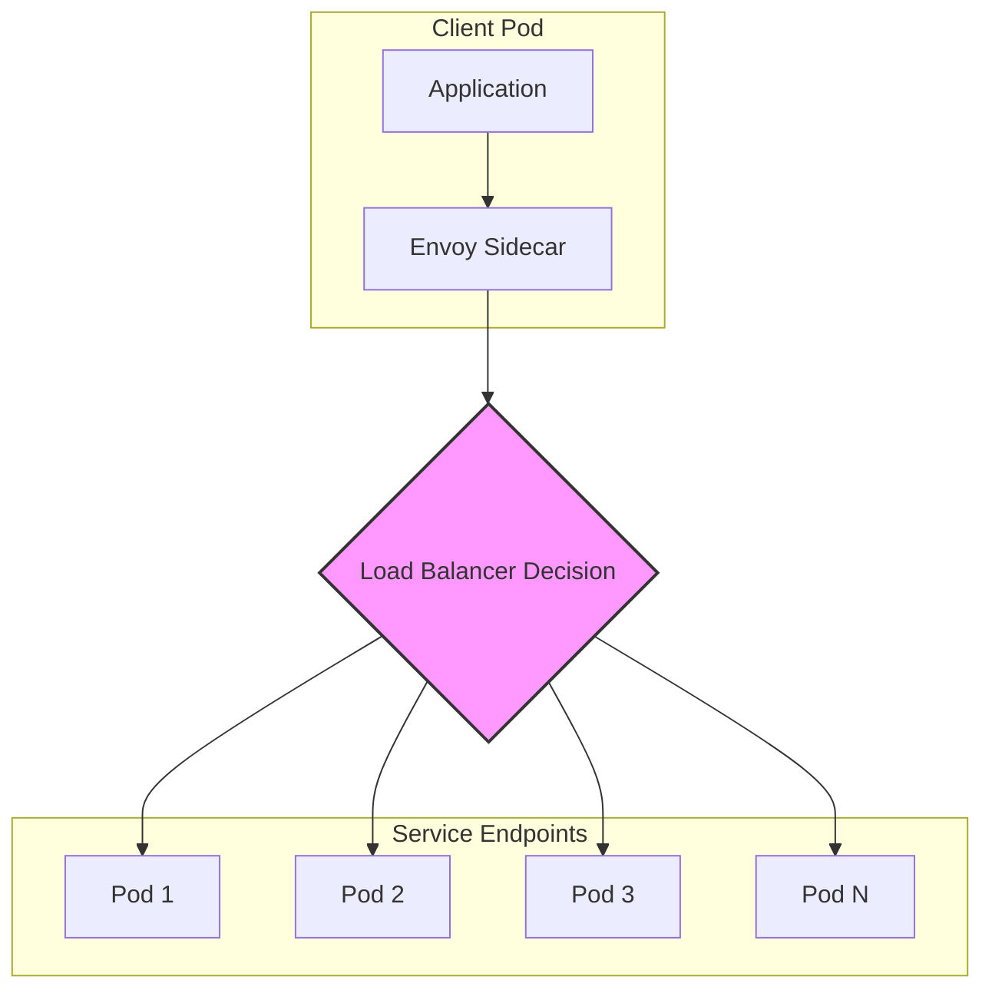
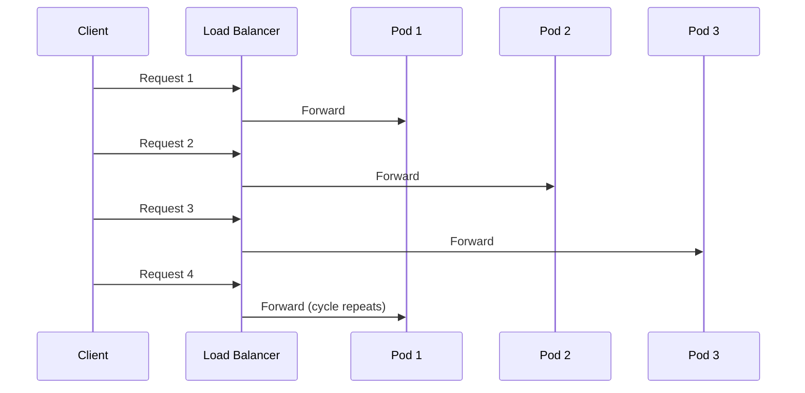
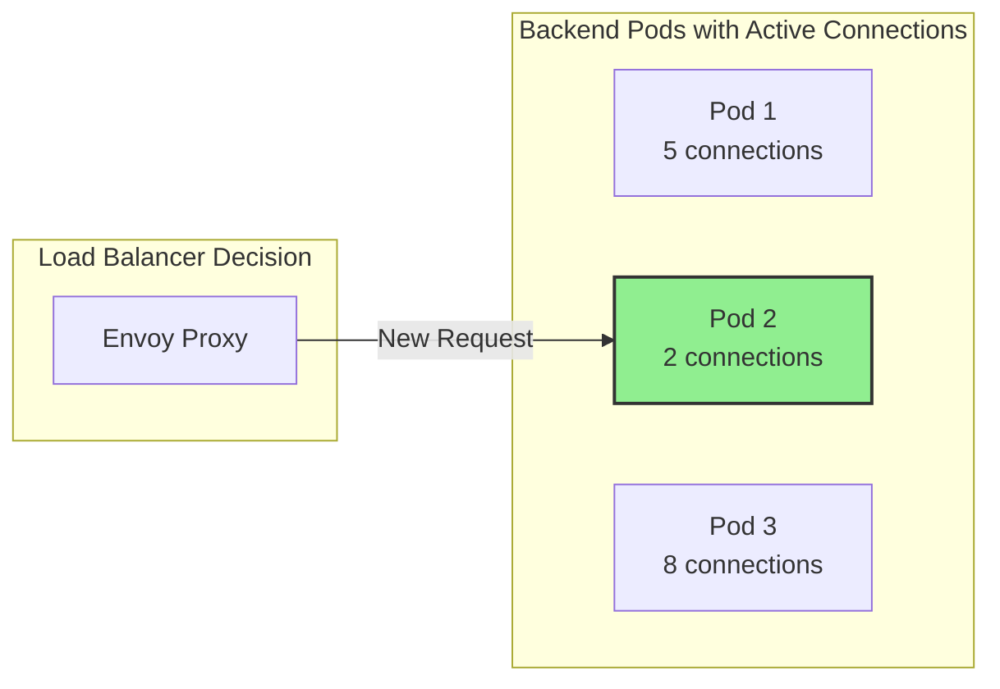
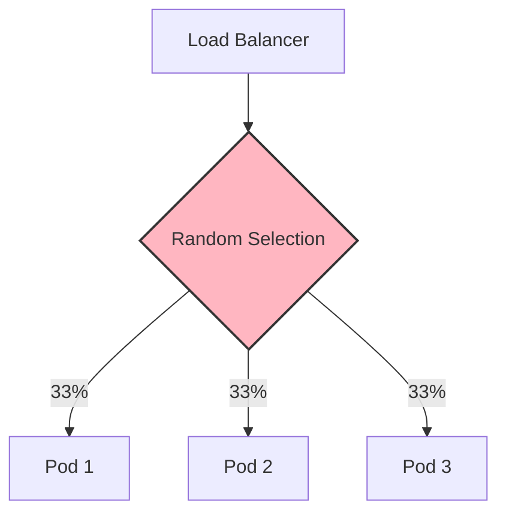
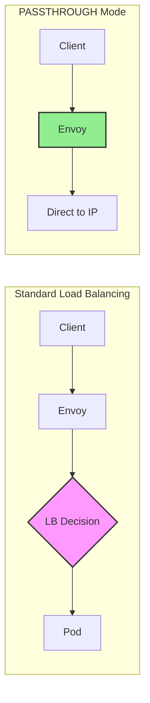
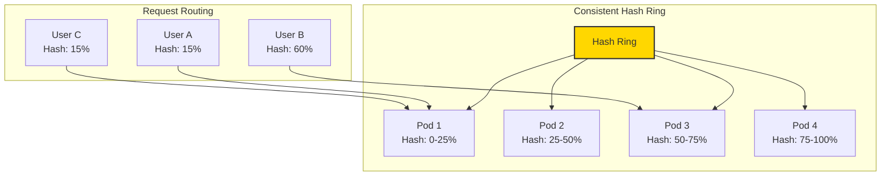
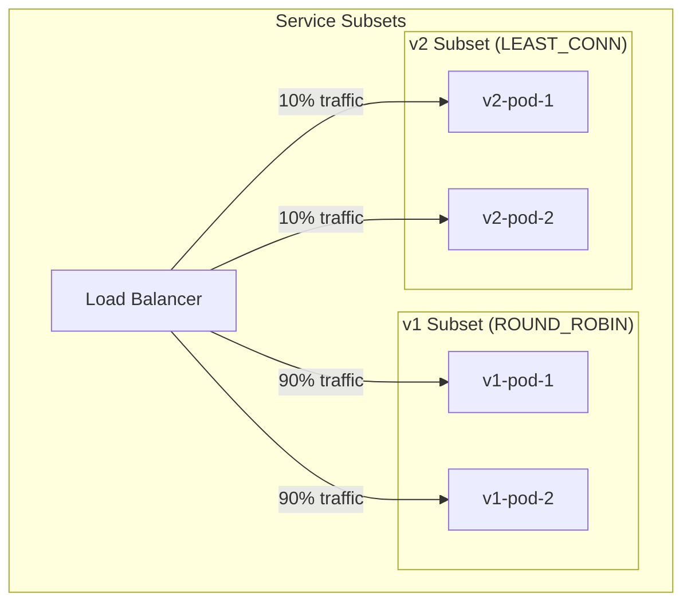

# How to Configure Load Balancing Algorithms in Istio

Author: [nawazdhandala](https://github.com/nawazdhandala)

Tags: Istio, Load Balancing, Traffic Management, Service Mesh, Kubernetes

Description: A guide to configuring different load balancing algorithms in Istio for optimal traffic distribution.

---

## Introduction

Load balancing is a critical component of any distributed system, ensuring that traffic is distributed efficiently across service instances. Istio, as a service mesh, provides powerful and flexible load balancing capabilities that go far beyond what Kubernetes offers natively. In this comprehensive guide, we will explore how to configure different load balancing algorithms in Istio using DestinationRule resources.

Istio supports several load balancing algorithms, each suited for different use cases:

- **ROUND_ROBIN**: Distributes requests evenly across all instances
- **LEAST_CONN**: Routes to instances with the fewest active connections
- **RANDOM**: Randomly selects an instance for each request
- **PASSTHROUGH**: Bypasses Envoy's load balancing for direct connection
- **Consistent Hashing**: Routes requests to the same instance based on a hash key

## Prerequisites

Before diving into load balancing configuration, ensure you have:

- A Kubernetes cluster running (version 1.25+)
- Istio installed and configured (version 1.18+)
- `kubectl` and `istioctl` CLI tools installed
- Basic understanding of Istio concepts (VirtualService, DestinationRule)

## Understanding Istio's Load Balancing Architecture



In Istio, load balancing decisions are made by the Envoy sidecar proxy. When a request leaves your application, the sidecar intercepts it and applies the configured load balancing algorithm to select the appropriate backend instance.

## ROUND_ROBIN Load Balancing

Round Robin is the default load balancing algorithm in Istio. It distributes requests sequentially across all healthy instances in a circular pattern, ensuring each instance receives an approximately equal share of traffic.



### When to Use ROUND_ROBIN

- **Homogeneous backends**: When all service instances have similar capacity
- **Stateless services**: Services that don't require session affinity
- **Even distribution**: When you want predictable traffic distribution
- **Default choice**: A safe starting point for most services

### Configuring ROUND_ROBIN

The following DestinationRule configures Round Robin load balancing for a service called "my-service" in the "production" namespace. This is the default behavior, but it's good practice to explicitly define it for clarity.

```yaml
apiVersion: networking.istio.io/v1beta1
kind: DestinationRule
metadata:
  # Name should clearly identify the target service
  name: my-service-lb-policy
  # Namespace where the DestinationRule is applied
  namespace: production
spec:
  # The host refers to the Kubernetes service name
  # Can be a short name (within same namespace) or FQDN
  host: my-service
  trafficPolicy:
    loadBalancer:
      # ROUND_ROBIN distributes requests evenly across all healthy instances
      # Requests are sent in sequential order: Pod1 -> Pod2 -> Pod3 -> Pod1...
      simple: ROUND_ROBIN
```

### ROUND_ROBIN with Connection Pool Settings

For production environments, you should combine load balancing with connection pool settings to control the number of connections and requests to each backend. This prevents any single instance from being overwhelmed.

```yaml
apiVersion: networking.istio.io/v1beta1
kind: DestinationRule
metadata:
  name: my-service-production-policy
  namespace: production
spec:
  host: my-service
  trafficPolicy:
    loadBalancer:
      simple: ROUND_ROBIN
    connectionPool:
      # TCP connection pool settings control layer 4 connection behavior
      tcp:
        # Maximum number of TCP connections to each backend instance
        # This prevents connection exhaustion on any single pod
        maxConnections: 100
        # TCP connection timeout in seconds
        # If connection isn't established within this time, it's marked as failed
        connectTimeout: 30s
      # HTTP connection pool settings control layer 7 request behavior
      http:
        # Maximum number of pending HTTP requests waiting for connection
        # Requests beyond this limit receive 503 Service Unavailable
        h2UpgradePolicy: UPGRADE
        # Maximum requests that can be outstanding to each backend
        http1MaxPendingRequests: 100
        # Maximum concurrent HTTP2 requests to a single backend
        http2MaxRequests: 1000
        # Maximum retries for failed requests
        maxRetries: 3
        # Maximum requests per connection before it's closed
        # Helps distribute connections more evenly over time
        maxRequestsPerConnection: 100
```

## LEAST_CONN Load Balancing

LEAST_CONN (Least Connections) routes traffic to the instance with the fewest active connections. This algorithm is particularly effective when request processing times vary significantly, as it naturally balances load based on actual server capacity.



### When to Use LEAST_CONN

- **Variable request duration**: When some requests take longer than others
- **Resource-intensive operations**: Database queries, file processing, ML inference
- **Heterogeneous backends**: When instances have different processing capacities
- **Long-lived connections**: WebSocket or streaming applications
- **Bursty traffic patterns**: When traffic arrives in unpredictable bursts

### Configuring LEAST_CONN

This configuration routes new requests to the backend instance currently handling the fewest active connections, ideal for services with variable response times.

```yaml
apiVersion: networking.istio.io/v1beta1
kind: DestinationRule
metadata:
  name: api-gateway-lb-policy
  namespace: production
spec:
  # Target the API gateway service
  host: api-gateway
  trafficPolicy:
    loadBalancer:
      # LEAST_CONN selects the instance with minimum active connections
      # This naturally balances load when request durations vary
      # Particularly effective for services that perform database queries
      # or other operations with unpredictable latency
      simple: LEAST_CONN
```

### LEAST_CONN with Outlier Detection

Combining LEAST_CONN with outlier detection creates a robust load balancing strategy that both distributes load efficiently and removes unhealthy instances from the rotation.

```yaml
apiVersion: networking.istio.io/v1beta1
kind: DestinationRule
metadata:
  name: database-proxy-policy
  namespace: production
spec:
  host: database-proxy
  trafficPolicy:
    loadBalancer:
      simple: LEAST_CONN
    # Outlier detection identifies and ejects unhealthy instances
    # This ensures LEAST_CONN only considers healthy backends
    outlierDetection:
      # Check for consecutive errors every 10 seconds
      # Shorter intervals mean faster detection but more CPU overhead
      interval: 10s
      # Number of consecutive 5xx errors before ejection
      # Lower values are more aggressive but may cause false positives
      consecutive5xxErrors: 5
      # Number of consecutive gateway errors (502, 503, 504) before ejection
      consecutiveGatewayErrors: 5
      # Time an ejected host remains out of the load balancing pool
      # Starts at this value and increases exponentially with each ejection
      baseEjectionTime: 30s
      # Maximum percentage of hosts that can be ejected
      # Prevents cascading failures if many hosts become unhealthy
      maxEjectionPercent: 50
      # Minimum number of hosts that must remain in the pool
      # Ensures some capacity remains even during major outages
      minHealthPercent: 30
```

## RANDOM Load Balancing

RANDOM load balancing selects a backend instance randomly for each request. While seemingly simple, this approach has several advantages, particularly in large-scale deployments where it reduces the coordination overhead that other algorithms might introduce.



### When to Use RANDOM

- **Large clusters**: When you have many backend instances (100+)
- **Stateless services**: Services that don't benefit from connection reuse
- **Testing and debugging**: Easier to reason about traffic distribution
- **Avoiding hot spots**: When deterministic algorithms create uneven patterns
- **Low-overhead requirement**: Random selection has minimal computational cost

### Configuring RANDOM

Random load balancing is useful when you want to avoid any potential hot-spot patterns that might emerge with round-robin in certain scenarios.

```yaml
apiVersion: networking.istio.io/v1beta1
kind: DestinationRule
metadata:
  name: stateless-worker-policy
  namespace: production
spec:
  host: stateless-worker
  trafficPolicy:
    loadBalancer:
      # RANDOM selects an instance using uniform random distribution
      # Provides good distribution without the overhead of tracking connections
      # Particularly useful for large deployments with many instances
      # Over time, approximates round-robin distribution
      simple: RANDOM
```

### RANDOM with Locality-Aware Routing

You can combine RANDOM load balancing with locality-aware routing to prefer local instances while still using random selection within each locality.

```yaml
apiVersion: networking.istio.io/v1beta1
kind: DestinationRule
metadata:
  name: regional-service-policy
  namespace: production
spec:
  host: regional-service
  trafficPolicy:
    loadBalancer:
      simple: RANDOM
      # Locality load balancing distributes traffic based on geographic location
      # This reduces latency by preferring nearby instances
      localityLbSetting:
        # Enable locality-aware load balancing
        enabled: true
        # Distribute traffic based on locality priority
        # Format: region/zone/subzone
        distribute:
          # Traffic from us-west1 prefers local instances, then us-east1
          - from: us-west1/*
            to:
              # 80% of traffic stays within us-west1
              "us-west1/*": 80
              # 20% can go to us-east1 as fallback
              "us-east1/*": 20
          # Traffic from us-east1 has its own preferences
          - from: us-east1/*
            to:
              "us-east1/*": 80
              "us-west1/*": 20
    # Outlier detection is required for locality load balancing to work
    # It determines which endpoints are healthy in each locality
    outlierDetection:
      consecutive5xxErrors: 5
      interval: 10s
      baseEjectionTime: 30s
```

## PASSTHROUGH Load Balancing

PASSTHROUGH mode tells Istio to forward the connection directly to the original destination IP address without any load balancing. This is used when the caller already knows the specific backend to connect to, or when you need to bypass Istio's load balancing for specific services.



### When to Use PASSTHROUGH

- **External services**: Connecting to services outside the mesh
- **Direct addressing**: When clients specify exact backend addresses
- **Legacy integration**: Services that handle their own load balancing
- **Database connections**: Direct connections to specific database nodes
- **StatefulSet pods**: When you need to connect to specific pod instances

### Configuring PASSTHROUGH

PASSTHROUGH is commonly used for external services or when the application handles its own endpoint selection logic.

```yaml
apiVersion: networking.istio.io/v1beta1
kind: DestinationRule
metadata:
  name: external-database-policy
  namespace: production
spec:
  # External database host - could be a DNS name or ServiceEntry
  host: external-database.example.com
  trafficPolicy:
    loadBalancer:
      # PASSTHROUGH forwards connections directly to the destination IP
      # Envoy does not perform load balancing - it connects to the IP
      # specified by the client (after DNS resolution)
      # Use this when:
      # - Connecting to external services that handle their own LB
      # - You need direct connection to specific backend instances
      # - The destination is a StatefulSet pod with stable identity
      simple: PASSTHROUGH
    # TLS settings for connecting to the external service
    tls:
      # SIMPLE mode enables TLS but does not verify the server certificate
      # Use MUTUAL for mTLS with client certificates
      mode: SIMPLE
```

### PASSTHROUGH for StatefulSet Direct Access

When you need to access specific pods in a StatefulSet (like database replicas), PASSTHROUGH allows direct addressing using pod DNS names.

```yaml
apiVersion: networking.istio.io/v1beta1
kind: DestinationRule
metadata:
  name: mongodb-direct-access
  namespace: database
spec:
  # Use wildcard to match all MongoDB StatefulSet pod DNS names
  # StatefulSet pods have stable DNS: pod-name.service-name.namespace.svc.cluster.local
  host: "*.mongodb-headless.database.svc.cluster.local"
  trafficPolicy:
    loadBalancer:
      # PASSTHROUGH allows direct connection to specific MongoDB replicas
      # Useful for:
      # - Connecting to the primary for writes
      # - Reading from specific secondaries
      # - Maintenance operations on individual nodes
      simple: PASSTHROUGH
    connectionPool:
      tcp:
        # MongoDB connections should be long-lived
        maxConnections: 50
        connectTimeout: 10s
```

## Consistent Hashing Load Balancing

Consistent hashing is an advanced load balancing technique that routes requests to backends based on a hash of some request attribute. This ensures that requests with the same hash key always go to the same backend (as long as it's healthy), which is essential for maintaining session affinity or leveraging backend caches.



### When to Use Consistent Hashing

- **Session affinity**: When users should stick to the same backend
- **Cache optimization**: When backends cache per-user or per-session data
- **Stateful applications**: Services that maintain in-memory state
- **A/B testing**: Route specific users to specific versions consistently
- **Gaming/real-time**: Keep players connected to the same game server

### Hash Key Options

Istio supports several hash key types for consistent hashing:

| Hash Key Type | Description | Use Case |
|--------------|-------------|----------|
| `httpHeaderName` | Hash based on HTTP header value | Custom session IDs, API keys |
| `httpCookie` | Hash based on cookie value | Browser session affinity |
| `useSourceIp` | Hash based on client IP address | IP-based stickiness |
| `httpQueryParameterName` | Hash based on query parameter | Request-specific routing |

### Configuring Consistent Hash by HTTP Header

This configuration routes requests to the same backend based on a custom header value. Useful for session affinity based on a session ID or user ID header.

```yaml
apiVersion: networking.istio.io/v1beta1
kind: DestinationRule
metadata:
  name: session-affinity-policy
  namespace: production
spec:
  host: user-session-service
  trafficPolicy:
    loadBalancer:
      consistentHash:
        # Route based on the value of the x-session-id header
        # All requests with the same session ID go to the same backend
        # If the header is missing, falls back to round-robin
        httpHeaderName: x-session-id
        # Minimum ring size for the consistent hash ring
        # Larger values provide more even distribution but use more memory
        # Default is 1024, increase for large deployments
        minimumRingSize: 1024
```

### Configuring Consistent Hash by Cookie

Cookie-based hashing is ideal for web applications that need session affinity without requiring application changes.

```yaml
apiVersion: networking.istio.io/v1beta1
kind: DestinationRule
metadata:
  name: web-app-session-affinity
  namespace: production
spec:
  host: web-application
  trafficPolicy:
    loadBalancer:
      consistentHash:
        httpCookie:
          # Name of the cookie to use for hashing
          # If cookie doesn't exist, Istio generates one (sticky session)
          name: SERVERID
          # Path for the cookie - typically root for site-wide affinity
          path: /
          # TTL (time-to-live) for the generated cookie
          # After this time, client may be routed to a different backend
          # Use 0s for session cookies (deleted when browser closes)
          ttl: 3600s
```

### Configuring Consistent Hash by Source IP

Source IP hashing routes requests from the same client IP to the same backend. This is simpler than cookie-based hashing but less precise when clients are behind NAT or proxies.

```yaml
apiVersion: networking.istio.io/v1beta1
kind: DestinationRule
metadata:
  name: ip-affinity-policy
  namespace: production
spec:
  host: caching-service
  trafficPolicy:
    loadBalancer:
      consistentHash:
        # Hash based on the source IP address of the client
        # All requests from the same IP go to the same backend
        # Considerations:
        # - Clients behind NAT/proxy share the same IP
        # - May cause uneven distribution with large corporate networks
        # - Works well for distributed caches with per-client data
        useSourceIp: true
```

### Configuring Consistent Hash by Query Parameter

Query parameter hashing is useful when the routing key is part of the URL, common in REST APIs where resource IDs are in query strings.

```yaml
apiVersion: networking.istio.io/v1beta1
kind: DestinationRule
metadata:
  name: tenant-routing-policy
  namespace: production
spec:
  host: multi-tenant-service
  trafficPolicy:
    loadBalancer:
      consistentHash:
        # Route based on the 'tenant_id' query parameter
        # Example: /api/data?tenant_id=acme -> always same backend
        # Useful for multi-tenant applications where each tenant's
        # data should be handled by a specific backend for caching
        httpQueryParameterName: tenant_id
```

### Consistent Hashing with Ring Hash Configuration

For fine-grained control over the hash ring, you can configure the ring size and other parameters to optimize for your specific deployment.

```yaml
apiVersion: networking.istio.io/v1beta1
kind: DestinationRule
metadata:
  name: advanced-consistent-hash
  namespace: production
spec:
  host: stateful-service
  trafficPolicy:
    loadBalancer:
      consistentHash:
        httpHeaderName: x-user-id
        # Ring size determines granularity of the hash ring
        # Larger rings = more even distribution, more memory
        # Smaller rings = less memory, potentially uneven distribution
        # Rule of thumb: ring size should be >> number of backends
        minimumRingSize: 10240
    # Connection pool settings for stateful connections
    connectionPool:
      tcp:
        maxConnections: 100
      http:
        # Higher limit for persistent connections
        http2MaxRequests: 1000
        # Allow more pending requests during backend recovery
        http1MaxPendingRequests: 1024
    # Outlier detection handles backend failures gracefully
    # When a hashed-to backend fails, requests are remapped
    outlierDetection:
      consecutive5xxErrors: 5
      interval: 5s
      baseEjectionTime: 30s
      # Keep ejection percentage low to maintain hash stability
      maxEjectionPercent: 10
```

## Combining Load Balancing with Subsets

Istio allows you to define subsets of service instances and apply different load balancing policies to each subset. This is powerful for canary deployments, A/B testing, or routing based on service versions.



### Configuring Subset-Specific Load Balancing

This configuration demonstrates how to apply different load balancing algorithms to different versions of a service. Version 1 uses round-robin for stable, predictable distribution, while version 2 (canary) uses least-connection to handle variable load.

```yaml
apiVersion: networking.istio.io/v1beta1
kind: DestinationRule
metadata:
  name: versioned-service-policy
  namespace: production
spec:
  host: my-service
  # Default traffic policy applies to all subsets unless overridden
  trafficPolicy:
    connectionPool:
      tcp:
        maxConnections: 100
      http:
        http2MaxRequests: 1000
    outlierDetection:
      consecutive5xxErrors: 5
      interval: 10s
      baseEjectionTime: 30s
  # Subsets define groups of endpoints based on labels
  # Each subset can have its own load balancing policy
  subsets:
    # Stable version uses round-robin for predictable behavior
    - name: v1
      # Labels must match pod labels
      labels:
        version: v1
      trafficPolicy:
        loadBalancer:
          # ROUND_ROBIN for stable, production traffic
          # Provides predictable distribution across stable pods
          simple: ROUND_ROBIN
    # Canary version uses least-connection for optimal handling
    - name: v2
      labels:
        version: v2
      trafficPolicy:
        loadBalancer:
          # LEAST_CONN for canary deployment
          # Helps if the new version has different performance characteristics
          # Automatically adapts to varying response times
          simple: LEAST_CONN
```

### VirtualService for Subset Routing

To use subsets defined in a DestinationRule, you need a VirtualService that routes traffic to the appropriate subsets.

```yaml
apiVersion: networking.istio.io/v1beta1
kind: VirtualService
metadata:
  name: my-service-routing
  namespace: production
spec:
  hosts:
    - my-service
  http:
    - route:
        # Route 90% of traffic to v1 subset (stable version)
        - destination:
            host: my-service
            subset: v1
          weight: 90
        # Route 10% of traffic to v2 subset (canary version)
        - destination:
            host: my-service
            subset: v2
          weight: 10
```

## Load Balancing Algorithm Comparison

Use this decision matrix to choose the right load balancing algorithm for your use case:

| Algorithm | Best For | Pros | Cons |
|-----------|----------|------|------|
| **ROUND_ROBIN** | Homogeneous backends, default choice | Simple, predictable, even distribution | Doesn't consider backend load |
| **LEAST_CONN** | Variable request times, heterogeneous backends | Adapts to actual load, prevents overload | Slightly more overhead |
| **RANDOM** | Large clusters, stateless services | Low overhead, no hot spots | May be slightly uneven short-term |
| **PASSTHROUGH** | External services, StatefulSets | Direct control, no LB overhead | No load balancing benefits |
| **Consistent Hash** | Session affinity, caching | Predictable routing, cache-friendly | Uneven if keys are skewed |

## Complete Production Example

Here is a complete example showing a production-ready configuration with multiple services, each using the most appropriate load balancing algorithm.

```yaml
# API Gateway - uses LEAST_CONN because request durations vary significantly
# based on the downstream services being called
apiVersion: networking.istio.io/v1beta1
kind: DestinationRule
metadata:
  name: api-gateway-policy
  namespace: production
spec:
  host: api-gateway
  trafficPolicy:
    loadBalancer:
      simple: LEAST_CONN
    connectionPool:
      tcp:
        maxConnections: 1000
        connectTimeout: 10s
      http:
        http2MaxRequests: 10000
        http1MaxPendingRequests: 1000
        maxRetries: 3
    outlierDetection:
      consecutive5xxErrors: 5
      consecutiveGatewayErrors: 5
      interval: 10s
      baseEjectionTime: 30s
      maxEjectionPercent: 50
---
# User Service - uses consistent hashing for session affinity
# Each user's requests go to the same backend for caching benefits
apiVersion: networking.istio.io/v1beta1
kind: DestinationRule
metadata:
  name: user-service-policy
  namespace: production
spec:
  host: user-service
  trafficPolicy:
    loadBalancer:
      consistentHash:
        # Hash on user ID header set by API gateway
        httpHeaderName: x-user-id
        minimumRingSize: 1024
    connectionPool:
      tcp:
        maxConnections: 500
      http:
        http2MaxRequests: 5000
    outlierDetection:
      consecutive5xxErrors: 3
      interval: 5s
      baseEjectionTime: 60s
---
# Notification Service - uses ROUND_ROBIN as it's stateless
# and all instances have identical capacity
apiVersion: networking.istio.io/v1beta1
kind: DestinationRule
metadata:
  name: notification-service-policy
  namespace: production
spec:
  host: notification-service
  trafficPolicy:
    loadBalancer:
      simple: ROUND_ROBIN
    connectionPool:
      tcp:
        maxConnections: 200
      http:
        http2MaxRequests: 2000
    outlierDetection:
      consecutive5xxErrors: 5
      interval: 10s
      baseEjectionTime: 30s
---
# External Payment Gateway - uses PASSTHROUGH because
# the external service handles its own load balancing
apiVersion: networking.istio.io/v1beta1
kind: DestinationRule
metadata:
  name: payment-gateway-policy
  namespace: production
spec:
  host: payment-api.stripe.com
  trafficPolicy:
    loadBalancer:
      simple: PASSTHROUGH
    tls:
      mode: SIMPLE
    connectionPool:
      tcp:
        maxConnections: 100
        connectTimeout: 5s
```

## Monitoring Load Balancing

After configuring load balancing, monitor its effectiveness using Istio's built-in metrics and dashboards.

### Key Metrics to Watch

Check these Prometheus queries to verify your load balancing configuration is working correctly.

```promql
# Request distribution across pods - should be even for ROUND_ROBIN
# Group by destination workload to see per-pod request counts
sum(rate(istio_requests_total{destination_service="my-service.production.svc.cluster.local"}[5m])) by (destination_workload)

# Connection distribution for LEAST_CONN
# Monitor active connections per backend
envoy_cluster_upstream_cx_active{cluster_name="outbound|80||my-service.production.svc.cluster.local"}

# Response time distribution - useful for validating LEAST_CONN effectiveness
# Should show more even response times across backends
histogram_quantile(0.99, sum(rate(istio_request_duration_milliseconds_bucket{destination_service="my-service.production.svc.cluster.local"}[5m])) by (le, destination_workload))

# Outlier ejection events - tracks when backends are removed from pool
envoy_cluster_outlier_detection_ejections_total{cluster_name="outbound|80||my-service.production.svc.cluster.local"}
```

## Troubleshooting Load Balancing Issues

### Common Issues and Solutions

**Traffic not being distributed evenly:**

Use istioctl to analyze the proxy configuration and verify the load balancing settings are applied correctly to the Envoy sidecar.

```bash
# Check if DestinationRule is applied correctly
istioctl analyze -n production

# View the effective configuration on the proxy
istioctl proxy-config cluster <pod-name> -n production -o json | jq '.[] | select(.name | contains("my-service"))'

# Check endpoint health status
istioctl proxy-config endpoint <pod-name> -n production --cluster "outbound|80||my-service.production.svc.cluster.local"
```

**Consistent hashing not working:**

Verify that the hash key (header, cookie, or query parameter) is present in requests and confirm the configuration is correctly applied.

```bash
# Verify the header is being sent
kubectl exec -it <client-pod> -c istio-proxy -- curl -v http://my-service/path -H "x-session-id: test123"

# Check Envoy's route configuration for hash policy
istioctl proxy-config route <pod-name> -n production -o json | jq '.[] | select(.name | contains("my-service"))'
```

## Best Practices Summary

1. **Start with ROUND_ROBIN** as your default and only change if you have specific requirements
2. **Use LEAST_CONN** for services with variable response times or database-heavy workloads
3. **Implement consistent hashing** when you need session affinity or want to leverage backend caches
4. **Always configure outlier detection** to automatically remove unhealthy backends
5. **Set connection pool limits** to prevent any single backend from being overwhelmed
6. **Monitor load distribution** using Istio metrics to verify your configuration is working
7. **Use subsets** when you need different load balancing policies for different service versions
8. **Consider locality-aware routing** for multi-region deployments to minimize latency

## Conclusion

Istio provides a comprehensive set of load balancing algorithms that can be configured through DestinationRule resources. By understanding the characteristics and use cases of each algorithm, you can optimize traffic distribution in your service mesh for better performance, reliability, and resource utilization.

The key is to match the load balancing algorithm to your service's characteristics:
- Stateless and homogeneous? Use **ROUND_ROBIN**
- Variable latency? Use **LEAST_CONN**
- Need session affinity? Use **Consistent Hashing**
- External service? Use **PASSTHROUGH**

Combined with connection pooling, outlier detection, and proper monitoring, Istio's load balancing capabilities provide a robust foundation for managing traffic in production Kubernetes environments.

## Additional Resources

- [Istio Traffic Management Documentation](https://istio.io/latest/docs/concepts/traffic-management/)
- [DestinationRule Reference](https://istio.io/latest/docs/reference/config/networking/destination-rule/)
- [Envoy Load Balancing Documentation](https://www.envoyproxy.io/docs/envoy/latest/intro/arch_overview/upstream/load_balancing/load_balancing)
- [Istio by Example - Load Balancing](https://istiobyexample.dev/load-balancing/)
