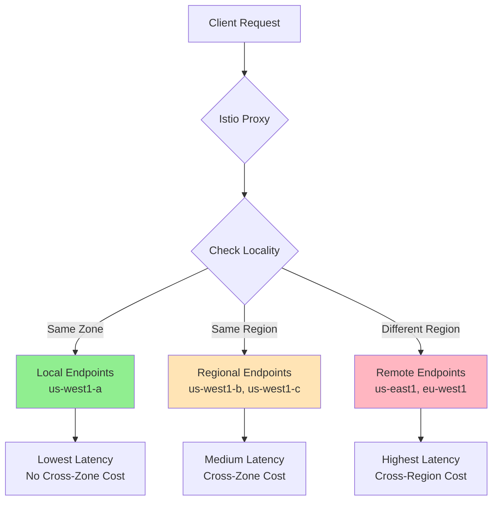
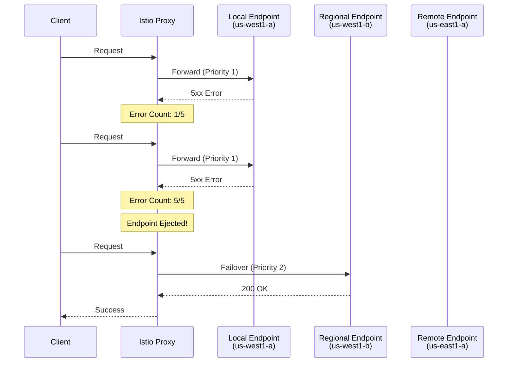
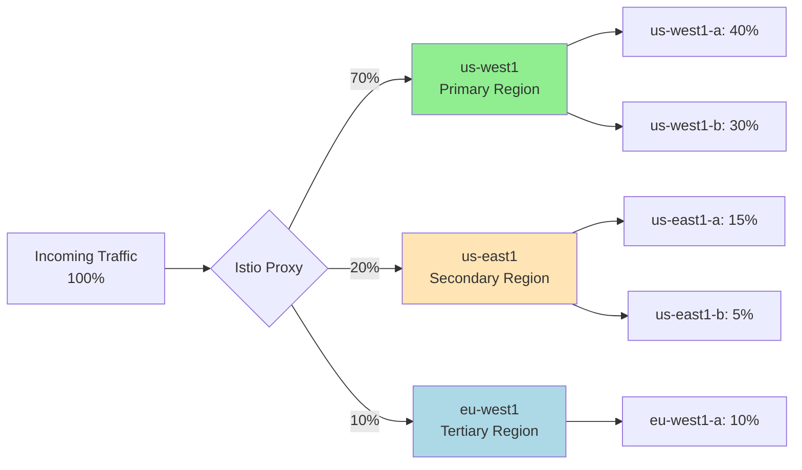
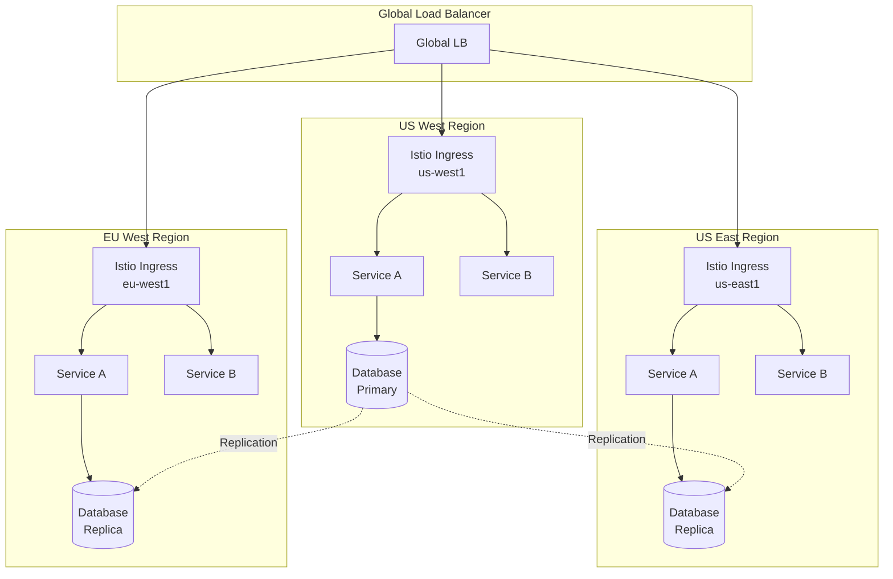
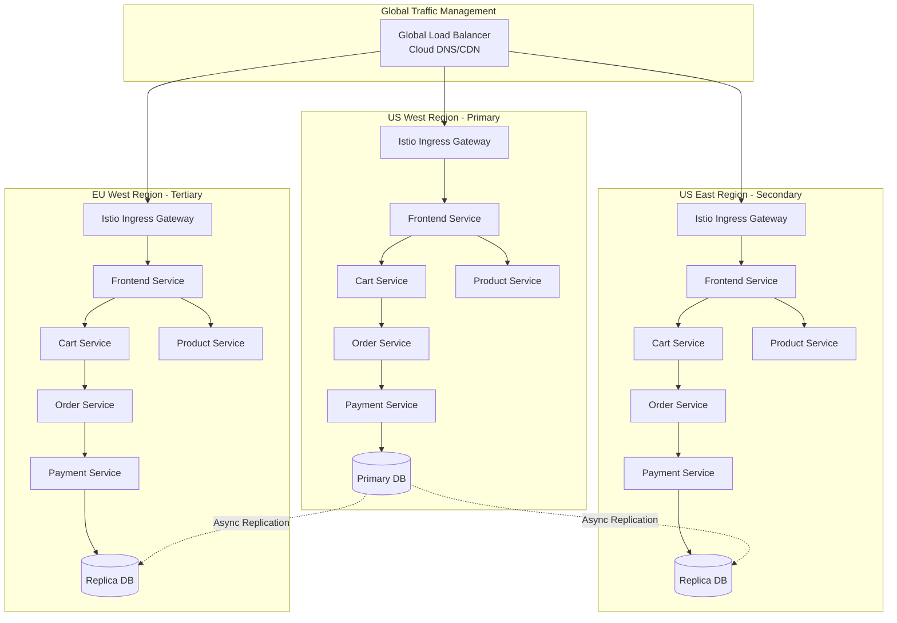

# How to Implement Locality-Aware Routing in Istio

Author: [nawazdhandala](https://github.com/nawazdhandala)

Tags: Istio, Locality, Routing, Multi-Region, Service Mesh, Kubernetes

Description: Learn how to configure locality-aware routing for reduced latency and cost optimization.

---

## Introduction

Locality-aware routing is one of the most powerful features in Istio for optimizing traffic distribution across multi-region and multi-zone deployments. By intelligently routing requests to the nearest available endpoints, you can significantly reduce latency, minimize cross-region data transfer costs, and improve overall application resilience.

In this comprehensive guide, we will explore how to implement locality-aware routing in Istio, covering everything from basic configuration to advanced failover policies and weighted distribution strategies.

## What is Locality-Aware Routing?

Locality-aware routing (also known as locality load balancing) is a traffic management feature that prioritizes routing requests to endpoints that are topologically closest to the originating request. Istio uses Kubernetes locality labels to determine the geographic proximity of service instances.

The locality hierarchy in Kubernetes and Istio follows this structure:

```
Region > Zone > Sub-zone
```

For example:
- Region: `us-west1`
- Zone: `us-west1-a`
- Sub-zone: `rack-1` (optional)



## Prerequisites

Before implementing locality-aware routing, ensure you have the following:

1. A Kubernetes cluster spanning multiple zones or regions
2. Istio installed with the default or custom configuration
3. Services deployed across multiple zones/regions
4. Proper locality labels configured on your nodes

## Understanding Locality Labels

Kubernetes nodes automatically receive locality labels from cloud providers. These labels are essential for Istio's locality-aware routing to function correctly.

The following command displays the locality labels on your Kubernetes nodes, which Istio uses to determine endpoint proximity:

```bash
# View locality labels on your nodes
kubectl get nodes --show-labels | grep -E "topology.kubernetes.io"

# Example output:
# node-1   topology.kubernetes.io/region=us-west1,topology.kubernetes.io/zone=us-west1-a
# node-2   topology.kubernetes.io/region=us-west1,topology.kubernetes.io/zone=us-west1-b
# node-3   topology.kubernetes.io/region=us-east1,topology.kubernetes.io/zone=us-east1-a
```

For cloud providers, these labels are typically set automatically:

| Cloud Provider | Region Label | Zone Label |
|---------------|--------------|------------|
| GCP | `topology.kubernetes.io/region` | `topology.kubernetes.io/zone` |
| AWS | `topology.kubernetes.io/region` | `topology.kubernetes.io/zone` |
| Azure | `topology.kubernetes.io/region` | `topology.kubernetes.io/zone` |

## Basic Locality-Aware Routing Configuration

### Step 1: Enable Locality Load Balancing

Locality load balancing is enabled by default in Istio. However, you can explicitly configure it through a DestinationRule.

The following DestinationRule enables simple locality load balancing for the payment service, which routes traffic to the nearest healthy endpoints:

```yaml
# DestinationRule that enables basic locality load balancing
# This configuration tells Istio to prefer local endpoints over remote ones
apiVersion: networking.istio.io/v1beta1
kind: DestinationRule
metadata:
  name: payment-service-locality
  namespace: production
spec:
  # Target service for which locality routing is configured
  host: payment-service.production.svc.cluster.local
  trafficPolicy:
    # Connection pool settings to ensure healthy connections
    connectionPool:
      tcp:
        maxConnections: 100
      http:
        h2UpgradePolicy: UPGRADE
        http1MaxPendingRequests: 100
        http2MaxRequests: 1000
    # Outlier detection is REQUIRED for locality failover to work
    # Without this, Istio cannot detect unhealthy endpoints
    outlierDetection:
      consecutive5xxErrors: 5
      interval: 30s
      baseEjectionTime: 30s
      maxEjectionPercent: 100
```

### Step 2: Configure Outlier Detection

Outlier detection is critical for locality-aware routing. It allows Istio to detect unhealthy endpoints and failover to endpoints in other localities.

The following diagram illustrates how outlier detection works with locality-aware routing:



The following DestinationRule shows a comprehensive outlier detection configuration that works well for most production scenarios:

```yaml
# Complete DestinationRule with detailed outlier detection settings
# This configuration ensures reliable failover when local endpoints become unhealthy
apiVersion: networking.istio.io/v1beta1
kind: DestinationRule
metadata:
  name: order-service-locality
  namespace: production
spec:
  host: order-service.production.svc.cluster.local
  trafficPolicy:
    # Load balancer configuration with locality settings
    loadBalancer:
      # ROUND_ROBIN distributes traffic evenly among healthy endpoints
      simple: ROUND_ROBIN
      # Locality-specific load balancing settings
      localityLbSetting:
        # Enable locality-aware load balancing
        enabled: true
    # Outlier detection configuration for health checking
    outlierDetection:
      # Number of consecutive 5xx errors before ejecting an endpoint
      consecutive5xxErrors: 5
      # Number of consecutive gateway errors (502, 503, 504) before ejection
      consecutiveGatewayErrors: 5
      # Time interval between ejection analysis
      interval: 10s
      # Minimum time an endpoint stays ejected
      baseEjectionTime: 30s
      # Maximum percentage of endpoints that can be ejected
      # Set to 100 to allow complete failover to other localities
      maxEjectionPercent: 100
      # Minimum number of requests before ejection analysis kicks in
      minHealthPercent: 0
      # Consider local-origin errors for ejection decisions
      splitExternalLocalOriginErrors: true
      # Number of local-origin errors before ejection
      consecutiveLocalOriginFailures: 5
```

## Configuring Locality Failover

Locality failover allows you to define explicit failover behavior when endpoints in the preferred locality are unavailable.

### Simple Failover Configuration

The following DestinationRule demonstrates a basic failover configuration where traffic from us-west1 fails over to us-east1, and vice versa:

```yaml
# DestinationRule with explicit locality failover rules
# Defines which regions should handle traffic when the primary region is unavailable
apiVersion: networking.istio.io/v1beta1
kind: DestinationRule
metadata:
  name: inventory-service-failover
  namespace: production
spec:
  host: inventory-service.production.svc.cluster.local
  trafficPolicy:
    # Connection pool settings for optimal performance
    connectionPool:
      tcp:
        maxConnections: 1000
        connectTimeout: 10s
      http:
        http1MaxPendingRequests: 1000
        http2MaxRequests: 1000
        maxRequestsPerConnection: 100
        maxRetries: 3
    # Load balancer with locality failover configuration
    loadBalancer:
      simple: ROUND_ROBIN
      localityLbSetting:
        enabled: true
        # Failover rules define the backup localities for each region
        failover:
          # When us-west1 endpoints are unhealthy, route to us-east1
          - from: us-west1
            to: us-east1
          # When us-east1 endpoints are unhealthy, route to us-west1
          - from: us-east1
            to: us-west1
          # European region fails over to us-east1 (geographically closer)
          - from: eu-west1
            to: us-east1
    # Outlier detection MUST be configured for failover to work
    outlierDetection:
      consecutive5xxErrors: 3
      interval: 5s
      baseEjectionTime: 30s
      maxEjectionPercent: 100
```

### Zone-Level Failover

For more granular control, you can configure failover at the zone level within a region:

The following configuration shows zone-level failover, ensuring traffic stays within the same region when possible before failing over to a different region:

```yaml
# Zone-level failover configuration for fine-grained traffic control
# This ensures traffic stays within the region when possible
apiVersion: networking.istio.io/v1beta1
kind: DestinationRule
metadata:
  name: user-service-zone-failover
  namespace: production
spec:
  host: user-service.production.svc.cluster.local
  trafficPolicy:
    loadBalancer:
      simple: LEAST_REQUEST
      localityLbSetting:
        enabled: true
        # Zone-level failover rules
        failover:
          # Zone A fails over to Zone B, then Zone C (same region)
          - from: us-west1/us-west1-a
            to: us-west1/us-west1-b
          - from: us-west1/us-west1-b
            to: us-west1/us-west1-c
          - from: us-west1/us-west1-c
            to: us-west1/us-west1-a
          # If entire us-west1 region is down, fail over to us-east1
          - from: us-west1
            to: us-east1
    outlierDetection:
      consecutive5xxErrors: 3
      interval: 5s
      baseEjectionTime: 30s
      maxEjectionPercent: 100
```

## Weighted Locality Distribution

In some scenarios, you may want to distribute traffic across localities using specific weights rather than strict priority. This is useful for:

- Gradual traffic shifting during migrations
- Testing new region deployments
- Balancing load across regions with different capacities

### Configuring Weighted Distribution

The following diagram shows how weighted distribution works across multiple regions:



The following DestinationRule demonstrates weighted distribution across multiple regions and zones, useful for gradual traffic migration or capacity-based routing:

```yaml
# Weighted locality distribution configuration
# Distributes traffic across regions based on specified percentages
apiVersion: networking.istio.io/v1beta1
kind: DestinationRule
metadata:
  name: api-gateway-weighted
  namespace: production
spec:
  host: api-gateway.production.svc.cluster.local
  trafficPolicy:
    loadBalancer:
      simple: ROUND_ROBIN
      localityLbSetting:
        enabled: true
        # Distribute traffic based on weights instead of strict priority
        distribute:
          # Traffic originating from us-west1 region
          - from: us-west1/*
            to:
              # 70% stays in us-west1, distributed across zones
              "us-west1/*": 70
              # 20% goes to us-east1 for redundancy
              "us-east1/*": 20
              # 10% goes to eu-west1 for global distribution
              "eu-west1/*": 10
          # Traffic originating from us-east1 region
          - from: us-east1/*
            to:
              # Primary traffic stays in us-east1
              "us-east1/*": 80
              # Backup to us-west1
              "us-west1/*": 15
              # Small percentage to EU
              "eu-west1/*": 5
          # Traffic originating from eu-west1 region
          - from: eu-west1/*
            to:
              # Keep European traffic in Europe
              "eu-west1/*": 90
              # Backup to US East (closer than US West)
              "us-east1/*": 10
    outlierDetection:
      consecutive5xxErrors: 5
      interval: 10s
      baseEjectionTime: 30s
      maxEjectionPercent: 50
```

### Combining Failover and Distribution

You can combine weighted distribution with failover policies for robust traffic management:

The following configuration shows how to use weighted distribution as the primary routing strategy while maintaining failover rules as a safety net:

```yaml
# Combined weighted distribution and failover configuration
# Uses weights for normal operation, failover for emergency scenarios
apiVersion: networking.istio.io/v1beta1
kind: DestinationRule
metadata:
  name: checkout-service-combined
  namespace: production
spec:
  host: checkout-service.production.svc.cluster.local
  trafficPolicy:
    loadBalancer:
      simple: ROUND_ROBIN
      localityLbSetting:
        enabled: true
        # Primary traffic distribution using weights
        distribute:
          - from: us-west1/*
            to:
              "us-west1/*": 80
              "us-east1/*": 20
          - from: us-east1/*
            to:
              "us-east1/*": 80
              "us-west1/*": 20
        # Failover rules activate when weighted destinations are unhealthy
        # These provide a safety net when primary and secondary fail
        failover:
          - from: us-west1
            to: eu-west1
          - from: us-east1
            to: eu-west1
          - from: eu-west1
            to: us-east1
    # Aggressive outlier detection for critical service
    outlierDetection:
      consecutive5xxErrors: 2
      consecutiveGatewayErrors: 2
      interval: 5s
      baseEjectionTime: 60s
      maxEjectionPercent: 100
```

## Multi-Region Deployment Scenarios

### Scenario 1: Active-Active Multi-Region

In an active-active setup, all regions handle production traffic simultaneously.



The following DestinationRule shows an active-active configuration that keeps traffic local while providing automatic failover:

```yaml
# Active-Active multi-region configuration
# Each region handles traffic locally with automatic failover
apiVersion: networking.istio.io/v1beta1
kind: DestinationRule
metadata:
  name: payment-processor-active-active
  namespace: production
spec:
  host: payment-processor.production.svc.cluster.local
  trafficPolicy:
    loadBalancer:
      simple: LEAST_REQUEST
      localityLbSetting:
        enabled: true
        # Keep traffic in the local region (100% local preference)
        distribute:
          - from: us-west1/*
            to:
              "us-west1/*": 100
          - from: us-east1/*
            to:
              "us-east1/*": 100
          - from: eu-west1/*
            to:
              "eu-west1/*": 100
        # Failover chain for disaster recovery
        failover:
          - from: us-west1
            to: us-east1
          - from: us-east1
            to: us-west1
          - from: eu-west1
            to: us-east1
    # Strict outlier detection for payment processing
    outlierDetection:
      consecutive5xxErrors: 2
      interval: 5s
      baseEjectionTime: 60s
      maxEjectionPercent: 100
```

### Scenario 2: Active-Passive with Warm Standby

In an active-passive setup, one region handles all traffic while others remain on standby.

The following configuration routes 100% of traffic to the active region but maintains warm standby regions for failover:

```yaml
# Active-Passive configuration with warm standby
# Primary region handles all traffic, standby regions ready for failover
apiVersion: networking.istio.io/v1beta1
kind: DestinationRule
metadata:
  name: critical-service-active-passive
  namespace: production
spec:
  host: critical-service.production.svc.cluster.local
  trafficPolicy:
    loadBalancer:
      simple: ROUND_ROBIN
      localityLbSetting:
        enabled: true
        # Route ALL traffic to the primary region (us-west1)
        distribute:
          # Traffic from any location goes to primary
          - from: "*"
            to:
              "us-west1/*": 100
        # Failover chain when primary region fails
        failover:
          # Primary fails to secondary
          - from: us-west1
            to: us-east1
          # Secondary fails to tertiary
          - from: us-east1
            to: eu-west1
          # Tertiary fails back to secondary
          - from: eu-west1
            to: us-east1
    outlierDetection:
      consecutive5xxErrors: 3
      interval: 10s
      baseEjectionTime: 60s
      maxEjectionPercent: 100
```

### Scenario 3: Follow-the-Sun Deployment

For global applications, you can configure routing to follow business hours across regions.

The following VirtualService and DestinationRule combination enables time-based routing that can be adjusted based on business hours:

```yaml
# Follow-the-sun deployment using multiple DestinationRules
# Combined with external configuration for time-based switching
---
# DestinationRule for business hours routing
apiVersion: networking.istio.io/v1beta1
kind: DestinationRule
metadata:
  name: support-service-follow-sun
  namespace: production
spec:
  host: support-service.production.svc.cluster.local
  trafficPolicy:
    loadBalancer:
      simple: ROUND_ROBIN
      localityLbSetting:
        enabled: true
        # Dynamic weights adjusted by external controller based on time
        # These values would be updated by a CronJob or external system
        distribute:
          - from: "*"
            to:
              # During APAC hours: asia-east1 gets most traffic
              # During EU hours: eu-west1 gets most traffic
              # During US hours: us-west1 gets most traffic
              "us-west1/*": 33
              "eu-west1/*": 33
              "asia-east1/*": 34
    outlierDetection:
      consecutive5xxErrors: 5
      interval: 10s
      baseEjectionTime: 30s
      maxEjectionPercent: 100
---
# VirtualService for header-based regional routing
# Allows explicit region selection via headers
apiVersion: networking.istio.io/v1alpha3
kind: VirtualService
metadata:
  name: support-service-routing
  namespace: production
spec:
  hosts:
    - support-service.production.svc.cluster.local
  http:
    # Route based on explicit region header (set by external system)
    - match:
        - headers:
            x-preferred-region:
              exact: "apac"
      route:
        - destination:
            host: support-service.production.svc.cluster.local
            subset: asia
    - match:
        - headers:
            x-preferred-region:
              exact: "eu"
      route:
        - destination:
            host: support-service.production.svc.cluster.local
            subset: europe
    - match:
        - headers:
            x-preferred-region:
              exact: "us"
      route:
        - destination:
            host: support-service.production.svc.cluster.local
            subset: americas
    # Default routing uses locality-aware load balancing
    - route:
        - destination:
            host: support-service.production.svc.cluster.local
---
# Subsets for regional routing
apiVersion: networking.istio.io/v1beta1
kind: DestinationRule
metadata:
  name: support-service-subsets
  namespace: production
spec:
  host: support-service.production.svc.cluster.local
  subsets:
    - name: asia
      labels:
        region: asia
    - name: europe
      labels:
        region: europe
    - name: americas
      labels:
        region: americas
```

## Monitoring and Observability

### Setting Up Locality Metrics

Istio provides built-in metrics for monitoring locality-aware routing. The following Prometheus queries help track locality distribution:

The following PromQL queries help you monitor how traffic is distributed across localities and identify potential issues:

```promql
# Query 1: Request distribution by source and destination locality
# Shows how traffic flows between different localities
sum(rate(istio_requests_total{
  reporter="destination",
  destination_service="payment-service.production.svc.cluster.local"
}[5m])) by (source_workload_namespace, destination_locality)

# Query 2: Success rate by locality
# Helps identify if certain localities have lower success rates
sum(rate(istio_requests_total{
  reporter="destination",
  response_code="200",
  destination_service="payment-service.production.svc.cluster.local"
}[5m])) by (destination_locality)
/
sum(rate(istio_requests_total{
  reporter="destination",
  destination_service="payment-service.production.svc.cluster.local"
}[5m])) by (destination_locality)

# Query 3: Latency percentiles by locality
# Compare latency across different localities
histogram_quantile(0.99, sum(rate(istio_request_duration_milliseconds_bucket{
  reporter="destination",
  destination_service="payment-service.production.svc.cluster.local"
}[5m])) by (le, destination_locality))

# Query 4: Outlier ejection events
# Track when endpoints are ejected due to health issues
sum(rate(envoy_cluster_outlier_detection_ejections_total[5m])) by (cluster_name)
```

### Grafana Dashboard Configuration

The following JSON snippet shows how to create a Grafana panel for visualizing locality distribution:

```json
{
  "title": "Traffic Distribution by Locality",
  "type": "piechart",
  "datasource": "Prometheus",
  "targets": [
    {
      "expr": "sum(rate(istio_requests_total{reporter=\"destination\"}[5m])) by (destination_locality)",
      "legendFormat": "{{destination_locality}}"
    }
  ],
  "options": {
    "legend": {
      "displayMode": "table",
      "placement": "right",
      "values": ["percent", "value"]
    }
  }
}
```

## Troubleshooting Locality-Aware Routing

### Common Issues and Solutions

#### Issue 1: Traffic Not Staying Local

If traffic is not being routed to local endpoints, verify the following:

The following commands help diagnose locality configuration issues:

```bash
# Check if locality labels are properly set on nodes
kubectl get nodes -o jsonpath='{range .items[*]}{.metadata.name}{"\t"}{.metadata.labels.topology\.kubernetes\.io/region}{"\t"}{.metadata.labels.topology\.kubernetes\.io/zone}{"\n"}{end}'

# Verify endpoints have locality information
kubectl get endpoints payment-service -n production -o yaml | grep -A 10 "addresses:"

# Check if Istio proxy has correct locality information
istioctl proxy-config endpoints <pod-name> -n production --cluster "outbound|80||payment-service.production.svc.cluster.local" -o json | jq '.[] | {address: .hostStatuses[].address, locality: .hostStatuses[].locality}'

# Verify DestinationRule is applied correctly
istioctl analyze -n production
```

#### Issue 2: Failover Not Working

The following checklist helps troubleshoot failover issues:

```bash
# Ensure outlier detection is configured
kubectl get destinationrule payment-service-locality -n production -o yaml | grep -A 20 "outlierDetection"

# Check if endpoints are being ejected
kubectl exec -it <pod-name> -n production -c istio-proxy -- curl localhost:15000/clusters | grep "outlier"

# View Envoy cluster configuration
istioctl proxy-config cluster <pod-name> -n production -o json | jq '.[] | select(.name | contains("payment-service"))'

# Check for circuit breaker events
kubectl logs <pod-name> -n production -c istio-proxy | grep -i "ejecting\|circuit"
```

#### Issue 3: Uneven Distribution

If traffic distribution does not match configured weights:

The following script helps verify traffic distribution:

```bash
#!/bin/bash
# Script to verify traffic distribution across localities
# Run this from a pod in the mesh

SERVICE_URL="http://payment-service.production:80/health"
REQUESTS=1000

echo "Sending $REQUESTS requests to verify locality distribution..."

# Send requests and collect locality information from response headers
for i in $(seq 1 $REQUESTS); do
  curl -s -o /dev/null -w "%{http_code}\n" \
    -H "x-request-id: test-$i" \
    $SERVICE_URL >> /tmp/responses.log
done

# Analyze results
echo "Results:"
sort /tmp/responses.log | uniq -c | sort -rn
```

### Debugging with Istio Tools

The following istioctl commands provide detailed insight into locality routing behavior:

```bash
# View the full Envoy configuration for a proxy
istioctl proxy-config all <pod-name> -n production -o json > envoy-config.json

# Check cluster load balancing policy
istioctl proxy-config cluster <pod-name> -n production \
  --fqdn "payment-service.production.svc.cluster.local" -o json | \
  jq '.[] | {name: .name, lbPolicy: .lbPolicy, localityWeightedLbConfig: .commonLbConfig.localityWeightedLbConfig}'

# View endpoint weights by locality
istioctl proxy-config endpoints <pod-name> -n production \
  --cluster "outbound|80||payment-service.production.svc.cluster.local" -o json | \
  jq '.[] | {locality: .locality, endpoints: .lbEndpoints | length, weight: .loadBalancingWeight}'

# Real-time traffic analysis
istioctl experimental describe pod <pod-name> -n production
```

## Best Practices

### 1. Always Configure Outlier Detection

Without outlier detection, locality failover will not work. Always include outlier detection in your DestinationRules.

The following represents the minimum recommended outlier detection configuration:

```yaml
# Minimum recommended outlier detection configuration
outlierDetection:
  consecutive5xxErrors: 5        # Eject after 5 consecutive errors
  interval: 10s                  # Check every 10 seconds
  baseEjectionTime: 30s          # Eject for at least 30 seconds
  maxEjectionPercent: 100        # Allow ejecting all endpoints if needed
```

### 2. Use Appropriate Health Check Intervals

Balance between quick detection and avoiding false positives:

```yaml
# Conservative settings for stable services
outlierDetection:
  consecutive5xxErrors: 10
  interval: 30s
  baseEjectionTime: 60s

# Aggressive settings for latency-sensitive services
outlierDetection:
  consecutive5xxErrors: 2
  interval: 5s
  baseEjectionTime: 30s
```

### 3. Test Failover Regularly

The following script simulates a locality failure to test failover behavior:

```bash
#!/bin/bash
# Script to test locality failover
# This temporarily scales down pods in a specific zone

NAMESPACE="production"
DEPLOYMENT="payment-service"
ZONE="us-west1-a"

echo "Testing failover by scaling down pods in zone: $ZONE"

# Get pods in the target zone
PODS=$(kubectl get pods -n $NAMESPACE -l app=$DEPLOYMENT \
  -o jsonpath='{range .items[?(@.spec.nodeName)]}{.metadata.name}{" "}{.spec.nodeName}{"\n"}{end}' | \
  while read pod node; do
    NODE_ZONE=$(kubectl get node $node -o jsonpath='{.metadata.labels.topology\.kubernetes\.io/zone}')
    if [ "$NODE_ZONE" == "$ZONE" ]; then
      echo $pod
    fi
  done)

echo "Pods to cordon: $PODS"

# Cordon nodes in the zone (prevents new pods from being scheduled)
for node in $(kubectl get nodes -l topology.kubernetes.io/zone=$ZONE -o name); do
  kubectl cordon $node
done

# Delete pods in the zone (they won't be rescheduled to the same zone)
for pod in $PODS; do
  kubectl delete pod $pod -n $NAMESPACE
done

echo "Failover test initiated. Monitor traffic distribution..."
echo "Don't forget to uncordon nodes after testing!"
```

### 4. Monitor Cross-Region Traffic

Set up alerts for unexpected cross-region traffic to catch configuration issues early:

The following Prometheus alerting rules help detect locality routing problems:

```yaml
# Prometheus alerting rules for locality routing
apiVersion: monitoring.coreos.com/v1
kind: PrometheusRule
metadata:
  name: locality-routing-alerts
  namespace: monitoring
spec:
  groups:
    - name: locality-routing
      rules:
        # Alert when cross-region traffic exceeds threshold
        - alert: HighCrossRegionTraffic
          expr: |
            sum(rate(istio_requests_total{
              source_locality!~"us-west1.*",
              destination_locality=~"us-west1.*"
            }[5m]))
            /
            sum(rate(istio_requests_total{
              destination_locality=~"us-west1.*"
            }[5m])) > 0.3
          for: 5m
          labels:
            severity: warning
          annotations:
            summary: "High cross-region traffic detected"
            description: "More than 30% of traffic to us-west1 is coming from other regions"

        # Alert when locality failover is triggered
        - alert: LocalityFailoverActive
          expr: |
            increase(envoy_cluster_outlier_detection_ejections_total[5m]) > 0
          for: 1m
          labels:
            severity: info
          annotations:
            summary: "Locality failover triggered"
            description: "Endpoints have been ejected, failover may be active"
```

## Complete Example: Multi-Region E-Commerce Platform

Let us put everything together with a complete example for a multi-region e-commerce platform.



The following YAML provides a comprehensive locality configuration for all services in the e-commerce platform:

```yaml
# Complete locality-aware routing configuration for e-commerce platform
---
# Namespace configuration
apiVersion: v1
kind: Namespace
metadata:
  name: ecommerce
  labels:
    istio-injection: enabled
---
# Frontend Service - Keep traffic local for best user experience
apiVersion: networking.istio.io/v1beta1
kind: DestinationRule
metadata:
  name: frontend-locality
  namespace: ecommerce
spec:
  host: frontend.ecommerce.svc.cluster.local
  trafficPolicy:
    loadBalancer:
      simple: ROUND_ROBIN
      localityLbSetting:
        enabled: true
        # Frontend should always stay local for lowest latency
        distribute:
          - from: us-west1/*
            to:
              "us-west1/*": 100
          - from: us-east1/*
            to:
              "us-east1/*": 100
          - from: eu-west1/*
            to:
              "eu-west1/*": 100
        failover:
          - from: us-west1
            to: us-east1
          - from: us-east1
            to: us-west1
          - from: eu-west1
            to: us-east1
    outlierDetection:
      consecutive5xxErrors: 3
      interval: 5s
      baseEjectionTime: 30s
      maxEjectionPercent: 100
---
# Cart Service - Session affinity with locality preference
apiVersion: networking.istio.io/v1beta1
kind: DestinationRule
metadata:
  name: cart-service-locality
  namespace: ecommerce
spec:
  host: cart-service.ecommerce.svc.cluster.local
  trafficPolicy:
    loadBalancer:
      # Use consistent hashing for session affinity
      consistentHash:
        httpCookie:
          name: cart-session
          ttl: 3600s
      localityLbSetting:
        enabled: true
        distribute:
          - from: us-west1/*
            to:
              "us-west1/*": 95
              "us-east1/*": 5
          - from: us-east1/*
            to:
              "us-east1/*": 95
              "us-west1/*": 5
          - from: eu-west1/*
            to:
              "eu-west1/*": 95
              "us-east1/*": 5
        failover:
          - from: us-west1
            to: us-east1
          - from: us-east1
            to: us-west1
          - from: eu-west1
            to: us-east1
    outlierDetection:
      consecutive5xxErrors: 5
      interval: 10s
      baseEjectionTime: 60s
      maxEjectionPercent: 100
---
# Product Service - Read-heavy, can distribute globally
apiVersion: networking.istio.io/v1beta1
kind: DestinationRule
metadata:
  name: product-service-locality
  namespace: ecommerce
spec:
  host: product-service.ecommerce.svc.cluster.local
  trafficPolicy:
    loadBalancer:
      simple: LEAST_REQUEST
      localityLbSetting:
        enabled: true
        # Product data is cached, safe to distribute
        distribute:
          - from: us-west1/*
            to:
              "us-west1/*": 80
              "us-east1/*": 15
              "eu-west1/*": 5
          - from: us-east1/*
            to:
              "us-east1/*": 80
              "us-west1/*": 15
              "eu-west1/*": 5
          - from: eu-west1/*
            to:
              "eu-west1/*": 80
              "us-east1/*": 15
              "us-west1/*": 5
        failover:
          - from: us-west1
            to: us-east1
          - from: us-east1
            to: us-west1
          - from: eu-west1
            to: us-east1
    outlierDetection:
      consecutive5xxErrors: 5
      interval: 10s
      baseEjectionTime: 30s
      maxEjectionPercent: 100
---
# Order Service - Critical, strict locality with aggressive failover
apiVersion: networking.istio.io/v1beta1
kind: DestinationRule
metadata:
  name: order-service-locality
  namespace: ecommerce
spec:
  host: order-service.ecommerce.svc.cluster.local
  trafficPolicy:
    connectionPool:
      tcp:
        maxConnections: 1000
        connectTimeout: 5s
      http:
        http1MaxPendingRequests: 1000
        http2MaxRequests: 1000
        maxRetries: 3
    loadBalancer:
      simple: ROUND_ROBIN
      localityLbSetting:
        enabled: true
        distribute:
          - from: us-west1/*
            to:
              "us-west1/*": 100
          - from: us-east1/*
            to:
              "us-east1/*": 100
          - from: eu-west1/*
            to:
              "eu-west1/*": 100
        failover:
          - from: us-west1
            to: us-east1
          - from: us-east1
            to: us-west1
          - from: eu-west1
            to: us-east1
    # Aggressive outlier detection for critical service
    outlierDetection:
      consecutive5xxErrors: 2
      consecutiveGatewayErrors: 2
      interval: 5s
      baseEjectionTime: 60s
      maxEjectionPercent: 100
---
# Payment Service - Most critical, strict locality, database region awareness
apiVersion: networking.istio.io/v1beta1
kind: DestinationRule
metadata:
  name: payment-service-locality
  namespace: ecommerce
spec:
  host: payment-service.ecommerce.svc.cluster.local
  trafficPolicy:
    connectionPool:
      tcp:
        maxConnections: 500
        connectTimeout: 3s
      http:
        http1MaxPendingRequests: 500
        http2MaxRequests: 500
        maxRetries: 2
        idleTimeout: 60s
    loadBalancer:
      simple: ROUND_ROBIN
      localityLbSetting:
        enabled: true
        # Payment must stay in primary region (where primary DB is)
        # for strong consistency requirements
        distribute:
          - from: "*"
            to:
              "us-west1/*": 100
        failover:
          # Only failover when entire primary region is down
          - from: us-west1
            to: us-east1
          - from: us-east1
            to: us-west1
    # Very aggressive outlier detection
    outlierDetection:
      consecutive5xxErrors: 1
      consecutiveGatewayErrors: 1
      interval: 3s
      baseEjectionTime: 120s
      maxEjectionPercent: 100
      minHealthPercent: 0
```

## Conclusion

Locality-aware routing in Istio is a powerful feature that can significantly improve the performance, reliability, and cost-efficiency of your multi-region deployments. By understanding and properly configuring locality labels, failover policies, and weighted distribution, you can:

1. **Reduce Latency**: Keep traffic local to minimize network round-trip times
2. **Optimize Costs**: Avoid expensive cross-region data transfer charges
3. **Improve Resilience**: Automatically failover to healthy endpoints in other localities
4. **Balance Load**: Distribute traffic across regions based on capacity

Key takeaways:

- Always configure outlier detection alongside locality settings
- Test failover scenarios regularly in non-production environments
- Monitor cross-region traffic patterns to catch misconfigurations
- Use weighted distribution for gradual traffic migrations
- Consider your data consistency requirements when designing locality policies

With these configurations and best practices, you can build a robust, globally distributed application that provides excellent user experience regardless of where your users are located.

## Additional Resources

- [Istio Locality Load Balancing Documentation](https://istio.io/latest/docs/tasks/traffic-management/locality-load-balancing/)
- [Kubernetes Topology Labels](https://kubernetes.io/docs/reference/labels-annotations-taints/#topologykubernetesioregion)
- [Envoy Outlier Detection](https://www.envoyproxy.io/docs/envoy/latest/intro/arch_overview/upstream/outlier)
- [Multi-Cluster Istio Deployment](https://istio.io/latest/docs/setup/install/multicluster/)
