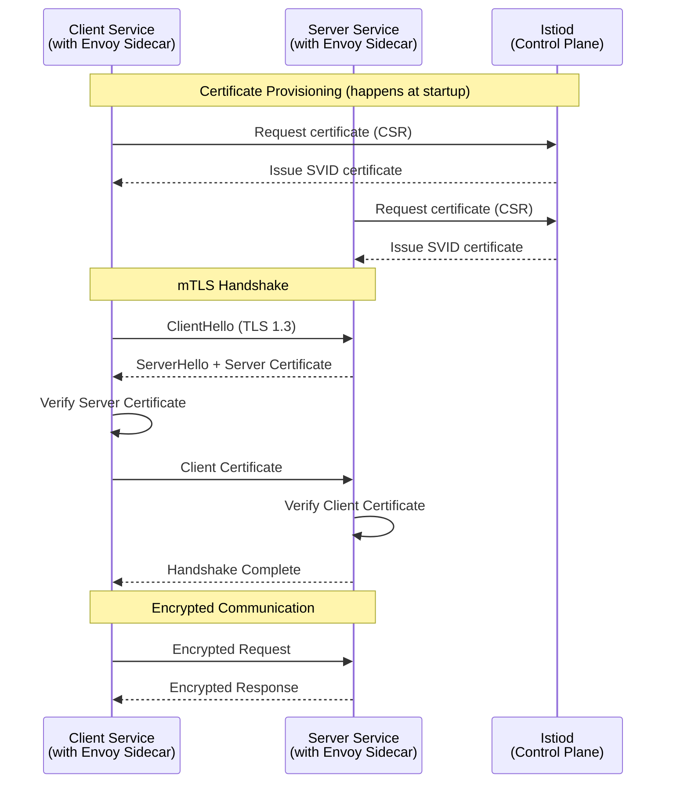
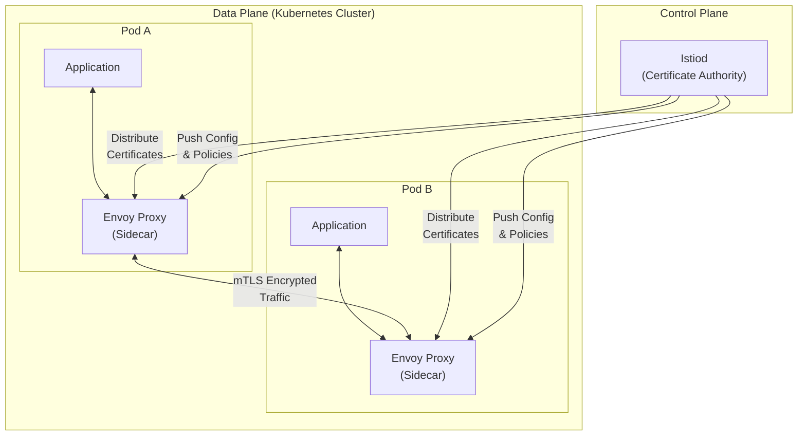
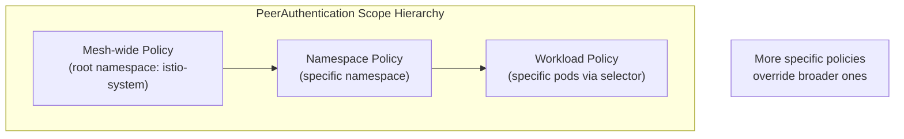
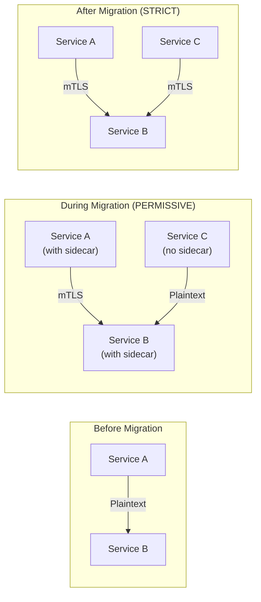
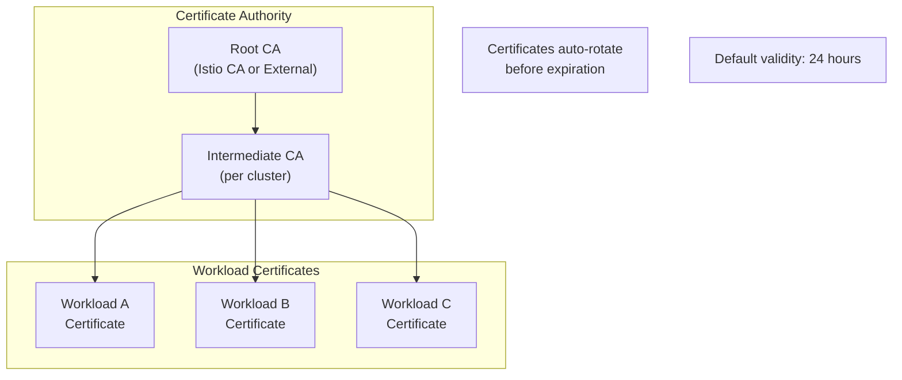
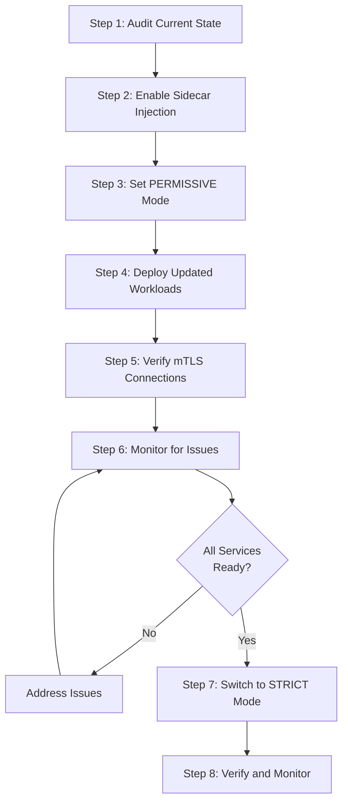

# How to Enable Mutual TLS (mTLS) in Istio

Author: [nawazdhandala](https://github.com/nawazdhandala)

Tags: Istio, mTLS, Security, Service Mesh, Kubernetes, Zero Trust

Description: A complete guide to enabling and configuring mutual TLS in Istio for secure service communication.

---

Mutual TLS (mTLS) is a cornerstone of zero-trust security architecture, ensuring that both the client and server authenticate each other before establishing a secure connection. Istio, the popular service mesh for Kubernetes, provides built-in mTLS capabilities that make it easy to encrypt all service-to-service communication within your cluster. This comprehensive guide walks you through enabling, configuring, and managing mTLS in Istio.

## Table of Contents

1. [Understanding mTLS in Istio](#understanding-mtls-in-istio)
2. [Prerequisites](#prerequisites)
3. [How mTLS Works in Istio](#how-mtls-works-in-istio)
4. [PeerAuthentication Policies](#peerauthentication-policies)
5. [Enabling STRICT Mode](#enabling-strict-mode)
6. [Using PERMISSIVE Mode for Migration](#using-permissive-mode-for-migration)
7. [Certificate Management](#certificate-management)
8. [Migrating from Plaintext to mTLS](#migrating-from-plaintext-to-mtls)
9. [Verifying mTLS Configuration](#verifying-mtls-configuration)
10. [Troubleshooting Common Issues](#troubleshooting-common-issues)
11. [Best Practices](#best-practices)

## Understanding mTLS in Istio

Mutual TLS provides two-way authentication between services. Unlike standard TLS where only the server proves its identity to the client, mTLS requires both parties to present valid certificates. This ensures:

- **Identity Verification**: Both services prove their identity cryptographically
- **Data Encryption**: All traffic between services is encrypted
- **Integrity Protection**: Data cannot be tampered with in transit
- **Zero Trust Security**: No implicit trust based on network location

### mTLS Handshake Flow

The following diagram illustrates how the mTLS handshake works in Istio:



### Istio mTLS Architecture

This diagram shows how mTLS fits into the Istio architecture:



## Prerequisites

Before enabling mTLS, ensure you have:

- A Kubernetes cluster (version 1.22+)
- Istio installed (version 1.18+ recommended)
- kubectl configured to communicate with your cluster
- istioctl installed for debugging and verification

This command installs Istio with the default profile, which includes necessary components for mTLS:

```bash
# Install Istio with default profile (includes mTLS support)
istioctl install --set profile=default -y
```

This command enables automatic sidecar injection for the default namespace:

```bash
# Enable sidecar injection for your namespace
kubectl label namespace default istio-injection=enabled
```

## How mTLS Works in Istio

Istio implements mTLS through its sidecar proxies (Envoy). When mTLS is enabled:

1. **Istiod** acts as the Certificate Authority (CA), issuing SPIFFE-based identities (SVIDs) to each workload
2. **Envoy sidecars** automatically handle certificate rotation, TLS handshakes, and encryption
3. **Service identities** are derived from the Kubernetes service account, creating a cryptographic identity

### SPIFFE Identity Format

Istio uses SPIFFE (Secure Production Identity Framework for Everyone) to create workload identities:

```
spiffe://<trust-domain>/ns/<namespace>/sa/<service-account>
```

For example:
```
spiffe://cluster.local/ns/production/sa/payment-service
```

## PeerAuthentication Policies

PeerAuthentication is the primary resource for configuring mTLS behavior in Istio. It defines how a workload should authenticate incoming connections.

### Policy Scope Levels



### mTLS Modes

| Mode | Description | Use Case |
|------|-------------|----------|
| `STRICT` | Only accept mTLS traffic | Production environments with full mesh coverage |
| `PERMISSIVE` | Accept both mTLS and plaintext | Migration period, mixed environments |
| `DISABLE` | Disable mTLS for workload | Legacy services, external integrations |
| `UNSET` | Inherit from parent scope | Default behavior, policy inheritance |

## Enabling STRICT Mode

STRICT mode ensures that all incoming traffic must be encrypted with mTLS. This is the recommended mode for production environments.

### Mesh-Wide STRICT mTLS

This policy enables STRICT mTLS for all services across the entire mesh. Apply this in the root namespace (istio-system):

```yaml
# mesh-wide-strict-mtls.yaml
# This policy applies to ALL workloads in the mesh
# It ensures no plaintext traffic is accepted anywhere
apiVersion: security.istio.io/v1beta1
kind: PeerAuthentication
metadata:
  name: default
  # Policies in istio-system with name "default" apply mesh-wide
  namespace: istio-system
spec:
  # STRICT mode rejects any non-mTLS traffic
  # All services must have sidecars and valid certificates
  mtls:
    mode: STRICT
```

Apply the mesh-wide policy to enforce mTLS across all namespaces:

```bash
# Apply the mesh-wide STRICT mTLS policy
kubectl apply -f mesh-wide-strict-mtls.yaml
```

### Namespace-Level STRICT mTLS

This policy enables STRICT mTLS for all services within a specific namespace while allowing other namespaces to have different configurations:

```yaml
# namespace-strict-mtls.yaml
# Apply STRICT mTLS only to the production namespace
# Other namespaces remain unaffected by this policy
apiVersion: security.istio.io/v1beta1
kind: PeerAuthentication
metadata:
  name: default
  # This policy only affects workloads in the production namespace
  namespace: production
spec:
  mtls:
    mode: STRICT
```

Apply the namespace-level policy to enforce mTLS only in the production namespace:

```bash
# Apply namespace-level STRICT mTLS
kubectl apply -f namespace-strict-mtls.yaml
```

### Workload-Specific STRICT mTLS

This policy enables STRICT mTLS for a specific workload using label selectors. Useful when you need fine-grained control:

```yaml
# workload-strict-mtls.yaml
# Apply STRICT mTLS only to the payment-service workload
# Other workloads in the same namespace are not affected
apiVersion: security.istio.io/v1beta1
kind: PeerAuthentication
metadata:
  name: payment-service-mtls
  namespace: production
spec:
  # Selector targets specific pods by their labels
  # Only pods matching these labels will use this policy
  selector:
    matchLabels:
      app: payment-service
  mtls:
    mode: STRICT
```

Apply the workload-specific policy to enforce mTLS only for the payment service:

```bash
# Apply workload-specific STRICT mTLS
kubectl apply -f workload-strict-mtls.yaml
```

### Port-Level mTLS Configuration

This policy allows different mTLS modes for different ports on the same workload. Useful for services with mixed protocol requirements:

```yaml
# port-level-mtls.yaml
# Configure different mTLS modes for different ports
# Useful when some ports need plaintext (e.g., health checks)
apiVersion: security.istio.io/v1beta1
kind: PeerAuthentication
metadata:
  name: api-gateway-mtls
  namespace: production
spec:
  selector:
    matchLabels:
      app: api-gateway
  mtls:
    # Default mode for all ports not explicitly specified
    mode: STRICT
  # Override mTLS mode for specific ports
  portLevelMtls:
    # Health check port - allow plaintext for external load balancers
    8080:
      mode: DISABLE
    # Metrics port - permissive for Prometheus scraping
    9090:
      mode: PERMISSIVE
    # gRPC port - enforce strict mTLS
    50051:
      mode: STRICT
```

## Using PERMISSIVE Mode for Migration

PERMISSIVE mode is essential during migration from plaintext to mTLS. It allows services to accept both encrypted and unencrypted traffic.

### Why PERMISSIVE Mode?



### Mesh-Wide PERMISSIVE Mode

This policy enables PERMISSIVE mode mesh-wide, allowing gradual migration of services to mTLS:

```yaml
# mesh-wide-permissive-mtls.yaml
# Enable PERMISSIVE mode for the entire mesh
# This allows both mTLS and plaintext traffic during migration
apiVersion: security.istio.io/v1beta1
kind: PeerAuthentication
metadata:
  name: default
  namespace: istio-system
spec:
  mtls:
    # PERMISSIVE mode accepts both mTLS and plaintext
    # Istio will automatically use mTLS when both sides support it
    # Falls back to plaintext for non-mesh services
    mode: PERMISSIVE
```

Apply the mesh-wide PERMISSIVE mode to allow gradual migration:

```bash
# Apply mesh-wide PERMISSIVE mode
kubectl apply -f mesh-wide-permissive-mtls.yaml
```

### Namespace PERMISSIVE with Workload Exceptions

This configuration sets namespace-wide PERMISSIVE mode while enforcing STRICT mode for specific critical workloads:

```yaml
# namespace-permissive-with-exceptions.yaml
# Namespace-wide PERMISSIVE mode with STRICT exceptions
---
# Base policy: PERMISSIVE for the namespace
apiVersion: security.istio.io/v1beta1
kind: PeerAuthentication
metadata:
  name: default
  namespace: production
spec:
  mtls:
    mode: PERMISSIVE
---
# Exception: STRICT mode for sensitive workloads
# The payment service must always use mTLS
apiVersion: security.istio.io/v1beta1
kind: PeerAuthentication
metadata:
  name: payment-strict
  namespace: production
spec:
  selector:
    matchLabels:
      app: payment-service
      security: high
  mtls:
    mode: STRICT
```

## Certificate Management

Istio automatically manages certificates for mTLS. Understanding certificate lifecycle is crucial for maintaining secure operations.

### Certificate Architecture



### Configuring Certificate Rotation

This configuration customizes certificate validity and rotation for your mesh via the Istio operator:

```yaml
# istio-cert-config.yaml
# Configure certificate validity and rotation settings
# Apply this during Istio installation or upgrade
apiVersion: install.istio.io/v1alpha1
kind: IstioOperator
metadata:
  name: istio-control-plane
  namespace: istio-system
spec:
  meshConfig:
    # Default config for all workloads
    defaultConfig:
      # Control how often proxies check for certificate updates
      proxyMetadata:
        # Certificate rotation check interval
        ISTIO_META_CERT_REFRESH_INTERVAL: "10m"
  values:
    pilot:
      env:
        # Workload certificate validity duration
        # Default is 24h, adjust based on security requirements
        WORKLOAD_CERT_TTL: "24h"
        # Grace period before expiration to trigger rotation
        # Certificate will be renewed when remaining validity < this value
        CITADEL_SELF_SIGNED_CA_GRACE_PERIOD_PERCENTILE: "20"
```

### Using Custom CA Certificates

This configuration allows you to use your own CA certificates instead of Istio's self-signed CA for production environments:

```yaml
# custom-ca-secret.yaml
# Provide custom CA certificates for Istio
# This replaces Istio's self-signed CA with your enterprise CA
apiVersion: v1
kind: Secret
metadata:
  name: cacerts
  # Must be in istio-system namespace
  namespace: istio-system
# Kubernetes TLS secret type
type: Opaque
data:
  # Base64-encoded CA certificate
  # This is the root certificate that signs all workload certs
  ca-cert.pem: <base64-encoded-ca-cert>

  # Base64-encoded CA private key
  # Used to sign workload certificate requests
  ca-key.pem: <base64-encoded-ca-key>

  # Base64-encoded certificate chain
  # Full chain from workload cert to root CA
  cert-chain.pem: <base64-encoded-cert-chain>

  # Base64-encoded root certificate
  # The ultimate trust anchor for the mesh
  root-cert.pem: <base64-encoded-root-cert>
```

Create the custom CA secret with your enterprise certificates:

```bash
# Create secret from certificate files
# Replace paths with your actual certificate file locations
kubectl create secret generic cacerts -n istio-system \
  --from-file=ca-cert.pem=path/to/ca-cert.pem \
  --from-file=ca-key.pem=path/to/ca-key.pem \
  --from-file=cert-chain.pem=path/to/cert-chain.pem \
  --from-file=root-cert.pem=path/to/root-cert.pem
```

After creating the custom CA secret, restart Istiod to pick up the new certificates:

```bash
# Restart Istiod to use the new CA certificates
kubectl rollout restart deployment/istiod -n istio-system
```

### Verifying Certificate Configuration

Use these commands to inspect workload certificates and verify proper mTLS configuration:

```bash
# Check the certificate of a specific workload
# Replace NAMESPACE and POD_NAME with actual values
istioctl proxy-config secret <POD_NAME>.<NAMESPACE>
```

This command shows detailed certificate information including validity and issuer:

```bash
# View detailed certificate information
# This shows the full certificate chain and expiration times
istioctl proxy-config secret <POD_NAME>.<NAMESPACE> -o json | \
  jq '.dynamicActiveSecrets[0].secret.tlsCertificate.certificateChain.inlineBytes' | \
  tr -d '"' | base64 -d | openssl x509 -text -noout
```

## Migrating from Plaintext to mTLS

A successful migration requires careful planning and execution. Follow this step-by-step approach to migrate safely.

### Migration Flow



### Step 1: Audit Current State

Before migration, understand your current mTLS status across all workloads:

```bash
# Check current mTLS status across all namespaces
# This shows which connections are using mTLS
istioctl analyze --all-namespaces
```

This script checks the detailed mTLS status for each namespace:

```bash
# Check mTLS status for all pods in a namespace
# Replace NAMESPACE with your target namespace
for ns in $(kubectl get namespaces -o jsonpath='{.items[*].metadata.name}'); do
  echo "=== Namespace: $ns ==="
  istioctl x authz check -n $ns 2>/dev/null || echo "No sidecars in namespace"
done
```

### Step 2: Enable Sidecar Injection

Enable automatic sidecar injection for namespaces that need mTLS protection:

```bash
# Enable sidecar injection for target namespaces
# The label triggers automatic Envoy sidecar injection
kubectl label namespace production istio-injection=enabled
kubectl label namespace staging istio-injection=enabled
```

For existing deployments, trigger a rollout to inject sidecars:

```bash
# Restart deployments to inject sidecars
# This creates new pods with Envoy sidecars
kubectl rollout restart deployment -n production
kubectl rollout restart deployment -n staging
```

### Step 3: Apply PERMISSIVE Mode

Start with PERMISSIVE mode to allow both mTLS and plaintext traffic during migration:

```yaml
# migration-permissive.yaml
# Phase 1: Enable PERMISSIVE mode mesh-wide
# This ensures no service disruption during migration
apiVersion: security.istio.io/v1beta1
kind: PeerAuthentication
metadata:
  name: default
  namespace: istio-system
spec:
  mtls:
    mode: PERMISSIVE
```

Apply the PERMISSIVE policy to begin the migration:

```bash
# Apply PERMISSIVE mode for the mesh
kubectl apply -f migration-permissive.yaml
```

### Step 4: Configure DestinationRules

DestinationRules configure how clients connect to services. Enable mTLS for outgoing connections:

```yaml
# destination-rule-mtls.yaml
# Configure clients to use mTLS when connecting to services
# This applies to all services in the mesh
apiVersion: networking.istio.io/v1beta1
kind: DestinationRule
metadata:
  name: default
  namespace: istio-system
spec:
  # Apply to all hosts in the mesh
  host: "*.local"
  trafficPolicy:
    tls:
      # ISTIO_MUTUAL uses Istio's certificate system
      # Certificates are automatically provisioned and rotated
      mode: ISTIO_MUTUAL
```

Apply the DestinationRule to enable mTLS for client connections:

```bash
# Apply DestinationRule for mTLS
kubectl apply -f destination-rule-mtls.yaml
```

### Step 5: Verify mTLS is Working

Verify that mTLS is active between services before proceeding:

```bash
# Check if mTLS is active between services
# This shows the TLS mode for each connection
istioctl proxy-config listeners <POD_NAME>.<NAMESPACE> -o json | \
  grep -A 5 "transport_socket"
```

This command provides detailed verification of mTLS status between two workloads:

```bash
# Verify mTLS between specific services
# Shows authentication status for connections
istioctl x authz check <POD_NAME>.<NAMESPACE>
```

### Step 6: Gradually Enable STRICT Mode

Once all services have sidecars, gradually enable STRICT mode namespace by namespace:

```yaml
# strict-mode-rollout.yaml
# Phase 2: Enable STRICT mode per namespace
# Start with less critical namespaces
---
# Enable STRICT for staging first
apiVersion: security.istio.io/v1beta1
kind: PeerAuthentication
metadata:
  name: default
  namespace: staging
spec:
  mtls:
    mode: STRICT
---
# After validation, enable for production
apiVersion: security.istio.io/v1beta1
kind: PeerAuthentication
metadata:
  name: default
  namespace: production
spec:
  mtls:
    mode: STRICT
```

### Step 7: Enable Mesh-Wide STRICT Mode

After validating all namespaces, enable mesh-wide STRICT mode:

```yaml
# mesh-strict-final.yaml
# Final phase: Mesh-wide STRICT mTLS
# Only apply after all services are verified working
apiVersion: security.istio.io/v1beta1
kind: PeerAuthentication
metadata:
  name: default
  namespace: istio-system
spec:
  mtls:
    mode: STRICT
```

Apply the final mesh-wide STRICT policy to complete the migration:

```bash
# Apply mesh-wide STRICT mTLS
kubectl apply -f mesh-strict-final.yaml
```

## Verifying mTLS Configuration

After enabling mTLS, verification is crucial to ensure security is properly enforced.

### Using istioctl for Verification

Check the overall mTLS status in your mesh:

```bash
# Check overall mTLS status
# This provides a summary of mTLS configuration across the mesh
istioctl analyze --all-namespaces
```

Verify the authentication policy for a specific workload:

```bash
# Verify authentication policy for a workload
# This shows what policies apply to a specific pod
istioctl authn tls-check <POD_NAME>.<NAMESPACE>
```

### Checking Connection Encryption

This command verifies that connections are actually encrypted between services:

```bash
# Verify TLS connection between services
# This shows the TLS version and cipher being used
istioctl proxy-config endpoint <POD_NAME>.<NAMESPACE> -o json | \
  jq '.[] | select(.status.healthStatus.healthy==true) |
  {cluster: .cluster.name, tlsMode: .metadata.filterMetadata["istio"].tlsMode}'
```

### Using Kiali for Visual Verification

Deploy Kiali for visual mTLS verification:

```bash
# If Kiali is installed, access the dashboard
# The security badges show mTLS status for each connection
istioctl dashboard kiali
```

### Testing with curl from Within Pods

Test mTLS enforcement by attempting plaintext connections:

```bash
# Deploy a test pod without a sidecar
# This pod will be used to test mTLS enforcement
kubectl run test-no-sidecar --image=curlimages/curl \
  --overrides='{"metadata":{"annotations":{"sidecar.istio.io/inject":"false"}}}' \
  --restart=Never -- sleep 3600
```

Test connection from a pod without sidecar to verify STRICT mode is enforced:

```bash
# Test connection without mTLS (should fail in STRICT mode)
# If mTLS is properly enforced, this connection will be rejected
kubectl exec -it test-no-sidecar -- curl -v http://my-service.production.svc.cluster.local
```

Expected output when STRICT mode is properly enforced:

```
# Connection should fail with:
# curl: (56) Recv failure: Connection reset by peer
# This confirms mTLS is enforced
```

## Troubleshooting Common Issues

### Issue 1: Connection Refused After Enabling STRICT Mode

When services cannot connect after enabling STRICT mode, check for missing sidecars:

```bash
# Check if all pods have sidecars
# Pods without sidecars cannot participate in mTLS
kubectl get pods -n production -o jsonpath='{range .items[*]}{.metadata.name}{"\t"}{.spec.containers[*].name}{"\n"}{end}' | \
  grep -v istio-proxy
```

If pods are missing sidecars, verify namespace labeling:

```bash
# Verify namespace has sidecar injection enabled
kubectl get namespace production -o jsonpath='{.metadata.labels}'
```

Fix by ensuring sidecar injection and restarting pods:

```bash
# Re-enable sidecar injection and restart pods
kubectl label namespace production istio-injection=enabled --overwrite
kubectl rollout restart deployment -n production
```

### Issue 2: Certificate Errors

Debug certificate issues by checking proxy logs:

```bash
# Check for certificate errors in proxy logs
kubectl logs <POD_NAME> -c istio-proxy -n <NAMESPACE> | grep -i "tls\|cert\|ssl"
```

Verify certificate validity with this command:

```bash
# Verify certificate validity
istioctl proxy-config secret <POD_NAME>.<NAMESPACE> -o json | \
  jq '.dynamicActiveSecrets[].secret.tlsCertificate.certificateChain' | \
  head -1 | tr -d '"' | base64 -d | openssl x509 -noout -dates
```

### Issue 3: Mixed Protocol Issues

When some services use protocols that don't support mTLS well:

```yaml
# protocol-exception.yaml
# Create exception for services with protocol issues
# Some legacy protocols may not work well with mTLS
apiVersion: security.istio.io/v1beta1
kind: PeerAuthentication
metadata:
  name: legacy-service-exception
  namespace: production
spec:
  selector:
    matchLabels:
      app: legacy-service
  mtls:
    # Use PERMISSIVE or DISABLE for legacy services
    mode: PERMISSIVE
```

### Issue 4: External Service Communication

Configure exceptions for services that communicate with external endpoints:

```yaml
# external-service-config.yaml
# Configure DestinationRule for external services
# External services outside the mesh cannot use Istio mTLS
apiVersion: networking.istio.io/v1beta1
kind: DestinationRule
metadata:
  name: external-api
  namespace: production
spec:
  # Target the external service host
  host: api.external-provider.com
  trafficPolicy:
    tls:
      # SIMPLE mode uses standard TLS, not Istio mTLS
      mode: SIMPLE
      # Optionally specify SNI for TLS
      sni: api.external-provider.com
```

## Best Practices

### 1. Start with PERMISSIVE Mode

Always begin migration with PERMISSIVE mode to avoid service disruption:

```yaml
# Always start here for new deployments
apiVersion: security.istio.io/v1beta1
kind: PeerAuthentication
metadata:
  name: default
  namespace: istio-system
spec:
  mtls:
    mode: PERMISSIVE
```

### 2. Use Namespace-Level Policies for Gradual Rollout

Roll out STRICT mode namespace by namespace for controlled migration:

```yaml
# Roll out STRICT mode to namespaces one at a time
# This limits blast radius if issues occur
apiVersion: security.istio.io/v1beta1
kind: PeerAuthentication
metadata:
  name: default
  namespace: staging  # Start with staging, then production
spec:
  mtls:
    mode: STRICT
```

### 3. Monitor Certificate Expiration

Set up monitoring for certificate expiration:

```yaml
# prometheus-cert-alert.yaml
# Alert rule for certificate expiration monitoring
apiVersion: monitoring.coreos.com/v1
kind: PrometheusRule
metadata:
  name: istio-certificate-alerts
  namespace: monitoring
spec:
  groups:
  - name: istio.certificates
    rules:
    - alert: IstioCertificateExpiringSoon
      # Alert when certificate expires within 4 hours
      # Certificates should auto-rotate well before this
      expr: |
        (istio_agent_cert_expiry_timestamp_seconds - time()) < 14400
      for: 5m
      labels:
        severity: warning
      annotations:
        summary: "Istio workload certificate expiring soon"
        description: "Certificate for {{ $labels.pod }} expires in less than 4 hours"
```

### 4. Document Exceptions

Maintain documentation of any mTLS exceptions with clear comments:

```yaml
# exceptions-documented.yaml
# DOCUMENTED EXCEPTION: Legacy payment processor integration
# Reason: Third-party service does not support mTLS
# Owner: payments-team@company.com
# Review Date: 2026-06-01
# Ticket: SECURITY-1234
apiVersion: security.istio.io/v1beta1
kind: PeerAuthentication
metadata:
  name: payment-processor-exception
  namespace: production
  annotations:
    exception.security.company.com/reason: "Legacy integration"
    exception.security.company.com/owner: "payments-team@company.com"
    exception.security.company.com/review-date: "2026-06-01"
spec:
  selector:
    matchLabels:
      app: payment-processor-client
  portLevelMtls:
    8443:
      mode: DISABLE
```

### 5. Use AuthorizationPolicies with mTLS

Combine mTLS with AuthorizationPolicies for defense in depth:

```yaml
# authorization-with-mtls.yaml
# Combine mTLS with authorization policies
# mTLS provides encryption; authorization provides access control
apiVersion: security.istio.io/v1beta1
kind: AuthorizationPolicy
metadata:
  name: payment-service-policy
  namespace: production
spec:
  selector:
    matchLabels:
      app: payment-service
  action: ALLOW
  rules:
  - from:
    # Only allow traffic from specific service accounts
    # These identities are verified through mTLS certificates
    - source:
        principals:
        - "cluster.local/ns/production/sa/checkout-service"
        - "cluster.local/ns/production/sa/order-service"
    to:
    - operation:
        # Only allow specific methods and paths
        methods: ["GET", "POST"]
        paths: ["/api/v1/payments/*"]
```

## Conclusion

Enabling mutual TLS in Istio is a critical step toward implementing zero-trust security in your Kubernetes environment. By following this guide, you can:

1. Understand how mTLS works within the Istio service mesh
2. Configure PeerAuthentication policies at different scopes
3. Safely migrate from plaintext to encrypted communication
4. Manage certificates effectively
5. Troubleshoot common issues

Remember that mTLS is just one component of a comprehensive security strategy. Combine it with network policies, authorization policies, and proper secret management for a truly secure microservices architecture.

## Additional Resources

- [Istio Security Documentation](https://istio.io/latest/docs/concepts/security/)
- [SPIFFE Specification](https://spiffe.io/)
- [Istio PeerAuthentication Reference](https://istio.io/latest/docs/reference/config/security/peer_authentication/)
- [Zero Trust Architecture (NIST)](https://www.nist.gov/publications/zero-trust-architecture)
