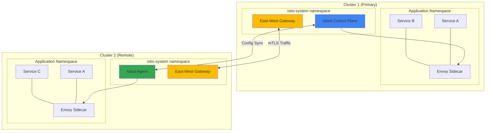
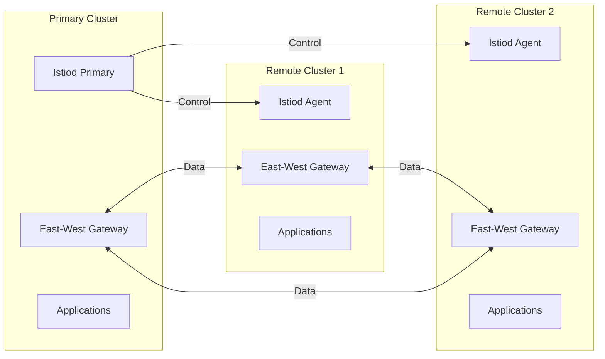
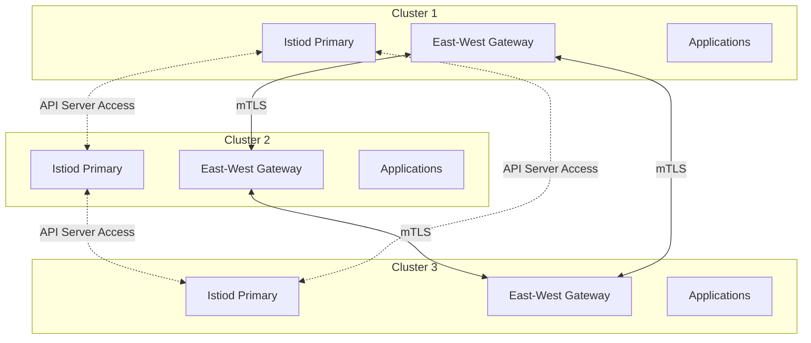
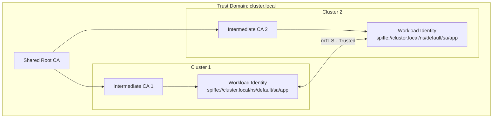
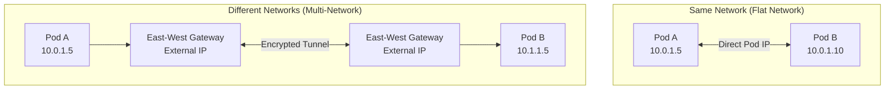
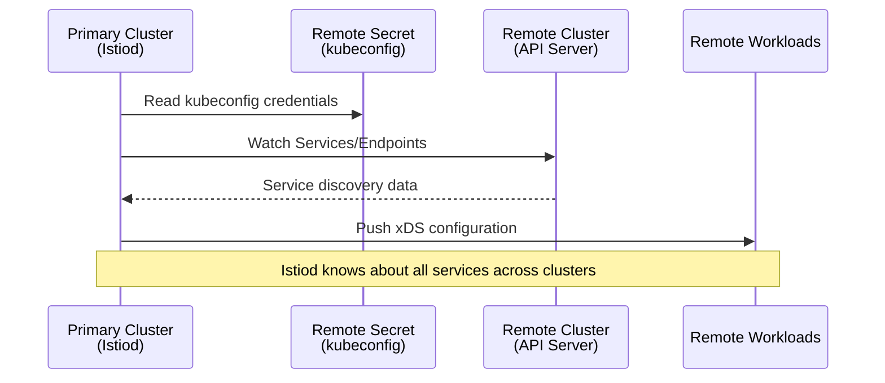
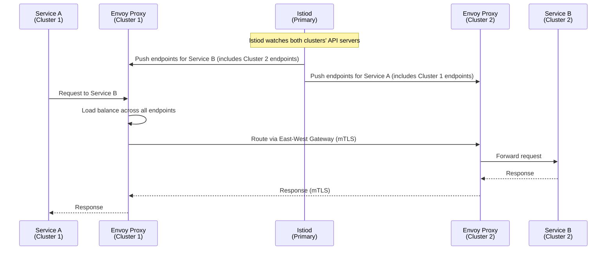
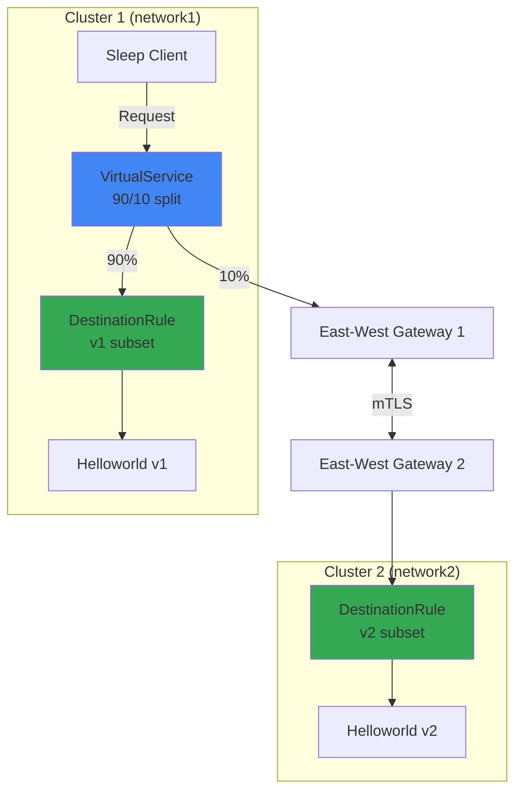
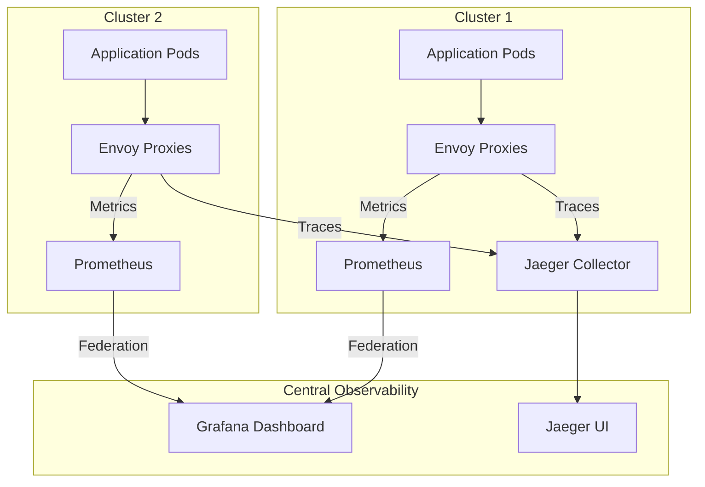

# How to Set Up Istio Multi-Cluster Service Mesh

Author: [nawazdhandala](https://github.com/nawazdhandala)

Tags: Istio, Multi-Cluster, Service Mesh, Kubernetes, Federation

Description: A guide to configuring Istio service mesh across multiple Kubernetes clusters.

---

## Introduction

As organizations scale their Kubernetes deployments across multiple clusters for high availability, disaster recovery, or geographic distribution, managing service-to-service communication becomes increasingly complex. Istio's multi-cluster service mesh provides a unified way to manage traffic, security, and observability across all your clusters.

This comprehensive guide will walk you through setting up an Istio multi-cluster service mesh, covering various deployment models, trust configuration, cross-cluster service discovery, and network topology considerations.

## Multi-Cluster Architecture Overview

Before diving into the setup, let's understand the key concepts and architectural patterns available in Istio multi-cluster deployments.

The following diagram illustrates a typical multi-cluster Istio deployment with shared control plane:



## Multi-Cluster Installation Models

Istio supports several multi-cluster deployment models. Understanding these models is crucial for choosing the right architecture for your needs.

### Model 1: Primary-Remote with Shared Control Plane

In this model, one cluster hosts the primary Istiod control plane, while remote clusters connect to it. This is simpler to manage but introduces a single point of failure.



### Model 2: Multi-Primary (Replicated Control Planes)

Each cluster runs its own Istiod instance, providing better fault isolation and lower latency for local configuration updates.



## Prerequisites

Before setting up multi-cluster Istio, ensure you have the following:

- Two or more Kubernetes clusters (version 1.25 or later recommended)
- kubectl configured to access all clusters
- Helm 3.x installed (optional, for Helm-based installation)
- Network connectivity between clusters (direct or via gateways)
- istioctl CLI tool installed

The following commands verify your prerequisites are met. Run these on your local machine:

```bash
# Check kubectl can access both clusters by listing their contexts
# This helps verify cluster connectivity before proceeding
kubectl config get-contexts

# Verify Kubernetes version on both clusters
# Istio requires Kubernetes 1.25+ for full feature support
kubectl --context=cluster1 version --short
kubectl --context=cluster2 version --short

# Download and install istioctl if not already installed
# We use version 1.20.0 which supports the latest multi-cluster features
curl -L https://istio.io/downloadIstio | ISTIO_VERSION=1.20.0 sh -
export PATH=$PWD/istio-1.20.0/bin:$PATH

# Verify istioctl installation
istioctl version --remote=false
```

## Step 1: Configure Trust Domain and Root Certificate

A shared root of trust is essential for secure cross-cluster communication. All clusters must trust certificates signed by the same root CA.

### Understanding Trust Domains

The trust domain defines the trust boundary for workload identities. The following diagram shows how trust domains work across clusters:



### Generate Root and Intermediate Certificates

Create a shared root CA and cluster-specific intermediate CAs. This ensures all clusters can verify each other's certificates:

```bash
# Create a directory structure for certificate management
# Organizing certificates properly is crucial for production deployments
mkdir -p certs
cd certs

# Generate the root CA certificate and private key
# This root CA will be the trust anchor for all clusters
# The 'make' command uses Istio's provided Makefile for certificate generation
make -f ../istio-1.20.0/tools/certs/Makefile.selfsigned.mk root-ca

# Generate intermediate CA for cluster1
# Each cluster gets its own intermediate CA for better security isolation
# If one intermediate CA is compromised, only that cluster is affected
make -f ../istio-1.20.0/tools/certs/Makefile.selfsigned.mk cluster1-cacerts

# Generate intermediate CA for cluster2
# Using the same root CA ensures cross-cluster trust
make -f ../istio-1.20.0/tools/certs/Makefile.selfsigned.mk cluster2-cacerts
```

### Create Certificate Secrets in Each Cluster

Deploy the CA certificates as Kubernetes secrets. Istio will use these for issuing workload certificates:

```bash
# Create the istio-system namespace in cluster1 if it doesn't exist
# The CA certificates must be in this namespace for Istiod to find them
kubectl --context=cluster1 create namespace istio-system

# Create the CA secret in cluster1 containing all required certificate files
# - ca-cert.pem: The intermediate CA certificate
# - ca-key.pem: The intermediate CA private key (keep this secure!)
# - root-cert.pem: The root CA certificate for chain validation
# - cert-chain.pem: Full certificate chain from root to intermediate
kubectl --context=cluster1 create secret generic cacerts -n istio-system \
  --from-file=cluster1/ca-cert.pem \
  --from-file=cluster1/ca-key.pem \
  --from-file=cluster1/root-cert.pem \
  --from-file=cluster1/cert-chain.pem

# Repeat the same process for cluster2
# Using the cluster2-specific intermediate CA certificates
kubectl --context=cluster2 create namespace istio-system

kubectl --context=cluster2 create secret generic cacerts -n istio-system \
  --from-file=cluster2/ca-cert.pem \
  --from-file=cluster2/ca-key.pem \
  --from-file=cluster2/root-cert.pem \
  --from-file=cluster2/cert-chain.pem
```

## Step 2: Configure Cluster Labels and Network Topology

Proper labeling helps Istio understand your cluster topology and make intelligent routing decisions.

### Label Cluster Networks

Apply network labels to identify cluster network topology. This is crucial for clusters on different networks:

```bash
# Label the istio-system namespace in cluster1 with network information
# The 'topology.istio.io/network' label identifies which network the cluster belongs to
# Clusters on the same network can communicate directly via Pod IPs
kubectl --context=cluster1 label namespace istio-system topology.istio.io/network=network1

# Label cluster2 with its network identifier
# If clusters are on different networks, traffic flows through east-west gateways
kubectl --context=cluster2 label namespace istio-system topology.istio.io/network=network2
```

### Understanding Network Topologies

The following diagram illustrates different network scenarios:



## Step 3: Install Istio on Primary Cluster

Now we'll install Istio with multi-cluster configuration on the primary cluster.

### Create the IstioOperator Configuration

This configuration file defines how Istio should be installed with multi-cluster support:

```yaml
# Save this as cluster1.yaml
# This IstioOperator resource configures Istio for multi-cluster primary mode
apiVersion: install.istio.io/v1alpha1
kind: IstioOperator
metadata:
  name: istio-primary
spec:
  # Use the default profile as a base, which includes common components
  profile: default

  # Global mesh configuration settings
  meshConfig:
    # Set the trust domain - this should be the same across all clusters
    # for workloads to trust each other's certificates
    trustDomain: cluster.local

    # Default proxy configuration applied to all sidecars
    defaultConfig:
      # Enable Prometheus metrics on the standard port
      proxyMetadata:
        ISTIO_META_DNS_CAPTURE: "true"  # Enable DNS capture for ServiceEntry
        ISTIO_META_DNS_AUTO_ALLOCATE: "true"  # Auto-allocate IPs for external services

  # Component-specific configuration
  components:
    # Configure the Pilot (Istiod) component for multi-cluster
    pilot:
      k8s:
        env:
          # Enable external Istiod mode for multi-cluster support
          - name: EXTERNAL_ISTIOD
            value: "true"
          # Specify this cluster's unique identifier
          - name: CLUSTER_ID
            value: "cluster1"

    # Configure the ingress gateway for external traffic
    ingressGateways:
      - name: istio-ingressgateway
        enabled: true

    # Configure the east-west gateway for cross-cluster traffic
    # This gateway handles mTLS traffic between clusters
    egressGateways:
      - name: istio-egressgateway
        enabled: false  # Disable egress gateway if not needed

  # Global values that affect multiple components
  values:
    global:
      # Unique identifier for this cluster in the mesh
      meshID: mesh1

      # Enable multi-cluster mode
      multiCluster:
        clusterName: cluster1

      # Network identifier for this cluster
      network: network1

      # Configure pilot discovery for multi-cluster
      pilot:
        # Enable config distribution to remote clusters
        enableK8SServiceDiscovery: true
```

### Install Istio on the Primary Cluster

Apply the configuration to install Istio on cluster1:

```bash
# Install Istio on cluster1 using the IstioOperator configuration
# The --context flag ensures we're installing on the correct cluster
istioctl install --context=cluster1 -f cluster1.yaml -y

# Verify the installation completed successfully
# All pods should be Running with Ready status
kubectl --context=cluster1 get pods -n istio-system

# Wait for all components to be ready before proceeding
# This command blocks until the deployment is complete
kubectl --context=cluster1 wait --for=condition=ready pod -l app=istiod -n istio-system --timeout=300s
```

## Step 4: Deploy East-West Gateway

The east-west gateway handles cross-cluster traffic, enabling communication between services in different clusters.

### Create East-West Gateway Configuration

The east-west gateway is specifically designed for inter-cluster communication:

```yaml
# Save this as eastwest-gateway.yaml
# This gateway exposes Istiod and enables cross-cluster mTLS traffic
apiVersion: install.istio.io/v1alpha1
kind: IstioOperator
metadata:
  name: eastwest-gateway
spec:
  # Use minimal profile - we only need the gateway component
  profile: empty

  components:
    ingressGateways:
      # Define the east-west gateway as a specialized ingress gateway
      - name: istio-eastwestgateway
        # Label helps identify this as an east-west gateway
        label:
          istio: eastwestgateway
          app: istio-eastwestgateway
          # Topology label identifies which network this gateway serves
          topology.istio.io/network: network1
        enabled: true
        k8s:
          # Environment variables configure the gateway behavior
          env:
            # Allow the gateway to be discovered by remote clusters
            - name: ISTIO_META_ROUTER_MODE
              value: "sni-dnat"
            # Specify which network this gateway serves
            - name: ISTIO_META_REQUESTED_NETWORK_VIEW
              value: network1

          # Service configuration for the gateway
          service:
            # Use LoadBalancer to get an external IP for cross-cluster access
            # In on-prem environments, you might use NodePort instead
            type: LoadBalancer
            ports:
              # Port for cross-cluster mTLS traffic (required)
              - name: tls
                port: 15443
                targetPort: 15443
              # Port for status (health checks)
              - name: status-port
                port: 15021
                targetPort: 15021
              # Port for Istiod discovery service (for remote clusters)
              - name: tls-istiod
                port: 15012
                targetPort: 15012
              # Port for webhook injection (for remote clusters)
              - name: tls-webhook
                port: 15017
                targetPort: 15017
```

### Install the East-West Gateway

Deploy the east-west gateway on the primary cluster:

```bash
# Install the east-west gateway on cluster1
# This creates a LoadBalancer service that remote clusters will connect to
istioctl install --context=cluster1 -f eastwest-gateway.yaml -y

# Verify the gateway pod is running
kubectl --context=cluster1 get pods -n istio-system -l app=istio-eastwestgateway

# Get the external IP of the east-west gateway
# This IP will be used by remote clusters to connect
# Note: It may take a few minutes for the LoadBalancer IP to be assigned
kubectl --context=cluster1 get svc istio-eastwestgateway -n istio-system
```

### Expose Services Through East-West Gateway

Create a Gateway resource to expose services for cross-cluster discovery:

```yaml
# Save this as expose-services.yaml
# This Gateway exposes all services in the mesh for cross-cluster access
apiVersion: networking.istio.io/v1beta1
kind: Gateway
metadata:
  name: cross-network-gateway
  namespace: istio-system
spec:
  # Select the east-west gateway to apply this configuration
  selector:
    istio: eastwestgateway
  servers:
    # Expose all services in the .local domain for cross-cluster access
    - port:
        number: 15443
        name: tls
        protocol: TLS
      # Match any service within the mesh
      hosts:
        - "*.local"
      tls:
        # AUTO_PASSTHROUGH mode lets Envoy route based on SNI
        # This means the gateway doesn't terminate TLS - it passes through
        mode: AUTO_PASSTHROUGH
---
# Expose Istiod for remote clusters to connect
# This allows remote cluster's Istio agents to get configuration
apiVersion: networking.istio.io/v1beta1
kind: Gateway
metadata:
  name: istiod-gateway
  namespace: istio-system
spec:
  selector:
    istio: eastwestgateway
  servers:
    # Port for xDS configuration distribution
    - port:
        number: 15012
        name: tls-istiod
        protocol: TLS
      hosts:
        - "*"
      tls:
        mode: AUTO_PASSTHROUGH
    # Port for webhook traffic (sidecar injection)
    - port:
        number: 15017
        name: tls-webhook
        protocol: TLS
      hosts:
        - "*"
      tls:
        mode: AUTO_PASSTHROUGH
```

Apply the gateway configurations:

```bash
# Apply the gateway configurations to expose services
# These gateways enable cross-cluster service discovery and communication
kubectl --context=cluster1 apply -f expose-services.yaml

# Verify the gateways are created
kubectl --context=cluster1 get gateways -n istio-system
```

## Step 5: Configure Remote Cluster Access

The primary cluster needs to access the remote cluster's API server for service discovery.

### Create Remote Cluster Secret

Generate a secret that allows the primary cluster to access the remote cluster's Kubernetes API:

```bash
# Create a secret in cluster1 that contains cluster2's kubeconfig
# This secret enables Istiod in cluster1 to watch services in cluster2
# The istioctl command extracts the necessary credentials and creates the secret
istioctl create-remote-secret \
    --context=cluster2 \
    --name=cluster2 | \
    kubectl apply -f - --context=cluster1

# Verify the secret was created
# The secret should contain the kubeconfig for accessing cluster2
kubectl --context=cluster1 get secrets -n istio-system -l istio/multiCluster=true
```

### Remote Secret Architecture

The following diagram shows how the remote secret enables cross-cluster discovery:



## Step 6: Install Istio on Remote Cluster

Now install Istio on the remote cluster, configuring it to connect to the primary cluster's control plane.

### Get Primary Cluster's East-West Gateway Address

First, retrieve the external address of the primary cluster's east-west gateway:

```bash
# Get the external IP or hostname of the east-west gateway
# This address is needed for the remote cluster to connect to Istiod
export DISCOVERY_ADDRESS=$(kubectl --context=cluster1 get svc istio-eastwestgateway \
    -n istio-system -o jsonpath='{.status.loadBalancer.ingress[0].ip}')

# If your cloud provider uses hostnames instead of IPs (like AWS ELB)
# use this command instead:
# export DISCOVERY_ADDRESS=$(kubectl --context=cluster1 get svc istio-eastwestgateway \
#     -n istio-system -o jsonpath='{.status.loadBalancer.ingress[0].hostname}')

# Verify the address was captured
echo "East-West Gateway Address: $DISCOVERY_ADDRESS"
```

### Create Remote Cluster IstioOperator Configuration

Configure Istio on the remote cluster to use the primary cluster's control plane:

```yaml
# Save this as cluster2.yaml
# This configuration sets up cluster2 as a remote cluster
apiVersion: install.istio.io/v1alpha1
kind: IstioOperator
metadata:
  name: istio-remote
spec:
  # Use the remote profile optimized for remote clusters
  # This profile doesn't install a full Istiod, just the agent
  profile: remote

  # Global values for the remote installation
  values:
    global:
      # Must match the primary cluster's mesh ID
      meshID: mesh1

      # Multi-cluster configuration
      multiCluster:
        # Unique cluster name for this remote cluster
        clusterName: cluster2

      # Network this cluster belongs to
      # Different from cluster1 if clusters are on separate networks
      network: network2

      # Point to the primary cluster's Istiod via east-west gateway
      # This is the external address obtained in the previous step
      remotePilotAddress: ${DISCOVERY_ADDRESS}

  # Mesh configuration must match the primary cluster
  meshConfig:
    trustDomain: cluster.local

  components:
    # Disable local Istiod - we'll use the primary's Istiod
    pilot:
      enabled: false

    # Enable the Istio CNI plugin if using it
    cni:
      enabled: false

    # Configure ingress gateway for this cluster
    ingressGateways:
      - name: istio-ingressgateway
        enabled: true
```

### Install Istio on the Remote Cluster

Deploy Istio on cluster2 with the remote configuration:

```bash
# Create the configuration file with the actual discovery address
# Using envsubst to substitute the environment variable
envsubst < cluster2.yaml > cluster2-configured.yaml

# Install Istio on cluster2
# This installs a minimal Istio configuration that connects to cluster1's Istiod
istioctl install --context=cluster2 -f cluster2-configured.yaml -y

# Verify the installation
# Note: You should see fewer pods than in cluster1 since Istiod runs remotely
kubectl --context=cluster2 get pods -n istio-system

# Check that the Istio agent can connect to the remote Istiod
kubectl --context=cluster2 logs -n istio-system -l app=istio-ingressgateway | grep -i "connected"
```

### Deploy East-West Gateway on Remote Cluster

The remote cluster also needs an east-west gateway for cross-cluster traffic:

```yaml
# Save this as eastwest-gateway-remote.yaml
# East-west gateway for cluster2
apiVersion: install.istio.io/v1alpha1
kind: IstioOperator
metadata:
  name: eastwest-gateway
spec:
  profile: empty

  components:
    ingressGateways:
      - name: istio-eastwestgateway
        label:
          istio: eastwestgateway
          app: istio-eastwestgateway
          # Note: This is network2, matching cluster2's network
          topology.istio.io/network: network2
        enabled: true
        k8s:
          env:
            - name: ISTIO_META_ROUTER_MODE
              value: "sni-dnat"
            - name: ISTIO_META_REQUESTED_NETWORK_VIEW
              value: network2
          service:
            type: LoadBalancer
            ports:
              - name: tls
                port: 15443
                targetPort: 15443
              - name: status-port
                port: 15021
                targetPort: 15021
```

Install and configure the east-west gateway on cluster2:

```bash
# Install the east-west gateway on cluster2
istioctl install --context=cluster2 -f eastwest-gateway-remote.yaml -y

# Expose services on cluster2 for cross-cluster access
kubectl --context=cluster2 apply -f expose-services.yaml

# Verify the gateway is running and has an external IP
kubectl --context=cluster2 get svc istio-eastwestgateway -n istio-system
```

## Step 7: Enable Cross-Cluster Service Discovery

With both clusters configured, services can now discover each other across cluster boundaries.

### Create Remote Secret for Bidirectional Discovery

For full bidirectional discovery, cluster2 needs access to cluster1's API server:

```bash
# Create a remote secret in cluster2 to access cluster1
# This enables services in cluster2 to discover services in cluster1
istioctl create-remote-secret \
    --context=cluster1 \
    --name=cluster1 | \
    kubectl apply -f - --context=cluster2

# Verify both clusters have remote secrets configured
echo "Cluster1 remote secrets:"
kubectl --context=cluster1 get secrets -n istio-system -l istio/multiCluster=true

echo "Cluster2 remote secrets:"
kubectl --context=cluster2 get secrets -n istio-system -l istio/multiCluster=true
```

### Service Discovery Flow

The following diagram illustrates how cross-cluster service discovery works:



## Step 8: Deploy a Sample Application

Let's deploy a sample application to verify cross-cluster communication works correctly.

### Deploy Sample Services

Deploy a simple application across both clusters to test the setup:

```yaml
# Save this as sample-app.yaml
# Simple HTTP echo service for testing cross-cluster communication
apiVersion: v1
kind: Namespace
metadata:
  name: sample
  labels:
    # Enable Istio sidecar injection in this namespace
    istio-injection: enabled
---
apiVersion: v1
kind: Service
metadata:
  name: helloworld
  namespace: sample
  labels:
    app: helloworld
spec:
  ports:
    - port: 5000
      name: http
  selector:
    app: helloworld
---
# Deployment for version 1 - will run in cluster1
apiVersion: apps/v1
kind: Deployment
metadata:
  name: helloworld-v1
  namespace: sample
spec:
  replicas: 1
  selector:
    matchLabels:
      app: helloworld
      version: v1
  template:
    metadata:
      labels:
        app: helloworld
        version: v1
    spec:
      containers:
        - name: helloworld
          image: docker.io/istio/examples-helloworld-v1
          ports:
            - containerPort: 5000
          resources:
            requests:
              cpu: "100m"
              memory: "128Mi"
```

Deploy the service to cluster1:

```bash
# Create the sample namespace and deploy v1 to cluster1
kubectl --context=cluster1 apply -f sample-app.yaml

# Verify the pod is running with the sidecar injected
# You should see 2/2 containers (app + istio-proxy)
kubectl --context=cluster1 get pods -n sample -l app=helloworld
```

Deploy a different version to cluster2:

```yaml
# Save this as sample-app-v2.yaml
# Version 2 of the helloworld service for cluster2
apiVersion: v1
kind: Namespace
metadata:
  name: sample
  labels:
    istio-injection: enabled
---
apiVersion: v1
kind: Service
metadata:
  name: helloworld
  namespace: sample
  labels:
    app: helloworld
spec:
  ports:
    - port: 5000
      name: http
  selector:
    app: helloworld
---
# Deployment for version 2 - will run in cluster2
apiVersion: apps/v1
kind: Deployment
metadata:
  name: helloworld-v2
  namespace: sample
spec:
  replicas: 1
  selector:
    matchLabels:
      app: helloworld
      version: v2
  template:
    metadata:
      labels:
        app: helloworld
        version: v2
    spec:
      containers:
        - name: helloworld
          # Different version to easily identify which cluster responds
          image: docker.io/istio/examples-helloworld-v2
          ports:
            - containerPort: 5000
          resources:
            requests:
              cpu: "100m"
              memory: "128Mi"
```

Deploy v2 to cluster2:

```bash
# Deploy v2 to cluster2
kubectl --context=cluster2 apply -f sample-app-v2.yaml

# Verify the pod is running
kubectl --context=cluster2 get pods -n sample -l app=helloworld
```

### Deploy Sleep Client for Testing

Deploy a sleep pod to make test requests:

```yaml
# Save this as sleep.yaml
# Sleep pod for making test requests to the helloworld service
apiVersion: v1
kind: ServiceAccount
metadata:
  name: sleep
  namespace: sample
---
apiVersion: apps/v1
kind: Deployment
metadata:
  name: sleep
  namespace: sample
spec:
  replicas: 1
  selector:
    matchLabels:
      app: sleep
  template:
    metadata:
      labels:
        app: sleep
    spec:
      serviceAccountName: sleep
      containers:
        - name: sleep
          image: curlimages/curl
          command: ["/bin/sleep", "infinity"]
          resources:
            requests:
              cpu: "10m"
              memory: "32Mi"
```

Deploy and test:

```bash
# Deploy sleep pod to cluster1
kubectl --context=cluster1 apply -f sleep.yaml

# Wait for the sleep pod to be ready
kubectl --context=cluster1 wait --for=condition=ready pod -l app=sleep -n sample --timeout=60s

# Make multiple requests to see load balancing across clusters
# You should see responses from both v1 (cluster1) and v2 (cluster2)
for i in {1..10}; do
  kubectl --context=cluster1 exec -n sample deploy/sleep -- curl -s helloworld.sample:5000/hello
  echo ""
done
```

## Step 9: Configure Traffic Management Across Clusters

Istio's traffic management features work seamlessly across clusters. Let's configure some common patterns.

### Locality-Aware Load Balancing

Configure traffic to prefer local cluster endpoints, falling back to remote clusters:

```yaml
# Save this as locality-lb.yaml
# DestinationRule that enables locality-aware load balancing
apiVersion: networking.istio.io/v1beta1
kind: DestinationRule
metadata:
  name: helloworld-locality
  namespace: sample
spec:
  # Apply to the helloworld service
  host: helloworld.sample.svc.cluster.local

  trafficPolicy:
    # Connection pool settings
    connectionPool:
      tcp:
        maxConnections: 100
      http:
        h2UpgradePolicy: UPGRADE
        http1MaxPendingRequests: 100
        http2MaxRequests: 1000

    # Outlier detection for automatic failover
    # If an endpoint fails, traffic shifts to healthy endpoints
    outlierDetection:
      # Scan for failed endpoints every 5 seconds
      interval: 5s
      # Consecutive errors before marking endpoint unhealthy
      consecutive5xxErrors: 3
      # How long to eject an unhealthy endpoint
      baseEjectionTime: 30s
      # Maximum percentage of endpoints that can be ejected
      maxEjectionPercent: 50

    # Locality load balancing settings
    loadBalancer:
      simple: ROUND_ROBIN
      localityLbSetting:
        enabled: true
        # Prefer local endpoints first, then distribute to other regions
        distribute:
          - from: "cluster1/*"
            to:
              # 80% of traffic stays in cluster1, 20% goes to cluster2
              "cluster1/*": 80
              "cluster2/*": 20
          - from: "cluster2/*"
            to:
              "cluster2/*": 80
              "cluster1/*": 20
```

Apply the locality-aware configuration:

```bash
# Apply the destination rule to both clusters
# Configuration is synced automatically in multi-cluster setup
kubectl --context=cluster1 apply -f locality-lb.yaml

# Verify the configuration is applied
kubectl --context=cluster1 get destinationrule -n sample
```

### Cross-Cluster Traffic Shifting

Implement canary deployments across clusters using traffic weights:

```yaml
# Save this as cross-cluster-canary.yaml
# VirtualService for gradual traffic shifting between clusters
apiVersion: networking.istio.io/v1beta1
kind: VirtualService
metadata:
  name: helloworld-canary
  namespace: sample
spec:
  # Apply to the helloworld service
  hosts:
    - helloworld.sample.svc.cluster.local

  http:
    - match:
        # Match all HTTP requests
        - uri:
            prefix: /
      route:
        # Route 90% to v1 (cluster1)
        - destination:
            host: helloworld.sample.svc.cluster.local
            subset: v1
          weight: 90
        # Route 10% to v2 (cluster2) for canary testing
        - destination:
            host: helloworld.sample.svc.cluster.local
            subset: v2
          weight: 10
---
# DestinationRule defining the subsets
apiVersion: networking.istio.io/v1beta1
kind: DestinationRule
metadata:
  name: helloworld-subsets
  namespace: sample
spec:
  host: helloworld.sample.svc.cluster.local

  # Define subsets based on version labels
  subsets:
    - name: v1
      labels:
        version: v1
    - name: v2
      labels:
        version: v2

  trafficPolicy:
    # Enable mTLS for all traffic
    tls:
      mode: ISTIO_MUTUAL
```

Apply and test the canary configuration:

```bash
# Apply the canary configuration
kubectl --context=cluster1 apply -f cross-cluster-canary.yaml

# Test the traffic distribution - you should see roughly 90/10 split
for i in {1..20}; do
  kubectl --context=cluster1 exec -n sample deploy/sleep -- curl -s helloworld.sample:5000/hello
done
```

### Traffic Flow Diagram with Policies



## Step 10: Configure Cross-Cluster Security

Securing cross-cluster communication is critical. Let's configure authentication and authorization policies.

### Enable Strict mTLS

Enforce mTLS for all cross-cluster traffic:

```yaml
# Save this as strict-mtls.yaml
# PeerAuthentication that enforces strict mTLS mesh-wide
apiVersion: security.istio.io/v1beta1
kind: PeerAuthentication
metadata:
  name: default
  # Apply to istio-system to make it mesh-wide default
  namespace: istio-system
spec:
  mtls:
    # STRICT mode requires valid mTLS certificates for all traffic
    # This ensures all cross-cluster traffic is encrypted and authenticated
    mode: STRICT
---
# DestinationRule that enables mTLS for all outbound traffic
apiVersion: networking.istio.io/v1beta1
kind: DestinationRule
metadata:
  name: default-mtls
  namespace: istio-system
spec:
  # Apply to all services in the mesh
  host: "*.local"
  trafficPolicy:
    tls:
      # ISTIO_MUTUAL uses Istio's built-in certificate management
      mode: ISTIO_MUTUAL
```

Apply the mTLS configuration:

```bash
# Apply strict mTLS to both clusters
kubectl --context=cluster1 apply -f strict-mtls.yaml
kubectl --context=cluster2 apply -f strict-mtls.yaml

# Verify mTLS is enabled by checking the proxy configuration
istioctl --context=cluster1 proxy-config secret deploy/helloworld-v1 -n sample

# Verify mTLS is being used for connections
istioctl --context=cluster1 analyze -n sample
```

### Authorization Policies Across Clusters

Create authorization policies that work across cluster boundaries:

```yaml
# Save this as cross-cluster-authz.yaml
# AuthorizationPolicy for fine-grained access control
apiVersion: security.istio.io/v1beta1
kind: AuthorizationPolicy
metadata:
  name: helloworld-policy
  namespace: sample
spec:
  # Apply to the helloworld workloads
  selector:
    matchLabels:
      app: helloworld

  # Only allow specified sources
  action: ALLOW
  rules:
    # Allow requests from the sleep service account
    - from:
        - source:
            # SPIFFE identity format includes the trust domain
            # This works across clusters because they share the same trust domain
            principals:
              - "cluster.local/ns/sample/sa/sleep"
      to:
        - operation:
            # Only allow GET requests to /hello path
            methods: ["GET"]
            paths: ["/hello"]
---
# Deny-all policy as a safety default
apiVersion: security.istio.io/v1beta1
kind: AuthorizationPolicy
metadata:
  name: deny-all
  namespace: sample
spec:
  # Empty spec denies all traffic by default
  # The allow policy above takes precedence for matching requests
  {}
```

Apply and test the authorization policies:

```bash
# Apply the authorization policies
kubectl --context=cluster1 apply -f cross-cluster-authz.yaml
kubectl --context=cluster2 apply -f cross-cluster-authz.yaml

# Test that authorized requests work
kubectl --context=cluster1 exec -n sample deploy/sleep -- curl -s helloworld.sample:5000/hello

# Test that unauthorized requests are blocked (POST instead of GET)
kubectl --context=cluster1 exec -n sample deploy/sleep -- curl -s -X POST helloworld.sample:5000/hello
# Should receive: RBAC: access denied
```

## Step 11: Observability Across Clusters

Unified observability is crucial for understanding system behavior across clusters.

### Configure Cross-Cluster Metrics

Set up Prometheus federation for cross-cluster metrics:

```yaml
# Save this as prometheus-federation.yaml
# ConfigMap for Prometheus federation configuration
apiVersion: v1
kind: ConfigMap
metadata:
  name: prometheus-federation-config
  namespace: istio-system
data:
  prometheus.yml: |
    global:
      scrape_interval: 15s
      evaluation_interval: 15s

    scrape_configs:
      # Scrape local Istio metrics
      - job_name: 'istio-mesh'
        kubernetes_sd_configs:
          - role: endpoints
            namespaces:
              names:
                - istio-system
        relabel_configs:
          - source_labels: [__meta_kubernetes_service_name]
            action: keep
            regex: istiod

      # Federate metrics from remote cluster's Prometheus
      - job_name: 'federation-cluster2'
        honor_labels: true
        metrics_path: '/federate'
        params:
          'match[]':
            - '{job="istio-mesh"}'
            - '{job="envoy-stats"}'
        static_configs:
          # Replace with your remote cluster's Prometheus endpoint
          - targets:
              - 'prometheus-cluster2.example.com:9090'
        # Add cluster label to distinguish metrics
        relabel_configs:
          - source_labels: []
            target_label: cluster
            replacement: 'cluster2'
```

### Configure Distributed Tracing

Set up Jaeger for cross-cluster distributed tracing:

```yaml
# Save this as jaeger-config.yaml
# Jaeger deployment for collecting traces from both clusters
apiVersion: apps/v1
kind: Deployment
metadata:
  name: jaeger
  namespace: istio-system
spec:
  replicas: 1
  selector:
    matchLabels:
      app: jaeger
  template:
    metadata:
      labels:
        app: jaeger
    spec:
      containers:
        - name: jaeger
          image: jaegertracing/all-in-one:1.50
          ports:
            - containerPort: 16686  # UI
            - containerPort: 14268  # Collector HTTP
            - containerPort: 14250  # Collector gRPC
          env:
            # Enable Elasticsearch storage for production
            # For demo, we use in-memory storage
            - name: COLLECTOR_ZIPKIN_HOST_PORT
              value: ":9411"
          resources:
            requests:
              cpu: "200m"
              memory: "256Mi"
---
apiVersion: v1
kind: Service
metadata:
  name: jaeger
  namespace: istio-system
spec:
  ports:
    - name: ui
      port: 16686
    - name: collector-http
      port: 14268
    - name: collector-grpc
      port: 14250
  selector:
    app: jaeger
```

Configure Istio to send traces to Jaeger:

```yaml
# Save this as telemetry-config.yaml
# Telemetry resource for configuring tracing
apiVersion: telemetry.istio.io/v1alpha1
kind: Telemetry
metadata:
  name: mesh-default
  namespace: istio-system
spec:
  # Configure tracing settings
  tracing:
    - providers:
        - name: jaeger
      # Sample 100% of traces for testing (reduce in production)
      randomSamplingPercentage: 100.0
      customTags:
        # Add cluster identifier to traces
        cluster:
          literal:
            value: "cluster1"
---
# Extension provider configuration (add to IstioOperator)
apiVersion: install.istio.io/v1alpha1
kind: IstioOperator
metadata:
  name: tracing-config
spec:
  meshConfig:
    enableTracing: true
    defaultConfig:
      tracing:
        sampling: 100.0
        zipkin:
          address: jaeger.istio-system:9411
    extensionProviders:
      - name: jaeger
        zipkin:
          service: jaeger.istio-system.svc.cluster.local
          port: 9411
```

Apply the observability configurations:

```bash
# Deploy Jaeger to the primary cluster
kubectl --context=cluster1 apply -f jaeger-config.yaml

# Apply telemetry configuration
kubectl --context=cluster1 apply -f telemetry-config.yaml

# Access Jaeger UI
kubectl --context=cluster1 port-forward svc/jaeger -n istio-system 16686:16686 &

# Generate some traffic to create traces
for i in {1..20}; do
  kubectl --context=cluster1 exec -n sample deploy/sleep -- curl -s helloworld.sample:5000/hello
done

# Open http://localhost:16686 in your browser to view traces
```

### Observability Architecture



## Step 12: Troubleshooting Multi-Cluster Issues

Common issues and their solutions when running multi-cluster Istio.

### Verify Cluster Connectivity

Check connectivity between clusters:

```bash
# Check if clusters can reach each other's east-west gateways
# Get cluster1's east-west gateway IP
export EW_GW1=$(kubectl --context=cluster1 get svc istio-eastwestgateway -n istio-system -o jsonpath='{.status.loadBalancer.ingress[0].ip}')

# Get cluster2's east-west gateway IP
export EW_GW2=$(kubectl --context=cluster2 get svc istio-eastwestgateway -n istio-system -o jsonpath='{.status.loadBalancer.ingress[0].ip}')

# Test connectivity from cluster1 to cluster2's gateway
kubectl --context=cluster1 run test-connectivity --rm -i --restart=Never --image=curlimages/curl -- curl -v https://$EW_GW2:15443 --insecure

# Check if Istiod can see remote cluster endpoints
istioctl --context=cluster1 proxy-config endpoints deploy/sleep -n sample | grep helloworld
```

### Debug Service Discovery

Troubleshoot cross-cluster service discovery issues:

```bash
# Check if remote secrets are properly configured
kubectl --context=cluster1 get secrets -n istio-system -l istio/multiCluster=true -o yaml

# Verify Istiod logs for multi-cluster events
kubectl --context=cluster1 logs -n istio-system deploy/istiod | grep -i "multicluster\|remote"

# Check endpoint discovery
# You should see endpoints from both clusters
istioctl --context=cluster1 proxy-config endpoints deploy/sleep -n sample --cluster "outbound|5000||helloworld.sample.svc.cluster.local"

# Analyze the mesh for configuration issues
istioctl analyze --context=cluster1 -A
istioctl analyze --context=cluster2 -A
```

### Common Issues and Solutions

```bash
# Issue: Remote endpoints not discovered
# Solution: Check remote secret and Istiod connectivity

# Verify remote secret contains valid kubeconfig
kubectl --context=cluster1 get secret -n istio-system -l istio/multiCluster=true -o jsonpath='{.items[0].data.cluster2}' | base64 -d

# Issue: mTLS handshake failing
# Solution: Verify CA certificates match

# Check certificate chain on both clusters
istioctl --context=cluster1 proxy-config secret deploy/helloworld-v1 -n sample -o json | jq '.dynamicActiveSecrets[0].secret.tlsCertificate.certificateChain'

istioctl --context=cluster2 proxy-config secret deploy/helloworld-v2 -n sample -o json | jq '.dynamicActiveSecrets[0].secret.tlsCertificate.certificateChain'

# Issue: Traffic not routing to remote cluster
# Solution: Check network labels and gateway configuration

# Verify network labels
kubectl --context=cluster1 get namespace istio-system -o jsonpath='{.metadata.labels}'
kubectl --context=cluster2 get namespace istio-system -o jsonpath='{.metadata.labels}'

# Check gateway configuration
kubectl --context=cluster1 get gateways -n istio-system -o yaml
```

## Production Considerations

When deploying multi-cluster Istio in production, consider the following:

### High Availability

Ensure control plane high availability across clusters:

```yaml
# Save this as ha-config.yaml
# IstioOperator configuration for high availability
apiVersion: install.istio.io/v1alpha1
kind: IstioOperator
metadata:
  name: istio-ha
spec:
  profile: default

  components:
    pilot:
      k8s:
        # Run multiple Istiod replicas for HA
        replicaCount: 3

        # Configure pod disruption budget
        podDisruptionBudget:
          minAvailable: 2

        # Spread pods across nodes and zones
        affinity:
          podAntiAffinity:
            preferredDuringSchedulingIgnoredDuringExecution:
              - weight: 100
                podAffinityTerm:
                  labelSelector:
                    matchLabels:
                      app: istiod
                  topologyKey: topology.kubernetes.io/zone

        # Resource requests for production
        resources:
          requests:
            cpu: "500m"
            memory: "2Gi"
          limits:
            cpu: "2"
            memory: "4Gi"

        # Horizontal Pod Autoscaler
        hpaSpec:
          minReplicas: 3
          maxReplicas: 10
          metrics:
            - type: Resource
              resource:
                name: cpu
                targetAverageUtilization: 80

  meshConfig:
    # Enable access logging for debugging
    accessLogFile: /dev/stdout
    accessLogEncoding: JSON

    # Configure default retry policy
    defaultConfig:
      proxyMetadata:
        ISTIO_META_DNS_CAPTURE: "true"
```

### Network Policies

Implement Kubernetes network policies for additional security:

```yaml
# Save this as network-policy.yaml
# NetworkPolicy to restrict traffic to east-west gateway
apiVersion: networking.k8s.io/v1
kind: NetworkPolicy
metadata:
  name: allow-eastwest-gateway
  namespace: istio-system
spec:
  podSelector:
    matchLabels:
      app: istio-eastwestgateway
  policyTypes:
    - Ingress
    - Egress
  ingress:
    # Allow inbound traffic on east-west gateway ports
    - ports:
        - port: 15443
          protocol: TCP
        - port: 15021
          protocol: TCP
        - port: 15012
          protocol: TCP
        - port: 15017
          protocol: TCP
  egress:
    # Allow outbound traffic to pods in the mesh
    - to:
        - namespaceSelector: {}
      ports:
        - protocol: TCP
```

### Resource Quotas

Set resource quotas for Istio components:

```yaml
# Save this as resource-quota.yaml
# ResourceQuota for istio-system namespace
apiVersion: v1
kind: ResourceQuota
metadata:
  name: istio-resource-quota
  namespace: istio-system
spec:
  hard:
    requests.cpu: "10"
    requests.memory: "20Gi"
    limits.cpu: "20"
    limits.memory: "40Gi"
    pods: "50"
---
# LimitRange for default container limits
apiVersion: v1
kind: LimitRange
metadata:
  name: istio-limit-range
  namespace: istio-system
spec:
  limits:
    - default:
        cpu: "1"
        memory: "1Gi"
      defaultRequest:
        cpu: "100m"
        memory: "128Mi"
      type: Container
```

## Conclusion

Setting up an Istio multi-cluster service mesh requires careful planning and configuration, but it provides powerful capabilities for managing microservices across multiple Kubernetes clusters. Key takeaways from this guide:

1. **Choose the Right Model**: Select between primary-remote or multi-primary based on your availability and latency requirements.

2. **Establish Shared Trust**: A common root CA is essential for secure cross-cluster communication.

3. **Configure Network Topology**: Properly label your clusters and networks to enable intelligent traffic routing.

4. **Deploy East-West Gateways**: These gateways are the backbone of cross-cluster communication.

5. **Enable Service Discovery**: Remote secrets allow Istiod to discover and manage services across clusters.

6. **Implement Security Policies**: Use PeerAuthentication and AuthorizationPolicy for end-to-end security.

7. **Set Up Unified Observability**: Federate metrics and centralize tracing for comprehensive visibility.

8. **Plan for Production**: Consider high availability, network policies, and resource management for production deployments.

By following this guide, you can build a robust multi-cluster service mesh that provides consistent traffic management, security, and observability across your entire Kubernetes infrastructure.

## Additional Resources

- [Istio Multi-Cluster Documentation](https://istio.io/latest/docs/setup/install/multicluster/)
- [Istio Security Best Practices](https://istio.io/latest/docs/ops/best-practices/security/)
- [Istio Performance and Scalability](https://istio.io/latest/docs/ops/deployment/performance-and-scalability/)
- [SPIFFE/SPIRE for Identity Federation](https://spiffe.io/)
