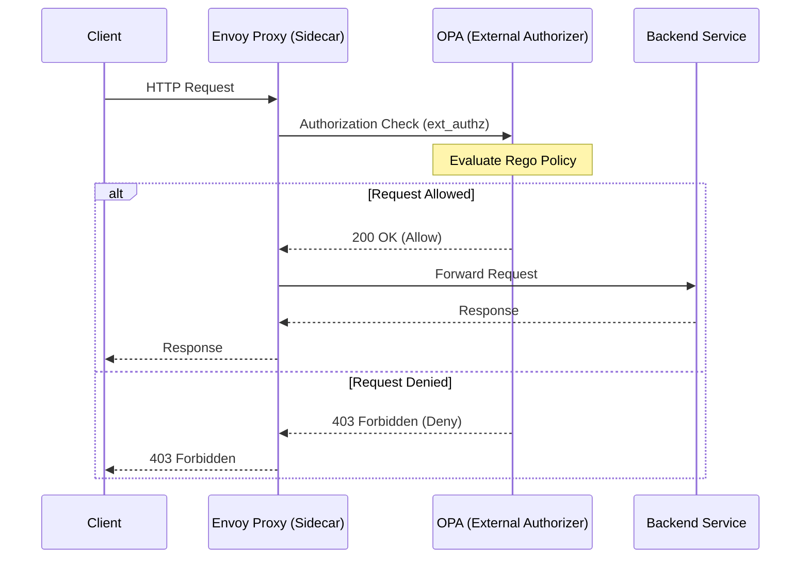
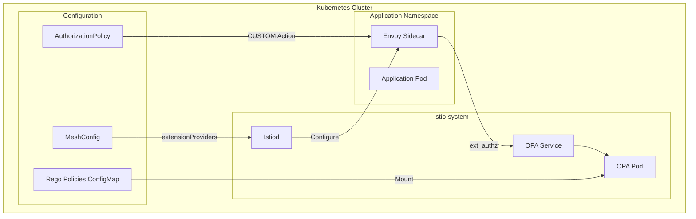
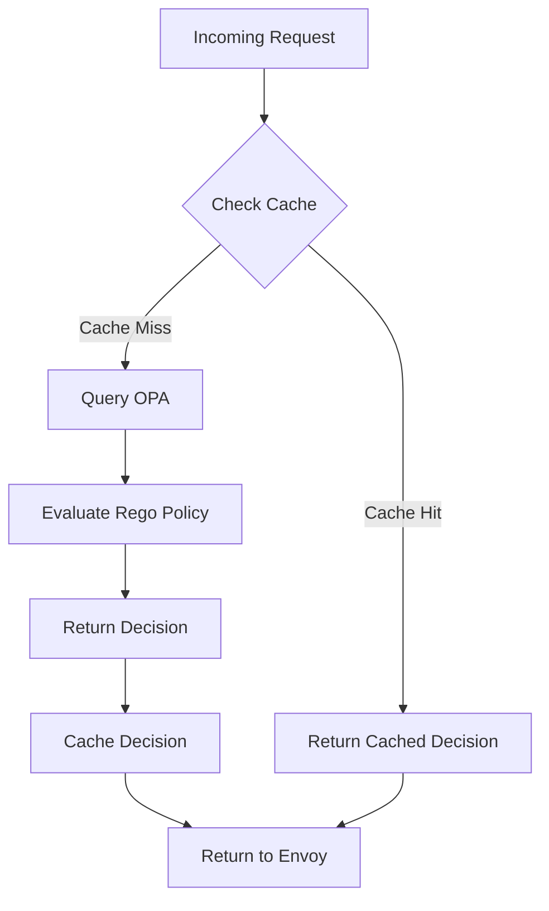

# How to Implement External Authorization with Istio and OPA

Author: [nawazdhandala](https://github.com/nawazdhandala)

Tags: Istio, OPA, Authorization, Security, Policy, Service Mesh

Description: A guide to implementing flexible authorization policies using Istio and Open Policy Agent.

---

External authorization is a critical component of modern microservices security. While Istio provides built-in authorization capabilities, complex policy requirements often demand a more flexible solution. Open Policy Agent (OPA) offers a powerful, decoupled approach to policy enforcement that integrates seamlessly with Istio's external authorization mechanism.

This guide walks you through implementing external authorization with Istio and OPA, from basic setup to advanced policy patterns.

## Understanding the Architecture

Before diving into implementation, let's understand how Istio and OPA work together to provide external authorization.

### Authorization Flow

The following diagram illustrates the request flow when using OPA as an external authorizer with Istio:



### Component Architecture

The architecture involves several key components working together:



## Prerequisites

Before starting, ensure you have:

- A Kubernetes cluster (1.25+)
- Istio installed (1.18+)
- kubectl configured
- Helm (optional, for OPA deployment)

## Step 1: Configure Istio Extension Provider

First, we need to configure Istio to recognize OPA as an external authorization provider. This is done through the mesh configuration.

The extensionProviders section in the mesh config tells Istio how to communicate with the external authorizer. We configure the service address, port, and timeout settings:

```yaml
# istio-mesh-config.yaml
# This ConfigMap patch adds OPA as an extension provider to Istio's mesh configuration.
# The extensionProvider defines how Envoy sidecars will communicate with OPA.
apiVersion: v1
kind: ConfigMap
metadata:
  name: istio
  namespace: istio-system
data:
  mesh: |
    # Define extension providers for external authorization
    extensionProviders:
    - name: "opa-ext-authz"
      envoyExtAuthzGrpc:
        # OPA service address within the cluster
        service: "opa.opa-system.svc.cluster.local"
        # gRPC port for the ext_authz API
        port: 9191
        # Timeout for authorization decisions
        timeout: 1s
        # Include request headers in authorization check
        includeRequestHeadersInCheck:
          - "authorization"
          - "x-request-id"
          - "x-forwarded-for"
        # Include additional metadata for policy decisions
        includeAdditionalHeadersInCheck:
          x-ext-authz: "enabled"
```

Apply the configuration by updating the Istio ConfigMap:

```bash
# Apply the mesh configuration update
# This will cause Istiod to push new configuration to all Envoy proxies
kubectl apply -f istio-mesh-config.yaml

# Alternatively, use istioctl to update mesh config
istioctl install --set meshConfig.extensionProviders[0].name=opa-ext-authz \
  --set meshConfig.extensionProviders[0].envoyExtAuthzGrpc.service=opa.opa-system.svc.cluster.local \
  --set meshConfig.extensionProviders[0].envoyExtAuthzGrpc.port=9191
```

## Step 2: Deploy OPA with Envoy Plugin

OPA needs to be deployed with the Envoy external authorization plugin enabled. This allows OPA to understand and respond to Envoy's ext_authz protocol.

First, create a namespace for OPA:

```bash
# Create a dedicated namespace for OPA
# This keeps the authorization infrastructure separate from application workloads
kubectl create namespace opa-system

# Label the namespace for Istio sidecar injection if needed
kubectl label namespace opa-system istio-injection=enabled
```

Now deploy OPA with the Envoy plugin. The deployment includes both the OPA server and the configuration for the Envoy gRPC plugin:

```yaml
# opa-deployment.yaml
# This deployment runs OPA with the envoy.ext_authz.grpc plugin enabled
# OPA will listen on port 9191 for authorization requests from Envoy
apiVersion: apps/v1
kind: Deployment
metadata:
  name: opa
  namespace: opa-system
  labels:
    app: opa
spec:
  replicas: 3  # Run multiple replicas for high availability
  selector:
    matchLabels:
      app: opa
  template:
    metadata:
      labels:
        app: opa
      annotations:
        # Disable Istio sidecar injection for OPA itself
        # This prevents circular dependency issues
        sidecar.istio.io/inject: "false"
    spec:
      containers:
      - name: opa
        image: openpolicyagent/opa:0.60.0-envoy
        args:
        - "run"
        - "--server"
        - "--addr=0.0.0.0:8181"           # REST API port for policy management
        - "--diagnostic-addr=0.0.0.0:8282" # Health check and metrics port
        - "--set=plugins.envoy_ext_authz_grpc.addr=:9191"  # Envoy ext_authz gRPC port
        - "--set=plugins.envoy_ext_authz_grpc.path=istio/authz/allow"  # Policy decision path
        - "--set=decision_logs.console=true"  # Log decisions for debugging
        - "--ignore=.*"                    # Ignore hidden files
        - "/policies"                      # Policy directory
        ports:
        - containerPort: 8181
          name: http
        - containerPort: 9191
          name: grpc
        - containerPort: 8282
          name: diagnostic
        # Liveness probe checks OPA health endpoint
        livenessProbe:
          httpGet:
            path: /health?plugins
            port: 8282
          initialDelaySeconds: 5
          periodSeconds: 10
        # Readiness probe ensures OPA is ready to accept requests
        readinessProbe:
          httpGet:
            path: /health?plugins
            port: 8282
          initialDelaySeconds: 5
          periodSeconds: 5
        resources:
          requests:
            cpu: 100m
            memory: 128Mi
          limits:
            cpu: 500m
            memory: 512Mi
        volumeMounts:
        # Mount policies from ConfigMap
        - name: policies
          mountPath: /policies
          readOnly: true
      volumes:
      - name: policies
        configMap:
          name: opa-policies
---
# Service to expose OPA within the cluster
# This is what Envoy sidecars will connect to for authorization
apiVersion: v1
kind: Service
metadata:
  name: opa
  namespace: opa-system
  labels:
    app: opa
spec:
  ports:
  - name: http
    port: 8181
    targetPort: 8181
  - name: grpc
    port: 9191
    targetPort: 9191
  selector:
    app: opa
```

## Step 3: Create Rego Policies

Rego is OPA's policy language. Let's create comprehensive policies for authorization. Policies are stored in a ConfigMap and mounted into the OPA pod.

### Basic Authorization Policy

This policy demonstrates fundamental authorization patterns including path-based access control and JWT validation:

```yaml
# opa-policies-configmap.yaml
# ConfigMap containing Rego policies for authorization
# Policies are evaluated for every request that matches the AuthorizationPolicy
apiVersion: v1
kind: ConfigMap
metadata:
  name: opa-policies
  namespace: opa-system
data:
  # Main authorization policy file
  policy.rego: |
    # Package name must match the path configured in OPA args
    # The path istio/authz/allow maps to this package
    package istio.authz

    import future.keywords.if
    import future.keywords.in

    # Default deny - all requests are denied unless explicitly allowed
    # This implements a secure-by-default pattern
    default allow := false

    # Main allow rule - this is evaluated by the ext_authz plugin
    # The rule returns true if any of the allow conditions are met
    allow if {
        # Allow health check endpoints without authentication
        is_health_check
    }

    allow if {
        # Allow requests with valid JWT tokens
        valid_jwt
        # And the user has required permissions
        has_permission
    }

    # Health check endpoints should always be accessible
    # This prevents authorization from breaking Kubernetes probes
    is_health_check if {
        input.attributes.request.http.path in ["/health", "/healthz", "/ready", "/readiness", "/live", "/liveness"]
    }

    # Extract and validate JWT token from Authorization header
    # Returns true if the token is present and valid
    valid_jwt if {
        # Get the Authorization header
        auth_header := input.attributes.request.http.headers.authorization

        # Extract the token (remove "Bearer " prefix)
        startswith(auth_header, "Bearer ")
        token := substring(auth_header, 7, -1)

        # Decode and verify JWT (simplified - in production use JWKS)
        # This example uses a symmetric key for demonstration
        [valid, _, payload] := io.jwt.decode_verify(token, {
            "secret": "your-jwt-secret-key",
            "alg": "HS256"
        })

        # Token must be valid
        valid == true

        # Store claims for later use
        claims := payload
    }

    # Check if user has permission for the requested resource
    # This implements role-based access control (RBAC)
    has_permission if {
        # Get user roles from JWT claims
        claims := get_claims
        roles := claims.roles

        # Get the HTTP method and path
        method := input.attributes.request.http.method
        path := input.attributes.request.http.path

        # Check if any role grants access
        some role in roles
        role_has_access(role, method, path)
    }

    # Helper function to extract claims from JWT
    get_claims := claims if {
        auth_header := input.attributes.request.http.headers.authorization
        token := substring(auth_header, 7, -1)
        [_, _, claims] := io.jwt.decode_verify(token, {
            "secret": "your-jwt-secret-key",
            "alg": "HS256"
        })
    }

    # Role-based access control rules
    # Define which roles can access which endpoints

    # Admin role has full access to all endpoints
    role_has_access("admin", _, _) := true

    # Users can read their own data
    role_has_access("user", "GET", path) if {
        startswith(path, "/api/users/")
    }

    # Users can update their own profile
    role_has_access("user", "PUT", path) if {
        startswith(path, "/api/users/me")
    }

    # Service accounts can access internal APIs
    role_has_access("service", method, path) if {
        startswith(path, "/internal/")
    }

    # Public endpoints - accessible by any authenticated user
    role_has_access(_, "GET", "/api/public") := true

  # Additional policy file for service-to-service authentication
  service-auth.rego: |
    package istio.authz

    import future.keywords.if
    import future.keywords.in

    # Allow service-to-service communication based on SPIFFE identity
    # Istio provides SPIFFE IDs through mTLS
    allow if {
        is_allowed_service
    }

    # Check if the calling service is in the allowed list
    is_allowed_service if {
        # Get the source principal from Istio's mTLS
        source := input.attributes.source.principal

        # Define allowed service-to-service communications
        allowed_pairs := {
            # Format: "source-service": ["allowed-target-1", "allowed-target-2"]
            "cluster.local/ns/frontend/sa/frontend-service": [
                "/api/products",
                "/api/cart",
                "/api/orders"
            ],
            "cluster.local/ns/orders/sa/order-service": [
                "/api/inventory",
                "/api/payments"
            ]
        }

        # Check if source is allowed to access the target path
        allowed_paths := allowed_pairs[source]
        path := input.attributes.request.http.path

        some allowed_path in allowed_paths
        startswith(path, allowed_path)
    }
```

### Advanced Policy: Attribute-Based Access Control (ABAC)

For more complex scenarios, implement attribute-based access control that considers multiple factors:

```yaml
# opa-abac-policy.yaml
# Advanced ABAC policy considering user attributes, resource attributes, and context
apiVersion: v1
kind: ConfigMap
metadata:
  name: opa-abac-policies
  namespace: opa-system
data:
  abac.rego: |
    package istio.authz

    import future.keywords.if
    import future.keywords.in

    # ABAC policy - considers user attributes, resource attributes, and environment
    allow if {
        # User must be authenticated
        user := get_user

        # Get the requested resource
        resource := get_resource

        # Get environmental context
        context := get_context

        # Evaluate ABAC policy
        evaluate_abac(user, resource, context)
    }

    # Extract user information from JWT and request headers
    get_user := user if {
        claims := get_claims
        user := {
            "id": claims.sub,
            "department": claims.department,
            "clearance_level": claims.clearance_level,
            "groups": claims.groups,
            "ip_address": input.attributes.source.address.socketAddress.address
        }
    }

    # Extract resource information from the request
    get_resource := resource if {
        resource := {
            "path": input.attributes.request.http.path,
            "method": input.attributes.request.http.method,
            "service": input.attributes.destination.service,
            # Extract resource ID from path if present
            "id": extract_resource_id(input.attributes.request.http.path)
        }
    }

    # Extract environmental context
    get_context := context if {
        context := {
            "time": time.now_ns(),
            "day_of_week": time.weekday(time.now_ns()),
            "is_business_hours": is_business_hours
        }
    }

    # Check if current time is within business hours (9 AM - 6 PM UTC)
    is_business_hours if {
        t := time.clock(time.now_ns())
        hour := t[0]
        hour >= 9
        hour < 18
    }

    # Main ABAC evaluation function
    # Returns true if all conditions are satisfied
    evaluate_abac(user, resource, context) if {
        # Rule 1: Clearance level check
        resource_clearance := get_resource_clearance(resource.path)
        user.clearance_level >= resource_clearance

        # Rule 2: Department access check
        department_allowed(user.department, resource.path)

        # Rule 3: Time-based access (certain resources only during business hours)
        time_access_allowed(resource.path, context)

        # Rule 4: IP-based restrictions
        ip_allowed(user.ip_address, resource.path)
    }

    # Define clearance levels for different resource paths
    # Higher number = higher clearance required
    get_resource_clearance(path) := 3 if {
        startswith(path, "/api/admin")
    }

    get_resource_clearance(path) := 2 if {
        startswith(path, "/api/internal")
    }

    get_resource_clearance(path) := 1 if {
        startswith(path, "/api/")
    }

    get_resource_clearance(_) := 0  # Default: no clearance required

    # Department access rules
    department_allowed("engineering", path) if {
        startswith(path, "/api/code")
    }

    department_allowed("finance", path) if {
        startswith(path, "/api/billing")
    }

    department_allowed("hr", path) if {
        startswith(path, "/api/employees")
    }

    # Allow all departments to access public endpoints
    department_allowed(_, path) if {
        startswith(path, "/api/public")
    }

    # Time-based access rules
    time_access_allowed(path, context) if {
        # Admin APIs only during business hours
        startswith(path, "/api/admin")
        context.is_business_hours
    }

    time_access_allowed(path, _) if {
        # Non-admin APIs always allowed
        not startswith(path, "/api/admin")
    }

    # IP-based restrictions
    ip_allowed(ip, path) if {
        startswith(path, "/api/admin")
        # Only allow admin access from internal IPs
        net.cidr_contains("10.0.0.0/8", ip)
    }

    ip_allowed(_, path) if {
        not startswith(path, "/api/admin")
    }

    # Helper to extract resource ID from path
    # Example: /api/users/123 -> "123"
    extract_resource_id(path) := id if {
        parts := split(path, "/")
        count(parts) >= 4
        id := parts[3]
    }

    extract_resource_id(_) := ""  # Default: no ID
```

## Step 4: Create AuthorizationPolicy with CUSTOM Action

Now we create an Istio AuthorizationPolicy that delegates authorization decisions to OPA. The CUSTOM action tells Istio to use an external authorizer.

```yaml
# authorization-policy.yaml
# This AuthorizationPolicy tells Istio to use OPA for authorization
# The CUSTOM action delegates the decision to the configured extension provider
apiVersion: security.istio.io/v1
kind: AuthorizationPolicy
metadata:
  name: opa-authz
  # Apply to a specific namespace
  # Use istio-system for mesh-wide policies
  namespace: default
spec:
  # Apply to all workloads in the namespace
  # You can use selector to target specific workloads
  selector:
    matchLabels:
      # Apply to workloads with this label
      authz: enabled
  # CUSTOM action delegates to external authorizer
  action: CUSTOM
  provider:
    # This must match the extensionProvider name in mesh config
    name: opa-ext-authz
  rules:
  - to:
    - operation:
        # Apply to all paths - OPA will make the decision
        paths: ["/*"]
        # Apply to all methods
        methods: ["GET", "POST", "PUT", "DELETE", "PATCH"]
---
# Alternative: Mesh-wide authorization policy
# This applies to all workloads across all namespaces
apiVersion: security.istio.io/v1
kind: AuthorizationPolicy
metadata:
  name: opa-authz-global
  namespace: istio-system
spec:
  # No selector means this applies to all workloads
  action: CUSTOM
  provider:
    name: opa-ext-authz
  rules:
  - to:
    - operation:
        # Exclude health check paths from external authorization
        # These are handled by OPA but you might want to skip entirely
        notPaths: ["/healthz", "/health", "/ready"]
    from:
    - source:
        # Apply to requests from any principal
        notPrincipals: ["cluster.local/ns/kube-system/sa/kube-controller-manager"]
```

For more granular control, you can create workload-specific policies:

```yaml
# workload-specific-authz.yaml
# AuthorizationPolicy for a specific microservice
apiVersion: security.istio.io/v1
kind: AuthorizationPolicy
metadata:
  name: orders-service-authz
  namespace: orders
spec:
  selector:
    matchLabels:
      app: orders-service
  action: CUSTOM
  provider:
    name: opa-ext-authz
  rules:
  # Rule 1: Protect order creation
  - to:
    - operation:
        methods: ["POST"]
        paths: ["/api/orders", "/api/orders/*"]
  # Rule 2: Protect order updates
  - to:
    - operation:
        methods: ["PUT", "PATCH"]
        paths: ["/api/orders/*"]
  # Rule 3: Protect order deletion
  - to:
    - operation:
        methods: ["DELETE"]
        paths: ["/api/orders/*"]
```

## Step 5: Testing the Setup

Let's verify that the external authorization is working correctly.

### Deploy a Test Application

First, deploy a simple test application to verify the setup:

```yaml
# test-app.yaml
# Simple test application with Istio sidecar and authorization enabled
apiVersion: apps/v1
kind: Deployment
metadata:
  name: httpbin
  namespace: default
  labels:
    app: httpbin
    # This label enables OPA authorization for this workload
    authz: enabled
spec:
  replicas: 1
  selector:
    matchLabels:
      app: httpbin
  template:
    metadata:
      labels:
        app: httpbin
        authz: enabled
    spec:
      containers:
      - name: httpbin
        image: docker.io/kennethreitz/httpbin
        ports:
        - containerPort: 80
---
apiVersion: v1
kind: Service
metadata:
  name: httpbin
  namespace: default
spec:
  ports:
  - port: 80
    name: http
  selector:
    app: httpbin
```

### Test Authorization

Run the following tests to verify the authorization is working:

```bash
# Create a test pod for sending requests
kubectl run test-pod --image=curlimages/curl --restart=Never --rm -it -- sh

# Test 1: Request without token (should be denied)
# Expected: 403 Forbidden
curl -v http://httpbin.default.svc.cluster.local/api/users

# Test 2: Request with invalid token (should be denied)
# Expected: 403 Forbidden
curl -v -H "Authorization: Bearer invalid-token" \
  http://httpbin.default.svc.cluster.local/api/users

# Test 3: Request with valid token (should be allowed)
# First, generate a valid JWT token
# You can use jwt.io or a script to generate tokens
TOKEN=$(cat <<EOF | base64 -w 0 | tr '+/' '-_' | tr -d '='
{
  "sub": "user123",
  "roles": ["user", "admin"],
  "department": "engineering",
  "clearance_level": 3,
  "exp": 9999999999
}
EOF
)

# Create a proper JWT (simplified for testing)
curl -v -H "Authorization: Bearer ${TOKEN}" \
  http://httpbin.default.svc.cluster.local/api/users

# Test 4: Health check endpoint (should always be allowed)
# Expected: 200 OK
curl -v http://httpbin.default.svc.cluster.local/health
```

### Check OPA Decision Logs

View OPA's decision logs to debug authorization issues:

```bash
# View OPA logs for decision debugging
# Look for "decision" entries that show policy evaluation results
kubectl logs -n opa-system deployment/opa -f | grep -E "(decision|allow|deny)"

# Query OPA directly for policy evaluation (useful for testing)
kubectl exec -n opa-system deployment/opa -- \
  curl -s localhost:8181/v1/data/istio/authz/allow \
  -d '{
    "input": {
      "attributes": {
        "request": {
          "http": {
            "method": "GET",
            "path": "/api/users",
            "headers": {
              "authorization": "Bearer test-token"
            }
          }
        }
      }
    }
  }'
```

## Performance Considerations

When implementing external authorization with OPA, consider these performance optimizations:

### Decision Flow with Caching



### 1. Enable Decision Caching

OPA supports caching authorization decisions to reduce latency:

```yaml
# opa-config.yaml
# OPA configuration with caching enabled
apiVersion: v1
kind: ConfigMap
metadata:
  name: opa-config
  namespace: opa-system
data:
  config.yaml: |
    # Enable decision caching
    # This caches authorization decisions based on input hash
    caching:
      inter_query_builtin_cache:
        max_size_bytes: 104857600  # 100MB cache

    # Configure decision logging
    decision_logs:
      console: true
      reporting:
        # Buffer decisions before sending
        buffer_size_limit_bytes: 10485760
        # Report every 5 seconds
        upload_size_limit_bytes: 5242880
        min_delay_seconds: 5
        max_delay_seconds: 10

    # Plugin configuration for Envoy
    plugins:
      envoy_ext_authz_grpc:
        addr: ":9191"
        path: "istio/authz/allow"
        # Enable dry-run mode for testing
        dry-run: false
        # Skip authorization for requests matching these paths
        skip-request-body-parse: false
```

### 2. Optimize Policy Evaluation

Write efficient Rego policies to minimize evaluation time:

```rego
# efficient-policy.rego
# Optimized policy with early termination and indexed lookups
package istio.authz

import future.keywords.if
import future.keywords.in

default allow := false

# Use early termination - check simple conditions first
allow if {
    # Fast path: health checks (no JWT parsing needed)
    is_health_check
}

allow if {
    # Fast path: public endpoints
    is_public_endpoint
}

allow if {
    # Slow path: full authentication and authorization
    valid_token
    authorized
}

# Simple string matching is fast
is_health_check if {
    input.attributes.request.http.path in {"/health", "/healthz", "/ready"}
}

is_public_endpoint if {
    startswith(input.attributes.request.http.path, "/public/")
}

# Use sets for O(1) lookup instead of arrays
allowed_methods := {"GET", "POST", "PUT", "DELETE"}

valid_method if {
    input.attributes.request.http.method in allowed_methods
}

# Pre-compute and index role mappings for fast lookup
role_permissions := {
    "admin": {
        "/api/users": {"GET", "POST", "PUT", "DELETE"},
        "/api/admin": {"GET", "POST", "PUT", "DELETE"}
    },
    "user": {
        "/api/users": {"GET"},
        "/api/profile": {"GET", "PUT"}
    }
}

authorized if {
    claims := get_claims
    some role in claims.roles

    # Use indexed lookup instead of iteration
    path_permissions := role_permissions[role][path_prefix]
    input.attributes.request.http.method in path_permissions
}

# Extract path prefix for permission lookup
path_prefix := prefix if {
    path := input.attributes.request.http.path
    parts := split(path, "/")
    prefix := concat("/", array.slice(parts, 0, 3))
}
```

### 3. Scale OPA Deployment

Configure OPA for high availability and performance:

```yaml
# opa-hpa.yaml
# Horizontal Pod Autoscaler for OPA
apiVersion: autoscaling/v2
kind: HorizontalPodAutoscaler
metadata:
  name: opa-hpa
  namespace: opa-system
spec:
  scaleTargetRef:
    apiVersion: apps/v1
    kind: Deployment
    name: opa
  minReplicas: 3
  maxReplicas: 10
  metrics:
  - type: Resource
    resource:
      name: cpu
      target:
        type: Utilization
        averageUtilization: 70
  - type: Resource
    resource:
      name: memory
      target:
        type: Utilization
        averageUtilization: 80
  behavior:
    scaleUp:
      stabilizationWindowSeconds: 30
      policies:
      - type: Pods
        value: 2
        periodSeconds: 60
    scaleDown:
      stabilizationWindowSeconds: 300
      policies:
      - type: Pods
        value: 1
        periodSeconds: 120
---
# Pod Disruption Budget for high availability
apiVersion: policy/v1
kind: PodDisruptionBudget
metadata:
  name: opa-pdb
  namespace: opa-system
spec:
  minAvailable: 2
  selector:
    matchLabels:
      app: opa
```

### 4. Monitor OPA Performance

Set up monitoring to track authorization performance:

```yaml
# opa-servicemonitor.yaml
# Prometheus ServiceMonitor for OPA metrics
apiVersion: monitoring.coreos.com/v1
kind: ServiceMonitor
metadata:
  name: opa
  namespace: opa-system
spec:
  selector:
    matchLabels:
      app: opa
  endpoints:
  - port: diagnostic
    path: /metrics
    interval: 15s
```

Key metrics to monitor:

| Metric | Description | Alert Threshold |
|--------|-------------|-----------------|
| `opa_http_request_duration_seconds` | Policy evaluation latency | > 100ms p99 |
| `opa_http_request_count_total` | Total authorization requests | Trend analysis |
| `opa_cache_hits_total` | Cache hit rate | < 80% hit rate |
| `envoy_ext_authz_denied` | Denied requests | Sudden spikes |

## Advanced Patterns

### Multi-Tenant Authorization

For multi-tenant applications, implement tenant isolation in your policies:

```rego
# multi-tenant.rego
# Policy for multi-tenant authorization
package istio.authz

import future.keywords.if
import future.keywords.in

default allow := false

allow if {
    valid_token
    tenant_authorized
    resource_authorized
}

# Extract tenant from JWT claims
get_tenant := tenant if {
    claims := get_claims
    tenant := claims.tenant_id
}

# Verify user belongs to the tenant in the request path
tenant_authorized if {
    user_tenant := get_tenant
    request_tenant := extract_tenant_from_path
    user_tenant == request_tenant
}

# Extract tenant ID from path: /api/tenants/{tenant_id}/...
extract_tenant_from_path := tenant if {
    path := input.attributes.request.http.path
    parts := split(path, "/")
    parts[2] == "tenants"
    tenant := parts[3]
}

# Tenant admins can access all tenant resources
resource_authorized if {
    claims := get_claims
    "tenant_admin" in claims.roles
}

# Regular users have limited access within their tenant
resource_authorized if {
    claims := get_claims
    "user" in claims.roles
    path := input.attributes.request.http.path

    # Users can only access specific resources
    allowed_user_paths := {"/profile", "/settings", "/data"}
    some allowed in allowed_user_paths
    contains(path, allowed)
}
```

### Integration with External Data Sources

OPA can fetch data from external sources for authorization decisions:

```rego
# external-data.rego
# Policy that integrates with external data sources
package istio.authz

import future.keywords.if

default allow := false

# Fetch user permissions from external API
# Note: This adds latency - use with caching
user_permissions := permissions if {
    user_id := get_claims.sub

    # HTTP request to permissions service
    response := http.send({
        "method": "GET",
        "url": sprintf("http://permissions-service.default.svc.cluster.local/api/users/%s/permissions", [user_id]),
        "headers": {
            "Content-Type": "application/json"
        },
        "timeout": "500ms",
        "cache": true,  # Cache responses
        "force_cache": true,
        "force_cache_duration_seconds": 300  # Cache for 5 minutes
    })

    response.status_code == 200
    permissions := response.body.permissions
}

allow if {
    valid_token
    required_permission := get_required_permission
    required_permission in user_permissions
}

# Map paths to required permissions
get_required_permission := "read:users" if {
    input.attributes.request.http.method == "GET"
    startswith(input.attributes.request.http.path, "/api/users")
}

get_required_permission := "write:users" if {
    input.attributes.request.http.method in {"POST", "PUT", "PATCH"}
    startswith(input.attributes.request.http.path, "/api/users")
}
```

## Troubleshooting

### Common Issues and Solutions

**Issue 1: Authorization Requests Timing Out**

If requests are timing out, check OPA connectivity and increase timeouts:

```yaml
# Increase timeout in mesh config
extensionProviders:
- name: "opa-ext-authz"
  envoyExtAuthzGrpc:
    service: "opa.opa-system.svc.cluster.local"
    port: 9191
    timeout: 5s  # Increase timeout
    failOpen: true  # Allow requests if OPA is unavailable
```

**Issue 2: All Requests Being Denied**

Debug by checking OPA decision logs:

```bash
# Check OPA logs
kubectl logs -n opa-system deployment/opa

# Test policy directly
kubectl exec -n opa-system deployment/opa -- \
  opa eval -d /policies -i /dev/stdin 'data.istio.authz.allow' <<EOF
{
  "attributes": {
    "request": {
      "http": {
        "method": "GET",
        "path": "/health",
        "headers": {}
      }
    }
  }
}
EOF
```

**Issue 3: OPA Not Receiving Requests**

Verify the AuthorizationPolicy and extension provider configuration:

```bash
# Check if AuthorizationPolicy is applied
kubectl get authorizationpolicy -A

# Verify Istio configuration
istioctl analyze

# Check Envoy configuration for ext_authz filter
istioctl proxy-config listeners <pod-name> -o json | grep ext_authz
```

## Summary

Implementing external authorization with Istio and OPA provides a powerful, flexible approach to securing your microservices. Key takeaways:

1. **Decoupled Authorization**: OPA separates policy from code, enabling dynamic policy updates without redeployment
2. **Rich Policy Language**: Rego allows expressing complex authorization logic including RBAC, ABAC, and custom patterns
3. **Performance Optimization**: Use caching, efficient policies, and horizontal scaling for production workloads
4. **Observability**: Monitor authorization decisions and latency to ensure reliability

By following this guide, you now have a production-ready external authorization system that can handle complex access control requirements while maintaining performance and reliability.

## Additional Resources

- [OPA Documentation](https://www.openpolicyagent.org/docs/)
- [Istio External Authorization](https://istio.io/latest/docs/tasks/security/authorization/authz-custom/)
- [Rego Policy Language](https://www.openpolicyagent.org/docs/latest/policy-language/)
- [OPA Envoy Plugin](https://www.openpolicyagent.org/docs/latest/envoy-introduction/)
