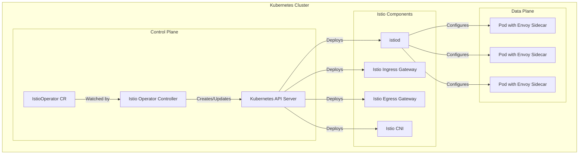
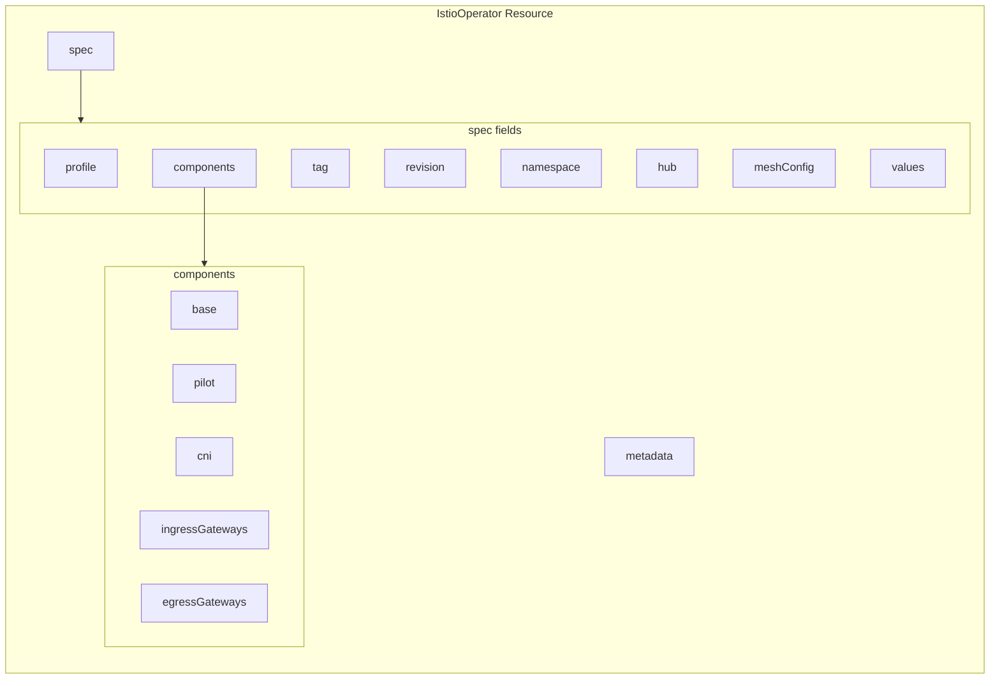
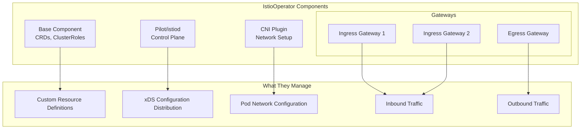
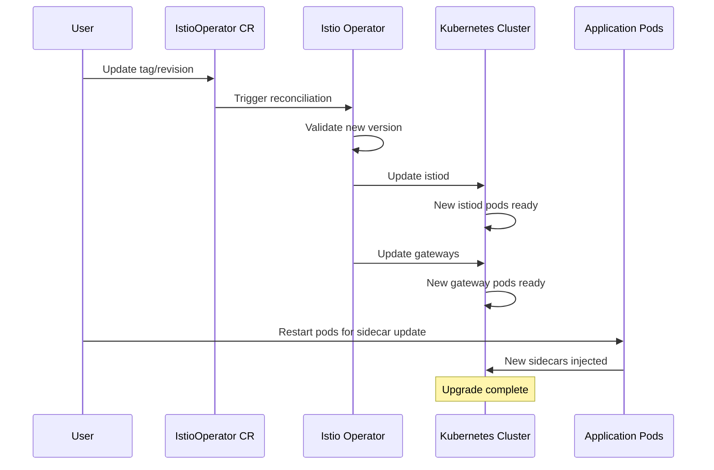

# How to Manage Istio with Istio Operator

Author: [nawazdhandala](https://github.com/nawazdhandala)

Tags: Istio, Operators, Kubernetes, Service Mesh, GitOps

Description: A guide to using Istio Operator for declarative Istio lifecycle management.

---

Managing Istio installations manually can become complex and error-prone, especially in production environments with multiple clusters. The Istio Operator provides a declarative approach to Istio lifecycle management, enabling you to install, configure, and upgrade Istio using Kubernetes custom resources. This guide covers everything you need to know about managing Istio with the Istio Operator.

## Table of Contents

1. [Understanding the Istio Operator](#understanding-the-istio-operator)
2. [Installing the Istio Operator](#installing-the-istio-operator)
3. [The IstioOperator Resource](#the-istiooperator-resource)
4. [Profile Customization](#profile-customization)
5. [Component Configuration](#component-configuration)
6. [Advanced Configuration](#advanced-configuration)
7. [Upgrading Istio with the Operator](#upgrading-istio-with-the-operator)
8. [GitOps Integration](#gitops-integration)
9. [Troubleshooting](#troubleshooting)
10. [Best Practices](#best-practices)

## Understanding the Istio Operator

The Istio Operator follows the Kubernetes Operator pattern, using a custom controller to manage Istio installations. Instead of running imperative `istioctl` commands, you define your desired Istio configuration in an `IstioOperator` custom resource, and the operator reconciles your cluster to match that specification.

The following diagram illustrates how the Istio Operator works:



### Key Benefits of Using the Istio Operator

- **Declarative Configuration**: Define your entire Istio installation as code
- **GitOps-Friendly**: Store configurations in version control and apply via CI/CD
- **Automatic Reconciliation**: The operator continuously ensures the actual state matches the desired state
- **Simplified Upgrades**: Update the version field and let the operator handle the rest
- **Consistent Environments**: Use the same configuration across development, staging, and production

## Installing the Istio Operator

Before installing the Istio Operator, ensure you have the following prerequisites:
- Kubernetes cluster (version 1.22 or later recommended)
- `kubectl` configured with cluster access
- `istioctl` CLI tool installed

### Method 1: Using istioctl

The simplest way to install the Istio Operator is using the `istioctl` command-line tool. This deploys the operator controller to your cluster:

```bash
# Install the Istio Operator controller into the istio-operator namespace
# This creates the operator deployment and necessary RBAC resources
istioctl operator init
```

You can customize the operator installation with additional flags:

```bash
# Install with a specific Istio version and custom namespace
# --watchedNamespaces limits which namespaces the operator monitors for IstioOperator resources
istioctl operator init \
  --tag 1.20.0 \
  --operatorNamespace istio-operator \
  --watchedNamespaces istio-system
```

### Method 2: Using Helm

For more control over the operator deployment, you can use Helm to install the operator:

```bash
# Add the Istio Helm repository
helm repo add istio https://istio-release.storage.googleapis.com/charts
helm repo update

# Install the Istio Operator using Helm
# This provides more customization options for the operator deployment itself
helm install istio-operator istio/operator \
  --namespace istio-operator \
  --create-namespace \
  --set watchedNamespaces="istio-system"
```

### Verifying the Installation

After installation, verify that the operator is running correctly:

```bash
# Check that the operator pod is running in the istio-operator namespace
kubectl get pods -n istio-operator

# Expected output:
# NAME                              READY   STATUS    RESTARTS   AGE
# istio-operator-7b8bdf9654-x2j9k   1/1     Running   0          2m
```

## The IstioOperator Resource

The `IstioOperator` custom resource (CR) is the heart of Istio management with the operator. It defines what Istio components to install and how they should be configured.

### Basic IstioOperator Structure

The following example shows a minimal IstioOperator resource that installs Istio with default settings:

```yaml
# Basic IstioOperator resource that installs Istio with the default profile
# The operator watches for this resource and reconciles the cluster accordingly
apiVersion: install.istio.io/v1alpha1
kind: IstioOperator
metadata:
  # Name of the IstioOperator resource - you can have multiple in different namespaces
  name: istio-control-plane
  # The namespace where Istio components will be installed
  namespace: istio-system
spec:
  # Istio version to install - should match your operator version
  tag: 1.20.0
  # Installation profile - determines which components are installed by default
  profile: default
```

Apply the resource to install Istio:

```bash
# Create the istio-system namespace if it doesn't exist
kubectl create namespace istio-system

# Apply the IstioOperator resource
# The operator will detect this and begin installing Istio components
kubectl apply -f istio-operator.yaml
```

### IstioOperator Resource Structure Diagram

The following diagram shows the complete structure of an IstioOperator resource:



## Profile Customization

Istio provides several installation profiles that serve as starting points for different use cases. Each profile enables a different set of components with pre-configured settings.

### Available Profiles

| Profile | Description | Use Case |
|---------|-------------|----------|
| `default` | Production-ready with ingress gateway | Most production deployments |
| `demo` | All features enabled for demonstration | Testing and learning |
| `minimal` | Only istiod, no gateways | Custom gateway deployments |
| `remote` | For multi-cluster remote clusters | Multi-cluster setups |
| `empty` | No components, base only | Complete custom builds |
| `preview` | Experimental features enabled | Testing new features |
| `ambient` | Ambient mesh mode | Sidecar-less deployments |

### Using the Demo Profile

The demo profile is ideal for testing and learning, as it installs all components with resource limits suitable for local development:

```yaml
# Demo profile configuration for testing and learning environments
# Includes all components with relaxed resource requirements
apiVersion: install.istio.io/v1alpha1
kind: IstioOperator
metadata:
  name: istio-demo
  namespace: istio-system
spec:
  # Demo profile enables ingress/egress gateways and additional features
  profile: demo
  # Use a specific Istio version for reproducibility
  tag: 1.20.0
```

### Using the Minimal Profile with Custom Gateways

The minimal profile is useful when you want to manage gateways separately or use a different gateway implementation:

```yaml
# Minimal profile with custom gateway configuration
# This gives you full control over gateway deployment
apiVersion: install.istio.io/v1alpha1
kind: IstioOperator
metadata:
  name: istio-minimal
  namespace: istio-system
spec:
  # Minimal profile only installs istiod
  profile: minimal
  tag: 1.20.0
  # Add a custom ingress gateway with specific configuration
  components:
    ingressGateways:
      # Define a custom ingress gateway instead of the default
      - name: custom-ingressgateway
        # Enable this gateway component
        enabled: true
        # Kubernetes-specific settings for the gateway deployment
        k8s:
          # Specify where to deploy the gateway
          nodeSelector:
            gateway: "true"
          # Resource allocation for the gateway pods
          resources:
            requests:
              cpu: 500m
              memory: 512Mi
            limits:
              cpu: 2000m
              memory: 1Gi
          # Service configuration for external access
          service:
            type: LoadBalancer
            ports:
              - port: 80
                targetPort: 8080
                name: http2
              - port: 443
                targetPort: 8443
                name: https
```

### Profile Comparison

You can compare profiles using `istioctl`:

```bash
# Show the difference between default and demo profiles
# This helps you understand what each profile enables
istioctl profile diff default demo

# Dump a specific profile to see all its settings
# Useful as a starting point for customization
istioctl profile dump default > default-profile.yaml
```

## Component Configuration

The Istio Operator allows fine-grained control over each Istio component. You can enable, disable, or customize any component in your installation.

### Component Architecture

The following diagram shows the relationship between Istio components managed by the operator:



### Configuring istiod (Pilot)

The istiod component is the core control plane. Here's how to customize it:

```yaml
# Comprehensive istiod configuration with production settings
apiVersion: install.istio.io/v1alpha1
kind: IstioOperator
metadata:
  name: istio-production
  namespace: istio-system
spec:
  profile: default
  tag: 1.20.0
  components:
    pilot:
      # Enable the pilot/istiod component
      enabled: true
      # Kubernetes-specific configuration
      k8s:
        # Deploy multiple replicas for high availability
        replicaCount: 3
        # Resource allocation - tune based on cluster size
        resources:
          requests:
            cpu: 500m
            memory: 2Gi
          limits:
            cpu: 2000m
            memory: 4Gi
        # Horizontal Pod Autoscaler configuration
        hpaSpec:
          minReplicas: 3
          maxReplicas: 10
          # Scale based on CPU utilization
          metrics:
            - type: Resource
              resource:
                name: cpu
                targetAverageUtilization: 80
        # Pod anti-affinity to spread across nodes
        affinity:
          podAntiAffinity:
            requiredDuringSchedulingIgnoredDuringExecution:
              - labelSelector:
                  matchLabels:
                    app: istiod
                topologyKey: kubernetes.io/hostname
        # Environment variables for istiod
        env:
          # Enable pilot debug logging for troubleshooting
          - name: PILOT_TRACE_SAMPLING
            value: "1"
          # Reduce push throttle for faster config propagation
          - name: PILOT_PUSH_THROTTLE
            value: "100"
```

### Configuring Multiple Ingress Gateways

In production environments, you often need multiple ingress gateways for different purposes:

```yaml
# Configuration with multiple ingress gateways for different traffic types
apiVersion: install.istio.io/v1alpha1
kind: IstioOperator
metadata:
  name: istio-multi-gateway
  namespace: istio-system
spec:
  profile: default
  tag: 1.20.0
  components:
    # Disable the default ingress gateway - we'll define our own
    ingressGateways:
      - name: istio-ingressgateway
        enabled: false

      # Public-facing gateway for external customer traffic
      - name: public-ingressgateway
        namespace: istio-system
        enabled: true
        label:
          # Custom labels for gateway selection in Gateway resources
          istio: public-ingressgateway
          app: public-ingressgateway
        k8s:
          # Deploy to dedicated gateway nodes
          nodeSelector:
            node-type: gateway
          # Use tolerations if gateway nodes are tainted
          tolerations:
            - key: "gateway"
              operator: "Equal"
              value: "true"
              effect: "NoSchedule"
          resources:
            requests:
              cpu: 1000m
              memory: 1Gi
            limits:
              cpu: 4000m
              memory: 4Gi
          # High availability with multiple replicas
          hpaSpec:
            minReplicas: 3
            maxReplicas: 20
          service:
            type: LoadBalancer
            # Annotations for cloud provider load balancer configuration
            annotations:
              service.beta.kubernetes.io/aws-load-balancer-type: "nlb"
              service.beta.kubernetes.io/aws-load-balancer-cross-zone-load-balancing-enabled: "true"

      # Internal gateway for service-to-service communication
      - name: internal-ingressgateway
        namespace: istio-system
        enabled: true
        label:
          istio: internal-ingressgateway
          app: internal-ingressgateway
        k8s:
          resources:
            requests:
              cpu: 500m
              memory: 512Mi
          service:
            # ClusterIP for internal-only access
            type: ClusterIP
```

### Configuring the Egress Gateway

Egress gateways control outbound traffic from your mesh:

```yaml
# Egress gateway configuration for controlling outbound traffic
apiVersion: install.istio.io/v1alpha1
kind: IstioOperator
metadata:
  name: istio-with-egress
  namespace: istio-system
spec:
  profile: default
  tag: 1.20.0
  components:
    egressGateways:
      # Enable the default egress gateway with custom configuration
      - name: istio-egressgateway
        enabled: true
        k8s:
          # Multiple replicas for high availability
          replicaCount: 2
          resources:
            requests:
              cpu: 200m
              memory: 256Mi
            limits:
              cpu: 1000m
              memory: 1Gi
          # Environment variables for egress-specific configuration
          env:
            # Enable access logging for egress traffic
            - name: ISTIO_META_ROUTER_MODE
              value: "sni-dnat"
```

### Enabling the CNI Plugin

The Istio CNI plugin eliminates the need for the `istio-init` container, improving security by not requiring elevated privileges:

```yaml
# Enable CNI plugin for improved security
apiVersion: install.istio.io/v1alpha1
kind: IstioOperator
metadata:
  name: istio-with-cni
  namespace: istio-system
spec:
  profile: default
  tag: 1.20.0
  components:
    # Enable the CNI component
    cni:
      enabled: true
      # CNI must be installed in kube-system or a privileged namespace
      namespace: kube-system
  # Configure CNI-specific values
  values:
    cni:
      # Exclude certain namespaces from CNI injection
      excludeNamespaces:
        - istio-system
        - kube-system
      # Log level for CNI plugin
      logLevel: info
```

## Advanced Configuration

### Mesh Configuration

The `meshConfig` section allows you to configure global mesh behavior:

```yaml
# Advanced mesh configuration with observability and security settings
apiVersion: install.istio.io/v1alpha1
kind: IstioOperator
metadata:
  name: istio-advanced
  namespace: istio-system
spec:
  profile: default
  tag: 1.20.0
  # Global mesh configuration
  meshConfig:
    # Enable access logging to stdout for all proxies
    accessLogFile: /dev/stdout
    # Access log format - JSON for easier parsing
    accessLogFormat: |
      {
        "start_time": "%START_TIME%",
        "method": "%REQ(:METHOD)%",
        "path": "%REQ(X-ENVOY-ORIGINAL-PATH?:PATH)%",
        "protocol": "%PROTOCOL%",
        "response_code": "%RESPONSE_CODE%",
        "response_flags": "%RESPONSE_FLAGS%",
        "upstream_host": "%UPSTREAM_HOST%",
        "duration": "%DURATION%"
      }
    # Enable access log encoding as JSON
    accessLogEncoding: JSON

    # Tracing configuration for distributed tracing
    enableTracing: true
    defaultConfig:
      # Trace sampling rate (1.0 = 100%)
      tracing:
        sampling: 10.0
        zipkin:
          address: zipkin.istio-system:9411
      # Proxy concurrency - 0 means use all available cores
      concurrency: 0
      # Hold application startup until proxy is ready
      holdApplicationUntilProxyStarts: true

    # Outbound traffic policy - REGISTRY_ONLY blocks unknown external services
    outboundTrafficPolicy:
      mode: REGISTRY_ONLY

    # Enable automatic mutual TLS
    enableAutoMtls: true

    # Default settings for proxy behavior
    defaultProviders:
      # Use multiple access log providers
      accessLogging:
        - envoy
```

### Custom Proxy Configuration

Customize the Envoy sidecar proxy behavior:

```yaml
# Custom proxy configuration for performance tuning
apiVersion: install.istio.io/v1alpha1
kind: IstioOperator
metadata:
  name: istio-proxy-tuned
  namespace: istio-system
spec:
  profile: default
  tag: 1.20.0
  meshConfig:
    defaultConfig:
      # Proxy concurrency matches available CPU cores
      concurrency: 2
      # Drain duration before proxy shutdown
      drainDuration: 45s
      # Termination drain duration
      terminationDrainDuration: 30s
      # Proxy protocol configuration
      proxyMetadata:
        # Enable DNS capture for better DNS resolution
        ISTIO_META_DNS_CAPTURE: "true"
        # Auto allocate service addresses for ServiceEntry
        ISTIO_META_DNS_AUTO_ALLOCATE: "true"

  # Values for proxy resources and configuration
  values:
    global:
      proxy:
        # Default resource allocation for sidecars
        resources:
          requests:
            cpu: 100m
            memory: 128Mi
          limits:
            cpu: 500m
            memory: 512Mi
        # Lifecycle hooks for graceful shutdown
        lifecycle:
          preStop:
            exec:
              command:
                - "/bin/sh"
                - "-c"
                - "sleep 15"
```

### Revision-Based Installation

Revisions enable canary deployments of Istio control plane:

```yaml
# Install Istio with a specific revision for canary upgrades
# This allows running multiple control plane versions simultaneously
apiVersion: install.istio.io/v1alpha1
kind: IstioOperator
metadata:
  name: istio-canary
  namespace: istio-system
spec:
  profile: default
  tag: 1.20.0
  # Revision creates a separate control plane instance
  # Namespaces can choose which revision to use via labels
  revision: 1-20-0
  components:
    pilot:
      enabled: true
      k8s:
        replicaCount: 2
```

To use a revision, label your namespace:

```bash
# Label namespace to use a specific Istio revision
# This determines which control plane version manages the namespace
kubectl label namespace my-app istio.io/rev=1-20-0

# Restart pods to get new sidecar version
kubectl rollout restart deployment -n my-app
```

## Upgrading Istio with the Operator

The Istio Operator simplifies upgrades by managing the entire process declaratively.

### Upgrade Workflow

The following diagram illustrates the upgrade process:



### In-Place Upgrade

For simple upgrades within the same minor version:

```yaml
# Update the tag to trigger an in-place upgrade
# The operator will update all components to the new version
apiVersion: install.istio.io/v1alpha1
kind: IstioOperator
metadata:
  name: istio-control-plane
  namespace: istio-system
spec:
  profile: default
  # Change version from 1.19.0 to 1.20.0
  tag: 1.20.0
  # Optionally update the hub for custom registries
  hub: docker.io/istio
```

Apply and monitor the upgrade:

```bash
# Apply the updated configuration
kubectl apply -f istio-operator.yaml

# Watch the upgrade progress
# The operator status shows the reconciliation state
kubectl get istiooperator -n istio-system -w

# Check component versions
istioctl version

# Verify all components are healthy
istioctl analyze
```

### Canary Upgrade with Revisions

For production environments, use revisions to perform canary upgrades:

```yaml
# Step 1: Install new revision alongside existing one
apiVersion: install.istio.io/v1alpha1
kind: IstioOperator
metadata:
  name: istio-1-20-0
  namespace: istio-system
spec:
  profile: default
  tag: 1.20.0
  # New revision runs alongside the old one
  revision: 1-20-0
  components:
    pilot:
      enabled: true
      k8s:
        replicaCount: 2
```

Migrate namespaces gradually:

```bash
# Check current revision usage
istioctl tag list

# Migrate a test namespace first
# Remove old label and add new revision label
kubectl label namespace test-app istio-injection- istio.io/rev=1-20-0 --overwrite

# Restart pods to get new sidecar
kubectl rollout restart deployment -n test-app

# Verify the new sidecar version
kubectl get pods -n test-app -o jsonpath='{.items[*].spec.containers[*].image}' | tr ' ' '\n' | grep proxy

# If successful, migrate remaining namespaces
for ns in staging production; do
  kubectl label namespace $ns istio-injection- istio.io/rev=1-20-0 --overwrite
  kubectl rollout restart deployment -n $ns
done
```

### Rollback Procedure

If issues occur, rollback by switching revisions:

```bash
# If issues occur with new revision, switch back to old revision
kubectl label namespace my-app istio.io/rev=1-19-0 --overwrite

# Restart pods to get old sidecar version
kubectl rollout restart deployment -n my-app

# Once all namespaces are migrated back, remove the new revision
kubectl delete istiooperator istio-1-20-0 -n istio-system
```

## GitOps Integration

The declarative nature of the Istio Operator makes it perfect for GitOps workflows.

### GitOps Workflow Diagram

```mermaid
flowchart LR
    subgraph "Developer Workflow"
        DEV[Developer]
        PR[Pull Request]
        REVIEW[Code Review]
    end

    subgraph "Git Repository"
        REPO[(Git Repo)]
        MAIN[main branch]
    end

    subgraph "GitOps Controller"
        ARGO[ArgoCD / Flux]
        SYNC[Sync Process]
    end

    subgraph "Kubernetes Cluster"
        IOP[IstioOperator CR]
        OPERATOR[Istio Operator]
        ISTIO[Istio Components]
    end

    DEV -->|Creates| PR
    PR -->|Approved| REVIEW
    REVIEW -->|Merges to| MAIN
    MAIN -->|Stored in| REPO
    REPO -->|Watched by| ARGO
    ARGO -->|Triggers| SYNC
    SYNC -->|Applies| IOP
    IOP -->|Reconciled by| OPERATOR
    OPERATOR -->|Manages| ISTIO
```



### ArgoCD Application

Define an ArgoCD Application to manage Istio:

```yaml
# ArgoCD Application for GitOps-managed Istio
# This syncs IstioOperator configuration from Git
apiVersion: argoproj.io/v1alpha1
kind: Application
metadata:
  name: istio
  namespace: argocd
  # Ensure ArgoCD doesn't prune Istio resources accidentally
  finalizers:
    - resources-finalizer.argocd.argoproj.io
spec:
  project: infrastructure
  source:
    # Git repository containing IstioOperator manifests
    repoURL: https://github.com/myorg/kubernetes-configs
    targetRevision: main
    path: clusters/production/istio
  destination:
    server: https://kubernetes.default.svc
    namespace: istio-system
  syncPolicy:
    automated:
      # Enable auto-pruning with caution for Istio
      prune: false
      selfHeal: true
    syncOptions:
      - CreateNamespace=true
      # Required for proper CRD handling
      - ServerSideApply=true
    retry:
      limit: 5
      backoff:
        duration: 5s
        factor: 2
        maxDuration: 3m
```

### Flux Kustomization

For Flux-based GitOps:

```yaml
# Flux Kustomization for Istio Operator management
apiVersion: kustomize.toolkit.fluxcd.io/v1
kind: Kustomization
metadata:
  name: istio-operator
  namespace: flux-system
spec:
  interval: 10m
  # Path to IstioOperator manifests in Git
  path: ./clusters/production/istio
  prune: true
  sourceRef:
    kind: GitRepository
    name: kubernetes-configs
  # Health checks to verify Istio is properly installed
  healthChecks:
    - apiVersion: apps/v1
      kind: Deployment
      name: istiod
      namespace: istio-system
  # Timeout for Istio installation/upgrade
  timeout: 10m
```

### Repository Structure

Organize your Istio configuration in Git:

```
kubernetes-configs/
├── base/
│   └── istio/
│       ├── kustomization.yaml
│       └── istio-operator.yaml      # Base configuration
├── clusters/
│   ├── development/
│   │   └── istio/
│   │       ├── kustomization.yaml
│   │       └── patches/
│   │           └── dev-resources.yaml  # Reduced resources
│   ├── staging/
│   │   └── istio/
│   │       ├── kustomization.yaml
│   │       └── patches/
│   │           └── staging-config.yaml
│   └── production/
│       └── istio/
│           ├── kustomization.yaml
│           └── patches/
│               ├── ha-config.yaml      # High availability
│               └── security.yaml       # Production security
```

Base Kustomization:

```yaml
# base/istio/kustomization.yaml
# Base Istio configuration shared across environments
apiVersion: kustomize.config.k8s.io/v1beta1
kind: Kustomization
resources:
  - istio-operator.yaml
```

Production overlay with patches:

```yaml
# clusters/production/istio/kustomization.yaml
# Production-specific Istio configuration
apiVersion: kustomize.config.k8s.io/v1beta1
kind: Kustomization
resources:
  - ../../../base/istio
patches:
  - path: patches/ha-config.yaml
  - path: patches/security.yaml
```

## Troubleshooting

### Common Issues and Solutions

#### Operator Not Reconciling

Check operator logs and status:

```bash
# View operator logs for errors
kubectl logs -n istio-operator -l name=istio-operator -f

# Check IstioOperator status
kubectl get istiooperator -n istio-system -o yaml

# Describe the IstioOperator resource for events
kubectl describe istiooperator -n istio-system
```

#### Stuck Installation

If installation seems stuck, check for validation issues:

```bash
# Validate the IstioOperator manifest before applying
istioctl validate -f istio-operator.yaml

# Check for any blocking conditions
kubectl get events -n istio-system --sort-by='.lastTimestamp'

# Verify CRDs are installed correctly
kubectl get crd | grep istio
```

#### Component Not Starting

Troubleshoot individual components:

```bash
# Check deployment status
kubectl get deployments -n istio-system

# View pod logs for a specific component
kubectl logs -n istio-system -l app=istiod -c discovery

# Check for resource constraints
kubectl describe pod -n istio-system -l app=istiod
```

### Debugging Commands

```bash
# Comprehensive mesh analysis
# This checks for configuration issues and best practices violations
istioctl analyze --all-namespaces

# Check proxy status for all pods in the mesh
istioctl proxy-status

# Dump Envoy configuration for debugging
istioctl proxy-config all <pod-name> -n <namespace>

# Verify mutual TLS configuration
istioctl authn tls-check <pod-name>.<namespace>

# Check the operator's view of the installation
kubectl get istiooperator -n istio-system -o jsonpath='{.items[*].status}'
```

## Best Practices

### Production Recommendations

1. **Always Use Revisions in Production**

   Revisions enable safe canary deployments and easy rollbacks:

   ```yaml
   # Always specify a revision in production
   spec:
     revision: stable-1-20
   ```

2. **Enable High Availability**

   ```yaml
   # HA configuration for production istiod
   components:
     pilot:
       k8s:
         replicaCount: 3
         affinity:
           podAntiAffinity:
             requiredDuringSchedulingIgnoredDuringExecution:
               - labelSelector:
                   matchLabels:
                     app: istiod
                 topologyKey: kubernetes.io/hostname
   ```

3. **Set Resource Limits**

   Always define resource requests and limits for all components to ensure predictable behavior:

   ```yaml
   k8s:
     resources:
       requests:
         cpu: 500m
         memory: 1Gi
       limits:
         cpu: 2000m
         memory: 4Gi
   ```

4. **Use Horizontal Pod Autoscaling**

   ```yaml
   k8s:
     hpaSpec:
       minReplicas: 3
       maxReplicas: 10
       metrics:
         - type: Resource
           resource:
             name: cpu
             targetAverageUtilization: 80
   ```

5. **Enable Access Logging**

   ```yaml
   meshConfig:
     accessLogFile: /dev/stdout
     accessLogEncoding: JSON
   ```

6. **Configure Proper Timeouts**

   ```yaml
   meshConfig:
     defaultConfig:
       drainDuration: 45s
       terminationDrainDuration: 30s
   ```

### Security Best Practices

```yaml
# Security-focused IstioOperator configuration
apiVersion: install.istio.io/v1alpha1
kind: IstioOperator
metadata:
  name: istio-secure
  namespace: istio-system
spec:
  profile: default
  tag: 1.20.0
  meshConfig:
    # Require explicit service entries for external traffic
    outboundTrafficPolicy:
      mode: REGISTRY_ONLY
    # Enable automatic mTLS
    enableAutoMtls: true
    defaultConfig:
      # Enable proxy protocol
      proxyMetadata:
        ISTIO_META_DNS_CAPTURE: "true"
  values:
    global:
      # Use distroless images for reduced attack surface
      proxy:
        image: proxyv2
      # Restrict pilot privileges
      pilotCertProvider: istiod
    # Enable strict peer authentication by default
    pilot:
      env:
        PILOT_ENABLE_CROSS_CLUSTER_WORKLOAD_ENTRY: "true"
```

## Conclusion

The Istio Operator provides a powerful, declarative approach to managing Istio installations. By leveraging the operator pattern, you can:

- Define your entire Istio configuration as code
- Integrate seamlessly with GitOps workflows
- Perform safe, canary-style upgrades using revisions
- Maintain consistent configurations across multiple environments

Key takeaways:

1. Use the `IstioOperator` custom resource to define your desired Istio state
2. Choose the appropriate profile as your starting point and customize from there
3. Configure components individually for fine-grained control
4. Use revisions for production upgrades to enable safe rollbacks
5. Integrate with GitOps tools like ArgoCD or Flux for automated deployments
6. Follow best practices for high availability, security, and resource management

With the Istio Operator, managing complex Istio deployments becomes more predictable, repeatable, and maintainable, allowing you to focus on your applications rather than infrastructure management.
