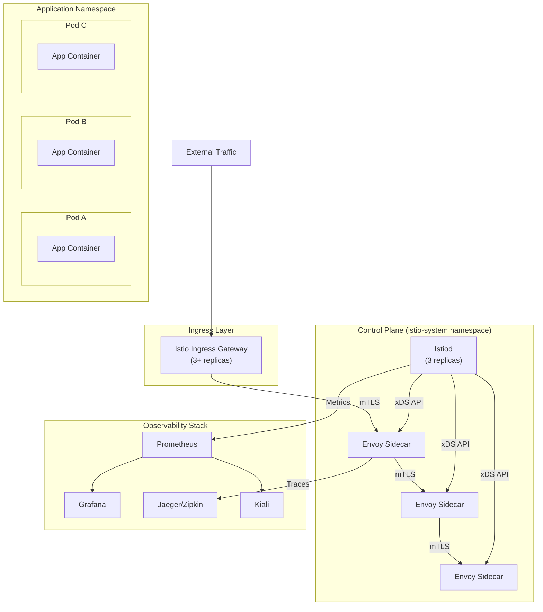
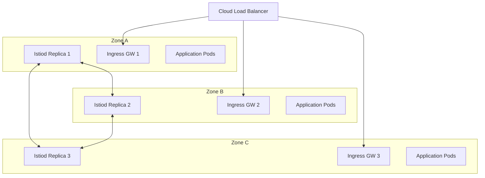
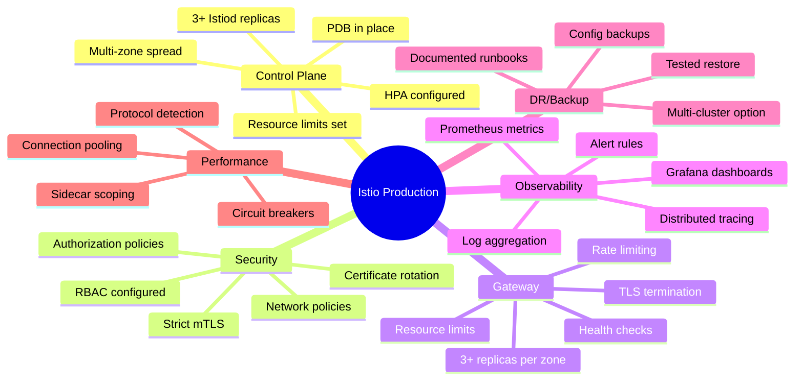

# How to Prepare Istio for Production Deployment

Author: [nawazdhandala](https://github.com/nawazdhandala)

Tags: Istio, Production, Best Practices, Service Mesh, Kubernetes

Description: A comprehensive checklist for deploying Istio in production environments.

---

Deploying Istio in a production environment requires careful planning, proper resource allocation, and robust security configurations. This comprehensive guide walks you through everything you need to consider before going live with Istio, from resource sizing to disaster recovery strategies.

## Table of Contents

1. [Production Architecture Overview](#production-architecture-overview)
2. [Pre-Deployment Checklist](#pre-deployment-checklist)
3. [Resource Sizing and Limits](#resource-sizing-and-limits)
4. [Security Hardening](#security-hardening)
5. [High Availability Configuration](#high-availability-configuration)
6. [Monitoring and Alerting Setup](#monitoring-and-alerting-setup)
7. [Backup and Disaster Recovery](#backup-and-disaster-recovery)
8. [Performance Tuning](#performance-tuning)
9. [Upgrade Strategy](#upgrade-strategy)
10. [Final Production Checklist](#final-production-checklist)

---

## Production Architecture Overview

Before diving into configurations, let's understand what a production-ready Istio deployment looks like.

The following diagram illustrates the high-level architecture of a production Istio deployment:



---

## Pre-Deployment Checklist

Before installing Istio in production, ensure the following prerequisites are met:

### Kubernetes Cluster Requirements

Verify your Kubernetes cluster meets the minimum requirements for running Istio in production:

```bash
# Check Kubernetes version (Istio 1.20+ requires Kubernetes 1.26+)
# This command verifies both client and server versions
kubectl version --short

# Verify cluster has sufficient nodes for HA deployment
# Production requires at least 3 worker nodes for proper distribution
kubectl get nodes -o wide

# Check available resources across the cluster
# Ensures you have enough CPU/memory headroom for Istio components
kubectl top nodes
```

### Namespace Preparation

Create and configure the Istio system namespace with proper labels:

```yaml
# istio-namespace.yaml
# This namespace will host all Istio control plane components
# The labels ensure proper resource management and identification
apiVersion: v1
kind: Namespace
metadata:
  name: istio-system
  labels:
    # Identifies this as an Istio system namespace
    istio-injection: disabled
    # Prevents injection into control plane pods
    name: istio-system
    # Pod security standards - privileged needed for CNI operations
    pod-security.kubernetes.io/enforce: privileged
    pod-security.kubernetes.io/audit: privileged
    pod-security.kubernetes.io/warn: privileged
```

---

## Resource Sizing and Limits

Proper resource allocation is critical for production stability. Under-provisioned components can cause cascading failures.

### Control Plane (Istiod) Resource Configuration

The following configuration provides production-grade resource limits for the Istiod control plane:

```yaml
# istio-production-values.yaml
# This IstioOperator configuration sets appropriate resource limits
# for a production environment handling 100-500 services
apiVersion: install.istio.io/v1alpha1
kind: IstioOperator
metadata:
  name: istio-production
  namespace: istio-system
spec:
  profile: default

  # Mesh-wide configuration settings
  meshConfig:
    # Enable access logging for debugging and auditing
    accessLogFile: /dev/stdout
    accessLogEncoding: JSON
    # Set default tracing sampling rate (1% for high-traffic production)
    defaultConfig:
      tracing:
        sampling: 1.0
    # Enable locality-aware load balancing for multi-zone deployments
    localityLbSetting:
      enabled: true

  components:
    # Pilot (Istiod) configuration with HA settings
    pilot:
      enabled: true
      k8s:
        # Run 3 replicas for high availability
        # Ensures control plane survives node failures
        replicaCount: 3

        # Resource requests and limits based on cluster size
        # These values are suitable for 100-500 services
        resources:
          requests:
            # Minimum CPU guaranteed for each replica
            cpu: 500m
            # Minimum memory guaranteed for each replica
            memory: 2Gi
          limits:
            # Maximum CPU each replica can use
            cpu: 2000m
            # Maximum memory - increase for larger clusters
            memory: 4Gi

        # Horizontal Pod Autoscaler configuration
        # Automatically scales based on CPU utilization
        hpaSpec:
          minReplicas: 3
          maxReplicas: 10
          metrics:
            - type: Resource
              resource:
                name: cpu
                target:
                  type: Utilization
                  # Scale up when average CPU exceeds 80%
                  averageUtilization: 80

        # Pod Disruption Budget ensures minimum availability during updates
        # At least 2 replicas must remain available during disruptions
        podDisruptionBudget:
          minAvailable: 2
          selector:
            matchLabels:
              app: istiod

        # Spread pods across nodes and zones for fault tolerance
        affinity:
          podAntiAffinity:
            # Prefer different nodes, but don't require it
            preferredDuringSchedulingIgnoredDuringExecution:
              - weight: 100
                podAffinityTerm:
                  labelSelector:
                    matchLabels:
                      app: istiod
                  topologyKey: kubernetes.io/hostname
              # Also prefer different availability zones
              - weight: 100
                podAffinityTerm:
                  labelSelector:
                    matchLabels:
                      app: istiod
                  topologyKey: topology.kubernetes.io/zone

        # Node selector for dedicated infrastructure nodes (optional)
        # Uncomment if you have dedicated nodes for infrastructure
        # nodeSelector:
        #   node-role.kubernetes.io/infra: "true"

        # Tolerations for tainted nodes
        tolerations:
          - key: "node-role.kubernetes.io/infra"
            operator: "Exists"
            effect: "NoSchedule"

    # Ingress Gateway configuration
    ingressGateways:
      - name: istio-ingressgateway
        enabled: true
        k8s:
          # Minimum 3 replicas for HA
          replicaCount: 3

          # Gateway typically needs more resources than control plane
          # as it handles all incoming traffic
          resources:
            requests:
              cpu: 1000m
              memory: 1Gi
            limits:
              cpu: 4000m
              memory: 4Gi

          # HPA for automatic scaling based on traffic
          hpaSpec:
            minReplicas: 3
            maxReplicas: 20
            metrics:
              - type: Resource
                resource:
                  name: cpu
                  target:
                    type: Utilization
                    averageUtilization: 70

          # Ensure gateway pods are spread across zones
          affinity:
            podAntiAffinity:
              requiredDuringSchedulingIgnoredDuringExecution:
                - labelSelector:
                    matchLabels:
                      app: istio-ingressgateway
                  topologyKey: topology.kubernetes.io/zone

          # Service configuration for external traffic
          service:
            type: LoadBalancer
            # Preserve client IP for proper logging and rate limiting
            externalTrafficPolicy: Local
            ports:
              - name: http2
                port: 80
                targetPort: 8080
              - name: https
                port: 443
                targetPort: 8443

    # Egress Gateway for controlled outbound traffic
    egressGateways:
      - name: istio-egressgateway
        enabled: true
        k8s:
          replicaCount: 2
          resources:
            requests:
              cpu: 500m
              memory: 512Mi
            limits:
              cpu: 2000m
              memory: 2Gi
```

### Sidecar Proxy Resource Configuration

Configure sidecar proxy resources at the mesh level with options for per-workload overrides:

```yaml
# sidecar-resources.yaml
# Global sidecar configuration applied to all injected pods
# Individual workloads can override these defaults using annotations
apiVersion: install.istio.io/v1alpha1
kind: IstioOperator
spec:
  meshConfig:
    defaultConfig:
      # Concurrency controls the number of worker threads
      # 0 = auto-detect based on CPU cores, recommended for production
      concurrency: 0

      # Proxy resource limits applied to all sidecars
      # These are conservative defaults suitable for most workloads
      proxyMetadata:
        # Enable DNS capture for better service discovery
        ISTIO_META_DNS_CAPTURE: "true"
        ISTIO_META_DNS_AUTO_ALLOCATE: "true"

  values:
    global:
      proxy:
        # Default resources for sidecar proxies
        resources:
          requests:
            # 100m is the minimum for stable operation
            cpu: 100m
            # 128Mi is minimum, increase for high-throughput services
            memory: 128Mi
          limits:
            # 2 cores is usually sufficient for most services
            cpu: 2000m
            # 1Gi handles most use cases
            memory: 1Gi

        # Lifecycle hooks for graceful shutdown
        # Ensures in-flight requests complete before termination
        lifecycle:
          preStop:
            exec:
              command:
                - "/bin/sh"
                - "-c"
                - "sleep 5"
```

Per-workload resource override example using annotations:

```yaml
# high-traffic-deployment.yaml
# Example deployment with custom sidecar resources
# Use these annotations to override global defaults for specific workloads
apiVersion: apps/v1
kind: Deployment
metadata:
  name: high-traffic-api
  namespace: production
spec:
  template:
    metadata:
      annotations:
        # Override proxy CPU requests for high-traffic service
        sidecar.istio.io/proxyCPU: "500m"
        sidecar.istio.io/proxyCPULimit: "4000m"
        # Override proxy memory for services with large headers/bodies
        sidecar.istio.io/proxyMemory: "512Mi"
        sidecar.istio.io/proxyMemoryLimit: "2Gi"
    spec:
      containers:
        - name: api
          # ... container spec
```

---

## Security Hardening

Security is paramount in production. The following configurations implement defense-in-depth principles.

### Enable Strict mTLS

Enforce mutual TLS across all service-to-service communication:

```yaml
# strict-mtls.yaml
# This PeerAuthentication policy enforces mTLS for all services
# Apply this after verifying all services can establish mTLS connections
apiVersion: security.istio.io/v1beta1
kind: PeerAuthentication
metadata:
  name: default
  # Apply to entire mesh by placing in istio-system namespace
  namespace: istio-system
spec:
  mtls:
    # STRICT mode rejects any non-mTLS traffic
    # Use PERMISSIVE during migration, then switch to STRICT
    mode: STRICT
---
# Corresponding DestinationRule to ensure clients use mTLS
# This complements the PeerAuthentication policy
apiVersion: networking.istio.io/v1beta1
kind: DestinationRule
metadata:
  name: default
  namespace: istio-system
spec:
  # Apply to all hosts in the mesh
  host: "*.local"
  trafficPolicy:
    tls:
      # ISTIO_MUTUAL uses Istio-provisioned certificates
      mode: ISTIO_MUTUAL
```

### Authorization Policies

Implement least-privilege access controls:

```yaml
# deny-all-default.yaml
# Default deny policy - blocks all traffic unless explicitly allowed
# This is the foundation of zero-trust networking
apiVersion: security.istio.io/v1beta1
kind: AuthorizationPolicy
metadata:
  name: deny-all
  namespace: production
spec:
  # Empty spec with no rules denies all traffic
  {}
---
# allow-frontend-to-backend.yaml
# Explicitly allow specific service-to-service communication
# Each allowed path should be documented and reviewed
apiVersion: security.istio.io/v1beta1
kind: AuthorizationPolicy
metadata:
  name: allow-frontend-to-api
  namespace: production
spec:
  # Apply this policy to the api-service workload
  selector:
    matchLabels:
      app: api-service
  action: ALLOW
  rules:
    - from:
        # Only allow traffic from the frontend service account
        - source:
            principals:
              - "cluster.local/ns/production/sa/frontend-service"
      to:
        # Restrict to specific HTTP methods and paths
        - operation:
            methods: ["GET", "POST"]
            paths: ["/api/v1/*"]
---
# allow-ingress-traffic.yaml
# Allow external traffic through the ingress gateway
apiVersion: security.istio.io/v1beta1
kind: AuthorizationPolicy
metadata:
  name: allow-ingress-gateway
  namespace: production
spec:
  selector:
    matchLabels:
      app: frontend
  action: ALLOW
  rules:
    - from:
        # Allow traffic from the ingress gateway's service account
        - source:
            principals:
              - "cluster.local/ns/istio-system/sa/istio-ingressgateway-service-account"
```

### Certificate Management

Configure automatic certificate rotation with proper lifetimes:

```yaml
# certificate-config.yaml
# Configure Istio's certificate authority settings
# These settings balance security with operational overhead
apiVersion: install.istio.io/v1alpha1
kind: IstioOperator
spec:
  meshConfig:
    # Certificate settings
    certificates:
      # Use kubernetes as the certificate signer
      - secretName: cacerts
        dnsNames:
          - "*.production.svc.cluster.local"

    defaultConfig:
      proxyMetadata:
        # Rotate certificates before expiry
        # 24h rotation for short-lived certificates
        PROXY_CONFIG_XDS_AGENT: "true"

  values:
    pilot:
      env:
        # Workload certificate TTL (default 24h)
        # Shorter TTLs are more secure but increase CA load
        PILOT_CERT_PROVIDER: "istiod"
        # Root CA certificate lifetime (10 years)
        # This should outlast your deployment lifecycle
        AUTO_RELOAD_PLUGIN_CERTS: "true"
---
# For production, use cert-manager for external CA integration
# This example shows integration with Let's Encrypt for gateway certs
apiVersion: cert-manager.io/v1
kind: Certificate
metadata:
  name: ingress-gateway-cert
  namespace: istio-system
spec:
  secretName: ingress-gateway-tls
  issuerRef:
    name: letsencrypt-prod
    kind: ClusterIssuer
  dnsNames:
    - "api.example.com"
    - "www.example.com"
  # Renew 30 days before expiry
  renewBefore: 720h
```

### Network Policies

Add Kubernetes Network Policies as an additional security layer:

```yaml
# network-policies.yaml
# These policies work alongside Istio's AuthorizationPolicies
# Providing defense-in-depth at the network level
apiVersion: networking.k8s.io/v1
kind: NetworkPolicy
metadata:
  name: deny-all-ingress
  namespace: production
spec:
  # Apply to all pods in the namespace
  podSelector: {}
  policyTypes:
    - Ingress
  # No ingress rules = deny all ingress
---
# Allow traffic from Istio sidecar proxies
apiVersion: networking.k8s.io/v1
kind: NetworkPolicy
metadata:
  name: allow-istio-mesh
  namespace: production
spec:
  podSelector: {}
  policyTypes:
    - Ingress
  ingress:
    # Allow traffic from within the same namespace (sidecar-to-sidecar)
    - from:
        - podSelector: {}
    # Allow traffic from istio-system (control plane)
    - from:
        - namespaceSelector:
            matchLabels:
              name: istio-system
```

---

## High Availability Configuration

Ensure your Istio deployment can survive component and zone failures.

### Multi-Zone Deployment Architecture



### Pod Topology Spread Constraints

Ensure even distribution across failure domains:

```yaml
# topology-spread.yaml
# These constraints ensure Istio components are spread across zones
# Prevents a single zone failure from taking down the service mesh
apiVersion: install.istio.io/v1alpha1
kind: IstioOperator
spec:
  components:
    pilot:
      k8s:
        # Spread istiod pods across availability zones
        topologySpreadConstraints:
          - maxSkew: 1
            topologyKey: topology.kubernetes.io/zone
            whenUnsatisfiable: DoNotSchedule
            labelSelector:
              matchLabels:
                app: istiod
          # Also spread across nodes within each zone
          - maxSkew: 1
            topologyKey: kubernetes.io/hostname
            whenUnsatisfiable: ScheduleAnyway
            labelSelector:
              matchLabels:
                app: istiod

    ingressGateways:
      - name: istio-ingressgateway
        k8s:
          topologySpreadConstraints:
            - maxSkew: 1
              topologyKey: topology.kubernetes.io/zone
              whenUnsatisfiable: DoNotSchedule
              labelSelector:
                matchLabels:
                  app: istio-ingressgateway
```

### Health Checks and Probes

Configure comprehensive health checks:

```yaml
# gateway-health-config.yaml
# Custom health check configuration for ingress gateway
# Ensures unhealthy instances are removed from load balancing
apiVersion: install.istio.io/v1alpha1
kind: IstioOperator
spec:
  components:
    ingressGateways:
      - name: istio-ingressgateway
        k8s:
          overlays:
            - kind: Deployment
              name: istio-ingressgateway
              patches:
                - path: spec.template.spec.containers[0].readinessProbe
                  value:
                    httpGet:
                      path: /healthz/ready
                      port: 15021
                    # Check every 5 seconds
                    periodSeconds: 5
                    # Wait 5 seconds before first check
                    initialDelaySeconds: 5
                    # Mark unhealthy after 3 consecutive failures
                    failureThreshold: 3
                - path: spec.template.spec.containers[0].livenessProbe
                  value:
                    httpGet:
                      path: /healthz/ready
                      port: 15021
                    periodSeconds: 15
                    initialDelaySeconds: 30
                    failureThreshold: 5
```

---

## Monitoring and Alerting Setup

Comprehensive observability is essential for production operations.

### Prometheus Configuration

Deploy Prometheus with Istio-specific scrape configurations:

```yaml
# prometheus-istio-config.yaml
# Prometheus configuration for scraping Istio metrics
# This provides visibility into mesh health and performance
apiVersion: v1
kind: ConfigMap
metadata:
  name: prometheus-config
  namespace: monitoring
data:
  prometheus.yml: |
    global:
      # Scrape every 15 seconds for near-real-time metrics
      scrape_interval: 15s
      evaluation_interval: 15s

    scrape_configs:
      # Scrape Istiod control plane metrics
      - job_name: 'istiod'
        kubernetes_sd_configs:
          - role: pod
            namespaces:
              names:
                - istio-system
        relabel_configs:
          - source_labels: [__meta_kubernetes_pod_label_app]
            regex: istiod
            action: keep
          - source_labels: [__meta_kubernetes_pod_container_port_number]
            regex: "15014"
            action: keep

      # Scrape Envoy sidecar metrics from all pods
      - job_name: 'envoy-stats'
        metrics_path: /stats/prometheus
        kubernetes_sd_configs:
          - role: pod
        relabel_configs:
          # Only scrape pods with Istio sidecar
          - source_labels: [__meta_kubernetes_pod_annotation_prometheus_io_scrape]
            regex: "true"
            action: keep
          - source_labels: [__meta_kubernetes_pod_container_port_name]
            regex: ".*-envoy-prom"
            action: keep

      # Scrape Istio ingress gateway metrics
      - job_name: 'istio-mesh'
        kubernetes_sd_configs:
          - role: endpoints
            namespaces:
              names:
                - istio-system
        relabel_configs:
          - source_labels: [__meta_kubernetes_service_name]
            regex: istio-ingressgateway
            action: keep
```

### Critical Alerting Rules

Define alerts for Istio-specific issues:

```yaml
# istio-alerts.yaml
# PrometheusRule for critical Istio alerts
# These alerts cover the most important failure scenarios
apiVersion: monitoring.coreos.com/v1
kind: PrometheusRule
metadata:
  name: istio-alerts
  namespace: monitoring
  labels:
    prometheus: main
spec:
  groups:
    - name: istio.control-plane
      rules:
        # Alert if Istiod has no running replicas
        - alert: IstiodDown
          expr: sum(up{job="istiod"}) == 0
          for: 2m
          labels:
            severity: critical
          annotations:
            summary: "Istio control plane is down"
            description: "All Istiod replicas are unavailable. Service mesh management is offline."
            runbook_url: "https://wiki.example.com/runbooks/istiod-down"

        # Alert if Istiod is degraded (not all replicas healthy)
        - alert: IstiodDegraded
          expr: sum(up{job="istiod"}) < 3
          for: 5m
          labels:
            severity: warning
          annotations:
            summary: "Istio control plane is degraded"
            description: "Only {{ $value }} Istiod replicas are healthy. Expected 3."

        # Alert on high push latency (configuration distribution delay)
        - alert: IstioPushLatencyHigh
          expr: histogram_quantile(0.99, sum(rate(pilot_proxy_convergence_time_bucket[5m])) by (le)) > 30
          for: 5m
          labels:
            severity: warning
          annotations:
            summary: "Istiod configuration push latency is high"
            description: "99th percentile push latency is {{ $value }}s. Check Istiod resources and xDS connections."

        # Alert on configuration rejection (indicates invalid config)
        - alert: IstioConfigRejections
          expr: sum(rate(pilot_xds_config_rejections_total[5m])) > 0
          for: 5m
          labels:
            severity: warning
          annotations:
            summary: "Istio configurations are being rejected"
            description: "Proxies are rejecting xDS updates. Check for invalid Istio resources."

    - name: istio.data-plane
      rules:
        # Alert on high sidecar 5xx error rate
        - alert: IstioHighErrorRate
          expr: |
            sum(rate(istio_requests_total{response_code=~"5.*"}[5m])) by (destination_service_name)
            /
            sum(rate(istio_requests_total[5m])) by (destination_service_name)
            > 0.05
          for: 5m
          labels:
            severity: warning
          annotations:
            summary: "High error rate for {{ $labels.destination_service_name }}"
            description: "Service {{ $labels.destination_service_name }} has {{ $value | humanizePercentage }} error rate."

        # Alert on high latency
        - alert: IstioHighLatency
          expr: |
            histogram_quantile(0.99,
              sum(rate(istio_request_duration_milliseconds_bucket[5m])) by (le, destination_service_name)
            ) > 1000
          for: 5m
          labels:
            severity: warning
          annotations:
            summary: "High latency for {{ $labels.destination_service_name }}"
            description: "99th percentile latency is {{ $value }}ms for {{ $labels.destination_service_name }}."

        # Alert on sidecar injection failures
        - alert: SidecarInjectionFailures
          expr: sum(rate(sidecar_injection_failure_total[5m])) > 0
          for: 5m
          labels:
            severity: warning
          annotations:
            summary: "Sidecar injection failures detected"
            description: "Pods are failing to get Istio sidecars injected."

    - name: istio.gateway
      rules:
        # Alert if ingress gateway is down
        - alert: IngressGatewayDown
          expr: sum(up{app="istio-ingressgateway"}) == 0
          for: 2m
          labels:
            severity: critical
          annotations:
            summary: "Istio Ingress Gateway is down"
            description: "All ingress gateway replicas are unavailable. External traffic cannot reach the mesh."

        # Alert on gateway connection saturation
        - alert: GatewayConnectionSaturation
          expr: |
            sum(envoy_server_total_connections{app="istio-ingressgateway"})
            /
            sum(envoy_server_concurrency{app="istio-ingressgateway"})
            > 1000
          for: 5m
          labels:
            severity: warning
          annotations:
            summary: "Ingress Gateway connection count is high"
            description: "Consider scaling the ingress gateway to handle connection load."
```

### Grafana Dashboards

Import essential Istio dashboards:

```yaml
# grafana-dashboards-configmap.yaml
# ConfigMap to provision Istio dashboards automatically
# These dashboards are maintained by the Istio project
apiVersion: v1
kind: ConfigMap
metadata:
  name: grafana-dashboard-provider
  namespace: monitoring
  labels:
    grafana_dashboard: "1"
data:
  istio-dashboards.yaml: |
    apiVersion: 1
    providers:
      - name: 'istio-dashboards'
        orgId: 1
        folder: 'Istio'
        type: file
        disableDeletion: false
        editable: true
        options:
          path: /var/lib/grafana/dashboards/istio
---
# Download official Istio dashboards using the following script
# Run this as part of your deployment pipeline
# Script to download Istio Grafana dashboards:
#
# ISTIO_VERSION="1.20.0"
# DASHBOARDS=(
#   "7630"   # Istio Mesh Dashboard
#   "7636"   # Istio Service Dashboard
#   "7639"   # Istio Workload Dashboard
#   "7645"   # Istio Control Plane Dashboard
#   "13277"  # Istio Wasm Extension Dashboard
# )
# for DASHBOARD_ID in "${DASHBOARDS[@]}"; do
#   curl -o "istio-dashboard-${DASHBOARD_ID}.json" \
#     "https://grafana.com/api/dashboards/${DASHBOARD_ID}/revisions/latest/download"
# done
```

### Distributed Tracing Setup

Configure Jaeger or Zipkin for request tracing:

```yaml
# jaeger-production.yaml
# Production Jaeger deployment with persistent storage
# This configuration uses Elasticsearch as the backend
apiVersion: jaegertracing.io/v1
kind: Jaeger
metadata:
  name: jaeger-production
  namespace: observability
spec:
  strategy: production

  collector:
    # Scale collectors based on trace volume
    replicas: 3
    resources:
      requests:
        cpu: 500m
        memory: 1Gi
      limits:
        cpu: 1000m
        memory: 2Gi
    options:
      # Adaptive sampling configuration
      sampling:
        initial-sampling-probability: 0.01

  storage:
    type: elasticsearch
    options:
      es:
        server-urls: https://elasticsearch:9200
        index-prefix: jaeger
        # Retain traces for 7 days
        max-span-age: 168h
    secretName: jaeger-es-secret

  query:
    replicas: 2
    resources:
      requests:
        cpu: 200m
        memory: 512Mi
---
# Configure Istio to send traces to Jaeger
# This is set in the IstioOperator configuration
apiVersion: install.istio.io/v1alpha1
kind: IstioOperator
spec:
  meshConfig:
    enableTracing: true
    defaultConfig:
      tracing:
        # 1% sampling for production - adjust based on traffic volume
        sampling: 1.0
        custom_tags:
          # Add custom tags for better trace filtering
          environment:
            literal:
              value: "production"
    extensionProviders:
      - name: jaeger
        opentelemetry:
          port: 4317
          service: jaeger-collector.observability.svc.cluster.local
```

---

## Backup and Disaster Recovery

Protect your Istio configuration and enable quick recovery.

### Configuration Backup Strategy

Create automated backups of all Istio custom resources:

```bash
#!/bin/bash
# istio-backup.sh
# Comprehensive backup script for Istio configuration
# Run this on a schedule (e.g., hourly) via CronJob

set -euo pipefail

BACKUP_DIR="/backups/istio/$(date +%Y%m%d-%H%M%S)"
mkdir -p "${BACKUP_DIR}"

echo "Starting Istio configuration backup to ${BACKUP_DIR}"

# List of Istio CRD types to backup
# These contain all your service mesh configuration
ISTIO_RESOURCES=(
    "virtualservices.networking.istio.io"
    "destinationrules.networking.istio.io"
    "gateways.networking.istio.io"
    "serviceentries.networking.istio.io"
    "sidecars.networking.istio.io"
    "envoyfilters.networking.istio.io"
    "workloadentries.networking.istio.io"
    "workloadgroups.networking.istio.io"
    "authorizationpolicies.security.istio.io"
    "peerauthentications.security.istio.io"
    "requestauthentications.security.istio.io"
    "telemetries.telemetry.istio.io"
    "wasmplugins.extensions.istio.io"
)

# Backup each resource type across all namespaces
for resource in "${ISTIO_RESOURCES[@]}"; do
    echo "Backing up ${resource}..."
    # Export resources without cluster-specific metadata
    kubectl get "${resource}" --all-namespaces -o yaml | \
        yq eval 'del(.items[].metadata.resourceVersion,
                     .items[].metadata.uid,
                     .items[].metadata.creationTimestamp,
                     .items[].metadata.generation,
                     .items[].metadata.managedFields)' - \
        > "${BACKUP_DIR}/${resource}.yaml" 2>/dev/null || true
done

# Backup IstioOperator configuration
echo "Backing up IstioOperator..."
kubectl get istiooperators -n istio-system -o yaml > "${BACKUP_DIR}/istiooperator.yaml" 2>/dev/null || true

# Backup any secrets needed for Istio (excluding certificates that rotate)
echo "Backing up Istio secrets..."
kubectl get secrets -n istio-system -l istio.io/config=true -o yaml \
    > "${BACKUP_DIR}/istio-secrets.yaml" 2>/dev/null || true

# Create a tarball for storage
tar -czf "${BACKUP_DIR}.tar.gz" -C "$(dirname ${BACKUP_DIR})" "$(basename ${BACKUP_DIR})"
rm -rf "${BACKUP_DIR}"

echo "Backup complete: ${BACKUP_DIR}.tar.gz"

# Optional: Upload to cloud storage
# aws s3 cp "${BACKUP_DIR}.tar.gz" "s3://your-backup-bucket/istio/"
# gsutil cp "${BACKUP_DIR}.tar.gz" "gs://your-backup-bucket/istio/"
```

Kubernetes CronJob for automated backups:

```yaml
# backup-cronjob.yaml
# Runs Istio configuration backup every hour
# Stores backups in a PersistentVolume
apiVersion: batch/v1
kind: CronJob
metadata:
  name: istio-backup
  namespace: istio-system
spec:
  # Run every hour
  schedule: "0 * * * *"
  concurrencyPolicy: Forbid
  successfulJobsHistoryLimit: 3
  failedJobsHistoryLimit: 3
  jobTemplate:
    spec:
      template:
        spec:
          serviceAccountName: istio-backup-sa
          containers:
            - name: backup
              image: bitnami/kubectl:latest
              command:
                - /bin/bash
                - /scripts/istio-backup.sh
              volumeMounts:
                - name: backup-scripts
                  mountPath: /scripts
                - name: backup-storage
                  mountPath: /backups
          volumes:
            - name: backup-scripts
              configMap:
                name: istio-backup-scripts
                defaultMode: 0755
            - name: backup-storage
              persistentVolumeClaim:
                claimName: istio-backup-pvc
          restartPolicy: OnFailure
---
# Service account with necessary permissions for backup
apiVersion: v1
kind: ServiceAccount
metadata:
  name: istio-backup-sa
  namespace: istio-system
---
apiVersion: rbac.authorization.k8s.io/v1
kind: ClusterRole
metadata:
  name: istio-backup-reader
rules:
  - apiGroups: ["networking.istio.io", "security.istio.io", "telemetry.istio.io", "extensions.istio.io", "install.istio.io"]
    resources: ["*"]
    verbs: ["get", "list"]
  - apiGroups: [""]
    resources: ["secrets"]
    verbs: ["get", "list"]
---
apiVersion: rbac.authorization.k8s.io/v1
kind: ClusterRoleBinding
metadata:
  name: istio-backup-reader-binding
roleRef:
  apiGroup: rbac.authorization.k8s.io
  kind: ClusterRole
  name: istio-backup-reader
subjects:
  - kind: ServiceAccount
    name: istio-backup-sa
    namespace: istio-system
```

### Disaster Recovery Procedures

Document and test your recovery procedures:

```bash
#!/bin/bash
# istio-restore.sh
# Restore Istio configuration from backup
# Use this script during disaster recovery

set -euo pipefail

BACKUP_FILE="${1:-}"

if [[ -z "${BACKUP_FILE}" ]]; then
    echo "Usage: $0 <backup-file.tar.gz>"
    exit 1
fi

RESTORE_DIR="/tmp/istio-restore-$(date +%s)"
mkdir -p "${RESTORE_DIR}"

echo "Extracting backup..."
tar -xzf "${BACKUP_FILE}" -C "${RESTORE_DIR}"
BACKUP_DIR=$(ls -d ${RESTORE_DIR}/*/)

echo "Verifying Istio control plane is healthy..."
kubectl wait --for=condition=ready pod -l app=istiod -n istio-system --timeout=300s

# Restore configuration in order of dependencies
# 1. First restore mesh-wide policies
echo "Restoring PeerAuthentication policies..."
kubectl apply -f "${BACKUP_DIR}/peerauthentications.security.istio.io.yaml" 2>/dev/null || true

# 2. Restore service entries (external services)
echo "Restoring ServiceEntries..."
kubectl apply -f "${BACKUP_DIR}/serviceentries.networking.istio.io.yaml" 2>/dev/null || true

# 3. Restore destination rules (load balancing, circuit breakers)
echo "Restoring DestinationRules..."
kubectl apply -f "${BACKUP_DIR}/destinationrules.networking.istio.io.yaml" 2>/dev/null || true

# 4. Restore virtual services (routing rules)
echo "Restoring VirtualServices..."
kubectl apply -f "${BACKUP_DIR}/virtualservices.networking.istio.io.yaml" 2>/dev/null || true

# 5. Restore gateways
echo "Restoring Gateways..."
kubectl apply -f "${BACKUP_DIR}/gateways.networking.istio.io.yaml" 2>/dev/null || true

# 6. Restore authorization policies
echo "Restoring AuthorizationPolicies..."
kubectl apply -f "${BACKUP_DIR}/authorizationpolicies.security.istio.io.yaml" 2>/dev/null || true

# 7. Restore remaining resources
for file in "${BACKUP_DIR}"/*.yaml; do
    filename=$(basename "$file")
    if [[ "$filename" != "peerauthentications"* ]] && \
       [[ "$filename" != "serviceentries"* ]] && \
       [[ "$filename" != "destinationrules"* ]] && \
       [[ "$filename" != "virtualservices"* ]] && \
       [[ "$filename" != "gateways"* ]] && \
       [[ "$filename" != "authorizationpolicies"* ]]; then
        echo "Restoring ${filename}..."
        kubectl apply -f "$file" 2>/dev/null || true
    fi
done

# Cleanup
rm -rf "${RESTORE_DIR}"

echo "Restore complete. Verifying configuration..."
istioctl analyze --all-namespaces

echo "Recovery completed successfully!"
```

### Multi-Cluster DR Configuration

For critical workloads, consider multi-cluster Istio:

```yaml
# multi-cluster-config.yaml
# Primary cluster configuration for multi-cluster mesh
# This enables cross-cluster service discovery and failover
apiVersion: install.istio.io/v1alpha1
kind: IstioOperator
metadata:
  name: istio-primary
spec:
  profile: default

  values:
    global:
      # Unique identifier for this cluster
      meshID: production-mesh
      multiCluster:
        clusterName: cluster-primary
      network: network-primary

  meshConfig:
    defaultConfig:
      proxyMetadata:
        # Enable multi-cluster service discovery
        ISTIO_META_DNS_CAPTURE: "true"
        ISTIO_META_DNS_AUTO_ALLOCATE: "true"
---
# Remote cluster secrets for cross-cluster communication
# Each cluster needs access to other clusters' API servers
apiVersion: v1
kind: Secret
metadata:
  name: istio-remote-secret-cluster-secondary
  namespace: istio-system
  labels:
    istio/multiCluster: "true"
  annotations:
    networking.istio.io/cluster: cluster-secondary
type: Opaque
data:
  # Base64 encoded kubeconfig for the secondary cluster
  cluster-secondary: <base64-encoded-kubeconfig>
```

---

## Performance Tuning

Optimize Istio for your specific workload patterns.

### Envoy Proxy Tuning

Fine-tune the Envoy proxy for better performance:

```yaml
# envoy-tuning.yaml
# Global Envoy configuration for performance optimization
# These settings apply to all sidecar proxies
apiVersion: networking.istio.io/v1alpha3
kind: EnvoyFilter
metadata:
  name: performance-tuning
  namespace: istio-system
spec:
  configPatches:
    # Increase connection limits for high-throughput services
    - applyTo: CLUSTER
      match:
        context: SIDECAR_OUTBOUND
      patch:
        operation: MERGE
        value:
          # Circuit breaker settings for better resilience
          circuit_breakers:
            thresholds:
              # Maximum concurrent connections to upstream
              - max_connections: 10000
                # Maximum pending requests when no connection available
                max_pending_requests: 10000
                # Maximum concurrent requests
                max_requests: 10000
                # Maximum retries across all requests
                max_retries: 3

          # Connection pool settings
          upstream_connection_options:
            tcp_keepalive:
              # Enable TCP keepalive probes
              keepalive_time: 300
              keepalive_interval: 30
              keepalive_probes: 5

    # HTTP/2 settings for better multiplexing
    - applyTo: CLUSTER
      match:
        context: SIDECAR_OUTBOUND
      patch:
        operation: MERGE
        value:
          http2_protocol_options:
            # Maximum concurrent streams per connection
            max_concurrent_streams: 1000
            # Initial stream window size
            initial_stream_window_size: 1048576
            # Initial connection window size
            initial_connection_window_size: 2097152
```

### Sidecar Scope Optimization

Reduce memory usage by limiting sidecar proxy configuration scope:

```yaml
# sidecar-scope.yaml
# Limit what each sidecar knows about
# This dramatically reduces memory usage and push time in large clusters
apiVersion: networking.istio.io/v1beta1
kind: Sidecar
metadata:
  name: default
  namespace: production
spec:
  # Apply to all workloads in this namespace
  workloadSelector:
    labels: {}

  egress:
    # Only include services that this namespace actually needs
    - hosts:
        # Allow traffic within the same namespace
        - "./*"
        # Allow traffic to specific external namespaces
        - "database/*"
        - "cache/*"
        # Allow traffic to the mesh-wide ingress gateway
        - "istio-system/istio-ingressgateway"

  # Reduce listener configuration
  outboundTrafficPolicy:
    # REGISTRY_ONLY blocks traffic to unknown services
    # More secure and reduces config size
    mode: REGISTRY_ONLY
---
# Per-workload sidecar for maximum optimization
# Use this for services with known, limited dependencies
apiVersion: networking.istio.io/v1beta1
kind: Sidecar
metadata:
  name: frontend-sidecar
  namespace: production
spec:
  workloadSelector:
    labels:
      app: frontend
  egress:
    - hosts:
        # Frontend only talks to API and cache
        - "./api-service.production.svc.cluster.local"
        - "cache/redis-master.cache.svc.cluster.local"
```

### Protocol Detection Optimization

Explicitly declare protocols to avoid detection overhead:

```yaml
# service-with-protocol.yaml
# Explicitly set protocol to skip protocol detection
# This reduces latency for the first request to each service
apiVersion: v1
kind: Service
metadata:
  name: api-service
  namespace: production
spec:
  ports:
    # Use 'appProtocol' (Kubernetes 1.20+) or port naming convention
    - port: 8080
      name: http-api
      appProtocol: http
      targetPort: 8080
    - port: 8443
      name: https-api
      appProtocol: https
      targetPort: 8443
    - port: 9090
      name: grpc-internal
      appProtocol: grpc
      targetPort: 9090
  selector:
    app: api-service
```

---

## Upgrade Strategy

Plan your Istio upgrades carefully to minimize disruption.

### Canary Upgrade Process

Use canary upgrades to validate new versions:

```bash
#!/bin/bash
# istio-canary-upgrade.sh
# Perform a canary upgrade of Istio
# This script upgrades the control plane first, then gradually migrates workloads

set -euo pipefail

NEW_VERSION="${1:-}"
CANARY_NAMESPACE="${2:-canary-test}"

if [[ -z "${NEW_VERSION}" ]]; then
    echo "Usage: $0 <new-version> [canary-namespace]"
    exit 1
fi

echo "=== Istio Canary Upgrade to ${NEW_VERSION} ==="

# Step 1: Download new istioctl version
echo "Step 1: Downloading istioctl ${NEW_VERSION}..."
curl -L https://istio.io/downloadIstio | ISTIO_VERSION=${NEW_VERSION} sh -
export PATH="${PWD}/istio-${NEW_VERSION}/bin:${PATH}"

# Step 2: Run pre-upgrade checks
echo "Step 2: Running pre-upgrade analysis..."
istioctl x precheck

# Step 3: Install canary control plane
echo "Step 3: Installing canary control plane..."
# Use revision-based upgrade for zero-downtime
istioctl install --set revision=canary-${NEW_VERSION//./-} \
    --set values.pilot.resources.requests.memory=2Gi \
    --set values.pilot.resources.requests.cpu=500m \
    -y

# Wait for canary control plane to be ready
kubectl wait --for=condition=ready pod \
    -l app=istiod,istio.io/rev=canary-${NEW_VERSION//./-} \
    -n istio-system \
    --timeout=300s

# Step 4: Label canary namespace to use new control plane
echo "Step 4: Migrating canary namespace to new control plane..."
kubectl label namespace "${CANARY_NAMESPACE}" \
    istio.io/rev=canary-${NEW_VERSION//./-} \
    istio-injection- \
    --overwrite

# Step 5: Restart pods in canary namespace
echo "Step 5: Restarting pods in canary namespace..."
kubectl rollout restart deployment -n "${CANARY_NAMESPACE}"

# Wait for rollout
kubectl rollout status deployment -n "${CANARY_NAMESPACE}" --timeout=300s

# Step 6: Validate canary deployment
echo "Step 6: Validating canary deployment..."
sleep 30  # Allow metrics to accumulate

# Check for errors in canary namespace
ERROR_RATE=$(kubectl exec -n istio-system deploy/prometheus -- \
    promql 'sum(rate(istio_requests_total{reporter="destination",destination_service_namespace="'${CANARY_NAMESPACE}'",response_code=~"5.*"}[5m])) / sum(rate(istio_requests_total{reporter="destination",destination_service_namespace="'${CANARY_NAMESPACE}'"}[5m]))' \
    2>/dev/null | grep -oP '[\d.]+' || echo "0")

if (( $(echo "${ERROR_RATE} > 0.01" | bc -l) )); then
    echo "ERROR: High error rate (${ERROR_RATE}) detected in canary namespace!"
    echo "Aborting upgrade. Rolling back canary namespace..."
    kubectl label namespace "${CANARY_NAMESPACE}" \
        istio.io/rev=default \
        --overwrite
    kubectl rollout restart deployment -n "${CANARY_NAMESPACE}"
    exit 1
fi

echo "Canary validation passed. Error rate: ${ERROR_RATE}"
echo ""
echo "=== Next Steps ==="
echo "1. Monitor the canary namespace for issues"
echo "2. When ready, run: ./istio-migrate-all.sh ${NEW_VERSION}"
echo "3. After all namespaces are migrated, remove old control plane"
```

### Rollback Procedure

Document and test rollback procedures:

```bash
#!/bin/bash
# istio-rollback.sh
# Emergency rollback procedure for Istio upgrades
# Use this if issues are detected after migration

set -euo pipefail

OLD_REVISION="${1:-default}"

echo "=== Istio Emergency Rollback to ${OLD_REVISION} ==="

# Step 1: Get all namespaces using the new revision
echo "Step 1: Identifying affected namespaces..."
AFFECTED_NS=$(kubectl get namespaces -l istio.io/rev -o jsonpath='{.items[*].metadata.name}')

# Step 2: Rollback each namespace to old revision
for ns in ${AFFECTED_NS}; do
    echo "Rolling back namespace: ${ns}"
    kubectl label namespace "${ns}" \
        istio.io/rev="${OLD_REVISION}" \
        --overwrite

    # Restart all deployments in namespace
    kubectl rollout restart deployment -n "${ns}"
done

# Step 3: Wait for rollouts to complete
for ns in ${AFFECTED_NS}; do
    echo "Waiting for rollout in ${ns}..."
    kubectl rollout status deployment -n "${ns}" --timeout=300s
done

# Step 4: Verify old control plane is healthy
echo "Step 4: Verifying control plane health..."
kubectl wait --for=condition=ready pod \
    -l app=istiod,istio.io/rev="${OLD_REVISION}" \
    -n istio-system \
    --timeout=60s

# Step 5: Run istioctl analyze
echo "Step 5: Running configuration analysis..."
istioctl analyze --all-namespaces

echo ""
echo "=== Rollback Complete ==="
echo "Remember to investigate the root cause before attempting upgrade again."
```

---

## Final Production Checklist

Before going live, verify all items on this checklist:

### Control Plane Checklist

```bash
#!/bin/bash
# pre-production-check.sh
# Comprehensive pre-production checklist for Istio
# Run this script before declaring production readiness

set -euo pipefail

echo "=== Istio Production Readiness Checklist ==="
echo ""

PASSED=0
FAILED=0

check() {
    local name="$1"
    local command="$2"

    if eval "$command" > /dev/null 2>&1; then
        echo "[PASS] $name"
        ((PASSED++))
    else
        echo "[FAIL] $name"
        ((FAILED++))
    fi
}

echo "--- Control Plane Checks ---"
# Verify Istiod replicas
check "Istiod has 3+ replicas" \
    "[ \$(kubectl get deploy istiod -n istio-system -o jsonpath='{.spec.replicas}') -ge 3 ]"

# Verify Istiod is healthy
check "All Istiod pods are ready" \
    "kubectl wait --for=condition=ready pod -l app=istiod -n istio-system --timeout=10s"

# Verify pod disruption budget
check "Istiod PDB exists" \
    "kubectl get pdb -n istio-system -l app=istiod"

# Verify HPA is configured
check "Istiod HPA is configured" \
    "kubectl get hpa istiod -n istio-system"

echo ""
echo "--- Ingress Gateway Checks ---"
# Verify gateway replicas
check "Ingress Gateway has 3+ replicas" \
    "[ \$(kubectl get deploy istio-ingressgateway -n istio-system -o jsonpath='{.spec.replicas}') -ge 3 ]"

# Verify gateway pods
check "All gateway pods are ready" \
    "kubectl wait --for=condition=ready pod -l app=istio-ingressgateway -n istio-system --timeout=10s"

# Verify gateway service
check "Gateway LoadBalancer has external IP" \
    "[ -n \"\$(kubectl get svc istio-ingressgateway -n istio-system -o jsonpath='{.status.loadBalancer.ingress[0].ip}')\" ]"

echo ""
echo "--- Security Checks ---"
# Verify strict mTLS is enabled
check "Strict mTLS PeerAuthentication exists" \
    "kubectl get peerauthentication default -n istio-system"

# Verify no PERMISSIVE mTLS policies
check "No PERMISSIVE mTLS policies in production namespaces" \
    "[ -z \"\$(kubectl get peerauthentication --all-namespaces -o json | jq -r '.items[] | select(.spec.mtls.mode==\"PERMISSIVE\") | .metadata.name')\" ]"

# Verify authorization policies exist
check "Authorization policies configured" \
    "[ \$(kubectl get authorizationpolicies --all-namespaces --no-headers | wc -l) -gt 0 ]"

echo ""
echo "--- Resource Configuration Checks ---"
# Verify resource limits are set
check "Istiod has resource limits" \
    "kubectl get deploy istiod -n istio-system -o json | jq -e '.spec.template.spec.containers[0].resources.limits'"

# Verify proxy resources
check "Sidecar proxy resources configured" \
    "kubectl get cm istio-sidecar-injector -n istio-system -o json | jq -e '.data.values | fromjson | .global.proxy.resources'"

echo ""
echo "--- Observability Checks ---"
# Verify Prometheus is scraping Istio
check "Prometheus ServiceMonitor for Istio exists" \
    "kubectl get servicemonitor -l app=istio -n monitoring"

# Verify tracing is configured
check "Tracing is enabled in mesh config" \
    "kubectl get cm istio -n istio-system -o json | jq -e '.data.mesh | contains(\"enableTracing: true\")'"

echo ""
echo "--- High Availability Checks ---"
# Verify pod anti-affinity
check "Istiod has pod anti-affinity rules" \
    "kubectl get deploy istiod -n istio-system -o json | jq -e '.spec.template.spec.affinity.podAntiAffinity'"

# Verify multi-zone distribution
check "Control plane spans multiple zones" \
    "[ \$(kubectl get pods -l app=istiod -n istio-system -o json | jq -r '[.items[].spec.nodeName] | unique | length') -gt 1 ]"

echo ""
echo "--- Configuration Validation ---"
# Run istioctl analyze
check "No configuration issues found" \
    "istioctl analyze --all-namespaces 2>&1 | grep -q 'No validation issues found'"

# Verify no deprecated APIs
check "No deprecated Istio APIs in use" \
    "[ -z \"\$(kubectl get virtualservices,destinationrules,gateways --all-namespaces -o json | jq -r '.items[] | select(.apiVersion | contains(\"v1alpha3\")) | .metadata.name')\" ]"

echo ""
echo "=== Summary ==="
echo "Passed: ${PASSED}"
echo "Failed: ${FAILED}"

if [ ${FAILED} -gt 0 ]; then
    echo ""
    echo "WARNING: ${FAILED} checks failed. Address these before going to production."
    exit 1
else
    echo ""
    echo "All checks passed! System is production-ready."
    exit 0
fi
```

### Production Configuration Summary

Here is a final diagram summarizing the key production configurations:



---

## Conclusion

Preparing Istio for production requires attention to multiple dimensions: resource sizing, security hardening, high availability, observability, and disaster recovery. By following this comprehensive checklist and implementing the configurations provided, you can build a robust, secure, and resilient service mesh infrastructure.

Key takeaways:

1. **Resource Planning**: Always set explicit resource requests and limits for both control plane and data plane components
2. **Security First**: Enable strict mTLS and implement authorization policies from day one
3. **High Availability**: Run multiple replicas spread across failure domains
4. **Observability**: Implement comprehensive monitoring and alerting before issues occur
5. **Backup and DR**: Regular configuration backups and tested recovery procedures are essential
6. **Gradual Rollouts**: Use canary upgrades and revision-based deployments for zero-downtime updates

Remember that production readiness is an ongoing process. Regularly review your configurations, run the production checklist, and keep your Istio installation updated with security patches.

## Additional Resources

- [Istio Official Documentation](https://istio.io/latest/docs/)
- [Istio Best Practices](https://istio.io/latest/docs/ops/best-practices/)
- [Istio Performance and Scalability](https://istio.io/latest/docs/ops/deployment/performance-and-scalability/)
- [Istio Security Best Practices](https://istio.io/latest/docs/ops/best-practices/security/)
- [Istio Troubleshooting Guide](https://istio.io/latest/docs/ops/common-problems/)
