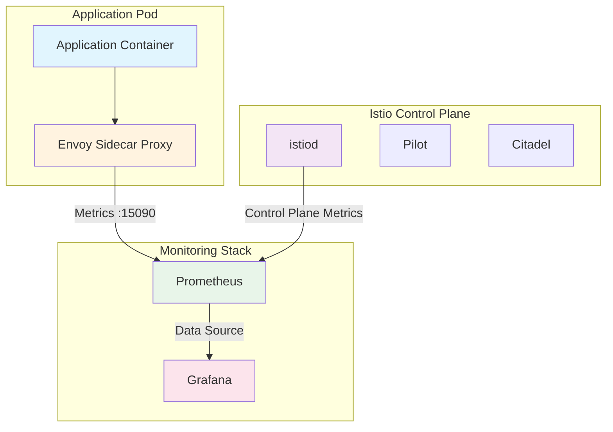
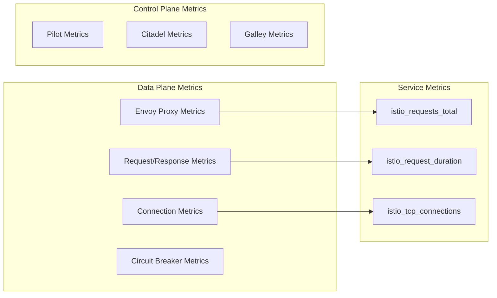
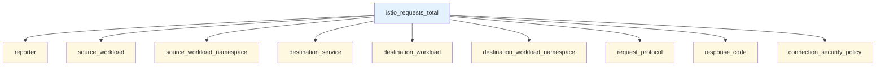
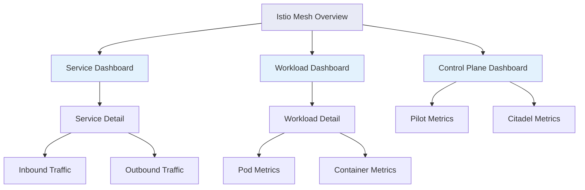
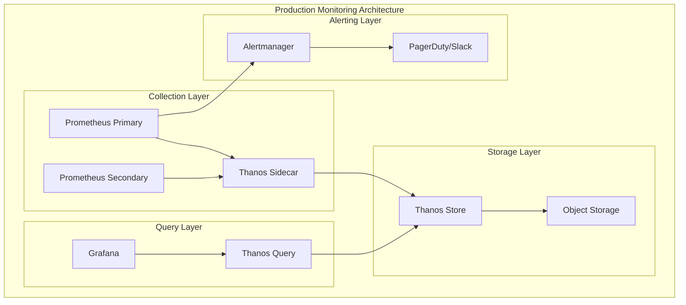

# How to Monitor Istio with Prometheus and Grafana

Author: [nawazdhandala](https://github.com/nawazdhandala)

Tags: Istio, Prometheus, Grafana, Monitoring, Metrics, Service Mesh

Description: A complete guide to monitoring Istio service mesh metrics with Prometheus and Grafana dashboards.

---

## Introduction

Istio is a powerful service mesh that provides traffic management, security, and observability for microservices. One of its key strengths is the rich set of metrics it exposes through Envoy proxies. By integrating Prometheus for metrics collection and Grafana for visualization, you can gain deep insights into your service mesh's performance, health, and behavior.

This guide covers everything you need to know about setting up comprehensive monitoring for Istio using Prometheus and Grafana, including key metrics to track, configuration best practices, and custom dashboard creation.

## Understanding Istio's Metrics Architecture

Before diving into the configuration, let's understand how Istio generates and exposes metrics.

### Metrics Flow in Istio

The following diagram illustrates how metrics flow from your services through Istio to Prometheus and Grafana:



### Metrics Generation Points

Istio generates metrics at multiple levels:



## Prerequisites

Before starting, ensure you have:

- A Kubernetes cluster (v1.24+)
- Istio installed (v1.20+)
- kubectl configured
- Helm v3 installed (optional, but recommended)

## Installing the Monitoring Stack

### Step 1: Install Prometheus

Istio provides a Prometheus configuration optimized for service mesh monitoring. Here's how to deploy it:

The following command applies the Istio addons which include a pre-configured Prometheus instance with all necessary scrape configurations for Istio metrics:

```bash
# Apply the Prometheus addon from Istio samples
# This includes pre-configured scrape jobs for Istio components
kubectl apply -f https://raw.githubusercontent.com/istio/istio/release-1.20/samples/addons/prometheus.yaml
```

Alternatively, you can use Helm for more control over the Prometheus configuration:

The Helm installation allows customization of resource limits, retention policies, and storage options:

```bash
# Add the Prometheus community Helm repository
helm repo add prometheus-community https://prometheus-community.github.io/helm-charts
helm repo update

# Install Prometheus with Istio-specific configuration
# The values file will be created in the next step
helm install prometheus prometheus-community/prometheus \
  --namespace istio-system \
  --values prometheus-values.yaml
```

### Step 2: Create Prometheus Configuration for Istio

Create a comprehensive Prometheus configuration that scrapes all Istio components:

This configuration file defines scrape jobs for Envoy sidecars, Istio control plane, and Kubernetes service discovery:

```yaml
# prometheus-values.yaml
# Prometheus configuration optimized for Istio service mesh monitoring

# Global settings for Prometheus server
server:
  # Allocate sufficient resources for metric storage
  persistentVolume:
    enabled: true
    size: 50Gi

  # Retention period for metrics data
  retention: "15d"

  # Resource allocation for Prometheus server pod
  resources:
    requests:
      memory: "2Gi"
      cpu: "1"
    limits:
      memory: "4Gi"
      cpu: "2"

# Configure scrape jobs for Istio components
serverFiles:
  prometheus.yml:
    global:
      # How frequently to scrape targets
      scrape_interval: 15s
      # How frequently to evaluate alerting rules
      evaluation_interval: 15s

    scrape_configs:
      # Scrape configuration for Envoy sidecar proxies
      # This job discovers all pods with Envoy sidecars and scrapes their metrics
      - job_name: 'envoy-stats'
        metrics_path: /stats/prometheus
        kubernetes_sd_configs:
          - role: pod
        relabel_configs:
          # Only scrape pods that have the Istio sidecar annotation
          - source_labels: [__meta_kubernetes_pod_container_name]
            action: keep
            regex: 'istio-proxy'
          # Extract the pod name for labeling
          - source_labels: [__meta_kubernetes_pod_name]
            action: replace
            target_label: pod_name
          # Extract the namespace for labeling
          - source_labels: [__meta_kubernetes_namespace]
            action: replace
            target_label: namespace
          # Set the correct port for Envoy stats
          - source_labels: [__address__]
            action: replace
            regex: '([^:]+):.*'
            replacement: '${1}:15090'
            target_label: __address__

      # Scrape configuration for istiod (Pilot)
      # Collects control plane metrics for monitoring mesh health
      - job_name: 'istiod'
        kubernetes_sd_configs:
          - role: endpoints
            namespaces:
              names:
                - istio-system
        relabel_configs:
          # Only scrape the istiod service
          - source_labels: [__meta_kubernetes_service_name]
            action: keep
            regex: 'istiod'
          # Target the monitoring port
          - source_labels: [__meta_kubernetes_endpoint_port_name]
            action: keep
            regex: 'http-monitoring'

      # Scrape configuration for Istio mesh metrics
      # Aggregates service-level metrics across the mesh
      - job_name: 'istio-mesh'
        kubernetes_sd_configs:
          - role: endpoints
            namespaces:
              names:
                - istio-system
        relabel_configs:
          - source_labels: [__meta_kubernetes_service_name, __meta_kubernetes_endpoint_port_name]
            action: keep
            regex: 'istio-telemetry;prometheus'

      # Scrape configuration for Kubernetes API server
      # Useful for correlating cluster events with mesh behavior
      - job_name: 'kubernetes-apiservers'
        kubernetes_sd_configs:
          - role: endpoints
        scheme: https
        tls_config:
          ca_file: /var/run/secrets/kubernetes.io/serviceaccount/ca.crt
        bearer_token_file: /var/run/secrets/kubernetes.io/serviceaccount/token
        relabel_configs:
          - source_labels: [__meta_kubernetes_namespace, __meta_kubernetes_service_name, __meta_kubernetes_endpoint_port_name]
            action: keep
            regex: default;kubernetes;https

      # Scrape configuration for Kubernetes nodes
      # Provides infrastructure-level metrics
      - job_name: 'kubernetes-nodes'
        kubernetes_sd_configs:
          - role: node
        scheme: https
        tls_config:
          ca_file: /var/run/secrets/kubernetes.io/serviceaccount/ca.crt
        bearer_token_file: /var/run/secrets/kubernetes.io/serviceaccount/token
        relabel_configs:
          - action: labelmap
            regex: __meta_kubernetes_node_label_(.+)
```

### Step 3: Install Grafana

Deploy Grafana with the Istio addon or use Helm for more customization:

The Istio sample addon provides a Grafana instance with pre-built dashboards:

```bash
# Apply the Grafana addon from Istio samples
# Includes pre-configured dashboards for Istio monitoring
kubectl apply -f https://raw.githubusercontent.com/istio/istio/release-1.20/samples/addons/grafana.yaml
```

For a production setup, use Helm with custom values:

This Helm configuration enables persistence, configures Prometheus as a data source, and sets up authentication:

```bash
# Add the Grafana Helm repository
helm repo add grafana https://grafana.github.io/helm-charts
helm repo update

# Install Grafana with Istio-specific configuration
helm install grafana grafana/grafana \
  --namespace istio-system \
  --values grafana-values.yaml
```

Create the Grafana values file:

This configuration enables persistent storage, configures the Prometheus data source, and sets up the admin credentials:

```yaml
# grafana-values.yaml
# Grafana configuration for Istio monitoring

# Enable persistent storage for dashboards and settings
persistence:
  enabled: true
  size: 10Gi

# Admin credentials (use secrets in production)
adminUser: admin
adminPassword: istio-grafana-admin

# Configure Prometheus as the primary data source
datasources:
  datasources.yaml:
    apiVersion: 1
    datasources:
      # Primary Prometheus data source for Istio metrics
      - name: Prometheus
        type: prometheus
        # URL points to the Prometheus service in istio-system namespace
        url: http://prometheus-server.istio-system.svc.cluster.local
        access: proxy
        isDefault: true
        editable: true
        jsonData:
          # Set appropriate timeout for complex queries
          timeInterval: "15s"
          httpMethod: "POST"

# Dashboard provisioning from ConfigMaps
dashboardProviders:
  dashboardproviders.yaml:
    apiVersion: 1
    providers:
      - name: 'istio'
        orgId: 1
        folder: 'Istio'
        type: file
        disableDeletion: false
        editable: true
        options:
          path: /var/lib/grafana/dashboards/istio

# Resource allocation for Grafana pod
resources:
  requests:
    memory: "256Mi"
    cpu: "100m"
  limits:
    memory: "512Mi"
    cpu: "500m"

# Enable sidecar for dashboard loading
sidecar:
  dashboards:
    enabled: true
    label: grafana_dashboard
    folder: /var/lib/grafana/dashboards
```

## Understanding Istio Metrics

Istio exposes a rich set of metrics through Envoy proxies. Let's explore the key metrics you should monitor.

### Core Istio Metrics

The following table describes the most important metrics exposed by Istio:

| Metric Name | Type | Description |
|-------------|------|-------------|
| `istio_requests_total` | Counter | Total number of requests handled |
| `istio_request_duration_milliseconds` | Histogram | Request latency distribution |
| `istio_request_bytes` | Histogram | Request body sizes |
| `istio_response_bytes` | Histogram | Response body sizes |
| `istio_tcp_connections_opened_total` | Counter | TCP connections opened |
| `istio_tcp_connections_closed_total` | Counter | TCP connections closed |
| `istio_tcp_sent_bytes_total` | Counter | Bytes sent over TCP |
| `istio_tcp_received_bytes_total` | Counter | Bytes received over TCP |

### Metric Labels

Each metric includes labels that provide context for analysis:

This diagram shows the relationship between metrics and their common labels:



### Label Descriptions

Understanding metric labels is crucial for effective querying:

| Label | Description |
|-------|-------------|
| `reporter` | Source ("source") or destination ("destination") of the request |
| `source_workload` | Name of the source workload |
| `source_workload_namespace` | Namespace of the source workload |
| `destination_service` | Destination service hostname |
| `destination_workload` | Name of the destination workload |
| `destination_workload_namespace` | Namespace of the destination workload |
| `request_protocol` | Protocol used (HTTP, gRPC, TCP) |
| `response_code` | HTTP response code |
| `connection_security_policy` | mTLS status (mutual_tls, none) |

## Key Prometheus Queries for Istio

Here are essential PromQL queries for monitoring your Istio service mesh.

### Request Rate Queries

Calculate the request rate per second for all services:

This query computes the per-second rate of requests over a 5-minute window, grouped by service and response code:

```promql
# Request rate per service
# rate() calculates the per-second rate over the specified time window
# sum by() aggregates the results by the specified labels
sum by (destination_service, response_code) (
  rate(istio_requests_total{reporter="destination"}[5m])
)
```

Calculate the overall success rate across the mesh:

This query divides successful requests (2xx codes) by total requests to get the success percentage:

```promql
# Success rate percentage
# Calculates the ratio of successful requests (2xx) to total requests
# Multiplied by 100 to express as a percentage
sum(rate(istio_requests_total{reporter="destination", response_code=~"2.."}[5m]))
/
sum(rate(istio_requests_total{reporter="destination"}[5m]))
* 100
```

### Latency Queries

Calculate the 50th, 95th, and 99th percentile latencies:

The histogram_quantile function calculates percentiles from histogram data:

```promql
# P50 latency (median response time)
# histogram_quantile calculates the specified quantile from histogram buckets
# 0.5 represents the 50th percentile (median)
histogram_quantile(0.5,
  sum by (destination_service, le) (
    rate(istio_request_duration_milliseconds_bucket{reporter="destination"}[5m])
  )
)

# P95 latency (95th percentile)
# Used for SLO monitoring - 95% of requests complete within this time
histogram_quantile(0.95,
  sum by (destination_service, le) (
    rate(istio_request_duration_milliseconds_bucket{reporter="destination"}[5m])
  )
)

# P99 latency (99th percentile)
# Captures tail latency for identifying outliers
histogram_quantile(0.99,
  sum by (destination_service, le) (
    rate(istio_request_duration_milliseconds_bucket{reporter="destination"}[5m])
  )
)
```

### Error Rate Queries

Monitor error rates across your services:

This query calculates the percentage of 5xx errors:

```promql
# Error rate percentage (5xx responses)
# Identifies server-side errors in the mesh
sum by (destination_service) (
  rate(istio_requests_total{reporter="destination", response_code=~"5.."}[5m])
)
/
sum by (destination_service) (
  rate(istio_requests_total{reporter="destination"}[5m])
)
* 100
```

Track 4xx client errors:

This query helps identify client-side issues like bad requests or authentication failures:

```promql
# Client error rate (4xx responses)
# Useful for detecting issues with client requests or authentication
sum by (destination_service) (
  rate(istio_requests_total{reporter="destination", response_code=~"4.."}[5m])
)
/
sum by (destination_service) (
  rate(istio_requests_total{reporter="destination"}[5m])
)
* 100
```

### TCP Metrics Queries

Monitor TCP connections for non-HTTP services:

These queries track TCP connection behavior:

```promql
# Active TCP connections
# Calculates currently open connections by subtracting closed from opened
sum by (destination_service) (
  istio_tcp_connections_opened_total{reporter="destination"}
)
-
sum by (destination_service) (
  istio_tcp_connections_closed_total{reporter="destination"}
)

# TCP bytes sent rate
# Monitors throughput for TCP-based services
sum by (destination_service) (
  rate(istio_tcp_sent_bytes_total{reporter="destination"}[5m])
)

# TCP bytes received rate
sum by (destination_service) (
  rate(istio_tcp_received_bytes_total{reporter="destination"}[5m])
)
```

### Control Plane Metrics

Monitor the health of istiod:

These queries track control plane performance:

```promql
# Pilot push latency (time to push configuration to proxies)
# High values indicate control plane bottlenecks
histogram_quantile(0.99,
  sum by (le) (
    rate(pilot_proxy_convergence_time_bucket[5m])
  )
)

# Number of connected proxies
# Should match the number of pods with sidecars
sum(pilot_xds_pushes{type="cds"})

# Configuration validation errors
# Non-zero values indicate configuration issues
sum(galley_validation_failed)

# Pilot CPU usage
# Monitor for resource exhaustion
rate(container_cpu_usage_seconds_total{container="discovery", namespace="istio-system"}[5m])
```

## Creating Grafana Dashboards

### Dashboard Architecture

The following diagram shows the recommended dashboard hierarchy:



### Mesh Overview Dashboard JSON

Create a comprehensive mesh overview dashboard:

This JSON defines a Grafana dashboard with panels for key mesh metrics:

```json
{
  "dashboard": {
    "title": "Istio Mesh Overview",
    "description": "High-level overview of Istio service mesh health and performance",
    "tags": ["istio", "service-mesh", "overview"],
    "timezone": "browser",
    "refresh": "30s",
    "time": {
      "from": "now-1h",
      "to": "now"
    },
    "panels": [
      {
        "title": "Global Request Rate",
        "description": "Total requests per second across the entire mesh",
        "type": "stat",
        "gridPos": { "x": 0, "y": 0, "w": 6, "h": 4 },
        "targets": [
          {
            "expr": "round(sum(rate(istio_requests_total{reporter=\"destination\"}[5m])), 0.01)",
            "legendFormat": "Requests/sec"
          }
        ],
        "options": {
          "colorMode": "value",
          "graphMode": "area",
          "justifyMode": "auto"
        },
        "fieldConfig": {
          "defaults": {
            "unit": "reqps",
            "thresholds": {
              "mode": "absolute",
              "steps": [
                { "value": null, "color": "green" },
                { "value": 1000, "color": "yellow" },
                { "value": 5000, "color": "red" }
              ]
            }
          }
        }
      },
      {
        "title": "Global Success Rate",
        "description": "Percentage of successful requests (2xx responses)",
        "type": "gauge",
        "gridPos": { "x": 6, "y": 0, "w": 6, "h": 4 },
        "targets": [
          {
            "expr": "sum(rate(istio_requests_total{reporter=\"destination\", response_code=~\"2..\"}[5m])) / sum(rate(istio_requests_total{reporter=\"destination\"}[5m])) * 100",
            "legendFormat": "Success Rate"
          }
        ],
        "options": {
          "showThresholdLabels": false,
          "showThresholdMarkers": true
        },
        "fieldConfig": {
          "defaults": {
            "unit": "percent",
            "min": 0,
            "max": 100,
            "thresholds": {
              "mode": "absolute",
              "steps": [
                { "value": null, "color": "red" },
                { "value": 95, "color": "yellow" },
                { "value": 99, "color": "green" }
              ]
            }
          }
        }
      },
      {
        "title": "P99 Latency",
        "description": "99th percentile request latency across the mesh",
        "type": "stat",
        "gridPos": { "x": 12, "y": 0, "w": 6, "h": 4 },
        "targets": [
          {
            "expr": "histogram_quantile(0.99, sum by (le) (rate(istio_request_duration_milliseconds_bucket{reporter=\"destination\"}[5m])))",
            "legendFormat": "P99 Latency"
          }
        ],
        "fieldConfig": {
          "defaults": {
            "unit": "ms",
            "thresholds": {
              "mode": "absolute",
              "steps": [
                { "value": null, "color": "green" },
                { "value": 500, "color": "yellow" },
                { "value": 1000, "color": "red" }
              ]
            }
          }
        }
      },
      {
        "title": "Error Rate",
        "description": "Percentage of 5xx error responses",
        "type": "stat",
        "gridPos": { "x": 18, "y": 0, "w": 6, "h": 4 },
        "targets": [
          {
            "expr": "sum(rate(istio_requests_total{reporter=\"destination\", response_code=~\"5..\"}[5m])) / sum(rate(istio_requests_total{reporter=\"destination\"}[5m])) * 100",
            "legendFormat": "Error Rate"
          }
        ],
        "fieldConfig": {
          "defaults": {
            "unit": "percent",
            "thresholds": {
              "mode": "absolute",
              "steps": [
                { "value": null, "color": "green" },
                { "value": 1, "color": "yellow" },
                { "value": 5, "color": "red" }
              ]
            }
          }
        }
      },
      {
        "title": "Request Rate by Service",
        "description": "Request rate breakdown by destination service",
        "type": "timeseries",
        "gridPos": { "x": 0, "y": 4, "w": 12, "h": 8 },
        "targets": [
          {
            "expr": "sum by (destination_service) (rate(istio_requests_total{reporter=\"destination\"}[5m]))",
            "legendFormat": "{{destination_service}}"
          }
        ],
        "options": {
          "legend": {
            "displayMode": "table",
            "placement": "right"
          }
        },
        "fieldConfig": {
          "defaults": {
            "unit": "reqps",
            "custom": {
              "drawStyle": "line",
              "lineWidth": 2,
              "fillOpacity": 20
            }
          }
        }
      },
      {
        "title": "Latency Distribution by Service",
        "description": "P50, P95, P99 latencies per service",
        "type": "timeseries",
        "gridPos": { "x": 12, "y": 4, "w": 12, "h": 8 },
        "targets": [
          {
            "expr": "histogram_quantile(0.50, sum by (destination_service, le) (rate(istio_request_duration_milliseconds_bucket{reporter=\"destination\"}[5m])))",
            "legendFormat": "{{destination_service}} - P50"
          },
          {
            "expr": "histogram_quantile(0.95, sum by (destination_service, le) (rate(istio_request_duration_milliseconds_bucket{reporter=\"destination\"}[5m])))",
            "legendFormat": "{{destination_service}} - P95"
          },
          {
            "expr": "histogram_quantile(0.99, sum by (destination_service, le) (rate(istio_request_duration_milliseconds_bucket{reporter=\"destination\"}[5m])))",
            "legendFormat": "{{destination_service}} - P99"
          }
        ],
        "fieldConfig": {
          "defaults": {
            "unit": "ms",
            "custom": {
              "drawStyle": "line",
              "lineWidth": 1,
              "fillOpacity": 10
            }
          }
        }
      },
      {
        "title": "Response Code Distribution",
        "description": "Breakdown of response codes over time",
        "type": "timeseries",
        "gridPos": { "x": 0, "y": 12, "w": 12, "h": 8 },
        "targets": [
          {
            "expr": "sum by (response_code) (rate(istio_requests_total{reporter=\"destination\"}[5m]))",
            "legendFormat": "{{response_code}}"
          }
        ],
        "options": {
          "legend": {
            "displayMode": "table",
            "placement": "right"
          }
        },
        "fieldConfig": {
          "defaults": {
            "unit": "reqps",
            "custom": {
              "drawStyle": "bars",
              "stacking": {
                "mode": "normal"
              }
            }
          },
          "overrides": [
            {
              "matcher": { "id": "byRegexp", "options": "2.." },
              "properties": [{ "id": "color", "value": { "fixedColor": "green" } }]
            },
            {
              "matcher": { "id": "byRegexp", "options": "4.." },
              "properties": [{ "id": "color", "value": { "fixedColor": "yellow" } }]
            },
            {
              "matcher": { "id": "byRegexp", "options": "5.." },
              "properties": [{ "id": "color", "value": { "fixedColor": "red" } }]
            }
          ]
        }
      },
      {
        "title": "Service Mesh Topology",
        "description": "Service-to-service traffic flow",
        "type": "nodeGraph",
        "gridPos": { "x": 12, "y": 12, "w": 12, "h": 8 },
        "targets": [
          {
            "expr": "sum by (source_workload, destination_workload) (rate(istio_requests_total{reporter=\"destination\"}[5m]))",
            "format": "table"
          }
        ]
      }
    ]
  }
}
```

### Service Detail Dashboard

Create a detailed dashboard for individual service monitoring:

Save this as a ConfigMap to auto-provision in Grafana:

```yaml
# service-dashboard-configmap.yaml
# This ConfigMap contains a Grafana dashboard for detailed service monitoring
# Grafana's sidecar will automatically load this dashboard

apiVersion: v1
kind: ConfigMap
metadata:
  name: istio-service-dashboard
  namespace: istio-system
  labels:
    # This label allows Grafana sidecar to detect and load the dashboard
    grafana_dashboard: "1"
data:
  service-dashboard.json: |
    {
      "dashboard": {
        "title": "Istio Service Detail",
        "description": "Detailed metrics for a specific Istio service",
        "tags": ["istio", "service"],
        "templating": {
          "list": [
            {
              "name": "service",
              "type": "query",
              "datasource": "Prometheus",
              "query": "label_values(istio_requests_total, destination_service)",
              "refresh": 2,
              "sort": 1
            },
            {
              "name": "namespace",
              "type": "query",
              "datasource": "Prometheus",
              "query": "label_values(istio_requests_total{destination_service=\"$service\"}, destination_workload_namespace)",
              "refresh": 2
            }
          ]
        },
        "panels": [
          {
            "title": "Inbound Request Rate",
            "type": "timeseries",
            "gridPos": { "x": 0, "y": 0, "w": 8, "h": 8 },
            "targets": [
              {
                "expr": "sum by (source_workload) (rate(istio_requests_total{reporter=\"destination\", destination_service=\"$service\"}[5m]))",
                "legendFormat": "{{source_workload}}"
              }
            ]
          },
          {
            "title": "Inbound Success Rate",
            "type": "gauge",
            "gridPos": { "x": 8, "y": 0, "w": 4, "h": 4 },
            "targets": [
              {
                "expr": "sum(rate(istio_requests_total{reporter=\"destination\", destination_service=\"$service\", response_code=~\"2..\"}[5m])) / sum(rate(istio_requests_total{reporter=\"destination\", destination_service=\"$service\"}[5m])) * 100"
              }
            ],
            "fieldConfig": {
              "defaults": {
                "unit": "percent",
                "min": 0,
                "max": 100
              }
            }
          },
          {
            "title": "Inbound P99 Latency",
            "type": "stat",
            "gridPos": { "x": 12, "y": 0, "w": 4, "h": 4 },
            "targets": [
              {
                "expr": "histogram_quantile(0.99, sum by (le) (rate(istio_request_duration_milliseconds_bucket{reporter=\"destination\", destination_service=\"$service\"}[5m])))"
              }
            ],
            "fieldConfig": {
              "defaults": { "unit": "ms" }
            }
          },
          {
            "title": "Outbound Request Rate",
            "type": "timeseries",
            "gridPos": { "x": 16, "y": 0, "w": 8, "h": 8 },
            "targets": [
              {
                "expr": "sum by (destination_service) (rate(istio_requests_total{reporter=\"source\", source_workload=~\"$service.*\"}[5m]))",
                "legendFormat": "{{destination_service}}"
              }
            ]
          },
          {
            "title": "Request Duration Heatmap",
            "type": "heatmap",
            "gridPos": { "x": 0, "y": 8, "w": 12, "h": 8 },
            "targets": [
              {
                "expr": "sum by (le) (rate(istio_request_duration_milliseconds_bucket{reporter=\"destination\", destination_service=\"$service\"}[5m]))",
                "format": "heatmap"
              }
            ],
            "options": {
              "calculate": true,
              "color": {
                "scheme": "Spectral"
              }
            }
          },
          {
            "title": "Request Size Distribution",
            "type": "histogram",
            "gridPos": { "x": 12, "y": 8, "w": 6, "h": 8 },
            "targets": [
              {
                "expr": "sum by (le) (rate(istio_request_bytes_bucket{reporter=\"destination\", destination_service=\"$service\"}[5m]))"
              }
            ]
          },
          {
            "title": "Response Size Distribution",
            "type": "histogram",
            "gridPos": { "x": 18, "y": 8, "w": 6, "h": 8 },
            "targets": [
              {
                "expr": "sum by (le) (rate(istio_response_bytes_bucket{reporter=\"destination\", destination_service=\"$service\"}[5m]))"
              }
            ]
          }
        ]
      }
    }
```

## Configuring Alerts

### Prometheus Alert Rules

Create alerting rules for common Istio issues:

This configuration defines critical alerts for service mesh health:

```yaml
# istio-alerts.yaml
# Prometheus alerting rules for Istio service mesh
# These rules should be applied to your Prometheus configuration

apiVersion: monitoring.coreos.com/v1
kind: PrometheusRule
metadata:
  name: istio-alerts
  namespace: istio-system
  labels:
    prometheus: k8s
    role: alert-rules
spec:
  groups:
    # Alerts for high error rates in the mesh
    - name: istio-error-alerts
      rules:
        # Alert when any service has a high error rate
        - alert: IstioHighErrorRate
          # Triggers when 5xx error rate exceeds 5% for 5 minutes
          expr: |
            sum by (destination_service) (
              rate(istio_requests_total{reporter="destination", response_code=~"5.."}[5m])
            )
            /
            sum by (destination_service) (
              rate(istio_requests_total{reporter="destination"}[5m])
            )
            > 0.05
          for: 5m
          labels:
            severity: critical
          annotations:
            summary: "High error rate on {{ $labels.destination_service }}"
            description: "Service {{ $labels.destination_service }} has error rate of {{ $value | humanizePercentage }}"

        # Alert for global mesh error rate
        - alert: IstioMeshHighErrorRate
          expr: |
            sum(rate(istio_requests_total{reporter="destination", response_code=~"5.."}[5m]))
            /
            sum(rate(istio_requests_total{reporter="destination"}[5m]))
            > 0.01
          for: 10m
          labels:
            severity: warning
          annotations:
            summary: "Elevated error rate across Istio mesh"
            description: "Global mesh error rate is {{ $value | humanizePercentage }}"

    # Alerts for latency issues
    - name: istio-latency-alerts
      rules:
        # Alert when P99 latency is too high
        - alert: IstioHighLatency
          expr: |
            histogram_quantile(0.99,
              sum by (destination_service, le) (
                rate(istio_request_duration_milliseconds_bucket{reporter="destination"}[5m])
              )
            ) > 1000
          for: 5m
          labels:
            severity: warning
          annotations:
            summary: "High latency on {{ $labels.destination_service }}"
            description: "P99 latency is {{ $value }}ms for {{ $labels.destination_service }}"

        # Alert when latency increases significantly
        - alert: IstioLatencySpike
          # Compares current latency to 1-hour average
          expr: |
            histogram_quantile(0.95,
              sum by (destination_service, le) (
                rate(istio_request_duration_milliseconds_bucket{reporter="destination"}[5m])
              )
            )
            >
            2 * histogram_quantile(0.95,
              sum by (destination_service, le) (
                rate(istio_request_duration_milliseconds_bucket{reporter="destination"}[1h])
              )
            )
          for: 10m
          labels:
            severity: warning
          annotations:
            summary: "Latency spike detected on {{ $labels.destination_service }}"
            description: "Current P95 latency is 2x higher than the hourly average"

    # Control plane health alerts
    - name: istio-control-plane-alerts
      rules:
        # Alert when pilot is having issues pushing config
        - alert: IstioPilotPushErrors
          expr: |
            sum(rate(pilot_xds_push_errors[5m])) > 0
          for: 5m
          labels:
            severity: critical
          annotations:
            summary: "Istio Pilot is experiencing push errors"
            description: "Pilot is failing to push configuration to proxies"

        # Alert when pilot has high convergence time
        - alert: IstioPilotHighConvergenceTime
          expr: |
            histogram_quantile(0.99,
              sum by (le) (
                rate(pilot_proxy_convergence_time_bucket[5m])
              )
            ) > 30
          for: 10m
          labels:
            severity: warning
          annotations:
            summary: "High Istio proxy convergence time"
            description: "P99 convergence time is {{ $value }}s"

        # Alert when pilot is not reachable
        - alert: IstioPilotDown
          expr: |
            absent(up{job="istiod"} == 1)
          for: 5m
          labels:
            severity: critical
          annotations:
            summary: "Istio Pilot is down"
            description: "Istio control plane is not responding"

    # mTLS and security alerts
    - name: istio-security-alerts
      rules:
        # Alert when mTLS is not being used
        - alert: IstioMTLSNotEnabled
          expr: |
            sum by (destination_service) (
              rate(istio_requests_total{
                reporter="destination",
                connection_security_policy!="mutual_tls"
              }[5m])
            ) > 0
          for: 30m
          labels:
            severity: warning
          annotations:
            summary: "Non-mTLS traffic detected to {{ $labels.destination_service }}"
            description: "Some traffic is not using mutual TLS"

    # Traffic anomaly alerts
    - name: istio-traffic-alerts
      rules:
        # Alert on sudden traffic drop
        - alert: IstioTrafficDrop
          expr: |
            sum by (destination_service) (
              rate(istio_requests_total{reporter="destination"}[5m])
            )
            <
            0.5 * sum by (destination_service) (
              rate(istio_requests_total{reporter="destination"}[1h])
            )
          for: 10m
          labels:
            severity: warning
          annotations:
            summary: "Traffic drop detected for {{ $labels.destination_service }}"
            description: "Traffic has dropped by more than 50% compared to hourly average"

        # Alert on traffic spike
        - alert: IstioTrafficSpike
          expr: |
            sum by (destination_service) (
              rate(istio_requests_total{reporter="destination"}[5m])
            )
            >
            3 * sum by (destination_service) (
              rate(istio_requests_total{reporter="destination"}[1h])
            )
          for: 5m
          labels:
            severity: warning
          annotations:
            summary: "Traffic spike detected for {{ $labels.destination_service }}"
            description: "Traffic has increased by more than 3x compared to hourly average"
```

### Applying Alert Rules

Apply the alert rules to your cluster:

These commands create the PrometheusRule resource and configure alerting:

```bash
# Apply the alerting rules
kubectl apply -f istio-alerts.yaml

# Verify the rules are loaded
kubectl get prometheusrules -n istio-system

# Check that Prometheus has picked up the rules
# Port-forward to access Prometheus UI
kubectl port-forward svc/prometheus -n istio-system 9090:9090
# Then visit http://localhost:9090/alerts in your browser
```

## Customizing Istio Telemetry

### Modifying Default Metrics

Istio allows you to customize which metrics are collected and their cardinality:

This Telemetry resource configures metric collection behavior:

```yaml
# telemetry-config.yaml
# Custom Istio telemetry configuration
# This allows fine-grained control over metric collection

apiVersion: telemetry.istio.io/v1alpha1
kind: Telemetry
metadata:
  name: mesh-default
  namespace: istio-system
spec:
  # Configure access logging
  accessLogging:
    - providers:
        - name: envoy
      # Disable access logs for health checks to reduce noise
      disabled: false
      filter:
        expression: response.code >= 400 || request.url_path.contains("api")

  # Configure metrics collection
  metrics:
    - providers:
        - name: prometheus
      overrides:
        # Add custom labels to requests_total metric
        - match:
            metric: REQUEST_COUNT
            mode: CLIENT_AND_SERVER
          tagOverrides:
            # Add request path as a label (be careful with cardinality)
            request_path:
              operation: UPSERT
              value: "request.url_path"

        # Disable histogram metrics for less critical services
        - match:
            metric: REQUEST_DURATION
            mode: CLIENT
          disabled: true
```

### Adding Custom Metrics

Create custom metrics using EnvoyFilter:

This EnvoyFilter adds a custom metric for tracking request authentication status:

```yaml
# custom-metrics-envoyfilter.yaml
# This EnvoyFilter adds custom metrics to Envoy proxies
# Useful for tracking application-specific metrics

apiVersion: networking.istio.io/v1alpha3
kind: EnvoyFilter
metadata:
  name: custom-metrics
  namespace: istio-system
spec:
  configPatches:
    # Add a custom metric for authenticated requests
    - applyTo: HTTP_FILTER
      match:
        context: SIDECAR_INBOUND
        listener:
          filterChain:
            filter:
              name: "envoy.filters.network.http_connection_manager"
              subFilter:
                name: "envoy.filters.http.router"
      patch:
        operation: INSERT_BEFORE
        value:
          name: envoy.filters.http.wasm
          typed_config:
            "@type": type.googleapis.com/udpa.type.v1.TypedStruct
            type_url: type.googleapis.com/envoy.extensions.filters.http.wasm.v3.Wasm
            value:
              config:
                # Custom WASM filter for additional metrics
                vm_config:
                  runtime: envoy.wasm.runtime.v8
                  code:
                    local:
                      inline_string: |
                        // Custom metrics logic here
```

### Reducing Metric Cardinality

High cardinality can cause Prometheus performance issues. Here's how to reduce it:

This MeshConfig limits the labels added to metrics:

```yaml
# mesh-config.yaml
# Configure Istio mesh to reduce metric cardinality
# Apply with: istioctl install -f mesh-config.yaml

apiVersion: install.istio.io/v1alpha1
kind: IstioOperator
spec:
  meshConfig:
    # Enable Prometheus metrics
    enablePrometheusMerge: true

    # Default configuration for all proxies
    defaultConfig:
      # Reduce proxy stats verbosity
      proxyStatsMatcher:
        inclusionPrefixes:
          - "cluster.outbound"
          - "cluster.inbound"
          - "listener"
          - "http"
          - "tcp"
        inclusionRegexps:
          - ".*upstream_rq.*"
          - ".*downstream_rq.*"

  values:
    # Configure telemetry v2 for reduced cardinality
    telemetry:
      v2:
        prometheus:
          # Remove high-cardinality labels
          configOverride:
            inboundSidecar:
              disable_host_header_fallback: true
            outboundSidecar:
              disable_host_header_fallback: true
```

## Best Practices

### Monitoring Architecture Best Practices

Follow these recommendations for a production-ready monitoring setup:



### Performance Optimization Tips

1. **Use Recording Rules**: Pre-compute expensive queries

This recording rule pre-calculates commonly used metrics:

```yaml
# recording-rules.yaml
# Recording rules pre-compute expensive queries
# This improves dashboard performance

apiVersion: monitoring.coreos.com/v1
kind: PrometheusRule
metadata:
  name: istio-recording-rules
  namespace: istio-system
spec:
  groups:
    - name: istio-recording-rules
      interval: 30s
      rules:
        # Pre-compute request rate by service
        - record: istio:service:request_rate:5m
          expr: |
            sum by (destination_service) (
              rate(istio_requests_total{reporter="destination"}[5m])
            )

        # Pre-compute success rate by service
        - record: istio:service:success_rate:5m
          expr: |
            sum by (destination_service) (
              rate(istio_requests_total{reporter="destination", response_code=~"2.."}[5m])
            )
            /
            sum by (destination_service) (
              rate(istio_requests_total{reporter="destination"}[5m])
            )

        # Pre-compute P99 latency by service
        - record: istio:service:latency_p99:5m
          expr: |
            histogram_quantile(0.99,
              sum by (destination_service, le) (
                rate(istio_request_duration_milliseconds_bucket{reporter="destination"}[5m])
              )
            )

        # Pre-compute error rate by service
        - record: istio:service:error_rate:5m
          expr: |
            sum by (destination_service) (
              rate(istio_requests_total{reporter="destination", response_code=~"5.."}[5m])
            )
            /
            sum by (destination_service) (
              rate(istio_requests_total{reporter="destination"}[5m])
            )
```

2. **Set Appropriate Retention**: Balance storage costs with analysis needs

```yaml
# prometheus-retention.yaml
# Configure retention based on your needs

server:
  # Keep high-resolution data for 15 days
  retention: "15d"

  # Use Thanos for long-term storage
  extraArgs:
    storage.tsdb.min-block-duration: 2h
    storage.tsdb.max-block-duration: 2h
```

3. **Implement Federation**: Scale across multiple clusters

```yaml
# prometheus-federation.yaml
# Configure federation for multi-cluster monitoring

scrape_configs:
  - job_name: 'federate'
    scrape_interval: 30s
    honor_labels: true
    metrics_path: '/federate'
    params:
      'match[]':
        # Federate only recording rules and key metrics
        - '{job="istio-mesh"}'
        - 'istio:service:request_rate:5m'
        - 'istio:service:success_rate:5m'
    static_configs:
      - targets:
          - 'prometheus-cluster-1.example.com:9090'
          - 'prometheus-cluster-2.example.com:9090'
```

## Troubleshooting

### Common Issues and Solutions

**Issue: Metrics not appearing in Prometheus**

Check that the Envoy sidecar is exposing metrics:

```bash
# Verify metrics endpoint is accessible
# This command port-forwards to a pod and checks the metrics endpoint
kubectl exec -it <pod-name> -c istio-proxy -- \
  curl -s localhost:15090/stats/prometheus | head -20

# Check Prometheus targets
kubectl port-forward svc/prometheus -n istio-system 9090:9090
# Visit http://localhost:9090/targets and look for unhealthy targets
```

**Issue: High cardinality causing Prometheus OOM**

Identify high-cardinality metrics:

```promql
# Find metrics with most time series
# Run this in Prometheus UI
topk(10, count by (__name__)({__name__=~".+"}))

# Find labels with most values
count(count by (destination_service) (istio_requests_total))
```

**Issue: Dashboard showing no data**

Verify the data source configuration:

```bash
# Check Grafana logs
kubectl logs -n istio-system deployment/grafana

# Verify Prometheus connection from Grafana pod
kubectl exec -it deployment/grafana -n istio-system -- \
  curl -s http://prometheus-server:9090/api/v1/query?query=up
```

**Issue: Alerts not firing**

Debug alerting pipeline:

```bash
# Check Prometheus alerting rules
kubectl port-forward svc/prometheus -n istio-system 9090:9090
# Visit http://localhost:9090/rules

# Check Alertmanager
kubectl port-forward svc/alertmanager -n istio-system 9093:9093
# Visit http://localhost:9093

# Verify alert rule syntax
promtool check rules istio-alerts.yaml
```

## Conclusion

Monitoring Istio with Prometheus and Grafana provides comprehensive visibility into your service mesh. By following this guide, you have learned:

- How Istio generates and exposes metrics through Envoy proxies
- How to configure Prometheus to scrape Istio metrics effectively
- Key PromQL queries for monitoring request rates, latencies, and errors
- How to create informative Grafana dashboards
- Best practices for alerting on service mesh issues
- Performance optimization techniques for production environments

With these tools and configurations in place, you can proactively identify issues, track SLOs, and ensure the reliability of your microservices running on Istio.

## Further Reading

- [Istio Observability Documentation](https://istio.io/latest/docs/concepts/observability/)
- [Prometheus Best Practices](https://prometheus.io/docs/practices/naming/)
- [Grafana Dashboard Best Practices](https://grafana.com/docs/grafana/latest/best-practices/)
- [Istio Metrics Reference](https://istio.io/latest/docs/reference/config/metrics/)
