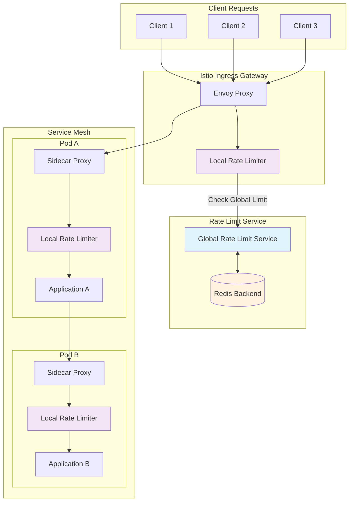
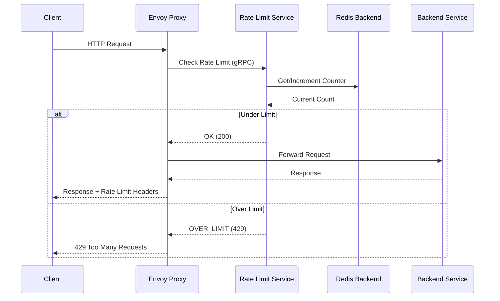
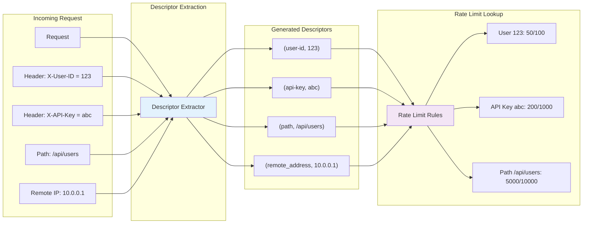
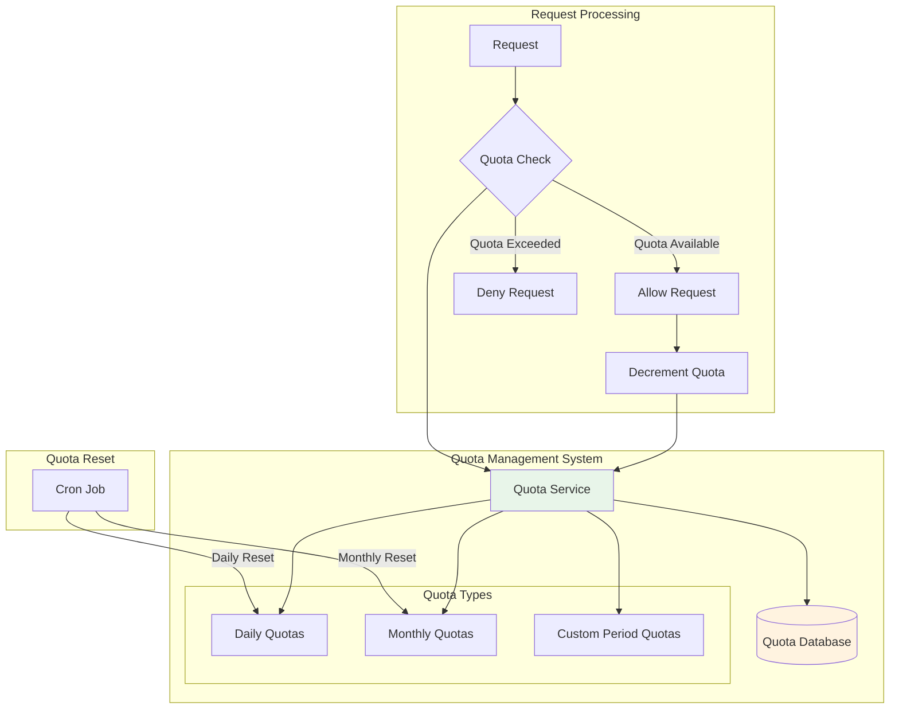

# How to Implement Rate Limiting in Istio

Author: [nawazdhandala](https://github.com/nawazdhandala)

Tags: Istio, Rate Limiting, Traffic Management, Service Mesh, Kubernetes

Description: Learn how to configure local and global rate limiting in Istio to protect services.

---

Rate limiting is a critical traffic management technique that protects your services from being overwhelmed by too many requests. In a microservices architecture running on Istio, implementing rate limiting helps prevent cascading failures, ensures fair resource allocation, and protects against denial-of-service attacks. This comprehensive guide covers both local and global rate limiting strategies in Istio, complete with practical examples and best practices.

## Table of Contents

1. [Understanding Rate Limiting in Istio](#understanding-rate-limiting-in-istio)
2. [Local Rate Limiting with EnvoyFilter](#local-rate-limiting-with-envoyfilter)
3. [Global Rate Limiting with External Service](#global-rate-limiting-with-external-service)
4. [Rate Limit Descriptors](#rate-limit-descriptors)
5. [Quota Management](#quota-management)
6. [Advanced Configuration Patterns](#advanced-configuration-patterns)
7. [Monitoring and Troubleshooting](#monitoring-and-troubleshooting)
8. [Best Practices](#best-practices)

## Understanding Rate Limiting in Istio

Istio leverages Envoy proxy's built-in rate limiting capabilities to control traffic flow. There are two primary approaches:

- **Local Rate Limiting**: Enforced at each Envoy proxy instance independently
- **Global Rate Limiting**: Coordinated across all instances using an external rate limit service

### Rate Limiting Architecture Overview

The following diagram illustrates how rate limiting works in Istio's service mesh architecture:



### When to Use Each Approach

| Feature | Local Rate Limiting | Global Rate Limiting |
|---------|---------------------|----------------------|
| Latency | Lower (no external calls) | Higher (requires external service) |
| Consistency | Per-instance limits | Cluster-wide limits |
| Complexity | Simpler setup | Requires additional infrastructure |
| Use Case | Per-pod protection | API quotas, tenant limits |

## Local Rate Limiting with EnvoyFilter

Local rate limiting is implemented directly in each Envoy proxy without requiring external coordination. This approach is ideal for protecting individual service instances from being overwhelmed.

### Basic Local Rate Limiting Configuration

The following EnvoyFilter applies a basic rate limit of 100 requests per minute to all incoming traffic. The filter is applied at the HTTP connection manager level:

```yaml
# EnvoyFilter for basic local rate limiting
# This configuration limits requests to 100 per minute per Envoy instance
apiVersion: networking.istio.io/v1alpha3
kind: EnvoyFilter
metadata:
  name: local-ratelimit
  namespace: istio-system
spec:
  # Apply this filter to all workloads in the mesh
  workloadSelector:
    labels:
      app: my-service
  configPatches:
    # First patch: Add the local rate limit filter to the HTTP filter chain
    - applyTo: HTTP_FILTER
      match:
        context: SIDECAR_INBOUND
        listener:
          filterChain:
            filter:
              name: "envoy.filters.network.http_connection_manager"
              subFilter:
                name: "envoy.filters.http.router"
      patch:
        # Insert the rate limit filter before the router filter
        operation: INSERT_BEFORE
        value:
          name: envoy.filters.http.local_ratelimit
          typed_config:
            "@type": type.googleapis.com/envoy.extensions.filters.http.local_ratelimit.v3.LocalRateLimit
            # Unique identifier for this rate limiter
            stat_prefix: http_local_rate_limiter
            # Token bucket configuration for rate limiting
            token_bucket:
              # Maximum number of tokens (requests) allowed
              max_tokens: 100
              # How many tokens to add per fill interval
              tokens_per_fill: 100
              # Time interval for refilling tokens (60 seconds = 1 minute)
              fill_interval: 60s
            # Percentage of requests to apply rate limiting (100% = all requests)
            filter_enabled:
              runtime_key: local_rate_limit_enabled
              default_value:
                numerator: 100
                denominator: HUNDRED
            # Percentage of rate-limited requests to actually enforce
            filter_enforced:
              runtime_key: local_rate_limit_enforced
              default_value:
                numerator: 100
                denominator: HUNDRED
            # Custom response headers to add when rate limited
            response_headers_to_add:
              - append_action: OVERWRITE_IF_EXISTS_OR_ADD
                header:
                  key: x-local-rate-limit
                  value: "true"
```

### Path-Specific Rate Limiting

Different API endpoints often require different rate limits. The following configuration demonstrates how to apply varying limits based on the request path:

```yaml
# EnvoyFilter for path-specific rate limiting
# This allows different rate limits for different API endpoints
apiVersion: networking.istio.io/v1alpha3
kind: EnvoyFilter
metadata:
  name: path-specific-ratelimit
  namespace: default
spec:
  workloadSelector:
    labels:
      app: api-gateway
  configPatches:
    - applyTo: HTTP_FILTER
      match:
        context: SIDECAR_INBOUND
        listener:
          filterChain:
            filter:
              name: "envoy.filters.network.http_connection_manager"
              subFilter:
                name: "envoy.filters.http.router"
      patch:
        operation: INSERT_BEFORE
        value:
          name: envoy.filters.http.local_ratelimit
          typed_config:
            "@type": type.googleapis.com/envoy.extensions.filters.http.local_ratelimit.v3.LocalRateLimit
            stat_prefix: http_local_rate_limiter
            token_bucket:
              # Default rate limit: 1000 requests per minute
              max_tokens: 1000
              tokens_per_fill: 1000
              fill_interval: 60s
            filter_enabled:
              runtime_key: local_rate_limit_enabled
              default_value:
                numerator: 100
                denominator: HUNDRED
            filter_enforced:
              runtime_key: local_rate_limit_enforced
              default_value:
                numerator: 100
                denominator: HUNDRED
            # Define descriptors for path-specific limits
            descriptors:
              # Stricter limit for authentication endpoints (10 req/min)
              - entries:
                  - key: path
                    value: "/api/v1/auth"
                token_bucket:
                  max_tokens: 10
                  tokens_per_fill: 10
                  fill_interval: 60s
              # Moderate limit for user endpoints (100 req/min)
              - entries:
                  - key: path
                    value: "/api/v1/users"
                token_bucket:
                  max_tokens: 100
                  tokens_per_fill: 100
                  fill_interval: 60s
              # Higher limit for read-only data endpoints (500 req/min)
              - entries:
                  - key: path
                    value: "/api/v1/data"
                token_bucket:
                  max_tokens: 500
                  tokens_per_fill: 500
                  fill_interval: 60s
```

### Virtual Host Level Rate Limiting

For more granular control, you can configure rate limits at the virtual host level:

```yaml
# EnvoyFilter for virtual host level rate limiting
# This applies rate limits to specific virtual hosts (domains)
apiVersion: networking.istio.io/v1alpha3
kind: EnvoyFilter
metadata:
  name: vhost-ratelimit
  namespace: istio-system
spec:
  workloadSelector:
    labels:
      istio: ingressgateway
  configPatches:
    # Apply rate limit configuration to the route configuration
    - applyTo: VIRTUAL_HOST
      match:
        context: GATEWAY
        routeConfiguration:
          vhost:
            name: "api.example.com:443"
      patch:
        operation: MERGE
        value:
          rate_limits:
            # Define rate limit actions for this virtual host
            - actions:
                # Use the destination cluster as a rate limit key
                - destination_cluster: {}
              # Stage 0 means this is evaluated first
              stage: 0
```

## Global Rate Limiting with External Service

Global rate limiting provides cluster-wide rate limiting by using an external rate limit service. This approach ensures consistent limits across all service instances.

### Rate Limit Service Architecture

The following diagram shows the flow of requests through the global rate limiting system:



### Deploying the Rate Limit Service

First, deploy Redis as the backend storage for rate limit counters:

```yaml
# Redis deployment for storing rate limit counters
# Redis provides fast, atomic counter operations required for rate limiting
apiVersion: apps/v1
kind: Deployment
metadata:
  name: redis
  namespace: rate-limit
spec:
  replicas: 1
  selector:
    matchLabels:
      app: redis
  template:
    metadata:
      labels:
        app: redis
    spec:
      containers:
        - name: redis
          image: redis:7-alpine
          ports:
            - containerPort: 6379
          # Resource limits to ensure Redis doesn't consume excessive resources
          resources:
            requests:
              cpu: 100m
              memory: 128Mi
            limits:
              cpu: 500m
              memory: 256Mi
          # Liveness probe to restart Redis if it becomes unresponsive
          livenessProbe:
            tcpSocket:
              port: 6379
            initialDelaySeconds: 30
            periodSeconds: 10
---
# Redis service for internal cluster access
apiVersion: v1
kind: Service
metadata:
  name: redis
  namespace: rate-limit
spec:
  ports:
    - port: 6379
      targetPort: 6379
  selector:
    app: redis
```

Next, create the rate limit service configuration as a ConfigMap:

```yaml
# ConfigMap containing rate limit rules
# This defines the actual rate limit policies for different scenarios
apiVersion: v1
kind: ConfigMap
metadata:
  name: ratelimit-config
  namespace: rate-limit
data:
  # Configuration file for the rate limit service
  config.yaml: |
    # Domain groups related rate limit configurations
    domain: production-ratelimit
    descriptors:
      # Global rate limit for all API requests
      # Limits entire API to 10000 requests per minute
      - key: generic_key
        value: api-limit
        rate_limit:
          unit: minute
          requests_per_unit: 10000

      # Per-user rate limiting based on user ID header
      # Each user gets 100 requests per minute
      - key: header_match
        value: user-id
        rate_limit:
          unit: minute
          requests_per_unit: 100

      # Per-IP rate limiting for unauthenticated requests
      # Each IP address gets 50 requests per minute
      - key: remote_address
        rate_limit:
          unit: minute
          requests_per_unit: 50

      # Tiered rate limiting based on subscription plan
      # Different limits for different service tiers
      - key: header_match
        value: subscription-tier
        descriptors:
          # Free tier: 10 requests per minute
          - key: tier
            value: free
            rate_limit:
              unit: minute
              requests_per_unit: 10
          # Basic tier: 100 requests per minute
          - key: tier
            value: basic
            rate_limit:
              unit: minute
              requests_per_unit: 100
          # Premium tier: 1000 requests per minute
          - key: tier
            value: premium
            rate_limit:
              unit: minute
              requests_per_unit: 1000
          # Enterprise tier: 10000 requests per minute
          - key: tier
            value: enterprise
            rate_limit:
              unit: minute
              requests_per_unit: 10000
```

Deploy the Envoy rate limit service:

```yaml
# Rate Limit Service deployment
# This service handles rate limit decisions for the entire mesh
apiVersion: apps/v1
kind: Deployment
metadata:
  name: ratelimit
  namespace: rate-limit
spec:
  replicas: 2  # Multiple replicas for high availability
  selector:
    matchLabels:
      app: ratelimit
  template:
    metadata:
      labels:
        app: ratelimit
    spec:
      containers:
        - name: ratelimit
          # Official Envoy rate limit service image
          image: envoyproxy/ratelimit:v1.4.0
          ports:
            # gRPC port for Envoy communication
            - containerPort: 8081
              name: grpc
            # HTTP port for health checks and debugging
            - containerPort: 8080
              name: http
            # Debug port for runtime inspection
            - containerPort: 6070
              name: debug
          env:
            # Log level for troubleshooting
            - name: LOG_LEVEL
              value: debug
            # Redis configuration
            - name: REDIS_SOCKET_TYPE
              value: tcp
            - name: REDIS_URL
              value: redis.rate-limit.svc.cluster.local:6379
            # Path to configuration file
            - name: RUNTIME_ROOT
              value: /data
            - name: RUNTIME_SUBDIRECTORY
              value: ratelimit
            - name: RUNTIME_WATCH_ROOT
              value: "false"
            # Use the production domain defined in config
            - name: USE_STATSD
              value: "false"
          # Mount the configuration from ConfigMap
          volumeMounts:
            - name: config
              mountPath: /data/ratelimit/config
          # Resource limits for the rate limit service
          resources:
            requests:
              cpu: 100m
              memory: 128Mi
            limits:
              cpu: 1000m
              memory: 512Mi
          # Readiness probe ensures traffic only goes to healthy instances
          readinessProbe:
            httpGet:
              path: /healthcheck
              port: 8080
            initialDelaySeconds: 5
            periodSeconds: 10
          # Liveness probe restarts unhealthy containers
          livenessProbe:
            httpGet:
              path: /healthcheck
              port: 8080
            initialDelaySeconds: 10
            periodSeconds: 30
      volumes:
        - name: config
          configMap:
            name: ratelimit-config
---
# Service to expose the rate limit service within the cluster
apiVersion: v1
kind: Service
metadata:
  name: ratelimit
  namespace: rate-limit
spec:
  ports:
    - name: grpc
      port: 8081
      targetPort: 8081
    - name: http
      port: 8080
      targetPort: 8080
  selector:
    app: ratelimit
```

### Configuring Envoy to Use Global Rate Limiting

Configure the Istio ingress gateway to use the external rate limit service:

```yaml
# EnvoyFilter to enable global rate limiting at the ingress gateway
# This connects Envoy to the external rate limit service
apiVersion: networking.istio.io/v1alpha3
kind: EnvoyFilter
metadata:
  name: global-ratelimit-filter
  namespace: istio-system
spec:
  workloadSelector:
    labels:
      istio: ingressgateway
  configPatches:
    # Patch 1: Add the rate limit filter to the HTTP filter chain
    - applyTo: HTTP_FILTER
      match:
        context: GATEWAY
        listener:
          filterChain:
            filter:
              name: "envoy.filters.network.http_connection_manager"
              subFilter:
                name: "envoy.filters.http.router"
      patch:
        operation: INSERT_BEFORE
        value:
          name: envoy.filters.http.ratelimit
          typed_config:
            "@type": type.googleapis.com/envoy.extensions.filters.http.ratelimit.v3.RateLimit
            # Domain must match the domain in rate limit service config
            domain: production-ratelimit
            # Timeout for rate limit service calls
            timeout: 0.25s
            # Whether to deny requests when rate limit service is unavailable
            failure_mode_deny: false
            # Include rate limit headers in response
            enable_x_ratelimit_headers: DRAFT_VERSION_03
            # Configuration for the rate limit service cluster
            rate_limit_service:
              grpc_service:
                envoy_grpc:
                  cluster_name: rate_limit_cluster
              transport_api_version: V3
    # Patch 2: Define the rate limit service cluster
    - applyTo: CLUSTER
      match:
        cluster:
          service: ratelimit.rate-limit.svc.cluster.local
      patch:
        operation: ADD
        value:
          name: rate_limit_cluster
          type: STRICT_DNS
          connect_timeout: 1s
          lb_policy: ROUND_ROBIN
          # HTTP/2 is required for gRPC communication
          http2_protocol_options: {}
          load_assignment:
            cluster_name: rate_limit_cluster
            endpoints:
              - lb_endpoints:
                  - endpoint:
                      address:
                        socket_address:
                          address: ratelimit.rate-limit.svc.cluster.local
                          port_value: 8081
```

### Configuring Rate Limit Actions

Define which requests should be rate limited and how:

```yaml
# EnvoyFilter to define rate limit actions
# This specifies what criteria are used to categorize requests for rate limiting
apiVersion: networking.istio.io/v1alpha3
kind: EnvoyFilter
metadata:
  name: ratelimit-actions
  namespace: istio-system
spec:
  workloadSelector:
    labels:
      istio: ingressgateway
  configPatches:
    # Apply rate limit actions to specific routes
    - applyTo: VIRTUAL_HOST
      match:
        context: GATEWAY
        routeConfiguration:
          vhost:
            name: "api.example.com:443"
      patch:
        operation: MERGE
        value:
          rate_limits:
            # Action 1: Apply global API rate limit
            - actions:
                - generic_key:
                    descriptor_key: generic_key
                    descriptor_value: api-limit
            # Action 2: Per-user rate limiting using X-User-ID header
            - actions:
                - header_value_match:
                    descriptor_key: header_match
                    descriptor_value: user-id
                    headers:
                      - name: x-user-id
                        present_match: true
                - request_headers:
                    header_name: x-user-id
                    descriptor_key: user-id
            # Action 3: Per-IP rate limiting for anonymous requests
            - actions:
                - remote_address: {}
            # Action 4: Subscription tier-based rate limiting
            - actions:
                - header_value_match:
                    descriptor_key: header_match
                    descriptor_value: subscription-tier
                    headers:
                      - name: x-subscription-tier
                        present_match: true
                - request_headers:
                    header_name: x-subscription-tier
                    descriptor_key: tier
```

## Rate Limit Descriptors

Rate limit descriptors are the building blocks that define how requests are categorized and counted. Understanding descriptors is crucial for implementing effective rate limiting.

### Descriptor Architecture

The following diagram illustrates how descriptors work:



### Common Descriptor Types

Here's a comprehensive configuration showing various descriptor types:

```yaml
# Rate limit configuration with various descriptor types
# This file demonstrates different ways to categorize and limit requests
apiVersion: v1
kind: ConfigMap
metadata:
  name: ratelimit-descriptors
  namespace: rate-limit
data:
  config.yaml: |
    domain: comprehensive-ratelimit
    descriptors:
      # 1. Generic Key Descriptor
      # Used for applying limits to broad categories of requests
      - key: generic_key
        value: global-limit
        rate_limit:
          unit: minute
          requests_per_unit: 10000

      # 2. Header-based Descriptor
      # Limits based on specific header values
      - key: header_match
        value: api-version
        descriptors:
          - key: api_version
            value: v1
            rate_limit:
              unit: minute
              requests_per_unit: 5000
          - key: api_version
            value: v2
            rate_limit:
              unit: minute
              requests_per_unit: 10000

      # 3. Path-based Descriptor
      # Different limits for different API endpoints
      - key: path
        descriptors:
          - key: path_value
            value: "/api/login"
            rate_limit:
              unit: minute
              requests_per_unit: 10
          - key: path_value
            value: "/api/register"
            rate_limit:
              unit: hour
              requests_per_unit: 5
          - key: path_value
            value: "/api/data"
            rate_limit:
              unit: second
              requests_per_unit: 100

      # 4. Method-based Descriptor
      # Different limits based on HTTP method
      - key: method
        descriptors:
          - key: method_value
            value: GET
            rate_limit:
              unit: minute
              requests_per_unit: 1000
          - key: method_value
            value: POST
            rate_limit:
              unit: minute
              requests_per_unit: 100
          - key: method_value
            value: DELETE
            rate_limit:
              unit: minute
              requests_per_unit: 10

      # 5. Composite Descriptor
      # Combines multiple criteria for fine-grained control
      - key: user_type
        descriptors:
          - key: user_value
            value: admin
            descriptors:
              - key: action
                value: read
                rate_limit:
                  unit: minute
                  requests_per_unit: 1000
              - key: action
                value: write
                rate_limit:
                  unit: minute
                  requests_per_unit: 500
          - key: user_value
            value: regular
            descriptors:
              - key: action
                value: read
                rate_limit:
                  unit: minute
                  requests_per_unit: 100
              - key: action
                value: write
                rate_limit:
                  unit: minute
                  requests_per_unit: 20

      # 6. Remote Address Descriptor
      # Per-IP rate limiting with shadow mode for monitoring
      - key: remote_address
        rate_limit:
          unit: minute
          requests_per_unit: 100
        shadow_mode: true  # Only log, don't enforce
```

### Configuring Descriptor Actions in Envoy

Map request attributes to descriptors using EnvoyFilter:

```yaml
# EnvoyFilter to extract descriptors from requests
# This configuration tells Envoy how to generate descriptors from incoming requests
apiVersion: networking.istio.io/v1alpha3
kind: EnvoyFilter
metadata:
  name: descriptor-extraction
  namespace: istio-system
spec:
  workloadSelector:
    labels:
      istio: ingressgateway
  configPatches:
    - applyTo: VIRTUAL_HOST
      match:
        context: GATEWAY
        routeConfiguration:
          vhost:
            name: "*:8080"
      patch:
        operation: MERGE
        value:
          rate_limits:
            # Extract API version from header
            - actions:
                - header_value_match:
                    descriptor_key: header_match
                    descriptor_value: api-version
                    headers:
                      - name: x-api-version
                        present_match: true
                - request_headers:
                    header_name: x-api-version
                    descriptor_key: api_version

            # Extract path for path-based limiting
            - actions:
                - request_headers:
                    header_name: ":path"
                    descriptor_key: path
                    skip_if_absent: true

            # Extract HTTP method
            - actions:
                - request_headers:
                    header_name: ":method"
                    descriptor_key: method

            # Composite descriptor for user type and action
            - actions:
                - request_headers:
                    header_name: x-user-type
                    descriptor_key: user_type
                - request_headers:
                    header_name: x-action
                    descriptor_key: action

            # Remote address for IP-based limiting
            - actions:
                - remote_address: {}
```

## Quota Management

Quota management extends rate limiting by tracking usage over longer periods and enforcing limits across billing cycles or time windows.

### Quota Architecture



### Implementing Quota-Based Rate Limiting

Configure quota-style rate limits with longer time windows:

```yaml
# ConfigMap for quota-based rate limiting
# This configuration implements quotas with daily and monthly limits
apiVersion: v1
kind: ConfigMap
metadata:
  name: quota-config
  namespace: rate-limit
data:
  config.yaml: |
    domain: quota-management
    descriptors:
      # Daily API quota per API key
      # Useful for limiting daily usage regardless of burst patterns
      - key: api_key
        descriptors:
          - key: quota_type
            value: daily
            rate_limit:
              unit: day
              requests_per_unit: 10000

      # Monthly quota for storage operations
      # Tracks usage across the entire billing month
      - key: tenant_id
        descriptors:
          - key: resource_type
            value: storage
            rate_limit:
              unit: month
              requests_per_unit: 1000000

      # Hourly compute quota
      # Prevents excessive resource consumption in short periods
      - key: tenant_id
        descriptors:
          - key: resource_type
            value: compute
            rate_limit:
              unit: hour
              requests_per_unit: 1000

      # Tiered quota system based on subscription
      - key: subscription_plan
        descriptors:
          # Free tier: 1000 requests per day
          - key: plan
            value: free
            rate_limit:
              unit: day
              requests_per_unit: 1000
          # Pro tier: 50000 requests per day
          - key: plan
            value: pro
            rate_limit:
              unit: day
              requests_per_unit: 50000
          # Enterprise tier: 1000000 requests per day
          - key: plan
            value: enterprise
            rate_limit:
              unit: day
              requests_per_unit: 1000000
```

### Quota Enforcement EnvoyFilter

Apply quota checking at the service level:

```yaml
# EnvoyFilter for quota enforcement
# This filter extracts tenant and subscription information for quota checks
apiVersion: networking.istio.io/v1alpha3
kind: EnvoyFilter
metadata:
  name: quota-enforcement
  namespace: istio-system
spec:
  workloadSelector:
    labels:
      istio: ingressgateway
  configPatches:
    - applyTo: HTTP_FILTER
      match:
        context: GATEWAY
        listener:
          filterChain:
            filter:
              name: "envoy.filters.network.http_connection_manager"
              subFilter:
                name: "envoy.filters.http.router"
      patch:
        operation: INSERT_BEFORE
        value:
          name: envoy.filters.http.ratelimit
          typed_config:
            "@type": type.googleapis.com/envoy.extensions.filters.http.ratelimit.v3.RateLimit
            domain: quota-management
            timeout: 0.5s
            failure_mode_deny: false
            enable_x_ratelimit_headers: DRAFT_VERSION_03
            rate_limit_service:
              grpc_service:
                envoy_grpc:
                  cluster_name: rate_limit_cluster
              transport_api_version: V3
    # Configure rate limit actions for quota enforcement
    - applyTo: VIRTUAL_HOST
      match:
        context: GATEWAY
      patch:
        operation: MERGE
        value:
          rate_limits:
            # Check API key daily quota
            - actions:
                - request_headers:
                    header_name: x-api-key
                    descriptor_key: api_key
                - generic_key:
                    descriptor_key: quota_type
                    descriptor_value: daily
            # Check tenant resource quota
            - actions:
                - request_headers:
                    header_name: x-tenant-id
                    descriptor_key: tenant_id
                - request_headers:
                    header_name: x-resource-type
                    descriptor_key: resource_type
            # Check subscription plan quota
            - actions:
                - request_headers:
                    header_name: x-subscription-plan
                    descriptor_key: subscription_plan
                - request_headers:
                    header_name: x-plan-tier
                    descriptor_key: plan
```

### Quota Usage Tracking

Implement a sidecar service to track and report quota usage:

```yaml
# Deployment for quota tracking service
# This service provides visibility into quota consumption
apiVersion: apps/v1
kind: Deployment
metadata:
  name: quota-tracker
  namespace: rate-limit
spec:
  replicas: 1
  selector:
    matchLabels:
      app: quota-tracker
  template:
    metadata:
      labels:
        app: quota-tracker
    spec:
      containers:
        - name: quota-tracker
          image: your-registry/quota-tracker:latest
          ports:
            - containerPort: 8080
          env:
            # Redis connection for reading rate limit counters
            - name: REDIS_HOST
              value: redis.rate-limit.svc.cluster.local
            - name: REDIS_PORT
              value: "6379"
            # Prometheus metrics endpoint
            - name: METRICS_PORT
              value: "9090"
          resources:
            requests:
              cpu: 50m
              memory: 64Mi
            limits:
              cpu: 200m
              memory: 256Mi
---
# Service for quota tracker API
apiVersion: v1
kind: Service
metadata:
  name: quota-tracker
  namespace: rate-limit
spec:
  ports:
    - name: http
      port: 8080
      targetPort: 8080
    - name: metrics
      port: 9090
      targetPort: 9090
  selector:
    app: quota-tracker
```

## Advanced Configuration Patterns

### Multi-Stage Rate Limiting

Implement layered rate limiting with multiple stages:

```yaml
# EnvoyFilter for multi-stage rate limiting
# Stage 0: Global limits, Stage 1: Per-user limits, Stage 2: Per-endpoint limits
apiVersion: networking.istio.io/v1alpha3
kind: EnvoyFilter
metadata:
  name: multi-stage-ratelimit
  namespace: istio-system
spec:
  workloadSelector:
    labels:
      istio: ingressgateway
  configPatches:
    - applyTo: VIRTUAL_HOST
      match:
        context: GATEWAY
      patch:
        operation: MERGE
        value:
          rate_limits:
            # Stage 0: Global rate limit (evaluated first)
            # Protects the entire system from overwhelming traffic
            - stage: 0
              actions:
                - generic_key:
                    descriptor_key: stage
                    descriptor_value: global

            # Stage 1: Per-tenant rate limit (evaluated second)
            # Ensures fair usage across tenants
            - stage: 1
              actions:
                - request_headers:
                    header_name: x-tenant-id
                    descriptor_key: tenant

            # Stage 2: Per-endpoint rate limit (evaluated last)
            # Protects specific sensitive endpoints
            - stage: 2
              actions:
                - request_headers:
                    header_name: ":path"
                    descriptor_key: endpoint
```

### Shadow Mode Rate Limiting

Test rate limit configurations without affecting production traffic:

```yaml
# Rate limit configuration with shadow mode
# Shadow mode logs violations without actually blocking requests
apiVersion: v1
kind: ConfigMap
metadata:
  name: shadow-ratelimit-config
  namespace: rate-limit
data:
  config.yaml: |
    domain: shadow-testing
    descriptors:
      # Shadow mode descriptor - logs but doesn't enforce
      # Useful for testing new limits before enabling enforcement
      - key: test_limit
        value: shadow
        rate_limit:
          unit: minute
          requests_per_unit: 10
        shadow_mode: true

      # Production descriptor - actually enforced
      - key: production_limit
        value: enforced
        rate_limit:
          unit: minute
          requests_per_unit: 100
        shadow_mode: false
```

### Adaptive Rate Limiting

Configure rate limits that adjust based on system load:

```yaml
# EnvoyFilter for adaptive rate limiting
# This uses header-based routing to different rate limit configurations
apiVersion: networking.istio.io/v1alpha3
kind: EnvoyFilter
metadata:
  name: adaptive-ratelimit
  namespace: istio-system
spec:
  workloadSelector:
    labels:
      istio: ingressgateway
  configPatches:
    - applyTo: VIRTUAL_HOST
      match:
        context: GATEWAY
      patch:
        operation: MERGE
        value:
          rate_limits:
            # Normal load rate limit
            - actions:
                - header_value_match:
                    descriptor_key: load_level
                    descriptor_value: normal
                    headers:
                      - name: x-system-load
                        exact_match: normal
              limit_override:
                dynamic_metadata:
                  metadata_key:
                    key: envoy.filters.http.ratelimit
                    path:
                      - key: override_limit

            # High load rate limit (stricter)
            - actions:
                - header_value_match:
                    descriptor_key: load_level
                    descriptor_value: high
                    headers:
                      - name: x-system-load
                        exact_match: high
```

### Circuit Breaker Integration

Combine rate limiting with circuit breakers for comprehensive protection:

```yaml
# DestinationRule combining rate limiting with circuit breakers
# This provides multiple layers of protection for your services
apiVersion: networking.istio.io/v1beta1
kind: DestinationRule
metadata:
  name: protected-service
  namespace: default
spec:
  host: my-service.default.svc.cluster.local
  trafficPolicy:
    connectionPool:
      tcp:
        # Maximum number of TCP connections
        maxConnections: 100
      http:
        # Maximum concurrent HTTP requests
        h2UpgradePolicy: UPGRADE
        http1MaxPendingRequests: 100
        http2MaxRequests: 1000
        maxRequestsPerConnection: 10
        # Maximum retry attempts
        maxRetries: 3
    outlierDetection:
      # Number of consecutive errors before ejection
      consecutive5xxErrors: 5
      # Interval between ejection analysis
      interval: 30s
      # Base time for ejection (increases exponentially)
      baseEjectionTime: 30s
      # Maximum percentage of hosts that can be ejected
      maxEjectionPercent: 50
      # Minimum number of healthy hosts
      minHealthPercent: 30
```

## Monitoring and Troubleshooting

### Rate Limit Metrics

Configure Prometheus metrics for rate limiting:

```yaml
# ServiceMonitor for rate limit service metrics
# This enables Prometheus to scrape rate limit metrics
apiVersion: monitoring.coreos.com/v1
kind: ServiceMonitor
metadata:
  name: ratelimit-metrics
  namespace: rate-limit
spec:
  selector:
    matchLabels:
      app: ratelimit
  endpoints:
    - port: http
      path: /metrics
      interval: 15s
  namespaceSelector:
    matchNames:
      - rate-limit
---
# PrometheusRule for rate limit alerts
# These alerts notify when rate limits are being hit frequently
apiVersion: monitoring.coreos.com/v1
kind: PrometheusRule
metadata:
  name: ratelimit-alerts
  namespace: rate-limit
spec:
  groups:
    - name: ratelimit.rules
      rules:
        # Alert when rate limit is triggered frequently
        - alert: HighRateLimitTriggerRate
          expr: |
            sum(rate(ratelimit_service_rate_limit_over_limit{domain="production-ratelimit"}[5m])) > 100
          for: 5m
          labels:
            severity: warning
          annotations:
            summary: "High rate of rate limit triggers"
            description: "Rate limits are being triggered more than 100 times per second"

        # Alert when rate limit service is unavailable
        - alert: RateLimitServiceDown
          expr: up{job="ratelimit"} == 0
          for: 1m
          labels:
            severity: critical
          annotations:
            summary: "Rate limit service is down"
            description: "Rate limit service has been unavailable for more than 1 minute"

        # Alert when Redis backend is slow
        - alert: RateLimitRedisLatencyHigh
          expr: |
            histogram_quantile(0.99, sum(rate(ratelimit_service_redis_histogram_bucket[5m])) by (le)) > 0.1
          for: 5m
          labels:
            severity: warning
          annotations:
            summary: "Rate limit Redis latency is high"
            description: "99th percentile Redis latency is above 100ms"
```

### Grafana Dashboard

Create a comprehensive dashboard for rate limit monitoring:

```yaml
# ConfigMap containing Grafana dashboard for rate limiting
apiVersion: v1
kind: ConfigMap
metadata:
  name: ratelimit-dashboard
  namespace: monitoring
  labels:
    grafana_dashboard: "true"
data:
  ratelimit-dashboard.json: |
    {
      "dashboard": {
        "title": "Istio Rate Limiting Dashboard",
        "panels": [
          {
            "title": "Rate Limit Requests (Total)",
            "type": "stat",
            "targets": [
              {
                "expr": "sum(rate(ratelimit_service_rate_limit_total[5m]))"
              }
            ]
          },
          {
            "title": "Rate Limit Over Limit (429s)",
            "type": "graph",
            "targets": [
              {
                "expr": "sum(rate(ratelimit_service_rate_limit_over_limit[5m])) by (domain)",
                "legendFormat": "{{domain}}"
              }
            ]
          },
          {
            "title": "Rate Limit by Descriptor",
            "type": "graph",
            "targets": [
              {
                "expr": "sum(rate(ratelimit_service_rate_limit_total[5m])) by (key)",
                "legendFormat": "{{key}}"
              }
            ]
          },
          {
            "title": "Redis Latency",
            "type": "graph",
            "targets": [
              {
                "expr": "histogram_quantile(0.99, sum(rate(ratelimit_service_redis_histogram_bucket[5m])) by (le))",
                "legendFormat": "p99"
              },
              {
                "expr": "histogram_quantile(0.50, sum(rate(ratelimit_service_redis_histogram_bucket[5m])) by (le))",
                "legendFormat": "p50"
              }
            ]
          }
        ]
      }
    }
```

### Debugging Rate Limits

Use the following commands and techniques to debug rate limiting issues:

```bash
# Check if the EnvoyFilter is applied correctly
# This shows all EnvoyFilters in the istio-system namespace
kubectl get envoyfilter -n istio-system

# View the detailed configuration of a specific EnvoyFilter
kubectl describe envoyfilter global-ratelimit-filter -n istio-system

# Check the Envoy configuration applied to a pod
# Replace POD_NAME with your actual pod name
istioctl proxy-config listener POD_NAME.NAMESPACE --port 8080 -o json

# Check if rate limit cluster is configured
istioctl proxy-config cluster POD_NAME.NAMESPACE | grep rate

# View rate limit filter configuration
istioctl proxy-config route POD_NAME.NAMESPACE -o json | jq '.[] | select(.name=="8080") | .virtualHosts[].rateLimits'

# Check rate limit service logs for debugging
kubectl logs -n rate-limit deployment/ratelimit -f

# Test rate limiting by sending multiple requests
# This script sends 100 requests and counts responses
for i in {1..100}; do
  curl -s -o /dev/null -w "%{http_code}\n" http://your-service/api/endpoint
done | sort | uniq -c

# Check Redis for rate limit counters
kubectl exec -n rate-limit deployment/redis -- redis-cli KEYS "*"
kubectl exec -n rate-limit deployment/redis -- redis-cli GET "your-key"
```

### Common Issues and Solutions

```yaml
# Troubleshooting guide as a ConfigMap
# This provides documentation for common rate limiting issues
apiVersion: v1
kind: ConfigMap
metadata:
  name: ratelimit-troubleshooting
  namespace: rate-limit
data:
  troubleshooting.md: |
    # Rate Limiting Troubleshooting Guide

    ## Issue: Rate limits not being applied

    ### Check 1: Verify EnvoyFilter is targeting correct workload
    - Ensure workloadSelector matches your pod labels
    - Check that the filter context (GATEWAY vs SIDECAR_INBOUND) is correct

    ### Check 2: Verify rate limit service connectivity
    - Ensure the rate limit cluster is properly configured
    - Check that the gRPC port (8081) is accessible
    - Verify the domain in EnvoyFilter matches the config

    ### Check 3: Verify descriptor configuration
    - Ensure descriptor keys in actions match config file
    - Check that header names are correct (case-sensitive)

    ## Issue: All requests being rate limited

    ### Check 1: Verify token bucket configuration
    - Ensure max_tokens and tokens_per_fill are appropriate
    - Check fill_interval is set correctly

    ### Check 2: Verify Redis connectivity
    - Check Redis is running and accessible
    - Verify Redis has sufficient memory

    ## Issue: High latency on rate-limited requests

    ### Check 1: Rate limit service performance
    - Scale up rate limit service replicas
    - Check Redis performance and consider clustering

    ### Check 2: Network latency
    - Ensure rate limit service is in the same region
    - Consider using local rate limiting for latency-sensitive paths
```

## Best Practices

### 1. Start with Local Rate Limiting

Begin with local rate limiting for simpler use cases, then migrate to global rate limiting when you need cluster-wide coordination:

```yaml
# Simple starting configuration for local rate limiting
# This is a good foundation to build upon
apiVersion: networking.istio.io/v1alpha3
kind: EnvoyFilter
metadata:
  name: starter-ratelimit
  namespace: default
spec:
  workloadSelector:
    labels:
      app: my-service
  configPatches:
    - applyTo: HTTP_FILTER
      match:
        context: SIDECAR_INBOUND
        listener:
          filterChain:
            filter:
              name: "envoy.filters.network.http_connection_manager"
              subFilter:
                name: "envoy.filters.http.router"
      patch:
        operation: INSERT_BEFORE
        value:
          name: envoy.filters.http.local_ratelimit
          typed_config:
            "@type": type.googleapis.com/envoy.extensions.filters.http.local_ratelimit.v3.LocalRateLimit
            stat_prefix: http_local_rate_limiter
            # Start with generous limits and tighten based on monitoring
            token_bucket:
              max_tokens: 1000
              tokens_per_fill: 1000
              fill_interval: 60s
            filter_enabled:
              default_value:
                numerator: 100
                denominator: HUNDRED
            filter_enforced:
              default_value:
                numerator: 100
                denominator: HUNDRED
```

### 2. Use Shadow Mode for Testing

Always test new rate limit configurations in shadow mode first:

```yaml
# Shadow mode configuration for testing
# This logs rate limit decisions without actually blocking traffic
apiVersion: v1
kind: ConfigMap
metadata:
  name: shadow-test-config
  namespace: rate-limit
data:
  config.yaml: |
    domain: production-ratelimit
    descriptors:
      # Production limit (enforced)
      - key: generic_key
        value: production
        rate_limit:
          unit: minute
          requests_per_unit: 1000

      # New proposed limit (shadow mode - not enforced)
      # Monitor metrics to see how often this would trigger
      - key: generic_key
        value: proposed-stricter-limit
        rate_limit:
          unit: minute
          requests_per_unit: 500
        shadow_mode: true
```

### 3. Implement Graceful Degradation

Configure failure mode to allow traffic when the rate limit service is unavailable:

```yaml
# Rate limit filter with graceful degradation
# When rate limit service is down, requests are allowed through
apiVersion: networking.istio.io/v1alpha3
kind: EnvoyFilter
metadata:
  name: graceful-ratelimit
  namespace: istio-system
spec:
  workloadSelector:
    labels:
      istio: ingressgateway
  configPatches:
    - applyTo: HTTP_FILTER
      match:
        context: GATEWAY
        listener:
          filterChain:
            filter:
              name: "envoy.filters.network.http_connection_manager"
              subFilter:
                name: "envoy.filters.http.router"
      patch:
        operation: INSERT_BEFORE
        value:
          name: envoy.filters.http.ratelimit
          typed_config:
            "@type": type.googleapis.com/envoy.extensions.filters.http.ratelimit.v3.RateLimit
            domain: production-ratelimit
            # Short timeout to prevent blocking on slow rate limit service
            timeout: 0.25s
            # Allow requests when rate limit service is unavailable
            # Set to true only when rate limit service is stable
            failure_mode_deny: false
            # Enable rate limit response headers for client visibility
            enable_x_ratelimit_headers: DRAFT_VERSION_03
            rate_limit_service:
              grpc_service:
                envoy_grpc:
                  cluster_name: rate_limit_cluster
              transport_api_version: V3
```

### 4. Monitor and Alert

Set up comprehensive monitoring and alerting:

```yaml
# Complete monitoring stack for rate limiting
# Includes ServiceMonitor, alerts, and dashboards
apiVersion: monitoring.coreos.com/v1
kind: ServiceMonitor
metadata:
  name: complete-ratelimit-monitoring
  namespace: rate-limit
spec:
  selector:
    matchLabels:
      app: ratelimit
  endpoints:
    - port: http
      path: /metrics
      interval: 10s
      metricRelabelings:
        # Add custom labels for better querying
        - sourceLabels: [__name__]
          regex: 'ratelimit_service.*'
          action: keep
---
apiVersion: monitoring.coreos.com/v1
kind: PrometheusRule
metadata:
  name: comprehensive-ratelimit-alerts
  namespace: rate-limit
spec:
  groups:
    - name: ratelimit.alerts
      rules:
        # Warn when approaching rate limits
        - alert: RateLimitNearThreshold
          expr: |
            (sum(rate(ratelimit_service_rate_limit_near_limit[5m])) /
             sum(rate(ratelimit_service_rate_limit_total[5m]))) > 0.8
          for: 10m
          labels:
            severity: warning
          annotations:
            summary: "Requests approaching rate limit threshold"

        # Alert on sustained high rate limit hits
        - alert: SustainedRateLimitViolations
          expr: |
            sum(rate(ratelimit_service_rate_limit_over_limit[15m])) > 50
          for: 15m
          labels:
            severity: warning
          annotations:
            summary: "Sustained rate limit violations detected"

        # Critical alert for rate limit service errors
        - alert: RateLimitServiceErrors
          expr: |
            sum(rate(ratelimit_service_config_load_error[5m])) > 0
          for: 5m
          labels:
            severity: critical
          annotations:
            summary: "Rate limit service configuration errors"
```

### 5. Document Rate Limits

Create clear documentation for API consumers:

```yaml
# API documentation ConfigMap
# This helps API consumers understand and respect rate limits
apiVersion: v1
kind: ConfigMap
metadata:
  name: ratelimit-documentation
  namespace: default
data:
  rate-limits.yaml: |
    # API Rate Limits Documentation
    #
    # Response Headers:
    # - X-RateLimit-Limit: Maximum requests per window
    # - X-RateLimit-Remaining: Requests remaining in current window
    # - X-RateLimit-Reset: Unix timestamp when the window resets
    # - Retry-After: Seconds to wait before retrying (when rate limited)
    #
    # Rate Limit Tiers:
    #
    # Free Tier:
    #   - 1,000 requests per day
    #   - 10 requests per minute
    #   - No burst allowance
    #
    # Pro Tier:
    #   - 50,000 requests per day
    #   - 100 requests per minute
    #   - 200 request burst allowance
    #
    # Enterprise Tier:
    #   - 1,000,000 requests per day
    #   - 1,000 requests per minute
    #   - 2,000 request burst allowance
    #
    # Endpoint-Specific Limits:
    #
    # /api/auth/*:
    #   - 10 requests per minute (all tiers)
    #   - Protects against brute force attacks
    #
    # /api/data/export:
    #   - 5 requests per hour
    #   - Large response, computationally expensive
    #
    # Best Practices:
    # 1. Implement exponential backoff on 429 responses
    # 2. Cache responses when possible
    # 3. Use webhooks instead of polling
    # 4. Contact support for limit increases
```

## Conclusion

Rate limiting in Istio provides powerful mechanisms to protect your services from being overwhelmed. By implementing both local and global rate limiting strategies, you can:

- Protect individual service instances with local rate limiting
- Enforce cluster-wide limits with global rate limiting
- Implement sophisticated quota management for different user tiers
- Create a layered defense strategy combining rate limiting with circuit breakers

Key takeaways:

1. **Start simple**: Begin with local rate limiting before moving to global solutions
2. **Test thoroughly**: Use shadow mode to validate configurations before enforcement
3. **Monitor continuously**: Set up comprehensive metrics and alerts
4. **Communicate clearly**: Document rate limits for API consumers
5. **Plan for failure**: Configure graceful degradation when rate limit services are unavailable

With proper rate limiting in place, your Istio service mesh will be more resilient, fair, and protected against both intentional abuse and accidental overload.

## Additional Resources

- [Istio Traffic Management Documentation](https://istio.io/latest/docs/tasks/traffic-management/)
- [Envoy Rate Limit Filter Documentation](https://www.envoyproxy.io/docs/envoy/latest/configuration/http/http_filters/rate_limit_filter)
- [Envoy Rate Limit Service](https://github.com/envoyproxy/ratelimit)
- [Redis Rate Limiting Patterns](https://redis.io/commands/incr#pattern-rate-limiter)
