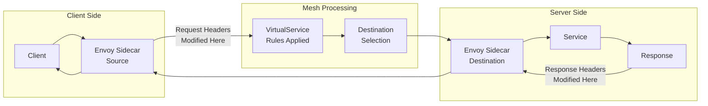
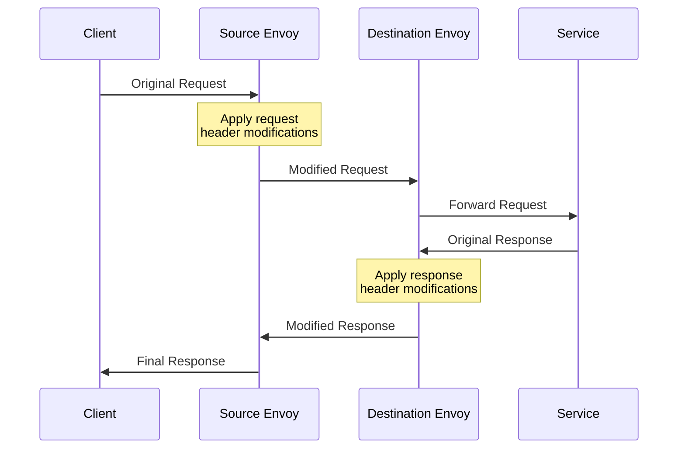
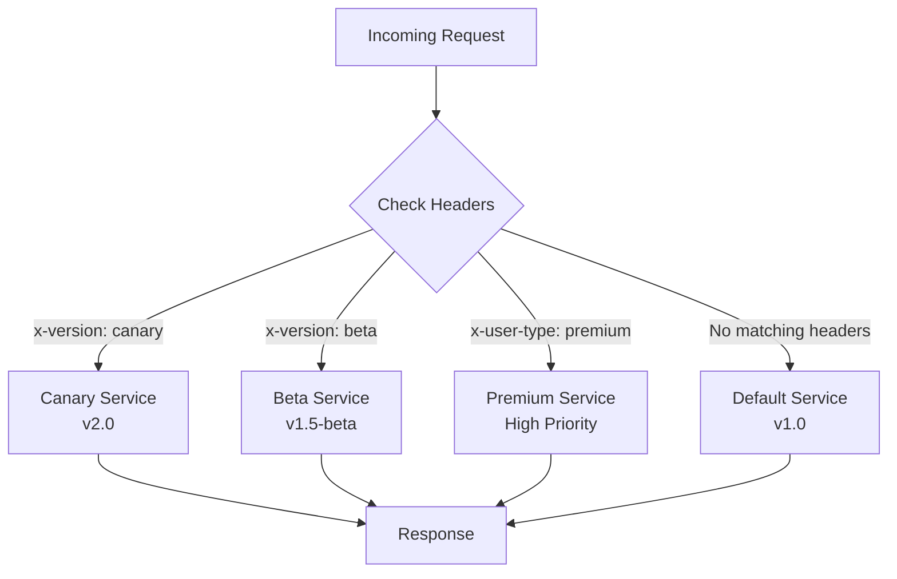

# How to Manipulate Request Headers with Istio

Author: [nawazdhandala](https://github.com/nawazdhandala)

Tags: Istio, Headers, HTTP, Traffic Management, Service Mesh

Description: Learn how to add, remove, and modify HTTP headers using Istio VirtualService.

---

HTTP headers are fundamental to modern web applications. They carry authentication tokens, routing information, content types, and metadata essential for service-to-service communication. Istio's VirtualService provides powerful capabilities to manipulate these headers at the mesh level, enabling you to implement cross-cutting concerns without modifying application code.

In this comprehensive guide, you'll learn how to add, remove, and modify both request and response headers using Istio, implement header-based routing, and apply common header patterns in production environments.

## Understanding Header Manipulation in Istio

Before diving into configurations, let's understand how Istio processes headers through its Envoy proxy sidecars.

### Header Flow Architecture

The following diagram illustrates how headers flow through the Istio service mesh and where manipulation occurs:



### Request vs Response Header Manipulation

Istio allows you to manipulate headers at two distinct points in the request lifecycle:



## Prerequisites

Before you begin, ensure you have:

- A Kubernetes cluster with Istio installed (version 1.18+)
- `kubectl` configured to communicate with your cluster
- `istioctl` installed for debugging
- Basic understanding of Kubernetes and Istio concepts

## Basic Header Manipulation with VirtualService

### Adding Request Headers

The most common use case is adding headers to requests before they reach your service. This is useful for passing context, authentication information, or routing hints.

The following VirtualService configuration adds custom headers to all requests destined for the `backend-service`:

```yaml
# VirtualService that adds custom headers to incoming requests
# These headers will be visible to the destination service
apiVersion: networking.istio.io/v1beta1
kind: VirtualService
metadata:
  name: backend-headers
  namespace: production
spec:
  # Define which hosts this rule applies to
  hosts:
    - backend-service
  http:
    - route:
        - destination:
            host: backend-service
            port:
              number: 8080
      headers:
        request:
          # Add new headers to the request
          # The 'add' operation appends headers (preserves existing ones)
          add:
            # Add a custom header indicating the request came through the mesh
            x-mesh-processed: "true"
            # Add a timestamp for request tracking
            x-request-timestamp: "%START_TIME%"
            # Add environment information
            x-environment: "production"
```

### Setting Request Headers (Overwrite Existing)

When you need to ensure a header has a specific value, regardless of whether it already exists, use the `set` operation:

```yaml
# VirtualService that sets (overwrites) headers on requests
# Use 'set' when you need to guarantee a specific header value
apiVersion: networking.istio.io/v1beta1
kind: VirtualService
metadata:
  name: backend-headers-set
  namespace: production
spec:
  hosts:
    - backend-service
  http:
    - route:
        - destination:
            host: backend-service
            port:
              number: 8080
      headers:
        request:
          # Set headers - overwrites if they already exist
          set:
            # Force the content type to JSON
            content-type: "application/json"
            # Set a version header that overrides any client-sent value
            x-api-version: "v2"
            # Set the accepted response format
            accept: "application/json"
```

### Removing Request Headers

Security best practices often require removing sensitive headers before they reach backend services. Use the `remove` operation to strip headers:

```yaml
# VirtualService that removes sensitive headers from requests
# This is crucial for security - prevent header injection attacks
apiVersion: networking.istio.io/v1beta1
kind: VirtualService
metadata:
  name: backend-headers-remove
  namespace: production
spec:
  hosts:
    - backend-service
  http:
    - route:
        - destination:
            host: backend-service
            port:
              number: 8080
      headers:
        request:
          # Remove headers that should not reach the backend
          remove:
            # Remove any client-supplied internal headers
            - x-internal-token
            # Remove headers that could be used for spoofing
            - x-real-ip
            - x-forwarded-for
            # Remove debug headers in production
            - x-debug-mode
```

## Response Header Manipulation

Response headers are equally important for security, caching, and client communication. Istio allows you to modify response headers before they return to the client.

### Adding Security Headers to Responses

The following configuration adds essential security headers to all responses:

```yaml
# VirtualService that adds security headers to all responses
# These headers protect against common web vulnerabilities
apiVersion: networking.istio.io/v1beta1
kind: VirtualService
metadata:
  name: frontend-security-headers
  namespace: production
spec:
  hosts:
    - frontend-service
  http:
    - route:
        - destination:
            host: frontend-service
            port:
              number: 80
      headers:
        response:
          # Add security headers to every response
          add:
            # Prevent clickjacking attacks
            x-frame-options: "DENY"
            # Enable XSS filtering in browsers
            x-xss-protection: "1; mode=block"
            # Prevent MIME type sniffing
            x-content-type-options: "nosniff"
            # Enforce HTTPS connections
            strict-transport-security: "max-age=31536000; includeSubDomains"
            # Control what information is sent in the Referer header
            referrer-policy: "strict-origin-when-cross-origin"
```

### Combining Request and Response Header Manipulation

You can manipulate both request and response headers in a single VirtualService:

```yaml
# VirtualService that manipulates both request and response headers
# This is common for API gateways and edge services
apiVersion: networking.istio.io/v1beta1
kind: VirtualService
metadata:
  name: api-gateway-headers
  namespace: production
spec:
  hosts:
    - api.example.com
  gateways:
    - api-gateway
  http:
    - route:
        - destination:
            host: api-backend
            port:
              number: 8080
      headers:
        # Request header modifications
        request:
          # Add headers for internal routing and tracking
          add:
            x-request-id: "%REQ(x-request-id)%"
            x-gateway-timestamp: "%START_TIME%"
          # Set headers that must have specific values
          set:
            x-forwarded-proto: "https"
          # Remove potentially dangerous headers
          remove:
            - x-powered-by
            - server
        # Response header modifications
        response:
          # Add security and caching headers
          add:
            x-frame-options: "SAMEORIGIN"
            cache-control: "no-store, no-cache, must-revalidate"
          # Remove headers that expose internal information
          remove:
            - x-powered-by
            - server
            - x-aspnet-version
```

## Header-Based Routing

One of Istio's most powerful features is the ability to route traffic based on header values. This enables A/B testing, canary deployments, and feature flagging.

### Routing Flow Based on Headers

The following diagram shows how Istio routes requests based on header values:



### Basic Header-Based Routing

Route traffic to different service versions based on header values:

```yaml
# VirtualService that routes traffic based on header values
# Enables canary deployments and A/B testing
apiVersion: networking.istio.io/v1beta1
kind: VirtualService
metadata:
  name: header-based-routing
  namespace: production
spec:
  hosts:
    - product-service
  http:
    # First rule: Route canary traffic to v2
    # Requests with 'x-canary: true' header go to v2
    - match:
        - headers:
            x-canary:
              # Exact match for the header value
              exact: "true"
      route:
        - destination:
            host: product-service
            subset: v2
      headers:
        request:
          # Add a header to indicate this was a canary request
          add:
            x-routed-to: "canary-v2"

    # Second rule: Route beta users to beta version
    # Requests with 'x-user-group: beta' go to beta subset
    - match:
        - headers:
            x-user-group:
              exact: "beta"
      route:
        - destination:
            host: product-service
            subset: beta
      headers:
        request:
          add:
            x-routed-to: "beta"

    # Default rule: All other traffic goes to stable v1
    - route:
        - destination:
            host: product-service
            subset: v1
      headers:
        request:
          add:
            x-routed-to: "stable-v1"
```

### Regex-Based Header Matching

For more complex matching scenarios, use regex patterns:

```yaml
# VirtualService using regex patterns for header matching
# Useful for matching header value patterns like version ranges
apiVersion: networking.istio.io/v1beta1
kind: VirtualService
metadata:
  name: regex-header-routing
  namespace: production
spec:
  hosts:
    - api-service
  http:
    # Match any version 2.x.x using regex
    - match:
        - headers:
            x-api-version:
              # Regex pattern to match version 2.x.x
              regex: "^2\\.[0-9]+\\.[0-9]+$"
      route:
        - destination:
            host: api-service
            subset: v2

    # Match internal company email domains
    - match:
        - headers:
            x-user-email:
              # Match any @company.com or @company.io email
              regex: ".*@company\\.(com|io)$"
      route:
        - destination:
            host: api-service
            subset: internal

    # Default route
    - route:
        - destination:
            host: api-service
            subset: v1
```

### Prefix-Based Header Matching

Match headers based on value prefixes:

```yaml
# VirtualService using prefix matching for headers
# Useful for matching categories or hierarchical values
apiVersion: networking.istio.io/v1beta1
kind: VirtualService
metadata:
  name: prefix-header-routing
  namespace: production
spec:
  hosts:
    - content-service
  http:
    # Route premium tier users to premium backend
    - match:
        - headers:
            x-subscription-tier:
              # Match any tier starting with 'premium'
              # e.g., premium-basic, premium-plus, premium-enterprise
              prefix: "premium"
      route:
        - destination:
            host: content-service
            subset: premium-backend
          weight: 100

    # Route enterprise customers to dedicated infrastructure
    - match:
        - headers:
            x-customer-id:
              # Match enterprise customer IDs starting with 'ENT-'
              prefix: "ENT-"
      route:
        - destination:
            host: content-service
            subset: enterprise-backend

    # Default route for all other traffic
    - route:
        - destination:
            host: content-service
            subset: standard-backend
```

## Advanced Header Patterns

### Dynamic Header Values with Envoy Variables

Istio supports Envoy's built-in variables for dynamic header values:

```yaml
# VirtualService using Envoy variables for dynamic header values
# These variables are evaluated at request time
apiVersion: networking.istio.io/v1beta1
kind: VirtualService
metadata:
  name: dynamic-headers
  namespace: production
spec:
  hosts:
    - backend-service
  http:
    - route:
        - destination:
            host: backend-service
            port:
              number: 8080
      headers:
        request:
          add:
            # Add the downstream (client) IP address
            x-client-ip: "%DOWNSTREAM_REMOTE_ADDRESS%"
            # Add the downstream IP without port
            x-client-ip-no-port: "%DOWNSTREAM_REMOTE_ADDRESS_WITHOUT_PORT%"
            # Add request start time in milliseconds
            x-request-start-ms: "%START_TIME(%s%3f)%"
            # Add the hostname of the Envoy processing the request
            x-envoy-hostname: "%HOSTNAME%"
            # Add the protocol used (HTTP/1.1, HTTP/2, etc.)
            x-protocol: "%PROTOCOL%"
            # Add upstream cluster name for debugging
            x-upstream-cluster: "%UPSTREAM_CLUSTER%"
        response:
          add:
            # Add response processing time
            x-response-time: "%RESPONSE_DURATION%"
            # Add response flags for debugging
            x-response-flags: "%RESPONSE_FLAGS%"
```

### Header-Based Traffic Mirroring

Mirror traffic to a test environment based on specific headers:

```yaml
# VirtualService that mirrors traffic based on headers
# Useful for testing new versions with production traffic
apiVersion: networking.istio.io/v1beta1
kind: VirtualService
metadata:
  name: header-based-mirroring
  namespace: production
spec:
  hosts:
    - api-service
  http:
    # Mirror debug-flagged requests to shadow environment
    - match:
        - headers:
            x-enable-shadow:
              exact: "true"
      route:
        - destination:
            host: api-service
            subset: production
      # Mirror 100% of matching traffic to shadow service
      mirror:
        host: api-service
        subset: shadow
      # Percentage of traffic to mirror (100% = all matching requests)
      mirrorPercentage:
        value: 100.0
      headers:
        request:
          add:
            x-mirrored: "true"

    # Default route without mirroring
    - route:
        - destination:
            host: api-service
            subset: production
```

### Conditional Header Manipulation with Multiple Matches

Apply different header manipulations based on complex conditions:

```yaml
# VirtualService with conditional header manipulation
# Different headers are added based on request characteristics
apiVersion: networking.istio.io/v1beta1
kind: VirtualService
metadata:
  name: conditional-headers
  namespace: production
spec:
  hosts:
    - multi-tenant-service
  http:
    # Premium users get additional headers and priority routing
    - match:
        - headers:
            x-user-tier:
              exact: "premium"
            x-region:
              exact: "us-east"
      route:
        - destination:
            host: multi-tenant-service
            subset: premium-us-east
      headers:
        request:
          add:
            x-priority: "high"
            x-rate-limit-tier: "premium"
            x-cache-priority: "high"
        response:
          add:
            x-served-by: "premium-us-east"

    # Standard users in EU region
    - match:
        - headers:
            x-region:
              regex: "^eu-.*$"
      route:
        - destination:
            host: multi-tenant-service
            subset: standard-eu
      headers:
        request:
          add:
            x-priority: "normal"
            x-data-residency: "eu"
        response:
          add:
            x-served-by: "standard-eu"
            x-gdpr-compliant: "true"

    # Default routing
    - route:
        - destination:
            host: multi-tenant-service
            subset: standard
      headers:
        request:
          add:
            x-priority: "normal"
```

## Common Header Patterns

### Pattern 1: Request Tracing Headers

Ensure distributed tracing headers are propagated correctly:

```yaml
# VirtualService for distributed tracing header management
# Ensures trace context is properly propagated through the mesh
apiVersion: networking.istio.io/v1beta1
kind: VirtualService
metadata:
  name: tracing-headers
  namespace: production
spec:
  hosts:
    - order-service
  http:
    - route:
        - destination:
            host: order-service
            port:
              number: 8080
      headers:
        request:
          # Preserve and enhance tracing headers
          add:
            # Add mesh-specific trace information
            x-mesh-trace-id: "%REQ(x-request-id)%"
            # Add timestamp for latency analysis
            x-trace-timestamp: "%START_TIME%"
          # Ensure B3 tracing headers are set if missing
          set:
            # Baggage headers for cross-service context
            baggage: "%REQ(baggage)%"
```

### Pattern 2: CORS Headers for API Gateways

Configure CORS headers at the mesh level:

```yaml
# VirtualService with CORS response headers
# Enables cross-origin requests for web applications
apiVersion: networking.istio.io/v1beta1
kind: VirtualService
metadata:
  name: cors-headers
  namespace: production
spec:
  hosts:
    - api.example.com
  gateways:
    - api-gateway
  http:
    - route:
        - destination:
            host: api-backend
            port:
              number: 8080
      headers:
        response:
          # Add CORS headers to all responses
          add:
            # Allow requests from specific origins
            access-control-allow-origin: "https://app.example.com"
            # Allow specific HTTP methods
            access-control-allow-methods: "GET, POST, PUT, DELETE, OPTIONS"
            # Allow specific headers in requests
            access-control-allow-headers: "Authorization, Content-Type, X-Request-ID"
            # Expose specific headers to the client
            access-control-expose-headers: "X-Request-ID, X-RateLimit-Remaining"
            # Allow credentials (cookies, auth headers)
            access-control-allow-credentials: "true"
            # Cache preflight response for 24 hours
            access-control-max-age: "86400"
```

### Pattern 3: Rate Limiting Headers

Add rate limiting information to responses:

```yaml
# VirtualService for rate limiting header communication
# Informs clients about their rate limit status
apiVersion: networking.istio.io/v1beta1
kind: VirtualService
metadata:
  name: rate-limit-headers
  namespace: production
spec:
  hosts:
    - api-service
  http:
    # Premium tier with higher limits
    - match:
        - headers:
            x-api-tier:
              exact: "premium"
      route:
        - destination:
            host: api-service
            subset: premium
      headers:
        response:
          add:
            # Indicate the rate limit tier
            x-ratelimit-tier: "premium"
            # Maximum requests per window
            x-ratelimit-limit: "10000"
            # Rate limit window in seconds
            x-ratelimit-window: "3600"

    # Standard tier with default limits
    - route:
        - destination:
            host: api-service
            subset: standard
      headers:
        response:
          add:
            x-ratelimit-tier: "standard"
            x-ratelimit-limit: "1000"
            x-ratelimit-window: "3600"
```

### Pattern 4: A/B Testing Headers

Implement A/B testing with header-based routing:

```yaml
# VirtualService for A/B testing implementation
# Routes users to different versions based on experiment headers
apiVersion: networking.istio.io/v1beta1
kind: VirtualService
metadata:
  name: ab-testing-headers
  namespace: production
spec:
  hosts:
    - checkout-service
  http:
    # Experiment A: New checkout flow
    - match:
        - headers:
            x-experiment-id:
              exact: "checkout-v2"
      route:
        - destination:
            host: checkout-service
            subset: experiment-a
      headers:
        request:
          add:
            x-experiment-variant: "A"
            x-experiment-name: "checkout-v2"
        response:
          add:
            x-experiment-served: "checkout-v2-variant-a"

    # Experiment B: Alternative checkout flow
    - match:
        - headers:
            x-experiment-id:
              exact: "checkout-v3"
      route:
        - destination:
            host: checkout-service
            subset: experiment-b
      headers:
        request:
          add:
            x-experiment-variant: "B"
            x-experiment-name: "checkout-v3"
        response:
          add:
            x-experiment-served: "checkout-v3-variant-b"

    # Control group: Original checkout flow
    - route:
        - destination:
            host: checkout-service
            subset: control
      headers:
        response:
          add:
            x-experiment-served: "control"
```

### Pattern 5: Authentication and Authorization Headers

Transform authentication headers for downstream services:

```yaml
# VirtualService for authentication header transformation
# Transforms external auth tokens to internal service tokens
apiVersion: networking.istio.io/v1beta1
kind: VirtualService
metadata:
  name: auth-headers
  namespace: production
spec:
  hosts:
    - internal-api
  http:
    - route:
        - destination:
            host: internal-api
            port:
              number: 8080
      headers:
        request:
          # Remove external authorization headers
          # (Authentication should be handled by Istio AuthorizationPolicy)
          remove:
            - authorization
            - x-api-key
          # Add internal service identity headers
          # These would typically be set by an auth filter
          add:
            x-authenticated: "true"
            x-auth-provider: "istio-mesh"
        response:
          # Remove any internal auth headers from responses
          remove:
            - x-internal-auth-token
            - x-service-account
```

## DestinationRule for Header-Based Subsets

To use header-based routing effectively, you need to define subsets in a DestinationRule:

```yaml
# DestinationRule defining subsets for header-based routing
# Works in conjunction with VirtualService rules
apiVersion: networking.istio.io/v1beta1
kind: DestinationRule
metadata:
  name: product-service-subsets
  namespace: production
spec:
  host: product-service
  # Traffic policy applied to all subsets
  trafficPolicy:
    connectionPool:
      http:
        h2UpgradePolicy: UPGRADE
  # Define subsets based on labels
  subsets:
    # Stable production version
    - name: v1
      labels:
        version: v1
      trafficPolicy:
        connectionPool:
          http:
            maxRequestsPerConnection: 100

    # Canary version for testing
    - name: v2
      labels:
        version: v2
      trafficPolicy:
        connectionPool:
          http:
            maxRequestsPerConnection: 50

    # Beta version for beta testers
    - name: beta
      labels:
        version: beta
      trafficPolicy:
        connectionPool:
          http:
            maxRequestsPerConnection: 50
```

## Complete Example: E-Commerce API Gateway

Here's a complete, production-ready example combining multiple header patterns:

```yaml
# Complete API Gateway configuration with comprehensive header management
# This example shows a production-ready setup for an e-commerce API
---
apiVersion: networking.istio.io/v1beta1
kind: Gateway
metadata:
  name: ecommerce-gateway
  namespace: production
spec:
  selector:
    istio: ingressgateway
  servers:
    - port:
        number: 443
        name: https
        protocol: HTTPS
      tls:
        mode: SIMPLE
        credentialName: ecommerce-tls
      hosts:
        - "api.ecommerce.com"
---
apiVersion: networking.istio.io/v1beta1
kind: VirtualService
metadata:
  name: ecommerce-api
  namespace: production
spec:
  hosts:
    - "api.ecommerce.com"
  gateways:
    - ecommerce-gateway
  http:
    # Health check endpoint - minimal processing
    - match:
        - uri:
            exact: /health
      route:
        - destination:
            host: health-service
            port:
              number: 8080

    # Premium API users - dedicated backend with enhanced features
    - match:
        - headers:
            x-api-tier:
              exact: "premium"
          uri:
            prefix: /api/v2
      route:
        - destination:
            host: api-backend
            subset: premium
      headers:
        request:
          add:
            x-priority: "high"
            x-rate-limit: "10000"
            x-request-id: "%REQ(x-request-id)%"
            x-client-ip: "%DOWNSTREAM_REMOTE_ADDRESS_WITHOUT_PORT%"
          remove:
            - x-debug
            - x-internal-token
        response:
          add:
            x-frame-options: "DENY"
            x-content-type-options: "nosniff"
            x-xss-protection: "1; mode=block"
            strict-transport-security: "max-age=31536000; includeSubDomains"
            x-served-by: "premium-backend"
            x-ratelimit-limit: "10000"
            x-ratelimit-window: "3600"
          remove:
            - server
            - x-powered-by

    # Canary testing - route specific users to new version
    - match:
        - headers:
            x-canary:
              exact: "true"
          uri:
            prefix: /api/v2
      route:
        - destination:
            host: api-backend
            subset: canary
      headers:
        request:
          add:
            x-canary-routed: "true"
            x-request-id: "%REQ(x-request-id)%"
        response:
          add:
            x-served-by: "canary"
            x-version: "2.1.0-canary"

    # A/B test for checkout flow
    - match:
        - headers:
            x-experiment:
              regex: "^checkout-.*$"
          uri:
            prefix: /api/v2/checkout
      route:
        - destination:
            host: checkout-service
            subset: experiment
      headers:
        request:
          add:
            x-experiment-enabled: "true"
        response:
          add:
            x-experiment-variant: "%REQ(x-experiment)%"

    # Standard API v2 traffic
    - match:
        - uri:
            prefix: /api/v2
      route:
        - destination:
            host: api-backend
            subset: stable
          weight: 100
      headers:
        request:
          add:
            x-priority: "normal"
            x-rate-limit: "1000"
            x-request-id: "%REQ(x-request-id)%"
            x-client-ip: "%DOWNSTREAM_REMOTE_ADDRESS_WITHOUT_PORT%"
          set:
            x-forwarded-proto: "https"
          remove:
            - x-debug
            - x-internal-token
            - x-admin-override
        response:
          add:
            x-frame-options: "DENY"
            x-content-type-options: "nosniff"
            x-xss-protection: "1; mode=block"
            strict-transport-security: "max-age=31536000; includeSubDomains"
            cache-control: "private, no-cache"
            x-ratelimit-limit: "1000"
            x-ratelimit-window: "3600"
          remove:
            - server
            - x-powered-by
            - x-aspnet-version

    # Legacy API v1 - deprecated, add warning headers
    - match:
        - uri:
            prefix: /api/v1
      route:
        - destination:
            host: api-backend-legacy
            port:
              number: 8080
      headers:
        request:
          add:
            x-legacy-api: "true"
        response:
          add:
            deprecation: "true"
            sunset: "2025-12-31T23:59:59Z"
            x-api-warn: "API v1 is deprecated. Please migrate to v2."
            link: "</api/v2>; rel=\"successor-version\""
---
apiVersion: networking.istio.io/v1beta1
kind: DestinationRule
metadata:
  name: api-backend-dr
  namespace: production
spec:
  host: api-backend
  trafficPolicy:
    connectionPool:
      http:
        h2UpgradePolicy: UPGRADE
        maxRequestsPerConnection: 100
  subsets:
    - name: stable
      labels:
        version: stable
    - name: premium
      labels:
        version: stable
        tier: premium
    - name: canary
      labels:
        version: canary
```

## Debugging Header Manipulation

### Using istioctl for Header Inspection

Verify your header configurations are applied correctly:

```bash
# Check the VirtualService configuration
# This shows the current routing rules including header manipulations
istioctl analyze -n production

# View the effective Envoy configuration for a pod
# Look for the 'request_headers_to_add' and 'response_headers_to_add' sections
istioctl proxy-config routes deploy/api-backend -n production -o json | \
  jq '.[] | select(.name == "api.ecommerce.com:443") | .virtualHosts[].routes[].route'

# Check listener configuration for header processing
istioctl proxy-config listeners deploy/api-backend -n production -o json | \
  jq '.[].filterChains[].filters[] | select(.name == "envoy.filters.network.http_connection_manager")'
```

### Testing Header Manipulation

Use curl to verify headers are being manipulated correctly:

```bash
# Test request header addition
# The -v flag shows both request and response headers
curl -v -H "Host: api.ecommerce.com" \
  -H "x-api-tier: premium" \
  https://istio-ingressgateway.istio-system/api/v2/products

# Test header-based routing
# Send a request with canary header and verify routing
curl -v -H "Host: api.ecommerce.com" \
  -H "x-canary: true" \
  https://istio-ingressgateway.istio-system/api/v2/products

# Verify response headers include security headers
curl -I -H "Host: api.ecommerce.com" \
  https://istio-ingressgateway.istio-system/api/v2/products | \
  grep -E "(x-frame-options|x-content-type-options|strict-transport-security)"
```

### Envoy Access Logs for Header Debugging

Enable detailed access logging to see header values:

```yaml
# Telemetry configuration for header debugging
# Enables detailed logging of request and response headers
apiVersion: telemetry.istio.io/v1alpha1
kind: Telemetry
metadata:
  name: header-debug-logging
  namespace: production
spec:
  accessLogging:
    - providers:
        - name: envoy
      filter:
        expression: "request.headers['x-debug'] == 'true'"
```

## Best Practices

### 1. Use Consistent Header Naming

Follow a consistent naming convention for custom headers:

```yaml
# Good: Use a consistent prefix for custom headers
headers:
  request:
    add:
      x-mycompany-request-id: "%REQ(x-request-id)%"
      x-mycompany-client-ip: "%DOWNSTREAM_REMOTE_ADDRESS%"
      x-mycompany-environment: "production"
```

### 2. Always Remove Sensitive Headers

Protect your services by removing headers that could be exploited:

```yaml
# Security: Always remove potentially dangerous headers
headers:
  request:
    remove:
      - x-forwarded-for  # Prevent IP spoofing
      - x-real-ip        # Prevent IP spoofing
      - x-internal-token # Prevent token injection
      - x-admin-bypass   # Prevent privilege escalation
```

### 3. Add Response Headers at the Edge

Add security headers at the ingress gateway, not at individual services:

```yaml
# Apply security headers at the gateway level
# This ensures consistent security across all services
spec:
  gateways:
    - api-gateway
  http:
    - route:
        - destination:
            host: backend
      headers:
        response:
          add:
            x-frame-options: "DENY"
            x-content-type-options: "nosniff"
```

### 4. Document Header Contracts

Maintain clear documentation of expected headers:

```yaml
# Document the header contract in annotations
apiVersion: networking.istio.io/v1beta1
kind: VirtualService
metadata:
  name: documented-service
  annotations:
    # Document expected request headers
    headers.mycompany.io/request: |
      x-request-id: Required, UUID format
      x-user-id: Optional, authenticated user ID
      x-api-version: Required, semver format
    # Document response headers
    headers.mycompany.io/response: |
      x-request-id: Echo of request ID
      x-ratelimit-remaining: Remaining API calls
```

## Conclusion

Istio's header manipulation capabilities provide a powerful way to implement cross-cutting concerns at the infrastructure level. By mastering VirtualService header configurations, you can:

- Enhance security by adding protective headers and removing sensitive ones
- Implement sophisticated routing strategies based on header values
- Enable A/B testing and canary deployments without application changes
- Improve observability by adding tracing and debugging headers
- Maintain consistent API behavior across your service mesh

The key to success is understanding the request flow through Istio's Envoy proxies and applying header manipulations at the appropriate points. Start with simple use cases like adding security headers, then gradually implement more complex patterns like header-based routing and traffic mirroring.

Remember to always test your header configurations in a staging environment before deploying to production, and use Istio's debugging tools to verify that headers are being manipulated as expected.

## Additional Resources

- [Istio VirtualService Reference](https://istio.io/latest/docs/reference/config/networking/virtual-service/)
- [Envoy Header Manipulation](https://www.envoyproxy.io/docs/envoy/latest/configuration/http/http_conn_man/headers)
- [Istio Traffic Management](https://istio.io/latest/docs/concepts/traffic-management/)
- [HTTP Headers Best Practices](https://developer.mozilla.org/en-US/docs/Web/HTTP/Headers)
