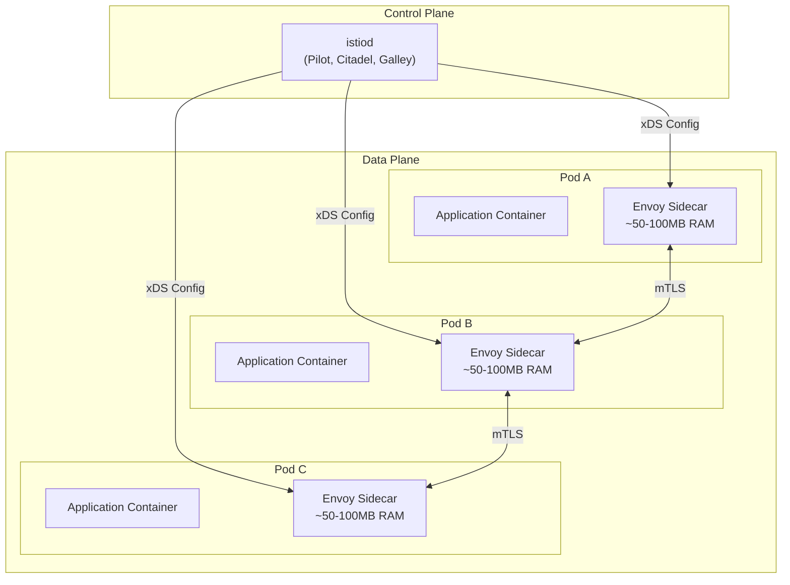
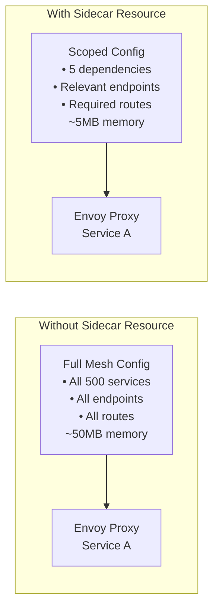
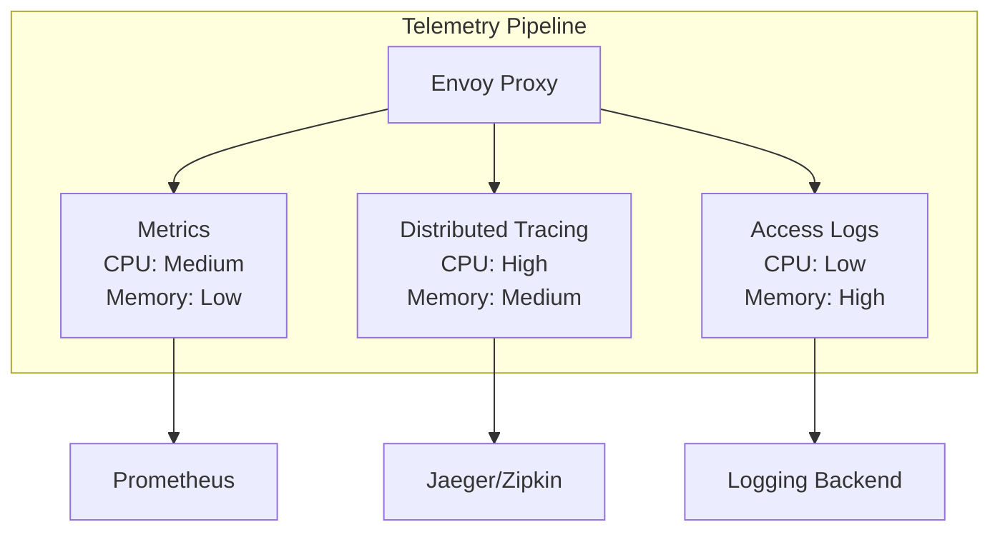
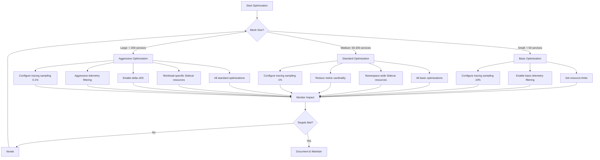

# How to Optimize Istio Resource Usage and Performance

Author: [nawazdhandala](https://github.com/nawazdhandala)

Tags: Istio, Performance, Optimization, Resource Management, Service Mesh

Description: Learn how to tune Istio for optimal resource usage and performance in production.

---

Istio provides powerful service mesh capabilities, but without proper tuning, it can consume significant cluster resources and impact application performance. This comprehensive guide covers strategies to optimize Istio's resource usage while maintaining its core functionality.

## Understanding Istio's Resource Footprint

Before diving into optimization techniques, it's important to understand where Istio consumes resources:

The following diagram illustrates Istio's architecture and resource consumption points:



## 1. Optimizing Envoy Sidecar Proxy Resources

### Setting Appropriate Resource Limits

Each sidecar proxy consumes CPU and memory. Setting appropriate limits prevents resource starvation while avoiding over-provisioning.

The following configuration sets resource requests and limits for Envoy sidecars globally through the IstioOperator:

```yaml
# IstioOperator configuration to set global sidecar resource limits
# This applies to all sidecars unless overridden at the pod level
apiVersion: install.istio.io/v1alpha1
kind: IstioOperator
metadata:
  name: istio-control-plane
  namespace: istio-system
spec:
  # meshConfig controls mesh-wide settings
  meshConfig:
    defaultConfig:
      # Concurrency controls the number of worker threads
      # Set to 0 for auto-detection based on CPU limits
      # For resource-constrained environments, set to 1 or 2
      concurrency: 2

  # Global proxy settings affect all Envoy sidecars
  values:
    global:
      proxy:
        # Resource requests - minimum resources guaranteed
        resources:
          requests:
            # 100m (100 millicores) is suitable for light traffic
            # Increase for high-throughput services
            cpu: 100m
            # 128Mi handles most workloads
            # Increase if you see OOMKilled events
            memory: 128Mi
          limits:
            # 2 CPU cores as upper bound for burst traffic
            cpu: 2000m
            # 1Gi prevents memory leaks from causing node issues
            memory: 1024Mi
```

### Per-Pod Resource Overrides

For services with varying traffic patterns, override resource settings at the pod level using annotations.

The following annotations can be added to individual pod specs to customize sidecar resources:

```yaml
# Pod annotations for per-service sidecar resource customization
# Use these when specific services need different resource allocations
apiVersion: apps/v1
kind: Deployment
metadata:
  name: high-traffic-service
spec:
  template:
    metadata:
      annotations:
        # CPU request for the sidecar container
        # High-traffic services may need more CPU
        sidecar.istio.io/proxyCPU: "200m"

        # Maximum CPU the sidecar can use
        # Prevents the proxy from consuming excessive CPU during spikes
        sidecar.istio.io/proxyCPULimit: "4000m"

        # Memory request for the sidecar
        # Increase for services with many endpoints or complex routing
        sidecar.istio.io/proxyMemory: "256Mi"

        # Maximum memory before the container is OOMKilled
        # Set based on observed memory usage plus headroom
        sidecar.istio.io/proxyMemoryLimit: "2Gi"
    spec:
      containers:
      - name: app
        image: my-app:latest
```

### Tuning Envoy Concurrency

Envoy worker threads directly impact CPU usage. Adjusting concurrency based on your workload characteristics can significantly reduce CPU consumption.

```yaml
# Annotation to control Envoy worker thread count
# Lower values reduce CPU usage but may impact throughput
apiVersion: apps/v1
kind: Deployment
metadata:
  name: low-traffic-service
spec:
  template:
    metadata:
      annotations:
        # Set to 1 for low-traffic services
        # Each worker thread consumes CPU even when idle
        # Default is 2, auto-detection uses 0
        proxy.istio.io/config: |
          concurrency: 1
    spec:
      containers:
      - name: app
        image: my-app:latest
```

## 2. Sidecar Resource Scoping

One of the most impactful optimizations is using Sidecar resources to limit the configuration scope each proxy receives.

### The Problem with Default Configuration

By default, every Envoy sidecar receives configuration for every service in the mesh:



### Creating Namespace-Wide Sidecar Resources

Apply a Sidecar resource to limit what each proxy can see, dramatically reducing memory and CPU usage.

The following Sidecar resource restricts all proxies in the namespace to only access specific services:

```yaml
# Sidecar resource to scope Envoy configuration
# This reduces memory usage by limiting the services each proxy knows about
apiVersion: networking.istio.io/v1beta1
kind: Sidecar
metadata:
  name: default
  # Apply to all workloads in this namespace
  namespace: my-application
spec:
  # Egress configuration defines what services this namespace can access
  egress:
  - hosts:
    # Allow access to services within the same namespace
    # "./*" means all services in the current namespace
    - "./*"

    # Allow access to the istio-system namespace for control plane
    # This is required for proper mesh operation
    - "istio-system/*"

    # Explicitly list external namespaces this app depends on
    # Only include namespaces that are actually needed
    - "database-namespace/postgres.database-namespace.svc.cluster.local"
    - "cache-namespace/redis.cache-namespace.svc.cluster.local"
    - "messaging-namespace/kafka.messaging-namespace.svc.cluster.local"
```

### Workload-Specific Sidecar Configuration

For granular control, apply Sidecar resources to specific workloads using workloadSelector.

The following configuration limits a specific service to only the endpoints it actually communicates with:

```yaml
# Workload-specific Sidecar for precise configuration control
# Use when different services in a namespace have different dependencies
apiVersion: networking.istio.io/v1beta1
kind: Sidecar
metadata:
  name: payment-service-sidecar
  namespace: my-application
spec:
  # workloadSelector targets specific pods by label
  workloadSelector:
    labels:
      # Only apply to pods with this label
      app: payment-service

  # Ingress configuration defines how traffic enters the workload
  ingress:
  - port:
      number: 8080
      protocol: HTTP
      name: http
    # Bind to all interfaces
    defaultEndpoint: 0.0.0.0:8080

  # Egress configuration - only services payment-service actually calls
  egress:
  - hosts:
    # Access to own namespace
    - "./*"
    # Control plane access
    - "istio-system/*"
    # Only the specific external services needed
    - "database-namespace/postgres.database-namespace.svc.cluster.local"
    - "fraud-detection-namespace/fraud-api.fraud-detection-namespace.svc.cluster.local"

  # Outbound traffic policy
  outboundTrafficPolicy:
    # REGISTRY_ONLY blocks access to services not in the mesh
    # This provides security and reduces config size
    mode: REGISTRY_ONLY
```

### Calculating Memory Savings

The following table shows typical memory savings from Sidecar scoping:

| Mesh Size | Without Sidecar | With Sidecar (5 deps) | Savings |
|-----------|-----------------|----------------------|---------|
| 100 services | ~40MB | ~8MB | 80% |
| 500 services | ~100MB | ~10MB | 90% |
| 1000 services | ~200MB | ~12MB | 94% |

## 3. Telemetry Configuration Tuning

Telemetry features (metrics, tracing, access logs) consume significant resources. Tune them based on your observability requirements.

### Understanding Telemetry Impact



### Optimizing Metrics Collection

Reduce the number of metrics collected to lower CPU and memory overhead.

The following Telemetry resource configures which metrics are collected:

```yaml
# Telemetry resource to customize metrics collection
# Reducing metrics significantly lowers resource usage
apiVersion: telemetry.istio.io/v1alpha1
kind: Telemetry
metadata:
  name: mesh-metrics-config
  # Apply mesh-wide by placing in istio-system
  namespace: istio-system
spec:
  # Metrics configuration
  metrics:
  - providers:
    - name: prometheus
    # Customize which metrics are reported
    overrides:
    # Disable expensive histogram metrics for request size
    - match:
        metric: REQUEST_SIZE
        mode: CLIENT_AND_SERVER
      disabled: true

    # Disable response size histograms
    - match:
        metric: RESPONSE_SIZE
        mode: CLIENT_AND_SERVER
      disabled: true

    # Keep only essential request metrics
    - match:
        metric: REQUEST_COUNT
        mode: CLIENT_AND_SERVER
      # Remove high-cardinality labels to reduce metric volume
      tagOverrides:
        # Remove response_flags label (rarely needed)
        response_flags:
          operation: REMOVE
        # Remove grpc_response_status for non-gRPC services
        grpc_response_status:
          operation: REMOVE
```

### Reducing Cardinality with Tag Overrides

High-cardinality labels cause metrics explosion. Use tag overrides to manage cardinality.

The following configuration removes or modifies labels that create too many time series:

```yaml
# Telemetry configuration to reduce metric cardinality
# High cardinality labels can cause Prometheus memory issues
apiVersion: telemetry.istio.io/v1alpha1
kind: Telemetry
metadata:
  name: low-cardinality-metrics
  namespace: istio-system
spec:
  metrics:
  - providers:
    - name: prometheus
    overrides:
    - match:
        metric: REQUEST_COUNT
      tagOverrides:
        # Remove destination_service label if you have many services
        # This label creates one time series per service
        destination_service:
          operation: REMOVE

        # Remove request_protocol if you only use HTTP
        request_protocol:
          operation: REMOVE

        # Replace high-cardinality response_code with response_code_class
        # Changes 200, 201, 204 -> 2xx
        response_code:
          operation: REMOVE

    - match:
        metric: REQUEST_DURATION
      tagOverrides:
        # Same optimizations for latency histograms
        destination_service:
          operation: REMOVE
        response_code:
          operation: REMOVE
```

### Configuring Tracing Sampling

Full tracing is expensive. Reduce sampling rate for high-traffic services.

The following MeshConfig sets tracing sampling rates:

```yaml
# IstioOperator configuration for tracing optimization
apiVersion: install.istio.io/v1alpha1
kind: IstioOperator
metadata:
  name: istio-control-plane
spec:
  meshConfig:
    # Enable distributed tracing
    enableTracing: true

    defaultConfig:
      tracing:
        # Sampling rate: 1.0 = 100%, 0.01 = 1%
        # For high-traffic production, 1% is often sufficient
        sampling: 1.0

        # Maximum tag length to prevent memory bloat
        # Truncates long values in span tags
        max_tag_length: 256

        # Custom tags to add context without expensive lookups
        custom_tags:
          environment:
            literal:
              value: "production"
```

### Namespace-Specific Tracing Overrides

Apply different sampling rates to different namespaces based on their importance.

The following Telemetry resource overrides tracing for a specific namespace:

```yaml
# Namespace-specific tracing configuration
# Use higher sampling for critical services, lower for high-volume services
apiVersion: telemetry.istio.io/v1alpha1
kind: Telemetry
metadata:
  name: high-volume-tracing
  # Apply to a specific namespace with high traffic
  namespace: batch-processing
spec:
  tracing:
  - # Reduce sampling to 0.1% for batch jobs
    randomSamplingPercentage: 0.1

    # Disable span reporting for known internal calls
    disableSpanReporting: false

    # Use custom tags instead of expensive header extraction
    customTags:
      namespace:
        literal:
          value: "batch-processing"
---
# Higher sampling for critical user-facing services
apiVersion: telemetry.istio.io/v1alpha1
kind: Telemetry
metadata:
  name: critical-service-tracing
  namespace: checkout
spec:
  tracing:
  - # 10% sampling for payment-critical flows
    randomSamplingPercentage: 10.0
```

### Optimizing Access Logging

Access logs consume significant resources. Configure them selectively.

The following configuration enables access logging only for specific conditions:

```yaml
# Telemetry configuration for conditional access logging
# Only log errors or slow requests to reduce volume
apiVersion: telemetry.istio.io/v1alpha1
kind: Telemetry
metadata:
  name: conditional-access-logs
  namespace: istio-system
spec:
  accessLogging:
  - providers:
    - name: envoy
    # Filter to only log errors (4xx and 5xx responses)
    filter:
      expression: "response.code >= 400"
---
# Alternative: Log slow requests for performance debugging
apiVersion: telemetry.istio.io/v1alpha1
kind: Telemetry
metadata:
  name: slow-request-logging
  namespace: production
spec:
  accessLogging:
  - providers:
    - name: envoy
    # Log requests taking more than 1 second
    filter:
      expression: "duration > duration('1s')"
```

### Disabling Access Logs Entirely

For maximum performance, disable access logging in the data plane.

The following configuration disables access logging mesh-wide:

```yaml
# IstioOperator configuration to disable access logging
# Use when you have alternative logging solutions
apiVersion: install.istio.io/v1alpha1
kind: IstioOperator
metadata:
  name: istio-control-plane
spec:
  meshConfig:
    # Disable access logging entirely
    accessLogFile: ""

    # Or use /dev/null to explicitly discard
    # accessLogFile: "/dev/null"

    # Disable access log encoding overhead
    accessLogEncoding: TEXT

    defaultConfig:
      proxyStatsMatcher:
        # Disable detailed proxy stats to reduce memory
        inclusionPrefixes: []
        inclusionRegexps: []
```

## 4. Control Plane Optimization

The Istio control plane (istiod) also needs proper resource tuning.

### Scaling istiod Horizontally

For large meshes, run multiple istiod replicas for high availability and load distribution.

The following HorizontalPodAutoscaler automatically scales istiod:

```yaml
# HorizontalPodAutoscaler for istiod
# Automatically scales based on CPU usage
apiVersion: autoscaling/v2
kind: HorizontalPodAutoscaler
metadata:
  name: istiod
  namespace: istio-system
spec:
  scaleTargetRef:
    apiVersion: apps/v1
    kind: Deployment
    name: istiod
  # Minimum replicas for high availability
  minReplicas: 2
  # Maximum replicas to handle load spikes
  maxReplicas: 5
  metrics:
  - type: Resource
    resource:
      name: cpu
      target:
        # Scale up when CPU exceeds 80%
        type: Utilization
        averageUtilization: 80
  - type: Resource
    resource:
      name: memory
      target:
        # Scale up when memory exceeds 80%
        type: Utilization
        averageUtilization: 80
  behavior:
    # Gradual scale down to avoid flapping
    scaleDown:
      stabilizationWindowSeconds: 300
      policies:
      - type: Percent
        value: 10
        periodSeconds: 60
```

### Setting istiod Resource Limits

Configure appropriate resources for the control plane based on mesh size.

The following IstioOperator sets control plane resources:

```yaml
# IstioOperator configuration for control plane resources
apiVersion: install.istio.io/v1alpha1
kind: IstioOperator
metadata:
  name: istio-control-plane
spec:
  components:
    pilot:
      k8s:
        # Resource configuration for istiod
        resources:
          requests:
            # Base CPU request - increase for larger meshes
            cpu: 500m
            # Base memory request - scales with number of services
            memory: 2Gi
          limits:
            # Allow burst CPU for config pushes
            cpu: 2000m
            # Memory limit to prevent OOM issues
            memory: 4Gi

        # Horizontal Pod Autoscaler configuration
        hpaSpec:
          minReplicas: 2
          maxReplicas: 5
          metrics:
          - type: Resource
            resource:
              name: cpu
              target:
                averageUtilization: 80
                type: Utilization

        # Pod disruption budget for availability
        podDisruptionBudget:
          minAvailable: 1
```

### Optimizing xDS Push Frequency

Control how often istiod pushes configuration to proxies.

The following environment variables tune istiod's push behavior:

```yaml
# IstioOperator with xDS optimization settings
apiVersion: install.istio.io/v1alpha1
kind: IstioOperator
metadata:
  name: istio-control-plane
spec:
  components:
    pilot:
      k8s:
        env:
        # Debounce period before pushing config changes
        # Higher values reduce push frequency but delay config propagation
        - name: PILOT_DEBOUNCE_AFTER
          value: "100ms"

        # Maximum debounce delay
        # Ensures config is pushed within this time even during rapid changes
        - name: PILOT_DEBOUNCE_MAX
          value: "1s"

        # Enable incremental xDS for faster, smaller pushes
        # Only sends changed configuration instead of full state
        - name: PILOT_ENABLE_EDS_DEBOUNCE
          value: "true"

        # Filter out unnecessary config from pushes
        # Reduces push size significantly
        - name: PILOT_FILTER_GATEWAY_CLUSTER_CONFIG
          value: "true"

        # Limit the number of concurrent xDS pushes
        # Prevents overwhelming proxies during large changes
        - name: PILOT_PUSH_THROTTLE
          value: "100"
```

### Enabling Delta xDS

Delta xDS sends only configuration changes instead of full state, dramatically reducing bandwidth and CPU.

The following configuration enables delta xDS (requires Istio 1.12+):

```yaml
# IstioOperator enabling delta xDS for efficiency
apiVersion: install.istio.io/v1alpha1
kind: IstioOperator
metadata:
  name: istio-control-plane
spec:
  meshConfig:
    defaultConfig:
      proxyMetadata:
        # Enable delta xDS on the proxy side
        # This is the most impactful optimization for large meshes
        ISTIO_DELTA_XDS: "true"

  components:
    pilot:
      k8s:
        env:
        # Enable delta xDS on the control plane side
        - name: PILOT_ENABLE_INCREMENTAL_MCP
          value: "true"
```

## 5. Gateway Optimization

Istio ingress and egress gateways handle external traffic and need specific tuning.

### Gateway Resource Allocation

Gateways handle high traffic volumes and need appropriate resources.

The following configuration sizes gateway resources for production traffic:

```yaml
# IstioOperator configuration for gateway resources
apiVersion: install.istio.io/v1alpha1
kind: IstioOperator
metadata:
  name: istio-control-plane
spec:
  components:
    ingressGateways:
    - name: istio-ingressgateway
      enabled: true
      k8s:
        # Resource allocation for high-traffic gateways
        resources:
          requests:
            # Higher CPU for TLS termination and routing
            cpu: 1000m
            # More memory for connection pooling
            memory: 1Gi
          limits:
            cpu: 4000m
            memory: 4Gi

        # Horizontal Pod Autoscaler for automatic scaling
        hpaSpec:
          minReplicas: 2
          maxReplicas: 10
          metrics:
          - type: Resource
            resource:
              name: cpu
              target:
                averageUtilization: 60
                type: Utilization

        # Pod anti-affinity for high availability
        affinity:
          podAntiAffinity:
            preferredDuringSchedulingIgnoredDuringExecution:
            - weight: 100
              podAffinityTerm:
                labelSelector:
                  matchLabels:
                    app: istio-ingressgateway
                topologyKey: kubernetes.io/hostname
```

### Gateway-Specific Sidecar Configuration

Apply Sidecar resources to gateways to limit their configuration scope.

The following Sidecar limits what the gateway knows about:

```yaml
# Sidecar resource for ingress gateway
# Gateways only need to know about services they route to
apiVersion: networking.istio.io/v1beta1
kind: Sidecar
metadata:
  name: ingress-gateway-sidecar
  namespace: istio-system
spec:
  workloadSelector:
    labels:
      app: istio-ingressgateway
  egress:
  - hosts:
    # Gateway routes to frontend namespace
    - "frontend/*"
    # Gateway routes to API namespace
    - "api/*"
    # Gateway routes to specific services in other namespaces
    - "backend/order-service.backend.svc.cluster.local"
    - "backend/user-service.backend.svc.cluster.local"
    # Required for Istio internal communication
    - "istio-system/*"
```

## 6. Protocol and Connection Optimization

Fine-tune protocol settings for better performance.

### HTTP/2 Connection Pooling

Optimize connection pools to reduce connection overhead.

The following DestinationRule configures connection pooling:

```yaml
# DestinationRule with optimized connection pooling
# Apply to high-traffic services for better performance
apiVersion: networking.istio.io/v1beta1
kind: DestinationRule
metadata:
  name: optimized-connection-pool
  namespace: my-application
spec:
  host: "*.my-application.svc.cluster.local"
  trafficPolicy:
    connectionPool:
      tcp:
        # Maximum number of TCP connections to all endpoints
        # Higher values for high-throughput services
        maxConnections: 100

        # TCP connection timeout
        connectTimeout: 10s

        # TCP keepalive settings to detect dead connections
        tcpKeepalive:
          time: 300s
          interval: 60s
          probes: 3

      http:
        # Max requests per connection before cycling
        # Set based on your service's connection reuse patterns
        h2UpgradePolicy: UPGRADE

        # Maximum pending HTTP requests to a destination
        http1MaxPendingRequests: 1024

        # Maximum HTTP/2 requests to a backend
        http2MaxRequests: 1024

        # Maximum requests per connection
        maxRequestsPerConnection: 100

        # Maximum number of retries
        maxRetries: 3
```

### Circuit Breaker Configuration

Configure circuit breakers to prevent cascade failures and reduce unnecessary retries.

The following DestinationRule sets up circuit breaking:

```yaml
# DestinationRule with circuit breaker settings
# Prevents overwhelming unhealthy services
apiVersion: networking.istio.io/v1beta1
kind: DestinationRule
metadata:
  name: circuit-breaker-config
  namespace: my-application
spec:
  host: backend-service
  trafficPolicy:
    connectionPool:
      tcp:
        maxConnections: 50
      http:
        http1MaxPendingRequests: 100
        http2MaxRequests: 100

    # Outlier detection for circuit breaking
    outlierDetection:
      # Check interval for endpoint health
      interval: 10s

      # Number of consecutive errors before ejection
      consecutive5xxErrors: 5

      # Number of consecutive gateway errors
      consecutiveGatewayErrors: 3

      # Time an endpoint stays ejected
      baseEjectionTime: 30s

      # Maximum percentage of endpoints that can be ejected
      # Prevents ejecting all endpoints
      maxEjectionPercent: 50

      # Minimum health percentage required
      minHealthPercent: 30
```

## 7. Monitoring and Measuring Optimization Impact

Track the impact of your optimizations using these metrics.

### Key Metrics to Monitor

Create a monitoring dashboard to track Istio resource usage:

```yaml
# PrometheusRule for Istio optimization alerts
# Alerts when resource usage exceeds thresholds
apiVersion: monitoring.coreos.com/v1
kind: PrometheusRule
metadata:
  name: istio-resource-alerts
  namespace: monitoring
spec:
  groups:
  - name: istio-resources
    rules:
    # Alert when sidecar memory is too high
    - alert: IstioSidecarHighMemory
      # Query sidecar memory usage across all pods
      expr: |
        container_memory_working_set_bytes{container="istio-proxy"}
        / container_spec_memory_limit_bytes{container="istio-proxy"} > 0.8
      for: 5m
      labels:
        severity: warning
      annotations:
        summary: "Istio sidecar memory usage is high"
        description: "Pod {{ $labels.pod }} sidecar is using more than 80% of its memory limit"

    # Alert when sidecar CPU is consistently high
    - alert: IstioSidecarHighCPU
      expr: |
        rate(container_cpu_usage_seconds_total{container="istio-proxy"}[5m])
        / container_spec_cpu_quota{container="istio-proxy"} * 100000 > 80
      for: 10m
      labels:
        severity: warning
      annotations:
        summary: "Istio sidecar CPU usage is high"
        description: "Pod {{ $labels.pod }} sidecar is using more than 80% of its CPU limit"

    # Alert when istiod push latency is high
    - alert: IstiodHighPushLatency
      expr: |
        histogram_quantile(0.99,
          sum(rate(pilot_proxy_convergence_time_bucket[5m])) by (le)
        ) > 30
      for: 5m
      labels:
        severity: warning
      annotations:
        summary: "Istio control plane push latency is high"
        description: "99th percentile xDS push time exceeds 30 seconds"
```

### Useful Prometheus Queries

Use these queries to measure optimization effectiveness:

```promql
# Total memory used by all Istio sidecars
sum(container_memory_working_set_bytes{container="istio-proxy"})

# Average memory per sidecar
avg(container_memory_working_set_bytes{container="istio-proxy"})

# Total CPU used by all sidecars
sum(rate(container_cpu_usage_seconds_total{container="istio-proxy"}[5m]))

# xDS configuration size per proxy
sum(envoy_cluster_manager_cluster_added) by (pod)

# Number of clusters (endpoints) known to each proxy
# Lower is better after Sidecar resource optimization
envoy_cluster_manager_active_clusters

# Control plane push frequency
rate(pilot_xds_pushes[5m])

# Control plane push latency
histogram_quantile(0.99, sum(rate(pilot_proxy_convergence_time_bucket[5m])) by (le))
```

## 8. Best Practices Summary

Follow this optimization checklist for production deployments:



### Quick Reference Configuration

The following is a complete production-ready configuration combining all optimizations:

```yaml
# Complete IstioOperator for production optimization
apiVersion: install.istio.io/v1alpha1
kind: IstioOperator
metadata:
  name: production-optimized
  namespace: istio-system
spec:
  # Mesh-wide configuration
  meshConfig:
    # Disable access logging by default
    accessLogFile: ""

    # Enable tracing with low sampling
    enableTracing: true

    defaultConfig:
      # Limit Envoy concurrency
      concurrency: 2

      # Enable hold application until proxy starts
      holdApplicationUntilProxyStarts: true

      # Tracing configuration
      tracing:
        sampling: 1.0
        max_tag_length: 256

      # Enable delta xDS
      proxyMetadata:
        ISTIO_DELTA_XDS: "true"

  # Component configuration
  components:
    pilot:
      k8s:
        resources:
          requests:
            cpu: 500m
            memory: 2Gi
          limits:
            cpu: 2000m
            memory: 4Gi
        hpaSpec:
          minReplicas: 2
          maxReplicas: 5
        env:
        - name: PILOT_DEBOUNCE_AFTER
          value: "100ms"
        - name: PILOT_DEBOUNCE_MAX
          value: "1s"
        - name: PILOT_FILTER_GATEWAY_CLUSTER_CONFIG
          value: "true"

    ingressGateways:
    - name: istio-ingressgateway
      enabled: true
      k8s:
        resources:
          requests:
            cpu: 1000m
            memory: 1Gi
          limits:
            cpu: 4000m
            memory: 4Gi
        hpaSpec:
          minReplicas: 2
          maxReplicas: 10

  # Global values
  values:
    global:
      proxy:
        resources:
          requests:
            cpu: 100m
            memory: 128Mi
          limits:
            cpu: 2000m
            memory: 1024Mi
```

## Conclusion

Optimizing Istio requires a systematic approach across multiple dimensions:

1. **Sidecar Resource Limits**: Set appropriate CPU and memory bounds for each workload type
2. **Configuration Scoping**: Use Sidecar resources to limit what each proxy knows about
3. **Telemetry Tuning**: Reduce metrics cardinality, lower tracing sampling, and filter access logs
4. **Control Plane Optimization**: Scale istiod appropriately and enable delta xDS
5. **Continuous Monitoring**: Track resource usage and configuration size over time

Start with the highest-impact optimizations (Sidecar resources and telemetry tuning) and iterate based on your monitoring data. The exact settings will depend on your mesh size, traffic patterns, and observability requirements.

Remember that optimization is an ongoing process. As your mesh grows and evolves, regularly review and adjust these configurations to maintain optimal performance.
