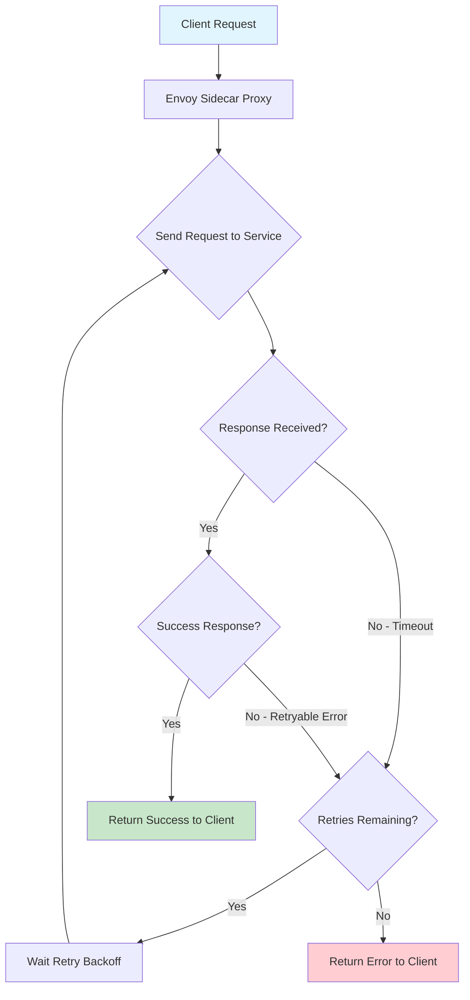
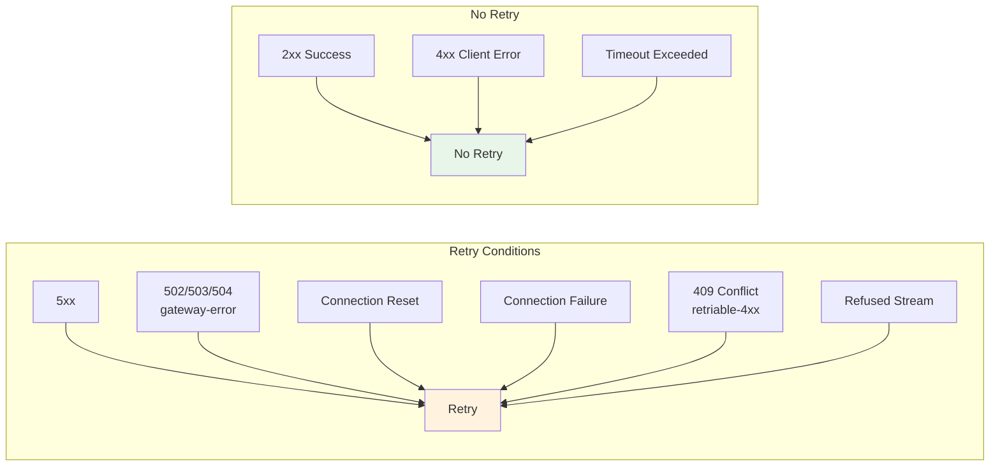
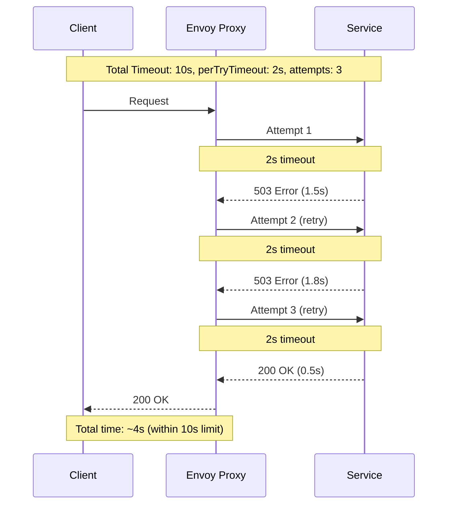
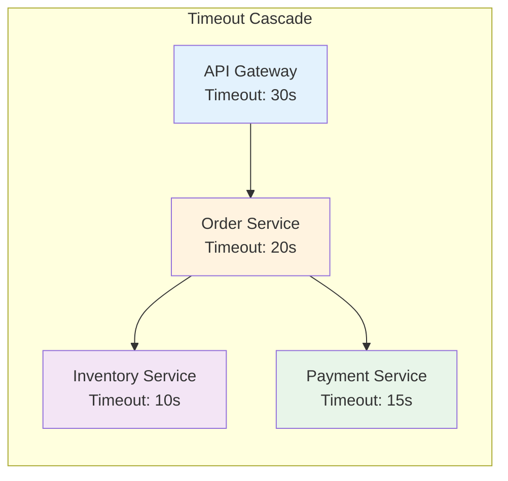
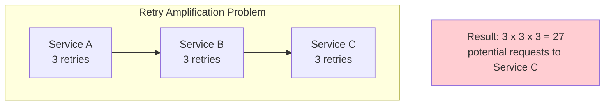

# How to Configure Retries and Timeouts in Istio

Author: [nawazdhandala](https://github.com/nawazdhandala)

Tags: Istio, Retries, Timeouts, Resilience, Service Mesh, Kubernetes

Description: Learn how to configure request retries and timeouts in Istio for improved reliability.

---

## Introduction

In distributed systems, network failures and service unavailability are inevitable. Istio provides powerful mechanisms to handle these failures gracefully through retries and timeouts. This comprehensive guide will walk you through configuring these resilience patterns in your Istio service mesh.

Retries automatically re-attempt failed requests, while timeouts prevent requests from waiting indefinitely. When used together, they significantly improve the reliability and user experience of your microservices applications.

## Understanding Retries and Timeouts in Istio

Before diving into configuration, let's understand how Istio handles retries and timeouts at the Envoy proxy level.



## Prerequisites

Before proceeding, ensure you have:

- A Kubernetes cluster with Istio installed
- kubectl configured to access your cluster
- Basic understanding of Istio VirtualService resources

## Retry Configuration in VirtualService

Istio's retry functionality is configured in the VirtualService resource. The retry policy specifies how Envoy should handle failed requests.

### Basic Retry Configuration

The following example demonstrates a basic retry configuration that attempts up to 3 retries with a 2-second timeout per retry attempt:

```yaml
# VirtualService with basic retry configuration
# This configuration retries failed requests up to 3 times
apiVersion: networking.istio.io/v1beta1
kind: VirtualService
metadata:
  name: my-service-vs
  namespace: default
spec:
  # Specify which hosts this VirtualService applies to
  hosts:
    - my-service
  http:
    - route:
        - destination:
            host: my-service
            port:
              number: 8080
      # Retry configuration block
      retries:
        # Maximum number of retry attempts
        attempts: 3
        # Timeout per retry attempt (not total timeout)
        perTryTimeout: 2s
        # Only retry on specific conditions (5xx errors and connection failures)
        retryOn: 5xx,reset,connect-failure,retriable-4xx
```

### Understanding Retry Parameters

Let's break down each retry parameter:

| Parameter | Description | Default |
|-----------|-------------|---------|
| `attempts` | Maximum number of retries | 2 |
| `perTryTimeout` | Timeout for each retry attempt | Same as request timeout |
| `retryOn` | Conditions that trigger a retry | connect-failure,refused-stream,unavailable,cancelled,retriable-status-codes |
| `retryRemoteLocalities` | Whether to retry on different localities | false |

## Retry Conditions (retryOn)

Istio supports various retry conditions that determine when a request should be retried. Understanding these is crucial for effective resilience configuration.

### Common Retry Conditions

The following configuration shows all available retry conditions with detailed comments:

```yaml
# Comprehensive retry configuration with all condition types
apiVersion: networking.istio.io/v1beta1
kind: VirtualService
metadata:
  name: comprehensive-retry-vs
  namespace: production
spec:
  hosts:
    - api-service
  http:
    - route:
        - destination:
            host: api-service
            port:
              number: 8080
      retries:
        attempts: 3
        perTryTimeout: 5s
        # Comma-separated list of retry conditions
        # 5xx: Retry on any 5xx response code
        # gateway-error: Retry on 502, 503, 504 responses
        # reset: Retry on connection reset (TCP RST)
        # connect-failure: Retry on connection failures
        # retriable-4xx: Retry on retriable 4xx codes (currently only 409)
        # refused-stream: Retry if stream was refused (REFUSED_STREAM error)
        # retriable-status-codes: Retry on specific status codes (configure separately)
        # retriable-headers: Retry based on response headers
        retryOn: 5xx,gateway-error,reset,connect-failure,retriable-4xx
```

### Retry Condition Flow Diagram



### Gateway Error Specific Configuration

When dealing with gateway errors, you may want to configure retries specifically for upstream gateway issues:

```yaml
# Configuration targeting gateway errors specifically
# Useful when services behind API gateways experience intermittent issues
apiVersion: networking.istio.io/v1beta1
kind: VirtualService
metadata:
  name: gateway-error-retry-vs
  namespace: default
spec:
  hosts:
    - backend-api
  http:
    - route:
        - destination:
            host: backend-api
            port:
              number: 8080
      retries:
        # Limit retries to prevent overwhelming recovering services
        attempts: 2
        # Short timeout for gateway errors as they typically resolve quickly
        perTryTimeout: 3s
        # Focus on gateway-specific errors
        # 502 Bad Gateway, 503 Service Unavailable, 504 Gateway Timeout
        retryOn: gateway-error
```

## Timeout Configuration

Timeouts prevent requests from waiting indefinitely and are essential for maintaining system responsiveness.

### Basic Timeout Configuration

The following example shows how to configure request timeouts in a VirtualService:

```yaml
# VirtualService with timeout configuration
# This sets a maximum duration for the entire request
apiVersion: networking.istio.io/v1beta1
kind: VirtualService
metadata:
  name: timeout-example-vs
  namespace: default
spec:
  hosts:
    - order-service
  http:
    - route:
        - destination:
            host: order-service
            port:
              number: 8080
      # Total timeout for the request including all retries
      # If this timeout is exceeded, the request fails immediately
      timeout: 30s
```

### Combining Retries and Timeouts

When using both retries and timeouts, it's important to understand their interaction:

```yaml
# Combined retry and timeout configuration
# Total time = min(timeout, attempts * perTryTimeout + backoff time)
apiVersion: networking.istio.io/v1beta1
kind: VirtualService
metadata:
  name: resilient-service-vs
  namespace: production
spec:
  hosts:
    - payment-service
  http:
    - route:
        - destination:
            host: payment-service
            port:
              number: 8080
      # Overall request timeout (includes all retry attempts)
      # Request will fail if this timeout is reached regardless of retries
      timeout: 10s
      retries:
        # Number of retry attempts
        attempts: 3
        # Timeout per individual attempt
        # With 3 attempts at 2s each, max retry time is 6s (plus backoff)
        # This fits within the 10s overall timeout
        perTryTimeout: 2s
        # Retry on server errors and connection issues
        retryOn: 5xx,connect-failure,reset
```

### Timeout and Retry Interaction Diagram



## Route-Specific Timeout Configuration

Different routes may require different timeout values based on their expected response times:

```yaml
# Route-specific timeout configuration
# Different endpoints have different performance characteristics
apiVersion: networking.istio.io/v1beta1
kind: VirtualService
metadata:
  name: multi-route-timeout-vs
  namespace: default
spec:
  hosts:
    - api-gateway
  http:
    # Health check endpoint - should respond quickly
    - match:
        - uri:
            prefix: /health
      route:
        - destination:
            host: api-gateway
            port:
              number: 8080
      # Short timeout for health checks
      timeout: 2s
      retries:
        attempts: 1
        perTryTimeout: 1s
        retryOn: 5xx

    # Report generation - may take longer
    - match:
        - uri:
            prefix: /api/reports
      route:
        - destination:
            host: api-gateway
            port:
              number: 8080
      # Longer timeout for report generation
      timeout: 120s
      retries:
        attempts: 2
        perTryTimeout: 60s
        retryOn: 5xx,gateway-error

    # Default route for all other paths
    - route:
        - destination:
            host: api-gateway
            port:
              number: 8080
      # Standard timeout for regular API calls
      timeout: 30s
      retries:
        attempts: 3
        perTryTimeout: 8s
        retryOn: 5xx,connect-failure
```

## Advanced Retry Configuration

### Retry with Exponential Backoff

While Istio uses a default backoff strategy, you can influence retry behavior through DestinationRule:

```yaml
# DestinationRule to configure connection pool settings
# These settings affect how retries behave at the connection level
apiVersion: networking.istio.io/v1beta1
kind: DestinationRule
metadata:
  name: retry-destination-rule
  namespace: production
spec:
  host: backend-service
  trafficPolicy:
    connectionPool:
      tcp:
        # Maximum number of TCP connections
        maxConnections: 100
        # TCP connection timeout
        connectTimeout: 5s
      http:
        # Maximum pending HTTP requests
        h2UpgradePolicy: UPGRADE
        http1MaxPendingRequests: 100
        # Maximum requests per connection
        http2MaxRequests: 1000
        # Maximum retries outstanding at any time
        maxRetries: 3
    outlierDetection:
      # Eject hosts that fail consecutively
      consecutive5xxErrors: 5
      # Time between ejection analysis
      interval: 30s
      # Minimum ejection duration
      baseEjectionTime: 30s
      # Maximum percentage of hosts that can be ejected
      maxEjectionPercent: 50
```

### Retry Based on Response Headers

You can configure retries based on specific response headers:

```yaml
# VirtualService with header-based retry configuration
# Retry when service indicates it's temporarily unavailable
apiVersion: networking.istio.io/v1beta1
kind: VirtualService
metadata:
  name: header-retry-vs
  namespace: default
spec:
  hosts:
    - rate-limited-service
  http:
    - route:
        - destination:
            host: rate-limited-service
            port:
              number: 8080
      retries:
        attempts: 5
        perTryTimeout: 10s
        # Retry based on retriable headers
        # Service can set x-envoy-retriable-header-names in response
        retryOn: retriable-headers,5xx
```

## Best Practices for Timeouts

### 1. Set Appropriate Timeout Values

Consider the expected response time of your services when setting timeouts:

```yaml
# Best practice: Set timeouts based on service SLOs
# Example: Service has p99 latency of 500ms, set timeout to 2x-3x that value
apiVersion: networking.istio.io/v1beta1
kind: VirtualService
metadata:
  name: slo-based-timeout-vs
  namespace: production
spec:
  hosts:
    - user-service
  http:
    - route:
        - destination:
            host: user-service
            port:
              number: 8080
      # p99 latency is 500ms, so 1.5s timeout provides buffer
      # while still failing fast on truly slow requests
      timeout: 1500ms
      retries:
        attempts: 2
        # Each retry should complete within p99 latency
        perTryTimeout: 600ms
        retryOn: 5xx,reset
```

### 2. Account for Downstream Dependencies

When a service calls other services, account for cascading timeouts:



```yaml
# Cascading timeout configuration
# Each downstream service should have shorter timeout than upstream
apiVersion: networking.istio.io/v1beta1
kind: VirtualService
metadata:
  name: order-service-vs
  namespace: production
spec:
  hosts:
    - order-service
  http:
    - route:
        - destination:
            host: order-service
            port:
              number: 8080
      # Order service calls inventory (10s) and payment (15s)
      # Set timeout higher than slowest downstream + buffer
      timeout: 20s
      retries:
        attempts: 2
        perTryTimeout: 8s
        retryOn: 5xx,gateway-error
```

### 3. Use Circuit Breaking with Retries

Combine retries with circuit breaking to prevent overwhelming failing services:

```yaml
# DestinationRule with circuit breaking
# Prevents retry storms from overwhelming a failing service
apiVersion: networking.istio.io/v1beta1
kind: DestinationRule
metadata:
  name: circuit-breaker-dr
  namespace: production
spec:
  host: catalog-service
  trafficPolicy:
    connectionPool:
      tcp:
        maxConnections: 50
      http:
        # Limit concurrent requests during failures
        http1MaxPendingRequests: 25
        http2MaxRequests: 100
        # Global limit on outstanding retries
        maxRetries: 10
    outlierDetection:
      # Eject after 3 consecutive 5xx errors
      consecutive5xxErrors: 3
      # Check every 10 seconds
      interval: 10s
      # Eject for minimum 30 seconds
      baseEjectionTime: 30s
      # Allow up to 30% of hosts to be ejected
      maxEjectionPercent: 30
```

### 4. Avoid Retry Amplification

Be careful with retries in service chains to avoid exponential retry amplification:



```yaml
# Recommended: Reduce retries in downstream services
# Frontend/Edge services can have more retries
# Backend services should have fewer or no retries
---
# Edge service - more retries allowed
apiVersion: networking.istio.io/v1beta1
kind: VirtualService
metadata:
  name: edge-service-vs
  namespace: production
spec:
  hosts:
    - edge-api
  http:
    - route:
        - destination:
            host: edge-api
            port:
              number: 8080
      timeout: 30s
      retries:
        attempts: 3
        perTryTimeout: 8s
        retryOn: 5xx,gateway-error
---
# Internal service - minimal retries
apiVersion: networking.istio.io/v1beta1
kind: VirtualService
metadata:
  name: internal-service-vs
  namespace: production
spec:
  hosts:
    - internal-api
  http:
    - route:
        - destination:
            host: internal-api
            port:
              number: 8080
      timeout: 10s
      retries:
        # Fewer retries for internal services
        attempts: 1
        perTryTimeout: 5s
        # Only retry on connection issues, not 5xx
        retryOn: reset,connect-failure
```

## Complete Production Example

Here's a complete production-ready configuration combining all concepts:

```yaml
# Production-ready VirtualService with comprehensive retry and timeout configuration
apiVersion: networking.istio.io/v1beta1
kind: VirtualService
metadata:
  name: production-api-vs
  namespace: production
  labels:
    app: production-api
    version: v1
spec:
  hosts:
    - production-api
    - production-api.production.svc.cluster.local
  http:
    # Critical endpoints with aggressive timeouts
    - match:
        - headers:
            x-request-priority:
              exact: high
      route:
        - destination:
            host: production-api
            port:
              number: 8080
      timeout: 5s
      retries:
        attempts: 2
        perTryTimeout: 2s
        retryOn: 5xx,reset,connect-failure

    # Read operations - can be retried safely
    - match:
        - method:
            exact: GET
      route:
        - destination:
            host: production-api
            port:
              number: 8080
      timeout: 15s
      retries:
        attempts: 3
        perTryTimeout: 4s
        retryOn: 5xx,gateway-error,reset,connect-failure

    # Write operations - limited retries (idempotency required)
    - match:
        - method:
            regex: "POST|PUT|PATCH"
      route:
        - destination:
            host: production-api
            port:
              number: 8080
      timeout: 30s
      retries:
        # Fewer retries for write operations
        attempts: 1
        perTryTimeout: 15s
        # Only retry on clear infrastructure failures
        retryOn: reset,connect-failure

    # Default catch-all route
    - route:
        - destination:
            host: production-api
            port:
              number: 8080
      timeout: 20s
      retries:
        attempts: 2
        perTryTimeout: 8s
        retryOn: 5xx,gateway-error
---
# Accompanying DestinationRule for connection management
apiVersion: networking.istio.io/v1beta1
kind: DestinationRule
metadata:
  name: production-api-dr
  namespace: production
spec:
  host: production-api
  trafficPolicy:
    connectionPool:
      tcp:
        maxConnections: 200
        connectTimeout: 5s
      http:
        h2UpgradePolicy: UPGRADE
        http1MaxPendingRequests: 100
        http2MaxRequests: 500
        maxRetries: 10
        idleTimeout: 60s
    outlierDetection:
      consecutive5xxErrors: 5
      consecutiveGatewayErrors: 3
      interval: 30s
      baseEjectionTime: 60s
      maxEjectionPercent: 25
      minHealthPercent: 50
```

## Monitoring Retries and Timeouts

Use Istio's built-in metrics to monitor retry and timeout behavior:

```yaml
# Prometheus queries for monitoring retries and timeouts

# Query 1: Retry rate per service
# rate(istio_requests_total{response_flags=~".*RR.*"}[5m])

# Query 2: Timeout rate per service
# rate(istio_requests_total{response_flags=~".*UT.*"}[5m])

# Query 3: Overall retry success rate
# sum(rate(istio_requests_total{response_flags=~".*RR.*",response_code="200"}[5m]))
# /
# sum(rate(istio_requests_total{response_flags=~".*RR.*"}[5m]))
```

## Troubleshooting Common Issues

### Issue 1: Retries Not Working

Check that your VirtualService is correctly applied:

```bash
# Verify VirtualService is applied
kubectl get virtualservice -n your-namespace

# Check Envoy configuration
istioctl proxy-config routes <pod-name> -n your-namespace -o json | grep -A 20 "retry"
```

### Issue 2: Timeout Errors Despite Correct Configuration

Ensure the overall timeout is greater than (attempts * perTryTimeout):

```yaml
# Correct configuration
timeout: 15s
retries:
  attempts: 3
  perTryTimeout: 4s  # 3 * 4s = 12s < 15s overall timeout
```

### Issue 3: Too Many Retries Causing Issues

Reduce retry attempts or add circuit breaking:

```yaml
# Conservative retry configuration
retries:
  attempts: 1
  perTryTimeout: 5s
  retryOn: reset,connect-failure  # Only retry infrastructure failures
```

## Summary

Configuring retries and timeouts in Istio is essential for building resilient microservices. Key takeaways:

1. **Use retries strategically** - Retry on infrastructure failures and 5xx errors, but be careful with write operations
2. **Set appropriate timeouts** - Base timeouts on service SLOs and account for downstream dependencies
3. **Prevent retry amplification** - Use fewer retries in downstream services
4. **Combine with circuit breaking** - Protect failing services from retry storms
5. **Monitor retry metrics** - Use Prometheus to track retry rates and success rates

By following these best practices and configurations, you can significantly improve the reliability of your Istio service mesh while avoiding common pitfalls like retry amplification and timeout misconfigurations.

## Additional Resources

- [Istio Traffic Management Documentation](https://istio.io/latest/docs/concepts/traffic-management/)
- [Envoy Retry Policies](https://www.envoyproxy.io/docs/envoy/latest/configuration/http/http_filters/router_filter#x-envoy-retry-on)
- [Istio VirtualService Reference](https://istio.io/latest/docs/reference/config/networking/virtual-service/)
