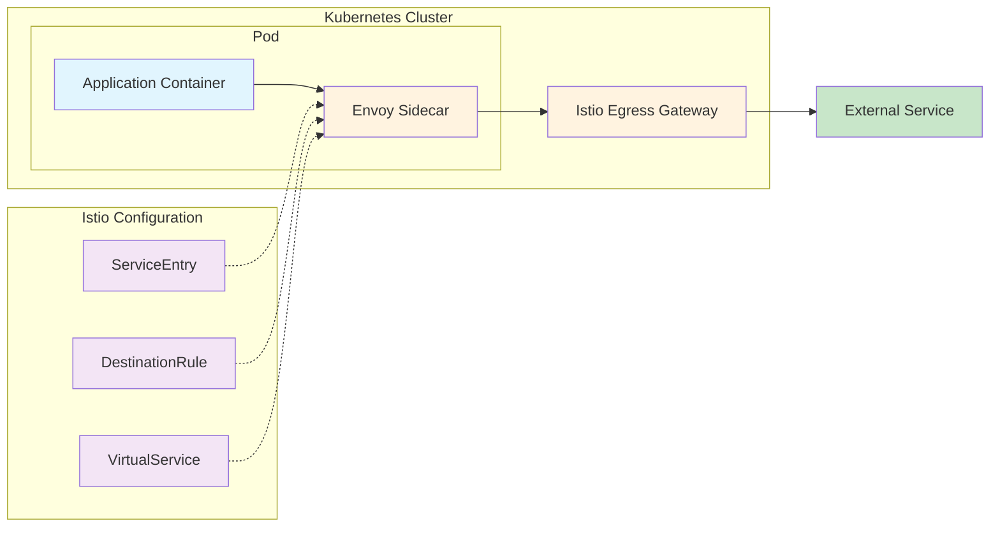
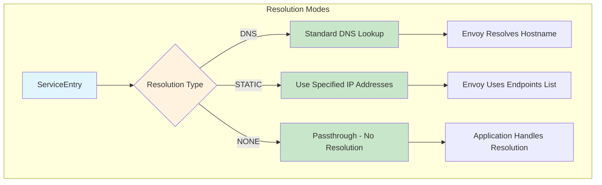
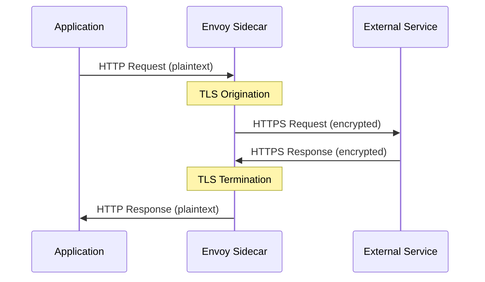
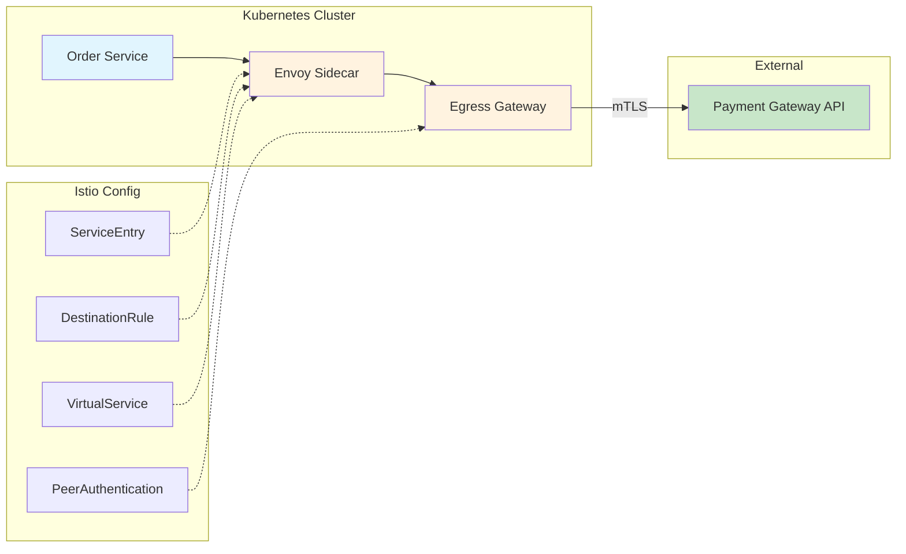
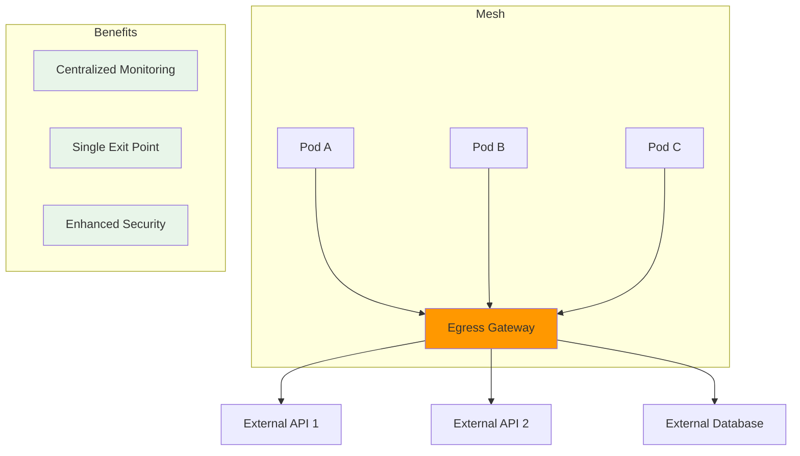

# How to Access External Services with Istio ServiceEntry

Author: [nawazdhandala](https://github.com/nawazdhandala)

Tags: Istio, ServiceEntry, External Services, Service Mesh, Kubernetes

Description: Learn how to configure Istio ServiceEntry for controlled access to external services.

---

## Introduction

When running applications in a Kubernetes cluster with Istio, your services often need to communicate with external APIs, databases, or third-party services that exist outside the mesh. By default, Istio can restrict outbound traffic from your mesh, making it essential to understand how to properly configure access to external services.

**ServiceEntry** is an Istio resource that allows you to add external services to Istio's internal service registry. This enables you to apply Istio's powerful traffic management and security features to traffic destined for external services, just as you would for internal services.

## Why Use ServiceEntry?

Before diving into configurations, let's understand why ServiceEntry is crucial:

1. **Visibility**: Gain observability into traffic to external services
2. **Traffic Management**: Apply retries, timeouts, and circuit breaking to external calls
3. **Security**: Control which external services your mesh can access
4. **TLS Origination**: Upgrade HTTP connections to HTTPS at the sidecar level
5. **Policy Enforcement**: Apply consistent policies across all outbound traffic

## Understanding External Service Traffic Flow

The following diagram illustrates how traffic flows from a pod in the mesh to an external service through Istio's ServiceEntry configuration:



## Prerequisites

Before proceeding, ensure you have:

- A Kubernetes cluster with Istio installed
- `kubectl` configured to access your cluster
- `istioctl` CLI tool installed
- Basic understanding of Istio concepts

## Configuring Outbound Traffic Policy

Istio provides two modes for handling outbound traffic. Understanding these modes is crucial before configuring ServiceEntry resources.

The following configuration shows how to set the outbound traffic policy in Istio's mesh configuration. The `REGISTRY_ONLY` mode restricts outbound traffic to only those services defined in Istio's service registry:

```yaml
# Istio MeshConfig - Configure how Istio handles outbound traffic
# REGISTRY_ONLY: Only allow traffic to services registered in the mesh
# ALLOW_ANY: Allow traffic to any external service (less secure)
apiVersion: install.istio.io/v1alpha1
kind: IstioOperator
spec:
  meshConfig:
    # Set to REGISTRY_ONLY for strict control over external access
    # This requires explicit ServiceEntry for each external service
    outboundTrafficPolicy:
      mode: REGISTRY_ONLY
```

To check your current configuration, use this command:

```bash
# Query the current outbound traffic policy setting
# This helps verify whether external traffic is restricted or allowed by default
kubectl get configmap istio -n istio-system -o yaml | grep -A1 outboundTrafficPolicy
```

## Basic ServiceEntry Configuration

### Accessing an External HTTP API

This example demonstrates the simplest form of ServiceEntry - allowing access to an external HTTP API. The configuration registers the external service in Istio's registry:

```yaml
# ServiceEntry for accessing an external HTTP API
# This allows pods in the mesh to reach httpbin.org on port 80
apiVersion: networking.istio.io/v1beta1
kind: ServiceEntry
metadata:
  name: httpbin-external
  namespace: default
spec:
  # The hostname that applications will use to reach this service
  # Must match exactly what the application uses in HTTP requests
  hosts:
    - httpbin.org

  # MESH_EXTERNAL indicates this service exists outside the mesh
  # Istio will not expect to find this service in the cluster
  location: MESH_EXTERNAL

  # Ports exposed by the external service
  # Protocol helps Istio apply appropriate traffic management
  ports:
    - number: 80
      name: http
      protocol: HTTP

  # DNS resolution mode - how Istio resolves the hostname
  # DNS: Use standard DNS resolution (most common for external services)
  resolution: DNS
```

### Accessing an External HTTPS API

For secure HTTPS endpoints, configure the protocol and port accordingly. This ServiceEntry enables access to an HTTPS API while maintaining end-to-end encryption:

```yaml
# ServiceEntry for accessing an external HTTPS API
# The application initiates TLS connection directly to the external service
apiVersion: networking.istio.io/v1beta1
kind: ServiceEntry
metadata:
  name: github-api
  namespace: default
spec:
  hosts:
    - api.github.com

  location: MESH_EXTERNAL

  ports:
    # Port 443 for HTTPS traffic
    - number: 443
      name: https
      # TLS protocol means the application handles TLS directly
      # Istio passes through the encrypted traffic without termination
      protocol: TLS

  # DNS resolution for the external hostname
  resolution: DNS
```

## DNS Resolution Modes

Istio supports several DNS resolution strategies. The following diagram shows how different resolution modes work:



### DNS Resolution Mode

The DNS resolution mode is the most common choice for external services. Istio's Envoy proxy performs DNS resolution:

```yaml
# ServiceEntry with DNS resolution
# Envoy proxy resolves the hostname using the cluster's DNS
apiVersion: networking.istio.io/v1beta1
kind: ServiceEntry
metadata:
  name: external-database
  namespace: default
spec:
  hosts:
    - database.example.com

  location: MESH_EXTERNAL

  ports:
    - number: 5432
      name: tcp-postgres
      # TCP protocol for database connections
      protocol: TCP

  # DNS: Envoy resolves hostname via DNS
  # Suitable when external service has a stable DNS name
  resolution: DNS
```

### Static Resolution Mode

When you need to specify exact IP addresses for external services, use STATIC resolution. This is useful for services without DNS or when you need precise control:

```yaml
# ServiceEntry with STATIC resolution
# Explicitly define the IP addresses of the external service
apiVersion: networking.istio.io/v1beta1
kind: ServiceEntry
metadata:
  name: legacy-payment-service
  namespace: default
spec:
  hosts:
    # This hostname is used within the mesh for routing
    # It doesn't need to resolve via DNS
    - legacy-payment.internal

  location: MESH_EXTERNAL

  ports:
    - number: 8443
      name: https
      protocol: HTTPS

  # STATIC: Use the IP addresses specified in endpoints
  resolution: STATIC

  # Explicit endpoint addresses for the external service
  # Traffic is load-balanced across these endpoints
  endpoints:
    - address: 192.168.1.100
      ports:
        https: 8443
    - address: 192.168.1.101
      ports:
        https: 8443
```

### NONE Resolution Mode

Use NONE when the application should handle DNS resolution itself. This is a passthrough mode:

```yaml
# ServiceEntry with NONE resolution
# Application handles all aspects of connection including DNS
apiVersion: networking.istio.io/v1beta1
kind: ServiceEntry
metadata:
  name: wildcard-external
  namespace: default
spec:
  # Wildcard hosts pattern - matches any subdomain
  hosts:
    - "*.example.com"

  location: MESH_EXTERNAL

  ports:
    - number: 443
      name: tls
      protocol: TLS

  # NONE: No resolution by Istio
  # The original destination IP is used as-is
  resolution: NONE
```

## TLS Origination for External Services

TLS origination allows the Envoy sidecar to upgrade HTTP connections to HTTPS when communicating with external services. This simplifies application code by handling TLS at the infrastructure level.

The following diagram illustrates the TLS origination flow:



### ServiceEntry with TLS Origination

This configuration demonstrates TLS origination where the sidecar handles TLS, allowing applications to make simple HTTP calls:

```yaml
# ServiceEntry for external API with TLS origination support
# Applications send HTTP, Envoy upgrades to HTTPS
apiVersion: networking.istio.io/v1beta1
kind: ServiceEntry
metadata:
  name: external-api-tls
  namespace: default
spec:
  hosts:
    - api.external-service.com

  location: MESH_EXTERNAL

  # Define both ports - 80 for internal HTTP, 443 for external HTTPS
  ports:
    # Port 80: Application sends HTTP to this port
    - number: 80
      name: http-port
      protocol: HTTP
      # targetPort maps internal port 80 to external port 443
      targetPort: 443
    # Port 443: Direct HTTPS access if needed
    - number: 443
      name: https-port
      protocol: HTTPS

  resolution: DNS
---
# DestinationRule to configure TLS settings for the external service
# This is required to enable TLS origination at the sidecar
apiVersion: networking.istio.io/v1beta1
kind: DestinationRule
metadata:
  name: external-api-tls-dr
  namespace: default
spec:
  # Must match the host in ServiceEntry
  host: api.external-service.com

  trafficPolicy:
    # Configure the sidecar to originate TLS connections
    tls:
      # SIMPLE: Standard TLS without client certificates
      mode: SIMPLE
      # SNI (Server Name Indication) for TLS handshake
      sni: api.external-service.com
```

### Mutual TLS (mTLS) to External Services

When external services require client certificate authentication, configure mutual TLS:

```yaml
# ServiceEntry for external service requiring mTLS
apiVersion: networking.istio.io/v1beta1
kind: ServiceEntry
metadata:
  name: secure-partner-api
  namespace: default
spec:
  hosts:
    - partner-api.secure.com

  location: MESH_EXTERNAL

  ports:
    - number: 443
      name: https
      protocol: HTTPS

  resolution: DNS
---
# DestinationRule with mutual TLS configuration
# Both server and client certificates are used
apiVersion: networking.istio.io/v1beta1
kind: DestinationRule
metadata:
  name: secure-partner-mtls
  namespace: default
spec:
  host: partner-api.secure.com

  trafficPolicy:
    tls:
      # MUTUAL: Both client and server present certificates
      mode: MUTUAL

      # Client certificate for authentication
      # These files must be mounted in the sidecar
      clientCertificate: /etc/certs/client-cert.pem

      # Private key for the client certificate
      privateKey: /etc/certs/client-key.pem

      # CA certificate to verify the server's certificate
      caCertificates: /etc/certs/ca-cert.pem

      # SNI for the TLS handshake
      sni: partner-api.secure.com
```

## Traffic Policies for External Services

Applying traffic policies to external services helps build resilient applications by handling failures gracefully.

### Connection Pool Settings

Configure connection limits and timeout settings for external services:

```yaml
# DestinationRule with connection pool settings
# Controls how connections to external service are managed
apiVersion: networking.istio.io/v1beta1
kind: DestinationRule
metadata:
  name: external-api-connection-pool
  namespace: default
spec:
  host: api.external-service.com

  trafficPolicy:
    connectionPool:
      # TCP connection pool settings
      tcp:
        # Maximum number of TCP connections to the external service
        maxConnections: 100
        # TCP connection timeout
        connectTimeout: 10s
        # TCP keepalive settings for long-lived connections
        tcpKeepalive:
          time: 300s
          interval: 60s
          probes: 3

      # HTTP connection pool settings
      http:
        # Maximum pending HTTP requests
        h2UpgradePolicy: UPGRADE
        # Maximum requests per connection before creating new one
        maxRequestsPerConnection: 100
        # Maximum number of concurrent HTTP/1.1 connections
        http1MaxPendingRequests: 100
        # Maximum concurrent HTTP/2 requests
        http2MaxRequests: 1000
```

### Circuit Breaker Configuration

Implement circuit breaking to protect your services from cascading failures when external services are unhealthy:

```yaml
# DestinationRule with circuit breaker settings
# Prevents overwhelming a failing external service
apiVersion: networking.istio.io/v1beta1
kind: DestinationRule
metadata:
  name: external-api-circuit-breaker
  namespace: default
spec:
  host: api.external-service.com

  trafficPolicy:
    # Outlier detection implements circuit breaker pattern
    outlierDetection:
      # Number of consecutive errors before ejecting host
      consecutive5xxErrors: 5

      # Time window for error counting
      interval: 30s

      # Duration a host remains ejected
      baseEjectionTime: 60s

      # Maximum percentage of hosts that can be ejected
      maxEjectionPercent: 50

      # Minimum number of requests before ejection logic applies
      minHealthPercent: 30
```

### Retry Policy with VirtualService

Configure retry behavior for failed requests to external services:

```yaml
# VirtualService with retry configuration for external service
# Automatically retries failed requests based on specified conditions
apiVersion: networking.istio.io/v1beta1
kind: VirtualService
metadata:
  name: external-api-retry
  namespace: default
spec:
  # Target the external service host
  hosts:
    - api.external-service.com

  http:
    - route:
        - destination:
            host: api.external-service.com
            port:
              number: 443

      # Retry configuration for handling transient failures
      retries:
        # Maximum number of retry attempts
        attempts: 3

        # Timeout for each retry attempt
        perTryTimeout: 5s

        # Conditions that trigger a retry
        # 5xx: Server errors
        # reset: Connection reset
        # connect-failure: Connection failures
        # retriable-4xx: Specific 4xx errors (409 Conflict)
        retryOn: 5xx,reset,connect-failure,retriable-4xx

      # Overall timeout for the request including retries
      timeout: 30s
```

## Complete Example: External Payment Gateway

This comprehensive example shows how to configure access to an external payment gateway with all best practices applied:



The following YAML provides a complete configuration for accessing an external payment gateway with security, reliability, and observability:

```yaml
# Complete configuration for external payment gateway access
# Includes ServiceEntry, DestinationRule, and VirtualService
---
# ServiceEntry: Register the external payment gateway in the mesh
apiVersion: networking.istio.io/v1beta1
kind: ServiceEntry
metadata:
  name: payment-gateway
  namespace: payments
  labels:
    # Labels help with organization and monitoring
    app: payment-gateway
    env: production
spec:
  hosts:
    - api.payment-gateway.com

  location: MESH_EXTERNAL

  ports:
    # Primary HTTPS port for API calls
    - number: 443
      name: https
      protocol: HTTPS

  resolution: DNS

  # Export to specific namespaces for security
  # Only pods in these namespaces can access this service
  exportTo:
    - "payments"
    - "orders"
---
# DestinationRule: Configure TLS and traffic policies
apiVersion: networking.istio.io/v1beta1
kind: DestinationRule
metadata:
  name: payment-gateway-dr
  namespace: payments
spec:
  host: api.payment-gateway.com

  trafficPolicy:
    # Mutual TLS for payment gateway authentication
    tls:
      mode: MUTUAL
      clientCertificate: /etc/payment-certs/client.pem
      privateKey: /etc/payment-certs/client-key.pem
      caCertificates: /etc/payment-certs/ca.pem
      sni: api.payment-gateway.com

    # Connection pool for controlled resource usage
    connectionPool:
      tcp:
        maxConnections: 50
        connectTimeout: 5s
      http:
        h2UpgradePolicy: UPGRADE
        maxRequestsPerConnection: 50
        http2MaxRequests: 100

    # Circuit breaker for resilience
    outlierDetection:
      consecutive5xxErrors: 3
      interval: 10s
      baseEjectionTime: 30s
      maxEjectionPercent: 100
---
# VirtualService: Route configuration with retries and timeouts
apiVersion: networking.istio.io/v1beta1
kind: VirtualService
metadata:
  name: payment-gateway-vs
  namespace: payments
spec:
  hosts:
    - api.payment-gateway.com

  http:
    # Route for payment processing endpoints
    - match:
        - uri:
            prefix: /v1/payments
      route:
        - destination:
            host: api.payment-gateway.com
            port:
              number: 443

      # Retry configuration for payment requests
      retries:
        attempts: 2
        perTryTimeout: 10s
        # Be conservative with retries for payment operations
        retryOn: reset,connect-failure

      # Generous timeout for payment processing
      timeout: 60s

      # Add headers for tracing
      headers:
        request:
          add:
            x-request-source: "order-service"

    # Default route for other endpoints
    - route:
        - destination:
            host: api.payment-gateway.com
            port:
              number: 443
      timeout: 30s
```

## Working with Egress Gateway

For enhanced security and control, route external traffic through an Istio Egress Gateway. This provides a centralized exit point for all external traffic.

### Egress Gateway Architecture



### Configuring Egress Gateway for External Access

This configuration routes traffic to an external service through the Egress Gateway:

```yaml
# ServiceEntry for external service accessed via Egress Gateway
apiVersion: networking.istio.io/v1beta1
kind: ServiceEntry
metadata:
  name: external-api-egress
  namespace: istio-system
spec:
  hosts:
    - external-api.example.com
  location: MESH_EXTERNAL
  ports:
    - number: 443
      name: tls
      protocol: TLS
  resolution: DNS
---
# Gateway configuration for egress traffic
apiVersion: networking.istio.io/v1beta1
kind: Gateway
metadata:
  name: external-api-egress-gateway
  namespace: istio-system
spec:
  # Select the istio-egressgateway deployment
  selector:
    istio: egressgateway

  servers:
    - port:
        number: 443
        name: tls
        protocol: TLS
      hosts:
        - external-api.example.com
      # Passthrough TLS without termination at gateway
      tls:
        mode: PASSTHROUGH
---
# VirtualService to route traffic through egress gateway
apiVersion: networking.istio.io/v1beta1
kind: VirtualService
metadata:
  name: external-api-routing
  namespace: istio-system
spec:
  hosts:
    - external-api.example.com

  gateways:
    # Handle traffic from both mesh and egress gateway
    - mesh
    - external-api-egress-gateway

  tls:
    # Route mesh traffic to egress gateway
    - match:
        - gateways:
            - mesh
          port: 443
          sniHosts:
            - external-api.example.com
      route:
        - destination:
            # Route to egress gateway first
            host: istio-egressgateway.istio-system.svc.cluster.local
            port:
              number: 443

    # Route egress gateway traffic to external service
    - match:
        - gateways:
            - external-api-egress-gateway
          port: 443
          sniHosts:
            - external-api.example.com
      route:
        - destination:
            # Final destination: external service
            host: external-api.example.com
            port:
              number: 443
```

## Monitoring External Service Traffic

### Viewing ServiceEntry Status

Use these commands to verify and monitor your ServiceEntry configurations:

```bash
# List all ServiceEntry resources in the cluster
# Shows the hosts and ports configured for each entry
kubectl get serviceentries --all-namespaces

# Get detailed information about a specific ServiceEntry
# Useful for debugging configuration issues
kubectl describe serviceentry payment-gateway -n payments

# Check if Envoy has the external service in its configuration
# This verifies the ServiceEntry is properly propagated to sidecars
istioctl proxy-config cluster <pod-name> -n <namespace> | grep <external-host>

# View the routes configured for the external service
# Helps verify VirtualService routing rules are applied
istioctl proxy-config routes <pod-name> -n <namespace> | grep <external-host>
```

### Observability with Kiali and Prometheus

External service traffic appears in Istio's observability tools. Query Prometheus for external service metrics:

```bash
# Query for requests to external services
# This PromQL query shows request rates to external destinations
# Rate of requests over 5 minutes grouped by destination service
istio_requests_total{destination_service_namespace="external"}

# Check latency to external services
# P99 latency histogram for external service requests
histogram_quantile(0.99,
  sum(rate(istio_request_duration_milliseconds_bucket{
    destination_service="api.external-service.com"
  }[5m])) by (le)
)
```

## Troubleshooting Common Issues

### Issue 1: Connection Refused to External Service

When pods cannot connect to external services, verify the ServiceEntry configuration:

```bash
# Check if the ServiceEntry exists and is properly configured
kubectl get serviceentry -n <namespace>

# Verify the outbound traffic policy
# If REGISTRY_ONLY, ensure ServiceEntry exists for the external host
kubectl get configmap istio -n istio-system -o yaml | grep outboundTrafficPolicy

# Check Envoy access logs for connection errors
kubectl logs <pod-name> -c istio-proxy -n <namespace> | grep <external-host>
```

### Issue 2: TLS Handshake Failures

For TLS-related issues, verify certificate configuration:

```bash
# Verify certificates are mounted in the sidecar
kubectl exec <pod-name> -c istio-proxy -n <namespace> -- ls -la /etc/certs/

# Check if the SNI is correctly configured
istioctl proxy-config cluster <pod-name> -n <namespace> -o json | \
  jq '.[] | select(.name | contains("<external-host>"))'

# Test TLS connection from within the pod
kubectl exec <pod-name> -n <namespace> -- \
  openssl s_client -connect <external-host>:443 -servername <external-host>
```

### Issue 3: DNS Resolution Failures

Debug DNS issues with these commands:

```bash
# Test DNS resolution from within the pod
kubectl exec <pod-name> -n <namespace> -- nslookup <external-host>

# Check Envoy's DNS resolution
istioctl proxy-config endpoint <pod-name> -n <namespace> | grep <external-host>

# For STATIC resolution, verify endpoints are configured
kubectl get serviceentry <name> -n <namespace> -o yaml | grep -A10 endpoints
```

## Best Practices

### 1. Use Explicit ServiceEntry Definitions

Always define ServiceEntry resources for external services rather than relying on ALLOW_ANY mode:

```yaml
# Good Practice: Explicit ServiceEntry with clear documentation
apiVersion: networking.istio.io/v1beta1
kind: ServiceEntry
metadata:
  name: third-party-api
  namespace: default
  annotations:
    # Document the purpose and owner of this external service access
    description: "Access to third-party analytics API"
    owner: "analytics-team"
    approved-by: "security-team"
spec:
  hosts:
    - api.analytics-vendor.com
  location: MESH_EXTERNAL
  ports:
    - number: 443
      name: https
      protocol: HTTPS
  resolution: DNS
```

### 2. Limit Namespace Access with exportTo

Restrict which namespaces can access external services:

```yaml
# Restrict external service access to specific namespaces
apiVersion: networking.istio.io/v1beta1
kind: ServiceEntry
metadata:
  name: restricted-external-api
  namespace: default
spec:
  hosts:
    - sensitive-api.example.com
  location: MESH_EXTERNAL
  ports:
    - number: 443
      name: https
      protocol: HTTPS
  resolution: DNS
  # Only allow access from these namespaces
  exportTo:
    - "backend"
    - "processing"
```

### 3. Always Configure Timeouts and Retries

Protect your services from slow external dependencies:

```yaml
# Always set appropriate timeouts for external services
apiVersion: networking.istio.io/v1beta1
kind: VirtualService
metadata:
  name: external-api-timeouts
  namespace: default
spec:
  hosts:
    - api.external-service.com
  http:
    - route:
        - destination:
            host: api.external-service.com
      # Set reasonable timeouts based on expected response times
      timeout: 15s
      retries:
        attempts: 2
        perTryTimeout: 5s
        retryOn: 5xx,reset,connect-failure
```

### 4. Use Labels for Organization

Organize ServiceEntry resources with consistent labeling:

```yaml
# Use consistent labels for organization and filtering
apiVersion: networking.istio.io/v1beta1
kind: ServiceEntry
metadata:
  name: vendor-api
  namespace: default
  labels:
    # Categorize the type of external service
    service-type: external-api
    vendor: analytics-co
    environment: production
    data-classification: sensitive
spec:
  hosts:
    - api.vendor.com
  location: MESH_EXTERNAL
  ports:
    - number: 443
      name: https
      protocol: HTTPS
  resolution: DNS
```

## Conclusion

Istio ServiceEntry is a powerful mechanism for controlling and observing traffic to external services. By properly configuring ServiceEntry resources along with DestinationRules and VirtualServices, you can:

- Maintain visibility into all external traffic from your mesh
- Apply consistent security policies across internal and external communications
- Implement resilience patterns like retries and circuit breaking for external dependencies
- Centralize external access through Egress Gateways for enhanced security

Remember to always use explicit ServiceEntry definitions, configure appropriate traffic policies, and leverage Istio's observability features to monitor external service interactions. This approach ensures your service mesh maintains security and reliability even when integrating with services outside your control.

## Further Reading

- [Istio ServiceEntry Documentation](https://istio.io/latest/docs/reference/config/networking/service-entry/)
- [Istio Egress Traffic Management](https://istio.io/latest/docs/tasks/traffic-management/egress/)
- [Istio Security Best Practices](https://istio.io/latest/docs/ops/best-practices/security/)
