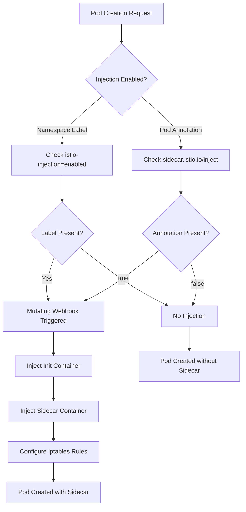
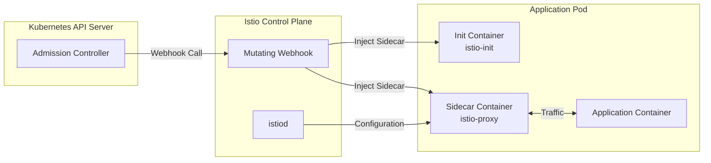
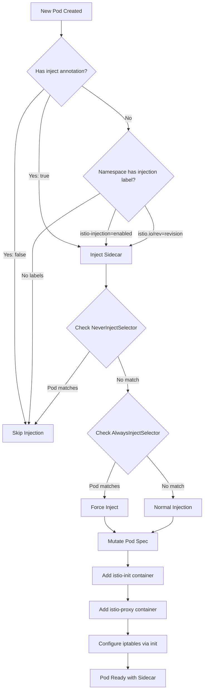

# How to Configure Istio Sidecar Injection

Author: [nawazdhandala](https://github.com/nawazdhandala)

Tags: Istio, Sidecar, Proxy, Service Mesh, Kubernetes

Description: A guide to configuring automatic and manual sidecar injection in Istio.

---

Istio's sidecar injection is one of its most powerful features, enabling transparent service mesh capabilities without modifying your application code. The Envoy proxy sidecar intercepts all network traffic to and from your application, providing traffic management, security, and observability features. In this comprehensive guide, we'll explore all the ways to configure sidecar injection in Istio.

## Understanding Sidecar Injection

Before diving into configuration, let's understand what sidecar injection does and how it works in Istio.

### What is a Sidecar Proxy?

A sidecar proxy is a container that runs alongside your application container within the same Kubernetes pod. In Istio, this sidecar is an Envoy proxy that:

- Intercepts all inbound and outbound traffic
- Enforces security policies (mTLS, authorization)
- Collects telemetry data (metrics, traces, logs)
- Manages traffic routing and load balancing

### Injection Flow Overview

The following diagram illustrates how sidecar injection works in Istio:



### Injection Architecture

The following diagram shows the components involved in sidecar injection:



## Prerequisites

Before configuring sidecar injection, ensure you have:

- A Kubernetes cluster (v1.25+)
- Istio installed (v1.20+)
- kubectl configured to access your cluster
- Admin access to create namespaces and modify labels

The following command verifies your Istio installation is ready for sidecar injection:

```bash
# Verify Istio installation and check that the sidecar injector webhook is running
# This command lists all Istio system pods and their status
kubectl get pods -n istio-system

# Expected output should show istiod running, which handles injection
# NAME                      READY   STATUS    RESTARTS   AGE
# istiod-5f4f9b8c7d-abc12   1/1     Running   0          2d
```

You should also verify the mutating webhook configuration exists:

```bash
# Check that the sidecar injector mutating webhook is configured
# This webhook intercepts pod creation requests to inject the sidecar
kubectl get mutatingwebhookconfiguration istio-sidecar-injector -o yaml
```

## Method 1: Namespace-Level Automatic Injection

The most common approach is to enable automatic injection at the namespace level. This ensures all pods in the namespace receive the sidecar proxy.

### Enabling Injection with Labels

Istio uses the `istio-injection` label to control automatic injection at the namespace level:

```bash
# Create a new namespace for your application
# This namespace will host all microservices that need mesh capabilities
kubectl create namespace my-application

# Enable automatic sidecar injection for this namespace
# The label 'istio-injection=enabled' tells Istio to inject sidecars into all pods
kubectl label namespace my-application istio-injection=enabled

# Verify the label was applied correctly
kubectl get namespace my-application --show-labels
```

### Using Revision Labels for Canary Upgrades

For production environments, you might want to use revision-based injection. This allows you to control which version of the sidecar is injected:

```bash
# Instead of istio-injection=enabled, use a revision label
# This is useful when running multiple Istio versions for canary upgrades
# Replace 'stable' with your actual Istio revision name
kubectl label namespace my-application istio.io/rev=stable

# To find available revisions in your cluster
kubectl get mutatingwebhookconfiguration -l app=sidecar-injector
```

### Namespace Configuration YAML

You can also define namespace labels declaratively in YAML:

```yaml
# namespace.yaml
# This manifest creates a namespace with automatic sidecar injection enabled
# Apply with: kubectl apply -f namespace.yaml
apiVersion: v1
kind: Namespace
metadata:
  name: my-application
  labels:
    # This label enables automatic sidecar injection for all pods in this namespace
    istio-injection: enabled
    # Optional: Add additional labels for organization
    environment: production
    team: platform
```

Apply the namespace configuration:

```bash
# Apply the namespace manifest to your cluster
kubectl apply -f namespace.yaml
```

### Verifying Namespace Injection Status

Use the following commands to verify injection is properly configured:

```bash
# Check all namespaces and their injection status
# This provides a quick overview of which namespaces have injection enabled
kubectl get namespaces -L istio-injection

# Use istioctl to analyze namespace configuration
# This command provides detailed information about injection settings
istioctl analyze -n my-application

# Verify the webhook will inject into the namespace
# The 'x check-inject' command simulates what would happen during injection
istioctl x check-inject -n my-application
```

## Method 2: Pod-Level Annotations

Sometimes you need fine-grained control over which pods receive sidecars. Pod-level annotations override namespace settings.

### Enabling Injection for Specific Pods

Use the `sidecar.istio.io/inject` annotation to control injection per pod:

```yaml
# deployment-with-sidecar.yaml
# This deployment explicitly enables sidecar injection regardless of namespace settings
apiVersion: apps/v1
kind: Deployment
metadata:
  name: my-app
  namespace: my-application
spec:
  replicas: 3
  selector:
    matchLabels:
      app: my-app
  template:
    metadata:
      labels:
        app: my-app
        version: v1
      annotations:
        # Explicitly enable sidecar injection for this pod
        # This annotation takes precedence over namespace-level settings
        sidecar.istio.io/inject: "true"
    spec:
      containers:
      - name: my-app
        image: my-app:latest
        ports:
        - containerPort: 8080
```

### Disabling Injection for Specific Pods

In a namespace with injection enabled, you might want to exclude certain pods:

```yaml
# deployment-without-sidecar.yaml
# This deployment disables sidecar injection even if namespace has injection enabled
# Use this for pods that should not be part of the service mesh
apiVersion: apps/v1
kind: Deployment
metadata:
  name: legacy-app
  namespace: my-application
spec:
  replicas: 1
  selector:
    matchLabels:
      app: legacy-app
  template:
    metadata:
      labels:
        app: legacy-app
      annotations:
        # Disable sidecar injection for this specific pod
        # Useful for legacy applications or external dependencies
        sidecar.istio.io/inject: "false"
    spec:
      containers:
      - name: legacy-app
        image: legacy-app:latest
        ports:
        - containerPort: 9090
```

### Common Pod Annotations for Sidecar Configuration

Istio provides many annotations to customize sidecar behavior:

```yaml
# deployment-custom-sidecar.yaml
# This deployment demonstrates various sidecar configuration annotations
apiVersion: apps/v1
kind: Deployment
metadata:
  name: customized-app
  namespace: my-application
spec:
  replicas: 2
  selector:
    matchLabels:
      app: customized-app
  template:
    metadata:
      labels:
        app: customized-app
      annotations:
        # Enable sidecar injection
        sidecar.istio.io/inject: "true"

        # Configure sidecar resource requests and limits
        # Adjust these based on your traffic volume and latency requirements
        sidecar.istio.io/proxyCPU: "100m"
        sidecar.istio.io/proxyMemory: "128Mi"
        sidecar.istio.io/proxyCPULimit: "500m"
        sidecar.istio.io/proxyMemoryLimit: "512Mi"

        # Configure log level for debugging
        # Valid values: trace, debug, info, warning, error, critical, off
        sidecar.istio.io/logLevel: "info"

        # Configure component-specific log levels
        # Format: component1:level,component2:level
        sidecar.istio.io/componentLogLevel: "misc:error,rbac:debug"

        # Enable access logging for this pod
        # Useful for debugging traffic issues
        sidecar.istio.io/accessLogFile: "/dev/stdout"

        # Configure the stats inclusion list
        # Reduces memory usage by limiting which stats are collected
        sidecar.istio.io/statsInclusionPrefixes: "cluster.outbound,listener"
    spec:
      containers:
      - name: customized-app
        image: customized-app:latest
        ports:
        - containerPort: 8080
        resources:
          requests:
            cpu: "200m"
            memory: "256Mi"
          limits:
            cpu: "1000m"
            memory: "1Gi"
```

## Method 3: Manual Injection with istioctl

Manual injection is useful for testing, debugging, or when you can't use automatic injection.

### Basic Manual Injection

The `istioctl kube-inject` command adds sidecar configuration to your manifests:

```bash
# Inject sidecar configuration into a deployment manifest
# The output includes the modified manifest with sidecar containers added
istioctl kube-inject -f deployment.yaml > deployment-injected.yaml

# Review the injected manifest before applying
# Look for the istio-init and istio-proxy containers
cat deployment-injected.yaml

# Apply the injected manifest to the cluster
kubectl apply -f deployment-injected.yaml
```

### Pipe-Based Injection

You can pipe the output directly to kubectl for a single command:

```bash
# Inject and apply in a single command using pipes
# Useful for quick deployments and testing
istioctl kube-inject -f deployment.yaml | kubectl apply -f -

# You can also inject from stdin
# This is useful when generating manifests dynamically
cat deployment.yaml | istioctl kube-inject -f - | kubectl apply -f -
```

### Using Custom Injection Configuration

You can specify custom injection templates and configurations:

```bash
# Use a specific Istio revision for injection
# Useful when multiple Istio versions are installed
istioctl kube-inject -f deployment.yaml --revision stable

# Use custom injection configuration from a ConfigMap
# First, extract the default configuration
kubectl get configmap istio-sidecar-injector -n istio-system -o yaml > injection-config.yaml

# Modify the configuration as needed, then use it
istioctl kube-inject -f deployment.yaml \
  --injectConfigFile injection-config.yaml

# Specify custom mesh configuration
istioctl kube-inject -f deployment.yaml \
  --meshConfigFile mesh-config.yaml \
  --injectConfigFile inject-config.yaml
```

### Manual Injection for Existing Deployments

You can re-inject sidecars for existing deployments:

```bash
# Get the current deployment manifest
kubectl get deployment my-app -n my-application -o yaml > current-deployment.yaml

# Inject the sidecar into the existing manifest
istioctl kube-inject -f current-deployment.yaml > updated-deployment.yaml

# Apply the updated manifest
# This will trigger a rolling update of the pods
kubectl apply -f updated-deployment.yaml

# Alternatively, use a one-liner to update in place
kubectl get deployment my-app -n my-application -o yaml | \
  istioctl kube-inject -f - | \
  kubectl apply -f -
```

## Exclusion Patterns and Traffic Interception

Sometimes you need to exclude certain traffic from sidecar interception. Istio provides several ways to configure this.

### Excluding Ports from Interception

Use annotations to exclude specific ports from traffic capture:

```yaml
# deployment-excluded-ports.yaml
# This deployment demonstrates port exclusion for traffic interception
apiVersion: apps/v1
kind: Deployment
metadata:
  name: app-with-exclusions
  namespace: my-application
spec:
  replicas: 2
  selector:
    matchLabels:
      app: app-with-exclusions
  template:
    metadata:
      labels:
        app: app-with-exclusions
      annotations:
        sidecar.istio.io/inject: "true"

        # Exclude specific inbound ports from interception
        # Traffic to these ports bypasses the sidecar proxy
        # Useful for health checks or metrics endpoints
        traffic.sidecar.istio.io/excludeInboundPorts: "15020,15021"

        # Exclude specific outbound ports from interception
        # Traffic from these ports goes directly to destination
        # Useful for external databases or legacy services
        traffic.sidecar.istio.io/excludeOutboundPorts: "3306,5432,27017"

        # Include only specific inbound ports (exclusive approach)
        # Only traffic to these ports is intercepted
        # traffic.sidecar.istio.io/includeInboundPorts: "8080,8443"

        # Include only specific outbound ports (exclusive approach)
        # Only traffic to these ports is intercepted
        # traffic.sidecar.istio.io/includeOutboundPorts: "80,443,8080"
    spec:
      containers:
      - name: app
        image: app:latest
        ports:
        - containerPort: 8080
          name: http
        - containerPort: 15020
          name: health
```

### Excluding IP Ranges

You can exclude specific IP ranges from traffic interception:

```yaml
# deployment-excluded-ips.yaml
# This deployment excludes certain IP ranges from sidecar interception
apiVersion: apps/v1
kind: Deployment
metadata:
  name: app-with-ip-exclusions
  namespace: my-application
spec:
  replicas: 2
  selector:
    matchLabels:
      app: app-with-ip-exclusions
  template:
    metadata:
      labels:
        app: app-with-ip-exclusions
      annotations:
        sidecar.istio.io/inject: "true"

        # Exclude outbound traffic to specific IP ranges
        # Traffic to these IPs bypasses the Envoy proxy completely
        # Common use cases: external APIs, cloud metadata services
        traffic.sidecar.istio.io/excludeOutboundIPRanges: "169.254.169.254/32,10.0.0.0/8"

        # Include only specific IP ranges for outbound interception
        # All other outbound traffic bypasses the proxy
        # Useful when most traffic should bypass the mesh
        # traffic.sidecar.istio.io/includeOutboundIPRanges: "10.96.0.0/12,10.244.0.0/16"
    spec:
      containers:
      - name: app
        image: app:latest
        ports:
        - containerPort: 8080
```

### Global Exclusion Configuration

For cluster-wide exclusion patterns, configure the MeshConfig:

```yaml
# istio-mesh-config.yaml
# This ConfigMap configures global traffic exclusion patterns
# Apply to istio-system namespace to affect all sidecars
apiVersion: v1
kind: ConfigMap
metadata:
  name: istio
  namespace: istio-system
data:
  mesh: |
    # Default configuration for sidecar proxies
    defaultConfig:
      # Exclude common infrastructure ports from interception
      # These apply to all sidecars unless overridden
      proxyMetadata:
        # Custom metadata passed to the proxy
        ISTIO_META_DNS_CAPTURE: "true"

      # Configure traffic interception mode
      # REDIRECT uses iptables REDIRECT, TPROXY uses TPROXY
      interceptionMode: REDIRECT

    # Global outbound traffic policy
    # ALLOW_ANY: Allow traffic to unknown destinations
    # REGISTRY_ONLY: Only allow traffic to services in the mesh
    outboundTrafficPolicy:
      mode: ALLOW_ANY

    # Global port exclusions
    # These ports are never intercepted by any sidecar
    defaultConfig:
      holdApplicationUntilProxyStarts: true
```

### Sidecar Resource for Fine-Grained Control

The Sidecar resource provides namespace or workload-level control:

```yaml
# sidecar-config.yaml
# This Sidecar resource configures egress traffic rules for a namespace
# It limits which external services the workloads can access
apiVersion: networking.istio.io/v1beta1
kind: Sidecar
metadata:
  name: default
  namespace: my-application
spec:
  # Apply to all workloads in the namespace
  # Use workloadSelector to target specific pods
  # workloadSelector:
  #   labels:
  #     app: my-app

  # Configure outbound traffic listeners
  egress:
    # Allow traffic only to services in specific namespaces
    # This reduces sidecar configuration size and memory usage
    - hosts:
      # Include services from the same namespace
      - "./*"
      # Include services from istio-system (for telemetry, etc.)
      - "istio-system/*"
      # Include services from a shared namespace
      - "shared-services/*"

  # Configure inbound traffic listeners
  ingress:
    - port:
        number: 8080
        protocol: HTTP
        name: http
      defaultEndpoint: 127.0.0.1:8080
      # Capture mode: DEFAULT, IPTABLES, or NONE
      captureMode: IPTABLES

  # Configure outbound traffic policy for this sidecar
  outboundTrafficPolicy:
    mode: REGISTRY_ONLY
```

## Advanced Injection Configuration

### Custom Sidecar Templates

You can customize the sidecar injection template for advanced use cases:

```yaml
# injection-template-configmap.yaml
# This ConfigMap contains custom sidecar injection templates
# Modify and apply to istio-system to change default injection behavior
apiVersion: v1
kind: ConfigMap
metadata:
  name: istio-sidecar-injector
  namespace: istio-system
data:
  # Custom values for injection
  values: |
    {
      "global": {
        "proxy": {
          "resources": {
            "requests": {
              "cpu": "100m",
              "memory": "128Mi"
            },
            "limits": {
              "cpu": "500m",
              "memory": "512Mi"
            }
          },
          "logLevel": "info",
          "componentLogLevel": "misc:error"
        }
      }
    }

  # The injection template (simplified example)
  template: |
    # Template configuration goes here
    # This is a complex Go template that defines the sidecar containers
```

### Init Container Customization

The istio-init container sets up iptables rules. You can customize its behavior:

```yaml
# deployment-custom-init.yaml
# This deployment customizes the init container behavior
apiVersion: apps/v1
kind: Deployment
metadata:
  name: app-custom-init
  namespace: my-application
spec:
  replicas: 2
  selector:
    matchLabels:
      app: app-custom-init
  template:
    metadata:
      labels:
        app: app-custom-init
      annotations:
        sidecar.istio.io/inject: "true"

        # Customize init container resources
        # The init container runs briefly during pod startup
        sidecar.istio.io/initCPU: "100m"
        sidecar.istio.io/initMemory: "128Mi"
        sidecar.istio.io/initCPULimit: "200m"
        sidecar.istio.io/initMemoryLimit: "256Mi"

        # Use CNI plugin instead of init container
        # Requires Istio CNI to be installed
        # This avoids the need for NET_ADMIN capability
        sidecar.istio.io/interceptionMode: "TPROXY"
    spec:
      containers:
      - name: app
        image: app:latest
        ports:
        - containerPort: 8080
```

### Holding Application Start Until Proxy is Ready

Ensure your application waits for the sidecar to be ready:

```yaml
# deployment-hold-start.yaml
# This deployment ensures the application waits for the proxy to be ready
# Prevents race conditions where app starts before proxy is ready
apiVersion: apps/v1
kind: Deployment
metadata:
  name: app-hold-start
  namespace: my-application
spec:
  replicas: 2
  selector:
    matchLabels:
      app: app-hold-start
  template:
    metadata:
      labels:
        app: app-hold-start
      annotations:
        sidecar.istio.io/inject: "true"

        # Hold application container until proxy is ready
        # This prevents connectivity issues during startup
        proxy.istio.io/config: |
          holdApplicationUntilProxyStarts: true

        # Alternative: Configure through annotation directly
        # sidecar.istio.io/holdApplicationUntilProxyStarts: "true"
    spec:
      containers:
      - name: app
        image: app:latest
        ports:
        - containerPort: 8080
```

## Verifying Sidecar Injection

After configuring injection, verify it's working correctly:

### Check Pod Containers

```bash
# List all containers in a pod
# With sidecar injection, you should see the istio-proxy container
kubectl get pods -n my-application -o jsonpath='{range .items[*]}{.metadata.name}{"\t"}{.spec.containers[*].name}{"\n"}{end}'

# Get detailed information about a specific pod
# Look for the istio-proxy container and istio-init init container
kubectl describe pod my-app-xxxxx -n my-application

# Check if the sidecar is running and ready
kubectl get pods -n my-application -o wide

# Verify the proxy version
kubectl exec -n my-application my-app-xxxxx -c istio-proxy -- pilot-agent version
```

### Using istioctl for Verification

```bash
# Check proxy status for all pods in a namespace
# Shows synchronization status with istiod
istioctl proxy-status -n my-application

# Get detailed proxy configuration for a specific pod
# Useful for debugging configuration issues
istioctl proxy-config cluster my-app-xxxxx.my-application

# Check all proxy configurations
istioctl proxy-config all my-app-xxxxx.my-application

# Analyze the namespace for issues
istioctl analyze -n my-application

# Check injection status
istioctl x check-inject -n my-application
```

### Sidecar Injection Decision Flow

The following diagram illustrates how Istio decides whether to inject a sidecar:



## Troubleshooting Injection Issues

### Common Issues and Solutions

#### Pods Not Getting Sidecars

```bash
# Check if the namespace has the correct label
kubectl get namespace my-application --show-labels

# Verify the webhook is configured correctly
kubectl get mutatingwebhookconfiguration istio-sidecar-injector

# Check if there are any issues with the webhook
kubectl logs -n istio-system -l app=istiod

# Ensure istiod is running
kubectl get pods -n istio-system -l app=istiod
```

#### Sidecar Not Starting

```bash
# Check sidecar logs for errors
kubectl logs my-app-xxxxx -n my-application -c istio-proxy

# Check init container logs
kubectl logs my-app-xxxxx -n my-application -c istio-init

# Describe the pod to see events and errors
kubectl describe pod my-app-xxxxx -n my-application

# Check if there are certificate issues
istioctl proxy-config secret my-app-xxxxx.my-application
```

#### Traffic Not Being Intercepted

```bash
# Verify iptables rules were set up correctly
# This requires access to the pod's network namespace
kubectl exec my-app-xxxxx -n my-application -c istio-proxy -- \
  iptables -t nat -L -n -v

# Check the proxy configuration
istioctl proxy-config listener my-app-xxxxx.my-application

# Verify the routes
istioctl proxy-config route my-app-xxxxx.my-application
```

### Debugging Injection Configuration

```bash
# Get the injection configuration
kubectl get configmap istio-sidecar-injector -n istio-system -o yaml

# Test what would be injected without applying
istioctl kube-inject -f deployment.yaml --dry-run

# Compare expected vs actual injection
kubectl get deployment my-app -n my-application -o yaml | \
  istioctl kube-inject -f - | \
  diff - <(kubectl get pod my-app-xxxxx -n my-application -o yaml)
```

## Best Practices

### Resource Configuration

Always configure appropriate resources for sidecars based on your workload:

```yaml
# Recommended sidecar resource configuration
# Adjust based on traffic volume and latency requirements
annotations:
  # For low-traffic workloads
  sidecar.istio.io/proxyCPU: "50m"
  sidecar.istio.io/proxyMemory: "64Mi"
  sidecar.istio.io/proxyCPULimit: "200m"
  sidecar.istio.io/proxyMemoryLimit: "256Mi"

  # For high-traffic workloads
  # sidecar.istio.io/proxyCPU: "500m"
  # sidecar.istio.io/proxyMemory: "256Mi"
  # sidecar.istio.io/proxyCPULimit: "2000m"
  # sidecar.istio.io/proxyMemoryLimit: "1Gi"
```

### Namespace Organization

Organize namespaces based on injection requirements:

```yaml
# Production namespace with injection
apiVersion: v1
kind: Namespace
metadata:
  name: production
  labels:
    istio-injection: enabled
    environment: production
---
# Infrastructure namespace without injection
apiVersion: v1
kind: Namespace
metadata:
  name: infrastructure
  labels:
    istio-injection: disabled
    environment: infrastructure
```

### Gradual Rollout

When enabling injection for existing workloads:

```bash
# 1. Enable injection on namespace
kubectl label namespace my-application istio-injection=enabled

# 2. Restart pods gradually using a rolling restart
kubectl rollout restart deployment -n my-application

# 3. Monitor the rollout
kubectl rollout status deployment -n my-application

# 4. Verify sidecars are injected
kubectl get pods -n my-application
```

## Conclusion

Configuring Istio sidecar injection is fundamental to leveraging the full power of a service mesh. This guide covered:

- **Namespace-level injection**: The simplest approach using labels
- **Pod-level annotations**: Fine-grained control over individual workloads
- **Manual injection**: Using istioctl for testing and special cases
- **Exclusion patterns**: Bypassing the proxy for specific traffic
- **Verification and troubleshooting**: Ensuring injection works correctly

By understanding these configuration options, you can tailor Istio's sidecar injection to meet your specific requirements while maintaining a secure, observable, and manageable service mesh.

## Additional Resources

- [Istio Sidecar Injection Documentation](https://istio.io/latest/docs/setup/additional-setup/sidecar-injection/)
- [Istio Annotations Reference](https://istio.io/latest/docs/reference/config/annotations/)
- [Sidecar Resource Configuration](https://istio.io/latest/docs/reference/config/networking/sidecar/)
- [Traffic Management Best Practices](https://istio.io/latest/docs/ops/best-practices/traffic-management/)
