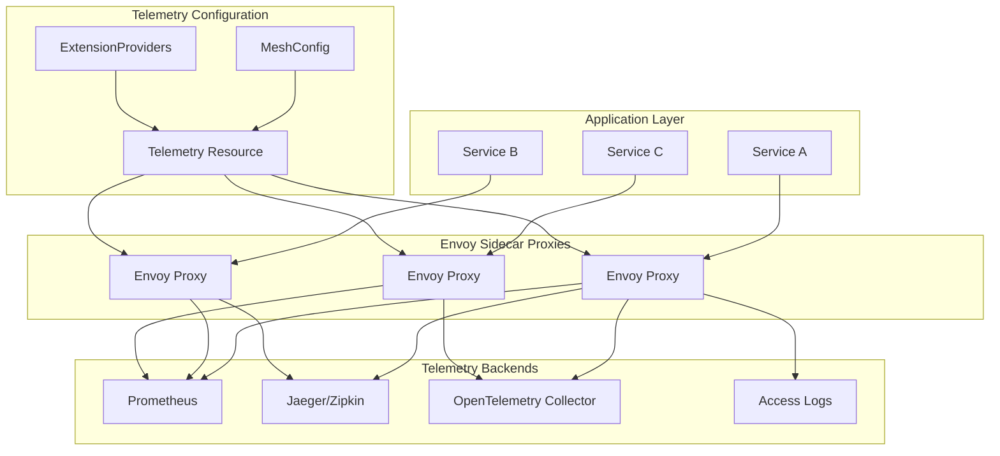
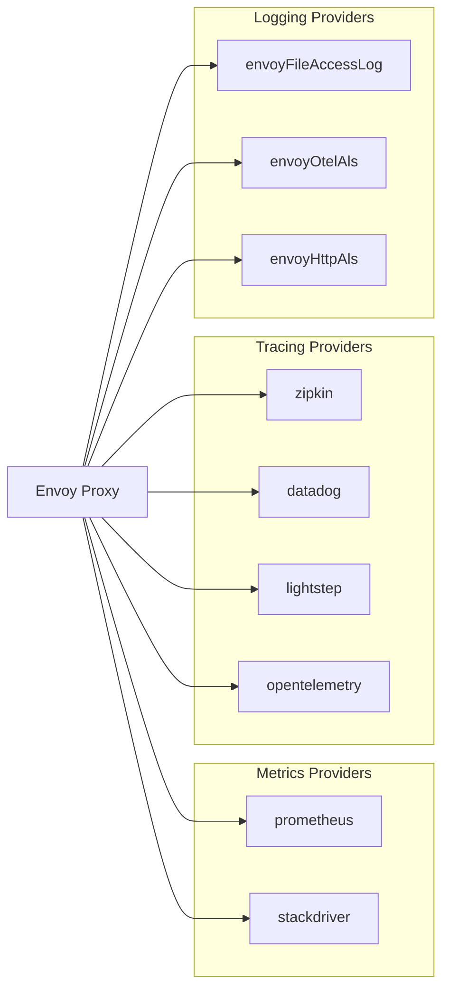
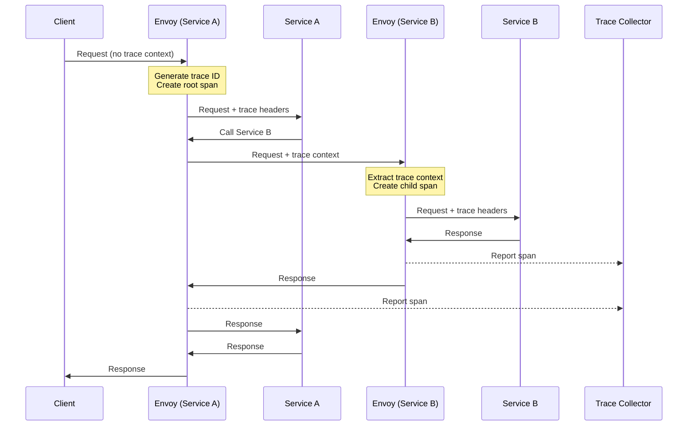
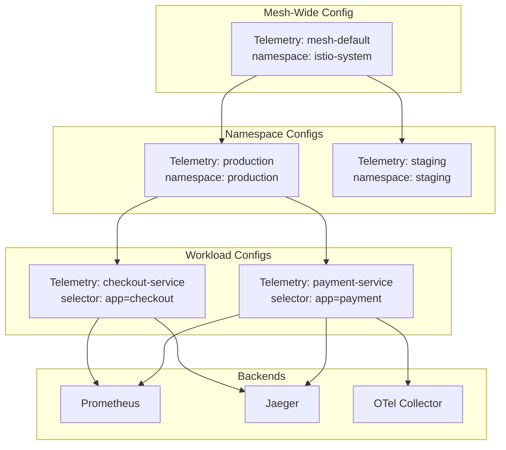

# How to Configure Istio Telemetry API for Custom Metrics

Author: [nawazdhandala](https://github.com/nawazdhandala)

Tags: Istio, Telemetry, Metrics, Observability, Service Mesh

Description: Learn how to use Istio Telemetry API to customize metrics, logs, and tracing collection.

---

## Introduction

Istio's Telemetry API provides a powerful and flexible way to configure observability features across your service mesh. Introduced in Istio 1.11 and becoming the standard in later versions, the Telemetry API allows you to customize metrics, access logging, and distributed tracing without modifying application code.

This comprehensive guide will walk you through configuring the Telemetry API to collect custom metrics, set up telemetry providers, and optimize your observability pipeline.

## Understanding the Telemetry API Architecture

Before diving into configuration, let's understand how the Telemetry API fits into Istio's architecture.



The Telemetry API works at three hierarchical levels:

1. **Mesh-wide**: Applied to all workloads in the mesh
2. **Namespace-level**: Applied to all workloads in a specific namespace
3. **Workload-level**: Applied to specific workloads using label selectors

## Prerequisites

Before configuring the Telemetry API, ensure you have:

- Istio 1.12 or later installed
- Access to your Kubernetes cluster with kubectl configured
- Basic understanding of Istio concepts
- Prometheus, Jaeger, or another telemetry backend deployed

The following command verifies your Istio installation and version:

```bash
# Check Istio version to ensure Telemetry API support
# Telemetry API is stable from Istio 1.12+
istioctl version

# Verify that the Istio control plane is running correctly
# All components should show as Running status
kubectl get pods -n istio-system
```

## Configuring Telemetry Providers

Telemetry providers define where your observability data is sent. You configure providers in the Istio MeshConfig or as ExtensionProviders.

### Setting Up Extension Providers in MeshConfig

Extension providers are the foundation for telemetry configuration. This IstioOperator configuration defines multiple providers for metrics, tracing, and logging:

```yaml
# IstioOperator configuration for telemetry providers
# This defines where telemetry data (metrics, traces, logs) will be sent
# Apply with: istioctl install -f istio-operator.yaml
apiVersion: install.istio.io/v1alpha1
kind: IstioOperator
metadata:
  name: istio-telemetry-config
  namespace: istio-system
spec:
  meshConfig:
    # Enable access logging globally
    # Can be overridden at namespace or workload level
    accessLogFile: /dev/stdout

    # Default providers used when no Telemetry resource specifies otherwise
    defaultProviders:
      metrics:
        - prometheus
      tracing:
        - jaeger
      accessLogging:
        - envoy

    # Extension providers define telemetry backends
    # Each provider type has specific configuration options
    extensionProviders:
      # Prometheus provider for metrics collection
      # Envoy exposes metrics at /stats/prometheus endpoint
      - name: prometheus
        prometheus: {}

      # Jaeger provider for distributed tracing
      # Traces are sent to the Jaeger collector service
      - name: jaeger
        zipkin:
          service: jaeger-collector.istio-system.svc.cluster.local
          port: 9411

      # OpenTelemetry Collector for unified telemetry
      # Supports metrics, traces, and logs through OTLP protocol
      - name: otel-collector
        opentelemetry:
          service: otel-collector.observability.svc.cluster.local
          port: 4317

      # Envoy access logging provider
      # Logs are written to stdout by default
      - name: envoy
        envoyFileAccessLog:
          path: /dev/stdout

      # OpenTelemetry-based access logging
      # Sends logs to an OTLP-compatible backend
      - name: otel-access-log
        envoyOtelAls:
          service: otel-collector.observability.svc.cluster.local
          port: 4317
```

### Provider Types Explained

Istio supports several provider types for different telemetry signals:



## Creating Telemetry Resources

The Telemetry resource is the primary way to configure observability settings. Let's explore different configuration scenarios.

### Mesh-Wide Telemetry Configuration

This configuration applies to all workloads in the mesh when deployed to the istio-system namespace without a selector:

```yaml
# Mesh-wide Telemetry resource
# Applies to ALL workloads across the entire service mesh
# Deploy to istio-system namespace for mesh-wide scope
apiVersion: telemetry.istio.io/v1alpha1
kind: Telemetry
metadata:
  name: mesh-default
  # istio-system namespace = mesh-wide configuration
  namespace: istio-system
spec:
  # No selector means this applies to all workloads

  # Tracing configuration for the entire mesh
  tracing:
    - providers:
        # Use the jaeger provider defined in MeshConfig
        - name: jaeger
      # Sample 10% of all traces for production
      # Adjust based on traffic volume and storage capacity
      randomSamplingPercentage: 10.0
      # Disable custom tags at mesh level
      # Individual services can add their own tags
      disableSpanReporting: false

  # Metrics configuration for the entire mesh
  metrics:
    - providers:
        - name: prometheus
      # Override specific metric settings
      overrides:
        # Customize the request_count metric
        - match:
            # INBOUND matches requests TO a service
            # OUTBOUND matches requests FROM a service
            mode: CLIENT_AND_SERVER
            metric: REQUEST_COUNT
          # Add custom tags to all request_count metrics
          tagOverrides:
            # Add a custom dimension for request priority
            request_priority:
              operation: UPSERT
              value: request.headers['x-priority'] | 'normal'

  # Access logging configuration
  accessLogging:
    - providers:
        - name: envoy
      # Disable logging by default to reduce overhead
      # Enable at namespace level where needed
      disabled: false
```

### Namespace-Level Telemetry Configuration

Apply more specific telemetry settings to a particular namespace:

```yaml
# Namespace-scoped Telemetry resource
# Applies to all workloads in the 'production' namespace
# Overrides mesh-wide settings for this namespace
apiVersion: telemetry.istio.io/v1alpha1
kind: Telemetry
metadata:
  name: production-telemetry
  # Namespace determines scope of this configuration
  namespace: production
spec:
  # Tracing with higher sampling for production debugging
  tracing:
    - providers:
        - name: jaeger
      # Higher sampling rate for production namespace
      # Captures more traces for critical services
      randomSamplingPercentage: 25.0
      # Add custom tags to all traces in this namespace
      customTags:
        # Static tag identifying the environment
        environment:
          literal:
            value: production
        # Dynamic tag from request header
        user_id:
          header:
            name: x-user-id
            # Default value if header is missing
            defaultValue: anonymous
        # Tag from Envoy metadata
        cluster_name:
          environment:
            name: ISTIO_META_CLUSTER_ID
            defaultValue: unknown

  # Enhanced metrics for production workloads
  metrics:
    - providers:
        - name: prometheus
        # Send metrics to OTel Collector as well
        - name: otel-collector
      overrides:
        # Add request method as a dimension
        - match:
            metric: ALL_METRICS
            mode: CLIENT_AND_SERVER
          tagOverrides:
            # Include HTTP method in metrics
            request_method:
              operation: UPSERT
              value: request.method
            # Include response flags for debugging
            response_flags:
              operation: UPSERT
              value: response.flags

  # Detailed access logging for production
  accessLogging:
    - providers:
        - name: otel-access-log
      # Enable access logging for all requests
      disabled: false
      # Only log specific responses (e.g., errors)
      filter:
        expression: response.code >= 400 || response.duration > 1000
```

### Workload-Specific Telemetry Configuration

Target specific workloads using label selectors:

```yaml
# Workload-specific Telemetry resource
# Uses selector to target specific pods/deployments
# Most specific configuration takes precedence
apiVersion: telemetry.istio.io/v1alpha1
kind: Telemetry
metadata:
  name: payment-service-telemetry
  namespace: production
spec:
  # Selector targets workloads with matching labels
  # Only pods with app=payment-service receive this config
  selector:
    matchLabels:
      app: payment-service

  # Full tracing for payment service (critical path)
  tracing:
    - providers:
        - name: jaeger
        # Also send to OTel collector for analysis
        - name: otel-collector
      # 100% sampling for payment transactions
      # Critical for debugging payment issues
      randomSamplingPercentage: 100.0
      # Extensive custom tags for payment context
      customTags:
        # Track payment-specific information
        transaction_id:
          header:
            name: x-transaction-id
            defaultValue: none
        payment_method:
          header:
            name: x-payment-method
            defaultValue: unknown
        merchant_id:
          header:
            name: x-merchant-id
            defaultValue: unknown
        # Add service version for canary tracking
        service_version:
          environment:
            name: SERVICE_VERSION
            defaultValue: unknown

  # Detailed metrics for payment monitoring
  metrics:
    - providers:
        - name: prometheus
      overrides:
        # Track payment amounts as a histogram
        - match:
            metric: REQUEST_DURATION
            mode: SERVER
          tagOverrides:
            # Add payment amount bucket
            payment_amount_bucket:
              operation: UPSERT
              value: |
                request.headers['x-payment-amount'] != '' ?
                  (int(request.headers['x-payment-amount']) < 100 ? 'small' :
                   int(request.headers['x-payment-amount']) < 1000 ? 'medium' : 'large')
                : 'unknown'

  # Always log payment requests
  accessLogging:
    - providers:
        - name: otel-access-log
        - name: envoy
      disabled: false
      # Log all payment requests regardless of status
      filter:
        expression: "true"
```

## Customizing Metrics Collection

The Telemetry API provides fine-grained control over which metrics are collected and what dimensions they include.

### Understanding Istio's Standard Metrics

Istio's proxy generates several standard metrics. Here's a visualization of the metric types:

```mermaid
flowchart TB
    subgraph "Request Metrics"
        RC[istio_requests_total<br/>Counter: Total requests]
        RD[istio_request_duration_milliseconds<br/>Histogram: Request latency]
        RB[istio_request_bytes<br/>Histogram: Request size]
        ResB[istio_response_bytes<br/>Histogram: Response size]
    end

    subgraph "TCP Metrics"
        TCP_O[istio_tcp_sent_bytes_total<br/>Counter: Bytes sent]
        TCP_I[istio_tcp_received_bytes_total<br/>Counter: Bytes received]
        TCP_C[istio_tcp_connections_opened_total<br/>Counter: Connections opened]
        TCP_CL[istio_tcp_connections_closed_total<br/>Counter: Connections closed]
    end

    subgraph "gRPC Metrics"
        GRPC_R[istio_request_messages_total<br/>Counter: gRPC request messages]
        GRPC_Res[istio_response_messages_total<br/>Counter: gRPC response messages]
    end

    Envoy[Envoy Proxy] --> RC
    Envoy --> RD
    Envoy --> RB
    Envoy --> ResB
    Envoy --> TCP_O
    Envoy --> TCP_I
    Envoy --> TCP_C
    Envoy --> TCP_CL
    Envoy --> GRPC_R
    Envoy --> GRPC_Res
```



### Configuring Custom Metric Dimensions

Add custom dimensions to enrich your metrics with business context:

```yaml
# Telemetry resource for custom metric dimensions
# Adds business-relevant tags to standard Istio metrics
apiVersion: telemetry.istio.io/v1alpha1
kind: Telemetry
metadata:
  name: custom-metrics-dimensions
  namespace: production
spec:
  metrics:
    - providers:
        - name: prometheus
      overrides:
        # Add custom dimensions to all request metrics
        - match:
            # Match all HTTP/gRPC metrics
            metric: ALL_METRICS
            # Apply to both client and server sides
            mode: CLIENT_AND_SERVER
          tagOverrides:
            # API version from request path
            # Useful for tracking usage across API versions
            api_version:
              operation: UPSERT
              # Extract version from URL path like /v1/users or /v2/products
              value: |
                request.url_path.startsWith('/v1') ? 'v1' :
                request.url_path.startsWith('/v2') ? 'v2' :
                request.url_path.startsWith('/v3') ? 'v3' : 'unknown'

            # Customer tier from header
            # Helps identify performance issues by customer segment
            customer_tier:
              operation: UPSERT
              value: request.headers['x-customer-tier'] | 'standard'

            # Request region for geographic analysis
            region:
              operation: UPSERT
              value: request.headers['x-region'] | 'unknown'

        # Specific customization for request count metric
        - match:
            metric: REQUEST_COUNT
            mode: SERVER
          tagOverrides:
            # Add error category for better error analysis
            error_category:
              operation: UPSERT
              value: |
                response.code >= 500 ? 'server_error' :
                response.code >= 400 ? 'client_error' :
                response.code >= 300 ? 'redirect' : 'success'

            # Track authenticated vs anonymous requests
            auth_status:
              operation: UPSERT
              value: |
                request.headers['authorization'] != '' ? 'authenticated' : 'anonymous'

        # Customize request duration histogram
        - match:
            metric: REQUEST_DURATION
            mode: SERVER
          tagOverrides:
            # Categorize latency for SLO tracking
            latency_category:
              operation: UPSERT
              value: |
                response.duration < 100 ? 'fast' :
                response.duration < 500 ? 'normal' :
                response.duration < 2000 ? 'slow' : 'very_slow'
```

### Removing Unnecessary Metric Dimensions

Reduce cardinality and storage costs by removing dimensions you don't need:

```yaml
# Telemetry resource to reduce metric cardinality
# Removes high-cardinality or unused dimensions
apiVersion: telemetry.istio.io/v1alpha1
kind: Telemetry
metadata:
  name: reduce-cardinality
  namespace: istio-system
spec:
  metrics:
    - providers:
        - name: prometheus
      overrides:
        # Remove high-cardinality labels from all metrics
        - match:
            metric: ALL_METRICS
            mode: CLIENT_AND_SERVER
          tagOverrides:
            # Remove destination_service_name if you use destination_service
            # This prevents duplicate information
            destination_service_name:
              operation: REMOVE

            # Remove source pod name to reduce cardinality
            # Keep source_workload for sufficient granularity
            source_pod:
              operation: REMOVE

            # Remove destination pod name
            # Workload-level metrics are usually sufficient
            destination_pod:
              operation: REMOVE

            # Remove grpc_response_status for non-gRPC services
            # Reduces unused labels
            grpc_response_status:
              operation: REMOVE
```

### Enabling Additional Histograms

Configure histogram buckets for more accurate latency tracking:

```yaml
# Telemetry resource with custom histogram configuration
# Note: Histogram bucket configuration is done via EnvoyFilter
# This example shows the conceptual approach
apiVersion: telemetry.istio.io/v1alpha1
kind: Telemetry
metadata:
  name: histogram-config
  namespace: production
spec:
  metrics:
    - providers:
        - name: prometheus
      overrides:
        # Ensure request duration metric is enabled
        - match:
            metric: REQUEST_DURATION
            mode: SERVER
          # Ensure this metric is not disabled
          disabled: false
          tagOverrides:
            # Add SLO bucket tag for percentile calculation
            slo_bucket:
              operation: UPSERT
              value: |
                response.duration <= 100 ? 'p50_target' :
                response.duration <= 250 ? 'p90_target' :
                response.duration <= 1000 ? 'p99_target' : 'slo_violation'
```

## Configuring Distributed Tracing

Distributed tracing helps you understand request flow across services. The Telemetry API provides extensive tracing configuration options.

### Tracing Flow in Istio



### Basic Tracing Configuration

Configure tracing with sampling and custom tags:

```yaml
# Basic tracing configuration
# Sets up distributed tracing with Jaeger
apiVersion: telemetry.istio.io/v1alpha1
kind: Telemetry
metadata:
  name: tracing-config
  namespace: production
spec:
  tracing:
    # Primary tracing configuration
    - providers:
        # Use Jaeger as the tracing backend
        - name: jaeger

      # Random sampling percentage (0.0 to 100.0)
      # 10% means 1 in 10 requests are traced
      # Balance between visibility and overhead
      randomSamplingPercentage: 10.0

      # Do not disable span reporting
      # Set to true to completely disable tracing
      disableSpanReporting: false

      # Custom tags added to every span
      # Provides business context to traces
      customTags:
        # Static tag for environment identification
        env:
          literal:
            value: production

        # Dynamic tag from request header
        # Allows correlation with external systems
        correlation_id:
          header:
            name: x-correlation-id
            defaultValue: "none"

        # User identifier for user journey analysis
        user_id:
          header:
            name: x-user-id
            defaultValue: "anonymous"

        # Pod information from environment
        pod_name:
          environment:
            name: POD_NAME
            defaultValue: "unknown"

        # Namespace from environment
        namespace:
          environment:
            name: POD_NAMESPACE
            defaultValue: "unknown"
```

### Advanced Tracing with Multiple Providers

Send traces to multiple backends for redundancy or analysis:

```yaml
# Multi-provider tracing configuration
# Sends traces to both Jaeger and OpenTelemetry Collector
apiVersion: telemetry.istio.io/v1alpha1
kind: Telemetry
metadata:
  name: multi-backend-tracing
  namespace: production
spec:
  tracing:
    # Send traces to Jaeger for real-time visualization
    - providers:
        - name: jaeger
      randomSamplingPercentage: 10.0
      customTags:
        trace_source:
          literal:
            value: istio-mesh

    # Also send traces to OTel Collector for long-term storage
    - providers:
        - name: otel-collector
      # Can use different sampling rate for different backends
      randomSamplingPercentage: 100.0
      customTags:
        # Different tags for OTel destination
        collector_destination:
          literal:
            value: otel
```

### Conditional Tracing Based on Headers

Implement header-based sampling for on-demand tracing:

```yaml
# Conditional tracing configuration
# Higher sampling for specific request types
apiVersion: telemetry.istio.io/v1alpha1
kind: Telemetry
metadata:
  name: conditional-tracing
  namespace: production
spec:
  # This selector ensures full tracing for debug requests
  selector:
    matchLabels:
      app: api-gateway

  tracing:
    - providers:
        - name: jaeger
      # Base sampling rate
      randomSamplingPercentage: 5.0

      # Add debug context as tags
      customTags:
        # Track if this was a debug request
        debug_mode:
          header:
            name: x-debug-trace
            defaultValue: "false"

        # Capture the client that initiated the request
        client_name:
          header:
            name: x-client-name
            defaultValue: "unknown"

        # Track request priority
        priority:
          header:
            name: x-priority
            defaultValue: "normal"

---
# Separate Telemetry for debug-enabled workloads
# Apply 100% sampling when debug mode is needed
apiVersion: telemetry.istio.io/v1alpha1
kind: Telemetry
metadata:
  name: debug-tracing
  namespace: production
spec:
  selector:
    matchLabels:
      # Apply to workloads labeled for debugging
      debug-enabled: "true"

  tracing:
    - providers:
        - name: jaeger
        - name: otel-collector
      # 100% sampling for debug workloads
      randomSamplingPercentage: 100.0
      customTags:
        debug_session:
          header:
            name: x-debug-session-id
            defaultValue: "none"
```

## Configuring Access Logging

Access logging provides detailed records of all requests passing through the mesh.

### Access Log Configuration Options

```yaml
# Comprehensive access logging configuration
# Configures structured logging with filtering
apiVersion: telemetry.istio.io/v1alpha1
kind: Telemetry
metadata:
  name: access-logging-config
  namespace: production
spec:
  accessLogging:
    # File-based access logging (stdout)
    - providers:
        - name: envoy

      # Enable access logging
      disabled: false

      # Filter to reduce log volume
      # Only log errors and slow requests
      filter:
        # CEL expression for filtering
        # Logs only 4xx/5xx errors OR requests taking > 1 second
        expression: response.code >= 400 || response.duration > 1000

    # OpenTelemetry-based access logging
    - providers:
        - name: otel-access-log

      disabled: false

      # Log all requests for this provider
      # OTel collector can handle higher volume
      filter:
        expression: "true"
```

### Configuring Custom Access Log Format

While the Telemetry API handles provider selection, custom log formats require additional EnvoyFilter configuration:

```yaml
# MeshConfig extension provider with custom access log format
# This defines the structure of access log entries
apiVersion: install.istio.io/v1alpha1
kind: IstioOperator
spec:
  meshConfig:
    extensionProviders:
      # Custom JSON format access logger
      - name: json-access-log
        envoyFileAccessLog:
          path: /dev/stdout
          logFormat:
            labels:
              # Timestamp in ISO 8601 format
              timestamp: "%START_TIME%"

              # Request information
              method: "%REQ(:METHOD)%"
              path: "%REQ(X-ENVOY-ORIGINAL-PATH?:PATH)%"
              protocol: "%PROTOCOL%"

              # Response information
              response_code: "%RESPONSE_CODE%"
              response_flags: "%RESPONSE_FLAGS%"

              # Timing information (in milliseconds)
              duration_ms: "%DURATION%"
              request_duration_ms: "%REQUEST_DURATION%"
              response_duration_ms: "%RESPONSE_DURATION%"

              # Size information
              bytes_received: "%BYTES_RECEIVED%"
              bytes_sent: "%BYTES_SENT%"

              # Service mesh metadata
              upstream_service: "%UPSTREAM_CLUSTER%"
              upstream_host: "%UPSTREAM_HOST%"
              downstream_remote: "%DOWNSTREAM_REMOTE_ADDRESS%"

              # Custom headers for correlation
              request_id: "%REQ(X-REQUEST-ID)%"
              trace_id: "%REQ(X-B3-TRACEID)%"
              user_agent: "%REQ(USER-AGENT)%"

              # Istio-specific metadata
              source_workload: "%REQ(X-FORWARDED-CLIENT-CERT)%"

---
# Telemetry resource using the custom logger
apiVersion: telemetry.istio.io/v1alpha1
kind: Telemetry
metadata:
  name: json-access-logging
  namespace: production
spec:
  accessLogging:
    - providers:
        - name: json-access-log
      disabled: false
      filter:
        # Log all requests
        expression: "true"
```

## Complete Production Example

Here's a comprehensive example bringing together all telemetry configurations for a production environment:



### Step 1: Configure Extension Providers

First, set up all telemetry providers in the Istio installation:

```yaml
# Complete IstioOperator configuration for production
# Defines all telemetry providers used across the mesh
apiVersion: install.istio.io/v1alpha1
kind: IstioOperator
metadata:
  name: production-istio
  namespace: istio-system
spec:
  profile: default

  meshConfig:
    # Enable access logging by default
    accessLogFile: /dev/stdout
    accessLogEncoding: JSON

    # Default providers for workloads without specific config
    defaultProviders:
      metrics:
        - prometheus
      tracing:
        - jaeger
      accessLogging:
        - json-access-log

    # Complete set of extension providers
    extensionProviders:
      # Prometheus for metrics (built-in support)
      - name: prometheus
        prometheus: {}

      # Jaeger for real-time tracing
      - name: jaeger
        zipkin:
          service: jaeger-collector.observability.svc.cluster.local
          port: 9411

      # OpenTelemetry Collector for unified telemetry
      - name: otel-collector
        opentelemetry:
          service: otel-collector.observability.svc.cluster.local
          port: 4317

      # JSON access logger for structured logs
      - name: json-access-log
        envoyFileAccessLog:
          path: /dev/stdout
          logFormat:
            labels:
              timestamp: "%START_TIME%"
              method: "%REQ(:METHOD)%"
              path: "%REQ(X-ENVOY-ORIGINAL-PATH?:PATH)%"
              response_code: "%RESPONSE_CODE%"
              duration_ms: "%DURATION%"
              request_id: "%REQ(X-REQUEST-ID)%"
              trace_id: "%REQ(X-B3-TRACEID)%"

      # OTel access logging for centralized log management
      - name: otel-access-log
        envoyOtelAls:
          service: otel-collector.observability.svc.cluster.local
          port: 4317
```

### Step 2: Mesh-Wide Telemetry Baseline

Establish baseline telemetry for all workloads:

```yaml
# Mesh-wide telemetry baseline
# Provides default configuration for all workloads
apiVersion: telemetry.istio.io/v1alpha1
kind: Telemetry
metadata:
  name: mesh-telemetry-baseline
  namespace: istio-system
spec:
  # Baseline tracing config
  tracing:
    - providers:
        - name: jaeger
      # Conservative sampling for mesh-wide
      randomSamplingPercentage: 1.0
      customTags:
        mesh:
          literal:
            value: production-mesh

  # Baseline metrics config
  metrics:
    - providers:
        - name: prometheus
      overrides:
        # Add cluster identification to all metrics
        - match:
            metric: ALL_METRICS
            mode: CLIENT_AND_SERVER
          tagOverrides:
            cluster:
              operation: UPSERT
              value: "production-cluster"

  # Minimal access logging at mesh level
  accessLogging:
    - providers:
        - name: json-access-log
      # Only log errors at mesh level
      filter:
        expression: response.code >= 500
```

### Step 3: Production Namespace Configuration

Enhanced telemetry for the production namespace:

```yaml
# Production namespace telemetry
# Enhanced observability for production workloads
apiVersion: telemetry.istio.io/v1alpha1
kind: Telemetry
metadata:
  name: production-telemetry
  namespace: production
spec:
  # Enhanced tracing for production
  tracing:
    - providers:
        - name: jaeger
        - name: otel-collector
      randomSamplingPercentage: 10.0
      customTags:
        environment:
          literal:
            value: production
        version:
          environment:
            name: SERVICE_VERSION
            defaultValue: unknown
        pod:
          environment:
            name: POD_NAME
            defaultValue: unknown

  # Production metrics with business dimensions
  metrics:
    - providers:
        - name: prometheus
      overrides:
        - match:
            metric: REQUEST_COUNT
            mode: SERVER
          tagOverrides:
            # Add business-relevant dimensions
            api_version:
              operation: UPSERT
              value: |
                request.url_path.startsWith('/api/v1') ? 'v1' :
                request.url_path.startsWith('/api/v2') ? 'v2' : 'unknown'
            customer_segment:
              operation: UPSERT
              value: request.headers['x-customer-segment'] | 'standard'

        # Remove high-cardinality labels
        - match:
            metric: ALL_METRICS
            mode: CLIENT_AND_SERVER
          tagOverrides:
            destination_pod:
              operation: REMOVE
            source_pod:
              operation: REMOVE

  # Detailed access logging for production
  accessLogging:
    - providers:
        - name: json-access-log
      # Log all errors and slow requests
      filter:
        expression: response.code >= 400 || response.duration > 2000

    - providers:
        - name: otel-access-log
      # Send all logs to OTel for analysis
      filter:
        expression: "true"
```

### Step 4: Critical Service Configuration

Special configuration for payment-critical services:

```yaml
# Payment service telemetry
# Maximum observability for financial transactions
apiVersion: telemetry.istio.io/v1alpha1
kind: Telemetry
metadata:
  name: payment-service-telemetry
  namespace: production
spec:
  selector:
    matchLabels:
      app: payment-service

  # Full tracing for payment transactions
  tracing:
    - providers:
        - name: jaeger
        - name: otel-collector
      # 100% sampling - trace every payment
      randomSamplingPercentage: 100.0
      customTags:
        service_type:
          literal:
            value: payment-critical
        transaction_id:
          header:
            name: x-transaction-id
            defaultValue: missing
        payment_method:
          header:
            name: x-payment-method
            defaultValue: unknown
        merchant_id:
          header:
            name: x-merchant-id
            defaultValue: unknown
        amount_bucket:
          header:
            name: x-amount-bucket
            defaultValue: unknown

  # Detailed payment metrics
  metrics:
    - providers:
        - name: prometheus
      overrides:
        - match:
            metric: ALL_METRICS
            mode: SERVER
          tagOverrides:
            payment_status:
              operation: UPSERT
              value: |
                response.code == 200 ? 'success' :
                response.code == 400 ? 'invalid_request' :
                response.code == 402 ? 'payment_required' :
                response.code == 403 ? 'forbidden' :
                response.code >= 500 ? 'server_error' : 'other'
            payment_provider:
              operation: UPSERT
              value: request.headers['x-payment-provider'] | 'unknown'

  # Log every payment request
  accessLogging:
    - providers:
        - name: json-access-log
        - name: otel-access-log
      # Log all payment requests
      filter:
        expression: "true"
```

## Verification and Troubleshooting

After applying configurations, verify they are working correctly.

### Verifying Telemetry Configuration

Use these commands to verify your telemetry setup:

```bash
# List all Telemetry resources across namespaces
# Shows scope and configuration of each resource
kubectl get telemetry -A

# View detailed configuration of a specific Telemetry resource
# Useful for debugging configuration issues
kubectl describe telemetry production-telemetry -n production

# Check if Istio has processed the Telemetry configuration
# Look for conditions and status in the output
kubectl get telemetry production-telemetry -n production -o yaml

# Verify that Envoy has received the telemetry configuration
# Check the stats_sinks and tracing configuration
istioctl proxy-config bootstrap deploy/my-app -n production | grep -A 20 "tracing"

# View the merged effective configuration for a workload
# Shows the final configuration after merging all Telemetry resources
istioctl experimental telemetry workload deploy/my-app -n production
```

### Checking Metrics Output

Verify metrics are being collected with correct dimensions:

```bash
# Port-forward to a pod's Envoy admin interface
# This allows direct inspection of Envoy's metrics
kubectl port-forward deploy/my-app -n production 15000:15000

# Query Envoy's Prometheus metrics endpoint
# Look for custom dimensions you've configured
curl -s localhost:15000/stats/prometheus | grep istio_requests_total

# Check for specific custom tags in metrics
# Replace 'customer_segment' with your custom tag name
curl -s localhost:15000/stats/prometheus | grep customer_segment

# View active Prometheus targets in your Prometheus instance
# Verify that Istio endpoints are being scraped
kubectl port-forward svc/prometheus -n observability 9090:9090
# Then browse to http://localhost:9090/targets
```

### Debugging Tracing Issues

If traces are not appearing:

```bash
# Check if tracing is enabled on a workload's proxy
# Look for 'tracing' section in the bootstrap config
istioctl proxy-config bootstrap deploy/my-app -n production -o json | jq '.bootstrap.tracing'

# Verify trace headers are being propagated
# Check for B3 or W3C trace context headers
kubectl exec deploy/my-app -n production -c istio-proxy -- \
  curl -s http://localhost:15000/config_dump | grep -i "x-b3"

# Check connection to tracing backend
# Verify the collector service is reachable
kubectl exec deploy/my-app -n production -c istio-proxy -- \
  curl -s http://jaeger-collector.observability:9411/health

# View Envoy's tracing statistics
# Shows spans sent, errors, and other tracing metrics
kubectl exec deploy/my-app -n production -c istio-proxy -- \
  curl -s localhost:15000/stats | grep tracing
```

## Best Practices

### 1. Use Hierarchical Configuration

Take advantage of Istio's configuration hierarchy:

```yaml
# Pattern: Define base config at mesh level, override where needed
# This reduces duplication and ensures consistent defaults

# Mesh-level: Conservative settings, basic dimensions
# Namespace-level: Environment-specific adjustments
# Workload-level: Service-specific requirements only
```

### 2. Manage Metric Cardinality

High-cardinality metrics can overwhelm your monitoring system:

```yaml
# DO: Use bounded dimensions with known values
tagOverrides:
  region:
    operation: UPSERT
    value: |
      request.headers['x-region'] == 'us-east' ? 'us-east' :
      request.headers['x-region'] == 'us-west' ? 'us-west' :
      request.headers['x-region'] == 'eu-west' ? 'eu-west' : 'other'

# DON'T: Use unbounded values like user IDs or session IDs
# These create millions of unique time series
```

### 3. Sample Appropriately

Balance visibility with overhead:

```yaml
# Production traffic: 1-10% sampling usually sufficient
# Staging/testing: 50-100% sampling for debugging
# Critical paths: 100% sampling (payments, auth)
# High-volume services: Consider lower sampling rates
```

### 4. Use Filters for Access Logs

Reduce log volume while keeping important data:

```yaml
# Good: Log errors and anomalies
filter:
  expression: response.code >= 400 || response.duration > 2000

# Good: Log specific endpoints only
filter:
  expression: request.url_path.startsWith('/api/v1/payments')

# Avoid: Logging everything on high-traffic services
# This can cause storage and performance issues
```

## Conclusion

The Istio Telemetry API provides a powerful, declarative way to configure observability across your service mesh. By understanding the hierarchical configuration model and leveraging custom dimensions, sampling strategies, and access log filtering, you can build a comprehensive observability solution tailored to your needs.

Key takeaways:

1. **Use the hierarchy**: Configure at the appropriate level (mesh, namespace, or workload)
2. **Manage cardinality**: Remove unnecessary dimensions and use bounded values
3. **Sample wisely**: Balance trace visibility with system overhead
4. **Filter logs**: Use CEL expressions to capture important events without overwhelming storage
5. **Verify configuration**: Use istioctl and direct Envoy inspection to validate settings

With these techniques, you can gain deep insights into your service mesh while maintaining optimal performance.

## Additional Resources

- [Istio Telemetry API Documentation](https://istio.io/latest/docs/reference/config/telemetry/)
- [Envoy Statistics Overview](https://www.envoyproxy.io/docs/envoy/latest/intro/arch_overview/observability/statistics)
- [OpenTelemetry Collector Configuration](https://opentelemetry.io/docs/collector/configuration/)
- [Prometheus Best Practices for Naming](https://prometheus.io/docs/practices/naming/)
