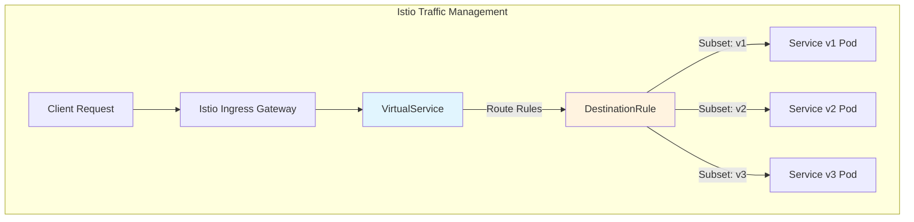
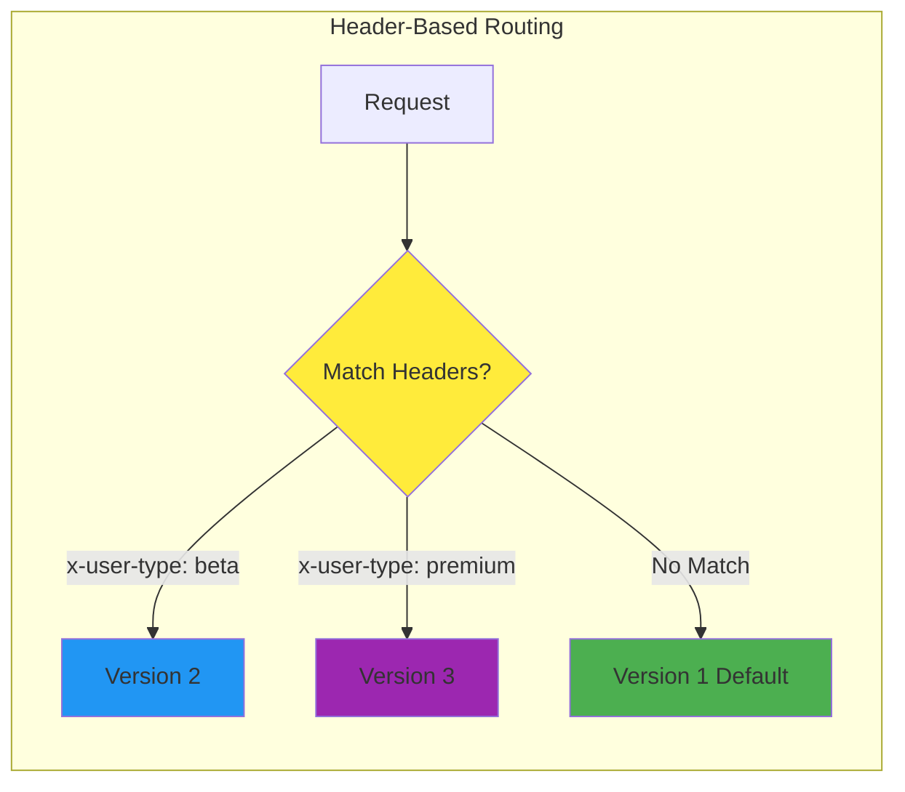
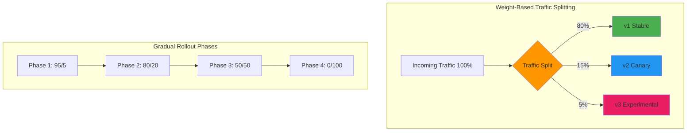
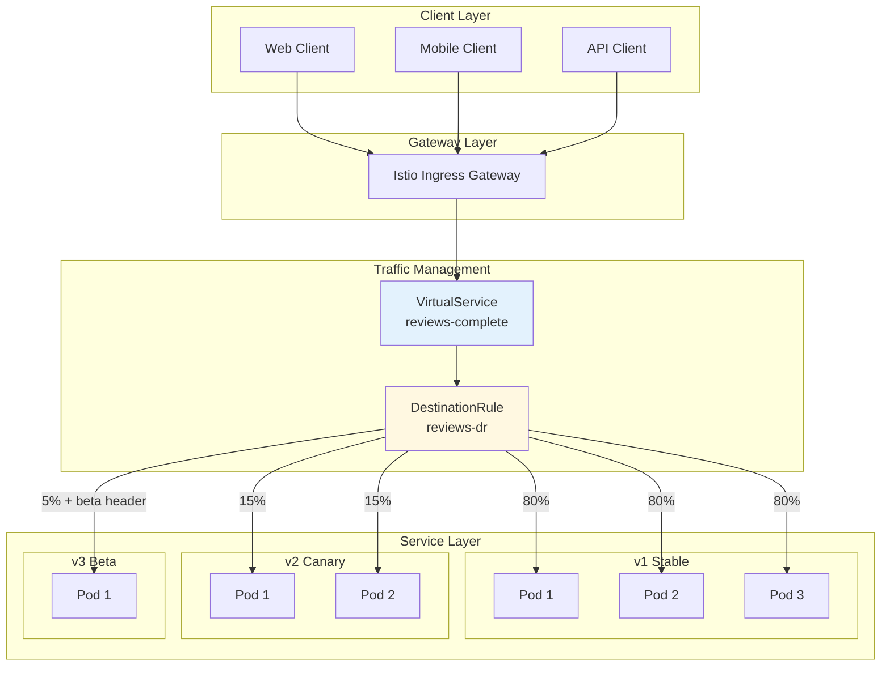

# How to Configure Istio Traffic Management (VirtualService, DestinationRule)

Author: [nawazdhandala](https://github.com/nawazdhandala)

Tags: Istio, Service Mesh, Traffic Management, Kubernetes, Cloud Native

Description: Learn how to control traffic routing with Istio VirtualService and DestinationRule resources.

---

## Introduction

Istio's traffic management capabilities are one of its most powerful features, enabling you to control how traffic flows between services in your Kubernetes cluster. At the heart of this functionality are two key resources: **VirtualService** and **DestinationRule**.

In this comprehensive guide, you'll learn how to:
- Configure VirtualService for traffic routing
- Define DestinationRule subsets for version-based routing
- Implement header-based routing for A/B testing
- Set up weight-based traffic splitting for canary deployments
- Visualize traffic flow patterns

## Prerequisites

Before you begin, ensure you have:
- A Kubernetes cluster (1.22+)
- Istio installed (1.18+)
- kubectl configured
- Basic understanding of Kubernetes services

## Understanding Istio Traffic Management Architecture

Before diving into configurations, let's understand how Istio's traffic management works:



## VirtualService: The Traffic Router

A VirtualService defines how requests are routed to a service. It acts as a traffic controller, determining which version of a service receives incoming requests based on various matching criteria.

### Basic VirtualService Structure

The following example shows a basic VirtualService configuration that routes all traffic to version 1 of a reviews service:

```yaml
# VirtualService for the reviews service
# This configuration routes ALL traffic to the v1 subset of the reviews service
# The 'hosts' field specifies which service this VirtualService applies to
# The 'http' section contains the routing rules for HTTP traffic
apiVersion: networking.istio.io/v1beta1
kind: VirtualService
metadata:
  # Name of the VirtualService - typically matches the service name
  name: reviews-virtualservice
  namespace: default
spec:
  # hosts: List of destination hosts to which traffic is being sent
  # Can be a DNS name, IP address, or Kubernetes service short name
  hosts:
  - reviews

  # http: Ordered list of route rules for HTTP traffic
  # Rules are evaluated in order; first match wins
  http:
  - name: "reviews-default-route"
    # route: List of weighted destinations for the traffic
    route:
    - destination:
        # host: The destination service in Kubernetes
        host: reviews
        # subset: Named version of the service (defined in DestinationRule)
        subset: v1
      # weight: Percentage of traffic to send to this destination (0-100)
      weight: 100
```

## DestinationRule: Defining Service Subsets

A DestinationRule defines policies that apply to traffic after routing has occurred. It allows you to partition a service into subsets and configure load balancing, connection pool settings, and outlier detection.

### Defining Subsets with DestinationRule

The following DestinationRule creates three subsets (v1, v2, v3) based on the version label, each with its own load balancing policy:

```yaml
# DestinationRule for the reviews service
# This configuration defines three subsets (versions) of the reviews service
# Each subset corresponds to pods with a specific 'version' label
# Different load balancing strategies can be applied to each subset
apiVersion: networking.istio.io/v1beta1
kind: DestinationRule
metadata:
  name: reviews-destination-rule
  namespace: default
spec:
  # host: The name of the service this rule applies to
  # Must match the host in the VirtualService
  host: reviews

  # trafficPolicy: Default traffic policies for all subsets
  # Can be overridden at the subset level
  trafficPolicy:
    # connectionPool: Settings for TCP and HTTP connection pooling
    connectionPool:
      tcp:
        # maxConnections: Maximum number of connections to the service
        maxConnections: 100
      http:
        # h2UpgradePolicy: Specifies if HTTP/1.1 should upgrade to HTTP/2
        h2UpgradePolicy: UPGRADE
        # http1MaxPendingRequests: Maximum pending HTTP/1.1 requests
        http1MaxPendingRequests: 100
        # http2MaxRequests: Maximum active HTTP/2 requests
        http2MaxRequests: 1000

    # outlierDetection: Circuit breaker configuration
    # Ejects unhealthy hosts from the load balancing pool
    outlierDetection:
      # consecutive5xxErrors: Number of 5xx errors before ejection
      consecutive5xxErrors: 5
      # interval: Time interval for error counting
      interval: 30s
      # baseEjectionTime: Minimum duration a host is ejected
      baseEjectionTime: 30s
      # maxEjectionPercent: Maximum percentage of hosts that can be ejected
      maxEjectionPercent: 50

  # subsets: Named versions of the destination service
  # Each subset is identified by labels on the service pods
  subsets:
  # Subset v1: Stable production version
  - name: v1
    # labels: Pod labels that identify this subset
    labels:
      version: v1
    # trafficPolicy: Override default traffic policy for this subset
    trafficPolicy:
      loadBalancer:
        # ROUND_ROBIN: Distribute requests evenly across all instances
        simple: ROUND_ROBIN

  # Subset v2: Beta version with new features
  - name: v2
    labels:
      version: v2
    trafficPolicy:
      loadBalancer:
        # LEAST_REQUEST: Route to instance with fewest active requests
        # Better for varying request processing times
        simple: LEAST_REQUEST

  # Subset v3: Canary version for testing
  - name: v3
    labels:
      version: v3
    trafficPolicy:
      loadBalancer:
        # RANDOM: Randomly select an instance
        # Good for stateless services with similar capacity
        simple: RANDOM
```

## Header-Based Routing

Header-based routing allows you to route traffic based on HTTP headers, enabling powerful use cases like A/B testing, feature flags, and user-specific routing.

### Traffic Flow for Header-Based Routing



### VirtualService with Header-Based Routing

The following configuration routes traffic based on the x-user-type header, enabling different user segments to receive different versions of the service:

```yaml
# VirtualService with header-based routing
# This configuration demonstrates routing based on HTTP headers
# Use cases: A/B testing, beta features, premium user routing
apiVersion: networking.istio.io/v1beta1
kind: VirtualService
metadata:
  name: reviews-header-routing
  namespace: default
spec:
  hosts:
  - reviews

  # gateways: List of gateway names to apply this VirtualService
  # Use 'mesh' for internal service-to-service traffic
  gateways:
  - mesh

  http:
  # Rule 1: Route beta users to v2
  # This rule matches requests with the x-user-type: beta header
  - name: "beta-users-route"
    # match: Conditions that must be met for this rule to apply
    match:
    - headers:
        # x-user-type: Custom header to identify user type
        x-user-type:
          # exact: Header value must match exactly
          exact: "beta"
    route:
    - destination:
        host: reviews
        subset: v2
      weight: 100
    # headers: Manipulate request/response headers
    headers:
      response:
        # add: Add headers to the response
        add:
          x-served-by: "reviews-v2-beta"

  # Rule 2: Route premium users to v3 with enhanced features
  # Premium users get access to the latest features
  - name: "premium-users-route"
    match:
    - headers:
        x-user-type:
          exact: "premium"
        # Multiple header conditions can be combined (AND logic)
        x-request-priority:
          # prefix: Header value must start with this string
          prefix: "high"
    route:
    - destination:
        host: reviews
        subset: v3
      weight: 100
    headers:
      response:
        add:
          x-served-by: "reviews-v3-premium"

  # Rule 3: Route internal testing traffic
  # Matches requests with specific test headers
  - name: "internal-testing-route"
    match:
    - headers:
        x-internal-testing:
          # regex: Match using regular expression
          regex: "^test-[a-z0-9]+$"
    route:
    - destination:
        host: reviews
        subset: v3
      weight: 100
    # timeout: Maximum time to wait for a response
    timeout: 30s
    # retries: Retry policy for failed requests
    retries:
      # attempts: Number of retry attempts
      attempts: 3
      # perTryTimeout: Timeout per retry attempt
      perTryTimeout: 10s
      # retryOn: Conditions that trigger a retry
      retryOn: "5xx,reset,connect-failure"

  # Rule 4: Default route for all other traffic
  # This is a catch-all rule that must be last
  - name: "default-route"
    route:
    - destination:
        host: reviews
        subset: v1
      weight: 100
```

### Advanced Header Matching Examples

The following example shows more complex header matching patterns including multiple conditions, regex patterns, and cookie-based routing:

```yaml
# Advanced VirtualService with complex header matching
# Demonstrates various matching operators and combinations
apiVersion: networking.istio.io/v1beta1
kind: VirtualService
metadata:
  name: reviews-advanced-headers
  namespace: default
spec:
  hosts:
  - reviews

  http:
  # Match based on multiple headers with different operators
  - name: "complex-header-match"
    match:
    # First match condition: API version header
    - headers:
        # Exact match for API version
        x-api-version:
          exact: "v2"
        # User agent must contain 'Mobile'
        user-agent:
          regex: ".*Mobile.*"
      # uri: Match on the request URI path
      uri:
        # prefix: URI must start with /api/
        prefix: "/api/"

    # Second match condition (OR with first)
    # Either condition being true will match
    - headers:
        x-feature-flag:
          exact: "new-reviews-ui"

    route:
    - destination:
        host: reviews
        subset: v2
    # fault: Inject faults for testing resilience
    fault:
      delay:
        # percentage: Percentage of requests to delay
        percentage:
          value: 10.0
        # fixedDelay: Amount of delay to inject
        fixedDelay: 5s

  # Route based on cookies (parsed from Cookie header)
  - name: "cookie-based-routing"
    match:
    - headers:
        # Match cookies using regex
        # Cookies are in format: key1=value1; key2=value2
        cookie:
          regex: ".*session_type=premium.*"
    route:
    - destination:
        host: reviews
        subset: v3

  # Default route
  - name: "default"
    route:
    - destination:
        host: reviews
        subset: v1
```

## Weight-Based Traffic Splitting

Weight-based traffic splitting is essential for canary deployments and gradual rollouts. It allows you to send a percentage of traffic to different service versions.

### Canary Deployment Traffic Flow



### VirtualService with Traffic Weights

The following configuration splits traffic across three versions: 80% to stable v1, 15% to canary v2, and 5% to experimental v3:

```yaml
# VirtualService for canary deployment with weight-based routing
# This configuration gradually rolls out a new version by splitting traffic
# Weights must add up to 100
apiVersion: networking.istio.io/v1beta1
kind: VirtualService
metadata:
  name: reviews-canary-deployment
  namespace: default
  # annotations: Add metadata for tracking deployment state
  annotations:
    deployment.kubernetes.io/revision: "3"
    istio.io/deployment-phase: "canary-15-percent"
spec:
  hosts:
  - reviews

  http:
  - name: "canary-traffic-split"
    # match: Optional match conditions (applies to all if omitted)
    # Here we're applying the split to all traffic
    route:
    # Primary destination: Stable version v1
    # Receives the majority of production traffic
    - destination:
        host: reviews
        subset: v1
        port:
          # number: Explicitly specify the port if service has multiple
          number: 9080
      # weight: 80% of traffic goes to stable version
      weight: 80
      # headers: Modify headers for this specific route
      headers:
        response:
          add:
            x-version: "v1-stable"

    # Canary destination: New version v2 being tested
    # Limited traffic to validate new features
    - destination:
        host: reviews
        subset: v2
        port:
          number: 9080
      # weight: 15% of traffic for canary testing
      weight: 15
      headers:
        response:
          add:
            x-version: "v2-canary"

    # Experimental destination: Cutting-edge features
    # Very limited traffic for internal testing
    - destination:
        host: reviews
        subset: v3
        port:
          number: 9080
      # weight: 5% of traffic for experimental features
      weight: 5
      headers:
        response:
          add:
            x-version: "v3-experimental"

    # mirror: Send a copy of traffic to another service
    # Useful for testing with production traffic
    mirror:
      host: reviews
      subset: v3
    # mirrorPercentage: Percentage of requests to mirror
    mirrorPercentage:
      value: 1.0
```

### Gradual Rollout Configuration

The following example shows how to configure different phases of a gradual rollout from 0% to 100%:

```yaml
# VirtualService for phased rollout
# Phase 1: Initial canary with 5% traffic
apiVersion: networking.istio.io/v1beta1
kind: VirtualService
metadata:
  name: reviews-phased-rollout
  namespace: default
  labels:
    # Labels to track rollout state
    rollout-phase: "phase-1"
    canary-percentage: "5"
spec:
  hosts:
  - reviews

  http:
  - name: "phased-rollout"
    route:
    # Stable version receives 95% of traffic
    - destination:
        host: reviews
        subset: v1
      weight: 95

    # New version receives 5% of traffic
    # Monitor metrics before increasing
    - destination:
        host: reviews
        subset: v2
      weight: 5

    # retries: Configure retry behavior for the route
    retries:
      attempts: 3
      perTryTimeout: 5s
      retryOn: "5xx,reset,connect-failure,retriable-4xx"

    # timeout: Overall request timeout
    timeout: 60s

---
# Phase 2: Increase to 25% after successful monitoring
# Apply this after validating Phase 1 metrics
apiVersion: networking.istio.io/v1beta1
kind: VirtualService
metadata:
  name: reviews-phased-rollout
  namespace: default
  labels:
    rollout-phase: "phase-2"
    canary-percentage: "25"
spec:
  hosts:
  - reviews

  http:
  - name: "phased-rollout"
    route:
    - destination:
        host: reviews
        subset: v1
      weight: 75

    - destination:
        host: reviews
        subset: v2
      weight: 25

---
# Phase 3: 50/50 split for final validation
apiVersion: networking.istio.io/v1beta1
kind: VirtualService
metadata:
  name: reviews-phased-rollout
  namespace: default
  labels:
    rollout-phase: "phase-3"
    canary-percentage: "50"
spec:
  hosts:
  - reviews

  http:
  - name: "phased-rollout"
    route:
    - destination:
        host: reviews
        subset: v1
      weight: 50

    - destination:
        host: reviews
        subset: v2
      weight: 50

---
# Phase 4: Complete rollout - 100% to new version
apiVersion: networking.istio.io/v1beta1
kind: VirtualService
metadata:
  name: reviews-phased-rollout
  namespace: default
  labels:
    rollout-phase: "complete"
    canary-percentage: "100"
spec:
  hosts:
  - reviews

  http:
  - name: "phased-rollout"
    route:
    # All traffic now goes to v2
    - destination:
        host: reviews
        subset: v2
      weight: 100
```

## Complete Traffic Management Example

Here's a complete example combining VirtualService, DestinationRule, and a sample service deployment:

### Complete Architecture Diagram



### Complete Configuration

The following is a production-ready configuration that combines all the concepts - subsets, header routing, weight splitting, and traffic policies:

```yaml
# Complete production-ready Istio traffic management configuration
# This example demonstrates a comprehensive setup for a reviews service
# with multiple versions, traffic splitting, and header-based routing

---
# DestinationRule: Define service subsets and traffic policies
apiVersion: networking.istio.io/v1beta1
kind: DestinationRule
metadata:
  name: reviews-complete-dr
  namespace: default
  labels:
    app: reviews
    managed-by: istio
spec:
  host: reviews

  # Global traffic policy applied to all subsets
  trafficPolicy:
    # Connection pool settings prevent overloading services
    connectionPool:
      tcp:
        # Maximum TCP connections per destination host
        maxConnections: 100
        # TCP connection timeout
        connectTimeout: 30s
      http:
        # Maximum pending HTTP requests
        http1MaxPendingRequests: 100
        # Maximum concurrent HTTP/2 requests
        http2MaxRequests: 1000
        # Maximum requests per connection before closing
        maxRequestsPerConnection: 100
        # Maximum retries outstanding at any time
        maxRetries: 3

    # Circuit breaker to handle failures gracefully
    outlierDetection:
      # Scan interval for checking hosts
      interval: 10s
      # Consecutive errors before ejection
      consecutive5xxErrors: 5
      # Consecutive gateway errors before ejection
      consecutiveGatewayErrors: 5
      # Base time a host is ejected
      baseEjectionTime: 30s
      # Maximum percentage of hosts that can be ejected
      maxEjectionPercent: 50
      # Minimum number of hosts in the load balancing pool
      minHealthPercent: 30

    # TLS settings for service-to-service communication
    tls:
      # ISTIO_MUTUAL: Use Istio's mutual TLS
      mode: ISTIO_MUTUAL

  # Define subsets for different service versions
  subsets:
  # v1: Stable production version
  - name: v1
    labels:
      version: v1
      track: stable
    trafficPolicy:
      loadBalancer:
        simple: ROUND_ROBIN
      # More conservative connection pool for stable
      connectionPool:
        http:
          http1MaxPendingRequests: 200
          http2MaxRequests: 2000

  # v2: Canary version for gradual rollout
  - name: v2
    labels:
      version: v2
      track: canary
    trafficPolicy:
      loadBalancer:
        simple: LEAST_REQUEST
      # Stricter outlier detection for canary
      outlierDetection:
        interval: 5s
        consecutive5xxErrors: 3
        baseEjectionTime: 60s

  # v3: Beta version for feature testing
  - name: v3
    labels:
      version: v3
      track: beta
    trafficPolicy:
      loadBalancer:
        simple: RANDOM
      # Even stricter for beta
      outlierDetection:
        interval: 5s
        consecutive5xxErrors: 2
        baseEjectionTime: 120s

---
# VirtualService: Define comprehensive routing rules
apiVersion: networking.istio.io/v1beta1
kind: VirtualService
metadata:
  name: reviews-complete-vs
  namespace: default
  labels:
    app: reviews
    managed-by: istio
  annotations:
    # Track configuration versions for auditing
    config-version: "2024.1.0"
    last-updated: "2024-01-07"
spec:
  hosts:
  - reviews
  - reviews.default.svc.cluster.local

  # Apply to both mesh-internal and gateway traffic
  gateways:
  - mesh
  - istio-system/main-gateway

  http:
  # Priority 1: Internal testing with specific headers
  # Highest priority for development and QA testing
  - name: "internal-testing"
    match:
    - headers:
        x-test-mode:
          exact: "enabled"
        x-test-version:
          exact: "v3"
    route:
    - destination:
        host: reviews
        subset: v3
      weight: 100
    # Add CORS headers for testing environments
    corsPolicy:
      allowOrigins:
      - regex: ".*\\.test\\.example\\.com"
      allowMethods:
      - GET
      - POST
      - PUT
      - DELETE
      allowHeaders:
      - "*"
      maxAge: "24h"
    # Longer timeout for testing
    timeout: 120s

  # Priority 2: Beta users route
  # Users opted into beta features
  - name: "beta-users"
    match:
    - headers:
        x-user-type:
          exact: "beta"
    - headers:
        cookie:
          regex: ".*beta_opt_in=true.*"
    route:
    - destination:
        host: reviews
        subset: v3
      weight: 100
    headers:
      response:
        add:
          x-beta-features: "enabled"
          x-version: "v3"
    retries:
      attempts: 2
      perTryTimeout: 5s

  # Priority 3: Premium users with enhanced routing
  # Premium customers get priority routing
  - name: "premium-users"
    match:
    - headers:
        x-user-tier:
          exact: "premium"
    route:
    # Premium users get canary version with fallback
    - destination:
        host: reviews
        subset: v2
      weight: 70
    - destination:
        host: reviews
        subset: v1
      weight: 30
    headers:
      response:
        add:
          x-premium-routing: "enabled"
    # Higher timeout for premium users
    timeout: 60s
    retries:
      attempts: 5
      perTryTimeout: 10s
      retryOn: "5xx,reset,connect-failure,retriable-4xx"

  # Priority 4: Geographic routing based on headers
  # Route based on user's geographic location
  - name: "geo-routing"
    match:
    - headers:
        x-user-region:
          regex: "^(us-east|us-west)$"
    route:
    - destination:
        host: reviews
        subset: v2
      weight: 20
    - destination:
        host: reviews
        subset: v1
      weight: 80

  # Priority 5: Canary traffic for general users
  # Default traffic splitting for gradual rollout
  - name: "canary-rollout"
    route:
    # 80% to stable v1
    - destination:
        host: reviews
        subset: v1
      weight: 80
      headers:
        response:
          add:
            x-version: "v1"

    # 15% to canary v2
    - destination:
        host: reviews
        subset: v2
      weight: 15
      headers:
        response:
          add:
            x-version: "v2"

    # 5% to beta v3
    - destination:
        host: reviews
        subset: v3
      weight: 5
      headers:
        response:
          add:
            x-version: "v3"

    # Mirror 1% of traffic to v3 for shadow testing
    mirror:
      host: reviews
      subset: v3
    mirrorPercentage:
      value: 1.0

    # Default retry policy
    retries:
      attempts: 3
      perTryTimeout: 5s
      retryOn: "5xx,reset,connect-failure"

    # Default timeout
    timeout: 30s

---
# ServiceEntry: Define external services if needed
# Use when the reviews service needs to call external APIs
apiVersion: networking.istio.io/v1beta1
kind: ServiceEntry
metadata:
  name: reviews-external-api
  namespace: default
spec:
  hosts:
  - api.external-reviews.com
  ports:
  - number: 443
    name: https
    protocol: HTTPS
  location: MESH_EXTERNAL
  resolution: DNS
```

## Deploying Sample Services

To test the traffic management configuration, deploy sample services with version labels:

```yaml
# Sample Deployment for reviews service v1
# This represents the stable production version
apiVersion: apps/v1
kind: Deployment
metadata:
  name: reviews-v1
  namespace: default
  labels:
    app: reviews
    version: v1
spec:
  replicas: 3
  selector:
    matchLabels:
      app: reviews
      version: v1
  template:
    metadata:
      labels:
        # These labels must match the DestinationRule subset labels
        app: reviews
        version: v1
        track: stable
      annotations:
        # Enable Istio sidecar injection
        sidecar.istio.io/inject: "true"
    spec:
      containers:
      - name: reviews
        image: docker.io/istio/examples-bookinfo-reviews-v1:1.18.0
        ports:
        - containerPort: 9080
        resources:
          requests:
            memory: "64Mi"
            cpu: "100m"
          limits:
            memory: "128Mi"
            cpu: "200m"

---
# Sample Deployment for reviews service v2 (Canary)
apiVersion: apps/v1
kind: Deployment
metadata:
  name: reviews-v2
  namespace: default
  labels:
    app: reviews
    version: v2
spec:
  replicas: 2
  selector:
    matchLabels:
      app: reviews
      version: v2
  template:
    metadata:
      labels:
        app: reviews
        version: v2
        track: canary
      annotations:
        sidecar.istio.io/inject: "true"
    spec:
      containers:
      - name: reviews
        image: docker.io/istio/examples-bookinfo-reviews-v2:1.18.0
        ports:
        - containerPort: 9080

---
# Sample Deployment for reviews service v3 (Beta)
apiVersion: apps/v1
kind: Deployment
metadata:
  name: reviews-v3
  namespace: default
  labels:
    app: reviews
    version: v3
spec:
  replicas: 1
  selector:
    matchLabels:
      app: reviews
      version: v3
  template:
    metadata:
      labels:
        app: reviews
        version: v3
        track: beta
      annotations:
        sidecar.istio.io/inject: "true"
    spec:
      containers:
      - name: reviews
        image: docker.io/istio/examples-bookinfo-reviews-v3:1.18.0
        ports:
        - containerPort: 9080

---
# Kubernetes Service for reviews
# This is the stable service that Istio routes through
apiVersion: v1
kind: Service
metadata:
  name: reviews
  namespace: default
  labels:
    app: reviews
spec:
  ports:
  - port: 9080
    name: http
    targetPort: 9080
  selector:
    # Selector matches all versions
    app: reviews
```

## Verifying Your Configuration

After applying the configurations, verify they are working correctly:

```bash
# Verify VirtualService configuration
# The output shows the routing rules and their priorities
kubectl get virtualservice reviews-complete-vs -o yaml

# Verify DestinationRule configuration
# Check that subsets are defined correctly
kubectl get destinationrule reviews-complete-dr -o yaml

# Check Istio proxy configuration
# This shows the actual Envoy configuration generated by Istio
istioctl proxy-config routes deploy/reviews-v1

# Test header-based routing
# This request should be routed to v3 (beta users)
curl -H "x-user-type: beta" http://reviews:9080/reviews

# Test weight-based routing
# Run multiple requests and observe the distribution
for i in {1..100}; do
  curl -s http://reviews:9080/reviews | grep -o 'version: v[0-9]'
done | sort | uniq -c

# Analyze traffic with istioctl
# Shows real-time traffic metrics
istioctl experimental describe pod <reviews-pod-name>
```

## Troubleshooting Common Issues

### Issue 1: Routes Not Being Applied

If your VirtualService routes aren't being applied, check the following:

```bash
# Check if the VirtualService is valid
# Look for any syntax errors or warnings
istioctl analyze -n default

# Verify the host matches the Kubernetes service
# The host in VirtualService must match the service name
kubectl get svc reviews -o jsonpath='{.metadata.name}'

# Check Envoy proxy logs for routing decisions
kubectl logs <reviews-pod> -c istio-proxy | grep -i route
```

### Issue 2: Subset Not Found

If you see "no healthy upstream" errors:

```bash
# Verify pods have the correct version labels
# Labels must match the subset definition in DestinationRule
kubectl get pods -l app=reviews --show-labels

# Check that the DestinationRule is applied
kubectl get destinationrule -n default

# Verify Envoy knows about the subsets
istioctl proxy-config cluster deploy/reviews-v1 | grep reviews
```

### Issue 3: Traffic Not Splitting Correctly

If traffic splitting percentages seem off:

```bash
# Ensure all destinations have the correct weight
# Weights must sum to 100
kubectl get virtualservice reviews-complete-vs -o jsonpath='{.spec.http[*].route[*].weight}'

# Check if there are multiple VirtualServices for the same host
# Only one VirtualService should exist per host
kubectl get virtualservice -n default

# Monitor traffic distribution in real-time
istioctl experimental metrics reviews
```

## Best Practices

1. **Start with Small Percentages**: When doing canary deployments, start with 1-5% traffic to the new version.

2. **Use Consistent Labeling**: Ensure your pods have consistent labels that match your DestinationRule subsets.

3. **Implement Circuit Breakers**: Always configure outlier detection to prevent cascading failures.

4. **Monitor Before Increasing Traffic**: Use Istio's telemetry to monitor error rates before increasing canary traffic.

5. **Version Your Configurations**: Keep track of configuration versions using annotations or GitOps.

6. **Test in Staging**: Always test traffic management configurations in a staging environment first.

## Conclusion

Istio's VirtualService and DestinationRule resources provide powerful traffic management capabilities that enable sophisticated deployment strategies like canary releases, A/B testing, and feature flags. By understanding how these resources work together, you can implement robust traffic control that improves your application's reliability and deployment agility.

Key takeaways:
- **VirtualService** controls how requests are routed based on various criteria
- **DestinationRule** defines traffic policies and service subsets
- Header-based routing enables targeted feature delivery
- Weight-based splitting allows gradual rollouts with minimal risk

Start with simple configurations and gradually add complexity as your needs grow. Always monitor your traffic patterns and have rollback strategies in place.

## Further Reading

- [Istio Traffic Management Documentation](https://istio.io/latest/docs/concepts/traffic-management/)
- [VirtualService API Reference](https://istio.io/latest/docs/reference/config/networking/virtual-service/)
- [DestinationRule API Reference](https://istio.io/latest/docs/reference/config/networking/destination-rule/)
- [Istio Best Practices](https://istio.io/latest/docs/ops/best-practices/traffic-management/)
