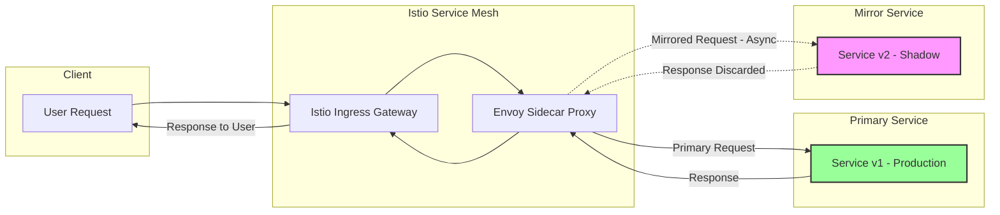
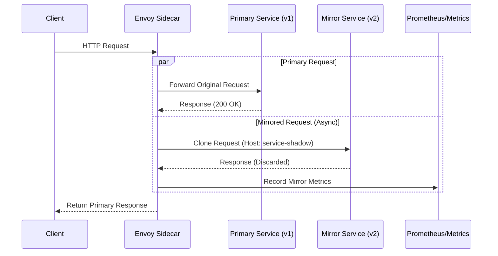
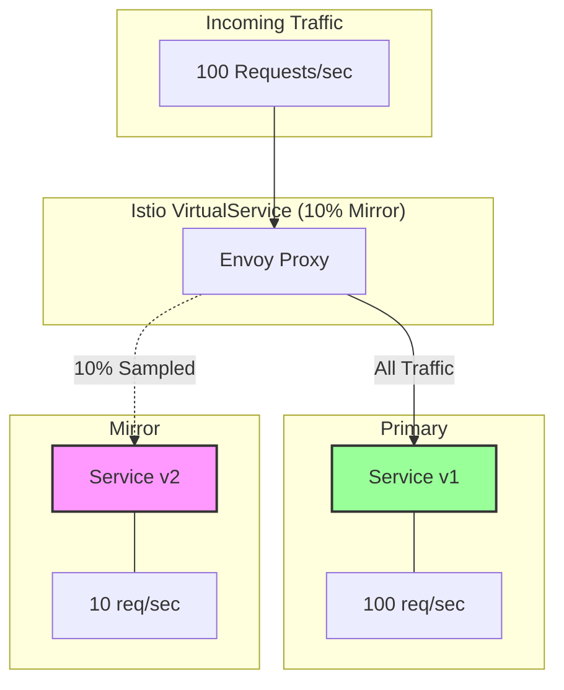
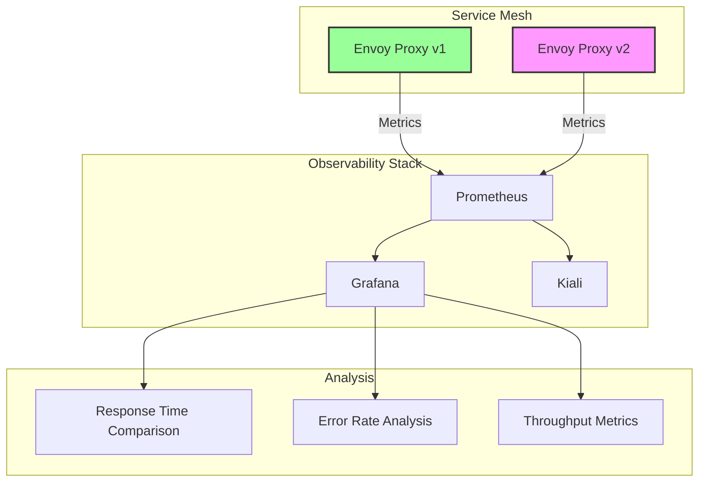

# How to Mirror Traffic with Istio for Testing

Author: [nawazdhandala](https://github.com/nawazdhandala)

Tags: Istio, Traffic Mirroring, Testing, Service Mesh, DevOps

Description: A guide to using Istio traffic mirroring for shadow testing and validation.

---

Traffic mirroring, also known as shadowing, is a powerful technique that allows you to send a copy of live traffic to a mirrored service without impacting the primary request flow. This enables teams to test new versions of services with real production traffic while ensuring that responses from the mirrored service are discarded. In this comprehensive guide, we will explore how to implement traffic mirroring using Istio's VirtualService configuration.

## Table of Contents

1. [Understanding Traffic Mirroring](#understanding-traffic-mirroring)
2. [Prerequisites](#prerequisites)
3. [How Istio Traffic Mirroring Works](#how-istio-traffic-mirroring-works)
4. [Basic Traffic Mirroring Configuration](#basic-traffic-mirroring-configuration)
5. [Percentage-Based Mirroring](#percentage-based-mirroring)
6. [Use Cases for Shadow Testing](#use-cases-for-shadow-testing)
7. [Setting Up a Complete Mirroring Example](#setting-up-a-complete-mirroring-example)
8. [Monitoring and Comparison Analysis](#monitoring-and-comparison-analysis)
9. [Best Practices](#best-practices)
10. [Troubleshooting Common Issues](#troubleshooting-common-issues)

## Understanding Traffic Mirroring

Traffic mirroring creates an asynchronous copy of requests flowing through your service mesh. The key characteristics of mirrored traffic include:

- **Fire and Forget**: Mirrored requests are sent asynchronously, and their responses are discarded
- **No Impact on Primary Traffic**: The original request/response flow remains unaffected
- **Real Production Data**: Test new services with actual production traffic patterns
- **Safe Testing**: Bugs in the mirrored service do not affect end users

The following diagram illustrates how traffic mirroring works in Istio:



## Prerequisites

Before implementing traffic mirroring, ensure you have the following:

- A Kubernetes cluster (v1.21+)
- Istio installed and configured (v1.10+)
- `kubectl` configured to access your cluster
- `istioctl` installed for Istio management
- Basic understanding of Istio VirtualService and DestinationRule concepts

The following commands verify your Istio installation is ready for traffic mirroring:

```bash
# Verify Istio is installed and running
# This command checks all Istio components in the istio-system namespace
kubectl get pods -n istio-system

# Verify Istio injection is enabled for your namespace
# The istio-injection label must be set to 'enabled'
kubectl get namespace default --show-labels

# Check Istio version to ensure compatibility
# Traffic mirroring is available in Istio 1.0+ with improvements in later versions
istioctl version
```

## How Istio Traffic Mirroring Works

Istio implements traffic mirroring at the Envoy proxy level. When a request arrives at the sidecar proxy, Envoy:

1. Forwards the original request to the primary destination
2. Clones the request and sends it to the mirror destination
3. The mirrored request includes a `-shadow` suffix in the `Host` header
4. Responses from the mirror are collected for metrics but otherwise discarded

The following diagram shows the internal flow within the Envoy proxy:



## Basic Traffic Mirroring Configuration

Let's start with a basic traffic mirroring configuration using Istio's VirtualService.

First, we need to define the destination rules for both the primary and mirror services. This configuration establishes the subsets that we will reference in our VirtualService:

```yaml
# destination-rule.yaml
# DestinationRule defines policies that apply to traffic after routing
# We define two subsets: v1 (primary) and v2 (mirror)
apiVersion: networking.istio.io/v1beta1
kind: DestinationRule
metadata:
  name: my-service-destination
  namespace: default
spec:
  # The host field references the Kubernetes service name
  host: my-service

  # Traffic policy applies to all subsets unless overridden
  trafficPolicy:
    connectionPool:
      tcp:
        maxConnections: 100
      http:
        h2UpgradePolicy: UPGRADE

  # Subsets define different versions of the service
  subsets:
    # Primary production version - receives actual user traffic
    - name: v1
      labels:
        version: v1
      trafficPolicy:
        loadBalancer:
          simple: ROUND_ROBIN

    # Mirror version - receives copied traffic for testing
    - name: v2
      labels:
        version: v2
      trafficPolicy:
        loadBalancer:
          simple: ROUND_ROBIN
```

Now, create the VirtualService that configures traffic mirroring. This is where we specify which traffic to mirror and to which destination:

```yaml
# virtual-service-mirror.yaml
# VirtualService defines how requests are routed within the mesh
# This configuration sends 100% of traffic to v1 while mirroring to v2
apiVersion: networking.istio.io/v1beta1
kind: VirtualService
metadata:
  name: my-service-mirror
  namespace: default
spec:
  # Hosts this VirtualService applies to
  # Can be a Kubernetes service name or external hostname
  hosts:
    - my-service

  # HTTP routing rules - processed in order
  http:
    - name: "primary-with-mirror"
      # Route configuration for the primary destination
      route:
        - destination:
            # The Kubernetes service to route to
            host: my-service
            # The subset defined in DestinationRule
            subset: v1
          # 100% of traffic goes to the primary destination
          weight: 100

      # Mirror configuration - sends a copy of requests
      mirror:
        # The destination service for mirrored traffic
        host: my-service
        # The subset to mirror to (our v2 testing version)
        subset: v2

      # mirrorPercentage controls what fraction of traffic is mirrored
      # Omitting this field mirrors 100% of traffic by default
      mirrorPercentage:
        value: 100.0
```

Apply these configurations to your cluster:

```bash
# Apply the DestinationRule first to establish the subsets
# This must be applied before the VirtualService that references these subsets
kubectl apply -f destination-rule.yaml

# Apply the VirtualService to enable traffic mirroring
# Traffic will immediately begin being mirrored once applied
kubectl apply -f virtual-service-mirror.yaml

# Verify the configurations were applied successfully
kubectl get destinationrule my-service-destination -o yaml
kubectl get virtualservice my-service-mirror -o yaml
```

## Percentage-Based Mirroring

In production environments, mirroring 100% of traffic may not be practical due to resource constraints or cost considerations. Istio allows you to configure percentage-based mirroring to control the volume of mirrored traffic.

The following configuration demonstrates different percentage-based mirroring scenarios:

```yaml
# virtual-service-percentage-mirror.yaml
# This configuration demonstrates percentage-based mirroring
# Useful for controlling resource usage and costs in high-traffic environments
apiVersion: networking.istio.io/v1beta1
kind: VirtualService
metadata:
  name: my-service-percentage-mirror
  namespace: default
spec:
  hosts:
    - my-service

  http:
    # Rule 1: Mirror only 10% of traffic for initial testing
    # Use this approach when first deploying a new version
    - name: "conservative-mirror"
      match:
        # Only apply to requests with this header
        # Allows gradual rollout of mirroring
        - headers:
            x-mirror-test:
              exact: "enabled"
      route:
        - destination:
            host: my-service
            subset: v1
          weight: 100
      mirror:
        host: my-service
        subset: v2
      # Only 10% of matching traffic will be mirrored
      # This is useful for high-traffic services to reduce load
      mirrorPercentage:
        value: 10.0

    # Rule 2: Mirror 50% of traffic for broader testing
    # Use after initial validation passes
    - name: "moderate-mirror"
      match:
        - uri:
            prefix: "/api/v2/"
      route:
        - destination:
            host: my-service
            subset: v1
          weight: 100
      mirror:
        host: my-service
        subset: v2
      # 50% mirroring provides a balance between coverage and resources
      mirrorPercentage:
        value: 50.0

    # Rule 3: Default route with 100% mirroring for comprehensive testing
    - name: "full-mirror"
      route:
        - destination:
            host: my-service
            subset: v1
          weight: 100
      mirror:
        host: my-service
        subset: v2
      # 100% mirroring ensures complete coverage
      # Use when resources are available and full validation is needed
      mirrorPercentage:
        value: 100.0
```

The following diagram illustrates percentage-based mirroring:



## Use Cases for Shadow Testing

Traffic mirroring is valuable in numerous scenarios. Let's explore the most common use cases with practical examples.

### Use Case 1: Testing New Service Versions

When deploying a new version of a service, mirror production traffic to validate behavior before switching users:

```yaml
# use-case-new-version.yaml
# Mirror traffic to a new service version for pre-release testing
# This allows testing with real production traffic patterns
apiVersion: networking.istio.io/v1beta1
kind: VirtualService
metadata:
  name: payment-service-shadow-test
  namespace: payments
spec:
  hosts:
    - payment-service

  http:
    - name: "new-version-shadow-test"
      route:
        # All user traffic continues to the stable v1.2.0
        - destination:
            host: payment-service
            subset: stable
          weight: 100

      # Mirror to the new v1.3.0 for shadow testing
      # This version may have new features or bug fixes
      mirror:
        host: payment-service
        subset: canary
      mirrorPercentage:
        # Start with 25% to limit resource impact
        value: 25.0
---
# DestinationRule for the payment service versions
apiVersion: networking.istio.io/v1beta1
kind: DestinationRule
metadata:
  name: payment-service-versions
  namespace: payments
spec:
  host: payment-service
  subsets:
    # Stable production version
    - name: stable
      labels:
        version: v1.2.0
    # New canary version for testing
    - name: canary
      labels:
        version: v1.3.0
```

### Use Case 2: Database Migration Testing

When migrating to a new database, mirror traffic to compare query results:

```yaml
# use-case-database-migration.yaml
# Mirror traffic to validate database migration
# Allows comparison of results between old and new database backends
apiVersion: networking.istio.io/v1beta1
kind: VirtualService
metadata:
  name: user-service-db-migration
  namespace: default
spec:
  hosts:
    - user-service

  http:
    # Mirror read operations to new database backend
    - name: "read-operations-mirror"
      match:
        # Match GET requests (read operations)
        - method:
            exact: GET
      route:
        - destination:
            host: user-service
            subset: postgres-backend
          weight: 100
      mirror:
        # Mirror to service connected to new MySQL backend
        host: user-service
        subset: mysql-backend
      mirrorPercentage:
        value: 100.0

    # Do NOT mirror write operations to avoid data corruption
    - name: "write-operations-no-mirror"
      match:
        - method:
            regex: "POST|PUT|PATCH|DELETE"
      route:
        - destination:
            host: user-service
            subset: postgres-backend
          weight: 100
      # No mirror configuration for write operations
```

### Use Case 3: Performance Benchmarking

Mirror traffic to benchmark the performance of optimized service versions:

```yaml
# use-case-performance-benchmark.yaml
# Mirror traffic to an optimized version for performance comparison
# Useful for validating performance improvements before rollout
apiVersion: networking.istio.io/v1beta1
kind: VirtualService
metadata:
  name: search-service-benchmark
  namespace: search
spec:
  hosts:
    - search-service

  http:
    - name: "performance-benchmark"
      route:
        - destination:
            host: search-service
            # Current production version
            subset: current
          weight: 100

      mirror:
        host: search-service
        # Optimized version with performance improvements
        subset: optimized
      mirrorPercentage:
        # Mirror 100% for accurate performance comparison
        value: 100.0
---
# Additional retry and timeout settings for comparison
apiVersion: networking.istio.io/v1beta1
kind: DestinationRule
metadata:
  name: search-service-performance
  namespace: search
spec:
  host: search-service
  subsets:
    - name: current
      labels:
        version: v2.0.0
      trafficPolicy:
        connectionPool:
          http:
            http2MaxRequests: 1000
            maxRequestsPerConnection: 100

    - name: optimized
      labels:
        version: v2.1.0-optimized
      trafficPolicy:
        connectionPool:
          http:
            # Higher limits for the optimized version
            http2MaxRequests: 2000
            maxRequestsPerConnection: 200
```

### Use Case 4: ML Model A/B Testing

Mirror traffic to compare machine learning model predictions:

```yaml
# use-case-ml-model-testing.yaml
# Mirror traffic to compare ML model predictions
# Enables safe testing of new models with production data
apiVersion: networking.istio.io/v1beta1
kind: VirtualService
metadata:
  name: recommendation-service-ml-test
  namespace: ml
spec:
  hosts:
    - recommendation-service

  http:
    - name: "ml-model-comparison"
      route:
        - destination:
            host: recommendation-service
            # Production model currently serving users
            subset: model-v1
          weight: 100

      # Mirror to new ML model for prediction comparison
      mirror:
        host: recommendation-service
        subset: model-v2-experimental
      mirrorPercentage:
        # 100% mirroring for complete prediction comparison
        value: 100.0

      # Add timeout to ensure mirroring doesn't cause issues
      timeout: 30s
```

## Setting Up a Complete Mirroring Example

Let's walk through a complete example of setting up traffic mirroring from scratch.

### Step 1: Deploy the Application Versions

First, deploy both versions of your application:

```yaml
# deployment-v1.yaml
# Production deployment - receives all user traffic
apiVersion: apps/v1
kind: Deployment
metadata:
  name: my-app-v1
  namespace: default
  labels:
    app: my-app
    version: v1
spec:
  replicas: 3
  selector:
    matchLabels:
      app: my-app
      version: v1
  template:
    metadata:
      labels:
        app: my-app
        version: v1
      annotations:
        # Enable Istio sidecar injection
        sidecar.istio.io/inject: "true"
    spec:
      containers:
        - name: my-app
          image: my-registry/my-app:v1.0.0
          ports:
            - containerPort: 8080
          resources:
            requests:
              cpu: "100m"
              memory: "128Mi"
            limits:
              cpu: "500m"
              memory: "512Mi"
          # Readiness probe ensures traffic only goes to healthy pods
          readinessProbe:
            httpGet:
              path: /health
              port: 8080
            initialDelaySeconds: 10
            periodSeconds: 5
---
# deployment-v2.yaml
# Shadow deployment - receives mirrored traffic for testing
apiVersion: apps/v1
kind: Deployment
metadata:
  name: my-app-v2
  namespace: default
  labels:
    app: my-app
    version: v2
spec:
  # Fewer replicas since this is just for testing
  replicas: 2
  selector:
    matchLabels:
      app: my-app
      version: v2
  template:
    metadata:
      labels:
        app: my-app
        version: v2
      annotations:
        sidecar.istio.io/inject: "true"
    spec:
      containers:
        - name: my-app
          # New version with changes to test
          image: my-registry/my-app:v2.0.0-beta
          ports:
            - containerPort: 8080
          resources:
            requests:
              cpu: "100m"
              memory: "128Mi"
            limits:
              cpu: "500m"
              memory: "512Mi"
          readinessProbe:
            httpGet:
              path: /health
              port: 8080
            initialDelaySeconds: 10
            periodSeconds: 5
          # Environment variable to identify shadow traffic
          env:
            - name: DEPLOYMENT_TYPE
              value: "shadow"
```

### Step 2: Create the Kubernetes Service

Create a single service that selects both versions:

```yaml
# service.yaml
# Kubernetes Service that routes to both v1 and v2 pods
# Istio uses this service for traffic management
apiVersion: v1
kind: Service
metadata:
  name: my-app
  namespace: default
  labels:
    app: my-app
spec:
  # ClusterIP is typically used for internal services
  type: ClusterIP
  ports:
    - port: 80
      targetPort: 8080
      protocol: TCP
      name: http
  # Selector matches both v1 and v2 pods
  # Istio's VirtualService determines actual routing
  selector:
    app: my-app
```

### Step 3: Apply the Istio Configuration

Apply the complete Istio configuration for traffic mirroring:

```yaml
# istio-config.yaml
# Complete Istio configuration for traffic mirroring
---
# DestinationRule defines the subsets and traffic policies
apiVersion: networking.istio.io/v1beta1
kind: DestinationRule
metadata:
  name: my-app-destination
  namespace: default
spec:
  host: my-app
  trafficPolicy:
    # Global traffic policy for all subsets
    connectionPool:
      tcp:
        maxConnections: 100
      http:
        h2UpgradePolicy: UPGRADE
        http1MaxPendingRequests: 100
        http2MaxRequests: 1000
    # Outlier detection for circuit breaking
    outlierDetection:
      consecutive5xxErrors: 5
      interval: 30s
      baseEjectionTime: 30s
      maxEjectionPercent: 50
  subsets:
    # Production subset - stable version
    - name: v1
      labels:
        version: v1
      trafficPolicy:
        loadBalancer:
          simple: ROUND_ROBIN
    # Shadow subset - testing version
    - name: v2
      labels:
        version: v2
      trafficPolicy:
        loadBalancer:
          simple: ROUND_ROBIN
---
# VirtualService with traffic mirroring configuration
apiVersion: networking.istio.io/v1beta1
kind: VirtualService
metadata:
  name: my-app-routing
  namespace: default
spec:
  hosts:
    - my-app
    # Also handle external traffic through the gateway
    - my-app.example.com
  gateways:
    # Internal mesh traffic
    - mesh
    # External traffic through Istio gateway
    - my-app-gateway
  http:
    # Primary routing rule with mirroring
    - name: "production-with-shadow"
      # Match all traffic (no specific match criteria)
      route:
        - destination:
            host: my-app
            subset: v1
            port:
              number: 80
          weight: 100
      # Mirror configuration
      mirror:
        host: my-app
        subset: v2
        port:
          number: 80
      # Mirror 100% of traffic for comprehensive testing
      mirrorPercentage:
        value: 100.0
      # Retry policy for the primary route
      retries:
        attempts: 3
        perTryTimeout: 2s
        retryOn: 5xx,reset,connect-failure
      # Request timeout
      timeout: 10s
---
# Optional: Gateway for external traffic
apiVersion: networking.istio.io/v1beta1
kind: Gateway
metadata:
  name: my-app-gateway
  namespace: default
spec:
  selector:
    istio: ingressgateway
  servers:
    - port:
        number: 80
        name: http
        protocol: HTTP
      hosts:
        - my-app.example.com
```

### Step 4: Apply and Verify

Apply all configurations and verify the setup:

```bash
# Apply deployments
kubectl apply -f deployment-v1.yaml
kubectl apply -f deployment-v2.yaml

# Wait for deployments to be ready
kubectl rollout status deployment/my-app-v1
kubectl rollout status deployment/my-app-v2

# Apply the service
kubectl apply -f service.yaml

# Apply Istio configuration
kubectl apply -f istio-config.yaml

# Verify all pods are running with sidecars
# You should see 2/2 containers (app + istio-proxy)
kubectl get pods -l app=my-app

# Verify the VirtualService is applied correctly
kubectl get virtualservice my-app-routing -o yaml

# Check the Istio proxy configuration
# This shows the actual Envoy configuration for the service
istioctl proxy-config routes deployment/my-app-v1 --name 80 -o json
```

## Monitoring and Comparison Analysis

Monitoring mirrored traffic is crucial for understanding how the shadow version performs compared to production.

### Setting Up Prometheus Metrics

The following diagram shows the metrics collection architecture:



Create a ServiceMonitor for Prometheus to collect Istio metrics:

```yaml
# service-monitor.yaml
# ServiceMonitor for collecting Istio metrics from Envoy proxies
apiVersion: monitoring.coreos.com/v1
kind: ServiceMonitor
metadata:
  name: istio-mesh-monitor
  namespace: istio-system
spec:
  selector:
    matchLabels:
      app: my-app
  endpoints:
    - port: http-envoy-prom
      interval: 15s
      path: /stats/prometheus
```

### Prometheus Queries for Comparison

Use the following Prometheus queries to compare production and shadow traffic:

```promql
# Response time comparison between v1 and v2
# This query shows the 95th percentile latency for both versions
# v1 (production) latency
histogram_quantile(0.95,
  sum(rate(istio_request_duration_milliseconds_bucket{
    destination_service="my-app.default.svc.cluster.local",
    destination_version="v1"
  }[5m])) by (le)
)

# v2 (shadow) latency
histogram_quantile(0.95,
  sum(rate(istio_request_duration_milliseconds_bucket{
    destination_service="my-app.default.svc.cluster.local",
    destination_version="v2"
  }[5m])) by (le)
)

# Error rate comparison
# Calculate the percentage of 5xx responses for each version
# v1 error rate
sum(rate(istio_requests_total{
  destination_service="my-app.default.svc.cluster.local",
  destination_version="v1",
  response_code=~"5.*"
}[5m])) /
sum(rate(istio_requests_total{
  destination_service="my-app.default.svc.cluster.local",
  destination_version="v1"
}[5m])) * 100

# v2 error rate
sum(rate(istio_requests_total{
  destination_service="my-app.default.svc.cluster.local",
  destination_version="v2",
  response_code=~"5.*"
}[5m])) /
sum(rate(istio_requests_total{
  destination_service="my-app.default.svc.cluster.local",
  destination_version="v2"
}[5m])) * 100

# Request throughput comparison
# Shows requests per second for each version
sum(rate(istio_requests_total{
  destination_service="my-app.default.svc.cluster.local",
  destination_version="v1"
}[5m]))

sum(rate(istio_requests_total{
  destination_service="my-app.default.svc.cluster.local",
  destination_version="v2"
}[5m]))
```

### Grafana Dashboard Configuration

Create a Grafana dashboard to visualize the comparison:

```json
{
  "dashboard": {
    "title": "Istio Traffic Mirror Comparison",
    "panels": [
      {
        "title": "Response Time Comparison (p95)",
        "type": "timeseries",
        "targets": [
          {
            "expr": "histogram_quantile(0.95, sum(rate(istio_request_duration_milliseconds_bucket{destination_service=\"my-app.default.svc.cluster.local\",destination_version=\"v1\"}[5m])) by (le))",
            "legendFormat": "v1 (Production)"
          },
          {
            "expr": "histogram_quantile(0.95, sum(rate(istio_request_duration_milliseconds_bucket{destination_service=\"my-app.default.svc.cluster.local\",destination_version=\"v2\"}[5m])) by (le))",
            "legendFormat": "v2 (Shadow)"
          }
        ]
      },
      {
        "title": "Error Rate Comparison",
        "type": "timeseries",
        "targets": [
          {
            "expr": "sum(rate(istio_requests_total{destination_service=\"my-app.default.svc.cluster.local\",destination_version=\"v1\",response_code=~\"5.*\"}[5m])) / sum(rate(istio_requests_total{destination_service=\"my-app.default.svc.cluster.local\",destination_version=\"v1\"}[5m])) * 100",
            "legendFormat": "v1 Error Rate %"
          },
          {
            "expr": "sum(rate(istio_requests_total{destination_service=\"my-app.default.svc.cluster.local\",destination_version=\"v2\",response_code=~\"5.*\"}[5m])) / sum(rate(istio_requests_total{destination_service=\"my-app.default.svc.cluster.local\",destination_version=\"v2\"}[5m])) * 100",
            "legendFormat": "v2 Error Rate %"
          }
        ]
      }
    ]
  }
}
```

### Using Kiali for Traffic Visualization

Kiali provides a graphical interface for viewing traffic mirroring:

```bash
# Access Kiali dashboard
# This opens the Kiali UI in your browser
istioctl dashboard kiali

# Or port-forward manually
kubectl port-forward svc/kiali -n istio-system 20001:20001
```

In Kiali, navigate to the Graph view to see:
- Traffic flow between services
- Mirrored traffic represented with dashed lines
- Response times and error rates for both versions

## Best Practices

### 1. Start with Low Mirror Percentage

Begin with a small percentage and gradually increase:

```yaml
# Start conservatively with 5% mirroring
mirrorPercentage:
  value: 5.0

# After initial validation, increase to 25%
# mirrorPercentage:
#   value: 25.0

# When confident, move to 100%
# mirrorPercentage:
#   value: 100.0
```

### 2. Avoid Mirroring Write Operations

Be cautious with operations that modify state:

```yaml
# Best practice: Only mirror read operations
http:
  - name: "safe-mirror-reads-only"
    match:
      # Only mirror GET requests
      - method:
          exact: GET
    route:
      - destination:
          host: my-service
          subset: v1
    mirror:
      host: my-service
      subset: v2
    mirrorPercentage:
      value: 100.0

  # Exclude write operations from mirroring
  - name: "no-mirror-writes"
    match:
      - method:
          regex: "POST|PUT|PATCH|DELETE"
    route:
      - destination:
          host: my-service
          subset: v1
    # No mirror configuration here
```

### 3. Set Appropriate Timeouts

Ensure mirrored requests don't consume excessive resources:

```yaml
# Configure timeout for shadow traffic
apiVersion: networking.istio.io/v1beta1
kind: DestinationRule
metadata:
  name: shadow-timeout
spec:
  host: my-service
  subsets:
    - name: v2
      labels:
        version: v2
      trafficPolicy:
        connectionPool:
          http:
            # Limit connections to prevent resource exhaustion
            http2MaxRequests: 500
            maxRequestsPerConnection: 50
        # Set aggressive timeout for shadow traffic
        # Shadow responses are discarded anyway
        outlierDetection:
          consecutive5xxErrors: 3
          interval: 10s
          baseEjectionTime: 30s
```

### 4. Monitor Resource Usage

Track resource consumption of the shadow deployment:

```yaml
# Resource limits for shadow deployment
apiVersion: apps/v1
kind: Deployment
metadata:
  name: my-app-v2-shadow
spec:
  template:
    spec:
      containers:
        - name: my-app
          resources:
            # Limit resources for shadow deployment
            # Prevents shadow from impacting production resources
            requests:
              cpu: "50m"
              memory: "64Mi"
            limits:
              cpu: "200m"
              memory: "256Mi"
```

### 5. Use Header-Based Mirroring for Targeted Testing

Add headers to control which requests are mirrored:

```yaml
# Header-based mirroring for targeted testing
http:
  - name: "targeted-mirror"
    match:
      # Only mirror requests with specific header
      - headers:
          x-enable-shadow:
            exact: "true"
    route:
      - destination:
          host: my-service
          subset: v1
    mirror:
      host: my-service
      subset: v2
    mirrorPercentage:
      value: 100.0

  # Default route without mirroring
  - name: "default-no-mirror"
    route:
      - destination:
          host: my-service
          subset: v1
```

## Troubleshooting Common Issues

### Issue 1: Mirrored Traffic Not Reaching Shadow Service

Check the Envoy configuration and ensure subsets are correctly defined:

```bash
# Verify the VirtualService is correctly configured
kubectl get virtualservice my-app-routing -o yaml

# Check if the subset exists in DestinationRule
kubectl get destinationrule my-app-destination -o yaml

# Verify pods have correct version labels
kubectl get pods -l app=my-app --show-labels

# Check Envoy proxy logs for routing decisions
kubectl logs deployment/my-app-v1 -c istio-proxy | grep -i mirror

# Verify the route configuration in Envoy
istioctl proxy-config routes deployment/my-app-v1 --name 80 -o json | grep -A 20 mirror
```

### Issue 2: High Latency on Shadow Service

If the shadow service is experiencing high latency:

```bash
# Check resource usage of shadow pods
kubectl top pods -l version=v2

# Review connection pool settings
kubectl get destinationrule my-app-destination -o yaml

# Check for pending requests
kubectl exec deployment/my-app-v2 -c istio-proxy -- pilot-agent request GET stats | grep pending
```

Adjust the traffic policy if needed:

```yaml
# Optimize connection pool for shadow traffic
trafficPolicy:
  connectionPool:
    tcp:
      maxConnections: 50
    http:
      http2MaxRequests: 100
      maxRequestsPerConnection: 10
      # Add queue for handling bursts
      http1MaxPendingRequests: 50
```

### Issue 3: Missing Metrics for Shadow Traffic

Ensure metrics are being collected:

```bash
# Verify Prometheus is scraping Istio metrics
kubectl get servicemonitor -n istio-system

# Check if metrics are available
kubectl exec -n istio-system deployment/prometheus -c prometheus -- \
  wget -qO- 'http://localhost:9090/api/v1/query?query=istio_requests_total{destination_version="v2"}'

# Verify Envoy is exposing metrics
kubectl exec deployment/my-app-v2 -c istio-proxy -- \
  pilot-agent request GET stats | grep istio_requests
```

### Issue 4: Shadow Service Receiving Modified Headers

Mirrored requests have a `-shadow` suffix in the Host header:

```yaml
# Handle the shadow header in your application
# Or configure Istio to retain the original header
apiVersion: networking.istio.io/v1beta1
kind: EnvoyFilter
metadata:
  name: remove-shadow-suffix
  namespace: default
spec:
  workloadSelector:
    labels:
      version: v2
  configPatches:
    - applyTo: HTTP_FILTER
      match:
        context: SIDECAR_INBOUND
        listener:
          filterChain:
            filter:
              name: "envoy.filters.network.http_connection_manager"
      patch:
        operation: INSERT_BEFORE
        value:
          name: envoy.filters.http.lua
          typed_config:
            "@type": "type.googleapis.com/envoy.extensions.filters.http.lua.v3.Lua"
            inlineCode: |
              function envoy_on_request(request_handle)
                local host = request_handle:headers():get(":authority")
                if host then
                  -- Remove -shadow suffix from host header
                  host = string.gsub(host, "-shadow$", "")
                  request_handle:headers():replace(":authority", host)
                end
              end
```

## Conclusion

Traffic mirroring with Istio is a powerful technique for safely testing new service versions with real production traffic. By following the configurations and best practices outlined in this guide, you can:

- Validate new versions without impacting users
- Compare performance between service versions
- Test database migrations safely
- Benchmark optimizations with real traffic patterns

Key takeaways:

1. **Use VirtualService mirror configuration** to set up traffic mirroring
2. **Start with low percentages** and gradually increase
3. **Avoid mirroring write operations** that modify state
4. **Monitor both versions** using Prometheus and Grafana
5. **Set appropriate resource limits** for shadow deployments

Traffic mirroring complements other Istio traffic management features like canary deployments and A/B testing, providing a comprehensive toolkit for safe, gradual service rollouts.

## Additional Resources

- [Istio Traffic Mirroring Documentation](https://istio.io/latest/docs/tasks/traffic-management/mirroring/)
- [Envoy HTTP Route Configuration](https://www.envoyproxy.io/docs/envoy/latest/api-v3/config/route/v3/route_components.proto)
- [Istio VirtualService Reference](https://istio.io/latest/docs/reference/config/networking/virtual-service/)
- [Prometheus Queries for Istio](https://istio.io/latest/docs/tasks/observability/metrics/querying-metrics/)
