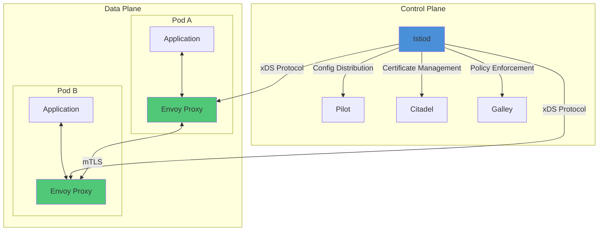
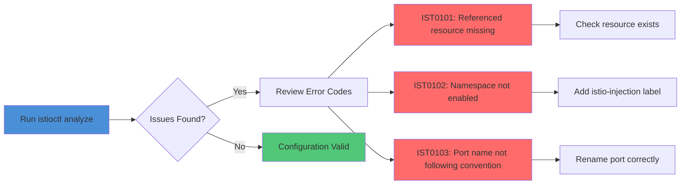
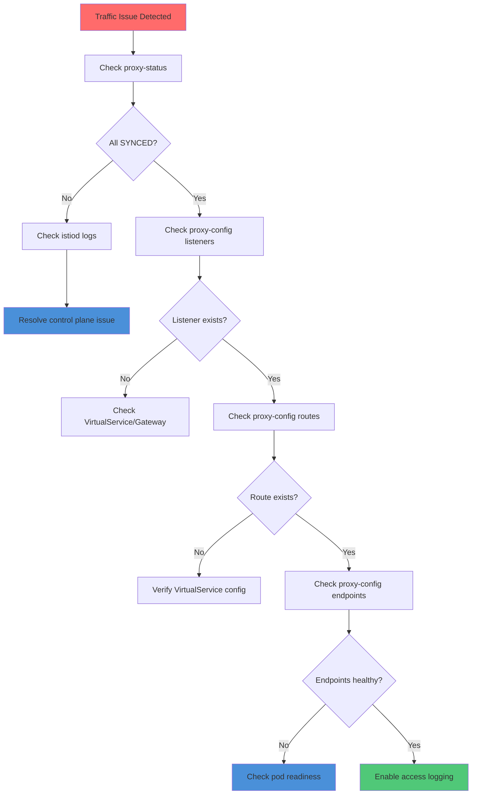
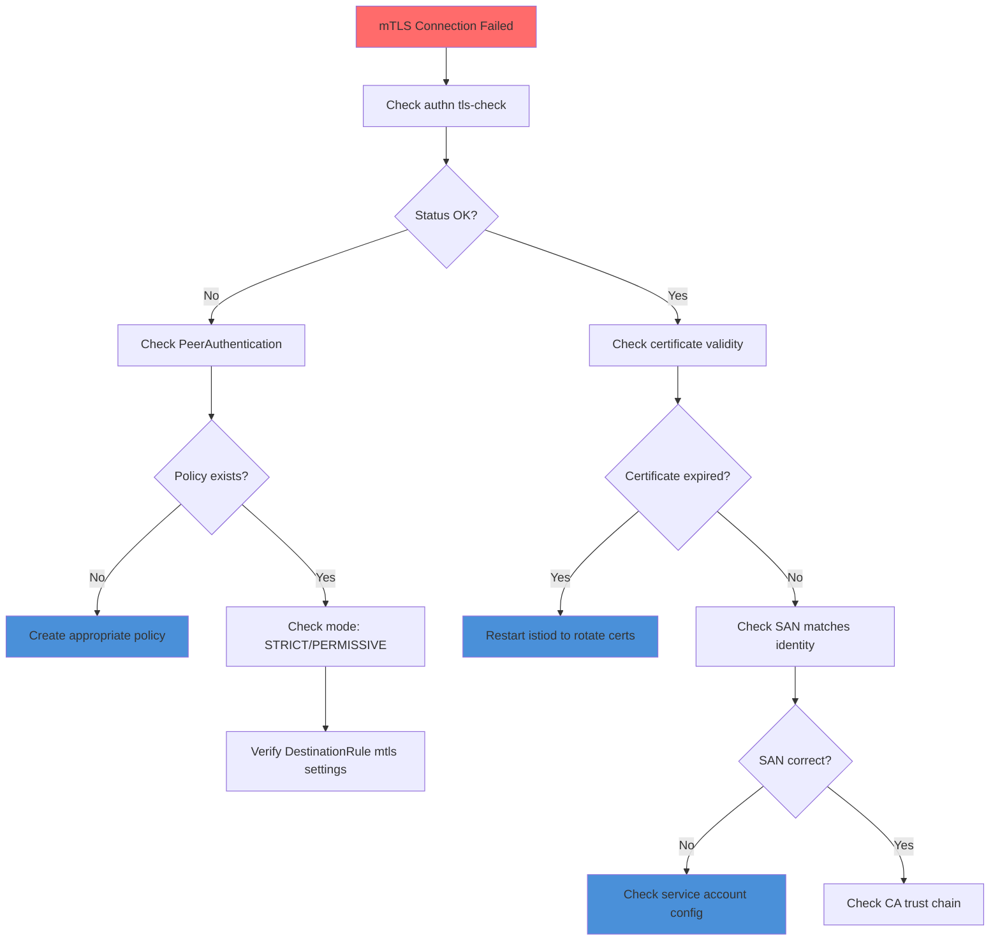
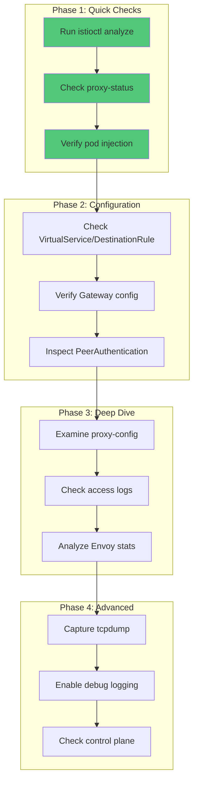

# How to Troubleshoot Common Istio Issues

Author: [nawazdhandala](https://github.com/nawazdhandala)

Tags: Istio, Troubleshooting, Debugging, Service Mesh, Kubernetes

Description: A practical guide to diagnosing and resolving common Istio problems.

---

Istio is a powerful service mesh that provides traffic management, security, and observability for microservices. However, its complexity can make troubleshooting challenging. This comprehensive guide covers the most common Istio issues and provides systematic approaches to diagnose and resolve them.

## Table of Contents

1. [Understanding Istio Architecture for Debugging](#understanding-istio-architecture-for-debugging)
2. [Essential Debugging Tools](#essential-debugging-tools)
3. [Using istioctl analyze](#using-istioctl-analyze)
4. [Proxy Configuration Debugging](#proxy-configuration-debugging)
5. [Common Connectivity Issues](#common-connectivity-issues)
6. [Certificate and mTLS Troubleshooting](#certificate-and-mtls-troubleshooting)
7. [Traffic Management Issues](#traffic-management-issues)
8. [Performance and Resource Issues](#performance-and-resource-issues)
9. [Best Practices for Debugging](#best-practices-for-debugging)

## Understanding Istio Architecture for Debugging

Before diving into troubleshooting, it's essential to understand how Istio components interact. This knowledge helps pinpoint where issues originate.



## Essential Debugging Tools

### Installing and Configuring istioctl

The `istioctl` command-line tool is your primary debugging companion. Ensure you have the correct version installed.

```bash
# Check the current istioctl version and ensure it matches your cluster
# This is critical because version mismatches can cause configuration issues
istioctl version

# Example output shows both client and control plane versions
# If versions differ significantly, consider upgrading istioctl
# Client version: 1.20.0
# Control plane version: 1.20.0
# Data plane version: 1.20.0 (10 proxies)
```

### Checking Istio Component Health

```bash
# Verify all Istio control plane components are running
# This command checks the deployment status in the istio-system namespace
kubectl get pods -n istio-system

# For more detailed status information including resource usage
# The -o wide flag shows node placement which helps identify scheduling issues
kubectl get pods -n istio-system -o wide

# Check the logs of the istiod control plane for errors
# The --since flag limits output to recent logs for faster analysis
kubectl logs -n istio-system -l app=istiod --since=1h
```

## Using istioctl analyze

The `istioctl analyze` command is the first tool you should use when troubleshooting. It automatically detects common configuration issues.

### Basic Analysis

```bash
# Run analysis on the entire cluster
# This scans all namespaces and reports configuration issues
# It checks for deprecated APIs, misconfigured resources, and common mistakes
istioctl analyze --all-namespaces

# Analyze a specific namespace for focused troubleshooting
# Use this when you know which namespace has the problem
istioctl analyze -n my-application

# Analyze local YAML files before applying them
# This catches issues before they reach the cluster
istioctl analyze my-virtualservice.yaml my-destinationrule.yaml
```

### Understanding Analysis Output



### Common Analysis Error Codes and Resolutions

```bash
# IST0101: ReferencedResourceNotFound
# This error occurs when a VirtualService references a non-existent DestinationRule
# Solution: Create the missing DestinationRule or fix the reference

# Check what DestinationRules exist in the namespace
kubectl get destinationrules -n my-application

# IST0102: NamespaceNotInjected
# The namespace doesn't have sidecar injection enabled
# Solution: Add the injection label to the namespace
kubectl label namespace my-application istio-injection=enabled

# IST0103: ServicePortNameDoesntFollowConvention
# Port names must follow the pattern: protocol-suffix (e.g., http-web, grpc-api)
# This is critical because Istio uses port names to determine protocol handling
kubectl get service my-service -n my-application -o yaml | grep -A5 ports:
```

## Proxy Configuration Debugging

When traffic isn't flowing correctly, the Envoy proxy configuration is often the culprit. Istio provides several commands to inspect proxy state.

### Checking Proxy Sync Status

```bash
# View the synchronization status between istiod and all proxies
# SYNCED means the proxy has the latest configuration
# NOT SENT or STALE indicates configuration distribution problems
istioctl proxy-status

# Example output interpretation:
# NAME                     CDS    LDS    EDS    RDS    ECDS   ISTIOD
# my-app-abc123.default    SYNCED SYNCED SYNCED SYNCED SYNCED istiod-xyz

# CDS = Cluster Discovery Service (upstream clusters)
# LDS = Listener Discovery Service (inbound/outbound listeners)
# EDS = Endpoint Discovery Service (service endpoints)
# RDS = Route Discovery Service (routing rules)
# ECDS = Extension Config Discovery Service
```

### Deep Diving into Proxy Configuration

```bash
# Retrieve the complete Envoy configuration from a specific pod
# This is useful for understanding exactly what the proxy is configured to do
istioctl proxy-config all my-app-pod.my-namespace

# View only the listeners configured in the proxy
# Listeners define how inbound and outbound traffic is captured
istioctl proxy-config listeners my-app-pod.my-namespace

# Check the clusters (upstream services) the proxy knows about
# Each cluster represents a destination the proxy can route to
istioctl proxy-config clusters my-app-pod.my-namespace

# Inspect the routes configured in the proxy
# Routes determine how requests are matched and forwarded
istioctl proxy-config routes my-app-pod.my-namespace

# View the endpoints for a specific service
# This shows the actual pod IPs that traffic will be sent to
istioctl proxy-config endpoints my-app-pod.my-namespace --cluster "outbound|80||my-service.my-namespace.svc.cluster.local"
```

### Debugging with Envoy Admin Interface

```bash
# Access the Envoy admin interface for detailed debugging
# This opens a port-forward to the Envoy admin port (15000)
kubectl port-forward my-app-pod 15000:15000 -n my-namespace

# In another terminal, query the Envoy admin API
# Get cluster health status to see if upstream services are reachable
curl http://localhost:15000/clusters | grep health

# View active connections and statistics
# Useful for understanding traffic patterns and identifying bottlenecks
curl http://localhost:15000/stats | grep -E "(upstream_cx|downstream_cx)"

# Check the configuration dump for complete proxy state
# Warning: This produces a large output, redirect to file for analysis
curl http://localhost:15000/config_dump > envoy_config.json
```

### Proxy Debug Workflow



## Common Connectivity Issues

### Service-to-Service Communication Failures

```bash
# Test connectivity from inside a pod using istioctl debug container
# This injects a debug container with network tools
kubectl debug my-app-pod -n my-namespace --image=curlimages/curl -- curl -v http://target-service:8080

# Alternatively, exec into the sidecar proxy for debugging
# The istio-proxy container has useful debugging tools
kubectl exec my-app-pod -n my-namespace -c istio-proxy -- curl -v http://target-service:8080

# Check if the service exists and has endpoints
# Services without endpoints indicate pod selector mismatches or pod failures
kubectl get endpoints target-service -n my-namespace

# Verify the service selector matches pod labels
kubectl get service target-service -n my-namespace -o yaml | grep -A5 selector:
kubectl get pods -n my-namespace --show-labels
```

### 503 Service Unavailable Errors

```bash
# 503 errors often indicate upstream connection issues
# First, check if the destination pods are healthy
kubectl get pods -n my-namespace -l app=target-service

# Inspect the Envoy access logs for error details
# The response_flags field indicates why the request failed
kubectl logs my-app-pod -n my-namespace -c istio-proxy | grep "503"

# Common response flags and their meanings:
# UH  = No healthy upstream hosts
# UF  = Upstream connection failure
# NR  = No route configured
# DC  = Downstream connection termination
# URX = Request was rejected because upstream retry limit was reached

# Check circuit breaker settings in DestinationRule
# Overly aggressive circuit breakers can cause 503s under load
kubectl get destinationrule target-service -n my-namespace -o yaml
```

### Gateway and Ingress Issues

```bash
# Check if the gateway is properly configured and has an external IP
kubectl get gateway -n my-namespace
kubectl get svc istio-ingressgateway -n istio-system

# Verify the gateway pod is running and healthy
kubectl get pods -n istio-system -l app=istio-ingressgateway

# Check the gateway proxy configuration
# Ensure listeners are configured for your hosts and ports
istioctl proxy-config listeners istio-ingressgateway-pod.istio-system

# Look for routes matching your VirtualService
istioctl proxy-config routes istio-ingressgateway-pod.istio-system

# Test the ingress gateway directly
# Replace with your gateway's external IP
curl -v -H "Host: myapp.example.com" http://GATEWAY_EXTERNAL_IP/api/health
```

### DNS Resolution Problems

```bash
# Istio uses Kubernetes DNS for service discovery
# Verify DNS is working from within a pod
kubectl exec my-app-pod -n my-namespace -c istio-proxy -- nslookup target-service.my-namespace.svc.cluster.local

# Check CoreDNS pods are running
kubectl get pods -n kube-system -l k8s-app=kube-dns

# Verify the service exists in DNS
kubectl get service target-service -n my-namespace

# For external services, check ServiceEntry configuration
kubectl get serviceentry -n my-namespace
```

## Certificate and mTLS Troubleshooting

mTLS (mutual TLS) is a core security feature of Istio. Certificate issues can cause mysterious connection failures.

### Checking mTLS Status

```bash
# View the mTLS status between services
# This shows whether mTLS is enabled and working correctly
istioctl authn tls-check my-app-pod.my-namespace target-service.my-namespace.svc.cluster.local

# Expected output for working mTLS:
# HOST:PORT                                        STATUS     SERVER     CLIENT     AUTHN POLICY     DESTINATION RULE
# target-service.my-namespace.svc.cluster.local    OK         STRICT     ISTIO_MUTUAL   default/        default/

# Check the PeerAuthentication policy in effect
kubectl get peerauthentication --all-namespaces

# Verify the mesh-wide mTLS mode
kubectl get peerauthentication -n istio-system
```

### Certificate Inspection

```bash
# View the certificates loaded in a proxy
# This shows the certificate chain and expiration dates
istioctl proxy-config secret my-app-pod.my-namespace

# Check certificate details including SAN (Subject Alternative Name)
# The SAN must match the service account identity
istioctl proxy-config secret my-app-pod.my-namespace -o json | jq '.dynamicActiveSecrets[0].secret.tlsCertificate.certificateChain.inlineBytes' | base64 -d | openssl x509 -text -noout

# Verify the certificate is issued by the correct CA
# Istio's Citadel (now part of istiod) signs these certificates
openssl s_client -connect target-service:443 -showcerts 2>/dev/null | openssl x509 -text -noout | grep -A1 Issuer
```

### mTLS Troubleshooting Workflow



### Common mTLS Issues and Solutions

```yaml
# Problem: Plaintext connection rejected by STRICT mTLS
# Solution: Either enable sidecar injection or use PERMISSIVE mode during migration

# PeerAuthentication allowing both plaintext and mTLS (for migration)
apiVersion: security.istio.io/v1beta1
kind: PeerAuthentication
metadata:
  name: allow-permissive
  namespace: my-namespace
spec:
  mtls:
    mode: PERMISSIVE  # Accept both plaintext and mTLS
```

```yaml
# Problem: External service can't connect with mTLS
# Solution: Disable mTLS for specific ports or services

# DestinationRule to disable mTLS for external services
apiVersion: networking.istio.io/v1beta1
kind: DestinationRule
metadata:
  name: external-service
  namespace: my-namespace
spec:
  host: external-api.example.com
  trafficPolicy:
    tls:
      mode: DISABLE  # Don't use mTLS for external services
```

```bash
# Problem: Certificate rotation issues causing intermittent failures
# Check certificate age and trigger rotation if needed

# View certificate expiration across all pods
for pod in $(kubectl get pods -n my-namespace -o jsonpath='{.items[*].metadata.name}'); do
  echo "=== $pod ==="
  istioctl proxy-config secret $pod.my-namespace 2>/dev/null | head -5
done

# Force certificate rotation by restarting the workload
# This is a safe operation as new certificates are issued automatically
kubectl rollout restart deployment my-app -n my-namespace
```

## Traffic Management Issues

### VirtualService Not Working

```bash
# Verify the VirtualService is correctly configured
kubectl get virtualservice my-vs -n my-namespace -o yaml

# Check if the VirtualService matches the correct hosts and gateways
# The hosts field must match the service name or external hostname
istioctl analyze -n my-namespace

# Ensure the VirtualService is attached to the correct gateway (for ingress)
# If no gateway is specified, it applies to mesh-internal traffic only
kubectl get gateway -n my-namespace

# Check the route configuration in the proxy
# The VirtualService should create corresponding routes
istioctl proxy-config routes my-app-pod.my-namespace --name "80" -o json
```

### Traffic Not Splitting Correctly

```bash
# Verify the DestinationRule subsets exist
# VirtualService weight-based routing requires DestinationRule subsets
kubectl get destinationrule my-service -n my-namespace -o yaml

# Check that pods have the correct version labels
# Subset selectors must match pod labels exactly
kubectl get pods -n my-namespace -l app=my-service --show-labels

# Verify endpoints exist for each subset
istioctl proxy-config endpoints my-app-pod.my-namespace --cluster "outbound|80|v1|my-service.my-namespace.svc.cluster.local"
istioctl proxy-config endpoints my-app-pod.my-namespace --cluster "outbound|80|v2|my-service.my-namespace.svc.cluster.local"
```

```yaml
# Example: Correct VirtualService with traffic splitting
# This splits traffic 80/20 between v1 and v2 versions

apiVersion: networking.istio.io/v1beta1
kind: VirtualService
metadata:
  name: my-service-routing
  namespace: my-namespace
spec:
  hosts:
  - my-service  # Must match the Kubernetes service name
  http:
  - route:
    - destination:
        host: my-service
        subset: v1  # Must match a subset in DestinationRule
      weight: 80
    - destination:
        host: my-service
        subset: v2  # Must match a subset in DestinationRule
      weight: 20
---
# Corresponding DestinationRule defining the subsets
# Each subset uses labels to select the appropriate pods
apiVersion: networking.istio.io/v1beta1
kind: DestinationRule
metadata:
  name: my-service
  namespace: my-namespace
spec:
  host: my-service
  subsets:
  - name: v1
    labels:
      version: v1  # Must match pod labels
  - name: v2
    labels:
      version: v2  # Must match pod labels
```

### Timeout and Retry Issues

```bash
# Check if timeouts are configured correctly
# Default Envoy timeout is 15 seconds which may be too short for some services
kubectl get virtualservice my-vs -n my-namespace -o yaml | grep -A5 timeout

# Enable verbose logging to see timeout behavior
kubectl exec my-app-pod -n my-namespace -c istio-proxy -- curl -v http://slow-service:8080

# Check Envoy statistics for timeout occurrences
kubectl exec my-app-pod -n my-namespace -c istio-proxy -- pilot-agent request GET stats | grep timeout
```

```yaml
# Configure appropriate timeouts and retries for slow services
# This prevents premature request failures

apiVersion: networking.istio.io/v1beta1
kind: VirtualService
metadata:
  name: slow-service-config
  namespace: my-namespace
spec:
  hosts:
  - slow-service
  http:
  - route:
    - destination:
        host: slow-service
    timeout: 60s  # Increase timeout for slow operations
    retries:
      attempts: 3  # Retry up to 3 times
      perTryTimeout: 20s  # Timeout for each retry attempt
      retryOn: gateway-error,connect-failure,refused-stream  # Conditions to retry on
```

## Performance and Resource Issues

### High Memory or CPU Usage in Sidecars

```bash
# Check resource usage of sidecar containers
kubectl top pods -n my-namespace --containers

# View the resource limits configured for sidecars
# Default limits may be insufficient for high-traffic services
kubectl get pods my-app-pod -n my-namespace -o yaml | grep -A10 "name: istio-proxy"

# Check Envoy statistics for memory and connection metrics
kubectl exec my-app-pod -n my-namespace -c istio-proxy -- pilot-agent request GET stats | grep -E "(memory|cx_active)"

# Look for excessive endpoint discovery (common cause of high memory)
istioctl proxy-config endpoints my-app-pod.my-namespace | wc -l
```

```yaml
# Optimize sidecar resources with appropriate limits
# Apply this annotation to your pod template

apiVersion: apps/v1
kind: Deployment
metadata:
  name: my-app
spec:
  template:
    metadata:
      annotations:
        # Configure sidecar proxy resource limits
        sidecar.istio.io/proxyCPU: "100m"
        sidecar.istio.io/proxyMemory: "128Mi"
        sidecar.istio.io/proxyCPULimit: "2000m"
        sidecar.istio.io/proxyMemoryLimit: "1024Mi"
```

### Reducing Configuration Scope with Sidecar Resource

```yaml
# Large meshes can overwhelm proxies with endpoint information
# Use Sidecar resource to limit what each proxy receives

apiVersion: networking.istio.io/v1beta1
kind: Sidecar
metadata:
  name: limit-egress
  namespace: my-namespace
spec:
  workloadSelector:
    labels:
      app: my-app
  egress:
  # Only include services this app actually needs
  # This dramatically reduces memory usage in large clusters
  - hosts:
    - "./service-a.my-namespace.svc.cluster.local"
    - "./service-b.my-namespace.svc.cluster.local"
    - "istio-system/*"  # Include istio components
```

### Control Plane Performance Issues

```bash
# Check istiod resource usage and scaling
kubectl top pods -n istio-system -l app=istiod

# View istiod metrics for configuration push latency
kubectl exec -n istio-system deploy/istiod -- curl -s localhost:15014/metrics | grep pilot_xds_push

# Check for frequent configuration pushes (indicates churn)
kubectl logs -n istio-system -l app=istiod | grep "Push Status" | tail -20

# Monitor webhook performance if injection is slow
kubectl get mutatingwebhookconfiguration istio-sidecar-injector -o yaml
```

## Best Practices for Debugging

### Enable Access Logging

```yaml
# Enable access logs for detailed request tracing
# Apply this EnvoyFilter to enable JSON access logs

apiVersion: networking.istio.io/v1alpha3
kind: EnvoyFilter
metadata:
  name: enable-access-log
  namespace: istio-system
spec:
  configPatches:
  - applyTo: NETWORK_FILTER
    match:
      context: ANY
      listener:
        filterChain:
          filter:
            name: "envoy.filters.network.http_connection_manager"
    patch:
      operation: MERGE
      value:
        typed_config:
          "@type": "type.googleapis.com/envoy.extensions.filters.network.http_connection_manager.v3.HttpConnectionManager"
          access_log:
          - name: envoy.access_loggers.file
            typed_config:
              "@type": "type.googleapis.com/envoy.extensions.access_loggers.file.v3.FileAccessLog"
              path: /dev/stdout
              log_format:
                json_format:
                  start_time: "%START_TIME%"
                  method: "%REQ(:METHOD)%"
                  path: "%REQ(X-ENVOY-ORIGINAL-PATH?:PATH)%"
                  response_code: "%RESPONSE_CODE%"
                  response_flags: "%RESPONSE_FLAGS%"
                  upstream_host: "%UPSTREAM_HOST%"
                  duration: "%DURATION%"
```

### Systematic Debugging Checklist



### Debug Logging

```bash
# Enable debug logging for a specific pod
# Warning: This generates significant log volume
istioctl proxy-config log my-app-pod.my-namespace --level debug

# Enable debug logging for specific Envoy components only
# This is more targeted and produces less noise
istioctl proxy-config log my-app-pod.my-namespace --level connection:debug,http:debug

# Reset logging level when done
istioctl proxy-config log my-app-pod.my-namespace --level warning
```

### Useful Debugging Commands Reference

```bash
# Quick reference for common debugging commands

# === Configuration Analysis ===
istioctl analyze --all-namespaces                    # Analyze entire mesh
istioctl analyze -n NAMESPACE                        # Analyze specific namespace

# === Proxy Status ===
istioctl proxy-status                                # Show all proxy sync status
istioctl proxy-status POD.NAMESPACE                  # Show specific pod status

# === Proxy Configuration ===
istioctl proxy-config listeners POD.NS               # List all listeners
istioctl proxy-config routes POD.NS                  # List all routes
istioctl proxy-config clusters POD.NS                # List all clusters
istioctl proxy-config endpoints POD.NS               # List all endpoints
istioctl proxy-config secret POD.NS                  # List certificates

# === mTLS Debugging ===
istioctl authn tls-check POD.NS DESTINATION          # Check mTLS status

# === Traffic Analysis ===
istioctl experimental describe pod POD.NS            # Comprehensive pod info
istioctl experimental describe service SVC.NS        # Comprehensive service info

# === Log Level Control ===
istioctl proxy-config log POD.NS --level LEVEL       # Set Envoy log level

# === Metrics and Stats ===
kubectl exec POD -c istio-proxy -- pilot-agent request GET stats    # Envoy stats
kubectl exec POD -c istio-proxy -- pilot-agent request GET clusters # Cluster status
```

## Conclusion

Troubleshooting Istio requires a systematic approach, starting with high-level analysis tools like `istioctl analyze` and progressively diving deeper into proxy configuration, access logs, and network traces. Key takeaways:

1. **Always start with `istioctl analyze`** - It catches the most common configuration issues automatically.

2. **Check proxy sync status** - Ensure all proxies have received the latest configuration from istiod.

3. **Understand the data flow** - Traffic flows through listeners, routes, clusters, and endpoints. Check each layer when debugging connectivity issues.

4. **mTLS is often the culprit** - When services can't communicate, check certificate validity and mTLS mode settings.

5. **Use access logs** - They provide invaluable insight into what's happening at the proxy level.

6. **Monitor resource usage** - Sidecar proxies can consume significant resources in large deployments.

By following the workflows and using the commands in this guide, you'll be able to diagnose and resolve most Istio issues efficiently. Remember that the Istio community is also an excellent resource for complex problems that require deeper expertise.
