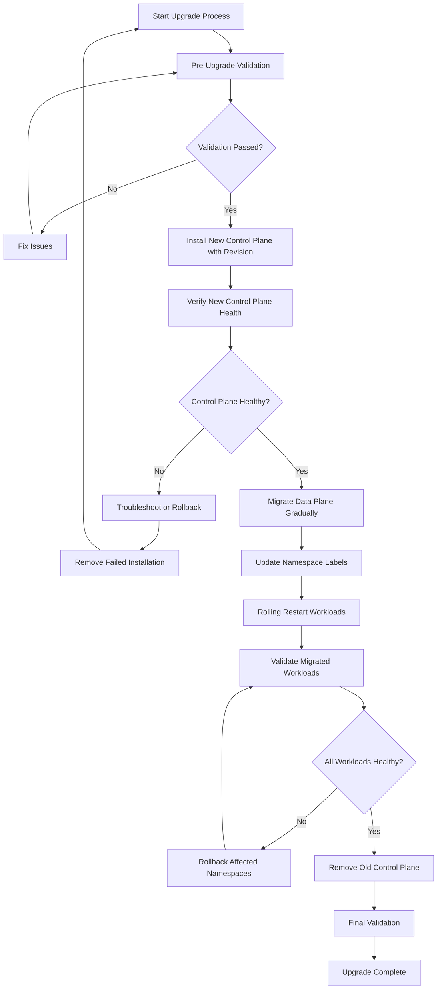
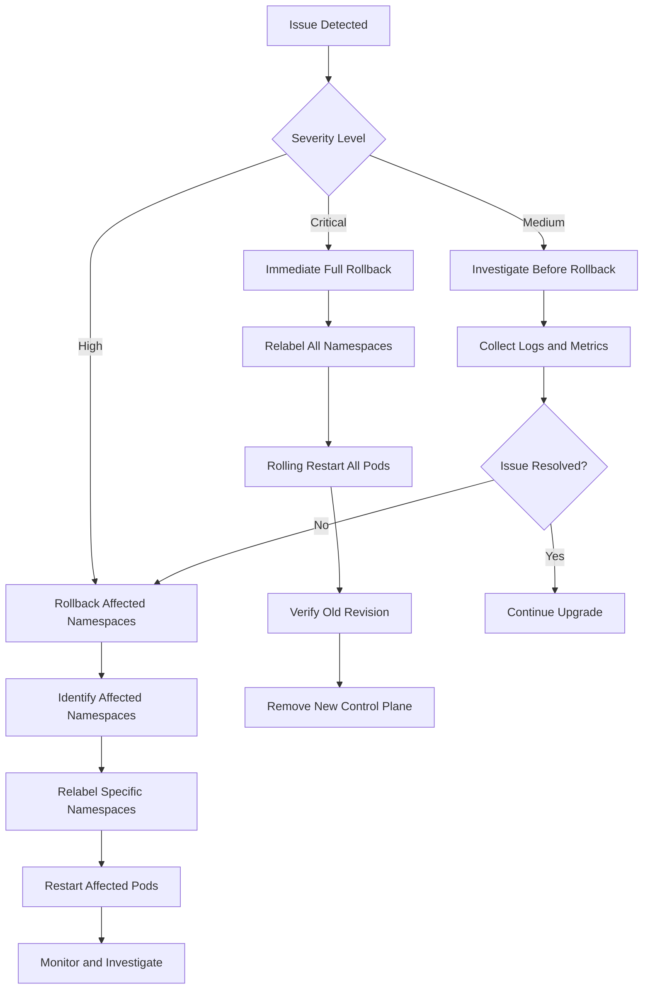

# How to Upgrade Istio with Zero Downtime

Author: [nawazdhandala](https://github.com/nawazdhandala)

Tags: Istio, Upgrade, Zero Downtime, Maintenance, Service Mesh

Description: A step-by-step guide to upgrading Istio service mesh without service disruption.

---

Upgrading Istio in production environments requires careful planning to ensure zero downtime and maintain service availability. This comprehensive guide walks you through the canary upgrade strategy using revision labels, which is the recommended approach for production environments. You'll learn how to upgrade both the control plane and data plane components while keeping your services running smoothly.

## Table of Contents

1. [Understanding Istio Upgrade Strategies](#understanding-istio-upgrade-strategies)
2. [Prerequisites](#prerequisites)
3. [Upgrade Workflow Overview](#upgrade-workflow-overview)
4. [Step 1: Pre-Upgrade Validation](#step-1-pre-upgrade-validation)
5. [Step 2: Installing the New Control Plane](#step-2-installing-the-new-control-plane)
6. [Step 3: Migrating the Data Plane](#step-3-migrating-the-data-plane)
7. [Step 4: Validating the Upgrade](#step-4-validating-the-upgrade)
8. [Step 5: Removing the Old Control Plane](#step-5-removing-the-old-control-plane)
9. [Rollback Procedures](#rollback-procedures)
10. [Best Practices](#best-practices)
11. [Troubleshooting Common Issues](#troubleshooting-common-issues)

## Understanding Istio Upgrade Strategies

Istio supports multiple upgrade strategies, each with different trade-offs:

| Strategy | Downtime Risk | Rollback Complexity | Recommended For |
|----------|---------------|---------------------|-----------------|
| In-place upgrade | Medium | High | Development/Testing |
| Canary upgrade (revisions) | Low | Low | Production |
| Blue-green upgrade | Very Low | Very Low | Critical production |

The **canary upgrade with revision labels** is the recommended approach for production environments because it allows you to:

- Run multiple control plane versions simultaneously
- Gradually migrate workloads to the new version
- Easily rollback if issues are detected
- Validate the new version before full migration

## Prerequisites

Before starting the upgrade process, ensure you have the following:

The following tools and versions are required to perform a safe Istio upgrade:

```bash
# Verify kubectl is installed and configured
# This command should return your cluster information
kubectl cluster-info

# Verify istioctl is installed (should match your current Istio version)
# The version output confirms istioctl can communicate with your cluster
istioctl version

# Download the new version of istioctl
# Replace 1.20.0 with your target version
# This downloads the official Istio release from GitHub
curl -L https://istio.io/downloadIstio | ISTIO_VERSION=1.20.0 sh -

# Add the new istioctl to your PATH
# This ensures you can run istioctl commands from any directory
export PATH=$PWD/istio-1.20.0/bin:$PATH
```

## Upgrade Workflow Overview

The following diagram illustrates the complete upgrade workflow:



## Step 1: Pre-Upgrade Validation

Before upgrading, perform thorough validation of your current Istio installation.

### Check Current Installation Status

Run the pre-upgrade check to identify potential issues before starting the upgrade:

```bash
# Run istioctl pre-upgrade check
# This command analyzes your current installation and identifies
# any compatibility issues with the target version
istioctl x precheck

# Check the current Istio version and revision
# This shows all installed control plane revisions and their versions
istioctl version --short

# Verify all Istio components are healthy
# This command validates the control plane configuration
# and reports any issues that need to be addressed
istioctl analyze --all-namespaces
```

### Document Current Configuration

Capture your current configuration for reference and potential rollback:

```bash
# Export current IstioOperator configuration
# This creates a backup of your configuration that can be used
# for rollback or reference during the upgrade
kubectl get istiooperator -n istio-system -o yaml > istio-backup.yaml

# List all current revisions
# Shows the control plane revisions currently deployed
kubectl get pods -n istio-system -l app=istiod --show-labels

# Document current proxy versions across all namespaces
# This helps track which workloads need to be migrated
kubectl get pods -A -o jsonpath='{range .items[*]}{.metadata.namespace}/{.metadata.name}: {.spec.containers[?(@.name=="istio-proxy")].image}{"\n"}{end}' | grep -v "^:" > proxy-versions-before.txt
```

### Verify Cluster Resources

Ensure your cluster has sufficient resources for running two control planes during migration:

```bash
# Check available resources in the istio-system namespace
# Running two control planes temporarily requires additional resources
# Ensure you have at least 2 CPU cores and 4GB memory available
kubectl describe nodes | grep -A 5 "Allocated resources"

# Check current resource usage of Istio components
# This helps estimate additional resources needed during upgrade
kubectl top pods -n istio-system
```

## Step 2: Installing the New Control Plane

Install the new Istio control plane alongside the existing one using revision labels.

### Create IstioOperator Configuration

Create an IstioOperator manifest with a revision label for the canary deployment:

```yaml
# istio-1-20-0.yaml
# This IstioOperator manifest installs Istio 1.20.0 with a revision label
# The revision label allows running multiple control planes simultaneously
apiVersion: install.istio.io/v1alpha1
kind: IstioOperator
metadata:
  # Namespace where Istio control plane components will be installed
  namespace: istio-system
  # Unique name for this installation, includes the revision for clarity
  name: istio-1-20-0
spec:
  # The revision label that uniquely identifies this control plane version
  # Namespaces will use this label to select which control plane to use
  revision: 1-20-0

  # Install the default profile which includes istiod and ingress gateway
  # Other profiles: minimal, demo, empty, preview
  profile: default

  # Mesh-wide configuration settings
  meshConfig:
    # Enable access logging for debugging and monitoring
    # Logs will be written to stdout of the sidecar container
    accessLogFile: /dev/stdout

    # Enable Envoy's access log service for structured logging
    enableAutoMtls: true

    # Default proxy configuration applied to all sidecars
    defaultConfig:
      # Enable distributed tracing with 1% sampling rate
      # Adjust based on your traffic volume and tracing requirements
      tracing:
        sampling: 1.0

  # Component-specific configuration
  components:
    # Pilot (istiod) configuration
    pilot:
      enabled: true
      k8s:
        # Resource requests and limits for the control plane
        # Adjust based on your cluster size and traffic volume
        resources:
          requests:
            cpu: 500m
            memory: 2Gi
          limits:
            cpu: 1000m
            memory: 4Gi

        # Pod disruption budget ensures high availability during upgrades
        # At least one replica must be available at all times
        podDisruptionBudget:
          minAvailable: 1

        # Run multiple replicas for high availability
        replicaCount: 2

        # Spread replicas across nodes for resilience
        affinity:
          podAntiAffinity:
            preferredDuringSchedulingIgnoredDuringExecution:
            - weight: 100
              podAffinityTerm:
                labelSelector:
                  matchLabels:
                    app: istiod
                topologyKey: kubernetes.io/hostname

    # Ingress gateway configuration
    ingressGateways:
    - name: istio-ingressgateway
      enabled: true
      k8s:
        # Gateway resource configuration
        resources:
          requests:
            cpu: 100m
            memory: 128Mi
          limits:
            cpu: 500m
            memory: 512Mi

        # Multiple replicas for high availability
        replicaCount: 2

        # Horizontal pod autoscaler for handling traffic spikes
        hpaSpec:
          minReplicas: 2
          maxReplicas: 5
          metrics:
          - type: Resource
            resource:
              name: cpu
              targetAverageUtilization: 80
```

### Install the New Control Plane

Install the new control plane revision using the IstioOperator manifest:

```bash
# Install the new Istio revision using istioctl
# The --revision flag ensures this creates a new revision instead of upgrading
# This command is non-disruptive and runs alongside existing installation
istioctl install -f istio-1-20-0.yaml --revision=1-20-0 -y

# Alternative: Install using Helm for more control over the deployment
# First, add the Istio Helm repository and update
helm repo add istio https://istio-release.storage.googleapis.com/charts
helm repo update

# Install the base chart which includes CRDs
# Skip this if you already have the CRDs from a previous installation
helm install istio-base istio/base -n istio-system --set defaultRevision=1-20-0

# Install istiod with the revision label
# This creates a separate istiod deployment with the revision suffix
helm install istiod-1-20-0 istio/istiod -n istio-system \
  --set revision=1-20-0 \
  --set pilot.resources.requests.cpu=500m \
  --set pilot.resources.requests.memory=2Gi
```

### Verify New Control Plane Installation

Confirm the new control plane is running correctly:

```bash
# Check that both control plane versions are running
# You should see pods for both the old and new revisions
kubectl get pods -n istio-system -l app=istiod

# Expected output shows both versions running:
# NAME                            READY   STATUS    RESTARTS   AGE
# istiod-5f4f9b8c5-xxxxx          1/1     Running   0          30d
# istiod-1-20-0-7c8b9d6f4-yyyyy   1/1     Running   0          2m

# Verify the new revision is registered and healthy
# This shows all available control plane revisions
istioctl proxy-status

# Check the new control plane can issue certificates
# This validates mTLS functionality of the new control plane
istioctl experimental wait --for=distribution --revision=1-20-0 --timeout=300s
```

## Step 3: Migrating the Data Plane

Migrate workloads to the new control plane gradually using namespace labels.

### Data Plane Migration Workflow

```mermaid
flowchart LR
    subgraph "Phase 1: Test Namespace"
        A[Label test namespace] --> B[Restart test pods]
        B --> C[Validate test workloads]
    end

    subgraph "Phase 2: Staging"
        C --> D[Label staging namespace]
        D --> E[Restart staging pods]
        E --> F[Validate staging]
    end

    subgraph "Phase 3: Production"
        F --> G[Label prod namespaces]
        G --> H[Rolling restart]
        H --> I[Validate production]
    end

    subgraph "Phase 4: Cleanup"
        I --> J[Remove old control plane]
        J --> K[Set default revision]
    end
```



### Migrate a Test Namespace First

Always start with a non-critical namespace to validate the migration process:

```bash
# First, check the current injection label on your test namespace
# This shows which revision is currently configured
kubectl get namespace test-namespace --show-labels

# Update the namespace to use the new revision
# Remove the old injection label and add the new revision label
# The istio.io/rev label tells Istio which control plane revision to use
kubectl label namespace test-namespace istio-injection- istio.io/rev=1-20-0 --overwrite

# Perform a rolling restart of all deployments in the namespace
# This triggers new pods to be created with the updated sidecar
# The --cascade flag ensures all pods are restarted
kubectl rollout restart deployment -n test-namespace

# Wait for all deployments to complete their rollout
# This ensures all pods are running with the new sidecar before proceeding
kubectl rollout status deployment --all -n test-namespace --timeout=300s

# Verify the new proxy version is injected
# All pods should now show the new Istio proxy version
kubectl get pods -n test-namespace -o jsonpath='{range .items[*]}{.metadata.name}: {.spec.containers[?(@.name=="istio-proxy")].image}{"\n"}{end}'
```

### Validate Migrated Workloads

Thoroughly validate the migrated workloads before proceeding:

```bash
# Check proxy synchronization status with the new control plane
# All proxies should show SYNCED status with the new revision
istioctl proxy-status | grep test-namespace

# Verify mTLS is working correctly between pods
# This shows the TLS mode for connections to your service
istioctl authn tls-check -n test-namespace

# Run diagnostic analysis on the namespace
# This identifies any configuration issues specific to the namespace
istioctl analyze -n test-namespace

# Test connectivity between services
# Replace with your actual service names and endpoints
kubectl exec -n test-namespace deploy/client-app -c client -- \
  curl -s http://server-service:8080/health

# Check for any errors in the sidecar logs
# Look for connection errors or certificate issues
kubectl logs -n test-namespace -l app=your-app -c istio-proxy --tail=100 | grep -i error
```

### Create a Migration Script for Multiple Namespaces

For production environments with many namespaces, use a script to automate the migration:

```bash
#!/bin/bash
# migrate-namespace.sh
# This script safely migrates a namespace to a new Istio revision
# It includes validation steps and can be used for gradual rollout

# Configuration variables
NEW_REVISION="1-20-0"
TIMEOUT="300s"

# Function to migrate a single namespace
migrate_namespace() {
    local namespace=$1

    echo "========================================="
    echo "Migrating namespace: $namespace"
    echo "========================================="

    # Step 1: Check current state
    echo "[1/6] Checking current namespace state..."
    kubectl get namespace "$namespace" --show-labels

    # Step 2: Update the revision label
    echo "[2/6] Updating namespace labels..."
    kubectl label namespace "$namespace" istio-injection- --overwrite 2>/dev/null || true
    kubectl label namespace "$namespace" istio.io/rev="$NEW_REVISION" --overwrite

    # Step 3: Get list of deployments before restart
    echo "[3/6] Identifying deployments..."
    deployments=$(kubectl get deployments -n "$namespace" -o jsonpath='{.items[*].metadata.name}')

    if [ -z "$deployments" ]; then
        echo "No deployments found in namespace $namespace"
        return 0
    fi

    # Step 4: Rolling restart with careful monitoring
    echo "[4/6] Performing rolling restart..."
    kubectl rollout restart deployment -n "$namespace"

    # Step 5: Wait for rollouts to complete
    echo "[5/6] Waiting for rollouts to complete..."
    for deployment in $deployments; do
        echo "  Waiting for $deployment..."
        kubectl rollout status deployment/"$deployment" -n "$namespace" --timeout="$TIMEOUT"
        if [ $? -ne 0 ]; then
            echo "ERROR: Rollout failed for $deployment in $namespace"
            return 1
        fi
    done

    # Step 6: Validate the migration
    echo "[6/6] Validating migration..."
    istioctl analyze -n "$namespace"

    # Verify proxy versions
    echo "Proxy versions after migration:"
    kubectl get pods -n "$namespace" -o jsonpath='{range .items[*]}{.metadata.name}: {.spec.containers[?(@.name=="istio-proxy")].image}{"\n"}{end}'

    echo "Migration completed for namespace: $namespace"
    echo ""
}

# List of namespaces to migrate (in order of priority)
# Start with test/dev namespaces, then staging, then production
NAMESPACES=(
    "test-namespace"
    "staging-namespace"
    "production-namespace-1"
    "production-namespace-2"
)

# Migrate each namespace with confirmation
for ns in "${NAMESPACES[@]}"; do
    read -p "Migrate namespace '$ns'? (y/n) " -n 1 -r
    echo
    if [[ $REPLY =~ ^[Yy]$ ]]; then
        migrate_namespace "$ns"

        # Wait between namespaces to observe behavior
        echo "Waiting 60 seconds before next namespace..."
        echo "Press Ctrl+C to abort if issues are detected"
        sleep 60
    else
        echo "Skipping namespace: $ns"
    fi
done

echo "========================================="
echo "Migration complete for all namespaces"
echo "========================================="
```

### Migrate Ingress Gateway

The ingress gateway needs special handling during the upgrade:

```bash
# Check current gateway version and status
# Gateways handle external traffic and need careful migration
kubectl get pods -n istio-system -l app=istio-ingressgateway --show-labels

# For revision-based gateway upgrade, deploy a new gateway with the new revision
# This allows running both gateway versions simultaneously
cat <<EOF | kubectl apply -f -
# New ingress gateway deployment for the upgraded revision
apiVersion: apps/v1
kind: Deployment
metadata:
  name: istio-ingressgateway-1-20-0
  namespace: istio-system
spec:
  replicas: 2
  selector:
    matchLabels:
      app: istio-ingressgateway
      istio.io/rev: 1-20-0
  template:
    metadata:
      labels:
        app: istio-ingressgateway
        istio.io/rev: 1-20-0
      annotations:
        # This annotation triggers sidecar injection from the new revision
        sidecar.istio.io/inject: "true"
    spec:
      containers:
      - name: istio-proxy
        image: docker.io/istio/proxyv2:1.20.0
        ports:
        - containerPort: 8080
        - containerPort: 8443
EOF

# Gradually shift traffic to the new gateway using a Service update
# This can be done by updating the service selector
kubectl patch service istio-ingressgateway -n istio-system \
  --type='json' \
  -p='[{"op": "add", "path": "/spec/selector/istio.io~1rev", "value": "1-20-0"}]'

# Verify traffic is flowing through the new gateway
kubectl logs -n istio-system -l app=istio-ingressgateway,istio.io/rev=1-20-0 --tail=50
```

## Step 4: Validating the Upgrade

Comprehensive validation ensures the upgrade was successful before removing the old control plane.

### Validation Checklist

```bash
# 1. Verify all proxies are connected to the new control plane
# The output should show all proxies synced with the 1-20-0 revision
istioctl proxy-status | grep -v "1-20-0" | grep -c SYNCED
# Expected output: 0 (all proxies should be on the new revision)

# 2. Check for configuration synchronization issues
# All proxies should show SYNCED status, not STALE or NOT SENT
istioctl proxy-status | grep -E "(STALE|NOT SENT)"

# 3. Validate mesh-wide configuration
# This checks for any configuration errors across all namespaces
istioctl analyze --all-namespaces

# 4. Verify mTLS is working mesh-wide
# Check that all services have proper TLS configuration
istioctl authn tls-check pod/$(kubectl get pods -n test-namespace -o jsonpath='{.items[0].metadata.name}') -n test-namespace

# 5. Test cross-namespace communication
# Ensure services can communicate across namespaces
kubectl exec -n namespace-a deploy/service-a -c app -- \
  curl -s http://service-b.namespace-b.svc.cluster.local:8080/health

# 6. Verify Istio metrics are being collected
# Check that Prometheus is scraping the new proxy metrics
kubectl exec -n istio-system deploy/prometheus -c prometheus -- \
  wget -qO- 'http://localhost:9090/api/v1/query?query=istio_requests_total' | head -20

# 7. Check certificate rotation is working
# Certificates should be valid and recently issued
istioctl proxy-config secret -n test-namespace deploy/your-app | head -10
```

### Create a Validation Dashboard

Monitor key metrics during and after the upgrade:

```yaml
# istio-upgrade-validation-dashboard.yaml
# This ConfigMap creates a Grafana dashboard for monitoring the upgrade
apiVersion: v1
kind: ConfigMap
metadata:
  name: istio-upgrade-validation-dashboard
  namespace: monitoring
  labels:
    grafana_dashboard: "1"
data:
  istio-upgrade-validation.json: |
    {
      "title": "Istio Upgrade Validation",
      "panels": [
        {
          "title": "Request Success Rate by Revision",
          "type": "graph",
          "targets": [
            {
              "expr": "sum(rate(istio_requests_total{response_code=~\"2..\"}[5m])) by (source_version) / sum(rate(istio_requests_total[5m])) by (source_version) * 100",
              "legendFormat": "{{source_version}}"
            }
          ]
        },
        {
          "title": "P99 Latency by Revision",
          "type": "graph",
          "targets": [
            {
              "expr": "histogram_quantile(0.99, sum(rate(istio_request_duration_milliseconds_bucket[5m])) by (le, source_version))",
              "legendFormat": "{{source_version}}"
            }
          ]
        },
        {
          "title": "Active Connections by Control Plane",
          "type": "graph",
          "targets": [
            {
              "expr": "sum(pilot_xds_pushes{type=\"cds\"}) by (revision)",
              "legendFormat": "{{revision}}"
            }
          ]
        },
        {
          "title": "Proxy Sync Status",
          "type": "stat",
          "targets": [
            {
              "expr": "sum(pilot_proxy_convergence_time_count) by (revision)",
              "legendFormat": "{{revision}}"
            }
          ]
        }
      ]
    }
```

## Step 5: Removing the Old Control Plane

After validating all workloads are running on the new control plane, remove the old one.

### Final Pre-Removal Checks

```bash
# Ensure no proxies are still connected to the old control plane
# This command should return empty or zero results
istioctl proxy-status | grep -v "1-20-0" | grep -v "REVISION"

# Double-check all namespaces are labeled with the new revision
# Look for any namespaces still using istio-injection=enabled
kubectl get namespaces -L istio-injection,istio.io/rev | grep -v "1-20-0"

# Check for any webhooks still pointing to the old revision
# The mutating webhook should reference the new revision
kubectl get mutatingwebhookconfigurations -l app=sidecar-injector
```

### Remove Old Control Plane

Safely remove the old Istio control plane components:

```bash
# If you installed with istioctl, remove the old revision
# The --revision flag ensures only the old revision is removed
istioctl uninstall --revision=default -y

# Alternative: If you installed with Helm, remove the old release
helm uninstall istiod -n istio-system

# Remove old gateway if deployed separately
kubectl delete deployment istio-ingressgateway -n istio-system

# Clean up any orphaned resources from the old installation
kubectl delete configmap istio -n istio-system
kubectl delete configmap istio-sidecar-injector -n istio-system

# Remove old webhooks
kubectl delete mutatingwebhookconfiguration istio-sidecar-injector
kubectl delete validatingwebhookconfiguration istiod-default-validator
```

### Set the New Revision as Default

Configure the new revision as the default for future deployments:

```bash
# Tag the new revision as the default
# This allows using istio-injection=enabled label again
istioctl tag set default --revision 1-20-0 --overwrite

# Verify the default tag is set correctly
istioctl tag list

# Test that new pods get injected with the correct version
# Create a test pod in a namespace with istio-injection=enabled
kubectl label namespace test-namespace istio.io/rev- --overwrite
kubectl label namespace test-namespace istio-injection=enabled --overwrite
kubectl rollout restart deployment -n test-namespace

# Verify the injected sidecar version
kubectl get pods -n test-namespace -o jsonpath='{range .items[*]}{.metadata.name}: {.spec.containers[?(@.name=="istio-proxy")].image}{"\n"}{end}'
```

## Rollback Procedures

If issues are detected during or after the upgrade, you can quickly rollback.

### Rollback Workflow



### Rollback a Single Namespace

If issues are isolated to specific namespaces:

```bash
# Rollback a namespace to the old revision
# Remove the new revision label and restore the old injection method
kubectl label namespace affected-namespace istio.io/rev- --overwrite
kubectl label namespace affected-namespace istio-injection=enabled --overwrite

# Restart pods to get the old sidecar version
kubectl rollout restart deployment -n affected-namespace

# Wait for rollout to complete
kubectl rollout status deployment --all -n affected-namespace

# Verify pods are using the old proxy version
kubectl get pods -n affected-namespace \
  -o jsonpath='{range .items[*]}{.metadata.name}: {.spec.containers[?(@.name=="istio-proxy")].image}{"\n"}{end}'
```

### Full Rollback Script

For a complete rollback of all namespaces:

```bash
#!/bin/bash
# rollback-istio.sh
# Emergency rollback script for Istio upgrade
# This script reverts all namespaces to the original control plane

OLD_REVISION="default"  # or your previous revision label
NEW_REVISION="1-20-0"

echo "Starting Istio rollback from $NEW_REVISION to $OLD_REVISION"
echo "=============================================="

# Get all namespaces currently using the new revision
namespaces=$(kubectl get namespaces -l istio.io/rev=$NEW_REVISION -o jsonpath='{.items[*].metadata.name}')

if [ -z "$namespaces" ]; then
    echo "No namespaces found with revision $NEW_REVISION"
    exit 0
fi

echo "Namespaces to rollback: $namespaces"
echo ""

# Rollback each namespace
for ns in $namespaces; do
    echo "Rolling back namespace: $ns"

    # Remove new revision label and set old injection method
    kubectl label namespace "$ns" istio.io/rev- --overwrite
    kubectl label namespace "$ns" istio-injection=enabled --overwrite

    # Restart all deployments
    kubectl rollout restart deployment -n "$ns"

    echo "Waiting for rollout in $ns..."
    kubectl rollout status deployment --all -n "$ns" --timeout=300s

    echo "Completed rollback for: $ns"
    echo ""
done

echo "=============================================="
echo "Rollback complete. Verifying proxy versions..."
echo ""

# Verify all proxies are on the old version
for ns in $namespaces; do
    echo "Namespace: $ns"
    kubectl get pods -n "$ns" \
      -o jsonpath='{range .items[*]}  {.metadata.name}: {.spec.containers[?(@.name=="istio-proxy")].image}{"\n"}{end}'
    echo ""
done

echo "Run 'istioctl proxy-status' to verify all proxies are synced"
```

## Best Practices

### Pre-Upgrade Planning

1. **Review Release Notes**: Always read the Istio release notes for breaking changes
2. **Test in Non-Production**: Perform the upgrade in a staging environment first
3. **Schedule During Low Traffic**: Plan upgrades during maintenance windows
4. **Backup Configurations**: Export all Istio configurations before starting

### During Upgrade

1. **Monitor Continuously**: Watch metrics and logs throughout the process
2. **Migrate Gradually**: Move namespaces one at a time, starting with least critical
3. **Validate Each Step**: Don't proceed until each namespace is fully validated
4. **Keep Rollback Ready**: Maintain the old control plane until fully validated

### Post-Upgrade

1. **Document Changes**: Record the upgrade process and any issues encountered
2. **Update Runbooks**: Modify operational procedures for the new version
3. **Clean Up**: Remove old resources only after thorough validation
4. **Monitor for Issues**: Continue monitoring for at least 24-48 hours

## Troubleshooting Common Issues

### Pods Not Getting Injected with New Sidecar

If new pods are not being injected with the new sidecar version:

```bash
# Check namespace labels are correct
kubectl get namespace your-namespace --show-labels

# Verify the mutating webhook is configured correctly
kubectl get mutatingwebhookconfigurations istio-sidecar-injector-1-20-0 -o yaml

# Check for admission webhook errors
kubectl logs -n istio-system deploy/istiod-1-20-0 | grep -i "injection"

# Manually verify injection by creating a test pod
kubectl run test-pod --image=nginx --restart=Never -n your-namespace
kubectl describe pod test-pod -n your-namespace | grep -A 5 "istio-proxy"
```

### Proxy Not Syncing with New Control Plane

If proxies show STALE or NOT SENT status:

```bash
# Check control plane logs for sync errors
kubectl logs -n istio-system deploy/istiod-1-20-0 | grep -i error

# Verify network connectivity between proxy and control plane
kubectl exec -n your-namespace deploy/your-app -c istio-proxy -- \
  curl -s istiod-1-20-0.istio-system.svc:15012/debug/connections

# Check for certificate issues
istioctl proxy-config secret -n your-namespace deploy/your-app

# Force a proxy restart to re-establish connection
kubectl rollout restart deployment/your-app -n your-namespace
```

### mTLS Connection Failures After Upgrade

If services cannot communicate after migration:

```bash
# Check mTLS status between services
istioctl authn tls-check pod/client-pod.namespace pod/server-pod.namespace

# Verify PeerAuthentication policies are compatible
kubectl get peerauthentication -A

# Check for policy conflicts between revisions
istioctl analyze -n your-namespace

# Temporarily enable permissive mode for debugging
cat <<EOF | kubectl apply -f -
apiVersion: security.istio.io/v1beta1
kind: PeerAuthentication
metadata:
  name: default
  namespace: your-namespace
spec:
  mtls:
    mode: PERMISSIVE
EOF
```

### Ingress Gateway Not Routing Traffic

If external traffic is not reaching services:

```bash
# Check gateway and virtual service configurations
istioctl analyze -n istio-system

# Verify gateway is listening on the correct ports
kubectl exec -n istio-system deploy/istio-ingressgateway-1-20-0 -c istio-proxy -- \
  netstat -tlnp

# Check gateway logs for routing errors
kubectl logs -n istio-system deploy/istio-ingressgateway-1-20-0 --tail=100

# Verify the gateway configuration is synchronized
istioctl proxy-config listeners -n istio-system deploy/istio-ingressgateway-1-20-0
istioctl proxy-config routes -n istio-system deploy/istio-ingressgateway-1-20-0
```

## Conclusion

Upgrading Istio with zero downtime requires careful planning and execution, but by using the canary upgrade strategy with revision labels, you can safely migrate your service mesh to new versions while maintaining service availability. The key points to remember are:

1. **Always use revision-based upgrades** for production environments
2. **Migrate workloads gradually**, starting with non-critical namespaces
3. **Validate thoroughly** at each step before proceeding
4. **Keep rollback procedures ready** until the upgrade is fully validated
5. **Monitor continuously** during and after the upgrade

By following this guide and adapting the procedures to your specific environment, you can confidently upgrade Istio while ensuring your applications remain available to your users.

## Additional Resources

- [Istio Official Upgrade Guide](https://istio.io/latest/docs/setup/upgrade/)
- [Istio Canary Upgrade Documentation](https://istio.io/latest/docs/setup/upgrade/canary/)
- [Istio Release Notes](https://istio.io/latest/news/releases/)
- [Istio Troubleshooting Guide](https://istio.io/latest/docs/ops/diagnostic-tools/)
