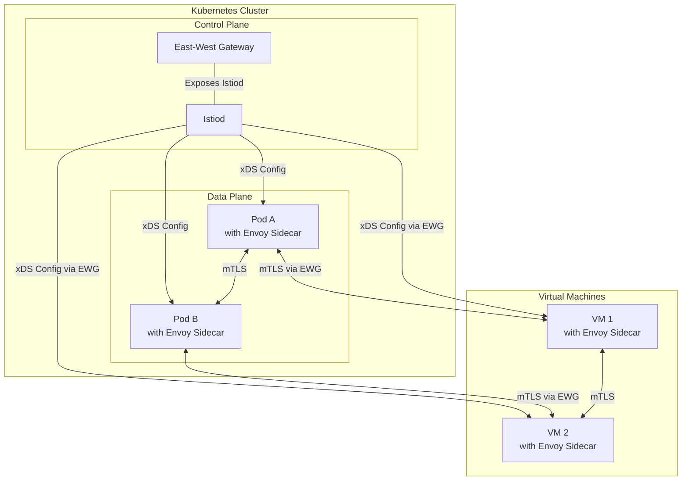
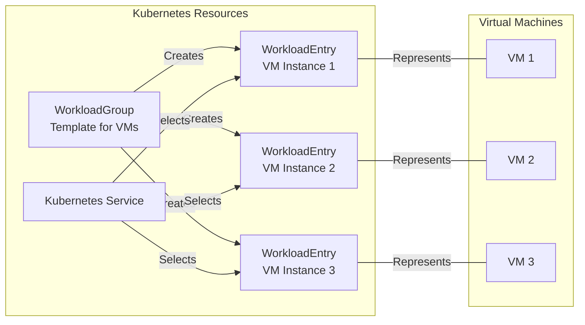
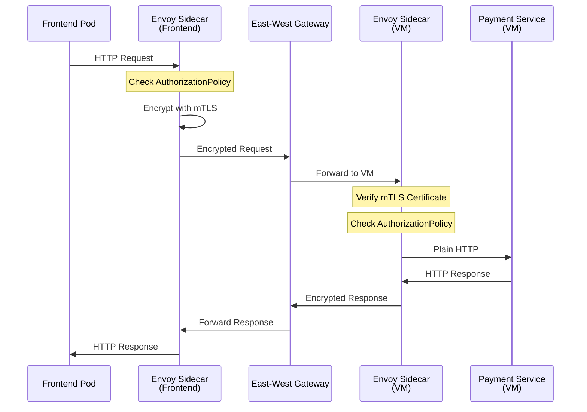
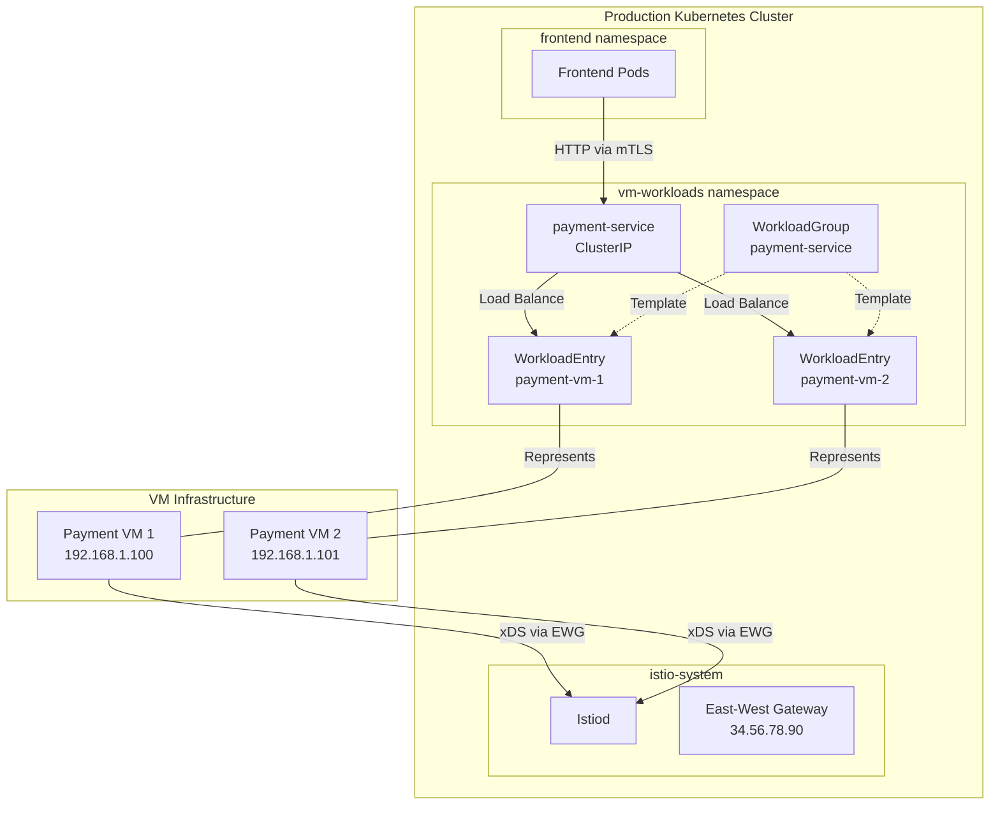

# How to Integrate VM Workloads with Istio Service Mesh

Author: [nawazdhandala](https://github.com/nawazdhandala)

Tags: Istio, Virtual Machines, Hybrid Cloud, Service Mesh, Kubernetes

Description: A guide to extending Istio service mesh to include VM-based workloads.

---

## Introduction

Many organizations operate in hybrid environments where some workloads run in Kubernetes while others remain on traditional virtual machines (VMs). Istio's VM support allows you to extend the service mesh to include these VM-based workloads, providing consistent security, observability, and traffic management across your entire infrastructure.

This guide covers the complete process of integrating VM workloads with Istio, including WorkloadEntry and WorkloadGroup resources, the VM onboarding process, DNS configuration, service discovery, and security considerations.

## Architecture Overview

Before diving into the implementation, let's understand the hybrid architecture that connects Kubernetes pods and VMs through Istio.



## Prerequisites

Before integrating VMs with Istio, ensure you have:

- A Kubernetes cluster with Istio 1.9+ installed
- VMs with network connectivity to the Kubernetes cluster
- Root or sudo access on the VMs
- The `istioctl` CLI tool installed

## Step 1: Prepare the Istio Control Plane

First, configure Istio to support VM workloads by enabling the necessary features.

The following IstioOperator configuration enables VM integration by setting up mesh expansion and configuring the east-west gateway that VMs will use to communicate with the control plane:

```yaml
# istio-operator-vm.yaml
# This configuration enables Istio to manage VM workloads
# by exposing the control plane through an east-west gateway
apiVersion: install.istio.io/v1alpha1
kind: IstioOperator
metadata:
  name: istio-vm-enabled
  namespace: istio-system
spec:
  # Enable mesh expansion for VM support
  meshConfig:
    # Allow VMs to connect to the mesh
    defaultConfig:
      # Enable hold application until proxy starts
      # This ensures the application doesn't start before Envoy is ready
      holdApplicationUntilProxyStarts: true

    # Enable trust domain for cross-cluster/VM communication
    trustDomain: cluster.local

  values:
    global:
      # The mesh ID identifies this mesh for multi-cluster setups
      meshID: mesh1
      # Enable multi-cluster/VM support
      multiCluster:
        clusterName: cluster1
      # Network identifier for this cluster
      network: network1

  components:
    # Configure the ingress gateway for east-west traffic
    ingressGateways:
      - name: istio-eastwestgateway
        label:
          istio: eastwestgateway
          app: istio-eastwestgateway
          # Indicate this is for internal mesh traffic
          topology.istio.io/network: network1
        enabled: true
        k8s:
          # Expose specific ports for VM communication
          service:
            ports:
              # Port for Istiod xDS communication
              - name: status-port
                port: 15021
                targetPort: 15021
              # TLS port for secure communication
              - name: tls
                port: 15443
                targetPort: 15443
              # Port for istiod TLS
              - name: tls-istiod
                port: 15012
                targetPort: 15012
              # Port for webhook validation
              - name: tls-webhook
                port: 15017
                targetPort: 15017
          # Environment variables to configure the gateway
          env:
            # This gateway handles traffic for the specified network
            - name: ISTIO_META_ROUTER_MODE
              value: "sni-dnat"
            - name: ISTIO_META_REQUESTED_NETWORK_VIEW
              value: network1
```

Apply the configuration to install or update Istio:

```bash
# Apply the IstioOperator configuration
# This will configure Istio to support VM workloads
istioctl install -f istio-operator-vm.yaml -y
```

## Step 2: Expose Istiod to VMs

VMs need to reach Istiod for configuration updates. Create a Gateway resource to expose the control plane.

The following Gateway configuration allows VMs to connect to Istiod through the east-west gateway using TLS passthrough:

```yaml
# expose-istiod.yaml
# This Gateway exposes the Istio control plane to VMs
# VMs will connect through this gateway to receive configuration
apiVersion: networking.istio.io/v1beta1
kind: Gateway
metadata:
  name: istiod-gateway
  namespace: istio-system
spec:
  # Use the east-west gateway for VM communication
  selector:
    istio: eastwestgateway
  servers:
    # Expose the Istiod gRPC port for xDS communication
    - port:
        number: 15012
        name: tls-istiod
        protocol: TLS
      # TLS passthrough mode - Istiod handles the TLS termination
      tls:
        mode: PASSTHROUGH
      # Accept connections for all hosts
      hosts:
        - "*"
    # Expose the webhook port for certificate validation
    - port:
        number: 15017
        name: tls-webhook
        protocol: TLS
      tls:
        mode: PASSTHROUGH
      hosts:
        - "*"
---
# VirtualService to route traffic to Istiod
# This ensures VM traffic reaches the correct backend
apiVersion: networking.istio.io/v1beta1
kind: VirtualService
metadata:
  name: istiod-vs
  namespace: istio-system
spec:
  hosts:
    - "*"
  gateways:
    - istiod-gateway
  tls:
    # Route Istiod xDS traffic
    - match:
        - port: 15012
          sniHosts:
            - "*"
      route:
        - destination:
            host: istiod.istio-system.svc.cluster.local
            port:
              number: 15012
    # Route webhook traffic
    - match:
        - port: 15017
          sniHosts:
            - "*"
      route:
        - destination:
            host: istiod.istio-system.svc.cluster.local
            port:
              number: 443
```

Apply the gateway configuration:

```bash
# Create the Gateway and VirtualService for VM connectivity
kubectl apply -f expose-istiod.yaml
```

## Step 3: Create a Namespace for VM Workloads

Create a dedicated namespace for organizing VM workloads and enable Istio injection.

```bash
# Create a namespace for VM workloads
# This namespace will contain WorkloadEntry and WorkloadGroup resources
kubectl create namespace vm-workloads

# Label the namespace for Istio sidecar injection metadata
# This label helps Istio identify that workloads in this namespace
# should be part of the mesh
kubectl label namespace vm-workloads istio-injection=enabled
```

## Step 4: Understanding WorkloadGroup and WorkloadEntry

Istio uses two key resources to represent VM workloads:



### WorkloadGroup

A WorkloadGroup is a template that describes a collection of VM workloads. It defines common properties like labels, service account, and network settings.

The following WorkloadGroup defines a template for a payment processing service running on VMs:

```yaml
# workload-group-payment-service.yaml
# WorkloadGroup acts as a template for VM workloads
# It defines common settings that apply to all VMs in this group
apiVersion: networking.istio.io/v1beta1
kind: WorkloadGroup
metadata:
  name: payment-service
  namespace: vm-workloads
spec:
  # Metadata applied to all WorkloadEntries created from this group
  metadata:
    # Labels used for service discovery and traffic routing
    labels:
      app: payment-service
      version: v1
      # Indicates this is a VM workload
      class: vm
    # Annotations for additional metadata
    annotations:
      # Custom annotation for tracking
      team: payments

  # Template for the workload configuration
  template:
    # ServiceAccount for identity and RBAC
    # The VM will use this identity for mTLS
    serviceAccount: payment-service-sa

    # Network identifier - must match the Istio network configuration
    network: network1

    # Locality information for load balancing
    # Istio uses this for locality-aware routing
    locality: us-west1/zone-a

  # Probe configuration for health checking
  probe:
    # Probe interval in seconds
    periodSeconds: 5
    # Number of consecutive failures before marking unhealthy
    failureThreshold: 3
    # Initial delay before starting probes
    initialDelaySeconds: 10
    # HTTP health check configuration
    httpGet:
      # Path to check for health status
      path: /health
      # Port where the health endpoint is exposed
      port: 8080
```

### WorkloadEntry

A WorkloadEntry represents a single VM instance. It can be created manually or automatically when a VM joins the mesh.

The following WorkloadEntry represents a specific VM instance running the payment service:

```yaml
# workload-entry-payment-vm1.yaml
# WorkloadEntry represents a single VM in the mesh
# This resource makes the VM discoverable by other services
apiVersion: networking.istio.io/v1beta1
kind: WorkloadEntry
metadata:
  name: payment-service-vm1
  namespace: vm-workloads
  # Labels matching the WorkloadGroup for grouping
  labels:
    app: payment-service
    version: v1
    class: vm
spec:
  # IP address of the VM
  # This is how other services will reach this VM
  address: 192.168.1.100

  # Labels for service selection
  # These must match the Service selector
  labels:
    app: payment-service
    version: v1
    instance-id: vm1

  # ServiceAccount for identity
  serviceAccount: payment-service-sa

  # Network identifier
  network: network1

  # Locality for load balancing decisions
  locality: us-west1/zone-a

  # Weight for load balancing (default is 1)
  # Higher weight means more traffic
  weight: 100

  # Ports exposed by this VM workload
  # Maps port names to port numbers
  ports:
    # HTTP port for the payment API
    http: 8080
    # gRPC port for internal communication
    grpc: 9090
    # Metrics port for Prometheus scraping
    metrics: 9091
```

## Step 5: Create a Kubernetes Service for VM Workloads

Create a Service that selects the VM WorkloadEntries, enabling Kubernetes pods to discover and communicate with VMs.

The following Service configuration allows pods to reach VMs using standard Kubernetes DNS:

```yaml
# service-payment.yaml
# Kubernetes Service that selects VM WorkloadEntries
# This enables service discovery for VM workloads
apiVersion: v1
kind: Service
metadata:
  name: payment-service
  namespace: vm-workloads
  labels:
    app: payment-service
spec:
  # Ports exposed by the service
  ports:
    # HTTP port for REST API
    - name: http
      port: 8080
      targetPort: 8080
      protocol: TCP
    # gRPC port for internal services
    - name: grpc
      port: 9090
      targetPort: 9090
      protocol: TCP
  # Selector matches WorkloadEntry labels
  # This is how the service finds the VM endpoints
  selector:
    app: payment-service
  # ClusterIP type for internal mesh communication
  type: ClusterIP
```

Apply the resources:

```bash
# Create the ServiceAccount for VM identity
kubectl create serviceaccount payment-service-sa -n vm-workloads

# Apply the WorkloadGroup template
kubectl apply -f workload-group-payment-service.yaml

# Apply the Service for VM discovery
kubectl apply -f service-payment.yaml
```

## Step 6: VM Onboarding Process

The VM onboarding process involves generating configuration files, installing the Istio sidecar, and starting the proxy.

### Generate VM Configuration Files

Use `istioctl` to generate the files needed to onboard a VM:

```bash
# Generate VM configuration files
# This creates certificates, tokens, and configuration for the VM
# The output directory will contain all files needed for VM setup
istioctl x workload entry configure \
  # Specify the WorkloadGroup name
  --name payment-service \
  # Namespace where the WorkloadGroup exists
  --namespace vm-workloads \
  # ServiceAccount for the VM identity
  --serviceAccount payment-service-sa \
  # Cluster name must match Istio configuration
  --clusterID cluster1 \
  # Network identifier
  --network network1 \
  # Address of the east-west gateway
  # Replace with your gateway's external IP or hostname
  --ingressIP $(kubectl get svc istio-eastwestgateway -n istio-system -o jsonpath='{.status.loadBalancer.ingress[0].ip}') \
  # Output directory for generated files
  --output vm-files/
```

This command generates the following files:

```
vm-files/
├── cluster.env          # Environment variables for the cluster
├── hosts                 # DNS entries for Istiod
├── istio-token           # JWT token for authentication
├── mesh.yaml             # Mesh configuration
└── root-cert.pem         # Root certificate for mTLS
```

### Install Istio Sidecar on the VM

Transfer the generated files to the VM and install the sidecar.

The following script installs and configures the Istio sidecar on an Ubuntu/Debian VM:

```bash
#!/bin/bash
# vm-install-sidecar.sh
# This script installs the Istio sidecar proxy on a VM
# Run this script with root privileges on the target VM

set -e

# Define the Istio version to install
# This should match your control plane version
ISTIO_VERSION="1.20.0"

# Directory where VM configuration files were copied
VM_FILES_DIR="/etc/istio/vm-files"

echo "Installing Istio sidecar proxy version ${ISTIO_VERSION}..."

# Download the Istio sidecar package
# This contains the Envoy proxy and istio-agent
curl -LO "https://storage.googleapis.com/istio-release/releases/${ISTIO_VERSION}/deb/istio-sidecar.deb"

# Install the sidecar package
# This installs envoy and istio-agent binaries
sudo dpkg -i istio-sidecar.deb

# Create the Istio configuration directory
sudo mkdir -p /etc/certs
sudo mkdir -p /var/run/secrets/tokens
sudo mkdir -p /etc/istio/proxy
sudo mkdir -p /var/lib/istio/envoy

# Copy the root certificate for mTLS
# This certificate is used to verify the control plane
sudo cp "${VM_FILES_DIR}/root-cert.pem" /etc/certs/root-cert.pem

# Copy the JWT token for authentication
# This token authenticates the VM to the control plane
sudo cp "${VM_FILES_DIR}/istio-token" /var/run/secrets/tokens/istio-token

# Copy the mesh configuration
# This contains settings for the mesh and proxy
sudo cp "${VM_FILES_DIR}/mesh.yaml" /etc/istio/config/mesh

# Copy the cluster environment variables
# These configure cluster-specific settings
sudo cp "${VM_FILES_DIR}/cluster.env" /var/lib/istio/envoy/cluster.env

# Append the hosts file entries
# This ensures the VM can resolve Istiod
sudo sh -c "cat ${VM_FILES_DIR}/hosts >> /etc/hosts"

# Set ownership for the istio-proxy user
# The sidecar runs as this user for security
sudo chown -R istio-proxy:istio-proxy /etc/certs
sudo chown -R istio-proxy:istio-proxy /var/run/secrets
sudo chown -R istio-proxy:istio-proxy /var/lib/istio

echo "Starting Istio sidecar service..."

# Enable and start the Istio sidecar service
# This runs the Envoy proxy as a systemd service
sudo systemctl enable istio
sudo systemctl start istio

# Verify the sidecar is running
sudo systemctl status istio

echo "Istio sidecar installation complete!"
echo "The VM is now part of the service mesh."
```

### Verify VM Registration

After the sidecar starts, verify the VM has registered with the mesh:

```bash
# Check if the WorkloadEntry was created automatically
# If using auto-registration, a WorkloadEntry should appear
kubectl get workloadentries -n vm-workloads

# Check the endpoints for the service
# The VM IP should appear in the endpoints
kubectl get endpoints payment-service -n vm-workloads -o yaml

# Verify the VM can communicate with Istiod
# Check the proxy status from a pod in the mesh
istioctl proxy-status
```

## Step 7: DNS and Service Discovery

VMs need to resolve Kubernetes service names. There are several approaches to enable DNS resolution.

### Option 1: Using Istio DNS Proxy (Recommended)

The Istio sidecar includes a DNS proxy that can resolve Kubernetes service names. Enable it in the mesh configuration.

The following configuration enables the DNS proxy on the VM sidecar:

```yaml
# mesh-config-dns.yaml
# This mesh configuration enables DNS proxying for VMs
# VMs can then resolve Kubernetes service names
apiVersion: install.istio.io/v1alpha1
kind: IstioOperator
spec:
  meshConfig:
    defaultConfig:
      proxyMetadata:
        # Enable DNS capture by the sidecar
        # This intercepts DNS queries and resolves them locally
        ISTIO_META_DNS_CAPTURE: "true"
        # Enable automatic DNS allocation for ServiceEntries
        # This assigns virtual IPs to external services
        ISTIO_META_DNS_AUTO_ALLOCATE: "true"
```

### Option 2: Configure VM DNS to Use CoreDNS

Forward DNS queries from the VM to the Kubernetes CoreDNS service.

The following script configures the VM to use Kubernetes DNS:

```bash
#!/bin/bash
# configure-vm-dns.sh
# This script configures the VM to forward DNS queries
# for cluster.local to Kubernetes CoreDNS

# Get the CoreDNS service IP
# Replace this with your actual CoreDNS ClusterIP
COREDNS_IP="10.96.0.10"

# Configure systemd-resolved to forward cluster.local queries
sudo mkdir -p /etc/systemd/resolved.conf.d/

# Create a configuration file for cluster.local DNS resolution
# This forwards .cluster.local queries to CoreDNS
cat << EOF | sudo tee /etc/systemd/resolved.conf.d/istio-dns.conf
[Resolve]
# Forward cluster.local domain to Kubernetes DNS
DNS=${COREDNS_IP}
Domains=~cluster.local ~svc.cluster.local
EOF

# Restart systemd-resolved to apply changes
sudo systemctl restart systemd-resolved

# Verify DNS resolution works
# This should resolve to the service ClusterIP
nslookup payment-service.vm-workloads.svc.cluster.local
```

### Option 3: Using ServiceEntry for VM-to-VM Communication

For VMs that need to discover other VMs, create ServiceEntry resources.

The following ServiceEntry makes a VM-based database discoverable:

```yaml
# service-entry-vm-database.yaml
# ServiceEntry for a database running on a VM
# This enables other VMs and pods to discover the database
apiVersion: networking.istio.io/v1beta1
kind: ServiceEntry
metadata:
  name: vm-database
  namespace: vm-workloads
spec:
  # Hostname that services will use to connect
  hosts:
    - vm-database.vm-workloads.svc.cluster.local

  # Location is MESH_INTERNAL since it's part of the mesh
  location: MESH_INTERNAL

  # Resolution is STATIC since we provide the IP addresses
  resolution: STATIC

  # Ports exposed by the database
  ports:
    - name: mysql
      number: 3306
      protocol: TCP
    - name: mysql-readonly
      number: 3307
      protocol: TCP

  # Endpoints for the database VMs
  endpoints:
    # Primary database VM
    - address: 192.168.1.200
      ports:
        mysql: 3306
      labels:
        role: primary
      locality: us-west1/zone-a
      weight: 100
    # Replica database VM
    - address: 192.168.1.201
      ports:
        mysql-readonly: 3307
      labels:
        role: replica
      locality: us-west1/zone-b
      weight: 100
```

## Step 8: Traffic Management for VM Workloads

Apply Istio traffic management policies to VM workloads just like Kubernetes pods.

### Destination Rule for VM Load Balancing

The following DestinationRule configures load balancing and connection pooling for VM workloads:

```yaml
# destination-rule-payment.yaml
# DestinationRule for the payment service running on VMs
# Configures load balancing, connection pooling, and outlier detection
apiVersion: networking.istio.io/v1beta1
kind: DestinationRule
metadata:
  name: payment-service-dr
  namespace: vm-workloads
spec:
  # Target the payment service
  host: payment-service.vm-workloads.svc.cluster.local

  # Traffic policy applied to all subsets
  trafficPolicy:
    # Connection pool settings
    connectionPool:
      tcp:
        # Maximum connections to the service
        maxConnections: 100
        # TCP connection timeout
        connectTimeout: 10s
      http:
        # Maximum pending HTTP requests
        h2UpgradePolicy: UPGRADE
        http1MaxPendingRequests: 100
        http2MaxRequests: 1000

    # Load balancing configuration
    loadBalancer:
      # Use locality-aware load balancing
      # Prefers VMs in the same zone/region
      localityLbSetting:
        enabled: true
        # Failover configuration
        failover:
          - from: us-west1
            to: us-east1
      # Round robin within the locality
      simple: ROUND_ROBIN

    # Outlier detection for circuit breaking
    outlierDetection:
      # Consecutive 5xx errors before ejection
      consecutive5xxErrors: 5
      # Interval for ejection analysis
      interval: 30s
      # Duration of ejection
      baseEjectionTime: 30s
      # Maximum percentage of hosts that can be ejected
      maxEjectionPercent: 50

  # Subsets for canary deployments
  subsets:
    # Stable version running on VMs
    - name: stable
      labels:
        version: v1
    # Canary version for testing
    - name: canary
      labels:
        version: v2
```

### VirtualService for Traffic Splitting

The following VirtualService demonstrates traffic splitting between VM versions:

```yaml
# virtual-service-payment.yaml
# VirtualService for traffic routing to VM workloads
# Enables canary deployments and traffic splitting
apiVersion: networking.istio.io/v1beta1
kind: VirtualService
metadata:
  name: payment-service-vs
  namespace: vm-workloads
spec:
  # Apply to the payment service
  hosts:
    - payment-service.vm-workloads.svc.cluster.local

  # HTTP routing rules
  http:
    # Route based on headers for testing
    - match:
        # Match requests with canary header
        - headers:
            x-canary:
              exact: "true"
      route:
        # Route to canary VMs
        - destination:
            host: payment-service.vm-workloads.svc.cluster.local
            subset: canary
          weight: 100

    # Default traffic split
    - route:
        # 90% to stable VMs
        - destination:
            host: payment-service.vm-workloads.svc.cluster.local
            subset: stable
          weight: 90
        # 10% to canary VMs
        - destination:
            host: payment-service.vm-workloads.svc.cluster.local
            subset: canary
          weight: 10

      # Retry configuration
      retries:
        attempts: 3
        perTryTimeout: 2s
        retryOn: connect-failure,refused-stream,unavailable

      # Request timeout
      timeout: 10s
```

## Step 9: Security Considerations

Security is crucial when extending the mesh to VMs. Here are key considerations and configurations.

### mTLS Configuration

The following PeerAuthentication policy enforces mTLS for VM workloads:

```yaml
# peer-authentication-strict.yaml
# Enforce strict mTLS for all workloads in the namespace
# This ensures all communication is encrypted and authenticated
apiVersion: security.istio.io/v1beta1
kind: PeerAuthentication
metadata:
  name: strict-mtls
  namespace: vm-workloads
spec:
  # Apply to all workloads in the namespace
  selector: {}

  # Require mTLS for all connections
  mtls:
    # STRICT mode rejects plaintext connections
    # PERMISSIVE allows both mTLS and plaintext (useful during migration)
    mode: STRICT

  # Port-level mTLS configuration
  portLevelMtls:
    # Health check port may need to be permissive
    # if external health checkers don't support mTLS
    8080:
      mode: STRICT
```

### Authorization Policy for VM Access

The following AuthorizationPolicy controls which services can access VM workloads:

```yaml
# authorization-policy-payment.yaml
# AuthorizationPolicy to control access to VM workloads
# Only allow specific services to call the payment service
apiVersion: security.istio.io/v1beta1
kind: AuthorizationPolicy
metadata:
  name: payment-service-authz
  namespace: vm-workloads
spec:
  # Apply to the payment service workloads
  selector:
    matchLabels:
      app: payment-service

  # Action to take when rules match
  action: ALLOW

  # Rules defining who can access the service
  rules:
    # Allow the frontend service to access payment API
    - from:
        - source:
            # Service account of the frontend pods
            principals:
              - cluster.local/ns/frontend/sa/frontend-sa
      to:
        - operation:
            # Only allow specific HTTP methods
            methods:
              - GET
              - POST
            # Only allow specific paths
            paths:
              - /api/payments/*
              - /api/refunds/*

    # Allow the order service to process payments
    - from:
        - source:
            principals:
              - cluster.local/ns/orders/sa/order-service-sa
      to:
        - operation:
            methods:
              - POST
            paths:
              - /api/payments/process

    # Allow monitoring to scrape metrics
    - from:
        - source:
            namespaces:
              - monitoring
      to:
        - operation:
            methods:
              - GET
            paths:
              - /metrics
            ports:
              - "9091"
```

### Network Security Flow



### Securing VM Bootstrap

The VM bootstrap process involves sensitive credentials. Implement these security measures:

```bash
#!/bin/bash
# secure-vm-bootstrap.sh
# Security hardening for VM bootstrap process

# Set secure permissions on credential files
# Only root and istio-proxy should access these
sudo chmod 600 /etc/certs/root-cert.pem
sudo chmod 600 /var/run/secrets/tokens/istio-token
sudo chown root:istio-proxy /etc/certs/root-cert.pem
sudo chown root:istio-proxy /var/run/secrets/tokens/istio-token

# Configure token auto-refresh
# The JWT token expires and needs periodic refresh
# Create a systemd timer for token refresh
cat << 'EOF' | sudo tee /etc/systemd/system/istio-token-refresh.service
[Unit]
Description=Refresh Istio JWT Token
After=network.target

[Service]
Type=oneshot
# Script to fetch new token from the Kubernetes API
ExecStart=/usr/local/bin/refresh-istio-token.sh
User=root

[Install]
WantedBy=multi-user.target
EOF

# Create timer to run every hour
cat << 'EOF' | sudo tee /etc/systemd/system/istio-token-refresh.timer
[Unit]
Description=Refresh Istio Token Hourly

[Timer]
OnBootSec=5min
OnUnitActiveSec=1h

[Install]
WantedBy=timers.target
EOF

# Enable the token refresh timer
sudo systemctl enable istio-token-refresh.timer
sudo systemctl start istio-token-refresh.timer

# Configure firewall rules
# Only allow necessary ports for mesh communication
sudo ufw default deny incoming
sudo ufw default allow outgoing

# Allow Istio sidecar ports
sudo ufw allow 15001/tcp  # Envoy outbound
sudo ufw allow 15006/tcp  # Envoy inbound
sudo ufw allow 15020/tcp  # Istio agent health
sudo ufw allow 15021/tcp  # Health check
sudo ufw allow 15090/tcp  # Prometheus metrics

# Allow application port
sudo ufw allow 8080/tcp   # Application HTTP

# Enable the firewall
sudo ufw enable
```

## Step 10: Observability for VM Workloads

Configure observability to monitor VM workloads alongside Kubernetes pods.

### Prometheus Metrics Collection

The following configuration enables Prometheus to scrape metrics from VM sidecars:

```yaml
# prometheus-vm-scrape.yaml
# Prometheus scrape configuration for VM workloads
# Add this to your Prometheus configuration
apiVersion: v1
kind: ConfigMap
metadata:
  name: prometheus-vm-config
  namespace: monitoring
data:
  prometheus.yml: |
    scrape_configs:
      # Scrape Istio sidecar metrics from VMs
      - job_name: 'istio-mesh-vm'
        # Scrape interval for VM metrics
        scrape_interval: 15s

        # Use Kubernetes service discovery for WorkloadEntries
        kubernetes_sd_configs:
          - role: endpoints
            namespaces:
              names:
                - vm-workloads

        # Relabel configuration to target VM sidecars
        relabel_configs:
          # Keep only payment service endpoints
          - source_labels: [__meta_kubernetes_service_name]
            action: keep
            regex: payment-service

          # Replace the port with the metrics port
          - source_labels: [__address__]
            action: replace
            target_label: __address__
            regex: ([^:]+)(?::\d+)?
            replacement: ${1}:15090

          # Add instance label from endpoint address
          - source_labels: [__meta_kubernetes_endpoint_address_target_name]
            action: replace
            target_label: instance
```

### Access Logging for VMs

Enable detailed access logging for troubleshooting:

```yaml
# telemetry-access-log.yaml
# Enable access logging for VM workloads
# Logs all requests to and from VM sidecars
apiVersion: telemetry.istio.io/v1alpha1
kind: Telemetry
metadata:
  name: vm-access-logging
  namespace: vm-workloads
spec:
  # Apply to all workloads in the namespace
  selector:
    matchLabels:
      class: vm

  # Access logging configuration
  accessLogging:
    - providers:
        # Use the Envoy access log provider
        - name: envoy

      # Filter to log specific requests
      filter:
        # Log all requests (for debugging)
        # In production, filter to errors or specific paths
        expression: "true"
```

### Distributed Tracing

Configure tracing for VM workloads to see the full request flow:

```yaml
# telemetry-tracing.yaml
# Enable distributed tracing for VM workloads
apiVersion: telemetry.istio.io/v1alpha1
kind: Telemetry
metadata:
  name: vm-tracing
  namespace: vm-workloads
spec:
  # Tracing configuration
  tracing:
    - providers:
        # Use Zipkin-compatible collector
        - name: zipkin

      # Sample 10% of requests in production
      # Increase for debugging
      randomSamplingPercentage: 10.0

      # Custom tags to add to spans
      customTags:
        # Add workload class tag
        workload.class:
          literal:
            value: "vm"
        # Add environment tag
        environment:
          literal:
            value: "production"
```

## Step 11: Automated VM Onboarding with WorkloadGroup

For large-scale deployments, automate VM registration using WorkloadGroup auto-registration.

### Enable Auto-Registration

The following configuration enables automatic WorkloadEntry creation when VMs join:

```yaml
# workload-group-auto-register.yaml
# WorkloadGroup with auto-registration enabled
# VMs automatically create WorkloadEntry when they connect
apiVersion: networking.istio.io/v1beta1
kind: WorkloadGroup
metadata:
  name: auto-scaled-workers
  namespace: vm-workloads
  labels:
    app: worker
spec:
  metadata:
    labels:
      app: worker
      class: vm
    annotations:
      # Enable auto-registration
      # Istio will create WorkloadEntry when VM connects
      sidecar.istio.io/autoRegistration: "true"

  template:
    serviceAccount: worker-sa
    network: network1

  probe:
    periodSeconds: 5
    httpGet:
      path: /ready
      port: 8080
```

### Cloud-Init Script for Auto-Scaling VMs

Use cloud-init to automatically configure VMs when they scale up:

```yaml
#cloud-config
# cloud-init-istio-vm.yaml
# This cloud-init configuration automatically onboards VMs to Istio
# Use this as user-data for auto-scaling VM instances

packages:
  - curl
  - jq

write_files:
  # Script to fetch VM configuration from Kubernetes
  - path: /usr/local/bin/istio-bootstrap.sh
    permissions: '0755'
    content: |
      #!/bin/bash
      # Fetch configuration and bootstrap Istio sidecar
      set -e

      # Configuration variables (set via instance metadata)
      ISTIOD_HOST="${ISTIOD_HOST:-istiod.example.com}"
      WORKLOAD_GROUP="${WORKLOAD_GROUP:-auto-scaled-workers}"
      NAMESPACE="${NAMESPACE:-vm-workloads}"
      SERVICE_ACCOUNT="${SERVICE_ACCOUNT:-worker-sa}"

      # Get instance metadata for unique identification
      INSTANCE_ID=$(curl -s http://169.254.169.254/latest/meta-data/instance-id)
      PRIVATE_IP=$(curl -s http://169.254.169.254/latest/meta-data/local-ipv4)
      AZ=$(curl -s http://169.254.169.254/latest/meta-data/placement/availability-zone)

      # Download Istio sidecar
      ISTIO_VERSION="1.20.0"
      curl -LO "https://storage.googleapis.com/istio-release/releases/${ISTIO_VERSION}/deb/istio-sidecar.deb"
      dpkg -i istio-sidecar.deb

      # Fetch bootstrap configuration from secure endpoint
      # This endpoint should be secured and provide VM-specific config
      curl -s "https://${ISTIOD_HOST}/v1/vm/bootstrap" \
        -H "X-Instance-ID: ${INSTANCE_ID}" \
        -H "X-Workload-Group: ${WORKLOAD_GROUP}" \
        -H "X-Namespace: ${NAMESPACE}" \
        -o /tmp/vm-config.tar.gz

      # Extract configuration
      tar -xzf /tmp/vm-config.tar.gz -C /etc/istio/

      # Configure and start sidecar
      systemctl enable istio
      systemctl start istio

      echo "Istio bootstrap complete for instance ${INSTANCE_ID}"

runcmd:
  - /usr/local/bin/istio-bootstrap.sh
```

## Step 12: Troubleshooting VM Integration

Common issues and their solutions when integrating VMs with Istio.

### Connectivity Diagnostics

```bash
#!/bin/bash
# diagnose-vm-connectivity.sh
# Script to diagnose VM-to-mesh connectivity issues

echo "=== VM Istio Connectivity Diagnostics ==="

# Check if the sidecar is running
echo -e "\n1. Checking Istio sidecar status..."
if systemctl is-active --quiet istio; then
    echo "   [OK] Istio sidecar is running"
else
    echo "   [ERROR] Istio sidecar is not running"
    echo "   Run: systemctl status istio"
    exit 1
fi

# Check Envoy admin interface
echo -e "\n2. Checking Envoy proxy status..."
ENVOY_STATUS=$(curl -s http://localhost:15000/ready)
if [ "$ENVOY_STATUS" == "LIVE" ]; then
    echo "   [OK] Envoy proxy is live"
else
    echo "   [ERROR] Envoy proxy is not ready: $ENVOY_STATUS"
fi

# Check connection to Istiod
echo -e "\n3. Checking Istiod connectivity..."
ISTIOD_HOST=$(grep istiod /etc/hosts | awk '{print $1}')
if nc -z -w5 $ISTIOD_HOST 15012; then
    echo "   [OK] Can reach Istiod at $ISTIOD_HOST:15012"
else
    echo "   [ERROR] Cannot reach Istiod"
    echo "   Check east-west gateway and network connectivity"
fi

# Check certificate validity
echo -e "\n4. Checking mTLS certificate..."
CERT_EXPIRY=$(curl -s http://localhost:15000/certs | jq -r '.certificates[0].cert_chain[0].valid_from')
if [ -n "$CERT_EXPIRY" ]; then
    echo "   [OK] Certificate is valid from: $CERT_EXPIRY"
else
    echo "   [WARNING] Could not retrieve certificate information"
fi

# Check cluster configuration
echo -e "\n5. Checking Envoy clusters..."
CLUSTER_COUNT=$(curl -s http://localhost:15000/clusters | grep -c "::default_priority")
echo "   Found $CLUSTER_COUNT configured clusters"

# Check for recent errors in logs
echo -e "\n6. Recent errors in sidecar logs..."
journalctl -u istio --since "10 minutes ago" | grep -i error | tail -5

echo -e "\n=== Diagnostics Complete ==="
```

### Common Issues and Solutions

```yaml
# troubleshooting-reference.yaml
# Common VM integration issues and solutions

issues:
  - problem: "VM cannot connect to Istiod"
    symptoms:
      - "connection refused errors in sidecar logs"
      - "xDS stream disconnected"
    solutions:
      - "Verify east-west gateway is running and has external IP"
      - "Check that Gateway and VirtualService are configured correctly"
      - "Ensure VM can reach the gateway IP on ports 15012 and 15443"
      - "Verify /etc/hosts contains correct Istiod entry"
    commands:
      - "kubectl get svc istio-eastwestgateway -n istio-system"
      - "nc -zv <gateway-ip> 15012"
      - "cat /etc/hosts | grep istiod"

  - problem: "mTLS handshake failures"
    symptoms:
      - "TLS handshake error in Envoy logs"
      - "certificate verify failed"
    solutions:
      - "Verify root-cert.pem matches the mesh root certificate"
      - "Check that trust domain is consistent"
      - "Ensure ServiceAccount exists and token is valid"
    commands:
      - "openssl x509 -in /etc/certs/root-cert.pem -text -noout"
      - "istioctl pc secret <pod> -n <namespace>"

  - problem: "WorkloadEntry not created"
    symptoms:
      - "VM appears connected but no WorkloadEntry exists"
      - "Service has no endpoints"
    solutions:
      - "Verify auto-registration is enabled in WorkloadGroup"
      - "Check that VM labels match the WorkloadGroup selector"
      - "Ensure the ServiceAccount has proper RBAC permissions"
    commands:
      - "kubectl get workloadgroup -n vm-workloads -o yaml"
      - "kubectl get workloadentry -n vm-workloads"

  - problem: "DNS resolution failing"
    symptoms:
      - "cannot resolve *.svc.cluster.local addresses"
      - "connection timeout to services"
    solutions:
      - "Enable ISTIO_META_DNS_CAPTURE in mesh config"
      - "Configure DNS forwarding to CoreDNS"
      - "Use ServiceEntry for external services"
    commands:
      - "nslookup kubernetes.default.svc.cluster.local"
      - "curl -s http://localhost:15000/config_dump | grep dns"
```

## Complete Example: End-to-End VM Integration

Here's a complete example putting all the pieces together:



### Deployment Manifest

The following comprehensive manifest deploys all resources needed for VM integration:

```yaml
# complete-vm-integration.yaml
# Complete manifest for integrating VMs with Istio
# Apply with: kubectl apply -f complete-vm-integration.yaml

---
# Namespace for VM workloads
apiVersion: v1
kind: Namespace
metadata:
  name: vm-workloads
  labels:
    istio-injection: enabled

---
# ServiceAccount for VM identity
apiVersion: v1
kind: ServiceAccount
metadata:
  name: payment-service-sa
  namespace: vm-workloads

---
# WorkloadGroup template for payment VMs
apiVersion: networking.istio.io/v1beta1
kind: WorkloadGroup
metadata:
  name: payment-service
  namespace: vm-workloads
spec:
  metadata:
    labels:
      app: payment-service
      version: v1
      class: vm
  template:
    serviceAccount: payment-service-sa
    network: network1
  probe:
    periodSeconds: 5
    initialDelaySeconds: 10
    httpGet:
      path: /health
      port: 8080

---
# Service for VM discovery
apiVersion: v1
kind: Service
metadata:
  name: payment-service
  namespace: vm-workloads
spec:
  ports:
    - name: http
      port: 8080
      targetPort: 8080
    - name: grpc
      port: 9090
      targetPort: 9090
  selector:
    app: payment-service

---
# DestinationRule for traffic policy
apiVersion: networking.istio.io/v1beta1
kind: DestinationRule
metadata:
  name: payment-service
  namespace: vm-workloads
spec:
  host: payment-service.vm-workloads.svc.cluster.local
  trafficPolicy:
    connectionPool:
      tcp:
        maxConnections: 100
      http:
        h2UpgradePolicy: UPGRADE
    loadBalancer:
      simple: ROUND_ROBIN
    outlierDetection:
      consecutive5xxErrors: 5
      interval: 30s
      baseEjectionTime: 30s

---
# PeerAuthentication for mTLS
apiVersion: security.istio.io/v1beta1
kind: PeerAuthentication
metadata:
  name: payment-service-mtls
  namespace: vm-workloads
spec:
  selector:
    matchLabels:
      app: payment-service
  mtls:
    mode: STRICT

---
# AuthorizationPolicy for access control
apiVersion: security.istio.io/v1beta1
kind: AuthorizationPolicy
metadata:
  name: payment-service-authz
  namespace: vm-workloads
spec:
  selector:
    matchLabels:
      app: payment-service
  action: ALLOW
  rules:
    - from:
        - source:
            namespaces:
              - frontend
              - orders
      to:
        - operation:
            methods:
              - GET
              - POST
            paths:
              - /api/*
```

## Conclusion

Integrating VM workloads with Istio service mesh enables you to:

1. **Extend mesh benefits to VMs**: Apply consistent security, observability, and traffic management policies across both Kubernetes pods and VMs.

2. **Enable hybrid architectures**: Gradually migrate VM workloads to Kubernetes while maintaining full mesh connectivity.

3. **Unified service discovery**: VMs become first-class citizens in the mesh, discoverable through standard Kubernetes DNS.

4. **Consistent security**: mTLS and authorization policies apply uniformly to all workloads, regardless of where they run.

5. **Comprehensive observability**: Collect metrics, traces, and logs from VMs just like Kubernetes pods.

Key takeaways:

- Use **WorkloadGroup** as a template for VM configurations
- Use **WorkloadEntry** to represent individual VM instances
- Configure the **east-west gateway** for VM-to-control-plane communication
- Enable **DNS proxying** for seamless service discovery
- Apply **security policies** consistently across all workloads
- Implement proper **token refresh** and **certificate rotation** for long-running VMs

As you scale your VM integration, consider automating the onboarding process using cloud-init scripts and auto-registration to reduce operational overhead.

## References

- [Istio Virtual Machine Installation](https://istio.io/latest/docs/setup/install/virtual-machine/)
- [WorkloadEntry API Reference](https://istio.io/latest/docs/reference/config/networking/workload-entry/)
- [WorkloadGroup API Reference](https://istio.io/latest/docs/reference/config/networking/workload-group/)
- [Istio DNS Proxying](https://istio.io/latest/docs/ops/configuration/traffic-management/dns-proxy/)
- [Istio Security Best Practices](https://istio.io/latest/docs/ops/best-practices/security/)
