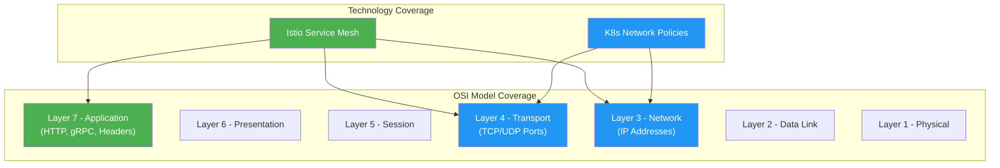
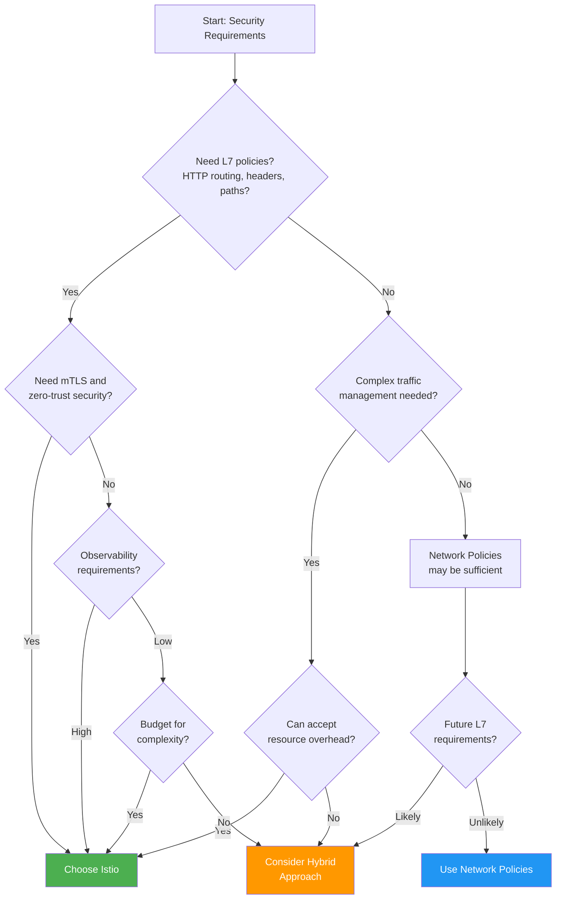
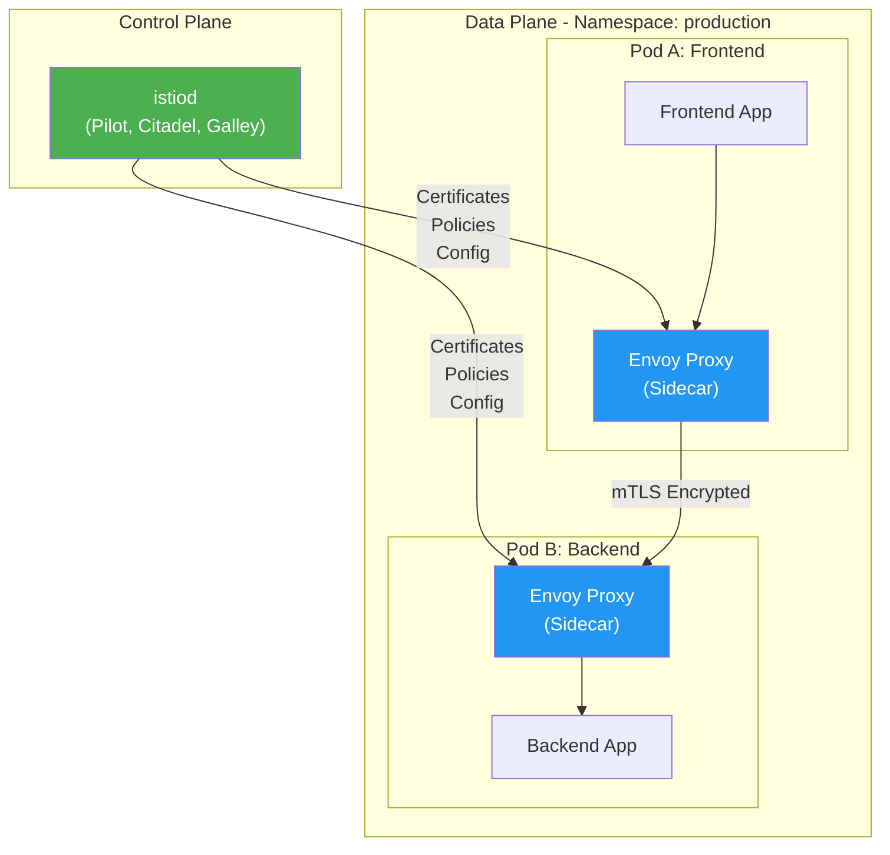
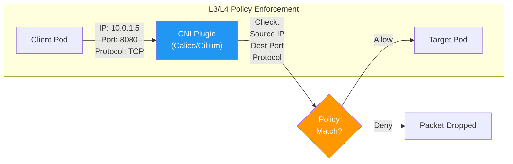
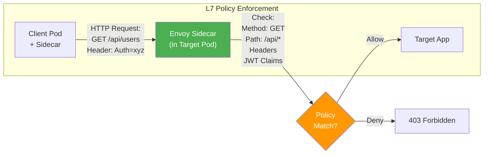
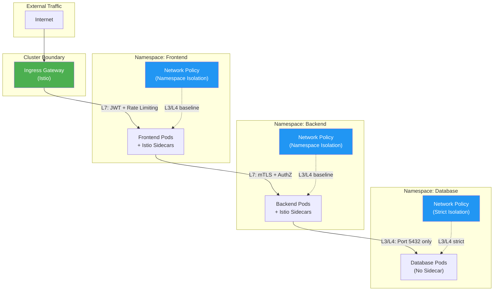
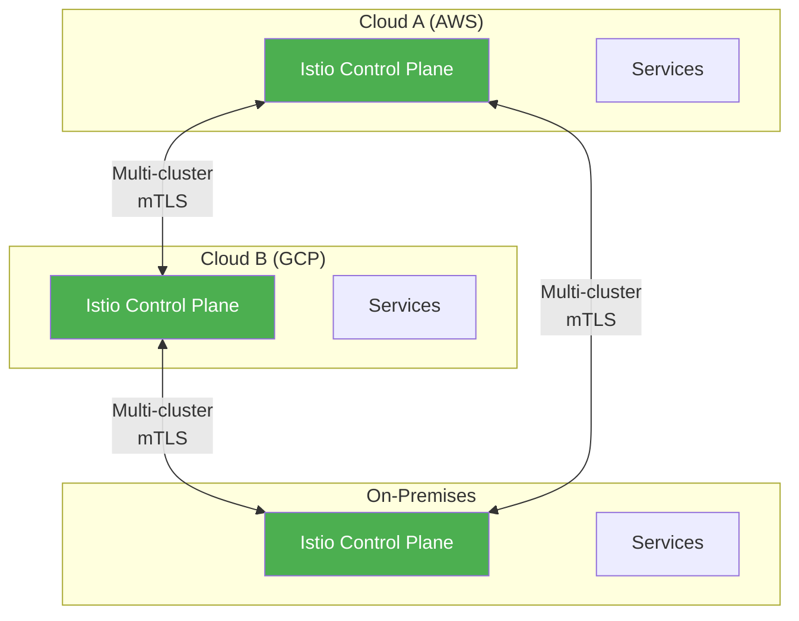

# How to Choose Between Kubernetes Network Policies and Istio

Author: [nawazdhandala](https://github.com/nawazdhandala)

Tags: Istio, Network Policies, Kubernetes, Security, Service Mesh

Description: A comparison guide for choosing between Kubernetes Network Policies and Istio for traffic control.

---

When securing microservices in Kubernetes, two primary approaches dominate the landscape: native Kubernetes Network Policies and Istio's service mesh capabilities. This comprehensive guide will help you understand the strengths, limitations, and ideal use cases for each approach, enabling you to make an informed decision for your infrastructure.

## Understanding the Fundamentals

Before diving into comparisons, let's establish a clear understanding of what each technology offers and at which layer of the network stack they operate.

### Kubernetes Network Policies: L3/L4 Security

Kubernetes Network Policies operate at Layer 3 (IP) and Layer 4 (TCP/UDP) of the OSI model. They provide a firewall-like mechanism for controlling traffic flow between pods, namespaces, and external endpoints based on IP addresses, ports, and protocols.

### Istio: L7 Security with Service Mesh

Istio operates primarily at Layer 7 (Application), providing deep inspection of HTTP, gRPC, and other application-layer protocols. It uses sidecar proxies (Envoy) to intercept and manage all traffic, enabling sophisticated security policies based on request content, headers, and identity.

## Visual Comparison: OSI Layer Coverage

The following diagram illustrates where each technology operates in the network stack:



## Capabilities Comparison

### Feature Matrix

| Feature | Network Policies | Istio |
|---------|-----------------|-------|
| **Layer 3/4 Filtering** | Yes | Yes |
| **Layer 7 Filtering** | No | Yes |
| **mTLS (Mutual TLS)** | No | Yes |
| **Traffic Encryption** | No | Yes (automatic) |
| **Identity-Based Policies** | Limited (namespace/pod labels) | Yes (SPIFFE identities) |
| **Rate Limiting** | No | Yes |
| **Retries & Timeouts** | No | Yes |
| **Circuit Breaking** | No | Yes |
| **Request Routing** | No | Yes |
| **Observability** | Limited | Comprehensive |
| **Resource Overhead** | Minimal | Moderate to High |
| **Complexity** | Low | High |
| **CNI Dependency** | Yes | Optional |

## Decision Flow Chart

Use this flowchart to help determine which approach best fits your needs:



## Kubernetes Network Policies: Deep Dive

### When to Use Network Policies

Network Policies are ideal when you need:

1. **Simple ingress/egress controls** based on IP and port
2. **Namespace isolation** for multi-tenant clusters
3. **Minimal resource overhead** in resource-constrained environments
4. **Quick implementation** without complex infrastructure changes
5. **Compliance requirements** that specify network segmentation

### Basic Network Policy Example

The following policy demonstrates how to restrict ingress traffic to a backend service. This policy allows traffic only from pods with the label `app: frontend` on port 8080.

```yaml
# network-policy-backend.yaml
# This policy restricts access to backend pods, allowing only frontend pods
# to communicate on port 8080. All other ingress traffic is denied by default.
apiVersion: networking.k8s.io/v1
kind: NetworkPolicy
metadata:
  name: backend-ingress-policy
  namespace: production
  # Labels help with policy organization and discovery
  labels:
    app.kubernetes.io/name: backend
    app.kubernetes.io/component: network-policy
spec:
  # Target pods: This policy applies to all pods with label app=backend
  podSelector:
    matchLabels:
      app: backend

  # Policy types: We're only defining ingress rules here
  # If egress is not specified, all egress traffic is allowed
  policyTypes:
    - Ingress

  # Ingress rules: Define who can access the backend pods
  ingress:
    # Rule 1: Allow traffic from frontend pods on port 8080
    - from:
        # Pod selector: Match pods with app=frontend label
        - podSelector:
            matchLabels:
              app: frontend
        # Namespace selector: Only from the same namespace (production)
        # Omitting this would restrict to same namespace by default
      ports:
        # Allow TCP traffic on port 8080 (the backend API port)
        - protocol: TCP
          port: 8080
```

### Namespace Isolation Policy

This policy implements default-deny for a namespace, a common security baseline that ensures all traffic must be explicitly allowed.

```yaml
# namespace-isolation.yaml
# This policy creates a default-deny rule for all pods in the namespace.
# After applying this, you must explicitly allow any desired traffic.
apiVersion: networking.k8s.io/v1
kind: NetworkPolicy
metadata:
  name: default-deny-all
  namespace: secure-namespace
spec:
  # Empty podSelector means this applies to ALL pods in the namespace
  podSelector: {}

  # Define both ingress and egress policy types
  # With empty rules, this denies all traffic by default
  policyTypes:
    - Ingress
    - Egress

  # No ingress rules = deny all incoming traffic
  ingress: []

  # No egress rules = deny all outgoing traffic
  egress: []
---
# After applying default-deny, selectively allow necessary traffic
# This policy allows DNS queries (required for service discovery)
apiVersion: networking.k8s.io/v1
kind: NetworkPolicy
metadata:
  name: allow-dns-egress
  namespace: secure-namespace
spec:
  # Apply to all pods in the namespace
  podSelector: {}

  policyTypes:
    - Egress

  egress:
    # Allow DNS queries to kube-dns/CoreDNS
    - to:
        - namespaceSelector:
            matchLabels:
              kubernetes.io/metadata.name: kube-system
          podSelector:
            matchLabels:
              k8s-app: kube-dns
      ports:
        # DNS uses both UDP and TCP on port 53
        - protocol: UDP
          port: 53
        - protocol: TCP
          port: 53
```

### Egress Control Example

Controlling outbound traffic is crucial for preventing data exfiltration and limiting blast radius in case of compromise.

```yaml
# egress-control.yaml
# This policy restricts egress traffic from backend pods to only
# specific internal services and external HTTPS endpoints.
apiVersion: networking.k8s.io/v1
kind: NetworkPolicy
metadata:
  name: backend-egress-policy
  namespace: production
spec:
  podSelector:
    matchLabels:
      app: backend

  policyTypes:
    - Egress

  egress:
    # Rule 1: Allow traffic to the database pods
    - to:
        - podSelector:
            matchLabels:
              app: postgres
      ports:
        - protocol: TCP
          port: 5432

    # Rule 2: Allow traffic to Redis cache
    - to:
        - podSelector:
            matchLabels:
              app: redis
      ports:
        - protocol: TCP
          port: 6379

    # Rule 3: Allow external HTTPS traffic (e.g., for API calls)
    # Using ipBlock for external endpoints
    - to:
        - ipBlock:
            # Allow all external IPs
            cidr: 0.0.0.0/0
            # Except internal cluster and private networks
            except:
              - 10.0.0.0/8
              - 172.16.0.0/12
              - 192.168.0.0/16
      ports:
        - protocol: TCP
          port: 443
```

## Istio: Deep Dive

### When to Use Istio

Istio is the right choice when you need:

1. **L7 traffic policies** based on HTTP methods, paths, or headers
2. **Automatic mTLS** for zero-trust security
3. **Advanced traffic management** (canary, blue-green, A/B testing)
4. **Comprehensive observability** without code changes
5. **Service-to-service authentication** using strong identities
6. **Rate limiting and circuit breaking** for resilience

### Istio Architecture for Security



### Istio Authorization Policy Example

The following policy demonstrates L7 traffic control, restricting access to specific HTTP paths and methods.

```yaml
# istio-authz-policy.yaml
# This AuthorizationPolicy restricts access to the backend service
# based on source identity, HTTP methods, and paths.
apiVersion: security.istio.io/v1
kind: AuthorizationPolicy
metadata:
  name: backend-authz
  namespace: production
spec:
  # Apply this policy to workloads with the app=backend label
  selector:
    matchLabels:
      app: backend

  # Action can be ALLOW, DENY, AUDIT, or CUSTOM
  # ALLOW: Only matching requests are allowed (implicit deny for others)
  action: ALLOW

  rules:
    # Rule 1: Allow frontend to access all endpoints
    - from:
        # Source principals are SPIFFE identities
        # Format: cluster.local/ns/<namespace>/sa/<service-account>
        - source:
            principals:
              - "cluster.local/ns/production/sa/frontend-sa"
      to:
        - operation:
            # Allow GET, POST, PUT methods
            methods: ["GET", "POST", "PUT"]
            # Allow access to /api/* paths
            paths: ["/api/*"]

    # Rule 2: Allow monitoring service read-only access
    - from:
        - source:
            principals:
              - "cluster.local/ns/monitoring/sa/prometheus-sa"
      to:
        - operation:
            # Monitoring only needs GET for metrics
            methods: ["GET"]
            # Only allow access to metrics and health endpoints
            paths: ["/metrics", "/health", "/ready"]

    # Rule 3: Allow admin access with JWT validation
    - from:
        - source:
            # Require requests to have a valid JWT with admin claim
            requestPrincipals: ["*"]
      to:
        - operation:
            methods: ["GET", "POST", "PUT", "DELETE"]
            paths: ["/admin/*"]
      when:
        # Additional condition: JWT must have admin role
        - key: request.auth.claims[role]
          values: ["admin"]
```

### PeerAuthentication for mTLS

This policy configures mutual TLS requirements for service-to-service communication.

```yaml
# peer-authentication.yaml
# This PeerAuthentication policy enforces strict mTLS for all services
# in the production namespace, ensuring encrypted and authenticated
# communication between services.
apiVersion: security.istio.io/v1
kind: PeerAuthentication
metadata:
  name: default-mtls
  namespace: production
spec:
  # Empty selector applies to all workloads in the namespace
  selector: {}

  # mTLS mode options:
  # - DISABLE: No mTLS, plaintext traffic only
  # - PERMISSIVE: Accept both mTLS and plaintext (for migration)
  # - STRICT: Only accept mTLS connections (production recommended)
  mtls:
    mode: STRICT
---
# Override for specific workloads that need different settings
# For example, a service that receives traffic from non-mesh sources
apiVersion: security.istio.io/v1
kind: PeerAuthentication
metadata:
  name: legacy-service-mtls
  namespace: production
spec:
  selector:
    matchLabels:
      app: legacy-service

  mtls:
    # PERMISSIVE mode during migration from non-mesh services
    mode: PERMISSIVE

  # Port-specific overrides
  portLevelMtls:
    # Metrics port must be accessible from non-mesh monitoring
    9090:
      mode: DISABLE
    # API port should use mTLS
    8080:
      mode: STRICT
```

### Request Authentication with JWT

Configure JWT validation for incoming requests.

```yaml
# request-authentication.yaml
# This RequestAuthentication policy validates JWT tokens for
# incoming requests to the backend service. It defines which
# JWTs are accepted and how they should be validated.
apiVersion: security.istio.io/v1
kind: RequestAuthentication
metadata:
  name: backend-jwt-auth
  namespace: production
spec:
  selector:
    matchLabels:
      app: backend

  jwtRules:
    # Rule 1: Accept JWTs from our primary identity provider
    - issuer: "https://auth.example.com"
      # JWKS URI for public key retrieval
      jwksUri: "https://auth.example.com/.well-known/jwks.json"
      # Where to look for the JWT in the request
      # Default is Authorization header with Bearer prefix
      fromHeaders:
        - name: Authorization
          prefix: "Bearer "
      # Also accept JWT from cookie (for web applications)
      fromCookies:
        - "session-token"
      # Forward the original token to the application
      forwardOriginalToken: true

    # Rule 2: Accept JWTs from external partner
    - issuer: "https://partner.example.com"
      jwksUri: "https://partner.example.com/.well-known/jwks.json"
      # Restrict to specific audiences
      audiences:
        - "backend-api"
        - "partner-integration"
```

## L3/L4 vs L7 Policy Comparison

Understanding when to use each layer of policy is crucial for effective security architecture.

### L3/L4 Policies (Network Policies)



**What L3/L4 Policies Can See:**
- Source and destination IP addresses
- Source and destination ports
- Protocol (TCP, UDP, SCTP)
- Pod labels and namespace (via selectors)

**What L3/L4 Policies Cannot See:**
- HTTP methods (GET, POST, etc.)
- URL paths (/api/users)
- HTTP headers
- Request body content
- TLS-encrypted payload

### L7 Policies (Istio)



**What L7 Policies Can See:**
- Everything L3/L4 can see, plus:
- HTTP methods and paths
- HTTP headers and query parameters
- gRPC service names and methods
- JWT claims and authentication data
- Request and response bodies (for custom filters)

### Practical Comparison Example

Consider securing an e-commerce API. Here's how both approaches would handle the same security requirement:

**Requirement:** Only allow the `checkout` service to access the `payment` service's `/process` endpoint.

Network Policy approach (L3/L4 only):

```yaml
# network-policy-payment.yaml
# This Network Policy allows checkout to reach payment on port 8080
# LIMITATION: Cannot restrict to specific endpoints like /process
# Any traffic from checkout to payment:8080 is allowed
apiVersion: networking.k8s.io/v1
kind: NetworkPolicy
metadata:
  name: payment-from-checkout
  namespace: production
spec:
  podSelector:
    matchLabels:
      app: payment

  policyTypes:
    - Ingress

  ingress:
    # This allows ALL traffic from checkout to payment:8080
    # We cannot specify that only /process is allowed
    - from:
        - podSelector:
            matchLabels:
              app: checkout
      ports:
        - protocol: TCP
          port: 8080
```

Istio AuthorizationPolicy approach (L7):

```yaml
# istio-authz-payment.yaml
# This Istio policy precisely restricts checkout to only the /process endpoint
# It also limits HTTP methods and requires specific headers
apiVersion: security.istio.io/v1
kind: AuthorizationPolicy
metadata:
  name: payment-from-checkout
  namespace: production
spec:
  selector:
    matchLabels:
      app: payment

  action: ALLOW

  rules:
    - from:
        - source:
            # Verify the service identity, not just network location
            principals:
              - "cluster.local/ns/production/sa/checkout-sa"
      to:
        - operation:
            # Only POST method for payment processing
            methods: ["POST"]
            # Only the /process endpoint, not /refund or /admin
            paths: ["/process"]
      when:
        # Additional security: require idempotency key header
        - key: request.headers[x-idempotency-key]
          notValues: [""]
```

## Hybrid Deployment Strategies

For many organizations, the optimal approach combines both technologies to leverage their respective strengths.

### Architecture: Defense in Depth



### Implementing the Hybrid Approach

**Step 1: Baseline with Network Policies**

Establish network segmentation as the foundation.

```yaml
# baseline-network-policies.yaml
# Step 1: Create namespace isolation as the security foundation
# This provides L3/L4 protection regardless of Istio configuration

# Default deny in frontend namespace
apiVersion: networking.k8s.io/v1
kind: NetworkPolicy
metadata:
  name: default-deny
  namespace: frontend
spec:
  podSelector: {}
  policyTypes:
    - Ingress
    - Egress
  ingress: []
  egress: []
---
# Allow frontend to receive traffic from Istio ingress gateway
apiVersion: networking.k8s.io/v1
kind: NetworkPolicy
metadata:
  name: allow-from-ingress
  namespace: frontend
spec:
  podSelector:
    matchLabels:
      app: frontend
  policyTypes:
    - Ingress
  ingress:
    - from:
        # Istio ingress gateway runs in istio-system namespace
        - namespaceSelector:
            matchLabels:
              kubernetes.io/metadata.name: istio-system
          podSelector:
            matchLabels:
              istio: ingressgateway
---
# Allow frontend to call backend services
apiVersion: networking.k8s.io/v1
kind: NetworkPolicy
metadata:
  name: allow-to-backend
  namespace: frontend
spec:
  podSelector:
    matchLabels:
      app: frontend
  policyTypes:
    - Egress
  egress:
    # Allow to backend namespace
    - to:
        - namespaceSelector:
            matchLabels:
              kubernetes.io/metadata.name: backend
      ports:
        - protocol: TCP
          port: 8080
    # Allow DNS
    - to:
        - namespaceSelector:
            matchLabels:
              kubernetes.io/metadata.name: kube-system
      ports:
        - protocol: UDP
          port: 53
    # Allow to istiod for xDS updates
    - to:
        - namespaceSelector:
            matchLabels:
              kubernetes.io/metadata.name: istio-system
      ports:
        - protocol: TCP
          port: 15012
```

**Step 2: Layer Istio for L7 Security**

Add fine-grained L7 controls on top of network policies.

```yaml
# istio-l7-layer.yaml
# Step 2: Add L7 security with Istio on top of Network Policies
# This provides defense-in-depth with both L3/L4 and L7 controls

# Enforce mTLS across all namespaces
apiVersion: security.istio.io/v1
kind: PeerAuthentication
metadata:
  name: mesh-wide-mtls
  namespace: istio-system
spec:
  # Applies to entire mesh when in istio-system with no selector
  mtls:
    mode: STRICT
---
# L7 authorization for frontend service
apiVersion: security.istio.io/v1
kind: AuthorizationPolicy
metadata:
  name: frontend-authz
  namespace: frontend
spec:
  selector:
    matchLabels:
      app: frontend
  action: ALLOW
  rules:
    # Allow ingress gateway to access frontend
    - from:
        - source:
            principals:
              - "cluster.local/ns/istio-system/sa/istio-ingressgateway-service-account"
      to:
        - operation:
            methods: ["GET", "POST", "PUT", "DELETE"]
            paths: ["/*"]
---
# L7 authorization for backend service with path-based rules
apiVersion: security.istio.io/v1
kind: AuthorizationPolicy
metadata:
  name: backend-authz
  namespace: backend
spec:
  selector:
    matchLabels:
      app: backend
  action: ALLOW
  rules:
    # Frontend can access public API endpoints
    - from:
        - source:
            principals:
              - "cluster.local/ns/frontend/sa/frontend-sa"
      to:
        - operation:
            methods: ["GET", "POST"]
            paths: ["/api/v1/*"]

    # Only admin service can access admin endpoints
    - from:
        - source:
            principals:
              - "cluster.local/ns/admin/sa/admin-sa"
      to:
        - operation:
            methods: ["GET", "POST", "PUT", "DELETE"]
            paths: ["/admin/*"]
```

**Step 3: Protect Non-Mesh Workloads**

Some workloads like databases often run without Istio sidecars. Protect them with Network Policies.

```yaml
# database-protection.yaml
# Step 3: Protect non-mesh workloads with strict Network Policies
# Databases often run without sidecars for performance reasons

apiVersion: networking.k8s.io/v1
kind: NetworkPolicy
metadata:
  name: postgres-isolation
  namespace: database
spec:
  podSelector:
    matchLabels:
      app: postgres

  policyTypes:
    - Ingress
    - Egress

  ingress:
    # Only allow backend service to connect
    - from:
        - namespaceSelector:
            matchLabels:
              kubernetes.io/metadata.name: backend
          podSelector:
            matchLabels:
              app: backend
      ports:
        # PostgreSQL port
        - protocol: TCP
          port: 5432

  egress:
    # Postgres only needs to respond, but allow DNS for hostname resolution
    - to:
        - namespaceSelector:
            matchLabels:
              kubernetes.io/metadata.name: kube-system
      ports:
        - protocol: UDP
          port: 53

    # Allow replication to standby (if applicable)
    - to:
        - podSelector:
            matchLabels:
              app: postgres
              role: standby
      ports:
        - protocol: TCP
          port: 5432
```

## Use Cases and Recommendations

### Use Case 1: Simple Microservices with Basic Security

**Scenario:** A small team running 5-10 microservices with basic isolation needs.

**Recommendation:** Start with Network Policies

```yaml
# simple-isolation.yaml
# For simple deployments, Network Policies provide adequate security
# with minimal operational overhead

# Namespace isolation pattern
apiVersion: networking.k8s.io/v1
kind: NetworkPolicy
metadata:
  name: namespace-isolation
  namespace: production
spec:
  podSelector: {}
  policyTypes:
    - Ingress
  ingress:
    # Allow traffic only from same namespace
    - from:
        - podSelector: {}
    # Allow from ingress namespace
    - from:
        - namespaceSelector:
            matchLabels:
              purpose: ingress
```

### Use Case 2: Zero-Trust Security Requirements

**Scenario:** Financial services or healthcare with strict compliance requirements.

**Recommendation:** Full Istio Implementation

```yaml
# zero-trust-config.yaml
# Zero-trust requires strong identity, encryption, and L7 policies
# This is where Istio excels

# Strict mTLS everywhere
apiVersion: security.istio.io/v1
kind: PeerAuthentication
metadata:
  name: strict-mtls
  namespace: istio-system
spec:
  mtls:
    mode: STRICT
---
# Deny all by default at L7
apiVersion: security.istio.io/v1
kind: AuthorizationPolicy
metadata:
  name: deny-all
  namespace: production
spec:
  # Empty spec = deny all traffic
  {}
---
# Explicitly allow only necessary communication
apiVersion: security.istio.io/v1
kind: AuthorizationPolicy
metadata:
  name: allow-frontend-to-api
  namespace: production
spec:
  selector:
    matchLabels:
      app: api-gateway
  action: ALLOW
  rules:
    - from:
        - source:
            principals:
              - "cluster.local/ns/production/sa/frontend-sa"
      to:
        - operation:
            methods: ["GET", "POST"]
            paths: ["/api/v1/*"]
      when:
        # Require valid JWT
        - key: request.auth.claims[iss]
          values: ["https://auth.company.com"]
```

### Use Case 3: Gradual Migration to Service Mesh

**Scenario:** Large legacy application migrating to microservices.

**Recommendation:** Hybrid approach with gradual Istio adoption

```yaml
# migration-strategy.yaml
# Start with Network Policies, gradually add Istio to new services
# Use permissive mTLS during transition

# Phase 1: Network Policies for all services
apiVersion: networking.k8s.io/v1
kind: NetworkPolicy
metadata:
  name: legacy-app-policy
  namespace: legacy
spec:
  podSelector:
    matchLabels:
      app: legacy-monolith
  policyTypes:
    - Ingress
  ingress:
    - from:
        - namespaceSelector:
            matchLabels:
              tier: frontend
      ports:
        - protocol: TCP
          port: 8080
---
# Phase 2: Add Istio sidecars to new services with permissive mode
apiVersion: security.istio.io/v1
kind: PeerAuthentication
metadata:
  name: permissive-during-migration
  namespace: new-services
spec:
  mtls:
    # Accept both mTLS and plaintext during migration
    mode: PERMISSIVE
---
# Phase 3: Enable strict mTLS for fully migrated namespaces
apiVersion: security.istio.io/v1
kind: PeerAuthentication
metadata:
  name: strict-after-migration
  namespace: migrated-services
spec:
  mtls:
    mode: STRICT
```

### Use Case 4: Multi-Cloud or Hybrid Cloud

**Scenario:** Services running across multiple clouds or on-premises.

**Recommendation:** Istio for consistent policy across environments



## Performance Considerations

Understanding the performance implications of each approach is essential for production deployments.

### Network Policies Performance

- **Latency Impact:** Minimal (handled by kernel/eBPF)
- **CPU Overhead:** Negligible
- **Memory Overhead:** Low (policy rules stored in kernel)
- **Scalability:** Excellent (CNI-dependent)

### Istio Performance

- **Latency Impact:** ~1-3ms per hop (due to sidecar proxy)
- **CPU Overhead:** Moderate (each sidecar consumes CPU)
- **Memory Overhead:** ~50-100MB per sidecar
- **Scalability:** Good (but requires capacity planning)

```yaml
# istio-resource-tuning.yaml
# Production Istio deployments should tune sidecar resources
# based on actual traffic patterns

apiVersion: install.istio.io/v1alpha1
kind: IstioOperator
metadata:
  name: production-istio
spec:
  meshConfig:
    # Tune Envoy resources
    defaultConfig:
      # Limit concurrent connections
      concurrency: 2
      # Enable access logging (with sampling for high-traffic)
      accessLogFile: /dev/stdout
      accessLogEncoding: JSON

  values:
    global:
      proxy:
        # Set resource limits for sidecars
        resources:
          requests:
            cpu: 100m
            memory: 128Mi
          limits:
            cpu: 500m
            memory: 256Mi
---
# Per-workload resource override for high-traffic services
apiVersion: v1
kind: Pod
metadata:
  name: high-traffic-service
  annotations:
    # Override default sidecar resources
    sidecar.istio.io/proxyCPU: "500m"
    sidecar.istio.io/proxyMemory: "512Mi"
    sidecar.istio.io/proxyCPULimit: "2000m"
    sidecar.istio.io/proxyMemoryLimit: "1Gi"
spec:
  containers:
    - name: app
      image: high-traffic-app:latest
```

## Troubleshooting Common Issues

### Network Policy Issues

```bash
# Verify CNI supports Network Policies
# (Not all CNIs implement NetworkPolicy - check your CNI documentation)
kubectl get pods -n kube-system -l k8s-app=calico-node

# Check if policies are applied
kubectl get networkpolicies -n production

# Debug connectivity issues
# Create a debug pod to test connections
kubectl run debug-pod --image=busybox --rm -it --restart=Never -- /bin/sh
# From inside the pod:
# wget -qO- --timeout=2 http://backend-service:8080/health

# View policy details
kubectl describe networkpolicy backend-ingress-policy -n production
```

### Istio Issues

```bash
# Check if sidecars are injected
kubectl get pods -n production -o jsonpath='{.items[*].spec.containers[*].name}' | tr ' ' '\n' | grep istio-proxy

# Verify mTLS status
istioctl x authz check pod/backend-deployment-xxx -n production

# Check authorization policy matching
istioctl experimental authz check pod/backend-pod -n production

# View Envoy configuration
istioctl proxy-config listener pod/backend-pod -n production

# Debug TLS issues
istioctl proxy-config secret pod/backend-pod -n production

# Check if policies are properly propagated
istioctl analyze -n production
```

## Summary and Decision Matrix

```mermaid
quadrantChart
    title Technology Selection Based on Requirements
    x-axis Low Complexity --> High Complexity
    y-axis Basic Security --> Advanced Security
    quadrant-1 Istio (Full Service Mesh)
    quadrant-2 Hybrid Approach
    quadrant-3 Network Policies Only
    quadrant-4 Start with Network Policies, Plan for Istio

    "Simple microservices": [0.2, 0.3]
    "Multi-tenant clusters": [0.4, 0.5]
    "Zero-trust requirements": [0.7, 0.9]
    "Regulated industries": [0.6, 0.85]
    "Edge/IoT deployments": [0.3, 0.4]
    "Enterprise microservices": [0.8, 0.7]
    "API gateway patterns": [0.5, 0.6]
    "Legacy modernization": [0.6, 0.5]
```

### Quick Decision Guide

| Your Situation | Recommended Approach |
|----------------|---------------------|
| Small team, simple services | Network Policies |
| Need L7 traffic control | Istio |
| Zero-trust security requirements | Istio |
| Resource-constrained environment | Network Policies |
| Multi-cloud deployment | Istio |
| Gradual modernization | Hybrid (start with Network Policies) |
| Already using service mesh | Istio |
| Compliance requirements (PCI, HIPAA) | Hybrid or Istio |

## Conclusion

Choosing between Kubernetes Network Policies and Istio depends on your specific security requirements, operational capabilities, and resource constraints.

**Choose Network Policies when:**
- You need basic L3/L4 network segmentation
- Resource overhead is a primary concern
- Your team is new to Kubernetes security
- You have simple service-to-service communication patterns

**Choose Istio when:**
- You need L7 traffic control and inspection
- Zero-trust security with automatic mTLS is required
- You need advanced traffic management (canary, retries, circuit breaking)
- Comprehensive observability is a priority

**Choose a Hybrid Approach when:**
- You're migrating from monolith to microservices
- You have mixed workloads (some with sidecars, some without)
- You want defense-in-depth with multiple security layers
- Different parts of your application have different security requirements

Remember that these technologies are not mutually exclusive. The hybrid approach, using Network Policies as a baseline with Istio for L7 controls, often provides the best balance of security, performance, and operational simplicity for production environments.
