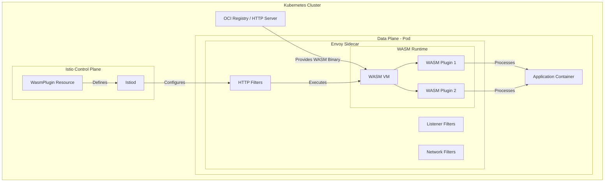
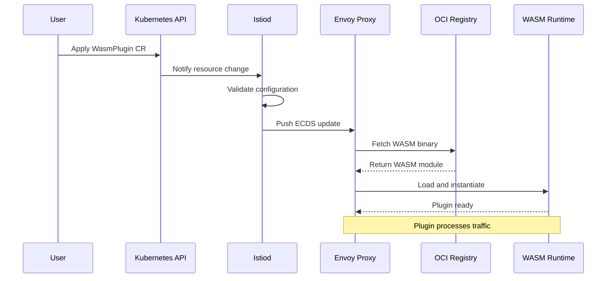
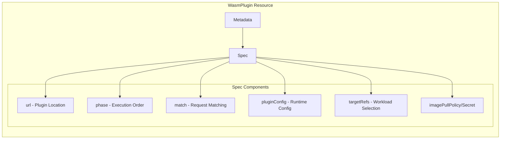
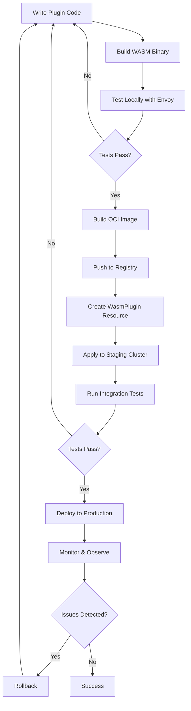
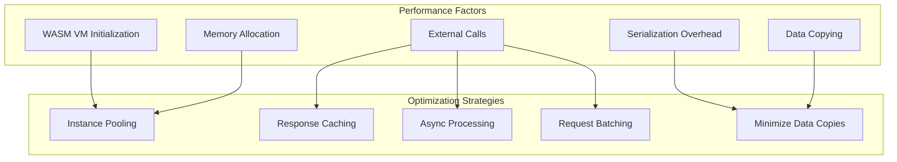
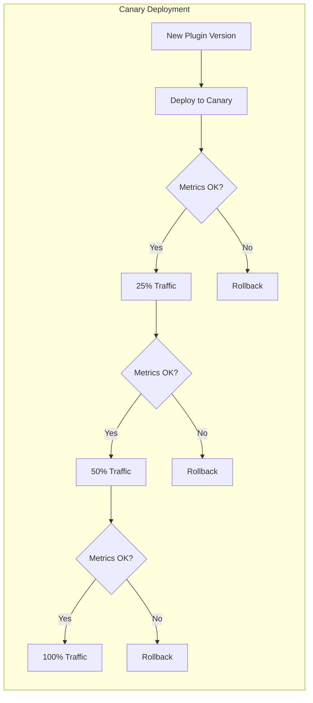

# How to Extend Istio with WebAssembly (WASM) Plugins

Author: [nawazdhandala](https://github.com/nawazdhandala)

Tags: Istio, WASM, WebAssembly, Plugins, Service Mesh, Extensibility

Description: A guide to building and deploying WebAssembly plugins for Istio.

---

Istio's extensibility model has evolved significantly, and WebAssembly (WASM) plugins represent the modern approach to customizing Envoy proxy behavior within the service mesh. This comprehensive guide covers everything you need to know about developing, deploying, and managing WASM plugins in Istio.

## Table of Contents

1. [Understanding WASM in Istio](#understanding-wasm-in-istio)
2. [WASM Plugin Architecture](#wasm-plugin-architecture)
3. [Development Environment Setup](#development-environment-setup)
4. [Building Your First WASM Plugin](#building-your-first-wasm-plugin)
5. [The WasmPlugin Resource](#the-wasmplugin-resource)
6. [Deploying WASM Plugins](#deploying-wasm-plugins)
7. [Advanced Plugin Patterns](#advanced-plugin-patterns)
8. [Performance Considerations](#performance-considerations)
9. [Debugging and Troubleshooting](#debugging-and-troubleshooting)
10. [Production Best Practices](#production-best-practices)

## Understanding WASM in Istio

WebAssembly provides a sandboxed, portable runtime that allows you to extend Envoy proxy functionality without recompiling the proxy itself. WASM plugins can intercept and modify HTTP requests and responses, implement custom authentication, add observability features, and much more.

### Why WASM Plugins?

- **Language Flexibility**: Write plugins in Rust, Go, C++, or AssemblyScript
- **Safe Sandboxing**: Plugins run in isolated memory spaces
- **Dynamic Loading**: Deploy and update plugins without restarting proxies
- **Portable**: Same plugin binary works across different Envoy versions
- **Performance**: Near-native execution speed

## WASM Plugin Architecture

The following diagram illustrates how WASM plugins integrate with Istio's architecture:



### WASM Plugin Lifecycle



## Development Environment Setup

### Prerequisites

Before you begin developing WASM plugins, ensure you have the following tools installed:

- Rust toolchain (for Rust-based plugins)
- Go 1.21+ (for TinyGo-based plugins)
- Docker (for building and pushing images)
- kubectl and a Kubernetes cluster with Istio installed
- wasme CLI or proxy-wasm SDK

The following commands install the Rust toolchain with the WebAssembly target:

```bash
# Install Rust using rustup
curl --proto '=https' --tlsv1.2 -sSf https://sh.rustup.rs | sh

# Add the WebAssembly target for compilation
rustup target add wasm32-unknown-unknown

# Install wasm-pack for building and packaging WASM modules
cargo install wasm-pack
```

For Go-based development, install TinyGo which compiles Go to WASM:

```bash
# Install TinyGo on macOS using Homebrew
brew install tinygo

# Verify the installation and check WASM support
tinygo version
```

### Project Structure

A well-organized WASM plugin project follows this structure. The separation of concerns helps maintain clean code and simplifies the build process:

```
my-wasm-plugin/
├── Cargo.toml          # Rust dependencies and metadata
├── src/
│   ├── lib.rs          # Main plugin implementation
│   └── config.rs       # Configuration handling
├── Dockerfile          # Container build instructions
├── plugin.yaml         # WasmPlugin Kubernetes manifest
└── README.md           # Documentation
```

## Building Your First WASM Plugin

Let's create a practical WASM plugin that adds custom headers to HTTP responses. This example demonstrates the core concepts of the proxy-wasm SDK.

### Rust Plugin Implementation

First, create the Cargo.toml file which defines project dependencies. The proxy-wasm crate provides the SDK for interacting with Envoy:

```toml
# Cargo.toml - Project configuration for our WASM plugin
[package]
name = "custom-header-plugin"
version = "0.1.0"
edition = "2021"

# Compile as a dynamic library suitable for WASM
[lib]
crate-type = ["cdylib"]

[dependencies]
# The proxy-wasm SDK provides all necessary traits and functions
# for building Envoy-compatible WASM plugins
proxy-wasm = "0.2"

# Serde is used for parsing JSON configuration
serde = { version = "1.0", features = ["derive"] }
serde_json = "1.0"

# Log provides structured logging capabilities
log = "0.4"
```

Now implement the plugin logic in src/lib.rs. This code demonstrates the three main components: root context, HTTP context, and configuration handling:

```rust
// src/lib.rs - Custom Header WASM Plugin for Istio/Envoy
//
// This plugin demonstrates how to:
// 1. Parse configuration from the WasmPlugin resource
// 2. Intercept HTTP responses
// 3. Add custom headers to responses

use proxy_wasm::traits::*;
use proxy_wasm::types::*;
use serde::Deserialize;
use std::time::Duration;

// Configuration structure that matches the JSON passed via WasmPlugin
// This allows operators to customize plugin behavior without code changes
#[derive(Deserialize, Clone)]
struct PluginConfig {
    // The name of the header to add to responses
    header_name: String,
    // The value to set for the header
    header_value: String,
    // Optional: only add header for specific response codes
    #[serde(default)]
    response_codes: Vec<u32>,
}

// Entry point for the WASM module
// This macro registers our RootContext factory with the proxy-wasm runtime
proxy_wasm::main! {{
    // Set the log level for debugging - adjust in production
    proxy_wasm::set_log_level(LogLevel::Info);

    // Register the root context factory
    // The root context handles plugin lifecycle and configuration
    proxy_wasm::set_root_context(|_| -> Box<dyn RootContext> {
        Box::new(CustomHeaderRoot {
            config: None,
        })
    });
}}

// RootContext manages the plugin's lifecycle
// It's created once per worker thread and handles configuration updates
struct CustomHeaderRoot {
    config: Option<PluginConfig>,
}

impl Context for CustomHeaderRoot {}

impl RootContext for CustomHeaderRoot {
    // Called when the plugin receives new configuration
    // This happens at startup and whenever the WasmPlugin is updated
    fn on_configure(&mut self, _plugin_configuration_size: usize) -> bool {
        // Retrieve the configuration bytes from the host (Envoy)
        if let Some(config_bytes) = self.get_plugin_configuration() {
            // Parse the JSON configuration into our struct
            match serde_json::from_slice::<PluginConfig>(&config_bytes) {
                Ok(config) => {
                    log::info!(
                        "Plugin configured: header_name={}, header_value={}",
                        config.header_name,
                        config.header_value
                    );
                    self.config = Some(config);
                    return true;
                }
                Err(e) => {
                    log::error!("Failed to parse configuration: {:?}", e);
                    return false;
                }
            }
        }

        // Return false if no configuration is provided
        // This will prevent the plugin from processing traffic
        log::error!("No configuration provided");
        false
    }

    // Called to create a new HTTP context for each request
    // Each HTTP stream gets its own context instance
    fn create_http_context(&self, _context_id: u32) -> Option<Box<dyn HttpContext>> {
        // Clone the configuration for the HTTP context
        // This ensures thread-safe access to configuration
        Some(Box::new(CustomHeaderFilter {
            config: self.config.clone()?,
        }))
    }

    // Specify that this plugin operates on HTTP traffic
    fn get_type(&self) -> Option<ContextType> {
        Some(ContextType::HttpContext)
    }
}

// HttpContext handles individual HTTP requests and responses
// A new instance is created for each HTTP stream
struct CustomHeaderFilter {
    config: PluginConfig,
}

impl Context for CustomHeaderFilter {}

impl HttpContext for CustomHeaderFilter {
    // Called when response headers are received from the upstream service
    // This is where we add our custom header
    fn on_http_response_headers(&mut self, _num_headers: usize, _end_of_stream: bool) -> Action {
        // Get the response status code to check if we should add the header
        if let Some(status) = self.get_http_response_header(":status") {
            if let Ok(code) = status.parse::<u32>() {
                // If response_codes is empty, add header to all responses
                // Otherwise, only add header for matching status codes
                if self.config.response_codes.is_empty()
                    || self.config.response_codes.contains(&code) {

                    // Add the custom header to the response
                    self.add_http_response_header(
                        &self.config.header_name,
                        &self.config.header_value,
                    );

                    log::debug!(
                        "Added header {}={} to response with status {}",
                        self.config.header_name,
                        self.config.header_value,
                        code
                    );
                }
            }
        }

        // Continue processing - don't pause the response
        Action::Continue
    }
}
```

### Building the WASM Module

The following build script compiles the Rust code to WASM and optimizes the binary for production:

```bash
#!/bin/bash
# build.sh - Build script for the WASM plugin

# Build the WASM module in release mode for optimal performance
# The wasm32-unknown-unknown target produces a standalone WASM binary
cargo build --target wasm32-unknown-unknown --release

# The compiled WASM file is located in the target directory
WASM_FILE="target/wasm32-unknown-unknown/release/custom_header_plugin.wasm"

# Optional: Use wasm-opt to further optimize the binary size
# This can reduce the file size by 10-20%
if command -v wasm-opt &> /dev/null; then
    wasm-opt -O3 "$WASM_FILE" -o "${WASM_FILE%.wasm}.optimized.wasm"
    echo "Optimized WASM size: $(ls -lh ${WASM_FILE%.wasm}.optimized.wasm | awk '{print $5}')"
fi

echo "Build complete: $WASM_FILE"
echo "WASM size: $(ls -lh $WASM_FILE | awk '{print $5}')"
```

### Creating an OCI Image

Istio can pull WASM modules from OCI registries, which provides versioning and distribution capabilities. Create a Dockerfile to package the WASM binary:

```dockerfile
# Dockerfile - Package WASM plugin as OCI artifact
# This uses the scratch base image since we only need the WASM binary

FROM scratch

# Copy the compiled WASM binary into the image
# The plugin.wasm path is referenced in the WasmPlugin resource
COPY target/wasm32-unknown-unknown/release/custom_header_plugin.wasm /plugin.wasm
```

Build and push the image to your container registry:

```bash
#!/bin/bash
# publish.sh - Build and push the WASM plugin image

# Set your registry and image name
REGISTRY="docker.io/myorg"
IMAGE_NAME="custom-header-plugin"
VERSION="v1.0.0"

# Build the Docker image containing our WASM binary
docker build -t "${REGISTRY}/${IMAGE_NAME}:${VERSION}" .

# Push to the registry
docker push "${REGISTRY}/${IMAGE_NAME}:${VERSION}"

echo "Published: ${REGISTRY}/${IMAGE_NAME}:${VERSION}"
```

## The WasmPlugin Resource

The `WasmPlugin` Custom Resource is Istio's native way to deploy WASM plugins. It provides declarative configuration for plugin deployment, targeting, and runtime behavior.

### WasmPlugin Resource Structure

The following diagram shows the key components of the WasmPlugin resource:



### Basic WasmPlugin Configuration

This example shows a minimal WasmPlugin resource that deploys our custom header plugin:

```yaml
# wasmplugin-basic.yaml
# Basic WasmPlugin deployment targeting all sidecars in a namespace
apiVersion: extensions.istio.io/v1alpha1
kind: WasmPlugin
metadata:
  name: custom-header-plugin
  # The namespace determines the default scope of the plugin
  namespace: istio-system
spec:
  # URL pointing to the WASM binary
  # Supports: oci://, http://, https://, and file:// schemes
  url: oci://docker.io/myorg/custom-header-plugin:v1.0.0

  # Phase determines when this plugin executes in the filter chain
  # AUTHN - Authentication phase (runs first)
  # AUTHZ - Authorization phase
  # STATS - Statistics phase (runs last)
  # UNSPECIFIED - Inserted before router filter (default)
  phase: STATS

  # Plugin configuration passed as JSON to the WASM module
  # This is received by on_configure() in our Rust code
  pluginConfig:
    header_name: "x-custom-header"
    header_value: "processed-by-wasm"
    response_codes: []
```

### Advanced WasmPlugin with Workload Selection

For production deployments, you typically want fine-grained control over which workloads receive the plugin. This example demonstrates using selector and targetRefs:

```yaml
# wasmplugin-targeted.yaml
# WasmPlugin with specific workload targeting and matching rules
apiVersion: extensions.istio.io/v1alpha1
kind: WasmPlugin
metadata:
  name: rate-limit-plugin
  namespace: production
spec:
  # Selector targets pods with matching labels
  # Use this for selecting sidecars in specific deployments
  selector:
    matchLabels:
      app: api-gateway
      version: v2

  # Alternatively, use targetRefs for Gateway API integration
  # This targets a specific Kubernetes Gateway
  # targetRefs:
  # - kind: Gateway
  #   group: gateway.networking.k8s.io
  #   name: main-gateway

  url: oci://docker.io/myorg/rate-limit-plugin:v2.1.0

  # Pull policy for the WASM image
  # IfNotPresent - Only pull if not cached (default)
  # Always - Always pull latest
  imagePullPolicy: IfNotPresent

  # Secret for private registries
  imagePullSecret: registry-credentials

  # SHA256 verification ensures binary integrity
  # Envoy will reject the plugin if the hash doesn't match
  sha256: "abc123def456..."

  phase: AUTHZ

  # Match rules filter which requests the plugin processes
  # This is more efficient than filtering in plugin code
  match:
    # Only process requests with these criteria
    - mode: CLIENT_AND_SERVER  # Apply on both inbound and outbound
      ports:
        - number: 8080
        - number: 443

  pluginConfig:
    requests_per_second: 100
    burst_size: 20
    key_type: "remote_address"
```

### Multi-Phase Plugin Deployment

Some use cases require multiple plugins working together. This example shows coordinated plugin deployment across different phases:

```yaml
# wasmplugin-multi-phase.yaml
# Authentication plugin that runs in AUTHN phase
apiVersion: extensions.istio.io/v1alpha1
kind: WasmPlugin
metadata:
  name: jwt-validator
  namespace: istio-system
spec:
  url: oci://docker.io/myorg/jwt-validator:v1.0.0
  phase: AUTHN
  # Priority within the same phase (lower = earlier)
  # Use this to order multiple plugins in the same phase
  priority: 10
  pluginConfig:
    jwks_uri: "https://auth.example.com/.well-known/jwks.json"
    issuer: "https://auth.example.com"
    audiences: ["api.example.com"]
---
# Authorization plugin that runs after authentication
apiVersion: extensions.istio.io/v1alpha1
kind: WasmPlugin
metadata:
  name: rbac-enforcer
  namespace: istio-system
spec:
  url: oci://docker.io/myorg/rbac-enforcer:v1.0.0
  phase: AUTHZ
  priority: 10
  pluginConfig:
    policy_endpoint: "http://opa.policy:8181/v1/data/authz"
---
# Observability plugin that runs last
apiVersion: extensions.istio.io/v1alpha1
kind: WasmPlugin
metadata:
  name: custom-metrics
  namespace: istio-system
spec:
  url: oci://docker.io/myorg/custom-metrics:v1.0.0
  phase: STATS
  priority: 10
  pluginConfig:
    metrics_prefix: "custom"
    include_headers: ["x-request-id", "x-trace-id"]
```

## Deploying WASM Plugins

### Deployment Workflow

The complete deployment workflow from development to production:



### Local Testing with Envoy

Before deploying to Istio, test your plugin locally with a standalone Envoy instance. This configuration runs Envoy with your WASM plugin:

```yaml
# envoy-test-config.yaml
# Local Envoy configuration for testing WASM plugins
static_resources:
  listeners:
    - name: main
      address:
        socket_address:
          address: 0.0.0.0
          port_value: 8080
      filter_chains:
        - filters:
            - name: envoy.filters.network.http_connection_manager
              typed_config:
                "@type": type.googleapis.com/envoy.extensions.filters.network.http_connection_manager.v3.HttpConnectionManager
                stat_prefix: ingress_http
                route_config:
                  name: local_route
                  virtual_hosts:
                    - name: local_service
                      domains: ["*"]
                      routes:
                        - match:
                            prefix: "/"
                          route:
                            cluster: local_cluster
                http_filters:
                  # Your WASM plugin configuration
                  - name: envoy.filters.http.wasm
                    typed_config:
                      "@type": type.googleapis.com/envoy.extensions.filters.http.wasm.v3.Wasm
                      config:
                        name: "custom_header_plugin"
                        # Load from local file for testing
                        vm_config:
                          runtime: "envoy.wasm.runtime.v8"
                          code:
                            local:
                              filename: "/etc/envoy/plugin.wasm"
                        # Plugin configuration
                        configuration:
                          "@type": type.googleapis.com/google.protobuf.StringValue
                          value: |
                            {
                              "header_name": "x-custom-header",
                              "header_value": "test-value"
                            }
                  - name: envoy.filters.http.router
                    typed_config:
                      "@type": type.googleapis.com/envoy.extensions.filters.http.router.v3.Router

  clusters:
    - name: local_cluster
      connect_timeout: 5s
      type: STATIC
      load_assignment:
        cluster_name: local_cluster
        endpoints:
          - lb_endpoints:
              - endpoint:
                  address:
                    socket_address:
                      address: 127.0.0.1
                      port_value: 9000
```

Run the local test using Docker:

```bash
#!/bin/bash
# test-local.sh - Run local Envoy with WASM plugin

# Start a simple backend server for testing
python3 -m http.server 9000 &
BACKEND_PID=$!

# Run Envoy with our plugin
docker run --rm -it \
  -v "$(pwd)/target/wasm32-unknown-unknown/release/custom_header_plugin.wasm:/etc/envoy/plugin.wasm:ro" \
  -v "$(pwd)/envoy-test-config.yaml:/etc/envoy/envoy.yaml:ro" \
  -p 8080:8080 \
  envoyproxy/envoy:v1.28-latest \
  -c /etc/envoy/envoy.yaml \
  --log-level info

# Cleanup
kill $BACKEND_PID
```

### Deploying to Kubernetes

Apply the WasmPlugin resource to your cluster:

```bash
#!/bin/bash
# deploy.sh - Deploy WASM plugin to Kubernetes

# Verify Istio is installed and ready
istioctl verify-install

# Create the WasmPlugin resource
kubectl apply -f - <<EOF
apiVersion: extensions.istio.io/v1alpha1
kind: WasmPlugin
metadata:
  name: custom-header-plugin
  namespace: istio-system
spec:
  url: oci://docker.io/myorg/custom-header-plugin:v1.0.0
  phase: STATS
  pluginConfig:
    header_name: "x-processed-by"
    header_value: "wasm-plugin-v1"
EOF

# Verify the plugin is deployed
kubectl get wasmplugin -n istio-system

# Check if Envoy has loaded the plugin
# This queries a specific pod's config dump
POD=$(kubectl get pod -n default -l app=my-app -o jsonpath='{.items[0].metadata.name}')
istioctl proxy-config wasm "$POD" -n default
```

### Verifying Plugin Deployment

Confirm your plugin is working correctly:

```bash
#!/bin/bash
# verify.sh - Verify WASM plugin deployment

# Check WasmPlugin status
kubectl describe wasmplugin custom-header-plugin -n istio-system

# Check Envoy's WASM module status
# The ecds_update_success counter should increment
istioctl proxy-status

# Test the plugin by sending a request
# Replace with your actual service URL
curl -v http://my-service.default.svc.cluster.local:8080/

# Look for the custom header in the response
# Expected: x-processed-by: wasm-plugin-v1
```

## Advanced Plugin Patterns

### Request/Response Modification Plugin

This plugin demonstrates modifying both requests and responses, including body manipulation:

```rust
// src/lib.rs - Request/Response Modification Plugin
use proxy_wasm::traits::*;
use proxy_wasm::types::*;
use serde::Deserialize;

#[derive(Deserialize, Clone)]
struct TransformConfig {
    // Headers to add to requests
    add_request_headers: Vec<(String, String)>,
    // Headers to remove from responses
    remove_response_headers: Vec<String>,
    // Whether to log request bodies
    log_request_body: bool,
}

proxy_wasm::main! {{
    proxy_wasm::set_log_level(LogLevel::Debug);
    proxy_wasm::set_root_context(|_| -> Box<dyn RootContext> {
        Box::new(TransformRoot { config: None })
    });
}}

struct TransformRoot {
    config: Option<TransformConfig>,
}

impl Context for TransformRoot {}

impl RootContext for TransformRoot {
    fn on_configure(&mut self, _: usize) -> bool {
        if let Some(config_bytes) = self.get_plugin_configuration() {
            match serde_json::from_slice::<TransformConfig>(&config_bytes) {
                Ok(config) => {
                    self.config = Some(config);
                    return true;
                }
                Err(e) => {
                    log::error!("Config parse error: {:?}", e);
                    return false;
                }
            }
        }
        false
    }

    fn create_http_context(&self, _: u32) -> Option<Box<dyn HttpContext>> {
        Some(Box::new(TransformFilter {
            config: self.config.clone()?,
        }))
    }

    fn get_type(&self) -> Option<ContextType> {
        Some(ContextType::HttpContext)
    }
}

struct TransformFilter {
    config: TransformConfig,
}

impl Context for TransformFilter {}

impl HttpContext for TransformFilter {
    // Called when request headers are received
    // Perfect for authentication checks, header injection, or routing decisions
    fn on_http_request_headers(&mut self, _: usize, _: bool) -> Action {
        // Add configured headers to the request
        for (name, value) in &self.config.add_request_headers {
            self.add_http_request_header(name, value);
            log::debug!("Added request header: {}={}", name, value);
        }

        // Add a timestamp header for request timing analysis
        let now = self.get_current_time();
        self.add_http_request_header(
            "x-request-start-time",
            &format!("{:?}", now),
        );

        Action::Continue
    }

    // Called when request body chunks are received
    // Useful for body inspection, logging, or transformation
    fn on_http_request_body(&mut self, body_size: usize, end_of_stream: bool) -> Action {
        // Only process if configured and we have the complete body
        if self.config.log_request_body && end_of_stream {
            // Get the entire request body
            if let Some(body) = self.get_http_request_body(0, body_size) {
                // Log body content (be careful with sensitive data in production!)
                if let Ok(body_str) = String::from_utf8(body) {
                    log::info!("Request body: {}", body_str);
                }
            }
        }
        Action::Continue
    }

    // Called when response headers are received from upstream
    fn on_http_response_headers(&mut self, _: usize, _: bool) -> Action {
        // Remove configured headers from the response
        for header_name in &self.config.remove_response_headers {
            self.set_http_response_header(header_name, None);
            log::debug!("Removed response header: {}", header_name);
        }

        // Calculate and add response timing header
        if let Some(start_time) = self.get_http_request_header("x-request-start-time") {
            // Add total processing time header
            self.add_http_response_header("x-processing-time", "calculated");
        }

        Action::Continue
    }
}
```

### External Service Integration

This pattern shows how to make HTTP calls to external services from within a WASM plugin:

```rust
// src/lib.rs - External Service Integration Plugin
// This plugin demonstrates calling external services for authorization decisions

use proxy_wasm::traits::*;
use proxy_wasm::types::*;
use serde::{Deserialize, Serialize};

#[derive(Deserialize)]
struct AuthConfig {
    auth_cluster: String,  // Envoy cluster name for auth service
    auth_path: String,     // Path to call on auth service
    timeout_ms: u64,       // Timeout for auth calls
}

#[derive(Serialize)]
struct AuthRequest {
    path: String,
    method: String,
    headers: Vec<(String, String)>,
}

#[derive(Deserialize)]
struct AuthResponse {
    allowed: bool,
    reason: Option<String>,
}

proxy_wasm::main! {{
    proxy_wasm::set_log_level(LogLevel::Info);
    proxy_wasm::set_root_context(|_| -> Box<dyn RootContext> {
        Box::new(AuthRoot { config: None })
    });
}}

struct AuthRoot {
    config: Option<AuthConfig>,
}

impl Context for AuthRoot {}

impl RootContext for AuthRoot {
    fn on_configure(&mut self, _: usize) -> bool {
        if let Some(bytes) = self.get_plugin_configuration() {
            self.config = serde_json::from_slice(&bytes).ok();
            return self.config.is_some();
        }
        false
    }

    fn create_http_context(&self, _: u32) -> Option<Box<dyn HttpContext>> {
        Some(Box::new(AuthFilter {
            config: self.config.clone()?,
            awaiting_response: false,
        }))
    }

    fn get_type(&self) -> Option<ContextType> {
        Some(ContextType::HttpContext)
    }
}

struct AuthFilter {
    config: AuthConfig,
    awaiting_response: bool,
}

impl Context for AuthFilter {
    // Callback for HTTP call responses
    // This is called when the external service responds
    fn on_http_call_response(
        &mut self,
        _token_id: u32,
        _num_headers: usize,
        body_size: usize,
        _num_trailers: usize,
    ) {
        self.awaiting_response = false;

        // Parse the authorization response
        if let Some(body) = self.get_http_call_response_body(0, body_size) {
            match serde_json::from_slice::<AuthResponse>(&body) {
                Ok(auth_response) => {
                    if auth_response.allowed {
                        log::info!("Request authorized");
                        // Resume the request - allow it to proceed
                        self.resume_http_request();
                    } else {
                        log::warn!(
                            "Request denied: {}",
                            auth_response.reason.unwrap_or_default()
                        );
                        // Send forbidden response and stop processing
                        self.send_http_response(
                            403,
                            vec![("content-type", "application/json")],
                            Some(b"{\"error\": \"Forbidden\"}"),
                        );
                    }
                }
                Err(e) => {
                    log::error!("Failed to parse auth response: {:?}", e);
                    // Fail open or closed based on your security requirements
                    self.send_http_response(
                        500,
                        vec![],
                        Some(b"Internal authorization error"),
                    );
                }
            }
        }
    }
}

impl HttpContext for AuthFilter {
    fn on_http_request_headers(&mut self, _: usize, _: bool) -> Action {
        // Collect request information for the auth check
        let path = self.get_http_request_header(":path")
            .unwrap_or_default();
        let method = self.get_http_request_header(":method")
            .unwrap_or_default();

        // Build auth request payload
        let auth_request = AuthRequest {
            path,
            method,
            headers: vec![
                // Include relevant headers for auth decision
                (
                    "authorization".to_string(),
                    self.get_http_request_header("authorization")
                        .unwrap_or_default(),
                ),
            ],
        };

        // Serialize the request body
        let request_body = serde_json::to_vec(&auth_request)
            .unwrap_or_default();

        // Make HTTP call to the authorization service
        // The cluster must be defined in Envoy's configuration
        match self.dispatch_http_call(
            &self.config.auth_cluster,  // Upstream cluster name
            vec![
                (":method", "POST"),
                (":path", &self.config.auth_path),
                (":authority", "auth-service"),
                ("content-type", "application/json"),
            ],
            Some(&request_body),
            vec![],
            Duration::from_millis(self.config.timeout_ms),
        ) {
            Ok(_) => {
                self.awaiting_response = true;
                // Pause the request until we get the auth response
                Action::Pause
            }
            Err(e) => {
                log::error!("Failed to dispatch auth call: {:?}", e);
                // Fail closed - deny requests when auth service is unavailable
                self.send_http_response(503, vec![], Some(b"Auth service unavailable"));
                Action::Pause
            }
        }
    }
}
```

### Shared Data and Caching

WASM plugins can share data across requests and plugin instances using Envoy's shared data API:

```rust
// src/lib.rs - Shared Data and Caching Plugin
// Demonstrates using shared data for cross-request state

use proxy_wasm::traits::*;
use proxy_wasm::types::*;
use std::time::Duration;

proxy_wasm::main! {{
    proxy_wasm::set_log_level(LogLevel::Info);
    proxy_wasm::set_root_context(|_| -> Box<dyn RootContext> {
        Box::new(CachingRoot {})
    });
}}

struct CachingRoot {}

impl Context for CachingRoot {}

impl RootContext for CachingRoot {
    fn on_configure(&mut self, _: usize) -> bool {
        // Initialize shared data with a counter
        // This is visible to all plugin instances
        let _ = self.set_shared_data(
            "request_counter",
            Some(&0u64.to_le_bytes()),
            None,
        );
        true
    }

    fn create_http_context(&self, _: u32) -> Option<Box<dyn HttpContext>> {
        Some(Box::new(CachingFilter {}))
    }

    fn get_type(&self) -> Option<ContextType> {
        Some(ContextType::HttpContext)
    }

    // Called periodically based on tick_period
    // Useful for cache cleanup, metrics export, etc.
    fn on_tick(&mut self) {
        log::info!("Background tick - performing maintenance");

        // Example: Clean up expired cache entries
        // In a real implementation, you'd iterate over cached items
        // and remove those past their TTL
    }
}

struct CachingFilter {}

impl Context for CachingFilter {}

impl HttpContext for CachingFilter {
    fn on_http_request_headers(&mut self, _: usize, _: bool) -> Action {
        // Increment the shared request counter atomically
        // CAS = None performs unconditional set (not recommended for counters)
        // Real implementation should use proper CAS for atomic increment
        if let (Some(data), Some(cas)) = self.get_shared_data("request_counter") {
            if data.len() >= 8 {
                let current = u64::from_le_bytes(data[..8].try_into().unwrap());
                let new_value = current + 1;

                // Use CAS (Compare-And-Swap) for atomic updates
                match self.set_shared_data(
                    "request_counter",
                    Some(&new_value.to_le_bytes()),
                    Some(cas),
                ) {
                    Ok(()) => {
                        log::info!("Request count: {}", new_value);
                    }
                    Err(Status::CasMismatch) => {
                        // Another instance updated the counter, retry would be needed
                        log::debug!("CAS mismatch, counter was updated by another instance");
                    }
                    Err(e) => {
                        log::error!("Failed to update counter: {:?}", e);
                    }
                }
            }
        }

        // Check cache for this request path
        let cache_key = format!(
            "cache:{}",
            self.get_http_request_header(":path").unwrap_or_default()
        );

        if let (Some(cached_response), _) = self.get_shared_data(&cache_key) {
            // Cache hit - return cached response
            log::info!("Cache hit for {}", cache_key);
            self.send_http_response(
                200,
                vec![
                    ("content-type", "application/json"),
                    ("x-cache", "HIT"),
                ],
                Some(&cached_response),
            );
            return Action::Pause;
        }

        Action::Continue
    }

    fn on_http_response_body(&mut self, body_size: usize, end_of_stream: bool) -> Action {
        // Cache successful responses
        if end_of_stream {
            if let Some(status) = self.get_http_response_header(":status") {
                if status == "200" {
                    if let Some(body) = self.get_http_response_body(0, body_size) {
                        let cache_key = format!(
                            "cache:{}",
                            self.get_http_request_header(":path").unwrap_or_default()
                        );

                        // Store in shared data with TTL (TTL not directly supported,
                        // would need timestamp-based expiration in on_tick)
                        let _ = self.set_shared_data(&cache_key, Some(&body), None);
                        log::info!("Cached response for {}", cache_key);
                    }
                }
            }
        }
        Action::Continue
    }
}
```

## Performance Considerations

### WASM Runtime Overhead

Understanding the performance characteristics of WASM plugins is crucial for production deployments:



### Performance Best Practices

The following configuration demonstrates performance-optimized plugin deployment:

```yaml
# wasmplugin-optimized.yaml
# Performance-optimized WasmPlugin configuration
apiVersion: extensions.istio.io/v1alpha1
kind: WasmPlugin
metadata:
  name: optimized-plugin
  namespace: istio-system
spec:
  url: oci://docker.io/myorg/optimized-plugin:v1.0.0

  # Use match rules to limit plugin execution
  # This prevents the plugin from running on every request
  match:
    # Only process requests to specific paths
    - mode: CLIENT
      ports:
        - number: 8080

  # Fail strategy determines behavior when plugin fails
  # FAIL_CLOSE: Reject requests if plugin fails (secure)
  # FAIL_OPEN: Allow requests if plugin fails (available)
  failStrategy: FAIL_CLOSE

  phase: STATS

  # Plugin-specific configuration for performance
  pluginConfig:
    # Enable internal caching
    enable_caching: true
    cache_ttl_seconds: 300

    # Limit body processing to reduce memory usage
    max_body_size_bytes: 10240

    # Batch external calls when possible
    batch_external_calls: true
    batch_size: 10
    batch_timeout_ms: 50
```

### Benchmarking Your Plugin

Create a benchmark script to measure plugin performance:

```bash
#!/bin/bash
# benchmark.sh - Benchmark WASM plugin performance

# Configuration
TARGET_URL="http://my-service.default.svc.cluster.local:8080/"
REQUESTS=10000
CONCURRENCY=100

echo "=== WASM Plugin Performance Benchmark ==="
echo "Target: $TARGET_URL"
echo "Requests: $REQUESTS"
echo "Concurrency: $CONCURRENCY"
echo ""

# Run benchmark without plugin (baseline)
echo "Running baseline (plugin disabled)..."
kubectl patch wasmplugin optimized-plugin -n istio-system \
  --type=merge -p '{"spec":{"match":[{"mode":"NONE"}]}}'
sleep 10  # Wait for config to propagate

BASELINE=$(hey -n $REQUESTS -c $CONCURRENCY -q 1000 "$TARGET_URL" 2>&1)
BASELINE_P99=$(echo "$BASELINE" | grep "99%" | awk '{print $2}')
BASELINE_QPS=$(echo "$BASELINE" | grep "Requests/sec" | awk '{print $2}')

echo "Baseline - P99: ${BASELINE_P99}ms, QPS: $BASELINE_QPS"

# Run benchmark with plugin enabled
echo "Running with plugin enabled..."
kubectl patch wasmplugin optimized-plugin -n istio-system \
  --type=merge -p '{"spec":{"match":[{"mode":"CLIENT","ports":[{"number":8080}]}]}}'
sleep 10  # Wait for config to propagate

PLUGIN=$(hey -n $REQUESTS -c $CONCURRENCY -q 1000 "$TARGET_URL" 2>&1)
PLUGIN_P99=$(echo "$PLUGIN" | grep "99%" | awk '{print $2}')
PLUGIN_QPS=$(echo "$PLUGIN" | grep "Requests/sec" | awk '{print $2}')

echo "With Plugin - P99: ${PLUGIN_P99}ms, QPS: $PLUGIN_QPS"

# Calculate overhead
echo ""
echo "=== Results ==="
echo "P99 Latency Overhead: $(echo "$PLUGIN_P99 - $BASELINE_P99" | bc)ms"
echo "QPS Impact: $(echo "scale=2; (($BASELINE_QPS - $PLUGIN_QPS) / $BASELINE_QPS) * 100" | bc)%"
```

### Memory Management Tips

Efficient memory management in your WASM plugin:

```rust
// memory_efficient.rs - Memory-efficient plugin patterns

use proxy_wasm::traits::*;
use proxy_wasm::types::*;

struct EfficientFilter {
    // Use fixed-size buffers when possible
    buffer: [u8; 1024],
    buffer_len: usize,
}

impl HttpContext for EfficientFilter {
    fn on_http_request_body(&mut self, body_size: usize, end_of_stream: bool) -> Action {
        // Avoid processing very large bodies
        // This prevents memory exhaustion
        const MAX_BODY_SIZE: usize = 10 * 1024; // 10KB limit

        if body_size > MAX_BODY_SIZE {
            log::warn!("Body too large ({}), skipping processing", body_size);
            return Action::Continue;
        }

        // Process body in chunks if needed
        // This is more memory-efficient than loading entire body
        if !end_of_stream {
            // Accumulate chunks in our fixed buffer
            if let Some(chunk) = self.get_http_request_body(0, body_size) {
                let copy_len = chunk.len().min(self.buffer.len() - self.buffer_len);
                self.buffer[self.buffer_len..self.buffer_len + copy_len]
                    .copy_from_slice(&chunk[..copy_len]);
                self.buffer_len += copy_len;
            }
            return Action::Continue;
        }

        // Process complete body
        // Reset buffer for next request
        self.buffer_len = 0;

        Action::Continue
    }

    fn on_http_response_headers(&mut self, _: usize, _: bool) -> Action {
        // Avoid string allocations when possible
        // Use static strings instead of format!()
        self.add_http_response_header("x-plugin-version", "1.0.0");

        Action::Continue
    }
}

impl Context for EfficientFilter {}
```

## Debugging and Troubleshooting

### Enabling Debug Logging

Configure verbose logging for debugging:

```yaml
# debug-config.yaml
# Enable debug logging for WASM plugins
apiVersion: extensions.istio.io/v1alpha1
kind: WasmPlugin
metadata:
  name: debug-plugin
  namespace: istio-system
spec:
  url: oci://docker.io/myorg/my-plugin:v1.0.0-debug
  phase: STATS
  pluginConfig:
    # Enable debug mode in plugin configuration
    debug: true
    log_level: "trace"
```

View plugin logs in Envoy:

```bash
#!/bin/bash
# debug.sh - Debug WASM plugin issues

# Get pod name
POD=$(kubectl get pod -n default -l app=my-app -o jsonpath='{.items[0].metadata.name}')

# Enable debug logging for WASM
kubectl exec -n default "$POD" -c istio-proxy -- \
  curl -X POST "localhost:15000/logging?wasm=debug"

# View Envoy logs with WASM filter
kubectl logs -n default "$POD" -c istio-proxy -f | grep -E "(wasm|plugin)"

# Check WASM module status
istioctl proxy-config log "$POD" --level wasm:debug

# Dump Envoy configuration for inspection
kubectl exec -n default "$POD" -c istio-proxy -- \
  curl -s localhost:15000/config_dump | jq '.configs[] | select(.["@type"] | contains("ecds"))'
```

### Common Issues and Solutions

Troubleshooting checklist for common WASM plugin issues:

```bash
#!/bin/bash
# troubleshoot.sh - WASM plugin troubleshooting script

echo "=== WASM Plugin Troubleshooting ==="

# Check WasmPlugin resource status
echo "1. Checking WasmPlugin resources..."
kubectl get wasmplugin -A -o wide

# Check for image pull issues
echo ""
echo "2. Checking for image pull issues..."
kubectl get events -A --field-selector reason=Failed | grep -i wasm

# Verify Istiod has processed the plugin
echo ""
echo "3. Checking Istiod logs..."
kubectl logs -n istio-system -l app=istiod --tail=50 | grep -i wasm

# Check if plugin is loaded in Envoy
echo ""
echo "4. Checking Envoy WASM status..."
POD=$(kubectl get pod -n default -l app=my-app -o jsonpath='{.items[0].metadata.name}' 2>/dev/null)
if [ -n "$POD" ]; then
    echo "Checking pod: $POD"

    # Check ECDS (Extension Configuration Discovery Service) status
    kubectl exec -n default "$POD" -c istio-proxy -- \
      curl -s localhost:15000/config_dump?resource=dynamic_active_clusters | \
      jq '.configs[].ecds_filters // empty'

    # Check for WASM-related errors
    kubectl exec -n default "$POD" -c istio-proxy -- \
      curl -s localhost:15000/stats | grep -E "wasm\.(created|active|failed)"
fi

# Common issues and fixes
echo ""
echo "=== Common Issues ==="
echo "
1. Plugin not loading:
   - Verify image URL is correct and accessible
   - Check imagePullSecret if using private registry
   - Verify SHA256 hash if specified

2. Configuration errors:
   - Validate JSON in pluginConfig
   - Check plugin logs for parse errors

3. Performance issues:
   - Check wasm.active and wasm.created stats
   - Look for high latency in Envoy stats

4. Plugin crashes:
   - Check for 'wasm.failed' stats
   - Review Envoy logs for WASM errors
"
```

### Testing Plugin Configuration

Validate your WasmPlugin before deployment:

```bash
#!/bin/bash
# validate.sh - Validate WasmPlugin configuration

PLUGIN_FILE="wasmplugin.yaml"

echo "Validating WasmPlugin: $PLUGIN_FILE"

# Dry-run apply to check for syntax errors
kubectl apply -f "$PLUGIN_FILE" --dry-run=server -o yaml

# Validate with istioctl
istioctl analyze -f "$PLUGIN_FILE"

# Check if the image is accessible
IMAGE_URL=$(yq '.spec.url' "$PLUGIN_FILE")
echo "Checking image: $IMAGE_URL"

# For OCI images, try to pull
if [[ "$IMAGE_URL" == oci://* ]]; then
    DOCKER_IMAGE="${IMAGE_URL#oci://}"
    docker pull "$DOCKER_IMAGE" --quiet && echo "Image pull: SUCCESS" || echo "Image pull: FAILED"
fi
```

## Production Best Practices

### Deployment Strategy

Implement a safe rollout strategy for WASM plugins:



Implement progressive rollout:

```yaml
# wasmplugin-canary.yaml
# Canary deployment for WASM plugin
apiVersion: extensions.istio.io/v1alpha1
kind: WasmPlugin
metadata:
  name: my-plugin-canary
  namespace: istio-system
spec:
  # Target only canary pods
  selector:
    matchLabels:
      app: my-app
      track: canary
  url: oci://docker.io/myorg/my-plugin:v2.0.0
  phase: STATS
  pluginConfig:
    version: "2.0.0"
---
# Stable version for production pods
apiVersion: extensions.istio.io/v1alpha1
kind: WasmPlugin
metadata:
  name: my-plugin-stable
  namespace: istio-system
spec:
  selector:
    matchLabels:
      app: my-app
      track: stable
  url: oci://docker.io/myorg/my-plugin:v1.0.0
  phase: STATS
  pluginConfig:
    version: "1.0.0"
```

### Monitoring and Alerting

Set up comprehensive monitoring for your WASM plugins:

```yaml
# prometheus-rules.yaml
# Prometheus alerting rules for WASM plugins
apiVersion: monitoring.coreos.com/v1
kind: PrometheusRule
metadata:
  name: wasm-plugin-alerts
  namespace: istio-system
spec:
  groups:
    - name: wasm-plugin-health
      interval: 30s
      rules:
        # Alert when plugin fails to load
        - alert: WasmPluginLoadFailure
          expr: |
            increase(envoy_wasm_failed_total[5m]) > 0
          for: 2m
          labels:
            severity: critical
          annotations:
            summary: "WASM plugin failed to load"
            description: "WASM plugin {{ $labels.plugin_name }} failed to load in {{ $labels.pod }}"

        # Alert on high plugin latency
        - alert: WasmPluginHighLatency
          expr: |
            histogram_quantile(0.99,
              rate(envoy_wasm_plugin_duration_seconds_bucket[5m])
            ) > 0.1
          for: 5m
          labels:
            severity: warning
          annotations:
            summary: "WASM plugin high latency"
            description: "WASM plugin {{ $labels.plugin_name }} P99 latency is {{ $value }}s"

        # Alert on plugin restarts
        - alert: WasmPluginFrequentRestarts
          expr: |
            increase(envoy_wasm_created_total[10m]) > 5
          for: 5m
          labels:
            severity: warning
          annotations:
            summary: "WASM plugin frequent restarts"
            description: "WASM plugin is being recreated frequently, indicating instability"
```

### Security Considerations

Secure your WASM plugin deployment:

```yaml
# wasmplugin-secure.yaml
# Security-hardened WasmPlugin configuration
apiVersion: extensions.istio.io/v1alpha1
kind: WasmPlugin
metadata:
  name: secure-plugin
  namespace: istio-system
spec:
  url: oci://docker.io/myorg/secure-plugin:v1.0.0

  # Always verify the plugin binary hash
  # Generate with: sha256sum plugin.wasm
  sha256: "a1b2c3d4e5f6789..."

  # Use imagePullSecret for private registries
  imagePullSecret: registry-credentials

  # Set appropriate image pull policy
  imagePullPolicy: IfNotPresent

  # Fail closed for security-critical plugins
  failStrategy: FAIL_CLOSE

  # Limit plugin scope
  selector:
    matchLabels:
      security-enabled: "true"

  phase: AUTHN

  pluginConfig:
    # Security-related configuration
    strict_mode: true
    audit_logging: true
```

### Version Management

Manage plugin versions effectively:

```bash
#!/bin/bash
# version-management.sh - WASM plugin version management

# List all deployed plugin versions
echo "=== Deployed Plugin Versions ==="
kubectl get wasmplugin -A -o custom-columns=\
'NAMESPACE:.metadata.namespace,NAME:.metadata.name,URL:.spec.url,PHASE:.spec.phase'

# Update plugin to new version
update_plugin() {
    local NAME=$1
    local NAMESPACE=$2
    local NEW_VERSION=$3
    local NEW_SHA=$4

    echo "Updating $NAME to version $NEW_VERSION..."

    kubectl patch wasmplugin "$NAME" -n "$NAMESPACE" --type=merge -p "{
        \"spec\": {
            \"url\": \"oci://docker.io/myorg/my-plugin:${NEW_VERSION}\",
            \"sha256\": \"${NEW_SHA}\"
        }
    }"
}

# Rollback to previous version
rollback_plugin() {
    local NAME=$1
    local NAMESPACE=$2
    local PREVIOUS_VERSION=$3
    local PREVIOUS_SHA=$4

    echo "Rolling back $NAME to version $PREVIOUS_VERSION..."

    kubectl patch wasmplugin "$NAME" -n "$NAMESPACE" --type=merge -p "{
        \"spec\": {
            \"url\": \"oci://docker.io/myorg/my-plugin:${PREVIOUS_VERSION}\",
            \"sha256\": \"${PREVIOUS_SHA}\"
        }
    }"
}

# Usage examples:
# update_plugin "my-plugin" "istio-system" "v2.0.0" "abc123..."
# rollback_plugin "my-plugin" "istio-system" "v1.0.0" "def456..."
```

## Conclusion

WebAssembly plugins provide a powerful, flexible way to extend Istio's functionality without modifying the core proxy. By following the patterns and practices outlined in this guide, you can:

- Build custom plugins in your preferred language
- Deploy plugins safely with proper testing and rollout strategies
- Monitor and troubleshoot plugin behavior in production
- Maintain high performance with optimized code and configuration

Key takeaways:

1. **Start Simple**: Begin with basic header manipulation before tackling complex scenarios
2. **Test Thoroughly**: Always test locally with Envoy before deploying to Istio
3. **Monitor Everything**: Set up comprehensive monitoring and alerting
4. **Plan for Failure**: Use appropriate fail strategies and have rollback procedures ready
5. **Optimize Iteratively**: Profile your plugins and optimize based on real-world data

WASM plugins unlock endless possibilities for customizing your service mesh behavior, from authentication and authorization to observability and traffic management.

## Additional Resources

- [Istio WASM Plugin Documentation](https://istio.io/latest/docs/reference/config/proxy_extensions/wasm-plugin/)
- [Proxy-WASM SDK](https://github.com/proxy-wasm/proxy-wasm-rust-sdk)
- [Envoy WASM Filter Documentation](https://www.envoyproxy.io/docs/envoy/latest/configuration/http/http_filters/wasm_filter)
- [WebAssembly Specification](https://webassembly.org/specs/)
