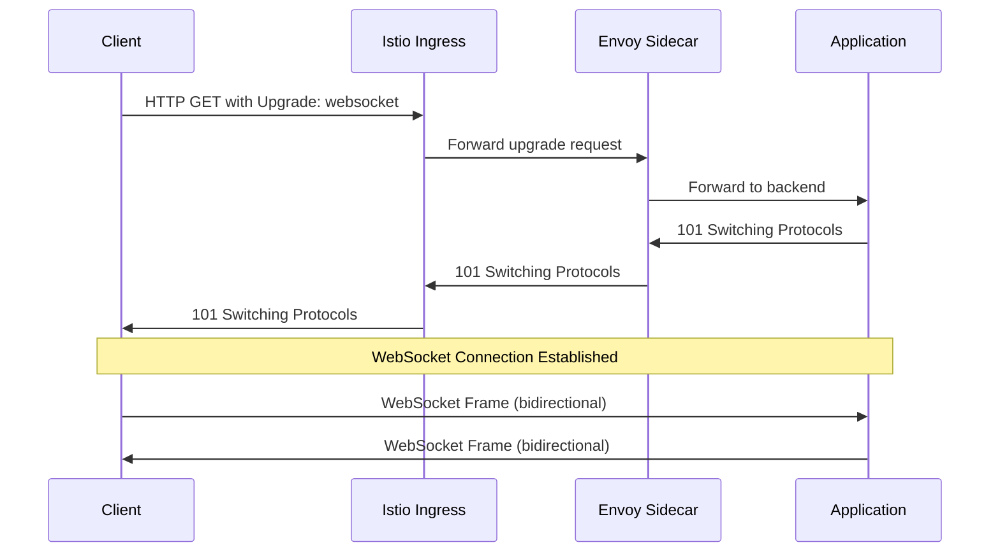
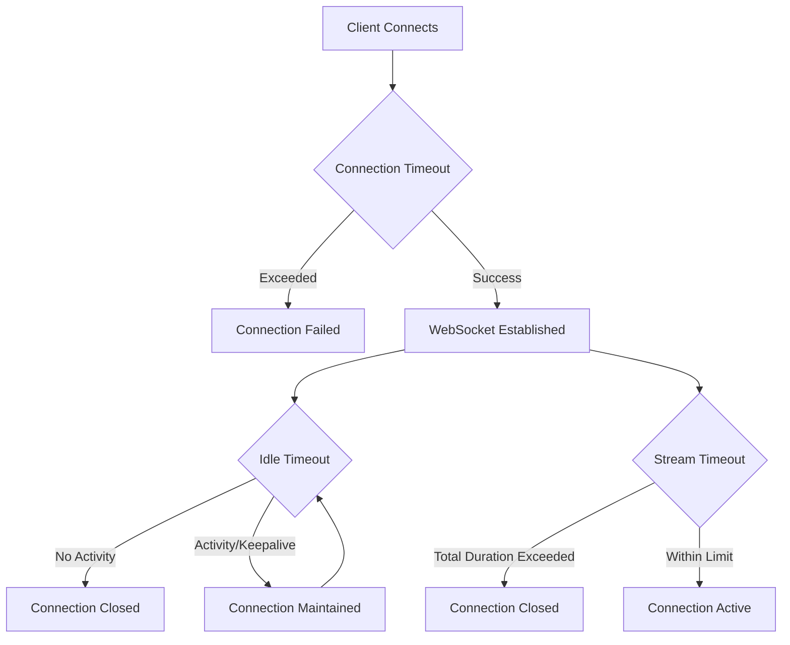
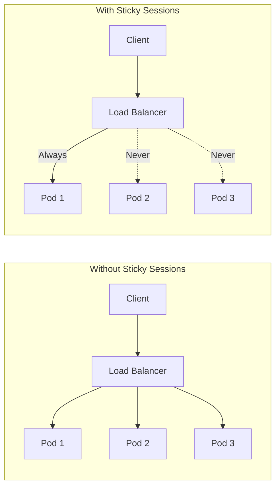
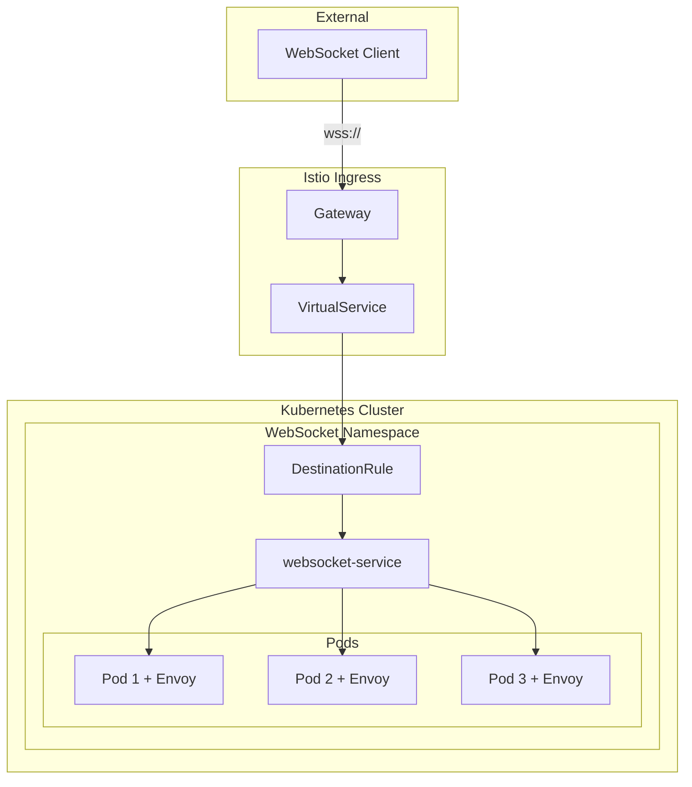
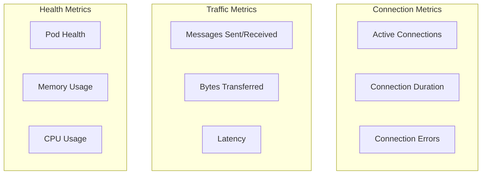

# How to Handle WebSocket Connections in Istio

Author: [nawazdhandala](https://github.com/nawazdhandala)

Tags: Istio, WebSocket, Real-time, Service Mesh, Kubernetes

Description: Learn how to configure Istio for WebSocket connections and real-time applications.

---

WebSocket connections are essential for real-time applications like chat systems, live dashboards, gaming platforms, and collaborative tools. When running these applications in a Kubernetes cluster with Istio service mesh, you need to understand how Istio handles WebSocket connections and configure it properly to ensure reliable, long-lived connections.

This comprehensive guide walks you through everything you need to know about handling WebSocket connections in Istio, from basic configuration to advanced load balancing strategies.

## Understanding WebSocket Protocol in Istio

WebSocket is a protocol that provides full-duplex communication channels over a single TCP connection. Unlike HTTP, which follows a request-response pattern, WebSocket allows both the client and server to send messages independently at any time.

### How WebSocket Upgrade Works

The WebSocket protocol begins with an HTTP upgrade request. The client sends a standard HTTP request with special headers indicating it wants to upgrade to WebSocket:



### Istio's Native WebSocket Support

Istio supports WebSocket connections out of the box through its Envoy proxy sidecars. When Envoy detects the HTTP upgrade headers, it automatically handles the protocol upgrade and maintains the long-lived connection. However, there are several configuration options you should understand to optimize WebSocket handling.

## Basic VirtualService Configuration for WebSocket

The VirtualService resource in Istio controls how traffic is routed to your services. For WebSocket applications, you need to configure the VirtualService to properly route upgrade requests.

### Simple WebSocket VirtualService

The following configuration creates a basic VirtualService that routes WebSocket traffic to your backend service. The key is ensuring the route matches the WebSocket endpoint path:

```yaml
# VirtualService configuration for WebSocket routing
# This resource tells Istio how to route incoming requests to the correct backend
apiVersion: networking.istio.io/v1beta1
kind: VirtualService
metadata:
  # Name your VirtualService descriptively to identify its purpose
  name: websocket-app
  namespace: default
spec:
  # Define which hostnames this VirtualService applies to
  # Requests to these hosts will be processed by this configuration
  hosts:
  - "websocket.example.com"

  # Bind this VirtualService to the Istio ingress gateway
  # This ensures external traffic reaches your service
  gateways:
  - istio-system/istio-ingressgateway

  http:
  # Route configuration for WebSocket endpoint
  # Match requests to the /ws path and route them to the websocket-service
  - match:
    - uri:
        # Use prefix matching to catch all WebSocket paths
        # This matches /ws, /ws/chat, /ws/notifications, etc.
        prefix: "/ws"
    route:
    - destination:
        # Target service name in Kubernetes
        host: websocket-service
        port:
          # The port your WebSocket service listens on
          number: 8080
```

### Gateway Configuration for WebSocket

You also need to configure the Istio Gateway to accept WebSocket connections. The Gateway defines the entry point for external traffic:

```yaml
# Gateway configuration for accepting WebSocket connections
# The Gateway acts as a load balancer at the edge of the mesh
apiVersion: networking.istio.io/v1beta1
kind: Gateway
metadata:
  name: websocket-gateway
  namespace: istio-system
spec:
  # Use the default Istio ingress gateway workload
  selector:
    istio: ingressgateway
  servers:
  # HTTP server configuration
  - port:
      # Standard HTTP port for initial WebSocket upgrade
      number: 80
      name: http
      protocol: HTTP
    hosts:
    - "websocket.example.com"

  # HTTPS server configuration (recommended for production)
  - port:
      # Standard HTTPS port for secure WebSocket (wss://)
      number: 443
      name: https
      protocol: HTTPS
    hosts:
    - "websocket.example.com"
    tls:
      # Use SIMPLE TLS mode with your certificates
      mode: SIMPLE
      # Reference to your TLS secret containing certificates
      credentialName: websocket-tls-secret
```

## Timeout and Keepalive Settings

WebSocket connections are long-lived, which means default HTTP timeouts can cause unexpected disconnections. Properly configuring timeouts is crucial for maintaining stable WebSocket connections.

### Understanding Timeout Types

There are several timeout configurations that affect WebSocket connections:



### Configuring Timeouts in VirtualService

The following configuration shows how to set appropriate timeouts for WebSocket connections. The key is to set a long enough timeout to accommodate your application's needs:

```yaml
# VirtualService with timeout configuration for WebSocket
# Extended timeouts are essential for long-lived WebSocket connections
apiVersion: networking.istio.io/v1beta1
kind: VirtualService
metadata:
  name: websocket-app
  namespace: default
spec:
  hosts:
  - "websocket.example.com"
  gateways:
  - istio-system/istio-ingressgateway

  http:
  - match:
    - uri:
        prefix: "/ws"
    route:
    - destination:
        host: websocket-service
        port:
          number: 8080

    # Timeout configuration for the route
    # This is the maximum time allowed for the entire stream
    # Set to 0s for infinite timeout (no timeout)
    # For WebSocket, you typically want a very long or infinite timeout
    timeout: 0s
```

### DestinationRule for Connection Settings

DestinationRule resources configure traffic policies for destinations. Use this to set connection pool settings and outlier detection:

```yaml
# DestinationRule for WebSocket service connection configuration
# Controls how connections are established and maintained to the backend
apiVersion: networking.istio.io/v1beta1
kind: DestinationRule
metadata:
  name: websocket-destination
  namespace: default
spec:
  # Target the WebSocket service
  host: websocket-service

  trafficPolicy:
    connectionPool:
      tcp:
        # Maximum number of TCP connections to the service
        # Increase for high-traffic WebSocket applications
        maxConnections: 1000

        # TCP connection timeout in seconds
        # How long to wait for a connection to be established
        connectTimeout: 30s

        # TCP keepalive configuration to detect dead connections
        tcpKeepalive:
          # Time before sending first keepalive probe (in seconds)
          time: 7200s

          # Interval between keepalive probes (in seconds)
          interval: 75s

          # Number of probes before considering connection dead
          probes: 10

      http:
        # Maximum number of HTTP/1.1 connections per host
        # WebSocket runs over HTTP/1.1, so this setting matters
        h2UpgradePolicy: DO_NOT_UPGRADE

        # Maximum pending HTTP requests to the destination
        http1MaxPendingRequests: 1024

        # Maximum requests per connection before closing
        # Set to 0 for unlimited (important for WebSocket)
        maxRequestsPerConnection: 0

        # Maximum number of concurrent retries
        maxRetries: 3

        # Idle timeout for HTTP connections
        # Set high for WebSocket to prevent premature disconnection
        idleTimeout: 3600s
```

### EnvoyFilter for Advanced Timeout Control

For more granular control over timeouts, you can use EnvoyFilter to modify Envoy's configuration directly:

```yaml
# EnvoyFilter for advanced WebSocket timeout configuration
# Use EnvoyFilter when VirtualService options are not sufficient
# WARNING: EnvoyFilter is a powerful but fragile configuration method
apiVersion: networking.istio.io/v1alpha3
kind: EnvoyFilter
metadata:
  name: websocket-timeouts
  namespace: istio-system
spec:
  # Apply to the ingress gateway workloads
  workloadSelector:
    labels:
      istio: ingressgateway

  configPatches:
  # Patch the HTTP connection manager for WebSocket routes
  - applyTo: NETWORK_FILTER
    match:
      context: GATEWAY
      listener:
        filterChain:
          filter:
            name: "envoy.filters.network.http_connection_manager"
    patch:
      operation: MERGE
      value:
        typed_config:
          "@type": "type.googleapis.com/envoy.extensions.filters.network.http_connection_manager.v3.HttpConnectionManager"
          # Enable WebSocket upgrade support explicitly
          upgrade_configs:
          - upgrade_type: "websocket"

          # Stream idle timeout - how long a stream can be idle
          # Set to 0s to disable (important for WebSocket)
          stream_idle_timeout: 0s

          # Request timeout - max time for the entire request
          # Set to 0s for WebSocket to allow infinite duration
          request_timeout: 0s
```

## Load Balancing for Sticky Sessions

WebSocket connections often require sticky sessions (session affinity) to ensure all messages from a client go to the same backend pod. This is especially important when your WebSocket application maintains state.

### Why Sticky Sessions Matter for WebSocket



When a WebSocket connection is established, the client maintains a persistent connection to a specific backend pod. If load balancing decisions change mid-connection (for example, during scaling events), you need session affinity to ensure continuity.

### Configuring Consistent Hashing

Istio supports consistent hash-based load balancing, which ensures the same client always connects to the same backend:

```yaml
# DestinationRule with consistent hash load balancing
# Ensures clients are consistently routed to the same backend pod
apiVersion: networking.istio.io/v1beta1
kind: DestinationRule
metadata:
  name: websocket-sticky-sessions
  namespace: default
spec:
  host: websocket-service

  trafficPolicy:
    loadBalancer:
      # Use consistent hashing for load balancing decisions
      consistentHash:
        # Option 1: Hash based on client IP address
        # Good for simple scenarios where each client has a unique IP
        useSourceIp: true

    # Connection pool settings optimized for WebSocket
    connectionPool:
      tcp:
        maxConnections: 1000
        connectTimeout: 30s
      http:
        h2UpgradePolicy: DO_NOT_UPGRADE
        maxRequestsPerConnection: 0
        idleTimeout: 3600s
```

### Hash-Based Load Balancing Options

You have several options for consistent hashing depending on your use case:

```yaml
# DestinationRule with header-based consistent hashing
# Use when you have a unique identifier in request headers
apiVersion: networking.istio.io/v1beta1
kind: DestinationRule
metadata:
  name: websocket-header-hash
  namespace: default
spec:
  host: websocket-service

  trafficPolicy:
    loadBalancer:
      consistentHash:
        # Option 2: Hash based on a specific HTTP header
        # Useful when clients send a session ID or user ID header
        httpHeaderName: "X-User-ID"
```

```yaml
# DestinationRule with cookie-based consistent hashing
# Istio can automatically set and read session cookies
apiVersion: networking.istio.io/v1beta1
kind: DestinationRule
metadata:
  name: websocket-cookie-hash
  namespace: default
spec:
  host: websocket-service

  trafficPolicy:
    loadBalancer:
      consistentHash:
        # Option 3: Hash based on HTTP cookie
        # Istio will set this cookie automatically if not present
        httpCookie:
          # Name of the cookie to use for session affinity
          name: "SERVERID"
          # Path for the cookie
          path: "/"
          # How long the cookie should be valid
          # Set appropriately based on your session duration
          ttl: 3600s
```

### Ring Hash Configuration

For more control over the hash ring, you can configure the minimum ring size:

```yaml
# DestinationRule with ring hash configuration
# Fine-tune the consistent hash ring for your workload
apiVersion: networking.istio.io/v1beta1
kind: DestinationRule
metadata:
  name: websocket-ring-hash
  namespace: default
spec:
  host: websocket-service

  trafficPolicy:
    loadBalancer:
      consistentHash:
        useSourceIp: true
        # Minimum size of the hash ring
        # Larger values provide better distribution but use more memory
        # Recommended: at least 1024 for production workloads
        minimumRingSize: 1024
```

## Complete Production Configuration

Here is a complete, production-ready configuration for handling WebSocket connections in Istio:

### Architecture Overview



### Complete Configuration Files

First, create the namespace and service:

```yaml
# Namespace for WebSocket application
# Isolate WebSocket workloads in their own namespace
apiVersion: v1
kind: Namespace
metadata:
  name: websocket-app
  labels:
    # Enable Istio sidecar injection for all pods in this namespace
    istio-injection: enabled
---
# Kubernetes Service for WebSocket application
# Exposes the WebSocket pods to the cluster
apiVersion: v1
kind: Service
metadata:
  name: websocket-service
  namespace: websocket-app
  labels:
    app: websocket
spec:
  ports:
  - port: 8080
    targetPort: 8080
    protocol: TCP
    name: http-ws
  selector:
    app: websocket
  # Use ClusterIP for internal service discovery
  type: ClusterIP
```

Next, configure the Gateway:

```yaml
# Gateway for WebSocket ingress traffic
# Accepts external HTTPS connections and terminates TLS
apiVersion: networking.istio.io/v1beta1
kind: Gateway
metadata:
  name: websocket-gateway
  namespace: websocket-app
spec:
  selector:
    istio: ingressgateway
  servers:
  # HTTPS server with TLS termination
  - port:
      number: 443
      name: https
      protocol: HTTPS
    hosts:
    - "ws.example.com"
    tls:
      mode: SIMPLE
      credentialName: websocket-tls-cert
  # HTTP server for redirect to HTTPS
  - port:
      number: 80
      name: http
      protocol: HTTP
    hosts:
    - "ws.example.com"
    tls:
      # Redirect all HTTP traffic to HTTPS
      httpsRedirect: true
```

Configure the VirtualService with appropriate timeouts:

```yaml
# VirtualService for WebSocket routing
# Routes incoming requests to the correct backend service
apiVersion: networking.istio.io/v1beta1
kind: VirtualService
metadata:
  name: websocket-vs
  namespace: websocket-app
spec:
  hosts:
  - "ws.example.com"
  gateways:
  - websocket-gateway

  http:
  # Health check endpoint - short timeout is fine
  - match:
    - uri:
        exact: "/health"
    route:
    - destination:
        host: websocket-service
        port:
          number: 8080
    timeout: 5s

  # WebSocket endpoint - needs long/infinite timeout
  - match:
    - uri:
        prefix: "/ws"
      headers:
        # Match WebSocket upgrade requests specifically
        upgrade:
          exact: "websocket"
    route:
    - destination:
        host: websocket-service
        port:
          number: 8080
    # Disable timeout for WebSocket connections
    # This allows connections to remain open indefinitely
    timeout: 0s

  # Fallback route for WebSocket without upgrade header
  # (handles initial connection before upgrade)
  - match:
    - uri:
        prefix: "/ws"
    route:
    - destination:
        host: websocket-service
        port:
          number: 8080
    timeout: 0s

  # Default route for other HTTP traffic
  - route:
    - destination:
        host: websocket-service
        port:
          number: 8080
    timeout: 30s
```

Configure the DestinationRule for connection management:

```yaml
# DestinationRule for WebSocket connection management
# Configures load balancing, connection pools, and resilience
apiVersion: networking.istio.io/v1beta1
kind: DestinationRule
metadata:
  name: websocket-dr
  namespace: websocket-app
spec:
  host: websocket-service

  trafficPolicy:
    # Consistent hash load balancing for session affinity
    loadBalancer:
      consistentHash:
        # Use source IP for consistent routing
        # Ensures same client always reaches same backend
        useSourceIp: true
        minimumRingSize: 1024

    # Connection pool configuration
    connectionPool:
      tcp:
        # Maximum concurrent TCP connections
        maxConnections: 10000
        # Connection establishment timeout
        connectTimeout: 10s
        # TCP keepalive to detect dead connections
        tcpKeepalive:
          time: 300s
          interval: 60s
          probes: 3
      http:
        # Prevent HTTP/2 upgrade (WebSocket needs HTTP/1.1)
        h2UpgradePolicy: DO_NOT_UPGRADE
        # Allow many pending requests during connection surge
        http1MaxPendingRequests: 10000
        # Unlimited requests per connection for long-lived WebSocket
        maxRequestsPerConnection: 0
        # Long idle timeout to keep WebSocket connections alive
        idleTimeout: 86400s

    # Outlier detection for unhealthy backend removal
    outlierDetection:
      # Check every 30 seconds
      interval: 30s
      # Number of consecutive 5xx errors before ejection
      consecutive5xxErrors: 5
      # How long to eject an unhealthy host
      baseEjectionTime: 60s
      # Maximum percentage of hosts that can be ejected
      maxEjectionPercent: 50
```

### PeerAuthentication for mTLS

Enable mutual TLS for secure communication between services:

```yaml
# PeerAuthentication for mTLS configuration
# Enables encrypted communication between services in the mesh
apiVersion: security.istio.io/v1beta1
kind: PeerAuthentication
metadata:
  name: websocket-mtls
  namespace: websocket-app
spec:
  # Apply to all workloads in the namespace
  selector:
    matchLabels:
      app: websocket
  mtls:
    # STRICT mode requires all traffic to be mTLS encrypted
    # Use PERMISSIVE during migration to allow non-mTLS traffic
    mode: STRICT
```

## Monitoring WebSocket Connections

Monitoring is crucial for maintaining healthy WebSocket applications. Istio provides built-in metrics that you can use to monitor WebSocket connections.

### Key Metrics to Monitor



### Prometheus Queries for WebSocket Monitoring

Use these Prometheus queries to monitor your WebSocket connections:

```yaml
# ServiceMonitor for scraping WebSocket metrics
# Configures Prometheus to collect metrics from Istio sidecars
apiVersion: monitoring.coreos.com/v1
kind: ServiceMonitor
metadata:
  name: websocket-monitor
  namespace: websocket-app
spec:
  selector:
    matchLabels:
      app: websocket
  endpoints:
  - port: http-envoy-prom
    interval: 15s
    path: /stats/prometheus
```

Example Prometheus queries for monitoring:

```promql
# Active TCP connections to WebSocket service
# Shows current number of established connections
envoy_cluster_upstream_cx_active{cluster_name="outbound|8080||websocket-service.websocket-app.svc.cluster.local"}

# Connection duration histogram
# Helps identify if connections are lasting as expected
histogram_quantile(0.99, sum(rate(envoy_cluster_upstream_cx_length_ms_bucket{cluster_name="outbound|8080||websocket-service.websocket-app.svc.cluster.local"}[5m])) by (le))

# Connection errors
# Monitor for connection failures
sum(rate(envoy_cluster_upstream_cx_connect_fail{cluster_name="outbound|8080||websocket-service.websocket-app.svc.cluster.local"}[5m]))

# Bytes transferred (rx/tx)
# Track data volume through WebSocket connections
sum(rate(envoy_cluster_upstream_cx_rx_bytes_total{cluster_name="outbound|8080||websocket-service.websocket-app.svc.cluster.local"}[5m]))
sum(rate(envoy_cluster_upstream_cx_tx_bytes_total{cluster_name="outbound|8080||websocket-service.websocket-app.svc.cluster.local"}[5m]))
```

## Troubleshooting Common Issues

### Issue 1: WebSocket Connection Drops After 60 Seconds

This is typically caused by default Envoy idle timeouts. Check your DestinationRule and VirtualService configurations:

```yaml
# Fix for 60-second timeout issue
# Ensure idle timeout is set appropriately
apiVersion: networking.istio.io/v1beta1
kind: DestinationRule
metadata:
  name: websocket-fix-timeout
  namespace: websocket-app
spec:
  host: websocket-service
  trafficPolicy:
    connectionPool:
      http:
        # Set idle timeout higher than your expected idle period
        # or set to 0s to disable
        idleTimeout: 0s
```

### Issue 2: 503 Service Unavailable During Scale Events

This occurs when consistent hashing routes to pods that no longer exist. Implement graceful shutdown:

```yaml
# Pod configuration with graceful shutdown
# Allows time for connections to drain before termination
apiVersion: apps/v1
kind: Deployment
metadata:
  name: websocket-deployment
  namespace: websocket-app
spec:
  template:
    spec:
      # Give pods time to gracefully close connections
      terminationGracePeriodSeconds: 120
      containers:
      - name: websocket
        lifecycle:
          preStop:
            exec:
              # Signal application to stop accepting new connections
              # and drain existing ones
              command: ["/bin/sh", "-c", "sleep 30"]
```

### Issue 3: WebSocket Upgrade Fails

Verify that the upgrade headers are being passed through correctly:

```bash
# Debug command to verify WebSocket upgrade is working
# Run this from inside the cluster
kubectl exec -it deploy/sleep -n default -- \
  curl -v -H "Connection: Upgrade" \
       -H "Upgrade: websocket" \
       -H "Sec-WebSocket-Key: dGhlIHNhbXBsZSBub25jZQ==" \
       -H "Sec-WebSocket-Version: 13" \
       http://websocket-service.websocket-app:8080/ws
```

## Best Practices Summary

1. **Always set timeout to 0s** for WebSocket routes in VirtualService to prevent unexpected disconnections.

2. **Use consistent hash load balancing** with source IP or cookies for session affinity.

3. **Configure TCP keepalive** in DestinationRule to detect and clean up dead connections.

4. **Set h2UpgradePolicy to DO_NOT_UPGRADE** because WebSocket requires HTTP/1.1.

5. **Enable mTLS** for secure communication between services in the mesh.

6. **Monitor connection metrics** using Prometheus to detect issues before they affect users.

7. **Implement graceful shutdown** in your pods to handle scaling events smoothly.

8. **Use EnvoyFilter sparingly** and only when VirtualService and DestinationRule options are insufficient.

## Conclusion

Handling WebSocket connections in Istio requires understanding how the protocol works and configuring appropriate timeouts, load balancing, and connection management settings. By following the configurations and best practices outlined in this guide, you can build reliable real-time applications that take full advantage of Istio's service mesh capabilities.

The key takeaways are:
- Istio supports WebSocket natively, but requires proper timeout configuration
- Consistent hash load balancing ensures session affinity for stateful connections
- TCP keepalive settings help maintain healthy connections and detect failures
- Monitoring and observability are essential for production deployments

With these configurations in place, your WebSocket applications will benefit from Istio's traffic management, security, and observability features while maintaining stable, long-lived connections.
