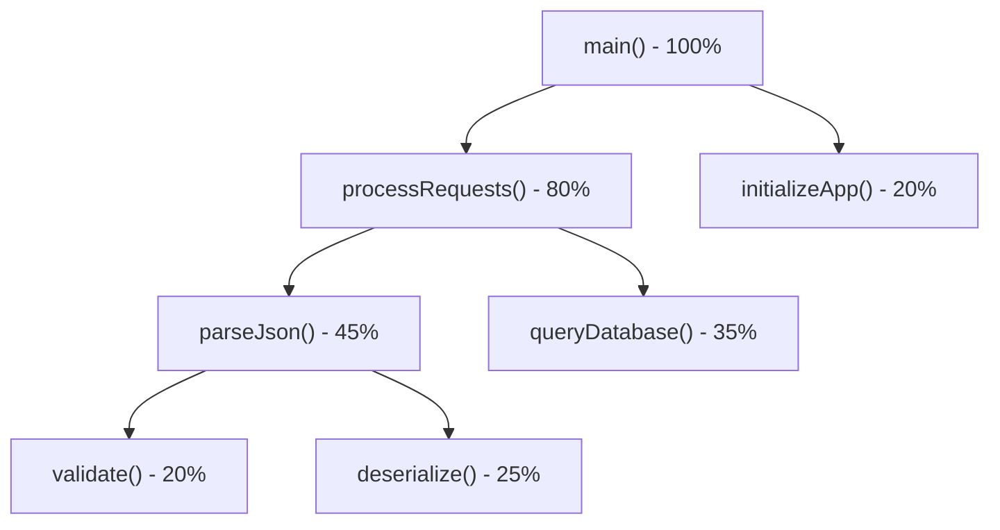

# How to Profile Kotlin Applications for Performance

Author: [nawazdhandala](https://github.com/nawazdhandala)

Tags: Kotlin, Profiling, Performance, JVM, Development

Description: A guide to profiling Kotlin applications using JVM tools, identifying bottlenecks in CPU, memory, and coroutines, with practical optimization techniques.

---

Kotlin runs on the JVM, which means you get access to the entire ecosystem of JVM profiling tools. But Kotlin also has its own idioms, like coroutines, extension functions, and inline functions, that can behave differently than what you might expect when profiling. This guide covers how to profile Kotlin applications effectively, identify real bottlenecks, and avoid the common traps.

## Starting with JVM Flight Recorder

Java Flight Recorder (JFR) is built into the JDK since Java 11 and has near-zero overhead in production. It collects CPU samples, memory allocation data, garbage collection events, thread activity, and I/O operations. For most Kotlin profiling tasks, JFR should be your first tool.

To start a recording from the command line:

```bash
# Start the application with continuous JFR recording
# maxage limits how much history is retained in the circular buffer
# filename specifies where the recording is dumped on exit
java -XX:StartFlightRecording=maxage=5m,filename=recording.jfr \
     -jar my-kotlin-app.jar
```

You can also start and stop recordings dynamically using `jcmd`:

```bash
# Find the PID of your running application
jps -l

# Start a timed recording that stops after 60 seconds
jcmd <PID> JFR.start duration=60s filename=profile.jfr

# Or manually start and stop
jcmd <PID> JFR.start name=myrecording
jcmd <PID> JFR.stop name=myrecording filename=profile.jfr
```

Open the `.jfr` file in JDK Mission Control (JMC) or IntelliJ IDEA's profiler to analyze the results.

## CPU Profiling

CPU profiling answers the question "where is my application spending time?" There are two approaches: sampling and instrumentation.

**Sampling profilers** periodically capture stack traces from all threads. They have low overhead but can miss very short methods. JFR uses sampling.

**Instrumentation profilers** inject timing code into every method entry and exit. They capture everything but add significant overhead and can distort results.

For Kotlin, stick with sampling profilers. Instrumentation profilers interact poorly with inline functions, since the inlined code shows up at the call site rather than in the original function.

### Reading CPU Profiles for Kotlin Code

Kotlin compiles to JVM bytecode, and some Kotlin constructs map to surprising bytecode patterns. Here is what to watch for:

**Inline functions** do not appear as separate frames in the stack trace. The code is inlined at the call site. If you see a function spending unexpected time and it calls inline higher-order functions like `map`, `filter`, or `let`, the time includes the work done by the lambda body.

**Companion objects** compile to a nested class with a static `INSTANCE` field. In profiles, you will see method names like `MyClass$Companion.doSomething` rather than `MyClass.doSomething`.

**Coroutines** generate state machine classes under the hood. A suspended function like `fetchData` might appear in the profiler as `fetchData$suspendImpl` or as an anonymous class in the `kotlin.coroutines` package.

## Memory Profiling

Memory issues in Kotlin applications typically manifest as high GC pressure, memory leaks, or excessive object allocation. JFR captures allocation events, but for a detailed heap analysis, you need a heap dump.

```bash
# Trigger a heap dump for a running application
# The binary format can be analyzed with Eclipse MAT, VisualVM, or IntelliJ
jcmd <PID> GC.heap_dump /tmp/heap.hprof
```

### Common Kotlin Memory Pitfalls

**Autoboxing in collections**: Kotlin's `List<Int>` compiles to `List<Integer>` on the JVM, not `int[]`. Every integer in the list is a boxed object. For performance-critical code with large collections of primitives, use `IntArray` instead of `List<Int>`.

```kotlin
// This allocates a boxed Integer object for each element
// Each Integer is a separate heap allocation
val boxedList: List<Int> = (1..1_000_000).toList()

// This uses a primitive int array with no boxing overhead
// Single contiguous allocation, much better for GC
val primitiveArray: IntArray = IntArray(1_000_000) { it }
```

**Lambda captures**: Every lambda that captures variables from its enclosing scope creates an object. In hot loops, this generates garbage quickly.

```kotlin
// Creates a new Function1 object on every iteration
// because the lambda captures 'threshold' from the outer scope
fun filterAboveThreshold(items: List<Int>, threshold: Int): List<Int> {
    return items.filter { it > threshold }
}

// With an inline function, no lambda object is created
// The filter code is inlined directly at the call site
// Kotlin's stdlib filter is already inline, so this is actually fine
// The concern applies to non-inline higher-order functions you write yourself
```

**String concatenation in loops**: Kotlin's string templates are convenient, but in tight loops, use `StringBuilder` explicitly.

```kotlin
// Each iteration creates intermediate String objects
// For large iterations this creates significant garbage
fun buildReportBad(items: List<String>): String {
    var result = ""
    for (item in items) {
        result += "- $item\n"
    }
    return result
}

// StringBuilder avoids intermediate allocations
// Single buffer that grows as needed
fun buildReportGood(items: List<String>): String {
    return buildString {
        for (item in items) {
            append("- ")
            append(item)
            append('\n')
        }
    }
}
```

## Profiling Coroutines

Coroutines are Kotlin's concurrency primitive, and profiling them requires understanding their execution model. A coroutine does not own a thread. It runs on a thread from a dispatcher's pool, suspends, and resumes potentially on a different thread.

This means thread-based profiling tools can lose track of a coroutine's work across suspension points. The profiler sees fragments of work on different threads rather than a continuous execution trace.

### Kotlin Coroutine Debugger

Kotlin provides a coroutine debug agent that tracks coroutine creation, suspension, and resumption. Enable it by adding a JVM argument:

```bash
# Enable the coroutine debug agent
# This adds coroutine names and creation stack traces to thread dumps
java -Dkotlinx.coroutines.debug -jar my-app.jar
```

With debug mode enabled, coroutine names appear in thread dumps, making it easier to associate work with specific coroutines.

### Identifying Coroutine Bottlenecks

The most common performance issue with coroutines is dispatcher starvation. If you run blocking I/O on `Dispatchers.Default` (which has a limited thread pool sized to CPU cores), you block threads that CPU-bound coroutines need.

```kotlin
// Wrong: blocking I/O on the Default dispatcher
// This ties up a thread from the CPU-bound pool
suspend fun readFileBad(): String {
    return File("/tmp/data.txt").readText()
}

// Correct: move blocking I/O to the IO dispatcher
// The IO dispatcher has a much larger thread pool (64+ threads)
suspend fun readFileGood(): String = withContext(Dispatchers.IO) {
    File("/tmp/data.txt").readText()
}
```

Use the `kotlinx-coroutines-debug` module to dump the state of all coroutines and identify which ones are suspended and where:

```kotlin
import kotlinx.coroutines.debug.DebugProbes

// Install the debug probes at application startup
// Do this only in development or staging, not in production
DebugProbes.install()

// Later, dump all coroutine states to stdout
DebugProbes.dumpCoroutines()
```

## Profiling with async-profiler

For low-overhead CPU and allocation profiling beyond what JFR offers, async-profiler is an excellent option. It uses OS-level perf events on Linux and does not suffer from safepoint bias (a problem where sampling profilers only capture stack traces at JVM safepoints, missing work in between).

```bash
# Profile CPU usage for 30 seconds and generate a flame graph
# The flame graph format makes it easy to spot hot code paths
./profiler.sh -d 30 -f flamegraph.html <PID>

# Profile memory allocations
./profiler.sh -d 30 -e alloc -f alloc_flamegraph.html <PID>
```

Flame graphs are the most useful visualization for profiling data. The x-axis represents the proportion of samples, and the y-axis represents the call stack depth. Wide bars mean a function (and its callees) consume a large portion of time.



## Practical Optimization Workflow

Profiling without a systematic approach leads to premature optimization. Follow this workflow:

1. **Define a performance target.** "It should be faster" is not a target. "P95 response time under 200ms" is.
2. **Measure the baseline.** Profile under realistic load conditions, not on your local machine with a single request.
3. **Identify the bottleneck.** The profiler will show where time is spent. Focus on the largest contributor.
4. **Form a hypothesis.** Based on the profile data, hypothesize why that code is slow.
5. **Make one change.** Change one thing at a time so you can measure its impact.
6. **Measure again.** Confirm the change improved the metric you care about without regressing others.

The biggest performance wins in Kotlin applications usually come from: fixing N+1 database queries, reducing unnecessary object allocation in hot paths, choosing the right coroutine dispatcher, and caching expensive computations. Micro-optimizations like avoiding `val` vs `var` differences or worrying about extension function overhead are almost never the bottleneck. Profile first, optimize second, and always measure the impact of your changes.
