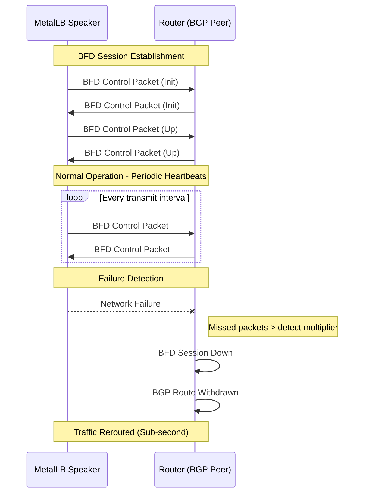
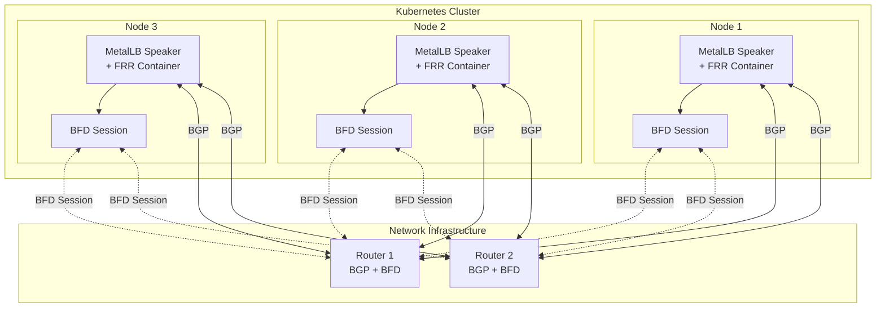
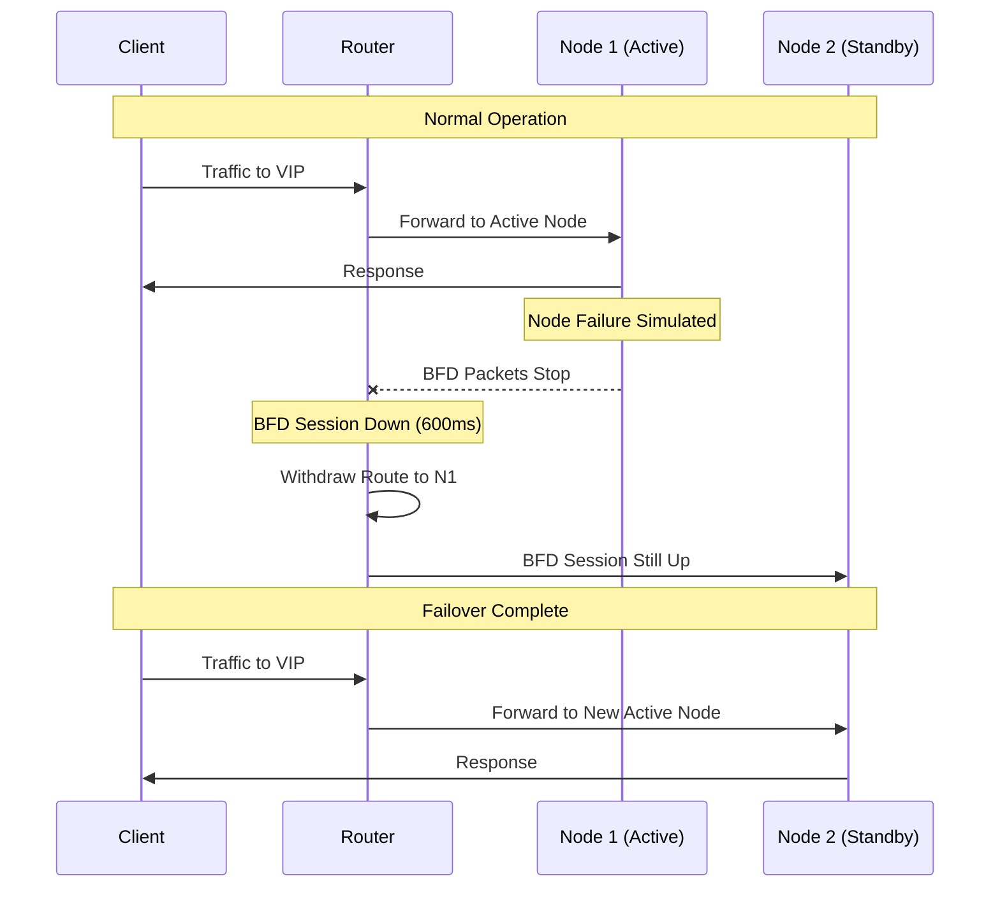

# How to Enable BFD for Fast Failover with MetalLB

Author: [nawazdhandala](https://github.com/nawazdhandala)

Tags: MetalLB, Kubernetes, BFD, High Availability, BGP, Networking

Description: A guide to configuring Bidirectional Forwarding Detection (BFD) with MetalLB for fast failover.

---

In high-availability Kubernetes environments, minimizing service disruption during network failures is critical. While BGP provides excellent routing capabilities for MetalLB, its default failure detection can take 90 seconds or more. Bidirectional Forwarding Detection (BFD) solves this problem by enabling sub-second failover detection. This comprehensive guide covers everything you need to know about configuring BFD with MetalLB.

## Table of Contents

1. [Understanding BFD and Why It Matters](#understanding-bfd-and-why-it-matters)
2. [Prerequisites](#prerequisites)
3. [BFD Architecture with MetalLB](#bfd-architecture-with-metallb)
4. [Configuring BFDProfile](#configuring-bfdprofile)
5. [Timer Tuning for Different Scenarios](#timer-tuning-for-different-scenarios)
6. [Integrating BFD with BGP Peers](#integrating-bfd-with-bgp-peers)
7. [Complete Configuration Example](#complete-configuration-example)
8. [Testing and Validating Failover](#testing-and-validating-failover)
9. [Monitoring BFD Sessions](#monitoring-bfd-sessions)
10. [Troubleshooting Common Issues](#troubleshooting-common-issues)
11. [Best Practices](#best-practices)

## Understanding BFD and Why It Matters

Bidirectional Forwarding Detection (BFD) is a network protocol designed to detect faults between two forwarding engines. It operates independently of media, data protocols, and routing protocols, providing a low-overhead method of detecting failures in the forwarding path.

### The Problem with BGP-Only Failover

Without BFD, BGP relies on its hold timer (typically 90 seconds) to detect peer failures. This means your services could be unreachable for up to 90 seconds during a network failure.

### How BFD Improves Failover

BFD can detect failures in as little as 50-300 milliseconds, depending on configuration. When integrated with BGP, BFD triggers immediate route withdrawal upon detecting a failure, dramatically reducing failover time.

The following diagram illustrates the BFD operation flow between MetalLB and network routers:



## Prerequisites

Before configuring BFD with MetalLB, ensure you have:

- Kubernetes cluster v1.20 or later
- MetalLB v0.13.0 or later (BFD support was added in v0.13.0)
- Network routers that support BFD
- BGP already configured and working with MetalLB

Verify your MetalLB version supports BFD by checking the installed version:

```bash
# Check the MetalLB controller version
# This command retrieves the image version from the controller deployment
kubectl get deployment -n metallb-system controller -o jsonpath='{.spec.template.spec.containers[0].image}'
```

## BFD Architecture with MetalLB

The following diagram shows how BFD integrates with MetalLB's BGP implementation:



MetalLB uses FRRouting (FRR) mode to provide BFD capabilities. When a BFD session detects a failure, it immediately notifies the BGP process, which then withdraws the routes, allowing traffic to failover to healthy nodes.

## Configuring BFDProfile

The `BFDProfile` custom resource defines the BFD session parameters. Let's start with understanding each configuration option.

### Basic BFDProfile

This is a simple BFDProfile configuration with default-like settings that provides reliable failure detection:

```yaml
# BFDProfile defines how BFD sessions behave
# This basic profile provides approximately 300ms failure detection
# Suitable for most production environments
apiVersion: metallb.io/v1beta1
kind: BFDProfile
metadata:
  # Name must be unique and will be referenced by BGPPeer
  name: basic-bfd
  # BFDProfiles should be in the metallb-system namespace
  namespace: metallb-system
spec:
  # Interval between BFD control packets we send
  # Lower values = faster detection but more CPU/network overhead
  # 300ms is a good balance for most environments
  transmitInterval: 300

  # Interval at which we expect to receive BFD packets
  # Should match or be close to the peer's transmit interval
  receiveInterval: 300

  # Number of missed packets before declaring the session down
  # With 300ms interval and multiplier of 3: detection time = 900ms
  detectMultiplier: 3
```

### Understanding BFD Timers

The following diagram illustrates how BFD timers work together:

```mermaid
gantt
    title BFD Timer Visualization
    dateFormat X
    axisFormat %L ms

    section Transmit
    Packet 1    :t1, 0, 100
    Packet 2    :t2, 300, 100
    Packet 3    :t3, 600, 100
    Packet 4    :t4, 900, 100

    section Receive Expected
    Expected 1  :r1, 0, 100
    Expected 2  :r2, 300, 100
    Expected 3  :r3, 600, 100

    section Failure Window
    Detect Multiplier x Interval :crit, 600, 300
```



## Timer Tuning for Different Scenarios

Different environments have different requirements. Here are BFDProfile configurations for various scenarios:

### Aggressive Profile (Fastest Failover)

Use this profile when sub-second failover is critical and your network infrastructure can handle high-frequency BFD packets:

```yaml
# Aggressive BFD profile for minimum failover time
# Detection time: 50ms * 3 = 150ms
# WARNING: This profile generates significant packet overhead
# Only use in stable, low-latency networks
apiVersion: metallb.io/v1beta1
kind: BFDProfile
metadata:
  name: aggressive-bfd
  namespace: metallb-system
spec:
  # Minimum recommended transmit interval
  # Going lower may cause false positives in busy networks
  transmitInterval: 50

  # Match receive interval to transmit for symmetric operation
  receiveInterval: 50

  # Keep multiplier at 3 for some tolerance
  # Lower values may cause flapping in congested networks
  detectMultiplier: 3

  # Enable echo mode for even faster detection
  # Echo packets are looped back by the peer's forwarding plane
  # This tests the actual forwarding path, not just control plane
  echoMode: true

  # Echo interval when echo mode is enabled
  # Can be different from control packet interval
  echoInterval: 50

  # Passive mode disabled - we actively establish sessions
  passiveMode: false

  # Minimum TTL for incoming BFD packets
  # Helps prevent BFD spoofing attacks
  # Set to 254 for single-hop BFD (255 - 1 hop)
  minimumTtl: 254
```

### Conservative Profile (Stable Networks)

Use this profile in environments where stability is more important than speed, or where network latency/jitter is higher:

```yaml
# Conservative BFD profile for stable operation
# Detection time: 1000ms * 5 = 5 seconds
# Recommended for networks with variable latency
apiVersion: metallb.io/v1beta1
kind: BFDProfile
metadata:
  name: conservative-bfd
  namespace: metallb-system
spec:
  # Longer transmit interval reduces overhead
  # Good for WAN connections or congested networks
  transmitInterval: 1000

  # Match receive interval for symmetric operation
  receiveInterval: 1000

  # Higher multiplier provides tolerance for jitter
  # 5 missed packets required before session down
  detectMultiplier: 5

  # Disable echo mode for reduced complexity
  echoMode: false

  # Enable passive mode if router initiates sessions
  # MetalLB will wait for the router to establish the session
  passiveMode: false
```

### Balanced Profile (Recommended for Production)

This is the recommended profile for most production environments, balancing speed with stability:

```yaml
# Balanced BFD profile for production use
# Detection time: 200ms * 3 = 600ms
# Good balance between speed and stability
apiVersion: metallb.io/v1beta1
kind: BFDProfile
metadata:
  name: production-bfd
  namespace: metallb-system
spec:
  # 200ms provides sub-second detection with margin
  transmitInterval: 200

  # Symmetric intervals for predictable behavior
  receiveInterval: 200

  # Standard multiplier of 3
  detectMultiplier: 3

  # Echo mode for hardware-accelerated detection
  # Only enable if routers support BFD echo
  echoMode: false

  # Active mode - MetalLB initiates sessions
  passiveMode: false

  # Security: require high TTL for single-hop BFD
  minimumTtl: 254
```

## Integrating BFD with BGP Peers

Once you have a BFDProfile defined, you need to reference it in your BGPPeer configuration. Here's how to link them together:

### BGPPeer with BFD Reference

The BGPPeer configuration must reference the BFDProfile by name:

```yaml
# BGPPeer configuration with BFD enabled
# This peer will use BFD for fast failure detection
apiVersion: metallb.io/v1beta1
kind: BGPPeer
metadata:
  name: router1
  namespace: metallb-system
spec:
  # IP address of the BGP peer (your router)
  peerAddress: 10.0.0.1

  # Remote AS number of the peer
  # Use the same AS for iBGP, different for eBGP
  peerASN: 64512

  # Local AS number for MetalLB
  myASN: 64513

  # Reference to the BFDProfile for this peer
  # Must match the name of a BFDProfile in the same namespace
  bfdProfile: production-bfd

  # Optional: Node selector to limit which nodes peer with this router
  nodeSelectors:
    - matchLabels:
        node-role.kubernetes.io/worker: ""

  # Optional: Source address for BGP connections
  # Useful in multi-homed setups
  # sourceAddress: 10.0.0.100

  # Optional: BGP password for MD5 authentication
  # password: "secretpassword"

  # Hold time in seconds (standard BGP timer)
  # Even with BFD, this is used as a fallback
  holdTime: 90s

  # Keepalive interval (typically 1/3 of hold time)
  keepaliveTime: 30s
```

### Multiple Peers with Different BFD Profiles

You might want different BFD profiles for different network paths. Here's an example with multiple peers:

```yaml
# First router - on the same rack, use aggressive BFD
apiVersion: metallb.io/v1beta1
kind: BGPPeer
metadata:
  name: tor-switch-1
  namespace: metallb-system
spec:
  peerAddress: 10.0.0.1
  peerASN: 64512
  myASN: 64513
  # Use aggressive profile for same-rack connectivity
  # Lower latency path allows faster detection
  bfdProfile: aggressive-bfd
  holdTime: 90s
  keepaliveTime: 30s
---
# Second router - remote data center, use conservative BFD
apiVersion: metallb.io/v1beta1
kind: BGPPeer
metadata:
  name: remote-router
  namespace: metallb-system
spec:
  peerAddress: 192.168.100.1
  peerASN: 64514
  myASN: 64513
  # Use conservative profile for WAN connectivity
  # Higher latency path needs more tolerance
  bfdProfile: conservative-bfd
  holdTime: 180s
  keepaliveTime: 60s
```

## Complete Configuration Example

Here's a complete, production-ready configuration that brings together all the components:

```yaml
# Complete MetalLB configuration with BFD
# This configuration provides:
# - Sub-second failover with BFD
# - Dual router redundancy
# - Load balancer IP pool management

---
# First, define the BFD profile that will be used by BGP peers
apiVersion: metallb.io/v1beta1
kind: BFDProfile
metadata:
  name: production-bfd
  namespace: metallb-system
spec:
  # 200ms interval with multiplier of 3 = 600ms detection
  transmitInterval: 200
  receiveInterval: 200
  detectMultiplier: 3
  echoMode: false
  passiveMode: false
  minimumTtl: 254
---
# IP address pool for load balancer services
apiVersion: metallb.io/v1beta1
kind: IPAddressPool
metadata:
  name: production-pool
  namespace: metallb-system
spec:
  # Define the IP range available for LoadBalancer services
  addresses:
    - 10.100.0.0/24
  # Avoid automatic IP assignment - use explicit annotations
  autoAssign: true
---
# BGP advertisement configuration
# This tells MetalLB how to advertise IPs from the pool
apiVersion: metallb.io/v1beta1
kind: BGPAdvertisement
metadata:
  name: production-advertisement
  namespace: metallb-system
spec:
  # Reference the IP pools to advertise
  ipAddressPools:
    - production-pool
  # Optional: Aggregate routes to reduce routing table size
  # aggregationLength: 24
  # Optional: Add BGP communities for traffic engineering
  communities:
    - 64512:100
  # Optional: Prepend AS path to influence routing
  # localPref: 100
---
# First BGP peer (primary router)
apiVersion: metallb.io/v1beta1
kind: BGPPeer
metadata:
  name: primary-router
  namespace: metallb-system
spec:
  peerAddress: 10.0.0.1
  peerASN: 64512
  myASN: 64513
  # Enable BFD for this peer
  bfdProfile: production-bfd
  holdTime: 90s
  keepaliveTime: 30s
  # Use ECMP for load distribution
  # ebgpMultiHop: false
---
# Second BGP peer (secondary router)
apiVersion: metallb.io/v1beta1
kind: BGPPeer
metadata:
  name: secondary-router
  namespace: metallb-system
spec:
  peerAddress: 10.0.0.2
  peerASN: 64512
  myASN: 64513
  # Same BFD profile for consistent behavior
  bfdProfile: production-bfd
  holdTime: 90s
  keepaliveTime: 30s
```

Apply this configuration to your cluster:

```bash
# Apply the complete MetalLB configuration with BFD
# This will create all resources in the metallb-system namespace
kubectl apply -f metallb-bfd-config.yaml

# Verify all resources were created successfully
kubectl get bfdprofile,ipaddresspool,bgpadvertisement,bgppeer -n metallb-system
```

## Testing and Validating Failover

After configuring BFD, it's crucial to test and validate that failover works as expected.

### Verify BFD Session Status

Check the BFD session status on your MetalLB speakers:

```bash
# Get the list of MetalLB speaker pods
# These pods run on each node and handle BGP/BFD
kubectl get pods -n metallb-system -l component=speaker

# Check BFD session status using FRR's vtysh
# Replace <speaker-pod> with an actual pod name from the previous command
kubectl exec -n metallb-system <speaker-pod> -c frr -- vtysh -c "show bfd peers"
```

Expected output showing healthy BFD sessions:

```
BFD Peers:
        peer 10.0.0.1 vrf default
                ID: 1
                Remote ID: 1
                Status: up
                Uptime: 1 hour(s), 23 minute(s), 45 second(s)
                Diagnostics: ok
                Remote diagnostics: ok
                Local timers:
                        Detect-multiplier: 3
                        Receive interval: 200ms
                        Transmission interval: 200ms
                Remote timers:
                        Detect-multiplier: 3
                        Receive interval: 200ms
                        Transmission interval: 200ms
```

### Simulate Node Failure

Test failover by simulating a node failure. This diagram shows the failover process:



Perform the failover test:

```bash
# Terminal 1: Start continuous ping to your LoadBalancer service
# Replace 10.100.0.10 with your actual LoadBalancer IP
ping -i 0.1 10.100.0.10

# Terminal 2: Identify which node is currently handling traffic
# Look for the node with established BGP sessions
kubectl exec -n metallb-system <speaker-pod> -c frr -- vtysh -c "show bgp summary"

# Terminal 3: Simulate failure by cordoning and draining the active node
# This simulates a node failure scenario
kubectl cordon <active-node>
kubectl drain <active-node> --ignore-daemonsets --delete-emptydir-data

# Observe the ping output - you should see minimal packet loss
# With BFD, expect 1-3 lost packets instead of 30+ without BFD
```

### Measure Failover Time

Use a more precise method to measure actual failover time:

```bash
# Create a test script that measures failover time precisely
# This script sends rapid requests and measures response gaps

#!/bin/bash
# failover-test.sh - Measures actual failover time

# Configuration - update these values for your environment
VIP="10.100.0.10"
PORT="80"
INTERVAL="0.05"  # 50ms between requests

echo "Starting failover test against $VIP:$PORT"
echo "Press Ctrl+C to stop"

# Track last successful request time
last_success=$(date +%s.%N)
max_gap=0

while true; do
    # Attempt connection with short timeout
    if curl -s -o /dev/null -w "%{http_code}" --connect-timeout 0.5 "http://$VIP:$PORT" | grep -q "200"; then
        current=$(date +%s.%N)
        gap=$(echo "$current - $last_success" | bc)

        # Check if this is a significant gap (potential failover)
        if (( $(echo "$gap > 0.5" | bc -l) )); then
            echo "Detected gap of ${gap}s at $(date)"
            if (( $(echo "$gap > $max_gap" | bc -l) )); then
                max_gap=$gap
            fi
        fi
        last_success=$current
    fi

    sleep $INTERVAL
done

echo "Maximum gap detected: ${max_gap}s"
```

## Monitoring BFD Sessions

Effective monitoring is essential for maintaining reliable BFD operation.

### Using Prometheus Metrics

MetalLB exposes BFD metrics that can be scraped by Prometheus:

```yaml
# ServiceMonitor for MetalLB BFD metrics
# Requires Prometheus Operator to be installed
apiVersion: monitoring.coreos.com/v1
kind: ServiceMonitor
metadata:
  name: metallb-bfd
  namespace: metallb-system
  labels:
    app: metallb
spec:
  selector:
    matchLabels:
      # Match the MetalLB speaker service
      app.kubernetes.io/component: speaker
  endpoints:
    - port: monitoring
      interval: 15s
      path: /metrics
```

### Key BFD Metrics to Monitor

The following metrics are exposed by MetalLB for BFD monitoring:

```promql
# BFD session state (1 = up, 0 = down)
# Alert if any session is down
metallb_bfd_session_up{peer="10.0.0.1"}

# Number of BFD session state changes
# High values indicate instability
metallb_bfd_session_state_changes_total{peer="10.0.0.1"}

# BFD control packet statistics
metallb_bfd_control_packets_sent_total
metallb_bfd_control_packets_received_total

# Example Prometheus alert rule for BFD session down
# alert: MetalLBBFDSessionDown
#   expr: metallb_bfd_session_up == 0
#   for: 30s
#   labels:
#     severity: critical
#   annotations:
#     summary: "BFD session down for peer {{ $labels.peer }}"
```

### Grafana Dashboard Query Examples

Create a Grafana dashboard with these queries:

```promql
# Panel 1: BFD Session Status (Stat panel)
# Shows current state of all BFD sessions
metallb_bfd_session_up

# Panel 2: BFD State Changes Over Time (Graph panel)
# Helps identify flapping sessions
rate(metallb_bfd_session_state_changes_total[5m])

# Panel 3: BFD Packet Rate (Graph panel)
# Verify BFD is actively sending/receiving packets
rate(metallb_bfd_control_packets_sent_total[1m])
rate(metallb_bfd_control_packets_received_total[1m])

# Panel 4: Packet Loss Indicator
# Compare sent vs received to detect issues
(rate(metallb_bfd_control_packets_sent_total[5m]) -
 rate(metallb_bfd_control_packets_received_total[5m])) /
rate(metallb_bfd_control_packets_sent_total[5m]) * 100
```

## Troubleshooting Common Issues

### BFD Session Not Establishing

If BFD sessions won't come up, check these common causes:

```bash
# 1. Verify FRR container is running in speaker pods
# The FRR container handles BFD protocol
kubectl get pods -n metallb-system -l component=speaker -o wide

# 2. Check FRR logs for BFD errors
kubectl logs -n metallb-system <speaker-pod> -c frr | grep -i bfd

# 3. Verify network connectivity to peer
kubectl exec -n metallb-system <speaker-pod> -- ping -c 3 10.0.0.1

# 4. Check if BFD profile is correctly referenced
kubectl get bgppeer -n metallb-system -o yaml | grep bfdProfile

# 5. Verify BFD configuration in FRR
kubectl exec -n metallb-system <speaker-pod> -c frr -- vtysh -c "show running-config" | grep -A10 bfd
```

### BFD Session Flapping

Session flapping (rapidly going up and down) indicates instability:

```bash
# 1. Check for packet loss on the network
kubectl exec -n metallb-system <speaker-pod> -- ping -c 100 10.0.0.1

# 2. Review BFD peer diagnostics
kubectl exec -n metallb-system <speaker-pod> -c frr -- vtysh -c "show bfd peers"

# 3. If flapping, increase timers in BFDProfile
# Update the profile with more conservative values
kubectl patch bfdprofile production-bfd -n metallb-system --type merge -p '
{
  "spec": {
    "transmitInterval": 500,
    "receiveInterval": 500,
    "detectMultiplier": 5
  }
}'

# 4. Check speaker pod resource usage
# High CPU might cause BFD packet delays
kubectl top pod -n metallb-system -l component=speaker
```

### Router-Side Troubleshooting

The issue might be on the router side. Here are common router commands:

```bash
# Cisco IOS/IOS-XE BFD verification commands
show bfd neighbors
show bfd neighbors details
show bfd summary

# Juniper JunOS BFD verification commands
show bfd session
show bfd session detail
show bfd session extensive

# Arista EOS BFD verification commands
show bfd peers
show bfd peers detail
```

### Common Configuration Mistakes

Here's a checklist of common mistakes to avoid:

```yaml
# WRONG: BFDProfile in wrong namespace
apiVersion: metallb.io/v1beta1
kind: BFDProfile
metadata:
  name: my-bfd
  namespace: default  # Should be metallb-system
spec:
  transmitInterval: 200
---
# WRONG: Mismatched profile name reference
apiVersion: metallb.io/v1beta1
kind: BGPPeer
metadata:
  name: router1
  namespace: metallb-system
spec:
  peerAddress: 10.0.0.1
  peerASN: 64512
  myASN: 64513
  bfdProfile: my-bfd-profile  # Doesn't match actual profile name
---
# WRONG: Timers too aggressive for network conditions
apiVersion: metallb.io/v1beta1
kind: BFDProfile
metadata:
  name: too-aggressive
  namespace: metallb-system
spec:
  transmitInterval: 10    # Too low - will cause false positives
  receiveInterval: 10     # Too low for most networks
  detectMultiplier: 1     # No tolerance for any missed packet
```

## Best Practices

### 1. Match BFD Timers with Router

Ensure your BFD profile timers are compatible with your router's configuration:

```yaml
# MetalLB BFDProfile - should match or be compatible with router config
apiVersion: metallb.io/v1beta1
kind: BFDProfile
metadata:
  name: matched-timers
  namespace: metallb-system
spec:
  # If router is configured with 200ms, use same or compatible value
  # BFD negotiates to the slower of the two values
  transmitInterval: 200
  receiveInterval: 200
  detectMultiplier: 3
```

### 2. Use Consistent Profiles Across Peers

For predictable behavior, use the same BFD profile for similar network paths:

```yaml
# Define a standard profile for all same-datacenter peers
apiVersion: metallb.io/v1beta1
kind: BFDProfile
metadata:
  name: datacenter-standard
  namespace: metallb-system
spec:
  transmitInterval: 200
  receiveInterval: 200
  detectMultiplier: 3
---
# Apply consistently to all datacenter peers
apiVersion: metallb.io/v1beta1
kind: BGPPeer
metadata:
  name: dc-router-1
  namespace: metallb-system
spec:
  peerAddress: 10.0.0.1
  peerASN: 64512
  myASN: 64513
  bfdProfile: datacenter-standard  # Same profile
---
apiVersion: metallb.io/v1beta1
kind: BGPPeer
metadata:
  name: dc-router-2
  namespace: metallb-system
spec:
  peerAddress: 10.0.0.2
  peerASN: 64512
  myASN: 64513
  bfdProfile: datacenter-standard  # Same profile
```

### 3. Plan for Maintenance Windows

During maintenance, you may want to gracefully bring down BFD sessions:

```bash
# Before maintenance: Cordon the node to prevent new pods
kubectl cordon <node-name>

# Drain workloads gracefully
kubectl drain <node-name> --ignore-daemonsets --delete-emptydir-data

# The MetalLB speaker will shut down gracefully, sending BFD down notification
# This is cleaner than a sudden failure

# After maintenance: Uncordon the node
kubectl uncordon <node-name>
```

### 4. Document Timer Calculations

Always document your timer decisions for future reference:

```yaml
# BFD Profile with documentation
#
# Timer Calculation:
# - Transmit Interval: 200ms
# - Detect Multiplier: 3
# - Maximum Detection Time: 200ms * 3 = 600ms
#
# Rationale:
# - Network latency between nodes and TOR switches: < 1ms
# - Acceptable failover time: < 1 second
# - Safety margin for CPU scheduling jitter: 200ms
#
# Last reviewed: 2026-01-07
# Reviewed by: network-team
#
apiVersion: metallb.io/v1beta1
kind: BFDProfile
metadata:
  name: documented-profile
  namespace: metallb-system
  annotations:
    metallb.io/detection-time: "600ms"
    metallb.io/reviewed-date: "2026-01-07"
spec:
  transmitInterval: 200
  receiveInterval: 200
  detectMultiplier: 3
```

### 5. Test Before Production Deployment

Always test BFD configuration in a staging environment:

```bash
# Create a test checklist script
#!/bin/bash
# bfd-validation-checklist.sh

echo "=== BFD Configuration Validation Checklist ==="

echo -n "1. BFDProfile exists: "
kubectl get bfdprofile -n metallb-system | grep -q production-bfd && echo "PASS" || echo "FAIL"

echo -n "2. BGPPeers reference BFDProfile: "
kubectl get bgppeer -n metallb-system -o yaml | grep -q "bfdProfile:" && echo "PASS" || echo "FAIL"

echo -n "3. All speaker pods running: "
expected=$(kubectl get nodes --no-headers | wc -l)
actual=$(kubectl get pods -n metallb-system -l component=speaker --field-selector=status.phase=Running --no-headers | wc -l)
[ "$expected" -eq "$actual" ] && echo "PASS ($actual/$expected)" || echo "FAIL ($actual/$expected)"

echo -n "4. BFD sessions established: "
kubectl exec -n metallb-system $(kubectl get pods -n metallb-system -l component=speaker -o jsonpath='{.items[0].metadata.name}') -c frr -- vtysh -c "show bfd peers" 2>/dev/null | grep -q "Status: up" && echo "PASS" || echo "FAIL"

echo "=== Validation Complete ==="
```

## Conclusion

Enabling BFD with MetalLB dramatically improves failover times from 90+ seconds to sub-second, which is critical for maintaining high availability in production Kubernetes environments. Key takeaways:

1. **Start with balanced timers** (200ms interval, multiplier of 3) and adjust based on your network characteristics
2. **Always test failover** before deploying to production
3. **Monitor BFD sessions** continuously using Prometheus metrics
4. **Document your configuration** including timer calculations and rationale
5. **Coordinate with network team** to ensure router-side BFD configuration matches

With proper BFD configuration, your MetalLB-powered load balancers will provide enterprise-grade failover capabilities, keeping your services highly available even during network or node failures.

## Additional Resources

- [MetalLB Official Documentation](https://metallb.universe.tf/)
- [RFC 5880 - Bidirectional Forwarding Detection](https://datatracker.ietf.org/doc/html/rfc5880)
- [FRRouting BFD Configuration](https://docs.frrouting.org/en/latest/bfd.html)
- [Kubernetes Networking Documentation](https://kubernetes.io/docs/concepts/services-networking/)
